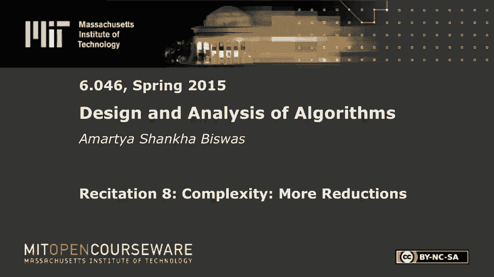
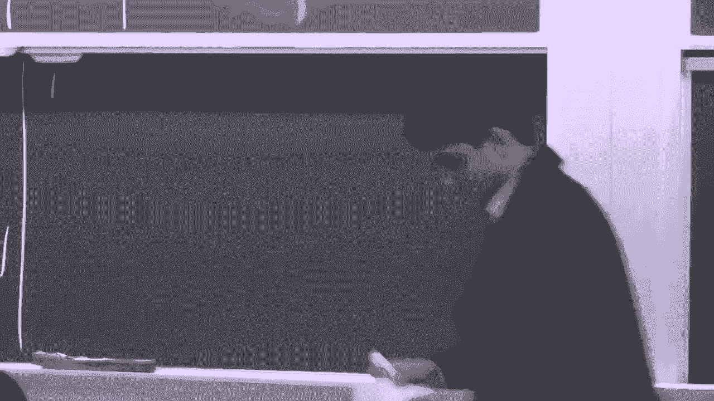
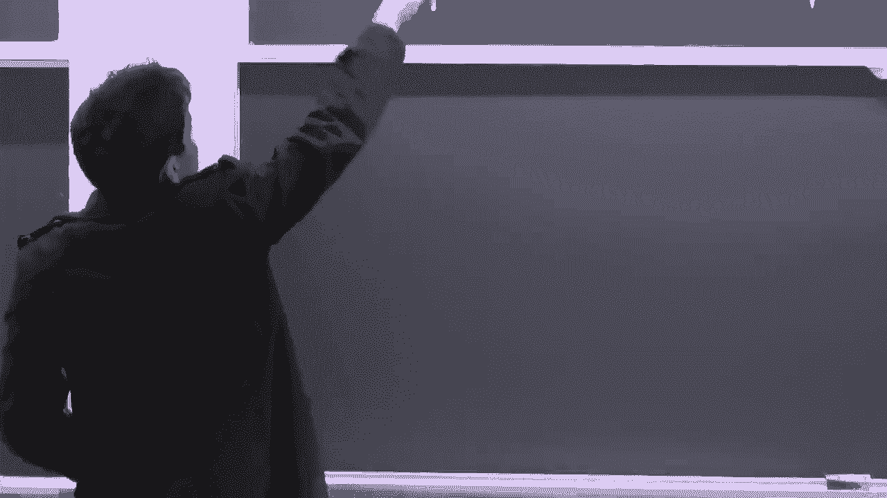
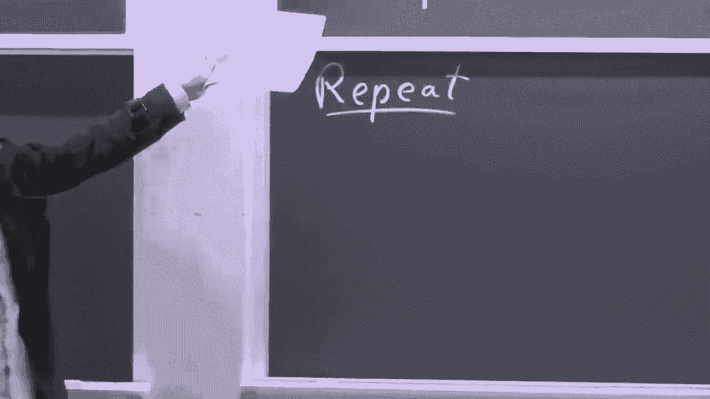
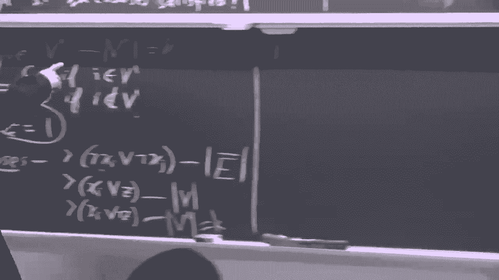
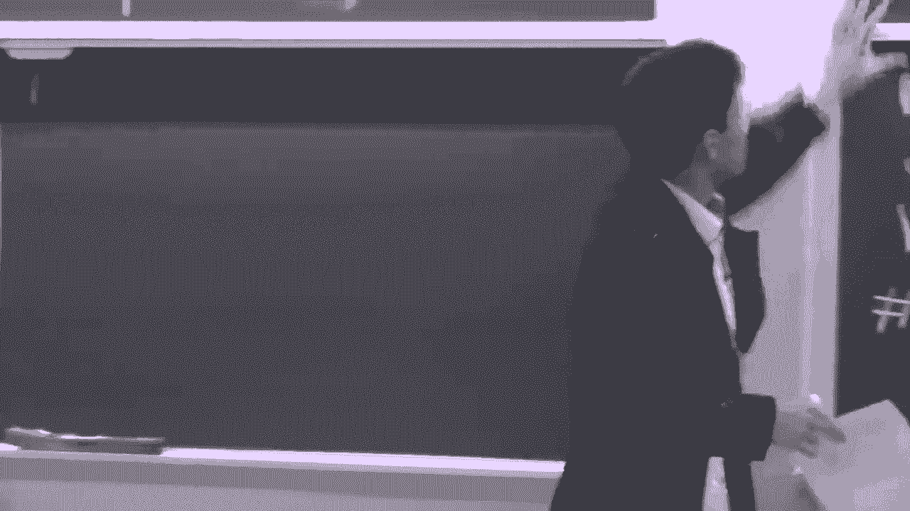
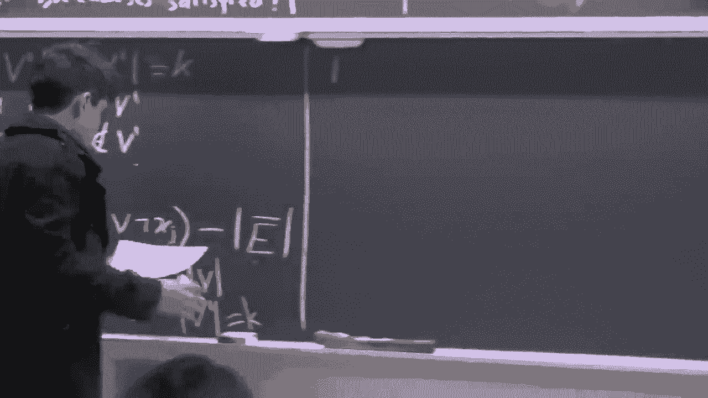

# 【双语字幕+资料下载】MIT 6.046J ｜ 数据结构与算法设计(2015·完整版) - P23：R8. NP完全问题 - ShowMeAI - BV1sf4y1H7vb

The following content is provided under a creative Commons license。

 Your support will help M I T Opencourseseware continue to offer high quality educational resources for free。

To make a donation or view additional materials from hundreds of MIT courses。

 visit M T OpenCourseware at OCw。 MT。 Eu。

Okay， let's start。 So today， we are gonna do some N hardness reductions。

 So let's just do a quick recap of P and NP P， so。So， B is。Save a decision problem。

 So you have an input X， and you have some little algorithm A and spits out an answer， which is。

Either 0 or one。 So that's the decision problem。 And if the problem is in P。

 the algorithm A runs in polynoial time。So what about MP？

So N P is when the solution is verifiable in polynomial time。 So let's say you have an input X。

And some Oracle， which is script you can run an exponential time or as infinite computation time。

 gives you an answer。So you， you get x， and you get an answer， which is either 0 or 1。

And you also get a certificate。So let's call you have a certificate。 And given these three values。

 you can， you can verify whether the solution was correct or not in polynomial time。Makes sense。

So clearly， if you can compute the answer in polynomial time， you can also verify in polynomial time。

 So P is a subset of N。嗯。So that's it。 Okay， So now MP heart problems are problems that are at least as hard to solve as any problem with N。

And so now were today even going some reductions。 So I think we did some in class Nintendo games or something。

That what we did。 Okay， so today we're gonna do some less interesting examples。 but let's see。So。

So how do we do reductions？ So if we know that we haven't， we have a problem A。

 which is a hard problem。And we want to show that problem B is hard。

So you want to draw this implication。So if you want to draw the simplication。

 So this is the equivalent to saying that if。嗯。If B is easy。Ven。A easy。There other way。

This is counter positiveitive。 So if we can， So assuming that B has a polynomial time solution。

 A has a polynomial time solution。 And that statement is equivalent to saying if A is hard B is hard。

 So if you know that A is heart problem MP P hard problem， we can say that B is MP heart problem。😊。

So first， we show， So if， if you want to show that B is an N hard problem。 first。

 we show that B is an N。 and then we show that B is hard。哎。So the way we do that。

 So the way we do this step is let's So your， So A looks like this。You have your blue algorithm。

 and it spits out an answer。And 0 to one。And B looks like this。Sa。You have an input why。

I put out' an answering。01。And。You want to find the function R。Which takes your x。

And sends it to why。So basically， if you know how to solve B very fast， then you can。

Take an input to a。You can so you take x。You transform it。And then you apply B。

And the condition is that。A applied to X is the same as B applied to R effects X。 So basically。

 what you're doing is you're showing that A is easy by showing that you can use。

 So let's say B is easy。 We can use B to compute A。 So then A must be easy。

But since we know that a is hard that there is something wrong in our logic。 So B must be hard。

Does that make sense。Yes。有。Anyway， so let's。Move on to。Let's move on to an actual problem。

 So the first problem we're gonna reduce is the Hamiltonian path。So one， so a well known MP。

So L an NP hard problem is the Hamiltonian cycle。 So here are8 is。So it's a Hamiltonian cycle。

 What's Hamiltonian cycle。 So a Hamilton cycle。 So let's say you have a graph。So this graph。

We'd brought this out。O。So Hamiltonian cycle is a cycle in the graph， which starts at some vertex。

 Visits all the other vertices and comes back to the starting vertex。 So in this case。

 we could do something like。Go here。And then take this vertex。Go take this vertex。

 take this vertex and come back here。So that is a valid Hamiltonian cycle。

 So this graph is Hamiltonian cycle。So。The decision problem is here that given a graph does it have a Hamiltonian cycle。

that problem is N hard。 So you can't， you can solve it poly normal real time。 So now the。

 the new problem that we will show is N hard。Which is B。Is Hamiltonian path。

So now we doing in path this is a very similar problem。 Instead of cycle。

 you just you require remove the requirement that you have to come back to the starting point。

 you can just start anywhere and。Visit all the vertices and stop。 So， for example。

 if you remove this edge， this graph no longer has Hamiltonian cycle， but it has a Hamiltonian path。

 which is just。This link。So okay， so， so this is a simple reduction because the problems are very similar。

 So the first step is， of course， saying showing that Hamiltonian pad is an NP。So。

So that should be pretty clear because so what is a certificate here。 So if someone says， okay。

 I've solve the Hamiltonian path。 and this is my Hamiltonian path。 So the Hamilton。

 and he gives you a certificate， which is the actual path。 So you can always look at the certificate。

 check the path and see if it's a valid path。 And then you can verify the answer in polynomial time。

😊，That's the linear time verification。So this is true。So now the show is。V is hard。

So maybe we do that is we do a reduction。 So the reduction is given an input to the original problem。

 A。 So let's say an input to a is in the form of a graph。So。And now you have transform this graph。

Somehow to G dashash。And then you have to argue that。So this is this is the transformation R。

And you have to argue that。The solution， the answer that this will sp out is the same as the answer that this was this will sped out。

 So let's look at the transformation first。 Anyone have any idea。 So let's say， so you have a graph。

And that's a new reason that is solved the Hamiltonian cycle problem。

So how do you transform it in a way that lets you cast into Hamiltonian path formulation？Not exactly。

 So you don't know So which edge would you remove。 You， you don't know theil。

 You can't find the Hamiltonian cycle。 Okay， important point。

 So theres no point doing this reduction unless this reduction is itself polynomial。

 because otherwise， this like whole strategy of transforming and then using B to find a doesn't work。

 because if if the reduction is exponential time， that doesn't help you。 So。

So if you if you remove some edges， you'll see that there is still a Hamiltonian cycle。

But if you remove some edge，Still it doesn't。 So you。

 you can't tell like that's so you don't know which edge to remove。

So a better way to do about that is this。 So let's say this is the rest of your graph。

 and you just look at one vertex。 So look at one vertex v。And let's say this is a directed graph。

 it's an undirected graph。 you can just add one edge there and one edge back for everything。

So now you add a directed edge along this。 sorry， you look at the all directed edges。

 So let's say you have some edges coming in。And there's some edge going out。So this is just a vertex。

 And you just look at the rest of the graph and look at all the edges coming in and all the edges going out。

 So this is an a。 This is the original problem。And you transform this。Into。

You split the vertex into two。So V dashash and V double dash， let's say。And in one of them。

 you keep all the incoming edges。And the other one contains all the outgoing edges。

Does that transformation make sense intuitively。So。What do you have here， So here you had。

 So let's say， let's say this graph had a Hamiltonian cycle。So this crafted some cycle。

 which like went up here， dude some did something and came back。So it would go like this。

 It would do the cycle and come back。 So it there was some cycle。 And since the cycle， it contains V。

So now what you're doing is you're splitting up V and disconnecting them。 So you you'll still have。

 if you look at the original path， it's still there。But it's， it's been split up into a path now。

 It's no longer a cycle。Vis。So now let's， let's argue this more rigorously。

So what we want to say here is that。Let's say there was a cycle here。If there was a cycle here。Then。

Is it clear that there is a path here？Because just take the same。

 Just take the same edges that you had before。If you take the same edges。

 they will now form a bat and service cycle。 So cycle implies bad。That makes sense。So。

The other way is a little more tricky， so let's say you have a path。Sa it okay。

So let's say you had a bath。So that meant that that means that so let's draw this， redraw this。

s more clear。So you have this new graph。Well you have two vertices。V dashash and V double dash。

This has a bunch of incoming edges。And there's a bunch of outgoing edges。所呢。

Let's say you have a Hamiltonian bat in this graph。So what does that mean， So where。

 where can the Hamiltonian path start。Can it start anywhere。We're going to start。Rise。

 because V double prime doesn't have any incoming edges。 So it can't be in the middle of the path。

 So it has to start here。 So it starts。 It does something in there。 And where can it end。

 It can only end similarly in V dash because V dash doesn't have any outgoing edges。

 So it can' be in the middle of the path。 So it has to end in V dash。So now。

 if you have a path like that。And you go back to this for， this is this graph。

So V and V dash V V dash and V double dash are now the same vertex。

 And that just that path just becomes a cycle Now。 So path implies cycle。

So that so now now what we have is previously what we had， right， So now we know that。

A of x or rather A of G here。Is equal to。B of G dashash。 So G dash with this transformation。Also。

 notice that the transformation was just splitting a apart of vertex。 So it'll like take。

 depending on your representation of your graph。 Itll take something like constant time will in your time or something polynomial。

 essentially。 So you get a polynomialile reduction， you。After reduction。

 you show that the answer to the reduced problem is the same as the answer to the original problem。

 And that means that this is this is also an NP hard problem by the argument。Questions。

Does that make sense。So are you gettingting super？No， just just one。

Just pick any vertex doesn't matter because you have a cycle。So if you take up。

 take any verex and split it apart， you get a path。N。Okay。Let's move on to the next one。So。So。

The next problem is。So。So given a graph， is there a cake click。

Does do people know what what a click is。Okay， so what so a click is this。

 So a click is a set of vertices。 So let's say C subset of V。

 So the set of vertices such that C is a complete graph。😊，So what is okay， let's just draw a diagon。

 that's really easier。Okay， so in this example。 So you have this graph draw the Okay， this one。So。

 look at。Look at this set of vertices。Every pair of them is connected to each other。

That means is that if you just look at， just look at the graph with these vertices。

 it's a complete graph。 But that's what's called the click。And in this case， this is a for click。

 So you have four vertices。 This is a fork click。So。So the decision problem is， given a graph。

 does there exist a quick？So this is， again， known to be an N heart problem。 So now we will use this。

To show that this problem is empty hard。So this problem is。Independent set。So。😔，Again。

 so given a graph， what is an independent set， Anyone want to explain。Okay。

 so what an independent said is this。 So let's say you have a graph， which looks like。

So kind of complementary through the definition of a click。

 an independent set is a set of vertices such that no pair of them has an edge between them。

 So in this case， if you took this vertex。Let's say you took this vertex。 You took this vertex。

 this vertex and this vertex。 So you can see none of these vertices have an edge between them。

So that is an independent set。So in this case， you are taking a set of vertices which have which is a complete graphs。

 all the edges between them。 And this case， you're taking vertices， which are completely is。

So now we're going try to find a reduction from this problem to this problem。So， first of all。

Independent C in N。 Is that clear。How would you show that。So how would you create a certificate。

 which would tell you that So how would someone create a certificate which would convince you in polynomial time that this is an en。

 that this is correct。So just， the certificate would be just give you the independent set。

And you can check if something is independent， So let's say。So， given。I。

 let's call the independent I。 So given a set of vertices。

You can verify that it's an independent set in polynomial time。 So just like。

 look at all pairs and check if there's an edge， just some n square N cube， whatever is polynomial。

 That's important， okay。So now let's look at the transformation。So。So again， as before， you have a。

 which is given by a graph。And you want to transform it to something。So。

 the important note here is that。Yin。In the click， you have。So if you have a click C。

 all pairs of ver disease is connected in in I， no pair of ver disease are connected。

 So what what should be a logical transformation that would map a click to an independent set。And。

What do you think you should do to the graph。So the click becomes an independent yeah。Reci。Yep。

 exactly great。 So what So what all you have to do is if you want to turn a click into into independent set。

 you just remove， you just invert the， you just， what is it， complement the adency matrix。

 So every edge that does not exist now exist and every edge that did exist is gone。😊，So。

You create a graph G dashash。With the same number brain vertices。

 except the edges are now complemented。 So the e bar just means the edges that were not。

 So lets let's just draw an example。 So let's say you had。And。And what does this become。

So let's draw the vertices first。Okay， let's go on by one。 So let's take this vertex so。

Let's take this predict。 And what edges does it have， So it goes here。 It goes here。

 It doesn't go here。 So we draw edge here。It doesn't go there。 You on another edge there。

And it doesn't go there。 So we run other edge there。Now， this vertex is connected to all of these。

 except this one。 So that means that there's an edge there。Let's take this vertex。

 It's connected to everything。 Oh， it's connected to everything。 Okay， let's take this one。

 It's connected to these two， Nothing else。 So we need to connect it to。This guy。

And I think that's it。 Yeah， Similarlyly， So proceeding， this is connected to everything except that。

 So I guess this comes there。And I think that's it， right， Or is there more3， Okay， No， okay。

 so that is the complementary graph， I think。 so you can probably verify that。

 So now let's look at the click in this graph。So this is the click。 This is the largest click rather。

 but this is a click。You can have other clicks。 Like， for example， this。

 these three things are also a click。So now look at what this is mapping to。

 So this is mapping to this vertex， this vertex， this vertex and this vertex。And you can see like。

 that's an independent set。So does that transformation make sense。

So now the proof should be intuitively clear。 So let's just go through it mild rigorously。

 So let's say you have a click here。So you a click here。For every pair of vertices in the click。

There is an edge between them。And so if that maps too， so let's say。Click C maps to。

So just maps to eye。So。For all。Uv。Ele of seat。You have。Uv。Element of E。So for every， so。

 if instance it's a click， for every pair of vertices， that that edge is in the original graph。

Which means that。Uv。Is not an element if。一。For all。You come a V。Element of I。So for every element。

 for every U V element if I， we have this。Which means that。Does that make sense。

So that means that this is the independent。 thats the independence set criterion。

So now we have So you reduce quick to independent set。

 And that means that independent set now might be hard。Okay， how are you on time。 Okay， let's。

 so now let's do a more complicated example。 Any questions on these two。嗯。Makes sense。Okay。So。

Lettraray this。It's short by era something。嗯m。嗯。So there's the next problem。So。As before， our A is。

几 quick。And well， so it says there's a click。Ratherize this in this way， click。Size。그'一드게。

So this a problem。 Is there a click of size greater than equal to K。And。B is。It's called Max2ad。

So what that means is that。So it is somewhat like normal two set， except。 So basically。

 you have some clauses。And you have some literals。So each of these literals can take values 1 or0。

And each of these clauses。Is something like。X I or X J。 And actually。

 there are going be knots in front of this。 So let's call， let's say X I， not X J。

Or kind be other things。 So it's， it's X I， not X J or not X I， X J， X I， not X J or X I。

 X J and so on and so forth。 So the just normal2 set。 So now the decision problem is to。

Does there exist in assignment？Such that。呃。Greater than equal to k。Qus。So that is a problem。

 So is there an assignment to literals such that。At least gay of these clauses are satisfied。

And so now were gonna show that it is with kick clicks。 Okay， is it an N P。

 So what is the certificate。So how would you， how would someone convince you that this problem。

 like there is a solution to this problem。喂。Yeah， so like give you an assignment of values to literals。

 And then you can go through all the clauses and check them。

 So if they give you like x 1 equal to 1 x equal x equals 0， x 3 equal to 1 and so on and so forth。

 you can then go through and check all the clauses and see if greater than K equald them are satisfied。

 So this is an N P。😊，So now let's try the reduction。So this other reduction goes。

Let's see so naturally you have gate click or greater than equals to gate click rather。

So that means you have a graph。With a set of vertices and a set of edges。And。Let's say。

 so let's say you have a click V dashash。sububid of V。And mod of meat dashes。Great than equal。

So now you want to somehow construct literals， construct clauses， which will reflect this behavior。

 So， first of all， this may not be clear right now。 But let's say we take some literals like this。

 So let's say we take X I。For all， for all I element of V。So for every vertex in the graph。

 we take a lit role。So we have， if the number of vertices n。

 we have n literals corresponding to each vertex。Also， we take。Dummy lital， Let's call it Z。

So now how do we add our clauses。 So the basic， the general idea here is that if。

 if a vertex is in the click， we will assign at one。 if it's not in the click， we will assign at 0。

So if we want， so basically， we want。 So everything outside outside of everything outside of the click is 0。

 So this clause。Not X。Or not Xj。So what is this what， what is the value of these class normally。

 So let's say X I and X J are both。Are both outside the click。So I and J both are static click。

 that means that this is both of than as0。 And so this is true。

What if one of them ones inside the click and the other one is outside。

 It's still true because one of these knots is one， and therefore， it's still true。

Let's say both I and J are inside the click。So you have， so in that case， you have。

X not of X I is0 and not of X X is also 0。 So this is that's the only case this is false。

 So the way we take care of that。 So we want to， were trying to maximize the number of crew clause in some sense。

 This is like a handba explanation of why were using this class。

 So what we do instead of taking all the X I X shape pairs is we just take X I X A such that。😊，嗯。

I comea J。Is not an element defeat。坐的在明州。Now， if you had the graph， which looked like this。Now。

And last'slie， we want to。34。So， you would take。Not x 1 and not x 4。

You would take node X 1 and N X 3， but you would not take no X 2 and N X 3。So what does that do。

 That means that if you follow the assignment according to the click rules。For。

 there are for every I， So if I N G are both in the click。This， this clause will not be included。

Does that make sense what set of classess you are taking。Okay， so let， let's continue。

 and it'll be itll probably hopefully be a little more clear。So。

The other sort of course we're going to take。Is X， I， R Z。And the other one is Xi or Nazi。

So the reason we're taking these is that if you wanted to max max2 set on this on this alone。

 you could just set everything to 0。 And that would give you a maximum。

 So to sort of like not do that。 So to sort of minimize the number of things that you set to 0。

You're doing this。 So this is， this is just hand wave V argument why you're doing this。

 So let's actually try to do some analysis on this。 So let's say we do this transformation。

 So do the clauses make sense。Does the first class make sense if you have。

 So you have not X I not X J for every I J， which is not in the graph。So how does this work？So。

 let's say， you have。呃。It's called B dashash。Such that。Size of V dashash is greater than equal to K。

Actually， let's， just， let's just make sizes be dash equal to K。

 So if you have a click of size greater than equal to K， of course。

 you have a click of size equal to K can just throw away some of the vertices。So you take。

 you take a V dashash such that this size is equal to K。 And you said X I is equal to one。

 So you said X I equal to。1， if。I this element of V dashash。0。If。Iyes not an element of B D。Ex done。

 so youd set everything in your click to be 1， everything outside to be 0。

 and let let's z equal to 1。So you are starting with the assumption that so you're showing one direction。

 So you're showing that given that there is a click of size greater than equal to k。

And now we are going to construct a max two set instance。

 which has the satisfied number of classs greater than equals to k。

And then we will show the other direction so。So now let's look at how many clause we have to be satisfied。

So。So the first first type of clause was。Not of Xi。呃。Or not of Xj。

So how many of these clause are being satisfied？So first case， I and J are both outside Vdash。

Is the class satisfied in that case。Yes， because you're， by definition， if theyre outside V dashash。

 they're both 0。 So the knots are both one。 So they're one。

 So if the I n J are outside V dash you're good。So what about the case when one of them is inside Vdash。

Is the class satisfied。So it yeah， because one of them is， one of， one of them is 0。

 which makes the not one。 And the whole thing is， it's an R。

 So it's let's say both of them are inside V dashash。Let's say both I and Jerry inside V Dash。

 Then this clause just doesn't exist， because。Of the condition that I J had not elements of V。

 because if it's inside the click。Then that edge obviously exists。 And therefore。

 this clause is not not in the set of clauses we are using。So essentially。

 every clause of this form will be satisfied。And how many clause of this form are there。

 The number of clause of this form is just e bar， where is the complementary edge set of that graph。

That's ebar。 Okay， Does that make sense？So。All right， next clause is X。Or z。

So since we have this took Z to be 1。This call is always satisfied。 So this just gives us model V。

Because every， this is for every eye。 So I should mention that。For all I， this is also for allI。

So for every eye， So that I have a number of Xs R V。 And that's it。So the third type of cause is。

X I or Na O Z。So not of z since z is 1， not of z is 0。

 So the only cases where this clause is true is where is when X is1。And Xi is one only inside V dash。

 So the number of qua satisfied here is。Moto B。And model Vdash as well。 It's just escape。

Can you see this。No。It， does that So all three colors make sense， so。

Can you see why the first one is， it's the size of E bar because all the claw are satisfied。

The second one。Also， all the clauses are satisfied because Z is one。 So that's every。

 every clause is just the number of vertices。And the last one。

 is's only satisfied for the cases where X I is one， and X I is one only inside the click。

 So that gives you the K things in the click。So now we can finish formulating our transformation。

 So our transformation was， you set。So what was transformation yes。 So these are。

 these are our clauses。 And now we have to set the K， right， So the max 2 side was。

With a condition of K。 So here you will set it to be。Moer fee bar。Plus， moto V。Plus key。

So that's make sense so basically。So our max 2at problem so the reduction to the max 2 problem。

 so we specified the clauses， we specified the litals literals were XI for all IV and the dummy Z。

We specify the clauses and specified the threshold we are trying to achieve。

So that so those three things completely specify the max 2 side problem。So。O， proceeding， so。

Observe that this this So we just showed one direction。

 We showed that if there' is a click of size greater than equal to K。

 we reduce this to a click of size exactly K。 then we did， then we did this assignment。

 and we showed that the total number of clauses being satisfied is mod v bar plus mod v plus k。😊。

And that is， that is the first direction。 So now we have shown that。

 So if you have a solution to click， we have a solution to K I max K I。

 So now we do the other direction。 So let's say we have a solution to。Maxki said。

那さるよ。Okay。Let's do this So here。So， let's say。呃。Okay， so this part is a little more tricky。

 So we start with max K S has a number of satisfied clauses。

 which is greater than equal to mod v bar plus V plus K。 So we know that So Max。

 we know that max S accepts。😊，We even to know that， so。We define。You define a V dashash。

Then this three dash is in the graph for click。As。The set of vertices I。Such that。

X of I is equal to1。So if our max saya has that many things， then there is some assignment to Xi。

 which satisfies that and we take that assignment and for every value that is one。

 we put that in a its not it's not a click yet， but its it's a click under construction So we make this click under construction and we assign at values of all the vertices which are currently labeled by one。

😊，But you don't know if that's a click， right， It could not be a click。 It could be something like。

 let's say this is the current V dash。So we dashash could be something like。

You have all these vertices。And they sounds， let's say some of them are connected。

 But then you have this dangling guy。 So this is not connected。 This is not connected。

 So it's not a click。So let's say， let's say this is vertex I and this is vertex J。

 And this whole thing is V dash。And let's say somehow you have this anomaly。

 You have that this guy is not connected to all the hertices。 So let's take one such pair。

And let's just say we remove， we remove X。So。We just take the X and remove from V dashash。

 what that equates to in the max case at is setting X to 0。

So we take the original satisfying assignment。And change the value of Xi。So。Let's see what that does。

So， we take。And set。は。いこと zero。And next I was originally one。So。's actually rate them。 So x。Ai。

Or rather。I got a g。Is not an element to。But。So。These I J were in the supposed to be click。

 but the I icona J is not in the edge set。 So it's not actually a click。

 So the way we resolve that is just like we do， we say， okay， let's。

 let's just forget about this vertex。 Let's say it just not in the click。 So we set an X I to 0。

 And what does that do。 Let's look at how that affects the number of sat clauses。So。The first one is。

X， R z。So now here we have not said the set Z to be 1。 This is。

 this has been like this is something in thing。 But we can just， we， if z is equal 0。

 we can just replace z by n of Z。 So like the clauses are symmetrical with respect to Z， right。

 So it's X I or Z or X I not Z。 So it doesn't matter which one these said to be1 or0。

 like one of is1， one of0。 So let's just say that Z is one without loss of generality。😊。

So what that does is。So initially， this clause was one because Z is one。

 And now it goes to one and nothing changes。 Okay， good。 sounds good。 Whatever the next one。

 So now we have X I。😊，Or。诶。Not of the。So however， it' not of Z0。

And X I just went from being one to being 0。 So what what happens here is that。

The initially the clause value was 1。And now， it goes to 0。So we。

 so that's not good because we just like， we could have now。

 now we are no longer satisfying max K app possibly because we had some number of satisfying clauses。

 which was above our threshold。 But now now we lose the clause。

 and we could be going below the threshold。😊，But then we look at the third class。

And what that does is。So let's let's say。 let's say we look at this specific clause。

 The one which said that X I and X G。I note that this clause exists because X， I， X J is not an e E。

And therefore， by that condition， this clause is exists in the set of clauses。

So what was the value of this clause initially。Before in the initial assignment。

 what was the value of this clause。Note that X I and J are both in V dashash。

So whats the value of that this clause in the original。Assignment。Before we set x to  zero。

What was the value of X I in the original assignment。So yes， why is it one。Yeah。

 so X I was in V dashash。That's why So it's one。 X X J was also in V dash because that。

 that's the anomaly we saw。 There was not an engine that click。 So this was originally。

 So this was one， and this was one。 So this was 0 and this was 0 and or 0 R 0 is this used to be 0。

So what happens now， though， Does it change。So it changes to one， right， because X I goes to 0。 Now。

 this thing becomes one。And so change to one。So there may be other clauses with X I。

 but realize that not of X is So if X is changing to 0， not of X is changing to1。

 So whatever happens here， itll only increase the number of clauses that are being satisfied。

So you lose only one， but you can， but you gain at least one so。Eventually。It does not change。

It does not change the number of satisfied clauses。So that's important。

 So what we did is we started with some satisfying assignments that we assumed existed。

 And then we just changed a variable。 And we said that its still at least as many clauses being satisfied。

😊，So we did that。 And now we have one less vertex that is， that is violating。

So we have now we have one less vertex that is violating the click property。So now we can。

 now we can take this step。 It's like setting X side to 0。 We can just repeat this。

So how long do we repeat this？So， we repeat this still。There are no longer any violations。

 So every time we find a violation。 So once we delete X I， So that this is gone。

So now we look for the next violation。 The next violation is。This edge。 So there's no edge there。

 So we can either take this ver text， So let's call this K。

 So we can either remove X K or remove X J。So we remove one of them。 And if you see。

 once you remove that， youll end up。ll line up with a three quick。

So what happens is once we repeat this until。V dash。Is。呃。So you could。

 does that make sense why you can do that。So just keep deleting vertices until this is a click。

 and that those， those clause， less class condition is satisfied。

 You still have greater than equal to div have many clause。So now let's look at what we have。

 We have V dashash。Which is the click。And。X I。Is equal to。So when is X equal。

 So once you have done this like process as many times as you need， when is X equal to one。

So remember that so V dashash is also being updated every time you set X to 0。

 X I is being removed from V dashash。 So that property is always satisfied that define V dashash equal to I for X I equal to 1。

 That property is always invariant。That means that even after doing all these re repetitions。

 you still have X equald one， if and only if。嗯。If and only if I Z and V Dash。And0 otherwise。

So does that make sense why that property still holds。So。You have a click。

And you have this assignment。 So that should tell take you back to this。

 So remember where we took a click of size K。 and we found that if you go through all the algebra。

 you will find something which is like。😊。

You will go through and you will get model Eda E bar plus mod V plus mod of K。Right。So， here。

You have a click。 So forget about what you did before。 So I just like consider。

 this is an assignment according to those rules。And those rules give。

 give you that you should get number。offff。Satisfied。Quass。Is equal to。Model fee bar。First。

 modelto V。Plus， motto V dash。Realize that V dashash here is not okay。

 Does that make sense because V dashash is just you started with some set。

 you started deleting some elements。 You throw through them very randomly。

 But you ended up with some V dash。 And by this argument。

You had E bar plus Mo V plus Mo V dash Ebar from this clause。

 V dash from V from this clause V dash from this clause。 So you end up with this。

 And you know that because of， because of what we showed here。

 it does not change the number of satisfied clauses。 it's still grey than equal to。Mo fee bar。Plus。

 moif。V plus k。And you cancel this， you cancel this。And you get。You get model V dashash。

Is greater than equal to K。Which means that。Which means that you have a click of size greater than equal to K。

Questions。Does that make sense。Really often。Okay， it's good。Any case， so。

So let's go back and see what we， what we are doing here。

 So the way you're doing it with N reductions is N hard reductions is you take a problem that you already know is hard。

You take any random in， any arbitrary instance， instance of that problem。And you transform the input。

And into an input to the problem that you're trying to show is hard。So you take problem A。

 which you know is hard。 It transform the input into an input for problem B。And then， you show that。

If you can solve the top problem B。You would be able to solve problem。

But since you know you can't solve problem A in polynomial time。

 you know that you can't solve problem B in polynomial time。

And the and the other important thing to notice here is that the reduction needs to be polynomial then。

 So let's look at this reduction。 for instance， what are you doing here， You're taking。

 you're taking every vertex。 You're making a clause and how many clause do you have。 Well。

 you have about n square clauses here。You have our n clauses here and you have our R clauses here。

 So time to construct that is like roughly our n squared。

So you're constructing the causes in polynomial time。 So you have a polynomial time reduction。

And if you reduce a known N hard problem in polynomial time to an unknown problem。

 you can show that as N hard。

Okay， I don't think we have time to do another problem。 So here。

