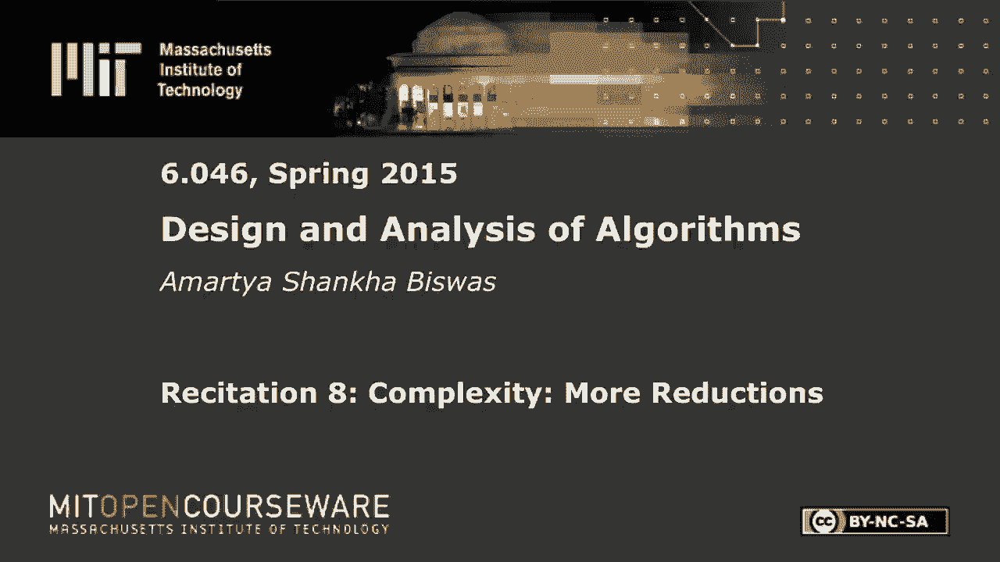
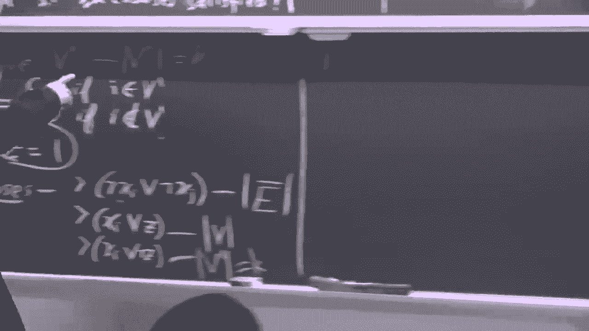

# 数据结构与算法设计：P23：NP完全问题

在本节课中，我们将学习NP完全问题的概念，并通过几个具体的归约示例，来理解如何证明一个问题是NP难的。我们将从哈密顿回路问题出发，逐步归约到哈密顿路径、独立集以及最大2-SAT问题。

## P与NP概念回顾

上一节我们介绍了P和NP的基本概念，本节中我们来看看它们的精确定义。

P类问题是指那些可以在多项式时间内被确定性图灵机解决的决定性问题。形式化地说，对于一个决策问题，如果存在一个算法A，对于任意输入x，都能在多项式时间内输出答案0或1，则该问题属于P。

NP类问题是指那些可以在多项式时间内验证其解的正确性的问题。具体来说，给定一个输入x、一个证书（即一个可能的解）以及一个答案（0或1），存在一个多项式时间的验证算法，可以确认该答案是否正确。

显然，任何能在多项式时间内解决的问题，其解也必然能在多项式时间内被验证，因此P是NP的子集。

## NP难问题与归约

NP难问题是指那些至少和NP中的任何问题一样难的问题。证明一个问题B是NP难的标准方法是进行“归约”。

归约的核心思想是：如果我们已知问题A是NP难的，并且能在多项式时间内将A的任意实例转化为问题B的一个实例，同时保证两个实例的答案一致，那么我们就可以说问题B也是NP难的。因为如果B能在多项式时间内解决，那么A也能在多项式时间内解决，这与A是NP难的事实矛盾。

用公式表示，即：若存在多项式时间归约函数R，使得对于A的任意实例x，满足 `A(x) = B(R(x))`，且已知A是NP难问题，则可推出B也是NP难问题。

## 从哈密顿回路归约到哈密顿路径

首先，我们来看一个相对简单的归约：从已知的NP难问题——哈密顿回路问题，归约到哈密顿路径问题。

哈密顿回路是指在给定的无向图中，找到一个经过每个顶点恰好一次并最终回到起点的环。哈密顿路径则只要求经过每个顶点恰好一次，但不要求回到起点。

以下是证明哈密顿路径是NP难的步骤：

1.  **证明哈密顿路径属于NP**：这很简单。如果某人声称找到了一个哈密顿路径，他只需提供这个路径序列作为证书。我们可以在多项式时间内（例如线性时间）遍历该路径，检查它是否访问了每个顶点恰好一次，且相邻顶点间均有边相连，从而验证答案的正确性。

2.  **通过归约证明其是NP难的**：我们已知哈密顿回路是NP难的。现在，我们构造一个从哈密顿回路实例到哈密顿路径实例的多项式时间归约。
    *   **归约方法**：给定一个哈密顿回路问题的输入图G，我们通过“分裂”任意一个顶点v来构造新图G‘。具体做法是：将顶点v拆分为两个新的顶点v‘和v’‘。将原来所有指向v的边（入边）都指向v‘，将所有从v出发的边（出边）都改为从v’‘出发。
    *   **论证等价性**：
        *   如果原图G存在哈密顿回路，则该回路必然经过顶点v。将回路在v处“切断”，就得到了一条从v‘’开始，到v‘结束的哈密顿路径。因此，G‘存在哈密顿路径。
        *   反之，如果新图G‘存在哈密顿路径，由于v’‘只有出边没有入边，它必须是路径的起点；同理，v’必须是路径的终点。将这条路径的起点v‘’和终点v‘重新合并为同一个顶点v，就得到了原图G中的一个哈密顿回路。
    *   这个分裂顶点的操作可以在多项式时间内完成（例如，与顶点度数呈线性关系）。因此，我们完成了一个多项式时间归约，证明了哈密顿路径问题也是NP难的。

## 从团问题归约到独立集问题

接下来，我们看一个基于“互补”思想的归约：从团问题归约到独立集问题。

团是指图中的一个顶点子集，使得该子集中任意两个顶点之间都有边相连（即该子集构成的子图是完全图）。独立集则是指一个顶点子集，其中任意两个顶点之间都没有边相连。

以下是证明独立集是NP难的步骤：

1.  **证明独立集属于NP**：证书就是给出的独立集顶点列表。验证算法只需检查列表中每一对顶点之间是否都没有边相连，这可以在多项式时间（如O(n²)）内完成。

2.  **通过归约证明其是NP难的**：我们已知团问题是NP难的。现在构造归约。
    *   **归约方法**：给定一个团问题的输入图G，我们构造其补图G‘作为独立集问题的输入。补图G’拥有与G完全相同的顶点集，但边集恰好相反：在G中相连的顶点在G‘中不相连，在G中不相连的顶点在G’中相连。
    *   **论证等价性**：图G中存在一个大小为k的团，当且仅当在其补图G‘中存在一个大小为k的独立集。因为一个顶点子集在G中两两相连（构成团），等价于该子集在G’中两两不相连（构成独立集）。
    *   构造补图只需遍历原图的邻接关系，是多项式时间操作。因此，独立集问题被证明是NP难的。

## 从团问题归约到最大2-SAT问题

最后，我们看一个更复杂的归约：从团问题归约到最大2-SAT问题。最大2-SAT问题是：给定一组由两个文字（变量或其非）构成的子句，是否存在一种对变量的赋值，使得至少满足K个子句。

以下是证明最大2-SAT是NP难的步骤：

1.  **证明最大2-SAT属于NP**：证书就是给出的变量赋值方案。验证算法只需将赋值代入每个子句，计算满足的子句数量是否至少为K，这显然是多项式时间的。

2.  **通过归约证明其是NP难的**：我们已知“是否存在大小至少为K的团”这个问题是NP难的。我们将构造一个归约，将团问题实例转化为一个最大2-SAT实例。
    *   **变量设置**：对于团问题输入图G的每个顶点i，我们创建一个布尔变量x_i。另外，创建一个辅助变量z。
    *   **子句构造**：我们构造三类子句。
        1.  对于图中每一对**没有边相连**的顶点(i, j)，添加子句：(¬x_i ∨ ¬x_j)。这个子句的含义是，这两个变量不能同时为真（即这两个顶点不能同时被选入团中）。
        2.  对于每个顶点i，添加子句：(x_i ∨ z)。
        3.  对于每个顶点i，添加子句：(x_i ∨ ¬z)。
    *   **阈值K‘设置**：设|V|为顶点数，|Ē|为补图的边数（即原图中不存在的边的数量）。我们设置最大2-SAT的阈值K‘ = |Ē| + |V| + K。
    *   **论证等价性（方向一）**：如果图G有一个大小至少为K的团S。我们构造赋值：对于属于S的顶点i，设x_i = 1；否则设x_i = 0。设z = 1。计算满足的子句数：
        *   第一类子句：因为S是团，其中任意两点在原图中都有边，所以对应的“无边”子句不存在。对于其他顶点对，根据赋值（至少有一个为0），子句(¬x_i ∨ ¬x_j)恒为真。故所有|Ē|个此类子句均满足。
        *   第二类子句：因为z=1，所有|V|个子句(x_i ∨ z)恒为真。
        *   第三类子句：只有当x_i=1时，(x_i ∨ ¬z)才为真。满足的子句数等于团的大小|S| ≥ K。
        因此，总满足子句数 ≥ |Ē| + |V| + K = K‘。
    *   **论证等价性（方向二）**：如果最大2-SAT实例有一个赋值，使得满足至少K‘个子句。我们定义集合S = {顶点i | x_i = 1}。S可能不是一个团。我们通过以下“修复”过程，在不减少满足子句总数的前提下，将S变为一个团：
        *   如果S中存在两个顶点i, j之间没有边（即违反了团的条件），那么子句(¬x_i ∨ ¬x_j)存在于第一类子句中。在当前赋值下（x_i = x_j = 1），该子句取值为假。
        *   现在，考虑将x_i的值从1改为0。这会导致：
            *   第三类子句(x_i ∨ ¬z)从真变为假（损失1个满足的子句）。
            *   第一类子句(¬x_i ∨ ¬x_j)从假变为真（增加1个满足的子句）。
            *   其他包含x_i的子句，由于x_i变为0，¬x_i变为1，只会增加或保持满足的数量，不会减少。
        *   因此，这次修改**不会减少**总的满足子句数。我们不断重复此过程，移除S中所有导致“无边”的顶点对中的一个，直到S中任意两点都有边相连，即S成为一个团。设最终团的大小为|S|。
    *   根据最终赋值，满足的子句总数可以计算为：|Ē|（第一类全满足）+ |V|（第二类全满足）+ |S|（第三类满足数）。已知这个总数 ≥ K‘ = |Ē| + |V| + K。两边消去|Ē|和|V|，得到|S| ≥ K。因此，我们得到了原图G中一个大小至少为K的团。
    *   这个归约过程中，构造的子句数量是多项式级别的（O(|V|²)），因此是多项式时间归约。

## 总结

本节课中我们一起学习了NP完全问题的核心证明技术——归约。我们通过三个具体的例子：
1.  从**哈密顿回路**归约到**哈密顿路径**，展示了如何通过修改问题实例的结构（分裂顶点）来建立等价性。
2.  从**团问题**归约到**独立集问题**，展示了利用互补图这一巧妙变换进行归约。
3.  从**团问题**归约到**最大2-SAT问题**，展示了一个更复杂的构造性归约，其中涉及变量设置、多类子句构造以及一个维护满足子句数不变的“修复”论证。

这些例子阐明了证明一个问题是NP难的关键：找到一个已知的NP难问题A，设计一个多项式时间的转换函数，将A的任意实例映射到问题B的一个实例，并证明两个实例的答案一致性。掌握归约方法，是理解计算复杂性理论中问题难度分类的基础。