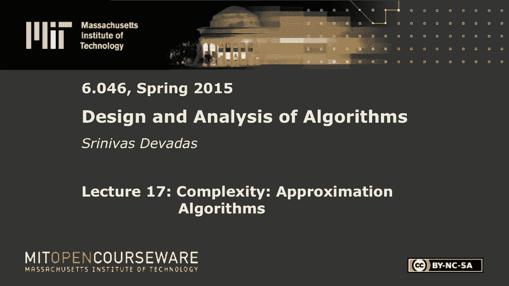
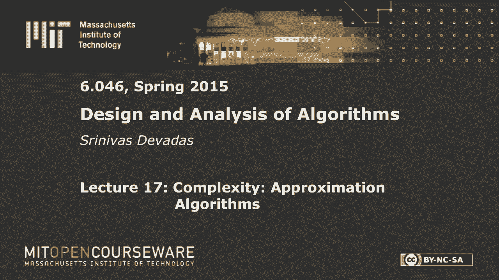

# 【双语字幕+资料下载】MIT 6.046J ｜ 数据结构与算法设计(2015·完整版) - P24：L17- 复杂性：近似算法 - ShowMeAI - BV1sf4y1H7vb

以下内容是根据知识共享许可提供的，您的支持将有助于麻省理工学院开放课件。

继续免费提供优质教育资源。

捐赠或查看麻省理工学院数百门课程中的额外材料。

让我们开始吧，谢谢你来听讲座，现在有一个小测验，参加这次讲座将有切实的好处，也不是飞盘，好的，我们很快就会知道的，所以两堂关于近似算法的课，一个今天一个，我想从今天开始一周零两天，星期四休息后。

埃里克会给那个，所以这更像是一个介绍性的讲座，Eric谈到了NP完全问题和NP难题，他谈到了如何证明问题是NP完全的或NP难的，那么当你发现一个问题是NP完全或NP困难时会发生什么，有各种各样的策略。

你可以放弃，说这很难解决，我想要一份不同的工作，你可以说我会尽力而为，我可以没有任何理论上的保证，我要用一个启发式，我会想到最简单的贪婪启发式，我要把它编码，我要继续前进，或者你可以做近似算法，你可以。

你可以说我会想出一个有趣的贪婪的启发式，但我要证明这种贪婪的启发式，在每一种可以想象的情况下，将在最优右的某个因子内，这就是我们今天要做的，我们要取一堆NP完全问题，我们要，这些问题的简单启发式。

解决这些问题的多项式时间的简单策略，解决这些问题意味着什么，嗯，你知道如果是多项式时间，你不能保证每次都得到最佳答案，你会称之为解决方案，近似解，因为每一个可能的输入都在2倍以内，这是一个例子。

你有一个更复杂的近似因子，我们稍后会讨论，在那里它不完全是二的因素，对于小尺寸问题，它可能是2的因子，对于更大的问题，它可能是十倍，等等，等等，然后最后一件事是，如果你能花更多的时间得到更好的解决方案。

那就太好了，这些是近似方案，我们也会看一个近似方案，对呀，所以只要潜入这些问题中的每一个，取决于它是否决定，我们的优化是NP完成还是NP困难，我将边走边给这些问题下定义。

但基本上这里的游戏名称是抓住一个问题，定义它想一个有趣的启发式，做一个证明，好的，这就是我们要做的三次，好消息是，证明不是火把，它们不是三十分钟的证据，他们应该很直观。

我们看看能不能把它们从你身上提取出来，痛苦的提取过程，我昨天去看牙医了，不是为了提取，我应该说我昨天去看牙医了，我现在要拿你出气，好的，那么什么是近似算法呢，一种算法，对于大小为n的问题。

所以它将被参数化，近似因子也可以参数化，如果不是那样就好了，这是一个常数因子近似，但有时你做不到，事实上，有时你可以证明常因子近似算法不存在，如果它们这样做了，那么p等于np对，所以它变得非常有趣。

所以在这种情况下，近似算法或方案存在于这三个问题中，这就是为什么我们今天要看他们，但你有一个大小N的问题，我们要定义一个近似比，如果对于任何输入，抱歉，打扰一下，算法产生一个解，费用c，满足这个小属性。

也就是说c的最大值除以c，选择除以抱歉，C除以C小于或等于Rho n右，是因为你没有说，不管是最小化问题还是最大化问题，对呀，所以这是一个最小化问题，你不想比最小值大太多，如果是最大化问题。

你不想比最大值小太多，所以你只要把这两个东西放进去，你不用担心它是最小还是最大，在目标函数方面，你希望它在那个特定的比例，我刚才说的是N排，所以这可能是一个常数，也可能是n的函数，如果它是n的函数。

是n的递增函数，否则你可以绑定它，让它有一个常数，很明显，所以你可能会有这样的东西，我们将看到一个log n近似方案，也就是说你将在答案的对数范围内，最低或最高，但如果是一百万。

那么如果你做基数2的日志，那你就知道你在20倍以内，这不是很好，但我们只能说我们对此很满意，然后如果它达到十亿，它是30的因子，以此类推，以此类推对，所以它可以生长，所以这是一个算法。

如果这些术语可以互换使用，我们会试着区分，但我们确实有一个叫做近似方案的东西，和，近似算法和近似方案的最大区别是，我将在一个近似方案中有一个小旋钮，这会让我做更多的工作来得到更好的东西，好的。

这就是一个方案的本质，我们将接受一个输入，附加输入，计划，是一种近似方案，而不是一种算法，所以这里我们说这是一个行n近似算法，如果它满足此属性，这里我们有一系列参数为n的算法。

在运行时和Epsilon方面，所以你可能会有这样的情况，你把命令n提高到q，除以ε，运行时间，对于近似算法，这意味着如果你在最佳的10%以内，然后你要把第一点放在这里，这将是一个n提升到20的算法。

多项式时间奇妙，解决世界问题，不是真的，我是说20分钟很糟糕，但不是指数级的，对了，所以你看到有一个，这里有一个关于Epsilon的多项式增长，这是一个相当快的增长，如果你想去Epsilon等于零点。

一个甚至n增加到20可能是站不住脚的，但肯定n提高到两百是完全站不住脚的，对，这就是所谓的P任务，也就是，近似格式，也不要太担心概率，这是Epsilon的函数，这就是你想要的思考方式，运行时。

我们将研究一个特定的方案，在讲座的后面，但很明显这是n中的多项式，好的，但在Epsilon中不是多项式，所有的权利，所以p tas是n中的多边形，但不一定，在Epsilon中，我说不一定。

因为我们仍然称之为P任务，我们就说完全多项式时间逼近格式，FP任务，如果它在n和1上都是多项式，对，所以完全p任务，1/Epsilon，所以一个完全的ptas方案应该是n除以epsilon平方，好的。

所以当Epsilon缩小时，很明显，运行时将会增长，因为你有一个在Epsilon广场上，但它没有任何地方那么糟糕，n升到2除以Epsilon的增长率，所以有很多NP完全问题都有P任务。

他们中的一些人也有FP任务等等问题，概率是多少，所以我们今天就不讨论这个问题了，但你可以把它想象成，你有什么可能的解决方案，你可以，你可以分配输入的分配，底线是我们今天实际上不会涵盖这一点。

所以让我们把它搁置到下节课去吧，好的，所以只要担心这个事实，第一部分不是在Epsilon，第二部分是n和ε的多项式，好的，哦，我明白了，所以这是一个很好的观点，所以为了这个讲座的目的，非常感谢。

我很高兴我不必进入那个多项式时间，好吧，不管怎样，最好回答，我们不打算报道这个，所以它是多项式，我的意思是你可以有概率算法有这种行为，当然啦，但我们今天的课就不讲这个了，但谢谢你指出这一点，埃里克。

这就是我们的设置，我们基本上有，一个很棒的情况，如果我们能用这把锤子解决NP完全问题，对呀，到目前为止还有什么问题吗？顶点覆盖，所以让我们直接潜入，谈论一个特定的问题，非常简单的问题。

你得到的是一个无向图，我们想要的是一组覆盖所有边缘的顶点，所有的边，覆盖是什么意思，这是显而易见的事情，如果我有这样的东西，只要我的顶点集中有一个顶点，我称之为覆盖，它触及边缘的一个端点。

我们将把那个边缘称为覆盖，好的，在这种情况下，很明显顶点覆盖是简单的，因为那个顶点碰到了所有的边，至少在其中一个端点，顶点将接触边的一个端点，但是我阴影的这个顶点覆盖，触碰每一个边缘，这是顶点覆盖。

如果事实上我在这里有额外的优势，然后我现在必须选择一个或这个或那个，为了完成我的封面，好的，就是这样，顶点覆盖，决策问题和NP完成计算，如果有某个数字低于某个值，做覆盖的。

你显然有一个与之相关的优化问题，等等，这就是我们第一个难题的简单设置，好吧，所以把它写出来，查找子集，素数，它是大写V的子集，这样，的g属于e，我们要么有u属于v素数，要么有v属于v素数。

或者两者兼而有之，很有可能你的顶点覆盖是这样的，对于给定的边，您有两个顶点接触边缘的每个端点，和优化问题，这是我们想做的，这里是找一个v素数，我们还不知道一种多项式时间算法来解决这个问题。

所以我们求助于启发式，什么是这个问题的直观启发式，假设我想为这个问题实现一个多时间贪婪算法，你首先想到的是什么，是啊，是啊，去吧，求最大度，我喜欢这个答案，答案不对，但是对于这个问题，但我喜欢它。

因为它让我，因为我在上课前做了这些工作，好的，所有的权利，这不是一个不正确的答案，这真的不是最好的答案，根据你应用的启发式得到近似算法，所以我们仍然在近似算法的上下文中，不是近似方案。

我们这里有一个非常好的启发式，谁知道它在实践中可能会更好，然后我将要讨论并证明的另一个近似算法，但事实是，这种近似算法，作为一种启发式，它可以不断地选择最大度，在完成顶点覆盖时，通过不断地选择最大度。

这意味着我可以构造，那个例子就在上面，还有一个例子，在这个特殊的启发式，最大启发式可能从最优注销n，而，我们将要讨论的另一个计划，将在最佳的两倍内，不管您应用正确的输入，所以你在这里有统治地位。

关于这两种近似算法，你有一个是log n，行n是log n，正如我在那里定义的那样，另一边你答对了两个，所以如果你是个理论家，你知道你要选什么，你要选两个，现在事实证明，如果你是一个从业者。

你可能真的选对了这个，但你知道这是一个理论诅咒，那么这里是怎么回事，嗯，这是一个炮制的例子，向您展示，最大程度启发式可以，好吧，如果你看看这里发生了什么，你最终，你在上面有一堆顶点，好的，你最终和。

顶部的k个阶乘顶点，所以k等于三，在这种情况下，所以我在上面有六个顶点，我这里有两个，因为这是6除以3，因为k是三，然后我得到6除以3，所以这是两个，6除以1，所以这是六个，好的。

所以这些边缘是以这样一种方式设置的，这是一个病理上的例子，在近似算法方面说错了，我马上就纠正自己，以对数n表示，它确实随着图形的大小而增长，但我会准确地告诉你，这个近似算法是根据行n因子在一分钟内。

但是让我们来看看这个问题，看看当你应用这个最大程度启发式时会发生什么，对呀，我们必须考虑到这样一个事实，如果你有最大程度的联系，你最终可能会做错误的事情，因为你还没有定义什么是抢七。

当有两个度数相同的节点时，您可能会做错误的事情，为这个特定的问题选择错误的节点，对呀，你得做最坏的情况分析，所以在最坏的情况下，当您使用最大度创建顶点覆盖时，最坏的情况是什么。

根据我们为这个特定示例选择的顶点数，就顶点数而言，最坏的情况是什么，是啊，是啊，后面十一点，你从哪里得到的，把下面的都抓起来，太奇妙了，好的给你，你能站起来吗，哇哦好吧，昨天是牙医，完全正确，完全正确。

所以可能发生的是，你可以选这个，因为那是三级，注意这里的最大度数是任意节点的三个，所以如果我选择三级的东西，我很好，我符合我的启发式，我可以挑出所有顶部的，对呀，然后我就做对了，那是个好主意。

那是个好办法，这是一个很好的轨迹，但我所说的是启发式是最大程度的，所以没有什么能阻止我选择这个，一旦我选择了，我可以选这个，然后我只剩下一次，我把这两个带走了，请记住，现在整个图中的最大度数是2，对呀。

因为我每一个都在失去一个学位，从它的程度上失去一个，当我走的时候，所以我可以选这个，这个这个等等，所以我可以得到11个，好的，所以如果你去做，很快地做数学，这是正确的地方，我在阿尔戈之前说的话。

所以解和顶部顶点是最优的，最优，根据我的参数图，这是k阶乘，这是这个图的最优解的k阶乘，但如果我选择那些在底部的，然后是k阶乘除以1/k加1/k，减一哒哒哒加一，也就是我们的谐波数，这大约是k阶乘。

log k，好的，这就是我说错的地方，我一直在说log n，log n，但这并不完全正确，因为如果我把n看作输入的大小，k阶乘是n对，所以如果你看到我在这里有log k，然后呢，这是log k。

其中k阶乘等于n，所以还有另一个对数因子，粗略地说对了，所以把它近似地看作是log，log，n近似值，好的，所以这是相当不错的，但它确实随着N对而生长，关键是这只是随着n增长。

所以这不是你能想到的最好的近似方案，因为近似因子随着问题的大小而增长，那就太好了，如果我们能想出一个常数因子近似方案来击败这个方案，当然从理论的角度来看，但是这个最大度，很有可能，如果你是一个从业者。

这就是你的代码，不是我要描述的那个，好的，但我们要分析我描述的那个，我刚刚向你们展示了一个例子，在这个例子中，你有一个log k因子，但我们还没有做一个事实的证明，没有比这更糟糕的例子了，好的。

所以我只是在这一点上声称，这充其量是一个log k近似算法，我们实际上已经证明了它实际上是一个log k近似算法，充其量，这是确定的，有什么问题吗？所有的权利，那么另一个启发式是什么。

做顶点覆盖的另一个启发式是什么，我们选择了最大程度，又好又简单，但对我们来说不太成功，任何其他想法，所以我选择了顶点，我还能选什么，我可以挑出正确的边缘，所以我可以选择，我可以随意挑选边缘。

从理论的角度来看，这实际上更有效，所以我们要做的就是把盖子，为空，继续把所有的边都设置成e素数，然后我们要迭代，在这些边缘，我甚至没有指定我要选择这些边的方式，我仍然可以证明两个近似，哦。

我忘了最精彩的部分，这是你的测验，对呀，这是参加讲座的切实好处，把它抄下来，所以这很简单，它是，这不是一个，将特别复杂的启发式，你只要做一些选择，然后在图上迭代，你从图表中拿走一些东西。

通常你去掉顶点和边，你一直往前走，直到你什么都没有了，然后你看你的封面你说我的封面有多大，所以我不会在那上面花任何时间，大家可以看一下，这是一个简单的迭代算法，随机选择边缘并继续前进，好的。

所以现在是有趣的部分，也就是，我们需要证明这个小算法总是在2的因子内，最佳的，好的，您可以使用这个示例，作为一个，事实上，在这种情况下，你有6个和11个，所以这是两个因素，当然啦。

所以即使是这个算法也比两倍好，但如果我扩大图表并增加K就不会了，但我上面的算法总是在2倍内，我们想证明，那么我们如何证明我，我们特别想证明大约顶点覆盖，是两个近似值，我如何证明这样的事情，你觉得在哪里。

这个2的因数来自一个还没有回答的人，你过去回答了很多问题，对不起，我只是这是个很好的观察，观察到我们选择的边缘并不相交，所以我给了你一个飞盘因为你答错了，所以对于这个正确的，我想给你一个公平的现在。

那是不公平的，就在那里，你去，对不起，所以关键的观察在这个算法中，我要去挑边缘，边不会共享顶点，是的，因为一旦我选择了一条边，我就删除了顶点，正确，所以边不可能共享顶点，那么这意味着什么呢，嗯。

这意味着我得到了，假设我得到了，边，所以让一个表示，被挑出来的边缘，所以我要得到看起来像这样的边缘，好的，我得到了一个边的基数，我知道在我的顶点封面里，显然我必须选择覆盖所有边缘的顶点，现在我在挑边缘。

发生了什么事？当然，我选择了两个A顶点，所以我记得我的成本是，我选择了与最佳成本相对应的C，所以这个算法产生的成本是一个权利的两倍，这是有道理的，因为我在挑选顶点，我们在挑边缘，没有重叠。

因此费用是权利的两倍，所以只要我现在能说C选择，哪一个是最优的小于或等于一个权利，我有我的因子二近似算法，对呀，原来如此，这是一个简单的论点，说现在展示，至少有一个C选项。

我在尽量减少C OP至少应该是一种权利，2。我希望我刚才就说过，但我把它写在这里是正确的，所以如果我说C opt至少是一个，然后我得到了我的，我在这里得到了两个近似的证明。

因为我得到了两个一个回来的权利，所以如果你看c除以，所以这意味着，当然C小于或等于两个C选择，如果我能展示，发表那份声明，事实证明，这是一个相当容易争论的说法，仅仅因为顶点覆盖的定义，记住。

我得把每一个边缘都盖住，正确，所以我要掩护，需要覆盖，每条边，A是边的子集，我得把所有的边缘都盖住，很明显，你必须覆盖A边缘，它是所有边的子集，对呀，我要如何覆盖所有的A边，就顶点而言。

它们碰巧都是不相交的，我要为每条边挑一个顶点，对呀，我是说我可以选这个或那个，但我得从他们中挑一个，2。我可以挑这个，也可以挑那个，等等，以此类推对，所以很明显，给定对应于，C选择大于或等于，就是这样。

所以我必须满足所有这些要求，自从，没有两条边共享一个端点，这意味着需要选择一个不同的顶点，从一个，这意味着，C选择大于或等于所有权利，对此有什么问题吗，我们在这里都很好，是的，理解了证明。

这是我们的第一个近似算法，我们实际上有一个证明，所以这有点酷，这显然是一个非常简单的算法，你保证在两倍以内，并不意味着这就是你能想到的最好的启发式，并不意味着这就是你的代码。

但这是我们要讨论的最好的近似算法，顶点覆盖，好的，其他问题，世界的近似值是什么状态，有很多NP完全问题和NP难题，我们知道近似方案，我们喜欢慢慢地走向近似方案，但我想看看一个问题。

也许比顶点覆盖更引人注目，在我们讨论近似方案之前，这就是所谓的布景盖，所以盖上盖子，试图用子集覆盖一个集合，它在优化方面非常有用，在那里你有重叠的集合，也许是时间表，它的任务，这是一个人被邀请吃饭。

等等，你想确保每个人都被邀请，你想邀请家人，有重叠的家庭，因为人们有关系，你想最终尽量减少你实际上必须吃的晚餐数量，那是我不知道，希望，激励人心的例子，如果不是太糟糕的话。

所以你确实有一系列可能重叠的子集，在s 1 s 2 s sm等于x的子集上，这就是我们的大布景，这样我就想涵盖所有的元素，这就是这个小方程所对应的，所有选定大小的并集应该等于x右，我需要把一切都盖起来。

我确实想尽量减少，所有的C，求c子集1 2 m，所以我选择了一堆这样的东西，所以c是大写的，这里是指数的子集，我这么做的唯一原因是说我想这么做，同时最小化我想做的事情，i等于1到m，让我搞清楚。

所以这就是我的发现，c这些的子集，我很抱歉，还有一个，属于c的i的并集，抱歉，这里太乱了，但这就是那条线，所以这只是问题的一个说明，我将得到X，我会得到一大堆子集，使得所有这些子集的并集将覆盖x。

现在我说，我想看看里面，我想选择所有的，我想从这些东西中挑选一堆，你知道的，c是这些指数的一些子集，所以一个人可能不在里面，里面可能有两个，四个可能在里面，等，这样那些。

在这个大写C集中的子集加起来是x ok，如此生动，你有，让我们说，这里对应于，所以我画的每一个点，以下是需要涵盖的元素，对呀，那是我前男友，我可能有，It’有一个和那个相对应，嗯。

第二个是中间的这个东西，是这个吗，我这里有一个小S 4，我得到了，让我们看看，It’六岁，是的，这是一种时髦的东西，就像那样，所以这个东西，这是第六个，所有的权利，喔好的，你的最佳状态是什么。

你有三十秒，最佳的掩护是什么，是啊，是啊，去吧，你举起手来，完全正确，所以最好的是三四五，所有的权利，三和六的五，哦是三个，是的，四个，是这个吗，右边是六乘五，好的很好，三点然后，哦，你知道你是对的。

让我们把你弄对，哈哈哈哈，我不想在这里提出来，你去，所以这是三个正确的，所以C的基数是3，非平凡问题，不清楚你要怎么做，我得用一个启发式的努力，在优化方面，最优需要指数时间，据我们所知。

我们只是去打个招呼，让我们设计一个近似算法，对呀，所以让我们想一个启发式的，什么是好的启发式，对这个问题有什么好的启发式方法，我希望我没有吓到你，对这个问题有什么好的启发式方法，明显的启发式是什么。

是啊，是啊，最大的，最大的子集，在这种特殊的情况下，它实际上是最好的，也是在，在理论上，近似集覆盖，至少我们在这节课中所关心的最好的，大概的套盖是多少，这是挑，所以你一直在缩小，然后继续这样做。

所以我有一个新问题，您将在每次迭代中指定新问题，就像我们对顶点覆盖所做的那样，我们已经做了很多次了，如果你在这里这样做，注意到你最终得到的，这是采摘，有一个是因为，一个是这里的大男孩，从某种意义上说。

它有六个元素在上面，所以你选择大约或启发式，我会选一个四个，It’按这个顺序是5和3，我就不多说了，没那么重要，关键是它不能让你得到这个问题的最优解，一般来说，你总是可以编造任何启发式失败的例子。

当然对，因为这个问题很难，但它是四个而不是三个，又是一个大问题，一如既往，界限是什么，有什么限制，如果你应用这个启发式，关于近似算法，你能证明什么，这里的RN是什么，所以这就是我们在这里要做的。

就约束是什么而言，我们实际上要在这里做一个分析，这很简单，里面有一点代数，但如果你去看看，这是用CLRS覆盖的，教科书，但那里的分析使用谐波数，而且要复杂得多，在我看来，没有理由。

所以我们这里有一个更简单的分析，这只是一个计数的问题，每次我们能做的最好的，这是一个贪婪的启发式，我们正试图尽可能地缩小我们的问题，最初我们有X，然后我们会得到一个新的问题，对于初始问题。

我们先称它为x零，我们会遇到一个新问题，x 1，我们在最大限度地缩小，1与0的关系，从某种意义上说，我们将尽可能多地移除元素，因为这正是我们的启发式。

所以最大的问题是当我们从最大的问题开始我们有了最初的问题，到越来越小的问题，我们什么时候会一无所有，当我们最终一无所有，这时与大小数相对应的迭代数，我们选择的将是解决方案中SI的集合。

最重要的是我们的成本权利，所以这一切都很简单，希望如此，但我们需要做的是，当然啦，就是证明，我们要做的方法是通过一个相当简单的，计数参数，假设有一个封面，c选择使得c选择等于t，好的。

所以c opt的基数等于t所以，我只是假设，在我的最佳封面中没有子集，在我的最佳封面中确定T子集，现在设k的x是元素集，在迭代k中，假设x零等于x，所以最初我在零，我想订阅这个。

因为我想指出我将要遇到的每一个问题，当我把这个缩小的时候，归于虚无，现在我知道对于包括K在内的所有K，当然啦，按T集，好的，我是说，那是一种空洞的说法，因为我假设x零可以被t集覆盖。

x 0只缩小到x 1到x 2，等等，我只是说所有这些事情都可以涵盖，T也可以涵盖这些中间问题中的每一个，事实上，在解中，我们有最优解，如果这些零来自我的启发式，但如果它们来自最优解，那么x零会被t覆盖。

x 1会被t减去1和t减去2覆盖，以此类推，等等，我这里没有最优算法，我只是有我的启发式算法，我只是在做一个相当空洞的声明，正如我所说，根据我的定义，原始问题可以使用T来覆盖，因此，一个较小的问题。

我从中删除了元素，也可以使用T来覆盖，到目前为止一切都好，所以现在，关于他们中的一个我能说什么，我可以用什么原则来提出索赔，关于这些T集之一所覆盖的元素数，记住很久以前的一个原则，六零四二。

我最喜欢的拍打原则，想拍打鸽子洞，鸽子洞原理对，见，你必须记住你在，在麻省理工学院度过你的余生，好的，你永远不知道它什么时候会有用，好的，所以给你，鸽子洞，鸽子洞，我最喜欢的原则。

这是一个如此微不足道的原则，但其中一个覆盖了，k除以t，我是说，为什么这甚至是一个原则，对呀，好的，就是这样，这就是观察，这是一个算法，因为它会选择这些中的最大值，算法会选择其中的最大值。

所以我要挑一组当前大小的，大于或等于xk除以t，否则算法将是不正确的，它没有按你说的做，它必须选择最大值，所以继续在这里咕噜咕噜，一个真正的，观察，剩下的就是代数了，所以我能说的是，对于所有k x k。

加上一个正在缩小的，小于等于1/t x k，好的，这就是我退缩的方式，这又是一个相当保守的说法，因为事实是我在这里把t作为常数，但实际上T在算法进行到一半时发生了明显的变化，我不需要T集来覆盖X。

不管是什么x k/2，或者不管我有什么，我需要x零的t，也许我用启发式做了一个糟糕的选择，我仍然需要它，仍然需要T，哪个是最佳的，记住x 1，但算法进行到一半，在我挑了一堆布景后，我仍然在说。

我需要好吗，因为我只需要它作为证据，这就是我所需要的全部证据，这实际上是不同的，它变成了一个和声系列，我们不去那里，好的，你可以做n加一的自然对数，证明，只是做这个更简单的分析，好的。

所以你看到这里发生了什么，那是我的缩水，这是一个复发，如果你愿意，它告诉我我的问题大小是如何缩小的，我什么时候结束，我的停留点是什么，从数学上讲，我的购物点是多少，1。我们什么时候结束这节课？

当你给我答案，否，不完全是，所以说，我结束，当我没有什么可掩盖的时候，所以当其中一件事是，等于零，当x k等于零时，我受够了，我总是把东西拿走，x k等于零，我要完蛋了，好的。

我将在离散和连续之间移动一点，一切都会好起来的，但我拥有的是，如果我只是拿着，我可以把这个，这是一次复发，我想把它变成一个系列，所以我可以说1减去1，没有提高到k倍n，这是x的基数，也就是x零的基数。

这就是我在上面的，这就是本质上发生的事情，当我前进的时候，我不断地退缩，我这里有一个恒定的收缩率，这是它保守的部分，所以请记住，从分析的角度来看，这并不重要，好的如果你看这个，你说这里发生了什么，嗯。

我只能说这小于或等于e升到-，你知道你会得到一个E，因为你在这里看到了一个自然对数，所以这就是我们得到的，基本上就是这样，你可以，你可以做一点代数，我把这个给你写下来，但我不会真正解释。

你会得到x k等于零，你已经付出了代价，当然是对的，成本是k，因为你选择了k个子集，对呀，所以这是你的成本，所以当你说到重点的时候，你完蛋了，成本是K，所以你需要的是。

你需要说e升到-kt除以n严格小于1，因为这实际上是，当你有严格少于一个元素时，它是离散的，所以这意味着你没有剩下的元素要覆盖，那表示你玩完了，好的，所以这就是你停止的条件。

所以这个du意味着e升到-kt乘以n严格小于1，如果你去了，你可以，你得到K，t大于m n的自然对数，如果我们只做一点操作，算法就会终止，这意味着k/t小于，或等于n加一的自然对数，k除以t小于。

或等于n加一的自然算法，因为如果瞬间变得更大，算法终止所有权利，这就是你在这里得到证据的原因，因为这正是我们想要的，K是我们很久以前的C，在哪里，这是我们启发式的成本，或者我们近似的成本，T是最优成本。

这就是我对它的定义，这是k/t上的一个界，冷却任何关于这个的问题，所以对于较大的问题，这个近似比变得更糟，就像我们没有证明的另一个近似算法一样，从第一个问题开始，这个问题也变得更糟。

我们有一个对数k因子，随着你的问题规模的增加，逼近因子明显增大，这就更清楚了一点，嗯，关于增加与n的原始大小的关系是什么样子的，对呀，所以它只是n加一的自然算法，到目前为止，我们已经做了近似算法。

几个不同的品种，我们有一个常数1，然后我们有一排n，实际上依赖于n，现在让我们移动，我们将在分区上做最后一个示例，它有一个平凡的常因子近似方案，这是显而易见的事情，我们一会儿就会讨论这个问题。

但是分区的好处是，你实际上可以得到一个p作为多项式时间近似方案，和FP任务，完全，多项式时间近似方案，本质上给你越来越高的运行时间，他们会给你越来越接近最优的解决方案，对呀，我们想做FP任务。

我们来做晚饭，所以划分是一个需要定义的小问题，只是你有一套，你想把它分成两组，这样它们就不会不平衡，所以你的成本是两套之间的不平衡，你想把成本降到最低，你希望有两套重量完全相同的，但如果其中一个非常。

相对于另一个不平衡，那不管怎样都不好，所以我们开始分区，假设1比2大，作为n而不失去一般性，所以这只是点菜，我是说，显然有一些秩序，我甚至不是在这里声称独特，我只是说，只要假设这是顺序，分析要好得多。

如果你这样做，如果你做这个假设，我想分区，西格玛i属于B si，这是a的重量，这是b的重量，所以你能做的只有这么多，如果你，如果你有两个L等于sigma，i等于1到n si。

所以我把这两个L叫做所有权重之和，那么我的最优解是什么，它是最优解的下界，如果是两个L，什么是微不足道的下键，就叫对了，所以我可以在这里和那里，如果我这里有两个l，这里有零，然后哦，这是正确的，是啊。

是啊，我想最小化，记住不要，也许这就是你离开的原因，它把我扔在这里，我在这里看到一个最大值，我得到了一个小词，但我想把这两个量的最大值最小化，所以我能做的就是让他们平等，如果我两个都得了L。

这将使这两个数量的最大值最小化，如果我有两个l和0，那么这两个量的最大值是两个L，显然我没有做任何最小化，所以现在你明白为什么有一个琐碎的，最优解大于或等于l对。

现在你明白为什么有一个微不足道的二近似算法了，因为我最多只能做两个好的，我可以把它们都倒在一边，恒定时间，另一个为零，我的成本是两L，所以我在这个问题上只占百分之二，如此不幸，讲座还没有结束，好的。

所以我们得做得更好，我是说很明显这里还有更多，你想靠得更近，这是另一种问题，如果你能得到一个Epsilon就太好了，我在百分之一之内，我花了多长时间，我在零点之内，百分之一保证，我花了多长时间。

这就是近似方案，而不仅仅是一个简单的算法，所以我们要在这里讨论Epsilon，我们只是做一个p，我们要去看些东西，这不是一过epsilon的多项式，它是n的多项式，而不是1的多项式。

但这个问题有一个你不负责的部分，所以这将是一个有趣的算法，仅仅因为我们现在必须对Epsilon做些什么，会有额外的输入，这不会是简单的启发式，在这里我要做最大程度或最大数量的元素，或者类似的东西。

我想用这个epsilon做点什么，那么这是如何工作的呢，基本上，在P中或在其中的一堆中发生了什么，你基本上做了指数级的功，给定一个特定的epsilon得到一个部分最优解，所以你可以想到。

你可以认为Epsilon本质上是一个，1除以m加1其中m是某个量，随着M的成长，你的算法的复杂性会增加，但很明显随着M的成长，你的epsilon越来越紧了，你保证越来越接近你的最佳状态。

所以在这个特定的近似方案中，我们将有两个阶段，素数，s 1到s m的b素数，我们只是假设这是详尽的搜索，它查看所有可能的子集，选择最好的一个，好的，大小m的集合有多少子集，加注2到我。

所以这将是一个指数级的提升到m算法，好的，我只是要通过彻底的搜索找到最佳的分区，因为m m小于n，所以我选择了一个较小的问题，我要把这个播种，所以这个计划的工作方式是，我在播种我的实际算法。

我的初始部分解的实际启发式，取决于我做了多少工作来创造种子，我最终会有更高的复杂性，很明显这是小m或1/epsilon的函数，所以这是最优的，它需要提高到M时间。

你可以把它看作是Epsilon上的二比一，所以这就是为什么它是一个p tas而不是一个fp任务，好的，这是PS，我们还需要做好什么，我实际上还没有解决办法，因为如果m真的很小，顺便说一句，m也可以是零。

那么epsilon将是一个二近似值，除以这个就是二分之一，一比ε等于二，然后你得到了你的简单算法，我们有两个近似方案，所以这是有道理的，所以第二阶段是，你要从对应于A和B的种子开始。

你要把它们设置为一个素数和B素数，我要做的是i=m加1，w a小于或等于w b，好的，所以不难看到，希望我在这里所做的一切，我只是以一种非常贪婪的方式去，我拿到了我的首字母，a素数和b素数。

我把它们设置为a和b，我说，哦，我在这里得到了这个元素，哪个大一点，这个比较大，我要把元素放在这里，然后我又看了一遍，得到了另一个元素，哪个大一点，我走这边走那边，差不多就是这样，所有这些算法都很简单。

在有趣的部分，显示近似保证的有趣部分，所以我们在这里很好，所有的权利，所以最后一次回到分析，所以让我们看看，如果我们想展示大约，你知道怎么拼写贵族是p tas吗，我想我不知道，但你有。

wa大于或等于wb以右结尾，所以我只想说在这里的最后，我只是在标记那个更大的，从最大值出来的，不失一般性，只是为了让事情变得更容易，我不想一直交换东西，所以我们的近似比。

是一个除以l wa充其量可能是l，如果我有一个完美的分区，但它可能会更多一点，这就是我的近似比，好的，所以我现在需要弄清楚近似值比在运行时是如何反映的，与m有关，因此与ε有关，所以我要做的是，我要看看。

一个时间点，我有A和B，记得WA被定义为大于WB，但在这里，我看到的是某个时间点，不一定在，在这里的最后，它可能是，但你可以把这看作是，我只想说B或，B这不会太重要，但我只是有点固执。

我一会儿就解释我为什么这么说，但关键是我有一个情况，我知道w大于wb，大于或等于WB，因为我以为，我就是这么标记的，我要看看，现在已经添加了，这本来可以加上的，在第一阶段或第二阶段，对于给定的M来说。

这是相当合理的，如果它很大，例如，你是，你最终得到的A素数，你的A是从这里开始的吗，你永远不会执行这个语句，好的，很有可能，你得到了你最初的种子，你从来没有添加到它，就是这样，因为你的M很大，比如说。

对呀，所以我想说的是，这里是k是添加到，好的，所以很明显还有最后一个因素，我只是标记一下，我们知道a大于或等于b，现在可能是真的，如果我在看快照，当我把第k个元素添加到，我可能不太，我可能还没做完。

就我而言，我还有一些元素，i可能在向b添加元素，但不管怎样，根据我的定义，我知道B小于B的重量小于A的重量，因为即使最后一个元素可以添加到b中，wb小于w a，我只看最后一个添加到这里的元素，好的。

有一个，这里有一个疯狂的方法，我们要分析，第一阶段和第二阶段可能会发生什么，得到我们的近似值，比率，应该不会花太长时间，所以这里有两个案例我们需要分析，第一个很简单，第二个更投入一点，我现在假设。

k是最后一个元素，在第一阶段添加，如果k在第一阶段被添加到一个，当你得到一个分区时，这是整个算法中添加的最后一个元素，你能说什么，你对解决方案有什么看法，你对解决方案有什么强烈的看法？

唯一有趣的说法是什么，你可以对解决方案做出的强有力的声明，所以我记得第一阶段是什么，第一阶段是什么，嗯，这是最佳的，对呀，所以在那之后，它没有改变对，所以你得到的是最佳的。

因为WA被定义为大于或等于WB，WA对较小的问题是最优的，不管M是什么，你从来没有在里面加过别的东西，所以你完蛋了，这是最佳的，所以在这种情况下，你的近似比是1，因为你得到了最优解。

所以如果k首先加到a上，这意味着，a等于质数，我们有，n大于m项，我们知道，对于M项，所以这很酷，那很好，所以我们得到了一个近似比，记住，这不是用指数的时间，当然，这只是一个案例，我选择了一些任意的M。

和，在算法的末尾，A正好等于一个素数，所以我在m上花了指数时间，对的，M在内存中，但我不会花指数级的时间，I’我是对的，作为一个南希，所以第二部分是近似比的作用，到第二阶段的A。

所以在这里我们要做的是我们要说，我们知道负s k小于等于w b，这是我们在这里谈论的第二阶段，K被添加到A的唯一原因是，因为你认为A是较小的一面，或者可能是相等的一面，这就是你把它加进去的原因。

所以你知道w a-sk小于等于，那个时候，所以把这里的a和b想象成，明显变化的变量，对嗯，但我想说的是，如果你，即使你看，这是一个算法，其中A和B，你不断地看着他们，决定走哪条路，但如果你看看最后一步。

然后你看最终的值，那么您当然可以为这些最终值做出声明，作为结果值的WA，负s k应小于或等于wb，你一开始有一个更小的A，你把SK加进去了，这发生在第二阶段，好的，所以这就是为什么加了k，这就是为什么。

k被添加到，我想在这里小心一点，考虑到我们使用重载A和B，但我会试着指出这些陈述中的每一个实际上是什么意思，并提出问题，如果你感到困惑，嗯，我知道wa-sk小于等于2l-wa，那只是换人。

因为w a加wb等于两个l，又是最后一个小把戏，是代数，没什么深奥的，我们假设我们订购了这些东西，所以你有一个到N对不起，整个，整件事都是命令，It’只有一个，It’两点，一直到s m大于或等于s k。

我们这样做实际上是为了我们把更大的元素，然后决定他们去哪里，所以我们最初把这些东西分类了，所以我们最终得到的是，当我们看S K的时候，我们已经照顾到SK之前的价值观，都大于或等于s k。

这意味着两个l大于等于m加上一个sk，因为k又大于m，这个不是特别紧，因为m相对于n可能是一个非常小的，但我知道我可以声明，因为值在减少，两个l是所有这些的和，大于或等于m，加1乘以s k。

不管M是什么，所以差不多就是这样，一旦你这样做了，你有你的近似比，让我们把它留在那里，因为这是算法，把这个弄完，用一点代数，所有的权利，所以w a除以l小于等于l，加s k除以2，除以l。

我基本上是在代替，我有这个，我有那个，我在玩弄它，一加sk除以二l，我可以说这是相等的，那完全相等，这我有一个小于或等于，然后我可以小于或等于，然后我得到一加一除以m加一，当然是一加ε。

所以我在这里所做的就是利用这个事实，本质上把两个l和s k联系起来，一旦我能把L和S K联系起来，我最终得到了我想要的近似比，等于l加sk除以2，这只是来自这里，你知道，把它插进去除以l。

然后我有s k除以2 l，在这里，两个l将被m替换，加上一个s k，瞧，我在这里，问题是这不是测验和埃里克，我想参加了测验，你真的参加了测验还是编辑了测验，他说这个问题是不可能的，它是它是它是一个问题。

2。他说这是不可能的，我不得不谷歌它来找到答案或类似的东西，我说好，我将在课堂上给出答案。对呀，所以你去那里，所以记住这一点，把今天来上课的四点要点写下来。

