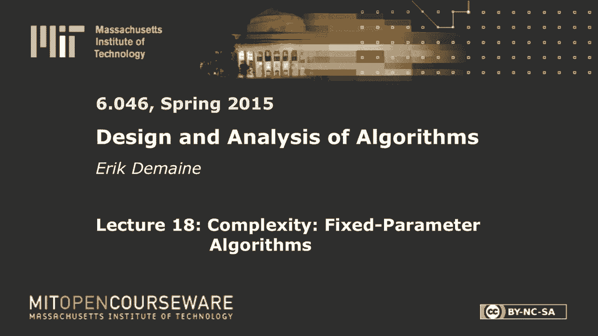
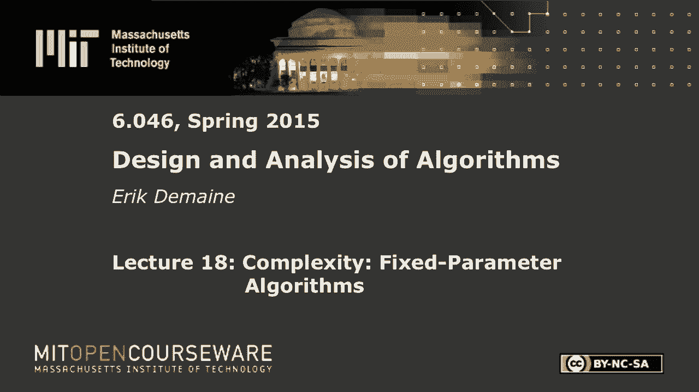
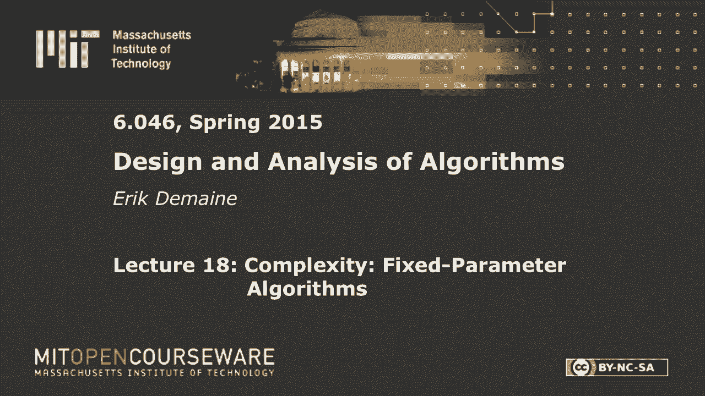
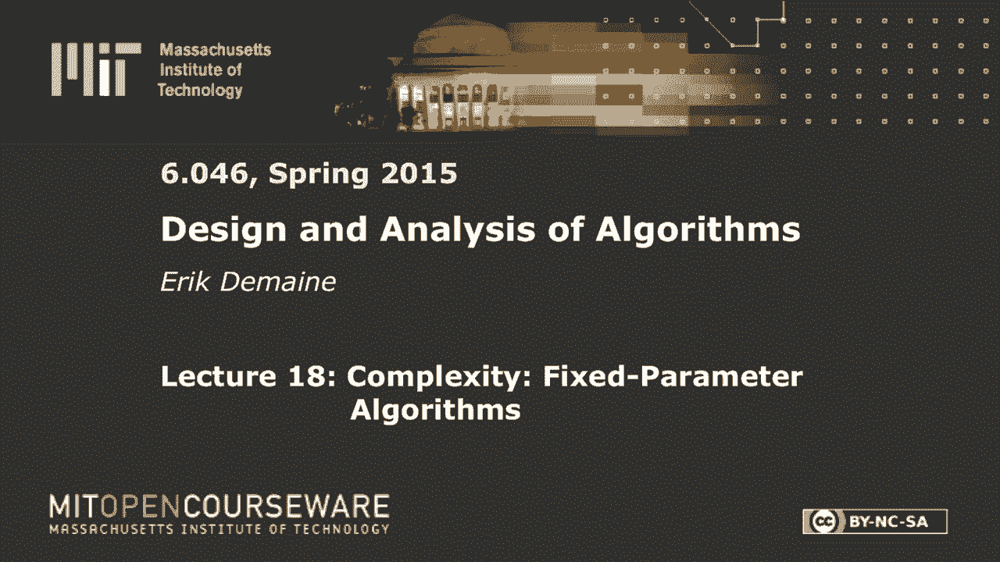

# 【双语字幕+资料下载】MIT 6.046J ｜ 数据结构与算法设计(2015·完整版) - P25：L18- 复杂性：固定参数算法 - ShowMeAI - BV1sf4y1H7vb

以下内容是根据知识共享许可提供的，您的支持将帮助麻省理工学院开放课件。

继续免费提供优质教育资源。

捐赠或查看麻省理工学院数百门课程中的额外材料。

所有的权利，欢迎来到我们的第二堂课，当你有NP难题时该怎么办，所以两节课之前，我们看到了如何证明一个问题是NP难的，上一节课如果你想要多项式时间，但你愿意忍受一个不完美的解决方案。

但是你想在最佳解决方案的某个因素内，那是近似算法，今天我们要做一个不同的事情，叫做固定参数算法，在最坏的情况下，这些将以指数级的时间运行，但从某种意义上说还不错，我们将大致讨论，最后这些的主题。

两次讲座，这一点是我们真的很想解决棘手的问题，我们想尽快解决它们，我们想要正确的解决方案，也称为精确解，好的，我们喜欢在多项式时间内精确地解决NP难问题，但那是不可能的，除非p等于np，所以随便挑两个。

这是一般的想法，这是一个，一个笑话的私生子，这是睡眠朋友的工作，随便挑两个，这是麻省理工学院的座右铭，在算法中，快速准确地选择任意两个，所以这堂课的大部分内容都是关于这两个多项式时间算法的。

给你确切的东西，那是P类，我们降低了精确度，我们还是要多项式时间，我们还是想解决棘手的问题，这是近似算法，我们今天要做的是另一个组合，所以我们想要准确的，但我们要牺牲事情的速度。

它们不会是严格意义上的多项式时间，但它将介于多项式和指数之间，这是一个叫做，那么这个参数是什么，一般业务，这个想法是我们，2。我们需要一个精确的解决方案，到NP难题，这意味着在最坏的情况下。

它必须需要指数级的时间，但我们想限制，到一个叫做参数的东西，好的，我们实际上一直在使用参数，比如说，在图表中，你会想到两个典型的参数，顶点数和边数，如果您正在对数组进行排序。

您通常考虑的参数是数组的大小，好的，仅此而已，我是说，参数通常只是一些，某种大小或复杂性度量，所以总的来说，参数，会是，我要叫它，k，x应该是一个非负整数，x是输入，所以你在想一些问题。

我们今天要讨论的一个问题是顶点覆盖，我们在上节课中看到的，给定图的顶点覆盖，根据那张图表，我们要定义这个图的一些函数，所以这是问题的输入，k是一个非负整数，这是输入的函数。

这只是你的问题有多严重的一个衡量标准，我们想要的是一个以K为指数的运行时间，但在其他方面都是多项式，问题大小的多项式，好的，那是将军，在问题大小中，我们通常称之为n和指数，在参数中，我称之为，会叫什么。

k一般情况，你可以考虑更多的参数，但我们要想两个，的大小，问题的总体规模，我们看到的一些特殊参数叫做k，如果你能做到这一点，我们称之为固定参数可处理性，我稍后会正式地给它下定义。

因为你可能会想到不止一种定义它的方法，有些是对的，有些是错的，如果你能做到这一点，你得到的是一个运行非常快的问题的精确算法，假设k很小，所以这是一种说得好的方式，2。你知道这个问题一般很难。

但只要这个测度k相当小，我还是能很快解决它，所以这是一种描述一个广泛的家庭的方式，你可以解决的问题的一个很大的子集，你知道总的来说，你需要指数时间，但这给了你一个度量你的输入有多难。

这可能不是唯一的措施，在任何意义上都可能不是最好的，但如果可以，如果您可以定义一个参数，你知道在你的实际场景中，那个参数会很小，那你就是黄金，那么你就可以在合理的时间内解决问题，得到一个精确的解。

这里没有近似值，那是一个参数，我们还将定义一个参数化问题，这只是一个问题加上一个参数，好的，所以我们已经对问题有了一些概念，我们可以处理我们以前研究过的任何问题，像顶点覆盖，如果我们定义一些参数。

然后当我们把这些东西放在一起时，我们会得到一个参数化的问题，通常我们会把它写成这样，哦，把这道题，然后根据这个参数来考虑它，通常对于单个问题，您可能需要关心几个自然参数，通常有一个明显的参数。

让我们来做顶点覆盖，但总的来说，我们可以讨论一个关于不同参数的问题，其中一些可能是可行的，从这个意义上说，有些可能不是，所有的权利，所以我要定义一个k顶点覆盖，这几乎和顶点覆盖一样，只是前面有一个K。

但K表示这是一个参数化问题，而不仅仅是一个一般性的问题，就像在顶点覆盖中一样，我们得到了一个图，g，我会想到顶点覆盖的决策版本，所以我们得到一个非负整数，好的，我们想知道，有没有一个大小的顶点覆盖。

k说小于或等于k，有没有，顶点覆盖，记住顶点覆盖是一组覆盖所有边缘的顶点，我们希望s的大小小于或等于k，好的，所以每一条边，我们需要从两个端点中选择一个，我们希望所选顶点的总数最多为k。

所以这是一个常规的决策问题，但是对于参数化问题，我们还想定义一个参数函数，那个参数函数猜猜K，最明显的是，我在这里写了字母K，这将是我们的参数，好吧，大多数问题，很多问题，特别是优化问题的决策版本。

就像我们最小化顶点覆盖之前，这是决定版，在那里我们要决定是否有一个最大的K，如果你能解决这个问题，当然你可以在k上进行二分搜索，就像你在测验中所做的那样，希望这一切都很好很多问题都有这个。

一些漂浮在周围的非负整数，这就是参数的明显选择，它不一定是唯一的，但是今天我们要看顶点覆盖，在习题集中使用此参数化，你用另一个自然参数看另一个问题，这通常被称为自然参数，但是自然没有正式的定义。

那只是直觉，所有的权利，这就是设置，让我们做一些算法，我想第一个音符是k实际上可以很小，一个很好的例子是星图，所以你有顶点，但是最小的顶点覆盖是什么，每个人都举起一根手指，你选择中间的这个家伙。

它覆盖了所有的边缘，所以K可能比V小得多，我们在这里的目标是，那个，我们将得到图的大小与多项式的依赖关系，但我们将得到K的指数依赖性，现在有很多不同的方法可以考虑指数依赖，但让我们从什么开始。

到顶点覆盖，我想要确切的不是聪明的，解决这个问题的明显算法是什么，试试看，任意k个顶点的组合，看看它是不是顶点覆盖，k个顶点有多少个组合，然后选择k好的，见，我有点生疏了，已经有一段时间被一个关闭了。

所有n选择k，我猜V选K，如果我想完全匹配这个定义，我应该尝试所有小于或等于k个顶点的子集，但是嘿，如果我，如果我选择少于k个顶点，为什么不在我到达K之前再加一些额外的东西呢？所以看特征k子集就足够了。

因为大小正好为k的子集，因为这最终会给出和这个问题相同的答案，所以对于每一个，测试这些选择的覆盖率，所以这只是意味着我们循环，我想我们集合中的每个顶点，我们把所有的事件边缘标记为覆盖。

然后我们检查所有的边缘看看是否每个人都覆盖了马克，如果没有，我们重置，尝试下一个子集，好的，这就像不聪明的动态程序，你只需猜测子集是什么，看看它是否涵盖，这就是你如何证明这个问题是NP正确的。

但现在我们实际上把它变成了指数算法，那么这个算法的运行时间是多少，到e乘以v，到K，所以这显然是指数级的，在某种意义上，对e和v的依赖在底部，这是好的，K在指数中，这是有道理的，所以这并不奇怪。

我们也不认为它很好，我们已经把这定义为不好的，总的来说还好，我们想到一个运行时间，就像n到f的k，n是整个问题的大小这里n基本上是v加e，这是图形的总体输入大小，如果我们有运行时间。

其中n的指数以非平凡的方式依赖于k，我们认为这是一个糟糕的运行时间，这是一个慢算法，它很慢，因为即使k等于2，如果你有一个大的图表，这可能不是你想运行的东西，当k是10的时候，你全身都湿透了。

这是非常不切实际的，以及不切实际的正式意义，n中的指数一般依赖于k，你不能这么说，我想，我是指固定参数，关键是把参数想象成一个常数，好了，现在，如果参数是固定的，如果你想到它，最多一百个，事实上。

这最多是，你知道N到101什么的，所以对于任意固定的k，它是多项式，问题是多项式的指数依赖于k，当你增加k，如果你增加K上的束缚，指数上升，我不能说这是任何固定k的n平方算法，好的，所以指数取决于k。

那是不好的情况，所以我们要定义的好情况是，指数不依赖于k，这似乎是一个小小的变化，这是一个小小的变化，但它是一个大的，这是一个影响很大的小变化，所以我要定义，让我们说，参数化问题，是固定参数可处理的。

考虑到有多少个字母，我们将缩写为f，p，t，就可以解决，n中k次多项式的f，这里的指数不依赖于任何东西，不依赖于k，好的，所以对于这个定义，只是为了明确地说，我希望这里的常数是独立的。

当然它应该独立于n，也应该独立于k，这可以是任何函数，它大概是指数函数，因为如果这是一个NP难题，一定是指数级的，这显然不是指数级的，所以它一定在这里，这就是我们在k中指数的意义，多项式和n。

但它比这种运行时间要好得多，好吧好吧，我们可以思考什么，在某种意义上，它要好得多，一次，我们有一个这种类型的实际算法，所以让我们做，让我们试着在这种时间内解顶点覆盖，我声称顶点覆盖是固定参数可处理的。

有这样一个算法，算法看起来很眼熟，非常类似于我们上一堂课关于顶点覆盖的两个近似算法，所以我要给它起个不同的名字，它是有界搜索树，好的，这个算法也会感觉像动态编程，或者我们将在一般指数算法中使用猜测。

用猜测是很自然的，但在这里，当我想我必须尝试这里所有的可能性，这是尝试所有可能性的一种方式，我们会更老练一点，我们如何尝试所有实际利用的可能性，顶点覆盖的性质，就像两个近似算法看任何边一样，在图表中。

这里，从u到v，我对那张照片了解多少，是啊，是啊，其中一个顶点有一个顶点必须在封面上，U或V或两者都在s中，所以现在要覆盖那条边，对于两个近似，我们把它们都放在这里，我们负担不起那样的费用。

因为我们想要一个精确的解决方案，所以我们两个都试试，我们不知道哪一个属于，让我们猜猜，所以我们知道要么u在s中，要么v在s中，不知道是哪个所以猜，所以我应该明确提到或两者兼而有之。

所以我们要猜测这意味着我们需要尝试两种选择，我们会试着把你放进去，然后我们要试着把V放进去，所以让我们看看会发生什么，我们尝试一下，所以在第一次猜测中，我们说，让我们把你放进去，s，好吧好吧。

如果我们把U和S，这意味着我们覆盖了所有与U相关的边缘，所以我想使用递归，我想把我的问题简单化，获取另一个顶点覆盖实例，所以为了做到这一点，我只是要删除你和它所有的事件边缘。

我们在近似算法中做了类似的事情，但对于u和v同时，所以删除，现在我们有一个顶点覆盖实例，还有一件事，我们有一个新的图表，但我们也需要更新K，因为我们刚刚使用了其中一个，我们只是在S上加了一些东西。

然后我们从图中删除了它，这意味着在我们的新图表中，K实际上下降了1，好的，所以我会说递减k，现在我有了一个新的实例，我有一个新的图和一个不同的k值，我会说我把新的图G称为质数，把新的整数称为，k素数。

k质数等于k减去一，好的，第二种情况是对V做同样的事情，我不会写完全相同的代码，但是我删除了V和它的事件边，我还是把k减1，我递归，然后我只返回这两个答案中的or，所以如果这个找到了一个很好的解决方案。

我找到了解决整个问题的办法，这个找到了一个很好的解决方案，也许两个都回来了，是并不重要，我只是拿包罗万象的，或者这两个布尔值中的一个，是呀，K顶点覆盖无答案，所以下一个问题是运行时间是多少。

但你可以把这看作是一个动态程序，只是在这里我们递归，我们不费心回忆，因为一般来说，记忆永远不会帮助我们，你甚至可能在动态编程世界中想到过这样的算法，我们只是说好，那还不够好，因为在动态规划中。

我们想要多项式时间，这就像一个动态程序，但运行时间是指数级的，但事实证明，它将是固定参数可处理的，这是好消息，让我们想想运行时间，所以如果我画，让我们画一个递归树，这是一个反复出现的。

这是一个分而治之的算法，在很弱的意义上，我们从这里开始，对于大小为n和参数为k的问题，我们做两个递归调用，好的，我们删除了一个顶点，也许还有一些边，假设我们有一个新的大小问题，n减去1之类的。

但真正拯救我们的是K下降了1，我们有两个递归调用，它们中的每一个k都小一个，好的，然后每个都有两个递归调用，我真的不知道N会发生什么，它可能不会变得那么小，但是k又下降了一个，好的，所以我在这里写。

问题的大小和问题的参数，n减去二，k减去二，好的，我在每个节点上花了多少时间，我做了多少工作，非递归功，我在这个算法中做什么，e的o，是啊，是啊，当然最多是E级，最多可能也是V。

因为每个顶点最多只有v个入射边，是啊，是啊，线性时间并不重要我们在这里有多小心，但我要说的是，我们最多花的每一个节点，让我们说顺序V它发生的时间，v下降了1，你看到这些水平，但肯定是一个上限。

是我们在每个节点中最多花费的原始V，原来的V，此递归何时停止，我没有写基本情况，帮我一把，这个算法的基本情况是什么，当k等于零时，检查有没有边缘，当k等于零时，我不能把任何东西放进我的顶点盖里。

所以如果有任何边缘，它们就不会被覆盖，那是个坏消息，好的，所以在这里我们有一个基本情况，E的大小不为零，如果不是零，对不起，是否等于零，如果等于零，那么答案是肯定的，有一个顶点覆盖。

我可以用零顶点覆盖所有的零边，这很好，但当e不等于零时，没有办法，我可以在我的顶点覆盖中使用零顶点来覆盖非零数的边，好的，所以这是基本情况，这意味着这个递归继续，直到我们降到k等于零，我们从K开始。

我们最终得到零，所以这里的级别数是k，在这棵树的高度，这个递归树是k，那么这棵树中有多少个节点，K的二次方，所以总运行时间是v乘以k的2，我想我应该给K写两个，乘以v，嘿，这正是我想要的。

我得到了K的函数，也就是K的二次方，有意义的指数，这里有一个多项式，这不是，指数为1，v最多是n，n是v加e，像这样简单的算法，但实际上它跑得更快，好的，让我给你一个感觉，我是说。

这就是我们所说的固定k的线性时间算法，这里的指数不依赖于k，如果k是十，这是一个线性时间算法，如果k是一百，这是一个线性时间算法，k是一百，这可能有点超出了我们的能力，但你知道k等于三二四十。

也许这可能是合理的，实践中的运行时间，好的，那比以前好多了，我们就像，k等于二或三，这可能是不合理的，V就像十亿，说大图，也是，从理论的角度来看，这甚至可以达到，k=log n，如果k等于log n。

这将是，你知道n的平方，那很好，k等于2 log n，它是立方体，好的，所以你知道它生长，但是我们可以处理k等于log n阶，这通常仍然是多项式，固定参数算法，并不总是要登录n，这将取决于什么。

这个f的逆是，这就是我们仍然可以是多项式的地方，所以这很好，我认为这是一个很好的运行时间，好，从某种意义上说，它遵循固定参数可处理的定义，所以有界搜索树算法是好的，蛮力算法不好，在这种情况下。

有界搜索树是一种通用技术，你可以用它来解决很多问题，我们今天要看另一种技术，称为角化，在我到那儿之前让我看看，我想质疑这个定义，所以这个定义很好，从它给你的意义上说，这是自然的。

它区分n的指数依赖于k和不依赖于k，这是一件很自然的事情，但是固定参数还有另一个自然的定义，易处理性，顶点覆盖，你现在还记得那个问题吗？所以让我们看看，我们有这个定义，它是k次多项式n的f，但我想说。

我第一次看到固定参数的可追溯性，我想得很好，你为什么这样定义它，我是说，也许用k的f加上多项式man会更好，那就更好了对吧，那样会更快，好像是这样，我是说，这很好，我们达到了这个界限。

但我们能希望这个更好的约束吗，原来这些概念是相同的，你第一次看到它就很奇怪，所以定理，你可以在这种时间解决一个问题，如果你能在这种时间内解决这个问题，所以f当然会改变，我为什么不给这些常数贴上标签。

这里有c，这里有c素数，但是你可以在这个乘法时间内解决一个问题，当且仅当你能在加法时间内解决它，具有不同的函数和不同的常数，这其实很容易证明，你想得越久，就会越明显，如果有一个大小为n且参数为k的实例。

有两个案例，所以n小于或等于k的f，或n大于或等于k的f，好吧，好吧，一定是其中之一，也许两者都有，如果n小于或等于k的f，这意味着这个运行时间f的k乘以n到c，让我们看看n最多是k的f。

所以这最多是f的k的c加1次方，我把k的f乘以c乘以k的f，当n大于k的f时，然后我知道这个运行时间f的k乘以n到c，现在我知道f的一个上界，我知道这件事最多。所以这最多是n到c的加一，好的。

所以我真的有两种情况，要么i被k的某个纯函数所限定，或者i有界于n的某个纯多项式，这意味着在这两种情况下，运行时间，从k乘n到c的f在上面被这两个东西的最大值所限制，k的最大值f到c加一到c加一。

最大值总是最多等于和，我假设这里的一切都不是消极的，所以我取f的k，c，plus，1，n，to，c，plus，one，to，the，c，plus，one，to，a，plus，one，to，c，plus。

one，to，a，plus，one，to，c，plus，one，to，那是k加多项式的加法函数，好的，相当琐碎，这是一个有趣的领域，你认为，哦，这是个很深的问题，这些东西是一样的吗，是啊，是啊。

它们是一样的，原因显而易见，例如，我们有这个线性的，基本上n乘以2的k算法，如果你应用这个论点，你知道这最多是，所以k界的n次方最多等于n的平方，k的四次方，我基本上只是平方这两个条件。

可能你更喜欢这个时间限制，但是如果你真的喜欢加法的时间限制，完全相同的算法满足这一点，所以没那么刺激，在实践中n的平方看起来像是一件坏事，所以你可能更喜欢这种运行时间，但有一种感觉。

这里发生了二次的事情，我们有一个n，我们有一个k的函数乘在一起，好吧随便，嗯，所有的权利，所以这证明了定义的合理性，它有点健壮，我是在这里加一个点还是加号，所以很明显这是正确的定义，我们要用点。

你也可以用加号，但是，但还有一种叫做角化的东西，那个，在直觉上，匹配这个加的想法，它也符合一个在实践中很常见的想法，称为预处理，如果我有一个巨大的图表，我付出，我得到了一些数字K，我想找一个顶点覆盖井。

也许我能做的第一件事就是简化我的图表，也许有些部分真的很容易解决，我应该先把那些扔掉，这会让我的问题变得更小，所以如果我要有一个指数级的运行时间，大概我想先把这个问题处理得尽可能小。

然后处理这些算法中的一个，好的，所以我们要这么做，首先，我要告诉你这件事，一般地，然后我们做顶点覆盖，所以首先让我给你一个我们想要的定义，在这个预处理过程中，它将被称为内核化过程。

核化算法是一种多项式时间算法，你可以把它看作是一种减少，但你知道，np硬度，我们从一个问题a减少到另一个问题b，这里我们要把问题A简化为同样的问题A，这是一种自我还原，如果你愿意。

但是对问题的投入会变小，所以我们要转换一个输入，所以这是一个参数化问题，所以输入由一些常规输入x和一个参数k组成，我们想把它转换成等价物，对同样的问题，如果问题解决了，说顶点覆盖。

所以我们得到了一个任意的输入，这将是一个图表和一个数字K，我们想把它转换成等价的小输入，这是另一个图G素数和另一个参数K素数，所以等价意味着答案是相同的，我想要这个问题的答案。

假设x逗号k的答案等于答案，呃到x一撇然后再到k一撇，同样的问题，但是不同的输入，我想说得通俗点，可能是这个，我们将在这里思考决策问题，但这是有道理的，即使对于非决策问题，无论这里的答案是什么。

都应该和这里的答案一样，因为我想要一个精确的解决方案，我想确切地解决这个问题，我想准确地计算出这个答案，所以如果我可以把它简化为一个x素数k素数，得到同样的答案，嗯，现在我可以解出x一撇k一撇。

所以这很好，现在，小意味着什么，需要定义这两个小的意思是x素数的大小，你可以称之为n素数，最多应该是K的某个函数，这很有趣，所以我们从一个巨大的问题开始，我们有一个参数k，我们认为它相对较小。

我们把它转换成一个新的输入，非常小的x素数，它的大小是k的函数，对n n的依赖不再从问题中消失，好的，我们从N号的东西开始，我们生产出大小是k函数的东西，然后好吧，还有其他参数k一撇不重要，它是什么。

它也是k的函数，所以我们从N号的东西开始，我们在多项式时间内产生了大小为K的东西，哇哦，如果我们能做到这一点，这将是一件大事，因为我们从巨大的问题开始，小K，我们把它核化，这是这个大东西的照片，直觉是。

问题的难度只是从这个大小K的东西，但没有K大小的东西，或者至少我们还没有找到它是对的，K是我们要找的顶点覆盖的大小，但我们不知道它在哪里，在这种情况下，它藏在某个地方，它是这个无定形的斑点大小K。

但不知何故，这个内核化过程神奇地产生了一个新问题，那只比k大一点，K的某个函数，所以我们把大问题，我们把它归结为这件小事，你现在做什么，你可以运行任何算法。

您希望应用于此实例的任何有限算法都将在k的某个函数中运行，时间不重要，只要是正确的算法，如果你的问题在NP，有一个指数时间算法，你只是尝试所有的猜测，所以我们可以用，我们这里有两个。

我们可以在内化后运行其中任何一个，我们会得到一个FPT时间，事实上，PT会模仿这种运行时间，我们做一个多项式量的预处理，这就是角化过程，这是对n的唯一依赖，我们做完之后，这个新问题完全是K的函数。

然后你应用任何算法，你现在会得到一个f k的运行时间，如果我们想要一个好的f k，我们应该使用我们现有的最好的算法，但总的来说，到目前为止，你可以用任何东西，这么好，所以我们有这个定理。

那个产品和Plus一样，事实上，内核化是一回事，所以这些都是一回事，或者我想这个等价于F是FBT，这就是FBT的定义，所以就在这里，问题是FPT，t当且仅当它有内核化，这太疯狂了。

我不断地引入越来越强烈的善的概念，他们又都是一样的，使您了解此定义的健壮性，为什么这是一件很自然的事情，所以这听起来很疯狂，我怎么能把所有简单的工作都放在一开始，在这个多项式时间算法中。

然后最终生产出合理大小的东西，这个证明将是微不足道的，我认为这个领域的一切要么真的很难，要么微不足道，我想这是有道理的，所以让我们先，所以我只是在看这个不平等，这个暗示我们已经做了另一个，简单的方向。

当然是这边，这件事我都没做，如果我有一个附加的运行时间，假设这两个数字至少是一个，那么最多肯定是乘积，好吧，再来一次，如果我有内核化，正如我所说，我可以在多项式时间内运行内核化算法。

然后运行任意有限算法来解决问题，我们得到一些f的k运行时间，所以这很容易，在内核上，内核是产生的输出，x素数，k素数，好的，让我们做另一个方向，这就是有趣的部分，假设我有一个算法，假设在这个运行时间里。

我声称我可以把它变成内核，证据会像以前一样，所以有两个案例，一个是k的f，假设小于n，实际上我想做另一个案子，首先我觉得这样更自然一点，但这并不重要，他们都很容易，但出于不同的原因。

然后这些部分看起来就不一样了，所以第一种情况，如果n最多f of k，2。在那种情况下我该怎么办，为了使这个N大小的东西角化，我想角化成F和K大小的东西，我什么都没做，所以这是已经角化的情况。

所以另一种情况是n是大的，那是更有趣的情况，当然啦，n大于或等于k的f，这里发生了什么，就像上次一样，这意味着k的运行时间f现在最多是n，这意味着这个运行时间最多是n到c加1。

这意味着我给出的PT T算法，因为我们假设这里给了我们一个算法，我们想生产一个内核，那样的话，那个算法以n到c加一次运行，这意味着我可以运行它，这是多项式时间，所以在这里我需要一个多项式时间角化算法。

如果k的f最多为n，然后我就可以实际运行FBT算法，这将是一个有效的角化过程，现在FBT算法实际上解决了这个问题，让我们说是或不是，我最初问题的答案，内核化过程必须输出问题的输入。

所以我需要在这里加一件事，它只是输出一个规范，是或否输入，好的，如果这里的算法，我在考虑做决定的问题，如果FBT算法说是，我将输出一个实例，输出为yes的问题的一个输入，我知道有一个存在。

因为这个算法说是的，所以在一个恒定的空间里，我可以写一个是输入，或者在恒定的空间中，我写了一个无输入，因此新内核将具有恒定的大小，小于k的f，好的，就是这样，要么我输出与给我的相同的输入。

或者我输出一些恒定大小的东西，编码是或否，又有点琐碎了，问题是，内核的大小，输出的一般大小，这里是k的指数，因为f{\displaystyle f}是k{\displaystyle k}的指数，真烦人。

这就是你所说的指数大小的内核，所以一个有趣的问题，和指数大小的核等价于FBT，可能不等价的是多项式大小的核，那就太好了，如果我从n中的多项式开始，我把它简化为k中的多项式，然后我运行一些东西。

你知道它是指数级的，但它只会是k的单指数，希望，而如果我使用这个内核化过程，如果我用这些算法之一将其应用于顶点覆盖，我要得到一个新的东西，它的大小是K的指数，如果我运行这个蛮力算法，我要买一些。

k中的双指数，这不是那么热，因为我已经知道怎么用K做指数了，但那是，这就是角化的一般思想，为什么你能做到这一点并不奇怪，我这里有一个陷阱，这是一个算法，为了做到这一点，它将n与k的f进行比较。

你得知道什么是小技术，如果你不知道K是什么，你基本上可以用计时器运行这个算法，秒表，如果它的运行时间超过n到c加一，那你就知道你不是在这个案子里，如果在那个时间内完成，一定很棒，你找到了答案。

如果它没有完成，那你就知道你一定在这种情况下，然后你就退出，输出你原来的输入，说我被角化了，做得容易，所有的权利，通论到此为止，让我们回到算法，是啊，是啊，所有这些工作我都想写下来，这边。

我们有一个v乘以2的k算法，在一边，这里我们有一个e和速度到k的算法，只想保持跑步，通过内核化，我们将得到一个比这两个都快的算法，所以我声称我们可以找到一个多项式核，多项式大小核，顶点覆盖将是二次的。

这些很难找到，有一个完整的研究行业来寻找多项式核，所以我要给你一些方法，但它们是特定于顶点覆盖的，所以这是第一件很难画的事情，所以这里我有一个顶点，假设我有一条从u到u的边，这叫做循环。

从顶点覆盖的角度我能做什么，关于这幅画我能得出什么结论，对呀，你必须在顶点盖里，因为这个边真的只有一个端点，好的，到目前为止很容易，所以在这种情况下我能做的就是说好，U在顶点覆盖中，然后删除u。

它的入射边缘，所以我们必须减少k，很酷感觉很熟悉，但在这种情况下，没有猜测，我们只知道你一定在封面上，这里还有一个案子，假设我有U和V，有很多边连接着它们，这就是所谓的多边。

所以也许你只是假设你的图表很简单，但如果你不假设你的图表很简单，我们可能会有这种情况，在这种情况下我能做什么，我能保证什么，你可以去掉除了一个边缘之外的所有边缘，让我们只删除除一个以外的所有。

如果我覆盖其中一个，我把它们都盖住了，易如反掌，看看你能不能得到其他规则，所以一个一个删除，一般来说，我们会有一堆这样的简化规则，保证正确的，他们不改变输出，但神奇的是。

我们最终会得到一个大小为k函数的东西，我们还没做多少，但现在我们知道图表很简单，意思是它没有循环，它没有多边，很酷好吧，接下来我想的是，大于k k是k的当前值，所以假设我有一个高度顶点，大于k。

那我还能说什么呢，是的，它，一定要把它放在封面里面，为什么，你覆盖了所有古老的印第安纳州，而是用矛盾来证明，如果我不把它放在封面上，这意味着所有这些人都上了封面，他们不止K个。

整个目标是找到一个最大K大小的顶点覆盖，所以你最好不要把这些都放在你的顶点盖里，因为这比K还多，所以这个必须在里面，这是一个很酷的论点，简单却很酷，所以任何大于k度的顶点都必须在顶点覆盖中，我叫它，s。

好的，所以删除那个顶点和它的入射边递减，因为我们刚刚用了一些东西，好的，所以每次我看到一个度大于k的顶点时，就继续这样做，删除它，现在我有了一个新的图和一个新的k值，寻找度大于k的任何顶点。

如果我找到一个删除它，重复，重复，不断重复，直到你不能再重复，这要花多少时间，我不知道最多二次方，对呀，我看了看所有的顶点，看看他们的学位，你知道，我可以查看所有的边缘，并在线性时间内增加度数。

我可以找出是否有度数大于k的顶点，然后在线性时间内删除，然后再试一次，这将发生在大多数线性时间，很多次，因为我只能删除一个顶点一次，所以我最多删除V个顶点，所以这里的总体运行时间是，最多。

你知道v乘以e多项式，如果你聪明的话，使用数据结构满足更新学位，你可以按时间顺序这样做，但我们先不要聪明，所有的权利，所以现在在我做了所有这些减少之后，我有一个图，每个顶点的度最多为k。

所以它就像一个有界度数图，我为什么关心有界度图，记得我画了这个例子吗，这是一张星图，其中n很大，但是k很小，n是n，n是v，k是1，现在星图是特殊的，因为它的顶点一般都很高，如果我有一个某种程度的顶点。

说K，我把它放在顶点盖里，它覆盖了，最多k条边覆盖，不管是什么程度，所以这意味着你不再物有所值了，我们已经处理好了所有的高次顶点，如果你把一个顶点放在封面上，你会得到很多奖励，这是k的新值。

它可能比以前减少了，我们可能放在集合中的每一个顶点，只会覆盖k条边，现在我们知道我们只能在集合中增加k个顶点，我们知道我们假设s的大小最多是k，边数，e的大小最多必须是k的平方。

因为我放进被子里的每一个，最多k条边，都要盖住，所以k乘k是k的平方，嗯哼，有趣，这意味着我的图很小，现在，小渔获物，可能会有一大堆没有边的顶点，他们的意外，所以我需要，零度顶点。

你真的不想把这些放进你的顶点覆盖中没有意义，它们不覆盖任何边缘，所以删掉那些，现在我可能仍然没有一个连接的图形，但在最坏的情况下，我有一个匹配的，我知道边的总数最多是k的平方。

这意味着顶点总数最多是两个k的平方的两倍，所以在所有这些手术之后，我假设S最多是K的大小，然后如果我做了所有这些手术，嗯，我得到了一个图表，最多两个k平方顶点，最多k平方边。

所以我称之为n n的图的总大小，它是V的大小，加e的大小是k阶的平方，三k的平方，现在我假设在整个过程中，有一个最大为k的顶点覆盖，所以我所做的是运行这个角化算法，我看到的是我生成的图。

最大为3K的平方，如果它是输出它，那是内核化的东西，因为它很小，如果不是，如果我制作的图形仍然太大，这一定意味着这个假设是错误的，这意味着顶点覆盖问题的答案是否定的，最多没有大小的顶点覆盖k。

然后我输出一个规范，无实例，就像，所以我的意思是这有点外面，但是如果嗯，新制作的图形，我叫它V质数，加e素数，大于3倍k的平方，然后输出，在这里我可以给你一个，假设我要输出图表，它是一条有两个顶点的边。

k等于零，在本例中，顶点覆盖的答案是否定的，所以这是一个恒定大小的例子，无代表，所以要么我得到一些很小的东西，然后我输出，或者它很大，在这种情况下，我输出这个东西，只是想说，没有，做不到，那是内核化。

所以我制作了一个二次大小的图，k中的二次，哇哦，所以这是它最细的多项式核的角化，多项式时间，我们把它归结为K中的大小多项式，这就是你应该做的，如果你想解顶点覆盖，不妨先做这些减量。

因为它们会简化你的事情，现在如果你碰巧知道你的顶点覆盖很小，那么图形就会很小，所以现在我们可以运行这些算法中的任何一个，大概我们应该运行更好的一个，只是为了好玩，让我们分析一下他们两个，好的。

所以我想把运行时间留在这里，我们将从一个固定的参数中得到一个更快的顶点覆盖算法，可处理性观点，这里有一个新的FBT算法，先放两个，我们Kerli，我们花了，我想我又点了一次，我想你可以把它订成V型。

不用太费力，很明显，不是很明显，做一个好的习题集是一个很好的练习，但它不在习题集上，别担心，这可能是一道很好的期末考试题，我不知道，现在，可能有点长，所有的权利，所以现在我们可以，让我们说，备选方案一。

让我们使用蛮力算法，之后呢，它的运行时间是e乘以v到k，但是现在e k的平方，v也是k的平方，让我们不要担心，其实，我确实要担心这里的常数，因为它在指数的底部，所以我这样做，我们将得到e项的k平方。

然后v项是2乘以k的平方，然后它将被提升到第k次方，所以简化一点，这就像是K的2倍，我想K到两个K，是k的平方，不错嘛，总体运行时间是VE加上这个，它是K的函数，它是指数级的，嗯。

但你知道我们有一个更好的算法，我们有v乘以k的运行时间，所以我们不妨用那个，但关键是一旦你角化，你可以使用非常愚蠢的算法，你仍然有很好的运行时间，使用有界树搜索，我们将获得稍微好一点的运行时间。

所以如果我们使用有界树搜索，v等于2k的平方，所以在这里常数无关紧要，因为没有指数，然后我们有乘以2的k，所以我们要得到一个，k的平方乘以2的k算法，这是一种有趣的对称，到了这里，K正在切换角色，当然。

2到K是大项，但现在它在K中只有单指数，这个东西是k的二次方log k这个东西是k的二次方，这样比较好，这就像k阶乘，这只是K的二分之一，所以这是一个很大的进步，这将是一个更实用的算法。

所以我们运行内核化，然后我们运行有界树搜索算法，所以总运行时间，就是v加k的平方到k，故事还没有结束，关于如何从固定参数解顶点覆盖的论文有几十篇，可处理性观点，到目前为止最好的一个，我不打算掩护。

但它是基于内核化的，只是更多的规则，你得到了，v加一点，两个，七，K的四次方，一些常数优于2，但非常相似，如果你有一个顶点覆盖实例，那就是顶点覆盖，你知道它会有一个相对较小的顶点覆盖。

这些是你应该使用的算法，我们的顶点封面故事就结束了，但我最不想做的就是把这两个区域连接起来，上一堂课我们讨论了近似算法，这节课我们讲了定参数算法，它们实际上是密切相关的，所以，比如说。

我们会得到一个固定参数的算法，使用我们上节课已经讲过的子集和，今天到目前为止，我基本上一直在谈论决策问题，但是让我们考虑一下优化问题，所以拿你最喜欢的优化问题来说，就像上节课的任何一个。

让我们假设最优解值，我们试图优化的东西，最小化或最大化是整数，假设opt是整数，好的，现在，让我们来看看决策问题，每当您有优化问题时，你可以把它转换成一个决策问题，你可以把它转换成，我不认识几个。

比如说，选择小于或等于k，或选择大于或等于k，他们的工作结果都是一样的，选择相等k也可以现在工作，那是个决定问题，但我想要的是一个参数化的决策问题，我的参数应该是什么，在某种意义上。

我们通过选择来参数化，但我们增加了一层间接，我们是说我们选择，我们想决定opt是小于还是等于k个问号，让我们用k来参数化，这和我们用顶点覆盖的味道相似，如果你在想，如果我们从最小顶点覆盖开始。

并将其转换，这不会像我们看到的其他事情那样强烈，这里没有等价，所以这是一种单向的暗示，我还没有给这个术语下定义，但它和我们上一堂课看到的很相似，如果我们开始的优化问题有一个有效的PTA。

一种有效的多项式时间逼近格式，那么你从这里得到的决策问题是关于k的固定参数可处理的，那么E问是什么意思，看起来很眼熟，我们取1除以ε乘以的任意函数，n中的固定多项式，上次我们谈到p任务，我们可以有一个。

你可以得到n到1的f除以ε，我会认为那很糟糕，就像你想象的那样，从固定参数可追溯性的角度，更好的是一些功能，可能是1的指数，n中的多项式，从固定参数的角度来看，这将是很好的，虽然它是关于近似算法的。

不是关于精确的算法，当然更好的是我们上次看到的fp任务，它是Epsilon乘以1的多项式，n中的多项式，这是理想的，如果你有FP测试，也是一个EP测试，你只要把，或者在第一个字母上再加一笔。

你得到了一个E-P测试，上一堂课，我们实际上看到了子集和的EP测试，我们在ε乘以n的时候看到了2比1实际上，对于那个问题，有一个FP任务更好，但你可以从上一节课中看到，为什么，有指数依赖是很好的。

在Epsilon上的一个，这意味着，只要指数依赖从n中分离出来，你就可以做到这一点，如果它是乘法或加法分离的，正如你所想象的，这是一回事，那么我们称这为有效的p任务，而不是完全的，不如FP任务好。

但很接近，只要你有这样的东西，你可以把它转换成决策问题的算法，通常使用的方式，所以这告诉我们我们得到了一个子集和的FBT算法，事实上，因为有一个FP任务，我们得到了一个伪多项式时间算法。

它在某种意义上更好，但不管怎样，这个定理通常用在反式中。这告诉我们，如果我们能找到一个不是FBT的问题，有一个像NP这样的完整理论，表明问题几乎肯定不是固定参数可处理的完整性。

然后我们知道没有一个e i as，和，这是证明，这类算法是不存在的，通常，您从固定参数的角度来看待它，并表明这可能不存在，那么你就会知道这可能不存在，让我们证明这个定理，又一次真的很容易。

但这两个世界之间的良好联系，所以有两个案例，我们正在考虑的优化问题，可能是最小化或最大化问题，让我们说它的最大化只是为了具体，不会有太大区别，但它会在顺序或不等式方向上产生微小的差异，所以说，好的。

所以我们要做的是，我们做了个心电图检查，我们想解决FPT，我们想要一个FPT T算法，那么我们做得好的是什么呢，算法将运行EP测试，这是我们现在唯一能做的事，EP测试，这是一个近似方案。

它有一个额外的输入，也就是Epsilon，我们需要选择Epsilon，因为我们不是，我们正在努力解决这个问题，当这个问题中没有ε时，所以我们要做一个，让我们运行ep任务，和任何人都有很好的直觉。

Epsilon应该是什么，是啊，是啊，提醒你这个，我们希望Epsilon很小，是啊，是啊，1/1/k几乎是对的，比这更少的都管用，所以我用1/2k，但你知道，1/k+1也行，或者任何东西一点点时间。

k除以1，是啊，是啊，1/k+点，零，零，零一什么的，任何小于1/k的东西都会起作用，为什么会这样，首先呢，多少钱，这要花多少时间？我们得到了这个运行时间，一个以上，这是两个K，所以这需要2k的f。

n次多项式，我们需要连接e和k，因为我们得到了抱歉的epsilon，因为我们得到了运行时间取决于epsilon的东西，现在我们用k来设置epsilon，所以现在运行时间是k的函数。

而不是epsilon的函数，然后乘以n，这很好，这看起来像一个FBT运行时间，我声称我们找到了答案，好的，这可能是令人惊讶的部分，你在这里有很好的直觉，直觉是，如果你如此接近最佳，最优实际上是一个整数。

你发现了一个整数，那么你将不到一个，这意味着你实际上是一样的东西，但让我们做得更正式一点，所以我们在1+ε因子内，我把epsilon部分叫做相对误差，对呀，这就是它乘以opt的多少，为了计算错误界限。

所以相对误差是，我想是最，是1/2k，我所需要的，严格小于k的1，所以这意味着如果我看绝对误差，所以如果你不熟悉，相对误差是我取我的近似解，我减去，假设最优解我做对了吗，这是一个最大化问题，所以是的。

我的解决方案大概是不，对于最大化问题，这将是相反的，这将是最佳的，可能比我还大，所以我接受这个差异，这叫做绝对误差和相对误差，当我把它除以选择，那是相对误差，所以我已经有了这个部分。

所以通常你用一加ε来陈述，如果你用相对误差来表示，那个消失了，你只是得到了Epsilon，绝对误差，也就是OPT减去APX是，我把相对误差乘以opt，所以相对误差小于1，如果选择是，我想大于或等于K。

我的笔记里没有，但如果opt大于或等于k，则绝对误差小于，希望让我们检查一下相对误差实际上是，选择除以k，呜呜，现在我搞错了，这是正确的，在我的笔记里，相对误差是这个东西，它将严格小于opt除以k。

这东西时代选择，只要opt小于或等于k，这东西将严格小于一，那很好，绝对误差小于1意味着我们实际上有相同的值，把它更正式地写下来吗，所以我们到这边来，价值是我们试图最大化的目标函数，让我们说。

我们取得了一些成就，小于或等于k的值，如果opt小于或等于k um，最好是这样，这基本上是以另一种方式再次进行计算，但我们有一个加上Epsilon，Epsilon被选为，二1/k。

然后k是我们找到的解值，所以我们在选择和事物之间有这种关系，因此，这就等于k加一半，所以这也是严格小于k加1，所以如果我们发现，我们假设opt不等于k，所以现在它必须等于k。

因为k和k加一半之间没有整数，我本可以做得更短，所以当我们有一个E，P任务，我们得到了一个FBT算法，反过来就不成立了，有一些问题有FPT T算法，但没有E，它的东西，它连接了这两个领域。

这就是我们所说的固定参数算法，最后的问题。