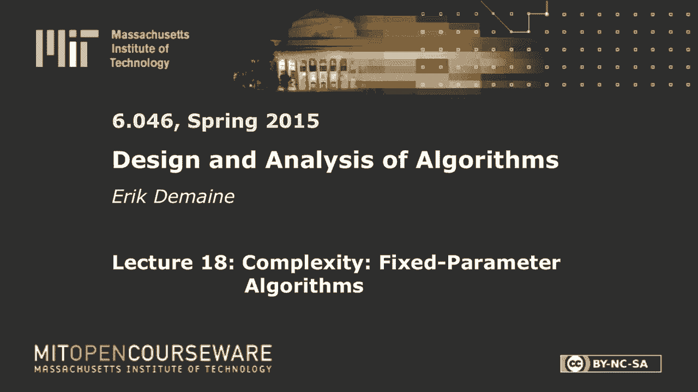
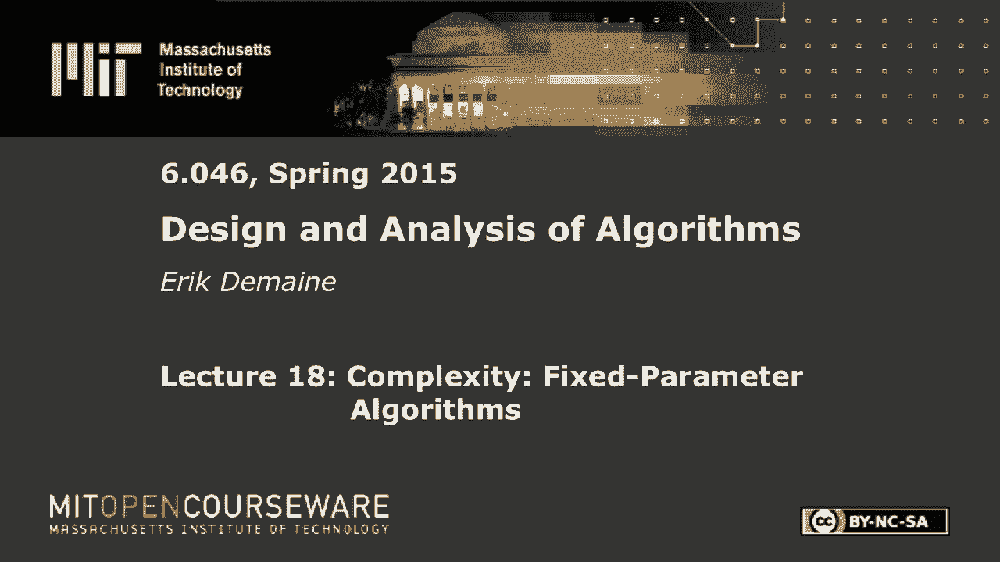
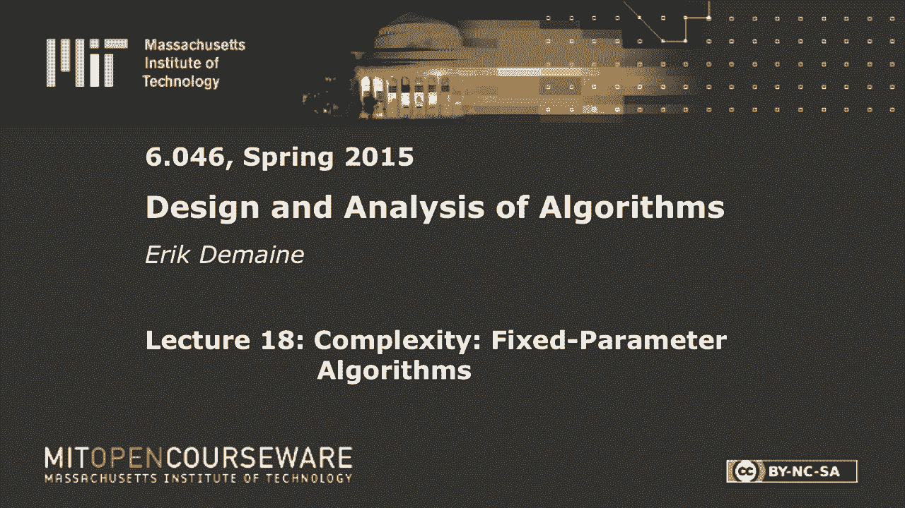
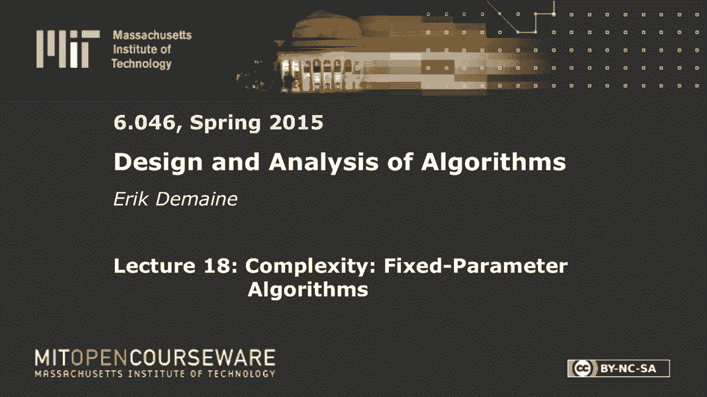

# 数据结构与算法设计：L18：复杂性：固定参数算法 🎯










在本节课中，我们将学习一种处理NP难问题的新策略——固定参数算法。与近似算法不同，我们的目标是获得精确解，但允许运行时间在某个特定参数上呈指数级，而在问题整体规模上保持多项式级。我们将通过经典的“顶点覆盖”问题来理解这一概念。

---

## 概述

当我们面对一个NP难问题时，通常无法在多项式时间内找到精确解。固定参数算法提供了一种折中方案：算法的运行时间可以表示为 **f(k) · poly(n)**，其中 `k` 是问题的一个参数（例如，解的大小），`n` 是输入的整体规模。只要参数 `k` 很小，即使问题整体规模很大，算法也能高效运行。

---

## 什么是固定参数可处理性？

上一节我们介绍了NP难问题的挑战，本节中我们来看看如何通过参数化来精确地解决它们。

一个参数化问题包含一个常规输入 `x` 和一个参数 `k`。我们的目标是设计一个算法，其运行时间主要依赖于参数 `k`，而对输入大小 `n` 的依赖是多项式级的。

**定义**：如果一个参数化问题可以在 **O(f(k) · n^c)** 时间内解决，其中 `f` 是 `k` 的任意函数（通常是指数函数），`c` 是一个与 `k` 无关的常数，那么该问题被称为**固定参数可处理**。

这个定义的关键在于，指数部分 **f(k)** 仅依赖于参数 `k`，而不依赖于输入大小 `n`。因此，对于固定的 `k`，算法在 `n` 上是多项式时间的。

---

## 顶点覆盖的参数化

让我们以**顶点覆盖**问题为例。给定一个图 `G=(V, E)` 和一个整数 `k`，我们需要判断是否存在一个大小不超过 `k` 的顶点覆盖。

我们将此参数化问题记为 **k-顶点覆盖**，其中参数 `k` 就是我们寻找的覆盖集的大小上限。

---

## 朴素算法及其局限性

首先，我们考虑一个简单的“暴力枚举”算法。

**算法思路**：枚举图中所有大小为 `k` 的顶点子集，检查每个子集是否是顶点覆盖。

以下是该算法的伪代码描述：
```python
for each subset S of vertices with |S| = k:
    mark all edges incident to vertices in S as covered
    if all edges are covered:
        return True
return False
```

**运行时间分析**：需要检查 `C(|V|, k)` 个子集，每个检查需要 `O(|E|)` 时间。因此，总运行时间为 **O(|E| · |V|^k)**。

这个运行时间是指数级的，并且指数 **k** 出现在底数 `|V|` 的指数部分。根据我们的定义，这**不是**一个良好的固定参数算法，因为当 `k` 增大时，运行时间会急剧增加。

---

## 有界搜索树算法

上一节我们看到了朴素算法的低效性，本节中我们来看看一种更聪明的固定参数算法——有界搜索树。

**算法思路**：利用顶点覆盖的性质进行递归猜测。对于任意一条边 `(u, v)`，我们知道在最优覆盖中，`u` 和 `v` 至少有一个必须被选中。因此，我们可以递归地尝试两种可能性。

以下是算法的递归描述：
1.  如果 `k = 0` 且图中没有边，则返回 `True`；如果 `k = 0` 但图中有边，则返回 `False`。
2.  选择任意一条边 `(u, v)`。
3.  递归调用一：假设 `u` 在覆盖中。将 `u` 及其关联边从图中删除，并将 `k` 减 1，在新图上递归求解。
4.  递归调用二：假设 `v` 在覆盖中。将 `v` 及其关联边从图中删除，并将 `k` 减 1，在新图上递归求解。
5.  如果任一递归调用返回 `True`，则整个问题答案为 `True`，否则为 `False`。

**运行时间分析**：每次递归调用将 `k` 减少 1，并产生两个分支。因此，递归树的高度为 `k`，总节点数最多为 `2^k`。在每个节点，我们进行 `O(|V|)` 的工作（如删除顶点和边）。因此，总运行时间为 **O(|V| · 2^k)**。

这个运行时间符合固定参数可处理的定义：`f(k) = 2^k`，`poly(n) = |V|`。对于较小的 `k`，这是一个非常高效的精确算法。

---

## 核化：预处理的艺术

有界搜索树算法已经不错，但我们还可以通过**核化**技术进行优化。核化的核心思想是，在运行主要算法之前，先用多项式时间对输入进行预处理，将其简化为一个只与参数 `k` 相关的小规模等价实例。

**定义**：一个核化算法将输入 `(x, k)` 转换为另一个输入 `(x‘, k’)`，使得：
1.  `(x, k)` 的答案与 `(x‘, k’)` 的答案相同。
2.  `x‘` 的大小仅依赖于 `k`，即 `|x‘| = g(k)`。
3.  转换过程在多项式时间内完成。

如果一个问题存在核化算法，那么我们可以先运行核化，再在生成的小实例上运行任何算法（甚至是指数算法），从而得到总运行时间为 **poly(n) + h(k)** 的固定参数算法。

---

### 顶点覆盖的核化规则

对于顶点覆盖，我们可以应用一系列简化规则来缩小图的规模：

1.  **消除自环**：如果存在自环 `(u, u)`，则顶点 `u` 必须在覆盖中。将 `u` 及其关联边删除，并将 `k` 减 1。
2.  **消除重边**：如果两个顶点间有多条边，只保留一条，因为覆盖其中一条即覆盖了所有。
3.  **处理高度数顶点**：如果存在一个顶点 `v`，其度数大于当前参数 `k`，则 `v` 必须在覆盖中（否则需要覆盖所有邻居，数量将超过 `k`）。将 `v` 及其关联边删除，并将 `k` 减 1。
4.  **删除孤立顶点**：删除所有度数为 0 的顶点，它们对覆盖没有贡献。

反复应用这些规则，直到无法继续。最终，我们得到一个图，其中每个顶点的度数最多为 `k`。

**核的大小分析**：在最终图中，覆盖集最多包含 `k` 个顶点，每个顶点最多覆盖 `k` 条边，因此总边数 `|E‘| ≤ k²`。由于没有孤立顶点，顶点数 `|V‘| ≤ 2|E‘| ≤ 2k²`。所以，核的总规模为 **O(k²)**。

如果应用规则后图的规模超过 `O(k²)`，则可以直接判定不存在大小不超过 `k` 的顶点覆盖。

---

## 组合算法与性能

现在，我们可以将核化与有界搜索树算法结合：

1.  首先，运行多项式时间的核化算法，将任意实例 `(G, k)` 简化为一个规模为 `O(k²)` 的核 `(G‘, k’)`。
2.  然后，在核 `(G‘, k’)` 上运行有界搜索树算法。

**总运行时间**：核化耗时 `O(|V| + |E|)`。在核上运行有界搜索树耗时 **O(|V‘| · 2^k) = O(k² · 2^k)**。因此，总运行时间为 **O(|V| + |E| + k² · 2^k)**。

这比单纯的有界搜索树算法 **O(|V| · 2^k)** 更优，尤其是当原图 `G` 很大而 `k` 很小时。

---

## 与近似算法的联系

最后，我们简要探讨固定参数算法与上一节课所学的近似算法之间的联系。

**定理**：如果一个优化问题（其最优解值为整数）存在一个**高效多项式时间近似方案**，那么其对应的参数化决策问题（参数为解值 `k`）是固定参数可处理的。

**直观解释**：假设我们有一个近似算法，对于任意 `ε > 0`，能在 `poly(n, 1/ε)` 时间内找到一个 `(1+ε)` 近似的解。如果我们设 `ε = 1/(2k)` 并运行该近似算法，得到的解值与最优解 `OPT` 的绝对误差将小于 1。由于 `OPT` 是整数，这意味着近似解的值实际上就等于 `OPT`。因此，我们通过近似算法精确地解决了决策问题，且运行时间为 `poly(n, 2k)`，符合固定参数可处理的定义。

这个定理建立了两个领域之间的桥梁，有时可以用来证明某些问题不存在高效的近似算法。

---

## 总结

本节课中我们一起学习了固定参数算法的核心思想。我们了解到：

*   **固定参数可处理性** 允许算法运行时间在参数 `k` 上呈指数级，而在输入大小 `n` 上呈多项式级。
*   通过 **k-顶点覆盖** 问题，我们分析了朴素的暴力枚举算法为何不是好的固定参数算法。
*   **有界搜索树算法** 利用问题结构进行智能猜测，实现了 **O(|V| · 2^k)** 的运行时间，是一个标准的固定参数算法。
*   **核化技术** 通过多项式时间的预处理，将问题实例简化为一个规模仅依赖于 `k` 的“核”，从而可以结合任何算法获得更优的性能。我们为顶点覆盖构建了一个大小为 **O(k²)** 的核。
*   固定参数算法与近似算法之间存在深刻联系，一个领域的进展可以推动另一个领域的发展。

固定参数算法为我们提供了一套强大的工具，用于精确解决那些在整体上是NP难、但具有小参数的实际问题实例。