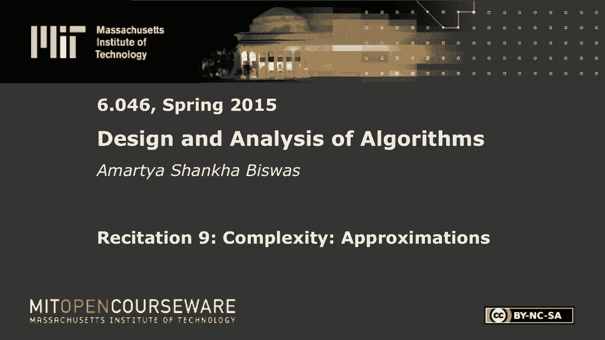
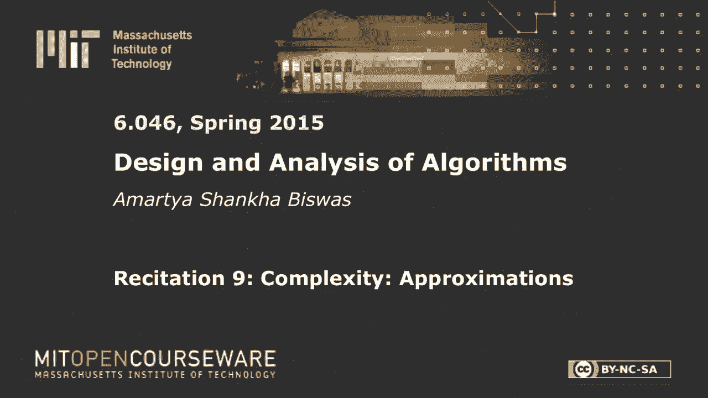
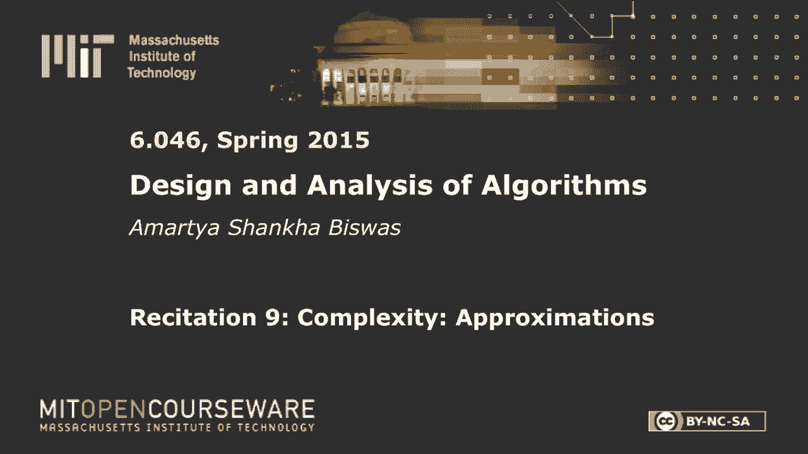
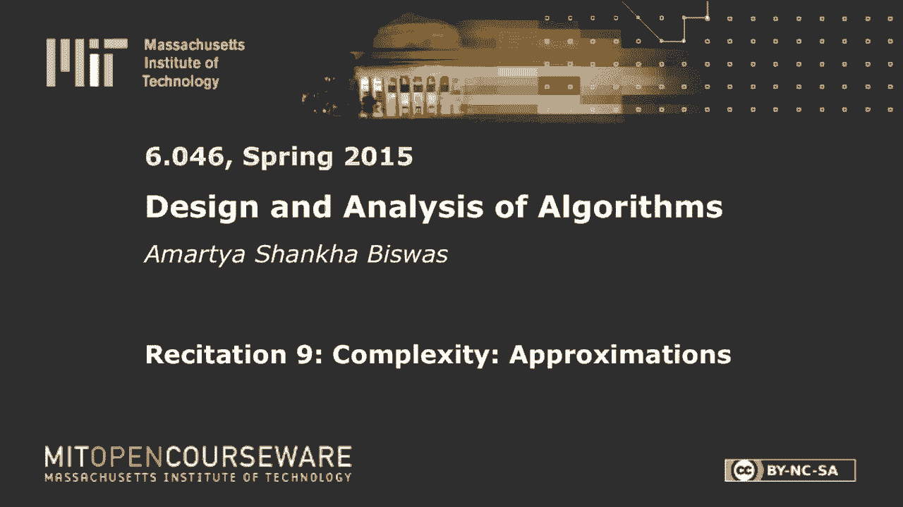

# 【双语字幕+资料下载】MIT 6.046J ｜ 数据结构与算法设计(2015·完整版) - P26：R9. 近似算法：旅行商问题 - ShowMeAI - BV1sf4y1H7vb

以下内容是根据知识共享许可提供的，您的支持将有助于麻省理工学院开放课件。

继续免费提供优质教育资源。

捐赠或查看麻省理工学院数百门课程中的额外材料。

今天我们来看看近似算法，对于旅行推销员问题，所以你应该，我希望每个人都知道旅行推销员的问题是什么，你有一张图表，你试图访问每个顶点，你想这样做，所以你从一个顶点开始，你访问每一个，你在起始顶点结束。

你想在尽可能短的时间或距离内做到这一点，什么的，很不幸，这个指标，这是NP难，也是，任意常数逼近的近似算法，也是众所周知的NP硬，所以基本上，假设最优解有一个值V，如果你想。

如果您想保证您的算法最终得到一个值，在V的常数因子内，小于CV，这是一个近似算法，但对于旅行推销员的问题，常近似算法也是NP难的，所以我们稍微修改一下，所以关于旅行推销员的问题。

我们强加了一个叫做度量的东西，所以这里重要的关系是这个，所以首先，让我们通过这个，所以你有一个距离度量，如果x，y或顶点，你的距离永远是节奏零，这是合理的，你的无定向是这种关系，你有三角形不等式。

这意味着如果你有三个顶点，你有这样的距离，这个距离总是小于这两个距离之和，这至少像现实世界里有意义的事情，如果系统更长，它只会拿这个代替，所以取另一个节点的距离总是大于等于。

所以公制TSP问题也是NP难的，所以这里没什么好的但是你可以在这里做一个恒定的近似，我们今天要讲两个近似值，第一个更简单的是二近似，然后我们会把这个改进到三比二，所以让我们从第一个开始。

所以在我们开始之前，让我们定义几个术语，让我们定义s的c，所以让我们那么什么是s，所以让我们成为一条路，或者更确切地说，S是一组边，所以如果你在这里有你的图表，你的边缘可以是这样的，这个这个。

这是一组边，和s中的c，定义为所有边的权重之和，这实际上应该是一个多集，因为你可以有，你可以把同样的数两次，所以你可以把这个尺寸数三遍，或者你想要的任何东西，有多少，你想要多少次，这就是定义。

我们想找到一个循环，它穿过所有的顶点，我们想把这个循环的成本降到最低，所以让我们假设你的最佳，所以这应该会让你想起汉密尔顿循环问题，所以这本质上是在最小权重图中找到一个汉密尔顿循环。

所以这是或者是汉密尔顿循环问题，这是求最小重量汉密尔顿循环，假设存在一个美丽的汉密尔顿循环，你知道它是最小重量的，我们把它叫做H星G，所以这是这张图上最好的汉密尔顿循环。

这是你的旅行推销员能走的最短的路，所以它的代价是c，f，a，star，s，g，那么我们如何去近似这个问题呢，所以想想你见过的算法，它可以连接图的所有顶点，并将边缘成本降至最低，提醒你任何事情。

你在连接所有顶点的类中看到的多项式，正好横跨所有的顶点，所以Chris称之为最小生成树，所以标志树是一个小时间，它连接了所有的Verso，让我们拍一些图表，我们就用这个吧，所以你有一些顶点，你连接。

你用它们做一个最小生成树，现在很明显，这还不是一个循环，但是让我们试着从这个最小生成树中构造一个路径，所以首先让我们根植它，假设我们有一棵有根的最小生成树，说这是根，所以你有三样东西从那里出来。

我想那是如此，让我们给这些标签，所以现在我们要做的是，我们要遍历所有的顶点，让我们做一个dfs，所以在dfs遍历中，您将首先看到一个，然后你会在C2下，然后往下走C三，然后你就会回去，又看到两个。

然后你回到C4，回到C 2 1 5 1 6，所以基本上你忽略了图表的其余部分，找到最小生成树，你沿着所有的道路，跟着他们回去，只需进行dfs遍历，然后你回到一个，然后你有这个井，它访问所有的顶点。

他们中的一些人不止一次，这是一个我们很快就会处理的问题，但它会把所有的顶点，这是一个循环，所以现在的问题是旅行推销员的问题，不允许您多次访问顶点，因为如果你没有这个限制。

你可以通过去一个单独的顶点然后回来来缩短路径长度，或者类似的东西，所以让我们把它变得更具体，所以至少在这种情况下是这样，给定这个三角形不等式，我声称你可以删除重复的顶点，所以让我们看看重复的那个。

你有一个，两个，三个，这重复着，所以你把它删掉，那是循环回来，那么你如何删除东西，所以在这种情况下，你有一条正确的道路，你要一比二，二比三，两个等等，所以那是相当外国的，所以这只在树边是骇人听闻的。

那么你怎么删除这个，假设你找到了第一个重复的顶点，你不希望那是不允许的，所以你所做的就是沿着这条路走，然后绕过它，通过三角形不等式，你知道绕过它永远不会增加你的成本，它会减少它或保持它不变。

您可以删除此路径中的重复顶点，只需绕过它，但也要记住这是一个完整的图，所以度量定义在所有顶点对上，所以每条边都有一定的价值，所以这也伴随着三角形不等式，所以如果边不存在，只要把它变成，所以说。

如果x z不是边，只要把它变成x y加y z的和，所以任何情况下，所以你构造一个初始路径，只要走下树，做一个简单的dfs遍历，然后通过跳过重复项来纠正该路径，所以最后我们将在跳过副本后结束，你得到一个。

两个，三个，四，五个，六一，这是一个有效的循环，所以让我们称这个最小生成树为，t，这就是你的MSD，你移除重复的边，得到一个循环C，所以现在你知道了，实际上让我们后退一步，我们说好吧。

让我们说让我们定义，让我们先定义一个循环，这是如此，让我们说，让我们把这个循环叫做，这家伙是C，然后你从C，你在删除重复的，你得到了C破折号，所以现在你所拥有的是，注释无论如何。

C破折号的成本小于等于C的成本，如果你知道最小生成树的权重，那么C的代价是什么，C的成本是多少C只是做了一个逆转的简报，那么，如果你知道你的最小生成树，C的成本是多少，否。

所以你要遍历最小生成树中的每一条边，两次，所以你在做dfs遍历，对呀，所以你要下去，你又上来了，就像你要倒下一样，回来了，回溯，往回走，所以每条边两次，所以正好是两次，你知道C的成本是。

T的成本有意义吗，为什么遍历意味着每个边都被访问了两次，所以现在我们的主张是，C破折号循环是实际汉密尔顿实际循环的近似值，那么为什么会这样呢？我们已经证明了，这也意味着C破折号的C小于等于C的两个。

I don’我没有意识到这不是一个有效的循环，但这是一个有效的循环，所以现在我们需要证明它是以h星g为界的，那么你是怎么做好的呢，看H星G，他们从什么开始G H星G只是一个循环，它经历了最优循环。

它穿过所有的顶点，然后回到父顶点，所以你能做什么，这是一颗G星，这是最好的事情，现在你可以在这里取一条边并删除它，然后你会得到一棵生成树，因为这是你的最佳周期，去掉一条边，你得到一棵生成树。

所以我们把它叫做破折号，为什么这是一棵生成树，因为你房间里有一辆自行车，一条边，它接触了所有的顶点，并且有，它是一棵树，所以它是一棵生成树，但它不是最小生成树，所以你知道，h星g。

g的h星的代价大于等于h的代价，g星，减去我们移除的边大于等于t的代价有意义，所以你去掉一条边，然后它仍然大于最小生成树，所以现在把这家伙和这家伙结合起来，你得到的C破折号的成本小于等于两个M类的C。

但是c的成本小于g的h的成本，所以你得到一个二近似值，所以这有意义吗，所以这是一个真正的近似，所以很简单，我们刚刚构造了一棵生成树，你做了dfs遍历，删除重复的，你有一条很好的路，不过没关系。

让我们把它放下，但事情是这样的，把所有的边缘都穿过似乎有点浪费，当你不需要的时候，所以你从树上下来，你要回去了，而你，你在每条边都走两次，所以看起来有点可笑你会把每条边都做两次，那么在我们介绍之前。

你能做得更好吗，让我们证明几个引理，所以首先我们我们，我们从这个开始，假设s是v的子集，所以你有一个图表，你做一个子图，所以你挑出一些顶点，你挑出这个，这个，这个，这个，这就是你的S。

所以你得到了一个新的图表，它只包含那些顶点，不管怎样，我只是把他们联系起来，所以声称这个图也有一个汉密尔顿循环，最小成本汉密尔顿循环，也是旅行推销员的解决方案，所以我们称它为s的h星，所以它是一个循环。

看起来像这样，我想是的，现在的说法是S的H星的成本小于等于，H星的成本应该有直观的意义，因为你把所有这些，一些顶点并试图遍历它们，在这种情况下，你试着反转所有的顶点，然而，这不是，这不是。

这只是因为三角形不等式，让我们看看为什么会这样，所以让我们用矛盾来证明，说，s的h星的成本实际上大于g的h星的成本，所以看g的h星，这是一个循环对吧，所以你有一些东西，你的周期，在这个循环中。

你有S的所有顶点，所以把它们挑出来，现在你有一个循环，它的成本低于S中的最佳循环，但它包含了s中的所有顶点，所以你现在可以做的是，你可以使用以前的跳过引理，所以上次你不是这样移除重复的顶点。

但这次你要做的是，你只要跳过这个顶点，我们跳过这个顶点，所以每个顶点都不是一个s跳过它，这只能降低成本，所以现在你构造了另一个循环，它只包含S的顶点，所以这是s的汉密尔顿循环，但它的成本低于等于小时。

这意味着这永远不可能是真的，所以这就是结果，所以重要的事实是如果你有一个顶点子集，制作限制图，汉密尔顿循环总是小于等于最小值的代价，汉密尔顿循环总是小于等于原始图中的循环，从直觉上看，这应该是有意义的。

这就是证据，接下来的事情是一些现在看起来很陌生的事情，完美匹配，所以你已经在二部图的上下文中看到了完美匹配，对呀，所以你会找到最小成本的完美匹配，你做这种流动的事情，你把所有的流量都送进去。

然后你把顶点和容量连接起来，所以在一个完整的图表中，你仍然可以做完美的搭配，所以匹配是，你有一堆，所以说，假设你需要有偶数个顶点，对呀，我没有完美的匹配，假设你有这些顶点，所以这是完美的搭配。

所以每个顶点都有一条边出来，准确地说，当它从里面出来的时候，它需要是均匀的，因为否则它就不会成功，所以这是完美的匹配，而最小的成本完美匹配是所有这些事情中最小的，你对二分图这样做，用起来很好。

你可以的楼层网络，所以我不打算讨论这个算法，这有点复杂，但它使用线性规划，你可以找到一个完整的图表，它是多项式，这很好，所以给出一个完整的图，你可以找到完美的匹配是你现在应该假设的，好的。

我们想介绍的最后一件事是，这就是所谓的欧拉电路，那么谁以前听说过巫术呢？所以我们之所以这么好，让我们回到我们有一棵树之前所做的，我们是我们找到的最好的穿越方式，它只是往下走，往上走，往下走，有点凌乱。

所以我们更愿意做的是在不重复边缘的情况下遍历这个东西，所以我不知道你以前是否见过这个谜题，所以你你有，你有这个图表给你，任务是在不把笔拿开的情况下画出这个图，例如，在这个图中，你可以从这里开始。

到这里来，到这里跳回来什么的，你就这样走了，所以你可以这么做，那么如果你，但如果你像另一个一样添加，想想这里的另一个叶，那你就不能做电路，你仍然可以做一条路，我相信如果你有另一个。

你甚至连一条路都做不到，那么这是如何工作的呢，暂时忘掉图表，假设你只是在画画，所以你从某个地方开始，你到一个顶点，你去另一个顶点，回来，到这个顶点，把它留下，然后观察一下，每当你在画这幅画的时候。

你去一个顶点，然后离开它，每次你击中一个顶点，你离开它，因为有电路，你只是绕着圈，每次你输入一个顶点，你将不得不离开它，那意味着，即使这不是直接的，如果你画出实际的路径，你会看到顶点的数量。

进入顶点的边数相等，离开的人数，这意味着每个学位都必须如此，如果你去看这个图表，就是增加了裂片，这个学位甚至不是，这个也不是，这也不是，这也不是，他们都是五个，我想是的，他们都是五个。

这意味着它永远不能有电路，所以一个图形只能有一个油路，如果每个顶点都有偶数度，另一种方式也是正确的，如果一个图在每个顶点上都有偶数度，那么它一定有另一个电路，不难证明。

但就像我们可以使用一个建设性的算法，假设你得到了这个图表，比如你会你会简单地浏览图表，你就像从某个随机节点开始，然后就像穿过，可以保持掉落的边缘，所以我们不能再跟随边缘，所以假设你停在这里。

然后你选择另一条边开始，以此类推，然后你可以在某个时候把这些循环拼接在一起，所以这是一个手波浪的论点，但它应该是直觉的，为什么你可以构造另一条给定偶数度的路径，您只需执行搜索。

你只需创建循环并将它们拼接在一起，但现在，我只是把这个事实，给出一个图，有一个欧拉电路是，不用拿笔就能画出来，当且仅当每个顶点都有偶数度，为什么这很有趣，所以假设我们可以给我们的树添加一些边缘。

把它变成一个，把它变成一个漂亮的图表，现在这是不对的，这就是学位，一度，一度，三度，一度，一三，通常都很奇怪，但那不好，但是假设你可以在EER电路中依次添加一些边缘，然后你可以把它做一个很好的反转。

也许这会给你一个更好的近似，所以带着这种希望，让我们看看算法，所以你要做的就是回到你的树上，现在让我们看看，这是二级，那很好，这是三级，那可不好，一级这很好，这是一级，这个也是一级的，这是三级。

实际上让我们把这个处理掉，它没有三级，那是很多顶点，好的，在这张图中，你看到你有一个二，三，四，五个顶点，奇数度的，所以现在我们想添加一些边缘来使这组，把这个变成一个全循环图，那么我们该怎么做呢。

所以我们把奇数边的集合称为，阿尔伯特C对不起，所以你把所有的度顶点集合现在回到完美匹配，那么完美的匹配是什么呢它给图增加了边，所以一切都得到一个学位增加一个，所以如果你把所有顶点的度数增加一个。

一切都变好了，所以你取这组顶点，好吧，还有一件事要观察，意识到你能有多少Ades，你能有奇数个顶点吗，因为那样会把整件事搞砸的，我们需要偶数的东西，那么为什么为什么不可能呢？为什么不能有奇数个顶点。

所以问题是，让我们假设，让我们假设你有一些图表，图的度数之和是多少，所以让我们换一个板，所以你有一个图G，你想要度数之和，所以di是所有V的度，那么这等于什么呢，所以说，假设这个图。

所以现在如果你计算每个顶点的度数，你基本上是在计算出的边缘的数量，这意味着端点的每个边都被计算两次，一次用于此端点，所以这个边这里和这里都要算两次，这一套也算两次，所以基本上度数之和就是，修改。

这就是现在，假设你只去掉奇数顶点，所以如果偶数顶点是好的，这很好，这很好，这可不好，这也不好，这是，是啊，是啊，所以这些是奇点，所以偶数顶点的度数之和根据定义是即使如此，如果你把它们移除。

奇数顶点之和也应保持偶数，所以奇数度之和变成偶数，这意味着你需要有偶数个，回到这里所以这里有很多分支，但回到这里的要点是你有偶数个顶点，所以考虑原始图G对这个集合S的限制。

所以现在我们要做的第一件事就是，其中我们考虑将图限制在一定的顶点集，所以你拿着布景，所以一二三四五，所以你把这五个顶点，你考虑被限制在这五个顶点的图，哦对不起，应该有六个，有趣，我们开始了，那是另一个。

这是你的六个顶点，它们有奇数度，现在你找到了与多项式时间算法的完美匹配，你得到了一些东西，所以你现在可以把这些边缘加回来，所以这些是你的新边缘，让我们说，所以你得到了三个新的边缘。

现在意识到所有的学位现在，即使如此，现在你也可以做一个电路，所以让我们把这个匹配的M，所以这是一组边m让我们称原始树为t，形成的新事物是T Union M，所以你把T的所有边缘都拿走了。

你把M的所有边都加起来，所以意识到你可以有多个边，但这很好，因为所有的电路都允许你有多个边缘，现在你把这个图，你发现另一个电路，所以基本上就是这个东西，所以边缘的集合以某种顺序，这种秩序是存在的。

所以欧拉电路的成本，所以它被称为C等于T的成本，加上M的成本，因为你在遍历图中的所有边，这就是电路的成本，现在我的主张是，所以这是访问图中的所有节点，记住，您可以执行前面的整个重复复制参数。

那么那里是什么，所以你可以做重复论证，所以你在访问图中的所有边缘，图中的所有顶点，你删除重复的，您现在有了一个有效的路径，让我们看看这个有效路径是否真的，所以你又一次从c开始，所以C会变成C破折号。

这会给你和以前一样，破折号的成本小于等于C的成本，所以现在你只对C的成本感兴趣，那么我们在那里做什么，所以我们知道C的成本等于T的成本，加上M的成本，所以从前面的问题，我们知道t的成本小于h星的成本。

所以这小于，所以这条路径小于最优的哈密顿路径，这个人呢，嗯，所以让我们把，让我们再看看实际的H星G，所以实际上让我们看看H星的，所以记住s是奇数顶点的集合，这就是完成匹配的地方。

所以h星s不过是限制图上的最优汉密尔顿循环，从下面的前一个引理，我们知道s的h星小于g的h星，小于等于任何g的成本，所以现在让我们来看看，看看效果，现在我们构造一个匹配的，我们把其他的边缘，你拿这个。

你会拿这个，让我拿着这个，看看备用的一套，还有这个，这个，这个，所以看看蓝色的和红色的，因为它是汉密尔顿循环的一部分，他们都很般配，所以我们把红色的1米1和蓝色的1米2，所以我不是说完美的匹配。

它们不是最低限度的匹配，但他们绝对是完美的搭配，因为它们是因为我们知道完美的匹配是M，或者最小匹配为m，m的成本小于等于，M的成本，而且m的成本小于，m 2是有意义的，因为m是最小成本匹配。

你有m的成本比任何其他匹配都要小，这也是由这个构造的，所以这意味着m的成本，小于等于，成本，好的，我们不要，今年就不写了，我们换个板子吧，它小于等于，M1的成本加上M2的成本，因为这两个家伙都比这个大。

他们的平均值也比这个大，但是成本m一加m二，这不过是，S右H星的成本，因为汉密尔顿循环是由m 1和m 2构造的，通过我们的引理，这小于等于g的h星的一半代价，所以现在我们有了我们需要的一切。

这还不到H星成本的一半，然后把它们加在一起，你得到的C破折号的成本小于等于，C的成本小于等于，等于H星的三个半成本，这就是证据，所以有很多，这里发生了很多事情，让我们试着回去看看我们做了什么。

所以我们取了一棵最小生成树，然后我们试着去掉所有奇怪的奇怪的顶点，所以我们把所有的度顶点都取下来，做了一个完美的匹配，最小成本完美匹配，所以我们加了边让所有东西都均匀，然后我们在图表上取欧拉电路。

我们删除重复的，所以那很好，那是容易的部分，但你把图表上的所有电路，然后你争辩说，因为图中的所有电路都是生成树中的边之和，加上匹配中边的和，您后来添加的，所以生成树已经在前面的参数中有界了。

通过取最优汉密尔顿循环来限制匹配，把它分解成两个匹配的，认为这两个匹配不是最佳匹配，所以不一定是最佳匹配，但它们至少不等于最优值，所以你去了那里，所以我们在构建的路径中使用的最优匹配的成本。

构造的汉密尔顿循环小于等于这两个匹配，你把它们加起来，你得到了束缚，台阶上的问题，这是很多分支，然后再走到一起，是的，那不是三乘三，等于p，还有什么。

