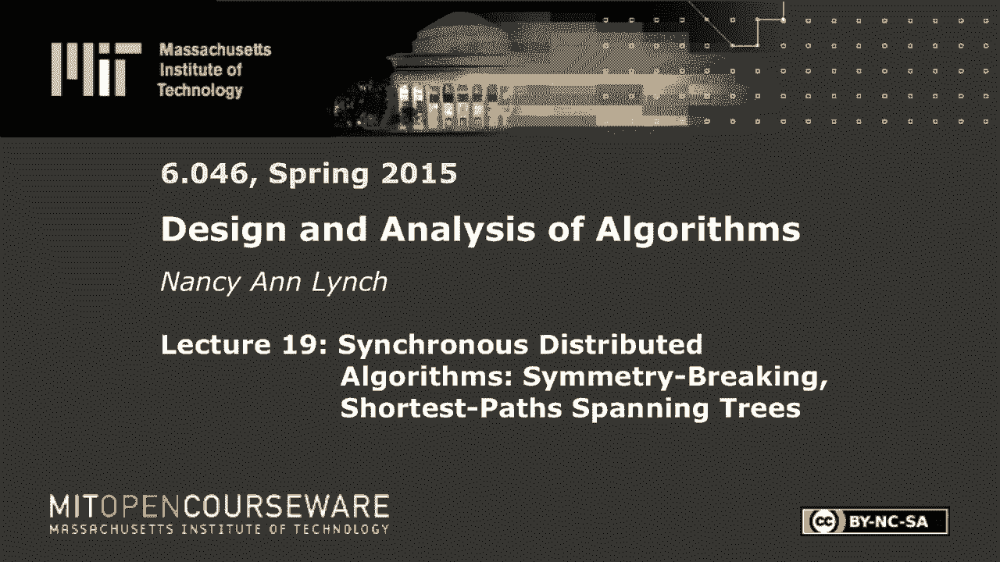

# 【双语字幕+资料下载】MIT 6.046J ｜ 数据结构与算法设计(2015·完整版) - P27：L19- 同步分布式算法：对称破坏与最短路径生成树 - ShowMeAI - BV1sf4y1H7vb

以下内容是根据知识共享许可提供的，您的支持将有助于麻省理工学院开放课件，继续免费提供优质教育资源，捐赠或查看麻省理工学院数百门课程中的额外材料。

好的，所以今天你要看到一些新的东西，事实上，这一周，你会看到一些完全不同的东西，你一直在这里学习，在本课程中，这些是算法，但它们是为了一种完全不同的模式，嗯，分布式算法，好吧，那么它们是什么，所以现在。

而不是在典型的计算机上运行的算法，你将有在处理器网络上运行的算法，也可以在一台有多个处理器的机器上，大部分计算是分布式算法，现在他们解决像在互联网上交流这样的问题，在网络设置中分配资源，同步。

在偏远地区的不同代理之间达成协议，所以这些都是分布式问题，不是你在一台电脑上就能解决的事情，您为此设置设计的算法种类，这些环境必须在极其困难的情况下工作，在极其困难的平台上。

因为你所拥有的是在许多地方进行的并发活动，许多处理器同时做事情，你不知道每个人什么时候会进行他们的活动，你可以有不同的时机，不确定性，事件的顺序不清楚，可以有到达不同位置的输入。

然后你还必须处理一些处理器的故障和恢复，或者计算中涉及的一些通道，你不会想到这些的，当你只是试图在一台计算机上运行一个算法时，所以分布式算法可能非常复杂，设计它们并不容易，在你设计它们之后。

你还是要确保他们是正确的，所以在证明它们是正确的和分析它们时涉及到一些问题，一点点历史，这个领域几乎始于60年代末，埃德加戴克斯特拉是该领域最早的领导者之一，他赢得了第一个图灵奖之一。

莱斯利兰波特去年获得图灵奖，尽管他实际上是从一个很小的人开始的，在这个领域的早期，如果你想看看一些来源，我有一本书，埃蒂亚和韦尔奇的另一本教科书，有一系列新的专著基本上试图总结。

分布式计算理论中的许多重要研究课题，最后两行有几个领域中的主要会议，好吧，所以我不能在一个星期内做那么多，我要做的只是介绍一下这个区域，通过向您展示分布式网络的两种常见模型，只介绍一些基本的算法。

一路上你会看到，一些建模和分析它们的技术，好的，这里的两个模型是同步分布式网络，和异步分布式网络，我将在同步设置中查看的问题，是领导人选举的一个简单问题，这是一个对称性破缺问题，基本极大独立集问题。

然后是几个问题，从这门课的设置来看，你们应该很熟悉，首先建立像广度这样的结构，异步情况下的生成树和最短路径树，我将重温最后两个问题，设置宽度优先和最短路径处理，好的。

所以我提到了一些关于建模、证明和分析的东西，结果是把正式的模型弄对，得到真正的证明，对于分布式算法来说，这往往是非常重要的，因为发生了这么多事情，它们很复杂，很容易出错，我们使用的模型类型是交互状态机。

输入和输出，他们互相传递信息，但是你所做的证明通常使用不变量，一种你非常熟悉的技术，从这个班，您仍然可以在分布式设置中使用它们，你仍然用同样的方法通过归纳法来证明它们。

在分布式环境中经常出现的其他事情是建模和证明，使用抽象层次，您可能想给出一个算法的抽象描述，并证明它是有效的，然后你有一个非常详细的，你可以证明的复杂的低级描述，实现更高级别的描述。

这是另一种流行的技术，你使用不同种类的复杂度来度量时间复杂度，如果是同步模型，你会测量子弹，或者接近实时，如果是异步模型，你也算交流，您发送的消息数，或者在算法中发送的总位数，好的，在这两节课中。

我们将研究分布式网络，所以你从一个图表开始，让我们看看本周的无向图，我们在这个字段中用n表示你所说的，v网络中的节点总数，或者是的，图中的顶点，我们用u的符号gamma表示图中u的邻居。

所以图的每个顶点都有一组直接相邻的顶点，那是u的γ，度是U的度是邻域的大小，顶点的邻居数，好的，所以我们有我们从图表开始，但现在我们要完成一个过程，图的每个顶点上的某种活动实体，所以这是某种自动机。

如果你学过自动机理论，它不是真正的有限状态机，它更像是可以相互影响的无限状态自动机，所以我们通常谈论图中的顶点，图顶点上的过程，但有时我们会马虎地说节点，它可能是，我们可以指顶点或活动的东西。

在顶点跑不能一直保持直线，好的，然后用图形的边缘我们会把通信通道，每个方向一个，这样这些过程就可以在本周的边缘进行交流，我不打算谈论当你引入失败时会发生什么，因为我们没有时间。

很多分布式计算理论都涉及到，当系统中的某些组件出现故障时会发生什么，你是怎么应付的，好的，所以我们将从同步分布式算法开始，它的来源，如果你有兴趣，是我书中的第一个技术章节，好的，所以在图的节点上有进程。

就像我刚才说的，他们用信息交流，所以想想每一个过程，因为不知道他的邻居是谁，对图表一无所知，那么他们有什么，他们有端口，你可以说他们有输出端口，可以在上面发送消息，然后是一些输入端口。

消息可以在这些端口上输入，因此，一般来说，进程不知道谁的端口连接到它，只有端口的本地名称，像一二三，直到，如果你有任何问题，如果有什么不清楚的地方，就拦住我问我，否则我会走得很快，我知道这一切都不熟悉。

好的，所以一般来说，这些过程根本不必区分，所以他们不必有特殊的唯一标识符，这样你就可以区分这些过程，它们可能是完全一样的，嗯，如果它们有不同数量的端口，它们并不完全相同，他们当然知道他们有多少港口。

至少港口的本地名称，好的很好，所以这些是位于图表前端的过程，他们是做什么的，所以他们执行，我们谈论这个网络的执行，它是同步的，每一轮，每个进程都查看其状态，并决定它将在所有端口上发送什么消息，好的。

所以可以发送，你知道的，不同端口上的不同消息，那么发生的是进程决定发送的所有消息，放到频道上，它们被送到另一端的过程中，好的，所以另一端的过程处于某种状态，所有这些信息都进来了。

它根据到达的消息更新状态，所以它会改变状态来响应任何进来的东西，好的，这和这个学期完全不同，到目前为止，我们将完全忽略本地计算的成本，所以每个节点都可以计算一些复杂的算法，你在这门课上学习的那种。

我们通常不考虑成本，我们更担心的是通讯费用，所以我们将关注它所需的回合数，在同步情况下和通信次数，好的，那么让我们从第一个问题开始，这里有一张图表，嗯，节点开始时可能相同。

但你想以某种方式区分其中一个是领导者，对呀，所以你有这个任意连接的无向图，只有一个过程应该选举自己为领导者，这意味着它输出一个特殊的领导信号，所有的权利，所以一个人应该这么做，那你为什么要一个领导者。

在实践中很好，领导可以协调事情，它们可以负责通信并通知其他节点，当他们被允许发送信息时，他们可以协调数据处理，基本上，它允许你集中一些计算，它可以调度其他过程，它可以分配资源。

它可以帮助在进程之间达成协议，如果他们一开始对应该发生的事情有不同的看法，所有的权利，所以让我们从一个非常简单的案例开始，你有一个小集团，这里有四个集团，其中所有顶点都直接连接到所有其他顶点。

有两个方向通道，好的，过程是相同的，好的，所以我应该问你，而不是在这里给你答案，但他们能选出一个领导人吗，所以这个定理说，一般来说，这是不可能的，或者在最一般的情况下是不可能的，好的。

如果你不管n是什么，假设我们有一个n个顶点团，不可能有任何算法可以让所有的进程运行，如果它是确定性的，过程开始时都无法区分，他们不可能选出一个节点作为领导者，你有直觉知道为什么会这样吗，它们都是相连的。

成本，其中一个是确定性的，这里不可能，没有人在做任何选择，好的，你在说话，好像有人在选择一个过程来做某事，没有人负责，所以这是一种非常不同的思维方式，是啊，是啊，所以每个节点本质上都是完全相同的。

所以如果它说可以，让我们假设我会，每个人都会假设，他们将成为领导者，然后他们，完全正确的直觉，他们无法区分自己，因为他们总是做同样的事情，好吧，让我们看一个非常简单的案例，假设我们只有两个节点。

二结点集团，通过我的通道连接的两个节点，好吧，这些是一模一样的，他们是决定论的，他们能做好什么，你可以尝试为其中一个设计算法来选举自己为领导者，但你可以展示，通过归纳法。

这些过程实际上将保持在相同的状态，就像永远的彼此，无论多久，不管你执行多少轮，所以让我们慢下来，我们可以通过矛盾来工作，假设您有一个解决这个问题的算法，好吧，这两个过程都是一样的，他们有。

它们以相同的启动状态启动，假设有一个唯一的起始状态，或，唯一启动状态，好的，所以我们可以通过对轮数的归纳法来证明，在任何一轮之后，说R轮，过程仍然处于相同的状态，好的，所以归纳步骤是可以的。

他们处于相同的状态，经过一定的回合，让我们来看看下一轮，他们的状态是一样的，所以它们生成相同的消息，好的，所以他们互相发送相同的信息，他们收到同样的信息，然后它们做出同样的状态变化。

所以它们保持在同一个状态，你可以调整一下，说这是如何工作的，是啊，是啊，问题，什么是，哦，哦，我还没说完，你说得很对，我们必须通过使用问题的要求来完成，因为算法必须解决领导人选举问题。

当他这样做的时候会发生什么，任何人，是啊，是啊，另一个节点，也是，是啊，是啊，另一个也会做同样的事情，我们在说一轮又一轮，它们保持在相同的状态，就像之前有人说的，当一个人在同一轮输出领导者时。

另一个人也会输出领袖，所以这与问题要求通知相矛盾，我们根本没有假设算法到底是如何工作的，我们只是说，然而，它起作用了，它解决不了这个问题，在节点不可区分的假设下，和确定性的，大家可以看到。

如果您有大小为n的较大集团，这将扩展，所以现在进程不仅仅有一个输出端口，它有n减去一个输出端口来连接到所有其他节点，假设它们的编号是1到n减去1，其中一种可能性，我将在这个证明中使用。

端口的编号是一致的，以便如果在一个节点上有输出端口号k，它连接到另一端的输入端口号K，好的，所以这是事情可以匹配的一种方式，如果是这样的话，我们可以做同样的证明，我们刚刚通过归纳法显示了。

集团中的所有进程永远保持相同状态，好的，同样的证明假设你有一个算法来解决它，它们都是以相同的状态开始的，你通过归纳法表明它们都保持在相同的状态，好的，嗯，所以现在我们慢一点，对于每个进程。

在每个端口上发送可能不同的消息，但每个人都在端口K上发送相同的信息，因为它们都无法区分，然后因为端口匹配的方式，每个人在端口K上都收到相同的消息，然后它们做出同样的状态变化，幻灯片，当您找到一个，哦不。

因为如果你有一个由一个集团组成的图，然后让我们说一些其他的东西，也许领导者可能是集团之外的人，所以你不能就这么说，因为有一个小集团，你不能选举一个领导人，因为你可以打破图的对称性，和图表中的其他东西。

要知道他们每收到一个K，哦，因为每个人都将在相同的编号端口上发送相同的消息，因为它们是一样的，我只是有一种方法可以连接端口，我们必须容忍他们可能被勾搭的所有方式，说对手把他们勾搭起来，是猪肉吗。

那是某人的输出，端口是另一端的输入，端口号为K，这样它们都在端口号上收到相同的消息，K实际上有可能总是这样连接木板吗，我是说这有点像摇滚，就像三口井，我这么做只是为了拉帮结派，你可以，是啊，是啊，它是。

是啊，是啊，你能做到，我的意思是你可以有端口一总是顺时针，端口2逆时针方向，哦耶，我是说在小团体里总是有办法做到这一点的，是啊，是啊，我查过了，所以好吧，这就是你刚才看到的。

是分布式算法的一个非常基本的问题，它打破了相同过程之间的对称性，你会看到确定性，无法区分的过程就是做不到，所以我们得有更多的东西，那么你认为我们可以添加什么来解决这个问题，这样我们就可以区分这些过程。

这方面的常见方法是说每个进程都有一个标识符，就像你买了一个芯片，里面刻有一些标识符，好的，所以你有某种唯一的标识符，也可以用随机性，你假设每个人都有一些数字或标识符，它知道它是什么。

它已经进入了它的状态，假设一个特殊的状态变量，他们完全被安排好了，通常它们可以是整数，或者你知道从一些完全有序的集合中，当你说唯一标识符时，这意味着不同的标识符可以出现在图中的任何地方。

但每个标识符最多可以出现，一旦你可以在一个小图形中有一个巨大的标识符空间，但您只是选择一些标识符来放入进程中，在图表中，所以这是一个设置，另一只，当然啦，就是用随机性，好的，所以让我们先看看唯一标识符。

现在问题变得容易了，让我们再看看小集团，假设有一个算法，嗯，让我们构造一个由确定性过程组成的算法，具有唯一标识符，好的，我们将保证在图表中选出一位领导人，而且，这只需要一轮交流，它只会使用n个平方消息。

那怎么行得通，这个集团里的每个人都有一个唯一的标识符，他们会怎么把它发出来，所以你可以把它发送到你所有的端口，每个人都会在其所有输出端口上发送其唯一标识符，然后他们从其他人那里收集唯一的标识符。

所以每个人都看到同一组标识符，因此具有最大唯一标识符的进程，知道这是唯一一个有该标识符的，它是最大的一个，所以它可以选举自己，领导，所以你所需要的只是唯一的标识符，以及可靠地交换它们的能力。

你可以很容易地选出一个人，好吧，好吧，做这件事的各种方法，但一个想法是，过程可以随机选择标识符，您需要足够大的可能标识符集，所以如果他们只是均匀随机地选择，他们可能会选择所有不同的标识符。

一旦你有了这些随机选择的标识符，你可以像使用真正唯一的标识符一样使用它们，唯一的问题是你可能，你有一个复制品的可能性很小，在这种情况下，您希望能够检测到这一点，并重复这一点，好的。

所以首先你需要多大的一套，好的，嗯，这里有一个例子，嗯，假设你有n个进程，独立于大小为r的空间随机选择，所以标识符是1到R的数字，r是r依赖于n，就像n的平方，但这也将取决于Epsilon。

这是你感兴趣的错误概率，结果证明n的平方除以2ε就足够了，好的，所以你的ID空间至少有那么大，然后你可以保证至少有一个负ε的概率，每个人选择的数字都不一样，这很容易证明，概率只看两个特定的过程。

他们选择相同数字的可能性有多大，只比r大一点，两者都是随机选择的，第一个选择的东西，概率，第二个选择同样的东西，只比R好，但现在你可以参加工会，只要把任何一对选择重复的概率加起来。

所以你有n的平方在n的平方在两对上，所以1/r乘以n/2，仍然使你的概率小于或等于Epsilon，你的错误概率，好的，因此您可以选择标识符，使用随机性是一个足够大的空间，概率非常高。

你可以让他们都不一样，好的，现在算法是这样工作的，嗯好吧，所以你可以得到一个只需一轮就能完成的算法，概率为1减去ε，但它会是正确的，它将有重复的回合，以防第一轮不起作用。

但预期时间只是1比1减去Epsilon，不是很大，算法是什么，好的，好的过程只是从一个大的空间中选择随机的ID，就像我们刚才说的，他们交换身份证，现在每个人都可以看到每个人的身份证。

但它们也能分辨出是否有复制品，如果最大值不是唯一的，所以如果最大值是唯一的，找到最大胜率，每个人都知道，否则你就有问题了，你必须重复，你就一直这样做直到成功，好的，所以这可以继续，但它可能会很快结束。

如果您很有可能没有副本，好的，所以故事是，没有帮助你区分某些过程的东西是不可能的，您可以使用唯一标识符来完成，你可以用随机性来做，所有的权利，第二个问题叫做极大独立集。

所以你在图中有一个最大独立集的图片，让我们试试这个光标，是啊，是啊，光标确定，所以图中的最大独立集在这里，但这是我一会儿再回来的事情，这实际上是使用最大独立集来建模，在某种生物系统中发生了什么，好的。

什么是最大独立集，所以你从一个一般的无向图网络开始，问题是选择节点的子集，所以它们形成了我们所说的最大独立集，让我们分解一下，这是什么意思，独立手段，你没有两个邻居都在片场，好的。

所以你不想让两个邻居在片场，最大化意味着无论你选择什么集合，您不能在不违反独立性的情况下添加更多的节点，所以现在这应该看起来像是几个家庭作业问题，你从一开始到最近，但我不是说它是最大独立集，我只是说。

它必须是当地的最佳，因为你不能在你的集合中添加更多的节点，在不侵犯独立性的情况下，属性有意义，有两个例子，同样的图形，两个不同的最大独立集，这里的绿色节点，我们有四个独立的绿色节点，不是彼此的邻居。

他们是最大的，我不能在集合中添加任何红色节点，在不侵犯独立性的情况下，但在这里，我们有一个同样图的第二极大独立集，现在我们只有两个节点，您不能在不违反独立性属性的情况下添加任何红色节点，换句话说。

每个节点要么在mis中，要么在mis中有一个邻居，好的，没有其他方法可以向MIS添加节点，好的，所以最大独立集的概念是有意义的，所有的权利，所以要使这成为一个分布式问题。

让我们开始假设我们没有唯一的标识符，实际上对于这整个问题，我们不会有唯一的标识符，它们都将是相同的，这些过程确实需要一条信息，它是网络大小n的近似值，顶点总数，好吧那么，我们希望这些节点以某种方式合作。

计算整个网络图的MIS，这意味着每个过程都应该找出它是否在MIS中，如果是的话，它应该输出在，如果不是，它就会输出，好的，所以你不必实际计算这个，就像你习惯解决这样的问题一样。

有人必须在一个地方收集所有的信息，没有人收集任何东西，每个人只需要知道他们是否在MIS中，所以你可以想象，这在某些图中是无法解的，通过确定性算法，就像你在领导人选举中看到的对称破缺问题一样，好的。

所以我们将直接进入这个问题的随机算法，好的，分布式MIS井的一些应用，它们出现在通信网络中，你想选择，假设你有一个非常密集的进程网络，您只想选择几个节点，就像一个覆盖网络。

你会选择一些可以负责通信的节点，您可以在这个覆盖网络上进行通信，然后最后，每个节点都可以处理与许多邻居的通信，所以这是一种常见的应用程序，但它也出现在其他地方，一个很好的例子是发育生物学，几年前。

仅联邦选举委员会就在《科学》杂志上发表了一篇论文，大概有八个作者，但是Ziv Bar Joseph是这篇论文的主要作者，所以这个想法是你在果蝇身上有一堆细胞，以及在开发过程中。

其中一些细胞应该把自己区分为，所谓感觉器官前体细胞，你想要的属性实际上是，您希望最大限度地独立一组单元格以这种方式被区分开来，所以他们写了一篇关于这件事的论文，发表在《科学》杂志上。

他们基本上设计了一种新的分布式算法，密切反映了果蝇身上发生的事情，所以我要向你们展示的是一个非常著名的算法，MIS的经典算法排序，这是迈克尔·卢比的，非常简单的算法，它分阶段执行，每个阶段有两轮，好的。

所以您从所有节点都处于活动状态开始，他们都参与了，他们不知道他们最终会得到什么，在每个阶段，一些活动节点将决定它们在MIS中，有些人会决定他们离开了MIS，有些人还不知道，所以你只要继续下一个阶段。

所有剩余的节点和它们之间的边，所以你基本上要和解，节点的某个子集发生了什么，然后缩小图形并继续，这就是算法，那么你在每个阶段都做什么，以下是活动节点在第二阶段的工作。

第一轮它在一个大空间中选择一个随机值，和以前一样的想法，这次是1到n到，第五个将随机值发送给它的所有邻居，从其所有仍然活动的邻居接收值，然后它只是看看它的值是否大于它收到的所有值。

所以这是一个局部最大值，它选择了一个值，这严格大于它所有邻居选择的值，然后它决定加入MIS并输出，但现在你想确保它的邻居，嗯，你知道它的邻居不会在第一轮加入MIS，对，因为你知道这家伙的选择值更大。

严格大于它所有的邻居，但现在你想告诉他们，他们不应该加入，他们应该在外面，所以如果你加入MIS，你要宣布，哎呀，如果你加入MIS，你要通过给你所有的邻居发信息来宣布这一点，然后任何收到像这个钱包的人。

任何收到通知的人都可以决定它不会在MIS中，它输出，因为它知道它有一个邻居在MIS，好的，所以如果你在这个阶段决定加入或退出，你完蛋了，你变得不活跃，只有剩下的活跃的家伙继续下一阶段，有道理，好的。

关于算法是如何工作的，有什么问题吗，是啊，是啊，是啊，是啊，哦好的，一个动画好吧，所以所有的节点一开始都是一样的，他们都选身份证，所以这里有一些他们选择的数字，那么哪些节点要，现在加入MIS 16。

选了十三的，好，所以他们在密西西比州，然后在同一阶段，它们所有的邻居，那四个红色的节点，将决定离开MIS，现在剩下剩下的四个节点，我们不会继续使用我们重新开始的相同ID，我们希望回合是独立的。

所以他们再次选择，他们得到新的身份证，而现在，拿着12的那个和拿着18的那个，在这个阶段要加入MIS，他们的邻居会决定不在MIS里，这只剩下一个音符，下一个阶段有四个的人，他选择了另一个ID。

但他没有邻居，所以默认情况下他比他所有的邻居都大，所以他只是加入了MIS，这就是它的工作原理，非常简单的算法，它实际上可以很快地找到一个MIS，我们怎么知道如果这一切结束了，如果每个人都决定。

我们怎么知道我们从来没有两个邻居，决定进入MIS，你加入MIS的唯一方法是如果你在你的邻居中有唯一的最大值，当你这样做的时候，你所有的邻居都变得不活跃，所以你肯定会有独立性最大化，它就会终止。

最后一组将不允许您添加更多的节点，为什么，因为节点只有在加入MIS时才会变得不活动，或者邻居加入MIS，我们只需继续这个算法，直到所有节点都不活动，好的，因此，要么节点在MIS中，要么邻居在MIS中。

所以你不可能再加了，好的，所以这具有基本的正确性属性，但你可能想知道为什么这足够有效，为什么高效，嗯，我们可以说概率高概率一，它最终会终止，更量化，我们可以陈述这个定理，n的至少一减一的概率。

所有节点在四个log n阶段内决定，因为n是节点数，这并没有告诉我们你有可能最终终止，但我们可以重复这一点，在连续的阶段重复得到相同的界，但让我们把重点放在得到概率上，至少是1-1/n。

所有节点在大约log n个阶段内决定，我们用四个log n相，所以让我们看看这说明了什么，你有一个又大又复杂的图表，在一轮中，这就像log n行为，每个阶段都要发生什么，你必须把它减少一些恒定的分数。

节点数应该下降，所以这就是证明的方式，所以我们从一个引理开始说OK，你在随机选择这些ID，你想要一个大概率，他们都不一样，所以我们有一个和以前一样的引理，它说有可能。

至少我们在每个阶段用1-1/n的平方，所有这些阶段最多4 log n，每个人都在选择一个不同的随机值，所有节点在每个阶段选择不同的值，好的，所以这让我们忽略了你有重复的可能性。

我们会在最后回到这个问题上，所以好吧，所以我们假设在每个阶段所有的随机数都是不同的，好的，所以说，这样做的关键思想是表明图形必须收缩到足够的程度，在每个阶段，所以我们要说的不是节点，但就边数而言。

我们会说在每个阶段，带电的预期边数，为什么在摇晃，好的，在阶段结束时活的预期边数最多为一半，我们在阶段开始时直播的数字，好的，所以边缘是活的，如果它的端点仍然有效，所以不是说减少一个常数分数的节点数。

我要把剩下的边的数量减少到每个相位的恒定分数，好的，所以这就是我要证明的，所以现在我有了仅有的三张幻灯片，但今天仅有的三张幻灯片上有计算，所以如果你想在网上跟踪计算，你可能必须注意。

所以让我们看看为什么，但目标很明确，我们必须把剩下的边的数量减少两倍，所以这实际上是这个算法性能的一个新证明，原始文件中的证明是相当复杂的，这是一个非常直观整洁的证明，好的，所以证明的第一行说。

如果节点有邻居，它选择了一个比它所有邻居都大的值，所以你有一个邻居，w w选择一个比所有w的邻居都大的值，但让我们说得更多，让我们说，它也比你所有的其他邻居都大，除了W，好的，所以w真的很大。

比W的所有邻居都大，比你所有的其他邻居都大，发生在你身上的事，我们知道W将决定加入MIS，你肯定会死的，不会加入MIS，对呀，好的，我不想在第一行问题上失去人，这里有一张照片，给你，它有一个邻居W。

假设w是一个选定的值，比W的所有邻居都大，但也比你所有的其他邻居都伟大，是呀，好的，如果W有那个，W要加入MIS，你绝对不会加入MIS，它将在这个阶段决定，好的，到目前为止，你需要w的值大于因为。

如果w大于，在这一点上，我们所有人都在MIS中，你不会在MIS中，这似乎应该足够了，是啊，是啊，但是看看下一行，所以哦好吧，先把这个后面的线，w选择这样一个值的概率是多少，好的，所以说。

如果它会比你所有的邻居都大，和W的所有邻居，记住他们是彼此的邻居，事实证明，在最多的u度处有u度，这里涉及的加W度节点，W必须拥有所有这些中最大的一个，所以它的概率是存在的节点数的1，最大的一个，好的。

所以它只比你的度数高一度，加上W的度，W选择一个足够大的值的概率，但你问，我为什么，这是悲观的，为什么我不直接说w大于它自己的值，因为我想做下一步，我想说节点U被它的邻居杀死的概率。

它在这个阶段的任何一个邻居，我可以算出，好的，节点U被邻居杀死的概率为，至少比它所有邻居的总和，你看着所有的，相邻集合中的顶点，然后将这个分数相加，那么我为什么要做那个额外的假设，在此之前。

w大于u的所有邻居，以及它自己的所有邻居都可以添加一个，是啊，是啊，因为否则这些就不会，这些将是重叠的事件，但这样我就知道它们绝对是不相交的事件，我们不能有，如果我们有w和w素数。

我们可以把这两个都拿着，因为对w的要求是说它的id大于w素数的id，好的，因为你有这些不相交的事件，你可以把概率加起来，你知道你被邻居杀死的概率是，至少这个总结，到目前为止还可以，所以现在我要计算。

但我想专注于边缘，所以让我们看看这告诉我们一个节点可以被杀死的方法，但让我们看看边缘被杀死会发生什么，这是节点被杀死的概率，所以边缘在这个阶段死亡的概率，至少是两个概率的最大值。

它的两个端点死亡的概率的最大值，让我们把它写成平均值，边死亡的概率是，至少是它的两个端点以这种方式被杀死的概率的平均值，好的，所以为了边缘，如果边的一个端点死亡，边肯定会死亡。

如果它以这种特殊的方式死亡，边缘就会死亡，所以边死亡的概率至少是一半中的一半，两个端点死亡的概率之和，是呀，平均概率是有意义的，你以后可能会读到这个，好的，所以现在我们可以从这个到预期的死亡边缘数。

你刚刚把所有的边缘加起来是什么，边缘死亡的概率，模具的期望边数至少是所有边的和，两个端点死亡的概率，所以你有所有边的和，你把所有的边加起来，一个端点被杀死的概率，另一个端点被杀死的概率。

所以我们现在有一个很大的总结，顶点的杀伤概率，所以我们有每个顶点的杀伤概率，这种情况发生了多少次，如果你有一个顶点，你很好，U是的端点，每一条边都出现一次，所以你有每个节点发生的杀死概率。

正好是它的度数，好的，让我用顶点来重写这个，这个总数只是一半，节点被杀死次数的概率在所有节点上的和，它的度，好的，所以我是通过用边缘来代替描述来计算的，用顶点来描述，或多或少，好的，到目前为止。

那么现在我擅长什么，我知道你被杀的概率，我在第一线有一个界限，所以我要把它插上，所以我得到所有节点的和的一半，节点次数的度，嗯，给出该节点杀死概率的求和，现在我在玩和，我可以在第二次求和中移动度。

我得到了这个，好的，所以现在让我们再看一次这个，我有和的所有节点上的和，在它的所有邻居的某种表达上，哦，但如果我在考虑一个节点，每一个节点和它的每一个邻居，这就像考虑所有的有向边，对，我看着每一个U。

我看着每一个把你和其他东西联系在一起的边缘，所以我可以把它写成这个表达式所有有向边的和，所以我得到这个表达式所有有向边的和的一半，但我们说的是无向边，无向边在这里被计算两次，每个方向一次。

所以我可以把这个和更改为无向边上的和，但现在我有两个端点要处理，所以我得到了分子中u的度和v的度，因为我看着它，从每条边的两个端点的角度，啊，好吧，有东西掉出来了，所以我在一个的所有无向边上有一半的和。

所以这是无向边数的一半，好吧，所以我不指望你能明白这一切的每一步，但它在三张幻灯片上，所以当你回家的时候你可以盯着这个，确保步骤有效，但请记住，这样做的目的是表明，你把边数减少两倍。

它是以一种聪明的方式完成的，通过计算顶点的杀伤概率，所以我们得到了减少边缘数量的结果，而现在，我们可以把它插回去，得到整个算法的复杂度，还记得我们试图证明的原始定理吗，是在log n相内决定的概率界。

嗯，你应该很清楚为什么会这样，因为，如果在每个阶段，你要把边的数量减少大约两倍，那么它将需要一些类似log n的阶段来完成，这是我刚刚放了一张证明草图，在四个log n相后仍然活着的边数，嗯。

你除以2的4 log n倍，所以你几乎什么都没有，任何边在末端活着的概率都很小，所以你得到一个小概率，算法不会在四个log n阶段内终止，我在这里加入了一个额外的小术语，你可能忘了，我需要一个术语。

有人选择重复ID的可能性很小，所以我会在最后把他们带回来，在一种小小的结合中，这样我们就得到了1/n的概率，但关键是你在每个阶段将边缘的数量减少一半，好的，你以后再看，我想解决这个问题。

或者你对此有什么问题吗，好的，这是最后的方程和计算，我们将继续一个新的想法，更多概念性的东西，好的，熟悉的问题，宽度第一生成树，设置到每个节点的宽度优先路径，但我们要在新的环境中研究它。

你这次有一个连通图，让我们假设它有一个区分的顶点，就像它已经有一升了，所以它在图中有一个明显的顶点，这将成为BFS树的根，过程不需要任何关于这个图的知识，剩下的时间都是这样，今天和星期四。

我们假设进程有唯一的标识符，我不认为我们在用任何概率，所以这将使用唯一的标识符来解决我们的问题，所以每个人都知道自己唯一的标识符，根部有一个显著的，一般已知唯一标识符，说我零，有我零知道的过程嘿。

我在图的根，所以设置是有意义的，我们可能，也可以假设每个人都知道他们邻居的唯一标识符，因为他们现在可以很容易地交换信息，并匹配，你知道的，谁通过唯一标识符连接到哪个端口，好吧，我们只做确定性。

这里会有一点非决定论，我会说得更多，但我不打算为此担心概率，好吧，那么好，它告诉你一般的设置，什么是，哪些过程应该做得好，他们应该先计算宽度，生成树以顶点v为零，分支将被引导，这个无向图中的路径。

来自V零，生成手段，他们应该先到达所有的顶点和宽度，意味着如果一个顶点与v 0的距离为d，它将出现在距离D深度的这棵生成树中，所以每个人都应该从根部得到一条最短的路径，好吧。

现在我们如何在分布式环境中计算这个，现在一个进程的输出将是它在树中的父进程，所以我们实际上不打算在任何地方作为一个整体来计算这棵树，每个人都会知道它在树上的父母，疑问句问题有意义，好的。

这只是一个生成树宽度的例子，第一生成树，这为您提供了到所有节点的最短路径，跳数最短，所以我们可以有一个非常，非常简单的算法，我们要让过程自己标记，当它们被包括在树上时，开始的时候，只有第一道工序。

i零被标记，所以你想给个主意吗，也许这是如何工作的，房间的草图将发送给它的邻居，他们将成为他们从，这都是同步的，那太好了，他们会在同步回合中这样做，所以在一定距离内的每个人都会得到信息。

以正确的子弹数来标记他们的距离，好的，所以在第一轮过程中，我零将发送一个特殊的消息，对它所有的邻居说搜索，任何在第一轮收到信息的人都会标记自己，决定i 0是它的父级可以输出，我零是我的父母，父i 0。

然后它就可以为下一轮做准备了，当它应该发送继续这个，所以在后面的几轮，如果你决定送，如果你知道你应该从上一轮发送，然后向所有邻居发送搜索消息，现在这个过程就在那里，他收到一条搜索消息。

如果他已经被标记了，那他就应该忽略这个信息对吧，一旦你被包括在树上，你不在乎是否收到其他信息，在其他路径上搜索消息，所以你只有在没有标记的情况下才会做任何事情，你收到一条消息，在这种情况下，你标记自己。

然后你标记自己，然后你从你的邻居中选择一个做你的父母，因为这是同步的，您有几个节点可以同时发送，因此，一个节点可以同时接收来自几个不同邻居的搜索消息，它想选择其中一个作为它的父母，它选择哪一个并不重要。

所以我们可以不确定地选择，只是任意地，然后它决定发送下一轮，算法清楚吗，好的，所以我提到了这个，这里有一点非决定论，只有这样，一个过程才能在几个可能的父母中任意选择，我们可以违约。

说它选择ID最小的一个，如果我们真的想让它确定性，但是让分布式算法不确定也是可以的，在这里我要说一句，这表明了在分布式环境中对非决定论的看法是多么不同，从顺序算法的方式，对于分布式算法，可以有很多选择。

也许他们都没事，但算法应该能正常工作，无论你如何解决不确定的选择，所以你想想像NP，到目前为止，你看到的非决定论的其他方式，你说你很幸运，如果这里有一条选择的道路，当你做出不确定的选择时。

或者当算法行为不确定时，所有的选择都应该有效，就像所有的道路都必须给出正确的答案，你有问题吗，每当有句谚语，只要有比赛条件，全局假设计算时间没有差异，但如果有一点点他们会得到一个父指针，换一个。

它仍然是一个有效的，所以同步模型比那更抽象，你不对本地计算时间建模，您更倾向于异步模型，你知道步骤可能需要不同的时间，这里我们假设你有一个抽象模型，每个人在每一轮都同时做一些事情，但你仍然有非决定论。

因为你知道他们可能会在同一个回合到达某个地方，不过没关系，你可以随便挑一个，它仍然有效，好的，所以不难看出，这确实给了你一个BFS树，因为您正在同步创建所有分支，你每一轮都长了一跳，它到达所有的节点。

最终因为图是连通的，每个人都发信息，一旦节点被标记，它向邻居发送信息，所以最终标记会到达所有的邻居，图中的所有节点，好的，下面是你如何得到这个例子，我以前展示过，简单宽度优先搜索。

那是这家伙发的搜索信息，我把它放在边缘的右边，以表示，很难分辨，但我把它们放在边缘的右边，从发件人的角度来看，所以他发送了一条搜索消息，好吧，它到达那里，这个箭头只是表示它到达了另一端。

这家伙选择了寄件人，它是箭头上的另一个方向作为其父方向，好的，现在收件人将发送一些搜索消息，所以他派了四个，他们都到了另一端，好吧，所以所有这些人现在都被标记了，它们包括在BFS树中。

现在下一轮他们都发了一些信息，我不会把所有的，我不会把别人会发回的信息放进去，一个寄给他的人，但我把其他的都放进去了，他们中的一些人会被忽视，但你确实通过这种方式得到了一些新的节点，那是第三回合。

第四轮，每个人都送，现在您已经包括了所有的节点，好的，这给出了我在本主题开始时展示的生成树，好的，所以这不是一个非常复杂的算法，但我想你可以看到事情会变得更糟，你想争论为什么算法能正确工作。

就像我之前说的，对算法进行推理的一种流行方法是陈述不变性，所以在这里，假设我想描述整个网络的状态，在一些数字之后，r，好吧，你对此有什么看法，这个算法r轮后是什么情况，好的。

离根距离r的所有节点都被标记了，事实上只有圆R的，只有距离在r以上的才被标记，所以要说明不变性，如果要声明不变性，我不得不说，过程的状态是什么，所以好吧，我们能说什么呢，所以这个过程有一个布尔值。

说明它是否被标记，它有一个地方可以记录父母，它有一个地方，它提供关于是否，它应该在下一轮传递一个信息，我们也应该知道它的UID，所以我会把它放在另一个状态变量里，好的，这里有一些我可以在不变性中说的话。

在R轮结束时，你说在我们查房结束的时候，距离源节点最多r的进程，根节点被标记，好吧，我可以多说一点，我可以说一个过程定义了它的父级，当且仅当它被标记，好吧，所以它不只是被标记，它还计算一个父。

父节点在它被标记的地方被计算，好的，我应该说父母是正确的，所以对于任何离源D距离的过程，如果定义了父级，那么它实际上是距离D的进程的UID，从源减去一，好吧，这说明它实际上在第一棵树得到了一个正确的。

它让父母走上了一条最短的道路，i零的这些不变性，距离零被标记，好的，我从来没有，哦，我明白你的意思了，是啊，是啊，对呀，我零没有父母，所以我想我们应该说对于i不等于，在这种情况下。

所以这将是一个不同于i零的过程，当且仅当它标记良好时，它将定义其父级，我想你刚刚注意到根节点被标记了，但它没有父母，所以那是个例外，好的，但这应该是，这不涉及我零，所以第二个，我可以修一下，其他评论。

问题，所以如果有人想对像这样的算法做一个正式的正确性证明，您将使用这些不变量，你会用归纳法来证明，事实上，有相当多的人使用交互式定理证明，做这样的证明，因为算法可能会变得非常复杂，有很多变量。

所以你知道你必须做一些簿记，你跟踪所有这些不变量，然后你想通过归纳法来证明它们都是真的，它们都通过一个归纳步骤保持不变，所以你可以使用交互式定理证明器来帮助你做簿记。

但即使是研究论文中的手工证明也会使用这种风格的不变性，好的，所以直到每个人输出他们的父母的轮数，将是任何节点从V零的最大距离，所以我们可以说这最多是图的直径，它可能只是离这个特定节点的最大距离。

消息复杂性，嗯，在这个算法中发送了多少条消息，所以每个人只会在它的所有边缘发送一次信息，这意味着所有的边缘都会向每个方向发送一次信息，所以它是边数的顺序，好吧那么好，你可以玩这个。

所以这个算法只是告诉每个人他的父母是谁，但也许当你完成了，你想知道你的孩子是谁，也是，对于这些树的许多用途，你想有一个父母，能够和树上的孩子说话，那么我该怎么做呢，嗯，可以添加子指针。

因为任何得到搜索消息并选择其父消息的人，可以给父母发回一个信息，说嘿，我是你的孩子，如果你收到一条搜索信息，你决定那不是你的父母，你可以通过发信息来帮助那家伙，说你不是我父母，在同步情况下。

如果他没有收到父母的信息，他就会知道，但事情会变得更复杂，因此，我们将向搜索消息发送父母或非父母的响应，假设我们要计算从V0到V0的距离，不仅仅是父母是谁，那很容易。

每个人都可以记录它的距离以及它的父母和标记，然后您只需在搜索消息中包含您自己的距离值，当有人收到搜索消息时，它将自己的距离设置为接收到的距离，加一个，所以我们可以跟踪并在距离上加一个。

所以很容易增强这个算法来获得这些额外的信息，好的，好了现在，流程如何知道这一切何时完成，所以每个人都可以输出父母，我知道我父母是谁，但人们怎么知道整棵树是什么时候生产出来的，没那么明显。

所以在某些设置中，你可能知道树深度的上限，然后你可以等那个回合数，但如果你不知道你对图表一无所知怎么办，没人知道，所以让我们想出一个过程的算法，我把根归零，以确定这棵树是完全构造的想法。

您通过搜索消息创建此，我怎么知道它什么时候完成，每次你想要一个节点，节点可以向其父节点发送消息，打招呼，我被标记了，然后您可以一直传播到，然后根可以计数，其实没有，如果根没有，不知道节点数。

所以这是个好主意，你没有孩子，你可以告诉你父母你没有孩子，是啊，是啊，这是个好的开始，有没有另一个，是啊，是啊，一般来说，你只是发出一个信号，当您知道您的子树完成时，所以这意味着你要在树上交流一些东西。

对呀，所以这就是你正在努力的想法，好的，所以一个终止算法来通知i零，当树完全构造好时，好的，所以让我们假设搜索消息得到了他们的响应，所以每个人都知道那里有哪些节点，哪个邻居是它的孩子，哪些不是，因此。

假设一个节点已经获得了对其所有搜索消息的响应，知道它所有的孩子是谁，好了现在这棵树上的叶子会知道它们是叶子，他们怎么知道，传播所有这些搜索消息，我是一片叶子，我怎么知道我是一片叶子，是啊，是啊。

每个人你发送所有这些搜索信息，每个人都已经说对不起了，是啊，是啊，你不是我父母，好的，所以你知道你没有孩子，因为你得到的回应，好的，所以现在我们将使用我们所说的收敛施法策略，广播正在发送东西。

聚合强制转换正在将信息扇形返回到树的顶部，好的，所以收敛施法策略会说好吧，所以树叶会把，给他们的父母发消息说他们完蛋了，现在如果我是树中间的某个节点，嗯，我怎么知道我做得很好，是你说的，您知道。

当您的整个子树做得好时，您可以计算出，首先，你必须知道你的孩子是谁，这是一个两阶段的过程，你必须通过收到对你所有搜索消息的响应来知道你的孩子是谁，你等待收到来自你所有真正的孩子的消息。

所以如果我坐在树中间，我收到了我所有孩子的留言，我知道我的整个子树都做完了，然后我可以给我的父母发一个完成的消息，这就是收敛铸造的工作原理，当它到达顶部时，如果我不知道它的孩子是谁。

它从所有的孩子那里收到完成的信息，它知道整棵树都做好了，这样我们就可以输出树的构造已经完成，它可以通过向树上发送信息来告诉所有其他人，所以他们也都知道，问题，我在最后一个零的东西，他会是最后一个。

不不不，他会是第一个知道整棵树都完成了的人，其他人都知道他们的子树什么时候完成，所以我现在还得向树下发送另一条信息告诉其他人，整棵树就完成了，还有问题吗？好的，所有的权利，所以这个，这并没有显示出什么。

这只是显示已完成的消息，它们实际上是朝着相反的方向前进的，从这些边缘，爬上树，但你可以看到它们是如何向上传播的，直到路线说没什么大不了的，它只需要最多直径的子弹和N条信息，做了信息到顶部。

一旦树真的完成了，因为现在你只是在这棵树的路径上发送消息，长度最多只有直径，这只是过程，我可以告诉其他人，不会花很长时间，要么，假设您像这样构造一棵树，并处理i-0，现在想用它来交流。

它想向所有其他节点发送一整批消息，它现在就可以把它们送到树上，这是一种确保消息到达网络中其他人的简单方法，只需将它们发送到宽度第一生成树的边缘，所以现在的信息。

每个单独的消息沿着树的边缘最多接受N个消息实例，因为你只需要穿过树的边缘，不再依赖于网络中边的总数，事实上，您可以通过流水线传输一系列消息来节省时间，这样你就可以把他们一个接一个地送过去。

另一种方法是假设你想在全局范围内计算一些东西，假设每个人都从一些初始值和过程开始，i零，试图确定每个人的初始值的某个函数的值，比如最小值或最大值或总和或任何东西，好吧。

您可以在已经构建的BFS树上收敛强制转换时这样做，所以每个人都可以把他们的信息发送到树上，我零可以收集一切，一般来说你可以积累，您可以在沿着树的路径前进时进行数据聚合，所以最终的答案。

所以消息大小不会爆炸，所以如果你想，比如说，每个人价值观的总和，每个人都把他们的价值观集中在一起，每个节点计算其子树中所有值的和，好的，所以这是相当有效的，有道理，好吧，我要跳过这个。

但你可以在一般的图表中进行领导人选举，如果你还没有一个领导者，我让每个人都跑个遍，并行首次搜索，但我们会跳过那个，因为我只想有几分钟的时间开始最后一个话题，我们下次再继续，所以这是明显的延伸。

而不仅仅是广度优先搜索树，让我们把重物放在边缘，并尝试计算最短路径，以路径总重量表示的树，所以我们要增加重量，这是一个无向图，所以它只是每个无向边缘的重量，好的，我仍然有一个开始节点，顶点的um。

进程i的v零仍然具有唯一标识符，我假设进程知道他们的邻居是谁，他们知道事件边缘的重量，它们相邻的边缘，但除此之外，他们不需要知道关于图表的其他任何事情，所以再一次，这是一个熟悉的问题。

但我们以一种非常不同的方式看待它，通过分配它，好的，因此，这些过程应该计算一个最短路径树，从某种意义上说，每个人都应该在树中输出它的父节点，假设他们也输出距离，离根节点的加权距离。

所以这被称为贝尔曼·福特算法，同样，它在分布式设置中也有相同的名称，贝尔曼·福特最短路径算法，好吧所以每个人都在记录他们目前知道的最佳距离，和他们的父母，他们知道自己唯一的标识符，以下是算法的工作原理。

这看起来很眼熟，因为你在每一轮比赛中都有贝尔曼·福特，每个人都会把它的距离发送给它的邻居，而不仅仅是发送搜索消息，现在它会发送它的实际距离信息，你收到邻居的信息，现在你做一个放松步，就像你以前看到的。

你看当前的距离，你看看你是否和邻居有了新的距离，这样如果你加上新的距离，你承受着你和邻居之间边缘的重量，你得到了比以前更好的东西，如果你明白了，那你就会提高你的距离，如果你提高你的距离。

然后您将把您的父级重置为这个新的发件人，更好的距离信息，所以这个算法是有意义的，就像你之前看到的，但不像在所有节点上运行那样，每个节点都在做自己的事情，它在等待获得更好的距离信息和重新计算。

然后它会在下一轮发出更好的信息，问题，所以这是一种思维方式的跳跃，好了，现在我将以一个动画结束，会告诉你这里发生的事情，嗯好吧，所以你从一个，初始节点，圆圈里记录了什么，是最好的距离，节点，剩下的这些。

他们知道的最佳距离是无限，所以不是我写的，所以这家伙知道零，好的打完一轮，好的，所以他发了两条信息，最佳距离，每个人都知道是b和0之间的边的重量，所以这个家伙现在估计它的距离是16。

这个16岁的家伙不是很好，因为实际上有非常迂回的路线可以到达那里，但我们需要一些时间来调整，好两轮之后，所以这些家伙，每个人都在发送他们的距离信息，但现在我们得到了，这里以前说十六岁。

但现在我们有了一个两跳的路径，给你一个更好的距离，所以你得到1加14，所以他要到这里大约十五英里的距离，因为一句话和一些新来的家伙计算了他们的距离，好的，然后三轮之后，嗯，事情变得有点复杂。

所以也许我要快速浏览一下，让你以后再研究，但你会看到，当你执行放松步骤时，你会不断得到改善，当信息通过更好的途径到达某人手中时，这些途径碰巧有更多的跳跃，他们将降低他们的估计，所以我要翻转。

你看这家伙的估计在下降，最后经过八轮，你最终会走一条非常迂回的路，这实际上给了这个家伙一个更好的估计，好的，所以你可以看到这是如何工作的，好的，所以最终每个过程的距离都是正确的最小重量路径，路径的权重。

它的父级是正确的，我想也许这是一个停下来的好地方，我们将通过这个算法及其分析来了解，下一次的大部分时间都将花在异步算法上，这是一个完全不同程度的复杂。

