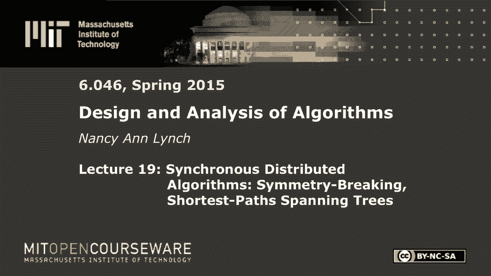

# 数据结构与算法设计：L19：同步分布式算法：对称破坏与最短路径生成树 🧩

在本节课中，我们将要学习分布式算法，这是一种在由多个处理器或节点组成的网络中运行的算法。我们将从同步分布式网络模型开始，探讨如何解决对称性破坏问题（如领导者选举）和计算图结构（如广度优先生成树和最短路径树）。我们将看到，在分布式环境中，由于并发、不确定性和潜在的故障，设计和分析算法会面临独特的挑战。

---

## 同步分布式网络模型 🖥️

上一节我们介绍了分布式算法的基本概念，本节中我们来看看其核心模型。我们从一个无向图开始，图中的每个顶点代表一个进程。我们用 `n` 表示网络中节点的总数。对于顶点 `u`，我们用 `γ(u)` 表示其邻居集合，`度(u)` 表示其邻居的数量。

每个进程是一个可以相互通信的活动实体。图的每条边代表一个双向通信信道。在同步模型中，计算以轮次进行。在每一轮中，每个进程根据其当前状态，决定在所有输出端口上发送什么消息。然后，所有发送的消息被传递到对应的接收进程。接收进程根据到达的消息更新自己的状态。我们通常忽略本地计算成本，重点关注通信成本，例如所需的轮次数和消息数。

---

## 领导者选举与对称性破坏 👑

在分布式系统中，通常需要选出一个领导者来协调任务。然而，当所有进程完全相同且是确定性的时候，在像团（完全图）这样的对称结构中选举领导者是不可能的。

**定理**：在一个由 `n` 个相同且确定性的进程组成的团中，不存在能选举出唯一领导者的算法。

**证明思路**：所有进程起始状态相同。通过归纳法可以证明，在每一轮之后，所有进程仍保持相同的状态。因此，如果有一个进程输出自己是领导者，所有其他进程也会做同样的事情，这就违反了唯一性的要求。

为了打破对称性，我们需要引入区分进程的方法。常见的方法有两种：
1.  **唯一标识符**：每个进程拥有一个唯一的ID（例如，一个整数）。在团中，只需一轮通信，每个进程广播自己的ID，具有最大ID的进程即可选举自己为领导者。
2.  **随机性**：进程从一个足够大的空间（例如，大小为 `r ≥ n²/(2ε)`）中随机选择ID。这样，所有ID都不同的概率至少为 `1 - ε`。算法重复进行ID选择和广播，直到选出一个唯一的最高ID。

---

## 极大独立集问题 🎯

极大独立集是指图的一个节点子集，其中没有两个节点相邻（独立性），并且不能再添加任何节点而不破坏独立性（极大性）。在分布式环境中，我们希望每个进程最终能判断自己是否在MIS中。

对于这个问题，即使没有唯一标识符，我们也可以使用随机算法。以下是经典的 **Luby算法**，它分阶段运行，每个阶段包含两轮：

以下是每个阶段中活动节点执行的操作：
1.  **第一轮**：每个活动节点从一个足够大的范围（如 `1` 到 `n⁵`）中随机选择一个值，并发送给所有邻居。然后，它接收所有活动邻居发来的值。
2.  **决策**：如果某个节点的值严格大于所有邻居的值，则它决定加入MIS，并输出“在集合中”。随后，它通知所有邻居。
3.  **第二轮**：任何收到邻居“加入MIS”通知的节点，决定自己不在MIS中，并输出“不在集合中”，同时变为非活动状态。
4.  在本阶段决定加入或退出的节点变为非活动状态。剩余的活动节点及其之间的边构成新图，进入下一阶段。

**算法正确性与效率**：该算法能保证最终产生的集合是极大独立集。关键在于，可以证明每个阶段结束时，图中剩余的边数期望值至少减少一半。因此，经过 `O(log n)` 个阶段后，所有节点都能以高概率完成决策。

---

## 广度优先搜索生成树 🌳

现在，我们考虑一个熟悉的问题：构造以特定根节点 `v₀` 为源的广度优先搜索树。我们假设进程拥有唯一标识符，并且根节点 `v₀` 是已知的。每个进程的输出是它在BFS树中的父节点。

**同步BFS算法**：
1.  初始时，只有根节点 `v₀` 被标记。
2.  在每一轮，所有已被标记且在上轮决定发送消息的进程，向所有邻居发送 `搜索` 消息。
3.  如果一个未标记的进程收到 `搜索` 消息，它将自己标记，并随机选择一个发送者作为其父节点。然后，它将在下一轮向自己的邻居发送 `搜索` 消息。
4.  如果一个已标记的进程收到 `搜索` 消息，则忽略它。

**算法分析**：
*   **正确性**：可以通过归纳法证明不变性：在 `r` 轮结束后，所有距离根节点不超过 `r` 的节点都被标记，并且其父节点指向距离为 `r-1` 的节点。
*   **消息复杂度**：每条边在每个方向上最多传递一次 `搜索` 消息，因此总消息数为 `O(|E|)`。
*   **轮次复杂度**：算法在 `D` 轮内结束，其中 `D` 是图的直径（从根节点出发的最大距离）。

**扩展**：算法可以轻松扩展，让节点计算到根的距离，或通过“收敛广播”方式让根节点感知整个树构建完成。

---

## 最短路径生成树 ⚖️

最后，我们考虑带权图中的最短路径树问题。每个边有一个权重，每个进程知道其相邻边的权重。目标是为每个节点找到到达根节点 `v₀` 的最小权重路径，并确定其在这棵最短路径树中的父节点。

我们使用 **分布式Bellman-Ford算法**：
1.  每个节点维护其当前到根节点的最佳距离估计 `dist`，初始时根节点为 `0`，其他节点为 `∞`。
2.  在每一轮，每个节点将其当前的 `dist` 估计发送给所有邻居。
3.  当一个节点从邻居 `u` 收到距离估计 `d_u` 时，它检查是否可以通过 `u` 获得更短路径：即 `d_u + weight(u, v) < dist(v)`。如果是，则更新 `dist(v) = d_u + weight(u, v)`，并将 `u` 设为父节点。
4.  进程持续进行多轮，直到距离估计不再更新。

**算法特性**：在同步设置中，经过最多 `n-1` 轮后，所有节点的距离估计将收敛到正确的最短路径值。消息复杂度较高，因为每条边在每轮都可能传递消息。

---

本节课中我们一起学习了同步分布式算法的基础。我们看到了对称性如何阻碍简单问题的解决，以及如何通过唯一标识符或随机性来打破对称。我们探讨了构建极大独立集、广度优先搜索树和最短路径树的分布式算法，并了解了使用不变量进行正确性证明的基本方法。这些算法展示了在处理器网络中协同解决问题的独特模式。在下一课中，我们将进入更复杂的异步分布式算法世界。