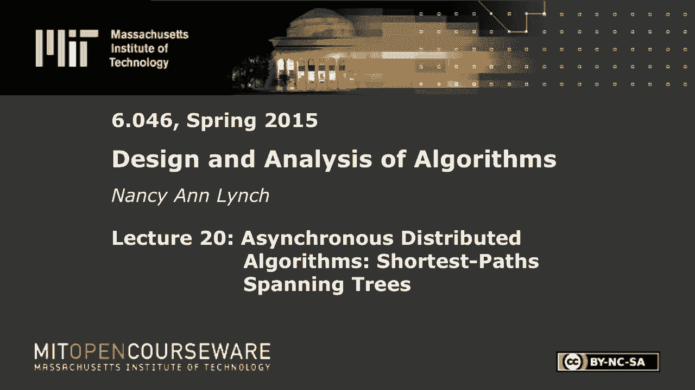
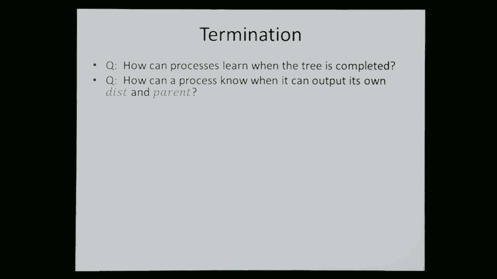

# 【双语字幕+资料下载】MIT 6.046J ｜ 数据结构与算法设计(2015·完整版) - P28：L20- 异步分布式算法：最短路径生成树 - ShowMeAI - BV1sf4y1H7vb

以下内容是根据知识共享许可提供的，您的支持将帮助麻省理工学院开放课件，继续免费提供优质教育资源，捐赠或查看麻省理工学院数百门课程中的额外材料。

好的，所以欢迎回来，这是我们本周关于分布式算法的两节课的后半部分，把它打开好的，所以我将从本周的快速回顾开始，我们只是在看同步和异步，分布式算法，不用担心像失败这样有趣的事情，上次我们看领导人选举。

最大独立集，宽度第一生成树，我们开始寻找最短的路径，我们今天就把它做完，然后我们就进入今天的主题，也就是异步分布式算法，事情开始变得更加复杂，因为并不是所有的事情都是同步进行的。

我们将重温同样的两个问题，跨越树的宽度优先路径和最短路径，好的，所以快速回顾一下，我们所有的算法都使用了一个基于无向图的模型，我们对顶点的邻居使用伽马表示法，谈论顶点的度数，我们有一个过程。

然后与图中的每个顶点相关联，我们将每个边缘的两个方向的通信通道联系起来，好的，上次我们看了同步分布式算法，在同步模型中，我们有图的过程，它们使用消息通信的顶点，进程有本地端口。

它们通过某种本地名称知道这些端口，端口连接到它们的通信信道，算法在同步轮中执行，在每一轮中，每个进程都将决定在所有端口发送什么，然后消息被放入通道，交付给另一端的流程。

每个人都同时看到他们在那一轮收到的所有信息，它们决定了一个新的状态，他们根据所有到达的消息计算出一个新的状态，所以我们从领导人选举开始，我不会重复问题定义，但这是我们得到的结果。

上次我们看了一个图的特例，那只是一个简单的小集团，如果进程没有任何区别信息，如唯一标识符，它们是确定性的，那就没有办法打破对称性，你可以证明一个不可能的结果，这表明你不能在确定性中，难以区分的情况。

你不能保证在这种图表中选出一个领导人，嗯，只是作为旁白，我应该说分布式计算理论充满了不可能的结果，它们都是基于分布式计算的局限性，每个节点只知道自己发生了什么，在它的邻近地区。

没有人知道整个系统发生了什么，所以这是一个非常强的限制，正如你所料，这会使很多事情变得不可能或困难，好的，然后我们继续，得到了两个阳性结果，一个很好的定理，确定性的算法，但是进程有唯一的标识符。

然后你可以很快选出一个领导人，或者如果您没有唯一的标识符，但你有可能，所以你可以随机选择，您基本上可以选择一个标识符，然后它几乎和那些标识符一样有效，好的，然后我们看最大独立集，记住这意味着什么。

两个邻居不能同时在片场，但是您不希望能够添加更多的节点，同时保持这些节点独立，换句话说，每个节点要么在集合中，要么在集合中有一个邻居，好的，我们给出了这个算法，我只是把它包括在这里作为一个提醒。

鲁比算法，它基本上经历了几个阶段，在每个阶段，一些进程决定加入，他们的邻居决定不加入，你只要重复这个，您可以根据再次选择随机ID来执行此操作，好的，我们证明了这个定理正确地计算了一个MIS。

而且很有可能，所有节点只在对数范围内决定，对数相位，n是节点数，所有的权利，然后我们继续扩展，首先跨越树木，这里，我们现在有一个图表，已经有了一个领导者，它有一个明显的顶点。

坐在那里的过程知道它是领导者，这些过程现在将产生一个广度优先的生成树，现在根植于那个顶点，在剩下的时间里，我们将假设唯一标识符，但是过程对图形一无所知，除了他们自己的身份证和邻居的身份证。

我们希望进程最终输出其父进程的ID，这里只是重复我们使用的简单算法，所以基本上过程只是标记自己，因为它们被包括在树中，从标记的路线开始，他向他的邻居发送了一条特殊的搜索信息，一旦他们得到它。

他们被标记并传递，所以每个人都会在一些回合中被标记，这些回合与他们的深度相对应，在他们离树根的距离上，树的深度，好的，我们用不变性来讨论正确性，所以这个算法保证的是在任何数字的末尾，r。

精确地标记距离为r的过程，标记的过程定义了它们的父级，如果你父母的定义是正确的，它是一个离根的距离为d减去1的进程的UID，如果你是一个距离D，你的父母应该是一个正确的人，有正确的距离d-1，好的。

我们分析了复杂性，时间在计算回合数，这将是最坏的情况，网络的直径，它实际上是到一个特定顶点的距离，V零与消息复杂度，在每个边缘的每个方向上只有一个消息发送，所以这只是边数的顺序。

我们讨论了如何获得儿童指针，这只是给你父母，但如果你也想找出你的孩子，那么每个搜索消息都应该得到一个响应，要么说你是我父母要么说你不是我父母，我们可以使用收敛强制转换来进行终止。

我们也谈到了一些应用程序，所有的权利，然后在一小时结束的时候，我们开始讨论宽度优先生成树的推广，增加了重量，所以你有最短的路径树，好的，所以现在你在边缘有重物，进程仍然具有唯一标识符。

他们对图表一无所知，除了他们的近邻信息，它们必须产生一个根为顶点v零的最短路径生成树，好的，所以你知道什么是生成树，最短路径是根据路径的总重量，所以现在我们希望每个节点，每个进程以最短路径输出其父进程。

也是到原始顶点v零的距离，好的，所以在一小时结束时我们看了一个版本的贝尔曼福特，您已经看到了顺序算法，作为顺序算法，但作为分布式算法，每个人都在跟踪他们最好的猜测，他们对初始顶点距离的最佳当前猜测。

它们在某个路径上跟踪它们的父母给了它这个距离估计，它们保留唯一的标识符，好的，所以现在完整的算法是每个人都将继续发送他们的距离，我是说，我们可以优化它，但这很简单。

所以在每一轮比赛中每个人都把他们当前的距离估计发送给他们所有的邻居，他们从所有邻居那里收集距离估计值，然后他们做一个放松的步骤，如果他们得到了比以前更好的东西，他们看他们能得到的最好的新估计。

所以他们取了旧估计的最小值，停止摇晃，他们通过查看传入的信息得到的所有估计的最小值，加上发送方和节点本身之间边缘的权重，好的，所以这样你就得到了一个更好的，你可能会得到更好的估计，如果你这样做了。

您将重置您的父级为，同样，如果有平局，你可以选择，您可以选择发送信息的任何节点，导致最好的新猜测，您可以将父级设置为其中任何一个，然后这就重复了，所以在一小时结束的时候，我们展示了一个动画。

我现在不打算重复，它基本上展示了如何获得大量的更正，你可以有很多垫子在一轮后看起来很好，但随着回合的进行，它们会得到纠正，所以你得到了更低的重量路径，通过有一个迂回的多跳路径到一个节点。

你可以得到一个更好的总成本，好的，这是我们上次讨论的地方，嗯，所以现在，为什么这个效果很好，我们需要的，最终每个过程都应该得到正确的距离，父级应该是它在某个最短路径上的前级，为了证明，嗯，好的。

所以你总是寻找一个不变量，在算法的中间步骤中是正确的，您可以通过，感应将保持，这将意味着你最终想要的结果，所以这里，某个数字末尾的关键不变量是什么，r，流程有什么，好的，在我们的回合结束后。

在这种算法中，估计是什么样子的，一回合后，每个人都尽了最大的努力，可能发生在单跳路径上的估计，从V零开始，两轮后，你也可以从两个热板中得到最好的猜测，一般在R轮之后，您的距离和父路径对应于最短路径。

从最多有我们啤酒花的人中挑选，是呀，所有的权利，如果没有我们的啤酒花路径或更少的啤酒花到达一个节点，他们仍然会有他们的距离估计，r轮后为无穷大，所以这不是一个完整的证明，但这是使其工作的关键不变量。

所以你可以看到，在对应于节点数的足够多的回合后，比如说，每个人都会有一条正确的最短路径，所以每次估计之前的轮数，稳定所有估计数，稳定，结果是n-1，因为到任何节点的最长简单路径都是n减去1。

如果它在到达之前穿过网络的所有节点，这是有意义的，所以如果你想确保你有最好的估计，你必须等待n减去一轮才能确保信息已经到达你手中，消息复杂度好，因为有所有这些重复的估计，它不再仅仅与边数成正比。

但你得考虑到，每个边缘都可能有许多新的估计，事实上，我写这篇文章的方式，你只要在每一轮都保持距离，所以这将是，边数乘以轮数，所以你知道你可以做得比这更好，但它比简单的BFS案例更糟糕，好的。

所以这个更贵，因为BFS只有直径轮，现在有n-1轮，BFS只有一条消息在每个边缘发送，现在我们要送很多，好吧那么，很明显，时间界限确实取决于n，而不是直径，宽度优先搜索好，只要有足够的子弹来对应实际的。

一个距离并跳到每个节点，但现在你需要足够的子弹来照顾这些间接路径，可能会经过许多节点，但最终还是得到了一个总重量更小的更短的，好的，那么大家都清楚为什么边界实际上依赖于n了吗，你有足够的轮数。

这取决于节点的总数，是呀，你能记录下每一轮，如果任何一个人的价值观放松，就像如果一切都在更少的时间后停止变化，好吧，那么你是在问解雇的事，好的好的，所以这可能是下一张幻灯片，让我们来处理子指针。

我们会回到终止，好的，所以首先这只是给你你的父母，如果你想让你的孩子，你可以和我们上次做的一样，当进程收到消息时，消息并不使发送者成为其父，这并没有提高它的距离，那么节点可以只响应非父节点。

但是如果进程收到一条消息，该消息确实改善了距离，它说啊，好的，你是我的父母，但它也可能告诉另一个节点，它可能有另一个节点，以前它认为它是它的父节点，因此，在这种情况下。

它必须做更多的工作来纠正错误的父信息，因此它必须向它以前的父级发送一条非父级消息，更正上一条父消息，好的，所以另一端的情况变得有点棘手，如果有人在跟踪它的孩子，它也要调整一下。

因为在算法过程中事情会发生变化，好吧那么，让我们说，进程跟踪其子进程，在某些场景中，它有一组孩子，好的，如果它从孩子那里得到非父消息，即使那个孩子那个孩子可能来自邻居，那个邻居可能是，它让孩子们。

然后这个过程必须把那个邻居从孩子的集合中拿出来，假设这个过程提高了它自己的距离，嗯，现在一切又重新开始了，它会再次把这个距离发送到它所有的邻居，并收集关于他们是否是孩子的新信息。

所以这里要做的简单的事情就是空的，清零，你的孩子设定并重新开始，现在，你把你的新信息发送给你的邻居，并等待他们再次回应，所以处理更正的棘手簿记，随着这棵树的结构发生变化，所以获取儿童指针比以前复杂一点。

有道理，所有的权利，所以现在回到你的问题，终止，那么所有的进程如何知道树什么时候完成呢，事实上，我们有一个更糟糕的问题，我们首先搜索这个问题，但我们有一个更糟糕的问题，现在，那是什么，是啊，是啊。

在我们有每个单独的节点之前，一旦它弄清楚它的父母是谁，它可以输出，现在你可以弄清楚你的父母，但这只是猜测，你不知道什么时候可以输出这个，那么一个过程是如何，即使是一个单独的过程。

甚至计算出它自己的父母和距离，所以你的决心有两个方面，一个是你怎么知道整件事已经完成了，但另一个甚至是你怎么知道，当你和你自己的父母和距离结束时，好的，嗯，你知道的，如果你对这个图有所了解。

比如节点总数的上限，然后你可以等到那个回合数然后完成，但是如果你没有关于图表的信息呢，你会怎么做，你把它放下，哦，也许我想，好的，我们使用什么策略来终止BFS，所以让我们从那个开始，这样容易一点。

你做了子树的事情，我们称之为收敛施放信息，当他有一片叶子，他知道自己是一片叶子，他可以把他完成的信息发送给他的父母，它聚集在树的顶部，好的，那么我们可以在这个设置中收敛铸造，原来我们可以。

但因为事情在变，你将发送完成的信息，然后事情可能会改变，你可能会多次参与聚合演员阵容，好的，所以因为树结构在变化，主要思想是任何人都可以向当前发送已完成的信息，他认为纸条是他父母提供的父母。

接收到对其所有远程消息的响应，所以它认为它不是，它知道它所有的孩子是谁，好的所以它有所有孩子的最新估计，好吧，如果它知道它所有的孩子，他们都给他发了做过的信息，所以对于你现在的孩子来说。

你现在对你的孩子是谁的信念，他们都发你发你做的消息，然后您可以在树上发送一个完成的消息，好的，但这可能比听起来要复杂一点，因为你可以改变你的孩子是谁，所以说，这意味着同样的过程可以涉及几次。

在收敛铸造中，根据改进的估计数，这里有一个例子，说明可能发生的事情，所以假设你开始，你有这些巨大的重量，然后你有一条很长的路，重量很小，所以我零开始，并发送它的距离信息在它的三个，现在距离估计为100。

它会决定它是一片叶子，为什么是因为当它给它的孩子发送信息时，给它的邻居，他们无法提高他们的估计，根据他发送的新信息，所以这家伙马上决定他是一片叶子，他把信息发回节点零，另一方面，这家伙也有同样的估计。

他发出他的信息，试图找出他是否是一片叶子，但当他这样发送信息时，他发现了，他实际上能够提高邻居的估计，因为在那之前那是无限的，所以他不认为自己是一片叶子，好的，所以我们有一个人，他认为自己是一片叶子。

并做出了回应，所以这个i 0就在那里，他必须等待其他孩子的消息，好的，到目前为止还好，所以与此同时，信息最终会四处传播，这个节点将得到一个较小的估计值，基于那条长长的迷你跳跃路径的长度，好的。

所以他会决定他不是我的孩子，所以他会告诉我零，我真的不是你的孩子，这意味着我没有停下来等他，但这个家伙也决定他不是个孩子，他变成了他上方节点的孩子，所以我现在才意识到他只有一个孩子。

但这家伙在再次尝试寻找孩子后，相信自己又是一片叶子了，现在完成的信息一直传播到树上，现在只是一条漫长的道路，好的，所以他们开始试图收敛铸件，但哎呀，他们错了，它们正在形成一棵新的树，最终树会稳定下来。

最终完成的信息会一直到达顶部，但可能会有很多错误的开始，同时，这有点令人困惑，但这就是发生的事情，是啊，是啊，可能会有一个，切换到非常，是啊，是啊，你如何确保，是啊，是啊，所以根节点不会终止。

直到它听到每个人的消息，你必须结束整个过程，所以它总是悬而未决等待某人，如果没有别人的消息，如果事情发生了变化，他们会在树的另一部分加入，我认为在这里最好的做法是手工构造一些小例子。

我是说我们不打算讨论你是怎么做的，像这样的事情的正式证明，我们现在甚至没有，你可以用来玩这些算法的模拟器，尽管如果有人对那里感兴趣，上学期我班上的一些学生实际上写了一个模拟器，这就是同步的结果。

一些同步分布式算法的例子，所以现在让我们来看看更复杂的事情，当你进入异步算法时，好的，到目前为止，你们在剩下的课程中看到的并发症，您现在有并发操作的进程，我们有一点非决定论，没什么重要的。

但现在事情要变得更糟了，我们已经没有子弹了，所以现在我们将有过程采取步骤，在绝对任意的时间传递的消息，任意命令，过程可能会完全不同步，所以算法中有更多的不确定性，非决定论与谁按什么顺序做什么有关。

所以说，理解这种类型的算法与理解你所见过的算法是非常不同的，所有项甚至同步分布式算法，因为算法执行的方式不只有一种，执行可以以许多不同的方式进行，只取决于步骤的顺序，好的，所以说。

你永远不可能希望确切地理解这种算法是如何执行的，那么你能做好什么呢，你可以和它一起玩，但最终，你要理解的是一些抽象的属性，执行的一些属性，而不是每一步都发生了什么，那是一个跳跃，这是一种新的思维方式。

所以我们可以看看异步的东西，如果你想从我的书里，现在我们在图的节点上仍然有进程，现在我们有了与边缘相关的通信渠道，所以现在这些过程将是某种自动机，但通道也将是某种自动机，我们会有所有这些组件。

我们将为他们所有人建模，um进程仍然有它们的端口，它们一般不需要有标识符，好吧，那么什么是频道，好的，所以一个通道是，它是一种自动机，无限态，有一些输入和一些输出的自动机。

所以这里这只是一张来自一个节点的通道的图片，从节点U到节点V，所以通道紫外线只是一种云的东西，它传递信息，它有输入，输入是在通道上发送的消息，因此，您可以在一端有一个进程发送消息m，另一端的输出是交付。

假设在另一端接收消息M，节点V，好吧，给这个建模，最好的事情实际上是，而不仅仅是描述它做了什么，给出了它状态的显式模型，以及当输入和输出发生时会发生什么，所以如果你想让这些信息被传递。

按先进先出顺序说好，因此，您可以使通道的状态为实际的q mq，只是一个FIFO消息队列开始为空，当消息发送时，它们被添加到最后，他们被送到，他们从一开始就被移除，所以我们所需要描述的只是一种伪代码。

我们需要描述的一切，为了描述这个通道所做的是当提升发生时发生的事情，这个频道什么时候能传递信息，当它这样做的时候会发生什么，所以提升可以随时进来，其效果只是将此消息添加到队列的末尾，那不可能是建筑。

我们听到噪音，是小精灵，我们有，嗯，只有当此消息位于队列的头部时，才能发生接收，当它发生时，它将从队列中删除，所以这有意义吗，作为对消息进入通道的描述，添加到其中，然后在某些情况下可以传递消息。

他们被移除，好的，这是对通道的描述，并用于异步系统，好的，一个过程，系统的其余部分由与图顶点相关联的过程组成，假设PU是一个与顶点U相关联的过程，但我写这只是一种速记，因为u是图中的顶点。

这个过程实际上并不知道顶点的名称，它只是有自己独特的ID什么的，但我现在会有点马虎，所以顶点u的过程，um可以执行发送输出以将消息放在通道上，它将接收输入，以便消息进入通道，进程也可能有一些外部接口。

其中有人向流程提交一些输入，这个过程在最后必须产生一些输出，所以可以有其他的输入和输出，好的，我们将用状态变量对其进行建模，OK过程应该不断地采取步骤，频道应该继续传递信息，那是一个。

这是一种叫做活力的属性，您希望确保系统中的组件都继续工作，他们不只是做一些步骤，然后停下来，这里有一个简单的例子，一个记住它所见过的最大数字的过程，所以有一个最大过程自动机，它收到一些消息，m一些值。

它就会把它发出去，它跟踪最大值，那是最大状态变量，它从自己的初始值开始，所以X代表U，x subu是它的初始值，然后对每个邻居来说，它有一个小提示，这里，它只是一个布尔值，问它是否应该发送给那个邻居。

所以这是max进程的伪代码，当它收到一条消息时，它会做什么，它会看到这个值是否比以前大，如果是这样，它重置最大值，它还做了一个笔记，它应该把这个发给它所有的邻居，每当它得到新的信息。

它会想把它传播给它的邻居，所以你看这是怎么写的，你就说，你知道的，重置最大值，然后准备发给你所有的邻居，最后一部分只是一些琐碎的代码，上面写着，如果您准备发送，然后你可以把，然后你，你知道你完蛋了。

您可以将发送标志设置为false，是啊，是啊，为了每一个邻居，哦，我以前写过邻居V，然后我写信给邻居，哦，我知道我为什么写W，所以我在这里说的是，如果您收到来自特定邻居的消息。

然后你得把它发给你所有的邻居，所以在我用V表示泛型邻居之前，但现在我不能再那样做了，因为V是消息的发送者，只是技术上的，好的，我们有这些过程自动机，我们有这个通道自动机，现在我们想建立一个系统。

我们把它们粘在一起，我们怎么粘贴，只是我们有来自过程的输出，可以与通道的输入匹配，反之亦然，如果进程有发送输出，让我们说，从u发送到v，它将与已发送的通道匹配，UV作为输入。

来自通道的接收与作为输入接收的进程匹配，好的，我所要做的就是把这些组件，我正在通过匹配这些组件的动作名称来连接它们，这有道理吗，所以我是说我如何用所有这些组件建立一个系统。

我只是有一种语法方式来说明不同组件中的动作是匹配的，问题，这都是新的，所以当这个系统很好地迈出一步时，如果有人在执行一个动作，其他人也有同样的动作，假设一个过程在做提升，通道上升了，他们都在过渡，同时。

进程发送消息，它在队列的末尾被放入通道，有道理，那么这个东西是如何执行得很好的呢，没有同步子弹，所以系统只是通过过程来运作，通道只是以任何顺序执行它们的步骤，一次一个，但它可以是任何顺序。

所以这是一个序列模型，你只需要一系列单独的步骤，没有并发性，在同步模型中，我们让每个人都在一个大街区里迈出自己的步伐，在这里，他们只是一步一步地走，但它可以是任何顺序，好的。

我们必须确保每个人都继续采取措施，每个频道都在继续传递信息，每个进程总是执行一些启用的步骤，所以对于Max来说处理得很好，我们就可以，有一堆过程，每一个现在从它的初始值开始。

当我们把它们和它们之间的所有通道连接在一起时会发生什么，你知道与他们所在的图表相对应的是什么，它们只是边缘有通道，那么这是什么行为，但所有的过程都像，我刚给你看了，他们等着听到新的Mac。

然后他们把它送出去，所有的过程最终都有好的是的，他们最终都会得到全球最大值，他们会继续传播，直到每个人都收到它，所以这里有一个动画，如果每个人都从这些圈子里写的值开始，好吧，那么现在。

记得以前他们都发一次，现在不再，让我们说，首先发生的是从五个开始的过程，在它的一个频道上发送信息，好的，所以五个人出去了，下一件可能发生的事情是另一个过程，用七个可能会把七个通过它的一个频道发送出去。

还有三个步骤，有人给我10分，有人送了一个七，有人收到一条消息，结果更新了它的值，我们继续，我在同时描绘几个步骤，因为一次做一个很无聊，但模型确实表明，它们以某种顺序迈出步骤。

所以每个人都在传播它所见过的最大的东西，最终，你最终每个人都有最大的价值，十个，所有的权利，这就是异步系统的运作方式，嗯，我们可以分析这个消息的复杂性，在整个执行过程中发送的消息总数。

最坏的情况是在每一个边缘，您可以发送连续改进的估计，所以这又是，阶数为边数的n倍，时间复杂性是一个问题，好的，所以当我们有同步算法时，我们只是数了数子弹的数量，这很容易，但我们现在测量什么。

当你知道你有所有这些流程和渠道时，我们如何计算时间，他们想什么时候走就什么时候走，是啊，是啊，所以这真的不明显，有一个常用的解决方案，就可以了，我们将使用实时，我们要做一些假设，嗯，一些基本的步骤。

最多需要一定的时间，就像，假设进程执行的本地计算时间，它的下一步是小L，你只要给出一个当地的时间限制，然后你有D作为一个通道来传递一个消息，当前在通道中的第一条消息，如果你有这样的假设。

你可以用这些来推断解决整个问题的实时上限，我是说，如果你知道传递一条信息不超过D，然后您可以绑定交付到，清空队列，通道，以及消息通过网络传播需要多长时间，所以这是很棘手的，但这是你唯一能做的。

在一个实际上没有子弹可以测量的环境中，好的，那么对于max系统，需要多长时间，让我们忽略本地处理时间，通常这被认为是非常小的，所以让我们假设它是零，嗯，我们可以得到一个非常简单的悲观，真正的上限。

上面写着完成的真实时间，整件事是网络时代直径的数量级，节点数乘以小，d是消息队列传递其第一条消息的时间，好的，所以作为一种天真的分析方法，嗯，你只要考虑最大值到达某个特定顶点需要多长时间。

沿着最短的路径，它必须经历道路上的所有跳跃，所以这就是直径，每个通道要等多久，在它移动另一个跳跃之前，它可能在队列的末尾，队伍能有多大，在最坏的情况下，改进的估计，所以我们假设它是频道交货时间的n倍。

只是为了穿越一个通道，我所做的是建模可能，队列上的拥塞，查看消息遍历一个通道需要多长时间，我们只是假设过程，处理事情，消息尽快传递，很可能，好耶，所以我们通常有，我略过了模型中的一些内容。

但你有一个活动性假设，说一个过程不断地采取步骤，只要它有什么事，所以我们会给这些步骤之间需要多长时间设定时间界限，这里的本地处理时间是零，我们可以做到这一点，你就不能喜欢。

获取一些关于正在发生的事情的信息，啊，好的，所以这是一个非常微妙的点，那么你觉得是什么，如果我做了所有这些时间假设，过程应该能够弄清楚这一点，但实际上你什么都想不通，仅仅基于这些关于上界的假设。

给步骤之间的时间设定上限并没有以任何方式，限制订单，你仍然有所有相同的可能的步骤顺序，所以没有人能看到任何不同，这些时间是不可见的，在任何意义上，它们没有标记在任何地方供进程读取。

它们只是我们用来评估成本的东西，执行的时间成本，而你不是，你只是在时间上设定上限，并不是在限制执行，如果您正在限制执行，就像你在时间上有上界和下界，那么过程可能会知道更多，他们可能，事实上。

更像是一个同步系统，所以这些时间只是用来分析复杂性的，它们不是系统中的进程所知道的任何东西，所有的权利，所以现在，让我们重温广度优先生成树问题，我们现在要计算一个宽度，异步网络中的第一生成树。

连通图区分根顶点过程没有图的知识，他们有UID这一切都和以前一样，在同步情况下，当它完成时，每个人都应该输出其父信息，假设我们把那个好的，我在一小时开始复习的简单同步算法。

每个人一收到搜索信息就发送搜索信息，他们只是收养他们看到的第一个父母，好吧，如果我异步运行会发生什么，我只是发送它，我得到一个搜索消息，然后我把它发给我的父母，每个人都这样做，不管他们得到什么。

每当他们收到第一条搜索消息时，他们决定发送者是它的父母，在这里，它不断扩大，不动了，不服从，是啊，是啊，可能是因为我们没有任何限制，关于消息发送的速度，和步骤的顺序。

可能是一些消息在很长的路径上发送得很快，所以坐在网络远端的人可能会收到消息，先在长路上，后在短路上，它得到的第一个，如果它决定那是它的父母，然后就卡住了，这不是一个进行更正的算法，好吧，那么好吧，嗯。

在我们有一点非决定论之前，当我们在同步情况下有这个算法时，我们可以同时收到两条消息，你得挑一个做你的父母，现在这种情况不会发生，因为你一次只收到一条消息，但你现在有了更多的不确定性，好的，现在。

从消息发送的顺序来看，您有了所有这些不确定性，进程采取步骤，所以有很多非决定论，记住我们对待分布式算法非确定性的方式，它应该起作用的，不管这些不确定的选择是如何做出的，好的，那么我们如何描述。

我将在这里为一个进程编写一些伪代码，这只是模仿了琐碎的算法，它可以接收搜索消息，这是输入，它可以发送搜索消息作为其输出，当它准备好这样做时，它也可以输出父，好的，那么它有什么要跟踪的呢，嗯。

它跟踪它的父母，跟踪它是否报告了它的父，它有一些带有消息的发送缓冲区，它准备发送给它的邻居，可能是搜索消息，也可能什么都没有，那么当进程按照简单的算法接收到搜索消息时会发生什么，嗯，如果它还没有父母。

然后它将其父消息设置为该搜索消息的发件人，它准备将搜索消息发送给它的所有邻居，这就是你看到的算法的核心，对于同步情况的简单算法，所以这是相同的代码，代码的其余部分是，当搜索消息在发送缓冲区中时。

它就会发送出去，一旦设置了父级，它就可以宣布它的父级，然后这面旗帜，只是意味着它不会一遍又一遍地宣布它，好的，所以这描述了简单的算法是有意义的，很简洁，它在所有这些不同的步骤中做了什么，好的。

所以现在如果你异步运行这个，正如你已经注意到的，它不一定会正确地工作，所以你可以让这个家伙发送搜索消息，但有些会比其他的更快到达，你看，你可以让搜索信息以间接的路径爬来爬去，它导致创建像这样的生成树。

它绝对不是宽度第一的生成树，宽度第一的树是这棵宽度第一的树，好的，所以你有这些环形小路，好的，所以这不起作用，那么我们该怎么办，哦哦，你要试着让它们基本上同步，这与本周的一个家庭作业问题有关，非常好。

我们要做些不同的事，其他建议，在每个过程中保留一个变量，这样你就可以做一些事情，是啊，是啊，所以你可以像我们为贝尔曼·福特做的那样，但现在的设置完全不同了，我们是为贝尔曼·福特做的，当它是同步的。

我们有重量，现在它是异步的，没有权重，好吧那么，哦，这里有几张幻灯片上的一些注释，所以这只是在强调你所经过的道路，这个算法可以比最短路径长，是的，是的，您可以分析消息和时间复杂性，复杂性，好的。

所以这里的复杂性是直径的数量级，乘以一个链接上的消息延迟，为什么它的直径，即使道路，有些路可能很长，这是一个实时上限，那就是，这取决于图形的实际直径，不在节点总数上。

为什么这个简单算法的运行时间上限会依赖于直径，因为你只有更长的路，如果它比我们建模的方式快，有点奇怪，也许吧，但我们是说，有些东西可以在很长的道路上旅行，只有当它走得很快。

但实际上最短的路径在最坏的情况下仍然在移动，你知道的，每跳d次，所以在最坏的情况下，最短路径信息将在D时间内到达那里，所以有些东西会在时间内到达那里，即使其他东西可能会更快到达那里，所以是的。

这样我们就可以设置子指针，我们可以使用收敛强制转换来进行终止，只是一棵树，这里什么都没变，好的，应用程序和以前一样，好的，但那不起作用，所以我们要回到一分钟前讨论的问题上来。

我们将使用像贝尔曼·福特这样的松弛算法，所以在同步的情况下，但是现在我们要纠正异步错误，你得到的所有错误都是因为东西在长垫子上快速移动，我们将纠正那些使用相同策略的人，所以每个人都要跟踪跳跃距离。

现在没有重量，只是跳跃距离，当他们得知一条更短的路径时，他们会改变父母，好的，然后它们会传播改善的距离，所以它和贝尔曼福特一模一样，最终这将稳定到一个实际的宽度第一生成树，好的，下面是这个新算法的描述。

每个人都跟踪他们的父母，现在他们跟踪自己的跳跃距离，他们有他们的渠道，好的，这是当你得到新信息时的关键，你收到一些新的信息，这个M是你的邻居告诉你的啤酒花数，如果m加一，这将是你对啤酒花数量的新估计。

如果这比你现有的要好的话，那么你只要用这个新的啤酒花数来代替你的估计，你把你的你知道设置给一个新的父母，将父指针设置为发件人，您传播这些信息，所以和我们以前吃的完全一样，但现在我们正在纠正异步。

我们得到更短的跳跃路径，后来有意义，好的，所以说，剩下的就是你传递信息，好的，请注意，我们没有任何终止行动，为什么呢，因为我们有同样的问题，我们以前有过程，知道他们什么时候做完，如果你不断得到更正。

你怎么知道你什么时候做完，你怎么知道这在同步情况下会起作用，我们可以在任何数量的回合后得到确切的情况描述，我们现在不能这么做，因为事情可以以如此多的顺序发生，所以我们必须声明一些更高级别的抽象属性。

任一不变性，或者你也会看到一些其他类型的属性，嗯，我们可以说，例如，作为一个不变量，你得到的所有距离信息都是正确的，如果你把你的距离设置为，它是某条路上的实际距离，在这样的道路上。

你的父母被正确地设置为你的前任，好的这只是说无论你得到什么都是正确的信息，这并不是说你最终会完成，虽然它只是说你得到的是正确的，好的，所以如果你想证明最终你会得到正确的答案，你得对时机做点什么。

你得说点什么，好吧，如果有，最多我们到节点的跳跃路径，然后它会在某个时候了解到这一点，但这取决于路径的长度，消息传递时间，和节点数，因为它们可能是拥堵，好的，所以你不仅要说事情是正确的。

但你不得不说最终你会得到正确的结果，在这里它会说到某个时候你得到正确的结果是有意义的，这就是你如何理解像这样的算法，好的，消息复杂性，因为有所有这些更正，你又回到了边缘的次数，可能是节点数和时间复杂度。

直到所有的距离和父值稳定，这又是悲观的，直径乘以，节点数乘以d，因为每个环节都可能出现拥堵，因为更正，你怎么知道什么时候完成，一个过程如何知道它什么时候可以完成想法，在我们说好之前，如果你知道N。

如果你知道节点数，你可以等那么多轮，这对你没有帮助，即使你知道网络中节点的数量有一个很好的上限，没有子弹可数，所以你看不出来，即使知道你分不清的节点数，那么如何检测终止，是啊，是啊，嗯。

但即使你知道你不能计算时间，你看，这就是异步算法所没有的，虽然我们用时间来衡量它有多长，里面的过程没有，他们只是这些异步的家伙，只是迈出他们的步伐，他们对时间一无所知，其他想法，是啊，是啊。

使用相同的收敛，我们要用同样的东西，再次汇聚铸造，和你刚才计算的想法一样，你重新计算，您的孩子指针，向当前父级发送一个done，在您收到所有消息的回复后，所以你认为你知道，你的孩子。

他们都告诉你他们完蛋了，但你可能必须做出更正，就像我们之前看到的，你可以多次参与这个聚合铸造，直到它最终一直到达根部，一旦你有了这些，你可以像以前一样使用它们，你现在的成本比这棵简单的树更好。

没有最短的路径，因为现在使用树计算函数所需的时间更少，或传播信息，因为树比较浅，发生了什么，当我们想在异步设置中查找最短路径树时，所以现在我们要增加我们刚才看到的复杂性，所有的异步，边缘有重物的并发症。

所以现在的问题是得到一个最短路径生成树，在异步网络中，进程又不知道图形了，他们有你，每个人都应该在树上输出它的距离和父母，好的，所以嗯，我们将使用另一种松弛算法，现在想想放松对你有什么好处。

你可以有很长的路，但重量很小。

出现在贝尔曼·福特的同步设置中，所以我们必须纠正那些，但由于异步，您也可以，你可以让信息在许多跳跃上快速传播，你也必须纠正这一点，所以你要纠正的事情有两种，在一个算法中，所以这是要，这很令人惊讶。

这将导致高得离谱的复杂性，消息和时间复杂度，如果您真的有肆无忌惮的异步和权重，这将给你一个非常昂贵的算法，你会看到一些指数会在那里爬行，这是异步Bellman Ford算法的算法。

每个人都会跟踪他们的父母，他们现在有消息要发给邻居，假设你有一个提示，因为它们可能是连续的估计，所以我们会在那里排队，关键的一步，放松步骤，当你收到最佳距离的新估计时会发生什么，这是与邻居的加权距离。

你看那个距离，加上中间边缘的重量，你看看这是否比你现在的距离好，就像同步行李员福特，如果是，然后你提高你的距离，重置你的父母并将距离发送给你的邻居，所以它和同步案例一模一样，但我们将异步运行这个。

因为你每次看到新的估计都要纠正，这实际上将处理两种更正，它的到来是不是因为你知道一条重量更小的迷你跳跃路径，或者它只是因为异步而来，每当你得到一个更好的估计，你要做更正，好的，很明显。

这就是你在算法中真正需要做的一切吗，这里面有什么，这个代码，好的，这就是接收，然后算法的其余部分就是你把它发送出去，当你准备好发送，好的，然后我们有同样的问题关于终止，没有，无终止，终止行动。

我们会回来的，所以你知道，很难想出不变量和时间属性，现在进行此设置，你当然可以有一个不变量，就像我们刚刚进行的异步广度优先搜索，你可以在任何时候说，无论你有什么距离，都是实际的距离。

沿着某种道路是可以实现的，父母是正确的，但我们也想有一些东西说，最终你会得到正确的距离，所以您希望声明一个计时属性，该属性表示Fine，如果你在某个时候最多有我们的跳跃路径，你想知道你的距离是。

至少和你在这条路上能得到的一样好，探索，问题是在这么长的时间里你会在这里吃什么，可能需要多长时间才能得到，嗯，对最多R跳的路径的最佳估计，我猜，它能够为广度第一搜索案例计算出一些合理的东西。

但现在情况会更糟，一点都不明显，这实际上取决于，一个频道能堆积多少消息，这可能是一个可怕的很多，指数函数，网络中节点数的指数，我要为你制作一个处决，那个，可以生成大量的消息。

这将需要很长时间来交付并延迟算法的终止，首先，让我们看一个上限，对于上限我们能说什么，嗯，从V零到任何其他特定节点都有许多不同的路径，所以我们可能要穿越，图中所有的简单路径，也许，有多少，作为上限。

你可以说，可以遍历到的不同路径数的阶乘数，从V零到某个特定的其他节点，所以这是n的指数，当然是n到n的顺序，好的，所以这上面说，您可能在任何通道上发送的消息数，可能会相应地做那么多更正，因此。

这可以将您的消息复杂度提高到n到n倍，边数，你的时间复杂度是n到n乘以n乘以d，因为在每一个边缘，你可能要等待那么多信息，更正的信息坐在你面前，所以你知道这看起来很糟糕，它真的发生了吗。

你能真正构造这个算法的执行吗，你得到这样的指数界，我们会看到的，是呀，到目前为止，你可以有任何问题，所以这里有一个不好的例子，所以这是一个由一系列，让我们说，k，k加1，k加2，我猜一条线上的节点，和。

我要加一点，图中每对连续节点之间的迂回节点，现在让我玩举重，假设在这条路上，从v零到v k加1的直接路径，所有的重量都是零，所以这将是最短的路径，从V零到V K加1的最佳权重路径，但现在我要走一些弯路。

在弯路上，我有两个边缘，一个重量为零，另一个重量为零，那是二的幂，我从2的高次方开始2到k减去1，向下到k-2，减少到二减少到一，二到零，所以你看看这个图在做什么，它在底部有一条非常快的路径。

如果你想尽快听到这件事，但实际上有弯路，这可能会给你更糟糕的道路，所以说，让我们看看这可能是如何执行的，使大量的信息堆积在一个通道中，好的，所以我的主张是，在网络的执行中，最后一个节点，bk。

两个到K个消息到下一个节点，v k加1，所以他真的会发送指数数量的信息，作出的相应更正，好吧，如果这一切发生得相对较快，这只是意味着你有一个通道，里面有指数数量的消息，清空，这将需要指数级的时间，好的。

所以你知道这是怎么发生的，DK一个接一个地得到这么多连续改进的估计，嗯，它可能得到的最大估计是什么，可以得到2的k减去1，嗯，让我们看看，所以可以做到这一点，它可以做到这一点，2除以k减去2。

加号一直到加号2到0，所以你可能会遵循这条非常低效的道路，只是在信息真正到达边缘之前的所有弯路，在脊椎上，是啊，是啊，所以你都跟着，哦，哦，你说2到k减去1个括号，是啊，是啊，完全正确。

所以BK可以承担的可能估计实际上是，就像你说的，两到K，二到k减去一，你会走所有的弯路，把2的幂相加，但它也可以有一个估计值，是2的k减2，或者2到k减去3，所有这些都是可能的，而且。

您可以执行这个异步算法，其中节点BK实际上按顺序一次一个地获取所有这些估计值，那么首先要怎么做呢，信息传播，所有的弯路，好的bk得到2的k减去1，有一条信息在传播，这家伙在下面的链接发信息。

所以这家伙到目前为止只听说过关于绕道的信息，但他把它发送到下面的链接上，这意味着你已经绕过了一个的重量，所以BK得到了一点改进，它的估计值是2的k减去2，好的，那么接下来会发生什么，我们后退一步。

节点k减去2的节点可以在下链路上发送消息，它的重量为零，为k-1，但你沿着弯路走，你进步没那么大，你刚刚提高了一个，这样你就得到了2的k减3作为新的估计，但在下面的链接上，消息最终到达，等于2的k减4。

所以你会看到这种模式，你会用二进制倒数，更左边的节点传递它们的消息，但他们做了最糟糕的事情，把信息传给BK，他必须处理介于两者之间的所有其他估计，所以如果这发生得很快，你得到的是一堆。

一个通道中指数数量的搜索消息，然后这些信息必须传递到下一个节点或网络的其他部分，不管它需要指数级的时间，在最坏的情况下把这些都清空，所以这很糟糕，但是算法是正确的，那么当一切都完成时，你如何学习。

进程如何知道什么时候可以输出自己正确的距离信息，我们怎么知道什么时候这一切都稳定下来了，和以前一样，所以你可以做一个收敛施法，我是说这是更多的更正，这样我们就可以收敛铸件，最终会收敛到根部。

然后根知道它完成了，可以告诉其他人，好的，好的，所以这里的一个寓意，你已经有了很多异步的快速剂量，所以是的，如果你什么都不做，您只需使用无拘无束的异步，在最坏的情况下，你会有一些相当糟糕的表现。

所以问题是，你对此怎么办，还有各种各样的技术，如果你明年秋天想上我的课，所以我们会讨论其中的一些，好的，如果我说一下这门课，嗯，所以这是一个基本的，这是一个TQE级别，基础研究生课程，我们做同步。

异步的，还有一些其他的东西，节点真正了解时间的地方，下面是一些同步问题，就像您已经看到的那样，但是在图中建立许多其他类型的结构，然后我们进入容错，所以有很多关于当一些组件失效时会发生什么的问题。

或者他们甚至是恶意的，你知道你必须处理系统中恶意进程的影响，然后对于异步算法，我们不仅要解决像你刚才看到的那样的个别问题，但是有一些通用的技术，比如同步器，逻辑时间概念。

这是莱斯利·兰波特的第一个也是最大的贡献，他去年获得了图灵奖。其他技术，如拍摄整个系统的全局快照，当它运行的时候，除了像我们本周所做的那样谈论网络之外，我们将讨论共享内存多处理器，访问共享内存。

并解决在多处理器中使用的问题，如互斥，容错性，然后，容错让我们研究具有一致性条件的数据对象，这是在云计算中有用的东西，如果您想对存储在许多位置的数据进行连贯的访问，你需要有一些有趣的分布式算法。

如果你让你的系统进入某种任意状态，你希望它收敛到一个好的状态，这就是自我稳定的主题，视时间而定，有些东西用，使用，算法中的时间，我们正在研究的新工作是非常动态的，你有分布式算法，网络本身正在改变。

在无线网络中出现的执行过程中，最近我们实际上在研究昆虫群体算法，蚂蚁用什么分布式算法来决定如何选择新的巢穴，当研究人员在实验室里捣毁他们的老巢时，所以那种问题，分布式算法周就到这里。

