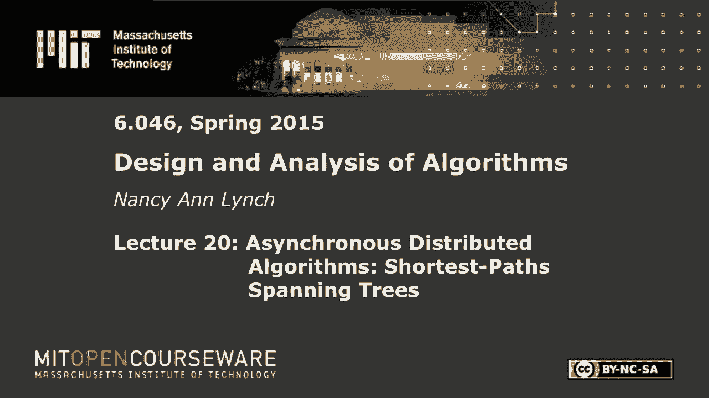
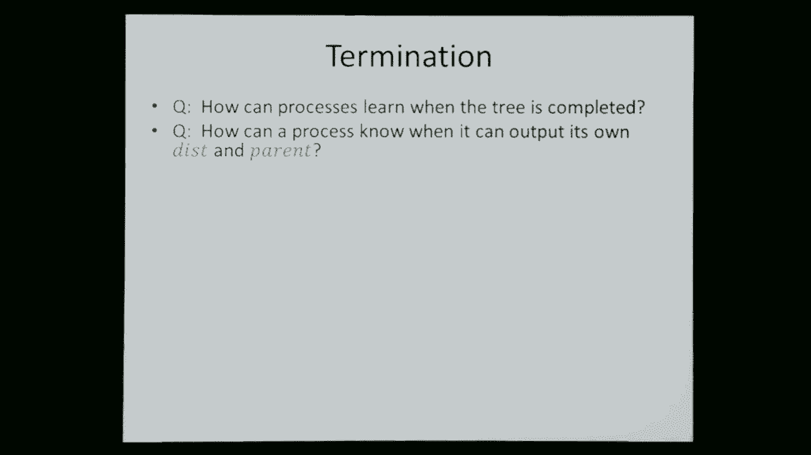

# 数据结构与算法设计：L20：异步分布式算法：最短路径生成树 🚀



在本节课中，我们将学习异步分布式算法，特别是如何构建最短路径生成树。我们将从回顾同步算法开始，然后深入探讨异步模型带来的复杂性，并学习如何在这种更具挑战性的环境中解决问题。

## 回顾：同步分布式算法

上一节我们介绍了同步分布式算法的基本模型。本节中，我们来看看我们之前讨论过的几个关键算法。

在同步模型中，图中的每个顶点都有一个关联的进程。进程通过通信信道（图的边）发送消息。算法在同步轮次中执行：每一轮，每个进程决定发送什么消息，消息被传递，然后所有进程根据收到的消息计算新状态。

我们讨论了三个主要问题：
1.  **领导人选举**：在确定性且进程无法区分的情况下，无法保证选出领导者。但如果进程有唯一标识符（UID）或可以随机化，则可以快速选出领导者。
2.  **最大独立集（MIS）**：我们学习了 **Luby算法**。该算法经过多个阶段，每个阶段一些进程决定加入集合，其邻居则决定不加入。该算法能正确计算MIS，且很可能在对数轮次内完成。
3.  **广度优先生成树（BFS）**：假设已有一个领导者（根节点）。一个简单的算法是：根节点标记自己并向邻居发送“搜索”消息；收到消息的节点标记自己，将发送者设为自己的父节点，并继续向邻居转发消息。该算法的时间复杂度为网络直径，消息复杂度为边数 `O(|E|)`。

在一小时结束时，我们开始将BFS推广到带权图，即**最短路径生成树**问题。

## 同步最短路径生成树

上一节我们开始探讨最短路径生成树。本节中，我们来看看同步环境下的贝尔曼-福特算法。

在最短路径问题中，图的边带有权重。每个进程（节点）需要输出其到根节点 `v0` 的最短距离，以及在某个最短路径上的父节点。

我们回顾了同步版的贝尔曼-福特算法。每个节点维护一个到根节点的距离估计 `dist`。算法重复进行多轮，每轮中：
*   每个节点将其当前 `dist` 发送给所有邻居。
*   每个节点从所有邻居处接收距离估计。
*   每个节点执行**松弛操作**：对于每个邻居 `u`，计算 `dist_u + weight(u, v)`。如果这个值小于当前 `dist_v`，则更新 `dist_v` 并将父节点设为 `u`。

**算法核心（松弛步骤）**：
```
对于节点 v：
  收到邻居 u 发来的距离估计 d_u
  新估计 = d_u + weight(u, v)
  如果 新估计 < 当前 dist_v：
      dist_v = 新估计
      parent_v = u
```

**正确性关键**：在 `r` 轮之后，每个节点的距离估计对应于从根节点出发、经过**最多 `r` 跳**的最短路径。由于图中最长简单路径的跳数不超过 `n-1`（`n` 为节点数），因此在 `n-1` 轮后，所有距离估计都会稳定到正确的最短路径值。

**复杂度**：
*   **时间**：`O(n)` 轮（依赖于节点总数，而非直径）。
*   **消息**：每轮每条边可能发送消息，因此最坏情况下为 `O(|E| * n)`。

**关于子指针和终止**：获取子节点指针比BFS更复杂，因为父节点关系可能在算法过程中改变。节点需要向旧父节点发送“非父”消息，并可能多次重建子节点集合。终止检测可以使用**收敛广播**，但由于树结构会变化，节点可能需要多次参与广播过程。

## 异步分布式算法模型

上一节我们处理了同步环境。本节中，我们进入更具挑战性的**异步分布式算法**世界。

在异步模型中，没有全局轮次。进程以自己的速度运行，消息可以在任意延迟后到达。这引入了更多的不确定性和复杂性。我们不再能精确描述每一步发生了什么，而是关注算法的**抽象属性**（如不变性和最终正确性）。

**系统组件**：
1.  **进程**：与图中每个顶点关联的自动机。有状态变量，能执行发送和接收消息的动作。
2.  **信道**：连接两个进程的自动机，建模为先进先出（FIFO）队列。当进程发送消息时，消息被添加到队列末尾；当信道传递消息时，从队列头部移除并交付给接收进程。

**执行模型**：系统通过一系列单独的步骤运行。任何组件（进程或信道）只要其某个动作被“启用”（例如，进程有待发送的消息，或信道队列非空），就可以执行该动作。步骤顺序是任意的。

**时间度量**：由于没有同步时钟，我们通常用“实时”来分析复杂度，并假设：
*   本地计算时间有上界 `L`。
*   信道传递其队列头部的消息有时间上界 `D`。
基于这些假设，可以推导出算法完成时间的上界，但这些时间假设对进程本身是**不可见**的，仅用于外部分析。

## 异步广度优先生成树

上一节我们介绍了异步模型。本节中，我们首先尝试将简单的同步BFS算法直接移植到异步环境。

简单的想法是：当节点收到第一条“搜索”消息时，它将发送者设为自己的父节点，并立即向所有邻居转发该消息。

**伪代码概览**：
```
状态变量：parent（初始为null）， reported（布尔值）
当收到来自 sender 的“搜索”消息：
  如果 parent == null：
     parent = sender
     将“搜索”消息加入发送缓冲区（准备发给所有邻居）
```

然而，这个算法在异步环境下会失败。由于消息延迟任意，一个距离根节点很远的节点可能通过一条长而快的路径先收到“搜索”消息，从而错误地确定父节点，导致生成的树不是广度优先的。

**解决方案**：采用类似贝尔曼-福特的松弛思想，但针对跳数（无权重）。每个节点跟踪到根的跳数估计 `hops`。
*   当收到邻居 `u` 发来的跳数 `h_u` 时，计算 `new_hops = h_u + 1`。
*   如果 `new_hops` 小于当前 `hops`，则更新 `hops`，将父节点设为 `u`，并向邻居传播新的跳数估计。

这样，节点可以纠正因异步消息顺序导致的错误父节点选择，最终稳定到正确的BFS树。

**复杂度与终止**：消息复杂度可能因多次更正而变高。终止检测同样可以使用收敛广播，但由于估计值会变，节点可能需要多次参与广播过程。

## 异步最短路径生成树

上一节我们解决了异步BFS问题。本节中，我们考虑最一般的情况：在异步带权图中构建最短路径生成树。

我们现在要结合两种复杂性：
1.  **权重**：需要找到总权重最小的路径（如同步贝尔曼-福特）。
2.  **异步**：消息延迟任意，可能导致节点先收到非最优路径的信息。

算法自然延伸自异步BFS和同步贝尔曼-福特。每个节点维护距离估计 `dist`。当从邻居 `u` 收到距离估计 `d_u` 时：
1.  计算 `new_dist = d_u + weight(u, v)`。
2.  如果 `new_dist < current_dist_v`，则更新 `dist_v = new_dist`，设置 `parent_v = u`，并将新的距离估计发送给所有邻居。

**算法核心（异步松弛）**：
```
当节点 v 收到来自邻居 u 的距离 d_u：
  候选距离 = d_u + weight(u, v)
  如果 候选距离 < dist_v：
      dist_v = 候选距离
      parent_v = u
      将 dist_v 加入发送缓冲区（准备发给所有邻居）
```

这个算法能同时处理因权重产生的更正（发现更轻的路径）和因异步产生的更正（发现更少跳数的路径）。



**正确性**：可以证明一个**安全性**属性：算法执行过程中，任何节点持有的距离估计总是等于从根节点到该节点的**某条实际路径**的权重。同时，还有一个**活性**属性：最终，每个节点都会收敛到正确的最短距离。

**最坏情况复杂度**：问题在于，在异步和权重的双重作用下，最坏情况下的性能可能非常差。
*   一个节点可能会收到大量连续改进的距离估计。
*   考虑一个精心构造的图：一条主干路径权重为0，但包含许多条权重为 `2^k, 2^(k-1), ..., 1` 的迂回路径。在异步执行中，末端的节点可能按 `2^k, 2^(k-1)+?, ...` 的顺序收到指数数量级（`O(2^k)`）的不同距离估计。
*   这导致**消息复杂度**可能达到指数级 `O(2^n)`。
*   **时间复杂度**：由于信道中可能堆积指数级数量的消息，清空它们也需要指数时间。

**终止**：尽管性能可能很差，算法最终是正确的。终止检测依然可以借助收敛广播来实现，根节点最终会知道整个计算已完成。

## 总结与展望

本节课中，我们一起学习了异步分布式算法，重点关注了最短路径生成树问题。

我们从同步算法的回顾开始，理解了轮次模型下的BFS和贝尔曼-福特算法。然后，我们进入了异步模型，认识到其核心挑战在于消息传递和进程执行的任意时序。我们看到了简单的异步BFS算法会失败，并通过引入距离（跳数）估计和松弛操作来纠正它。最后，我们将问题扩展到带权图，得到了异步贝尔曼-福特算法。该算法虽然最终正确，但在最坏情况下可能具有指数级的消息和时间复杂度，这揭示了在无约束异步环境中设计高效算法的难度。

本节内容指向分布式算法中一些更高级的主题，例如：
*   **同步器**：在异步网络上模拟同步算法的技术。
*   **逻辑时钟**：用于推理异步事件顺序的工具。
*   **快照算法**：捕获分布式系统全局状态的方法。
*   **容错**：处理进程失败或恶意行为。
*   **自稳定**：使系统从任意状态收敛到合法状态。

这些主题构成了分布式计算理论丰富而深刻的研究领域。

---
*本教程根据麻省理工学院公开课（MIT OpenCourseWare）6.046J课程内容整理，遵循知识共享许可协议。您的支持有助于MIT继续提供免费优质教育资源。*