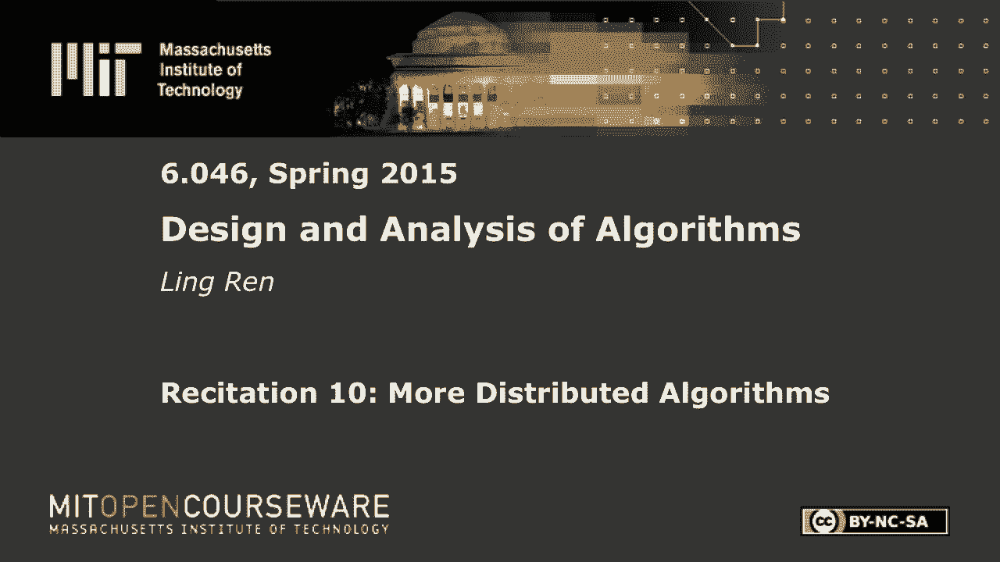
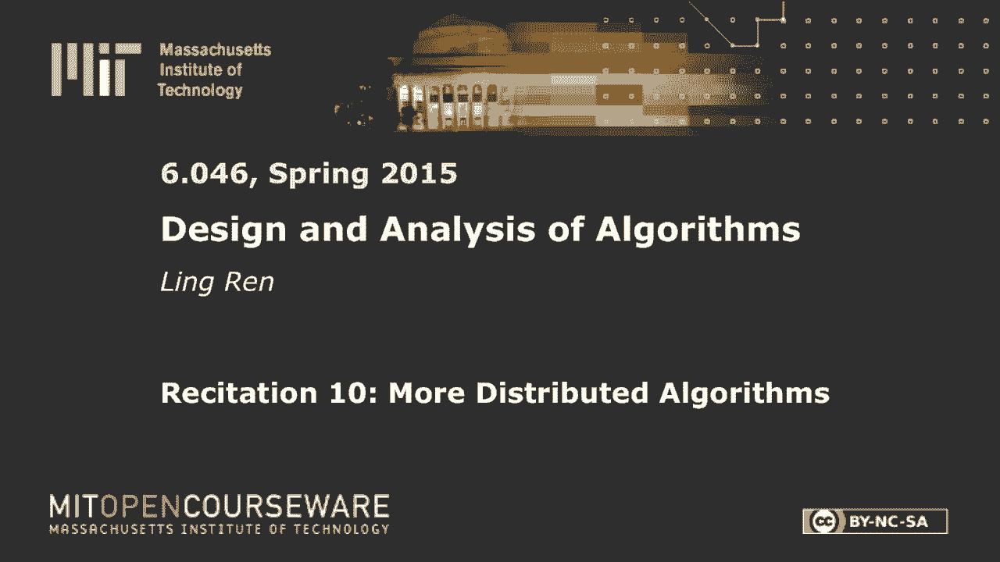

# 【双语字幕+资料下载】MIT 6.046J ｜ 数据结构与算法设计(2015·完整版) - P29：R10. 分布式算法 - ShowMeAI - BV1sf4y1H7vb

以下内容是根据知识共享许可提供的，您的支持将有助于麻省理工学院开放课件。

继续免费提供优质教育资源。

捐赠或查看麻省理工学院数百门课程中的额外材料。

所有的权利，让我们开始吧，今天的主题是分布式算法，我们将研究两个新的算法，但它们和你在讲座中看到的相似，所以这也将是对讲座中一些概念的回顾，所以我们的第一个例子是领导人选举，最简单的例子。

但这一次网络拓扑将是一个环，所以在讲座中，我们看到的示例是单击，意思是它们完全相连，每个节点都可以与上面的其他节点对话，如果你还记得我们的解决方案是让每个人生成一个UID或一个随机数，如果你是最大的。

然后输出，你是领导，你能这么做是因为，是啊，是啊，你和每个人都有联系，所以你马上就知道每个人产生的随机数，你可以比较你是不是最大的，如果我们有一个戒指，想法是一样的。

所以你希望每个人都生成一个ID或随机数，从现在开始我只说ID，你想收集其他人的身份证，这样你就知道你的ID是不是所有ID中最大的，当你用比较数字进行比较时，竞争在哪里，好的，问题是比较发生在哪里。

所以我们首先需要一些方法来传递数字，这样每个人都有其他人的号码，你有每个人的号码，然后你就可以比较最大的是不是等于你的，如果最大的和你的一样，然后你知道你是最大的，你会输出，我是领导，好的。

所以困难在于如何传递这些数字，这样每个人都能看到其他人的号码，你能做的不多，你只要和你的两个邻居联系，左边和右边，那么如何传播信息，您可以最大限度地使用您的ID，好的，那么广播是什么意思呢。

在这里我可以告诉你的邻居你最大的价值是什么，好的，而且是的，让我叫他们abc，如果是的话，我们可以告诉D，或者能告诉B，但是C怎么告诉E，后来左右，它只是说每个人都和它的右邻居说话，然后B有一个ID。

c有这个ID，d有这个ID，然后继续，下次传来传去，所以我想说清楚，说他们生成了一些随机的ID，那是五个，十，二十，然后在下一轮中，A将把它的ID发送到B，b将其ID发送到c，c将把它的ID发送到d。

在下一轮中，B将把这些信息传递给C，c将把信息传递给d，然后继续，最终每个人都会有其他人的身份证，那么我们需要跑多少次，如果有n个节点，在系统中它们可能只是一个方向还是两个邻居。

我想你可以做任何一种方式，会是，如果你双向传播，你可能快了两个X，都是n，但为了简单起见，假设我们只是向一个方向传播，那也可以，仍然都是n，所以总共发送了多少条消息，对每个人来说都很明显吗，是啊，是啊。

每个人，每个人，每个人，每个人都发出一个信息，或者你可以想到每一条信息，消息被传播n次，总共有n条消息，好的，是啊，是啊，那绝对是你的解决办法，你可以想象这可能是天真的解决方案，我们能做得更好吗。

在这种情况下，呃，我们假设他们知道他们中的任何一个，好的，呃，好问题，所以如果我们如果他们知道有N个，是的，然后他们就知道如何终止，所以你的问题是如何终止权利，如果他们不。

最终你会在另一边收到自己的ID，如果我们继续向左发送，最终你在左端口收到它，是的，是的，那是一个，那是终止的表示，是啊，是啊，我们通常假设，是啊，是啊，要么是唯一的用户，呃，对不起，uid，顺便问一下。

你代表什么，或者如果你在很大范围内生成随机数，它们相撞的可能性极小，所以我们能做得更好吗，有一些想法，你只传给那个，好的，我想你有两个想法和二分搜索，我们稍后会看到它是如何工作的，所以你说，只向前。

更大的东西，早上好，好的，是啊，是啊，那是在正确的轨道上，所以我们可以做的一件明显的事情是，我们实际上不在乎所有的ID是对的，我们只关心某个ID是否是最大的，例如，在这种情况下。

当A发送ID五给B B知道这五个不会是领导者，因为五个太小了，比他的身份证还小，所以我们可以选择放弃这条消息，没有必要进一步传递这个信息，对于这个消息消息C知道10太小了，它不必传递它，谢谢。ID的。

它只是每个节点随机选择的整数，说，是啊，是啊，ID的唯一目的是打破对称性，所以是的，就像我们在讲座中看到的那样，如果他们不这样做，如果他们没有任何唯一的标识符，他们将无法选出领导人。

当他们有一个唯一的号码时，然后他们可以选择是的，最大的还是最小的，或者以某种方式，好的，这个优化有意义吗，我们可以剪掉几条消息，没有机会成为领袖，它的上界是真实正确的，是的，那是耶，很好的问题。

顺便说一句，回答得很好，但这口井的效果有多好，在一般情况下，你可能，我们也许可以放下一些信息，但有些病态的情况下，它实际上没有任何帮助，说，这是我们选择的ID，然后有二十个的时候，它被传来传去。

B不能把它扔对，因为它，它可能是最大的，当这十个被送到，CC不能放弃它，当二十个来的时候，它也不能把它扔对，所以任何节点都不能丢弃任何消息，它最坏的情况仍然是n平方，好的，所以让我们考虑二分搜索等价。

是啊，是啊，如何在这种情况下进行二分搜索，一三二一，是啊，是啊，好问题，不是很明显的二分搜索到什么，嗯是的，只是一些二元的想法，这将给我们一个n log n绑定，所以其实，那是，这是更好的算法。

但是一旦你登录了，你大概可以猜到，好的，去吧，我会有一种融合，喜欢而不是，呃，寻找最大值，像局部最大增益，是啊，是啊，那是在正确的轨道上，是啊，是啊，所以说，那绝对是个好主意，让我们稍微详细一点。

你是如何执行的，呃把它分了，呃，好的，所以它让他们分别选择他们的领导者，并比较哪个更大，这是一个有趣的想法，婴儿在这两个CD之间找到最大值，找到最大值，它只是有点融合，所以我把它们作为一个。

我想我看到的第一个困难是如果你把它切成一半，它不再是一个戒指，这绝对不是一个容易的问题，另一个简单的算法，这个想法是，呃，嗯，你有正确的想法，我们想，呃，怎么说来着，让弱小的候选人早点闭嘴。

我的意思是说我们有几轮，所以这个B和A和C，我们只让b先传播到a和c，如果b是ABC中的局部最大值，然后B会试着进一步交谈，幅度，如果b不是abc的局部最大值，然后是的，它可以很安静。

它不需要再发消息了，如果B在下一轮成功，然后它会进一步增加它的范围，试图与更多的人交谈，那么它是如何详细工作的呢，所以圆圆的，i，我们将让一个节点向上发送此消息以提高到I，呃，啤酒花。

在这种情况下是一个，下一轮是两个，然后是四个，如果在任何时候，沿这个范围的某个节点决定您不是本地最大值，然后他们会回答说，是啊，是啊，你可以，你再也不需要发消息了，他提出的这个终点，我跳。

然后这个家伙就会回应，而这个家伙，如果它仍然认为你是当地的最大值，然后它就会回应消息，好说是的，继续，这个发送者在两边都接收到这个连续的消息，然后它就会继续到下一轮，否则它就会不活动，算法清楚吗。

我们如何选择下一个最大值，不要，我再说一遍就像之后，呃，就像呃，别再说了，就像，我们必须选择一种模式，不得不说，哦好吧，在第一轮每个人都给他们发信息，好的，那么他们中的一些人就会变得不活跃。

因为他们知道他们不是最大的，其余的，幸存者中的幸存者会继续发送信息，然后耶，他们中的一半可能会在下一轮中死去，幸存的人不断地发送信息，有道理，发送消息怎么办，呃，如果你只和它的邻居交流，不知道的权利。

所以我们会发送这个表单的消息，说，一些信息，然后我们会派一个跳跃，方向不是向左就是向右，这个跳跃最初将被设置为两个，将回合数提高到i，然后当这个人收到消息的时候，它会减少跳跃数并传递它。

转发消息时的每个节点都会将h减少1，最后当它到达这里时，那个数字变成零，当您看到节点看到零的消息时，跳，数一数，它会逆转它，把它送到另一个方向，再次设置为两个种族Y，在某一点上。

所以某个节点可能会决定这个太小了，它没有机会，然后它就可以直接把它送到相反的方向，回复一条消息说是的，你太小了，好的，所以关于算法本身的任何问题，如果没有，下一步是什么，是啊，是啊，时间复杂度。

所以我已经声称这是一根木头，n，是不是，这个是圆的，这是信息，这也是消息复杂性，那为什么又来了，后来在大厅里做了一个游说，所以我们有一定数量的回合，我们有多少发子弹，是啊，是啊，也许但是的。

我只想说登录，我们要计算，比如在每一轮中有多少节点仍然处于活动状态，在那一轮中发送了多少消息，活动节点数就是这个数字，如果我们从零开始，为什么大家都是第一次活跃，在下一次，他们中只有三分之一会活跃。

但我们说过我们在这里很保守，我们把一半放对了下一轮实际上是五分之一，因为局部最大值，如果是局部最大值，意思是这两个和那两个会不活跃，所以这是仍处于活动状态的节点数，他们会把信息发送到，这么多啤酒花。

有两个方向，你把消息发回，然后对不起，转发消息，就会有人回复，但最后这是n log n，我想我有八个，然后登录，所以我的背诵笔记上说是给log n的，不完全确定发生了什么，但你可以仔细检查这是否正确。

还是背诵笔记正确，i是冰上回合的回合数，是啊，是啊，这么多节点还在活动，他们每个人都会发送信息，这么多啤酒花，我没有提到这是否是，网络是同步的还是异步的，事实证明它不在乎，该算法既适用于同步。

也适用于异步，显然它适用于同步网络，如果是异步的，然后呢，变化的是不同的节点在不同的轮次，某一轮，某个节点可能比其他节点遥遥领先，但是没关系，最终它们会收敛到正确的结果，好的。

所以让我们来看看第二个问题，问题定义得更简单，呃，我们只想计算外面有多少节点，我们希望算法既同步又异步地工作，我的意思是我们有一个网络，说你在那之后有很多节点，只想数一下这个网络中有多少节点。

所以我给你一分钟，让我们先想出一个高水平的计划，现在问题解决了吗？好的，我还没有定义，我们现在不要担心复杂性，就目前而言，复杂度取决于节点数n和边数，让我们让它在功能上正确，有人能分享一个高级策略吗。

去吧，嗯，所以每个音符都存储了类似的，其他地方的想法，如你所见，基本上它会送这个，这个在什么边，是啊，是啊，不是两边都有，好的，所以也许你把一个放在这里把一个放在那里，那么这个节点会认为它有一个子节点。

它有一个孩子的权利，就是这个，这么说吧，这是整个网络，它向这个人传递了什么信息，你可能需要送两个过来因为你有一个这可能是它的孩子对吧，但是我们重复计算这个节点，你看到问题了，没有他们的想法，哦耶。

他们有艺术家，你可以，哦，好的，我们要把所有的身份证，好的，是啊，是啊，那是个有趣的想法，然后你还是，你可能还需要一条路线，那个有的会有每个人的身份证，然后看看有多少独特的家伙，好的，有趣。

这个算法有效吗，是啊，是啊，我看不出有什么问题，好的，让我，因为它更接近讲座中的内容，所以我们要找到生成树，这个网络的，生成树意味着好，就像我必须剪掉其中的一个边缘，如果我有一棵树。

然后我可以让每个孩子向父母报告，我有吗，这个节点将汇总他所有的子节点并向它的父节点报告，每个人都明白吗，所以首先我们要找到生成树，我们怎样才能找到这棵树好问题，所以在讲座中，我们看到了一个算法，生成树。

这是讲座的回顾，它是如何工作的，每个节点都会说我们需要首先选择一个根，我们的根会向它的邻居发送一个消息，是的，是的，说你是我的孩子，你是我的孩子，你是我的孩子，你是我的孩子。

然后每个节点在收到来自父节点的消息时将，所以没有父母的邻居，将确认此发件人为父，好的，有点乱，因此此节点将搜索到叶节点，但它也会试图寻找这个家伙，但这家伙已经有父母了，然后是的，我会说我已经有父母了。

废话废话，这将给我们一个BFS生成树，这是什么意思，这是BFS发现的一棵生成树，它适用于异步网络吗，版本做，但有一个不同的版本，它是一种边缘放松，正确，那么为什么这个版本不适用于同步网络呢。

不同的节点可以在不同的数字上，这样一条更长的路最终可能会去，是啊，是啊，正是如此，让我举一个具体的例子，异步网络意味着消息以不同的速度传播，说这个链接由于某种原因暂时关闭了，此节点不接收来自根的消息。

然后这个信息传播得很快，这个信息也传播得很快，因此此消息可能会更早到达此节点，然后这个节点会把它看作是这个节点的子节点，好的，然后这个信息终于出现了，但是这个节点说，是啊，是啊，我已经有父母了。

我要拒绝你，所以它使它跨越，是呀，说得好，这不是BFS生成树，但它仍然是一棵跨越的树，所以在我们的问题中，我们完全没意见，是啊，是啊，但你必须知道，如果您真的想要异步网络中的BF生成树，那你就得喜欢。

记录距离，放松等等，好的，所以我们就用这个算法，BF的生成树算法只是异步运行它，它找不到BFX生成树，但它发现一些找到和生成树，好的，这个算法是如何工作的，我们会有几个变量，第一个是父母。

我们将它初始化为这个未定义的单个，好的，然后每个节点将传递此搜索消息，我将用一个略为速记的符号，然后呢，从讲座中，好的，假设我写的代码是为了一个进程，如果我们收到消息，的搜索消息，如果我还没有父母。

我应该设置父级，成为，好的，那么下一步是什么，我们从父母那里得到了这条搜索信息，我们必须把它传递出去，有你的孩子，哦耶，伟大的嗯，是啊，是啊，我们首先需要回应说，好的，我会用一个更短的符号。

V是一个队列，这就是消息，会在某个时候发给我的，我们发送的消息是父消息，父母2，这是对V说是的回应，你是我的父母，好的，然后呢，你也要回应，通过说，零，你不是我父母，因为我已经有其他父母了。

我这里缺了一步，如果我们收到搜索消息，去吧，发送消息给所有的是的，我们需要把它传给我所有潜在的孩子，意思是你的邻居，然后我会给他们发信息，自从我们创造了一个，我们有一个搜索消息，我们知道如何处理它。

现在我们发送这个父消息，2。我们最好马上就处理好，所以下一段代码应该是，如果我们收到此父消息，我会说当前B，这意味着这条消息要么是真的，要么是假的，我从某个节点收到这条消息，w，好的，我还是你在这里。

因为我只是把所有的信息发送给所有的W，给我所有的邻居，他们应该给我一个回应，好的，如果b是表示这个特定w的，把我当成它的父母，有道理，所以我最好有一份我孩子的名单，我想追踪一下，我想跟踪一下。

我们将为将要初始化为什么的子变量创建一个新变量，是啊，是啊，空集，而现在，如果这个b是1，然后我要把w放在这个子列表中，因为我们的路线，应该会有一点不同，所以其他节点都会发送搜索消息。

当它收到搜索消息时，我们需要有人发起，u等于根，我们说根是v零，所以首先要做两件事，我们应该把它的父级，到某种特殊的价值，我只想说根，然后我应该把这段代码复制到这里，有点挤，但我希望它仍然难以辨认。

好的，这已经几乎是正确的算法了，除了我们不知道如何终止，如果我们等得够久，然后每个人都会收到所有的回应，每个人都会知道，嗯，它的父母，它没有孩子，但我们如何终止，是啊，是啊，那是一个。

这是N个神经元之后的一种方法，但关键是我们试图找到n是什么，我们不知道有多少个节点，如果我们看到它收到的所有地方，哦耶，如果您收到响应，父母或父母，你所有邻居的一个，那你的工作就差不多完成了。

但其他人没有，所以说，你发送信息很快，他们回应了你，他们仍然非常努力地工作，好的，那么，我们需要使用讲座中的技术，叫做收敛铸造，所以当它完成时，每个人都会发出一个完成的信号，它所有的孩子也都做了。

去做那件事，我将定义一个名为search的新变量，W已经回应，我会把它放到搜索列表中，不管它是接受我做父母还是拒绝我，那么我自然需要在这里定义这个变量，他们搜索名单，等于我的邻居列表。

这意味着每个人都有回应，我所有的孩子都做完了，那么我需要一个新的变量，谁完成了，谁没有，好的，只是为了再次，搜索的这个意味着有人已经回复了搜索消息，好的搞定了，意味着它所有的孩子都做完了，好的，它是。

呃，我没读过什么，如何定义完成，我给我一分钟，在这种情况下，我要给我父母发个信息，这是收敛的一步，铸造，我该发送什么，我要送他们去，我受够了，那么每当我们创建一条消息或我们应该处理该消息时。

如果我们收到一条消息，我受够了，我们从w开始做什么然后我们要标记那个节点，就像做的那样，好的，这是有一个微妙的点，所以必须有人启动下行信号，那将是我们的叶子因为当这个条件检查时，他们没有孩子。

他们的子列表是空集，他们的完成列表也是空集，所以他们会先发出“我做完了”的信号，然后，当所有的子节点都完成时，所有的中间节点都将发送一个完成信号，所以这是收敛铸造版本，只给了我们生成树搜索的终止点。

我们还没有计算网络中的节点数，那是一个小小的修改，我们只是要把这个数字包括在I'm done信号中，所以我需要定义另一个变量total，让我们初始化为零，这个变量将跟踪我的子树中有多少节点。

包括我和我所有的孩子，然后当我发送，我不发信号了，我要走了，我要寄这个抱歉，那是不对的，当我发出“我做完了”的信号时，我要把我的后代总数和它一起寄去，当我收到某人，我的一个孩子报告说我确实有两个孩子。

2。我得把我的总额增加那个数，我又犯了一个错误，应该是全部，加一个，因为我在数我所有的孩子，然后我应该包括我自己，这就是完整的算法，是啊，是啊，一个目的是创建一个不同的角度来看待分布式算法。

你通常只是画网络图。