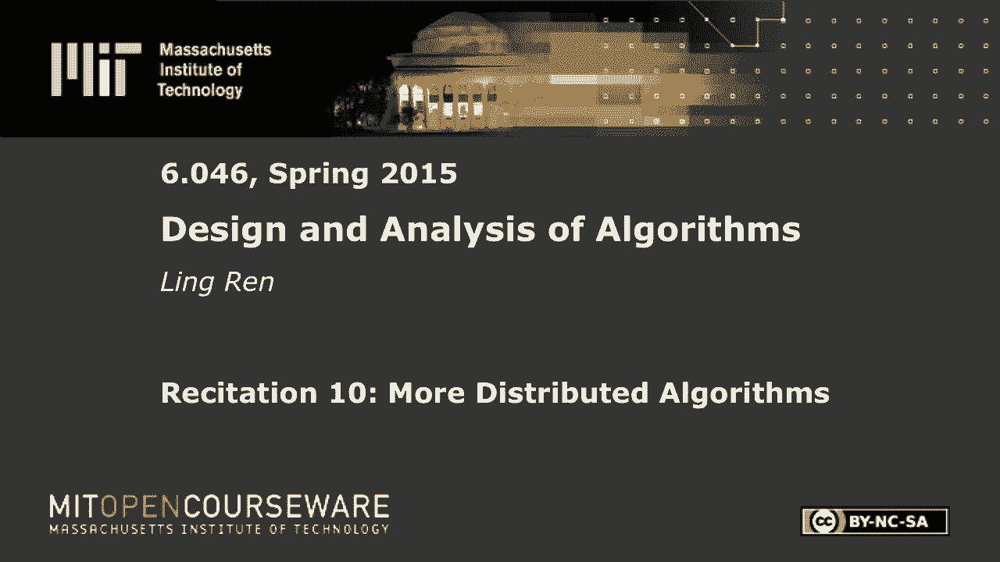
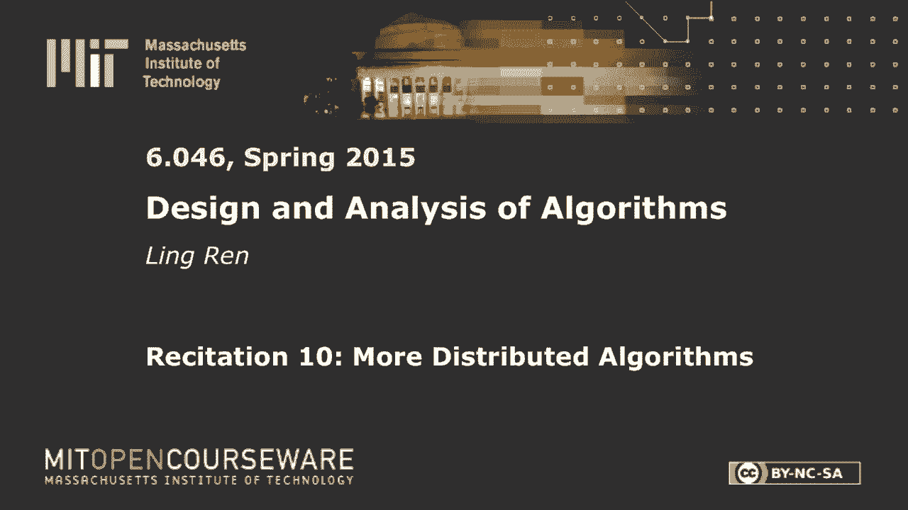

# 数据结构与算法设计：P29：R10. 分布式算法 🧩







在本节课中，我们将学习分布式算法中的两个核心问题：**环状网络中的领导者选举**和**网络节点计数**。我们将探讨如何设计算法，使其在同步和异步网络环境中都能正确工作，并分析其消息复杂度。

---

## 领导者选举：环状网络中的挑战

上一节我们介绍了分布式算法的基本概念，本节中我们来看看一个经典问题：在环状网络拓扑中进行领导者选举。在讲座中，我们看到的示例是完全连接的“单击”网络，每个节点都能直接与其他所有节点通信。解决方案是让每个节点生成一个唯一的用户标识符（UID）或随机数，如果自己的ID是最大的，则宣布自己为领导者。

然而，在环状网络中，每个节点只能与左右两个邻居通信。核心思想仍然是让每个节点生成一个ID，并收集其他节点的ID以判断自己是否为最大值。困难在于如何仅通过邻居传递信息，让所有节点都能看到其他人的ID。

### 朴素解决方案：消息广播

以下是实现信息广播的一种简单方法：

1.  每个节点生成一个随机ID。
2.  每一轮中，每个节点将自己的ID（或已知的最大ID）发送给右邻居。
3.  经过 `n` 轮（`n` 为节点数）后，每个节点都获得了所有其他节点的ID。
4.  每个节点比较所有ID，如果最大值等于自己的ID，则宣布自己为领导者。

这个方案的消息复杂度是 **O(n²)**，因为总共有 `n` 个节点，每个节点发送 `n` 条消息。

### 优化方案：仅传播较大ID

一个优化思路是：节点只转发比自己已知ID更大的ID，丢弃较小的ID，因为较小的ID没有机会成为领导者。

**核心逻辑伪代码：**
```python
# 节点初始状态
my_id = generate_random_id()
known_max_id = my_id

# 当从邻居收到消息时
def on_receive_message(received_id):
    if received_id > known_max_id:
        known_max_id = received_id
        send_to_neighbor(known_max_id) # 继续传播
    # 否则，丢弃该消息
```

然而，在最坏情况下（例如ID按升序排列），任何节点都无法丢弃消息，复杂度仍然是 **O(n²)**。

### 高效算法：倍增法（二分搜索思想）

为了达到 **O(n log n)** 的消息复杂度，我们可以采用类似倍增的策略：

1.  **第1轮**：每个节点向左右邻居发送自己的ID（跳数为1）。
2.  **后续轮次**：只有在前一轮中，其ID在左右 `2^(i-1)` 跳范围内是局部最大值的节点，才会继续参与第 `i` 轮。它向左右发送消息，跳数增至 `2^i`。
3.  **消息处理**：中间节点递减跳数并转发。当跳数减至0时，末端节点比较ID：如果收到的ID大于自身ID，则沿原路径返回“继续”消息；否则返回“停止”消息。
4.  **终止**：如果节点从两个方向都收到“继续”消息，则它在该轮胜出，进入下一轮。否则，它变为非活动状态。

经过大约 **log n** 轮后，只会剩下一个活动节点，即领导者。每轮活动的节点数约减半，每条消息传播 **O(2^i)** 跳，总消息复杂度为 **O(n log n)**。该算法在同步和异步网络中均适用。

---

## 网络节点计数：构建生成树

现在，我们来看第二个问题：计算一个未知网络中的节点总数。我们希望算法在同步和异步网络中都能工作。

高级策略是首先在网络中构建一棵**生成树**，然后通过子节点向父节点聚合计数的方式，自底向上计算出总节点数。

### 生成树构建算法（异步适应版）

在讲座中，我们看到了广度优先搜索（BFS）生成树算法。标准的BFS算法在异步网络中可能无法得到真正的BFS树，但可以得到一个有效的生成树。以下是其异步适应版本的核心步骤：

每个节点维护以下状态变量：
*   `parent`: 初始为 `None`。
*   `children`: 初始为空集合。
*   `neighbors_responded`: 初始为所有邻居的集合，用于追踪已收到回复的邻居。

**算法过程：**

1.  **初始化**：指定一个节点为根节点，将其 `parent` 设为 `self`，并向所有邻居发送 `SEARCH` 消息。
2.  **处理 SEARCH 消息**：当节点 `u` 从邻居 `v` 收到 `SEARCH` 消息时：
    *   如果 `u.parent` 为 `None`，则将 `parent` 设为 `v`，并向 `v` 发送 `PARENT(true)` 消息作为确认。然后，`u` 向自己的其他所有邻居转发 `SEARCH` 消息。
    *   如果 `u` 已有父节点，则向 `v` 发送 `PARENT(false)` 消息表示拒绝。
3.  **处理 PARENT 消息**：当节点 `u` 从邻居 `v` 收到 `PARENT(b)` 消息时：
    *   将 `v` 从 `neighbors_responded` 列表中移除。
    *   如果 `b` 为 `true`，则将 `v` 加入 `children` 集合。
4.  **终止与聚合（收敛广播）**：
    *   节点需要等待，直到其 `children` 集合中的所有子节点都报告完成。
    *   为此，我们引入 `DONE` 消息。当一个节点的 `children` 集合为空（即它是叶子节点）时，它向父节点发送 `DONE(1)` 消息，报告其子树包含1个节点（自己）。
    *   中间节点收到所有子节点的 `DONE(count)` 消息后，计算自己子树的总节点数：`total = 1 + sum(child_counts)`。然后向自己的父节点发送 `DONE(total)`。
    *   根节点最终收到所有子节点的报告后，计算出的 `total` 就是整个网络的节点数 `n`。

**核心聚合逻辑：**
```python
# 节点状态变量新增
total = 1  # 包含自己

def on_receive_done(child_node, child_count):
    children_done.add(child_node)
    total += child_count
    if children_done == children: # 所有子节点都已报告
        if is_root:
            print("Total nodes in network:", total)
        else:
            send_to_parent(DONE(total))
```

---

## 总结

本节课中我们一起学习了两个分布式算法的基础问题及其解决方案。

1.  **环状网络领导者选举**：我们分析了朴素广播法（O(n²)）、基于比较的优化法（最坏仍为O(n²)）以及高效的**倍增法**（O(n log n)）。倍增法通过多轮次、指数级扩大比较范围的方式，快速淘汰非最大ID的节点，显著降低了消息复杂度。

2.  **网络节点计数**：我们将问题分解为两个阶段。首先，通过**异步生成树构建算法**，在网络中建立一棵以某节点为根的父母-孩子关系树。然后，利用**收敛广播**技术，让叶子节点开始，逐层向上聚合子树节点数量，最终在根节点得到网络总节点数。这个算法框架是许多分布式聚合操作（如求和、求极值）的基础。

理解这些算法有助于掌握分布式系统中信息传播、协调与计算的核心模式。