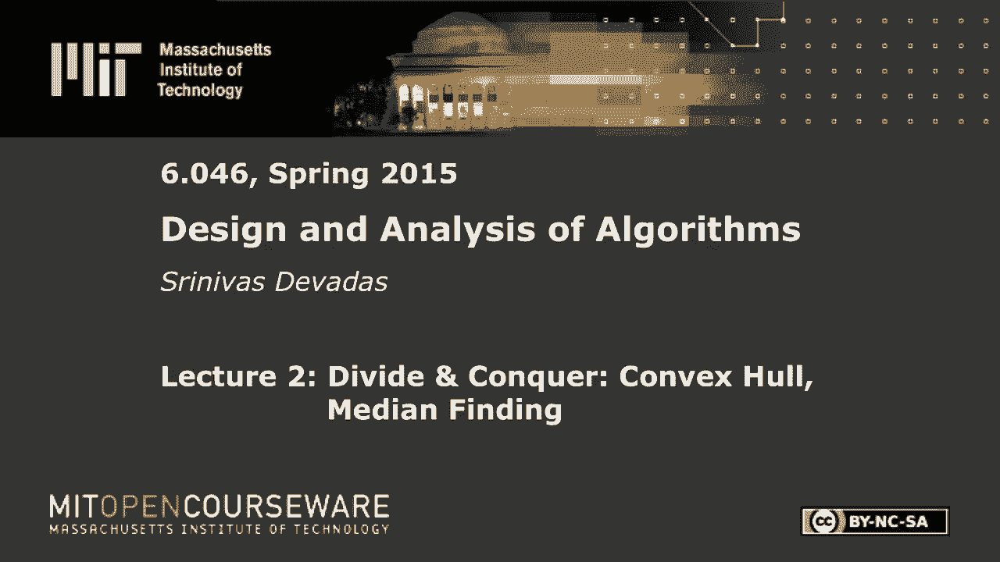
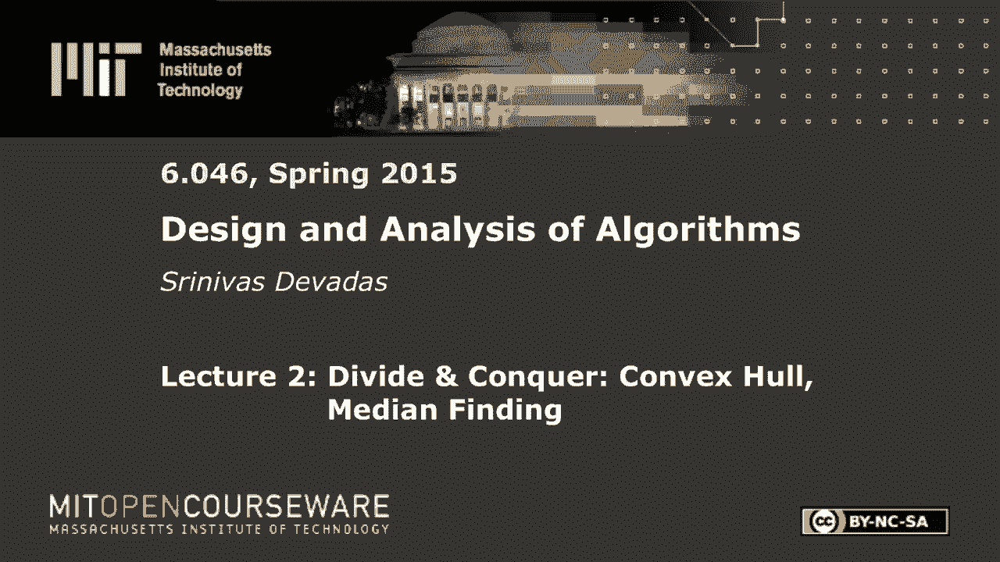

# 【双语字幕+资料下载】MIT 6.046J ｜ 数据结构与算法设计(2015·完整版) - P2：L2- 分治：中位数查找 - ShowMeAI - BV1sf4y1H7vb

以下内容是根据知识共享许可提供的，您的支持将有助于麻省理工学院开放课件。

继续免费提供优质教育资源。

捐赠或查看麻省理工学院数百门课程中的额外材料。

所有的权利，早上好，每个人，让我们开始吧，我们今天要认真地开始六六个，我们将从第一个分而治之的单元开始，你们都见过分而治之的算法，合并前排序是一种经典的分而治之算法，我将用几分钟的时间来讨论这个范例。

给您一个比合并排序稍微通用的设置，然后我们会分成两个非常酷的分而治之，从这个意义上说，这些问题分而治之非常有效，就是凸的，船体和中间值的发现，所以在我开始研究材料之前，我提醒你，你应该报名参加复习课。

在恒星上，请这样做，即使你不打算参加课程，因为我们需要那个，这样我们就可以给你的习题集打分，好的，这也是我们划分习题集的方法，一个今天要出去，这是一周的习题集，所有的习题集都将持续一周。

请阅读这些习题集，他们出来的数据，花五分钟十分钟阅读它们，有些东西会看起来像他们的魔法，你知道吗，我怎么可能证明这一点，如果你想一下，就会变得很明显，我们向你保证，但要早点开始，不要在晚上7点开始。

我们的截止日期是周四晚上11点59分，四五个小时的时间，可能还不足以从神奇到明显，好的，所以让我们从与分而治之相关的范式开始，这只是一个美丽的想法，你可以打破一个问题，分成更小的部分。

并以某种方式将解决方案组合到较小的部分，当然还有，当我们以一个特定的问题为例时，细节将是重要的，但是假设我们得到了一个大小为n的问题，我们要把它分成一个子问题，我会把它放在引号里。

所以你知道这是一个象征，n/b这里a是一个整数，A将大于或等于1，可能是两个，可能是三个，可能是四个，这是我提到的概括，B不一定是2，甚至不一定是整数，但它必须严格大于1，否则就没有分而治之的概念。

你不是在把事情分解成更小的问题，所以b应该严格大于1，对呀，这就是一般的设置，然后你解决，这里的想法是，一旦子问题变得很小，它们变成恒定的大小，解决它们相对容易，如果你有十个元素，你可以做详尽的搜索。

你实际上是在做三次搜索，十的立方是一千，那是个常数，你身材很好，只要常数足够小，所以你要递归，直到这些问题变小，通常情况下，对于所有分而治之的方法来说，这并不是正确的，但对他们中的大多数人来说。

当然还有我们今天要讨论的，当你把这些问题结合在一起时，智慧将在组合步骤中，把这些子问题的解转化为整体解，这就是故事，通常，效率方面会发生什么，你可以写一个与，这个分而治之的算法，你说N的T。

这是一个大小问题的运行时间，n是tfn/b的乘积，这是一次复发，是组合的，所以这和合并是一样的，所以你会复发，就分析而言，你还没有完全完成，因为一旦你复发，你必须解决复发，而且通常没那么难，当然。

对于分而治之的例子来说，这并不是特别困难，我们至少今天要看，但我们也有这个定理，叫做主定理，这基本上是你可以相当机械地插上插头的东西，优等生和优等生，你所拥有的，也许是西塔恩，也许是θn平方。

得到递推的解，我今天不打算那么做，但是明天你们会在课堂上再次听到主定理，这是一个相当简单的模板，您可以使用，对于大多数分而治之的例子，我们将在零四六看到，除了一个例外，我们今天将在中位数发现中看到。

这将简单地给你复发的解决方案，你以前见过这些东西，这是一个小小的设置，所以让我们直接进入凸壳，当涉及到使用分而治之时的问题，所以凸壳我在这里得到了一个小道具，这样我就不用在黑板上写字了，希望更容易理解。

但这里的想法是，在这种情况下，我们有一个二维问题，二维平面上的一堆点，你当然可以做三维的凸壳，多维度，凸性是最优化中的一个基本概念，也许我们会在六零分钟内到达，高级专题四六，也许不是。

但在今天讲座的背景下，我们感兴趣的是找到一个外壳或船体，与二维平面上点的集合相关联，这个洞显然会是什么，你可以猜到这包含了所有这些点，好的，所以我这里有什么，如果我让弦教得够多，这不是很好。

但我想你明白了，所有的权利，所以这不是一个凸起的船体，好吧，这不是一个凸起的船体，因为我在船体外面有一堆点，所有的权利，所以让我，那是一个凸起的船体，好的现在如果我开始像这样或这样或那样伸展。

那仍然是一个凸起的船体，好的，这就是游戏，我们得找到一个算法，我们会看几个不同的，它将找到与这个凸壳相关的所有这些片段，好的，这是凸壳的一部分，那是凸壳的一部分，如果我真的有这样的东西，这是拉伸的。

因为我有凸外的两个点，h，这可能还是一个片段，那是正确凸壳的一部分，但这个不对，这就是这里的游戏，就是找到这些片段，所以如果我们要处理分段或切线，它们将被用作同义词，这些都是。

与整个凸壳相关的切线或分段，我们必须发现它们，我们唯一的输入是一组点，x i y i坐标，好的，你可以用各种各样的算法来做到这一点，我希望我有时间解释的那个，但我要提到的是所谓的礼品包装算法。

你可能不会这么做的地方，但我向你保证，你可能拿走了一份畸形的礼物，试图用礼品包装纸包起来，当你这么做的时候，如果你做得对，你基本上是，你本质上是在试图找到这个三维结构的凸壳，你想把它收紧。

你在试图找到礼品包装纸的最小数量图，我不知道你有没有想过尽量减少礼品包装纸，但你应该，这就是这个三维形状的凸壳，对呀，但我们会坚持二维，因为我们得在黑板上画东西，所以让我稍微说明一下，我们得到了。

这些点是s x i y i，使i等于1，2到n，我们只是假设这里只是为了让事情变得容易，因为我们不想有空的段，或者有一点不同的片段，因为它们是不连续的，但我们假设没有两个具有相同的x坐标。

这只是为了方便，没有两个有相同的Y坐标，然后最后没有三个人在一条线上，因为我们希望能够观察成对的点并找到这些片段，只是有点不方便，你必须处理特殊情况如果其中三个在一条线上，所以凸壳本身，在s中。

我们称它为s凸的c，我们所有人，还有一个凸多边形，谢谢。所以只是为了，当你有这样的东西时，黑板上的一个例子，你会有你的凸壳是，这个在里面，这两个点在里面，所有其他的都是从船体上形成的。

所以我们可能有p q，V和X在船体内部，他们不是，它们不是CH of S规范的一部分，我还没有完全告诉你我们将如何具体说明，但我们要指定的方式是，就是简单地把它表示为边界上的一系列点。

你可以把它看作是一个双链表，如果你把它编码起来，你会使用的数据结构，所以在这种情况下是p，你要从p开始，在这种情况下，它是一个双链表，所以你可以从任何事情开始，但这是凸壳的表示，我们要顺时针。

只是因为我们想清楚我们列举的顺序，当我们做分而治之算法时，这些点会变得很重要，这么说吧，我们不在乎分而治之，只是为了好玩，我给了你一堆分数，几分钟的简单忘记效率。

你能想到一个简单的算法来生成凸壳的片段吗，例如，我不想生成这个段VX，如果我把一个片段看作是由两点定义的东西，那么我不想生成段VX，因为很明显，这一段不是凸壳的一部分，但是段p q，Q r r s等。

它们都是凸壳的一部分，对呀，那么什么是明显的蛮力算法来获得效率，那个，给定这组点将一个接一个地生成凸壳的片段，有人吗？你抬起头来，否，画线并检查它与多少条线相交，我想你有，你划清界限，那很好，对呀，嗯。

但你想做得更多一点，是啊，是啊，去吧，去吧，是啊，是啊，你必须复制一份，看看他们在哪里，啊，这样很好，那很好，那很好，所有的权利，所以你知道，第一个打破僵局的人总是得到一个飞盘，对不起伙计。

至少我只打对了讲师，这里没有责任考虑，好的，现在我开始害怕了，如此正确，所以我想当我扔这个的时候，我会窒息还是不对，但会变得更难，当你们后面的一个人回答一个问题时，所以你说得很对，你画一条线。

然后你就看着它，你看着半个平面，如果所有的点都在一边，它是凸壳的一部分，如果他们不是，这不是一个片段，美丽，对呀，我们完事了吗，我们能去外面享受一下好天气吗？对不对，我们还有很长的路要走。

所以这不是一个片段，而这个让我画那个，我应该用虚线的方式来画这些，这不是一个片段，这不是一个片段，这是一个片段，我违反了这三个人的规则，不在一条直线上，我把这个移到这里，然后是一个片段，以此类推，等等。

好的，哦，你说的对，这是一个很好的观点，这是一个很好的观点，所以这里发生的事情是当我把它搬出去的时候，你说得很对，谢谢。这很好，所以当我把它搬到这里的时候，发生的事情是，我画了这个井，这边这个。

我的凸壳变了，问题说明在我身上改变了，是我的错，然后会发生什么，当然是当我移动这个，这将成为，凸壳的一部分，好的，很抱歉把人们弄糊涂了，但我们这里所拥有的，根据算法，如果我离开积分，同样的工作非常好。

对呀，所以让我把积分留下，同样的，简单回顾一下，我要拿两个点，我要画，让我先画一个虚线，我要说的是，我要看看那条线，把平面分成两个半平面是一边的所有点，如果答案是肯定的，我要继续前进，砰的一声。

说那是我凸壳的一部分，如果答案是否定的，就像，在这种情况下，我将删除该片段，所以现在让我们来谈谈复杂性，假设这里有n个点，我有多少段，我有命令N，平方，θ，和正方形段，测试的复杂性是什么。

与之相关的测试的复杂性是什么，一旦我画好了片段，决定段是否为切线，它是不是凸壳的一部分，复杂性是什么，完全正确，所以，所以分而治之是有意义的如果我们能做得更好，因为这是一个非常简单的算法，对呀。

好消息是我们将能够做得更好，现在我们有了一个特定的算法，我还没有准备好向你们展示，现在我们有了一个特定的算法，我们可以思考如何改进事情，当然，我们将使用分而治之，所以让我们继续这样做，所以通常分而治之。

正如我之前提到的，在大多数情况下，划分是相当简单的，这里也是如此，所有的乐趣都将在合并步骤中对吧，所以我们要做的，你可以想象，我们要把这些点，我们要把他们拆散，我们要拆散他们的方式。

就是把它们分成两个平面，我们要划清界限，我们会说，这条线左边的所有问题都是一个子问题，线右边的一切都是另一个子问题，找到每个子问题的凸壳，如果你有一个两点，很明显你玩完了，这是微不足道的，在某个时候。

你可以说我只是要处理蛮力，我们可以向下订购n立方，如果n很小，我可以用那个算法，所以它甚至不一定是，n等于一或n等于二，那是一件非常好的事情，但你肯定可以用n等于十，正如我之前提到的，运行这个蛮力算法。

所以在这一点上，你知道你可以归结为足够小的子问题，你可以有效地找到凸壳，然后你得到了这两个凸壳，它们显然在两个不同的半平面上，因为这是你定义他们的方式，现在你得把它们合并起来，这就是所有乐趣的地方。

所以让我们再把这个写出来，我们要把点排序，我们要一劳永逸地做这件事，我们不必在这里不停地分类，因为我们将根据x坐标进行分区，我们可以根据x坐标继续分裂，因为我们想生成这些半平面。

所以如果我们能一劳永逸地做到这一点，对于输入集，s，我们要把，向左半部分，右有b，按x坐标，然后我们要计算，a的ch和b的ch递归，然后我们要结合，所以这里和我们之前的唯一区别是划分的规格。

它看起来很普通，这和我之前写的范例很相似，但我已经详细说明了如何分手，嗯，所以让我们从合并操作开始，我们会花大部分时间来讨论这个问题，有很多方法可以进行合并，我们想要最有效的方法来确定复杂性。

这么大的问题如何合并，所以我这里有什么，如果我看合并步骤是，我创建了对应于这两个半平面的两个子问题，我这里有的是，假设我在这一点上生成了一个凸壳，与这些子问题中的每一个相关联，所以我这里有一个一。

一个二，我将顺时针来指定凸壳，我要做的另一件事是在子问题的情况下，我的出发点是左子问题，x值最高的坐标，好的，所以在这种情况下是一个，超过x的最高x值在右边向右边增加，问题的一半，它将是x值最低的坐标。

在这两种情况下，我都是顺时针方向，所以当你看到与下标相关的排序时，对于这些，这些点从一个1或B 1开始，然后顺时针方向，这就是我们对这个的编号，所以只是符号，这里没什么深奥的，所以我得到了。

我得到了这两个凸壳，这些副船体，如果你愿意，我现在需要做的是把它们合并在一起，你可以很明显地看到这个，很明显，你知道吗，整体的凸壳是对的，所以说，但关键是，我得看看，与这个和那个相关联的每对点。

并尝试生成切线，不属于潜艇的新切线，但它们是整个船体的一部分，对，所以在这种情况下，你可以想象，一个算法将做这个蛮力算法所做的事情，除了它从这里看一个点，从这里看一个点，所以你可以想象我要做一个两两的。

段的，然后我要检查这些片段是否真的是切线，不管是不是整个凸壳的一部分，好的，所以我会在这里做的是，我会看看这个它会成为整个船体的一部分吗，否，为什么不有人告诉我为什么这个片段，不是整个船体的一部分。

完全正确，完全正确，所以给你，所以现在这不是它的一部分，如果我看看这个，同样的原因，这不是它的一部分，在这种情况下，这是一个相当明显的例子，我要做些不那么明显的事，以防你抱有希望，我们有这个琐碎的算法。

好的看起来不错对吧，顺便说一句，那必须是直线，好吧，嗯，所以一个四b二，我的意思是，这是看起来不错的权利，因为所有的点都在一边，所以4B2是我们的上切线，所以我们的上切线是我们要定义的。

好像我看着这些东西中的每一个，我要说他们有一个Y ij，什么是Y ij，y ij是这个段的y坐标，我在看ij片段，所以这个y ij是给ai和bj的，我这里有4个2个，这是为了上切线。

Y ij将是最大的权利，因为这基本上可以确保没有比这更高的分数了，好吧，如果我一直往上走，我发现这个有最大的y ij，这将是我的上切线，因为只有这样，我才会在前面没有分数，所以y ij是上切线。

这将是最大的，我不打算把这个写下来，但这是有道理的，较低的切线将有最低的，Y ij是我们是我们在这里都很好，是的问题，所以我听不到她说什么，好的很好，让我，我们搬出一个的原因。

B是因为如果我像这样画一个，我推断，这又应该是一条直线，那么你就能清楚地看到在A-B-1段的两边都有点，当你看整体问题时，你看一二一一二二在这边，3在这边，如果我把这条线在两个方向上一直延伸到无穷大。

这违反了这个部分是整个船体的一部分的要求，好的，有道理很好，所以和我在一起的每个人都很清楚，这里有一个简单的合并算法，简单的合并算法是查看每对点，每个A B对对，每一对AI BJ。

那么这样做的复杂性是什么，如果我有n个总分，复杂度是n平方对吧，因为也许我会有一半在这里，一半在那里，忽略常数，你可以说好，它将是n的平方除以4，但你知道那是正方形对吧，所以有一个，有一个。

有一个明显的，n平方的合并算法，看所有的对，当我指所有对点时，我是说就像一个A和一个B，因为我想买一双，我去的地方，离开那条分界线，然后在分界线的右边，但不管怎样，都是正方形，好的，所以现在你看那个。

你走了，嗯哼，你知道的，我能做得更好吗，如果我只是去最高的A点和最高的B点，我只是不，就是这样，我做了恒定的时间，那不是很好吗？是啊，是啊，奇妙，但不正确，好的，对呀，那么什么是一个例子，所以这是。

我昨晚花了点时间，所以我和你们一样，我前一天晚上做了习题集，别照我说的做，但我以前做过，所以这就是区别，但这个特殊的例子是新的，所以我这里有的是，我将向你们展示为什么没有一个简单的算法。

我得把这些角度弄对，你不能只挑最高点，一直往右走，然后那将是恒定的时间，所以这是我的A在这里，让我们假设我有这样的分界线，然后我要做的是，我希望我做对了，我会有这样的东西吗，像这样。

然后我将有一个在这里顺时针，所以B二，b 3和b 4，好的，所以你可以在这里看到，如果我看着一个四，所需调整不大，好的如果我看一下4比1，我是说目测一下，3对b 1是4对1是上切线，不现在3比4低。

你们看到了，1比2低，对吧，所以很明显，如果我，如果我只是拿一个4到B2，它不会是一个上切线，大家都看到了好的很好，所以我们不能有一个恒定的时间算法，我们在袋子里有θn的平方，所以你知道有什么，也许。

我们如何进行合并，通过稍微聪明一点来找到上切线，搜索对点，这将给我们这个最大值，Y ij对，我的意思是这里的目标很简单，在某种程度上，如果你看看蛮力，我会生成这些东西中的每一个。

我发现与这一行相关联的Y ij拦截，我只是选择最大值，常数时间算法不起作用，θn平方算法肯定有效，但我们不喜欢，所以一定有什么东西，介于两者之间的东西，不，你只是发现不，你在最大化y i j。

所以一旦你有了片段，所以问题不是显而易见的，一种合并算法，然后向右立方，我的答案是否定的，因为额外的因素来自于这样一个事实，即你必须检查每一个点，每个端点，看看它在飞机的哪一边，但在这里我所做的是。

我有一句台词，这里基本上是y等于零，如果你喜欢对，或者y等于一些，对不起，x等于零，或者x等于某个值，我只需要一次，我有与，a代表b一或a代表b二，我只需要找到它的截图，这是恒定的时间对吧。

然后一旦我找到了它的拦截，我只是最大化拦截来得到我的Y ij，所以我很好，好的，所以只有θn的平方是对的，好问题嗯所以这实际上是非常非常聪明的，这种特殊的算法被称为双指算法，我确实有多个手指。

一切都会好起来的，如果我借用埃里克的手指，我们将向你们演示，合并这两个凸壳的双指算法，然后我们会讨论它的复杂性，我昨晚的创新是把这个从两个手指的算法，我不仅想到了使用Eric的好主意。

我决定它将成为两个手指和字符串算法，好吧，这很疯狂，这是我对六个以上知识的贡献来吧，所以两指算法的工作方式，这个伪代码应该是不可理解的，如果你只是看着它，你去什么权利，但这个演示会把一切都搞清楚，对呀。

所以你要做的是，所以现在我们要做一个合并算法的演示，这是一个比使用n阶平方时间的合并算法更聪明的合并算法，这是正确的，它会给你正确的上切线，我们从这里开始用埃里克的左手手指。

它被定义为最接近垂直线的一点，你在这里看到的，x坐标最高的一个，我的手指在B1上，也就是右手边x坐标最小的点，潜艇，我们所做的是计算片段，我们计算的一个，为什么我，j在这种情况下。

为什么一个是你在这里看到的垂直线上的截距，埃里克刚刚用一个红点标记了，嗯，你可以看看我右边的伪代码，如果我面对董事会，现在发生的是我要顺时针移动，我要从B1到B4，这里发生了什么。

YIJ是增加了还是减少了，正如你所看到的，它减少了，所以我要回到B，我们还没有完全完成这一步，埃里克要逆时针转到一个四，我们要再检查一次，是啊，是啊，我又把绳子拉紧了，y j是增加还是减少。

从这里可以清楚地看出，YJ增加，所以现在我们移动到这一点，到目前为止我们认为甲对乙的智商是最高的，但我们有一个时间循环，我们将不得不继续这个while循环，现在发生的是，我又要顺时针从B1到4。

当这种情况发生时，y j是增加还是减少，它减少了，所以我要回到B1，埃里克现在要逆时针转3，正如你所看到的，增加了一点，所以我们现在要停止算法的迭代，我们在一个三B一，我们认为在这一点上是我们的上切线。

但让我们检查一下，在我这边重新开始，B一个是四个，发生了什么很好，y j减少，所以我要回去做一个，然后埃里克会试着，是逆时针方向，他将以3比2领先，Y ij的大幅下降现在埃里克回到了3，在这一点上。

我们已经尝试了两个动作，我的顺时针移动和埃里克的逆时针移动，我从B1到四级的移动，埃里克从三分变成了两分，我们聚集在一起，我们没有时间了，循环a三b一，对于这个例子是我们的上切线，你可以把手指拿回来。

埃里克，这样做的原因是这里有一个凸壳，这里有一个凸起的外壳，我们从彼此最近的点开始，就一条最靠近这条垂直线而言，B 1是最接近这条垂直线的，我们在两个方向上向上移动。

因为我是顺时针方向埃里克是逆时针方向，这就是这个算法工作的直觉，我们不打算对这个算法进行正式的证明，对应于子船体凸度的单调性，和这个潜艇体的凸起，本质上可以给你一个形式化的证明这个算法的正确性。

但正如我所说，我们不会在六个多小时内报道，所以现在剩下的就是看看我们的伪代码，它与你刚才看到的执行相匹配，并讨论伪代码的复杂性，这个算法的复杂度是多少，顺序是对的，那么这里发生了什么。

如果你看这个while循环是，当我有两个计数器，我基本上是在看每个循环的两个操作，这些计数器中的任何一个都保证在循环中递增，因为在这个例子中，我在一个例子中有p点，p加q等于n，假设我在这里有p点。

我这里有Q点，我得到了P加Q，假设等于n，然后我得到了一个θn合并，只是因为我将贯穿并增加，只要我在循环中，我将递增i或j，他们最多能去我们的，在我跳出循环之前是p和q吗，或者在我旋转之前。

所以这就是为什么这是Theta n，所以你把它放在一起，就复杂性而言，合并对应于什么，把它和整体的分而治之放在一起，我们有一个案子，这看起来像是你见过很多次的复发，n的t，我把它分成两个子问题。

所以我有两个，我当然可以选择，我现在在两组点之间有一个很好的分区，如果我选择l在右手边，然后我有这个大的子问题没有任何意义，但我能做的，没有什么能阻止我，但我按x坐标对这些点进行了排序，做除法。

这样就有完全相同的数字，假设偶数点n，在左手边或右手边完全相同的数字，但我可以突然大致地说对，在一个很容易，这就是n/2的来源，好的，在下一个问题中，我们将研究中位数查找问题，我们会发现。

试图使子问题的大小大致相等，其实有点难，好的，但我想指出，在这种特殊情况下，很容易得到一半大小的子问题，因为你已经做了分类，然后你只要选择这条线，垂直线，这样你就得到了一堆点，两边，然后在合并操作方面。

我们有2t n/2plusθn，人们认识到这种复发，这是旧的合并排序，复发，我们把这一切都做得很好，这不是合并排序，很明显，算法不是合并排序，但我们得到了同样的复发，所以这是θn log n。

所以比Theta N Q好多了，没有凸壳算法，在一般情况下比这个好，甚至我跟你提到的礼品包装算法，具有正确的数据结构，归根结底，就θn log n而言，但也好不到哪里去，好的，这么好。

这几乎是我在这里再次得到的，就像我说的，很乐意回答关于这个循环算法的正确性的问题，以便以后合并，与此相关的任何其他问题，是啊，是啊，在后面，你能做得更好吗，否，你不能，因为我是说预排序的n log n。

我是说在顶层还有另一个θn log n用于排序，我们实际上并没有使用这一权利，所以问题是，我们能做得更好吗，如果输入是预先排序的，我甚至没有使用这种复杂性，我们刚刚匹配了一下，在这种情况下对吧。

所以θn log n，你可以想象也许你可以做一个θn排序，如果这些点足够小，你把它们四舍五入，然后你可以使用桶排序或计数排序，并降低它的权利，所以这个θn log n是分治算法的基础。

这是你能提高的唯一方法，即通过进行合并过程，那就更快了，好的很明显我们试图创造一个θ1合并过程，但是没有成功，好的，算法，首先，如果你假设关于输入的某些事情，你说得很对，所以你会在算法中发现一件事。

在六零四六也是我们永远不会满足，好的，所以我只是说，哦，你不能做得比Theta n log n更好，但那是在一般情况下，我想我提到过你在正确的轨道上，如果输入是预先排序的，你可以把它拿走，嗯。

在那个特定的情况下没有帮助，如果您有常规设置，但是如果你在二维的情况下，如果你知道船体，所有的片段都有一定的特点，不太平面，但比这更严格一点的东西，你知道你可以想象你可以做改进。

我不知道有什么令人信服的，凸壳的特殊情况输入，你可以做得比θn log n更好，但这对你来说是个很好的练习，这是在什么情况下给出一些关于点的结构，我能做得比θn log n更好吗。

所以这是算法文献中不断出现的东西，如果你能用那个，是啊，是啊，后面的问题，我的观点很好，你完全正确，我刚意识到我跳过了那一步，非常感谢，所以问题是，如何移除线条，它实际上相当简单，让我们把这个放在这里。

我们不需要这个难以理解的伪代码，对呀，所以让我们把它抹去，谢谢你问这个问题，所以这是一个简单的剪切和粘贴的方法，假设我发现，我找到下切线，我们就叫它AK BM吧，在这个特殊的例子中，我有什么，我有一个。

一个二，一个三一个四，作为我的潜艇之一，然后我有b 1 b 2 b 3 b 4作为另一个，现在，我们确定什么是上切线，是三B一吗，右A三B一，所以3B1是我的上切线。

我想以前是1 a 1 b 4 a 1 b，是我的下切线，所以现在最大的问题是我找到了这两个，我如何生成整个凸壳的正确表示好的，所以你必须这样做，这一点的复杂性也很重要，你需要做所谓的剪切和粘贴。

与此相关的，我们要看这个，所以我们要有这两样东西，我们现在将生成一个点列表，很明显，4不会是这项权利的一部分，四号不会成为整个船体的一部分，我们想要什么，我们想要1-2-3-B，右前一b二b三b。

但有一点我们必须放弃，在这里同意，所以我们这样做的方式是非常机械的，这是好消息，我是说你不必看它，从图片上看，这是我编造的，看着它盯着它，我很清楚电脑没有眼球，所以我们要做的是，总的来说。

我们要说第一个环节，第一个链接是AI到BJ，因为那是我的上切线，好的，在这种情况下，它将是在一个3B上，好的，然后我要下去，下切线的BM，你在B名单上，所以你在找下切点，然后你要跳到你看到BM。

你把它链接到AK，好的，你把它链接到AK并继续，然后你有你的循环列表，好的，所以你在这里看到的是这里有一个3，所以我要继续写出，我刚才在这里写的东西的执行，所以我有一个三，我要跳到B1。

所以我要写下一个，那我就沿着B一直走到四岁，在这种情况下，我将包括所有的蜜蜂，所以我得到了b一b二b三b四，然后我要从B4跳到1，因为那是我的一部分，我这里有一个，一个二，然后我又回到了一个三。

这是伟大的，因为那样我就完了，所以我说的就发生了，谢天谢地，就是我们掉了一个四，但我们保留了所有其他的点，所有的权利，所以回答你的问题，剪切粘贴的复杂性是什么，这是命令，我正在浏览这些名单。

所以这里没有隐藏的复杂性，好的好的好的，谢谢。你应该得到一个飞盘，其实你应该得到两个对吧，你在哪里，我哦，你能站起来吗，是啊，是啊，两种颜色，你可以把它给他，如果你喜欢，但这么好，谢谢。我们结束了吗。

凸壳处理完了吗，好的很好，所以让我们继续做中位数发现非常不同，这里有一系列非常不同的问题，我仍然是一个分而治之的人，但是一系列非常不同的问题，这里的规格是，当然很简单，你可以想到，作为。

我只是想要一个比排序和寻找特定位置的中位数更好的算法，在两个以上的位置，比如说，假设n是，这是一个n/2的楼层，你可以找到中间偏右，所以如果你能进行排序，这很容易，但是我们从来不满足于使用标准算法。

如果我们认为我们能做得更好，所以这里的整个游戏将是，我想找到中位数，我想在更好的时间内做到这一点，好吧，这就是中位数发现的全部，我们将用分而治之的方法来解决这个问题，所以总的来说，给定一组n个数字。

我们将定义，集合中的数字，大于，对不起，小于或等于x，我是说你可以用不同的方式来定义它，我们将用小于或等于，所以总的来说，军衔，当然啦，你可以很容易地找到中位数，所以如果你想找到等级的元素。

n加1除以两层，这就是我们所说的较低的中位数，n加1除以2上限是上中位数，如果n是奇数，它们可能是相同的，但这就是我们想要的，所以你可以认为这不是中位数发现，但是寻找具有一定等级的元素。

我们想在线性时间内做到这一点，我们必须申请，在这里分而治之，和往常一样，模板可以实例化，魔鬼在分裂或合并的细节上，在合并操作中，我们在凸壳上玩得很开心，事实证明，关于中位数的发现。

这里最有趣的是在分水岭，好的，选择例程的定义，它接受一组数字s，这是秩，所以我想要一个等级I，我可能是N超过2，嗯，是n加1除以2的楼层，那么分而治之是什么样子，你要做的第一件事就是，和。

现在我们要说的是你要选择一些元素，x属于s，这个选择是至关重要的，但在这一点上，我还没有准备好具体说明这个选择，好吧，所以我们要巧妙地做到这一点，然后我们要做的是，我们要计算，在k上，这是秩，x的。

我想找到第五高的元素，我想找到中间元素，我想找到第十高的元素，所以我必须我必须跟踪子问题中发生的事情，因为子问题将决定，取决于这些子问题中有多少元素，我只有在解决了那些子问题后才能确定。

我将不得不收集这些信息，并在合并操作中把它们放在一起，所以如果我想找到第十高的元素，我把它分成了相对任意的，很有可能，第十高的元素会在左边或右边的元素中被发现，我必须证明它是第十高的。

可能左边有四个元素，右边有五个元素，那是那是，让我们看看，如果我将秩定义为小于或等于x，左边有四个，右边有五个较小，这就是为什么它是第十高的元素，这就是我们必须看到的，所以b和c对应于。

清楚地照亮其中一个，你可以计算b中的元素数，计算c中的元素数，您可以在这个递归中消除其中一个，当你发现这个元素有正确的等级时，在这种情况下，所以让我把剩下的写出来，确保我们都在同一页上，我这里的图片。

所以这就是b的全部，这就是C的全部，我在b中有k减去一个元素，假设我有n减去k个元素，在c和i中，嗯啊，吃一次，我选择了一个特定的元素，我要看看所有小于它的元素，并将其放入数组B中。

我要看看所有比它更大的元素，让我们假设所有元素都是唯一的，我要把它们都换成c，我将在B和C上重复，这两个是我的问题，但我要做的是，子问题的等级，我得把它们放在一起，所以我这里有的是，如果k等于i。

我计算了秩，我意识到如果k等于，我应该说如果k等于，然后我将返回x，我在这一点上做完了，我很幸运，我选择了一个元素x，它神奇地得到了正确的等级，好吧，并不总是会发生，在其他情况下也是如此，如果k大于i。

所以我在这里做的是，如果k大于i，然后我要说，哦，所以现在我必须找到b中的元素，我知道它会在B中，因为k大于i，我得找到确切的位置，取决于我在这里是什么，但它将在一个，在1到k减去1之间，好的。

最后一种情况是如果k小于i，那这就有点棘手了，返回i减去k的c，好的，所以这里发生的是，我的k是x的秩，我在这里看到的比我少，所以我要看看，我知道我会找到这个元素，我在C中寻找的，但如果我只看C。

我不想看C，并在C右中寻找一个没有意义的秩I的元素，因为我在寻找等级I的元素，在给我的整个数组中，所以我必须减去对应于x的k个元素，b中的所有k减去一个元素，去弄清楚我到底在找什么职位或级别。

对应于C的子射线，好的，所以人们买那个，所以这只是你必须记住的一件小事，当你做对的时候，所以这是一个很简单的看起来很好，你说，嗯，我说完了吗，你可以想象答案是否定的，因为我们现在还没有指定这个值。

有人能告诉我，至少从效率的角度来看，我是可能发生的事，我们要找的是，你可以想象，我们想改进θn log n，所以你可以说，嗯，我对Theta n Theta n很满意。

θn复杂度算法优于θn log n复杂度算法，这是一种在袋子里，因为我们知道如何排序，我们知道如何索引，所以如果我们现在想要一个θn算法，如果你拿着这个，嗯，如果我只是我选择，假设最大的元素。

我一直选x为n或者n减去1，或者只是选择一个恒定的值，我选X在中间，我选择索引，我总是可以根据元素的索引选择一个元素，我可以选中间那个，那么这个算法的最坏情况复杂度是多少，如果我不具体说明。

或者我给你这个任意的选择，对应于属于s的x，这个算法最坏的情况复杂度是多少，是啊，是啊，前进n正方形，为什么呢，完全正确，完全正确，所以这里发生的是你在这里做大量的工作，用这个θn工作就在这里。

这是工作，好吧，既然你在这里工作，你必须非常小心如何选择x元素，所以可能会发生的是，你最终选择了这里的X，考虑到你要找的特定级别，你必须，现在只剩下一个大数组，其中有n减去1个元素，在最坏的情况下。

你从n开始，没有到n/2和n/2，这就是分而治之的意义，或者n/b你得到n-1，然后你去n-2，然后你去n减去3，因为你一直在挑，这是最坏的情况分析，您不断地选择这些子数组，使其极其不平衡。

所以当子数组极不平衡时，您最终在递归的每个级别中做θn工作，还有那些θn，因为你要一路往下走，从n到1会变成θn的平方，当你这样做的时候，好的，这就是θn的平方，如果你有一个糟糕的选择。

所以我们将讨论随机算法，但是随机化算法的问题是分析会给出一个概率分布，这将是预期的时间，我们在这里想要的是一个确定性的算法，它保证运行，在最坏的情况下，所以我们想要一种确定性的方法来选择属于s的x。

这样所有这些都解决了，当我们复发时，我们神奇地解决了它，我们得到了，分区，相当平衡的子问题，从某种意义上说，它不是n-1和1，它甚至可以超过10，9，10，但只要你保证你在缩小事情，在几何学上。

渐近会得到，好的，但这就是我们所需要的决定论，所以，嗯，我们要巧妙地选x，我们不希望排名X是极端的，所以这不是你能做到的唯一方法，但这真的很聪明，这种确定性的方式，你会在这里看到一些任意的常数。

我们会我们会谈论他们一次，我已经描述过了，但我们要做的是，我们要把s排列成大小为5的列，对呀，我们要取这个单数组，我们要把它变成一个二维数组，其中行数为五，在这种情况下，你的列数是n/5密封。

然后我们要排序，我们将在线性时间内做到这一点，你可能会说你知道这是怎么发生的，只有五种元素，所以它是线性的，你可以为所欲为，你知道你可以升到四分，但五升到四，它是常数，你不喜欢理论吗。

那么我们要找到什么，我们将调用中位数的中位数，所以我要解释一下，这适用于任意等级，但专注于中位数更容易一点，只是为了解释这个特定的例子，因为正如你所看到的，这里有些复杂，所以我们开始了，我要画一幅画。

我们将试图论证这种确定性策略，我将指定在所有情况下为您提供相当平衡的分区，好的，所以我们在这里看到的是我们从图片上看到的，你看，每一个点对应一个数字，这个一维数组变成了二维数组。

所以我得到了四个完整的专栏，这当然是可能的，因为我的第五栏还没有满，对吗，所以这当然是可能的，所以这就是为什么我把它放在这里，嗯，所以我这里有的是，我要把它们这样摆出来。

我要看看这n个超过5列的中间元素，对呀，这正是我要看的，现在如果我看着我想要的，我想要的是这个，如果我想找到，我要找出中位数的中位数，所以这是X，现在这是真的，首先这些柱子，我只是把它放在这里。

想象那是x，那不能保证是X，因为柱子本身，虽然这些是这些列，但这些列是排序的，我必须保证的是，当然啦，当我去找这个中位数的时候，它最终给了我平衡的分区，好吧，在我解释发生了什么之前，让我多说一点，嗯。

这些列中的每一列都被排序，at s被安排成大小为5的列，就像我刚才说的，这些是中位数，好的，如果我看，如果我看确定中位数，我说一旦我确定了这个x，我发现它是中位数，然后这是中间的右边。

它的左边会有一堆柱子，它左边的一堆元素，它右边的一堆元素，在这种情况下，我有五列，我本可以有更多的，碰巧是第三个，所以这个想法是，一旦我找到这个中位数，对应于这个x数，我可以，我可以说所有的专栏。

这些都对应于中位元素大于x的列，它们对应于中位元素小于x的列，好的，所以我在这张照片中看到的是这里的这些元素，将大于x，这里的这些元素，小于x的，所以让我说清楚这里发生了什么。

我们不仅对所有的列进行了排序，这样你就有了更大的元素，这五列中的每一列都是在上面排序的，我发现了与中位数中位数相对应的特定列，这是我的X，您可能知道这些列没有排序，这个可能比那个大，反之亦然。

同样的事情在那里我不知道，但可以保证，一旦我找到这个中位数，那个，我知道所有的专栏都有这个位置的元素，小于这个x的，我知道列在这个位置上的元素大于x，好的是的，我可能会得到同样的渐近复杂度。

如果我掉了那些，因为我有一个常数，但你完全正确，所以问题的重点是我只是重新画了它，这两个也明显小于x，因为它们是分类的一部分，这就是我这里的本质，现在我的目标是，你可以从这里看到我们要去哪里。

我在这里通过对每一列进行排序的过程所做的，求中位数的中位数，我发现了这个中位数，这样左边就有一堆柱子，这些列中大约一半的元素小于x，右边有一堆柱子大约一半的柱子，我有大于x的元素。

所以我现在要做的是做一点数学，向你展示复发的确切情况，让我在这里做，所以这是我们要做的最后一件事，我可能无法解决复发，但那可以等到明天，复发将不是特别难以解决的问题，所以我现在想做一个，变量为n。

保证了多少元素，大于x，本质上我在说什么，我正在写，我在那张照片上有什么，n除以五的一半，对于一组，可能少于五种元素，就是我一直向右的那个，所以对于所有其他的列，我会得到三个大于x的元素。

如果你把它写出来，这说明至少有，因为我有一半的组减去两个，我在这里数得并不完全准确，但我至少没有，所以这应该都很好，3 n除以10 3乘以n除以10减去2个元素严格大于x，这来自那张照片。

我也可以在小于x的情况下说同样的话，我数不清是哪一个，取决于事情的进展，也许我可以玩一下，减去一个1而不是一个2，在后一种情况下，但我只是在这里保守，很明显，我会有一堆专栏都满了，将做出贡献的专栏。

三个大于x的元素，在这种情况下，我有很好的，其中两个是小于x的，我得到了一个大于x的，所以这就是我在这里要说的，关于分区的其余部分，事实证明这就足够了，事实证明，我所要做的就是这个观察，就是去写递归。

我们将得到一个高效的算法，是啊，是啊，它不应该大于或等于，没有什么是平等的，是啊，是啊，你所需要的，是啊，是啊，我想这么方便，是啊，是啊，这里总是有一点便利，我们将假设数组具有唯一的元素。

所以没有什么是好的，好，所以复发，一旦你这样做了，n的t等于，我们就说这是为N点一个，小于或等于一四十，那是从哪里来的，嗯，我喜欢一百四十，只是一个很大的数字，它来自于这样一个事实。

即你将看到一个10减3，也就是七个，然后你想把它乘以二，所以一些相当大的数字，我们要出发了，我们假设这是一个常数，所以你可以对这140个数字进行排序，找到中位数或其他等级，都是恒定的时间。

一旦你深入到基本情况，所以你只想让它足够大，这样你就可以把它拆散了，你会发现一些有趣的事情，关于列数，对吧，所以不要太担心这个数字，这里的关键是复发对吧，这就是我们剩下的时间要做的，我会把这个写下来。

解释这些在哪里，这些数字来自，这是我们对n小于等于140的递推，否则你就会这么做，那么这里是怎么回事，所有这些组件对应于什么，这只是说，我在找中间值，我在找一些有一定等级的元素。

所以中位数的中位数将在n超过五列的情况下运行，所以我要去这些，这里有n个超过5个列，我将递归地调用这个算法，中位数查找算法来做到这一点，寻找中位数，这里的这个东西是我要丢弃的，至少取决于，不管我做什么。

因为我这里有两个陈述，在我的范例中，我将舍弃整个n，在这里，我要么选B，或者我选择C，取决于我在找什么，假设B和C不是完全不平衡的，我将舍去3个N除以10减去6个元素，它只是与我相对应。

忽略这里的天花板，将三个相乘，等于3n/10减去6，那么我有7n除以10再加上6，这是我要重复使用的最大大小分区，只会是他们中的一个，你可以从那里看到，不是这样就是这样，他们两个都没有复发。

它在其中一个身上反复出现，这就是7+10+6的由来，然后你问，这个θn是从哪里来的，嗯，Theta n来自于我必须做一些排序的事实，它是对每一列进行恒定时间排序的，好的，因为只有五种元素。

所以我要做恒定时间排序，但是这个顺序是N列，因为它超过五列，这是所有列的排序，所有权利，原来如此，我就留给你，你不能应用主定理来解决这个特殊的递推，但如果你观察一下，你会在部分中看到这一点。

你观察到n除以5加7 n除以10实际上小于n，对呀，所以你得到了，你知道，这里点2n，那里点7n，那实际上小于n，这东西是线性时间运行的，你会在明天的部分中看到，所以这整件事是时候了。

