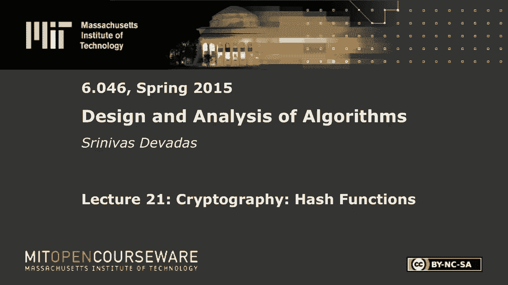
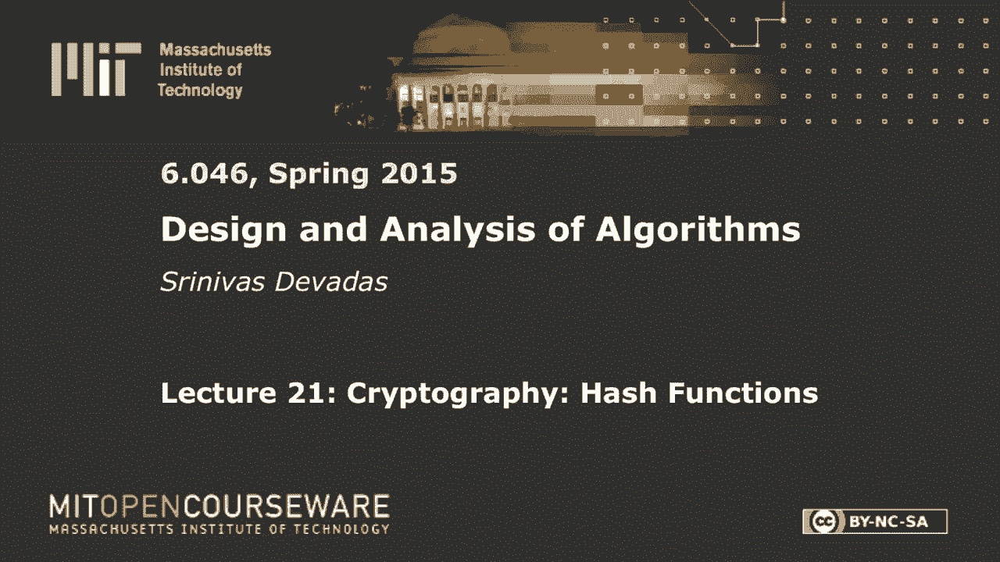
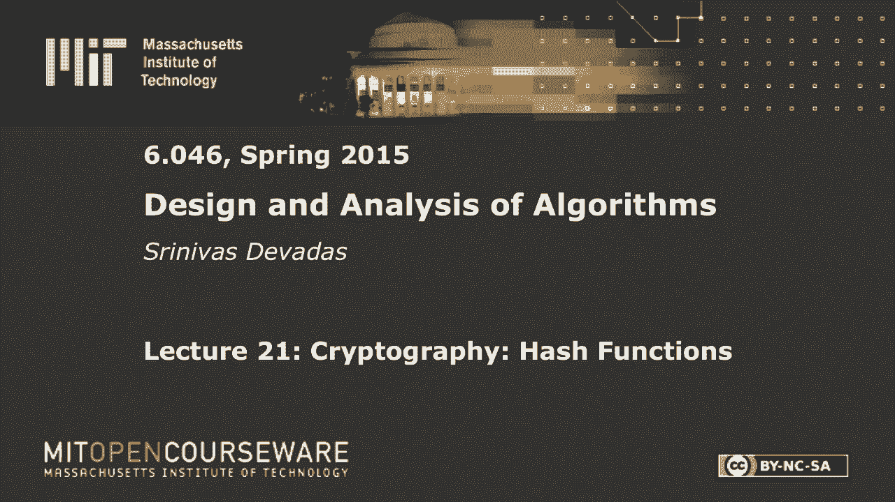
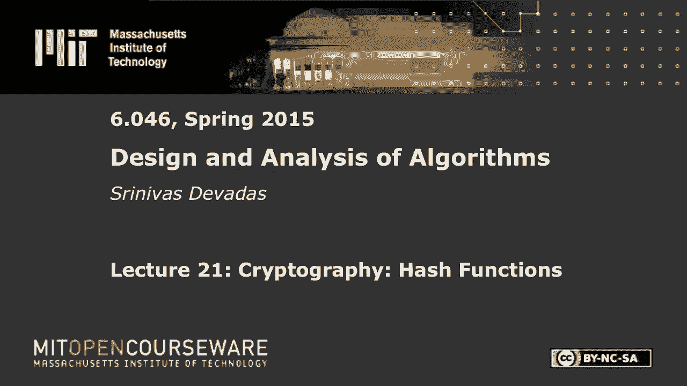

# 【双语字幕+资料下载】MIT 6.046J ｜ 数据结构与算法设计(2015·完整版) - P30：L21- 密码学：哈希函数 - ShowMeAI - BV1sf4y1H7vb

以下内容是根据知识共享许可提供的，您的支持将有助于麻省理工学院开放课件。

继续免费提供优质教育资源。

捐赠或查看麻省理工学院数百门课程中的额外材料。

所有的权利，让我们开始吧，早上好，每个人，我看到很多疲惫的脸，我不累，你为什么累，我只讲了一半的课，你们一直在上课，你可能认为你对哈希函数了解很多，你可能会，但我们今天要做的是。

哈希函数的完全不同的应用，和一组新的属性，我们将要求，我将详细说明的哈希函数，我们将看到一系列不同的应用程序，像密码保护这样的事情，检查文件的完整性，拍卖等等，等等，所以今天和周四的讲座有点不同。

我们将研究密码学和应用程序，没有太多的算法，但我们会做一点关于性能是否满足的分析，在本例中是否通过哈希函数，所以让我们直接跳进去，你们都知道哈希函数是什么，定义没有真正的变化。

但是我们今天要看的哈希函数，与简单的哈希函数有很大不同，就像我们过去看过的带质数的mod，碰撞的概念会再次出现，除了又一次，我们要把赌注提高一点，所以哈希函数，让我把这件事做好。

所以你没有对字符串的长度做出声明，你会把它拆散，即使你有一串五百一十二英镑，也可能是二十七，你确实想在一个特定的范围内得到一个数字，会有许多位与我们的哈希函数相关联。

以前我们有许多插槽与哈希函数的输出相关联，但输入可能是任意的，这些任意的数据字符串，我要被映射，就像我刚才说的，到固定长度输出，我们要把这个固定的长度看作是今天的一些比特，与哈希表中的槽相反。

因为我们真的不会存储字典或哈希表，在我们今天要看的应用程序中，这只是一个计算哈希的问题，和，因为固定长度的输出将是，一百六十位，或者二百五十六个比特，你不可能储存两个上升到一百六十个元素，在哈希表中。

甚至两个提高到64个，真的，所以我们将假设我们正在计算这些哈希值，并将其用于某些应用，我只写了两次输出，我想是这样映射到一个固定长度的输出，如果你想用确定性的方式来做这件事。

所以一旦我们计算了一个特定的哈希，给我们的任意字符串，我们希望能够重复这个过程，每次我们想在公共场合做这件事的时候，都要得到相同的哈希，所以一切都是公开的，没有秘密，我们今天要看的这些键控哈希函数。

但也许顺便说一句，我会提的，下次我们不会在这里讨论键哈希函数，在对算法或技术的任何描述中都没有秘密，我今天要描述的是，我们希望这是随机的，想让它看起来随机，考虑到我们的其他限制。

真正的随机性是不可能实现的，但我们将尝试用伪随机性来近似它，但我们希望它看起来是随机的，因为我们对词典很感兴趣，以及哈希函数的常规应用，我们对最小化碰撞感兴趣，事实上，我们将把碰撞的赌注提高得很高。

我们希望你或其他人不可能发现碰撞，这将是抗碰撞的一个重要特性，这显然需要，这就是我们想要的三件事，确定性的，确定性的，公共的和随机的，所以就从一个，你这里有零一星，这意味着它是一个任意长度的字符串。

我们想去零1d，这是一个长度为d的字符串，这意味着你要从哈希函数中得到d位，这里长度大于或等于零，所以这不是很多新的东西，但有些事情会有点不同，这里有一些微妙之处，我们将讨论，我想强调两件事。

其中一个我刚刚说过没有秘密，哈希函数中没有密钥，我们描述的所有操作都是公开的，就像你有哈希函数一样，就是K mod p，p是质数，p是公共的，每个使用字典的人都知道，我们在这里谈论的一切都是公开的。

所以任何人都可以计算h，我们假设这是多元时间计算，不足为奇，但我很，当你看字典的时候，你考虑使用字典，用它来实现高效的算法，我们隐含地做出的假设是什么，或者明确地，在某些情况下，关于计算哈希。

我们假设的恒定时间，所以这不一定，点一个右，所以这很重要，所以如果你要，我想确保你在看，所以我们要提高赌注，即使考虑到哈希的复杂性，你会看到，因为理想的性质，我们必须这样做，关于这些哈希函数。

我们会要求很多，没有人能找到碰撞，对，如果你有像K mod p这样简单的东西，我是说，找到碰撞将是微不足道的，所以这些命令是一个你熟悉的哈希函数，不会成功的，关于我们几分钟后将要讨论的任何属性，对呀。

所以记住这是多时间计算，有很多哈希函数的例子，对于那些已经对计算机安全和密码学感兴趣的人来说，你可能听说过像Md 4和Md 5这样的例子，这些是md代表消息摘要的版本。

这些函数是由Rivest教授发明的，他们的d等于1 2 8在1992年的时候，如果我记得他们是什么时候被提议的，这些算法后来被打破了，从某种意义上说，人们推测它们具有特殊的抗碰撞特性。

它需要指数级的时间，任何人都可以找到碰撞，它仍然需要指数级的时间，但你知道2升到3 7在一个水平上是指数级的，但你知道在另一个层面上是常数，所以你现在可以在几秒钟内完成，所以嗯，一点点历史。

我不打算在这上面花太多时间，MD5被用来创建所谓的安全哈希算法，这是一个六十位，这是一个，他们在这一点上还没有完全崩溃，但人们现在认为它坏了或很快就会坏，安全哈希算法，第三版，有一场比赛持续了18个月。

甚至更长，最终被变成沙三的人赢得了，他们给它起了一个不同的名字，我不记得了，但它变成了第三个镜头，一路上发生的事情，当我们从MD 4，五百万，沙一到沙三，你必须做的计算量增加了。

以及你必须做的操作的复杂性，为了计算增加的任意字符串的哈希，到了你想把这看作是一百轮计算的地步，当然还有D阶计算，其中d是位数，也许更正确，所以绝对不是点一个，就像我说的，一点点上下文。

关于讲座结束时的东西，我将告诉你这些哈希函数是如何构建的，我们不会花很多时间来创建这些哈希函数，这本身就是一个研究课题，不在六零四六的范围内，什么在六零四六的范围内，我觉得更有趣的是。

这是我们将把精力和时间集中在上面的，是这些哈希函数的属性，以及为什么这些属性在一系列不同的应用程序中很有用，那么我们想要的是什么，我们想要一个随机的神谕。

我们想从本质上建立一个看起来像确定性公共随机的东西，我们要声称我们想要的是这个随机的神谕，它具有我将要描述的所有这些奇妙的特性，我要向你描述随机的神谕，然后我会告诉你这些属性是什么，那么不幸的是。

这是理想的世界，我们不能在现实世界中建造这个，所以我们必须近似它，这就是医学四人组和医学五人组的地方，有一次沙进来了，好的，所以这在实践中是无法实现的，那么这个神谕是什么。

这个神谕在一个属于零一星的输入x上，所以这可能是一个任意的A字符串，如果x不在书里，所以有这本书好吧，这是一本无限容量的书，它有以前做过的所有计算，它们总是储存在书里，这就是我们如何得到决定论。

因为这本书最初是被填满的，书中所有的条目都是用纯随机性填写的，所以你掷硬币D次来确定，x的h所以基本上就是这样，你只是不停地翻转，你得翻转d次，所以如果x为零，你翻转d次，D是一百六十。

你抛一百六十次硬币，得到一根绳子，如果x是一百六十次，以非常高的概率得到一个不同的字符串，很明显，等等，等等，但你要做的是你有这本书，所以你要把x的x h记录在书里，好的。

所以在某种程度上你的哈希函数是天空中的一个巨大的查找表，实际上不是巨大的无限容量天空中的查找表，因为你可以在里面放任意的字符串，如果它在书里，这显然是给你决定论的重要部分，你返回的地方，y。

x和y在书中的位置，好的，所以每次你都会得到一个随机的答案，除非要求与以前的答案一致，对呀，所以当你第一次看到绳子左右，全世界都可以质疑这本书是公开的，所以如果我一开始用一个特定的字符串查询这本书。

假设埃里克我是一根弦，我是那个把条目，x等于Eric，Eric的x的h等于一些随机的，一百六十位串进书里，我为此得到了荣誉，对呀，但如果你晚来一纳秒，向埃里克要H，你应该得到书里写的东西。

当我要埃里克的H，对等等等等，所以这对每个人都是真的，所以这就像，我是说，基本上不可能得到，因为不仅任何人和每个人都可以质疑，您必须将此顺序与查询这本书的人相关联，你必须有一致性。

所以每个人都相信我们不能建造这个，如果你从这节课中得到了什么，那是你应该拿的不不，还有很多，所以我们想近似随机神谕，我们会讨论这个问题的，很明显，我们也必须在多空间中这样做，对呀，那么这有什么问题呢。

当然这张照片是，我其实没这么说，但你希望事情是聚时间，在空间方面，你不想储存，和无限的数字，这比聚时间还糟糕，比指数时间差，因为我们在这里讨论的是任意字符串，对呀，所以你不可能那样做。

所以我们得做得更好，但在我进入如何，我们实际上建造了这个，让你了解沙一号和MD5是如何建造的，这将会晚一点到来，我想花很多时间在，有趣的是，哪些是理想的属性，你可以用随机神谕看到。

所以随机预言的酷之处在于它是一个简单的算法，你可以理解它，你不能实现它，但现在你可以看到它给你带来了什么奇妙的属性，这些特性对我们的应用程序很重要，好的，让我们从一系列不同的属性开始。

这些都是对验证或计算机安全应用程序有用的属性，第一个，不是啊，它是如此的，这是一条正确的路，所以有一种方法，或者单向，也叫，我们不打算这么叫它，但也许这是，更专业的术语，更精确的术语，预像电阻。

那么这意味着什么呢，这是一个非常强烈的要求，我是说，其他几个可能也会更强，但这是一个相当强的要求，它基本上是一个D位向量，去寻找，任意x，使得x的h等于y，这是x是前图像，y的，那么这说明了什么。

它说我想创建一个哈希函数，这样如果我给你一个特定的，我们就叫它一百六十位串，因为我们在这里说的是一个，我要吃，这对我来说是不可能的，发现一个产生160位字符串的X，好了，现在。

如果你去看看我们的随机神谕，你意识到如果你有一百六十位的绳子，也许你有，你有整本书，你可以读整本书，这是一本容量无限的书，里面有一堆东西，并知道任何时候有人质疑这本书，对于给定的x，第一次。

有一个随机的160位数字，生成并放入书中的，有很多这样的数字，对呀，会发生什么，你得把整本书都看一遍，这整个潜在的无限容量的书，为了弄清楚这个特定的Y在书中是否正确，这可能需要很长时间才能做到，好吧。

如果你有一个随机的预言，你必须经历，并仔细查看输出哈希，对应于随机神谕中的每个条目，你得开始匹配，匹配匹配匹配会花你指数级的时间，嗯，考虑到这本书的无限容量，实际上比这更糟糕，所以这显然给了你。

现在你可能对这个答案不完全满意，因为你说好，你可以实现，但我们会谈谈，就像我说的你怎么能得到这个，但我应该清楚的是，我们过去看过的简单哈希函数，只是为了编词典，不满足这一权利，假设x的h等于。

x平方mod t是单向的，给定公共P，否，当然不对，因为我会，对我来说做点什么很容易，即使这是离散算术，我可以做一些很好的事情，我知道我在这里所拥有的，实际上让我们做一些更简单的事情。

然后我将讨论x平方，如果我有像X mod p这样简单的东西，我是说，就一种方式而言，这是微不足道的，因为我知道x的h可以看作是余数，所以所以什么，如果这是x的h，我们暂且称它为y。

因为这就是我们所拥有的，Y的倍数，加上余数，这样我就可以有一个，是这样吗，这就是我想要的吗，是的，现在，加y，所以我想要一个，嗯，因为我想不通，你为什么不能，我需要在里面放什么。

为了发现一个会产生y的x，我能写一个方程吗，是啊，是啊，为什么，只是你自己没错，说得好，在这种情况下只是Y本身很好，我就知道你们比我聪明，这就证明了，所以说，如果你只拿y和y记住会有什么。

从0到p减去1，就是这样，你只要穿过右边，这是一个微不足道的例子，现在，如果我把x平方放在这里，显然不是，这不是为什么，但我可以开始看，我这里得到的是，看起来像x平方的y，但我可以取y，取它的平方根。

然后开始寻找X，给我Y，我有权利，所以这不是一个复杂的过程，通过试错来尝试和弄清楚，潜在的X是什么，产生一个特定的Y，对于我们现在所研究的哈希函数，当你把这个方程复杂化时，它变得更难。

因为你必须反转这组方程，这就是游戏的内容，当您创建单向哈希函数时，你所做的计算量，为了计算y会增加到，正如我提到的，你有八百轮计算，东西混在一起，希望你创造这个电路，如果你愿意，里面有所有这些计算。

前进很容易，因为你指定了乘法和MOD等等，等等，但并不是所有的操作都有简单的逆和向后，这就是你需要做的，以便打破一条路，或者发现给定的a y会越来越难，随着计算变得更加复杂，所以每个人都有一种感觉。

所以这是一种方法，是有另外四个属性，其中两个是非常相关的CR和TCR，所以CR是抗碰撞性，定义x和x素数，使x不等于x素数，x的h等于x素数的h，也就是，当然啦，碰撞，好的。

这只是说你有一个疯狂的哈希函数，在那里你不能发现碰撞，这将是绝对美妙的，事实上，这就是我们建立词典时想要的，但是我们为什么不在字典里用sha3呢？我们为什么不在词典中使用sha3呢？是啊，是啊，这比。

是啊，是啊，它慢得可怕，对呀，计算哈希比访问字典需要更长的时间，当你真的有一本合理的词典，可能有一些冲突，我是说你只要离开，你就有了一个链表，你可以承受几次碰撞，有什么大不了的，对呀，所以说。

只是没有任何意义，使用此级别的重量级哈希函数，即使满足抗撞性，其中一些是对我们所研究的应用程序的猜测，但也会有其他应用程序，抗撞性将是重要的，对呀，这就是抗撞性，然后有一个，它是一种较弱的形式。

所以有时人们把CR叫做强抗撞性而TCR叫做弱抗撞性，我们在这里用CR和TCR，给定x，所以有一个特定的x，你想找到一个碰撞，而不是只找到一个对应于x和x素数的对，以及任何提供破坏抗碰撞性能的对。

但是TCR说我会给你一个特定的X，我想让你找到一个x素数，它的哈希与x的哈希冲突，好的，那是TCR，好的，这是给你的TCR，我想说清楚，我想你们可能都明白了，很明显我们想把这个放在这里。

因为我们有一个确定性哈希函数，说这是一件微不足道的事情，如果你有X，你又有X，你从它那里得到同样的哈希，我是说这是一个要求，真的是这样，如果你想要两个不同的x和x素数不相等，最终碰撞，这才是真正的碰撞。

所以你看到了CR和TCR的区别，是的，是啊，是啊，就像，哦，我们假设给定一个x是非常，所以这个问题被给出了一个X，得到x的h是多时间计算，绝对公共多边形时间计算给定一个x得到x的h，所以往这边走。

往这边走，我用力跑出了房间，好的，所以这是不是意味着TCR不不不，绝对不是，TCR说没问题，你可以计算这个，你可以得到X，你可以得到x的h，给定x，你知道你可以得到x的h，我实际上没有把它放在定义中。

也许我应该有权利，给定x，你总是可以得到x的h，记住很容易得到x的h，所以任何时候我说给定x，你可以随时添加它，说着，给定x的x和h好的，所以我得到了X，我得到了x的h，我显然需要绘制地图。

我需要发现一个x素数，使得x素数的h等于x的h OK，现在你是我有的情况下，因为对于特定的x，你实际上可以这样做，这足以打破TCR，好的，所以你必须有这种强大的属性，我真的不想发现碰撞或一些。

即使x的分数是常数，破坏TCR属性，你不喜欢你的哈希函数，因为您最终可能会选择这些属性，并使用这些属性构建安全应用程序，所有的权利，我想谈谈，ow cr和tcr，所以我要回到那个问题上。

我们将讨论满足一个属性的哈希函数，但不要满足对方，我想你的问题可能会得到更好的回答，好的，谢谢你的问题，所以这些是主要的，它真的很快，如果你想在这上面花很多时间，但我确实想忍受。

我想我把这些财产留在这里，因为对你来说，在我们看的时候看到这些定义是很重要的，我查看了我们需要这些属性或这些属性的子集的应用程序，但我们有伪随机性，这只是事实的一个函数，所以这是p f。

我们知道我们不能建立一个随机的神谕，所以我们必须做一些伪随机的事情，基本上我们在这里说的是行为，所以说，我们将不得不使用一些非线性的东西，被称为非线性反馈移位寄存器来创建排序随机函数。

有很多方法可以创建伪随机函数，我们不会真正讨论这个问题，但显然这就是我们想要的，然后最后一个是，有点棘手，我们将有一个应用程序，在最后需要这种方式，但这是不可行的，关于x素数的h，在哪里，和x素数是。

它得到了一点，以某种方式，所以这方面的一个具体例子是，假设x素数是x加1，所以这是一个合理的例子，所以这说明你只是给出了x的h，到目前为止还没有说任何关于一种方法的事情，但你可以假设，比如说。

如果这是单向哈希函数，从x的h得到x是不可能的，所以让我们保持这种想法，保持那个想法好的，我们要回去了，所以如果我只是通过一些计算给出哈希，我可能会创建另一个哈希，x素数的h，这样我就可以证明。

或者在创建哈希的字符串之间争论，即x和x素数，好的，这就是现在的可塑性，你可能会说，这里有个X，这里有一个Y，这是x的h，这是你的H，这些看起来完全随机，你可能会走开，我在开玩笑，室友，姐夫什么的。

我是说，只要把一些东西混合在一起就行了，所以很明显，x和y之间的精确关系，如果你可以这样做，得到y=x加1，那会是个问题，对吧，但如果你，然后你可以对不同的x和y一致地这样做，那绝对是个问题。

但你真正想要的，通常当你想要非可塑性时，它的东西，你有拍卖，比如说，你必须小心的地方，确保你不想暴露你的出价，所以也许你所做的是暴露x的h，你不想让别人看你的x的h，并想出他们如何比你的出价高出一点点。

并在胜利拍卖的情况下，第二高的出价者获胜，你知道的，就在你下面一点对吧，所以这就是你要考虑的事情，当涉及到非可塑性或可塑性时，其中，您希望在两个以某种有序方式相关的字符串之间建立牢固的关系。

就像x=x质数=x加1，或者x素数等于x的两倍，你不想能够，因为我们不希望对手能够发现这些新的弦，因为那会打败系统，酷，所以有什么关于属性的问题吗，我们都擅长这些属性吗，所有的权利。

因为我要开始问你们如何在特定的应用中使用它们，或者某些应用程序需要哪些属性，好吧，在我们到达那里之前，还有最后一件事，我保证会对这些属性之间的关系进行更详细的分析，所以我们就这么做吧。

现在如果你只是看看它，盯着它，你看抗撞性，tcr，关于CR和TCR之间的关系我能说些什么，如果h是cr，这将是TCR，对呀，一定是TCR，这是一个严格的更强的要求。

您实际上可以给出一个特定哈希函数的具体示例，tcr，我不打算去那里，它实际上比，你可能会认为这是TCR哈希函数不抗碰撞的地方，但是你可以看到像这样的例子应该存在。

仅仅因为我有一个更严格的特性对应于抗撞性，与TCR相反，所以如果你对那个特定的例子感兴趣，这不是你的责任，和我联系，我会给你一个三页的例子描述，所以我真的不想进去，但我想说的是一种方式。

Yness和抗碰撞性，因为我觉得那实际上更有趣，关于中间的问号是什么的任何猜测，我能对哈希函数的抗碰撞性做出强有力的陈述吗，如果我保证我的哈希函数是单向的，哈希函数，反之亦然，另一种说法是。

你能给我举个例子吗，一种哈希函数，但不是TCR，非目标抗碰撞性，所以我不是想从你身上提取这个，这是一个有点微妙的，但你想要思考的方式是，假设x的h，所以我有一堆输入，这是输出，我得到了D位。

我得到了x 1 x 2到xn，好的，现在我给了这个h，我得到了这个H，这是一种方式，TCR满足了你在上面的那些属性，在单向的情况下，我给你一个任意的d位字符串，你不能倒退。

找到一堆产生d位字符串的附加项好的，所以到这里会很难，但你现在可以给我举个例子，所以这是你可以创建的哈希函数，也可以用h，H是一种不错的，因为它有单向属性，所以假设我们想发现一些东西，并不意味着TCR。

所以我想做一个哈希函数，使得h素数是单向的，但不是TCR，好的，你想思考这件事的方式是，你想添加到h，你想添加一些东西到h，这样如果你加H还是很难，从这里到那里还是很难，因为如果你增加，比如说。

h的输入或者你也可以添加到h的输出中，输出当前年龄，但你基本上可以深入，或者需要深入才能在休息时找到，一个金星，以便找到一个X或任何你有的东西，它产生d位字符串，您有权利。

那么创建h素数的简单方法是什么呢，这样就很容易找到有针对性的碰撞，甚至不一定碰撞，在不破坏h的单向性质的情况下，很容易找到目标碰撞，如果你有x子，我是的，如果我是奇数，然后呢，我只想回来，甚至肯定是的。

给定i的任意x，你可以很容易地找到另一个i的x，你不能倒退，是啊，是啊，那很好，那很好，我要做一件几乎和你说的一模一样的事，但我要把它画成图画，你能做什么，我是说，你可以模仿，像奇怪的。

即使是刚刚描述的，我所做的就是添加一点独家或大门，这是对其中一个输入的模仿门，对呀，所以这里有a和b，所以我拿了x一个，这里有A和B，所以我加了，我可以对这个函数有尽可能多的输入，哦，我应该顺便提一下。

x的h在任意字符串上工作，很明显，我在这里放了一些数字，对应于n，这是一个固定的数字，所以你可能会问，对于任意字符串，这里到底发生了什么，有两个答案，第一个答案是好的，忽略任意，并假设您只有n位字符串。

n是这个很大的数字，对呀，这可能不是特别令人满意，另一个答案是，哪个更实用，这是在实践中使用的，通常发生的事情是，您确实有哈希函数的特定实现，显然需要有固定的输入，n，比如说，n通常是五十二。

通常是块大小，你把输入分成五个12位块，通常你要做的是把前5个12位，为它计算哈希，然后你可以为剩下的块做，然后你可以把它们都拼凑在一起，所以通常有更多的调用，我真的不想谈这个，但通常对h的调用更多。

当输入是2乘以n或3乘以n时，所以为了这节课的目的，我们真的不需要去那里，但请记住这一点，所以我们仍然坚持我们的任意字符串要求，话虽如此，看看这张照片，看看这张照片暗示了什么，我现在构造了一个h素数。

如果我看h质数，我给你一个h质数的输出，所以h素数现在是a，b，x，2的函数，一直到XN，所以它有一个额外的输入，如果我看h素数，我看给我的h素数的输出，我需要发现，它是产生，很明显。

我需要弄清楚这些值是什么，我需要知道A和B的奇偶性是多少，也许我不需要确切地知道A和B是什么，但我绝对需要知道A和B的奇偶性是多少，因为那是x 1，唯一的方法是休息需要我告诉你什么，x 1的值是。

x 2的值以此类推，等等，所以很明显h素数是单向正确的，每个人都相信h质数是一种方法，但你知道我有什么目标碰撞，大量的权利，我所要做的就是翻转，我有一个等于一，B等于一，我有一个等于零，B等于零。

他们会给我同样的哈希，琐碎的例子，但这触及了抗撞性和单向度之间区别的本质，目标抗撞性和一维度，所以这是一种方法，但不是，因为a等于零，b等于零，对于任意x，产生与等于x相同的东西，b等于1，对呀。

所以这些是碰撞，如此做作，但这是一个反例，可以设计反例，没关系没关系，所以这就是发生的事情，让我们来看看另一个有趣的事情，它与另一种方式相对应，对呀，所以我想展示的是，TCR不采用单向性，好的。

所以现在我想要一个例子，很明显我有目标碰撞阻力，因为我可以假设，我们将使用同样的策略，我只是假设我有一个H，那是目标防撞，我要试着做一个h素数，这不是一种方式，所以我假设h是tcr而ow。

我要拿走其中一处房产，如果我拿走其中一个属性，我有一个反例权利，所以想想你怎么能做到这一点，我想在它周围加一些东西，所以很容易发现，对于一个大的，对于我给我的恒定的哈希分数，不是为了任何旧的哈希。

因为你总是可以通过说i有x来声称一个方法s被打破了，我计算了x的h，哦，现在我知道给定x的h是什么了，我知道X是什么，我是说，你做不对，所以这并没有打破它的单向性，当你有x的h时，这是你第一次看到它。

你在试图找出X是对的，那么你怎么会，你会怎么设置，所以你打破了H的单向度，不一定打破目标碰撞，您正在创建的整个哈希函数的阻力，你必须对输出做些什么，好的，你得做点什么，这是一个更多的参与。

它不像这个例子那么容易，它涉及的更多，但有什么想法，是啊，是啊，去吧，所以说，如果x小于，美丽的权利，你上次买的是什么颜色，你有蓝色的，最后一次好吧，嗯，你得到一个紫色，你有一套，其实。

我们有这些红色的很珍贵，那不是，我们不，我们选择不做红色，我不知道有什么潜意识的信息，我想我们扔的是我们不喜欢的红色飞盘，但是好吧，所以谢谢你，然后嗯，x的h是，简单地说，它的东西在那里。

我要连接一个0到x值，把它熄灭，很明显，这打破了一个Weyness，因为我只是接受输入，我给它加上一个零，然后把它运出去，所以很容易倒退对吧，只有当，小于n，就像刚才那位先生说的。

按输入长度小于或等于n，好的，否则我会做x的h，我实际上在使用哈希函数，在我有一个较长的输入字符串的情况下，这对一个方面来说是个坏消息，因为我只是在输入，所以如果我得到一个x，我看到这里的x是什么。

为了讨论起见，那个，你甚至可以说，那个n将是小于d的东西，这是最终输出，它有d位，所以如果你看到h质数产生的东西，小于d位，你立即知道你可以倒退并发现输入产生了什么，对于h素数，对呀，因为你只是离开了。

你倒退了，这是它告诉你的，另一方面，如果它更大，显然你不能那么做，但是你可以做很多组合，因为这打破了我们的一种方式，好的，现在你想想TCR和你想展示的东西，当然是这保持了TCR。

所以这是我们要展示的最后一件事，我们知道它是单向断裂的，但如果它打破了TCR，我们没有我们的例子，所以我们想证明它实际上保持了TCR，这是一种，你知道的，我们需要维护的微弱属性。

保持TCR的原因是这里只有两个病例，明显对应于if语句，很明显，如果x小于或等于n，是正确的，因为我只是把x传递给输出，所以如果x小于n，我将在输出处得到不同的哈希值，我只是把它们分发出去。

所以这对另一个案子来说很容易，我假设x的h是ccr，是正确的，因为这是最初的假设，我有h，也就是tcr，因此，在这两种情况下，TCR都保持不变，因为不然，所以再一次，一个人为的例子。

向你展示这些不同属性之间的区别，所以你知道不要把它们混在一起，你知道你想要什么，实际实现依赖于特定属性的应用程序时需要什么，所有的权利，到目前为止关于属性的任何问题，或这些例子中的任何一个。

如果你要深入使用它们，对抗那些试图发现你密码的坏人，试图破坏你的文件通常会让你的生活变得悲惨，我们将从一个相当简单的例子开始，属性比较明显的地方，并毕业到这个拍卖投标示例，这应该是至少这部分演讲的高潮。

取决于我有多少时间，我将告诉你一些关于如何实现哈希函数的知识，但我认为这些事情更重要，从给你一种加密哈希的感觉的角度来看，你们中有多少人把密码写在未加密的文本文件中，并将其存储在可读位置，给你，男人。

谢谢你的诚实，我做得更糟，我不仅那样做，我用我第一个女儿的名字做密码，我是说，我想告诉你名字是什么，但这是我们想解决的问题，那么真正的系统是做什么的，真正的系统无法抵御我，用我大女儿的名字当密码，对。

所以你没有办法防止这种情况，但如果我有一个合理的密码，其中有合理的熵，所以让我们在这里假设密码中有合理的熵，你可以说一百二十八位，也不太对，如果一百二十八位是十六个字符，好吧，你不必回答这个问题。

你们中有多少人的密码中有16个字符，哦，我印象深刻，好的，所以你有一百二十八位熵，但你们其他人忘了它，这对你没有帮助，好的，但我想要的是假设，您的密码中有一个显著的熵，因为否则，如果没有足够的熵。

你可以列举出所有可能的八个字母的密码，也没那么多，它是，你知道吗，两个加到50，你有什么，你可以走了，这些属性都不重要，你只要你有你的x的h，这是公开的，我们一会儿会讨论如何使用它，但实质上。

如果域很小，您可以只列举域权利，所以记住这一点，我说的是x的h，这显然与这里有关，但假设我想建立一个系统，这就是系统的构建方式，等密码文件，假设您有很长的密码，是这样做的，否则它需要一种叫做攻击的东西。

但那是六八五七，我们不会去那里，所以我们只假设一个大熵，一个系统能做什么，为了让你进去，它能储存什么，并且只在键入密码时才让您进入，不让一些假密码进入系统，或者有人用假密码进入系统，是啊，是啊，去吧。

当您测量密码时，将其与存储的密码进行比较，是呀，如果是单行道，完全正确，完全正确，所以这是一个非常简单的想法，非常强大的想法，正如我所说，假设熵，我现在正在详述显而易见的事情，但当你谈论安全性时。

陈述你的假设是很重要的，但不在计算机上存储密码，现在存储密码的哈希值，为什么我要把密码存储在电脑上，因为这太不方便了，对呀，所以这就是系统为我做的，但事实是，如果我丢失了密码，这对我没有帮助。

因为系统想让你做的是选择一个足够长的密码，H是单向的，所以任何人发现pw的h是公开可读的，都不能发现pw，好吧，这就是很酷的地方，你如何让登录的人使用PW的H进行比较，输入的是pw素数的h。

其中pw素数是键入的密码，很明显，我们需要的是披露，PW的h不应该，我们的目标抗碰撞性，我想现在作为一个从业者，我们对这个哈希函数的抗碰撞性感兴趣吗，那是什么意思，在这种情况下。

给我这个特定应用程序的上下文，是啊，是啊，去吧，所以这意味着你面临的情况是，不要透露，所以可能发生的情况是pw质数的h等于pw质数的h，但是pw的h等于pw素数的h，但是pw不等于pw素数。

你得到的是假阳性，不知道你密码的人，但猜对了，这是128位的值，他们猜对了会进去，你并不特别关心这种情况发生的概率是否真的很小，通常你会有系统把你锁在外面，如果您尝试了十次与错误密码相对应的尝试，对呀。

所以在系统中你不需要，您确实希望构建具有最小属性的系统，关于所使用的原语，所以从系统建设的角度来看，只需要，现在，不要过火，不要求抗碰撞或TCR OK，让我们做一个稍微不同的例子。

也为接下来的事情做了一点热身，它是一个文件修改检测器，所以对于每个文件，安全地，所以你假设这意味着f的h不能被任何人修改，f本身的h，现在我们要检查f是否被修改了，其中的h可以是，这可以修改。

所以这实际上可能是f素数，你不知道你有一个文件，它是千兆字节，有人可能篡改了文件中的一个部分，你只有一点消化，对应于存储在安全位置的f的h，你想通过重新计算来检查，给你的文件的h。

并将其与您存储的内容进行比较，你储存的H，那么我们需要什么属性来完成哈希函数，我们到底需要完成这件事，对手想做什么，什么是成功的突破，成功的突破是如果对手可以修改文件，H的F同样的权利。

这将是一个成功的突破，对呀，去吧，tcr，是啊，是啊，你绝对需要TCR，所以你想修改文件，所以你得到了文件，给对手文件，它是哈希的输入，并将尝试修改，修改文件，所有的权利，嗯，所以让我们再做几个。

我们要把这里的要求提高一点，所以这两个是基本属性，所以我想把这个留在上面，我们要做一些与数字签名相对应的事情，所以数字签名是一个奇妙的发明，围绕西方和合作者，这是一种使用密钥对文档进行数字签名的方式。

私钥，但是任何有权访问公钥的人，所以它可能是，几乎任何人都可以验证签名的真实性，对呀，这就是数字签名，所以我们将在周四讨论公钥密码学，就如何构建系统或加密算法而言，是公钥算法，但在这里。

我只想告诉你我们想从他们身上得到什么，基本上我们这里有什么，在签名的情况下，你实际上想谈论加密，以下是与公钥系统相关联的两个密钥，任何人，系统中的每个人都有一个公钥，你可以把它放在你的网站上。

你也有一个秘密钥匙，就像你的密码一样，你不想写下来，你不想放弃，因为那实际上是你的身份，你有两个手术，您有签名和验证，所以签名意味着你创建了一个签名西格玛，您的私钥，你的秘密钥匙，关闭消息，你的意思是。

这是这条信息，它来自我，这就是签约的意义，你有这么长的信息，你在底部签名，你要对那条信息的内容负责，然后验证是你有M sigma和一个公钥，这只是输出true或false。

因此公钥不应该泄露任何关于秘密密钥的信息，这就是建立PI系统的挑战，我们将讨论，在一些细节上，下次，但我们不需要考虑这一点，除了承认它，我有今天，所以公钥和私钥是两个不同的东西。

两者都没有透露另一个的任何情况，把它们看作是完全不同的密码，但它们碰巧在数学上是相关的，这就是这整件事起作用的原因，和数学关系，我们将在周四详细讨论，但话虽如此，看看这个应用程序为我们做了什么。

这是一个安全应用程序，我还没有完全学会哈希函数，但我马上就会说的，我想强调的是，有两个操作正在进行，其中一个是签名，这是一个私人签名，从某种意义上说，这对我来说是私人的，如果我是爱丽丝还是爱丽丝的私人。

因为那将会被公开，然后世界上任何人都可以访问爱丽丝的公钥，会说，哦，我在看签名，那是一堆碎片，我在看信息，这是一大堆，我有一个公钥，它是一堆比特，我可以肯定地说，要么爱丽丝签了这条消息。

或者Alice没有在这条信息上签名，好的，这里的假设是爱丽丝对她的私钥保密，当然，我刚才在那里写的，公钥不会透露任何关于秘密密钥的信息，简而言之，这就是给你的数字签名，当你做麻省理工学院证书的时候。

您使用的是数字签名，阿拉驱动沙米尔，埃德尔曼，RSA算法，所以你一直在用这个，当你当你点击六零四六链接，比如说，发生的事情是m通常很大，我是说可能是个文件对吧，它可能是一个大文件。

您不一定想在大文件上计算这些操作，所以为了方便，发生的事情是，你最终会散列文件，你最终，比较容易，正弦h替换你们在这里看到的m，用h的n好的，所以现在我们得到了，我们被告知我们将在这里做H M。

想想我们想要完成什么--我是对的，我告诉过你我们想和我一起完成什么，有一个特别的信息，我是爱丽丝，我要把我的秘密钥匙保密，但我想承诺签署这条消息，I’我很好，我想确保没有人能假装是我。

谁不知道我的秘密钥匙，没有人这样做，如果我要签署消息的哈希值，现在就到今天的讲座了，我在给消息的散列签名，我需要什么性质，为了解决这整件事，是啊，是啊，去吧，无延展性，但即使在那之前，绝对的。

但不可延展性是超越的，你知道的，右边的一个属性，你在正确的轨道上，对呀，那么你想做什么，你想给我一个不同的答案，你可以给我一个不同的答案，好吧什么是的，在后面，我想你想用一种方式签名，找到另一条您可以。

我可以把我公之于众，我可以让M M可以公开，M的H是公开的，所以你知道一种方式是不有趣的，对于本例，如果m是公共的，我们可以假设M最终会公开，因为这是我要签署的信息，我也可以把我赶出去。

所以我想要的关系，我想让你专注于M中的H和M之间的关系，告诉我什么会打破这个系统，你在正确的轨道上，是啊，是啊，继续我们的路回到那里，是的，很抱歉，是的，tcr，tcr y tcr，所以说。

所以所以我有M，所以说，这里发生了什么，我应该把这个写下来，我被当作对手，我有M和M的H，很糟糕，m的h等于m的h，那很糟糕，所以M是M是公共的，你能站起来吗，m是给定的，有一个特定的m。

在M的特定h内，尤其是已经暴露的，M的H是用来签名的，所以你想保持H的M不变，这是一个特定的，所以它不是防撞的，它的目标抗撞性，因为那是给你的，你想保持不变，但你想声称，哦，你答应给我一万元。

不是二十元，好吧，如果你能做到这一点，你签字说你想付一万美元而不是二十美元，那你就有问题了，所以你的东西很接近，只是，一万人和二十个人之间不需要有很强的关系，我是说我给你一个具体的例子，但它可能更多。

可以少一点，任何东西，这和你签的不一样，不管是不是数字关系都会造成问题，破坏方案，乖一点，所有的权利，最后一个例子，最有趣的一个，和，正如我所猜测的，我可能不会说太多关于缓存函数是如何实现的。

但也许我会花一两分钟在上面，让我们做这个与承诺有关的例子，承诺很重要，对呀，你想承诺做的事情，你想信守诺言，在这种情况下，我们有一个法律要求，你希望能够让人们履行他们的承诺，而不是逃避承诺，所以爱丽丝。

e，g，和拍卖出价，x的c是x的承诺并提交它，x的c是，让我们假设，也许还有其他拍卖商，当你必须把它提交给某人时，请参见X的C，所以你可以假设这是暴露的，竞价结束后会发生什么，爱丽丝要打开。

所以这是x的c可以被认为是密封床，这就是你的承诺，你在出价，你把它密封在信封里，你承诺了这一点，这显然是现实生活中发生的事情，没有密码学，但我们想用密码学来做到这一点，具有哈希函数。

现在Alice打开x的c，揭示X，所以他必须证明，事实上，X是我们的床，和她密封的东西相符，当你打开它的时候，从纸张的角度来从概念上思考它，然后我们必须在计算上思考这意味着什么，好吧，我再做一点设置。

然后我们必须开始讨论我们想要的这个特定应用程序的属性，所以有一群人在为这次拍卖竞价，嗯，我不想，我想成为第一个，我不想花很多钱，但我想赢，我们都是那样的，如果我知道关于你出价的信息。

这显然是一个巨大的优势，很明显这不可能发生，如果我知道其他人的出价，我只是在上面加一个，如果我知道其他人的，我最多就加一个，所以很明显这里需要保密，正确，所以x的c必须做两件事，它不能透露。

因为即使拍卖人是坏的，或者其他人在看这个，你可以假设x的c是x的c，都是公开的，但我还需要一个与x的c相关联的约束，这相当于确保爱丽丝是诚实的，正确，所以我需要让爱丽丝做出正确的承诺。

那么哈希函数的不同属性是什么，如果我在这里用x的h，我想让H满足，为了让整个过程发挥作用，就像它应该和纸和信封一起工作一样，是啊，是啊，往这边走，必须是一种方式，给我解释一下，所以我想。

我想要一个描述它必须是一种方式，因为为什么，因为你想被隐藏好吧，x的c不应该，所有的权利，那很好，你们还有吗？它必须是一个，嗯再多一点，我是说，你快到了什么，为什么它是抗撞的。

因为你想确保爱丽丝喜欢她的出价，她不会反抗，她可以要一千块，然后找一个，应该打不开这个，以多种方式，对呀，在这种情况下，它不是，不是TCR，因为爱丽丝控制着她的出价，所以她可能会发现一对碰撞正确的出价。

她可能会意识到在这个特定的哈希函数中，你知道一万美元和十亿美元的碰撞对吧，所以她想，取决于发生了什么，她是个亿万富翁，让我们假设她会打开正确的东西，她是个亿万富翁，但她不一定想把钱花在，原来如此。

我想要更多对，去吧，你不想让它有可塑性，假设拍卖人不诚实，因为你不想和某人分开，然后可能会改变其他人的业务喜欢平方根，完全正确，或者加一个，这是一个，这是一个很好的例子，好了，给你，我飞盘用完了。

下次可以买一个，嗯，所以耶，我不再需要这个了，你说得很对，还有一个，事实证明，这比你刚才描述的还要微妙，我想我可以向你指出这一点，但让我先描述一下这个答案，这给了我们不可延展性。

所以声称您还希望哈希函数具有非可塑性，原因很简单，x的c，让我们假设这是公共的，对拍卖人来说当然是公开的，它也可以向其他投标人公开，对呀，因为密封的概念是，那就是你用x的c来密封它。

但是人们可以看到信封的外面，它是x的c，对吧，所以每个人都可以看到x中的c，你还想让这一切奏效吗，尽管所有其他竞标者都能看到X中的C，所以给定X中的C，你不知道x是什么，但是如果你能产生x的c加一。

你赢对了，所以这是一个问题，现在，原来，你现在说，好的，我说完了吗，我想要这三个属性，我做得很好，这里有一点微妙之处，这些属性不捕获，所以说，这就是为什么你知道，这里还有更多，我不想挑逗。

因为我会告诉你这里缺少什么，但是假设我有一个哈希函数，看起来像这样，它是抗碰撞的，这是一条正确的路，所以x的h有所有这些奇妙的性质，所有的权利，嗯，我正在创建一个h素数x，它看起来像这样。

它是x的h的级联，并放弃X中最重要的一点，这是我的一点对，我只是把它送人，这里的问题是我们还没有真正，它使我们的属性足够广泛，可以解决这个特殊的应用程序，在某种程度上，有人为的情况下，这些属性是不够的。

原因很简单，h素数x，CR和OW，我想讨论每一个论点，你可以考虑一下，对呀，我只给你一点，还有一百五十九人，还有几百个其他的，不管我在这个领域里有什么，它不会是可逆的，质数x是不可逆的。

如果x的h不可逆，h素数x不是，在抗碰撞方面是易碎的，如果x的h不易碎，等等，等等，但是如果我有一个哈希函数，就像这样，这是我的承诺应用程序的一个很好的哈希函数吗，不，显然不是。

因为如果我公布这个哈希函数，记住这里关于h和h素数的一切都是公开的，你在放弃与你的床相对应的最重要的一点，在这个特定的哈希函数中，对呀，所以你真的需要比这些多一点，为了真正的秘密，好的。

但是在这个例子的上下文中，我是说，你不会使用哈希函数是常识，像这样，所以这并不是说这里有什么真正深刻的东西，我只是想让你明白，我们所要求的属性的细微差别，我们有所有的。

与nm、cr和ow定义相对应的要求，在这个例子中，您需要更多的信息，你必须说些什么，也许是非正式的，就像你拍卖的部分在最终哈希输出中被打乱一样，大多数哈希函数应该做什么，x的h肯定可以。

但你可以通过在这里添加这个小东西来解读它，对应于最高有效位，所有的权利，所以我就不说了，我只想说手术还是对不起，创建哈希函数所涉及的工作，多时间可计算是研究工作，人们把哈希函数，他们被打破了。

就像92年建立的MD 4一样，然后被打破了，沙一个，等等，等等，所以我只是鼓励你抬起头来，沙三，快速扫描一下，沙三在计算哈希方面的复杂性是什么，给定一个机会字符串对。

