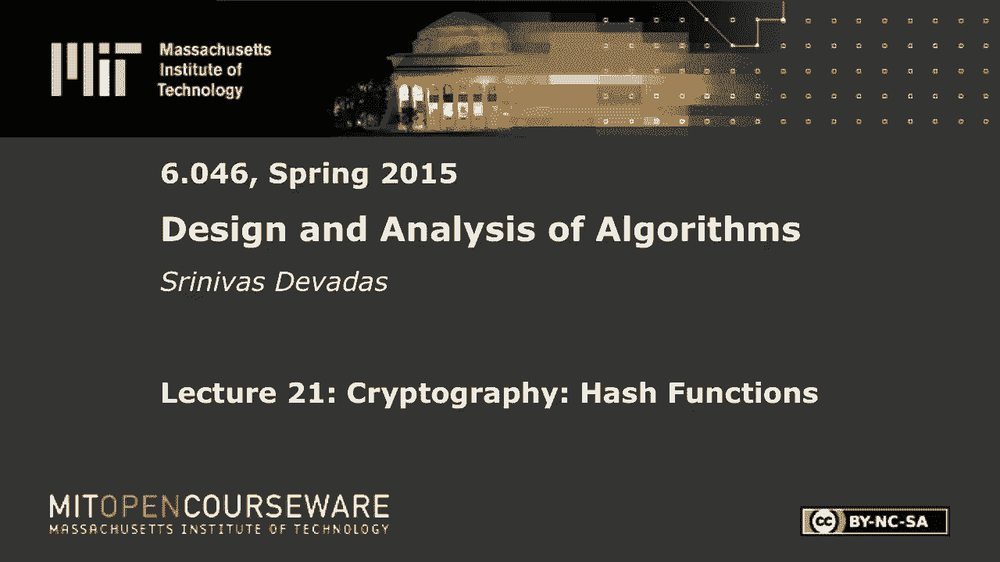
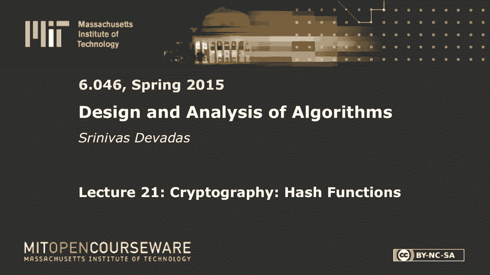
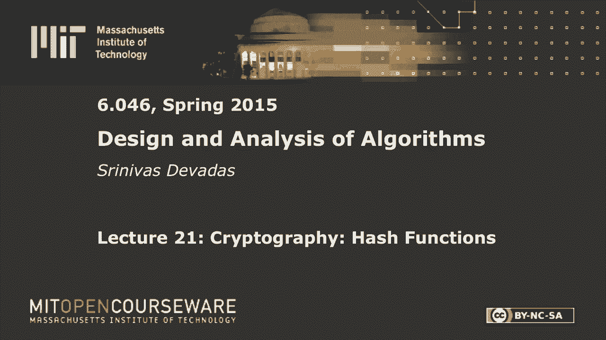
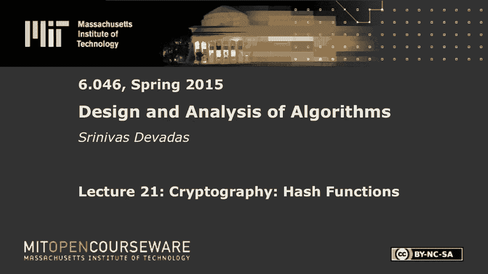

# 数据结构与算法设计：L21：密码学：哈希函数 🔐

在本节课中，我们将要学习哈希函数在密码学中的应用。与之前用于构建高效字典的哈希函数不同，密码学哈希函数具有一系列特殊的安全属性，使其能够用于密码保护、文件完整性验证、数字签名和安全拍卖等场景。我们将详细探讨这些属性及其应用。

---

## 概述 📋

哈希函数将任意长度的输入字符串映射到一个固定长度的输出。在密码学中，我们要求哈希函数是确定性的、公开的，并且其行为看起来是随机的。核心挑战在于，我们需要用实际可计算的函数来近似一个理想的“随机预言机”。

一个理想的随机预言机可以看作一本无限容量的书。当首次查询一个输入 `x` 时，它通过抛硬币 `d` 次（`d` 为输出位数）来随机生成一个 `d` 位字符串作为 `h(x)`，并记录在书中。之后对相同 `x` 的查询都会返回书中记录的值，从而保证确定性。然而，这种预言机在现实中无法实现，我们需要用多项式时间可计算的伪随机函数来近似它。

---

## 密码学哈希函数的属性 🛡️

上一节我们介绍了密码学哈希函数的基本概念和理想模型。本节中，我们来看看为实现各种安全应用，哈希函数需要满足哪些具体属性。

以下是五个核心的安全属性：

1.  **单向性 (One-Wayness / Preimage Resistance)**
    *   **定义**：给定输出 `y`，难以找到任意输入 `x`，使得 `h(x) = y`。
    *   **公式描述**：对于给定的 `y`，寻找 `x` 使得 `h(x) = y` 在计算上是不可行的。
    *   **说明**：这保证了从哈希值反向推导出原始输入是极其困难的。

2.  **抗碰撞性 (Collision Resistance, CR)**
    *   **定义**：难以找到两个不同的输入 `x` 和 `x‘` (`x ≠ x‘`)，使得 `h(x) = h(x‘)`。
    *   **公式描述**：寻找 `(x, x‘)` 使得 `x ≠ x‘` 且 `h(x) = h(x‘)` 在计算上是不可行的。
    *   **说明**：这保证了无法找到两个不同的输入产生相同的哈希值。

3.  **目标抗碰撞性 (Target Collision Resistance, TCR)**
    *   **定义**：给定一个特定的输入 `x`，难以找到另一个不同的输入 `x‘` (`x ≠ x‘`)，使得 `h(x) = h(x‘)`。
    *   **公式描述**：对于给定的 `x`，寻找 `x‘` 使得 `x ≠ x‘` 且 `h(x) = h(x‘)` 在计算上是不可行的。
    *   **说明**：这是比抗碰撞性更弱的一个属性。抗碰撞性要求找不到任何碰撞对，而目标抗碰撞性只要求对于给定的一个特定输入，找不到与之碰撞的另一个输入。

4.  **伪随机性 (Pseudo-Randomness)**
    *   **定义**：哈希函数的输出应当与随机字符串不可区分。
    *   **说明**：虽然无法实现真正的随机预言机，但实际哈希函数应模拟其随机行为，使得输出看起来没有规律。

5.  **不可延展性 (Non-Malleability)**
    *   **定义**：给定 `h(x)`，难以计算出与 `x` 有特定关系（如 `x‘ = x + 1`）的另一个值 `x‘` 的哈希值 `h(x‘)`。
    *   **说明**：这防止了攻击者根据一个已知的哈希值，构造出另一个相关输入的哈希值。

---

## 属性之间的关系 🔗

我们已经了解了各个属性的定义。本节中，我们来看看这些属性之间存在怎样的逻辑关系。

*   **抗碰撞性 (CR) 蕴含目标抗碰撞性 (TCR)**：如果一个哈希函数是抗碰撞的，那么它自然也是目标抗碰撞的。因为如果连任意找一对碰撞都做不到，那么针对一个特定输入找碰撞就更做不到了。
*   **单向性 (OW) 与抗碰撞性 (CR) 相互独立**：
    *   存在满足单向性，但不满足目标抗碰撞性（更不用说抗碰撞性）的哈希函数。
        *   **示例**：假设 `h(x)` 是单向的。构造 `h‘(a, b, x2, ..., xn) = h(a ⊕ b, x2, ..., xn)`。这里 `a` 和 `b` 是额外输入位。`h‘` 仍是单向的，因为要逆推需要知道 `a⊕b` 的值。但 `h‘` 不满足 TCR，因为 `(a=0, b=0)` 和 `(a=1, b=1)` 这两组输入会产生相同的哈希值（因为 `0⊕0 = 1⊕1 = 0`），从而构成碰撞。
    *   也存在满足目标抗碰撞性，但不满足单向性的哈希函数。
        *   **示例**：假设 `h(x)` 是 TCR 的。构造 `h‘(x)`：如果 `|x| <= n`，则输出 `x` 本身（原样泄露）；否则输出 `h(x)`。对于长输入，`h‘` 继承了 `h` 的 TCR 属性。但对于短输入，`h‘(x)` 直接输出 `x`，因此给定输出 `y`（短字符串），很容易找到原像 `x = y`，从而破坏了单向性。

这些例子表明，在设计和选择哈希函数时，需要根据具体应用明确所需的安全属性。

---

## 哈希函数的应用实例 💻

理解了哈希函数的属性后，本节我们来看看这些属性如何在实际场景中发挥作用。

以下是几个关键的应用场景及其所需的哈希函数属性：

*   **密码存储**
    *   **场景**：系统不存储用户明文密码 `pw`，而是存储其哈希值 `h(pw)`。登录时，系统计算用户输入密码 `pw‘` 的哈希值 `h(pw‘)`，并与存储的 `h(pw)` 比较。
    *   **所需属性**：**单向性 (OW)**。即使攻击者获得了存储的哈希值，也无法反推出原始密码。目标抗碰撞性在此场景中并非必需，因为系统可以限制尝试次数，且发生碰撞导致误接受的概率极低。

*   **文件完整性校验**
    *   **场景**：为文件 `F` 计算哈希值 `h(F)` 并安全存储。之后需要验证文件是否被篡改时，重新计算当前文件 `F‘` 的哈希值 `h(F‘)`，并与之前存储的 `h(F)` 比较。
    *   **所需属性**：**目标抗碰撞性 (TCR)**。攻击者的目标是修改文件内容后，使新文件的哈希值与原哈希值相同。这正对应了给定原文件 `F`（和 `h(F)`），寻找一个不同的 `F‘` 使得 `h(F) = h(F‘)`。

*   **数字签名**
    *   **场景**：对长消息 `M` 直接进行数字签名开销大。通常做法是先计算消息的哈希值 `h(M)`，然后对 `h(M)` 进行签名。
    *   **所需属性**：**目标抗碰撞性 (TCR)** 和 **不可延展性**。攻击者如果能在给定 `M` 和 `h(M)` 的情况下，找到另一个消息 `M‘` 使得 `h(M) = h(M‘)`，那么他对 `M` 的签名就同样适用于 `M‘`，这可能导致欺诈（例如，将“支付$20”的签名用于“支付$10000”）。

*   **密封投标拍卖**
    *   **场景**：投标者 Alice 提交其出价 `x` 的承诺 `c(x)`（例如 `c(x) = h(x)`），而非明文 `x`。开标时，她揭示 `x`，并证明 `h(x)` 等于之前提交的承诺。
    *   **所需属性**：
        1.  **单向性 (OW)**：在揭示前，承诺 `h(x)` 不泄露出价 `x`。
        2.  **抗碰撞性 (CR)**：防止 Alice 事后找到另一个出价 `x‘` 使得 `h(x) = h(x‘)`，从而在开标时根据对自己有利的情况选择揭示 `x` 或 `x‘`。
        3.  **不可延展性**：防止其他投标者根据看到的承诺 `h(x)`，计算出 `h(x+1)` 等，从而构造出刚好比 `x` 高的出价。

---

## 总结 🎯

本节课中我们一起学习了密码学哈希函数的核心知识。我们从理想的随机预言机模型出发，探讨了实际哈希函数必须满足的五大安全属性：单向性、抗碰撞性、目标抗碰撞性、伪随机性和不可延展性。我们分析了这些属性之间的逻辑关系，并通过密码存储、文件校验、数字签名和密封拍卖等具体应用，深入理解了为何不同的场景需要哈希函数具备不同的属性组合。密码学哈希函数是构建现代安全系统的基石，其设计需要在安全性和计算效率之间取得精妙的平衡。