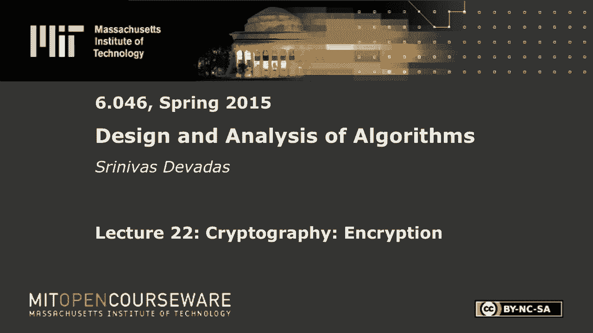
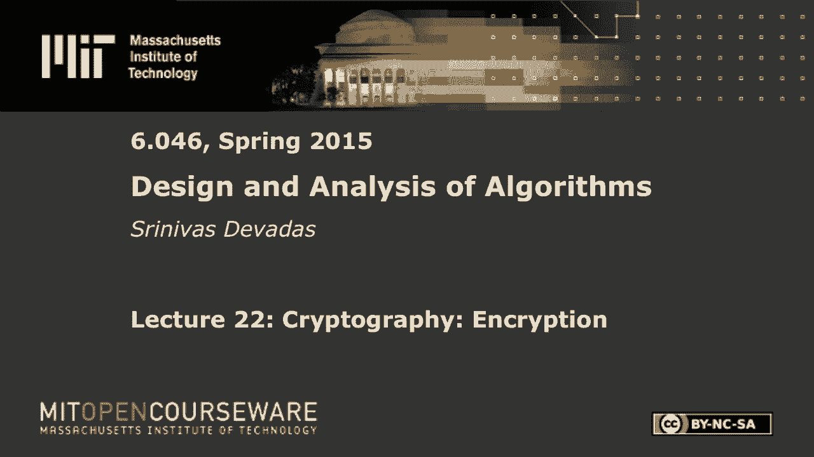
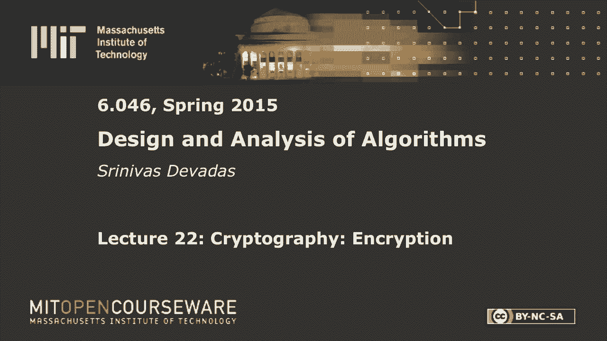

# 【双语字幕+资料下载】MIT 6.046J ｜ 数据结构与算法设计(2015·完整版) - P31：L22- 密码学：加密 - ShowMeAI - BV1sf4y1H7vb

以下内容是根据知识共享许可提供的，您的支持将有助于麻省理工学院开放课件。

继续免费提供优质教育资源。

捐赠或查看麻省理工学院数百门课程中的额外材料。

所有的权利，早上好，每个人都是一样的，在密码学和密码技术方面，类似于星期二的讲座，所以如果你喜欢的话，你会喜欢这个的，如果你不喜欢，嗯，会更像，非常抱歉，但我们今天要做的是做几件事，有点不同。

我们要谈谈加密，所以我们讨论了哈希，你当然知道从字典的使用，我们在零四还没有真正讨论过加密，六甚至在双O六，但是我们看两种不同的加密算法，并花一点时间在对称密钥加密上，这实际上是编码机器中使用的东西。

包括二战的谜，如果你看到模仿游戏，你可能会看到，所以你有一个共同的秘密，这是一个单一的所谓对称共享秘密，双方都知道这个秘密，我们很快就会讨论交换秘密意味着什么，所以我们将讨论密钥交换。

然后我转向非对称密钥加密，我提到了一点，当我们上次谈到数字签名时，我谈到了公钥和私钥，但我们实际上要看几个不同的，当今的公钥加密算法，经典算法，第一个真正保持安全的算法，RSA算法代表Rivest。

沙米尔和阿德曼，三位发明家的首字母，1977年在麻省理工学院发明至今仍在使用，所以在加密中，如果你不知道秘钥，对手应该很难发现信息对应的是什么，对手看到了所谓的密文，也就是加密文本，对手不知道秘钥。

如果他或她知道秘密钥匙游戏结束，但假设对手不知道秘钥，在计算上应该很难发现有意义的正确信息，所以这种硬度和NP完全问题之间显然有关系，计算上很难，和，这并不奇怪，人们试图建立所谓的密码系统。

它们本质上是基于NP完全问题硬度的密码学技术，包括图形着色和背包等等，等等，但事实证明，在各种问题之间有一个真正微妙的区别，在构建像RSA和NP这样的安全密码系统方面，完全问题。

我们会在讲座结束时讨论这个问题，我们可能会花很多时间在这上面，所以让我们开始对称密钥加密，从数学的角度来看，这在某种程度上有点无聊，所以如果我们想花很多时间在上面，而且肯定很有用。

它本质上假设有一个秘密密钥K，你可以把它看作是一个1，2，8位的数字，有些人希望它更大，二五六，但突然到了64岁这个时候可能还不够，尽管264仍然是一个相当大的数字，具有并行性。

对手只需要两天到六十四小时的工作，列举所有可能的64位密钥，所以一二，一二八好多了，这是爱丽丝和鲍勃分享的，所以我们会把这里的主角想象成爱丽丝和鲍勃，他们想交换信息，通常对手是恶意的，所以。

但显然还有其他方法可以命名对手，所以这里的基本方程非常简单，它是一个C，是密文，所以这里有一点术语，密文M是纯文本还是消息，纯文本意味着你可以阅读它，密文是加密的，k是，当然啦，秘钥，在这上面。

E是加密函数，现在在对称密钥密码学中，基本上，要求是你必须能够得到纯文本，从密码文本，给定公开解密功能和密钥知识，这应该是一个简单的操作，对了，顺便说一句，这是一个多时计算，它不是恒定的时间。

它是典型的线性时间，你不会真的希望它是二次时间，即使你想做得很快，你知道的，流媒体，你知道的，发送消息流，许多千兆位，可能都被加密了，当你从卫星上得到东西时，就会发生这种情况，然而你，你在下载电影。

这正是发生的事情，我会说，它是对大量数据的对称密钥加密，所以向后就是，c对，这里唯一的区别是其他一切都保持不变，这是我们的解密功能，所有的权利，这就是对称密钥加密，这里有一个可逆性的要求。

所以从一个方面来说有很大的不同，我们上次讲到的哈希，因为在这里，当你想从C到M很难的时候，只有当对手不知道K时才会困难，如果有人知道K，应该很容易，事实上，就复杂度而言，e和d实际上是相同的。

有时是执行，只是你把它倒过来，你拿回你加密的东西，你就是这么想的，所以真的，发生的事情是你需要可逆的操作，或d，就是加密和解密功能，所以排列，比如说，是可逆的，你总是可以拿一些东西来排列它。

你可以向后走，这样你就可以，你可以做这样的事情，反面是这样的，这就是这应该是什么，它是，事实上，我这里有三个比特，他们变成了，那里有三个比特，很明显，如果我颠倒排列，如果我有一件简单的事。

它是ABC的地方，我要把它转换成CBA，然后cba可以通过反向置换返回到abc，所以很明显这是一个可逆的操作，但还有其他操作也是可逆的，右加上我可以被否定反转，权利和排他性，或者只是排他性的战争。

因为如果你做一个排他性的或B，然后你得到c，想象一下如果你再做一次b，你得到了一个正确的背部，这就是我所说的反转，因为你基本上有一个独家或抵消，所以它就像一个独家或B独家或B，我会给你会给你一个。

如果你去看AES，比如说，这是高级加密标准，实际上只有大约四行代码，可能是八行代码，但这是一个用得很好的，已经有一段时间了，以一二八位模式运行的对称密钥密码，以及两个四个六位模式，就像我说的几行代码。

你会看到像这样的排列操作，你会看到帽子符号，如果你看到一个C程序，也就是排他性战争，你可以看到加密和解密是相同的，执行中，你只是要单行道，你再运行一次，你得到结果，因为这些排列是可逆的，帽子是可逆的。

它们都是有符号整数，所以你只是把它们加起来，它只是补码算术，所以看起来也一样，所以我鼓励你去看看AES，是呀，我不打算在这上面花更多的时间，这里的关键思想是对称性和可逆性，我们要远离那个，很明显。

当我们讨论单向哈希函数时，我们没有讨论这个，等等，那是不同的情况，在那里我们没有秘密，但这里我们想要对称，你会问的大问题，你应该问问自己，当你看到这个，你说好的太好了，我可以建立对称密钥加密算法。

他们实际上是，我想说做起来更容易，然后构建哈希函数，它有很多更有趣的特性，很难获得的特性，比如抗碰撞性能，但问题是，爱丽丝和鲍勃如何分享秘钥，K右，所以你需要那个，你需要这个二位八位的数字。

为了有一个通道，安全通道，爱丽丝可以和鲍勃交流，反之亦然，所以现在你可以说爱丽丝给鲍勃寄了一封信，但你知道马尔可以拦截那封信，甚至更糟，玛尔想做的是看这封信，实际投递信件，这对他来说是最好的，和。

爱丽丝和鲍勃认为他们有一个安全的通道，这对正常的权利来说是最好的情况，所以你可以把Mal放在中间，你得担心这样的事情，对，所以密钥交换，让我们继续讨论密钥交换，秘钥是如何，你不能把这个放在网站上对吧。

所以必须是这样，分享是在一些必须安全的事情上，从这个意义上说，不能有任何窃听者，所以说，这是我最喜欢的一个谜题的例子，你们大多数人可能都听说过，但你们中没有的人真的很酷，你们中拥有它的人仍然很酷。

实际上有一些事情你可能没有想过太多，即使你听说过这个谜题，这是在解这个谜题时所做的数学假设，你会感兴趣的，但这个谜题是海盗谜题，对呀，所以你有爱丽丝和鲍勃，我们叫它加勒比海吧，因为那是我最喜欢的海洋。

爱丽丝和鲍勃在两个不同的岛上，我们都知道加勒比海有海盗，对吧，所以爱丽丝和鲍勃想互相交流，爱丽丝有一堆盒子，她有的锁和钥匙，她锁的钥匙，没有别的，鲍勃也一样，所以鲍勃有盒子，锁，他箱子的钥匙，对不起。

他锁的钥匙，他可以放在他的盒子上，在这种情况下，爱丽丝想给鲍勃发个信息，爱丽丝想和鲍勃交换钥匙，所以他们最终可以以安全的方式交流，不管海盗或其他人在听，所以这里的问题是，当然啦。

如果你只是在船上发一个信息，所以海盗在某种程度上是很好的，但他们很好奇对吧，你知道的，所以他们很好奇，他们会打开盒子，所以那应该是一艘船，顺便说一句，不是盒子，那里有一点肿块，我不是水手，但你有。

你有这些盒子要被送到，交易是这样的，如果有一个打开的盒子，海盗就会打开箱子，如果里面有什么信息，他们可能会读到，他们可能会马上扔掉，所以很明显有一把秘密钥匙。

很明显只要放一个盒子里面有信息就可以交换密钥，如果你不锁门，他们将无法打开，他们不会碰，他们会送一个锁着的盒子，但如果他们看到钥匙，他们会好好的，如果他们在船上看到一把钥匙，他们只会抓住它并保留它。

下一次他们看到一个锁着的盒子，他们会把钥匙插进去，试着打开它，那么爱丽丝和鲍勃如何安全地交换秘密，安全是基于海盗的概念，我想海盗有一定数量的，在存储钥匙和打开锁方面的能力。

但他们不会碰一个锁着的盒子好吧，所以这就是谜题，你们有多少人听说过这个谜题，好吧，所以你们都保持安静，以前没听说过这个谜题的人，我想在这里几秒钟，看看你是否，如果你想到了一个解决方案，关于来回。

这就是来来回回的暗示，并且能够安全地交换消息，这可能是一把秘密钥匙，一个2个8位的秘密钥匙写在爱丽丝和鲍勃之间的小纸条上，是啊，是啊，在后面，所以如果你看到一把锁，他们会把锁扔掉，如果锁在盒子上。

那他们一定会把那个盒子送来，但如果钥匙在盒子外面，那他们就留着钥匙，现在这是什么，这是个难题，是啊，是啊，那是，是啊，是啊，然后在那一点上，哦，你在正确的轨道上，继续走，再用力一点，再坐几次船。

我们做得很好，是啊，是啊，所以现在盒子上有两把锁，鲍勃在盒子上有两把锁，那么鲍勃接下来要做什么呢？鲍勃下一步应该做什么，把它寄回给爱丽丝，现在是关键的洞察力，也就是爱丽丝现在看到盒子上有两把锁。

其中一把锁是鲍勃，一个是他的，一个是她的，她可以打开盒子把它送回球，一直以来，唯一在运输途中消失的是一个锁着的盒子，在运输途中没有钥匙进入，不管它们是在盒子里还是在任何地方。

但唯一移动的是一个锁着的盒子，对呀，所以这很好，你说得很对，所以这让你，给你一个飞盘，呜呜，对不起，我们需要一个安全的交换，是啊，是啊，那很好，所以这是完全正确的，所以回顾一下爱丽丝，用K。

这是锁的钥匙，把它发给鲍勃鲍勃，带有KB的日志框将其发送给Alice，哦，我应该说Alice把信息放在盒子里，这条消息里面有秘密钥匙，爱丽丝解锁K，然后鲍勃，对，这样很好，那很好，嗯。

让我们更深入地研究一下，从数学的角度而不是物理的角度来思考，或者你也可以从物理的角度来考虑，锁定这个序列和，在这种情况下，我们需要一对锁，为了让这在物理上有意义，对呀。

我是说你可以用不同的方法在一个盒子上加两把锁，对，有很多不同的方法，一种方法是有一个锁着的盒子，如果我把它锁在这里，它打不开，因为盖子打不开，我有这样的手提箱，然后这里可能还有一个地方可以锁住它，对。

所以这可能是一种方法，有两把锁的另一种方法是什么，是啊，是啊，是啊，是啊，把盒子放在盒子里，那太好了，所以如果你把它，如果你把盒子放在盒子里，然后做这个工作，它不能正常工作，所以嵌套锁实际上不起作用。

因为这里发生的是K，如果，事实上，你有卡，然后是KB，然后呢，这就是嵌套锁的情况，所以我们需要的数学运算是交换性，在锁和锁之间需要通勤，我想先把卡放进去，就像我描述的那样，物理实现，可能只是一个手提箱。

两个锁在两个不同的位置，任何一个姿势都能锁住手提箱，所以你把ka放在这里KB放在这里，然后你就可以把卡拿出来了，它还是锁着的，因为你有KB，这些锁，本质上是钥匙，是所需要的，所以现在让我们远离海盗。

并进入密码学领域，纯数学领域，看看这是如何变成所谓的DIY赫尔曼密钥交换的，它是密钥交换算法或协议，在某些条件下，它给了你你在这里看到的一切它给了你一个安全的密钥交换，有一个问题与此相关，这就很清楚了。

一旦我们把它写出来，我们就会回到，但如果我赫尔曼，密钥交换假设您有交换锁，并且，这就是它的工作原理，你会看到什么通勤，当我给你与DIY赫尔曼密钥交换相关的方程时，这也是在七十年代。

我在七十年代描述和描述，所以我们要做的是我们要工作，有限场意味着我们要做mod p，其中p是素数，恒星意味着我们只看可逆元素，所以我们去掉了非语言元素，这些东西不是特别重要，所以我们将下降零。

我们会看到1，2，p-1，所以你看到的所有数字都是1到p减去1，现在这个协议的模拟是什么，爱丽丝和鲍勃在我们的海盗中，拼图，操作或运行什么是模拟，数学领域，或在有限场域井，事情是这样的，爱丽丝。

我们假设G是公共的，所以她只是对着，爱丽丝可以从她家看到鲍勃，所以她喊出G，喊出P，他们都是公开的，她不在乎海盗会不会听到，爱丽丝要选择一个，这是随机和计算的，a的g，这是在有限域大写g中。

所以你要做你的mods，只是，她只是要把G的一个传给鲍勃，现在Bob要做的是选择B，g升到b，并将其发送出去，所以这是G上升到A正在发送过来，g升到b被送过来了，寄给爱丽丝，所以Alice把g提升到b。

这里的关键意识是Alice，升到B升到A是因为她认识A，这一切都将是mod p，我们将称之为K，多亏了这样一个事实，计算g升到b，对不起，g升到a升到b，因为鲍勃知道B，也正好是K好吧。

我应该说mod p，在这里一切都是mod p，原来如此，那是不一样的，赫尔曼密钥交换，您现在已经创建了一个基于，这里还缺少的部分，关于类比，A的g本质上是锁着的盒子，所以g的意思是因为你想把a藏在这里。

和b的g一样，它需要隐藏b，所以海盗们的问题是他们可以打开盒子，对手的问题，让我们称之为马尔，他必须反转a的g才能发现一个，在这个特定的有限域中，有许多这样的有限场，你可以把这看作是，所谓离散对数问题。

对呀，所以我们都知道如何计算连续域中的对数，那里有桌子，很容易做到，但这就是所谓的离散对数问题，因为我们在有限的场中，我们显然想要整数，A是整数，所以我们需要发现那个整数是什么，因为我们在做mod。

p等和p通常是一个大数，做离散测井实际上是一个计算上的难题，所以当你看到g的a，如果你不知道，你知道G，你知道的，你知道P，但试图弄清楚一个产生了什么，a的g是一个难题，人们已经看了三四十年了。

没有很好的算法来解决这个问题，当然不是任何多项式时间可解的东西，它们都是次指数级的，你可以让数字足够大，使a的g是安全的，从某种意义上说，它不会泄露什么是好的，这就是迪菲和赫尔曼的洞察力，归结为。

嗯很难，这简单的意思是给出a的g，离散对数问题是计算a，对于b也是如此，当然还有一件事你想说，准确地说是为了覆盖整个光谱关于它是如何打破的，这就是所谓的迪菲赫尔曼问题，为了一个更好的名字。

因为这些人是第一个提出它的人，和迪菲埃，赫尔曼问题简单地说，给定a的g和b的g，这就是海盗看到的，对手马尔看到的，我们应该不能计算a的g乘以b，这正是我们在这里得到的，a的g升到b是a的g乘以b。

所以考虑到这两件事，如果有一种计算g乘以b的方法，即使你可能还没有发现A和B，恰好g乘以b是爱丽丝和鲍勃交换的秘密钥匙，所以你的主人，艾莉森·鲍勃或主持人，如果玛尔能做到这一点，所以这里有两件事。

你想让DIY赫尔曼的问题很难，您希望离散日志问题很难，好吧，所以一般来说，这就是密码学的工作原理，你设置了协议，有一些信息肯定会暴露，你希望这些信息很难逆转，以获得需要计算硬度假设的关键信息。

就像我们在这里做的两个，然后你就跑开了，如果你的计算硬度假设不正确，你的系统就会崩溃，它们在特定时间可能是正确的，例如二十世纪七十年代的特定参数，但它们最终可能是不正确的假设。

至少对于以后的时间点的这些参数，仅仅是因为计算机变得更快，就像两人升到四十人，这个巨大的数字，就像你知道的，当我像你这么大的时候，好像什么都不对，所以这基本上是游戏的一部分。

但好的系统是那些可以扩展的系统，在那里你可以增加参数大小，系统和协议保持不变，所以你只是增加，p，比如说，在这种情况下，离散对数问题对现代计算机来说仍然很难，对吧，所以这些都是好的协议。

以及经得起时间考验的优秀密码系统，不一定是有特定参数的，你知道的，这很难做到，因为，正如我所说，摩尔定律和计算机已经变得非常快，用DIY赫尔曼协议和我们海盗谜题的解决方案，所以有人能告诉我。

这可能只是为了迪菲·赫尔曼问题，或者只是在迪菲·赫尔曼问题的背景下，也是在海盗谜题的背景下，我们在这里做什么假设，这还没有说明，关于这个安全密钥交换实际上是安全的，那是什么意思，他们有一个锁着的。

海盗们看到了一个锁着的盒子，所以协议的第一步爱丽丝在一个锁着的盒子里发送信息，里面有一把锁，海盗们能做什么，你在正确的轨道上，海盗们能做些什么来打破这个协议，我们在这里做了一个假设。

我可能已经明确地说出来了，是啊，是啊，把箱子打开，他们可以把盒子扔掉，但这并不破坏协议的安全性，破坏协议的功能，对呀，是啊，是啊，去那里，我来锁门，完全正确，把他们自己的锁放在上面。

你知道如果你把如果他们有锁，所以这些海盗没有锁对吧，我们是在假设，如果他们有自己的锁和钥匙，对呀，如果他们有一把锁，他们没有钥匙，他们仍然不能破坏协议的安全性，对吧，但如果他们有锁和锁的钥匙。

然后他们可以假装把这个交给鲍勃，这里没有真实性，关于爱丽丝，我不太清楚她是否在和鲍勃交流，她任由海盗摆布才能把这些箱子运到正确的地方，所以如果海盗们，我有一把锁和一把锁的钥匙，那我们的处境就是。

爱丽丝可能和海盗交换了钥匙，对吧，她以为她和鲍勃交换了，她实际上是在和海盗交流，所以有一个人在中间攻击，他们自己的锁和钥匙，在我们这里的照片中，这就更微不足道了，因为假设海盗们懂数学。

它们可以生成一个随机数，这个数字可以是C，比如说，然后把g加到c右边，就你所知，他们真的可以得到鲍勃，我不得不把G提高到B回来，但他们会拦截它，用g升到c代替它，他们知道C是对的。

所以现在发生的是这样你就可以看到，我想把所有的，这里的数学，但你可以看到，我希望你最终会在哪里，如果你是爱丽丝，与，和海盗而不是鲍勃，你可以设置这个的方法是，海盗们实际上会陷入一种情况，爱丽丝和鲍勃。

认为他们在以一种安全的方式相互交流，但是海盗可以监听所有的信息，他们可以解密所有的信息，因为他们知道，什么秘钥K可以，记住秘钥，k是可能会被使用的东西，在对称密钥加密方案中，所以你会有密码文本。

在那里有一个秘密的密钥大写K，如果海盗或马尔，通过一个人在中间攻击来知道秘密钥匙K是什么，你有问题，所以我们要担心的是中间的那个人，我们接下来要讨论的是解决这个问题的东西，它似乎并没有直接解决问题。

但从根本上说，这里发生的是你需要有真实性，你在和谁交流，爱丽丝必须以某种方式认证鲍勃，爱丽丝必须知道，不知何故，G种族是来自鲍勃的东西，对吧，它不是g升到c，来自中间的其他人，这就是非对称键的地方。

密码学和公钥，其中您有与自己关联的认证公钥，所以你说，也许你需要验证，或者你需要车管所或机动车辆登记处，RMV为您做这件事，但是您创建了一个与您的身份相关联的认证公钥，而且是公开的。

你可以把它放在一个网站上，每个人都可以使用http访问它，这样他们就知道他们会去你建立的网站，这给了你一种识别自己的方式，如果你能做到，你可以防止中间的人攻击，使用非对称密钥密码学，好吧。

这就是最后一部分，这个与身份验证和密钥交换有关的难题，一旦我们这样做了，你就会知道我们需要什么功能，然后我们将不得不讨论如何建立这样的系统，酷，到目前为止，我们有什么问题吗，好的，所以公钥加密。

我来布置一下，我上次说过一些，但为了确保我们意见一致，我们这里有的是，我们真的想要一条消息加上一个公钥，你想获得密文，使用此操作，这个加法不是算术加法，只是我们把这两件事放在一个算法里。

一种产生密文的公钥加密算法，这个公钥只是为了重申我刚才说的，如果爱丽丝在产生信息，鲍勃正在得到密文，这将是Bob的公钥，事实上，它是鲍勃的公钥，是爱丽丝应该能够认证的东西，使用验证符号。

使用机动车辆登记册，你有什么，这就是防止中间的人攻击的东西，好的，我们不打算谈论很多关于你如何获得证书的问题，你的麻省理工学院证书是与你的麻省理工学院身份证相对应的东西，它有信息，你是哪一年。

你叫什么名字，当您生成证书时，你得到了真伪证书，你就是你，当然，你把它送人，你把它递给别人，有人也可以冒充你，但当我们谈论公钥时，就会发生这种情况，您拥有公钥，我们不会，正如我所说，更多地进入那个。

我更感兴趣的是描述这种公钥加密算法，如果我们看一对产生密文的夫妇，给了一个消息，现在是公钥，当然啦，鲍勃需要做的是把密文，这就是鲍勃正在做的，Bob有一个不同于公钥的私钥，需要准确地得到信息。

使用与爱丽丝发送的消息相对应的解密算法，好的，这整件事都会奏效的，提供，了解公钥，我们就叫它PK和私钥吧，也不能叫pk，很明显，所以我们称之为K知道PK，数学意义上的任何东西，关于S k。

但显然为了让这整件事奏效，PK和SK必须有一定的数学关系，以及包括RSA在内的不同密码系统，我们看看Napsec加密系统，都有不同的加解密算法，它们在PK和SK之间有不同的数学关系。

对于这些关系中的每一种，你必须证明对手必须解决一个计算上很难的问题，为了发现PK，抱歉，打扰一下，发现SK给定PK对，事实证明，对于大多数这些系统来说，它是对称的，从某种意义上说，这些算法你可以使用。

至少对RSA来说，您可以互换使用其中任何一个，这个问题与，所以我们真的不会太深入，但我说的话，我应该坚持住，就是你，你有一个，它不应该告诉你任何关于另一个权利的事情。

一定有一个计算上很难的问题与发现其中一个，只给了另一个，我们要谈谈，这些硬度假设当然是针对RSA的，也适用于另一个密码系统，背包，所以我们要介绍RSA，这是一个真正神奇的算法，太神奇了，每次都管用。

我为这次讲座做准备，我得重新学习一些东西，那是因为它，你知道这个，这有一个微妙的方面，都是关于数论的，数论可以变得相当微妙，但它也很复杂，我忘记了细节，所以让我们开始吧，基本上，我们的说法是基于素数。

并将数字分解为素数，用数论，以确保你能真正完成这个试图做的事情，i，RSA的功能应不同于RSA的安全性，就在我们谈论RSA的功能时，我们在说任何信息，如果爱丽丝用鲍勃的公钥加密它。

由此产生的密文应该被解密为，正是爱丽丝给鲍勃私钥发送的消息，对呀，这是公钥加密算法的功能要求，或公钥密码系统，公钥密码系统的安全要求是我在上面写的，SK的知识应该被隐藏起来，即使有PK的知识。

有精确的计算硬度假设，与每个密码系统相关联的，所以让我们把功能和安全性分开，我们将在接下来的几分钟里讨论功能性，爱丽丝要挑，p和q，所以我要描述的是，这是Alice生成她的公钥和私钥。

然后她将公布她的公钥，并保留她的私钥，秘密鲍勃也做同样的事情，然后他们必须注册，这不是什么，我们会花时间超越我，说出来，再一次，他们必须注册他们的公钥，使用VeriSign或RMV，就像我说的。

所以每个人都知道Alice的公钥是这个长数字，但是没有人知道爱丽丝的私钥，所以Alice选择了两个大的秘密素数，所以这些最终会导致我们私钥的创建，然后爱丽丝计算，n=p q，好的，所以你只要把这些乘以。

她选择，它是相对于p-1乘以q-1的质数，她知道P和Q，所以她可以计算p减去1乘以q减去1，减去1等于1，你当然可以通过选择e作为素数来实现这一点，对呀，事实证明RSA使用，这一切都将是公开的。

顺便说一句，E将是公开的，所以你可以解决这个问题，大多数RSA算法只是将其修复为这个小数字，加密指数是一个小数，它是一个小数字的原因，是因为你担心性能，我们将用E求幂，它就越小，加密的速度就越快。

所以如果你想快速加密和更慢地解密，不幸的是，这是这里的权衡，你会挑一个小E，然后我们要计算我们的解密指数，这显然必须是私人的，因为那是我们私钥的一部分，但那会更大，如果e很小，这只是一个权衡。

从某种意义上说，它是对称的，而它是一个非对称的算法，它在数学意义上是对称的，私钥和公钥操作是对称的，那么爱丽丝的公钥是什么呢，爱丽丝的公钥，然后她可以出版，嗯是简单的n逗号e好的，现在乐趣开始了。

我们必须弄清楚私钥将对应于什么，结果发现，这是他们怎么想到的，这仍然是真的，四十年后，你得到解密指数，这是爱丽丝做的，暗地里，你想要的是E乘以D是1的关系，这是mod p减去一，q减去一，外面有算法。

就会找到对应于e的d的逆，反之亦然，和他们的多边形时间算法只要你知道这个数字，mod p减去一，q减去一，你知道爱丽丝知道你可以得到你的解密指数，对呀，通常如果e很小，正如我所说，D会很大，顺便说一句。

这里的数字p和q大约有1000位长，对呀，所以这本质上是，我们在这里谈论的是巨大的素数，在这种情况下，n就是248位，所以私钥爱丽丝的私钥，你可以把它想象成d p q，所以现在什么是公共的。

什么是私人的都很清楚了，n和e是公共的，所有的权利，这就是RSA的设置，目前还不清楚RSA是否完成了，我们需要的两件事中的任何一件，首先是功能性，加密然后解密消息的事实，应该会给你回那条信息。

所以这是我们需要看的第一件事，安全部分实际上更容易一点，因为你可以看到我们必须对保理做出假设，素数等等，等等，就在这里，你可以马上看到，RSA做出的最大假设，从计算硬度的角度来看，如果对手看到了。

他们应该不能把它计入P和Q，因为如果他们能做到，一切都结束了，所以这实际上比功能性参数更容易，那么为什么这个能起作用呢，令人惊讶的是，我们可以在大约十分钟内做到这一点，3。我可以在十分钟内解释给你听。

唯一需要的定理是，我不会证明这一点，因为格式在几个世纪前就证明了这一点，是费马的小定理说，当你有p是质数时，这是一个，你可以把这看作是一个特例，你，你有，你取m，m是一个任意数，如果p是素数。

那么这种关系就成立了，所以你把它升到p-1次方，你得到一个正确的mod p，这就是马特的小定理，这将是必需的，这几乎是你唯一要调用的东西，超越标准的现代算术来证明RSA是有效的，那么这是怎么回事。

我们把φp减去1乘以q减去1，很明显这已经出现过几次了，并不妨使用较小的，更简单的符号，所以我们称之为费用，我们会说d等于给我们的一个mod费用，因此我们可以说e等于1加k费，原来如此。

我要说的就是剩下的，当你拿着mod关于，费用是一个，所以实际数字是1，加上k乘以费用，其中k是某个整数，我不认为它是正整数，记住我们现在有p，q在那边，p和q是素数，所以p和q是素数，鉴于情况如此。

我们真的有两个案子要分析，嗯，哦，对不起，我错过了一个关键的，3。我应该早告诉你这是我给你的，但我实际上没有告诉你发生了什么，我在通过指数时提到过，但我没有告诉你加密算法是什么，解密算法是。

很明显你需要，为了证明他们的正确性，我的意思是这将是美妙的，如果我们能证明这一点是正确的，有一个算法，使RSA工作或公钥加密工作，所以事实证明这是极其简单的，c等于m升到e，这就是RSA力量的部分用处。

它是一个C，取m求幂，你拿着，求c的幂，首先是加密，你通过加密得到C，你可以看到那边的密文，M是纯文本，你把它找回来所以我们的目标是展示，当你指数m升到e d右，应该给你M。

对于我们所拥有的E和D的这些选择，我们以这样一种方式设置了D，使我上升到ED，因为如果你去加密，然后解密，你在加倍指数，对呀，那是有道理的，问我问题，如果这没有意义，这很重要，我长大了，应该把M还给你。

如果你能证明这一点，你就完蛋了，这就是RSA的功能，所以这就是加密和解密，所以现在让我们回到我们在这里的地方，现在E等于一个mod费，因为我已经安排好了，这就是我如何发现D给定E，所以这是给我的。

这就是所谓的rsa关键生成阶段的一部分，这就是我一直在喋喋不休的数学关系，就公钥和私钥之间的关系而言，假设p和q是素数，我有两箱，正好是一个对所以，这意味着信息是我在这里比较的，这两种情况是我有消息。

我要把这些信息分成两个不同的类别，就是这样，各种可能的消息，这些是任意的数字，我要把它们分成两类，其中一个消息相对主要的，关于素数p，它不是p的倍数，你就是这么想的，显然GCD MP，应该是两个。

如果m是两个p对了，所以说，然后另一个案例将是一个微不足道的案例，其实，我是说两个吗，逗号p等于2，来吧右，醒一醒，哇哦，就这样完美，醒一醒，好的，所以两个p和p的dcd是p对的，所以这是两个案例。

这真的是费马定理，因为他有一个最后的定理，有人称之为小定理，但这是为了我们的定理，我们知道我们知道那是什么，我刚在外面写的，你现在可以写一些东西说，我要做什么，就是，我要去拿一个，拥抱，p减去一。

这是一个权利，所以这个东西是一个，然后我要把它提高到k倍，q减去一，你马上就会明白我为什么要这么做，因为我想在这里得到一加k费因子，所以我拿一个，我把它提高到这个幂，这显然会给我一个回报。

所以所有这些都很简单，然后乘以m，这显然是，与m mod p相同，因为我所做的就是把它乘以1好的，那么我为什么能做得很好呢，是我干的，因为我想把这两个指数组合在一起，因为我已经用完了这里的空间。

让我把它擦干净，反正另一个案子很容易，所以我可以把这个作为一个整体来写，加k的p减去1，q减去一，当然，这正是对权利的拥抱，所以我在这里所做的是这样的，因为只有一次m显然是m，但如果我看着这个，这是我。

它上升到埃德，很明显我是对的，就是这样，只是想弄清楚，当我有K费在这里，那会变成一个，基本上当你把它指数化的时候，所以这是最困难的部分，因为它证明了RSA的正确性，只是介绍一下这个，这一场比赛。

然后更容易的部分是简单的情况，其中m实际上是p的倍数，所以你有gcd m逗号p，在这种情况下，你知道m mod p实际上是零，因为m是p的倍数，所以你基本上是在指数零，你用零做什么，两边都是零。

所以你发出的信息基本上是零mod p，当你在那边解密的时候，你得零分，但这里的最后一行很简单，m升到e，d，所有这些mod p，如果m为零，原来如此，那是件容易的事，所以这真的很简单，在一个案例中。

我们取了一个，并将其指数化，并通过几个步骤显示了结果，在另一个例子中，你有零mod p的消息，所以它非常漂亮，它起作用了，所以这里发生的事情，我说我升到ED等于M，我在这里所做的，当然是我做的一切。

所以这不是一个小技巧，当我切换到mod p时，所以我在这里有mod p，我说p和q是质数，我看了我先看了P，但我需要做的是完成这件事，让我在这里做这个，我必须对q做同样的论证，我要把它放在一起N。

原因很简单，我在这里有n，记住n等于p乘以q，加密和解密将被完成，mod n，当然加密必须进行，因为n是你唯一的公众号，你可以用它来mod，所以我在这里所做的，这个分析是为了P能做同样的事情。

这是完全一样的，因为p是素数，q也是素数，但我得做最后一件事，就是把这两件事放在一起，说n等于p乘以q，所以数学都会解决的，吉米，把它写下来，这并不难解释，一旦我有了这个，所以在p和q的情况下。

所以当我说这两个案子，我是说P和Q的情况，我已经长大了，等于m mod p和m升到ed等于m mod q，我们可以说m升到ed等于m mod n，基本上就是把c升到d如果你真的想把它们放在一起。

升到E升到D，那个，当然啦，就是我们这里想要的，这个东西也是mod，这是现代现代现代，所以这是我们的说法，这是你的第一个公钥算法，第一个公钥算法，至少，它经受住了时间的考验，至今仍在使用。

从计算的观点来看，这是最难的部分，你必须指数，你有这些大数字，随着岁月的流逝，正如我所说，这是时间的考验，但是参数已经增加了，然后在70年代，他们在考虑五个12位素数，事实上。

我记不起n是不是5-12位，或者p和q是5 12位，但如果p和q是5 12位，那么n就是十二十四，现在国安局推荐81，n的92位，所以增加了，但好的是它不像，计算量呈指数级增长。

因为计算与位数是多项式相关的，好的，所以如果你把它翻倍，我想如果我没记错的话，解密将是它的立方体，或者实际验证签名可能是其中的立方体，但是不要太担心，底线是，当你把，指数的大小。

你所需的时间会有相当小的增加，解密或验证签名等，但它从五个，十二个或十个，二十四到八十一，九十二，所以希望你们都明白RSA是如何工作的，在某种程度上，我就把它留在，硬度，这里的假设就像。

在迪菲·赫尔曼的情况下，第一个是显而易见的，就像DIY赫尔曼的情况一样，你在那里飞来飞去，很明显，这里必须隐藏一个，你有n个大写的n被出版，如果有人能把n考虑在内，可能会有多个因式分解。

但你会得到一个唯一的素数因式分解，所以这就是你想要的，n的唯一素数因式分解，如果你明白了，那么你就打破了这个系统，因为你知道p和q是什么，所以这一切都是公开的，因为这个算法是公开的，如果你使用RSA。

这就是你所遵循的，所以这个人试图弄清楚这两个素数在一起是什么，乘起来形成资本n，这是一个因式分解问题，所以RSA硬度假设是，变成p逗号q，这是因式分解，然后另一件事，所以你实际上并没有破坏整个密码系统。

但你破坏了与特定信息相关的隐私，好的，所以你可以破坏与特定消息相关的隐私，你得到E是因为那是公开的，你知道你不知道P和Q是什么，但是你知道e相对于p-1是质数，q减去一，因为这是RSA算法。

这是众所周知的，你也知道C，这是密文，所以你所做的是你试图发现我，所以说，你试图破解一个特定的加密，这是由RSA算法创建的，您还没有在这里发现私钥，这只能通过因式分解问题来发现，但如果你能找到这样的人。

你可能会破坏安全，M升到E是C mod n，所以你在寻找一个M，所以你试图发现一个M，你可以指数得到你右手边的东西，因为很明显，你可以计算右手边的东西，所以这简单地称为RSA问题。

所以这是你需要做的两个计算假设，为了RSA的安全，酷，有什么问题吗？你还会得到，我感觉不到中心，哦，所以这就是匿名，是呀，有一种环密码学，有一大堆协议，我实际上做了一些基于RSA的，在那里。

您可以通过收集一堆私钥来确定，你可以我基本上设置它，所以可以验证消息来自一群人，但你分不清信息来自哪个人，所以有一大堆事情，有成千上万的论文，有一个美妙的领域，我鼓励你调查一下。

如果你的兴趣倾向于这种方式，就这样继续下去，继续，随着互联网在RSA上的发展，它变得更加重要，这家公司可能成立于70年代末，他们挣扎了一会儿，这是他们的大突破，当然网景意味着互联网的存在。

所以互联网真的让RSA，今天是什么，所以有一大堆奇妙的算法，其中一些是基于RSA的，还有一些是破碎的，所以让我们谈谈最后几分钟，关于密码学中发生的所有起起落落，这正是我想关注的。

因为我们剩下的时间是艰难的，所以我们花了很多时间谈论棘手的问题，我们谈到了NP，完成困难的问题，但在最坏的情况下它们很难，对呀，所以你有一个情况，你有NP完全问题，我想谈谈NP和，完整性和密码。

因为我们对硬度做了这些假设，现在，这里有趣的是，n的复合物显然是在np中，所以这很有趣，公钥加密的可信算法，依赖于计算假设，与这个假设相关的问题甚至不知道是NPC好吧，所以这有点疯狂。

就像这是怎么工作的，或者为什么这个现在起作用了，如果你，如果你拿其他问题，like是一个图形，那么这意味着什么呢，嗯，你有三种颜色，你不允许，在边缘的两端重复使用相同的颜色，所以如果你把红色放在这里。

你可以把红色放在这里，但是你不能把红色放在这里和那里，所以图表是三种颜色，但如果你有一个小团体你知道这不会是三种颜色，因为你有这些边缘，你有三个边缘出来，所以很明显，从顶点到顶点的度数会告诉你你有什么。

所以如果你在那里有第四个漏洞，马上就不是三个颜色了，但是检查一个图形是否有三个颜色的图形是NPC，你可以从减少中表明，或者你可以，你可以用三套来表示，所以你可以说，哦哇哦，也许我不该担心，rsa。

我应该建立基于三种颜色的密码系统，因为这似乎是一个简单得多的问题，和所有这些肮脏的地图，你有在那里，你有一张漂亮的地图，好吧那么，这是一个完全合理的问题，然后我们有背包，背包只是，你有一堆东西。

你只想弄清楚你是否能得到这个特定的数目，s，你有一堆重量给你，BI必须是零一，所以你只想发现bis的一个特定任务，这样你就可以挑选合适的物品放进背包里，对呀，就是这样，这是一个完全合理的潜在使用问题。

作为构建密码系统的计算硬度的基础，是的，人们这样做了，人们这样做了很多年，他们试了又试，他们生产了密码系统，基于背包的公钥密码系统看起来棒极了，它们从功能的角度工作，从某种意义上说，你会用这个背包。

我马上就会告诉你这是怎么做的，你会用背包问题，然后呢，你会用另一种背包问题来解密，当你加密解密，你确实收到了同样的信息，除了全世界都知道信息是什么，因为与背包相关的问题不够难，对吧。

所以计算的硬度是打破背包方案的原因，然后你就来问，为什么这个问题不是人大的，似乎经受住了时间的考验，但所有这些其他问题，如背包和三个颜色，比背包还糟糕，当人们在此基础上建立密码系统时。

它们都很快就被打破了，为什么会这样你觉得原因是什么，NP完全性说什么，当我们谈论复杂性时，我们大多数时候在担心什么，当我们谈论算法的复杂性时，我们在谈论什么，或者在这种情况下，在有问题的情况下。

我们在运行时前面放什么形容词，比如说，当我们计算复杂性时，最坏的情况，最坏的情况中的最坏的情况，你将能够创建随机的图表，在那里，发现它们是否有三种颜色需要指数级的时间，但在一般情况下。

你所要做的就是如果你有一个大的图表，如果你在图表中有一个小叉子漏水，你可以立刻找到它，你知道这是不可恢复的，对吧，所以事实证明，三种颜色是有史以来最糟糕的事情，当谈到密码学时，因为图形越大。

你需要这个图很大，因为任何微小的东西都是恒定的时间，对呀，因为水是指数级的，它是恒定的时间，所以你需要图形很大，当你有一个很大的随机图时，你找到叉子的机会，在2000个顶点的图中泄漏是相当高的。

所以如果你去扫描并寻找叉子，瞬间泄漏，你知道这个图不是三个颜色的，所以在一般情况下，三种颜色很容易，在一般情况下很容易解决，保理的美妙之处在于，只要人数多，数字是多少并不重要，很难考虑到一般情况，对吧。

所以这就是最大的区别，如果我们要从剩下的东西中拿走什么，这是密码系统所基于的问题之间的区别，这些系统经受住了时间的考验，它们是基于平均来说很难的问题，NP完全问题，像这里的简单问题。

在最坏的情况下是很难的，对呀，背包也是如此，所以这就是它的本质，嗯，我只是给你一个感觉，我不打算，你可以读笔记，我有一种方法可以生成秘密密钥和公钥，用背包，我觉得有点有趣，值得一看的。

即使所有这些系统都坏了，只是有点酷，你知道的，你怎么从背包里得到加密，对呀，我是说，你把东西放进背包里，然后把东西拿出来，你怎么设置，所以你得到了一个非对称的密钥系统，通过背包问题实现公钥系统。

所以我会给你一个感觉，你可以读，我想完成，但我想做我们在这里做的事，它用于RSA，在我离开背包的时间里，这有点酷，你会对各种不同的公钥密码系统有所了解，通过观察与RSA非常不同的东西，嗯，在背包问题上。

一般背包问题，难的是，那是NPC，有一个超级增加的背包问题，那很容易，可以解决的，在线性时间内，对呀，什么是超增背包，嗯，一个超级增加的背包是我有WJ的东西，有这个属性，所以一个例子是二三。

所以重量是超级增加的2加3小于6，二加三加六还不到十三，等等，等等，你知道为什么超级增长背包很容易解决吗，对，我是说什么是背包，我对我能放进背包里的东西的数量有限制，我想确保能说是或不是。

就它是否完全合身而言，就我们的定义而言，那么我会在一个超级增加的背包里做什么，我在拉斯维加斯做，一个完全正确的，我是说，它只是一个线性时间算法，基本上解决了这个问题，你知道你可以，你可以这样做。

你就会得到正确的答案，好吧，这就是你得到的，这将给你最高的重量，你不想把，如果你有13个，准确地说，你知道你不能把52和27，你可以得到十三，把二、三、六放在一起是没有意义的，因为那不会给你十三，对呀。

所以这显然很容易，所以我们在这里遇到了一个有趣的案例，我们假设这一切都会解决的，从对抗性的观点来看，那个，不幸的是，你不会看着说，啊，我想让加密成为超级增长的背包，因为这应该很容易做到，我想要解密。

不知道，私钥像背包一样硬，好的，所以这就是你可以做的事情，如果你建立了一个密码系统，人们做了默克尔和赫尔曼，赫尔曼是同一个人，《不一样的赫尔曼》中的第二个名字，他们提出了这个特殊的系统。

但很快就被打破了，但这个想法是创建一个私钥，私钥是一个超级增长的背包，为了得到一个坚硬的，这真的是我加了引号，因为这就是bug，这与公钥相对应，所以你要做的是，你实际上不必解决背包加密，这个难题。

加密只需使用公钥，这是完全公开的，您将在消息加密时创建，以多项式方式使用此特定公钥，多项式时间多项式，但是反转，不知道私钥，你会迫使对手解决一个困难的问题，你觉得很难的，一般背包问题。

实际上打破了这个计划，或者为了解密，所以让我快速地向你们展示，这是如何处理数字的，我们就不用担心符号之类的东西了，所以再给我几分钟，所以让我们假设我有一个信息，嗯，在我这么做之前，让我看看。

假设我们选择n等于3 1，n等于1，零五，这是，这实际上是信息，否，对不起，M不是首都，M不是信息，这些是公共参数，我们要采取，这是转换，哦，对不起，这些不是公开的，这些是私人的，不错嘛。

所以我想给你看的是，我要带一个超大的背包，这正是我在上面所拥有的，所以这对应于一个简单的背包问题，我要用这些私人参数把它转换成n=3 1，m=1零五，所以我们的私钥是我们的超级背包，就是二三六，十三。

二七五十二，我要做的只是，我要带mod m，所以对于这些值中的每一个，我把它乘以n，就是三一，拿一个零五的模组，我最终得到了62分，九十三，八十一，八十八一，零二和三七，我让你看看笔记。

但基本上发生的是当你把一条特定的信息，你最后要做的就是把它加密，使用公钥，就是这里的这个量，以及加密的方式，这只是通过获取特定的信息，假设消息被写为零一一零零零，你只要把93和81加起来。

因为就是那两个，你说这将被加密174，所以消息加密只是一个简单的操作，你把背包的重量加起来，所以你最终得到了174，希望是，当然，当一个对手174，这是事情变得有点生气的部分，敌人看见一百七十四个。

你很难在这里考虑很多数字，当然，对手很难弄清楚这一点，七十四实际上是九三八十一，好的，所以反过来不一定是一个容易的问题，这正是背包的正确之处，我告诉你那边的总数是多少，也就是S，我告诉你权重是多少。

你很难弄清楚这些是什么，现在你明白为什么这不起作用了吧，所以你必须有一种情况，在一般情况下，你在这里为密码文本提供的任何东西，对呀，你根据密码系统发送网络文本，也就是一百七十四，你要确保对手不能发现。

这实际上是93加81，令人惊讶的是，人们认为他们可以用这个来建立系统，假设这些数字比这里大得多，但事实肯定不是这样，因为在一般情况下，你最终能够打破这些系统，最后一件事是，当然。

你不一定要解决硬背包的问题，与此相关联的，结果是你用n=3 1，所以如果你想解密，n等于3，1，m等于1，0，5，你要做的是拿着这个，乘以n逆mod m，所以嗯，而不是做时间n mod m。

你除以n mod m，你可以相对简单地做这个操作，你可以从174回到，通过正确地计算这个数量来找出实际的信息是什么，所以我就到此为止，我没有完全触及我想涵盖的一切，但是看看笔记。

了解NP之间存在差异的原因，密码系统中使用的完整问题和问题，他们很乐意留下来回答问题。