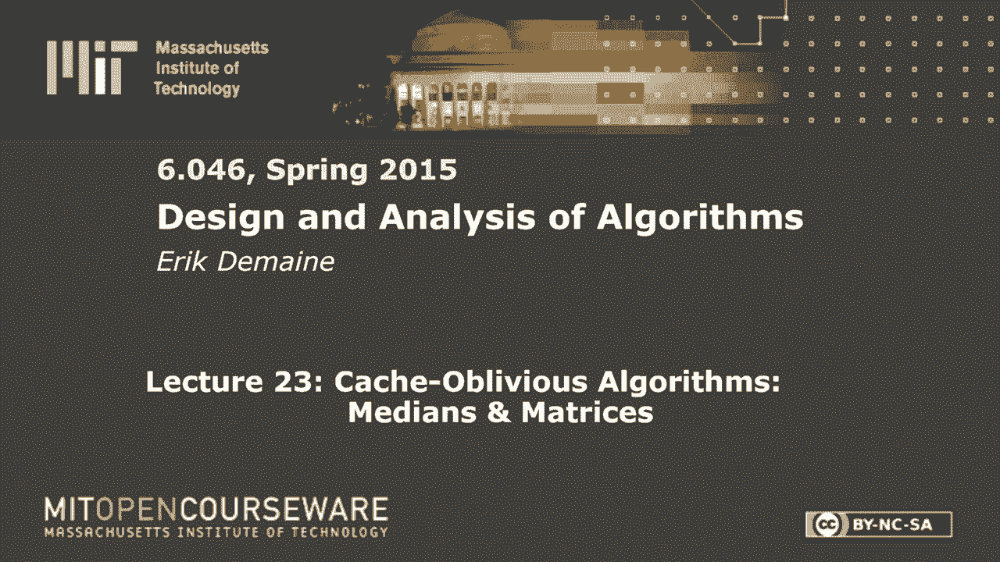
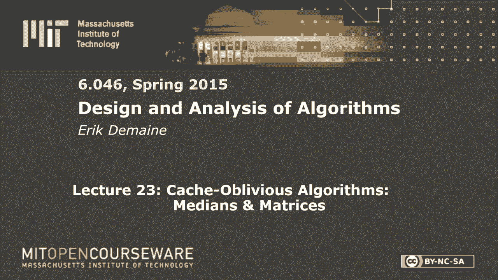
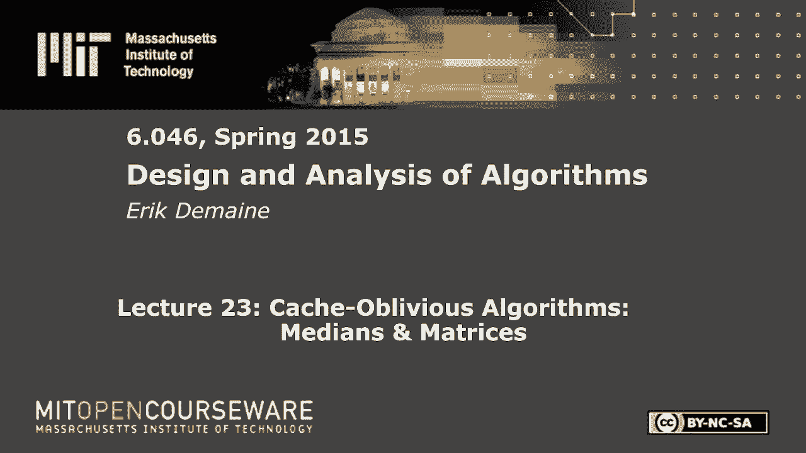

# 【双语字幕+资料下载】MIT 6.046J ｜ 数据结构与算法设计(2015·完整版) - P32：L23- Cache-Oblivious 算法：中值和矩阵 - ShowMeAI - BV1sf4y1H7vb

以下内容是根据知识共享许可提供的，您的支持将有助于麻省理工学院开放课件。

继续免费提供优质教育资源。

捐赠或查看麻省理工学院数百门课程中的额外材料。

所有的权利，欢迎来到六零四六的最后一周，你兴奋吗，是啊，是啊，今天，好而悲伤，我知道这很难，但是我们还有两节课，他们在一个话题上，也就是缓存遗忘算法，这是一个非常酷的概念。

它最初是在六零四六的背景下开发的，作为一种有趣的方式来教授现金效率算法，但在90年代末，它变成了一个完整的研究项目，而现在，这是它自己的事，所以回到六零四六有点好笑，嗯。

整个想法就在我们见过的所有算法中，除了分布式算法，我们有这样的观点，我们可以访问的所有数据都是相同的成本，如果我们有一个像哈希表这样的数组，访问哈希表中的任何内容都同样昂贵，如果我们有一个二叉搜索树。

每个节点访问的成本相同，但这不是真的，让我给你介绍一下真正的电脑是什么样子的，可能知道这个，但我们还没有想过，这些是计算机中通常称为缓存的缓存，那你就有了我们一直在想的，也就是主存，你的公羊，好的。

然后这些天可能会有更多的东西，你可能会有一些大的闪光，如果你有一台更漂亮的电脑，你的闪光灯可能在缓存你的磁盘，它是巨大的，好吧，也许最后是互联网，如果你喜欢。

所以关键是世界上所有的数据都不在你的CPU上，有一个很大的东西叫做内存层次结构，它规定了哪些东西是快的，哪些东西是慢的，不完全是哪些数据项由您决定，但这个想法是在你的CPU上。

你现在可能有四个级别的现金，因为我试着画它们，它们变得越来越大，典型值，一级缓存大约是1032K，在四级缓存中，就像Haswell架构引入的那样，大约有100兆字节，主存，你知道的。

这是你通常会想到的事情，它在千兆字节，现在你可以用太字节的RAM买到电脑，这不是疯狂的闪光，你知道得到更大的磁盘，现在你可以买到一个4TB的单盘，但如果你有一大堆磁盘。

你可以在一台电脑上有PB字节的数据，所以事情越来越大，当我们再往右边走的时候，但他们也变慢了，现金效率算法的重点是处理，事情走远了就变慢了，从物理学的角度来看，这是有道理的。

如果你想想一立方英寸能存储多少数据，你的CPU附近可能有多少，在某个时候，你会耗尽空间，你得走得更远，去更远的地方需要更多的时间，好的，所以你可以想到，我是说，有光速。

认为在计算机中较远的东西需要更长的时间，典型的计算机根本达不到光速，所以有一个更真实的问题，也就是你的痕迹有多长，然后当你有像磁盘这样的物理运动部件时，我不知道你是否知道，但磁盘实际上是旋转的。

有一个头，它必须四处走动，那叫做寻找时间，在磁盘上移动你的头真的很慢，在毫秒的数量级上，而从芯片缓存中读取的数据大约是纳秒，不管你的时钟速率是多少，每秒几十亿次，所以有一个，有很大的传播。

像一百万或一千万的因子，从一级现金到磁盘速度很烂，所以你可能会想，如果你的数据很大，你完蛋了，你必须处理，磁盘和磁盘很慢，但那不是真的，生活没那么糟，所以总的来说，速度有两个概念，我一直对他们含糊其辞。

一个概念是延迟，如果我现在真的需要获取内存位置，二十亿七十三，这些数据需要多长时间，说出一个字的数据回来，那是潜伏期，但还有另一个问题，那就是带宽，这些管子有多肥，我能抽取多少信息，如果我说。

请按顺序给我所有的主存，它能以多快的速度把它泵回来，这真的很好，所以延迟就像你的启动成本，当我要求什么的时候，那一件事需要多长时间才能到来，但还有一个数据速率，带宽你通常可以做得很大，例如在磁盘中。

磁盘的带宽是相当大的，但即使它不大，你可以再加一百个磁盘，然后当你要求一些数据时，所有一百个磁盘都可以以同样的速度给你提供数据，如果你的公共汽车不超载的话，所以你也必须制造更多的公共汽车等等。

你实际上可以每秒读取大量的数据，但仍然是到达那里的时间，所有的磁盘寻找它们的头的时间是缓慢的，这不合情理，实际上是因为他们都在平行地做这件事，所以你不能减少延迟，但是你可以增加带宽，假设这不是身体上的。

它不符合物理学，但我们可以非常接近任意高带宽，因此，在一台设计良好的计算机中，这些管道的脂肪会增加或可能增加，如果你想，所以你可以移动很多数据，但我们无法摆脱的潜伏期，这很烦人。

因为当我们要求一些东西时，从算法的角度来看，我们会喜欢的，我们不能立即在顺序算法中做，在数据到达之前，我们什么也做不了，所以缓存效率将通过阻塞来解决这个问题，这是一个古老的想法，我是说。

自从缓存被引入以来，有阻挡的想法，所以当你在主存中请求一个单词时，你没有得到一个字，你可能会得到三个两千字节的信息，不仅仅是四个字节或八个字节，好的，所以说，我们可以自由选择这些块的大小。

当我们设计系统时，我们想要什么，我们可以在某种意义上设置它们来隐藏潜伏期，所以如果你，如果你想摊销，整个街区的成本，然后你就有了这样的东西，整块摊销成本，这是每个字本质上，我们将延迟除以块大小。

我们必须在带宽上支付一个，带宽是你一秒钟能读多少字，从你的记忆中说，所以一个带宽将是你的成本，所以这一点我们无法改变，而是通过添加足够的圆盘或添加足够的东西来使这些管道足够胖。

你基本上可以让这个大的延迟是我们无法控制的，但是如果你想到这个块是否有用，然后我们支付最初的启动时间说，嘿嘿，把这个方块给我，然后等待延迟的响应，我们只为整个街区付一次钱。

所以如果它们是每个项目中的块大小的单词，我们有效地将延迟除以块大小，这有点粗糙，但这是现在如何减少延迟的想法，为了真正起作用，我们需要更好的算法，差不多，到目前为止。

你在课堂上看到的每一个算法在这个模型中都运行得很糟糕，这就是今天的重点，下一节课就是解决这个问题，为了这种摊销起作用，到目前为止，我在模糊的意义上使用，我们一会儿就正式开始，当我拿了一整块。

该块中的所有元素都应该有用，我们应该能够在他们身上计算出我们需要计算的东西，否则，我是说，如果我只是如果我只需要一个项目，我读出了块，那对我没有多大帮助，所以我真的想用这样一种方式来构造我的数据。

当我访问一个元素时，我也要进入它附近的元素，那么这个块实际上会很有用，这是一个通常称为空间局部性的性质，我们想要的另一件事，这些缓存有一定的大小，所以我可以存储不止一个街区，我又没读过一个街区。

我刚处理完，然后我读了下一个街区，然后继续这些，其中一些缓存实际上相当大，如果将主存视为磁盘的缓存，那可能真的很大，所以说，理想情况下，我在这里使用的块以某种方式相互关联，或者当我访问一个块时。

我要进入一段时间，和其他方块一起，所以通常的说法是，我们希望尽可能重用缓存中的现有块，你可以把这看作是时间的局部性，当我访问特定块时，我很快就会再次访问它，这样，把它带到我的缓存中实际上很有用。

然后我用了很多次，那就更好了，我不必两个都要，我到底在多大程度上拥有它们将决定，运行我的算法总共需要多少时间，但这些都是你在非正式意义上想要的理想属性，在今天剩下的时间里，我们要把这个正式。

然后我们将为这个模型开发一些算法，但这就是动力，实际上，您通常可以在系统中自由选择块大小，尽管过一会儿我会假设它是给我们的，您通常会设置块大小，所以这两个项大致相等，因为如果你花潜伏期去拿东西。

你还不如得到一大块东西，所以我的意思是，根据您的带宽，如果它只需要花费，你要取一个完整的街区比取一个字多花两倍的钱，这似乎是一个相当好的块大小，所以对于像磁盘这样的东西，块大小约为兆字节，也许更大。

数百兆字节，所以把块的大小想象成很大，我们真的希望所有的数据在某种程度上是有用的，现在很难想象有这么多级别的内存层次结构，所以我们将一次关注两个层面，那种便宜又小的缓存，相对于巨大的东西。

我称之为磁盘只是为了强调，所以我把这个叫做两级模型，外部存储器模型，它最初是作为主存与磁盘的模型引入的，但你可以把它应用到一般的任何一对级别，你有你的问题大小n选择适合n的最小级别，通常那是主存。

可能是磁盘，想想这和上一个之间的水平，所以最后一关和倒数第二关，通常这才是最重要的，如果你运行一个程序，你用完了RAM，你开始交换磁盘，那时一切都像爬行一样，但你可以看到这些层次上的差异。

但在磁盘上可能是最戏剧性的，只是因为它太慢了，比RAM慢百万倍，或者至少比RAM慢一千倍，不管怎样，我应该说，所以我们只有两个级别，所以让我画一个更精确的图，我们有CPU。

这是我们所有的行动都在做的地方，这个，在那里我们添加数字等等，我们将把它看作具有恒定数量的寄存器，每个寄存器是一个单词，然后我们有一个非常胖的烟斗，到缓存的低延迟管道，缓存将被分成块。

假设每个方块有B个单词，而不是写入块大小，我就写大写b，我将调用m除以b的方块数，因此缓存的总大小，是大写M，然后是一个相对细而慢的连接，这个很快，这个对你的磁盘很慢，磁盘，我们会认为是巨大的。

本质上无限大，它也被分成B大小的块，所以同样的块大小，所以这是照片，所以最初所有的输入都在这里，您的所有n个数据项，不管你说什么，你想把这些东西分类，为了访问这些项目，你首先得把它们变成现金。

这将是缓慢的，但它是以一种受阻的方式完成的，所以当我无法访问这里的单个项目时，我得要求整个街区，当我请求那个块时，它被送到这里，需要一段时间，然后我可以选择把它存放在哪里，也许我会把它放在这里。

然后也许我会抓住这个街区，然后储存在这里，以此类推，每一个都是一个块读取，所以这些是CPU可以做的新指令，最终这个缓存会被填满，然后在我带来一个新的块之前，我得把一个老街区赶出去。

意思是我需要拿其中一个块写到某个位置，也许去同一个地方，我想事实上我们会一直假设你写信给同一个地方，覆盖磁盘上的内容，你在这里做了一些改变，把它送回去，总的来说，我们要做的是计数，我们读写块多少次。

这个问题，当你谈论有多快时，你只是在谈论潜伏期，是呀，对不起，这是延迟，就像断开连接的行为，只是不对，这可能有巨大的带宽，所以在这个模型中，我们假设块的大小是固定的，然后延迟与带宽的关系不是。

我们不会考虑带宽，我们假设块大小是以某种合理的方式选择的，然后我们需要做的就是数方块的数量，但在下面，是啊，是啊，你设置了某种带宽，假设您设置了块大小，使这两个东西大致相等，所以延迟和带宽是一回事。

就是这个意思，但实际上我们只需要考虑计算延迟，这是我要请求多少次阻止，等它过来，写一个块要多少钱，我写多少次一个块，我不会担心我需要多少身体时间，做这两件事中的任何一件，我要数一数。

并假设这就是我需要最小化的，所以我要数数，我们把这些叫做，各层之间的块转移，在这两个层次之间，是方块数，红色来自，写入磁盘，我们要去看，以空闲状态访问缓存，我不打算数那些，你不需要这么担心。

因为我们仍然可以，我们仍然可以计算我们在计算机上做的操作数量，在CPU上，好的，我们还可以考虑有多少时间，做计算所需的正常时间，有多少次比较，有多少个版本，诸如此类的事情。

这将包括从缓存中读取和写入元素，个别的东西，但我们要查看这个连接，假设这些是在同一艘船上，因此读取缓存和从寄存器读取一样快，所以我们不会担心那个时间，我们关注的是什么，为了这个模型的目的。

是在这两个层次之间，所以这些基本上是一个层次的结合，我会稍微改变一下，但现在只要想想这两个层面，我们在计算这两个级别之间有多少内存传输，缓存和磁盘，好的，所以我们现在想把它最小化，就像以前一样。

我们想最大限度地减少运行时间和通常的传统措施，但是我们想最小化空间和所有我们最小化的常见事情，但现在我们有了一个新的措施，也就是内存传输的次数，我们希望我们的算法也能最小化这一点。

对于给定的块大小和给定的缓存大小，在这一点上，我要马上改变这一点，我们将在这个外部内存模型中写入的算法，显式管理它必须显式读写块的块，有一个软件系统实现了这个模型，特别适用于磁盘。

让你以一种很好的控制的方式来做这件事，保持你的记忆，维护读写盘，操作系统试图这样做，但它通常在交换方面做得很糟糕，但是有一些软件系统可以让你控制并做得更好，所以这是一个很好的模型。

外部内存模型特别适用于磁盘，它不会捕捉到所有这些其他级别的技巧，用这种方式写算法有点烦人，明确的读写块今天我不会写任何这样的算法，虽然你可以想着他们，我个人喜欢另一个型号，只是缓存遗忘，这将导致。

在某种意义上，更清洁的算法，虽然让他们工作更像是一个魔术，但是写算法很简单，分析它们是更多的工作，它会捕捉，在某种意义上，所有这些级别，但事实上，基本上就是这个模型，几乎一样，我们要改变一件事。

这就是遗忘的来源，我们要说算法，不知道缓存参数，它不知道B或M，所以这有点奇怪，我们将不得不做一些其他的改变来使它发挥作用，但我想从分析的角度来建模，我想计算内存传输。

并根据这个内存层次结构分析我的算法，但是算法本身不允许知道内存层次结构是什么样子的，另一种说法是算法必须同时工作，对于b的所有值和m的所有值，就像你想象的那样，这不是那么容易的。

但有一些简单的事情是容易的，而更复杂的事情是可能的，它给你各种各样很酷的东西，让我先把模型形式化一点，缓存遗忘算法的另一个好处是它是一个，它更接近于这些缓存的工作方式，当您在CPU上编写代码时。

您可能已经注意到，您通常不进行块读和块写，除非你在处理闪存或磁盘，这一切都替你处理好了，这一切都是在处理器内部完成的，当你访问一个单词时，计算机查找要读取的单词或要读取的块的系统。

它将整个块移动到更高级别的缓存中，然后它只是在那个街区里为你服务，你对此没有明确的控制权，所以工作的方式是当你访问一个单词时，在记忆中，我会把记忆看作一切，这是存储在磁盘中的内容，说，这是你的全部。

这是整个存储系统，整个内存层次结构，像往常一样在这个班上，我们将把整个内存看作一个巨大的数组，单词的，这些方块中的每一个都是一个词，但内存现在也被分成了块，所以我们假设每四个，假设b等于4。

每四个字是一个块边界，只是为了画一个人物，所以这是b等于4，当你访问像这样的一个单词时，您将获得包含单词的整个块，让我们强调一下，这不是你个人的问题，系统以某种方式获取包含该单词的块。

它必须自动地这样做，在这个模型中，我们不能显式地读写块，因为我们不知道方块有多大，但在内部，你可以在真正的系统上，你实际上把所有这些都放进缓存里，所以你希望你会用附近的东西，因为你已经读过了。

理想情况下它们是有用的，但你不知道你读了多少，你在B中读过，从算法中你不知道B是什么，不知道，好吧，还有一个细节，缓存很快就会满，所以每当你读到一些东西，你必须在稳定的状态下踢出某物。

缓存还不如永远保持满，没有理由让任何东西空着，那么你踢出哪个街区，有什么建议我应该踢掉哪个街区吗，如果我一直在读和写一些块，对这些块中的单词进行读写，过去拉得最远的方块，是啊，是啊，通常被称为先出后出。

那是先进先出，这是一个很好的，好策略，最近使用最少的块，所以也许你很久以前就拿到了，但你用它，每个时钟周期，这也是一个你可能不应该扔掉的，因为你用了很多叫做lru的东西，这也是一个很好的策略，其他建议。

那是两个很好的，如果你超越了这一点，我很担心，我不会知道，但也有一些不好的策略，是啊，是啊，随机，是啊，是啊，随机，随机可能很好，我不知道，马上就有一些随机的策略击败了这两者，但从这个角度来看。

两者都很好，我们有很多飞盘要玩，所以说，但这是个好答案，随机绝对是个好主意，我知道有一种随机策略叫比特，在某种意义上更好一点，但从我的角度来看，我认为所有这些都是很好的随机，我得再检查一下。

你是否失去了一个对数因子和期望应该没问题，所以所有这些策略都会奏效，我要定义，您可以用它们中的任何一个定义这个模型，我想它会很好的，除了随机，你得到了一个期望的限制，驱逐，让我们说，最近使用最少的页面。

最近加载最少的页面也可以正常工作，那是先进先出，对不起，我切换到页面，但我一直叫他们街区，对于这节课来说，块和页是一样的，在最后，在这节课结束时或下节课开始时，我来告诉你为什么那是件好事。

但在这一点上我们不要担心，所以现在我们有一个模型缓存，我们实际上有两个模型，但我认为现在缓存遗忘模型已经完成了，我们要再次分析，我们还在计算这东西的内存传输次数，算法只是不允许知道B和M。

所以我们必须改变模型，使块的读写是自动的，因为算法不允许这样做，所以得有人冷静一下，缓存遗忘模型是您在这个类中看到的每一个算法，或者你知道，你在这门课上看到的大多数算法都是在某种意义上，缓存遗忘算法。

他们以前不知道B和M，仍然不是现在的变化是什么，你可以用这种新的方法来分析它们，在这个新模型中，正如我所说，我们所看到的所有算法在这个模型中都不会有很好的表现，几乎所有，但这让事情变得有趣。

这就是为什么我们有一些工作要做，我有一些理由隐藏遗忘，为什么你会把你的手绑在背后，原因一，很酷，我觉得很神奇，你真的可以这么做，我想这就是原因二，你实际上可以为很多问题做这件事。

我们关心缓存遗忘算法的存在，同样好的，所以我的意思是，他们当然存在，但它们是最佳的，它们在最佳算法的常数因子内，当你知道，B或M所以这是令人惊讶的，这是最酷的部分，嗯，总的来说，算法更容易写下来。

因为这是我们的常客，我们可以使用伪代码，就像以前一样，我们不需要担心算法中的阻塞，分析会更难，但那是不可避免的，在某种意义上，它使编写代码变得更加容易，分发代码也更容易一点。

因为每台计算机都有不同的块大小，那件事，当你改变n的值时，内存层次结构中的不同级别将很重要，所以必须达到这些级别中的每一个都很烦人，我没说有不同的块大小，当然还有不同的缓存大小。

所以每次调优代码到不同的B或M都很烦人，这里最大的收获，虽然，我认为你在某种意义上捕捉到了整个等级制度，所以在现实世界中，对呀，每个管道都有自己的延迟，让我们考虑一下潜伏期，您希望最小化块传输的数量。

在这里和这里之间，您希望最小化这里和这里的块传输数量，嗯，好的，我不能把它们都最小化，那是一个，多维问题，我想最小化的是这些东西的加权平均值，潜伏期，这里的块数，加上潜伏期，这里的方块数，加上潜伏时间。

这里的方块数等等，如果你能找到一个最优的缓存遗忘算法，并从两个层面来分析它，因为算法不允许知道B和M，它必须适用于所有级别，它必须最小化所有这些级别之间的块传输数量，所以特别是。

它将使所需的加权和最小化，手有点波浪，你必须在那里证明一些东西，但你可以证明，我没这么说，Frigo在1999年有一篇关于这个问题的论文，莱尔儿子职业警察拉马钱德兰，它已经足够老了。

我记得大约在2001年之后所有的名字，当我成为教授的时候，除了那之前我什么都不记得了，我什么都记得，所以Frigo，我们在FFTW的背景下讨论过他，那是西方最快的傅里叶变换，所以他是这里的学生。

FFTW使用缓存，快速傅里叶变换算法，你可能在教科书的封面上看到过，或者在Stata Lyceson教授周围散步，在麻省理工学院和职业警察，这实际上是他的论文，太厉害了，MH论文，所有的权利，太酷了。

我想我说了所有我想说的话，如果你想看到你可以的证据，你解决了整个内存层次结构，你可以读他们的报纸，我是说你得做几个假设，但它是直观的，缓存遗忘必须适用于所有B和M，所以它会优化所有的级别，同时。

用所有不同的B和M明确地做到这一点，那将是非常混乱的代码，可能也是更慢的缓存忘记只是要做免费的，用同样的代码好吧，让我们做一些算法，有一个简单的算法，从缓存遗忘的角度来看，它工作得很好，就是扫描。

让我给你一些Python代码，别问也别担心，所以这里有一些非常简单的代码，假设您想积累一个数组，您希望将数组中的所有项相加，或者繁殖它们，或者收留他们，什么的，这又是一种典型的事情，我们要考虑的数组。

所以这里是我的记忆，我们将把数组看作是存储为一些连续的，该数组的一段，假设这个片段，相对于它如何映射到内存，当你这样做的时候，这是一个现实的假设，当您分配内存块时，制度的承诺。

它本质上是一个连续的内存或磁盘块，什么的，当Python创建数组时，它是这样做的，它保证了这些东西将被连续存储，如果你用字典，这不是真的，但是对于定期提出的列表，这是真的，我正在按顺序访问数组中的项。

所以我从零项开始，我最后得到了n项减一，那看起来不错，因为我读了这篇文章，我得到了整个街区，然后我读了这篇文章，我已经有那个街区了，免费的，这个是免费的，这个在这里是免费的，我得读一个新的街区。

但这个是免费的，所以我在每个街区访问的第一个项目要花一个钱，但只要我的缓存大小，只要我的缓存至少存储一个块，这就够了，让我们假设总和是一个寄存器，那就足够记住那个街区了，这样我做的下一个手术就免费了。

所以成本，n/b的更精确的上限，这就在外部内存模型中，但在缓存遗忘模型中不完全正确，有人能告诉我为什么，如果n是二，你可以在边界之外拥有它，好的N可能是两个，但它可以跨越块边界，记住。

算法不知道块边界在哪里，在现实中到处都是街区边界，你不能，没有办法知道你不能，你不能要求，分配数组时，它总是从一个块边界开始，如此伟大，你可以拥有，您可以以一种方式跨越块边界。

我刚刚跨越了一个街区的边界，对不起，所以它最多是n/b的上限，不经意地缓存，所以它只会伤害你一个，但我想指出的是，这两种型号之间有一点不同，即使有这个非常简单的算法，总的来说还好。

我就把它想象成大o n/b加1，好的，有一些相加常数，我想你甚至可以说它是n/b加上1的大o，但我们今天不会担心不变的因素，所以扫描缓存是浑然不觉的，外部存储器，都很棒，算法，因为您显式地控制块。

你明确地读和写它们，你知道块的边界在哪里，你可以，如果你想，你不必，但是您可以选择要对齐的数组从块边界开始，这就是缓存中的区别，你控制不了，所以你得担心最坏的情况，外部存储器，你可以控制它。

你可以做得更好，也许你会想，它会以一个不变的因素伤害你，所以和在磁盘中，比如说，你想让事情在轨道上对齐，因为轨道是，如果你必须去邻近的赛道，要贵得多，你得移动头部，轨道是一个圆。

你不用动头就能读到的东西，所以稍微有趣的是，您可以进行恒定数量的并行扫描，所以这是一次扫描，这里有一个两次扫描的例子，同样，我们有一个数组，大小为n的Python表示法，这将是整件事，我想做的是。

用这个不是蟒蛇，但我认为教科书上的符号，但你知道，交换是什么意思，这是干什么用的？假设我的负数是对的，是啊，是啊，它反转数组可以烧毁这些短语，所以这是一个非常简单的反转数组的算法，原作者：约翰·本特利。

查尔斯莱斯特的顾问是谁？当年的博士顾问，所以很简单，但是如果你想想数组，它有什么酷的，以及你访问事物的顺序，就像我有两个手指，我应该把它做得更小，所以我们从这里下去，我从数组的开始和数组的结束开始。

然后我去第二个元素，在第二个元素旁边，在最后一个元素旁边，我像这样先进，好的，所以只要你的缓存m是CIS中的块数，至少两个，这是完全合理的，你可以假设这至少是一百个，通常，你至少有一百个街区。

对任何固定常数都这样说，我们假设m b比常数大，我们只需要两三四个，对于我们所涵盖的算法，那太好了，当我访问此项目时，我将加载包含它的块，我不知道它是怎么对齐的，好的，但不要太在意。

然后加载包含该项的块，然后下一个访问是免费的，直到我前进到下一个街区，但一旦我向左或向右推进下一个街区，我再也不用接触旧的了，又是这样，这里的成本等于块的数量，它是n/b加1的大O。

所以恒定数量的并行扫描将是，这是数组中的块数，所以如果n小于b，这是个坏主意，或者不是那么热，但是当n大于b时，这只是n/b，这就是读取数据所需的时间，有什么大不了的，所以这些都是无聊的缓存遗忘算法。

让我们做有趣的，我想说缓存遗忘算法的中心思想，就是用分而治之，这可以追溯到这堂课的前几堂课，所以我们将回到例子，从今天开始，我们将特别进行中位数搜索，我们在第二节课中做过，所以真的从过去爆炸。

但这是很好的评论，因为期末考试涵盖了一切，所以要记住我们讲过的矩阵乘法，但通常不是很好，我想我们确实在Strassen的算法中使用了分而治之，我们将使用分而治之，即使是无聊的算法，下节课我们要回到毒液。

但以一种完全不同的方式，所以如果你不喜欢范·杜博斯，别担心，那就简单多了，好的，所以让我们做中位数查找，或者真的很抱歉，让我先谈谈一般的分而治之，好的，你知道什么是分而治之，你带着你的问题。

你把它分成不重叠的子问题，递归求解，把它们结合起来，但我想在这里强调的是，它在缓存中会是什么样子，浑然不觉的语境，所以算法看起来像一个常规的分而治之算法，所以特别是，算法会一直递归，至，让我们说。

恒定尺寸问题，不管基本情况是什么，和平时一样，但不同的是分析，好的，当我们分析一个缓存遗忘算法时，我们得到了，然后我们就知道B和M是什么了，从某种意义上说，我们正在分析所有的B和M。

但是让我们假设B和M给了我们，然后我们会告诉你这种绑定需要多少内存传输，你需要知道a b是为了知道这个界的值是多少，但你学习它是b的函数，通常是b和m的函数，这是你能希望的最好的完整描述，所以在分析中。

让我们看看b的一个值和m的一个值，让我们说，递归级别，在那里发生了两件事中的一件，这个问题，问题大小按一个块的顺序拟合，所以这意味着它是B级大小，那是一个有趣的水平，另一个有趣的层次。

因为更明显的一个可能是它适合缓存，所以这意味着大小小于资本放大器，这里的一切都以文字来计算，好的，对于很多问题来说，这是更明显的一个，缓存大小不是那么相关，真正重要的是块的大小，比如说。

扫描你只看一次数据，所以你的缓存有多大并不重要，只要不是超级小，只要它有几个方块，那么它只是b和n的函数，不涉及m，所以对于那种问题，这样会更有用，常量的块，因为我认为缓存m比任何恒定时间都大，b。

这是严格较小的，或者这更小或等于缓存中的拟合问题，所以当m相关时，我们来看看这个级别，也许递归中相邻的层次，好的，所以算法不知道B和M是什么，所以它必须一直向下递归，海龟一直向下，但是分析。

因为我们只考虑一个值，一次b和m，我们可以只考虑一个层面，这将是一个关键的地方，所有的成本都是，因为一旦东西适合缓存，你已经加载了东西，成本将为零，所以下面的基本情况是微不足道的。

所以基本上这将使我们的基本案例更大，而不是我们的基本情况是恒定的，顺序是B或M，呃，我需要什么，现在让我们来看看中位数，中值查找给定的未排序数组，你想找到中位数，在第二课中。

我们有一个线性时间最坏情况算法，所以我今天的目标是让它在这个运行时间，这就是缓存遗忘模型中的线性时间，因为这就是读取数据所需的时间，结果基本上相同的算法首先起作用，你必须记住算法，所以让我快点写下来。

这是五乘n数组，因此，将数组视为被划分为，我把它们叫做五列，这是一张5个点乘n乘5个点的图片，这是点点点点，所以这是五个，现在，我们当时没谈这件事，有几种不同的方法可以实现它，但让我们说这些。

实际数组是一维的，假设这是前五项，这就是接下来的五个项目，所以换句话说，这个矩阵是逐列存储的，这只是一个概念性的观点，所以我们可以用任何一种方式来定义它，无论我们想要什么，所以说，我要这么看。

然后算法的其余部分首先对每一列进行排序，只有五件，所以你可以在恒定的时间内对它进行排序，每一个，但我们特别关心的是这五个项目的中位数，然后我们递归地找到中位数的中位数，这是我们要稍微改变的一步。

留出一点空间，然后我们进行分区，x的数组，这意味着我们将数组拆分为小于或等于x的项和大于x的项，我们可能假设只有一个值等于x，但这并不重要，最后，我们对这两个部分中的一个进行递归。

所以这是一个非常疯狂的分而治之算法，一个更复杂的，你不需要知道这里的所有细节，只是它起作用了，它在线性时间内运行，疯狂的是有两个递归调用，通常喜欢合并排序，当你做两个递归调用并花线性时间来做这些事情时。

就像这个分区，你得到n log n时间，就像这里的合并排序，因为这个数组要小得多，这是一个n大于五的尺寸，这一个相当小，就像最多十分之七，因为十分之七加五分之一严格小于一，这最终是线性时间，而不是n。

log，n，好的，那只是复习，我想做的是同样的事情，相同分析，或者相同的算法，但现在我想在这个两级模型中分析它，所以其实，我会擦掉这块板，所以现在我的数组已经被划分为大小为B的块，就像这张照片。

事实上这里很相似，我们把东西分成几块，但它们是五号的，那是不一样的，现在有人把我的数组划分为大小为B的块，我需要数一下我有多少东西访问得很好，让我们一行行地看看这段代码，看看我们怎么做，第一步。

我们什么都不做，这是一张概念图，所以零成本很好，第一步零，我最喜欢的答案，第二步，我们对每一列进行排序，这要花多长时间，我在做什么，它就在我的正上方，因为这是一次扫描，扫描有点奇怪，我们看五个项目。

然后我们看接下来的五个项目然后是接下来的五个项目，但基本上是扫描，你可以想到，最多五次平行扫描，我想，或者你可以闯入箱子，可能在哪里，如果b是常数，那你做什么都不重要，但如果b大于常数，然后阅读五项。

这些可能都在一个街区里，除了那些跨越街区边界的，好的，所以在所有情况下，第二步，也许我应该重写第一步，零成本，第二步是n/b加1，好的，那是扫描，实际上是两个平行扫描。

因为我们必须在某个地方写出这些中位数，是啊，是啊，所以我们要做第三步，在我们之前递归地找到中位数，你知道吗，n的t是n的t超过五，加上十分之七的t，n，在这个旧的新世界里，这是正常的运行时间。

在这个新世界里，我将用一种不同的符号来表示递归，用于内存传输的n的mt，这是一个很好的老式时代，这就是我们新的现代时间概念，对于问题大小n，我需要做多少块传输，所以这是一个递归，应该是n大于五的mt。

对于这个对于这个是相同类型的相同问题，我需要知道，我递归的数组是连续存储的，好吧，之前我不需要这么做，我可以说好，让我们把中位数放在中间，好的，现在这个数组中的每五个项都是我的新子数组。

所以我可以递归地调用这个东西并说OK，这是我的数组，但实际上只考虑每第五项，这就像是阵列中的一大步，然后下一个递归级别，哦，只担心每25个项目和每5个立方项目，我要停止计算等等，对于正常运行时间来说。

这很好，但当我得到我的打击越来越大，在某个时候，每个项目都将在不同的块中，那很糟糕，我不想那样做，所以当我找到这些中位数时，或者当我递归时，我需要那个，我递归的中位数，存储在连续数组中。

现在这很容易做到，但我们以前没必要这么做，这是关键的区别，好的，我可以这么做，因为当我在一次扫描中对每一列进行排序时，我可以再做一次扫描，也就是输出，也就是中位数数组，所以当我扫描输入时。

我将输出中位数，它将是五分之一的大小，但我把所有的中位数都保存得很好，在连续数组中，好的，所以用一个顺序并行扫描，这里同一时间，这实际上是一个合法的递归调用，好的，然后我们再分区分区，是一堆平行扫描。

我想有三个，你有一个读数扫描，这是您对数组的读数，你必须写扫描，你写出了小于或等于x的元素，你写出了大于x的元素，但所有这些都是扫描，您总是在上一个元素之后编写下一个元素，所以如果内存中已经有那个块。

如果您假设缓存中的块数至少为三个，那么三个平行扫描就可以了，它不同于CRS分区算法，那一个很想在适当的地方，我们根本不是想在原地或花哨，让我们用一堆扫描来做，好的，所以现在我们有两个数组，小于x的元素。

大于x的元素，然后我们在其中一个上递归，这些元素是连续的已经很好了，这又是一个常规的递归调用，我们保持数组连续存储的不变性，根据旧的分析，数组最多就是大小，十分之七，好的，所以我又复发了。

也就是n的mt等于n的mt除以5再加上mt，所以分析感觉很空洞，加n/b，对不起，糟糕的笑话，n/b+1，好的，所以基本上相同的复发，但是现在n/b加上1对于我们在这里所做的，但我不得不改变算法。

一点点让这个复发是正确的，正确地引用它，反映内存传输的次数，现在我们所需要做的就是解决复发，其实，在某种意义上，更重要的是，我们需要弄清楚基本情况是什么，因为我们可以说好吧，这是通常的基本情况。

如果我有一个恒定大小的问题，嗯，这将是不变的，这是我们每一次复发的基本情况，这就够了，通常它会给我们一个非常糟糕的答案，所以让我们，让我们到这边来解决这个反复出现的问题，啊，所以如果这是我的基本情况。

尤其是，这是一个递归树，很不均匀，所以画的时候会有点烦人，但我所知道的这个基本情况，嗯，这个整体，N的MT将是，至少递归树中的叶数，所以说n的mt至少是n的l，在递归中，所以这真的是，如果我运行算法。

我得到多少个恒定大小的基本情况，所以不明显那是什么，这是一些，这里没有好处，叶子的数量就是这里有多少叶子，这里有多少片叶子，1的l等于1，或者某个常数等于常数，我碰巧知道，因为我看到了很多重复。

并解决了一些n到alpha的问题，我声称n的l是，对于某个常数alpha y的alpha，我只想证明它是有效的，所以现在是n/5的α，这是α的十分之七，如果它能起作用，这种反复应该得到满足。

现在如果你看这个方程，阿尔法有很多N，他们都取消了，所以我得到1等于alpha的五分之一，加上α的十分之七，令人困惑，因为我刚刚在看电视节目，阿尔法，但没有关系，所以这是纯粹的阿尔法。

你只需要检查是否有真正的解决方案，有一个你把它插到钨上，阿尔法什么的不是，无意双关语，哇哦，他们今天才出来，然后阿尔法是下一页，我不能用手做这件事，所以我们得到n的l是，让我们说至少n到零点八，它更大。

它是次线性的，当我们只关心时间的时候，这就足够了，但现在是个坏消息，因为我们的目标是得到一个，n/b+1，如果b很大，如果b大于n到零点二，那么我们就没有达到这个界限，我们总是支付至少n到零点八，例如。

b大约是n，我们离得很远，但那只是因为我们用错了基本情况，事实证明，如果你有一个更好的基础案例，事情只是工作，所以我们就这么做吧，我想它会更小，所以下一个地方，我是说，当您进行缓存分析时。

你从来不用这个基本情况，你首先应该考虑的是这个，如果您有适合恒定数量块的大小问题，嗯，当然，一旦他们被读入缓存，这将需要时间，你不会付任何钱的，将恒定数量的块读入缓存需要多长时间，恒定的内存传输次数。

所以这显然是一个比这个更好的基本情况，因为我们有同样的东西在右手边是一个常数，但我们解决了一个更大的问题，所以很明显你应该切这里而不是那里，那么这个递归中的叶数，所以同样的复发，不同的基本情况。

所以我们停止递归，从概念上讲在分析中算法一直向下，但在分析中，我们停止递归，当我们遇到B大小的问题时，新递归树中的叶数将为，n除以b除以α，那很好，那是潜艇，小于n/b，好的，现在，我要挥挥手说。

n的mt是n/b加一的阶数，我想这么做，你想像我们以前一样证明，当我们解决这个复发，也就是通过替代，你假设这是真的，把它插上，验证，它实际上可以用一些常数来完成，对正在发生的事情的直觉，一般情况下。

这种递归由根支配，这个递归的根代价是n/b加1，所以这是根成本，我声称直到恒定因素，这就是总成本，大致是因为当你沿着递归树，成本呈几何级数下降，但对于这种复发来说，这并不明显，因为它太不均匀了。

但这有点像大师的方法，有点花哨，直觉上，这应该是显而易见的，这是根本成本，然后是其他的，但为了证明这一点，你应该做一个代换方法，我想去更有趣的算法，所有的权利，下一个算法是中位数，现在我们要做矩阵乘法。

分而治之，所以我们刚才看到的是一个例子，在分而治之中，我们从分析开始，我们考虑这样一个情况，即物体适合于恒定数量的块，那是第一种情况，下一个例子，矩阵乘法将是另一种情况，所以你可以看到这两种类型。

乘法矩阵，我们做过很多次的事情，比如说，在FFT讲座和Strasson算法中，只是提醒你我只是在想那个方形的案子，虽然这概括了，我们有两个n乘n的平方矩阵，通常我会说c等于a乘以b。

但我意识到我们用B表示块大小，所以这将是z=x乘以y，希望这不会与其他任何事情相冲突，但没有B就好了，所以标准矩阵，让我们从标准算法开始，让我们从分析开始，因为如果你相当聪明，这个标准算法还不错。

这不会太重要，让我们假设我们一行一行地做z，假设我们目前正在计算这个乘积单元，所以乘积单元格是点积，这里的zj是这一行和这一列的点积，如何计算点积，两次平行扫描，对呀，我扫描这一行，并平行扫描这一列。

现在这取决于你存储x和y的顺序，但是让我们假设我们可以将x存储在行中，大序意思是逐行，我们将y存储在列中，主要顺序意思是逐列，那么这将是对连续数组的诚实到良好的扫描，再次，我们在记忆中存储事物的顺序。

真的很重要，所以让我们让我们的生活变得理想，让我们说这是呃，一行一行的，这个是一列一列的，然后嘿嘿，这是两个平行扫描，所以求n/b来计算这个单元格，n除以b所以可能再加上1，这些是n乘n矩阵。

所以总大小是n的平方，这意味着总成本是什么，呃，n除以b加n的平方，我想看起来不错，我是说我们以前的运行时间是n的立方，我们把它除以b，你怎么可能做得更好，通过变得更聪明，这不是最佳的，你可以做得更好。

我再多花点时间说服你，这是正确的答案，不仅是这个大O，但对于适当的设置，在最坏的情况下，这将是西塔啊，因为如果你想想我们看到的顺序，我们看了几遍这些行，如果你看看，你知道的。

当我计算这个单元格和这个单元格时，Z矩阵或乘积矩阵的这个单元，它们中的每一个都使用相同的X行，所以也许你可以重复使用它，您可以重用实际上可能是免费的X行，取决于b和n的关系，但是，Y的列。

每次我计算这个的时候都不一样，我用Y的第一列，当我计算这个的时候，我使用Y的第二列，除非缓存太大了，可以存储所有的y，这就像你可以把整个问题存储在缓存中，这是不现实的，所以在这个算法中。

除非m大于n的平方，至少你每次都要读一个新的Y专栏，所以是θn除以b，加上你需要花的一个和超过B，假设m小于n的平方，我声称这不是你能做的最好的，因为我们会做得更好，我们将通过分而治之做得更好，现在。

你已经看过分而治之了，用于矩阵乘法得到Strassen算法，那里的想法是使用块，所以这是你已经见过的一种算法，我要平分，将矩阵z转化为n/2乘n/两个子矩阵，所以每一个z ijs都是n/2乘n/2矩阵。

你知道，我对x和y做同样的事情，数字正确，一二一二一，以此类推，你可以显式地把它写出来，我宁愿不做所有的事，但让我们做其中一个，你可以把这些看作是二乘二的矩阵，因为矩阵乘法是关联的，好事发生。

我可以把这两个元素，但它们实际上是矩阵，对不起，可能会拿这两个和这两个点积，我得到x 1 1 y 1 1加x 1 2 2 1，这就是我应该设置的，z一一二，所以这是一个公式，但它也是一个递归算法。

上面写着，如果我想计算z，我要说好，有四个子问题，第一个是计算z 1 1，我要这么做，通过递归计算x 1 1和y 1 1的乘积，递归计算x 1 2 y 2 1的乘积，然后把它们加在一起，这不是递归的。

加法很容易，好吧，这里有两种产品，这里有两个产品，这里有两个产品，这里有两个产品，总共八种产品，所以我们将有八个大小为n大于2的递归调用，是啊，是啊，所以如果我们看看内存传输的数量，这是八次递归。

调用n除以2乘n除以两个子矩阵，然后加上加法的成本，我声称加法的成本最多是n的平方除以b，加一个，因为加法基本上是平行扫描，我可以扫描X，扫描Y，只要它们按相同的顺序储存。

我只是一个元素一个元素地添加它们，按要素分列，有第三次扫描，它写出Z向量，所以一旦事情线性化了，为了这个，为这个工作，是一个真正的递归，我需要那个说法，x 1和y 1作为连续的东西存储在内存中。

所以这意味着布局，矩阵的，让我们打电话，让我们考虑矩阵，z将如下所示，我将递归地列出一个，所以当我说布局的时候，我是说我把元素存储在内存中的顺序是什么，我按什么顺序将单元格存储在内存中。

我要说的是递归地布局这篇文章，一共有四块，递归调用布局，然后把它们串联在一起，那是我的布局，所以我要把所有这些东西都储存起来，然后我要储存所有这些物品，然后所有这些项目，那么所有这些项目，我怎么做。

我如何按什么顺序存储这些项目，递归，所以我要把它们分开，像这个商店这些在这些之前这些在这些之前，如何存储这些递归相同的递归，所以这是一个非常奇怪的订单，这是一个分而治之的秩序，这里只有四样东西。

我应该按什么顺序把这四样东西结合起来，没关系，重要的是这是连续的，这是连续的，这是连续的，这样当我递归时，我在连续的内存块上递归，否则分析就行不通了，所以为了让这是正确的，我得有这个布局，好的。

现在我们只需要解决复发，我们就完成了，3。我已经告诉过你我们要用到的基本句型是，我们要用这个，因为它更结实更好，在这种情况下，我们需要它来得到更好的分析，你可以用较弱的基本情况来解决它。

你会得到更大的数字，但是如果你用最强的基本情况，一点也不我得小心点，因为这里的n实际上只是一个边长，这是一个n乘n矩阵，所以这里的总大小是n的平方，实际上总大小是3n的平方，所以它是m/3的平方根。

在某个恒定的时间内，m的平方根，常数是多少并不重要，但这是n的大小，这是n的值，对于它，所有三个矩阵都将适合缓存，所以我声称我们知道这最多花费，m/b内存传输，因为我们忘了中风。

因为我们知道所有这些人都适合缓存，因为我们知道它们是连续存储在内存中的，一次连续三块，不管我做什么，那里只有m/b个方块，所以在最坏的情况下，我把它们都读了进去，但是一旦缓存被它们填满，在这个递归期间。

我永远不会，我不会读任何其他块，所以现金会一直填满这个问题，所以我从来没有付过比这更多的钱，所以这是基本情况，很容易，但你得考虑一下，酷，现在我们有一个复发和一个基本情况。

现在我们有了一个很好的老式递归树，这一个我真的可以画，因为它很好，部分原因是它很好，很均匀，它只是爆炸得相当快，所以在顶部我们有n的平方除以b加1，嗯，我们有八个递归调用。

递归调用的大小是n/2的平方/b，也称为n的平方除以4b，所以如果我把这一层的所有东西加起来，n的平方除以b，如果我把这一层的所有东西加起来，我会得到8乘以n除以4，是啊，是啊。

所以2乘以n的平方除以b，是我干的，以验证每级成本呈几何增长，所以重要的是树叶的水平，这是主定理的证明，当事情每一步都在翻倍，你可以，这只是个特例，但每一关看起来都一样，每个递归级别，递归水平。

如果你把它们加起来，你得到的是上一级的两倍，所以重要的是树叶的水平，确定树叶水平，其实，也许我会在这里做，第一个问题是有多少叶子，叶子是这个东西，所以我会这么想，因为一切都很好，很均匀。

是等级数的8次方，有几级？我们每次除以2，所以这将是一些东西的日志，但它不再是log n，因为我们要提早停车，当n达到这个值时，我们就停止了，结果是n除以这个值，我们拿这个是。

我需要乘以2多少次才能得到这个，这是一回事，你要用n除以2多少次，我才明白，好的，但对圆木有八个，这是二到三次日志，两个到圆木就是这样，所以这是，n除以根，m/b，这么多次到三次幂，这开始看起来很眼熟。

这是n的立方，应该出现在m除以b的平方根的某个地方，这是现在每片叶子的叶子数，我们正在支付这笔费用，所以n的总成本是这个乘以这个，所以让我们这样做，简化，所以n的mt会很大，因为我们要从树叶的高度。

但还有其他一些东西会损失两倍，我们把这个东西除以这个东西，所以我们有n个立方，m/b的平方根乘以m/b，我犯了一个错误，是啊，是啊，谢谢。这个应该是立方的，这是m除以b的二分之一，所以现在我们下面有。

m除以b，谢谢。我觉得这看起来很奇怪，好的，这是，我的地方和从M超过3米超过B，这应该是我三岁多，我没有错过一次中风，谢谢。I’我三岁多，这应该是我三岁多，好的，所以这是m超过三，我要把井扔下去。

我把它放在这儿，但我要写θ，这样我就可以忘记那三个了，因为那只是三因子的平方根，所以现在，这将是我的三个一半，这让我更高兴，2。这次我猜对了，让我们再检查一下，这是m的三次幂的平方根，那是我的一半。

立方体，I’三个半场，我认为那很好，这个基本情况是m的平方根，好的，把它弄好所以现在，这是M到三个半，有一个平方根，会回来的，因为我对三个半，楼上有个M，所以那个取消了。

剩下的n是m乘以b的平方根的立方，有一个较低阶的项，因为我掉了这个加一个，但我们不要担心这个，现在我们有n的3次方除以b，这是标准算法，现在我们有n个立方体除以b，除以m的平方根，哇好大，我指的空间。

这基本上是你除以井，缓存大小的平方根，谁知道那有多大，但是在主存和磁盘之间，我们说的是千兆字节，所以这就像数十亿，十亿的平方根仍然很大，像一万个十万个，所以这比标准算法快了很多，你可以做得比扫描好得多。

主要是因为我们一遍又一遍地重用相同的行和列，这是标准矩阵乘法，你可能会问斯特拉森的算法呢，嗯，同样的事情起作用，你可以做同样的分析，斯特拉森，当然啦，你比斯特拉森得到了类似的进步。

你可以对非平方矩阵和所有这些好的东西这样做，还剩一分钟，这就足够了，我想覆盖LRU块置换，所以说，以下是我想说的关于LRU块置换，所以一开始我们说模型是LRU，也可能是FIFO，记住。

这个算法会很好地工作，如果你仔细想想，从lru的角度或fifo的角度，但我们怎么知道LRU和其他东西一样好，我索赔，如果您查看一些块访问序列，假设你知道B是什么，您计算大小为m的缓存。

LRU进行了多少次内存传输，它将在最优值的两倍内，但对于大小为m的缓存不是最佳的，大小m大于2的缓存的最优值，这是一个有点奇怪的说法，这里是2的因数，这里是2的因数，这是一个很酷的想法，叫做资源增强。

花哨的词，指简单的想法，但这是成本的近似值，我们正在近似算法可用的资源，我们正在改变机器型号，m除以2，我们得到了一个很好的结果，为什么这是可以的因为如果你看这样的绑定，如果你把m改变两倍。

它不会改变约束超过2的平方根的一个因子，所以只要你有，最多只能说，对m以常数因子改变m的线性或多项式依赖，不会改变缓存遗忘算法的总体运行时间，这就是为什么我们可以假设它是LRU，FIFO也是如此。

对于随机序列和，我就到此为止吧，如果你想看，你想看这个定理的证明吗，明天或星期四，是呀，好的。