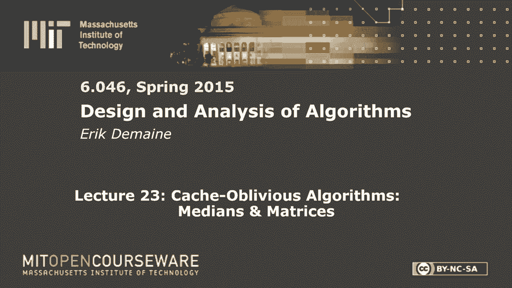
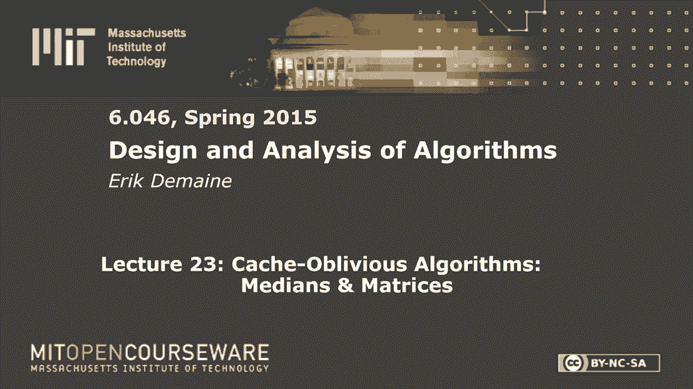
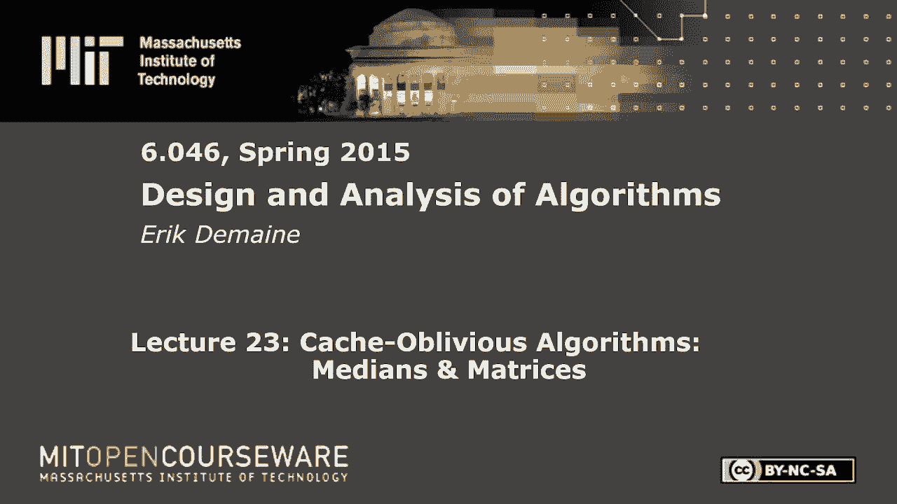

# 数据结构与算法设计：L23：Cache-Oblivious 算法：中值和矩阵 🧠









在本节课中，我们将要学习缓存遗忘算法。这是一种设计高效算法的新思路，它不需要知道计算机缓存的具体参数（如块大小B和缓存大小M），却能在各种硬件上自动实现高效的数据访问。我们将通过中值查找和矩阵乘法两个经典例子，来理解其核心思想和工作原理。

## 概述

在传统的算法分析中，我们通常假设访问内存中任何数据的成本是相同的。然而，在真实的计算机系统中，存在一个由多级缓存、主存、磁盘等构成的内存层次结构。离CPU越近的存储（如L1缓存）速度越快，但容量越小；离CPU越远的存储（如磁盘）速度越慢，但容量越大。访问不同层级的数据，延迟差异可达数百万倍。

缓存效率算法的核心目标，就是通过精心设计数据访问模式，来最小化在慢速存储（如磁盘）和快速存储（如缓存）之间传输数据块的次数。本节课将介绍一种更优雅的方法——缓存遗忘算法。它让算法本身无需知晓具体的缓存参数，却能自动适应任何内存层次结构，实现近乎最优的性能。

## 内存层次结构与模型

上一节我们概述了缓存效率的重要性，本节中我们来看看如何形式化地建模这个问题。

我们首先关注一个简化的两级模型：一个小的、快速的缓存（Cache）和一个大的、慢速的磁盘（Disk）。
*   CPU只能直接处理缓存中的数据。
*   缓存和磁盘都被划分为大小为 **B** 个字的块。
*   缓存的总容量为 **M** 个字，即可以存放 **M/B** 个块。
*   当CPU需要的数据不在缓存中时，必须将包含该数据的整个块从磁盘读入缓存，这称为一次“内存传输”。
*   如果缓存已满，则需要根据某种策略（如LRU）移出一个旧块。

**缓存遗忘模型** 是这个模型的变体。算法编写时**不知道B和M的值**，它像编写普通算法一样访问内存中的单个字。而计算机系统会自动将包含该字的整个块加载到缓存中。我们的目标是分析这种“自动”行为下，算法会产生多少次内存传输。

## 简单的缓存遗忘算法：扫描

在深入复杂算法前，我们先看一个简单的例子：扫描数组。

以下是计算数组元素和的Python风格代码：
```python
def sum_array(arr):
    total = 0
    for i in range(len(arr)):
        total += arr[i]
    return total
```
这个算法顺序访问数组`arr`的每个元素。在缓存遗忘模型中，当我们访问第一个元素时，系统会加载包含它的整个块（B个元素）。接着访问后续元素时，只要它们在同一块内，就无需新的内存传输。因此，总的传输次数大约为 **O(n/B + 1)**，这几乎就是读取数据所需的最小次数。

类似地，反转数组（使用首尾两个指针向中间遍历）等需要常数个并行扫描的算法，其内存传输次数也是 **O(n/B)**。只要缓存能容纳几个块，这类顺序访问的算法在缓存遗忘模型中就非常高效。

## 缓存遗忘分治策略

上一节我们介绍了简单的顺序访问模式，本节中我们来看看构建高效缓存遗忘算法的核心策略——分治法。

分治法的流程是：分解问题、递归求解子问题、合并结果。在缓存遗忘分析中，关键在于选择正确的递归基础情况。我们不再在问题规模为**O(1)**时停止，而是在问题规模小到可以放入缓存或仅占少数几个块时停止。分析时，我们假设知道B和M，并计算此B和M下的内存传输次数。

直觉是：当子问题小到能完全装入缓存后，解决它所需的数据都在缓存中，后续计算不再引发内存传输。因此，整个算法的成本主要由递归树中“问题规模约等于缓存大小”的那一层决定。

## 案例一：中值查找

现在，让我们将分治思想应用于一个具体问题：在未排序数组中查找中位数。

我们使用第二课介绍过的线性时间最坏情况算法，但需要做一个小调整以保证缓存友好。

**算法步骤：**
1.  将数组划分为每组5个元素的序列。
2.  对每组进行排序，并找出每组的中位数。
3.  **关键调整**：将所有中位数收集并**连续存储**在一个新数组中。
4.  递归地找出这个中位数数组的中位数 `x`。
5.  用 `x` 作为枢轴原数组进行划分，得到小于和大于 `x` 的两个连续子数组。
6.  在其中一个子数组上递归查找中位数。

**缓存遗忘分析：**
*   步骤2、5涉及对数组的几次扫描，成本为 **O(n/B)**。
*   步骤3确保递归调用总是在连续存储的数据上进行。
*   步骤4和6是递归调用。
*   设 `MT(n)` 为处理规模n的问题所需的内存传输次数，我们得到递归式：
    `MT(n) = MT(n/5) + MT(7n/10) + O(n/B)`
*   **基础情况**：当问题规模 `n` 小到可以放入缓存（即 `n = O(M)`）或仅占常数个块（即 `n = O(B)`）时，`MT(n) = O(1)` 或 `O(M/B)`。

通过递归树分析（成本由根节点主导），可以证明 `MT(n) = O(n/B)`。这意味着该算法以近似最优的次数读取了数据。

## 案例二：矩阵乘法

上一节我们分析了中值查找，本节中我们来看看另一个经典问题——矩阵乘法，如何通过分治获得更好的缓存性能。

假设我们要计算两个 `n x n` 矩阵 `Z = X * Y`。标准的三层循环算法，即使按行扫描，也需要约 **O(n³/B)** 次内存传输。

我们可以采用分块递归的策略：
1.  将每个矩阵划分为4个 `n/2 x n/2` 的子矩阵。
2.  矩阵乘法可以递归地通过8个子矩阵的乘法和加法来计算（例如，`Z11 = X11*Y11 + X12*Y21`）。
3.  **关键调整**：矩阵必须按**递归布局**存储。即先存储左上子块的所有元素，然后是右上、左下、右下子块，并且每个子块内部也递归地采用同样的布局。这保证了递归调用总是在连续的内存块上进行。
4.  递归计算8个子矩阵乘法，然后合并结果。

**缓存遗忘分析：**
*   设 `MT(n)` 为计算 `n x n` 乘法的内存传输次数。
*   加法合并涉及扫描，成本为 **O(n²/B)**。
*   递归式为：`MT(n) = 8 * MT(n/2) + O(n²/B)`
*   **基础情况**：当三个矩阵的总大小（`3n²`）能放入缓存（即 `n = O(√M)`）时，`MT(n) = O(M/B)`。

通过分析递归树，最终可得：
`MT(n) = O( n³ / (B * √M) )`
与标准算法的 **O(n³/B)** 相比，我们获得了一个 **1/√M** 的加速因子。由于缓存容量M通常很大（例如数MB或GB），这个加速效果非常显著。

## 关于块替换策略的说明

在缓存遗忘模型中，我们假设系统使用LRU（最近最少使用）或FIFO（先进先出）等策略来管理缓存块。一个重要的理论结果是：使用LRU策略、缓存大小为M的算法，其产生的内存传输次数，不会超过使用最优策略、缓存大小为M/2的算法的2倍。由于算法性能通常只对M有平缓的依赖（如多项式依赖），这个常数因子的资源差异不会显著影响渐近复杂度。这证明了我们的模型假设是合理的。

## 总结

本节课中我们一起学习了缓存遗忘算法的核心思想。我们了解到：
1.  真实计算机存在巨大的内存访问延迟差异，算法设计必须考虑数据局部性。
2.  缓存遗忘算法无需知晓缓存参数B和M，通过像编写普通算法一样访问数据，就能自动适应内存层次结构。
3.  **分治法**是构建缓存遗忘算法的主要技术，关键在于**递归布局数据**以确保子问题数据连续，并选择**合适的基础情况**（当数据能放入缓存时）。
4.  我们分析了**中值查找**和**矩阵乘法**两个案例，看到通过巧妙的分治和布局，可以将内存传输次数从朴素的 **O(n/B)** 或 **O(n³/B)** 优化到近乎最优的 **O(n/B)** 或 **O(n³/(B√M))**。
缓存遗忘算法将效率优化的工作从算法编写者转移到了算法分析者，使得代码更简洁、通用性更强，是处理大规模数据的有力工具。