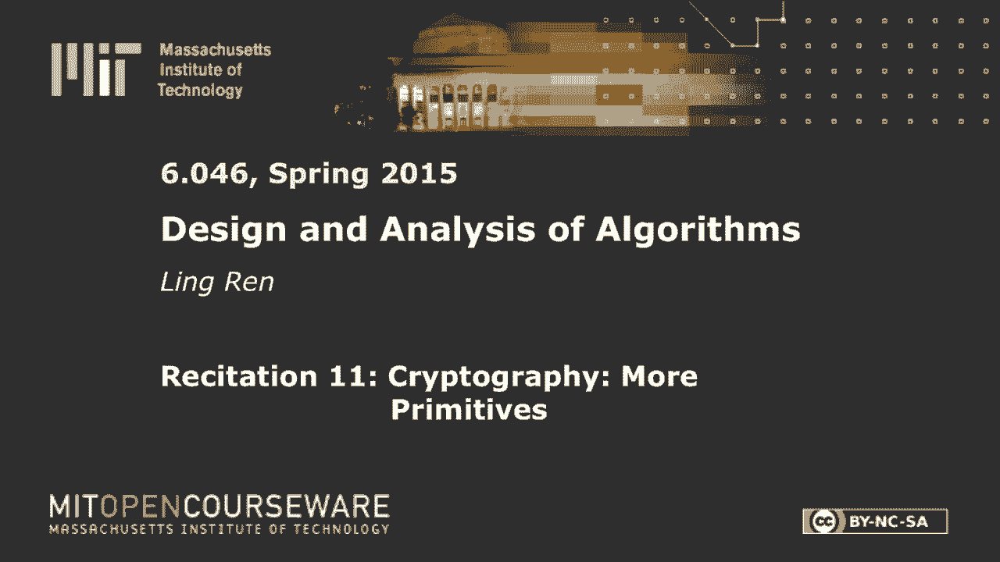
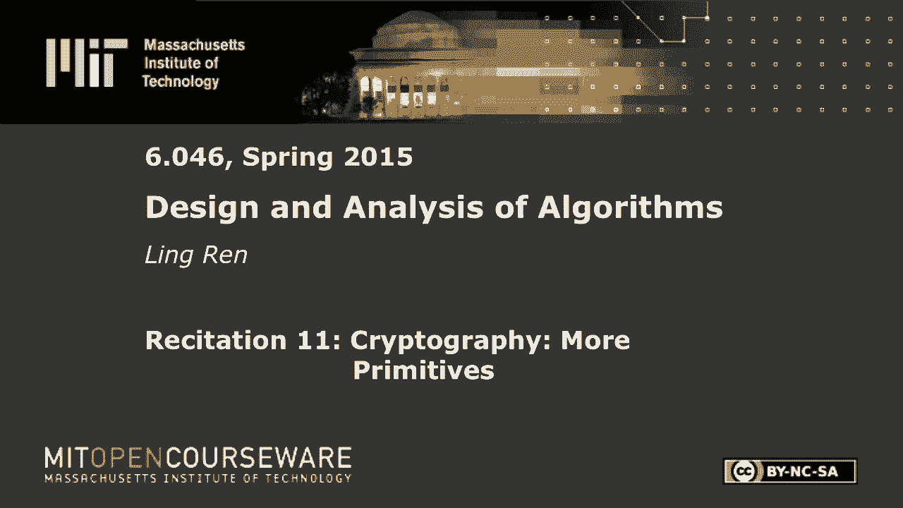

# 【双语字幕+资料下载】MIT 6.046J ｜ 数据结构与算法设计(2015·完整版) - P33：R11. 密码学：更多原语 - ShowMeAI - BV1sf4y1H7vb

以下内容是根据知识共享许可提供的，您的支持将有助于麻省理工学院开放课件。

继续免费提供优质教育资源。

捐赠或查看麻省理工学院数百门课程中的额外材料。

所有的权利，最后，这是我们最后一次朗诵，最后是我最喜欢的话题，密码学，因为我在这个领域工作，所以我可能有比要求告诉你的多一点的东西，所以说，我们将介绍更多的原语，它们可能对您未来的工作或学习有用。

第一个是数字签名，所以我们在讲座中简要提到了数字签名，但主要是作为哈希的应用程序，对呀，所以现在我要把它作为一个独立的原语来介绍，所以你可能已经知道了，数字签名，用于验证消息的真实性，它是一对函数。

所以符号需要一把秘密钥匙和一条信息，称为西格玛，并验证采用公钥，消息和签名，并输出true或false，我要么接受签名，要么拒绝，所以我们用秘钥来签名，验证公钥，这意味着，如果我想发送信息。

我应该是唯一一个能在上面签名的人，每个人都可以验证这条信息确实来自我，那么我们希望从数字签名中获得哪些属性，是啊，是啊，对此有什么想法吗，获得超级密钥的签名消息，好的，那绝对是一个。

我会把你刚才说的话概括地描述一下，一个签名，好的，那么你叫什么名字在这里说一个消息，邮件应该只有一个签名，好的，让我们考虑一下这是否有必要，所以如果我的算法是随机的，对于相同的消息。

我输出许多可能的签名，所以是的，为什么那样不好，所以对于他们中的任何一个，他们都会验证我的算法是否是这样工作的，我想那很好，没关系，这不是坏事，实际上随机签名被认为更安全，他们效率较低，任何其他想法。

想想她发展了什么，这一边需要多长时间绝对是一个，但我们没有，我们还没有什么计划，所以我们首先关心功能，有较快的签名和较慢的签名，好的，所以第一个其实很琐碎，我们首先要正确，那是什么意思，就是说。

如果这个sigma确实是由输出1验证的正弦函数生成的，否则输出为零，这实际上是我们想要的第一个也是最基本的属性，好的，我不想写它，因为它是，好的，所以另一个，所以你的答案很接近，你不想提取秘钥。

而是为了让它更一般，我们真正想要的是不可原谅，这意味着如果我有秘钥而其他人，没有秘密钥匙的对手，应该不能签留言冒充我，所以他们应该不能生产，所以你说的是一个特例，所以如果他们能提取，以某种方式提取秘钥。

那么他们当然可以在任何其他信息上伪造我的签名，对呀，但我们也想防止他们没有的攻击，他们无法提取秘钥，但他们不知何故可以伪造另一个签名，但通常我们想让对手，对手更强大，因为嗯。

那么我们就有更高的信心不会被攻击，所以一个完全合理的对手，看到我的一堆信息，因为我正在签署消息并将其输出给世界，所以对手可能看到了一些消息签名对，但我们仍然不想制造一个伪造的，这是如何定义的。

因为他肯定能把其中一个送回去，这是一个有效的消息签名对，所以我们的不可饶恕性要求被定义为，他不应该送这样一双，M星与他已经看到的任何信息都不同的地方，没有办法阻止对手发送其中一个信息。

他以前见过的签名对，到目前为止很简单，现在我们如何获得数字签名，所以在早期，是研究人员，它实际上是一个伟大的计算机科学家，他们提议，作为公钥加密的反面，那是什么意思，所以我用一个作为例子。

m到e mod n右密码是c到d mod n，所以第一次尝试是，我们就用这个作为我们的，作为我们的验证功能，好的，所以现在这个符号有点混乱，所以现在我在签一条消息，我叫C，让我让我真的改变它。

这是RSA加密，我要把它转换成签名方案，其中正弦对消息进行签名并验证，将签名西格玛提高到V的次方，不管我是否收到我的留言，所以这实际上很有道理，为什么因为，想想看，把n看作密文，那么如果我解密它。

然后重新加密，我应该拿回我的密文，所以正确我们有正确，为什么它是不可伪造的，因为攻击者没有密钥，所以他应该不能解密这个M在这里，您不能运行此算法，这就是背后的原因，到目前为止，这么好。

给你几分钟考虑一下，你能想出一个攻击，伪造品，你可以看到一堆信息，然后为您以前从未见过的消息输出伪造的消息，算法清楚吗，如果你拿着，如果一个对手看到了一堆信息，因为RSA有时很好。

有时不是有时不好的性质，它是乘法的，同形的或井的，用一个不那么花哨的词可塑性，所以如果对手看到这些信息，它可以将m星设置为m一次，m 2和sigma星到sigma 1乘以sigma 2。

您可以检查这是一个有效的签名消息签名对，你把这整件事提高到D，这就是一个单独的d然后乘到一起的竞赛，这正是这里的信息，攻击一号，好的，实际上又有一次袭击，告诉你这个计划更糟糕了。

所以我想做的就是想出一个西格玛，当它上升到e时，等于m是对的，好的，所以我要选择一个西格玛，sigma提升为e，因为e是我的公钥，我做不到，然后输出sigma m oh，对不起，西格玛，我先选择签名。

我把它提升到，v，我收到一条很奇怪的信息，但这并不重要，那是我伪造的，好的，所以现在你可以看到这个计划基本上完全被打破了，但它们实际上来自我们的井，几位著名的科学家，为什么会这样。

因为实际上这个定义并不存在，当他们试图，当他们在研究这个问题时，所以这个定义在今天看起来很明显，但其实一点也不明显，我想是这个，这个算法在这个78，在82年走向。

麻省理工学院的两位教授提出了签名加密的定义，密码学中的一切，他们因此获得了另一个巡回演出奖，好的，所以让我们试着把它修好，我们不想改变，框架，我们还是用rsa吧。

将它与您见过的其他原语结合起来试图修复它，我们想做什么，我们想打破这个乘法性质，我们想打破这一步，不管它叫什么，去吧，改变这个n好的，现在，只是想提醒你，它是两个素数的乘积，p q，它是一个产品。

这就是RSA的工作原理，你有什么想法，去吧，类似的，我们就可以准确地得到它的哈希函数，好的，让我们做一个小小的改变，所以正弦将是m的哈希，升至d，验证会很好的，让我们检查m=签名的严酷值是否为e。

确实修复了这些攻击，因为现在你需要，如果你做一次m m的哈希，m2的哈希值不会是m星的哈希值对吧，这个哈希应该是Serandom，那是行不通的，然后这里，攻击者需要做什么，就是找到m的哈希。

使它的sigma升到e，它仍然可以做到这一点，但它不知道这条信息是什么，因为哈希函数的一种方式，如果我们在那里使用一个好的哈希函数，那么它确实修复了这两种攻击，但我们已经看到了这个哈希函数也需要抗碰撞。

哦不，但是还可以，你说的是这次袭击对吧，因此攻击者需要找到公共消息，但你所能做的就是选择sigma并将其提升到e，这将是它的杂凑我是对的，然后他不知道这个M是什么，那另一条路呢？我是说。

如果他有两条留言，他仍然可以得到M星，然后得到，呃，好的，所以他得到了我的杂碎，2。他喝得烂醉如泥，但你需要找到M星，使得它的哈希是这两个的乘法，是啊，是啊，他不知道如何找到那条信息，好的，所以说。

如果哈希不是单向乘法和抗碰撞，那么我们似乎已经修复了所有的攻击，我们知道，然而，我们怎么知道没有其他袭击，所以其实，的确，这是个好主意，我们有，几个国家标准就是用这个，但略有不同，我可以。

只是这只是供你参考，所以有一个标准叫做，看看x到九三点，五点对不起，一个，所以它接受消息的哈希，并用这个十六进制字符串填充，并前置和追加另一个黑客字符串，好的，为什么，他们为什么这样做？他们也不知道。

但他们只是认为这可能比只使用哈希更安全，还有另一个标准有一个不同的字符串这里有一个不同的字符串，这并不重要，这确实是这些方法的弱点，所以他们的安全是我们所说的临时的，他们有，我们不知道如何打破它们。

但我们也不知道如何证明它们是安全的，但人们在实践中就是这么做的，所以很不幸，今天我能告诉你的就这些，那么如何不构造数字签名，我不能告诉你如何构造安全的数字签名，因为那超出了这门课的范围。

这是密码学的一个主要课题，到目前为止还有什么问题吗？哈希函数，这是一个方法，呃是的，它是单向抗撞的，以及使用RC的事情，我们能不能还是在严酷的功能上，然后呢，好的，好问题，所以好吧。

让我说清楚你在说什么，好的，好的，你能回答你自己的问题吗，所以我的问题是，为什么我们要用为什么我们有他们的心脏功能，是啊，是啊，它如何创建伪造，是啊，是啊，只要回答你自己的问题，让其他人都知道。

也许如果他们有同样的问题，所以我会回答你自己的问题，所以呃，我的回答是如此的对手，您可以选择随机消息，并对其进行哈希，然后进行，是啊，是啊，有什么问题？问题是哈希函数是公共函数，每个人都能正确计算。

所以攻击者只需选择一条消息，计算此哈希，因此使用哈希不是签名，但有道理，我真的要说到这一点，到目前为止，我们已经看到了三个主要的原语，和数字签名，所以如果我们把它们稍微分类一下，所以这两个是非对称键。

所以他们有公钥和私钥，这个是对称键，他们试图隐藏信息，这个是给，发件人发送的内容，好的，所以你可以看到我们缺少了一个原语，如果双方共用一把秘密钥匙怎么办，一方想验证另一方，信息确实来自对方，好的。

所以我们确实有一个原语，因为它被称为，所以它的定义基本上和数字签名完全一样，好的，我只是要改变它在这里，除了它只有一把钥匙，所以正弦函数被Mac取代，没有私钥和公钥的概念，我们只有一把钥匙。

我们如何验证，好的，所以验证功能，基本上就变成了，另一个人也重新计算消息的Mac，并检查这是否是签名，所以验证器只是为了重新计算，然后比较一下，好的，正确性，呃，我们也想要正确，我们也想要不可饶恕。

它的定义完全相同，现在实际上，我会在这里问这个问题，答案仍然是否定的，因为Mac是一个公共函数，每个人都可以计算，想出一个赝品是微不足道的，所以谢谢你问这个问题，但哈希实际上非常接近。

如何获得消息验证码，所以我们可以用几个想法来散列与消息连接的键，然后其他没有钥匙的随机攻击者，不知道如何计算这件事，那是个合理的想法，但是好吧，如果我们能这样做，我们用钥匙连接消息怎么样，或者。

如果您愿意，您可以执行与消息连接的键，然后与钥匙连接，所以事实证明这并不奏效，因为一些非常提前的原因，这个可能会也可能不会给沙一个，不幸的是，它不起作用，对于三个人来说，这是沙沙的替代品。

它真的起作用了，所以我们能想象到的最简单的Mac就是选择Sha 3，作为哈希函数，输入是键，然后信息，好的，但不是相反，也只是仅供参考，哦，顺便说一句，还有另一个合理的想法，那我们。

每个人都可以计算哈希，但他们不知道如何加密，如果我用，比如说密钥加密，事实证明这也是错误的，好的，那是数码的，数字签名与Mac，但这里有一个警告，我们的不可饶恕是这样定义的，有点奇怪，但这是有道理的。

但它在某些应用中确实有一些弱点，所以想象一下，假设我给你发了一条信息，今天的朗诵课取消了，上面有我的签名，这样你就可以验证了，确实来自我，但一旦我发出那条信息，你们每个人都有那个信息对吧。

所以下周你们中的一个可以再次发送那条信息，说今天的朗诵取消了，那你就不知道是不是我又在发信息了，或者有人在开四月一整天的玩笑，那么我们怎么，我们如何预防那口井，当然啦，我能做的一件事就是，如果我聪明。

我会像括号一样说今天，第八节朗诵可能会被取消对吧，那你就不能重复那条信息，但是呃，我们想保护人类的稳定，这就是密码学的全部意义，所以我们可以做的一件事，让我们看看，非常简单的修改，当我签署信息时。

我会签一个和我的信息相连的，下次我分配连接我的消息，然后是三个，四，只要有一个不断增加的计数器，这就解决了，这样您就可以验证是否用相同的计数器接收到相同的消息，那你就知道是别人发的，好的。

所以这是我们现在在实际应用中需要做的一件事，我想每个人都在使用谷歌驱动器Dropbox，类似的东西，对呀，你存储一堆文件，你是，你在这里，有一个说手机，您可以访问您的文件，但是你怎么知道当你读一个文件。

它确实是您的文件未修改，你怎么知道，也许谷歌搞砸了你，或者中间有人修改了你的文件，所以好吧，通常大多数人并不关心这一点，但是在密码学中，我们确实关心这个，所以在这种情况下，签名对我们没有帮助。

因为如果你只存储一个Mac，去吧，嗯好吧，但是如果他们修改文件，他们不知道如何为他们版本的文件生成Mac，但他们能做的是你有这个文件，然后你来写，当你阅读它时，你会生成一个新的Mac。

他们会给你旧版本上面有有效的签名或Mac，因为你为它生成了它，见，呃，你们都看到问题了，你还没看到问题所在，好的，你什么意思，他们给你旧的，好的，所以你有这个文件，对呀，你生成一个Mac。

但是你在某个时候想更新一个文件，好的，您想将此文件更新为此文件Prime并生成一个新的Mac，也许然后提交双素数，Mac双素数，在此应用程序中，我们要新鲜，就在你读这个文件的时候，您想要文件的最新版本。

所以应该是，应该是你上次在那里写的，但是当你试图读取一个文件时，攻击者可以给你这对，如果你检查Mac，它会匹配，这也是一条有效的消息Mac对，现在每个人都看到了问题，好的，那么我们能做什么呢，嗯。

我们可以做的一件事就是把所有这些Mac电脑都存储在你的手机上，对呀，Mac One Mac，两个，每个文件都有一个Mac，但如果你这么做了，事实上我们不再需要Mac了，我们可以用哈希，所以我会说西格玛。

我会用西格玛，但他们的意思是哈希，这在实践中可能已经足够好了，所以我会说这些文件是x 1 x 2，x3 x4，你只需要为它们中的每一个创建一个哈希，并将它们存储在本地。

这里的模型是攻击者不能修改您自己计算机上的文件，或者在自己的手机上，然后你可以下载文件匹配，将其与最新版本的哈希进行比较，然后你确信这是最新版本，这可能是一个足够好的解决方案。

唯一的缺点是我们必须存储大量的哈希值，如果你需要一个，如果你有很多文件，这里我是说你的本地空间，所以我们能以某种方式降低空间局部空间的复杂性，我们可以做的一件事就是把所有的文件连接在一起，生成单个哈希。

并存储一个哈希，一次把所有东西都打乱，那么我们确实有一个空间，但还有一个更大的问题，有人能告诉我，我，好的，我认为你的想法是对的，那么我如何验证，如果我想，我无法验证一个文件，我得下载所有的文件。

重新计算哈希以验证，所以时间复杂度为n，如果我想更新这个文件，我必须重新计算再次涉及的哈希，下载所有文件并将它们输入到哈希中，我们确实有一个比他们两个都好的解决方案，它被称为哈希树或默克尔树。

所以这是默克尔发明的，我们要做的是首先对每个文件，我们要创建一个哈希，好的，让我再次使用西格玛，因为h不清楚它是哈希值还是哈希函数，西格玛二西格玛，三西格玛，四，所以我说哈希树，你猜怎么着。

那么下一步该怎么办，是啊，是啊，准确地说，我们要创造一个西格玛五，也就是哈希，西格玛一与西格玛二相连，好的，所以我们在这里做同样的事情，所以你们都知道什么是对的，我不需要写它，一直写到我们找到根，哈希。

然后我们要把这个东西储存在这边，那么本地存储复杂度是多少，我们只在本地存储一个哈希，那么现在几点了？复杂性，好的，那么我如何验证，是啊，是啊，登录，是啊，是啊，我如何验证，我需要。

所以首先验证这个哈希是否匹配，然后读取此哈希并验证此链接是否匹配，并验证这一个是否匹配，然后我就做对了，如果我想更新，我还需要更新这个哈希，然后它导致这个哈希更改，然后哈希要改变，但它总是树上的小路。

它不会影响全球任何事情，但你没有做，我再说一遍，你不是在储存六五，我还没有，我得去读了，来自谷歌驱动器或Dropbox，我们确定没问题吗，是啊，是啊，所以那是，这就是我们接下来要做的事情，或者换句话说。

对手可以更改其中一个文件吗，并以某种方式维护相同的根哈希，这就是整个问题，当然啦，我们假设哈希防撞，或，我应该说，如果哈希是抗碰撞的，那么这个哈希树是抗碰撞的，有人想证明，最终必须选择他们的小组。

不同是因为你改变了它，是啊，是啊，现在，如果你想让房间和以前一样，那么另一种激情必须是不同的，但是，所以好吧，所以我就重复你说过的话，但我会从叶子开始，因为那对我来说更容易思考，假设我改变了这个块。

现在我声称这个哈希会改变，如果没有，然后我找到了碰撞，这个x4素数的哈希值与原来的x4相同，好的，所以如果这个西格玛四改变，然后西格玛六会改变，否则我已经找到碰撞了。

因为这个西格玛3和新西格玛4的连接是我的碰撞，同样的论点，要么这个改变，要么我找到了碰撞，我一直重复这个论点到根部，对此有什么问题吗，和研究变化，比如两个哈希函数，比如说，x一，但是呃。

西格玛一和西格玛二的变化，是啊，是啊，但是西格玛五态，好的，所以我们发现了一个碰撞，那就是sigma，西格玛一与西格玛二连接，那是与新西格玛的冲突，并与新的西格玛二相连，有道理，竞争就是状态。

就像看到我的一个，哦，所以说，如果串联保持不变，这意味着他们两个是一样的权利，因为，所以我不太明白你的问题，所以串联基本上只是一堆位，然后是另一堆比特，如果这整件事都是一样的，这意味着这一部分是一样的。

这一部分是一样的，如果你的西格玛一个新的西格玛，一个和你以前的西格玛一样，这意味着我在这里发现了碰撞，因为你改变了它，但你的西格玛没有改变，所有权利，所以最后我要，我要快速复习一下背包的问题。

因为我想在讲座中，我们没有时间了，没有测量，等等，所以如果你回忆起背包密码系统，上面说我们有一个，我会打电话给你，然后我们要改造它，好的，这是一个超级增长，序列，我要变成一个普通的。

乘以n然后mod m，这是个容易的问题，这是一个很难的问题，那么我如何加密，我要取一个子集和，也就是米维，MI是消息中的第i位，那么我如何解密，我把这个变换，这又回到了，乘以n的逆到超递增域。

所以这将是，n的逆乘以这个mi wi，我就是这样加密的，然后每个WI是N次，U i，所以这是很好的权利，所以这给了我，当然啦，每一步都是模m，所以我要声明的第一件事是，m必须大于sigma ui。

如果是这样的话，那么t my t就是这个子集和，所以如果我解决背包问题，我得到的答案和解决原来的一样，一般背包问题，如果我的M不是那么大，如果m太小，那么我有一个问题，因为我的T将是子集和。

减去m的某个倍数，那就另当别论了，我没有得到同样的信息，因为我们将密度定义为最大UI对数上的n，大家还记得这一段吗，所以每个UI，在1到m的范围内，或者零到m，如果我有一堆，那么好吧，如果我有一堆。

那就不是超级严格了，他们中的一些人很可能和我很亲近，因为它们不可能都很小，所以这个东西大约是n，所以我们就进退两难了，如果我们把m设为一个小数，那么我的密度是可以的，但这意味着我所有的UI都需要很小。

因为m需要大于它们之和，如果所有的UI都很小，那我的选择就很有限了，那么实际上是一个攻击者，我能猜到你我他们通过蛮力算法选择了什么，或者类似的东西，如果我选择M是大的，或者如果我选择所有的UIS都很大。

从大范围中选择它们，那么我的m将非常大，而且这个密度很低，这很容易受到低密度攻击，所以密度有多低被认为是低，所以说，基于启发式，如果这个密度小于4。5，那么它被认为是低密度的，它可以被攻击。

而且这个阈值已经提高了，好吧那么，但是虽然大多数背包密码系统都坏了，到目前为止，有几个经受住了时间的考验，所以他们还是很有趣的，因为背包问题，背包密码系统将比RSA快得多，或者任何基于数论的。

我们只是在这里加数字，RSA有这样一个操作，m是一个1000位的数字，E也是一个一千比特的数字，取这个幂实际上是很慢的，所以背包密码系统仍然很有趣，然而，他们最初的动机结果是不成功的。

最初的动机是基于一个，行不通的NP完全问题上的密码学，因为NP问题只有在最坏的情况下才会困难，我们需要密码学在一般情况下很难，因为如果它们只是在最坏的情况下很硬，这意味着这个问题有几个例子很难。

所以你要么选择一把不对应于难题的秘钥，或者你选择一个与难题相对应的秘钥，但其他人都选择了相同的秘钥因为每个人都想安全，这就是为什么它不太可能从NP获得密码学的原因，难题，今天的朗诵就到这里。

感谢大家这整个学期。