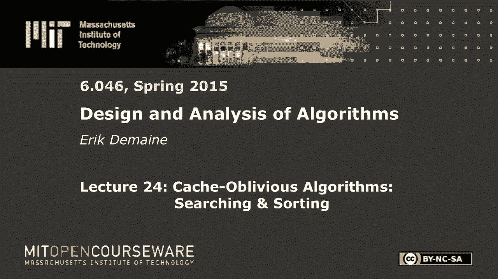

# 【双语字幕+资料下载】MIT 6.046J ｜ 数据结构与算法设计(2015·完整版) - P34：L24- Cache-Oblivious 算法：搜索和排序 - ShowMeAI - BV1sf4y1H7vb

以下内容是根据知识共享许可提供的，您的支持将帮助麻省理工学院开放课件。

继续免费提供优质教育资源。

捐赠或查看麻省理工学院数百门课程中的额外材料。

所有的权利，欢迎来到6046的最后一课今天我们继续我们的缓存主题，遗忘算法，我们将研究计算机科学中两个最基本的问题，搜索和排序每一个，然后我会告诉你一些关于你可以上什么课的事情。

在这个模型的简短回顾之后，我们介绍了两种计算模型，尽管一个只是另一个的变体，基本模型是外部存储器模型，这是一个两级内存层次结构，CPU和缓存，我们认为是一体的，所以他们之间的即时交流。

这意味着您正在计算的内容可能涉及总大小为m的缓存，缓存的大小为M字，缓存被分成这些大小为B的块，所以他们在B街区以上，你的问题不适合这里，大概是，或者问题不是很有趣。

所以您的问题大小n将需要将您的信息存储在磁盘上，所以输入实际上是在这里提供的，圆盘的大小基本上是无限的，它也被分成了块，当您无法访问这里的单个项目时，您只能访问整个块，所以模型是，你说。

我想读这个块并把它放在这里，我想把这个方块写出来放在这里，这是在外部内存模型中允许做的事情，我们计算的是我们做了多少块内存传输，我们称之为内存传输，所以你想把它最小化，通常你不会太担心这里发生的事情。

尽管您也可以最小化常规运行时间，就像我们通常做的缓存一样，忽略的变化是算法不允许知道缓存参数，不允许知道块的大小，对不起，磁盘中的块大小也是B，所以它们是匹配的，您不允许知道缓存大小m，正因为如此。

您需要自动完成所有的块读写，所以模型是每当你访问一个项目，您可以查看刚刚写入的磁盘，呃，一行一行，按顺序逐块，如此线性化，它看起来像是被分割成块的，系统自动加载该块，如果它还没有在缓存中，它把它装进去。

如果它已经在缓存中，当你加载一个，当您加载一个块时，你可能已经有东西了，因此您必须决定缓存是否已满，你得决定驱逐哪一个，我们有几个策略，但我定义的是最近使用最少的块。

所以缓存中最近被CPU使用最少的一个，这是一个被写回磁盘，它最初来自哪里，就是这样，这就是模型，好的，这是一个很好的模型，这是真实缓存如何工作的一个很好的模型。

尽管最后一部分并不是所有真正的缓存的工作方式，很近了，在最后，我提到了这个定理，为什么LRU是好的，如果你把街区驱逐的数量，等效的块读取数，LRU必须在大小为M的缓存上做的事情，那么这将是最多两次。

你能做的最好的事情就是给一个大小为m/2的缓存，所以我们限制选择，我们把行动组的手绑在背后，把m减小2倍，但我们得到一个因子的二近似，基本上，这是资源的增加，这是一般的规则近似算法，这是一个叫做。

我只想在这里简单地提一提，这里的区别是lru，或者我们在真实系统中实现的任何东西都必须做出决定，只基于过去发生的事情，我们假设的系统不知道未来，所以如果你知道在编译器中，也许你可以试着预测未来。

做些什么，但是在CPU上，它不知道未来十步会有什么指令，所以你现在得做个决定，你最好的猜测，至少最近被用作一个很好的最佳猜测，选择，另一方面，我们给了很大的力量，这就是我们所说的离线算法。

就像星际迷航里的Q，下一代或其他神话生物，它生活在时间线之外，你可以看到所有的时间，说我想我会驱逐这个街区，就像浪费排队，资源，我要驱逐这个街区，因为我知道它在未来会被用得最远。

LRU正在驱逐过去使用得最远的东西，这是有区别的，这可能会有很大的不同，但事实证明他们是以这种方式联系在一起的，这就是我们所说的在线算法，意味着你必须边走边做决定，离线算法得以看到未来并优化，因此。

两者都是可计算的，但这是唯一可计算的，如果你知道未来，我们没有，所以说，我还没有证明这个定理，这其实很容易证明，所以让我们做吧，我想把时间线分成，所以这将是分析中的分析，我们被允许知道未来。

因为我们试图想象OPT相对于LRU能做什么，所以我们正在修复算法，它显然没有利用未来，当我们分析它的时候，我们假设我们知道未来，我们知道整个时间线，所以我们上次讨论的所有算法，我们今天报道的所有。

你可以认为只是进行一系列访问，他们正在对元素进行一系列访问，但是如果我们假设我们知道B是什么，这只是对块的访问序列，好的，所以你可以把时间线想象成一系列块ID，如果您访问当前存储在现金中的块，免费的。

否则你付一个好的，所以我要看看所有这些访问的时间表，然后说，嗯，取访问的前缀，直到我在b个不同的块上找到m，块ID继续运行，直到，如果我再去一次，m/b加上一个不同的块。

所以它是m/b个不同块的最大前缀，在这里切开，然后重复，所以重新开始，从零点开始计数，去扩展，直到我有m超过b个不同的块访问，如果我再去一次，m/b加1以此类推，所以时间线被分割了。

谁知道这可能是完全不正常的，如果多次访问相同的块，你可以相处很长时间，并且只访问m/b个不同的块，谁知道算法肯定不知道，因为它不知道M或B，从分析的角度，我们可以数一数这些东西。

所以每一个都有m/b不同的访问，不同块ID，所以我有两个主张，具有大小为m的缓存，在一个阶段，最重要的是什么，因为lru没有脑死亡，我是说如果你这么做，你很好，你正在访问这些块，它们都是最近被访问的。

我是说，让我们看看这个阶段，你在这里接触到的所有块都是最近被访问的，比以前更多，这就是这个时间线的定义，这是按时间顺序的命令，所以你在这里装的任何东西，你会优先考虑不在阶段的事情。

因为该阶段中的所有内容都是最近访问的，所以也许最终你会加载所有处于相位的m/b块，根据相同块的相位定义，你接触的其他一切，所以它们会留在缓存中，这就是每个阶段花费m/b内存传输的全部费用。

所以这基本上忽略了从一个阶段到另一个阶段的任何结转，这是一个保守的上限，但这是一个上限，然后另一个问题是选择做什么，所以记住我们把它的手绑在背后，它只有一个大小为m/2的缓存，然后我们在评估一个阶段。

我不得不说，我想声称选择是好的，至少有一半，如果我想得到2的因子，所以我声称它至少超过了半米，b为什么，现在我们要考虑结转，所以你知道在这个阶段选择了一些东西，然后我们想知道下一个阶段会发生什么。

所以这些块中的一些可能与这些块共享，我们不知道，我是说有一些积木，我们知道第一个街区不在这个集合中，否则阶段会更长，但也许后面的某个块碰巧重复，那边的某个街区，我们真的不知道可能会有一些后遗症。

所以能选择在这一刻是多么幸运，在我们所看到的阶段开始的时候，可能整个缓存都有我们想要的东西，HAS有出现在此阶段的块，这是最大的结转，是整个缓存，这是选择的最佳情况，整个缓存，在我们感兴趣的阶段。

我们在看阶段的开始，那是最好的情况，但因为我们只放弃了M超过两个，这意味着最多半个米/b个方块，这是缓存大小，这是方块，缓存中的块数，最多这么多方块都是空的，选择不会花任何钱，但根据定义。

相位有m/b个不同的块，所以他们中的一半是免费的，另一半选择将不得不加载，好的，所以这是一种琐碎的分析，太神奇了，这个证明太简单了，一切都是为了安排事情，对呀，如果你定义了对LRU有好处的阶段。

但它们也不利于选择，当它的缓存大小为一半时，所以选择必须支付至少一半，LRU在这里肯定付了什么钱，我们可以在这里忘记携带，我们在限制结转，只需将缓存变小，就是这样，所以这最多是，所以我们得到了定理。

我是说，更改缓存大小可能会极大地改变您必须执行的缓存读取数，或磁盘读取，您必须对缓存进行，但在我们将讨论的所有算法中，我们在m方面给出了一些限制，这个界总是m中的某个多项式依赖关系，通常是比我高一个。

m的平方根1，1/log m，类似的东西，所有这些边界只会受到一个恒定因素的影响，当你用一个常数改变m时，所以这对于缓存遗忘算法来说已经足够好了，所有的权利，所以这是一种回顾，为什么这个模型是合理的。

伊茹很好，所以现在我们要讨论两个基本问题，在数组中搜索内容，在这两个模型中对数组排序，我们不能什么都做，今天忘记缓存，但它们都是可能的，只是比我们有更多的时间，它会让你对这些东西的工作原理有更多的了解。

我最后一堂课的主题是分而治之，假设我们有n个元素，为了简单起见，我们在比较模型中，所以我们对这些元素所能做的就是把它们比，大于等于，假设我们想在比较模型中进行搜索，我把它看作是前置搜索。

所以给定一个新元素x，我想找到前面的元素是什么，在我的集合中，比x小的最大元素是什么，我认为这n个元素是静态的，假设你可以概括我所说的一切，有插入和删除，但我们不要担心这个，就目前而言。

我只想把它们储存起来，以便启用搜索，所以在外部内存模型或缓存此模型中有任何建议，你会怎么做，这听起来可能很容易，但它不是，不过没关系，我喜欢简单的答案，简单的答案，有两个简单的答案，一个是正确的。

一个是错的，但我两个都喜欢，因为我想分析两者，把它们按顺序储存好，这就是我们通常解决这个问题的方法，所以让我们看看它是怎么做的，好的，所以说，这就是为什么我有一个解决方案，不过没关系。

排序数组中的二分搜索，按顺序存储元素，然后进行查询，对其进行二分搜索，所以你记得二分搜索，你有一个数组，你从中间开始，假设我们要找的元素在这里，那么我们从这边过去，走这边走那边走这边，好的。

log n时间，我是说，这是一个二分搜索在某种意义上是，分而治之的算法，您只在一侧递归，但这是分而治之，所以分而治之是好的，二分搜索肯定是好的，要是这么简单就好了，与这张照片有点正交。

也许我会把它画在那边，有一个街区的划分，在缓存电影设置中，我们不知道它落在哪里，但关键是在很大程度上，这些方块中的每一个，我们所做的每一次访问，当我们向右走得越来越远时，几乎所有人都在不同的街区。

中间的一个离四分之三很远，马克离八分之七马克很远，以此类推，直到最后，如果我们说我们在寻找最大值，所以这将在最后为他们所有人保留，一旦我们，我们在大小问题范围之内，那么我们接触的方块只有恒定的数量。

所以从那时起一切都将是免费的，基本上是这样，如果你仔细想想，我是说明显的上限，这是我们通常重复的，对于二分搜索将是恒定的，我们希望在这里获得的基本上是一个更好的基础案例，我声称你所得到的基本情况。

这里是b的t等于，点一个，如果你仔细想想，这就解成log n减去log b，这和log n除以b是一样的，这比普通的log n有了一个小小的改进，但不是很大的进步，我声称我们可以做得更好。

你实际上已经看到了如何做得更好，但也许我们没有告诉你，所以这是一个您已经看到的数据结构，b树，是啊，是啊，因为我们没有考虑内存层次结构业务，当我们说B树时，我们的意思是像，你知道两棵四棵树或五棵十棵树。

或者在每个节点的度数上有一些恒定的界限，但是如果你使节点b或某个θb的度数近似，所以你允许大的分支因素，一定在什么地方，假设在b/2和b之间，然后我们可以存储所有这些指针，所有这些键都在恒定数量的块中。

所以当我们向下航行时，如果我们只是搜索，当我们沿着B树导航时，我们将在这个节点中花费一个块读取来加载，然后想好该走哪条路，然后假设是这样，然后我们将花费一个命令的内存传输来读取这个节点。

然后想好该走哪条路，所以成本将与树的高度成正比，它只是对数基数，n的b直到常数因子，因为我们在b/2和b之间，但这只会对这一点产生很小的影响，两倍，所以我们可以在B树中搜索n个内存传输的日志基B。

记住n的对数基数b是log n除以log b，所以这个好多了，这里是log n减去log b，现在我们有log n除以log b，这在比较模型中是最优的，这是你能希望做的最好的事情，好消息。

坏消息是我们急需知道B是什么，B树真的只有意义，如果你知道B是什么，你需要知道分支因子，所以这不是一个缓存忽略数据结构，但它还有其他我们可以做的好事，插入和删除，所以我说静态，但如果你想要动态。

插入和删除元素，你也可以在对数基中做那些，n次内存传输的b，使用我们在拆分和合并中看到的算法，所以这一切都很好，但我想这么做，不经意地缓存，只是现在的搜索，这并不明显，但这是我们的好朋友范·德·博伊斯。

所以不管名字，这不是毒液的数据结构，发明最多的是，但它的灵感来自我们所讨论的数据结构，这实际上是哈罗德·普罗科普的解决方案，谁写了关于这项工作的MH论文，就像在结论中，就像，哦，顺便说一句。

以下是搜索的方法，这是论文中最好的一页，所以我想我们叫它本和阿博阿斯，因为我们觉得这让人想起，所以想法是这样的，嗯，把你要储存的所有物品，你真的很想把它们按顺序排列起来，但我不会那么做的。

我要用另一种分而治之的方法，我要做的第一件事就是把这些元素，把它们放在一个完美平衡的二分搜索树中，所以这是一个BST，不是B树，只是一棵二叉树，因为我不知道B是什么，所以说，你知道，也许这里的中位数。

然后有两个孩子等等，好的，这边的迷你车，最大值在这里，常规BST现在我们知道如何在树上搜索了，对呀，你只要走下去，最大的问题是，按什么顺序，我应该存储这些节点吗，如果我只是随机存储它们。

这将是超级糟糕的日志N内存传输，但我声称，如果我做了一个聪明的命令，我可以得到n的对数基数b，这是最优的，所以范·德·博伊斯建议把这棵树从中间砍掉，在中间，这里有N个节点，我们把它分解成n的平方根。

顶部的节点，因为这棵树的高度是log n，如果我们把它分成两半，这棵树的高度是半log n的二分之一，log n是根n，我失去了一些不变的因素，但我们就叫它根n吧，然后我们在底部，一切看起来都一样。

我们会有一大堆大小的树，n的平方根大致可以，这就是当我切入中间层时发生的事情，然后我递归，好的，我递归的是什么，我在做什么，这是一个布局布局，从上次我们做的时候，我们做了一件非常相似的事情，用矩阵。

我们有一个n乘n的矩阵，我们把它分成四个，n除以2乘n除以两个矩阵，我们递归地把顶部，四分之一，把那些按顺序写出来，所以是连续的，然后我们布置了下一个季度，下个季度下个季度，硬币的顺序无关紧要。

重要的是矩阵的每四分之一都存储为一个连续的单元，所以当我们递归，好事发生了，这里也一样，除了现在我大约有n的平方根，加一块，小三角形，我将递归地排列它们，然后我要把这些布局串联起来，所以这个我要递归地。

弄清楚存储这些节点的顺序，然后将这些都作为连续的放在数组中，然后这个放在这里，这个放在这里，其实顺序并不重要，但不妨维护秩序，然后下面的按顺序，所以递归地，每一个都会在中间被切断，递归地布局顶部。

下一个让我们做一个例子，让我们做一棵真正的树，这其实是，我最喜欢画的图表什么的，我最常画的图，八个孩子的完整二叉树，八片叶子，所以这是十五个节点，恰巧有一个高度，那是二的幂，所以这个算法特别好用。

所以我要一分为二，然后递归地布局顶部以布局顶部，我要把它分成两半，然后我将递归地把顶部布局好，单节点，就其本身而言，把它放在什么顺序是很清楚的，所以那是第一位的，然后我完成了第一个递归。

我将通过把它切成两半来递归地布局这个东西，把顶部铺好，然后下面的部分，好的，然后我将递归地列出这个，十三十四十五，它变得更加令人兴奋，下一层，但是画这个需要很长时间，但想象一下这重复了一遍。

所以这只是一些树的上半部分，然后你在这里和这里做同样的事情，这与顺序遍历或我们所看到的任何其他顺序都非常不同，这是范梅德布瓦命令，好的，这个编号应该是我存储节点的顺序，所以当我把这个写进记忆中的时候。

它会是这样的，只是按顺序排列节点，当我画圆的时候，很乏味，等，然后你知道这里有指针，每次我画圆的时候，有一个左指针和一个右指针，所以1将指向2和3，二指四七，好的，所以只要取常规的二分搜索树。

但把它储存在这个非常奇怪的顺序中，我声称这会很好用，n搜索的对数基b，让我们分析一下，好吧，第一个索赔，这是缓存遗忘布局，对呀，我根本没有用B，这里没有B，从二叉树开始，我只是做这个递归。

它给了我一个线性的顺序来把节点放进去，我只是要把它们按顺序储存起来，它是线性大小，所有这些，现在再次在分析中，我被允许知道B，假设b是b，让我们考虑，递归的级别，三角形的节点小于B，所以我在想这张照片。

我从中间切，然后我递归地在所有碎片的中间切割，我在中间递归地切割，我从log n的高度和n的大小开始，我基本上一直在切正方形，在某一点上根植大小，当我切的时候，我得到的三角形最大，b的平方根。

所以这棵树现在看起来，其实让我画一个更大的图景，所有的权利，让我们从这里开始，所以我得到了一个小于b的三角形，三角形等于b，好的，这是试图画一棵一般的树，所以我们首先从中间切入，然后我们从中间层切入。

让我们说，在那一刻，所有剩下的树都有大小，里面最多有B个节点，总有一天会发生的，这将发生在，递归的大致log n减去log b级，这里的高度大概是log b，我们一直把它切成两半，所以高度log b。

然后我们就知道尺寸是，好的，所以这是一幅在某种意义上存在的图片，我们知道的是，这些三角形中的每一个都通过递归布局连续存储，在任何递归级别，每个块连续存储，所以特别是这个B级很好，所以这告诉我们每个人。

最多两个街区，如果我们幸运的话，这是一个，但如果我们在这里的记忆方面运气不好，它是这样分成块的，也许，它是连续的，但它越过了一个块边界，好的，但是这两条线之间的距离是b和b，蓝色的东西的长度是B。

所以你只能越过一条线，所以你适合两个街区，这些三角形中的每一个都适合两个块，现在，让我们考虑一下搜索算法，我们将在二分搜索树中进行常规的二分搜索，我们从根部开始，我们比较X，我们从左到右。

然后我们从左到右，从左到右，或者理想情况下我们实际上在寻找的元素，所以我们要做的是遵循树中的一些根到节点的路径，也许我们早点停下来，最坏的情况是我们下到一片树叶上，但这是一条垂直的路径，你只会往下走。

这边，我们去做同样的事情，这么说吧，因为这些是我画给你的，去这里的某个地方，好的，但通常情况下，您遵循一些根到节点的路径，你正在访问一些三角形序列，每个三角形基本上都适合一个块。

让我们像往常一样假设m/b至少是2，所以你至少可以储存两个街区，这意味着一旦你开始接触三角形，所有进一步的触摸都是免费的，你必须付费才能加载的第一个，可能这两个街区，随后的每一次触摸，当你往下走的时候。

这条路径是免费的，然后你会进入一个新的三角形，这个三角形可能在一个完全不同的地方，我们真的不知道，但还有另外两个街区，只要你呆在三角形内，免费的，所以成本最多是你访问的三角形数量的两倍，n最多是。

二叉搜索树中的向下路径，好吧，现在来弄清楚，我们不仅需要三角形有多大的上界，也是一个下界，我说这棵树的高度大约是log b，很近了，也许你有大小为B加1的三角形，有点太大了，所以让我们想想那个案子。

你有B加一个节点，然后你最终在中间层切割，所以在你有一个几乎对数B的高度之前，略高于log b，然后当你把它切成两半的时候，新的高度将是半log b，好的，然后在三角形中只有B项的平方根。

所以这似乎有问题，这些东西最多B，它们也至少是平方根b，三角形的高度，在这个水平上是在半log b之间的某个地方，和log b，幸运的是，基本上我们在高度上进行二分搜索，当我们把它除以2时。

我们就停止了，我们得到的高度小于log b，幸运的是我们只关心高度，我们不在乎这里只有根B项，这可能看起来效率低下，但因为这里的一切都在日志里，因为我们只关心运行时的log b。

我们基本上是在2的因子内近似对数b，一切都会随着恒定的因素而变化，换句话说，如果你看着这条路，我们知道路径的长度是log n，我们知道每个三角形的高度长度至少是，log b表示您访问的三角形数。

log b/2，log b，log n除以一半，log b，和路径的长度，log n所以路径上三角形的数目，顶多是log n除以我们在每个三角形上取得的进展，也就是半对数b，也称为n的两次对数基数b。

然后我们得到内存传输的次数最多两倍，所以内存传输的次数最多是四倍，n的对数基数b，这是n的对数基数b，这是最优的，现在我们不需要知道B，对一个骗子来说怎么样，好的，这样我们就得到了最佳的运行时间。

除了常数因子，诚然，这并不完美，b树基本上得到n的对数基数b的1倍，这个缓存忽略二进制搜索给出了n的四倍对数基数b，但这是一个粗略的分析，你可以把它降到一个点，n的4倍对数基数b，那很紧，因此。

您不能像使用现金意识那样很好地使用缓存遗忘，对不起，它是外部存储器，但关闭了，这就是这里的故事，如果忽略常量因素，在实践中一切都很好，你可能获胜的地方是，如果你为特定的B设计了一个B树。

您将在内存层次结构的那个级别上做得非常好，但在现实中，内存层次结构有许多级别，如果它们都很重要，缓存遗忘会赢很多，因为它同时在所有级别上都是最佳的，造一棵B树真的很难，这对同时的多个b值是最优的。

好的这就是在我们继续排序之前搜索任何问题，一个明显的问题是动力又是什么，我说静态，很明显这里的元素没有改变，只是在n的日志基b中进行搜索，原来你可以做插入，在n的日志基b中删除和搜索。

每次操作的内存传输，这是一个，这是我在缓存遗忘之地的第一个结果，但我不打算报道它，如果你想知道你应该怎么拿六，八，五个，一种高级数据结构，它讲述了各种各样的事情，但充满活力，原来。

关于这个宇宙还有很多话要说，我想去分拣，而不是谈论如何让这种动态，因为，哦，好的，搜索日志基数B为n，这是最优的，我说，哦，您还可以在n的日志基b中进行插入和删除，事实证明，这并不是最佳的。

它和树一样好，但你可以做得更好，B树不擅长更新，如果你曾经使用过数据库，你可能知道这个，如果你有很多更新，B树真的很慢，它们很适合搜索，不适合更新，你可以做得更好，这将通过排序来展示，所以分类。

我想你知道问题所在，数组中有任意顺序的n个元素，你想把它们按顺序排列，或者等价地，你想把它们放在范德布瓦顺序中，一旦它们被分类，转换到这个顺序并不太难，所以你可以快速搜索。

或者任何排序是我们喜欢做的一件非常基本的事情，嗯，排序的明显方法，当你基本上有一个，让我们假设我们有这个B树数据结构，缓存甚至忽略或者我们只是使用常规的B树，让我们用普通的B树，忘记缓存遗忘外部内存。

我们知道怎么做B树，我们知道如何插入B树，所以最明显的排序方法是执行n个插入，如果您想要缓存，B树，或者只是一棵普通的B树，n乘以对数基数b的n需要多长时间，听起来不错，但这不是最佳的，其实真的很慢。

与你能做的相比，你可以更快地做大约B的一个因子，但这是我们目前所知道的最好的方法，所以目标是做得更好，基本上发生的是，我们可以在这个宇宙中做插入，我们可以比搜索更快地进行插入和删除，这有点奇怪，嗯。

随着我们的经历，它会变得更加清晰，所以说，对我们所介绍的排序算法进行排序的另一种自然方法是什么，在比较模型中是最优的，合并排序，这是一个很好的排序，你可以做快速排序二，我想我会坚持合并排序合并。

所以它很好，因为这是分而治之，我们喜欢分而治之，如果我们做对了，它似乎起作用了，而且它的缓存也浑然不觉，对呀，合并排序中没有B，我们甚至不知道B是什么，合并排序是分而治之的，缓存是浑然不觉的。

那么它的成本是多少呢，让我们考虑合并排序，你拿一个数组，你把它分成两半，这需要零时间，这只是一个概念性的东西，递归地对这部分进行排序，您递归地对这个看起来不错的部分进行排序，因为那些项目是连续的。

所以递归将是一个诚实的善，数组上的递归，所以我们可以写一个递归，然后我们要把这两部分合并，所以合并，你知道我们把每个人的第一个元素，我们比较它们的输出，他们中的一个前进了，那个比较输出。

他们中的一个前进了，那家伙的三个平行扫描，对呀，我们在这个阵列中扫描，我们在这个阵列中扫描，我们一直在前进，也就是说只要我们把这个家伙的第一个方块，这个知道它是如何对齐的家伙的第一个街区。

但你知道我们会一个一个地阅读这些项目，直到我们完成那块，然后我们就读下一个方块，一个一个读，总费用，对于输出数组也是如此，我们先开始填充一个方块，一旦填满，我们可以把那个踢出去读下一个。

只要m/b至少是3，我们可以负担得起这三个并行扫描并行，不是，其实不是平行的，更像是交错扫描，但我们基本上是在扫描这里，同时我们也在这里扫描，在输出数组中扫描。

我们可以将两个排序数组合并成一个新的排序数组，在扫描时间n/b加一，好的，这意味着内存传输的数量，是一半大小的内存传输次数的两倍，就像常规合并排序加n/b加1，那是我们的复发。

现在我们只需要在解决之前把它解决好，在这种情况下，我们总是要小心基本情况，M中的MT是我们能使用的最好的基本情况，让我们在我到达大小为m的数组时使用它，我读了整件事，我只能付这么多，所以我不会。

我不会再承担任何费用了，只要我呆在M大小的区域内，也许我应该放一些恒定的时间m，因为这不是一个到位的算法，所以你知道也许三分之一米什么的，只要我不太接近缓存大小，我只会支付M超过B的内存传输。

到目前为止一切都好，现在我们只解决复发，这是一个很好的复发，非常类似于旧的合并排序递归，我们只是在加法项中有一个不同的东西，我们有一个不同的基本情况，我喜欢用递归树来解决好的事件。

这其实是我以前教这门课学到的一个诀窍，这个缓存对我来说真的很痛苦，因为我永远无法解决复发，然后我觉得这堂课就像，哦，这很容易，希望同样的转变也发生在你身上，你会看到这有多容易，一旦我们做了这个例子。

好的，这是合并排序，我在每个节点中都放了记住递归树，你把添加剂成本，所以如果你把所有这些节点的成本加起来，您将得到这扩展到的总价值，因为我们基本上是在制造两个N大于2的孩子，然后我们把根，这个成本。

这意味着如果你把所有这些节点加起来，你得到了所有这些费用，这就是总成本，所以上面是n/b，那么它将是n/2，除以b以此类推，我发射加号只是为了清洁，你实际上得数数，嗯，这一直进行，直到我们击中基本情况。

这就是与常规合并排序有点不同的地方，除以b以外，当我们到达M大小的东西时，我们停了下来，所以在树叶水平上，我们有M大小的东西，这意味着我们基本上在每一片叶子中都有m/b，然后我们应该想想有多少叶子。

在哪里，这只是n的m叶，我想有很多方法可以看到这一点，一种思考的方式是，我们在保存质量，我们从N个项目开始，把它分成两半，把它分成两半，所以项目的数量是固定的，然后在底部我们有M项。

所以叶子的数量必须正好是n/m，因为总数应该是n好的，你也可以把它想象成两个，到那个的电源日志，我们通常有log n水平，但我们在底部切了一根圆木，所以它是log n减去log m是高度。

我实际上需要这棵树的高度是log减去log m，也称为m的log n，好的，所以我们现在画了这棵树，我们通常做的是逐级加起来通常会给出一个非常清晰的答案，所以我们把n/b的顶层加起来。

我们用质量守恒把第二级加起来，因为这是一个线性函数，所以每一层实际上都是n/b的成本，我们对底部要小心一点，因为基本情况，我是说，碰巧大小写匹配这个，但是树叶的高度是m/b乘以n/m，M取消了。

所以m除以b乘以n除以m，这是n/b，所以每一级都是n/b，层数为n/m的对数，很酷，所以内存传输的数量只是这两件事的乘积，是那个原木的n倍多，log n/n，现在让我们在这里比较一下，那是在这里分类。

我们有N次的运行时间，n的对数基数b，所以你知道这是n，log，n除以log，b，对数基数b等于除以对数b，所以n log n除以log，我们有固定的分拣时间，然后除以log b，在这里。

我们基本上有规律的分拣时间，但现在我们除以B，这是一个巨大的进步，a b除以对数b，所以在我们之前，我是说把B想象成一百万，所以在我们除以二十之前，刚刚好，但现在我们除以一百万，那更好，好的。

所以这种分类方式比任何方式都要好得多，比这种排序方式，好吧，仍然不是最佳的，但我们正在变得更好，我们实际上可以两全其美，除以b再除以log b，我索赔，但是我们需要一个新的算法，对另一种算法的任何建议。

分成一个成一个块的边，请我想分成块大小B，所以你是说合并排序合并排序，我拿我的数组，我把它分成B大小的块，我可以把每一个都按常量排序，在一次内存传输中，然后我需要合并它们。

这样我就得到了n除以b排序的数组，我不知道如何合并它们，会很难的，但非常接近，所以答案确实是，合并排序，我们之前介绍的是二进制合并排序，您可以将其分成两组，我现在要做的是分成一些其他的小组。

所以这是N/B组，太多了，因为合并n/b数组很难，合并两个数组很容易，假设m/b至少是3，我可以通过平行扫描合并这些人，所以你有正确的B路，b的平方根，这就是我喜欢称之为根啤酒，没有，我确实这么叫。

是啊，是啊，m/b，这就是我要找的，为什么，m/b，底部，的，就因为m/b在上面，不错嘛，不是正确的理由，但你无论如何都要去玩飞盘，所有的权利，让我们看看我能不能做到这一点，您想在您的收藏中再添一件吗？

嗯，所以B是正确的答案，错误的理由，不过没关系，嗯，这一切都归结为这个合并步骤，所以我在B路上，意味着我把我的问题大小n，我希望我分成的块数是m除以b，这意味着每个都有大小，除以m除以b。

这是一个奇怪的，我没有那很奇怪，这是自然的，因为这是我在缓存中可以有多少块，我关心那个，因为如果我想做一个多路合并，您可以模拟相同的二进制合并，您查看每个排序数组的第一项，你在这个模型中比较它们。

比较是免费的，让我们甚至不担心它，实际上，您使用优先级队列，但是好吧，所以你会发现这些的最小值，假设是这个，你输出那个，然后您推进相同的算法，将合并，不管你有多少数组，问题是这是高效的，就像在这里一样。

我们需要能够存储每个数组的第一个块，我们有多少块空间放m/b，这是最大合并排序，这正是我们可以存储的块数，所以如果我们做m over b路合并，排序合并仍然很便宜，M/B方式合并费用。

n/b+1就像之前一样，它是m/b平行扫描，m/b正好是我们能处理的扫描次数，好的，从技术上来说，我们有这张照片，m/b加一次扫描，所以我需要写m/b减去1，但不会有什么不同，好的，所以让我们写下复发。

这是非常相似的内存传输，我们有大小为n除以b的子问题，静止质量守恒，然后我们有和以前一样的加法，n/b+1，所以这和我们以前的复发完全一样，我们只是分裂成更多的问题，但总数是一样的。

每一步加起来还是n/b，因为质量守恒，我们没有改变这个，所以一层一层地看起来都一样，唯一改变的是级别的数量，现在我们正在采取N，我们在每一步中除以m/b，所以树的高度，树的层数，递归树的。

在它是n/m的对数基数2之前，现在是对数基m除以b，n/m，如果你小心的话，我想树叶水平有一个加分，我其实想提一下这个加，不像其他加的，我要提一下这个，因为这不是，我通常会想到给你看的关卡的数量。

为什么，如果你只换一个，你得到了一个稍微干净的配方，这里到处都是M，所以我只想在这里重写n，那我们就看看这个有多好，这只是Peantics日志库，m/b of n，我真的想让n除以b把这个变成n除以b。

我需要乘以B，除以m，好的，这些是一回事，对n除以m b等于取消，但我有一个产品的日志，我可以把它分离出来，我们到这边来，这是原木，n/b的基数m/b，这就是我喜欢的，然后基本上减去对数。

基数m/b的m/b，我加了一个负，所以是m/b，如果我加一个加号，应该是b/m，但实际上m比b大，所以我想这样，现在很明显这是一个，所以这些取消，所以这就是为什么我想要一个只是摆脱它，这并不重要。

只是一个加一个，但这是一种更酷的方式，从某种意义上说，这是树的高度的正确答案，现在我们在每个递归水平上支付n/b，所以总成本，就是所谓的排序界，这是最优的n/b乘以对数基数m/b，n除以b，我的天啊。

好一口，但是每一个做外部记忆算法和缓存遗忘算法的人，这个大家都知道这个，事实是有一个匹配的下限，这是一个奇怪的束缚，但让我们把它和我们所知道的进行比较，所以我们从n，log，n除以log，b开始。

然后我们得到n log n除以b，让我们让我们忽略，我是说这几乎没有影响，这里的部分现在我们有n log n除以b，除以对数m除以b，好的，它不完全除以log b，但事实证明，几乎总是一样的。

从某种意义上说，这可能更好，如果你的缓存很大，现在你除以log m，大约在你只除以log b之前，原来这是你能做的最好的了，所以说，这将比合并排序好一点，如果您的缓存是，我不知道，啊，16G字节。

就像您的RAM缓存一样，你在缓存你的磁盘，那么log m是相当大的，大概是三、二或三、四，我想我没事，我得除以B，所以不是很好，但我仍然得到了比常规二进制合并排序的改进，你会看到这种改进。

这些都是很大的因素，最重要的是，当然是除以b，但是除以m/b的对数也很好，你能做的最好的好吗，显然我需要知道M和B在这里，所以接下来的自然问题是缓存遗忘，这需要另一节课来涵盖，所以我不打算在这里做。

但这是可以做到的，不经意地缓存，你可以实现同样的事情，我会给你直觉，有一个陷阱，让我提一下陷阱，所以缓存遗忘排序，要做最佳缓存将是排序，就像这个边界一样，你需要一个叫做高缓存假设的假设。

高缓存假设的一个简单形式是m至少是b的平方，那意味着我结束了，b至少是b，换句话说，缓存比它宽，我一直在画的方式，这就是为什么它被称为高缓存假设，如果你看看真正的缓存，通常都是这样。

我不知道有什么好的理由会是这样，但通常都是这样一切都很好，您可以进行缓存遗忘排序，事实证明，如果你没有这个假设，你不能达到这个界限，我们不知道你能达到什么境界，但我们只知道这是不可能的。

你可以得到一个矛盾，如果你在没有高额现金的情况下实现了这一点，所以有点奇怪，必须做一个额外的假设，你可以做一个稍微弱一点的形式，也就是M，b到一个点零，零，零，零，零，零，一般情况下，零一就可以了。

一加ε，任何Epsilon都没问题，我们只需要块数至少是ε的一些b，其中ε是大于零的常数，好的，然后你可以通过排序来实现现金流，让我告诉你我们要怎么做m over b路合并排序，但我们不知道该怎么办。

我们不知道m除以b是多少，相反，我们将对ε路合并排序做一些类似于n的操作，所以这是如此的解释，这又回到了你的想法，大致上我们分成了很多块，然后我们再也不知道如何合并它们了，因为我们不能这么简单。

你不能用n对Epsilon块进行常规合并，可能是n到ε太大，那么我们该怎么做呢，我们进行分而治之的合并，这实际上被称为漏斗排序，因为你进行分而治之合并的方式看起来有点像漏斗。

实际上看起来很像我们之前画的三角形，只是分析起来要混乱得多，所以我不打算在这里做，再花四十分钟左右，但这是关于如何缓存遗忘合并排序的一些直觉，这就是为什么我想把钱存起来，浑然不觉的东西，哦，还有一件事。

你还能做一件很酷的事，我是一个数据结构的家伙，所以分类很好，但我真正喜欢的是优先队列，因为它们比排序更一般，我们一开始就说嘿看，如果要排序并使用B树，你得到一个非常糟糕的运行时间，真奇怪。

因为通常BST排序是好的，在常规比较模型中，它是n log n，所以B树显然不是我们想要的，我们还有别的要求吗？结果是的，可以构建支持插入和删除的优先级队列，最小和一堆其他操作。

每一个操作的成本都是1/b对数基数m/b的n/b，又吃了一口，但是如果你把这个界限和这个界限进行比较，完全相同，但我除以n，这意味着如果我插入这个成本n倍，我支付分拣费，如果我用这个绑定N次删除min。

我得到了分类的束缚，所以如果我插入n次，然后删除所有项目，3。我已经把这些东西按顺序排列好了，这是排序算法的数据结构推广，现在这就更难做到了，有一个最初它是做外部内存，它被称为缓冲树。

然后我们就不知不觉地缓存了，这叫做缓存遗忘优先级队列，我们不是很有创造力，嗯，但它可以一次又一次地做，如果你想了解更多，你应该拿六八五一高级数据结构，这将我们引向下一个话题。

下一节课你应该上什么课我就是这个意思，所以说，所以这里有很多偏见，我只是要上很多课，他们很多人，我相信这大致是按数字顺序排列的，几乎改变了一点点，这么多课，a，你对数字没意见，你想要头衔，呃。

所有的权利，接下来的课程是6-8-5-4，也就是先进的算法，这是第一个研究生算法班，这是最后一届本科生，粗略地说除了六零四七，但就直接的通用算法而言，这将是自然类，只是在秋天，可惜不是明年秋天。

但总的来说，这是一门很酷的课，这是一个非常广泛的算法概述，但更多，紧张的课堂，但涵盖了很多领域，算法的很多领域，那么我要列出的所有其他的都是更专业的，所以六零四七是计算生物学，所以如果你对生物学感兴趣。

你想把算法应用到生物学上，那是一门很酷的课，也是本科班，这里的其他一切，我是说你知道这个故事，你一直在上研究生课，否则你很快就会，如果你想做更多的算法，所以650是计算几何，或者我想这叫做几何算法。

所以我们已经看到了几个例子，就像凸壳分治算法，和山脉的树木，这是几何算法的两个例子，你有点和线之类的东西，可能是二维的，可能是三维的，可能在log n维，如果你喜欢那些东西，你应该选计算几何。

这就是为什么，这就是最初引导我进入算法的魔鬼，很酷的东西，嗯六八四九是我的折叠算法课，这是一种特殊类型的几何算法，我们思考折叠和机械臂折叠，和蛋白质折叠，诸如此类的事情，所以这是一个有点专业的课程。

六八五一，我已经三次提到高级数据结构了，那么我们有6个8个5个2，它是邻居，这是南希的分布式算法课，所以如果你喜欢分布式算法周，上面有一整节课，她为它写了教科书，然后是六八五三，这是算法博弈论。

如果你关心涉及多个玩家的算法，而每个玩家都是自私的，他们没有理由告诉你真相，你仍然想计算这样的东西，我不知道最小生成树或选择你最喜欢的东西，每个人都在边缘重量的问题上撒谎，你仍然想知道如何设计一个机制。

就像拍卖一样，所以你最终会买一个最小生成树，你可以这样做，如果你想知道6-8-5-3，我们有六八五是网络优化，所以这就像是网络流的自然跟进，如果你喜欢网络流，诸如此类的事情。

有一个叫做网络优化的宇宙有很多幻想，基本上是图算法，你最小化或最大化一些东西，这是偶然的对齐，六八五六是六八五四的朋友，这些都是大卫·卡特教的，这是随机化算法，所以这是一种更专业的方法，你没有。

我不认为你需要一个来带走另一个，但这是通常的入门课，这是关于随机化如何使算法更快或更简单，通常它们更难分析，但是你得到了非常简单的算法，运行得和它们的确定性版本一样好。

有时你甚至可以做得比确定性版本更好，然后是安全宇宙，这是一个很大的数字巧合，可能不是巧合，但是有八五七和八七五，我必须记住，就是用5 7，密码学，875是理论密码学，至少在我读的时候。

所以他们有相似的话题，但这更多的是考虑如何真正实现安全和密码系统，诸如此类的事情，而这个更多的是基于算法的，你需要什么样的理论假设来证明，这更多的是基于证据，这更多地连接到系统，我还有一个坏了。

我想只是因为它是最近的版本，六八一六是多核编程，它也有很多算法，这一切都是关于并行计算的，当计算机上有多个内核时，你怎么能比我们所做的一切都更快地计算出这些东西，这是另一个宇宙。

我们在这节课里甚至没有提到过，但这是很酷的东西，你可能会考虑，然后我们继续上其他理论课，这是算法和一些更明显的候选人，如果你喜欢纯理论是0-4-5-8-40，这是本科生版，这是研究生版。

虽然现在的阶级已经大不相同了，所以它们涵盖了不同的东西，你们中的一些人已经在上六零四五了，就在这堂课之前，这些是计算类的一般理论，自动机复杂性之类的东西，如果你喜欢简短的NP完全性讲座。

那你可能会喜欢这些东西，有很多更复杂的类和其他很酷的事情你可以做，如果你真的喜欢，有先进的复杂性理论，基本上有随机复杂性理论，随机性如何影响，只是复杂性的一面，不是算法，然后是量子复杂性理论。

如果你关心量子计算机，正如斯科特所说，它证明了你用电脑做不到的事情，我们没有，这种复杂性都是关于下限的，然后是编码理论，那是另一个宇宙，它实际上与，它来自信号、系统和电气工程，但到目前为止。

它与复杂性理论密切相关，你可以在代码上使用代码边界来证明复杂性理论，无论如何，选择你自己的冒险，现在我还有最后一个话题，不在大纲上的，这有点令人惊讶，我想提醒你，这是一个无聊的惊喜。

我想提醒你填写学生评估，因为你知道我们想知道我们做得怎么样，以及我们如何继续提高课堂，但我们真的想知道谁是更好的老师，所以，但比谁是更好的老师更重要的是，我想我们都有一个垂死的问题。

谁是更好的飞盘投掷者，所以我想邀请斯里尼·戴维斯，我们的合作讲师在这里决斗，我想你的意思是，我想你的意思是，没有比赛，这是如此肯定，也许也许实际上，我很肯定，但是，我想和你较量伙计，蓝色或紫色，蓝色。

呃，不错的选择，失去更好，记住紫色更好，记住好的，那么我们要怎么做呢，所以你们可以欢呼下注，我认为我们不能宽恕他们赌钱，我想也许他们可以把飞盘赌对，有人身上有飞盘吗，他们可以打赌那些，是啊，是啊。

好吧好吧，也许不要把你的飞盘放在我身上，是啊，是啊，哼好吧好吧，所以这里有一些规则，我们真的谈过这个，所以这将是工作的方式，我是说这将是算法，很明显，我们可以选择我们的算法，也许这里有一点博弈论。

我们要掷硬币，我们将决定谁先走，对呀，所以我们想我们想旋转飞盘，还记得发生了什么吗，所以你可以，你可以称之为，当它旋转的时候，哦，在旋转的时候，当它旋转的时候，这是我们的超级碗，哇，诡计尾巴，反面好的。

所有的权利，你要先扔，好的，那是你的选择，我不知道你是否听过威廉的传说，你们中有多少人听过威廉的传说，所有的权利，这是14世纪瑞士的一个传说，那里有一个以技巧闻名的弓箭手，他被这个邪恶的国王强迫。

从他儿子的头顶上射下一个苹果，好的，所以你要，你要重演，你把你女儿带来了吗，但是一个世纪和14世纪之间有很大的不同，那是什么，在这里被起诉，现在七分钱，在两个世纪里有更多的诉讼，对呀。

所以我们想避免诉讼，是的，还有真正修改的电子修改苹果，是啊，是啊，这将是另一个不同，所以我们决定互相扔飞盘，所以我们决定把你，试着把苹果从你头上打下来，是啊，是啊，嗯，你可能想告诉他们我们对苹果的决定。

我带了一个容易击中的苹果，一个漂亮的大苹果，牛仔牛仔帽，对呀，应该会容易一点，我得到，我得先戴上那顶帽子，是的，因为你要先扔，好吧，这真的很简单，伙计们，把帽子敲掉，我想从最远的距离。

当“好”听起来不错的时候，但是是的，我只是我只是为了，你知道，观众中的善待动物组织人，我想保证没有，人类将在这场表演中，只有教授，只有教授，所有的权利，所以耶，我认为七是个好数字，好的，对，所以七。

你得到了你得到了你得到了选择一个你可以，你可以站在这里，这可能对你有好处，但是，或者你可以一直走到那里，我要，如果你把这顶帽子敲掉，我得和你比赛，好吗，所以这次客场胜利是对的，我从这附近试试，对对。

我得在这里好看点，男人对，我必须这么做，我要站起来，我要站在这里，好的，好的，好的，所有的权利，我不知道，我得准备一下，好的，我不能处理这个，所以你知道我对你投球的方式没有信心，因为这是我的。

穿这件衣服要花你一大笔钱，所有的权利，公平，所有的权利，好了现在，我感觉好多了，我想我想声称有一张漂亮的脸，但我喜欢，就这样好吧，就这样好了，嗯，因为我们有了更多的保护，也许我会从更远的地方开始。

所有的权利，我想我要把这个举起来，对，我只需要把帽子摘下来，对呀，容易是的，你可以留着它，哦对了，所以我会更近一步，幸运的是，我的步子比你的大很多，好的，扔两个，四哥，一点都不疼，好的马克好的。

我标记我的位置，你还有几次机会，你做得更好，更多的投掷，是啊，好吧，你可以做得更好，再往回走几步，是啊，是啊，你差点撞到我，我正在好转，我现在怎么回去，是啊，是啊，我应该知道规则，不，这里有一句话。

再来一个飞盘，再来两个飞盘，那是你的飞盘，再来一个，所有的权利，我想我想我们已经在这里做了二分搜索，所有的权利，你需要这个，你真的不需要这个，但我给你这么多的信心，嗯，我对你很有信心，我喜欢妈妈。

我多带了些飞盘，哦嗬嗬，我可以用所有的，嗯哼，你需要它，伙计好吧，否，你会公平的，你通过七，我要扔七个，一二，六七，是啊，是啊，你的头有点大，这一切都好，所以我把帽子戴在头上，好的。

回来的路上你站在哪里？对呀，不不，没有，没有，我就在那里，好的，一个好的就在这里，我能拿着这顶帽子吗？不不，你可以抓住你的头盔，哦，我擦伤了它，但它应该会掉下来，什么我的头，你有点紧，在这里，伙计们。

它确实来了，到目前为止打成平手，到目前为止打成平手，平局，对呀，如果我把它关掉，我赢了，给你，就是这样，这是光明正大的，我们想让全世界知道我们没有给这些飞盘放气，好的。

我们不仅在给你们扔飞盘方面做得不好，我们没有扔足够的飞盘，你可以通过这个术语看到，所以如果你想要一个飞盘，我拿起一个，如果你对扔飞盘感到尴尬，上面有这些字母，我有两个字给你，脱漆剂，所有的权利。

祝你夏天愉快，玩得开心。