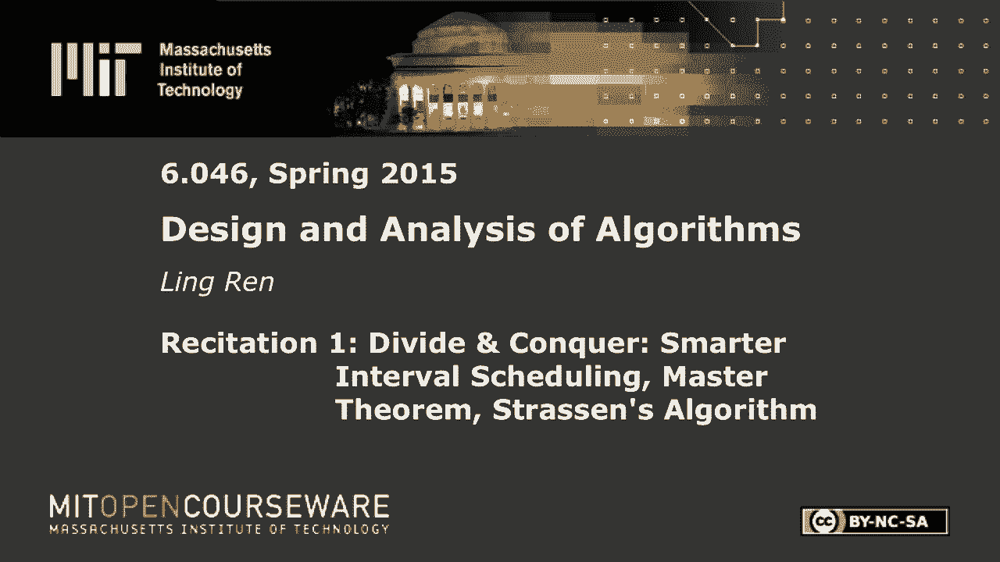

# 【双语字幕+资料下载】MIT 6.046J ｜ 数据结构与算法设计(2015·完整版) - P3：R1. 矩阵乘法与主定理 - ShowMeAI - BV1sf4y1H7vb

以下内容是根据知识共享许可提供的，您的支持将有助于麻省理工学院开放课件。

继续免费提供优质教育资源。

捐赠或查看麻省理工学院数百门课程中的额外材料。

所有的权利，欢迎大家，这是六号，哦四六背诵，只要确保你在正确的地方，我叫林仁，我是这个班的十名助教之一，我们这部分有第二层，我想他现在不在，但基本上Shkan和我每隔一周就会换一次，我想提醒你。

这一节是如何录制的，目的，但我想他也是，他只是在录我们，他不会的助教，是啊，是啊，不是你，你不在摄像机里，好的，所有的权利，所以我们来这里的唯一目的是帮助你学习这个非常有趣的东西，也是非常有用的类。

所以不要犹豫，问任何问题或给我们任何反馈，比如我是开得太快还是太慢，你是否想让我们报道一些不在张贴的时间表中的事情，或者是的，只是任何事情或任何事情，我们可以帮忙好吧，所以让我们开始吧。

本周的两节课在第一周，专注于分而治之，它是一类算法，通常在算法描述中涉及递归，算法，包括加权，间隔，调度，和一堆其他人，他留下了几个悬而未决的问题，所以我们将在本节回答这些开放的问题。

我们还向您展示了一个新的算法，并分析一堆其他算法，所以只是为了提醒大家我们做了什么，间隔调度是，在这个问题上，我们得到了一堆请求，每个都有开始时间和结束时间，我们的目标是找到一个兼容的子集。

意思是它们不重叠，综合重量最大的，大家都清楚这一点，所以一个更容易的情况是当问题不加权时，意味着你能想到的每一项任务都有相同的分量，在这种情况下，我们可以用贪婪算法来解决它，但是当问题变得加权时。

我们必须使用动态编程或递归，sri引入了一个简单的，类中的基本版本，有人能提醒我们那个算法是如何工作的吗，为下一次选择其他时间，你能说大声点吗？我们为下一次选择了最早的完成时间，所以我们发现下一个在。

话说回来就是这样，我是的，我想你描述的版本是针对未加权的情况的，在未加权的情况下，我们刚刚安排了最早的，完成时间最早的，然后我们把所有不兼容的都去掉，我们继续向右走，解决了未加权版本，如果是加权版本。

我们需要使用递归，记住我们把问题分成许多子问题，每一个都可能是最优的解决方案，有人记得吗，1。你能试试看吗？所以我们进入了一些问题，这是从某个特定的最佳解决方案，然后我们计算出这就是问题所在。

从所有不同的完成时间开始，我们发现最大的，你叫什么名字？我是说，你的艾米是什么，我是说，我是说，好的，我是说让我们把每个人都当成我们的潜力，所以如果我设置，如果我，如果我们选择，请求j作为我们的第一个。

我们得到它的重量，然后我们要解决一个子问题，所以让我把我们在调度中做的原始问题称为，所有传入的请求现在我们选择j请求作为第一个，现在我们剩下一个子问题，在请求后开始，j完成，所以我会把它写成RJ。

其中我将RJ定义为请求集，比第j次请求的完成时间，好的，只是为了重复，我们选择的请求有潜力，可能是第一个请求，然后我们查看之后开始的所有请求，并解决该案例的一个子问题，然后我们取一个最大值。

在我们所有的候选人中，这将给我们最优解，关于这个算法有什么问题吗，好的，所以这个算法在n平方时间内运行，现在我们将尝试优化它并想出一个更好的算法，为了改善任何事情，我们首先要找出这个算法中的低效之处。

你认为算法中的哪一部分是低效的或愚蠢的不必要的，继续，这样对前面的每个子问题都很有效，当试图寻找，所以说，你想找的，我是说我们不需要把每个案子都查一遍，是啊，是啊，是啊，是啊，我们应该什么。

我们应该能够有效地查询，右一，好的，我认为你完全正确，让我来看看这个算法是做什么的，就会更清楚，所以这意味着，我会选择我的，我会选择第一个请求，请求一个作为我的第一个请求。

那么我将只考虑一个结束后开始的请求，对呀，只剩下五个请求了，可能还有其他一些，我没有在那里画画，那是我的第一个候选人，我的第二个候选人是，我选择请求二作为我的第一个请求，然后我不得不删除请求一个。

因为它开始得太早了，然后我就剩下所有剩下的请求了，我会以候选人二候选人三的身份解决那个子问题，我选择请求这三个作为我的第一个请求，然后我得去掉一个和两个因为它们开始得太早了，哦也是四个，也开始得太早了。

就在三次结束前，我一直在跟踪，所以我们只剩下剩下剩下的请求了，然后我的意思是，如果你从三个开始，那实际上是二的子问题，所以你看到你做了很多额外的工作，伟大的观点，你叫什么名字？安德鲁。

安德鲁说我们有可能解决许多重复的子问题，因为耶，我们绝对不想那样做，这实际上是核心思想，动态编程的一个清晰的想法，安德鲁，你能告诉我动态编程的定义吗？我不记得有人记得，去吧，你可以记住一些问题。

然后准确地查找它们，所以动态编程说我们将解决一个问题，把一个问题变成子问题，和子问题变成更多的子问题，但每当我们解决一个，我们应该记住或者只是记住它的结果并把它储存在某个地方，如果你还需要。

我们只是取回它而不解决问题，这绝对是一个很好的观点，所以我们可以分析一下，这个算法后面的复杂度，因为我想先谈谈这个更有效的算法，我们会看到即使在安德鲁的优化之后，它的运行时是n平方，所以没有那个观察。

如果我们在解决重复的子问题，会比那糟糕得多，想要什么，只是耶，去吧，你也可以修剪到同一个地方的，因此您可以用于两个路径，嗯嗯，再次抱歉，你不需要探索两条路，我喜欢探索和三次一次，你曾经，他们都在看三个。

那么你只需要做一个更有效的，好的，酷，去吧，哦，你说的事情，我们再加一个，也是，我想比那个广场更好，我想我们需要对此进行观察，所以如果你，如果你决定在第一个间隔中按一定的间隔顺序。

然后你想看看如何从那里计算，嗯，以后开始总是有效的，那么也许你必须这样做，所以这意味着我们可以，如果我们能有效地从任何特定的点开始，查询最大值，在那之后的任何所谓的开始，好的，伟大，是啊，是啊。

我想我们意见一致，所以说，当我描述这个算法的步骤时，记住第一个，第三个候选人，我选择这作为我的第一个权利，这毫无意义，因为如果我那样做了，我还不如放两个，不伤害权利，每个人都明白，所以是的。

这个想法是我们不应该千方百计，有些请求只是更好，更适合成为第一个请求，以及我们将如何做到这一点，所以很明显，一个可能是第一个请求，两个也可以，但这使得之后的任何请求都没有任何意义，因为，是啊，是啊。

因为之前有一个请求，对所以，按开始时间对它们进行排序，我们将考虑提前到来的请求，所以我有我的整个问题在这里，现在我要问一个问题，我是否应该在我的解决方案中包括请求一个，那只是两例。

所以如果我不在我的解决方案中选择一个，我还剩下什么子问题，有什么想法吗，如果我决定在我的解决方案中不包括一个，因为它确实如此，哪里都没有冲突，我将解一个从2到N的子问题。

如果我决定把我的请求放在解决方案中的一个，我有这个体重，那么我剩下的子问题是什么，是啊，是啊，在这个例子中是五个正确的，但更普遍的是，找到RJ的方法，这样每个精确开始的请求，完成后开始的每个请求。

现在突然间，我们没有把原来的问题分解成n个子问题，我们只有两个子问题，所以让我画一个递归树，这是分析这些事情的有力工具，所以我们从最初的问题开始，从1到n，我们有两个子问题，二到n和r，一到n。

这个也会把它们分解成子问题，那么这个是什么，好的，我有我的潜艇问题，二到n，我需要进一步回答同样的技巧，是独生子女，对不起，这是这是两箱，要么我安排，要么，我没有安排我的第一个或我安排它。

这是我的第一个请求，就在这里，我就剩下这个问题了，要么我没有安排，要么我安排它作为我的第一个请求，那么这个是什么，在这三个中，三和三，二N好的，因为现在我问两个人同样的问题，在这里，我将有R 2到N。

等等，等等，现在让我指出这个版本和基本版本的最大区别，所以我从第一个开始的请求开始，如果我不这么做，说，如果我在这里问五个人的问题，我是否安排五个作为我的第一个，然后会发生什么。

这两个分支并不涵盖所有的情况，对，因为我可能会安排它，但不是我在最优解中的第一个，如果我问一个随机请求的问题，然而，如果我先从第一个请求开始，意味着它开始得最早，它要么不被安排，要么被安排，作为第一个。

因为它不能是我解决方案中的第二个请求，关于这个算法有什么问题吗，好的，现在这是算法，让我们分析一下它的复杂性，那么总体复杂度是多少，当我们一路向下，解决整个原来的问题，你觉得怎么样，去吧，应该登录。

因为我们要排序，下一个间隔开始，饰面，好的，因为第一步是排序，也就是n log n，我需要回答的问题是，在整个递归树中有多少唯一的子问题，所以我不会把同样的问题解决两次，这里有多少独特的问题。

它们的末端就在左边的树枝上，好的，所有其他人都将是这些权利中的一个，所以我可以从底部开始，从树底往上爬，当我说什么时候我想去这个，把这一步，我会在其中一个子问题中查找这个问题的结果，我已经解决了。

所以实际上递归本身，我错过了你的问题。排序指的是什么，好的，所以我们需要从开始的请求开始，首先，我们需要决定是否安排时间。然后我们需要对这个请求做同样的事情，是最早的，此子集中的请求，对于所有的子问题。

我们总是需要这样做，所以整体的复杂性是，n log n，但是如果我们只关注这个递归步骤，我们的进步实际上比这更大，因为它从一个正方形，n的全部，那么为什么原始算法n的平方，我想它也只有N个独特的子问题。

对呀，那么你同意最初的算法是n的平方吗，还是你认为这也是所有的N，只需关注递归步骤，在算法中，你解决一些问题多达N次，所以这就是为什么它仍然是我们的红方，因为你解决了同样的事情，但假设我不这么做。

假设当我看到它的时候，我把结果存储在某个地方，我直接得到了，好的，假设我这么做了，有多复杂，去吧，嗯哼，你以为就这样了吗，所以有人认为它是n的平方，因为我认为3是n的平方，就像这样，我想原来的型号不在。

因为我们仍然对每个子问题都做得完全正确，所以这里，每当我们走上一步，我在做固定数量的工作，我只是比较两个数字，取最大值，然而，在原来的算法中，就在这里，每当我想更上一层楼，这棵树有N根树枝。

所以我的总工作量是一加二加三加，当我往上走的时候，每一步都变得更加艰难，这是n平方，对此有什么问题吗，好的，我们的加权间隔调度到此为止，我要转到下一个话题，所以这边有什么问题，一般情况下，对于调度问题。

你有问题吗，否，好的，是的，现在，让我们转向本节的第二个主题，就是强调算法，Strassan算法是一种有效的矩阵乘法算法，矩阵乘法是一个非常有用的原语，或者它几乎在每个领域都有应用。

就像我能想到的电路模拟，模拟，气候模拟与物理，基本上现在我对矩阵乘法有一些经验，因为我本科的研究是改进矩阵算法，实际上很多矩阵算法，包括，像反演解方程，他们都用乘法作为原语。

所以它实际上归结为改进矩阵乘法，我很努力地优化这个基本的矩阵乘法，我们划船，你拿一个专栏，然后你就会得到这个位置的答案，每个人都很熟悉，对呀，我很努力，但它仍然比最好的算法慢一百倍，所以我终于查了一下。

当我知道矩阵算法的复杂度不是立方的时候，我完全被吓了一跳，它实际上比那个小，这对以前的任何人来说都是一个惊喜吗，更有效的算法使用的技术正是Straan算法，既然我们在讨论分而治之。

你可以猜到这一定是一个分而治之的算法，所以有人知道如何划分最初的问题吗，想给它，试试看，你熟悉平铺矩阵乘法或阻塞矩阵乘法吗，好的，你能告诉我们那是什么吗，是啊，是啊，你可以把它掰成，好的，酷，所以说。

这是我们的A和B，我们想要C，我们可以把每个矩阵分成四部分，我把这叫做一对一，一二一一二二一，一b一二b二一b二，我想有人告诉我什么是C，在这种情况下，那是一种方法，一二，b二一，是啊，是啊。

C一二就是大声说出来，别害羞，这也是我一生中教背诵的第一个部分，我比你们还紧张，你说呢一二，一二，b二二，所以规则和矩阵乘法之前一样，我们把这一排，本专栏，它给了我们这个，一二，b二一，一个一个，好吧。

同样的事情，c二一，我们取这一行和这一列，一个二一，b一个一个，加一个二二二二一，c，two，two等于a，two，one，two，加一二二二二二，每个人都明白这一点好的很好。

所以现在我们把原来的问题分成了几个子问题，我们只需要在这里做八次矩阵乘法，每个矩阵的大小是一半，如果原始算法在魁北克，现在每个子问题是半n立方，那我们就有八个，所以复杂度还是立方的，一点进步都没有。

所以实际上更准确地说，我们应该知道，因为我们可以进一步把这些矩阵分解成更小的块，所以准确地说，复杂性应该由递归给出，八个子问题，每个都是一半大小，另外，有人能告诉我合并的复杂性是什么吗。

一旦我得到了这一切，或者，去吧，只要通过它，因为你是，是啊，是啊，因为我在添加，它是恒定的吗，是啊，是啊，对于基本情况当然是常数，所以好吧，所以也许我不清楚这一点，在这种情况下，子问题是这样的。

所以这是我解决后要解决的八个子问题，我需要把它们加在一起，每个都是n的一半，复杂度是，以获得精确的复杂性，我们应该解决这个递归，但它最终会和这个直觉和立方是一样的，好的，所以现在。

这就是魔法所以斯特拉森在1969年提出了这个算法，这个平方可能是如果有，每一个都是一个2。5 n乘0。5 n的矩阵，好的，所以草莓想出了这个算法，他不知何故定义了M1到M7七个矩阵，用这种方式。

我无法提供任何直觉，因为这不是我想出来的，不知何故，用这七个矩阵，他可以重建，他能计算出C中所有的四个子矩阵，检查它不是很有趣，因为算法肯定是正确的，但让我们只做其中一个，好的，这个怎么样。

所以c2one等于m2加m4，所以有四个，有一个二二减一，所以抵消了，剩下的是2 1 2 1加1 2 2 2 2 1，那是正确答案，所以这是一个，我想是一个非常聪明的算法。

你必须在那个领域工作十年才能想出这个，所以这不是我们关心的，我们的目标是分析这个算法，它的复杂性是什么，那么有人理解这个递归吗，有人能告诉我这部分的递归是什么吗，对于这个Strassan算法。

我们有最初的问题，我们有一些去吧，所以因为从1到7的每一个都只需要一个乘法，我们需要解决一些问题，斯特劳森所做的是他想出了七个矩阵，每一个只需要一个乘法，所以我们有七个子问题而不是八个。

这将给我们带来好处和改进，所以现在的问题变成了，我如何解决这个递归，给定这个递归，我怎么知道它的复杂性和同样的问题，有人想试试吗，所以这将是，在第三个主题中涉及，我能抹去什么，也就是主定理。

所以主定理所做的就是，m/b+的t，其中a和b是常数，它直接告诉你TN是什么，在某些情况下，所以我先把公式写出来，大师定理实际上有三种情况，第一种情况是fn是将n提升到c的顺序。

其中c小于a的log b，那么主定理说它的复杂度是，a的对数p，那么这个复杂度就是求log k加1的方法，你不一定要复制它们，因为你可以在任何地方找到它们，你能想象的第三种情况是另一种。

唯一剩下的FN箱子很大，是欧米茄n，在那里看看c大于log b的地方，一个则主定理说Tn的复杂度是θ，如果FN不是太多的工作，那么基本上就是这个递归，递归给你的，如果FN占优势，FN是最大的组件。

那么tn大约是fn的数量级，中间有一个箱子，现在，让我们看看为什么会这样，我只负责一件案子，所以再一次，我们要画一个递归树，因为这在所有递归问题中都很有用，所以我们从一个大小为n的问题开始。

我们把它们分解成问题大小n除以b，等等等等，这个子问题的大小是多少，使递归表示一类递归算法，每次它打破问题，它将问题的大小减少了b倍，我这里有什么，等等，等等，那么这个图中的a是什么，去吧，三个。

我想3A只是这棵树的一个分支因素，我继续前进，最后我将到达我的基本情况，所以我的下一个问题是，在递归多少级之后，我会到达一号的基本箱吗，好的，因为这里是n/b和b平方，下一个将是立方的，以此类推。

就像说的那样，最后一关是牙齿水平，那么问题的大小是n以上，B提高到T，我们希望它是，常数，那么T是什么，这是递归树，我们有大量的合并工作要做，这里我们必须做FN工作来合并这些，解决我们问题的结果。

我们有f这个级别的合并工作是什么，对于树的这一部分，这是我的问题尺寸，然后就会有正确的，我们有一个，好的，如此等等，这样我们就可以，我们知道什么是TN，让我们列举一下我们要做的所有工作。

所以在第一关我们必须做FN，好的，在第二层，a，b的n，对不起，n除以b，下一级是什么？我们有多少子问题，大声说话方子问题，他们每个人都是，然后除以b的平方，最后我到达了我的，都是基本情况。

所以我提高了他们中的一个，因为我定义T是树的深度，他们中的每一个都是一个的T，我对这个公式不完全满意，因为我这里有一个美丽的图案，除了最后一个人，这是一个加一a和除一b等等等等，所以我要把这个t换成f。

我能那样做吗？因为这是一样的权利，没有一个是常数，f 1也是常数，然后我得到了我美丽的形式，等于零到t，什么是，总数是多少，a提高到i，f，n/b i，每个人都明白。

现在你可以大致理解为什么我们有三个案例，所以让我来处理第一个案例，第一个案例说FN是所有的，对呀，那是什么意思，意思是这个家伙是西格玛A升到N，那么这就是我在F比赛中看到的，好的，这里应该有一个命令。

但凡事都有先后顺序对吧，所以我就省略了，所以其实应该是，这个，所以这个，因为n升到c实际上与这个和无关，我可以把它拔出来，我还剩下什么，对吗？这是一个几何序列的和，我们知道如何解决这个问题。

但我们需要检查这个比率是大于还是大于1，或者如果它等于一，这个比例是多少，这个例子告诉我们c小于a的log b，这意味着如果我，B升到C比B升到这家伙少，这是一种权利。

所以我们知道我们的分母大于我们的分母小于我们的分子，所以这是递增序列，对呀，所以我们得到的是n升到c，然后那个东西，二减一，除以这个，这个东西减一，但它们都是常数，对呀，熟悉这个几何序列公式的人，好的。

所以这就是我们所拥有的，接下来t等于n的log b，是n，那么b升到t等于n，那么我们已经提高到C取消他们，它们抵消了，我们有什么，并确保每个人都在关注，a提高到t，没有问题，好的，让我再来一次，好的。

它实际上是一个提高到T，然后超过bt升到c，对呀，你把这个弄到这里，哦，它是几何级数的和，所以如果我有一加q加q平方加一直到q t，不加一，我猜还是不，我不太记得了，减一，然后q减去一，好的。

我想这应该是T加1，所以这就是我们正在做的，所以这是我们的q减去一，除以q减去一，它们都是常数，所以我不在乎他们，所以A提高到A提高到T，加上这个东西升到c，但是我们说b升b升到t等于n。

所以我们只剩下一个提高到T，t是n的log b，我可以把它写成n的块a，为了熟悉这一点，这意味着n的log a，a的log b，这个我翻转了他们，所以说，所以这是那是什么，那是N。

不完全是因为我在这里有命令，对呀，所以一切都井然有序，如果你只关心点大O，那就没事了，但那个定理说theta，所以你必须用另一种方式来证明它不亚于这一点，好的，我不会那么做的，它不是，接下来不是很难。

我要把这个定理应用到我们剩下的两个问题上，这种复发，我想你还在看那边，那么A是什么，b，C用于此，a是8是2右c是，a的log p是3，这就是主定理的哪种情况，好的，所以定理说。

应该把n升到a的log b，也就是三个，我能请个人来帮我吗？想试一试，去吧，好的，所以我们有，a等于七，b等于二，等于之前的2，现在我们想看看，c，等于2小于a的log b，也就是七个中的第二个。

我很确定情况仍然如此，所以我们应该进入日志，七个中的两个，是啊，是啊，正是这样是的，日志到耶，谢谢。让我们给他来一轮，所以7中的log 2肯定大于2，为什么？因为四个中的两个是对的，所以这恰好是。

并提高到2。88零和许多其他数字，但它比立方还小，只是为了知识的目的，这已经不是最好的了，当它被提议的时候是最好的，那个领域的研究人员已经把它降到了n，提高到了2。35，我想应该是2。37。

然后两点三五，我不是很关注文献，所以现在可能是2。34，好的，所以我应该还有一件事要做，但我想我们快没时间了，很抱歉，我可以发帖，我们最不应该做的就是记住，我们有一个中位数查找算法，我们有复发的地方。

也就是，我想超过五个，我们要解决这个递归，但我们不能正确地应用主定理，显然这不是正确的形式，所以我们有这么多，当主定理不适用时，我们必须逐案研究。让我看看我是否有时间这么做，我想我可能有。

所以为了解决那个案子，首先，谁能告诉我θ的定义是什么？我们必须回到定义来解决这个问题，θ是什么意思，所以说，如果我说fn是theta n，我到底是什么意思，去吧，它被紧紧地束缚着，所以两个都在动。

他们走到两边，所以这意味着我可以找到一些K1和K2，这样，当n变得足够大时，这就成立了，好的，所以现在我们要做一个归纳，假设所有小于大写n的小n都是，我的tn被k 2和k 1所包围。

那么我的下一步是这个大写的t n将是有界的，我先画右边以K 2为界，比如第二项n加上另一个θn，所以我们知道这意味着它被其他数字所限制，我说二，好的，这就是数据的定义，然后我能找到我想这是对不起。

它们都应该是大写的，我希望这个小于k二大写n，所以让我重做第一步，这大概是，k2的5+7除以10k2+n2，加上一堆我不在乎的常数，我希望它比K小，n的两个，我能够得着吗？我当然能对。

如果我选择K2大于我们这里所有的对吧，这是什么，这是九除以十N然后是九除以十，二加二右，所以如果我选择k 2大于，十乘二，当n足够大时，每个人都在里面，tn应该被k 2 n右限定，那是我的，这就是归纳。

我假设当n小于大写n时，我已经解决了，所以我可以用这两个，我看到了下一步，所以有另一面，非常的相似，我不打算经历这些，今天就到这里，简单回顾一下，我们进行了加权调度，加权区间调度。

重点介绍了算法主定理及其应用，一个新递归的案例研究，好的。