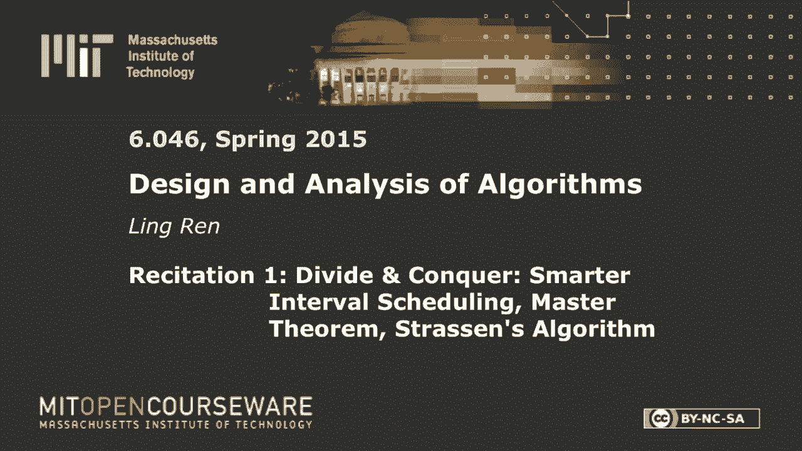
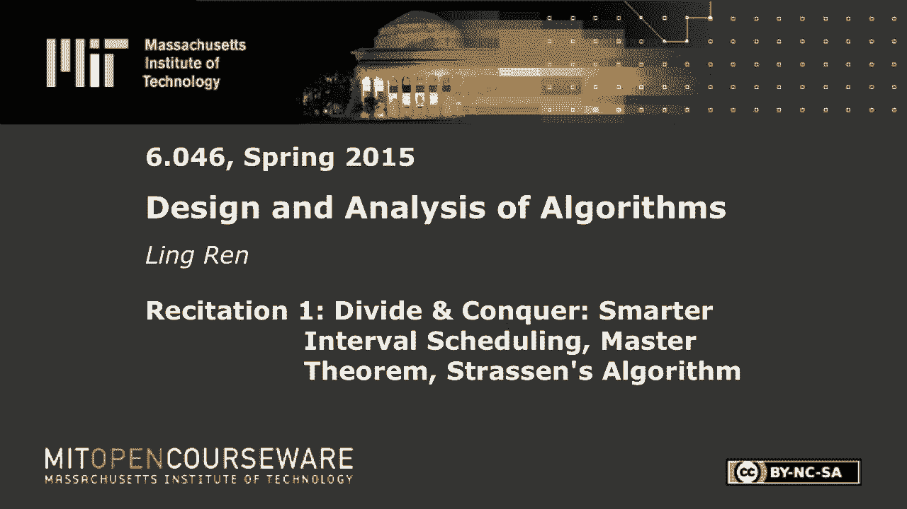
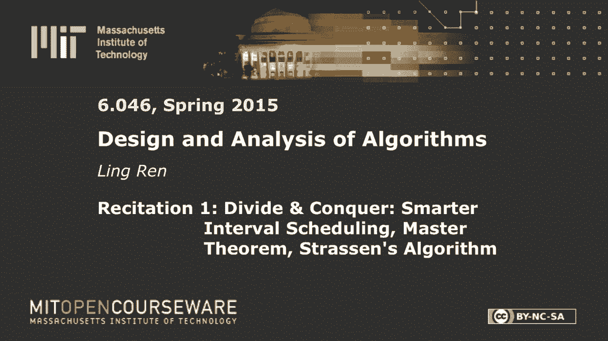
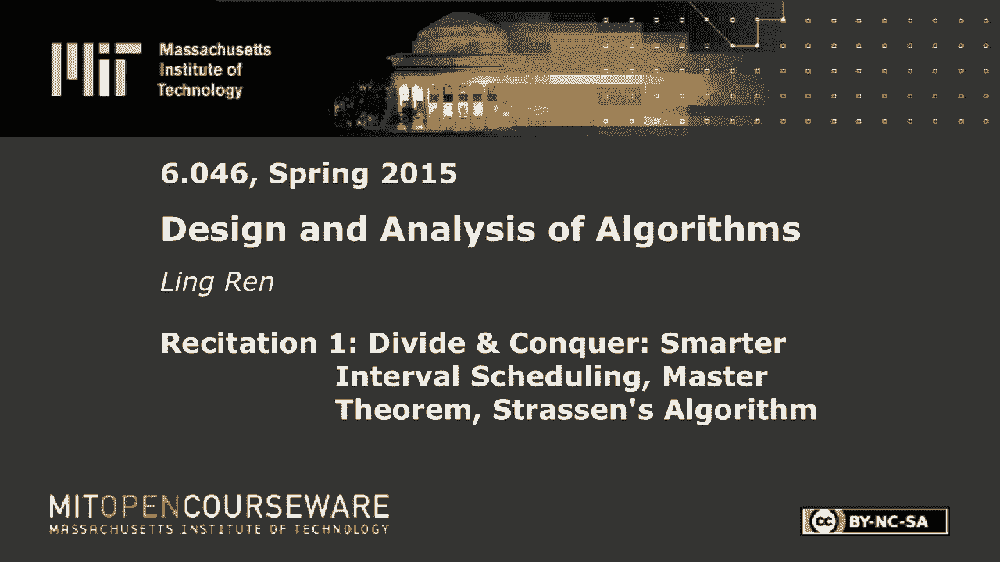

# 数据结构与算法设计：P3：R1. 矩阵乘法与主定理 🧮










在本节课中，我们将学习加权区间调度问题的优化解法、矩阵乘法的斯特拉森算法，以及用于分析递归算法复杂度的强大工具——主定理。

---

## 加权区间调度优化 🗓️

上一节我们介绍了加权区间调度的基本递归解法。本节中，我们来看看如何优化它。

基本递归算法将原问题分解为多个子问题，导致大量重复计算。为了提升效率，我们采用动态规划思想：将已解决的子问题结果存储起来，避免重复计算。

优化算法的核心思路是：**从最早开始的请求入手**。对于最早开始的请求，它只有两种可能：要么被选中（作为解中的第一个请求），要么不被选中。这避免了考虑所有请求作为第一个候选的冗余。

以下是算法的递归关系：
*   如果**不选择**最早开始的请求 `i`，则子问题是请求 `i+1` 到 `n`。
*   如果**选择**请求 `i`，则获得其权重 `w_i`，子问题是所有在 `i` 结束后才开始的请求集合 `R_i`。

通过这种方式，递归树的分支因子从 `n` 降为 `2`。结合记忆化存储，算法的复杂度可以从 `O(n²)` 优化至 `O(n log n)`（排序开销）。

---

## 斯特拉森矩阵乘法算法 ✖️

接下来，我们探讨一个经典的分治算法：斯特拉森矩阵乘法。

标准的矩阵乘法（将矩阵分块计算）复杂度为 `O(n³)`。斯特拉森算法通过巧妙的数学变换，将 `8` 次子矩阵乘法减少为 `7` 次，从而降低了复杂度。

算法将 `n×n` 矩阵 `A` 和 `B` 划分为四个 `n/2 × n/2` 的子块。通过定义 `7` 个特定的矩阵乘积 `M1` 到 `M7`，最终结果矩阵 `C` 的四个子块可以由这 `7` 个矩阵的加减运算组合得到。

以下是 `C` 的一个子块计算示例：
```
C21 = M2 + M4
```
其中 `M2` 和 `M4` 是预先计算好的中间矩阵。

算法的递归式可以表示为：
```
T(n) = 7 * T(n/2) + Θ(n²)
```
这里，`7` 是子问题数量，`n/2` 是子问题规模，`Θ(n²)` 是合并结果（矩阵加减）的代价。

---

## 主定理 📐

为了分析像斯特拉森算法这样的递归算法的复杂度，我们引入主定理。

主定理提供了一种直接求解形如 `T(n) = a * T(n/b) + f(n)` 的递归式复杂度的方法，其中 `a ≥ 1`, `b > 1`。

以下是主定理的三种主要情况：

1.  **情况一**：如果 `f(n) = O(n^c)`，且 `c < log_b(a)`，则 `T(n) = Θ(n^{log_b(a)})`。
2.  **情况二**：如果 `f(n) = Θ(n^{log_b(a)} * log^k n)`，则 `T(n) = Θ(n^{log_b(a)} * log^{k+1} n)`。
3.  **情况三**：如果 `f(n) = Ω(n^c)`，且 `c > log_b(a)`，同时满足正则条件 `a * f(n/b) ≤ k * f(n)` (对于某个 `k<1`)，则 `T(n) = Θ(f(n))`。

**直观理解**：比较递归树中叶子节点总工作量 `n^{log_b(a)}` 与根节点合并工作量 `f(n)` 的阶数。谁占主导，总复杂度就趋向于谁。

---

## 应用主定理 🔍

现在，我们应用主定理分析之前的算法。

*   **标准分块矩阵乘法**：递归式为 `T(n) = 8 * T(n/2) + Θ(n²)`。
    *   `a=8`, `b=2`, `log_b(a)=log_2(8)=3`。
    *   `f(n)=n²`，即 `c=2`。
    *   `c=2 < log_b(a)=3`，属于**情况一**。
    *   因此，`T(n) = Θ(n^{log_2(8)}) = Θ(n³)`。

*   **斯特拉森算法**：递归式为 `T(n) = 7 * T(n/2) + Θ(n²)`。
    *   `a=7`, `b=2`, `log_b(a)=log_2(7)≈2.81`。
    *   `f(n)=n²`，即 `c=2`。
    *   `c=2 < log_b(a)≈2.81`，属于**情况一**。
    *   因此，`T(n) = Θ(n^{log_2(7)}) ≈ Θ(n^{2.81})`，优于立方复杂度。

---

## 主定理不适用的递归案例 📝

最后，我们看一个主定理不能直接应用的递归式，例如中位数查找算法中的：`T(n) = T(n/5) + T(7n/10) + Θ(n)`。

对于这类问题，我们需要回归到复杂度的定义，使用**代入法**进行归纳证明。

1.  **假设**：对于所有小于 `n` 的规模，有 `T(k) ≤ C * k` 成立（上界）。
2.  **推导**：
    ```
    T(n) = T(n/5) + T(7n/10) + Θ(n)
         ≤ C*(n/5) + C*(7n/10) + D*n  （根据假设和Θ定义）
         = (9C/10 + D) * n
    ```
3.  **完成归纳**：选择足够大的常数 `C`，使得 `(9C/10 + D) ≤ C`，即可证明 `T(n) = O(n)`。下界 `T(n) = Ω(n)` 的证明类似。

---

## 总结 🎯

本节课中我们一起学习了：
1.  **加权区间调度**的优化动态规划解法，通过改变决策顺序（从最早请求开始）和记忆化，将复杂度优化至 `O(n log n)`。
2.  **斯特拉森矩阵乘法**，一个巧妙的分治算法，通过减少子问题数量（从8个到7个）实现了优于 `O(n³)` 的复杂度。
3.  **主定理**，一个强大的工具，用于快速求解形式规范的递归式的渐近复杂度。
4.  当递归式不符合主定理标准形式时，可以使用**代入法**进行归纳证明来分析复杂度。

这些知识是设计和分析高效算法的重要基础。