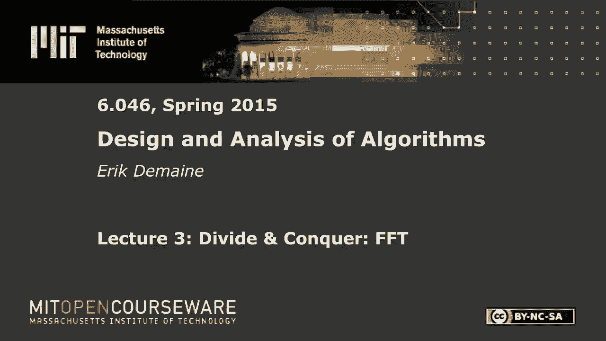
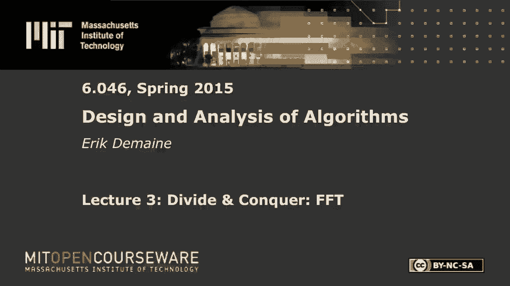

# 【双语字幕+资料下载】MIT 6.046J ｜ 数据结构与算法设计(2015·完整版) - P4：L3- 分治：快速傅里叶变换 - ShowMeAI - BV1sf4y1H7vb

以下内容是根据知识共享许可提供的，您的支持将有助于麻省理工学院开放课件。

继续免费提供优质教育资源。

捐赠或查看麻省理工学院数百门课程中的额外材料。

所有的权利，让我们开始吧，我是埃里克·域，你可以叫我埃里克，今天我们要做另一个分而治之的算法，称为快速傅里叶变换，这可能是麻省理工学院教授最多的算法，它在各种上下文中都有使用。

尤其是像MP3压缩这样的数字信号处理，各种各样的东西，但我们今天要考虑一下，在分而治之和多项式的背景下，让我提醒你，我是说这堂课都是关于多项式时间的，但通常是多项式时间，我们只关心领先期，今天。

只是差不多，我们将考虑多项式中的所有项，所以我将讨论多项式，主要是A和B，你有一个常数项，然后一个线性项，和二次项，等等，至多，我会说有N个术语，也就是说最后一个是一个，n减去一。

所以通常多项式的次数是n-1，我希望学位在这里定义为n，但不管那是什么，我不能改变代数中的定义，所以这是传统的代数方法来思考多项式，当然你可以用求和符号来写，a k x对k，好的，等于0到n减去1。

我们会在它们之间跳来跳去，我还将介绍一个多项式的向量表示法，所以AIS是实数，通常我们可能会在某个时候改变这一点，嗯，但通常是一个常见的原因，也许你不太关心多项式，但你肯定关心向量。

任何一种一维数据集都是一串实数，就像，如果你在采样音频，就像现在我们正在录制这个麦克风，你看到了很多不同的，随着时间的推移，膜在麦克风中的运动，你在取样，随便啦，每秒四万次。

每一个你都在测量一个关于那个东西在哪里的实数，这是一个实数序列，现在你可以把它转换成一个多项式，如果你想，它们是一回事，x在这里不一定有意义，我们真的很关心其他系数，好的，现在，给定这样的多项式。

有三件典型的事情我们想做，所以说，这些是多项式上的运算，我马上就会说我们为什么要做，所以最明显的一个，如果你真的关心X是某种评估，所以也许我给你一个多项式，x的a，我给你一个数字，我们叫它x零。

我想计算x零的a是多少，所以如果我插入X，这里有一个一般变量，但如果我给你一个真实的数字，对x说，那加起来是什么好的，那么在我们进行其他操作之前，你如何解决评估问题，所以说，我是说，有一个明显的方法。

你知道吗，你计算所有的项并把它们加起来，但是如果你天真地计算，嗯，这是这种形式，也许计算x到k，可能需要k次乘法，所以总运行时间是二次的，但我们可以做得更好，我知道现在是上午11点太早了，但是。

你已经把x计算到i，x加一个接一个好，一旦你把x计算到k，你可以用一次乘法把x计算成k加一in，所以你可以在线性时间内计算所有x到末端，然后做所有的，然后呢，你基本上是在x到k之间做一个点积，和A向量。

这是做这件事的一种方法，有一种稍微圆滑的写法，叫做霍纳法则，但它在做和你说的完全一样的事情，这是一个，这只是一种很好的代数书写方式，x的a等于零加，x乘以一加，x乘以2+以此类推，x乘以减一。

然后很多近括号，所以这当然等价于分配律的表达，这基本上是一次做一个x的x乘积，所以这显然是n阶加法和乘法，所以我们在这节课中得到了N次订单，时间是算术运算的次数，这是我们的模型。

假设与实数相乘或相加需要恒定的时间，很酷，所以评估很容易，今天的线性时间很好，二次不好，我们要打败二次方，好的，用多项式做的第二件事就是把它们加起来，第三件事乘以，所以我们得到了两个多项式。

x的a和x的b，我们想计算一个新的多项式，x的c，这就是总和，现在，如何定义求和，嗯，对于所有的x，你希望x的c等于x的a加上x的b，这就是定义，当然我们也可以用代数来做，因为这些是任意x的最后数字。

这计算为一个数字，所以如果我们加上两个这种形式的多项式，有a的就是有b的，我们所做的就是添加相应的ais和b，所以这很容易，我们只需要c-k等于a-k加上b-k对所有k，所以再一次，线性时间没问题。

第三个手术是令人兴奋的，很难变好的那个，否则这堂课再过几分钟就结束了，乘法相同，我们给出x的a和x的b，我们想把它转换成x的c，对于所有x计算为这两个多项式的乘积，我们怎么做。

我们不能只把相应的AKS和BKS相乘，事实上，如果你拿这么大的东西，你把它乘以相应的大东西，让我们做吧，这看起来不好玩，我们得到了，让我们看看，所以常数项就是乘积，那很容易，常数项。

但如果我拿了这个产品或这个产品，我得到线性项，所以它将是一个1 b 0加一个0 b乘以x，然后有一个二次项，我从，这个这个这个，所以有三件事乘以x的平方，这就是我厌倦的地方，我要切换到求和符号。

我没上过高中，但我想在高中代数，你学会了这个，k是j等于零的和，那是一般的形式，因为AJ是从X到J项，bk减去j是从x到k减去j的项，当你把这些相乘在一起的时候，你得到x到k，这是x对k的系数。

这就是我们要计算的，给定a和b，我们要计算这个多项式c，需要多长时间，如果你对所有k都这样做，那么计算第k项是有序的，所以总时间是n的平方，所以这对这堂课不好，我们想做得更好，事实上，今天我们将实现。

n中的多项式乘法，为什么我们关心多项式乘法，因为它等价于另一个运算，我们在数字信号处理中一直使用它，图像编辑，各种各样不同的东西，也就是卷积，卷积通常被认为是对向量的运算，记住这个矢量表示法。

我们只考虑系数，x是不相关的，只是想着一系列实数，所以也许A的实数序列代表了一些，我不知道波形，也许这就是音频，我现在说话，然后我在这里取一些其他的波形，我有一个高斯函数，对我的我们，x平方。

我想把这个高斯的所有可能的变化，我想计算黑板和纸之间的点积，好的，这是某种平滑函数，如果我想清理噪音或类似的东西，你可以在二维图像上做同样的事情，想起来有点难，但是你可以把二维图像映射到一维向量。

你有一个二维高斯，如果你在Photoshop中做高斯模糊，这就是你正在做的卷积，它习惯了喜欢，就像你假装你的镜头失焦了，当你这样做的时候，它是在音频处理和各种各样的事情上完成的，所以正式地说。

你有两个向量，你想把一个向量的所有可能的位移，把这个点积和另一个点积，我已经写下来了，我只是点积，和内积一样，也就是把对应的位置相乘相加，如果你忽略这个减号，这正是它的作用，这是AJ对BK，假装是加j。

这就是bj向量，但是在所有可能的班次k下，我们为所有K计算这个，这真的很酷，我们将在n log n时间内计算它，b的所有不同的n移位都将与a的点积，有点神奇，因为看起来你在做n的平方功。

但我们会在n log n时间内完成，唯一的问题是我们必须反转b，然后减号变成加号，有一些边界条件，但基本上是一样的，如果我们能解多项式乘法，我们可以解卷积，所以这就是为什么我们关心乘法。

那么我们该怎么解决这个问题呢，我想说的是多项式的交替表示，接下来我们做了手术，让我们来谈谈不同的表示，所以我们讨论了这一个表示，这是表示多项式的一种方法，但它不是唯一的，你可能知道，其他。

所以一方面我们有一个，这样我们就可以写下AIS，这只是表示多项式的一种方法，有人能给我另一种表示多项式的方法吗，心中有两条路，所以是的，生成生成函数是不一样的，哦，我猜，原则上。

你可以想象在生成函数上写一个递推什么的，总的来说，这似乎是合理的，生成函数是多项式，如果你知道他们很酷，所以它还没有完全回答这个问题，点表示，是啊，是啊，我叫它们样品，我把它写在c下面，一堆样本。

多项式上的一堆点，就像X，k，我们需要多少，我想N减去1就可以了，我们会检查是的，如果我们被告知xk的a等于yk，我们被告知所有的x k都是不同的，那么这就唯一地决定了多项式，如果你有学位。

n减去一个多项式，你有N个样本，只有一个多项式穿过所有这些点，那是，这是代数基本定理的一个结果，它给了你唯一性的存在性，我想在1718年的流派中得到了证明，很久以前，这很好，这就是我们要用的。

还有另一个答案，我应该给你一个飞盘，首先，我太激动了，等我打你，别那么激动，Roots是我在寻找的另一个答案，但在算法上不会那么好，我们会看到对不起，这样我就可以给你一系列的单词，这是代数的基本定理。

每个多项式都是由它的根集唯一确定的，如果允许具有多重性的根，那么每个n次多项式正好有n个根，所以这将是一个从r1到rn减去1的序列，多项式会给出，因为你实际上需要一个常数乘数，但是x减去r0。

x减去r 1，那将是多项式，根的问题是，如果我给你一个系数向量，我想计算根，不仅很难做到，在我们的模型中这是不可能的，如果你只被允许添加，减去，乘法除法，取平方根，取k根，没有办法解五次或更大的多项式。

你知道有一个二次公式，立方公式，皮层公式，没有五次公式，这是一个旧的结果，一千八百，所以从系数向量到根需要无限的时间，不是很好，尤其是如果我们考虑我们的行动，加法变得非常困难，乘法很容易。

如果我必须多项式表示为根的序列，所以我想把它们相乘，那只是把向量串联起来，取根列表的向量的并集，所以这很酷，乘以C，我想是的，但是加法真的很难，因为加法基本上是关于系数向量的，然后一旦你去了那里。

你可以从根到系数因子，把它们加起来，但根部之间没有关系，一些多项式与原始多项式的根，所以我不能肯定那是不可能的，绝对是非常非常难的，可能不可能，这些表示中的每一种都有一些优点，在这三个操作方面的劣势。

所以一方面，我们有我们关心的算法，在另一个轴上，我们有我们的表示，它们是系数向量，和样品，你一会儿就会明白我为什么选择这个顺序，它形成了一个漂亮的矩阵，所以说，我们已经讨论了这个矩阵中的几乎每个细胞。

但让我总结一下，所以我们一开始只考虑系数，向量和评价是线性时间，加法为线性时间，到目前为止乘法是二次的，虽然我们的目标是为根做n log n，我刚才说乘法很容易，那是线性时间，加法真的很难，评价。

我想那是线性时间，事实上，它是这样写的，你只有线性的减法和乘法，所以很容易评估，然后是样本向量，我们还没怎么讨论过，所以这个想法是假设你有两个多项式，用同样的X案例，我们所需要的就是它们是不同的。

所以xk可以等于k，比如说，只是一堆整数，然后我们被告知多项式a在每个xk处的计算结果，我们被告知多项式b在每个xk处的计算结果，所以我们得到了一些y ks和zks，然后我们要计算。

说这两个向量的和或乘积，我们该怎么做，只需将相应的y相加或相乘，k和z情况，对呀，因为如果我们被告知我们希望x的c等于x的a，乘以x的b或x的c等于x的a，对所有x加上x的b，嗯。

现在我们知道我们关心什么X了，我们只是在X案子上做，这就是我们被告知的a和b，所以要计算xk的c，它只是y k和zk的和或乘积，好的，所以乘法在示例视图中真的很容易，这就是为什么我们要使用这个视图。

我们还将使用这个视图，因为我们会看到，有一个问题，加法很容易，乘法很容易，我可以计算x k的a，或者对于任意k，在xk处x的a，但我不能在某个时候评估它，在x的某个任意值下，好的，真烦人。

我被告知这些有限的样本点，但现在我必须以某种方式插值，这叫做多项式插值，在数值分析等方面研究得很好，你可以做到，但一般需要二次的时间，最著名的算法是二次的，这很糟糕，这很糟糕，这很糟糕。

我们现在想要的是最好的，这个真的很难用，因为转换成根是不可能的，在我们的算术模型中是不可能的，所以我们将重点讨论A列和C列，我们喜欢取这两列的最小值，我们不会完全明白的。

我们将得到一个在这两种表示之间转换的算法，在n log n时间内，它不是很线性，但很接近，一旦我们能做到这一点，如果我们想把系数域中的两个东西相乘，我们可以转换为样本地，在线性时间内完成，然后转换回来。

这就是我们将要报道的神奇转变，它被称为快速傅立叶传输，快速傅里叶变换是算法，离散傅里叶变换是指，所以游戏的全部名称是从系数表示转换到样本，反之亦然，原来他们几乎是一样的，不过。

在下课之前的很长一段时间里，这一点都不会明显，在我们进行之前，有什么问题吗？我们为什么不计算A和B，如果我想，我们马上就到，但如果我想繁殖，而且在样本地很容易做到，我为什么不把A和B取样。

然后把它们相乘呢？这是正确的，但事实上，取样不是那么容易，它需要二次的时间，我们现在就去那里，因为我们有N个样品要做，每一个都需要线性时间，记住计算多项式需要线性时间。

如果你想把它想象成一个进入矩阵的矩阵，然后我们得到一个大矩阵，所以我们有X眼，我们只想计算一个给定的多项式，其系数为零，一个1，二减一，我们的目标是计算y iy0，你一个，y2到yn减去1，所以你可以。

如果你知道一个矩阵向量乘积，你把这一行和那一列，您将相应条目相乘的点积，你得到y零，这就是多项式求值的定义，我只是要写一堆这些行，你得到了模式，好的，这叫做范德蒙德矩阵，我叫它V，和一般情况下。

没有地方放，这样，一般来说，如果我们看看V ij，只是抱歉，你可能注意到我不是用字母I，我们一会儿就会知道为什么，这将是x乘j的次方k，那是矩阵上的供应商，我们可以用二次时间计算，有二次项。

我们可以用前面建议的技巧，用x j乘以前一项计算每一项，然后我们要计算这个矩阵向量积，你可以很明显地在二次时间内做到这一点，只是相应地计算每一件事，这是你能做的最好的事情，没有任何进一步的假设。

所以这需要，如果我想计算这个乘积，这就是样本系数问题，这和计算v乘以a向量是一样的，这是一个矩阵向量乘法，需要n的平方时间，好的，另一方面，所以这是个问题，因为我们试图打败二次乘法。

所以如果我们花二次时间在这里转换，不管这是线性时间，有两个问题，一个是转换成本太高，另一个是我们还不知道如何向后转换，但是这个矩阵视图也给了我们逆变换，如果我们想转换样本。

我知道的最好的符号来自Matlab，有多少人知道，一堆，所以对你来说，它是v反斜杠a，但通常在线性代数中，如1806，你看你有，你有一些矩阵，v乘以某个未知向量，这里通常叫X，它叫做，你知道右手边。

你想解决这个问题，你是怎么做的，乘以逆，是啊，是啊，在计算机科学中你是怎么做到的，高斯消去法在这里是正确的答案，但是高斯消去法将是解决线性系统的标准方法，就像高斯消去法的问题，它需要立方时间。

它是正常的形式，在这种情况下，它有点特别，因为这个矩阵本质上是固定的，X眼不需要改变，这样我们就可以，在这种情况下，先计算逆更好一点，所以我们也可以从数值分析的角度来做v的逆乘以a，这很糟糕。

但是别担心，就目前而言，我们今天要得到一个更好的算法，无论如何，它根本不涉及矩阵，但好的是，如果计算需要n个立方时间的逆，但你只需要做一次，所以说，如果你要这样做很多次。

你可以在n的平方时间内做这个乘积，你只需要一劳永逸地保持v逆，好的很好，所以我们有二次算法在这些表示之间来回，这至少告诉我们这是可行的，但是我们，当然啦，需要比二次乘法更好的改进朴素乘法算法。

所以这就是我们要做的，2。大体上来说，我们已经做得很好了，但我们有一个自由，也就是，我们对X案只字未提，我们可以选择他们成为任何，我们希望他们是，我一直在说XK等于K，那看起来很好。

这其实是个很糟糕的选择，因为一个原因，我们将得到，但有一个选择，神奇的是，这个转变变得很容易，在我们到达之前，你可以在n log n时间内完成，我想给你一些动力，让你知道这是如何工作的，正如你所料。

即使只是从n log n运行时间，我们将使用分而治之，所以让我们想想分而治之是如何工作的，我要告诉你一个想法，然后我们会弄清楚这个想法目前是如何运作的，它现在不起作用，但是我们可以选择X的情况。

这样它就可以工作了，我的意思是我们要做的是计算这个v乘以a，我要改变信仰，想想回到多项式地，所以我们的目标是计算某个集合中所有x的x的a，x，好的，这是采集一堆样本，所以集合x只是x情况的集合。

但我马上要用递归来改变这个集合，所以我想这个算法的输入是一个多项式，x的a，它是一个固定的大写，我想评估的职位x，那个多项式，这显然比我们试图解决的问题更普遍，我要用分而治之的方法来解决这个问题。

所以在分而治之中，有三个步骤，征服和结合好的，所以让我们从除法开始，这是个好主意，我想说有两种自然的方法来划分矢量，一个在中间，这就是我们在合并排序中一直看到的，和上次的分而治之和凸壳。

但还有另一种方法在这里更有效，也就是偶数项和奇数项，所以我要除以偶数和奇数系数，所以说，让我写下其中一个叫做x的子n，那是个多项式，它将有一半的学位，所以从k等于0到，我在这里写了N。

但我想要n除以2减去1再减去1除以2，a到k的一个东西x到k，所以真的真的我想要的，更容易用矢量表示法书写，我想要所有均匀的条目，好吧，我不会试图弄清楚最后一个是什么，但它大约是n/2左右。

我就写你可以多花点钱，如果你把一个子n定义为零就可以了，n加1等于零，所有这些都是零，那些术语就会消失，所以这里的关键是，我拿偶数条，但我我不是，我这里没有两个K，所有的权利，所以这是零项。

这是一项的x，这是两个项的x，所以x和k之间是有区别的，A减去2K，但我的意思是，只要把它想象成矢量形式，别担心代数，现在我们马上就得担心这件事了，但直觉上，我想做的是从所有AIS的向量中提取。

这两个向量，奇数系数按顺序偶数系数按顺序，但我现在需要组合步骤的代数形式，这应该是2 k加1 x乘k，那是第一步，容易做线性时间，当然啦，嗯，让我们跳到第三步，联合收割机，为了计算x中的a。

从我想做的是，递归计算x的偶数和x的偶数，对于某些值，不会是x和x，会是另一套，让我们想想如何计算x中的a，给出了x的偶数和x的奇数的一些解，这里x的a，我听到喃喃自语，是啊，是啊，x的平方。

紫色的时间到了，得到更好的y x平方，因为我们有这个不匹配，这里，我们有一个亚2K，我们想要x到2k，我们怎么能做得那么好呢，我们可以把x的平方到两个k和x的平方，对不起。

x对k的平方和x对两个k的平方是一样的，神奇地，这变成了x的a的偶数项，那是他们的一半，我们对奇怪的做同样的事情，我们就快到了，现在我们有一个子2k加1乘x到2k不加1，那么我怎么才能在一个。

加1乘以x，把整个东西乘以x，然后我得到x的a的所有奇项，我把这些加在一起。我得到x的a，好的，这是我的意思，你可以更仔细地证明这一点，但它有点，那只是代数，看看这是正确的，一旦你有了这个。

它告诉你我需要做的是计算x的偶数，为所有人平方，x和x，所以这是x和x的，有一个给你的循环，所以这需要线性时间，如果我已经知道这个值，我已经知道这个值了，我做一个乘法，一次添加和繁荣，我得到x的a。

我想递归地，我把它叫做你的偶数，对于y在x的平方，x的平方是x中所有数的平方集，好的，所以我改变了我的设置x，我从一个多项式A和一个集合X开始，递归，我在做一个不同的半次多项式，术语数的一半。

但有一套不同的，相同大小的我从x开始，x的平方和x的大小相同，所以让我们试着弄清楚这个算法有多快或多慢，但这是分而治之，那将是我们的金票，其实很简单，但我们还需要另一个技巧，所以我要写一个复发。

现在这种复发取决于两件事，一个是一个中有多少项，我们一直在调用n，另一个是x中有多少个数字，有多少不同的地方，我得计算我的多项式，所以我们有N个，我称之为X的大小，好的，所以分而治之与复发是齐头并进的。

一般来说，你有递归部分，这就是子问题有多大，有多少，有两个子问题，就n而言，它们的大小是n的一半，但就x而言，它们的大小相同，所以说，好吧，两次，因为有两个子问题，大小n大于2的每一个，这里要做的是。

无论做除法步骤要花多少钱，加上它构成的组合步骤有多大，所有非递归的部分，这只是对向量进行分区，线性扫描，线性时间，我们说过，它是每个x的算术运算的常量，所以这花了订单x次，这花了订单N个时间。

现在这又不是一个可以用主方法解决的递归问题，因为它有两个变量，所以通常当你面对这种事情时，你想做信封背面的照片，绘制递归树，很好的方式，所以在根源上，现在我知道最初x等于n，当我开始的时候。

我有n个系数，我有N个不同的职位，我想在，因为这就是我想做的转换，从系数到样本，所以在递归树的根部，我只是要写N个顺序N个工作开始，并进行递归，有两个递归调用，就a而言，两者的大小都大于2。

它们的大小相同，在这两个递归中也称为n，所以实际上这里的线性功就是n和n，然后我们会得到n，n x永远不会下降，所以x始终是n，n的原值，这是一次糟糕的复发，没有对不起，有log n级别，这是好消息。

一旦我们缩小到恒定的大小，当只有一个系数时，我们可以停止，我知道怎么用零来计算多项式，那很容易，所以在底部，在最后一关这里，所以这是高度，log n最后一关只是，又会有一大堆结局，都一样。

这里n是x的原值，因为我们没有改变这一点，有多少个末端，在这下面，两个对log n，也称为n，是啊，是啊，很好，所以我们有，因为我们有log n水平，我们有二元分支，所以它是级别数的两倍，也就是n。

所有这些功仍是n的平方，很明显，我们需要的是让x变小，我也是，右if x if在这个递归中，让我用红色画递归，我想要，如果x变成x/2，这里是唯一的变化，我们需要n和x以完全相同的方式改变。

所以我们可以忘记x，会和N一样，然后我们得到2乘以n除以2，加顺序n看起来很眼熟，这是我们的面包和黄油复发，合并短复发，那是n log n，这就是我们需要做的，不知何故，当我们把集合x转换成x的平方时。

我想让X变小，这一切都有道理吗，让我们考虑一下，基本情况是什么，保持简单，让我们假设基本情况，当i x等于1时，我就当X是，假设我想计算我的A在一，保持简单，如果我，如果我想要x中的两个值怎么办。

所以我想要两个值，但当我把它们平方时，我只有一个值，求解x，负1和1，负数一个和一个可以工作的负数一个和一个，它们是一个右的平方根，负一的平方是一，1的平方是1，每个数字都有两个平方根。

每个数的两个平方根，有趣，所以这意味着，如果我一直求平方根，当我把它们平方的时候，它崩溃了两倍，让我，让我去另一个板，去找一些东西，你们都在期待将要发生的事情，但我要说，x的平方的大小是x除以2的大小。

递归地x平方是折叠的，因为我需要它沿着递归一直工作，或者我需要一个基本情况，也就是x等于1，在x中有一个项，所以我正好从x=项目1开始，不一定是，一个可能是七个，不可能是零，因为零，你不会得到两个数字。

只有零的平方根，好的，所以我撒了一点谎，而不是零，每个数字正好有两个平方根，那么负一的平方根是多少呢？复数，所以如果我取这些人的平方根，我得到i和负，我再一次得到-1和1，好的，那是x等于4的时候。

事实证明，这只适用于2的幂，但是嘿，如果n不是2的次方，四舍五入到2的下一次方，那只伤害了我两倍，复数，好的，过去每次我说实数，假装我说的是复数，我说的都是真的，其实根才是真的，当你允许复数时。

有些多项式有复数根，好的，所以假装我说复杂，我们需要复数，这就是为什么当我们开始取平方根时，我们立即得到复数，好的，下一个是x等于8，i的平方根，让我们看看我能不能做到，应该是根2比2乘以1，加i。

然后这个只是，负平方根，我将成为根两次以上，一减i，然后我们有我们所有的老家伙，哦，然后我可以在每一个前面写加号或减号，就像，嗯，那里没有足够的条款，好的，现在我有八个，对不起，我这里有四个号码。

我有四个数字，我怎么会记得这个，也许我背下来了不，我没有记住，其实很容易弄清楚这一点，如果你知道，几何学几何学，让我们在这里做几何学，很方便，我其实是个几何学家，所以说，你知道的，复数有两部分对吧。

真实的部分和复杂的部分，我要把它画在所谓的复平面上，我们在这里画真实的部分，我想它通常被称为y轴上的虚部，这个平面上的每一点都是复数，反之亦然，同样的事情，那么我们从什么开始，第一名，会在这里。

它没有想象的部分，所以它在x轴上，这才是真正的底线，它在一号位置，我要把它定义为就在那里，好的，然后我们得到了负1，那是在这里，然后我们得到了I，在这里一次，然后我们得到负i，就在这里。

然后我们得到了根两次以上，我加上这里的一个，2。根2除以2，根二除以二的性质是什么，逗号，根二除以二，它到原点的距离正好是1，如果我画这个三角形，根二除以二，根二除以二，我平方，我得到一半，我平方。

我得到一半，我把它们加在一起，我得到一个，取平方根，我还有一个，所以这个距离是一个有趣的，然后我得到了这里的底片，而消极的是，然后这是带负片的，我搞错了，是的，对不起，没关系，但我会把它当成我，一。

它是一样的，因为我有正负，但我喜欢几何学，所以这个点是负的，如：根2除以2，然后这里是底片，这些点的性质有，我听到一个词，单位圆，很明显，这是一个单位圈，值得一个飞盘和，似乎不错，这里发生的事情是。

我拿了这个号码，我声称它是我的平方根，因为如果你在复平面的单位圆上取点，当你平方一个数字时，就像相对于x轴的角度翻倍，这是角度0，这是角度，你叫它四五度，这是九十度角，所以当我平方这个数字时。

我得到90度，这就是为什么这个数字是一个正方形，对不起是…的平方根，i，可能应该给其中一些贴上标签，这是我，这是-i，这是负一，这是一个，一般情况下，我们得到了一些东西，所以这些被称为统一的第n根。

团结只是一个花哨的词，1在这里，首先我们计算1的平方根，他们是负一加一，然后我们计算1的四次根，所有这些数字，如果你取第四个根，或者对不起，如果你用第四次方，你得到一个，然后我们计算1的八根。

所有这些数字，如果你用八次方，你又得到一个，所以总的来说和统一的成果，我们假设n是2的次方，但这个概念实际上对任何n都有意义，它们只是均匀地围绕着圆圈间隔，如果你知道一些几何学，以及它与三角学的关系。

你知道圆上的一般点是cosθ逗号，正弦θ，x坐标是cosθy坐标，正弦θ，这也是一个有趣的复数表示法，不好笑，这是对，如果我想让它们在圆圈周围均匀地间隔，我想包括这一点，也称为θ等于零。

因为当θ等于零时，因为θ是一个正弦，零右，所以我想说对于θ等于零，然后呢，这里，我要得到花式的tau对n对tau对n，n减去1除以n乘以tau，两个圆周率是多少，谢谢。这是过去几年的现代符号。

但我太相信陶了，我手臂上有纹身，好的，tau是基本常数螺杆pi，三个都没有，换六个，换就是它的位置，陶显然这样更好，tau/n不是二，π/n，tau是一整圈，好的，这是一个圆的n分之一。

圆的两端n减去1/n，我没有做圆圈的两端，因为那也和零一样，我为什么要引入这个符号，因为还有一个伟大的东西叫做，或者这个公式，就是这个这个等于，再次检查，我很少能学真正的微积分，这是欧拉公式。

E代表欧拉，另一个数字改为I，这很有趣，因为这是一个复杂的时代，θ等于cosθ加上i正弦θ，这是指数和三角学之间的关系，那是件大事，欧拉确实很酷，那又怎样，因为这让我们了解了方块是如何工作的。

当我拿方块的时候，所以如果我把e带到iθ，这是我团结的根源之一，我来扩展一下θ是什么，θ等于k乘以tau/n，我们先这样做，所以实际上我们有k tau/n，当我平方的时候，这和把两个放在这里是一样的。

这和e到i乘以2θ宾果是一样的，我明白我所说的，如果我从某个角度开始，θ相对于x轴，当我把数字平方时，我把角度翻倍，这就是为什么好吧，这是显而易见的，只是从正则代数，然后这个东西，欧拉公式告诉我。

相当于把一个圆上的角度翻倍，所以只对圆圈中的点有效，但当我来到这里，我得到，你知道的，E到，我猜是2k乘以tau除以n，是圆的两倍，精细，如果我把这个数字平方会发生什么，这个角度真的很大。

这是二分之一加八分之一，随便啦，那是八分之五，乘以tau，当我把那个角度翻倍，我去这里，现在你可以称之为八分之十，或者你也可以叫它四分之一，所以有一个原因，当你绕着圆圈走的时候，你留在圆圈上。

所以还有另一件事发生了，也就是e乘以i乘以2θmod tau，通常我们认为mod是相对于整数的，但我的意思是每次我加上城镇的倍数，什么都没变，如果我绕着圆圈走五圈，然后做一些和，只是做同样的事情。

所以我有点需要，这是真的，因为e对i tau等于1，你可能知道它是iπ的e等于负1，但显然这是一个更好的公式，如此优越，我另一只胳膊上有纹身，太神奇了，你可以用激光打印机和临时纹身工具包做什么。

可悲的是，这些不会持续下去，但一定要在家试试，很酷所以i tau的e等于1所以绕着圆圈，同样的事情不是，所以你可以在这张图上画每一个数字，什么是正方形，和一般情况下，如果你看看这四个人。

他们的方块就是这两个家伙，如果你看看这四个人，他们的方块会在这四个人中间，所以我从八个人开始，我把它们平方，我得到四个，我把它们平方，我得到两个，我把它们平方，我得到一个，我们就是这样建造的。

但你可以看到它不仅适用于这个八点集，我们手工建造的，但它对统一的第n根起作用，只要n是2的次方，这组点会崩溃，好的，所以如果n是2的次方，对于某个整数，k，根据这个定义，这就是我们想要的。

那么这个分治算法在n log n时间内运行，因为每次我们平方集合x，我们把它的尺寸缩小了两倍，所以我们得到n的t等于2倍，n除以二加n加n阶的t，它的阶数是n，log，n，所以我们计算的整个过程。

换句话说，我们现在把xk设为e到ik tau除以n，因为我应该说如何计算，但我只能说这是免费给你的，计算单位的每个根需要恒定的时间，事实上我们又，我们只需要一劳永逸地做这件事，对于n的每个值。

所以你可以把它看作是算法的一部分，这些是我们用的x k，我说XK可以是我们想要的任何东西，只要他们都不一样，所以我要选择他们是N，围绕复单位圆的等间距点，然后神奇的是。

这个算法在n log n时间内运行，挺酷的，直觉上，你想想实数x的平方，当然它的大小和x一样，但是一旦你去复数，有一个漂亮的把戏，从一个圆和均匀间隔的点开始，在第一级递归之后。

你只需要处理其中两点以上的n，即偶数，也称为n在两个单位根上，在下一级递归之后，是n除以4个根的统一等等，所以当你有一个大小为n的向量时，这个递归是很好定义的，你只需要处理统一的第n个根，你很快乐。

那就是快速傅里叶变换，所以让我把这个写在某个地方，它悄悄地出现在我们身上，这就是我们寻找快速傅立叶变换的算法，就是，右边的分治算法，我将为一种叫做dft的东西抽象地写它，离散傅里叶变换。

是快速的相应数学变换是关于一个算法，离散是关于，我们要计算的这个东西，基本上是乘积v乘以a，还记得V是范德蒙德矩阵吗，但是这取决于所有这些X案例，我们把k设为这个e到ik tau除以n。

所以如果你还记得v k v j k，这里是xj的k次方，所以这就变成了e到i，tau/n，有点好笑，这些都是连续的，因为这是一个完全不同的，但那是矩阵，如果你把矩阵乘以向量。

这被称为向量的离散傅里叶变换，FFT是一种在n log n时间内计算它的方法，你只要运行这个算法，对于那些X K，它会在N log N时间内工作，但如果你还记得一开始，我们需要的是一种方法。

这将系数向量转换为样本向量，然后我们可以把矩阵相乘，但我们需要道歉，将多项式相乘，然后我们需要将结果的样本向量转换回系数向量，所以我们只做了一半，只有十五分钟，幸运的是，另一半和这一半几乎一模一样。

所以让我们接下来做那个，可能在这里，所以我们有了我们现在需要的伟大的分而治之算法，让我给你一个多项式乘法算法，让我们称这为更有异国情调的，快速多项式乘法，快速意义，和log n。

假设我们得到一个多项式A和B，以系数形式表示，我们需要的是一个明星，这是在一个，它是，它是B星的离散傅里叶变换，做同样的事情，所以我们知道这意味着把系数向量转换成样本向量，将b从系数向量转换为样本向量。

现在我有一颗位于统一第n根的恒星的样本，这些家伙，我在完全相同的点上有B的样本，统一的第N根，所以我可以计算C星转换后的版本，c的dft就是，我的意思是c星k等于a星k乘以b星k。

这是样本向量的乘法算法A，对呀，我们从线性时间开始，缺少的部分是我需要重新计算C，也就是C的快速傅立叶逆变换，所以这是缺失的一环，可以这么说，我们需要能够在这个转变中倒退，好消息是算法不会改变什么。

我们的计算不会改变，所有要改变的是x k，所以说，请记住，现在我们知道如何计算v乘以a，我们现在需要计算的是v的逆乘以a，所以唯一的问题是什么是相反的，这个矩阵有一个超特殊的结构。

它的对称性看起来很疯狂，圆上有很多点，也许逆的结构很好，它确实声称是，复共轭除以n，几何学的复共轭是什么，对于代数人来说，它是通过x轴的反射，a加b，复共轭是负IB。

所以只要把它应用到矩阵中的每一个条目，然后将所有条目除以n，你得到相反的，非常的酷，因为这告诉我们，我们运行完全相同的算法，做完全相同的转换，如果我们想做相反的事情，我们实际上可以用V。

但是有一个不同的选择x k，即，对于逆，称之为xk逆a，我们只要取这个东西的复共轭，原来是，e到负i，j，k，tau/n，然后把整个除以n，我在用一个事实，也就是这个数的复共轭实际上只是。

你在这里放一个减号，为什么成立，因为几何学，对呀，如果你用θ来测量x轴的逆时针角度，如果你把复共轭，你从上面到下面，通过x轴的反射，那是一回事，就像你测量θ是从x轴顺时针的角度。

所以这和否定角度是一样的，好的，所以这只是一个小几何学，你可以用代数来证明，虽然我不知道有多突然，不难，所以说，如果我想取一个角度，然后把它翻转到x轴，它和角度的负值是一样的。

所以这个数的复共轭和负号是一样的，然后我们要除以n，如果我只是，我撒谎了吗，对不起，我不能除以N，放错地方了，我用这些x ks，然后我应用转换，我拿着这个东西，我得到的不完全相反。

但我最终得到了N个相反的结果，我把它乘以我的A星，这将给我N倍的，好的还有，那么我就取这个矢量，我除以n，嘣，我得到了逆变换，这就是快速傅里叶逆变换的方法，你只需在x的情况下翻转指数中的符号。

然后你做同样的矩阵向量乘积，然后除以n，然后你做了相反的事情，你就是这么做的，如果你相信这个说法，这就是你做最后一道题的方法，x中的j是多少，哎呀，没有松鸦，对不起，我在想象这些人，是啊，是啊，只是K。

好的，所以剩下的就是证明这个说法，好的，你开心吗，如果我，不管怎样，可能会更好，不是最好的，我把这个叫做vk质数，xk素数，然后当我这么做的时候，当我把它插进去的时候，我得到了一个不同的矩阵。

V素数和我所声称的，这个断言说的是v一撇等于n乘以逆，所以我应用了相同的f of t算法，但是用v素数而不是v，然后我得到的不是我想要的产品，但只是我想要的产品的N倍，将每一项除以n。

我们得到相反的结果，关于复数的这个很酷的事情，这里，我们得到了另一个很酷的东西好吧，但我们必须证明这一说法，所以让我们做一点代数，没有痛苦，无收益权，所以让我们来看看b j k素数。

让我们看v和v复共轭的乘积，好的，我在叫什么，V质数在上面，我声称这个东西是单位矩阵的n倍，对角线上是1，其他地方都是0，好的，所以让我们从总体上看看这个产品，让我们看看，说产品中的J keith项。

这将来自V的J行，与复共轭列k的点积，现在这里的矩阵是对称的，所以实际上行和列是一样的，但这是两个矩阵乘积中单元格的一般定义，所以让我们把它写成一个总结，我们从m等于零得到，总结时很难不用i。

这是我唯一要上的课，但我想我还是用资本，i，我们就用M，i今天是个复数，所以我们必须去i tau j，减去i tau m k除以n，我不知道为什么我改变了顺序，我把tau放在这里而不是那里。

但同样的事情，好的，这只是单元格中的每个位置m和相应的位置m的对不起，I’我在这一排，列中相应位置m，我有j m，我又有mk，顺序不重要，它是对称的，但我在这里得到了它，这是我们用这个公式。

我在这里放了一个减号，因为这是comp v复共轭，好的，所以现在我只是做一些代数，这些分享了很多，他们分享我，它们共享m，它们共享除以n的，好的，所以这是m等于零，减去1 e到i，哦。

他们也分享Tau Tau，请纠正我，如果我犯了任何错误，我很酷，所以这取决于j和k的关系，当然啦，嗯，如果j等于k，那也是，那也被称为对角线上的东西，我想要这个，我想要矩阵n，n和n，0，0对。

j等于k，那是对角线，那是我想去的地方，如果j等于k，这就变成了零，所以这一切都变成了零，e到0等于1，所以我总结了N次，我变得很酷，这是一个案例，这是N，如果j等于k，不知何故。

我声称在其他地方我都得到零，所以让我们证明，我要重写一下，j和k是固定的，m在和中变化，所以我想把这个写成总和，m=0到n减去1，E到i tau，换句话说，这个东西升到了n次方，这个系列是什么。

这是一个几何级数，我想我应该把飞盘给你，直到你告诉我如何用有限项解出一个几何级数，把它想象成z到m，你知道分子式吗？我只是Z N减去一，z到n减去1，几乎超过z-1，是的，如果z和k k等于零，n减1。

那是在你课本的附录里，所以我们只要把它插进去，查克E到I，τj减去k/n的n次方减去1/e的i，实际上分母并不重要，因为这应该是零，这一切都是关于分子的，所以，但这是一回事减去一个，好的，我的红色呢。

红色，n与n相消，这是一个不等于零的整数，所以我们有i tau的e到一个整数幂，什么是i tau，方便，1减去1等于0，所以我们没有满足感，所以这证明了这个说法，我们证明了在对角线上我们得到n。

因为我们有N份，我们得到的对角线，V补语对不起，复共轭乘以n为逆，因此，该算法实际上计算了快速傅里叶逆变换，今天的算法就是这样，嗯，但是让我快速地告诉你一些应用程序。

你可能学过其他使用快速傅里叶变换应用的课程，所以我就总结一下，如果你曾经编辑过音频，你可能是在，除非你只是把音频剪辑粘贴在一起，你可能是在，所谓的频率空间，所以你知道，正如我一开始所说的。

当我们测量的时候，这个麦克风上的膜在哪里，时间，在时域中，每次我们在物理上取样，这个东西是，如果你申请，我想我在这里定义它的方式是快速傅里叶逆变换，通常它被称为时域向量的傅里叶变换，你得到一个新的向量。

现在它是一个复向量，所以你可能已经开始了一个实数，你得到复数，所以对于向量中的每个位置，它对应于x轴的不再是时间，现在它是你测量的每一个频率的频率，基本上，你正在看这个，这个矢量，波形作为一堆三角函数。

说某物的正弦乘以θ，如果你看向量中的一个条目，它是一个复数，如果你计算复数的大小，向量的长度，那两个坐标向量的长度，这就是你有多少频率的东西，然后把矢量的角度一分为二，D是三角函数在时间上的位移。

所以如果你拿一个纯粹的音符，就像我在玩铃铛，而且是C大调，你知道它看起来，看起来真的是波浪形的，它实际上是一个很好的完美正弦曲线，有一些偏移，取决于我什么时候击中它，然后如果你应用傅里叶变换。

你得到的是到处都是零，除了出现的一个频率，在那里你得到一个，在其他地方你得到零，嗯，一个可能旋转，取决于脸，你可以拿任何音频流，通过傅里叶变换将其转换，在那里做操纵，比如说，你可能听说过高通滤波器。

它消除了所有的高频，或低通滤波器，移除所有低频，只需转换到空间，你把你想要的部分清零，然后用反向傅里叶变换转换回来，如果你用过土坯，试听或大胆，他们都会做这些事，在很多情况下。

转换到傅里叶空间使生活变得容易，和一般情况下，如果你有任何基于时间的信号，你应该经常想想你用FFT得到了什么，当你转换到基于频率的信号时，你可以做很多很酷的事情，否则你做不到，只需要N log N时间。

加上人们在硬件上做这件事，有一个叫做FFTW的快速实现，西方最快的傅里叶变换，这是麻省理工学院几年前制造的，并且仍然是FFT最好的软件实现，所以人们到处都用它，你的头，你的声音，取消耳机可能会使用它。

MP3三用它。