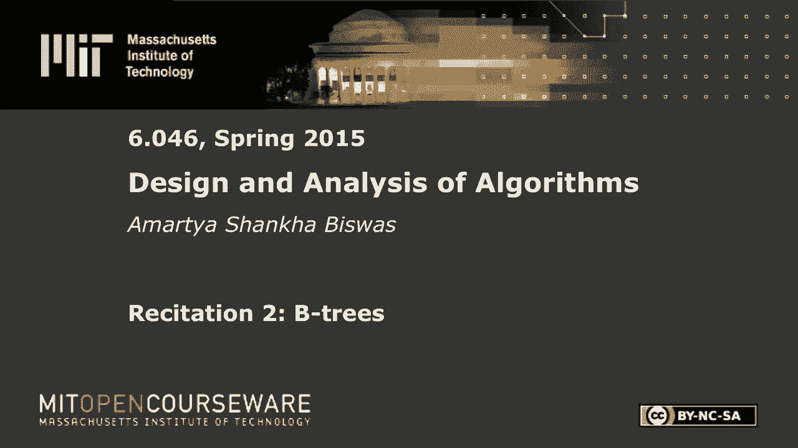
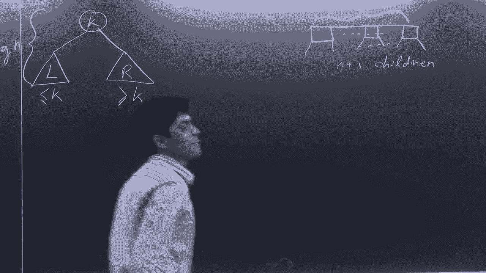
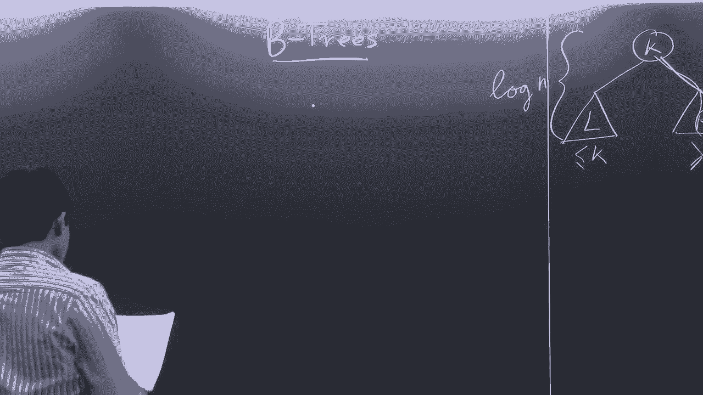
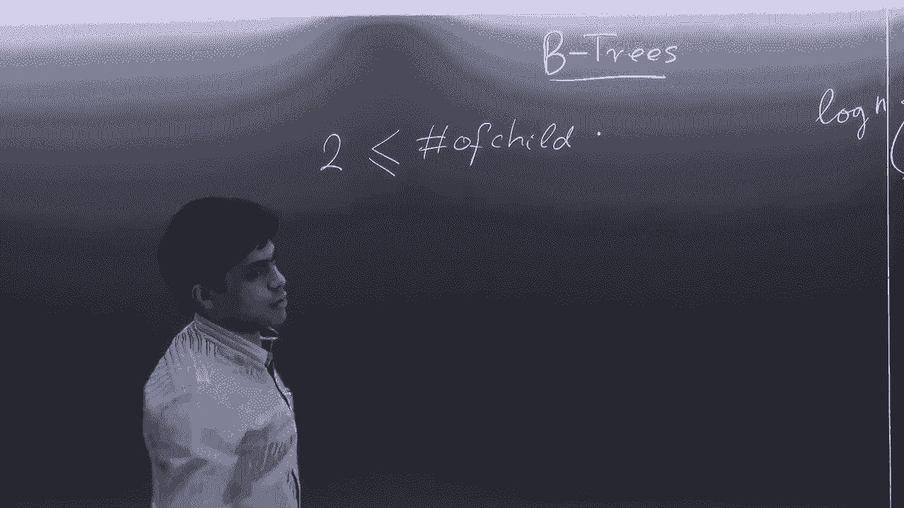
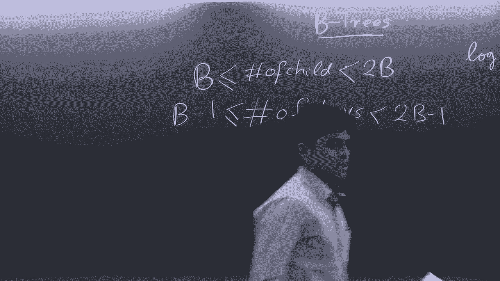
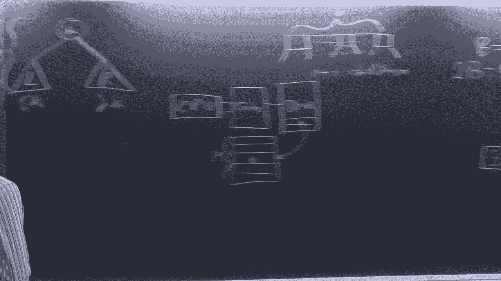

# 【双语字幕+资料下载】MIT 6.046J ｜ 数据结构与算法设计(2015·完整版) - P5：R2. 2-3树与B树 - ShowMeAI - BV1sf4y1H7vb

以下内容是根据知识共享许可提供的，您的支持将有助于麻省理工学院开放课件，继续免费提供优质教育资源，捐赠或查看麻省理工学院数百门课程中的额外材料。

所有的权利，嗯，这是一个二，三，三，正如您所看到的，每个节点都有这样，两个三个不是两个孩子就是三个孩子，每个节点可以有一个键或两个键，这就是相关性，每一个都是这样，如果一个节点中有n个键。

它有n个加一个孩子，所以工作方式很好地在类似于二叉搜索树的情况下，所以如果你在这里有价值，它周围的两个孩子，所以这边比较少，这边比较多，所以说，它基本上是按排序的，逆序反转，所以让我们把贝壳根。

子女权利，所以按顺序排序，所以一般，一棵B树会有一些，再加上一个孩子，如果你在中间拿了什么，看看这两个孩子，这个子树中的所有键都比这里的键小，这个子树中所有的c树键都比这里的键大，所以这是一般的节点。

好的，所以在我们讨论更多关于属性和一切的细节之前，所以问题是为什么要使用B树，所以让我们喜欢，如果我们做一个快速的深度分析，我们可以看到深度仍然是log n，对呀，大家都清楚吗，为什么深度是log n。

因为你有你有分支，就像在二分搜索树中一样，事实上你有更多的分支，但无论如何深度是登录，但是为什么要在二叉搜索树上使用B树呢，你有理由，为什么你更喜欢使用B树，所以像所有登录的操作一样，有什么猜测吗。

好吧好吧，原因很好。

内存层次结构，通常在算法中，我们只是假设计算机可以访问类似的内存，你可以从磁盘和恒定时间中提取东西，用它做手术，你不用担心缓存和一切，但计算机不是这样工作的，所以在电脑里，所以你们中的那些人。

就像六级计算机体系结构，四个什么的，你会知道作为CPU的层次结构，所以让我们试试，所以你有你的CPU，在你的CPU附近有一些寄存器，你有你的缓存，一我自由，不管你有什么你的公羊，之后你有磁盘。

所以这是最低的，然后你有你的，我不知道你的云什么的，就像每一关，内存大小会增长，访问时间也会增长，所以在基本内存层次结构模型中，我们只有两级等级制度，假设你有现金，通过高带宽通道连接到CPU。

您有一个低带宽的磁盘通道，区别在于本质上你可以认为缓存有无限速度的缓存，就像你一样无论你能承受什么，你从缓存中带东西是没有任何费用的，但它的尺寸有限，所以缓存的工作方式是，它有一堆词。

这是一个有限的单词数，所以每个单词的大小都是B，假设你有M个单词，然而，硬盘只是让我们说无限的内存，但它有一些与访问相关的成本，好的还有，当你从硬盘访问东西时，将它们复制到缓存中。

并复制一个大小为B的块，你从硬盘上拿起来，你试着，你走一个街区，你把它放进缓存里，你必须摆脱一些东西，因为它是有限的，所以你要做的是，你想有效地利用那些被阻止的，你只是想喜欢。

每次要访问二分搜索树中的新节点时，都要带一个B块，就像正常的操作一样，你从根上开始，转到节点，但这并不容易与这项权利相关联，所以如果你想利用整个块，你会想要一个像块一样的东西，从树上下来。

但二叉树不是这样存储的，二进制文件是这样存储的，这就是B树的好处，B树，所以既然你可以做，所以这只是一棵2-3树，这不是一个一般的B，一个一般的B树会有一堆节点，我们会得到那个数字。

但通常您希望使节点数，类似缓存的东西，什么是缓存，缓存中的字大小，所以一旦你这样做了，您可以从磁盘获取整个节点，喜欢在这方面的工作，然后得到另一个内部节点，就像你的身高降低了，你可以更快地做手术。

因为您没有访问磁盘，每次你下关的时候，我是说你很抱歉，每次下降一个级别时，您都在访问磁盘，但你会觉得你在利用整个街区，当您访问磁盘时，有点道理，所以让我们写下一个，b，现在为B树。

所以孩子的数量，所以好吧，首先，B树有一个叫做分支因子的东西，所以在二三棵树中，分支因子是二，所以这意味着它只是限制了孩子的数量，所以孩子的数量必须大于等于两个，根节点以外的。

根节点的子节点可以少于B，没事的，也是，它的上界是2 b加1到b，注意这是一个严格的上限，所以在节点的子节点中最多可以有两个b减去一个键，还要记住键的数量，钥匙的数量是一个，只比孩子的数量少一个，因此。

这就是不平等，这是不对的，我们走，这些不等式只减少一个，所以你想要减一，你必须是负一，所以键的数量可以在b减去1到2之间b减去2，这样做的理由将变得清楚。

b是分支，所以b b是分支因子，所以这是像这样的孩子的数量，不是几个孩子对吧，它是，这是一个束缚，在两三棵树上有多少孩子这么喜欢，所以b等于2，这是一棵二三树，所以两个是指你可以有两个孩子。

或者你可以生三个孩子，这里的某某，儿童的上界是负一右，减一等于三，所以你可以生两个或三个孩子，相应地，节点中可以有一个或两个键。

回到这个，所以根没有一个有下界，根可以在任何树中有一个子树，所以你有一个B等于五棵树，根还是可以有一个孩子对不起，不是一个孩子一个关键因素，两个孩子，是好的，也是，它是完全平衡的。

所以所有的叶子都是一样的深度，就像你可以，所以你可以在这里看到，所以所有的所以你知道，你不能在这里有一个悬垂的节点，这是不允许的，你得有一片叶子，你必须有一些事情发生，一切都以同样的水平结束。

所有的权利，所以这就是问题所在，树叶也是如此，显然不要孩子，所以叶子违反了这个条件，这就是B树的基本结构，所以我们在B树上考虑的第一个操作是搜索，所以这应该是相对简单的，好的。

记住在二分搜索树中搜索是如何完成的，与键相比，您带来了一个值x，假设x小于k，你沿着这条路走下去，假设x大于k，你沿着这条路走下去，在B树中也是如此，假设你带来了一个价值，假设你在找一个20英镑的。

所以你比这个赚了20英镑，所以在这里，现在你有三个值，对不起，两个值，那么二十个放在这里哪里呢？不在这里，不是这里，它适合这里，好的，从这棵树下去，如果你找到20个，就是这样。

所以一般来说你带一个KKK，你看这个节点，你遍历所有的值，有件事我忘了说，所以应该很清楚，节点中的所有键，它们被一个接一个地分类，所以你的价值观是这样的，所以它们是以这种方式增加的，有道理，好的。

所以你拿把钥匙进来，查看节点中的所有键，你正在看，挑一个，选择K适合的地方，除非它已经在节点中，那你就完了，你找到了，否则，假设K在这两者之间，这两个家伙，所以你顺着这个孩子继续，所以搜索是log n。

类似于BDS，好的，所以搜索不是很有趣，好的，所以接下来是插入，所以插入要多一点，只是比搜索有趣，所以你做的插入是你，这个房间，这个房间的人进行演示，哦，好的，嗯，我想我们又要开始奔跑了，好吧好吧。

我们要不要搬回原来的房间，好的，让我们，我们就这么做吧，所以在我们继续之前，有人对B树的结构有什么问题吗，我们很快就冲过去了，关于B树是如何构造的，大家都很好，好的。

还有关于在B树或BSD中搜索的任何问题，或者随机的8，他们只能拥有，对孩子们的一种价值，就像，不管是什么，所以你在b树中有一个节点，不管是下面的什么，它被元素分成了几个部分，所以如果你有n个元素。

它把它分成n加一个段，所有的权利，你说过，她说屋顶不必跟着，当我们进行插入和删除时，你会看到，为什么有这个必要，但本质上就像，你可以认为这是一个不变量，我们所要做的就是保持这个不变，所以是的。

根可以有它有，它还必须少于两个，它必须有上限，但不需要有下限，整个采访用缓存大小，所以有些东西，和那个有关的东西，所以您可能希望B是关于您的缓存大小，这样你就可以一气呵成地得到整个街区，我不知道。

我从来没有实现过自由，所以我不知道在实践中是怎么做到的，但这就是原因，所以我想这和仪表板有关，像十四一样有时间吗，嗯，这两者都不是孩子，它是这个节点的子节点，所以这个节点有两个元素，所以它被分割了。

把贷款人分成三部分，所以它是一个，在十点到十七点之间，这里的重点是，所以这个这个没有人，对不起不，它有三个孩子，所以不要把每个键都当成一个节点，就像整个，整个单元作为一个节点，就像。

在二分搜索树中并非如此，你有一个元素，但这里每个节点都有多个元素，这才是重点，其他人，好吧，让我们从搜索开始，所以说，今年离开，上面有公式，所以这很好，所以插入，让我们从插入开始，我们已经搜索过了。

所以插入是你带一个新的钥匙，要插入树中的k，那么可能发生的问题是什么，您可以找到要插入的位置，就像寻找正确，你只要走下树，找到它应该放在哪里，但一旦你把它放在，你有问题，有什么问题。

问题是您的一个节点将变得超满，这不是你或其他什么会溢出来的，那不是你想要的，所以你想要一些，你想要一些方法，所以你可以管理这个，你是怎么做到的，所以我在这里有一个可爱的道具，我希望证明的是。

这是一个如此，所以这里我们有b等于4，所以让我们先计算出钥匙的数量，那么B等于4-3的最小键数是多少，所以说，这些的最大数量是多少，三四二减三，三四，但不是七点，某处有严格意义上的小于号，是呀。

你就会明白为什么不是一分钟七个，好的，所有的权利，你可以看到3 4 5 6 7，所以发生了一些插入，另一个是书写清晰，每个人都能读懂数字吗，反正四九看起来有点可爱，基本上这些都是排序的，这是父节点。

不管这里有什么，重要的是八五六和，那么当我们有一个溢出节点时，我们要做什么，就是所谓的分裂操作，所以说，有一些东西我们只是要合并，我们以后在做删除的时候会讨论这个问题，但现在这么分裂很，非常直观。

它将节点分成两部分，所以当你有一个溢出节点时，所以这里的元素数也是b-1，只比最大值多一个，所以你要做的就是把中间的元素去掉，现在你把仅有的两部分分开，注意这里有三个，这里有三个，很完美。

现在你用中间节点做什么，所以现在你实际上破坏了树的结构，因为有一个指针进去了，有一个孩子，我有两个孩子，所以您需要以某种方式调整父节点，因为父节点只有一个子节点，好吧，至少还有其他孩子在旁边。

但在这里它只有一个孩子，现在它分裂了，所以你做一些很简单的事情，你只要把这个家伙插进去，然后你说，哦，这里的这个点和这里的这个点是有道理的，我要除掉这两个，就像你可以说服自己这保留了所有好的属性。

所以你的孩子们很好地回到了他们的间隔，你的顺序完全正确，因为这是中间的元素，所以这正确地划分了这个间隔，这也是在八到五六之间，因为这是在这个节点里，所以所有的属性，但有一个财产是个问题。

所以您只需将父节点的大小增加1，所以现在父节点可能已经溢出，那么你是做什么的，你再劈开它，再劈开它，如果你在任何时候你都很好，你看起来，您查看父节点并，好的，那很好，那是那是在范围内，但每次它溢出来。

你可以一直走下去，我能做多少次，你可以一直这样做到根部，当你到达根部，你要么，没事或者根太大了，2。B减1，然后你拆分根，你得到一个单例节点在那里，所以在回答你的问题时，这就是为什么你需要那个属性。

从某种意义上说，这不是一个非常简洁的论点，但有点，但不管怎样，所以让我们在这棵树中做一个插入，我们这里有，所以我们要插入16个，好的，所以这里有16个，现在还不到三十岁，向左，十点到十七点之间。

它在十六岁中间，大于十四，所以我们在这里加16个，哦，等等不，所有的权利，哎呀，对不起，第二次，好的，无，那很好，是啊，是啊，那看起来不错，所有的财产都很好，这仍然有两个元素，这是最大值，但它很好。

它不会溢出来，让我们插入别的东西，让我们插入两个，所以2到30下去，下去了，我们有问题了，因为两个已经溢出了这个节点，所以我们分开，我们分开的方式是我们把中间的元素，所以我们在这里拆分节点。

三个向上到父级，所以三个放在这里，一切都很好，除了父级溢出，那么我们该怎么处理父母，我们再把父母，这次把它转到中间，十上升，所以好吧，让我们摆脱这个，现在轮到你了，十到这里，你很厉害，有点飘动。

所以让我重新定位十七，这两个操作有意义吗，谢谢你现在的人数，是啊，是啊，所以只要挑，就挑第一个，好的，如果我们在节点溢出时这样做，所以一次只插入一件事，对，所以如果您的节点溢出，就会是2减1。

这是一个奇数，总有一种情况，你可能得到一个偶数，如果你做了奇怪的事情，也许你有这样的，有不同的方法来做B树，但如果是这样你可能会像他们中的任何一个一样选择一个，然后这个看起来，我不太确定，我会调查的。

但总的来说，如果你这样做是永远的，所以你不用担心，还有什么，如果我们，如果我们真的一直到达根部，然后又上去了一个，是啊，是啊，所以你要做的是有一个规则，会有两个孩子，一个元素和两个子元素，就可以了。

因为我们没有限制，那很好，我们在坐牢吗，好的，你有时间好吧，让我们跳转到删除，除非有人有问题，那又怎样，哦，是啊，是啊，哦，那很好，谢谢。所以你最多下到树叶上，大部分叶子的，你要回到一个。

所以就像log n加log n，你很厉害，好的，呃，让我们做删除，好的，所以删除更复杂，所以原因很清楚，那么问题和删除会是什么，移除一个节点，一个节点现在已满，所以它的键小于b-1，突然，所以说。

把这个转过来好了，可以吗，好又来了，等于四，这个节点是个问题，里面只有两样东西，那么我们该怎么做呢，在我们进入之前，让我们假设，所以有两个步骤来删除，第一步是从叶子上删除，你是怎么做到的。

所以你删除叶子的方法是，假设你有一把钥匙，你下来你，你知道B树，你在一个节点上，现在，这张纸条你们，哦，这个键需要删除，但不是叶子，那么你怎么做，你要做的就是看看这两个子树。

所以它可能只有一个潜艇在最后，它就只有一个，其实，否，那不是真的，不要忽视这一点，如果不是一片叶子，它有两个子树，所以要么取这个子树中最右边的元素，它是一片叶子，因为你可以一直往下走直到你得到你的叶子。

或者此子树中最左边的元素，所以这只是下一个元素，在这个家伙之后，所以你删除这个，把这个带到这里，我们将做一个这样的例子，就会一目了然，但是你--所以你要么取最右边的元素，左子树或最左边的元素到右子树。

把它带到这里来，所以你有点像把删除移到叶子上，现在更容易处理了，所以我们也会讨论这个问题，请注意，这不是剩下的部分所做的，这个删除算法，我想在背诵笔记中没有写完，这是另一回事，我稍后会发一个链接。

但我相信它有效，因为我从，一旦你移动到树叶上，所以现在就像，让我们看看这个，所以这是一个满载的节点，你想修复它，那么你怎么修复它，所以你要做的就是看着它的兄弟姐妹，所以在这种情况下，它有一个兄弟姐妹。

它最多可以有两个兄弟姐妹，你可以吃左边的，也可以吃右边的，所以你要做的是看着一个兄弟姐妹，而这个兄弟姐妹实际上是最小的一个，如果超过最小值一个，那你就是，那你就是，真的很简单。

你所要做的就是把这里最左边的东西，或者兄弟姐妹在这个上面，我拿了这里最正确的东西，你看着看着这位家长，所以你把父母打倒，你把兄弟姐妹向上移动，我们就这样基本上就像，所以你要把东西旋转到位。

所以您将父节点向下移动到下满节点，你用最左边的东西代替父级，在这里，每个人都明白为什么这保留了一切，好也好，是啊，是啊，孩子也被转移了，确保你看到了，就像这个子树中的孩子一样，现在在这个子树中。

但你可以有这样的情况，在那里你没有一个好兄弟姐妹来照顾你的问题，所以在这种情况下，兄弟姐妹几乎没有吃饱，它里面有三样东西，它不能捐任何东西给你，那么在这种情况下你该怎么办。

然后你做一些与拆分操作平行的事情，你确实出现了，那么你有什么，所以这里你有b减去2，这里是b减去1，你得到b-3，你得到了另一个元素，你也把父母，所以如何进行合并将首先向您展示合并，所以你做的方式是。

你把父母向下移动，所以向下移动父节点，把这两者结合起来，现在这就实现了，新节点中的这个点，嗯，所以你有，是啊，是啊，正是这样，您已经规定了父级的大小，所以它可能没有满，所以你掉下来，传播其他任何东西。

他们都不一样，所以有两个案例，对呀，所以要么你有一个兄弟姐妹有额外的纸条要捐给你，或者你没有，如果你不，那你就得这么做，那是哪里，就像没有，就是把它移到叶子上，一旦你把叶子向下移动到叶子上。

所以我们现在必须有一些东西，现在我们把它一直往上移，所以有两种情况--旋转，所以好吧，让我们举一个例子，让它更清楚，1。我们准时到了吗？五分钟，所有的权利，好的，所以我们要把三八，三十八不见了。

但我们想把它移到叶子上，所以让我们取一个元素，假设我们取41，所以我们把4-1移到这里，41是右子树中最左边的东西，所以这个空缺并没有真正影响到任何事情，因为这个节点仍然有正确数量的东西。

因为它还有一样东西在里面，这是很好的，所以你很好，到现在已经四十年了，四八，好的，假设我们现在删除四个一，所以四一消失了所以现在四一消失了，你用什么代替你，你用什么来代替这个空白点？

不管是这个还是这个权利都不重要，所以为了一致性，让我们做这个，所以你这里有四个八个，现在你有个问题，因为你有一个空白的盒子，好的，所以你可以旋转，是呀，不不，因为兄弟姐妹几乎吃不饱。

那么你能做得这么好你合并，如何合并，你把四八向下移动，你把所有的东西都组合在一起，所以你有，所以说，这有点难理解，但这就像一个零元素节点，所以你当你合并的时候，你有三个，两个，四，八个，什么都没有。

所以只给你们四八，所以你要做的是，所以这看起来很奇怪，但这只是另一个空节点，你就像把空虚向上传播，现在您将这个空节点，你再去找它的兄弟姐妹，它的兄弟姐妹很好，它是，都是，勉强满了，那么你该怎么办。

你把30拿下来，你把这个合并，所以我们就这么做吧，所以说，三十下来了，我们走了，所有合适的看起来都很好，这看起来真的很好吗关于手术的问题，有道理，好的，让我们做一个删除，在那里我们可以做一个旋转。

所以让我们继续删除20个，所以你做你的搜索，从树上下来，你找到那二十个就去做，它现在不见了，所以你只剩下，只是其实没关系，我们再做一个，所以这没有任何作用，你丢了那二十块钱，你只剩下两个四。

所以现在我们做两个四，现在你已经摆脱了两个四个，你现在有一个空白的盒子，但它的兄弟姐妹并没有勉强吃饱，它有东西要捐，所以他们所做的，所以任何人哪个哪个元素会旋转，十六七十，对，好的，哦，所以16上升了。

十七下，你完蛋了，你又始终如一了，好的，所以这是删除，所以这就是要删除的两种情况，这有道理吗，这就是我们今天要讨论的所有话题，对任何操作有任何问题吗，任何其他主题。

