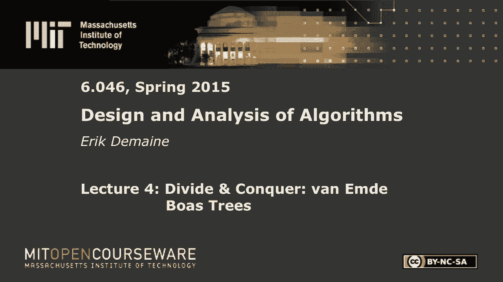
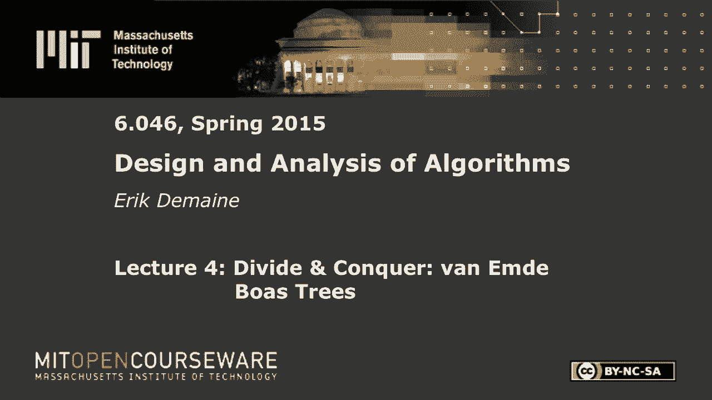
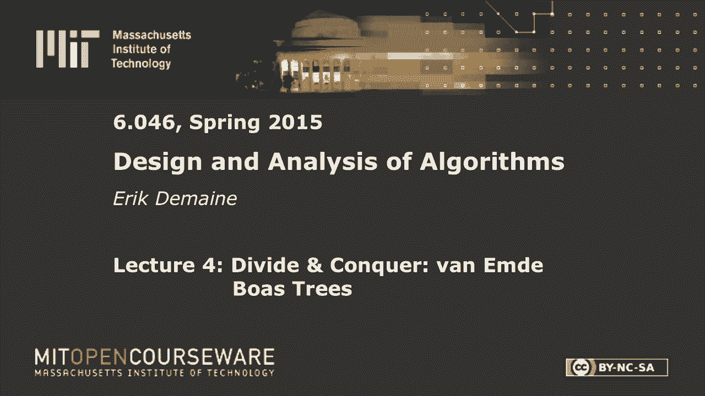

# 【双语字幕+资料下载】MIT 6.046J ｜ 数据结构与算法设计(2015·完整版) - P6：L4- 分治：vEB树 - ShowMeAI - BV1sf4y1H7vb

以下内容是根据知识共享许可提供的，您的支持将有助于麻省理工学院开放课件。

继续免费提供优质教育资源。

捐赠或查看麻省理工学院数百门课程中的额外材料。

所有的权利，欢迎回到六，零四六，你们准备好学习一个很棒的数据结构了吗，是啊，是啊，让我们做吧，这是一个以人类命名的数据结构，彼得·范·德·布瓦，我昨天刚和他通信，他在70年代发明了这个非常酷的数据结构。

超级快，太神奇了，它实际上很容易实现，而且在实践中用得很多，在网络路由器中，除其他外，我们今天要报道它，所以让我先告诉你它是做什么的，所以说，这是一个旧的数据结构。

但我觉得我们花了几十年才真正理解这个问题，在什么意义上，没有放大，只是为了摄像机，所以说，我们花了几十年时间才真正理解这种数据结构，它是如何工作的，为什么它有用，它所解决的问题就是你所说的前身问题。

这与二分搜索树解决的问题非常相似，但我们要做得更快，但在一个有点不同的模型中，我们将储存的元素，不仅仅是我们知道如何比较的东西，这将是比较模型，我们在存储整数，整数来自大小为u的宇宙，小你如此。

我们假设它们是非阴性的，所以从0到u-1，尽管您可以不需要更多的努力就支持负整数，以及我们想要支持的行动，我们存储了一组n个我们要插入的元素，所以这些是你应该熟悉的操作。

您应该知道如何在每次操作的log n时间内解决这些问题，用平衡的二叉搜索树，就像AVL树，想给布景加点东西，从集合中删除某些内容，或者给出一个值，我想知道集合中的下一个最大值。

所以如果你把它作为一个一维的东西来画，你的套装里有些东西，然后你有一个查询，那你在问下一个是什么，集合中的值，所以你想退货，好的，前身是对称的东西，你通常可以解决前任，所以我们就把重点放在这三个操作上。

虽然在课本上你会看到有很多操作你可以做，安德波伊斯，到目前为止一切都好，我们知道如何在log n时间内做到这一点，我们要在，太神奇了，所以多了一根原木，但我们有点作弊，然后我们现在用u代替n。

在很多应用中，你很通情达理，就像二对三，两个，或者二到六十四，取决于您通常使用的整数类型，所以日志，它的log通常非常小，通常比log n小，所以尤其是在理论方面，如果，比如说，如果u是n中的多项式。

甚至大于n，您可以支持n到polylog，那么log log u与log log n相同，不超过常数因素，所以这是一个指数级的改进，比规则平衡的二分搜索树，超级快，而且也很干净简单，不过。

我们需要一点时间才能得到一个应用程序，正如我提到的是在网络路由器中，我相信现在大多数网络路由器都使用van om Dubose数据结构，所以在过去的十年左右，这种情况发生了变化。

网络路由器必须存储路由表，它看起来像IP范围从这个到这个，请将您的数据包沿这个端口发送，对于从这个到这个的IP范围，沿着这个港口发送，因此，如果您将这些范围的开始标记为集合中的项，你给出了一个查询。

给定实际的IP地址，你想知道它在什么范围内，所以杜博斯的范，让你很快解决这个问题，你对我P V六只有两个对不起，因为i pv4只有2到3 2，所以这是超级快和实用的，做日志记录需要五次操作，二对三。

两个，就是这样，就是这样，你可能知道，网络路由器基本上是计算机，所以他们现在有很多专门的硬件，这是相当通用的，所以你想要好的数据结构，就像我们将要报道的那样，好的，所以我们想拍原木原木U。

我们将通过对一个非常简单的想法进行一系列改进来实现这一目标，这不是范恩德·博阿斯最初提出这个概念的方式，但这是一种现代的看法，就是课本上的那个，第一个问题是我们如何将一个log log u绑定。

那是从哪里来的，这是问你的问题，这只是直觉，我们总是看到日志，所以是的，你把一棵树的高度组织成一棵树，好，你把一棵树的高度组织成一棵树，所以我们通常认为一棵树，假设我们有你在这里，所以高度是log u。

所以我们想在这棵树的层次上进行二分搜索，如果我们可以从中间开始，然后决定我们是要上去还是下去，我完全不明白那是什么意思，但事实上这正是毒液和玻色的作用，所以你可以二分搜索。

我想我们直到最后才会看到这一点，但在树的层面上，让我们从复发的角度来考虑这个问题，对了，二分搜索有一个递归，通常是T，如果你有k个数，k的t是k的t除以二加一阶。

你花了不变的时间来决定在二分搜索中应该向左还是向右，或者在这种情况下上上下下，然后你缩小到一半大小的问题，所以这解决了对数k，在我们的情况下，k实际上是log u，所以我们希望复发看起来像。

log u的t等于log u的t除以二加一阶，好的，即使你不相信二分搜索视角，这显然是一个解决日志u的递归，我只是代替，这里k等于log u，所以这可能是在正确的轨道上，就log u而言。

如果我想根据你的情况重写这个重现呢，我会得到什么，如果我想有这个仍然解决日志u，我应该在这里写什么，如果我更改一个数的对数的记录器，两倍，你如何改变，平方根，好的，我已经改变了这里的变量。

但这真的是相同的递归仍然会解决log u，你必须对一个数应用平方根的次数，得到一个是log log u，所以这是关于哪里的更多直觉，毒液杜博斯将如何实现日志日志U，事实上，这是我们将使用的主要直觉。

所以我们想把我们的问题，它有大小U，并将其分成大小问题，u的平方根，所以我们只需要在其中一个上递归，然后我们会复发，好的，让我们，那就是我们要去的地方，但我们将从一个非常简单的数据结构开始。

表示从宇宙零到u减去一的一组n个数字，让我们说，最初我们的目标是插入和删除是恒定的时间，在这个宇宙中存储项目的好数据结构是什么，我想让你参与进来，不知何故，我不只是想喜欢。

将它们存储在项目的链表或已排序的项目数组中，我希望你能参与进来，插入和删除常数时间，数组中的数组，是啊，是啊，数组索引是多少，对不起，价值，价值，是啊，是啊，好，所以我想，这通常称为位向量。

在那里你索引，我想要一个大小为u的数组，对于数组中的每个单元格，我要写0或1，零表示缺席，一个意思是现在，在布景里，所以让我在这里画一张图，让我以我的例子，把它放在中间，所以这是一个集合的例子。

如果我可以突出一点，这里有一个，这里有一个，一加一，所以集合中有四个元素，宇宙大小是十六，在这个特殊的例子中n等于4，如果我想插入到集合中，我把0改成1，如果我想从集合中删除，我把1改成0。

所以这些是恒定的时间，如果我想做后续查询，不太好，我可能需要花点时间，唯一要做的就是一直跳直到我跳到一个，最坏的情况是你几乎是一个零，或者u减去n，所以那真的很慢，但是这个，事实上，将是我们的起点。

可能看起来真的很傻，但这实际上是范·德·博伊斯的一个很好的起点，我们要把我们的宇宙分成星系团，毒液，人们喜欢称这些星系为，我认为这是个很好的名字来形容宇宙的碎片，但教科书上称之为集群。

因为我以前叫它集群，所以说，现在的问题是集群应该有多大，但如果我给你这张照片，我想把这些星系想象成独立的块，因为从一棵树上，你可以在这里形成一棵树，把商店里的东西储存起来，就像一个，酷我喜欢这个。

所以我可以存储这两个比特中的或，把这个清理一下，或者这两位，或者这两位的，以此类推，OR很有趣，因为它告诉我这个零位，特别告诉我这里什么都没有，所以我应该可以跳过它，这样做，你在想象一种二分搜索。

伊什的事，一个好主意，所以这里的每个节点，我只是在给它的两个孩子写信，事实上你可以，你可以一直这么做，你可以建立一个完整的二叉树，但请记住，我们要做的是在树的层次上进行二分搜索。

所以我要特别关注这个层面，这是那棵树的中间层，如果我把整件事都画出来，这个水平很有趣，因为它只是总结，这里有人吗？这个群集里有没有人，这个群集里有没有人，这个集群里有没有人，所以我们称之为汇总向量。

所以我们会回到你的树视角，在某种程度上，这是正在发生的事情的一个很好的大局，但在这个层面上，我只想说，让我们存储位向量，让我们也存储这个摘要向量，我去看看星团内部，如果我找不到答案。

我将向上到汇总向量并找到下一个集群在哪里，里面有东西，然后我会进入那个集群，寻找第一个，那是，好的下一步，所以这个会被拆分，集群应该有多大才能平衡，我在做三次搜索，一个在集群内，一个在汇总向量中。

一个在另一个集群中，平方根u是的，这将平衡，如果它们是u的平方根，那么簇数就是u的平方根，所以在汇总向量中的搜索将与下面的成本相同，我们也知道我们想做u递归的平方根，不知何故，所以这还不是递归版本。

但是u的平方根是完全正确的，我有一些飞盘，对不起，我想我也欠你的，集群有大小，u的平方根，它们的u的平方根和酷，所以现在当我想做插入或删除时仍然是，让我们不要担心删除，插入有点棘手还是很容易的。

如果我插入这里，我把它设置为1，我检查了一下，如果这已经是零，我也应该把它设置为1，现在，删除会很棘手删除这个家伙，意识到没有别的了，我们不要担心那个，直到我们做更多的工作，让我们只关注插入和后继。

插入此策略仍然是恒定的时间，我们两步而不是一步，但很好，我们要做的第一件事是查看X的集群，如果我们找不到我们要找的东西，那我们就，在汇总向量中查找下一位，然后我们去找第一个，所以幸运的箱子里有两箱。

所以只有在你的时间里扎根，如果我们运气不好，我们在根U时间的摘要中搜索，然后我们找到第一个扎根的位，整个是u的平方根，与log n相比，这当然不是很好，但它比你好多了，这是我们的第一个方法，位向量。

当然，这个想法是递归，而不是在每一个层次上做一个位向量，我们将以这种方式递归地表示这些集群中的每一个，这就是在分而治之的魔力中事情变得有点神奇的地方，然后我们得到u的平方根t，而不是u的平方根。

然后我们会得到一个日志成本，所以说，在我到达那里之前，让我给你一点术语，好的，一般来说，记住我们要找的东西只是整数，所以我们所说的本质上是除一个整数，像x乘以u的平方根，所以这就是商，这是剩下的。

所以我希望j在0和严格小于u的平方根之间，那么这是唯一的算术基本定理什么的，嗯，i是群集号，然后j是x在该簇中的位置，让我们做一个例子，比如um x等于9，所以我没有在这里给它们编号，这是x等于零。

一个，两个，三个，四，五个，六，七，八九，这就是我感兴趣的人，所以九号在这里，这是群集号，零一二，所以我主张九等于二，u的平方根，这里有四个，我很方便地选择U作为一个完美的正方形，它是集群中的第01项。

确实九等于二乘四，加一个，好的，所以总的来说，如果你想知道，如果你得到X，我说啊，在X的集群中查找，这意味着x整数除以u的平方根，那是群集号，我会试着在里面搜索，然后我查看汇总向量，从群集名称开始。

找到下一个集群的人的集群名称，然后乘以u的平方根得到这里，然后一般地继续下去，因为除法和乘法，我不想想得太辛苦，我要说，找到一些函数，让这个简单一点，更直观，所以当我用u的平方根做整数除法时。

就像在地板上，我把那个叫做X的高点，x的高部分和低部分将是余数，就是这里的j，如果我有高低部分，i和j，我要用索引回到X，所以ij的指数是i乘以u的平方根加上j，现在为什么我把这些叫做高和低。

给大家一个提示，这是x的二进制表示，在这种情况下，x的高是2，x的低是1，所以最高的人对前两个人的反应最高的人对第一个人的反应最低，对呀，x的高对应于位的高一半，x的低值对应于位的下半部分。

这些是高阶位和低阶位，如果你仔细想想，还记得我们用对数取u的平方根吗，它把log u分成两半，所以它正好在对数u位长的位向量中，我们在这里把它分成两半，看看高比特和低比特，这是对这是做什么的另一种解释。

如果你不喜欢除法，正如许多计算机不喜欢做的那样，我们实际上所做的就是掩盖这些部分，或者把这些碎片转移过来，所以这些实际上是非常有效的，这可能会给一些直觉，让我们递归，我们要不要。

现在我们知道这种分裂是如何工作的了，所以我要打电话，蟒蛇结构的整体结构V或事件，我想表示的是v，v将由两部分组成，一个是所有集群的数组，所以说，我将把van de boas缩写为eb，并且递归地。

这些集群中的每一个都将用一个较小的V表示，eb，u的平方根减去一，好的，所以它们总大小的u的平方根是u，此外，我们将有一个摘要结构，这也是u的平方根，V E，b，这是我现在关心的两个手术。

让我们从插入开始，那更容易，所以如果我想在数据结构中插入一个项x，v，我应该做的第一件事是插入到相应的集群中，所以让我们适应这个符号，我们正在插入数大于x的群集，那就是X的归属，它的群集的名称应该高x。

我们将递归地插入到，有x的低值，这是该群集本地的x的名称，x是关于v的全局名称，此群集只表示U项的小范围平方根，所以这让我们从U大小的大空间到U大小的小空间，该簇中u的平方根。

所以这基本上是高和低的原因，但我们还必须更新摘要结构，所以我们需要以防万一，也许它已经在那里了，但在最坏的情况下，它不是，所以我们就把它看作是递归地插入，高x的群集的名称，x的高是跟踪哪些群是非空的。

我们刚刚在这个集群中插入了一些东西，所以它不是空的，我们最好标记x的群集不是空的，在摘要结构中，为什么会这样，所以让我们继续前进，其实，所以我们在非递归版本中有三个步骤，所以我们要在这里做同样的事情。

我们要在X的星系团中寻找，我们现在知道这就是被称为x高的星系团，要么我们找到它，我们很高兴，或者我们不，然后我们来看v点总结，搜索这个，X右高的继承人，找到下一个继承位，然后我想找到集群中的第一个位。

也是，是啊，是啊，它是负一或零或非零的后继，但是负数就可以了，或负无穷大，也许更直观，会发现这里最小的东西，所以每一个都是递归调用，所以我们就这么做吧，我要做的第一件事是做ij分解。

我把x和j的高度设为，我可以做低x，但我要尝试的是在这个x高的集群中搜索，第I组，它是x的簇高，低的x好的，这是在X的星系团中寻找的第一步，这是X的集群，这是集群中X的名字。

但它可能会说无限我什么也没找到，好的，那我就幸福了，那我就不开心了，如果j等于无穷大，那是第一行，接下来我们要做的是，那我们就走错地方了，x的高不是正确的群集，让我们找到正确的集群。

这将是下一个非空集群，所以我要把i改成，所以我是一个集群的名字，它里面可能有物品，但我们想找到下一个非空的东西，好的，这就是我们现在属于的集群，我们想要集群中的什么项，嗯，我们希望在该集群中找到最小项。

我们将通过递归调用来实现这一点，在群组I内，负无穷大的，我来唱，减一也行，因此，这将找到集群中最小的项，然后ij，在这两种情况下我们得到i和j，它们以这种形式一起描述了我们关心的值x，所以我只想说。

返回，IJ的索引，这就是我们如何为结构重建项目名称，我们知道它在哪个子结构中，我们在集群中的子结构中知道它的名字，这个算法显然正确吗，也很糟糕，这比我们到目前为止所做的一切都好。

我们得到的最后一个结果是u的平方根，这会比那更好，但仍然没有日志日志U，为什么这两个都不好，你做的更多，我对这里的操作进行了不止一个递归调用，插入调用，在这里插入两次，可能是三次。

这对我来说是一个很大的挑战，你看一个不错，那是计算机科学中常见的问题，右总是差一个错误，嗯好吧，所以让我们从复发的角度来考虑它，以防这里不清楚，我们有u的t是u的平方根的2倍，解决大小问题的权利。

我解决了两个大小问题，u的平方根加常数，因为x的高x的低，我想需要持续的时间来做，只是我有一个整数，我把它分成两半，那些很便宜，这解决了什么，用log u来想可能更容易，然后我们就可以应用主方法。

这和log u的t素数是一样的，等于log u的2乘以t除以二加一阶，这不完全是合并排序递归，但这并不好，我们开始的一种方式是，我们从log u的总重量开始，2。我们把你分成两队，但它的两份副本。

所以我们什么都不留，我们没有严格地用递归树来减少问题，我们有，你知道的，好好记录你，很难去想，因为我们这里有恒定的大小，但是我们不变的总成本，你可以用主方法把这个插进去，或者看到本质上我们在保存质量。

我们从log u质量开始，我们有两份log u除以2的副本，那是相同的总质量，那么我们有多少次递归做得很好，我们做日志日志U递归，该递归树中的叶子总数为log u，他们中的每一个我们都支付不变的费用。

所以这是log u，不记录日志您获取日志日志U，我们需要把这两个变成一个，我们只能提供一个递归调用，如果我们有两个递归调用，我们得到对数性能，如果我们有三个递归调用，更糟糕的是，我得在这里。

我一定会用大师的方法，那很明显，在本例中，我们将log u放入log base，三次方中的两次，也就是log u到一点，六个左右都比log n差，严格来说，这比log n更糟糕。

这可能比log n更糟糕一点，取决于你和N的关系，所以我们还没到那一步，但我们在正确的轨道上，我们有正确的结构，我们有一个大小U的问题，我们把它分成u的平方根，从数据结构的角度来看大小的子问题。

这是我们第一次在数据结构中使用分而治之，它和算法有点不同，这就是数据结构的布局方式，但现在我们担心这些数据结构上的算法，那些我们只能负担得起的，u的t等于1倍，u的平方根t加一阶。

然后我们得到log log u，这里我们有两个递归调用，不知何故，我们只能有一个，让我们从修复插入开始，否，我想那会更直观，好的，很多时候只是要打这个电话，我们很开心。

糟糕的情况是当我们需要打这两个电话时，那么总共有三个，非常糟糕，我怎样才能摆脱这个电话，我很聪明，最小元素是负无穷大的继承者，但这实际上不是正确的想法，嗯是的，抓住最小，在分组中，我存储集群的最小元素。

我是的，一般来说，对于每一种结构，v存储最小值，为什么我们不知道如何增加结构，在这里，在六点整，你拿了一棵AVL树，并且增加每个节点以存储节点的子树大小，在这种情况下，我们正在做类似的增强。

只适用于每一个结构，跟踪最小值是多少，所以这将是第四个想法，我要在这里加一些东西，但现在让我们存储最小值，以便进行插入，结构v项x，我们要做的第一件事就是说好，如果x是，让我们看看这是不是新的最小值。

可能x小于v点最小值，如果是这样的话，让我们把v点最小值设为x，好的，然后rest和这里的插入算法是一样的，这两个递归调用，我只是花了不断的额外时间，现在每个结构又知道了它的最小值，暂时忽略删除。

那就更棘手了，好了，现在每个结构都知道它的最小值，这意味着我们可以用V点集群替换这个调用，我一点分钟，一个倒下了，好的，我将用j=替换最后一行或最后一行的旁边，点最小值，所以现在我们要记录你的表现。

我们最多只有两个递归调用，所以这是部分进展，我们需要另一个想法来摆脱第二个，和，这里的直觉是，这些调用中只有一个应该重要，好的，让我们，让我们画一幅大图，嗯，下面是递归的样子，我们有v点总结。

那么我们就得到了集群零，第一组，簇，u的平方根减去一，每一个都是递归结构，我们也只是把它们作为副本储存在这里，所以当我查询一个，有两种情况，在这种情况下，我很高兴，因为我只需要这个递归调用。

另一种情况是我在这里找不到我要找的东西，然后我就完蛋了，然后我就可以传送到任何星系团中，我现在已经把它们储存起来了，所以跳入星系团中正确位置的时间是恒定的，所以要么我在这里找到我要找的东西。

或者我在这里找到我要找的东西，真正好的是，如果我能提前知道哪一个会成功，因为如果我知道这不会找到任何东西，我还不如，如果我知道我会在这里找到什么，我受够了，如果我能逃脱这些电话中的一个或另一个。

不是两者都有，我会很高兴，我怎么知道，最大存储，最大商店，最小值和最大值为什么不呢，好的，我只需要一根类似的线，如果x大于v点max，则更改max，所以现在我增强了我的数据结构。

在每个级别上都有最小值和最大值，这里发生的事情是，我找不到答案，如果我比如果我比，或等于此群集内的最大值，我就是这么说的，如果i等于最大值，或者如果我超过了最大值，如果所有的东西都在这里。

最大值在我左边，然后我知道我会在集群中失败，所以我可以直接去做总结然后在那里做，另一方面，如果我小于最大值，那么我保证我会在这个集群中找到一些东西，所以我可以在里面搜索，所以我所需要做的。

我可能得稍微重写一下，我要稍微模仿一下这个代码，至少第一行是，i等于x的高，现在这就是我开始的集群，我想看看那个集群的最大值，所以这将是一个，所以我在看V点集群，i点最大值，我想知道在那之前是x。

现在在那个集群中，x被称为x的低值，所以我寻找x的低点，将x的低值与簇i的最大值元素进行比较，如果我们严格地在左边，所以我应该做这一行，我希望我能复制粘贴，但我会，手抄，然后我找到了我要找的东西，否则。

我知道这是如果我超过了最大值，我知道这是错误的集群，所以我应该马上把这两条线做好，除了我已经做了第二行，使用最小，所以它只会是一个递归调用，然后是分钟，好的，所以这将是，i等于，x的π，在里面或对不起。

我以前在这里的线，这将是集群，我一点分钟，然后在这两种情况下我都回来了，ij指数，好的，所以我们在做与这里相同的逻辑，虽然我用min代替了这个步骤，去掉递归调用，但我真的只做其中的一个，用max来区分。

如果我离开最大值，如果我是对的最大值，如果我是对的最大值，因为我知道这不会找到任何有用的东西，然后我找到了一个非空结构的最小值，在这两种情况下，ij都是我要找的元素，我把它和索引放回一起，对数对数u。

很遗憾，我们还没有完成插入插入，进步仍然需要log u时间，也许你的路由表并不经常改变，所以你可以为插入支付一些额外的时间，只要你能很快地路由数据包，只要你能找到属于你的东西，让我们也插入日志日志U。

这会有点难，或者我会说一个更令人惊讶的想法，哈哈哈，我对这一步没有很好的直觉，我在想，但又一次，大多数时候这应该没问题，对呀，大多数时候我们插入群集的高x，低x，我们就完成了，你知道的。

只要那个集群中已经有什么东西，啊，我们不需要更新摘要结构，只要x的高已经插入到摘要结构中，就这第一步，棘手的部分是检测，我们怎么知道，仅仅探测是不够的，如果这个，如果x的i不在v点汇总中。

我们要做这个插入，你逃不掉的，但这有点罕见，这只发生在您第一次插入群集时，以后每次都会很便宜，我们只需要这样做，跟踪集群是否为空很容易，例如，我们在储存最小的，我们可以说v点min没有特别的值。

当结构v为空时，但我们仍然有一个问题，第一次插入集群时，这是昂贵的，因为我们必须这样做，我们必须这样做，群集为空，记住一个整体结构是这样的，我们可以通过说min等于0来判断它是空的，让我们说，对不起。

我能做什么，现在也有一个最大值，我可以做什么来加快插入到一个空集群中，所以我首先要插入到空集群中，然后我将不得不插入总结，我无法摆脱这一切，所以我希望这个在特殊情况下变得便宜，当此群集为空时，懒散传播。

懒散传播，你想详细说明一下，我们要插入的地方，然后我们就把它拿下来，每当我们做任何好事，所以当我插入一个空结构时，我只是想有一个小懒惰的领域什么的，我把东西放进去，然后下次我插进去的时候。

也许我会把它拿下来一点，实际上是有效的，这是最初的毒液巴士结构，那很管用，但它比解决方案要复杂一点，我想到了，所以我要去，我要把懒惰字段和最小字段统一起来，说当我插入一个结构时，如果这里什么都没有。

我只是要把项目放在那里，而不是递归，我只是不打算递归地存储最小项，这是最后的想法，差不多，递归最小，这实际上相当于懒惰，但我们实际上永远不会有时间把这家伙搬下来，先放在那里，如果min字段为空。

把物品存放在那里，别担心把那家伙搬下来，我们不打算这么做，但通常向下移动意味着当我想插入一个项目时，我得把它移到它的子集群里，所以我想把x插入群集，x的高值和x的低值，递归调用，它在向下移动。

我不会那么做的，如果结构为空，我将v点最小值设为x，然后停下来，我来举例说明，这里呢，我的意思是，如果v点最小值是特殊的，无值，在这里使用Python表示法，那么我就把v点，最小值设为x。

我还应该将v点最大值设置为x，所以我想跟踪最大值，然后停止返回，这就是我将插入一个空结构所做的一切，就是，把它粘在最大字段里，好的，这似乎是一个微小的变化，但这会让这变得便宜。

所以算法的其余部分将非常相似，有几个烦人的特殊情况，也就是说，我们必须保持最小的最新，总的来说，我们必须保持最大值是最新的，这个很简单，我们把v点最大值设为x，我们没有和麦克斯做任何花哨的事情。

敏有点特别，因为如果我们插入一个小于当前最小值的项，那么x真的属于这个插槽，然后这里的任何东西都需要递归地插入，所以我说用v点最小值交换x，所以我要把x放入v点最小插槽。

我要把里面的任何东西都拿出来现在就叫它X，现在我剩下的目标是将x插入结构的其余部分，只有一个项目可以不被递归存储，它总是最小的一个，这样新值x就到了那里，它曾经在那里的任何东西现在都必须递归地插入。

因为除了最小值之外，我们将递归地插入的每个项，所以剩下的都差不多，但我们要，而不是总是插入摘要结构，我们要看看是否有必要，因为我们知道怎么做，我们只看x高的群集，我们看到它是空的吗。

空意味着它的最小值为零，所以我们，我们要，其实下一行，在这之后，将插入v群集高x，x的低逗号，这就是我们一直要做的事，在特殊情况下，以前在x的高簇中没有任何东西，我们需要更新摘要结构，我们用这条线来做。

所以我要插入，变成v点摘要，x的高度，但我只在需要的时候才这么做，如果它已经不是空的，我知道这已经发生了，所以我不需要费心插入，好吧，这是一个奇怪的算法，因为它看起来也好不到哪里去，在最坏的情况下。

我们正在做两个递归调用来插入，但我声称这是在log log u时间内运行的，好耶，在我必须做这个摘要插入的情况下，我知道这家伙是空的，x的群集高位为空，所以这个调用只做这两行，因为我优化了空的情况。

当结构为空时，我花了不断的时间，没有递归调用，这意味着，在群集高x为空的情况下，我必须付钱插入摘要结构，我知道我的第二个电话是免费的，只需要恒定的时间，所以要么我这样做，在这种情况下，这需要恒定的时间。

或者我不这么做以防，在这种情况下，我做一个递归调用，在这两种情况下，我真的只做了一个递归调用，这在日志中运行，log u，因为我得到了你的T，等于u的t的一次平方根加一次递推。

我在这里做的所有工作都是恒定的时间，除了递归调用，问题是的，当我们第一次插入，我们不更新摘要，当我插入一个完全空的结构时，我们根本不更新摘要，这是正确的，我们只要把它储存在最小的，我们就完成了，然后呢。

呃，嗯，如果你像好的那样打电话，是啊，是啊，后续算法当前不正确，谢谢。请蜜蜂回答那个问题，最后一个答案，嗯是的，这个代码现在有点错误，因为有时我在v点中存储元素，所以它不会找到那些东西，幸运的是。

这是一个非常简单的修复，房间外，但请在这里插入，如果，小于v点最小值，返回v点最小值，这就是我们所需要做的，呃，最小值是特殊的，因为我们不递归地存储它，所以我们不能依赖于我们所有的递归结构。

我们不能依赖集群I，我们不能依靠摘要来报道V点，min和v点只是一个特殊的项目，坐在那里，它在其他地方都没有表现过，所以说，但我们可以检查，因为它是最小元素，真的很容易检查，不管是我们要找的东西。

因为它是最小的，如果我们比它小，好的，所以在这种情况下，我们只花恒定的时间，我们没有利用这一点，在最坏的情况下没有多大帮助，但现在应该是正确的，希望你对其他问题满意，所以在这一点上。

我们有了我称之为毒液的东西，最后一个版本我们可以在log log u time中做插入和后继，是啊，是啊，对不起，我修改了错误的后继算法，我不是想修改这个吗，这是最快的一个，所以请把同样的代码放在这里。

那是后继的log log u版本，我们只是添加了这个恒定的时间检查，现在这在log log u时间内运行，这里的关键思想是，如果我们存储最大值，然后我们知道我们需要做两个递归调用中的哪一个。

如果我们把它们储存在，这最终不是一个递归调用，所以用插入物很干净，我们需要一个更棘手的想法，我们甚至不会递归地表示，我们就把它放在那里，但它允许我们廉价地插入，在所有情况下，廉价的意思。

只有一个递归调用，我们需要更新摘要结构，在这种情况下，那东西是空的，所以我们可以想到那个集群，所以我们有一个特殊的情况，插入到一个空的集群中，超级便宜，或者大多数时候您想象集群已经不是空的。

所以我们不需要更新摘要结构，然后我们只做这个递归，所以在所有情况下，现在的一切，我一直在避免的一件事是删除，是啊，是啊，问题，泰德执行软，如果x大于v max，我只是要更新V max。

v max递归存储，我们没有用V max做任何花哨的事情，我们在某个时候有一条类似的线，所以这只是更新v max，你们的习题集里没什么特别的，你会看到一个更对称的版本，其中不递归存储min和max。

它的工作原理差不多，但在某些方面，代码实际上更漂亮，所以你可以这么做，其他问题，删去，通过所有这些步骤，实际上很难做到删除，事实证明，在这一点上删除是没有问题的，所以让我给你一些删除代码，它有点长，嗯。

也许我会从一张高水平的照片开始，删除min有点特别，正如你所想象的那样，这个元素不同于其他元素，所以如果x等于min，我们要做点别的，但让我稍后具体说明，让我们进入代码的大部分，我们要删除一个。

从群集的高x中删除低x，这是做这件事最快乐的递归，本质上是这里插入的相反，我们要做的第一件事就是撤销这个，在所有情况下插入是这样做的，在所有情况下，删除必须这样做，除了最小的特殊情况。

然后我们需要做这个的反面，所以如果这是最后一项，然后我们需要从摘要结构中删除，所以实际上非常对称，除了微小的细节，所以在我们删除之后，我们可以检查结构是空的吗，因为这样最小值就等于零，如果是这样的话。

我们从摘要结构中删除，酷，最后有一点特殊的情况，也就是我们删除最大元素的时候，这些填对是很重要的，因为在某些情况下，我们正在进行两个递归调用，但我们再次希望它是，当我们两个电话都打的时候。

我们希望其中一个便宜，现在这个很难便宜，所以当我们从摘要结构中删除，我们希望这个删除，只花了恒定的时间，无递归，这将是，这将与本案相对应，因为如果我们让群集为空，这意味着我们删除了最后一项。

最后一项是什么必须是v点min，如果你有一个大小的结构，总是因为那个项目在v点min中，其他的都是空的，这就是删除v点min的情况，所以我们希望这个案子需要恒定的时间，当它是我们要删除的最后一项时。

所以让我们把它填满一点，看看我能不能把它放进去，这是一个在这个中工作的代码，如果x等于v点最小，有点微妙，但这里要检查的关键是我们想知道，这是最后一件了吗？一种方法是查看摘要结构并说，你有非空群集吗。

如果没有任何非空群集，也就是说你的想法是没有的，这意味着唯一保持结构不空的东西，是存储在v点最小值中的最小元素，在这种情况下，v点最小值变为零，我们没有，我们从来没有，我们从来没有设置。

在其他算法中均值等于零，因为我们一开始什么都做完了，但是当我们插入，我们从不清空一个结构，现在我们在做删除，这是v点min从零开始变成无的一种情况，在这种情况下，没有递归调用。

所以这意味着这个算法是高效的，因为如果我必须从摘要结构中删除，这只有一个项目，就是这种情况，然后我只设置v点min等于零，我已经这样做了，这将在log log u时间内运行，现在可能是我们在删除它们。

但这不是唯一的项目，所以这就是这种情况，在这种情况下我们想知道最小值到底是对的，我们刚刚删除了，我们想把一些东西放在V里，我们不能把它设置为没有，因为这表明整个结构是空的。

所以我们必须递归地撕掉新的最小项，因为它不应该再递归存储了，然后我们把它插进v点min，所以现在找到最小项目实际上很容易，我们刚刚看了第一个非空结构，我们看了看，我想我错过了一个集群，我想。

我想是一个括号，这是第一个集群中的最小项，所以我想递归地删除它，所以我把x设为那个东西，然后我要做所有这些代码，然后我是说我在这里做得很好，然后我把v点最小值设为这个值，所以v点min有一个新值。

因为我删除了旧的和递归的，它不再递归存储，我不想让两个X的副本到处漂浮，所以这就是为什么我在这里，如果我做了所有这些步骤，酷你可以看到删除设置问题，为什么我把v点最大值设置为零，所有的权利，我还没做完。

我还没有指定在这里做什么，是啊，是啊，你真的想知道，好的，我们去别的地方吧，也许我可以挤进去，它将是超级紧凑的，所以当x等于v点最大值时，有两个案例，所以Max有点不同，我们只需要保持最新。

所以没那么难，我们不必做任何递归魔法，需要另一条线，对不起，让我到另一块板上，好的，我想这是完整的删除代码，如果你要求，你得到了它，嗯，所以当我们在这一点上，我们刚刚删除了最大值。

这意味着我们需要找到X的前身，但我们负担不起递归调用，我是说没关系，我们只是想在剩下的东西中找到最大值，我们需要想象v max是错的，所以我们要从头开始设置，做起来并不难。

基本上我们想把最后一个非空结构，那就是v点总结，max，然后查找该群集中的最后一项，好的，所以集群i是v点摘要的最后一个，然后我们看i点max的v点簇，我们把它和，i。

它给出了最后一个集群中该项目的名称，最后一个非空群集，但有一个特殊的情况，这可能是一个也不返回，也许V点摘要中实际上什么都没有，这意味着我们刚刚删除了最后一项，我猜，或者只剩下一个。

我们删除了倒数第二项，现在只剩下一件了，也就是v点最小值，所以我们设置v点最大值相等，所以这是一个特例，但大多数时候你只是做几个点最大值，你就这样做了，这就是你保持最大值的方法，即使你在删除。

假设我犯了一个错误，我想所有这些算法一起工作，你可以做插入，删除和后继，对称地，您可以在日志中执行前置，每次操作的log u时间，超级快，我再告诉你几件事，一个是有一个匹配的下限日志，也许你想知道。

我能得到日志日志时间吗，或日志日志日志时间，什么的，否，在最合理的参数选择中，比这个复杂一点，但在你关心日志日志的大部分时间里，U是正确答案，这在2007年得到了证明。

这就是我们花了几十年才真正理解的一个前麻省理工学院学生，所以我会给你一些范围，它容纳的地方，这将引发另一个问题，但是，所以这个范围就是我之前说的范围，这是当log log u等于log log n时。

所以这就是你关心应用它的情况，如果log log u更像log n，没那么有趣，但只要你不太大，这比多项式n大一点，这是现在的正确答案，从技术上讲，你需要另一个假设，也就是数据结构的空间不是太超线性。

现在有点尴尬，因为这个数据结构的空间实际上是u阶而不是n阶，所以最后一个问题是空间，空格顺序u，让我回到这个二叉树图片，所以我们有了好的想法，底部有这些碎片，我们在这些上面建立了一个大的二叉树。

叶子是实际数据，然后我们对每个节点进行汇总，我们在写它下面两个节点的OR，它总结了那个东西是不是空的，范博阿斯在做什么，首先，您可以看到这棵树中节点的总数是u阶，对呀，因为有你的叶子。

有u叶的二叉树的总大小为u到2阶，u减去1所以，你可以看到范德博阿斯在这里做什么，首先，现在，它不是直接看这些位，它说嘿，你看啊，我知道我的项目，我正在做的事情是，假设是三个，我想检查一下。

我应该在这个块中递归吗，或者我应该在摘要块中递归，不是我画的，但这是树的一部分，会在这里，这正是我们正在做的插入，我们在说，看起来对不起，我们是否应该在集群I中递归地查看，或者我们应该在摘要结构中查看。

我们只做其中一个，这就是我们二分搜索的意义，在这棵树的层次上，在摘要结构中，这就像在这一行中找到下一个位，中间的一排，我们可以做到，因为我们有最大增强，但这就是你在二分搜索的意义，在这棵树的层次中。

这就是范和杜布瓦的早期直觉，我们正在做的事情，问题是存储那棵树需要空间，真的想花N个空间，我只有四分钟，所以你会看到，让我给你一个如何修复空间约束的想法，让我们抹去一些算法，这里的主要思想只是商店。

我们只想把空间花在现在的东西上，不是为了缺席的人，所以不要储存缺席的，尤其是我们正在做的所有这些工作，当群集为空时，在这种情况下，我们可以通过查看最小项看到这一点，或者当它们不是空的时候。

所以让我们只储存非空的，会让你下降到，n阶空间，不完全但接近做到这一点，V点群集不再是数组，把它做成哈希表，Python的字典，对呀，所以V簇，我们一直在做V点集群，我只是把它变成字典而不是数组。

你节省了大部分空间，您只需存储非空项目，你应该知道从双O六哈希表是恒定的，我们将在第八课中正式证明，我觉得，但现在就把它当成给定的哈希，所以这基本上是我们之前做的一切，基本上是一样的成本。

但期望不再是最坏的情况，但现在空间向下，因为如果你看一个项目，插入项时，有点像日志，在最坏的情况下记录U不同的地方，但是，我们最终得到n log log u空间，这是相当好的，几乎是线性空间。

这有点棘手，为什么你得到log log u，但是如果你看一下插入算法，你知道的，即使在最坏的情况下我们有两个递归调用，当我们两个都做的时候，其中一个是免费的，我们在这里，这个正好是免费的，因为它是空的。

但我们仍然为此付出代价，我们设置v点最小值等于x，所以结构从空变成非空，所以这个要一个，然后我们递归地调用insert v dot summary high of x，所以当我们插入一个项目x时。

我们可能会，如果很多东西都是空的，实际上log log u结构变为非空，这就是为什么你为每个项目支付log log u，你插入，这有点烦人，有一个修复，在我的笔记里，您可以阅读它，将其进一步减少到n阶。

但是好吧，3。我有三十秒的时间解释，这个想法是你不负责知道它，这只是以防万一你好奇，我们的想法是不要一直往下走，在最底部的递归中，1。你平常都说好吗？如果停止递归，当你有一个a u等于1，只要停止递归。

相等很小，当我只存储log log u项时，就像log log u一样，把它们放在链表中，我不在乎，你可以在log log u时间内对log log u项做任何你想做的事情，这只是一个小小的调整。

但事实证明，它去掉了空间中的log log u，所以有点混乱，我不知道你是否愿意这样做，但你可以缩小到线性空间。

