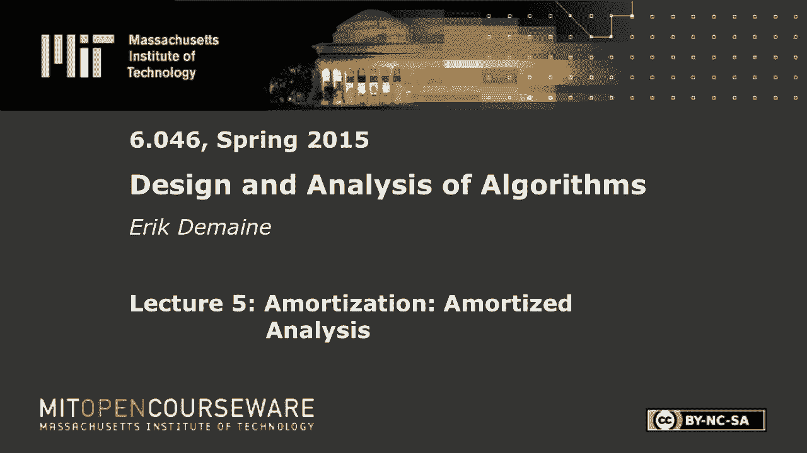
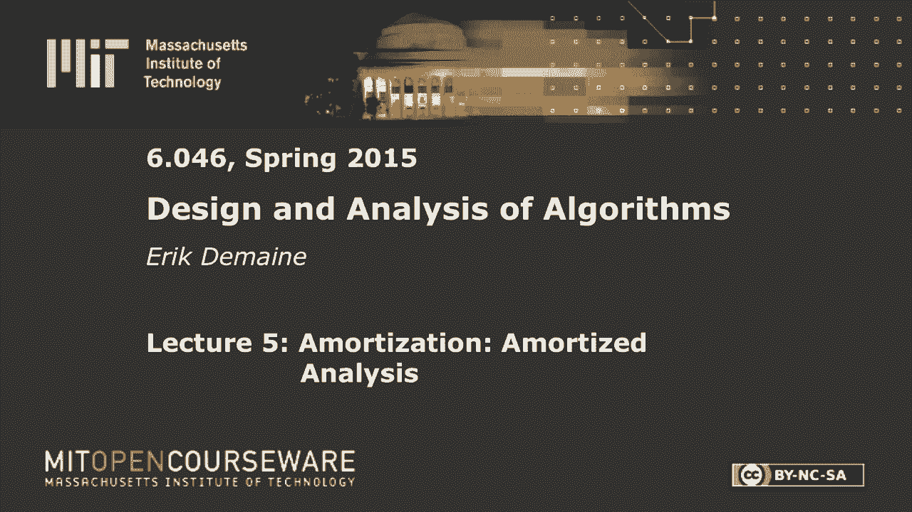

# 【双语字幕+资料下载】MIT 6.046J ｜ 数据结构与算法设计(2015·完整版) - P7：L5- 平摊分析 - ShowMeAI - BV1sf4y1H7vb

以下内容是根据知识共享许可提供的，您的支持将有助于麻省理工学院开放课件。

继续免费提供优质教育资源。

捐赠或查看麻省理工学院数百门课程中的额外材料。

所有的权利，欢迎回到六，今天我们继续我们的数据结构主题，但这一次不是做一个花哨酷的数据结构，我们将研究一些很酷的数据结构分析技术，这些对于大量不同的数据结构都很有用，尤其是在使用数据结构来解决。

实现一个算法，在迪克斯特拉，当你学习Dijkstra算法时，您有许多不同的堆结构可以用于优先级队列，在Dijkstra，他们给出了不同的Dijkstra运行时间，但在这种情况下，关键是。

你关心算法的总运行时间，小于您关心每个操作的单个运行时间，这就是摊销的意义，我想这是金融分析的一种技巧，但我们在计算机科学中把它作为一种分析技术，嗯，让我们不要担心每一个操作，最坏情况成本。

让我们只担心总的操作，所有运营成本的总和，这就是摊销的全部思想，但是有很多不同的方法可以做到这一点，我们将介绍四种不同的方法，今天有三个这样做的例子，你们上次在背诵课上看到了一些。

你在《六六》中看到了一点，所以让我首先提醒你们一个例子，从六个桌子加倍，四，六，对不起，六双是六，这是在哈希表的上下文中出现的，您可能还记得，如果您存储了n个项目，桌子上有M个槽，比如说用链子。

用链子散列，然后我们得到了一个预期的成本，常数加上表的负载系数大小除以项数，所以我们想要得到持续的预期，所以我们希望这最多是一个常数，我想我们可以摆大一点的桌子，虽然我们对自己的空间不满意。

但我们肯定希望m至少在n左右，这样就可以点一个了，解决这个问题的方法是每当桌子太大，如果桌子太小，就加倍或抱歉，当你有太多的物品时，把桌子的大小增加一倍，n是我们无法控制的东西。

那是某人在桌子上插入的项目数，如果n增长到与m匹配的值，将桌子大小增加一倍，您必须分配一个两倍大小的新数组，并复制所有项，这包括散列，但总的来说，这将是有序的，桌子的大小工作无关紧要。

不管我在这里用m还是m Prime，因为它们彼此在一个恒定的因子内，这很糟糕，线性时间做插入显然是不好的，这都是在一次插入操作中发生的，但总的来说不会很糟糕，因为你只有双倍的log n次，如果你看看。

所以也许你认为，哦，每个操作是log n吗，但也没那么糟，因为从一个空结构开始n个插入的总成本，大约是二的零次方，这是外面的大西塔，二对一，二对二，我们只做插入，这太棒了，两个对log n。

这是一个几何级数，所以这是n阶，数据，我猜，所以n插入成本θn，所以我们想说摊销成本，我是说我们做了N次手术，总成本是N，所以平均每次手术都是不变的，所以这就是哈希表是常量的意义，预期摊销。

我们将在以后的讲座中继续讨论哈希，可能我认为第八讲，但现在我们只是把这看作是一件普遍的事情，你需要加倍桌子的地方，然后这为您提供了一种快速插入表的方法，稍后，我们将考虑从表中删除，并保持空间不太大。

但这是一个起点，这是一个叫做聚合方法的通用技术的示例，这可能是最弱的方式，最薄弱的摊销方法，但也许是最直观的，聚合法很好地说明了我们所关心的，我们做一些连续的操作，让我们说，一般情况下，有k个运算。

衡量这些行动的总成本，除以k，这是每个操作的摊销成本，你可以把这看作是一个定义，但这实际上不是我们对摊销成本的定义，我们将使用一个更灵活的定义，但是对于像这样的简单例子，这是一个很好的定义。

它给你你想要的当你有，当你的操作顺序非常清楚时，就像这里，每一步你只能做一件事，它是插入，这就是我对这个问题的定义，那太好了，你一混合，我们就得到一个非常简单的总数，插入和删除，总数不是很清楚。

在某些情况下，总数真的很干净，所以你只要计算和除以一些运算，你得到了一个成本，这可能是摊销成本，这就是聚合法对简单和很有效，这是另一个不抱歉的例子，现在让我给你们一个摊销边界的一般定义。

一旦你处理不同类型的操作，这就变得很重要，我想说，一次摊销的插入成本，也许删除会花费一些其他的绑定，所以你要做的是分配，每次行动的费用，我应该称之为摊销成本，这样你就保留了总数，在那些缺点中。

所以我的意思是，如果我看所有操作的总和，该业务的摊余成本，我把它和所有实际成本的总和进行比较，行动经费筹措，摊销应该总是更大，因为我总是希望我的实际成本有一个上限。

所以如果我能证明摊销成本最多可以说是每个操作的常数，这样我就可以知道每次操作的实际成本之和至多为常数，我对个人成本一无所知，但我了解到总成本，在像DEX算法这样的算法的上下文中，你只关心总成本。

因为你只是，你不在乎时间上最短的路径，当算法完全完成时，您只关心最短路径，所以在很多情况下，也许不是实时系统，但几乎所有其他事情你只关心成本的总和，只要那是小的，你能负担得起偶尔昂贵的手术。

所以这是一个更灵活的定义，一种选择是将平均成本分配给每个行动，但我们还有一大堆手术，我们可以说，插入的成本高于删除的成本，或者类似的东西，事实上，让我举这样一个例子，呃，几周前你学到了两三棵树，呃。

这适用于任何结构，虽然，嗯，所以我声称我要看两三棵树上的三个操作，一个是创建一个空树，所以我需要考虑我们如何开始摊销，假设你总是从一棵空树开始，做一个需要恒定的时间，我支付log n时间。

我要稍微调整一下，在摊销的意义上，我每次删除支付零时间，如果你喜欢同样的东西，你可以写零的大O，所以删除你可以认为是一个免费的操作，为什么，这有点违反直觉，因为，当然啦，在现实中。

删除的实际成本将是log n，是啊，是啊，你永远不能删除比你更多的元素，您永远不能删除比您已经插入的更多的元素，老板，所以我可以用插入成本绑定删除成本，在聚合方法的上下文中，你可以看看所有操作的总成本。

我想我们在这里并没有完全分开，但如果我们看看总数，假设我们做C创作，i插入，和删除，总成本是c加i乘以log n加d乘以log n，点是d小于或等于i，因为您永远不能删除尚未插入的项。

如果你从一个空的结构开始，这就是i加d乘以log n，但那最多是我乘以log n的两倍，所以我们得到c加上i log n，所以我们可以把它看作是d乘以0，每次删除的成本为零，这是这里实际成本的总和。

这是摊销成本的总和，我们说删除为零，我们刚刚展示了这是一个上限，所以我们现在很开心，这里有个小问题，这就是为什么我在每个N上都写了星星，并不是每一次手术的成本都一样，就在你从一个空结构开始的时候。

插入成本恒定时间，因为n是零，当n为常数时，插入为常数时间，当n增长到n时，它在不同的时间花费log n时间，n是一个不同的值，我将用n来表示结构的当前大小，为了这个论点目前起作用，我需要n不是当前值。

因为这是一种充电工作，有些插入是用于大型结构的，有些是用于小型结构的，有些删除是针对小的，有些是为了大得到，想起来很困惑，我们一会儿就会解决的，但就目前而言，我将把n星定义为所有时间内的最大尺寸，好吧。

如果我们只是这样定义它，那么这是这是真的，这会让我为任何删除付费，但一旦我们有了更好的分析方法，我们稍后会移除那颗星，但到目前为止一切都好，两个非常简单的示例表加倍两个三棵树与自由删除，当然。

这适用于任何具有对数插入和删除的结构，但我们将在一个更多的地方使用两棵三棵树，以更有趣的方式分析它们，呃，以后，所以让我们进入下一个方法，哪种会计方法，如果你愿意，这就像银行出纳员的分析。

这些都是计算这些和的不同方法，或者思考总数，通常一种方法要容易得多，无论是对你个人还是对每个问题，更典型的是每个问题，通常这些方法中的一种或多种，会比其他人更直观，它们都是等价的。

但把它们都记在心里是很好的，所以你可以用不同的方式来思考这个问题，所以用会计方法，我们要做的是定义一个银行账户，在那个银行账户里，学分可能不是最好的词，因为你不允许银行账户变成负数，好的。

银行账户必须始终非负余额，因为否则你的总结就不会成功，所以当你把信用存入银行账户时，你付钱，你现在好像在浪费时间，以便将来支付，如果你想到运营需要钱，所以每当我做删除，我花实际时间log n时间。

但如果我在银行里有log N美元，我可以把那些从银行里拿出来，我可以用那些美元来支付这项工作的费用，然后删除本身在摊销意义上变得免费，所以这是一方面的操作，当我做插入时，我要从自己身上取出一些硬币。

成本是指插入的摊销成本上升，为了把那些硬币放进银行，但我可以用它们来删除，这就是插入要做的，我可以在银行存信用，然后我们单独允许一个操作将硬币从银行取出，你可以为时间付费，使用存入银行的信用证，好的。

只要余额，银行余额在任何时候都保持非负，这将是很好的，但银行余额是一种未使用的时间，我们付钱是为了在里面存放东西，如果我们用不好它，我们只是有一个时间上限，只要我们不消极，那我们就永远不会。

那么求和总是在正确的方向上，这种不平等将保持不变，让我们举一个例子，嗯，也许这是第一个例子，所以当我做插入时，我可以把，假设一枚有价值的硬币进入银行，所以插入的总成本，我支付log n星实际成本。

为了做插入，当我做删除时，真正的成本是log n星，但我要从中提取出来，log n星星硬币，所以总成本实际上是免费的，摊销成本总额为免费，是啊，是啊，而起作用的原因，余额总是非负的原因。

是因为每次删除之前都有一个插入，所以可能不是，这可能是一种不太直观的方式来思考这个问题，但你可以这么想，嗯，更一般地，所以我们想说的是，我们只支付log n而不支付星星，每个插入的当前值n。

所以我们想说，好的，让我把，删除，对于每个插入，当我删除，我消费硬币，和一般情况下，这里的公式是摊销成本，好的，所以插入我们只需将成本增加一倍，因为我们付钱给真实的东西，我们支付log n来存储硬币。

这是加押金的部分，因此插入保持log n，然后删除，我们支付log n进行删除，但是我们减去价值log n的硬币，所以希望能归零，但我们又有了这个问题，硬币实际上有不同的数量，取决于n的当前值。

如果你说好，你实际上可以让这个工作，这里有不同价值的硬币，我认为不变量是，如果当前结构大小为n，你会有一个大小的硬币原木一个原木两个，对数3对数4向上对数n，每枚硬币对应于产生n个该值的物品，因此。

当删除大小为n的项时，你将移除第n个log硬币，价值log n的硬币，好的，所以如果你小心的话，你实际上可以让这个工作，我想不变量是，当我做一个新的插入时，你可以检查不变量是否成立，我把n增加一。

我做一个新的硬币，当我删除时阻止那个值，我要把圆木的最后一枚硬币取下来，所以这确实成功了，所以我们除掉了终结者，好的，让我们用同样的方法来分析表格加倍，我们已经知道为什么桌子加倍是有效的。

但从不同的角度来思考是很好的，和，把硬币想象成实物是特别有趣的，在数据结构中，我一直认为把这个放在编程语言里会很有趣，但我不认为有一种编程语言里面有硬币，从这个意义上说，嗯，但也许你可以解决这个问题。

所以让我们回到双人桌，让我们说，当我们在表中插入一个项目时，这里，我只是要做插入，我们一会儿就会担心删除的问题，每当我做插入，我要在那件物品上投一枚硬币，硬币的价值，将是不变的，我要给常量起一个名字。

所以我们一会儿可以更精确一点，这是典型的井，这里有一个数组，我们从大小为1的数组开始，我们在这里插入一个项目，然后在上面放一枚硬币，也许我会抽硬币，我在这里丢失的一种颜色的硬币，所以我插入了一些项目X。

并在该项目上放了一个硬币，当我做下一次插入时，假设我得把桌子翻倍到二号，我要用完那枚硬币，所以把它擦掉，在我刚放下的东西上放一枚新硬币，和一般情况下，所以下次我加倍的时候，这就立刻，我要穿四号的。

我把这枚硬币擦掉，当我插入项目时，我在这里放了一个硬币，当然啦，z后面的字母是w，当我不得不再次翻倍时，我又投了一个硬币，2。我要用这些钱来支付双倍的费用，然后在下一轮我将在这里插入，这里这里这里。

我会在这里和这里放一枚硬币，你开始看到模式，所以我用完了这些家伙，当我不得不再次翻倍的时候，一半的物品都有硬币，另一半没有，因为我已经用过了，注意硬币不要用两次，因为你只能用一次。

你不能把钱分成双倍的钱，除非你在做股票，我想是的，一旦我到达一个数组完全满的地方，当n等于m时，最后一半的物品会有硬币，我要用它们来支付双倍的费用，所以这里的硬币数是n/2。

所以这就是为什么我想把这个常数说得更明确一点，因为它必须大于两个，在某种意义上，不管有多少工作，假设需要一个乘以n的功才能完成翻倍，那么这个常数应该是a的两倍，因为我需要做双倍的工作。

但我只有两个硬币来付，我这里没有硬币，两项上的最后n，因此摊余成本，翻倍操作的实际成本，它是一些theta n减去我可以移除的硬币数量和它们的价值，所以它是负c乘以n除以2，关键是这是零。

如果我们把c调大，只需要是一个常数，它需要大于常数的两倍，通常当你用硬币工作时，您希望将常数显式化，只是为了确保没有对常数的循环依赖，确保有一个有效的选择C可以消除任何成本，你想摆脱，好的，所以这是。

表加倍到目前为止任何问题的会计方法视图，到目前为止一切都好，非常简单的例子，让我们来看更多有趣的例子，我想你也会考虑插入物的摊销成本，它的成本是不变的，实时，实际成本不变，你还得投一个硬币。

它需要恒定的时间，所以插入件的摊销成本仍然是不变的，所以这很好，我们仍然不知道如何处理删除，但让我给你一个相反的视角，会计方法，它又是等价物，在某种意义上，但从另一个意义上说，可能更直观，对一些人来说。

课本上其实没有，但这是我用得最多的一个，所以我觉得值得教，这叫计费法，这也是更多的时间旅行，如果你愿意的话，如果你喜欢时间旅行，这个方法是给你的，或，也许更悲观的观点是把你的错误归咎于过去，所以说。

我们要做的是让银行不再有余额，虽然我的意思是它本质上是在那里，我们将允许运营收费，他们的一些成本可以追溯到过去，好的，不是未来，实际上有一篇数据结构论文，这证明了虽然时间旅行到过去是合理的。

到未来的时间旅行不是计算出来的，所以你不允许时间旅行到未来，只允许走到过去说嘿，你知道的，但我的意思是，你做这件事的方式得有点保守，你不能不停地给同样的操作充电一百万次。

因为这样手术的成本在一天结束时会上升，每项业务都必须支付其总费用，所以这是它开始的实际成本，然后是未来给它充电的东西，所以从分析的角度来看，你在考虑未来，可能会指控我什么，再次。

您可以定义操作的摊销成本，将是实际成本，所以当我们冲向过去，我们现在得到免费的美元，但我们必须为未来所做的一切付出代价，所以我们要想象我将来会被充电多少次，我得为此付出代价，现在在一个一致的时间线上。

你必须为将来的事情付出代价，所以让我们做一个例子，其实听起来很疯狂很奇怪，但我实际上发现这更直观，即使是这些例子，所以让我们从加倍桌子开始，所以我们已经有了这样的图片，一切都会大同小异。

在我把桌子翻了一倍之后，我的数组是半满的，再次仅插入，虽然我们一会儿会做插入和删除，为了从半满到完全满，我必须在两个插入中做N，非常相似的东西，但我要说的是，当我将数组翻倍时。

下次我要把翻倍的费用算在那些手术上，一般来说，这是，你实际上可以说得很简洁，每当我做翻倍手术时，我要给它充电，到所有的插入，自从上次翻倍，这是一个非常明显的项目翻倍发生，然后他们不会发生一段时间。

我只是所有这些插入发生，自从上次翻倍向他们冲锋以来，有多少，嗯，正如我们争论的那样，有N超过两个，和成本，为了让这个加倍免费，我需要充电，所以你知道这个翻倍的成本是，但没有太多的东西可以收费。

我要把我的费用平均分配给他们。这意味着我对每个人收取固定的费用，这里的关键事实是，我只收取一个项目的费用，我只给插入物充电一次，因为这个，因为我从来不会对一件商品收取两次费用，只要我只是暂时插入。

如果你一直看，你只能给一个插入物充电一次，这很好，因为插件必须支付他们的总费用，在未来，只有一次充电，它只是一个恒定的数量，则插入件的摊销成本仍保持不变，加倍摊销成本为零，因为我们把全部费用都记在过去。

好的，所以同样的例子，但视角略有不同，让我们做一个更有趣的例子，插入和删除，在表格中，让我们说，我想保持这一点，表的大小总是在一个常数因子内，表中现有项目数的百分比，如果我只是想要一个上限。

那我只需要翻倍，但如果我也想要一个下界，如果我不想桌子太空，然后我需要增加桌子减半，所以我要做的是当桌子百分之百满的时候，我把它的尺寸扩大了一倍，当桌子满了百分之五十，我应该买尺寸合适的吗？

之后和它的线性时间，就在，我基本上可以做插入，删去，插入删除，插入删除，每一次操作都需要线性时间，因为也许我还没吃饱，是啊，是啊，如果我还没吃饱，然后我要把数组缩成两半，把这部分去掉。

然后如果我立即插入，它又变成百分之百满了，我得把尺寸增加一倍，然后如果我删除它变成不到一半满，我必须有尺寸，每次操作都需要线性时间，所以摊销成本是线性时间，这不好，所以我要做的是。

只要把这些常数分开一点，当我百分之百吃饱的时候，我会加倍，这似乎很清楚，但假设当我有四分之一满的时候，那我就有任何价值了，不到50人在这里工作，但是，这真的会起作用，这将是每次操作的恒定摊销，但这都是。

尤其是我们最初对表格加倍所做的分析在这里是行不通的，因为它很复杂，随着时间的推移，这个东西会缩小和增长，你只是在总结，那可不容易，这取决于操作的顺序，但有充电和硬币，我们可以用一种相当干净的方式来做。

我要用充电来做，所以这是这个常数的特殊选择很好，因为当我加倍一个完整的数组时，它是半满的，当我有一个四分之一满的数组时，像这样，然后我把它分了，然后我把它缩小，我把这部分去掉，它也是半满的。

所以每当我做双倍或一半，新数组是半满的，百分之五十，那很好，因为百分之五十离两个都很远，五百零一百，好的，所以我们的好状态是在翻倍或半倍后，那么我们知道我们的结构是50%满的，为了达到下溢的状态。

我们必须有，我必须删除至少四分之一的项目，四分之一米才能溢出，在那里我必须加倍，我必须在两个项目上插入至少M，不管怎样，常数分数乘以m，这就是我要收费的，现在说清楚，当百分之五十满的时候，我可能会。

我可能会插入删除，插入，删除，在某个时候进行许多不同的插入和删除，这两件事中的一件会发生，虽然为了来到这里，我至少要做四次删除，我还可以做更多的插入和删除，但我至少要做那么多，这些就是我要收费的。

所以说，到至少m除以4的删除，自从上次调整大小的任何类型加倍或有好的，我要收取双倍的费用，到两次插入的至少m，从上次调整大小开始，这是因为拥有花费了他们的时间，加倍花费了他们m的时间。

我有他们的行动收费两个，所以我只对每个手术收取恒定的费用，正因为如此，自上次调整大小子句以来，很明显，你从来没有对一个项目收费，从不对一次操作收费超过一次，因为您可以将时间除以调整大小发生的时间，生长。

或者心理医生，半打或双打，每次调整大小只对过去的时间窗口收费，就像你有时间的史诗，你把它们分开，你只在你的史诗中冲锋，好的，所以这很酷，所以你只能得到一个恒定数量的费用，一个恒定数量的项目。

因此插入和删除是恒定的，摊销拥有和加倍是免费的，摊销，这就是摊销开始变得有趣的地方，你也可以从硬币的角度来考虑这个例子，但是在物品上投币，但就在那时，你必须考虑硬币在哪里的不变性，我发现这是更多的工作。

我们实际上不得不在这里做，总是声称最后一半的物品有硬币，你得证明这真的，用这种方法，你没有，我是说你要证明的是有足够的东西可以收费，我们必须在这里证明有N个以上的项目需要收费，差不多吧，但很明显。

你没有收取同样的费用，不止一次，你从来不试图用不在那里的硬币，因为自从条款，所以对每个人，他们自己的任何方式都行得通，我想我将跳过这个例子，但我只想提一下，所以对于两三棵树来说，我们说删除是免费的。

我们用硬币不变量来做，有一枚大小的硬币，为每个i记录i，你可以说，当我删除项目时，我要把它充电到使n成为这个当前值的插入物上，因为插入付费日志n实际成本，所以它可以支付另一个log n。

为删除其他项目付费，我们当前正在删除的那个，这样你就不会给插入物双倍充电了，因为你现在正在减少n，所以对于n来说，再次达到这个值，您将不得不进行另一次插入，所以同样的事情，略有不同的视角。

让我们来看看更有趣的，在某种意义上更强大的东西，列表上的最后一个方法，也就是电位法，这是一个很好的练习，你能用多少种方法给猫剥皮，所以嗯电位法，我喜欢称之为以正式的方式定义因果报应，嗯。

更像是我们将要考虑的会计策略，但我们将把这种平衡定义为数据结构状态的函数，所以它被称为位势函数，但你可以把它看作是银行余额，你可以把它看作动能，我猜，就像银行账户一样，我们希望这个函数总是非负的。

我们也把它变成一个整数，那就方便了，势函数基本上是试图测量数据结构有多糟糕，现在又像存钱以备不时之需，每当我们要做昂贵的手术时，我们都想要它，像个替身，或者这个潜力已经变得足够大。

我们可以将成本计入潜力的降低，所以这就像是在储存能量，每当你知道，只要我们有空闲时间，会给势函数一些时间，从某种意义上说，这就像会计方法一样，但我们在这里对事物的定义不同，我们明确的说过，嘿看。

我现在要储存一些信用，所以我们基本上是在指定三角洲，我们在这里说，在这里，我们将定义当前状态的这个神奇函数，从中你可以计算出三角洲，而且从这里你可以积分和计算势函数，所以它们是可以互换的。

但通常考虑一个观点或另一个观点更容易，你经常能想到，你可以看看数据结构发生了什么，然后说嘿，你知道这个道具，数据结构的这一方面使它变得糟糕，它使昂贵的操作，你可以定义势函数，然后检查一下它是否有效。

但想出这些功能有点黑魔法，所以这取决于你喜欢如何思考事情，和以前一样，我们可以定义一个摊销成本，这将是实际成本，加上势能的变化，所以电位的变化只是手术后的电位，减去手术前的电位，我强调，很明显从。

我们安排事情的方式，但我关心的是摊销成本的总和，我关心那个，因为它应该是实际成本总和的上限，如果你看看这个总数是多少，我右手边有，我有摊销成本，加上手术后的费用，减去手术前的费用。

如果我把所有这些加起来，这部分是伸缩的，或者你每个学期都被取消，摊余成本之和，等于实际成本之和，所以当你这样定义事物时，潜在方法的一个小问题是，你还得在开始时支付费用。

因为我们希望实际成本是最多摊销成本，好的，所以我们需要把这个部分放在这里，所以它最多是一些摊销成本加上开始的费用，这一部分就变成了负数，所以我们通常忽略它，只能帮助我们，所以当你定义一个势函数时。

你真的希望一开始是零，这很有趣，但你在时间开始时支付了起始状态的费用，当你做了零手术，你真的喜欢成本为零，所以你不，你不想把东西存放在银行里，所以这个应该是，常数可能没问题。

或者不管你第一次手术的费用是多少，但应该是常数或零，通常我们会说看，让我们从一个空的结构开始，从那里开始工作，空结构的费用通常为零，也是如此，所以当你定义具有势函数的东西时，你得小心你的初始状态。

你得确保它不是阴性的，就像你在这里做的那样，但你不必担心那边的这部分，好的，所有这些基础设施，有什么好处，让我们举几个例子，这些将是最有趣的例子，摊销的一个经典例子是将二进制计数器递增。

所以当你有一些二进制值，比如这个，你把它递增，许多位变化，但在摊销意义上，只有一个常数会改变，如果我从零向量开始，零比特矢量，我增加得很好，第一个增量成本，下一个增量需要两个，下一个增量成本为1。

下一个增量成本三，然后一个然后两个，然后一个，然后四个，那么它是一个分形，但不是考虑分形，你知道，努力证明求和对n个运算是线性的，让我们用势能法，这里的直觉实际上很容易，因为增量，有一个非常明显的成本。

只是尾随的数量，加一个，这就是实际成本，我们希望它是恒定的，如此直观，如果你必须说出一件事，什么会使增量变得糟糕，如果我只看一个配置是这么坏是这么坏，配置有多糟糕，一旦你有了最糟糕的状态，后面的越多。

状态越差，所以说，这是一个自然的定义，结果行不通，让我们看看为什么，嗯，我觉得，这里有一个例子，在我们的增量阶段接近尾声的时候，我们有一大堆，但没有尾随的，尾随的数量是零，如果我做一个增量，现在。

尾随的数目是n所以，如果你看摊销成本是实际成本，加上费用的变动，所以我实际上为摊销意义上的操作支付了n，那是不好的，我们不仅要支付固定的费用，但它在正确的轨道上，尾随数，尝试它是很自然的事情。

但这并不完全符合我们对费用的定义，总数的总数，是啊，是啊，让我们把费用定义为工作的一个比特的数字，但你得到了两个得到了一个飞盘，哦，对不起，好在我错过了，好的，一号位，直觉上是不好的。

这是一个很好的定义，因为当我增加，我只创建一个，所以我不会有这个问题，三角洲费用上涨了很多，对不起，费用涨了很多，三角洲费真的很大，因为即使在这种情况下，如果i递增，我只加了一个，在这个场景中。

我摧毁了三个，一般加一个，如果有让我们说，T尾随位，然后一个增量，它创造了一个比特，总是这样，不可能是零，然后我有一个净阳性，但大多数时候实际上我破坏了一点，嗯，一半以上的时间我破坏了一个比特。

我只创建了一个位，就一个位的总数而言，因此摊余成本，是实际成本，就是这个加T，我实际上要移除，是啊，是啊，我想把大O去掉，如果可以的话，我要数数，我想把我的计数精确一点，因为我必须在这里做一个减号。

如果我只写减去T，那不太行，因为这里有一个常数，我必须消除，如果我计算改变的位数，那就是增量中的一加t，现在势能的变化是i减少t，我增加一个，我得到零分，好像有点太小了，每次操作零时间，你在加一个1。

你不是在减去人类，或者你没有减去两个，所有的权利，对不起，那是两个，谢谢。我只是不会做算术，我把一切都写对了，但这是一个加一个加一个，T减去T是现在取消的关键部分，如果你在测量运行时间。

而不是改变的位数，你得在这里有个大O，在这种情况下，你必须将费用定义为一些恒定的时间，一位数，所以你仍然可以把常数设置得足够大，这样乘以c的这一部分就会湮灭，这个会有一个大O的部分。

我想我写它只是为了好玩，但这就是为什么你看到了两个版本，这将是负c乘以t加1乘以c，所以这还是可行的，如果将C设置为正确的值，你仍然会得到两个，嗯，所以二进制计数器是常数，按次摊销，所以我觉得这很干净。

比现在分析成本的分形容易得多，不起作用的二进制计数器增量和递减，还有其他数据结构可以为另一个类做这件事，让我们做，让我们回到两三棵树，因为我有更多关于他们的有趣的事情要说，关于二进制计数器的任何问题。

正如你所看到的，定义一个势函数并不完全容易，但我们要看看，你看到足够多的例子，你对他们有一些直觉，但这可能是最难使用的方法，但也是最强大的，我会说，所有硬摊销都使用一个势函数，这就是生活，找到他们很难。

这就是现实，我只想分析两三棵树中的插入，然后我们会做插入和删除，我想数数一棵二三树上有多少个劈叉，当我做插入时，所以记住当你插入一个二三树，所以你开始了一片叶子，你在那里插入一个键，如果太大了。

将该节点分成两部分，它导致在父级中插入密钥，那可能太大了，你就分开了，等等，所以分裂总数，短跑，上界log n，好的，绝对登录n，在最坏的情况下，这是实际成本，但正如你可能猜到的，我索赔。

摊销拆分数仅为常数，首先，我们只用插入和删除来证明这一点，而一个二三树其实不是真的，但对于插入来说，这是真的，所以让我们证明一下，嗯，二，三棵树，我们有两种类型的节点，两个节点，和三个节点。

我正在数孩子的数目，钥匙的数量比孩子的数量少一个，否，没有垂直线，这只是一些关键X，一些键x和y，将密钥插入节点，瞬间就变成了一个四节点，你可能会说，它有三把钥匙，x，y，和z，四节点，它有四个孩子。

所以这四个，我们把它劈开，四个孩子的数字是一样的，但现在它们分布在x和z之间，然后Y被提升到下一个级别，它允许我们有两个指向x和z的指针，这就是两三棵树的工作原理，这就是分裂的工作原理，现在。

我想说分裂，我想把分裂记在什么东西上，假设Y是插入的钥匙，所以我们从X开始，z，当我们进行插入时，它是一个三个节点，变成了一个四节点，然后我们做了一个分裂，这给我们留下了。

那么你对这个过程有什么总体看法，是什么让这个例子变得糟糕，从某种意义上说，是什么导致了分裂，我是说插入是一回事，但还有一件事我们可以收费，插入不够，因为我们要做log n拆分。

如果我们想要恒定的摊销约束，我们只能向插入件充电一次，三节点数，准确地说，这是一个很好的势函数，因为在这张图片的左边，我们有一个三节点，在图片的右边，我们有两个节点，现在父母发生了什么。

我们一会儿就得担心这个问题，但你有直觉，三个音符的数目，如果你看，我只看了这里的一个操作，但如果你更普遍地看一个昂贵的插入物，因为它有很多分裂，唯一的原因，唯一可能发生的方法是如果你有一条链子。

三个相互连接的节点，你在这里做一个插入，这个裂开了，然后这个就裂开了，然后这个就裂开了，所以有三个节点在周围徘徊，劈开之后，最后一个分裂的节点的父节点，该节点可能成为三个节点，所以它就在上面。

在某个地方你可能做了一个新的三个节点，但这个是两个节点，这变成了两个节点，这变成了两个节点，所以如果你之前有k三个节点，之后你就有一个，听起来很熟悉，这实际上正是二进制计数器所发生的事情。

所以这看起来像是一个玩具例子，但我们在这里创造，我们最多创造了一个，往下一点，我们最多创造一个，三节点，也就是分裂停止的时候，当分裂停止时，这是我们唯一一次将密钥插入节点，它不会裂开。

因为否则你分裂的时候就分裂了，你总是做两个节点，这在最后很好，当你停止分裂，你可能做了一个三个节点，所以在插入中，那么这个操作的电位变化是，负k加1因为每一次分裂都有三个节点要充电，或者每分裂一次。

有一个三个节点变成了两个节点，两个两个节点，所以电位下降了一个，因为你以前有一个三节点，然后你就没有了，在最后，您可以创建一个三个节点，那是另外一个，所以摊销成本只是这两件事的总和，我们得到了一个。

k减k加1，这就是一个潜在的方法变得强大的地方，我想说你可以把这看作是一种收费的论点，但它变得非常混乱，也许用硬币是最合理的，你，本质上你想要的不变性，每三个节点上都有一个硬币，同样的事情，当然啦。

但我想想起来更容易，这边，说好，三个节点似乎是坏事，让我们数一数，让我们看看会发生什么，更像你说的，我想要这个不变量，每三个节点有一个硬币，我怎样才能做到这一点，它只是神奇地工作，因为它有帮助。

这是真的，我们必须得到正确的势函数，那些很棘手，和一般摊销，除非你在P集上被告知证明，摊销订单，你，并不总是知道什么是正确的运行时间，你只需要实验，我们的最后一个例子，最令人印象深刻的，我们到这边来。

这是一个惊喜，我想它甚至不在名单上，我想做，嗯，这对插入来说很棒，但是删除呢，我想做插入和删除，我想做两棵三棵树，但是两三棵树不行，如果我想为插入和删除获得一个恒定的摊销约束，我在这里摊销了一个常数。

我应该说清楚，我忽略了搜索的成本，这么说吧，由于某种原因，搜索很便宜，也许你已经知道你的钥匙在哪里，你只想插入那里，然后只插入在二三树中摊销的成本常数，插入和删除不是那么好，每个操作都可以为log n。

如果我做插入和删除，本质上是出于同样的原因，二进制计数器对每个操作都可以是n，如果我做增量和递减，我可以在这里，你知道，增加几倍，然后我改变了大量的比特，如果我立即减少。

然后所有的位返回并递增所有的位返回，减少所有的位返回，所以我用同样的方法在每个操作中改变n位，如果你，如果你只想你的树的一条路，你把零位看作两个节点，一位作为三个节点，当i通过在底部插入而递增时。

所有这三个都变成了一个，除了顶部我做了一个三，这就像一个二进制计数器，从所有的1到1 0 0 0 0 0，然后如果我减少，如果我从同一片叶子上删除，然后我将不得不做合并所有的方式回来。

再把它们变成三个节点，所以每个操作都要支付log n，log n还不错，但我真的想要不变，所以我要介绍一种新的东西，叫做两棵五树，一切都会像你学到的B树一样，除了现在每个节点的子节点数。

应该在两到五个之间，定义了所有的操作，同样的，我们已经谈过了，现在插入，当你有六个孩子时插入，那你就溢出来了，然后你会一分为二，以此类推，所以实际上我应该画那幅画，因为我们需要它。

所以如果我从五个节点开始，也就是说它有四把钥匙，然后我插进去，我得到一个六节点，好的，那太多了，所以我要把它分成两半，这将留下一个，一个三个节点和一个单项，它被提升到父节点，所以我们从五节点开始。

结果是两个三个节点，好的，那是分裂的，我们也污染了父母一点，但这可能会导致另一次分裂，它又会是这个样子，所以如果我们只是做插入很好，我们只计算五个节点的数目，否，没什么不同，对呀，但我想同时做。

插入和删除，所以让我们记住删除会发生什么，所以如果你只删除一个键和一个叶子，问题是它可能会变得太空，我们允许生的孩子的最低数量是两个，所以两个空的就是我有一个孩子，所以也许一开始我有两个孩子。

我有一个单一的键X，然后也许我删除了X，所以现在我有零键，这是一个单节点，它只有一个孩子，有两种情况，也许你的兄弟姐妹有足够的钥匙，所以你可以偷一个，然后你那真的很便宜，但另一种情况是你，是啊，是啊。

我还得让我父母参与进来，所以也许我要从X那里拿一把钥匙，把所有这些东西融合在一起，为什么我得到的是我在这里有两个孩子，这里有三个孩子，我也把我父母搞砸了一点，但这将是递归的情况，所以我要讲的是。

这通常是一种合并操作，我和我的兄弟姐妹合并了，然后可能再次分裂，或者你可以把它想象成从你兄弟姐妹那里偷东西，就像你可能有经验做的那样，我没有兄弟姐妹，所以我没机会这么做，但我偷了我父母的钱，所以不管。

然而，你想考虑一下，在B树中合并，我们从一个二节点开始，这里我们得到了一个三节点，嗯哼，那很好，这是不同的，至少这里的坏情况是一个五节点，坏情况这里是一个两个节点，我应该使用什么潜在的函数。

有两个或五个子节点的节点数，是的，就是这样，只要把它和，这将是，加上节点数，有五个孩子，这是衡量业力，这就是我的树会有多糟糕，因为如果我有两个节点，我真的快要崩溃了，这可能是不好的。

如果我碰巧删除了那里，坏事就要发生了，如果我有一堆五个节点，那里可能会发生分裂，我不知道这是否会是一个答案，或删除下一个，所以我要跟踪他们两个，幸运的是，他们都没有产出五两个，如果他们真的喜欢。

如果我们做两三棵树，这完全是一场噩梦，因为你数不清两个节点的数目，加上三个节点的数目，这就是所有潜在的节点，每一步只改变一个，那永远帮不了你，但在这里，我们在下界和上界之间有足够的间隙，一般来说。

这里的任何常数都行得通，这些通常被称为A B树，B树的推广，其中您可以指定下限和上限，只要一个，只要a严格小于b/2就可以了，然后呢，这个论点行得通，只要a和b之间至少有一个空隙，这个论点会奏效。

因为小的，在小箱子里，你从工作开始，你能生的孩子最少，最后你会得到更多，在另一种情况下，你有太多的东西被2除，你不希望除以二的结果是这里的坏情况，这就是会发生的事情，即使有两棵四棵树，两三四棵树。

但有两棵五棵树，有足够的差距，当我们分成五分半时，我们得到三个，只有两个，当我们合并两个时，我们得到三个，没有五，在任何一种情况下都是这样，如果我们分开，如果我们做一个插入，用k分裂。

势能的变化是负k加1，我们可以在顶部做一个单个的五个子节点，当我们停止分裂，但每次我们分开的时候，或者每次我们分开，我们取了一个五节点并摧毁了它，留下了两个三个节点，所以它减少了k。

所以这个k成本被抵消了，通过这个负k和变化势，所以摊销成本和以前一样，但现在也用删除，具有k个合并操作，我把这一切都当作一次行动，再次，势能的变化是负k，当我们停止合并时。

因为我们从父母那里偷了一把钥匙，它现在可能是一个两个节点，而以前不是，如果已经是两个节点，然后会有另一次合并，这对我们来说是一个很好的例子，但当合并停止时，它们停止是因为我们击中了一个节点。

那至少是三个节点，然后我们从中删除一个密钥，所以它可能是一个两个节点，所以势能可能会上升一个，我们做一个新的坏节点，每次我们进行合并，我们摧毁坏节点，因为我们从一个二节点开始，我们把它变成了一个三节点。

所以摊余成本是实际成本，即k，加上势能的变化负k加1，所以摊销成本只是一个恒定的拆分或合并数，每次插入或删除，所以这真的很好，如果你在模特里，其中更改数据结构比搜索数据结构更昂贵，例如。

你有很多线程并行访问你的东西，你在多线程上，多核机器什么的，您有一个共享的数据结构，你真的不想经常改变事情，因为你你得把锁，然后这会减慢所有其他线程的速度，如果搜索真的很快，但是拆分和合并是昂贵的。

这就是为什么你应该用两棵五棵树而不是两棵三棵树，因为两三棵树，它们会一直分裂和出现，log n差别不大，log n对常数，但是对于数据结构来说，这通常是上一堂课的差距，我们非常兴奋。

因为我们从一根木头到另一根木头，在这里记录我们很兴奋，我们从对数到常数，稍微好一点，但都是小数目，但我们仍然喜欢我们喜欢尽可能地快，在一个真实的系统中，其实，它更重要，因为分裂根可能是最糟糕的。

因为你是每个人都在触摸的根源，在一棵两五的树上，你几乎从来不碰根部，几乎总是在树叶处分裂和合并，而在两三棵树中。

