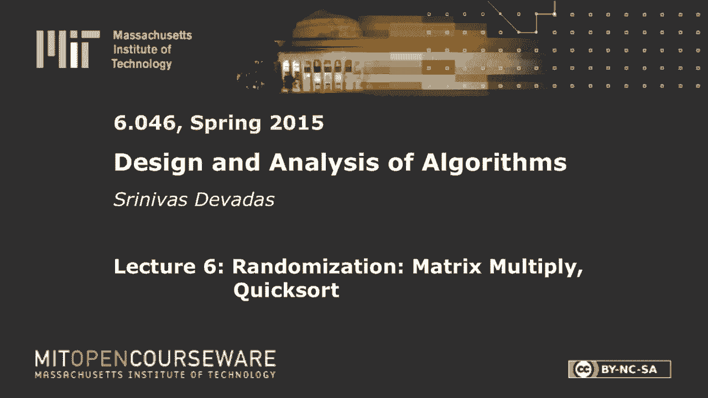
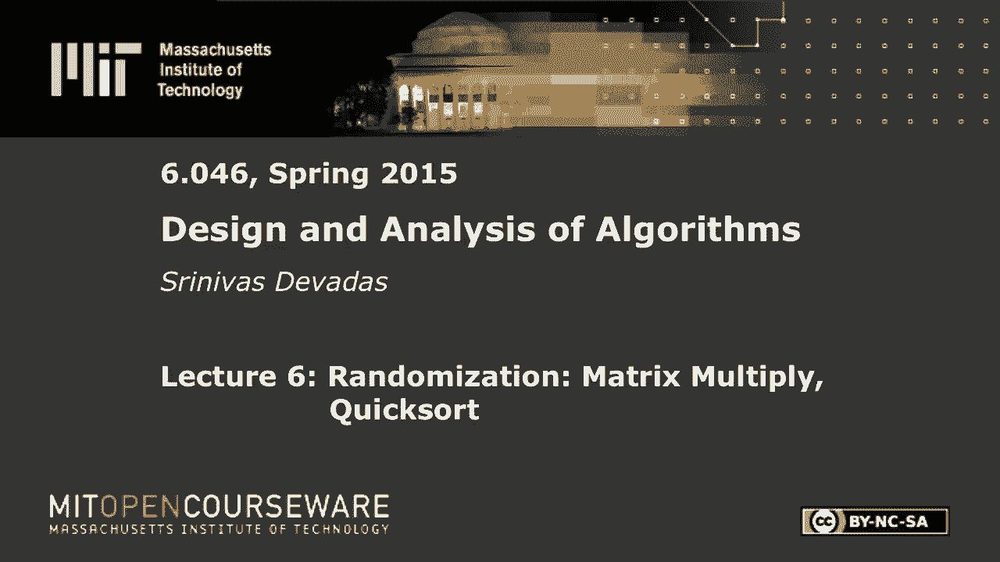
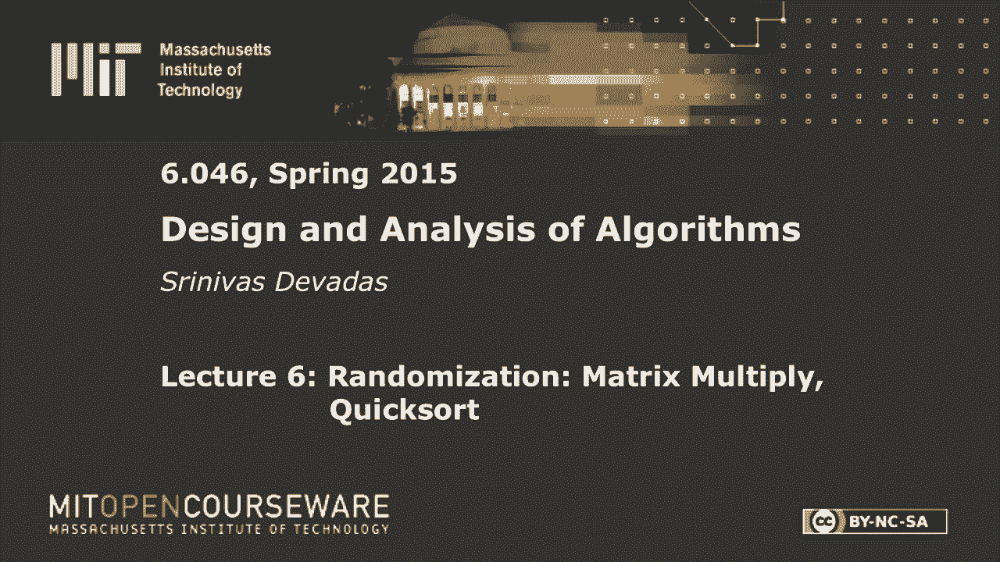

# 【双语字幕+资料下载】MIT 6.046J ｜ 数据结构与算法设计(2015·完整版) - P8：L6- 矩阵乘法、快速排序 - ShowMeAI - BV1sf4y1H7vb

以下内容是根据知识共享许可提供的，您的支持将有助于麻省理工学院开放课件。

继续免费提供优质教育资源。

捐赠或查看麻省理工学院数百门课程中的额外材料。

所有的权利，早上好，每个人，让我们今天开始一个新的模块，我们将用几节课来讨论随机算法，所以嗯，我们不仅会看到解决像排序这样的老问题的稍微不同的方法，我们也会看看如何，我们可以分析这种生成随机数的新算法。

以便在执行时实际做出决定，很明显，我们最终会得到给我们的分析，算法的预期运行时，比如说，或者算法是否会产生正确的结果，这个算法产生正确结果的概率有多大，所以说，我将谈谈为什么我们对随机算法感兴趣。

几分钟后，但让我来定义什么是随机算法或概率算法，开始事情，所以随机算法是，生成随机数，现在这可能是一个掷硬币，但更多的时候，你产生了一个来自某个范围的实数，有时你在生成一个向量，你会看到一个不同的。

这里有几个不同的例子，在今天的讲座和部分中，它将根据这个值做出决定，现在你可以想象一个算法是递归的，在递归的每一个层次上，它会产生一个随机的R，因此，当您在递归的特定级别上执行时。

你可能会根据R做不同的事情，不仅如此，如果您在相同的输入上再次运行算法，执行会不一样，因为你假设一个真正的随机数生成器，与伪随机相反，和R，您将在不同级别的递归中得到，或者通过算法的执行。

从第一次到第二次都会不一样，所以在相同的输入上，算法可以运行不同数量的步骤，所以你可能在第一次执行时很幸运，算法完成了，让我们说，在一百个时间单位里，第二次需要很长时间，它需要七百个时间单位。

我们的目标是尝试分析，这个概率运行时将要求一个期望，能够计算运行时的期望，或者如果你说的是一个不同的场景，不同的处决，我实际上可以产生不同的输出，在这种情况下，这些输出中的一个或多个可能是不正确的。

你实际上得到了错误的答案，很明显，这将以一定的概率发生，我们将不得不，决定或分析概率是多少，一般来说，我们不会对高概率的错误感到高兴，你可以想象，我们想建立一个算法。

这样你就可以把错误输出的概率降低到非常非常小的程度，你可能需要更长的时间才能做到这一点，低水平的不正确错误或不正确输出，在一种情况下，对于某一组输入，与另一个案件，对呀，这就是这里的随机化设置。

你会有算法，你可以认为他们可能是正确的，好的，所以这些是算法，你想认为它们可能是正确的，他们确实有名字，它们被称为蒙特卡洛算法，然后你有可能很快的算法，在可能正确的情况下，你可以。

你知道他们给你正确答案的概率是恒定的，百分之九十九，很明显，你可以试着把它参数化，在可能很快的情况下，你说它在预期多项式时间内运行，这实际上意味着您可能必须运行它进行更多的迭代。

所以与其花一百次迭代或一百步来排序，你可能要花110英镑对吧，但在可能快的情况下，你确实在M上得到了排序的结果，当算法完成执行时，你确实会在最后得到排序的结果，所以它是正确的，可能很快。

在我们可能正确和确定的快速上，这里是拉斯维加斯，所以你有蒙特卡洛对拉斯维加斯，所以昨天，我突然想到，我教了这门课很多次，但昨晚我第一次想到，应该有一些算法可能是正确的，可能是快速的。

这意味着他们是不正确的和缓慢的，你知道有些时候，你认为这些算法叫什么，对不起，什么茶，哦，哦，值得一个飞盘，我的天啊，就在那里，你去那里，你现在可以走了，他们不叫T，好的，所以我们应该把它写下来。

所以大家都知道，可能是正确的，而且可能很快，也就是，我猜，我想他们不会让你去任何地方，我不知道那是什么意思，不正确和缓慢，在T的情况下，现在那是，那不是猜测，我是说，想想我们为蒙特卡洛准备了什么。

拉斯维加斯，是啊，是啊，这些是你要在测验中得到的问题，那么还有什么，我猜你们不赌博，你不去，是啊，是啊，你去吧，值得一个飞盘的大西洋城，是啊，是啊，绝对正确，他们其实是，原来。

大西洋城不是一个真正流行的名字，但这是在，在这方面使用的，大多数时候，如果你有一个可能正确的，可能是快速算法，你可以把它转换成蒙特卡洛算法或拉斯维加斯算法。

有一些质数测试算法来测试一个特定的数是否是质数，在概率多项式时间内运行，他们可能会错误地告诉你这个数字是素数，这是大西洋城算法的一个例子，我们想做大西洋城，我们要做的是，我们将研究几种不同的算法。

这两者都将激发为什么随机算法是有趣的，蒙特卡洛的例子是检查矩阵的乘法，所以你得到了几个平方矩阵，它们都是n乘n矩阵，你把它们乘以b，得到c，所以你得到了c矩阵，而不是重复乘法和检查结果。

你想做一些更好的事，你想核实一下，有一定的概率，您可以参数化输出矩阵为，实际上是两个输入矩阵的乘积，这是一个随机算法，那是蒙特卡洛，因为你不能保证输出矩阵是，事实上，前两个矩阵或操作数矩阵的乘积。

但你会很好地感觉到，这种可能性有多大，你可以把错误的概率压扁到，无论你希望它有多低，除了你必须运行它，运行算法更长时间，对呀，这是蒙特卡洛的一个例子，现在快速排序，说没有意义，我想你可以。

但说起来没有太多意义，你有一个几乎排序的数组，对呀，那到底是什么意思，你必须描述一下，所以快速排序就是一个例子，其中您保证在它的末尾得到一个排序数组，对呀，所以这是正确的，您将得到一个排序数组。

这就是你想要的，降序，升序，但它可能不按顺序运行，log n log n时间，你不能那是预期的时间，顺序n log n是预期时间对，所以这可能是快速对应的好吧，所以这就是设置。

你可以明白为什么这些很有趣，因为你可以想象在实际场景中，你可能想以概率的方式做一些检查，你想做到这一点，而不必重做所有的工作，对呀，你不想，你不想，很明显你不想要你的矩阵检查器，乘以与真矩阵相乘一样慢。

否则就没有意义了，所以让我们深入研究一个矩阵乘积，我们的第一个例子，一个可能正确的算法，蒙特卡罗算法，所以我想在这里做的是c等于a乘以b，简单的算法，我想我们这些上过高中的人，n次方算法的知识。

还是学回来的，那么它只是对应于取行和列，你得到一个条目，您有n个平方项，需要计算对应于输出矩阵c的项，你要做n阶乘法和加法，但是我们真的要在这里考虑乘法，当我在这里说n的时候，不是手术总数。

是乘法的次数，原因是这可能已经消失了一点，但乘法可能仍然是正确的，你知道吗，在计算机中，把两个数字相乘需要更长的时间，整数或浮点数，那么把数字相加过去要戏剧性得多，在计算机中i乘法和添加之间的区别。

但你知道，多亏了流水线和大量的优化，乘法实际上非常快，但它们显然是比加法更复杂的操作，所以我们要数乘法，所以当你看到Karatsuba分而治之的时候，你知道回到六点，我记得我们在计算乘法。

我们实际上是在用乘法来交换加法，我们试图缩小与算法复杂性相关的数字，在计算倍数时，如果你真的计算了添加的数量，至少从恒定因素的角度来看，它们是在上升的，不一定从渐近复杂性的角度来看。

这就是你可能听说过的草莓的简单算法，你们中的一些人可能已经看到了，基本上，应变就是把两个乘以两个矩阵，我用的是七种乘法，而不是八种，所以现在如果你这样做了，这类似于当前的子条形图分析，你可以。

你可以用n来做这个，上升到log 2 7次，它本质上是n上升到2。8，一次，因此而不是n的立方，你可以跑到2分81秒，现在事实证明，人们显然没有停止这样做，你可以把n升到2。7 0，做一百四十次的事。

七十个矩阵的三千乘法，对呀，所以你可以像古墓厨师一样到处玩，我不知道你是还记得还是被掩盖了，但你知道，KT Suba可以被推广到这个叫做坟墓厨师的东西中，同样的事情斯特拉森，你可以去做，不是两个两个。

而是七十乘七十，这改善了事情，但事实证明你知道还有其他方法，算术级数，求和方法，所以一个著名的算法，高达2010是，是最复杂的算法，被称为铜匠Winograd，也就是两点，三个，七六，你把它从2。

337缩小到2。337，结果是有两个不同的研究人员提出了两点三，但这个特定的候选人，你知道小数点后第六位赢了对吗，所以她有一个八，另一个人有九什么的，但不管怎样，所有这些都是不切实际的，好的。

你不想用它们，与这些事情相关的恒定因素要大得多，然后你这里有什么，我是说，这里的常数因素，我想这是对的，有道理，这将是一个，是啊，是啊，所以忘记了添加，当然啦，对呀，所以如果你有很大的常数因子。

那么你需要十亿乘十亿的矩阵才能获胜，如果你有，你知道，你想乘的十亿乘十亿的矩阵，做点别的，好的，你不会想去那里的，即使在互联网的时代，这是行不通的，所以我们现在想做的是做一些更好的事情，所以我们会尝试。

鉴于我们是，说我们的验证算法应该比，n提高到2。3，七，六二点三，任何权利，否则的话，你知道这感觉不太好对吧，所以我们想做的是，我们可以这样做，试着得到一个n阶平方算法，这样做。

所以这可能是一个正确的蒙特卡罗算法，如果你有一个b等于c，是一个如此，事实上，如果你做对了，那么验证器就不会给你一个假阴性的权利，它不会说不，当你做对的时候你就做错了，但它可能会给你一个假阳性。

有一定的概率，等于是，那是假阳性，但你可以保证不到一半好，所以它会答应，所以我的意思是，很明显如果验证者一直说是，你没有这个权利，不会很有趣的，它将是恒定的时间，但这不会很有趣，这里有趣的是。

当他们不平等时，你会得到一个不正确的结果，概率上有一个上限，所以你说，大约一半，好像有点高，你知道吗，百分之五十，你知道，抛硬币，好消息是这些算法可以，你可以一遍又一遍地跑。

您可以一遍又一遍地运行这个检查器，只要处决是独立的，你当然可以确保他们是独立的，通过确保从一个执行到另一个执行的随机性，硬币的翻转是独立的，好吧，所以这相对容易做到，当然在所有的场景中。

我们将在六个以上看到的是相对容易做到的，你现在可以通过两次执行将这个概率降低到四分之一，因为你会检查不同的东西，然后八分之一加上三以此类推，这就是它的酷之处，现在如果你看看运行时，你说好。

运行时仍然是n平方的顺序，现在，这就是这个权利的美妙之处，因为我只是在这里放了一个额外的常数因子，在这里我有k n平方，其中k是常数，我有效地得到了这个，就错误概率而言，我有这种很好的关系。

向下到1除以2上升到k向右，我这里有一个k n平方，对吧，所以这就是它的酷之处，很明显，在多项式时间内，kn的平方仍然是n阶平方，但它可能正确的方面变得越来越好，好的，到目前为止还有什么问题吗？

所有的权利，好，所以我们要做的是，这个算法实际上适用于任意矩阵，至少结构，我们将假设矩阵项是布尔值，或者我们将在有限域中工作，这只是一个更容易的证明，更容易看到，所以复杂性都是一样的，你还在乘数。

他们碰巧很小，乘法需要你做一次运算，你需要做n的三次乘法来得到c矩阵，你必须我按n平方时间的顺序来验证它，对吗，所以你想在验证算法中使用的倍数，必须是n平方的顺序，我们忽略了添加，这就是我们想要的。

从我们的矩阵产品检查器中，我们要看的算法叫做自由墙算法，所以算法本身非常简单，你知道一分钟左右的几行字来描述，有趣的方面是分析，事实上，你可以展示这一点，这是最酷的部分。

如果你能证明这个算法没有什么酷的地方，所以我们要选择一个随机的二进制向量，所以你去那里，这就是你的随机性，每次运行它的时候，随着这里K的增加，随机二进制向量各不相同，那很重要，你不能再做同样的事情了。

然后期待不同的结果对吧，假设我们在这个空间里工作，二进制空间，这是一个二元向量，a，你可以假设RI等于1是独立的2，因为i等于1到n，所以算法，我们要做一堆矩阵向量，将矩阵n乘以n矩阵。

乘以n乘n矩阵得到n乘n矩阵，那是你的n立方，对呀，所以这些就是我想我说的，但我应该写下来的，这些都是n乘n的平方矩阵，这就是你得到n立方体的地方，矩阵向量就是，通常我们这里有一个列向量。

你会得到那样的东西，这里有n个平方乘法，所以你得拿一个这个，然后乘以它，在这里得到一个条目，这显然是n次乘法，但在这个向量中，你只有n个元素要产生，所以你只有n个平方才有意义，所以我们要做的是。

我们要把这个R，我们要计算一个乘以b r，所以括号很重要，因为它说你要计算，先在括号里放什么，好的，否则就有问题了，因为你要乘以a乘以b，很明显，这是n次方的顺序，你不想那样，所以乘以br等于cr。

好吧，所以R，记住是列向量，c是n乘n矩阵，作为我们的A和B，如果这两个不相等，您将输出否，好的，就这样了，这是算法的一次运行，我生成一个随机R并执行，做乘法，就像你在这里看到的，所以让我们。

算法的简单方面，在我们进入与限制假阳性概率相关的分析之前，困难的部分是限制假阳性概率，所以，但简单的部分是首先，复杂性对，那么我在这里做了多少矩阵向量乘积，我在这里做了多少矩阵向量乘积。

在对算法的一次迭代的检查中，是啊，是啊，三个好的，所有的权利，你需要站起来，这很有趣，这是这是，这是最难投的，我必须在六零四六，我得把这个放下，稍微热身一下吧，所以是的，有点冷，你知道。

你在做什么哇哦可怕，所有的权利，你可以，站起来得到它的人拥有它，我们要再做一次，所有的权利，让我们看看这需要多长时间，是呀，嗯，第一个失败了，你知道，假的，任何权利，所有的权利，我还有几个，让我看看。

我想我需要去这里，这很好，我需要，我需要没事，第三名，谢谢。谢谢好的，所以说，所以是三个对三个完美的三个矩阵向量乘积，因为我必须这么做，这是一个矩阵向量积，记住，我从这里得到一个列向量，这很重要。

然后我要把这个矩阵和列向量矩阵相乘，向量乘积2，然后这里有一个矩阵矢量积，那么在这一点上记住我有一个矢量和一个矢量，并检查两个向量的等价性，就是一个接一个地检查向量中每个元素的等价性。

所以第一个和第一个一样，第二个和第二个一样，等等，所以这是n阶平方，但这是值得思考的事情，仅仅是因为我们偶尔会对不变的因素感兴趣，另一件有趣的事情是，我应该在哪里写这个，让我，错误就在这里。

所以没有假阴性的概念，因为如果a b等于c，矩阵乘法，不管它们是n乘n矩阵还是，我希望你能在后面读到，基本上我这里有的是，如果a b等于c，所以如果矩阵相乘是正确的，我现在的处境很明显。

一个B R等于这个，多亏了矩阵乘法的结合性，这当然和CR Right完全一样，所以这应该会说服你，由于矩阵乘法的灵敏度，在这个算法中没有任何假阴性是有意义的，所以我们都很好，我们要做的就是。

考虑到我们对自由沃尔特的了解是在这里做这部分，这需要一点时间，简单算法的挑战总是，你不太清楚它们为什么起作用，然后呢，当然啦，你知道的，你有复杂的算法，你不太知道它们为什么工作，呃，但是。

所以这需要几分钟，不是超级复杂，一如既往地有一点洞察力，这些不是立即显而易见的事情，但我们得看看R的个数，所以你有一个随机生成的R向量，它可能是一个不好的矢量，它可能是一个向量，它没有告诉你两个矩阵。

或者产品矩阵有一个不正确的条目，记住这个矩阵中的n个平方项，他们中的一个可能是错的，你需要找到正确的，所以可能有很多条目都是正确的，但你必须找到一个不正确的条目，所以你可能会错过它。

如果给定的r向量可能错过它，当然，现在如果你继续生成R，你想找到它，并宣布矩阵的乘法不正确，这个概率就是我们要计算的，所以我们想得到这个结果，我们正在分析案例中的正确性，2。

我们已经分析了这个案例的正确性，在哪里，a b等于c，但现在我们要分析一下正确性，在AB不等于C的情况下，对呀，如果a b不等于c，那么a b的概率，r不等于cr大于或等于右的一半。

所以这大于或等于那边，我只是在说假负概率，我实际上得到了一个不正确的，是呀，当你把矩阵相乘时，嗯，错误地错误地，所以这就是为什么我得到了一个，这就是我想要的，我希望有超过一半的可能性，发现对我们来说。

发现了，好的，我马上停下来问问题，以防，但让我再做一点，我要计算差分矩阵，我不计算这个，因为很明显这需要一段时间来计算，只是为了分析，我要看看这个差分矩阵，d等于ab减去c，因为你想让d为零。

我们要做一些分析，我们要试着在d中找到这些非零条目，因为很明显d中的非零条目，我告诉你，如果d中有一个非零条目，你有麻烦了，矩阵适当地相乘，对呀，所以这就是为什么我们在这里有D，别想了。

因为我们实际上在计算，嗯，所以我们想要的是，就是为了，正如我所说，发现了这些条目，我们现在的假设是d不等于零，因为这就是我们正在考虑的情况，我们知道d不等于零，如果矩阵乘以不正确，当我说d不等于零时。

这意味着d中有n个平方项，其中一个不是零，它们都必须等于零，仅此而已，意思是d不等于零，意味着至少有一个条目不是零，所以现在我们需要做的是展示，那个，有很多是，很明显它是一个长度为n的二进制向量。

你显然可以想出两种方法来计算关于r的n种可能性，我们真正想展示的是，有很大一部分，超过一半的R会发现，好的，所以你想，你想证明有很多r，使得dr不等于零，因为如果dr不等于零，那么你显然会发现一个，b。

r不等于cr，所以如果abr不等于cr，这就等于说dr不等于零，特别是，如果你看索赔，并用Dr。我们想说dr不等于零的概率大于，或等于一半，对于随机选择的R，就这样了，这就是我们必须展示的设置。

我们要做一个计数论证，对应于这些随机生成的r向量，所以我们就这么做吧，所以说，我们在这里要做的一般论点很简单，我们要，粗略地说，如果我们要看一个糟糕的R，什么是糟糕的R，糟糕的R是没有发现的东西，对呀。

这就是糟糕的R，所以你的d不等于零，但是博士等于零，好的，这是一个糟糕的R权利，很有可能是这样，所以，你想试着弄清楚有多少这样的坏R，因为这些是造成虚假的原因，那个计数论点是证明索赔的关键，好吧。

让我们来看看，我们要做的是，我们要选一个糟糕的R，我们要说，有这些好的R与这个坏的R相关联，每一个坏的R都有一个好的R，一个好的r实际上是发现不正确的乘法，考虑到每一个坏R都有一个好R。

你知道一半的R是好的R是对的，就这样，我把它写下来，这就是争论的实质，我会走得慢一点，所以希望你能通过，让我们看看dr等于零的情况，因为这是一个有趣的案例，对呀，在这种情况下，r是坏的。

即使我们有一个错误的乘法，你得到这个，嗯，这个，我应该说假的，你得到了一个假阳性的权利，所以我很抱歉，我想就在我说假阴性之前，但我是说假阳性对吧，所以在这种情况下，你有一个假阳性，d等于ab减去c。

不等于零，意味着存在一个i和j使得d j不等于零，好的，只有一个条目，至少如果你说矩阵不等于零，一定有一个不等于零的条目，所以让我们看看那个条目，让我们把它画出来，那是我的D矩阵，会有一个i和一个j。

这是我的i行和j列，就这样，我这里有一个条目，也就是D·J，我只是挑了那个，我不在乎i和j是什么，但必须有一个不等于零的条目，现在我要创建一个向量v，所以这个向量不是r，它是V的向量，是确定性地选择的。

鉴于D ij，到处都是零，除了在VJ，所以如果这是，如果这是第j个条目列，其他地方你得了零分，你只是得到了一个与J向下有关的，第j项，好的，所以它是一个热向量，如果你愿意，它有一个一个。

所以现在如果你把这两件事相乘，你知道你会得到一些东西，我们可以把这个dv叫对，所以你拿D，你把它乘以V矩阵，乘以向量，你保证，考虑到所有这些都是零，当我做我的这个乘以那个加上这个乘以这个再加上这个。

所有这些都将产生零，这一次，一个人将产生一些非零的东西，然后所有其他的都将产生零对吧，所以我只是在这个非0上加了一堆零，乘以1，所以我要得到一些非零的东西，一切都有道理，所以我要在这里看到一些东西。

这是第j个不等于零的条目，所以这意味着dv不等于零，特别是我要说的是j的dv，所以如果我看那个条目，它是相同的d j，不等于零，因为我把它乘以一，我在上面加了一堆零，就是这样，好的，是啊，是啊，问题。

所以我在这里选了J，所以我想我要去，j j右，那是有道理的，对呀，所以我去了一个，如果这是，如果j是7，这是向下7，那我就去，那就是，这将是第七次，想要它，因为这会变成那个，现在不管怎样，如果我。

你知道吗，从中间挑的，这并不重要，关键是会有一个入口，所以坚持住，会有一个入口，那不是零，好的，如果你不太明白，所以dij不是零，这是我们要做的另一个观察，为了计算这些坏我们的，因为这是一个。

我们看到的是一个糟糕的R，如果你说博士等于零，你创造了一个与r无关的v，但是我们要用v从一个糟糕的r，这是我们这里的例子，到一个好的对吧，差不多就是这样，这是这里的最后一步，所以我们要做的是。

我们要采取，通过我们的算法，这样你就知道了，dr等于零，因为这就是你所看到的情况，我们要计算r素数，也就是r加v，我们只是要去这个，记住这不是太算术，你只会得到0和1，所以如果你有一加一，它给你零。

显然是零，加0等于0，其他情况很清楚，这个加在这里，记住也是另一件重要的事情，这不仅仅是Mod 2，这些都是向量，所以你的r是一个向量，你可以把它看作是一个列向量，我就是这么画的，你在用v相加列向量。

那是列向量，我画的方式，您可以用行来做到这一点，如果你喜欢，但这只是符号，你要在这里计算一个r素数，你能说什么，是啊，是啊，去吧，它不是零，你会得到，我给你一个飞盘，但你可以解释你怎么能站起来。

我不想把这位女士的头拧下来，你能解释一下为什么我们的朋友是D而我们是，绝对正确，所以基本上我们有的只是一个黄色的Dr+V，不等于零，所有的权利，我们喜欢黄色吗，还是我们喜欢白色，黄色就可以了。

所以差不多就是这样，那么有什么酷的呢，这是最后一步，我想你已经得到了，但我现在要大声说出来，也就是R到R素数，是一对一，对于任何给定的r，使d等于零，给定大写D不等于零的情况，有一些dij。

可能有很多Diji只需要一个，我在那个dij的基础上构建了，这个v向量，它的第j个条目对应于v向量是1，所有其他条目都是零，但我现在可以创建一个R到R，这是一对一的，从某种意义上说。

如果r素数等于r加v，等于r双素数加v，所以如果你遇到这种情况，为了一对一地展示这一点，我想说，这不是很多对一，所以，甚至二比一所以，如果我有一个r素数等于r加v，你告诉我r素数也等于r双素数加v。

我可以证明r和r双素数是完全相同的，r=r双素数右，所以我在说什么，我只是，我只是说，对于任何给定的r，它的dr等于零，我可以旋转那个r的j元素，从零到一或从一到零，如果你告诉我有一个dij。

在矩阵的某个非零的地方，我做了那个小旋转，记住这都是0和1布尔矩阵，所以如果我做一个旋转，这是一对一的，如果我做两个旋转，我从1到0，我回来了，我又回到了一个，这就是所有这些，因为你有mod 2。

就这么说对了，所以一个小调整，我将能够接受一个糟糕的R，把它变成一个好的R，因为好的R，在这种情况下，r素数的dr素数不等于零，好了，就这样，这是我的计数论点，剩下的就是通过说，嗯。

只是为了把这个写出来，去，到最后的索赔，把其中的一半，一对一基本上给了你一半的，这些事情至少有一半会是好的，如果你有，如果你有医生，如果你有医生，那不等于零，这就是你在这里的情况。

使得Dr Prime不等于零，r到r素数是一对一的映射，所以r素数的个数，博士不等于零，大于或等于，所以这意味着dr的概率不等于零，所以如果你选择一个R，这是一个随机选择的R，我不是说其他人不是。

但我对待它有点不同，这里，这是一个特定的r，dr等于零，我提出了一个论点，你总是可以一对一地得到这个r素数，使得Dr Prime不等于零，现在回到什么，我最初对这里的索赔，这里的r是随机选择的r。

我是说，多亏了这场小争论，这条线在上面，我可以说这大于或等于二分之一，好的，有问题吗，是的，平方乘以板上的列，是啊，是啊，在最后一栏上，我们应该，这应该是，i，人们同意多数票，所有的权利，我很好。

让我们做一个i，哦耶，当然啦，一旦你这样做了，是啊，是啊，一旦你这样做了，你得有一只眼睛，嗯，所以你在看，你在看一个特定的条目，这很不一样，无论使用列还是行，如果我现在做了，我记得，如果你。

如果你把它变成一个行矩阵，这就变成了一个行矩阵，你基本上会得到DVJ，好的，所以这取决于你怎么看，但谢谢你指出这一点，这是i和j的细节，证明本身，关键是你放大一个不等于零的特定条目。

然后调整与R相对应的条目，所以一旦你调整了，你把0或1或1变成0，你可以得到这个结果，我很抱歉，我指错地方了，这个结果，然后你得到你的，你得到你的索赔，所以总结一下，我们有一个约束。

我们一遍又一遍地运行它，我们把它弄到一个点，我们可以有一个点，一个概率，如果矩阵乘以不正确，你不会发现，因为你运行了足够长的时间，在独立选择的足够长的时间里，这种可能性变得尽可能低，好的，那是蒙特卡洛。

让我们做一个拉斯维加斯算法，你们可能在想我的天哪，在我不知道十七个不同的排序算法之后的另一个排序算法，但让我介绍一下你到目前为止学到的所有排序算法，对呀，所以合并排序不起作用，它在实践中不起作用的原因。

如果你真的喜欢表演，是因为是因为合并排序需要的辅助空间对，所以如果你回想一下原地排序的概念，所以让我们进入下一件事，它是一个，快速排序是一种新的排序算法，我想激励它几分钟，主要的动机真的是实用的。

性能非渐近复杂度，所以我会坦诚相待，都是关于实际性能的，与快速排序和快速排序相对应的是一种分治算法，随机算法，我在62年发明的，它有两个有趣的性质，首先是它的位置就像，我就是这么说的。

三月排序无辅助空间，你可以试着绕过这个，否，我应该说顺序N辅助空间，你需要，您需要一个临时变量来进行交换，但你有，你没有顺序和辅助空间，所以你不必不断地分配，记住n可能很大，可能是数十亿或数万亿。

所以从这个角度来看，快速排序最终获胜，仅仅是因为相对平凡的事情，比如你电脑中的内存分配，I n，快速排序与合并排序相关的另一个有趣之处在于，所有的工作，在分步中，所以在合并排序中，记得我们刚刚分手。

我们复发了，当你回来的时候会发生什么，你必须做手指浮现算法，通过查看两个排序的数组，并查看新的合并，Ger a会看起来像，所以工作在合并中，但在快速排序中，工作将在分水岭中，因为我们必须。

我做了很多与弄清楚，如何保持分区平衡，有点像我们做中位数搜索时必须做的，几周前，我将讨论快速排序的三种不同变体，的，我们要花最多时间的变体，是拉斯维加斯快速排序，我们想证明它可能很快。

并对预期运行时做出声明，但我们将通过讨论其他几个有趣的变体来讨论这个问题，这将在明天的部分中得到一定程度的阐述，所以在我们开始方差之前，当然啦，让我们尝试设置与快速排序相对应的结构，一如既往。

我们有一个n个元素数组，x在a中，然后我们要分区，我们这里有一张小照片应该会让事情变得更清楚，你在中位数发现中看到了这一点，但又来了，让我们假设所有的疾病都是独特的，我们有l e和g，l小于，g大于和。

所以你的pivot元素将把这个数组分解成l和g，但你得到了所有左边较少的元素，以及右边所有较大的元素，你要递归，我们的合并是微不足道的，因为你已经分手了，多亏了旋转，你只要把这些数组连接起来。

这就是为什么你可以在适当的地方这样做，没有问题，您是一个真正的递归排序子数组，当你做分区的时候，你会移动一些东西，显然，初始数组可能包含所有元素，你可以选择枢轴，这样枢轴就一直在右手边，从某种意义上说。

它是一个非常大的元素，那不一定是好事，我会谈谈的，但如果你选择了一个有趣的支点或一个好的支点，您必须移动数组中的元素，在枢轴的左边，如果它们小于枢轴，你必须把元素移到右边，如果他们在枢轴的右边，嗯。

非琐碎的代码不是超级复杂的，但你可以看看CLRS，第71页要看的地方分区，您不必使用另一个n阶空间来移动这些元素，这样它们看起来就像我在上面的那张照片，从某个随机的起点开始，所以你想有你这里的照片。

你需要从一些井，它需要的相同数组，x在这里的某个地方，这里是x加1这里是x加x减1，例如，你需要移动这些东西，所以它们看起来像l e和g，这是你可以在适当的地方做的事情，您可以查看代码。

在CLI不会涵盖这里，所以让我们来看看与快速排序相对应的一堆不同的变体，有一些很简单的，在复杂度和运行时方面，我们可以很容易地完成每一个，除了一个例外，我们会花一些时间，也就是拉斯维加斯快速排序。

但我们叫这些不同的名字，让我们来谈谈基本的快速排序，这也是人们使用的一个有用的算法，只是说，我只是要不断地在第一个条目或最后一个条目上旋转，所以我要选择我的支点是一个，当我选择我的支点是一个。

这是我在这里说的一个价值，x是一个值，这不是索引，这是一个值，可能是七十五，然后我将创建与这个枢轴相对应的l矩阵，所有条目严格少于75个，g严格大于75，我可以为一个人做这件事，我可以为N做那件事。

所以请记住枢轴是一个值，嗯现在，如果我看着这个，我要做隔板，我给出了X，就像你在那里看到的那样，这将按时间顺序完成，你要看每一个元素是有道理的，你要把它移到一个合适的位置，在x的左边。

哪个是E数组还是右边，你这样做需要时间，正如我提到的，你可以，你可以看看这个，看看这是如何做到的，所以让我们谈谈，让我们来看看基本快速排序的分析，我感兴趣的是什么，当然是最坏的情况分析，我问了这个问题。

我想以前，当我们在做中位数发现时，基本快速排序算法的最坏情况复杂度是多少，选择枢轴作为一个，复杂性是什么，n平方的顺序，对呀，它的顺序是n平方，原因是您可能有一个数组，排序或反向排序的，你知道的。

这取决于你是选一个还是一个N，你可能会有最坏的情况，一方，l rg有n减去一个元素，另一个是零元素，所以如果你看看我们与此相关的复发，你可以得到tn也就是t0加tn减去1再加上m。

为什么我这里有一个θn，请记住，我仍然要做这个除法步骤或这个分区步骤，为了计算这个不平衡数组，所以我必须查看每一个元素并进行比较，也许你知道我实际上不必移动它们，但我得和，A是x枢轴，这将会。

在某些情况下如果我做错了事，反向排序，不管怎样，我也得搬家，我有一个与除法步骤相关的θn复杂度，所以如果你离开，你看看这口井发生了什么，你得到了tn=tn减去1加上θn，最后得到θn的平方复杂度。

所以一只手挥了一下，你知道两周前，i进行类似的分析，但你可以在这里更准确地看它，通过写出实际的递归，你看到你得到了递推t n=t n，减一加θn，它是一个n n平方，结果或解是n平方。

所以基本的快速排序看起来很糟糕，它有一个最坏情况的复杂度，它在实践中对随机输入效果很好，事实证明，这是一个足够快的算法，部分原因是它已经到位，很容易编码，人们所做的就是把他们的输入洗牌。

他们只是你可能会得到不好的输入，你可能要花很长时间才能跑，但是如果你把一个输入洗牌，你及时做到这一点，你只要移动东西，随机化输入，那么有效地你有一个随机输入，这东西现在在实践中效果很好，什么很好很好。

我们要做一个分析，这不会完全是，你必须对随机输入进行基本快速排序的分析，但本质上，你可以说，对随机输入的基本快速排序将在预期中运行，θn log n时间，今天在一节中介绍了如何做到这一点。

也许明天在剖面上找到中位数，但这就是我想说的关于基本快速排序的全部，这是一个实用的算法，一开始确实需要一点点洗牌，然后你可以简单地在枢轴处使用一个，因为你已经洗牌了，通常你会得到平衡的分区。

LGS看起来很平衡，你不会得到θn的平方，如果您有与两个分区相关的任何余额，l和g，你会得到一个很好的分而治之，它将给出你的θn log n，好的，所以这是一个基本的快速排序。

有另一种方法可以做到这一点，所以这是给你们的一个问题，假设我想使用快速排序策略，得到一个最坏的情况，通过智能枢轴选择，所以我想做一个枢轴选择，那么我如何进入你在上面看到的快速排序结构，在左边那里。

我如何选择枢轴，这样我的情况就更糟了，Theta n，log n，复杂性，去吧，线性中值求全，完全正确，嗯，后面有一位先生举起了手，我决定退出，我想一次到房间后面就足够了，有一天你可以来。

我还剩一个飞盘，希望你能得到一个，因此，智能枢轴选择算法是中位数查找算法，因为这将保证我，我要得到平衡的分区，如果你告诉我一个，记住我们说的是价值的中位数，对吗，所以不要和索引混淆。

当我说某物是中位数时，我说的是赋予它价值的价值，所有其他n超过两个小于它的值，粗略地说，并且超过两个大于它的值，我不知道它是大的还是小的，所以我不能说太多，但如果我想成为最坏的情况。

我想保证我有平衡的分区，我可以选择中位数，如果我选择中位数，每次我都会得到完美平衡的分区，他们一半在左边，一半在右边，嗯，所以我们知道一种平衡分区的方法，我们可以保证，在时间里运行。

几周前我们展示了这一点，现在中位数选择算法是不平凡的，好了行了，它有一个奇怪的东西，你把东西分成五个大小的数组，大小为五的数组，你发现了一个中位数，等等等等，但我们争辩说整件事都是在时间上进行的。

这很重要，所以现在如果你看看快速排序会发生什么，如果我为快速排序写递归，多亏了选择了一个中位数，我有效地平衡了分区，所以我有两个t n超过两个，这是，那很重要，否则就不行了，然后我想说清楚。

这里我得到了两个θn项，好的，第一个θn项，然后第二个θn项是，当然啦，分隔符或分隔符，但重要的是要认识到，现在我有很多工作要做，很多工作，我得用这个递归中值算法做一个智能选择，我还要做动作比较。

然后生成L和G数组，好的，这是两个θ末端，他们显然是，但我想说清楚这里有两件事，我们都知道这是最坏的情况，所以有一种方法可以使用快速排序结构模板，得到一个θn log n最坏情况算法，这在实践中行不通。

因为这太复杂了，你知道是怎么回事吗？这里是，你在每一个递归级别上都有一个递归，你知道调用另一个递归算法来寻找中位数右，所以如果你把这个编码起来，在实践中合并排序是失败的，你可以在适当的地方做所有这些。

但是因为所有这些递归调用，它在实践中效果不好，但很高兴知道，所以这是一个很好的例子，我想我们在所有四个六个中都做得不多，在那里你会感觉到，中值算法具有更好的渐近复杂度，更糟的情况。

它在实践中真的输给了基本的快速排序，这本质上是一个黑客，你把一个输入，你随机化输入，你用一个1作为枢轴运行它，或者n作为枢轴，有没有一种不同的方法可以让你得到拉斯维加斯的算法，事实证明。

随机快速排序是你可以，你可以，您可以构建和使用，这与基本的快速排序有点不同，当然也不同于中值查找，但这和他们有一点共同点，这是我们的维加斯算法示例，所以选择随机快速排序X时发生的事情，从数组a。

所以你不是在选择一个或一个N，你可能会很有效地翻转，啊，侧模并选择特定的索引，然后去抓取与该索引处的值相对应的枢轴，好的，我是说，你不会随机化值，你不知道这些值是什么，但你可以随机选择一个索引。

然后根据该索引处的值抓取枢轴，所以在每次递归时，随机选择预期时间，所以现在我们说的是不同的东西，我们正在做一个更强有力的理论声明，当你这样做的预期时间，是n，log，n，所以现在不是最坏的情况。

这是预期的时间，对呀，这是我们最后几分钟的分析，但是随机快速排序的一个轻微变体，这将向你展示你可以运行一个随机的快速排序，这个变体的顺序是n log n时间，所以我不太确定明天的课会发生什么。

但完整的分析在书里，你应该你应该读它，如你所见，这是一个，有几页，这包括我已经完成的快速排序的描述，但我们在这里要做的是分析作为一个变体快速排序，比较容易分析，它让你明白为什么，事实上。

随机快速排序将在预期时间内运行，这个分析很容易在几分钟内完成，所以我们就这么做，明天你会看到一个中位数的发现分析，这与分析和CLLR相似，或者正是这种分析，取决于你的助教想做什么。

所以这个特殊的变体我们将称之为偏执快速排序，所以这个快速排序是偏执的，从某种意义上说，它会害怕得到不平衡的分区，它将继续努力获得平衡的分区，所以它会试图得到一个平衡的分区，要去检查，然后如果失败了。

它会再试一次，所以在它的最后，显然有一个预期的期望，与获得平衡分区所需的尝试次数相关联，但它只是把问题抛在脑后说你知道吗，我只想保证，从概率的角度来看，平衡的划分，我可能要花更长的时间才能到达那里。

但这就是拉斯维加斯算法的全部，他们可能很快，一旦我得到一个平衡的分区，我状态很好，因为我可以去做递归，我让我的分而治之工作正常，那么什么是偏执，快速排序绝对直截了当，你大概可以猜到，根据我的描述。

让我们选择，然后值一个重复，所以如果你要离开，我们说直到，l的基数小于或等于a的四分之三，基数，g的基数小于或等于四分之三，的基数，所以我允许你有一定程度的不平衡，但不是很多，对不起。

一个偏执的快速排序，你显然是在这么做，在递归的每个级别中，在递归的每一层，你的L和G最多相差3倍，所以你可能会得到四分之一和四分之三，如果你幸运的话，你会得到一个两个半，但最坏的情况是，考虑到你要退出。

在这个循环之外是四分之一和四分之三，好的，所以一如既往，你知道你有一个简单的算法，它是一个，清楚你将如何达到预期的n log n时间，但这并不难，基本上我们要做的就是。

我们必须试着弄清楚在这里一个好的电话的概率是多少，一个好的枢轴选择，一个坏的枢轴选择的概率是多少，显然，我们必须考虑到潜在的不平衡，我们必须写出与之相关的递归，但是让我们来看看，这里的枢轴。

关于l和g的大小，我们能说什么，如果你只是做了一个随机的枢轴，嗯，糟糕的决定，小于1/4的l或g，一个好的决定是当你得到一半，在一半到一半之间，如果你看看枢轴的选择，我这里有的是枢轴的选择。

如果我的支点在这里，我有一个很小的l，右边的都是g，如果支点在这里，我有一个相对较小的L和一个较大的G，如果支点在这里，我很好，我得到了四分之一和四分之三，枢轴在这里，我得到了一半一半，等等，等等。

所以这部分不好，这部分是坏的，中间部分是好的，对吧，这就是这张照片所显示的一切，给定那张照片的概率是多少，打电话很好，概率大于或等于一半，对呀，所以说，嗯，所以你现在可以简单地写的是。

如果tn是对数组排序所需的时间，基本上你可以写的是你可以说tn是n的t除以4，三的t除以四，加，就获得一个好的分区而言，乘以c乘以n，我把c放在这里是有原因的，与θ相反，这将在一秒钟内变得清晰。

因为我真的不能把主定理应用到这个问题上，考虑到我对tn/4和3n/4的了解，所以我这里有的是，我在看一个案例，我可以得到一个不平衡的分区，但不平衡是有界的，这样我就可以得到，我会在一边有N个以上的4个。

另一边是三个和四个以上，但我不会有n/5和4n/5，或者你有什么，这就是两个递归调用，所以希望这很容易看到，新的部分，这就是你在这里看到的代码的复杂性，这显然是随机算法，这正是随机性的来源。

因为你选择了一个随机的枢轴，你正在检查它，所以这将运行一定次数，我们可以在一分钟内计算出期望是什么，但我有c乘以n，因为这是选择随机数的常数时间，我们假设执行分区分区是c乘以n或θn。

这就是为什么我有这个在那里，所以我们把这个叫做CN，和预期的迭代次数，考虑到我所拥有的，关于预期的迭代次数我能说些什么，使用简单的概率规则，2/1/p是什么，他们都是独立的，所以这是这是两个对。

所以我这里有什么，我想你以前可能见过这个，但把树画出来再看一次是值得的，以防它第一次没有完全注册，或者你实际上没有在双O六或背诵中看到它，但我现在拥有的是N，我想解决，n等于t，n除以四的t，三加t。

n除以4+2，cn，就像我说的，我没有把西塔放在这里，因为你会看到，当我把这棵树抽出来的时候，因为这不是一个大规模的定理调用，从不变因素的角度来看是值得的，真正了解这一切是如何实现的。

所以如果我画执行树，我开始数，基本上我有两个CN在顶部，我这里有1/4乘以2，我这里有3/4乘以2，然后这个1/4可能是1/16乘以这里的2，这可能是3/16乘以这里的2，这将是，3。

我猜是三乘以十六乘以二，然后九除以十六乘以二cn，等，所以这是一棵不平衡的树，因为上面有一个不平衡的分区，现在你想计算所有的工作，我们这条街，如果你收集了所有的操作，那么这将告诉你n的t是什么。

因为这就是你要做的所有工作，为了完成递归的顶层，你能说的是，如果你看这边，一直到右手边，你将有对数到基础四超过三倍两个CN水平，对呀，所以这只是简单的每次你乘以3/4，当你到了第一个。

这是4/3的对数然后在这里，想起来容易一点，因为它是二的幂，你会有四个对数到基地，四乘以两厘米水平，而且真的，这并不重要，老实说，当我们去渐近线，但它值得一看，我想只是为了弄清楚为什么这一切都能解决。

不管它是n除以4还是这里的另一个常数，或者它是平衡的还是不平衡的，这棵树看起来有点不一样，有点奇怪，你知道它有，这里的级别更少，那里的级别更多，所以它有点向这边倾斜，但最终你会得到下面的θ1常数。

基本上你可以看到如果你把它加起来是1/4，加三除以四，是一个，1/16，三比十六，显然这些都是，这些都是最终，最终成为一个，所以你有两个，cn，如果你继续悲观下去，3。最多只能有4个对数，很明显。

现在差不多了，你可以开始忽略常数，2。你就把它放在这儿吧，你不关心基础，这里有个n，所以放下两个C，减去4除以3减去2 C得到n log n，好的，所以差不多就是这样，我会留在这里问问题。

但是你有一个蒙特卡洛算法的例子，你有一个拉斯维加斯算法的例子，明天在节上，您将看到一个稍微复杂的分析，对于看起来更接近随机快速排序的东西。

