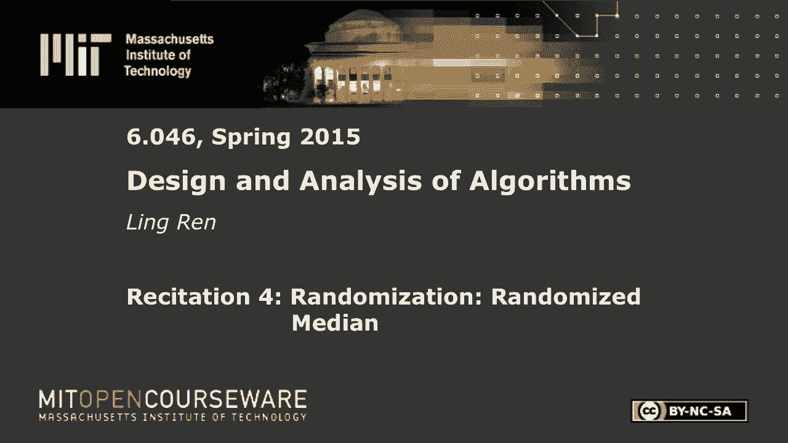
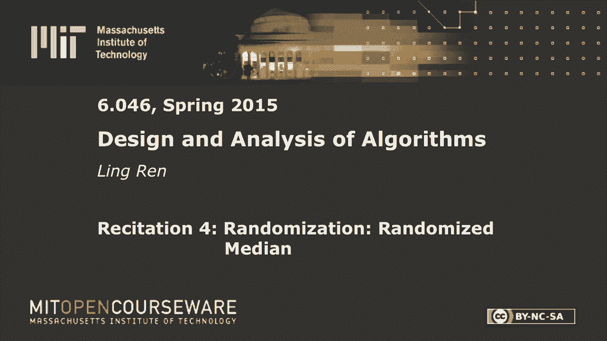
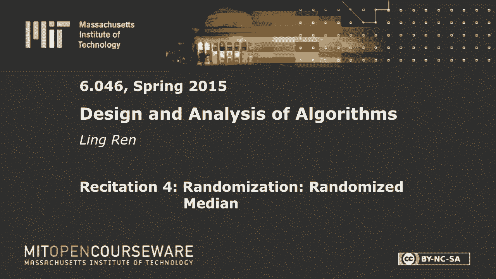

# 【双语字幕+资料下载】MIT 6.046J ｜ 数据结构与算法设计(2015·完整版) - P9：R4. 随机选择和随机快速排序 - ShowMeAI - BV1sf4y1H7vb

以下内容是根据知识共享许可提供的，您的支持将有助于麻省理工学院开放课件。

继续免费提供优质教育资源。

捐赠或查看麻省理工学院数百门课程中的额外材料。

好的，所以今天，我们将分析两个随机算法，我们在上一节课中看到的，随机介质和随机快速排序，但在我进入之前，所以我想对一些问题做一个更正，我也是，我想你们都从中得到了反馈，所以这是第二个问题。

你被要求组合B树，你有一棵2B树，第一个和第二个，每个人都有一些孩子，我们给你另一个元素，我们要求你把它们结合起来，所以如果是的话，那两棵树的高度是一样的，你是怎么做到的有人想分享他或她的答案吗，去吧。

把P和耶，是啊，是啊，所以你把k放在这里，如果这个太满了，你分开了，所以说，我为什么要这么做，我可以简单地做一个新的根，去吧，你，你不必，是啊，是啊，B树也是如此。

对路线的要求与对其余注释的要求略有不同，所以这个孩子可能太少了吧，它不是一个有效的节点，它不是一个有效的内部节点，但我们的解决方案实际上在第二部分犯了一个错误，在第二部分，我们是这么说的，一，二。

它们的高度相差一个，我们的解是把k放在这里，做一个指针，完全相同的问题每个人都看到这可能不是一个有效的内部节点，那么正确的解决办法是什么呢，你把k放在这里，并把它和t one的最后一个子集结合起来。

然后你可能不得不分裂，再分裂，我们对此不满意，好的，今天我们要研究随机化，具体来说，我们在课堂上看到了两种算法，我就叫他们快速找到和快速插槽，所以快速查找是介质查找的一个稍微广义的版本。

在第一次讲座和背诵中，我们已经看到了快速排序的非随机版本，所以我们把它们分成五人一组，我们找到每组的一个媒介，然后找到介质中的介质，取决于你是小还是大，我们画了这样一个有趣的子问题，有人记得吗。

我们分析这个运行时，其中递归，有五分之一，加上一些七超过十，或者类似的东西，我们展示了它最坏的情况，这是一个聪明的算法，我会给你的，但这很复杂，你必须，把他们分组，做好几个递归课程，也让我离题一点。

关于这个最坏的情况，有一个非常有趣的观点，算法的最坏情况，有没有人想知道为什么我们用五人一组，为什么不三人一组呢？算法应该以同样的方式工作对吧，如果我们去掉第一排和最后一排，我们仍然可以找到媒介。

它只是每组中的第二个元素，找到媒介和媒介，我们还有一个子问题，看起来像这样，当我们求解递归时，如果我们使用三人组，它解决不了任何问题，它解决了其他问题，好的，现在结束题外话，让我们回到随机版本。

那么随机版本是如何工作的，就简单多了，我们有一个数组，我叫它，在大小为n的数组a中查找，我们想找到我，th，其中最大或最小的元素，所以我们要做的是选择一个随机的元素，在这个数组中，然后呢。

我们把所有较小的元素，这边比较小的元素，和那边所有较大的元素，现在，因为我随便挑了一个，所以这个x可以在任何地方，如果它是第k个最小的元素，从左边，那我下一步该怎么办，我的目标是找到我，th。

此数组中最小的元素，a，好的，如果是，如果i小于k，然后我的元素在这边，对呀，所以我应该找到，好的，让我将其定义为左数组，这是正确的数组，我应该在左边的数组中找到，它的尺寸是多少，是k减1。

有道理这是k减去一，也就是n减去k加上中间的一个元素，那么函数调用中的最后一个参数是什么，我如此，另一方面，如果i大于k，然后我应该去我的右边，问题大小的一半是n减k，那么最后一个论点是什么，好的。

所以说，当然啦，如果i等于k，然后我们只返回x，这个算法的运行时间取决于我们的运气，取决于K的这个选择，如果k大致在中间，然后我们将问题大小减少大约一半，然而，如果k为零或接近n。

那么我们只减少问题的大小一点点，所以不可能给出一个明确的运行时间，所以我们选择在随机数中做什么，在随机算法中，我们分析预期的运行时，那是什么意思，所以我们可以写出n等于t的递归，我有两个子问题。

其中一个是t的k-1，另一个是n的p减去k，那么我应该把哪一个放入递归中，是啊，是啊，我不知道对吧，但我不知道我的元素是在左边还是在右边，所以我会保守一点，最多拿这两个，我来写下来，但是。

在我去解决我的子问题之前，我还有一些工作要做，什么是，那项工作有多复杂？去吧，就这样吧，是啊，是啊，哦西塔，为什么是因为我们必须，是呀，因为我们必须扫描数组一次才能把较小的元素放在一边。

另一边较大的元素，现在复发是不可能解决的，因为我不知道K是什么，我们只计算它的期望值，所以对n的t的期望，在所有的随机性中占了平均，这意味着k右的选择，所以我的K有可能，等于，如果我的k等于j。

那么我应该最大限度地，如果我的k等于j，那么我应该取这两者之间的最大值，根据期望的定义，我应该从j等于零做一个和，否，不是零，我从一个开始一直到，到目前为止有什么问题吗，取决于我对J的选择。

有时候这个比较大，有时那个更大，我只是把它写得有点冗长，所以如果，我的J是1，那我就选对了，加如果j j是2，那么我应该拿负2，依此类推，等等，我想每个人都做对了，所以我直接跳到下一步。

所以当j小于n的一半时，我会选择正确的，如果j大于n的一半，我走左边的，它们碰巧是一个对称的，它们恰好是对称的，我这里有的是，而且那个，现在，也许我错过了这里的减号，好的，我不应该和到那里，对不起，好。

我有n-1，-2，-3，一直到n的一半，但从那里我不再下去，好吧，我倒着走，n的一半加一加二加三，一直回到负1，到目前为止还有什么问题吗？哦，我们忘了上学期，这是一个θn，现在我们怎么解决这个问题。

有什么想法吗，这是对…的期望的重演，所以对于这位将军来说，这种类型的一般复发，我们没有一个很好的方法，相反，我们要做的只是随机猜测，然后看看它，如果它是正确的，好的，所以在这种情况下我不需要猜测。

因为我知道这一切，假设我们对tn的期望是n的θ，那又是什么意思，它的意思是，我能找到一些常数，常数乘以n，所以这是一个很好的，现在我们可以用归纳法，假设这适用于n-1以下的所有情况。

我们将证明这也适用于，那我们就做对了，现在我们把它插进去，和TN的期望，小于或等于n的一半到n的和，是啊，是啊，我刚插上电源，当然啦，加上一个θ，你猜n个正方形和立方体，或n，好的，可能有点乱，更干净。

我可以把这个B熄灭，如果我改变我的，J的西格玛和是多少，我们需要比这更精确一点，那么n平方之前的系数是多少，所以我认为系数是3/8，大家看到没有，为什么你认为预期的，哦，那是一个，那只是猜测。

如果是错的，我们得假设别的事情，我们将在下一个例子中看到，一个好问题，好的，是啊，是啊，让我再问一遍这个问题，我声称这个总数大约是3/8 n平方，有没有人看到，所以我不知道这个项怎么算。

但我知道如何从1到n计算sigma，这很容易对吧，那是什么，是n的一半，右减一，所以大概是，大约是n平方的一半，现在这个项是这个的和减去n的和的一半，所以它大约是n的平方的一半。

n平方的二分之一是有道理的，所以这大约是三除以八，平方加，命令，n，或以下，或常数，有什么问题吗？如果我们把这个插进去就很容易了，有一个错误，我刚意识到，和，有人能指出，那么我总共有多少个术语。

一个给一个男人，我有时间，所以每个术语应该出现两次，是啊，是啊，所以我这里应该有一个二，所以我不知何故扔掉了这个概率，但是这个概率是，因为我选择了一个随机元素，有1/n的概率等于1，等于2，三个，四。

每个人，每一个，每一个都是n的1，所以我应该在这里有一个2，两个在n这里，如果我们把这个插上，加上一个θn，我们的目标是证明这小于b，因为这是n的四分之三，四分之三b乘以n，加上另一个术语，我们就可以。

我们可以说这是另一个常数d乘以n，如果我们相应地选B，你看起来很困惑或者太容易了，好的，我想是梯子的问题，不是吗，好的，所以我们解决了快速查找的预期运行时，现在让我们来看看快速排序，快速排序，很相似。

唯一不同的是，一旦我到达，一次，我把所有较小的元素放在一边，把较大的元素放在另一边，而不是进入其中一个，我得把两者都分类，所以唯一的变化是这里没有取最大值，我需要添加它们，这里也一样，而不是拿最大值。

我应该把它们加起来。当它在这里传播的时候，所以每个项都出现两次，从n等于1到j等于1到j等于n，是不是每个人，好的，当然，最初我们这里有一个最大值，所以耶，首先每个人都得到了这个部分，我们有一个加分项。

这里不是最大值，我们必须解决这两个问题，现在如果是最大值，那么我得到的是n-1和-2，一直到n的一半，然后n的一半，n的一半加1，一直回到n-1，如果我有一个总数，那么我得到的是for j等于1。

如果t为零，t为n减1，对呀，这是j=1，如果j等于2，我有一的t和n减去二的t，随着j的增加，这个从零到n，这个从n-1到0，这回答了你的问题吗？好的，所以不是从n的一半到n，我们从1求和到n。

现在我们还有一个很好的问题，为什么我猜是西塔，嗯，这只是一个随机的猜测，可能是错的，比如说，在这种情况下，它只是不正确的，为什么因为每一个和都变成，呃，范围变成1到n，现在我得到的不再是n的3/8。

我有什么来着，我现在有什么，如果是1/n，是啊，是啊，是n的一半，但如果我在这里换一半，我得到的是b乘以n加d乘以n，我想证明它小于b乘以n，这显然是不可能的，不管你怎么选B，大家都明白了吗。

如果我们做同样的假设，我做假设，我们把它们插进去，我们不能再证明归纳步骤，好的，那么我们该怎么办，我们再猜一次，所以让我重写我们的递归，下一个猜测是什么，我们把n平方，有人对此满意吗，我对此很满意。

猜一猜，所以我们可以做同样的事情，我们可以把它插进去，那将是一个遗憾，我错过了，另一个术语，对呀，这是1比N，或者一比二，这里，如果我们做那个猜测，那么我们得到的是，1到n减去1，θ，和立方体除以三。

这对每个人来说都是显而易见的吗，也许不是，好的，3。有人能给我们解释一下吗？2。我为什么要索赔呢？3。超过三个月谢谢，我认为你是对的，有一个公式是，是啊，是啊，我不太记得了，但大致是这样。

如果你知道这个，那你肯定会看到，如果你不这样，我们就可以，我们可以把这个和变成积分，对呀，那就是，和3的立方体是有道理的，如果我们把它插进去，n除以2，三n的立方，加上θn，这里当然有B。

我们想证明这小于b乘以n平方，它希望，这是真的吗，很明显是真的对吧，所以这是，否，这是Q，是啊，是啊，对不起，我犯了很多错误，但这实际上很好地引起你的注意，但你没有指出这一点，这让我很担心。

这是三分之二，平方乘以b显然小于b n平方，好的，所以我们声称算法是n平方的，去吧，我是说，你可以声称它小于n的平方，因为它是n的平方，所以我在这里证明的是，算法绝对是有序和平方的，但也许不太正确。

你可以看到，我们这里还有很大的空间，这个不等式不是很紧，事实上，这是个很好的问题，我们怎么猜测，所以说，如果你已经知道答案是n，log，n对，所以没什么意思，但如果你不这样做，那么我们如何去做事情。

我们就可以，我们要做这些猜测，那么我们知道N不成立怎么样，两个太多了，让我们猜猜是和提高到一加ε，那么如果我们进行同样的积分论证，我们会得到什么，全身提升到两个加EPS，两个加EPS都正确。

如果我们把它插进去，呃，嗯哼，我们要显示的是小于1并提高到1加ε，这个成立吗，这个术语少于一个权利，升到1加ε，所以这是真的，所以我们可以很容易地证明是真的，并提高到一加ε，对于任何离子，问题。

但它紧吗，我们还不知道所以，那我们该怎么办，我们再猜一次，让我们猜猜n中的t的顺序是n log n，好的，你肯定会遇到两种情况，你可以证明也可以不证明，如果这不成立，你只要去log n广场。

渐渐地你会找到答案，如果你不知道答案，可能这就是你现在做事的方式，如果我们猜是n log n，然后我有一点，这里的其他方程，因为它现在是j log j，我如何计算，是啊，是啊。

它不是自然数、数或数的平方和，所以你不能像这样用公式，但我们仍然可以用积分论点，对呀，我不会那么做的，因为那是你在微积分或其他数学课上应该学的，但是碰巧j对数j的积分，n平方的一半log n减去。

某些常数乘以log n，我想你可以改变这个常数，但它大致比那小，如果你把它插上，你得到了，两次以上，一次两次，d，加上θn，我们想，我们希望它小于b乘以n log n，这将是真的，对因为你可以，是啊。

是啊，这正是，但是我们减去了一些项，我们提取的项比数据大，好的，所以我们可以证明这个算法是n log n，但你可以问同样的问题，我怎么知道是n log n，或者如果我不知道它是n log n。

也许我应该去尝试log log n，所以欢迎你尝试，这实际上是一个非常好的想法，因为耶，我觉得很无趣，如果你已经知道答案，如果你不知道，你就得试试，但你什么时候停在合理的点上。

您还可以用另一种方式证明这个运行时比这里的某个东西大，如果我们能证明，如果你能用另一种方式来表示，那就是欧米茄n log n，那么你就知道你已经得到了最终的答案，那是数学部分，对此有什么问题吗，是啊。

是啊，对我到目前为止所说的一切还有什么问题吗，如果不是最后一次，我只是对几个术语有几点评论，现在这个背诵，我们关注预期的运行时，您总是看到对运行时进行摊销，或者您可能听说过平均运行时，所以说实话。

预期和摊销是平均的说法，但在算法分析中，我们对这些术语的意思确实略有不同，所以如果我们说平均运行时，我们通常是指取输入的平均值，我们可以想象一个不使用随机性的快速排序或快速查找算法。

其中您总是选择第一个元素作为枢轴，这是一个合理的算法，如果您的输入是随机的，然后你可以进行同样的论证，并证明它的复杂度为n和log n，但是如果您的输入是预先排序的，或者在某些特殊情况下是反向排序的。

你不能那样做，所以平均运行时通常是一个非常弱的论点，因为您必须对您的输入和预期运行时做出假设，它们与输入无关，所以我们不对输入做任何假设，所以这当然是有代价的，这种随机性不是免费的。

所以事实上很难产生高质量的随机数，也许在课程结束时，你会看到加密，很多，很多工作都致力于生成高质量的随机数，如果你能有效地做到这一点，你实际上解决了很多问题，所以摊销运行时与这两个略有不同。

因为他们平均了手术的数量，你做的太多了，连续多次操作，有些需要更长的时间，他们中的一些人需要更短的时间，这就是今天的朗诵。

