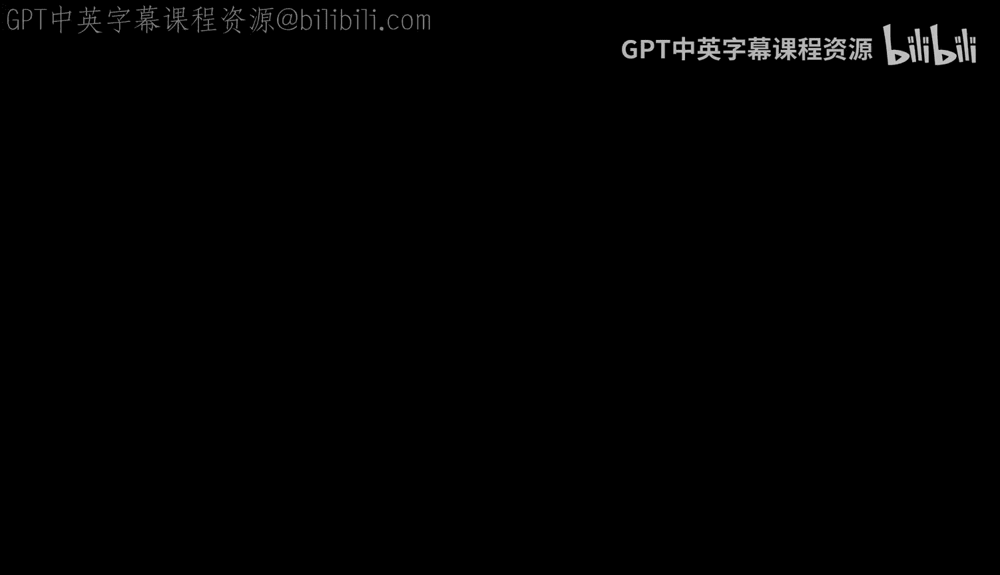

# 《密码学基础｜6.5620 6.875 18.425 (Fall 2025) Foundations of Cryptography》中英字幕 p08 -6.5620- 3_00： PM - 5_00： PM Monday 09⧸29⧸2025.zh_en -BV1EsvhBgEyF_p8-

So I'll get started。Can everyone hear me？O cool。Okay， so this is a number theory work。😊，Number3。

 recitation。And for the rest of the course the。The stuff in the handout will be really important。

 especially as we start the new module on public key。Cpttography。Okay， so let me start。So the first。

 this is going to kind of look like a laundry list of things you need to know。So sorry。

 it won't be more interesting than that。嗯嗯。One of the main foundations is like group theory。

And the central object here is a group。Okay， so。So， group is。A set S。

Along with some kind of something called a binary operation。啊。

Which is like a function that takes in two elements of thessettete， and that fits out。Of theさ。嗯。

And this needs to follow certain rules。So one， it needs to be associative。So。So。You know。

IfIf you take three elements， G1， G2。3 in this at us。Then if you first did。

G1 and G2 and then applied。And then combined it with G3， this should be the same as。

Maybe combining G2 and。F three first。And then combining it that you would。

It needs to have something called an identity element。Oh， just out of curiosity。

 has anyone seen groupop theory before？Okay， cool。So。Okay。

 so it needs the set needs to have an identity element， so there needs to exist。

Element in S such that。G， combined with this。This identity gives you back your original element for all。

Elements G。🤧。The star rule is inverse so for every。For every element in your set。

There needs to exist。A different element。Like it may be the same element as G。Such that G。

An H combined to give you this identity。And for the purpose of this course。

 we'll only look at a billion groups。Which means that they satisfy this additional property。

That is their commutative。Means for all two elements， G1 and G2。

The order in which you combine them does not matter。

So you might wonder this is a really abstract notion， why does it help？

Well first let me give you some examples。Well， the first example is something that probably very from the air with is the integers。

Under addition。So if you add two integers， you get back another integer。嗯。

The identity element is just going to be zero， every integer has an inverse。

 namely negative of that integer。😊，And it's commutative， addition is commutative。嗯。Here's a question。

Z。With this multiplication operation， is data a group？Okay， good， why is it not a group？

It doesn't have an inverse， right？嗯。Okay， so one way you could make it a group is by。

Like maybe adding。All the rational numbers。Is that a groupop？

I claim it's still not a group because zero is a rational number and it does not have an inverse。

Well， here I guess the identity would be one。And so the root is not0 inverse。Okay， so。No。

One group that we'll be looking a lot at is。Bing group， which is。Z mod。Some， some integer N。

 So what this is saying， and let's say。I think。The operation is addition。

 So this is like modular arithmetic。 You only count the integers。Based on like。

 what remainder they leave when divided by n。 So the set here is going to be。0ero， one。

Up to n minus-1， and when you add two numbers， you start to wrap around。Until you're in this set。

Okay I would not belabor this point a lot one thing to note is that throughout this course we'll mostly default to multiplicative notation as you can see here there's like some groups that are represented with like this addition sign and some groups that are represented with a multiplication sign。

For this course， we'll mostly look at groups with modification。这谢。Another important。

Definition is the order。So the order of a group is just the size of the group。And。

You can also define the order of an element in the group。If G is an element in the group。

Order of G is the smallest integer。Okay。Well。Smallest。Positive and okay。

Such then G to the K is equal to your identity。Okay， and one important thing to note is。嗯。Okay。

 actually examples。Most elements in Z。Do not have finite order because you keep adding them。

 you go off to infinity， you never go back to zero， but in groups like Zma N Z。

 this is a finite group。So every element。嗯。Every element is going to have a finite order。

In particular， you can see that if I multiply any number here， if I add any number like n times。

 then I'm going to get back0。😊，Right。Certain every element here is finite order。And。

This very useful theorem。嗯。Says。That for every element in the group。The order of G。

It's going to divide the size of you。OhAlso here I kind of switched notation from like calling it a set to。

To writing like the letter G for。Just to also capture the。By the operation structure。

Okay so I want to prove this。But some more definitions。嗯。Okay， so。The generator of the group。嗯。

Is an element G。Such that。Every element。Of G can can be written as。Some power of。Of this generator。

And。🤧。You know， not all groups are going to have a generator like a single generator。

 a group is called SL。If it has like one generator， then generates the entire thing。Sa quick。Yes。

There exists a generator。呃。はい。A group iscyclic if you can just get the entire group by taking hours of some element。

Okay， so that was all the group theory that we need to know。嗯。

Now let's move on to the next section of the handout， which is about computational number theory。嗯。

The first， the。This is like really。Important。Concept， and it's。Going to come up everywhere。

It is the greatest common div。The GCD of two numbers and B。

Is equal to the largest number that divides gota Nvy， so you've probably seen this。嗯。Largest。第一。

Such that D divides a。地 the beds。One very important and very cool fact is that。

For every two integers， A and B， there always exist。Integer is x and y such that AX plus By。

Is equal to the。The GCD has Sand。Have people seen this theorem before or？Yeah。Okay， then。I will。

Skip this。Okay， so then。So what's a way you can use to find the GCD and also maybe compute these numbers X and Y？

Yeah， so。嗯。Yeah， so exactly。 So you could the algorithm。Allows you to compute。

Allows you to compute this。The GCD as well as。And like a slightly modified version of this will also allow you to get these numbers。

X and Y。And note that X and Y are not unique， but it allows you to get at least one understand。Okay。

Okay so another important algorithm， and， the really nice thing about Euclid is that it's very efficient。

😊，It's like poly polynomial in the size of like the bit length of the numbers you're dealing with。

 in fact， it can actually be made like。嗯。O n squared are like even more efficient。

 where n is like the。And is like maybe Max。嗯。Lolog a。Aly。

Another important algorithm is going to be modular exponiation。😊，It's like the compute。

The compute G to the x。Lage some integer N。嗯。You don't want to do the knifeive thing of like first computing G then G squared G cubed and so on you want to like。

Double at each step and like look at the maybe binary representation of x and sort of。

Combine the right terms together， have people seen that before or should I go over it？Okay。

 maybe I'll go for it。Okay， so。Maybe this deserves a different word。Okay， so。

So what is the problem statement you're given？Some element G。And。Zma and Z。

 and you're also given an extra X。很过哦。Is you want to compute T to that。So。

So the nice strategy would be to。嗯。Computer G G squared。Q and so on。

 all the way up to up till you reach x。But the amount of time this is going to take is linear in x。

And it's going to be linear in the value of x。Which is really bad because the input here is going to be。

 you know， like how much of space you need to write x， which is just like log exp。Right。

So this is really bad。But。What you could do is。嗯。Instead of going like adding one in the exponent each time。

What if you doubled？Be exponent each time， and you can do this because know， first you have G。

 you square it， you get G squared。You can square this again， get you before it and so on。

And then in the end， you， if you had the binary representation of x， so x is equal to。X hell。1，0。

Pase 2。Then what you can do is you can pick and choose which powers of G you want。

Multiply them together to get G to the X。Okay， so this is an efficient algorithm。

That can be made even more efficient by。By looking at this。

Theorem called the Chinese remainder of theorem。 Have people seen this before？Anyway。

Can you raise your hand if you haven't seen it before？Okay， let me。This is a really nice theorem。😊。

What it says is that it gives us a way of decomposing a number mod some n in terms of。

umbNumb modulate the prime factors of n。Okay， so what does that mean， Let's say you have some。

Number N， and you can write its prime factors。And for now， let's actually say it's just a。

Product of two primes。And。And。So it's just a product of two primes。

And so now I'm saying that this theorem says that x mod n， like if you give me this information。

 this is kind of equivalent。To giving me the following information。X。Mod。P。And X。MdQ。Right， so。

In group thetic terms， what this is called like an isomorphism。Between two groups。

 namely Zimma and Z， Zimman Pizi cross Zimma Qi。But。Intuitively， what this is saying is that。

If I give you X。And then like X mod n， you can actually reduce it mod P and Q。

 which are like the prime factors of n。 and this loses no information about what x is。

So in particular。But that means that there's a way to go from these two numbers back。Okay。

 so let's look at an example。嗯。Does someone want to pick a number N that's？product of two prime。Okay。

嗯。21 number X。76， 72， okay。Okay， so x mod n is going to be。10。Actually。

 maybe let's start with a simpleimpr example。So let's just say n is equal to6。And x is equal to5。

 so what I want to do is I want to say you know， given。X mod 2 and x mod3， which is。そう。欢。

It's not three is too。I can recover five。It's like， how would you do that？Or actually。

 let me put it this way。😊，Let's say X is unknown。And。We're given x mod 2 is1 and X mod 3 is also one。

So what is x going to be？you want。 Yeah， okay。嗯。Okay， so。

This implies it has to be one Do you want to share how you did that？Okay。Yeah。

 it's kind of obvious in this small example。One thing that's instructive to do is maybe look at all the numbers mod sakes and then check which maps do this。

 right？嗯。So， so let's look this。嗯。Okay， so numbers mod。Numbers that are1 want2。

Going to be all the odd numbers。You can cross up all the even numbers。喂。

And then we kind of want to cross up all the numbers that are not one mod three。

So three is zero mod three and five is two mod three。that kind of leaves you only with one option。

Okay， so this is going to be tedious if you're like looking at numbers like this。

What CRT actually tells you is that。There are these numbers。啊。Okay， I'll just try to hear。

Let's say that。嗯。This number was a， and this number was B。Then what CR details is。

X is actually equal to。Some coefficients。It's like a linear combination of these things。

And what are these coefficients？We want so that CA。Is like。嗯。You know， now if we're taking the。

 if we're taking the。If we're taking this number mod P， we want a domain main and this still。

Disappear。So we want C to be like one mod。Do you want C B。To be zero on Q， Mon。My p。

And we want- if we're taking this equation mod Q。We want see it to be。

Zero mod cube because we kind of want to kill this term and we want only this term to survive。

And CB should be one1 key。And so numbers that are going to satisfy this are。

Can we compute it as follows。CA。Is going to be。嗯。Q times。Q inverse。We key times。He and horse。

Right now， it looks like these numbers kind of came out of thinner。

But if we tried to s it back into this formula， or let's just even check whether they satisfied these things。

嗯。So Q times Q andverse mod p。What is it going to be。嗯。Moud Q。Well， it's like。This is kind of。

 you know， you can think of this as some kind of integer。And you're multiplying by Q。So。

So this is going to be。Zero mod cube， right， because it's going to be a multiple of Q。And similarly。

 this is going to be a multiple of feet。So we're satisfied like these two conditions。可以。Okay。

 but what about this？Do you see why。Yeah， like why are these numbers going to satisfy these conditions？

そしてマイナスの。Oh， okay。I guess， okay， I should define that。嗯。Okay， so Q。啊。Maybe otherite that here。

I'll just do it here。So。Q inverse mod P。Is some integer X？Such that。Times Q。Is congruent to11p。嗯。

So it's kind of like the。It's like the multiplicative inverse。嗯。Other years any？

And this is going to exist only if。Okay， let me write this out right， so x times q is equal to1 plus。

P times some integer Z。Right， so going back to。This theorem。M D。That means that the GCD of。

The GCD of。Q and P has to be one。You you see that。That's because， okay， so。

You can actually augment this theorem just say that。You know， the smallest non。

The smallest positive integer such that。It can be written as a x plus BY is going to be the GCD。Okay。

 let me actually add that here。So。Smallest。Into your deep。Such that they exist。X and Y。Is。The GCD。

Actually， let's try to prove this。嗯。🤧あ。So。Okay， so let's say that there was a smaller number。That。

That could be written as AX plus BY。That's like。Not the GCD。Then。T to figure out where to do this。

Maybe。嗯。Okay，''ll do it here。Does anyone see how to prove this？Maybe something。因作问。嗯。

Can you say more？あ。I was thinking like a featured that he is is Jesus。

I a BTD or is D that think that's smaller？D is a thing that's smaller than these。あのいえ。O。It the。

It both the5。D is going to be the GCD A。Will buy day。啊。天上的明人。Something larger。の device。没事 ok， ok。嗯。

So you're saying D。Okay， so D is less GCD。And let's say GCD is deep fri。And。

You're saying D plus D prime。いや皆さん。あさん名。Divdes。诶。Yeah that。Doい thinkか。Yeah。

 I don't think that's true。呀。这我。The left hand side is equal to7 toger times。Time the GC。维持。D。

The only inger in the。The only insure in this case will be one。Can you say that again， why？ゆぞい。

元気になるる。や号。But then if it's larger than。ござこれます。Mh哼。😊，Yeah， yeah， I think。Yeah。

 I think something like this works。Did everyone pull a lot？Okay， okay， cool， nice。嗯。Okay， so。

So this was all to say， you know， we're defining the multiplicative inverse of。Q mod P as sumger x。

 such that x times  Q is1 mod。And this is possible only if。X times Q is equal to 1 plus H type C。And。

This means that Q&P must do CD1。Okay， so。Now let's go back to this question。

 do we see why C A and C satisfied these properties？MYeah。Exactly。So Q times。

This multiplicative inverse is going to be。1 plus p times C。And third is going to be one more PC。

One more。Okay， so this was this was not a proof of the theorem。 and the theorem。

 the Chinese remainder theorem says something。嗯。More general， it deals with like arbitrary。

Arbitrration numbers N， not just。Products of Duke primes。Yeah。哎。

Let's say this is the prime factorization。Then what this is saying is that if you give me x mod n。

Or if you give me X mod。Like each of these like components。

Then that's giving me the same amount of information and I can recover X mod n from these numbers。

Okay。So I did not prove this， but hopefully this is like some kind of intuition for why this is true。

嗯。Now let's move on to the next topic。Which is。这。あ。Z and star。So so far we've been mostly looking at。

 well， when we introduced this group， we were looking at Z mod and like the numbers less than n。

 and we were like only looking at editions of them， but you know when we're。

SoSort of we already saw here like some kind of multiplication happening。

And this formalized in defining this group C much。😊，Z and star。So what this is is。

ZM star is like all the number is less than n。Such that GCD of A and N。Is equal to one。

Does anyone see why we would want that？To be the definition。嗯哼。Exactly。Exactly。

So just from this kind of thing we saw right now。嗯。

A is going to have this multiplicative inverse if and only if you can there are some X such as this。

Yeah， there were different numbers， but you can do something like this。

Which means that the GCD has to be one。So。This petition comes from。The fact that we need is。

To have an inverse。First。Moam。Okay， so once you've like picked only the numbers that are going to have an inverse。

This this is going to be a group because。嗯。Your。You're associative because multiplication is associative。

 The identity is just going to be one。嗯。And we picked numbers so that they had inverses。

And one thing you have to check is that。You know， right。

We're looking at like some subset of 0 to n -1。 we want to make sure that when we multiply two elements in this subset。

 we're also going to end up in the same subset。嗯。But this is this amounts to checking that you know。

 if two elements have verses， then they're product up to the inverse。So this is not too hard， but。

Okay， so so this is a group。好像什么。The size of this group。Is。You know。

 going to be the number of integers less than n that have GCD1 with them。

And this is called the Euler toion function available。好玩儿。2是。And it's literally just this definition。

 the number of integers less than N that have GCD1。🤧Okay。So if N has prime factorization。没有。嗯。平安。

这是个 alphapha one。好哦。嗯。The Ouler toion function is going to be。🤧。嗯。那 thing。嗯。The true。Yeah呀。嗯。なし。Yes。

Here。Okay。So why is this the case？嗯。I wouldn't give you a formal proof， but。

Maybe I'll draw a picture。So think of the case where n is equal to p squared。

Let's think of P as maybe three。So。And is。し？So n is9。And。

And now we want to compute the number of integers that are less than n that have GCD1 width。嗯。

Shet one with that okay。So we can sort of divide this thing into。Into。In。Group into out groups。

 but like。You can partition it into these blocks。Right。

And we know that you know all the numbers in the beginning are going to have。啊。Are not going to be。

Relatively prime with respect to Anne。对以。Because they're all zero modps。

SoBut the rest of them don't have any common factors with P。

 and since n is just like a pure product of P。Like it's going to have。

 it's also going to be relatively prim。And。So there are months。 okay， so there are like。

You know how many。There are P blocks。And in each block， there are going to be p minus1 terms。

P minus1 elements at work。And p here n was p squared。

 but more generally youll have p to the alpha minus1， such blocks， and in each block。

 you have p minus1 elements that are good。嗯。Okay， so this was when n is like just one prime。

A power of just one prime。 but when you have multiple primes， they sort of don't。

 don't mix in ways that are bad for this。 And that's why like you just get a product。Nice work。Okay。

 so let's look at some special cases。I should have started out with this， but if n is equal to P。

🤧Okay。嗯哼。I does it go a pe。Then。Then what is the O torsion function of N？P买的1片。1平 minus one。Exactly。

あ看。Just one more example if it's a product。Yeah， if you mind this one times。

Both these special cases will be relevant。嗯。Yeah， they're just special cases of this general formula。

🤧。Okay。And there is this。So。Oiler，Says that。It to the。You know， alltro function of N。

There's always going to be one model。Do you see why that is the case？You know， what was this number。

 Okay， so we're living in ZN star， we're doing multiplications mod N。

And this number was like how many elements there are in Zenster。对。Yes， exactly。This is Lagos Gurum。嗯。

Yeah， that says。You know， of the order of a is always going to divide the order of the group。

 so in particular， if K was the order of A。🤢，Then， a the key。Is。Is one by definition。

But since with biorangee， the even is going to be put of k times some C， some integer C。So。You know。

 this is also one。And therefore， A of the fee event is。然后。Okay， so。A special case of。

Euler theorem is called foremost little theorem。Sos the a to the P minus-1。Is one moto is one mod pe。

And this is just because， you know， when N is。P。😔，Phi of n is p minus， p minus-1。Okay。Any questions？

Also， I should have said this at the beginning， but if you have questions。

 feel free to ask like whenever。Okay。So。What happens now let's like zoom into this case where n is equal to P。

What happens when we're looking at？嗯。CP star。Right。嗯。One very cool thing about this。

Is that it's sick with？And。And you know， so what does stickic mean， it means that。

You know it has a generator such that。That generates the whole group。And one interesting thing about。

Sic groups is that if a group has prime order， it it's always cyclic。So。

You might be tempted to think that ZP star is cyclic because of this fact。

 every group of prime order is cyclic。But this is not actually true because the order of Zp star is not P。

It's p minus1， right？是啊。不是人。It's actually a few minutes。

So the proof that itscyclLC actually requires some work。🤧。

MaybeMaybe it's a good idea to look at an example。Let's look at。I see。5ve。啊。Thats just Tuesday7 star。

In Z7 star。Turns out that the element5 is the generator of the group。Why is that because？

Now let's look at all the powers。Q。好玩。And。Okay， so this is five。What is this？Oh。

 I guess the question is like。What is five to the six mod7？Yeah。

 you actually don't need to compute it because we know that。

We know that this group has ordered sinks。8。Few of seven is7916。

 so this is actually going to be one mod seven。Okay， so this was going to be five。25 is like four。

125 is， oh， this is。This is a。Well， okay， we actually don't 125 is like five times four。Moud 7。

So that's like six。I want to say。Yeah。And then if you multiply by another five。

 that's going to give 30， which is like2。Two months，7。 and then。

Multiply this by another five and then you get3。 seven。And you can see， you know。

 this covers all of the numbers from one。Yeah。So five is a generator of Z7 star。

 and we write this as。Like we tried these anglo brackets to show that。

We' generated by this element 5。O。Maybe I will go back to this board then。Okay。

 so we saw that DP star is cyclic， that means it has at least one generator。

Like how many generators does it have？And there's this theorem that says。

That answers his question and says a lot。So how many generators？How many generators？P star。

The answer is。Many and asymptotically， what it's going to look like is。Me over a lot。

So if I pick a random element from ZP star。What is the probability that？It's going to be a generator。

Not not quite right， it's not like all the numbers are。嗯。One piece is very big， Yeah。

 so the probability is going to be something like。This number divided by P。嗯。Please。Yeah。

 this number divided by P， and that's going to be like one over log log。Lologg log P。

 and this is what we're。This is the parameter we care about。

 right because our input is going to be like log p number of bits。And you know one over log， that is。

Is not too bad。Because we just need to repeat this， we need to repeatedly sample。

Log input size many number of times and we'll get a generate。And the reason this is true is because。

The of。You an。Is roughly。ThisThis kind of size。干嘛？Its a in p minus plugging in n is equal to p -1。

 this is roughly the number。Oh it actually。I should say all CP star quick。so you can like write。嗯。

You can write it as like some generator。一年。Which is p minus1。The number yeah， okay。

 so the number of generators is going to be， you know if G is a generator。

 then every element in this list that has like the exponent that's relatively prime with V of P。嗯。

With p -1 is also going to be a generator。And okay， so I'll show you that right now。嗯。Okay， so。

Since the ZP star is Siic。There's kind of a projectjective map between ZP star。Zma at P minus1。So。

Cp star。Kind of hinted it right now， but does anyone see why this is the case？Exactly， right？😊。

We thought that this was Siwick。She is the one。So let's say it has generator G。Then。

Can you change the app。Z go的X。对。You know， x is going to be a number from。1 to phi of P。

 which is p minus1。And that's the number that you not do in z mod p minus1 z。So computationally。

 it's going to be easy to exponiate， right。Mular exponiation， that's easy to do。

 it's easy to go from x to G to the x。But going from G to the x to x。

Is called the discrete log problem， which is actually computationally hard。

 We don't have very good efficient algorithm。 We don't have efficient algorithms for this problem。哎嘿。

够一下。是你啊。Easy。这个上微去在打开。打。We'll see more about this soon。Okay， so now。Now。

 can you tell me how many generators？More precisely there are OCP star。Mmh哼m。😊，Yes， exactly。So。啊。

Good， so。The number呃。The number of generators。Of。嗯。在儿。Is going to be。B of p minus-1。

Does everyone see why？That's because Z star iscyclic。So you know， we might as well look at。

Like this group。And the number of generators of Z P -1 are the number of elements that have。

Order P minus1。In in this group。So。That means that no number should。Kind of get to。呃。Okay。

 what's the best way to say this？Like， okay， so if。The one way to see this is。

 let's say G is a generator。Then G to the x going be is also a generator。嗯。The GCD of X and。P minus1。

Is gone。Do you see why that is the case？Well， if GCD。Okay。This means that there exist numbers。

S and T。Theyre such that this thing holds。可以。And。G to the x must also be a generator。

One way of saying this is that the order of G to the x is the order of the entire group。

Because if it was something smaller， then it would not be a generator。Right， so。If G to the x times。

嗯。Genator。Time some y was equal to one for y that is like。啊。Less than the order of the group。

Then that means。That。That means that。X。Divdes。X divides p minus1。And therefore。

 the GCD must not be one。Okay， yeah， okay， so I think technically what you need to show is that if the GCD is not one。

 then this is not a generator。But yeah， like。I think the same kind of argument shows that。

So then you get， you know， if this is a generator， then every element， every element that。嗯。

Is relatively prime with M relatively prime with p -1 also gives you a generator and this kind of thing is like essentially F。

 and therefore the number of generators is going to be p to the p minus-1。P of P minus-1。Yeah呀。

actually， this I want to see is slightly wrong。Yeah， sorry about that。 This should be the。完了。

And asymptotically， this。Is pretty。Big， because p of n is just the。Oh love。Okay。Maybe。

 let's take a five minute break and then resume sorry。Mmh。😊，I。Ooh， okay。

 would I be considered a one way function， This is interesting。

You're right that we were only able to compute Phi when we know。Very。Yes， O。This when you function。

Yeah。He。Seriously。J yes， right？Yeah， this should be a one way function。Money， make sure。

I guess what is the assumption you need？The assumption you need is that it's hard to compute the discrete log under。

For a random max， yeah。I think people will assume that。Any more questions？是。그게으면。Okay。

 maybe let's continue。So one very useful theorem that will help in the next piece is。The following。

哎呀妈。なかだよ。it says that。咁能。Ps。And some integer N。Is。We write。Where this number is P then。H then。Is。

Something like this。So again， this is。You know， the primes are pretty dense if you pick a random number from1 to n minus1。

 the probability it's going to be a prime is like one over a log n。Which is again。

 like one over polydennomial in your input length。So。

You knowYou just need to repeat a reasonable number of times till you hit a prior。嗯。

And the nice thing is that given a number N， you can actually test efficiently whether it's a prime or not。

So that was this very aative result。Of AS。嗯。That。That gives a deterministic。Theterministic algorithm。

For testing crimes。Input is great。And this can be done efficiently。So to pick a random prime。

 what you would do is sample a random number from one to n。And then。嗯。

And then run something like AKS or another prim tested algorithm to check if it's applied or not。嗯。O。

We were sort of doing something similar earlier when we said。You know， most of the numbers， not most。

 like a good fraction of numbers in Z star are going to be generators， oh yeah。

Efficient efficientff means polynomial and logan。南ブラン。The number of primes， this is just like a。

Like a mathematical statement。Like the reason it's efficient the reason you can sample efficiently is because the probability that I hit a prime is going to be like one over log n。

😊，Roughly。And login is。Ponomial， so I just need to repeat like log n times before I hit a。Okay。

 so we were sort of doing something similar earlier when we were trying to find generators of CP star。

嗯。You know， we saw that they're pretty dense。And we just need to sample a polynomial number of times before we hit a generator。

But actually， the problem is we don't know an efficient algorithm to test if a number is a generator or not。

Cp star。嗯。Why is that？If you knew the factorization of p minus1。Then I claim you can test。

If a given number is a generator。Does anyone see why？Okay， so the claim is。If fine no。

P minus1 doctors。Hi。Then， I can。If。number班。I a generator。Yeah。P。Exactly。Right。Right。

 so why is so the idea is， you know， we know that any element G generator or not is going to give you one if you raise it to the p minus1 power。

But the question is， does it give you something it？Does it？

Does it have a smaller number that also hits one before？

And by log neural genome we know that any the order of G has to divide p 1。

 So if we know the factorization of p -1， we can actually check that no smaller number gives you。1。

And there's like a cleverer way to do this so that it's going to be efficient。By。Yeah， okay。Okay。

 but the problem is， you know。We would really like to know。Yeah。

 we would really like to know whether a given element is a generator or not。

 but you know factorization， as you might have heard， is hard。So。

We kind of want to come up with a way that to sample both a prime number P。

Along with the factorization of p minus1。Because then we could play this game， you know。

 we could sample some numbers， test if they're the generator。

 if they're a generator by checking that no smaller。Number。Rises。

When checking that this condition doesn't hold for any smaller number in these experiment。嗯。

And the way people do this， so there are two solutions。嗯。One is to use something called a safe prime。

So pick up prime P。Such that it's。2 Q plus one， where Q is also a crime。🤧Um。

And the reason this is nice is now p minus-1， we actually know the factorization。嗯。

Well it's just like two times Q。And there was this really nice。😊，Really nice result by Ka。

That actually gives a way to generate random prime， not just prime of this form。

 along with the factorization of p -1。So。Algorithm。To generate random primes。刚刚。Ping along with。41。

Okay。So I'll say about that for now。嗯。Now， let's actually。Move on to。Which is quadratic acid use。

🤧Okay。So number is a quadratic residue mod P。It can be written as。

Ass the square of some other number。And。You know。There there are lots of questions now， right。

 like how many， how many such numbers are there， how many such quadratic residues are there。

 can you test efficiently whether a number is a quadratic residue or not。

Can you find the H or can you find the a number H that squared G and so on？So。

So let's try answering these questions。The first one was。How many。And the answer to that is like。

Half of the elements are going to be quadratic residues。So。嗯。Okay。

 so there is a theorem in the notes。That says。The following conditions are equivalent。Actually。

 let me call this。Yeah。H and T。Just for。Convenience。嗯。Okay， so H is a quadratic aggressive。

This is equivalent to saying that when you write it in terms of the generator G。X is an even number。

And also。H to the p minus1 over2。Gives you one month。And。We know that H the p minus1 gives you1 notp。

Of the grungcher。Whatever theorem you want to use。But this is saying that you get to one much。

 much quicker， just like half the number。Half the exponent。🤧。Okay， so let's try to。Maybe， I should。

Not try to prove this in the interest of time。But。Yeah， hopefully this kind of makes intuitive sense。

Because if x is an even number。Let's say a equal to2。W why。

Then you can see G to the y squared is going to give you h。So。呃。Yeah。

 that's the idea in like one part of this proof。But。The upshot of this。

Is that the number of car acid use in this？Is equal to p minus1 over2。

Because exactly half these numbers are going to be even。Okay。And okay， so the other question was。

 you know， can we test whether a number is？A quadratic residue and。The other question was。

 can we find D？Test in。Can we pass？If。T such that。也自己。嗯。The answer is yes。嗯。

I will not give an algorithm for this， but if you're interested， look up the laja symbol。And three。

 can we find square root？And。And the answer is again， yes， efficiency。The answer is again， yes。

 in the case that p is equal to3 mod 4， I want to say。Yeah。3。 four。嗯。T equal to。H的P。-1。

Number4 p minus1 over four。Plus， one。Yeah， it plus one。Like the。

Like these values are going to give you square roots of H。And。And the more general。W to do Miss。

Is by using。This algorithm'll them my brother camp，It's not in these notes。

 but it's like referenced from these notes。Okay， so we sort of saw that， you know。

 this discrete log problem of going from G to the x to x。We believe that to be hard for some groups。

There are much stronger assumptions that we also believe are true。

 namely the computational di helmet。And what this says is。Given。A generator。She了 that。接着 theY。

Compute。シ了だ。What is like one knife way to solve this problem？嗯哼。😊，Yeah。If you could like salt。Yeah。

 exactly。 right， so you could， you could just like。

Do whatever maybe inefficient procedure you want to find x and then。Compute G to the Xy。

 but we believe that finding x from G to the x is hard， So this strategy doesn't really work。In fact。

 we believe that this problem is also hard。RightIt's the computational the assumption。

Is that there is no。Prolyistic polynoium plan algorithm。That solves。This task。In fact。

 cryptography is all about these decision problems。嗯。Decisional。So。You know。

 you could also ask for a much stronger assumption called the decisionional default assumption。

And the du here。Here we were asked to compute G to the xy。But this is like a decision problem。

 which is like。Supposedly much easier。啊。Distinguish。15。You know。

 one world where you're given G G to the x G the y， G to the XY。And the other world where。

You're just given a random element at the end。The decision of the Fman assumption is that these two distributions。

Are computationally indistuable， so there is no probabilistic called final algorithm that distinguishes these two distributions。

So we believe that this assumption is true in。And Zy star。But。

This is there's actually an attack for the decisionional the Phhelman assumption in CP star。And。Okay。

 so this is like。Not。True。NCp star。And just to lay out the picture more concretely， you know。

 if we assume that the discrete log problem is hard。😊，Then。嗯。No。This Iowa does not point here。

Let me right this year。Disre log discrete log being hard is kind of the the。Weakest assumption。

And it's implied by CDH。Because if you are not able to compute G to the Xy。

 that means the strategy of computing x and then computing g to the Xy is not going to work。

 so discrete log is hard。And。You know， this is an even stronger assumption， so DDH。Imply CDH。

And so in this group， CP star， we kind of believe CDH and discrete log。But DDH is false。

And you actually have all the tools to see why。Yeah。Does anyone see why？Think of this board。嗯哼。😊。

Yeah， exactly。Exactly。Right， so if you look at this， if you look at these two twofold。😊。

If either G to the x or G to the Y was a square。Then g to the Xy is also going to be a square。Right。

 because。If either of these two is square， either x or y is even， which means x Y is even。

 so this is also going to be a square。But on the other hand。If Z was just random。嗯。

No matter what X and Y are。See， the last element has like a half probability of being a square。Right。

 so。Oh， I should have said this。Here。Y Z are random。Beniform made random。Right， okay。

Let me actually write this attack down。は。So， if。Oh， and also。

 we have an efficient way to test whether an element is a square or not。

 I did not show you how to do this， but。You have to trust me。

And since there's an efficient way to do this like you know？What you could do is you could test。

If G to the x or G to the Y。Its a square。Or cordd re thing。And if so。If the last element you got。

Let's say that's H。对。If H is also a square。Then I'm going to output it。0。And otherwise。I thought。

Okay， so this attackac only has an advantage if。You know， either of these is a square。

But since like the number of squares is like really large， like p minus1 over two。

 like with half probability， if you sample a random x， Y and z。😊。

There's a pretty good junks that at least one of this is square。So。You know。

 in this case that it's a square， which happens with good probability。I actually have an advantage。

 right because。In the left world， this is always going to be a square in the right world。

 this is going to be a square probability1 half。😊，Okay， so DDH is just not true in CP star。

That's kind of unfortunate。But the way。There's a way to fix this by working in a smaller group。And。

This group is going to be all the squares P。He says know the people man。In。嗯。

The notation for this is QRP。Which is just。A set of squares。My片。Or like quadratic residues。

So what this is saying is that。Now I'm not going to pick a generator of the entire group， CP star。

I'm going to say that。The generator is。Generates QRP。So it generates only this smaller group。

And in particular， you know？G prime is equal to key squared where G was a generator for ZP star G prime should work。

Okay， and。Okay， this is going to work as long as。There are no similar attacks that I can play here。

And so what people do is they you know， make sure that。P is equal to 2q plus1。P is a safe prime。

So why is that now this now this。Now this group QRP has order。Yeah， what is the order of？QRP。Yes。

 exactly。Right， so。The order of QRP。Is going to be。You know， half of the order of ZP star。

Which is going to be。Half of p -1。我 just cute。And okay。

 so the nice thing is that QRP has prime order。 So it doesn't have like。Any like smaller subgroups？

By La go。Right， so。So then you can't do this like attack where you you check。

G to the x and G to the Y were're in this subgroup QRP in this case。Then Ge。

 the X Y must also be in this subgroup。But here there are no not trivialvial subgroups。

Because it has prime mor。Any questions， this is like there's a pretty important。Thing to understand。

嗯哼。😊，You the notes that mentioned that。We had to improve。Yeah， yeah， we haven't。This is true。

How does this argue and how to argue about this？不定。Arbitrate input size。Vrgencely。

I'm not trying to think it。Yeah。Yeah， I think there like we have to make the assumption that。

There is a way to generate these safe crimes。Com。Yeah。嗯。Any other questions？

Does everyone see why QRP being prime order？Hos。はどんで。Okay， yeah。Yeah， let me say this again。

So you know this attack here。What it said was。If either of these， so ZP star is a group。

It has a smaller subgroup QRP。Right。I think the notation is。です。Why is this a subgroup？Well。

 if you took two elements that are squares。One squared and P2 squared。This is also going to give you。

A product is also going to be a square。So it's like a subgroup of Z star when you multiply two elements in this group。

 you're going to remain inside the subgroup。So this。😊，Yeah。

 so this attack crucially used the fact that ZP star has this subgroup QRP that's pretty large。

 it's like half the size of the group。😊，And it's also efficiently testable。

Like given an element I can test if it's in here。嗯。Why was that？Now。

 if either of these two elements were in this subgroup。Then this last element also had to be the sub。

And that would not be the case in this。In this other world where this is just a random。So now。

 if you。So now we kind of want to avoid this situation where there's this like smaller。嗯。

There's the subgroup that's pretty large， so these elements are going to be。

These elements are going to be in the subgroup with good probability and it's efficiently testable。😊。

So what we did instead was。You know' a to instead of DP star， let's go to just QRP。嗯。

And set things up， set the parameters up so that QRP。Does not have any smaller subgroups。Yeah。Yes。

 and the way we do that is that by setting p is equal to 2q plus 1。Where Q is a applying。Yes。

 this attack worked for any prime P when G was a generator of CP。

But now she's not a generative CP star。Jesus generated of just UP。So we're ignoring this entire。

Like all okay， so another way to say this is that all your elements are going to be squares。😊。

So it's like this attack， know。Do anything。And。Now if QRP was set up so that it had prime order。

It's not going to have any smaller subgroups。啊。Because you can't factor Q。嗯。

And therefore you can't play the same attack。Okay。There's three things that I have in common。

