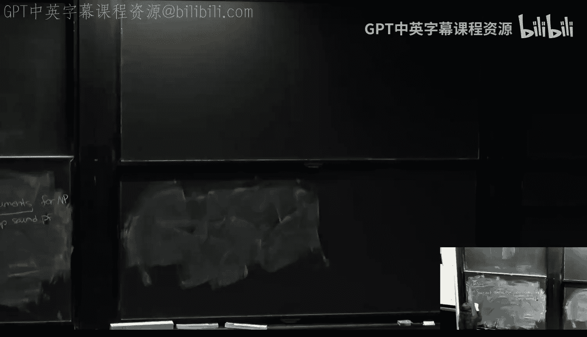

# 《密码学基础｜6.5620 6.875 18.425 (Fall 2025) Foundations of Cryptography》中英字幕 p24 6.5620 Lecture on 11⧸26⧸2025 (Wed).zh_en -BV1EsvhBgEyF_p24-

Okay， so。You're here。 Happ Thanksgiving， guys。ok啊。So。Today， the plan for today。

 So actually before I talk about the plan for today。

 let me just recap where we were and then I'll tell you where we're going with this。 So you know。

 after we talked about kind of zero knowledge and interactive proofs we said that interactive proofs are actually a very powerful way to prove things just about correctness forgetge about even hiding which is why they were defined to begin with。

 but directly actually very powerful proof system and we originally demonstrated it by showing the sum check protocol which is a specific protocol for provinging the correctness of a sum of a multivariate low degree polynomial seemed pretty specific but nevertheless we showed a very efficient interactive proof for it。

😊，And then last lecture we showed that actually this seemingly specific subject protocol can actually be used to prove the correctness。

😊，Of any。Actually， as long as this computation can be cast into as a circuit of low depth。😊，Okay。

 that has a good A uniformity properties， which again， let me gloss over them。 But basically。

 this sum protocol can be used to prove crack of any bounded depth computation。

And that was the G care protocol。 And if you remember， we。This protocol， if we have a circuit。

IfThe computation can be cast as a circuit of depth D heres our input。 then the run time。

 the number of rounds grows with D。 we run basically D sub protocolcols where each subprotocol is like a sum check and each of these sum check has about log S rounds or polylog S log S rounds。

And therefore， the number of rounds is going to be something like D。 The number of subprotocol。

 Each subprotocol has like pun log rounds。😊，And the runtime of the prover is also pretty much similar。

 he's very efficient。 The sum check and the sum check the verifier super sorry。

 the runtime of the verifier is very fast。 And the sum check basically does nothing。

 but at then he needs to he just does some very similar simple checks to check that he got indeed a polyial Uni polynomial low degree that is consistent with the claim above。

And he needs to compute one point in the multiline extension of the input。

 which can be done basically linear time or quasi linear time in， in the input size。

 And the prover is not too bad either。 He runs in time not。

 not much more than the size of the circuit。 So the time to compute the circuit。

 let's say polynomial overhead。And I just wantan to say sidemark today。

This can be bar down to like linear in S with like good constants。 So its， you know。

 we know how to do this efficiently。 Okay， great。 So fantastic celebration。

 But this is only good if the depth is small。😊，What if we have a computation that's deep。

Or even more。What if we have a anteristic computation。Okay。

 so one thing I want to talk about is what if our computation is very deep。Okay， it can't be so。

Low depth computations in， in。Intuitively should be thought of as computation that can be done in parallel。

 very fast。Okay， but what if we have a。A computation that's very sequential。 You cannot do it。

 You cannot kind do it fast in parallel。 It requires a very deep circuit。No。

Having this bound can be really bad。So can we do better is the question， Ially。

 I would want to get rid of this Dan。 and just get polylos。 That's what I would want to get。

But that's not possible because we know that I equal equals P space。

You can't do so even if the proof was all powerful。The prove。

 the verifier at least needs to run in time that depends on the space of the computation。Now。

 it's true here。 We modeled the computation as a circuit， as opposed to a Turing machine。

But it turns out that any circuit of depth D can be converted into a T machine。

Where the space is similar to D， the time changes。 Okay， so it doesn't preserve time。 And vice versa。

 you can take any tuing machine with space S and convert into a circuit of depth S roughly。

 But again， the size will blow up。 So the size， the size of the computations are not preserved。

 But otherwise， you can go from depth to space and vice versa。 Okay。

 without preserving the runtime of the computations。Okay， but now if I'm， if I'm able to say， oh。

 I can take any computation。And have the ver in time polylogue。Plus， just reading the input。

 then it seems like。I equal equals x。 So forget it， yeah。Why。Oh， sorry， it's not intuitive。 Okay。

 sorry， maybe I I， I， I didn't say it well。It is known and requires a proof which I did not show。

 and it's not very intuitive， but can one can show that you can take any T machine。

That has space S and some time bound into a circuit that has depth S and a much bigger circuit。

 huge blowup and vice versa。It's not actually， let me not go into how this is done。 Okay， it。

 I didn't mean to imply that you should be able to reconstruct it in your head right now。 Okay。

 it's just known。Okay，That's why， that's why this is not like。

 doesn't contradict the I equal space space。 It's like， yeah， there's a talk about space。

 Here we talk about depth。That。The double efficiency of the prover is not preserved。

 but otherwise it like the results match。 So this is another I equals P space theorem。 actually。

 that's another way to think of the I equals P space because you can take P space computation converted into depth S the the sizeizing would be huge。

 But depth S computation and then do GKR。😊，So it's an， it's an alternative。Proof if you， of course。

 it uses the machinery， the sumche and Chan， which was used already。

 But it's an alternative proof for I space space。Okay， great。 but I want to go beyond。

I want to go beyond piece space。 I want to go beyond bound to depth。

 I want to go all the way to any time T computation。 That's where I want to go。

And now you could say that's very nice。 But there's an impossibility result。 So， you know。

 you can't get it all in life。But as we know by now， we're kind of experienced you know。

 cryptographers and impossibility results never stop us。

So what we're going to show today is how to overcome。

This impossibleibility I'm going to show you actually today that you don't need this step。Okay。

 I'm going to show you a protocol where the ver this front in time。Polylog in the。

 in the circuit size。And， of course， reach the input。不。The steps。Moreover。

 I'm going to show you something stronger。I'm going to show you。

 and then I'll tell you why it's stronger， may not be clear at the beginning， but it is stronger。

 I'm going to show you。How to take any proof。 So think about like NP。 Okay， in N， the class N。

 there's an instance that's like a claim。 The claim is like X is in the language。 That's a claim。

And then there's a proof of this claim， which is the witness。Right。

 so the class and P is exactly all the claims that have polynomial length proofs。

 That's kind of what motivated this class， okay。What I wanted to do now I'm going to show you how that using the technology that we already saw。

 you can take any proof。Like any MP proof， for example， and trinket。Now， this sounds ridiculous。

 How can you take any proven trinket。So shrink to the shrink and shrink to the shrink。

 what how that be。So what I'm going to show you is how to take any proof and shrink it to proof of length security parameter。

Order security parameter polylock poly security parameter。被会他。Exactly saying， where did it。

 Where did the security parameter come in， Like what I that's that's exactly the right reaction。

You're saying where wait， I try to prove a statement。 The statement has。

Where there's no security parameter in a statement。

 So where did I all of a sudden squeeze in the security parameter。I'm going to use cryptography。

 And that's where the security parameter will come in。Okay， so， so that's what。

 that's what we'll see。Okay。And that's， that's what's called like a succinct the non interactive argument。

 the snug for NP， which I'll explain is basically gives a way to take an N proof and shrink it using cryptography。

Okay。And all what I'm going to show today really relies on what you've seen so far。

 So there's not the only thing that's new beyond what you've seen is in the Pet。 So basically。

 I don't need to teach much today。 Okay， I'm going you know Co and you're gonna do the work。

 by the way， it's really interesting question。 So even though even if you you have enough， you know。

 you're not worried about your grade and you already have a with flying colors and you don't need to do the pieceet。

 I still recommend you look at it because it's really， really interesting。😊，Okay。

And if we and I think we're gonna have a little bit of time to start kind of the final module of this class。

 which is secure multiparty computation that will take us to the end of the semester I'm hoping to still have a lecture and maybe even too I doubt it。

 but maybe a lecture and a half to kind of end the semester with kind of a summary and things I did not like the exciting things that are now in the frontier that I did not cover in the start that I think are super interesting。

 hopefully will motivate you guys to join us and do some research in crypto but。

 but beyond that secure multiparty computation is gonna be the final module for this course。

 and what I'm hoping to start today is the beginning of that， which is the notion of secret sharing。

😊，Okay， so that's the plan for today。Any questions before we start。Okay， so let's start with。

 here's our first goal。Our first goal。Is。Construct interactive proof。Any。Size S。Circuit。

Or let me even be for any even time T computation。Be it circuit being tuuring machine， whatever。啊。

Where verifier with number round。Polyloy。And verify runtime。Polylo T。And more， maybe plus some。

I don't know。Oh， okay， let me be generous to myself。 We'll see。 I don't know。 Is it O Tilda， Let me。

 okay。Maybe I'll move this to， okay， Polly。In security parameter， which you can be like， wait， what。

 Where did the security parameter come in， I'll explain and then input link。

I think that depends on the impling will just be linear， but let's see， or quasi linear。Okay。

 so I basically I got rid of the depth or space。 I don't want depth in space。Now。

 this is contradicts the I equals P P3 theorem。Cause here I say， forget about the depth。

 forgetget about the space。 I'm gonna to say anytime tea。

And Im going do an interactive proof where the ver is efficient。 Even forget， oh。

 I didn't even write that the prover is efficient。Prover run time。Will be polity。

But he don't forget about the proveverses efficiency already， even if I didn't say that。

 you could say， wait， this contradicts di equal P space theorem。

Because this is more than peace space。 It can be anything。So it can B2 to the you know。

 X 2 to the input length。 So where that you can' do that。You're right。 I can't do that。

 So how am I gonna getting around them， Po result， I kind of lied。Okay， not a proof。

What I'm going to give。Exactly， is an attractive argument。Okay， what is an interactive argument。

So how am I going to get around the impassibility result， What I'm going to send is say， okay。

I'm not going to be secure against an all powerful cheating prover。

 I'm only going to be secure against a cheating prover。That cannot break break my crypto。

So an argument is an equivalent notion to a computational。Computationally sound。Proof。Okay。

 which just means only what it means is that for any。Like。Poly signs。Chating prover， the probability。

And for every false。Claim。False computation。Let's say， you know， T machine and X equals y。

 Let's say this is false。The probability that we accept。The computation is correct， M X Y。

Is negligible。 so the only soundness I'm guaranteeing is just that I computationally bounded。

Chheing prover。😮，He cannot generate a false claim。That Mx equals y， actually within T steps。

And being a training machine， a uniform T machine。 So he comes and says。

 I have a uniform training machine。 I'm gonna prove to you that if you run my training machine。

 and input X for T space， you'll get y。😊，And。And what I'm going to show you that as long as he's bounded。

 the probability that V will accept this statement。

 This statement being that M and input per X equals Y within T sta is negligible。

And now you're saying， wait， Ne and Lambda， How does where does Lada come in， So actually。

 everything here grows with Lambda。 This is poly log T and Lambda。 The number of rounds。😊。

Doesn't grow with lambmbda。 but the run time is T and lambda。Okay， so things grow with Lada。Okay。

 let's see。 Let me instead of showing you this theem， but， let's just do it。Okay， so。

Maybe instead of wait instead of。Wasting so much， too much cycles。

Im trying to understand how I get around like in trying to interpret this。 Let， let's just do it。

 Let's write a proof。 An interactive proof or will be maybe stuck with argument。

 We'll see without the depth bounded， the depth bound。So what am I going to do。

 Give me an arbitrary computation。 Let's think about a string machine。 So you come and say。

 I'm going to prove to you that this string machine， M。And input x outputs y。AndWithin T time。

 that's your claim。Now， I comet tell you， look， all I know is d care。 I'm sorry。

 I can only do bomb to depths。Okay， I， I'm a verifier。 I can only verify boundaries the depth。Now。

 if you try to run this， write this as a circuit。 It's going be depthput T。 You can write this。

 You can convert a T machine to a circuit。By just kind of moving each kind of configuration。

Move from configuration to configuration。 We are like just。Or a not or whatever。

 And you'll get a circuit of deputee。 That's terrible because if I want you can sort of deputee。

The ver runs in time T。 Okay， let's lets do the computation。 So that's no。So now what do we do。

So here is the idea。 What we're going do。 We're going to flatten the circuit。 This is a deep circuit。

 We're going to squash。How are we going to squash it？Here's why， what I'm going tell the prover。

I will tell the provelook。 I can't run with youji care here。 It takes time T。 There's no。

 I can't run in time T。But here's what we do。Rightr on the values of this tableau。

Write down the entire value of v。Okay， so。You can also think it， by the way。

 You can think about this way equivalently。 you can think of you start with a deep circuit。

So the same。 I don't know which model is easier for you。 So in your head。

 choose a model that's easier for you。 Turn which to circle， whatever you like。

But you can think that you start with a circuit， but this circuit is too deep。 And I'm like。

 I'm sorry， this is too deep for me。 I can't run in the depth of this circuit。 It's too deep。

So now what I'm going to tell you， flatten the circuit。How do you flatten the circuit。

 I'm going to tell you， compute all the wires in this circuit。 The poover。 Yeah， so the vers。

 here's what the provever should be。Compute all the wires in the circuit。

Or equivalently are the tableau here。 compared are wires。And。Put all the wires。

 Let me call the wires W1 for wires up to， I don't know， W N。Or I can call WT， maybe。玩。O。

 take all the wires， put them in the input。And now what this circuit will do， just check consistency。

All this circuit is going to do is check that the wires are consistent， namely every gate here。

I is satisfied。Now， this turns out to be a very low depth circuit because you can do it in parallel for every gate。

Of the circuit， you have like a perfect gate。 You have like a little circuit that checks the gate for every gate。

 G。😊，You have a circuit and that it should output like accept or reject。Can't you just do a big end。

That everything is one。 Everything was accepted。 That's it。So it's。

 it's really it's like up to here it's constant depth。

 And then it's it's counter depth with fanin like the number of gates。 let's call it also kind of T。

 And if you want fan in2， it's log T。呀。So I understand。就是他去的。Okay。 okay， actually， okay， to build it。

 it takes polynomial time。In this gigantic circuit。I mean， to this circuit。

 you basically take all the gates here。And you put them in order， and。Yeah， exactly。

 the only point I'm saying now， yeah， it's big。 this circuit is as big as this， if not a little more。

 not much more， but the depth is very shallow。That all thing is a shallow。 now shallow。 Oh。

 that caused G careR。So let's do you car。 We made a cello。 Let's suit you car。And remember， Ge care。

 the verifier here runs in time poly login the circuit size。

 So the fact that the circuit is big the ver is happy。He just cares about the debt。

In the depth here is log。The size of the circuit。So he's like， great。

 I'm gonna run the time polyly Lo besides the circuit。 perfectfect。 It's exactly what we wanted。😊。

What is the problem？So where， why is it， okay， So did we prove Ip equals piece pay。

 like I P equals x。呀。It the case I like exactly what you want to compute。

 So like verify doesn't just know that。 exactly。 that's exactly the problem。 What is the problem。

 The problem。 Yeah， sure， run J do a some checker some checker， some checker， some checker。

 some check the end。The verifier needs to compute one point。😮。

And the multi linear extension of the input。But therefore it doesn't know the input。

 The input is exactly what he doesn't know。 that's the entire computation。😡。

So the verifier can't like， how can the verifier check。A random point。

In the multi linear extension of the input， he doesn't know the input。He knows。

Wirreers corresponding to the input wires that he knows。

But all the rest of the wires correspond to the computation， the output， if you need the output。

 we wouldn't need to do anything。😡，So it seems like that was a bad idea。However。

 now let me tell you how this idea is fixed。Using cryptography。 so far， no crypto。

Now we're going to use crypto。What' today， How are we going to use crypto。The。Prover。

Before they start， Okay， so here's an idea。 The people thought， oh， you don't know the input。

 Don't worry， my friend。 I'll tell you the input。This is the input。

And I'll prove to you that this input is accepting。Like causes。 And now you know that the last wire。

 the wire is true。Okay， so let me， so here's the protocol。They went around GR。

The verified like this is a problem。 I can't。 We can't find it。 I don't know the input。

 That proves like， nowhere else had the problem for you。 Here' is your input。Now you run GKR。

You know， the verifier knows the inputs we can verify。 And if it， if it verifies， then he's happy。

 This is， then he's W T is the output。 Like that's that's the correctness， assuming things are good。

 The output wire is kind of， you know， he's happy with it。 The claim is that the circuit。

 The output wire is WT。 and then he's happy。😊，And this works。This does work actually。 This is sound。

 statistically sound。 But what's the problem with this。

Anybody see why would the bearfire may not want to use this。Yeah， exactly。

 he doesn't want us to get Tbits of information。 He doesn't have time tea。 He can't even read them。

He wants to run。 He wants the communication to be polyloy and to run time polylocky。

 So we can't do this。But this is really what we want。So how， so basically what we do。

 we're going to do this。 We're going to send this， but use crypto to send it succinctly。

So what we're gonna do instead of sending it like， here you go， my friend。

 we're gonna send it using some succinct。Half。So this is what some commitment。But this。

is interesting because actually， when we learned commitment， we talked about zero knowledge。

 And when we talked about commitment， we wanted hiding and binding。😊，Here。

 we actually don't care about hiding。 So the fact that this is called commitment。

It's a bit of an abuse of a name， because。By the way， you so you know， many times。え許さ。Oh， just a bit。

 Okay， but I， I need to verify load degree Greek because I need to verify I point the multi linear extension of the entire input。

Yeah， at the end， I need to， but how okay。Exactly， I'm going to commit to all the Ws。All the Ws。Now。

 when I say commit at this point， I just want binding。 I don't care about hiding。 Okay。

 so this commitment is just binding。And it's exactly， it's actually computational binding。

 because you can take a long string shrink it。And be statistical binding。

 There is a pigonal principle。 So， you know， that's impossible。 but it's okay。

 We'll use crypto and ensure basically that it's hard to open in two different ways。 Okay， to the。

 you know， computationally， it's hard。 And that's why we're in crypto land。Okay。

 if you're all powerful， if the cheat proves all powerful。

 he can open this to many ways because theres been， there's a lot of options。😊，But were binding。

 we're saying that this prover is computational。 He cannot break the binding。

And because he cannot break the binding， he can't cheat because sometimes at this point。😡，That's it。

 There's one W1 to WT that he's stuck with。And now， if there's W1 of the WT。

Does not give correctness like this circuit is not one。 So he checks as this。

 is everything consistent。If not， if everything is consistent， the WT is the correct answer。

 And I'll just ask， open W， give me WT。If it's not consistent， then that would be 0。

 and I'm going to reject。Okay， good， but there are still。

Let's go back to this commitment because this commitment。

 to say computationally binding is a bit too loose。Because。Again， what is。

 So he says the commitment is short。 Great， Let's say this commitment is going be lambda bit or poly lambda bits。

Like， this is going to be poly， lambmbda and log Tbits。

This commitment is gonna we're going make a shrinking commitment。 Take a long string。

 and we're going to shrink。 By the way， you can ask， how can we take a commitment。

That has an input T bit。😮，And generate out of it a commitment scheme so small。 How， how can that be。

Yeah， okay， you're gonna prove that。 how to do that in the homework。 Okay， so that's one question。

 It's a great question。 by the doing， doing this is， in some sense， like a bread of butter andpto。

 We use this all the time。So knowing how to take long commitment and trik like that。 And moreover。

 here's the important property。That not only you can take a huge string in tririnknket。Later。

 I can ask you， not only okay， open， okay， fine， you committed thinking you very not going open it。😡。

Just to shrink by the way it's easy because you can just use a colgenouscent hash function。

Take your colgens in hash function to this。 and that's it。

And then now you can't open two different ways。 It's collagen resistant。But the thing is。

 I never want you to open the entire damn thing。 I can't either the verifier。 I can't hold。T things。

 It's too much for me。 I'm bounded。So all I want you to open is maybe this bit， maybe this bit。

 and I want you to be able to open succinctly。But， that's going to be the homework。 But actually。

 here， the situation is worse。It's not enough for me if you open this bit or that bit。 Okay。

 one thing I can ask is， okay， I give you bit I and you need to give me use prover。

 need to give me WI。😡，And some opening， succinct opening。

That will convince me that WY is indeed what you committed to。

It's not quite a PRF because a PRF is a way to generate randomness， right，'，'s。The same thing。被。Okay。

 you're right in that sense。 but note， there's no randomness going on here。So in that sense。

 it's different。Okay， and in here， not the Ws， there is no randomness。

 They don't need to look random。 The the of the circuit。And all we want to do is kind of。Shrink it。

In a way， Okay， so I don't need any renders or anything。 I just want to shrink it。 But now， O。

 let's say I I shrunk it in a binding way。But now let's continue in a way that I can only open。

 like there's one way I can open。😡，Now we run the G careR。

And the circuit where the input is W1 up to W T。And at the end。Me the verifier。

What I need is to check。😮，That this input。I if I take the multi linear extension of this input。

 if I take let me denote this by W。If I take a multiline extension of this W。😡，Or we denoted it。

 I guess， by this。And some point， Z。Then they output is some value。

Remember where remember the multilin extension was like we thought of W。

As going from 01 to the log T。It's 01。😮，Where this kind of， for every eye， if you think of the。

 like I， this is kind of the binary representation of I and T。And it takes you to WI。

That's just the way we we thought of the input。 That's how we thought of it as a kind of a truth table of a function that takes the binary representation of an index and it outputs the value。

 W of that index。And then this is the multi and W hat。😡，From F to log T。

Is the multi linear extension。 So it agrees with W with the input and the hypercu。And it's multiline。

Remember， that was kind of what GKR needed at the end。 That's what we needed to verify。

How do we verify this。So now basically， I need to ask him open。😡，All of them， so I can compute。

A random point， the multi linear extension。 If I want to compute W hat and Z。

 it's a linear function on all the Ws。So9 to some open all the。I can't swim that。

So this is exactly the notion of what's called a polynomial commitment。K， turns out。That， okay。

 so let me， maybe I'll write it here。So the primitive we need in order to get the interactive argument that we want。

 we have a primitive called a polynomial commitment。And what it does is the following。

 it allows a commiter or approver， if you will， to commit。To a low degree polynomial， in this case。

 let's say， a multiline polynomial。 So you can commit to a multi linear polynomial all denoted by W just to be consistent。

But it can be any low degree polynomial。This is succinct。😊，And then later， I can ask to open。

 So this is a commit phase。 So it consists of commit。support government has。2。A。

Efficient polynomial time algorithms。One is commit。It outputs something， some。

 let me call it C for commitment。 And this is small。 How How small think of it as like。Paly Lada。

And it can grow kind of a polygoithmeically with the number of mononoials in W。 Okay。

 so it grows also log with。So the W is。Well， exactly， that's the multi linear extension。 Indeed。

 So you can think of it。 It's a， it's a multi linear polynomial that has basically T monoials。😊，Okay。

 so yeah， you can think of it。 It consists all the， all the doubles。

Because W Tilde and every eye in the hypercube， it gives you WI。这理由你得。Okay， good。 Yeah， So okay。

 to describe W。 sorry， this means the description of W。This is like， number of oneomials。

What does this call function take？The a takes security parameter。And， oh。Sorry。😔。

Security parameter and a description。 You can think of it as like allmonomials。异的。Yeah， in this case。

 it's going to be like ofs T。Because the number of noials here。

Is T because it's multi linear in log T variables。Yeah， but it's the number of hoials in general。

 Yeah， think of it as large。 In our case， it's going be T。Okay， so it takes this input。

 security parameter and all the monomial， description of the polynomial。

 And the way we describe usually polynomials is by the monoials。 That's one way。And it outputs。

ing commitment。What is the succin commitment， It's something of length。 It's some string at length。

 Lambda and log the number of automobiles。Okay， Paully in that。Okay。

 and then there's a retrieve algorithm。 Did I call it retrieve。Did we call it retrieve？Open， okay。

So then there's an open algorithm。Where so now suppose the polynomial。

 I want to think of the polynomial。As going from F， let me call it M M in this case， it's log。

 It's log T。This can be log T in our case， but in general。Pnomials from some fields。

 number of variables， Mtaaf in general。And what it does， it takes the commitment。

And it takes an element。In after them。So basically， tells it， this tells the O。Sorry。

 takes one to the lambda。 It takes the polynomial。And it takes where the opening should be。

 This is in。哎哎哎。F。To them。And。EOh， there's also a Jen。 I forgot to write write in a second。

 and it outputs an opening。 It outputs like， basically， it outputs。W Tilde and Z with a po pie。

 That's kind of the opening。Sorry， forgot to write the。 Okay， so。3 algorithms。Allright。Okay。

So let me actually start with a。First two。Where啊。Okay， let me， this is one。This is gonna to be two。

This is going to be3。First， there is Jen。Yen takes Lambda and outputs some public parameters。

It can also output some secret parameters。Let me call it trapor。This is a PPT。

It's a probability polynomial time algorithm。 It outputs in public parameters and some secret parameters that are kept secret。

The commitment， the commiter， takes his input。The public parameters。

The polynomial he wants to commit to。And now put some string。That's the commitment。Now。

 later we can ask him， oh， open this。Okay， he takes his public parameters。 He can take C。

 but he can also recompute C。 This is deterministic。We don't care about hiding。

 So there's no reason to randomize commits。 You can think of it as randomized。

 but there's no reason to， because we're not hiding anything。 So it's better。

 It's easier to think about it as deterministic。But it's polyial time。啥意思？What kids。Yeah， exactly。

 It's O， indeed。So the prover is going to commit。 He runs in time tea。So， there's the prover。First。

 he's going to run open there。No， it's the prover， okay。Okay， good。 So first。

 we ask the prover to commit。Okay， the approval commits。Then we run you here。😊。

At the end of the G care， the verifier needs to check a point in the multi linear extension of O of W tilde。

 some point Z。 He's like， I can't check Z。 How can I， I don't know what it is。

 So he comes to the prover and tells them， oh， open， open your commitment at point Z。

 I need to know W Tilda and point Z。So thiss also the prover does。 Okay， he tell the prove open。

So the prover he。Well， first， he gives him the answer。

But he also proves to him that this is the correct answer。That indeed。

 what he committed to on Po is this。 That's kind of what the proof is。And then the fourth thing。

 maybe I'll write it here。Is the verifier and needs to verify this。

 How does you know that this is a good opening。So there's a poly time。Their algorithm。

And the verer takes his input。 It can take the trap door。

 It can be a private ver ver ver verification。 It can be a public depending。

 but it can be it the verification can be private。And it takes the commitment， and it takes。

The answer， the claimed answer。 and it takes the proof。And it decides it outputs 0，1。Like。

 am I happy with this proof or not？If I accept the proof， then good， then I I'm happy。 If not。

 I reject。Now， importantly， this proof。Its also late size。Poly in Lambda in Lo W。So， it was short。

Okay， so again， you take a lot the prover。 first， the verifier。Runs Gen， outputs， public parameters。

With maybe a trapor or maybe the trapor is also equal to the public parameters。

 It can be publicly verified， can be private。 Both exist， good。Then he tells the proverComit to W。😡。

The W is big。 It sub size T。 The approver runs him this time。 He gives them the public parameters。

 He gives them a short commitment。 The commitment depends polynoly and the security camera。

 and only poly log。And then tied the number of monoials。 So Paul Wgenty。

Then when the verifier wants to learn W hat at a random point。In its domain。

 he sends the prove the point and tells them open。The poorer has the Pooma has the public parameters。

 We can get and see， but he can recompute C， So I'm not even bothering。He gives this point。

 which is a field element。Together with the succinct proof， a proof subsize poly Lada and again。

 log double utilda。 So poly log T。😊，And then the verifier can efficiently check if it's good。

 and note he's in Ponte， but the trap door is poly Lada。 This is short。 This is short。

 Everything is short， so he's efficient， yeah。Yeah， thank you。 Sorry， yes。Thank you。I mean。

 you can think of of these part of the proof Yes， take， yeah。gen on the prove side。

 the verification center does not matter No， it matters a lot。 It runs on the prove side。 The sorry。

 the ver runs Gen。 The verifier is the one who runs Gen。

 And the reason it matters is now the only condition。 Well， there's two condition。

 there's one completeness， namely， if you're honest， you're committing。

 you're doing everything the verifier accepts you。 Okay。

 so there's the completeness is kind of so properties。Comps just says if you， if you。

 if the prover has a multiline or low degree polynomial， he runs if。

 if Jen is run honestly and the prover commits honestly。 and then he's asked to open。

 you runs open honestly， he'll be accepted。 Okay， that's just triviality。 I mean。

 the condition is pretty simple。 If everything everybody's doing what they're supposed two things are accepted。

 Okay， let's talk about soundness。 soundness is interesting。And that will answer the question。

 who's running the gen， okay。So what we want to say is that。

Only if the cheating prover is is so the guarantee is。Actually， there's many， there are many。😊。

Soundness guarantees that one can， can give here。 It's， it's actually a complicated definition。

 but one guarantee one can， one can say is the following that for every poly size。Cheing commiter。

 I'll call him Pe Ta。 He's the one who's committing。The probability。That peace star。

He is given public parameters that were generated earnly。That's important。 Okay。

 and that's why we assume that the ver is the one who generates it。

 So he is given public parameters generated， generated honestly。The probability。

That he can output a commitment。And a valid opening for any poncy。Eray enough。To them。

Along with any two values， let me call it V1， V2。And pi 1， pi2。Such that。

 the probability that he can open， he can give a commitment。And open any。

Point to two different values such that V1 is different from V 2。So he claims， oh， I committed， yeah。

 my poly nomal1。 z equals v1。 And here's the proof P 1。 So the proof is verified。 So where。An input。

 trap door， C。VI。And pie。Is one。For every。I。In one and 2。

So the probability that that prover manages to commit。To give one point。With two different opening。

 two different claims that the polyials both at this point is both V1 and a different V2。

And proof they were both accepting。The probability that this happens。Is negligible in NAda。Yeah。

also output upon your meal。Good， okay， that's good。 So that's what I said。 There's many definitions。

 Okay， in some require， like this is called kind of proof of knowledge。

We don't quite need it because we can extract that W。😮，From the prover， in this interactive。Squaed。

GkR。So you okay， again， let me repeat the question。 The question was， wait。

Don't we need don't we need sound to say that any cheating prover that commits somehow he knew W。

And to say he knew W is a weird thing。 What do you mean he knew， What is that。

 How do you define He knew， What does no mean like that's a philosophical term。So really。

 the way to say it formally mathematically。 By the way， this is。

 I have to say it's a good thing you brought it up because one of。

 I think one of the most beautiful things about cryptography is the fact that we can reason mathematically about。

😊，Ters that are very philosophical， like zero knowledge。 I don't know anything， or。You know。

 what does it mean to know， We define find no， What does knowledge even mean， And nevertheless。

 we're able to。To define these in a very rigorous way。 So going back to to what you you said said。

 wait， we need to argue that a P bar any committer not only can open， cannot open two wayss。

 He actually knows a W。Now， I'm asking， what does mean he knows a W， What does that mean。

So what I'm going into his head， He has a head。 I go， I look for W。 What， what。

 what does that even mean。But let me say our proof will is the fact that the cheating prover knows W。

So I I am going actually I'm not going， I'm not going to use it in the property of the polynoial commitment。

But in my proof system， I Im going actually prove I'm going to show you that the cheat prove knows W。

So now I can say， how can you do that， What does it mean for to know W。And what it means。

 I'll tell you what it means for the proveer to know W is that I can extract W from him。

By talking to Tim him， I can take W out of his brain。Now， how do I extract double you for him？

 I'm not going to actually show this formally， but just to give you a hint。

When we run the GCAR protocol。Let me run it once， I'm going to run the GKR protocol and then the random Z comes out。

And he's going to open W and pointsy。Now， I know。 Well， at least he knows W and Z。 I mean。

 he gave me W hat and andz。And again， fresh and another random Z。Succeeded in that， too。

 So he knows W Tilda and dady。And as many diseases as I want to remember。

 it's the verifier who's choosing disease。The these， if you remember the GCR protocol？😊。

When at the end， you need to verify the GKR protocol， you need to verify the input。

To ver to check the input in a random loading group， in a random point in the extension。

 this point is chosen by the ver。So I can run this DcaR protocol with a approvalr on any random Z of my choice。

😡，And for random Z， he convinces that's the claim。So every time he convinces。

 I get a W Tilder from him and Z， and I can get any these I want。And by because of that。

 one can argue again， I'm not going to really show。

 but one can argue that you can actually basically chose that you can extract W tilda at any point。

 Why give， let's say you're interested in W til that point P。Well， I don't want to run Bcar with。

 with。Point P， because P may be a weird point。 And maybe on that point， the prove was like。

 I don't want to talk to you。 I abort。But usually it doesn't abt。 only this weird point P aorted。

So now what does it mean he doesnt O P。 No， no， He doesn't O P。I'm。

 I'm still going extract W Tilda N P。 How I'm going to use the fact that W Tilde is a load to be polynomial。

 so I can find W tilde N P。😊，For example， by taking kind of a random line throughrupie and asking him to give me W tillil at many points on the line。

And I can interpolate。And each point of that line looks random， so he should open， he should answer。

So in this way， I can actually extract W from the prover and hence argue that he must know that's kind of how I define knowledge of W。

 yeah。No， the algorithm the algorithm I described to， to extract W。 No。

 it can't be tested them and can extract the entire W will take in time T。

 But this is then an analysis。Okay， so how does the analysis work？ And now let's go to the analysis。

 How does the analysis work。So， or actually， let me first a。Let me write the protocol a little more。

A little more formally。 So here's the。We have a proven of theifier。

 The verifier will sign public parameters for so he will run Jen。Which is a polynominial commitment。

Get public parameters in trappdo。And send the public parameters over。

The prover will send over a commitment。Of the wires。 So he will compute with public parameters。

 He will compute。This is the。Multi linear extension of all。Wiires。In the original。

Origin deep circuit。Now we run。GKR。Where the inputs is this W。Which is W1 up to WT。At the end。

 the verifier needs to we like at the end， the verifier needs to check。

The W tilde and z is equal to V。That's the question。 That's the end of the Gcar。 The end of Ja。

 the verify is to compute。 the input and a single point。And multi linear extension of the input。Well。

 he cant do that。go to the ver。 Tom， here's my Z。And the ver tells them， yeah， it's V。

 and here's the proof。And he verifies it， using the ver。That's， that's the algorithm。Now。

 I'm not gonna， I'm not going to prove that it's the soundness of this algorithm。

 but let me just hand away the idea。 The idea is。Suppose you have a cheating prover。

 a computationally bounded。 Okay， Im I hell need be。 I'm， I'm gonna assume that at this point。

 he's binded。 He can't open to two different things。And that holds only against if he's cheating。

 if he's polynomial size。 So fix a polynomial size cheating proveover。Oh。

There is one thing I glossed over in this， in this。 This doesn't work。 actually。

 there' is one thing that's missing here。 Oh， no， no， sorry， sorry。啊。I there's one more property。

Then some is here。 sorry， there's one more property。The last property is low degree。Which says。

He not only he can open。Not only can he open a single way， he must open a away that slow degree。Okay。

 so in other words， if I asked him， open via line。And so if I give a titleyth give me Z1。

 Z2 up to Z L， and he gives me V1 up to V L。If I do interpolation。

 this will correspond to a low degree。L。So he needs to answer when he answers。

 He answers consistently with a low degree。Okay， that's another property。Great。

So now the way the analysis will work is basically we're going to say， okay， fix a cheating prover。

He committed to something。Now， I know whenever I ask him， let me kind of run this many。

 many times in the analysis in my head。 So he gives me W Tilda Z1， W tilda2。

 I'm going run it so many times that I can basically reconstruct W Tilde for it。

And then we can argue non trivialvi。 we can argue that this W tilde must look at least close。

To a low degree polynomial。And once it looks or a multiline polynomial， you require here multiline。

Once we argued that， we didn't say， okay， it's like he committed。このみ here。Now， either of this。

In your polynomial is the correct one。 then there's no soundless issue。 I got the correct thing。

 or it's not the correct one。In which case the you care must fail。So that's basically how。

 how things work。Okay， so this is， so this was kind of the idea here。

 The basic idea is that we use this polynomial commitment。So instead of sending all the wires。

 we shrunk it down。😡，In a way that I can open to kind of。Elements in the multiline extension。

 So not only open bit by bit， but actually open the points in the multi linear extension。O。Now。

 the next thing you should ask， how do I construct this commitment？

How we can talk the number commitment。That's also in the homework。Okay。

 now the question in the homework Andrew was very nice to you guys。 So he gave you a univariate。😊。

Case， okay， so it's not the homework is the W that you commit to。Instead of being F to the M to F。

 it's F to F。Okay， it's just one variant。If you're interested。

 the case from one variant to multivari is not too bad。 So you can look it up。

 But I think a lot of the interesting things already come up in the singlevari case。Okay。

 so let's take a couple minute break。 and then we're all going move to N。

