# 《密码学高级话题｜6.5630 Advanced Topics in Cryptography, Fall 2023》Claude-3.5-s p01 Lecture 1_ Interactive Proofs and the Sum-Check Protocol, Part 1.zh_en -BV1MVa5zXEmy_p1-

Okay so let's start thank you everyone for coming。 This is gonna be an advanced class on cryptography。

 those who do not have background in cryptography。 it's okay it's not actually hardcore cryptography。

 this is actually a class and the evolution of proofs in computer science this class is really about proofs that's what we're gonna to learn and kind of how kind of proofs evolved with the year starting from kind of the 80s。

 mid 80s all the way to today and how we think about proofs differently today。

 So this is what this class is about actually before I go into kind of the content of the class and what I'm going to be teaching。

 first of all quick question， how many students here are not MIT students but cross register students so you guys have so I hope I made the website public It's on canvas but now I think it should be public。

 So you know you should have access if anyone has problems with。😊。

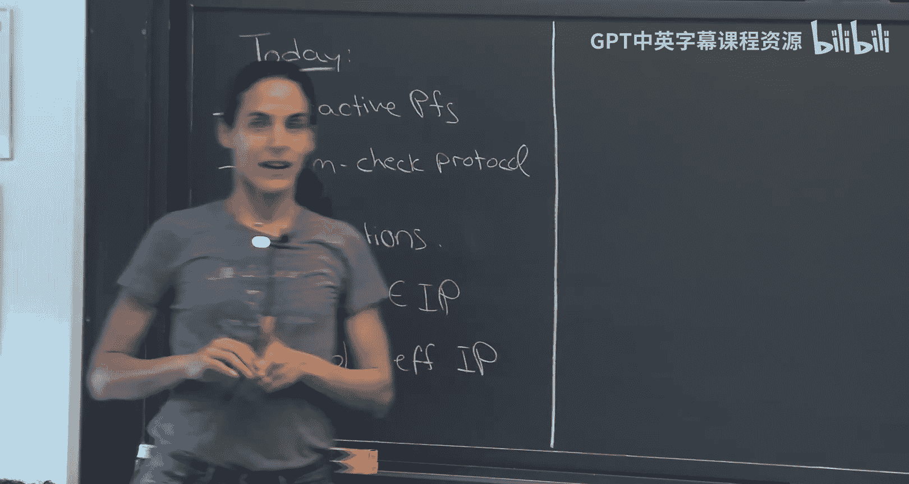

Accsing the website just let me know。 Ill try to fix it。

 So this class is meeting once a week weekly from 1 to 4 pm in terms of expectations or what so you know the expectations that you'll enjoy it。

 I hope you will I think it's really， really beautiful material but beyond having fun I want to ask I have two kind of requirements for you guys。

 So one I want to have scribe notes for the classes。

 I have written notes I can give it to you to help you out。

 but so we have about actually we have 11th classes total in this class。

 but we're going to have a bunch of like one day we're gonna to have a guest lecture Bio dere gave who's has a beautiful result he going to come here an October 6 and presented to us。

 so wet that won't need to bescribed and then there are one。😊。

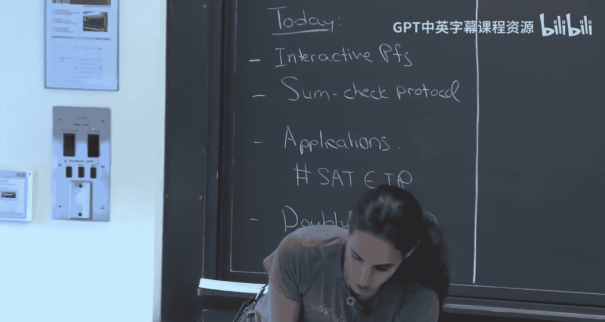

There's a crypto day， which also won't need to bescribed well， there's more。Anybody wants to sit。

but for the rest we'll need scribe notes I'm happy if you want to do it in pairs to describe unless we'll run out of people and then we'll need to keep it for one so that's one requirement and then I was told that I need to do something more you know that's not enough so we'll do a PSet sometime in the middle of the course okay it won't be anything too difficult it's mainly to make sure you're on board but I really do recommend that before class before every time before so here's a real homework okay every time before you come to class in the website there's reading I really recommend you look at the reading and try to read so there's beautiful survey by Justin Taylor there's a link and the website the survey is un proof system it's more kind of the applied type of proof system this is a more theory class but he does have really beautifully written sections。

That are very theoretical that I'm going to link to。😊。

Recommend or I you can think of it as informal homework before class to do the reading。

 I think it will be very helpful for understanding this class。 and also after the you know。

 the lecture to look at the reading。 and I think it will be very， very helpful。😊，Okay。

 so any questions about bureaucracy stuff？Okay， so let me tell you a little bit more about what the class is actually about。

 so you know proofs is something that has been studied in mathematics for thousands of years and usually when people think about what a proof is you know a proof you write kind of line by line and you can verify it kind of line by line to make sure the proof is correct That's how you know most people think of what a proof is starting from the mid-80s in computer science in particular in cryptography。

 the way we thought about proofs changed， started changing this is came about because of the idea of zero knowledge proof so there was a hope kind of construct proofs that reveal no information about why the claim is true and in around 85 Goddas Somi Kali and Raoff kind of。

Constructed the first zero knowledge proof。 by the way， discuss is not about zero knowledge。

 Actually， it's not about crypto per se。 it's just about kind of coming up with new proof systems。

 Do you have a question， but they constructed， they wanted to construct these proofs that reveal no information。

 And to do that they needed to change the model。 turns out they could not do it using kind of what we think of a classical proof。

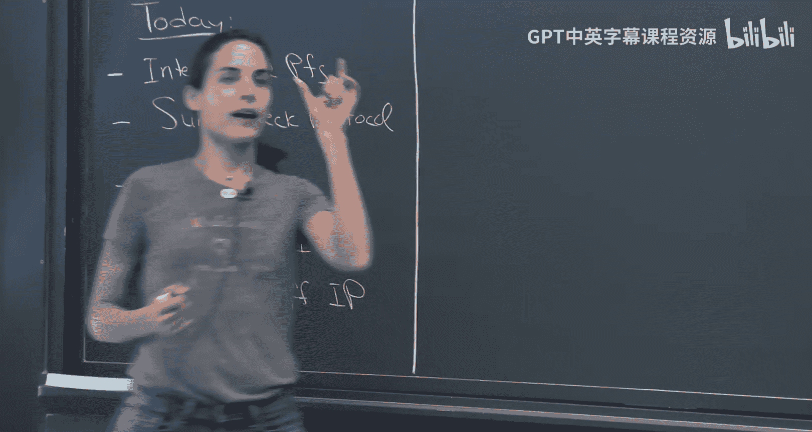

And the way they change the model is by defining a new proof system， a new model。

 which is called interactive proofs。 we're going to talk about this today。

 but they define this notion of interactive proof。 so we're going to start this course by talking about what interactive proofs are and we're going to construct interactive proofs。

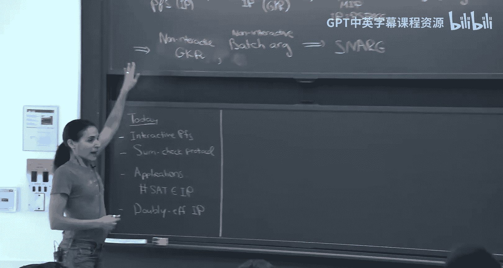

In the 80s and 90s when people thought about interactive proofs。

 usually the model is we think of the verifier as being efficient for us efficient means polynomial time。

 but of course， you know in practice， it has more specific meaning。

 but for now think of efficient as being polynomial time。And the verifier can be all powerful。

I complexityated of the prover was not even a consideration。 Actually。

 they called the provever Merlin， like he's a wizard， can do whatever Dli wants， like infinite power。

Well we're going to talk about after introducing this model and giving some protocols。

 we're going to talk about the model of doubly efficient， interactive proofs。

 And here when we we say， no， the approval is not all powerful。 We don't have all powerful。

Machines in the world， every machine is bounded。 So what we want， yes。

 the verifier should be very efficient， but the prove should not be all powerful either。

 So we care about the proveover running time2。 That's what called doubleub efficient interactive proofs。

 We're going to construct doubleub efficient proof。

 We're going to show the GR protocol specific protocol。

 and then we're going to show application of this protocol。

 And we're going a application to really nice kind of model such as PCP。

 which is probabilsically checkable proofs。 MIP multipro interactive proofs。 and particular。

 we're going show how to use this to get a kind of reproof a celebrated result。

 which is the IP equals piece space theorem of Shamir。Okay， so this。

 if you don't know any of these buzzwords， I'll explain everything。

 this is I'm just kind of doing a very quick overview for those who kind of heard these buzzwords a little bit and so you'll know what to expect。

Okay so up to here， no crypto at all， this is not at all about cryptos just about proof systems then we're going to show how to use cryptography。

To get our proofs more succinct。Okay， and then we're going to kind of leave the idea the。

 the classical idea of proof that。If the theorem is false， you can't cheat。 It's impossible to cheat。

 like， there's no fake proof。 There's no false proof。 Okay， there's no， if the theorem is incorrect。

 there's no proof， period。We're going to use crypto to say maybe they're false proof。

 but they're very hard to find。 So the only way you can find a convincing proof to a false statement is by breaking kind of a hard cryptographic problem。

 you can factor large numbers。 You can break col lattice assumptions and so on。

 Okay so we're going to use cryptography to make our proofs more succinct。

But then what's going on here is proofs we can make them succinct， but they're still attractive。

And then we're going to show how to use this beautiful Fi Chamir paradigm。

 which is a paradigm for reducing interaction and we're going to kind of study the security of this paradigm and show how to make this paradigm secure。

 so these are kind of results that have happened very recently actually one of the students here Alex Lovaldi at MIT was you know student was one of the people who came show kind of the security of this paradigm。

 So we're going to show it， we're going to use it then to show how to get our doubly efficient interactive proof。

 how to make it non- interactivetract anymore， so make it completely nonintract。

We're going to also show to use this F mirrorre paradigm to do kind of batch proofs non interactivetractly in very succinct way。

 So taking a bunch of claims and kind of giving one short proof from them。 And finally。

 we're going to show how to use that to go all the way to what's called a snrg， which is a succinct。

 nonintract argument。 argument is just another word for a computationally sound proof。

So this is kind of very， very high level of what you should expect to learn in this class。

 If you didn't understand a word， what I said then。

This is what the goal is that you will understand this by the end of this class。Okay。

 questions before I start。Okay， I need a volunteer toscribe for today。Oh， fantastic。Okay。

 so with that， let let's start。 So let's start with the notion of interactive proofs。

 And before I go to interactive proofs， let me just， you know， even before interactive proofs。

 let's look at the class NP。No the polygommial time。 even this class is about po system， right。

 So what is this， this class is trying to。By the way。

 there's another chair here for those who don't have a chair。 and there's one right here。Great。Great。

 so even before we go to the interactive setting， let's even think of the class NP。

 What is the class NP， if you think about it， it's all the languages。That have a proof。

 That's the witness that can be verified by polymonmial time。Okay。

 so we want to think with here's the framework for this class is the following。 we want to ask I。

 we have the verifiers are polynomial time or even like you know， they're very efficient。

 What can you prove to these verifiers。Okay， so that's exactly what NP captures。

NP is all the languages。That you can prove membership in the language to phenomenas time verifyifier。

😡，Okay。So NP it is exactly the set。Of languages。Membership。Can be proved。In poly time， so for。

Or can prove。Or can prove to apoliine， maybe I should say， proved。2。A polynomial time verifier。

So pollnal time verify can verify membership in the language。So far so good。Okay。

 but N is body and not that rich。Okay， so we want more more than N。 Okay， so let's， so， okay。

 so one thing we can add。 So what is the class I， The first thing that So I interactive proofs。😊。

And two components。So in MP， the proof is classical。

 it's the class of languages for which a membership can be proved using a classical proof。Okay。

 like proof that you know， you can verify just like building a tuing machine。Okay。

 interactive proofs are different in two ways。 First of all， we allow。Traion。

Between the cover and the verify， they can talk back and forth。Importantly。We allow randomization。

Now note， what do I mean randomization， the verifier can be randomized。😡。

can be some chance that the theorem is false and he'll accept， but that's very， very small。 Okay。

 we can make it kind of if the communication complexity is， let's say N， we can make， youll。

 you'll accept a false statement probability something like2 to the minus n。 so we can make it very。

 very small， but there is a nonze chance that you'll accept false statement。 Okay。

 so in that sense we weaken the model。😊，Now。Note if there is no randomization。

 if we force the verifier。To be deterministic， if the interaction。 So， again。

 the interactive proof is a kind of interactive。AProto between proveover and Verifier。

If the poor knew what the verifier is going to send， if he was completely deterministic。

Then the poorer can just generate the entire transcript and give it as a proof。😡。

So will really be NP。There's no point of this inion。

So really the power of this IP comes from the web that the ver is interactive。

 It comes from the fact that the ver is interactive is randomized， sorry， is randomized。

 and the prove doesn't know what this randomness is going to be。

So if I'm trying to prove to you a statement。I send you my first message， I don't know。

Question you're gonna ask me。 You're gonna answer some random question。

 And I'll need to give an answer。 And then I don't know what the next question。

 If I knew all your question in advance， then there's no point。 It's like it loses the power。 Okay。

 so really， the power comes from the fact that there's interaction in the prover cannot predict ahead of time。

 What questions he's going to get from the verifier。Okay， so any any questions？Okay， so。

I I didn't define this formally yet。 I'll define it formally in a bit。

 but I hope I convinced you that like without randomness， this model is really useless。 Okay。

 there's no point。 How about just about without interaction， let's say had only randomness。

Do I get more？And actually， so what if we allow only randomness？So， proofs。

So let's talk about non interactive proofs。Where the verifier， V is randomized。By the way。

 I forgot to say， please stop me at any point and ask me questions， I like questions。

 questions are good for me to cancel me down。 it gives you an opportunity to digest。

 so it's a great thing so please just at any point stop me with questions。😊，Questions？Okay， so。Good。

 so what what about if we， So we said if we get rid of randomness， we get nothing。

 What if we get rid of interaction and we just allow randomness to get more。

we do get more and after this complexity test is a name， this is MA for Merlin Arthur。

 Arthur is known as a verify。 Merlin is known as a provever。

 so kind of the provever sends a message Arthur， the verifier can kind of toss coins and based on that decided to accept or not。

 but anyway， the non interactivetract randomized version is believed to be I mean。

 it may be more powerful than NP we actually don't know， but it seems there's some more power。

Let me give you an example。 This is an example that will kind of be useful for us later。

 So it's not only an example， but let me give you an example where kind of randomness can be helpful for us。

So suppose you want to verify。😊，Let's say you have two n by N matrices。A and B。

 these are N by N matrices。Let's say over 0，1 or over a finite field。

And let's say you want to verify， supposeupp you want to verify。

That some matrix C is equal to a times B。So you're also given， let's say。You want to， So you。

 you need to verify task of matrix multiplication。Okay， we can do it efficiently。 Yeah， in general。

 the best known algorithm is something like order O of n to the2，3，6， maybe something like that。

 That's the best known matrix multiplication algorithm。W are you looking we。The number， yeah， close。

 but it turns out that if using randomization， you can do it more efficiently。Okay。

 so let's show how you can verify that a matrix C is a product of two matrix Cs， A and B。In time。

 order n squared。Okay， so kind of the best you can because you need to read the the input。Okay。

 so how will you do that？ Here's the idea。 So here's a randomized。Algorithm。For verifying this。

So let's assume that F， first assume。This is kind of with of generality。TheF。

It is much bigger than it。If not， you can take kind of an extension field of that。 Okay。

 embedded it in a much bigger field。 So just， let's assume if those who are not kind of comfortable with the extension field。

 let's assume it's， it's just much bigger。Okay， then what do you do。 Here' is my algorithm。

 What I'm going to do， I'm going to choose a random element in the field。I'm going to consider x。

 which is just1 r R squared up to r to the n minus-1。Okay， so all the powers of R。

 I chose a random are in the field。 I look at all the powers of R。And then what do I do。呀。Exactly。

And then I'm going to check。If c times x， I guess transpose。Cause I wrote it。Is equal to A B。Time X。

That's my algorithm。Okay， so note。啊。Yes， so。

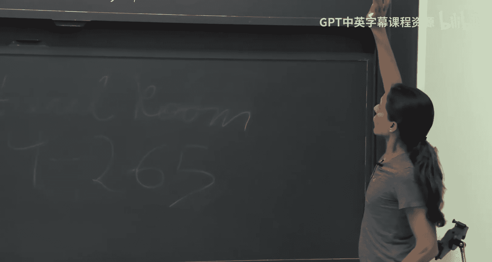

So note this is just a vector and vector times matrix。

 So to multiply a matrix by vector is time n squared as opposed to。You know， the end to the 2，3，6。

 So this is more efficient。 Why is it okay， why？ So， of course， it's complete。 If these are equal。

 I'm going accept。

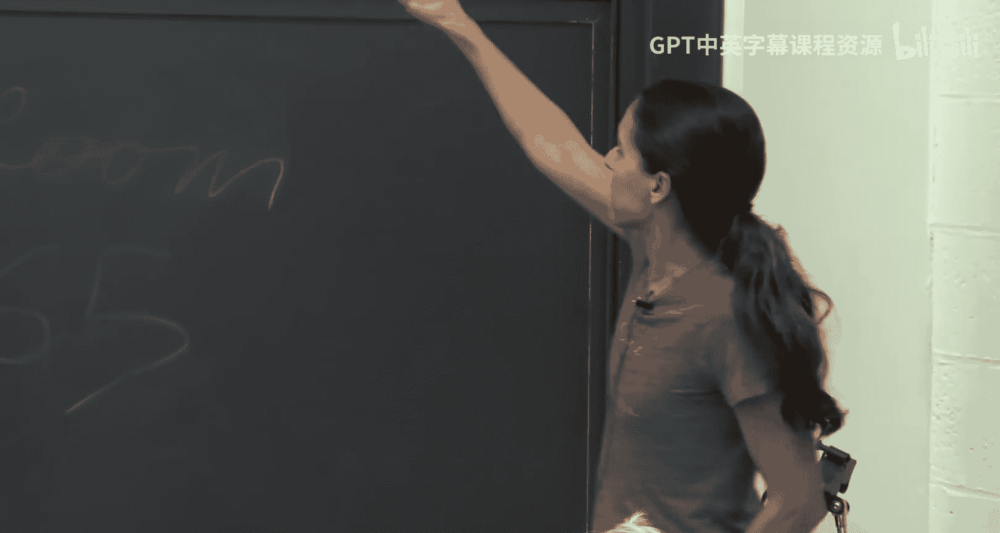

Okay， but if they're not equal。So why， why is it sound， So maybe you can convince me。

 Let's say theyre not equal。 Maybe you can still convince that they're equal。

 That would be a problem。So let， yeah。You could move the term。そこ。are in sense。

 the size of the field is much greater than。Plus problem， but like in。Fantastic， fantastic。

 So here's， let me just repeat what you said a bit more formally。 So suppose they're not equal。

 There's one row that they're not equal on， right， Let's focus on that row so you can think of what when I do C times X。

's let's say C1， like the first row you see。When I do c times x。This is， you can think of this as。

I take， I look at this the row as a polynomial。 So if you look at the first row。

 maybe I'll write it as c11 up to or C10 up to C1 n minus1。

 let's look at this n row when I multiply by x， which is 1 R R squared de。

 this is nothing but sum C1， I X to the I， or sorry， R to the I。So now what do check。

 so let me know if this row， let's say it is different than the row here。😡。

Then I have two different polynomials。Right me if I write， if I write the row there。

 let's say as I don't know， D1， D0 or D1，0 up to D1 and -1。

 Let's say this is the row corresponding to a times B。

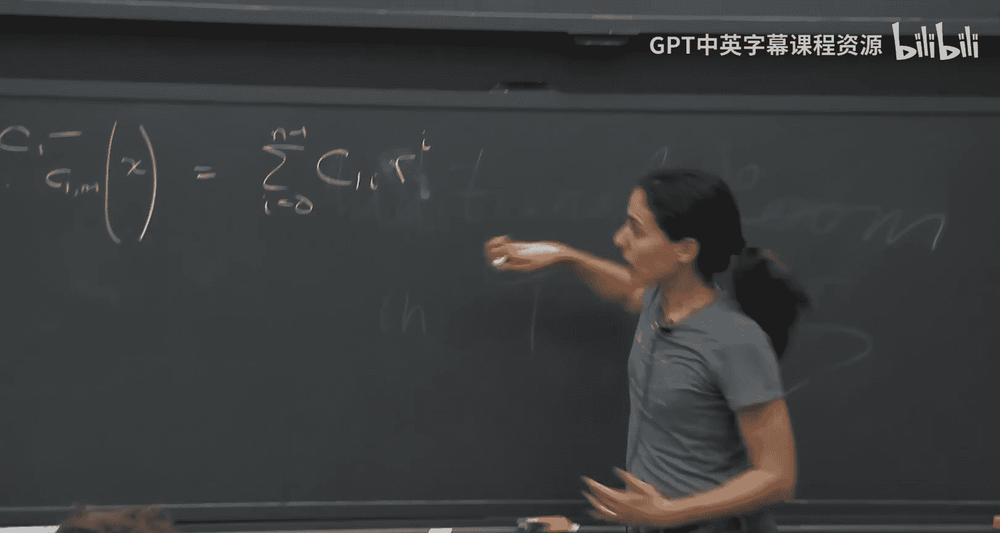

These are different。And these are different。Then I have two different polynomials。

That agree in a random two random degree n-1 polynomials。 So the polynomial is defined by this row。

 These are the coefficients of the polynomial。 They are n coefficient。

 So it's a degree n -1 polynomial。😡，So when would I accept a false claim？

If there exists two things that are equal that are different there exists a row in C。

 that's different than a row in a times B。😡，So there is this a polynomial degree -1 here and a different polynomial degree and -1。

 And these two polynomials are equal。And this are。But what is the probability that two distinct polylannomial of degree and minus1 are equal。

 it's just this happens with probability。😡，And most n -1， the degree。Divided by the field size。Right。

 two， colonials agree to the steep mode and gradient at most or the fraction。

 now they gradient at most n minus-1 points， and which is n minus-1 over f fractions。

So that so I'll reject this problem。And if we're not happy with this F F is not big enough for us。

 then we do everything over a bigger extension field so we can accept so our rejection probability will be high。

the ball clean response。Any questions about this？Okay， so so far what we saw is that red oh， yeah。Oh。

 yes， please。 Thank you。This is not towards a dilemma。 Short of dilemma is similar。

 but in a multivariate setting。 So this good let me that's a good question。 So thank you。

 So I just want to say， oh， by the way， I should tell you guys this is being recorded。

 I hope it's okay with you。 You're not being recorded。 I'm supposed to be the one being recorded。

 but I think you should know that there's a camera man behind you but actually。

 I don't I don't think I'm going to put this public。 I mean， it's in the website for us。 well。

 now the website is public。 So it will be public。I can make it private if you prefer if people come to me an ask to be private on the private。

啊系。Okay， so good so the question was， was this Schrowars of Poma and the answer that Schros of Poma is a multivariate version of this。

 Okay， this is for the single variant case。The fact that two univariate polynoms of degree D distinct theyre equal and a random value theyre equal and at most D element D being the degree is is kind of from。

 I don't remember theorem， like basic， something of。You say La grand interpolation， yeah。

 but truol is exactly that but the multivariate setting。So it's a generalization。Exactly， exactly。

 the choice liberal is exactly the generalization of this。

 The It will come up actually later in this class。 So yeah， we'll talk about that。Great。

 any other questions？Yeah， didn where。他给别。more。Good， good good， very good question。

 so the question is， do we have examples where randomness gives you more freedom up than just kind of a patheticically and this is not very difficult right。

Or in other words， let me rephrase your question。Is the class MA different than N？

That's the question， we don't know。从M a嘅。Yeah， so the yeah。

 so and okay so yeah so let me explain there's a kind of there's this class called like MA MA MA as many as you want and the idea is M means Morlin speaks Morlin is the prove he's the wizard。

A means Arthur， the king He's the verifier answers。 M speaks A answers， and speaks A answers。

 So there's kind of these classes， you know， M A N A and A A here， M A means M。

 the modellin speaks Arthur。Kind of uses randomness and then kind of sends randomness。 Well。

 he doesn't speak。 No doesn't speak again。 So， but No one speaks。 Arthur chooses coins。

 and then there's a verdict function that decides to accept her。Okay。

 and we don't know if M is different than N P。 Yes， this actually is right。

 like you saying this is like polymer that it yes I give you a circuit。Sly about a degree。

I claim that it's identically。You can check it clearly with this。Right， right， right。Right， but。Oh。

 you're saying。 you're saying， sorry。 You're saying to test whether a circuit is a。Identally0， But。

 but wait， oh， you're giving us just as as a circuit as a circuit testing if it's identically0。

But if it needs to be low degree because otherwise somehow like it's syntactically low degree， right。

 lower depth or something。depth log depth arithmetic circuit。

 then you're saying it has polyommial degree， it has polynomial degree。

 you can test it by taking large field at sent field， you can test， you don't know how to predict。

If it's yes， good， we don't know how to de randomize it。 how to de randomize if you de randomize it。

 then there are circuit bonds， which means that you can deize everything properly， right。もべす。每一月重。

Yeah， yeah， although that's a problem promise。そすね。No， why， why isn't that an。

 so you look at the clock。これず。Awesome right， okay， okay， yeah， yeah yeah yeah。You're right。

 it's in BP yeah。So I just wanted to make the point that work Ill described is essentially the only canonical。

Problem in any。Yeah。Yeah， up to up to details。うちはい。face对倍心。Okay， so。

 so now let's go in ahead and just define this class of NP。Is are in proofs。

And then we'll show how kind of。An actual。And we're actually sure why we believe this class is more powerful than and people will give kind of a。

A protocol that solves a problem that seems pretty hard。So， let's see。So机个。

So what is an interactive proof？And intract to proof。Iき。This is a protocol。Between。And possibly。

All powerful。 I'm not。Apro。第一。Okay， so B can be run as long as。He wants。And。😊，A polyly time。

Very fire。你。删。Here's the requirement one from the protocol。

 we want to say that a so interactive protocol， let's say four。sorry，Between a prove P。

For a language L。For some language。Or some problem。L， so the point correspondent is membership in L。

 that's the problem is X a member， not a member。So an interactive proof should satisfy the following。

 So it's a protocol such that。It should have two properties， completeness and soundness。

Completeness says。That。A is in the language。W should convince you to accept？Okay， so。

If for every act in the language。If you look， if you denote， let's say by T the transcript。

 so let's say P。啊。And V， which has secret randomness。

 The prover doesn't know what it is ahead of time on input X。

Let's run this protocol to get a transcript。Okay， so it's an interactive protocol。

 it actually you can it the protocol consists in two phases。First。

 there's interaction between they talk back and forth。Let's den the transcript by team。

I often don like like PV， that's kind of the protocol， the proveoverheads。

 are both of them know the input？😡，They generate a transcript。And at the end， the probability。That V。

 with his input with his he gets the transcript， the randomness and X。The probability that shits。

U put one。When we say Apple one， we usually mean he accepts。Is。Large， okay， let me call a least。死。So。

 and C is going to be a complete mis parameter。 So protocol between P and V for language L with。

Completeness。C。And soundness。Yes。Yes， I do know now。 Oh， thank you。

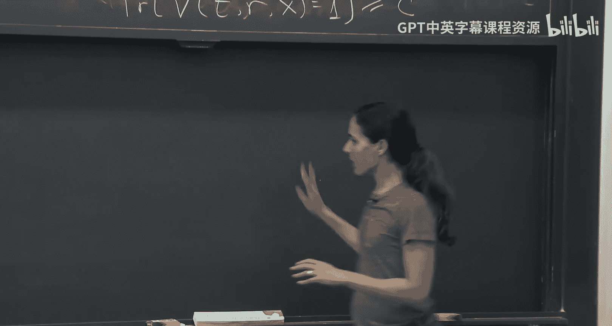

Thanks， Lo。Okay， so if it's in the language， he's accepted with high probability。

 there's some complete parameter C。And most of what we see in class A is one， okay。

 you except for we one。And Sun says。Please。😊，Ta says。For any X， not in the language。For every X。

 that's not in the language。No。you tried to cheat， you'll fail。Okay， so for any cheating prove。

Or friend Amy。Be because it can be any any prover that triess to convince me to accept。

If we the probability for the same ti is above， the probability。That's a verify。

Given the transcript of randomness and X， output puts one except。Is at most best。Okay。

 so that if it's in the language， you should be accepted with high probability C I。

 if it's not in the language， you should accept with small probability S is small。

ok。😊，Question about tomorrow。呀。Restriction of。S and C are they just Great， great questions。

 What are S C， Are they constant。 So that was my next mark。

 which means that the question was right in place。 So off。😊，If you look at the literature。

 there won't be a mention of S and C and C will be taken to be two thirds。

 and S will be taken to be one third。 That's kind canonical。 So when people say there's an here's in。

Often you think of s as one third and two third。

And this seems like very arbitrary and you should be alarmed。You know where do these pants come from？

这然是最。

Repeat the procedure like exactly。Exactly， so the reason why we don't care so much about these constants is because if you have an attractive proof。

With a gap between CNS。 So， for example，1 third and two thirds。

 what we're going to do is repeat the protocol。 So let's say that it's one third and two third。

 Let's repeat the protocol。 Let's say n times。And then we're going to accept if you're closer to C。

And reject if you're closer to S or if so in other words， if more than C plus S over 2。

 like right in the middle， if more than C plus S over2 are accepted， you're going accept if less。

 you're going to reject。In this case of two3 and third， if let's say more than half。De it many， many。

 many times。 You should accept if it's in the language。

 you should expect to see about two third acceptance。If it's not in the language。

 you should expect to see one third of them being accepted。

And if you repeat enough times by the laws of larger numbers。

 you're going to kind of get closer and closer to the expectation。

 So you're going to be either very close to the two third And if you're in the language or very close to the one third。

 if you're outside the language and the。Like there's very strong concentration。 So if you repeat it。

 let's say end times， then now youre can be accepted or your the soundness and completeness gap would be something like2 to the minus n versus1 minus-2 to the minus n。

 So you can really kind of very fast。 make these things go to 0 and 1。

 which is why often we don't really care about these。 And you can think of them。

 it's very close to 0 and very close to 1。 So if it's in the language。

 you acceptable probability almost one。 If it's not the language。

 you reject you accept probability almost 0。ok。😊，Great。Okay。

Any question about kind of what an interactive proof is？Okay。

 I just want to mention one thing this notation。Like PV on input X is overloaded。

 We use this notation to denote the transcript。 We also use this notation to denote the verted function。

 whether V accepts or not。And also I'll use that in class and also wherever you read you'll see both of them kind of used。

 so it's good to get used to so this sometimes the notes the entire transcript。

 sometimes it's just the notes， the acceptance or e bit of the verifier and they'll be clear in the contents。

Okay， so now the question you should ask is， okay， is this？Is this model more expressive than N？

What can we do with this model？How can。What's the power for this law？

So let me actually go to the punchline and say there's a celebrated result by Shamia。From 92。

 I believe。And he's shown that， oh， this model is very， very powerful。And actually。

 you can prove any。Peace space computation in this model。 namely。

 if I want to prove to you any language in peace space。Take any language in peace space。

 I can prove membership in this language to a verifier that only runs in polynomial time。

So that's me。Space space， we believe is much， much。Kind of more expressive， stronger than N。

 We actually don't know how to prove it， by the way， but we believe that's the case。

So we believe this is a much stronger kind of proof system。Okay。

 I think before I'm going to show you actually now I'm going to give you an example of the kind of。

The power of the spoof system。 But before I go into the kind of the technicality。

 I want to step back for a second。And kind of。Think a little bit about the story here。

 which is a very nice story。 So， you know this。Introduction of interactive proofs this model came about。

For the goal of doing zero knowledge。Thought at that point about whether you can improve all languages。

 not all languages。😡，D to hide， Okay， I just want to hide why a theorem is true。

 I want to hide the proof。 I want to convince you， but hide。

 that was the only goal that kind of introduce this model。

And's kind of interesting how kind of very fact， like also who cares about zero knowledge。

 This is a really interesting one。 Let's say we can do it。 And this kind of open our eyes。

 just like idea that we can shift from the traditional rare thing about proofs to this interactive and randomized randomized land kind of brought about a lot of really really beautiful and fascinating results。

 including the fact。 this is the first time that we were， wow。

 we can prove a lot of earth to a polynomial time verify。 much more than what was believed to be。😊。

What we believed we can do with a classical proof。So this was kind of really， I think。

 eye opening and very interesting。So， okay， so now I'm going to convince you。

 try to convince you of why this a。Proof system， this modeltto is so powerful by giving you an example of things of a problem that I can prove to you using an interactive proof that we really don't know how to prove using a classical proof。

Okay， so let me give you the example。So heres the example。So the protocol is called sumcha protocol。

And this， I'm going to give you an interactive， this is an interactive proof for the following problem。

 so take any degree fix。Or okay， given。A polynomial。F。Let' say from F to the n。 So multivari。

Of let's take degree。D in each variable。Okay， I want a proof。That。Some of F。B one。Or。

And let me just make sure how I hold it down。Okay， sorry。So take any fix any。Subset H and S。

You can think of H01， you can think of a bigger set。I want you to convince me that some。F。

Of H1 of the H M。For all H1 after H M。In each。Is equal some value be。Okay， so there is a fixed。

Polynomial F。 let's say I know this polynomial。 I either it actually has a succint circuit or。

IOrac classes to it， so Im a verifier。I'm a verifier。 I have。

 let's say I have oracle access to this polynomial， or theres some succinct way to compute it。

 so I can compute this polynomial easily。 Let's think for now， I have oracle access to it。

 so I can kind of query it in some point and after that and get back an end。I want you to want。

Prove you， you're going to prove to。They're the sum of this polynomial and H to the M points and all the points。

 there's some set H。 you can think of H is 01。 you can think of it bigger。

And I want you to sum this polynomial on all the elements in the set H to them。Okay。

 all of this is done over some finite Fi left。And들そ 서 되。I want to prove that this sum is better。Okay。

' I'm going to show you an interactive proof of this link。Now， before kind of you guys are like。

 seriously， why do I care about this language， Is it interesting。

 Where did I come up with this thing， Let me tell you， I think this is。

The most important protocol in all the literature and food ecosystem。Okay。

 we all use this protocol all the time。 It turns out to be super， super influential。 Okay。

 every single thing we'll use from now on relies on this protocol。Okay， so it turns out。

 and I'm going to convince you that later， but that this is a very， very important actually problem。

Okay， if you have an attractive proof for this problem， it kind of gives you rice and proof for many。

 many， many other problems。😡，Okay， actually， we use this。

If you give an attractive po for this problem， I can use it to get an attractive po for all feed spaces。

And kind of a black box s。So really， this is the heart of coming up with interactive proofs。

This is the most important attractive piece。Okay。So with that， let me show you the interactive form。

For proving this。Any questions before we jump in。 Yeah。

 so just to here H is like a subset of like one dimension。Exactly H exactly， you can think of H is 0。

1， for example。 You can think of H is 0，1，2， because yeah， I mean， if two is in the field。 Yeah。

 it's a one dimensional thing， right， And you sum over。

 So as a you sum your over H to the M sides of H to the M elements。

Its our like any year the two ages can be。这个。It can be you sum over all them。

 you sum over also like 0，0，0，0，0，1 Yeah， yeah， H one needs you do not need to be distinct at all。

 Yeah， exactly。 overall possible， Yeah， you sum over H to the M elements。

 each one ro all the possibilities。Good。Other questions？Thank you。 Yes。

 So degree D in which variable just means like any variable is the most like explicitly。😊，Exactly。

 so yeah， let me go good。 great。 So degree D in each variables means F it's a polynomial。

 So you can write it as a sum of monomials。 Each monoommial， each variable has a degree。

 So I was say if you look at all the monoials， each variable has a degree and most D in each of the monoials。

😊，Okay， great questions。 Thank you。And other other questions。Okay， great。

 So let me give you the protocol a。So。What。

By the way I want to tell you I get such satisfactions from your questions。

 so if you just want to make me happy， which is a great goal on its own， you should ask questions。O。

Ready for the protocol。Okay。Proer。Convins a verifier that the some。On H one of the H N。

It is equal to be。Where the Hs are all elements in this set H， which is in the field。

 We have them some fit field that we working。Okay。How would he prove， what what would he do？

 So here is the idea。The idea is， the prover will firsten。

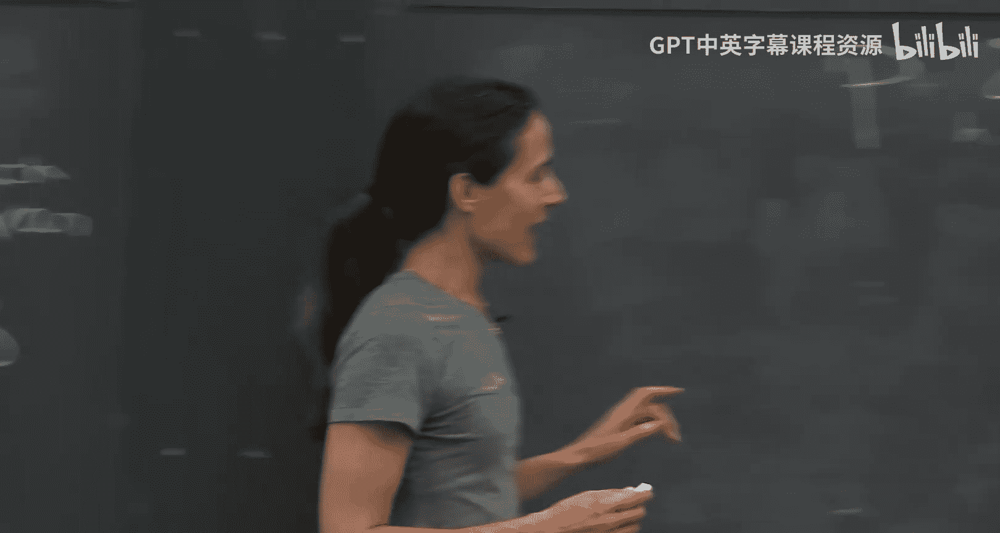

This sum， is polynomial， but where the first variable is empty is open。 So here will compute。いいけも。

He will compute some。Only over H2。U to age。F of x。This is a variable。to each animal。

And he will send this over。Let's call this G1 of。So he sends a un variant polynomial。Okay。

 where he sums over H2 H M， but leaves the。Variable open。😡，Okay。😊。

What is the degree of this phenomenal？D， very good。 So this is a degree D polynomial。

The verifier checks。That you want。It's a degree。M mostD。If not。

 he rejects because he knows that this is a degree D。퍼르노미요， 모두 어떻게별ポ노ミ요。So he knows that each。

Variable is a degree of most deep。So if you're sending someone fans greet。

 he's like you're cheating here。So it's going to be to your objective。He， he will also check。That。三。

G1 of H， I guess1。 Let me call H1。That if you take G1 and you sumit over all possible h's in H。😡。

What does he expect to get， What would he check for？Exactly data。Because the claim is better。

So he checks that this is a degree at most。That when you sun over ages， you get what was claimed。ok。

😊，If this does not hold and you reject you， you didn't say， but I reject you， not going to continue。

😡，If this holds。Then he chooses a random。T1 in the field。

This is often an notation left arrow that we use for choosing a random。So he chooses at random， T1。

 a random element in the field， not in H， but in the big field。Okay。

 you need to think of this field as being big。 that the bigger the field。

 the better the soundless will get。Okay， so it chooses a random T1 in the field。Good。

 then what happens the。The proof。In some sense， this reduces the problem from checking that this sum is beta to checking。

上。very here to checking that sum of F。T T is fixed or T1， we call it， and then H2 up to H N。

Is this fixed， I don't know， G1。아 t。We kind of reduce the problem to this problem。

 which is of one dimension less， because the sum is only over M minus1 variable。Yeses。😊。

啊I say you a very price。Good， what， what are we gonna polynomial in。 Very good question。

 When I said that vers polynomial time， polynomial in what？ So he's gonna， he's gonna be polynomial。

 Okay， we think of F。 I said F can get oracle access to it。 So polynomial and what。

 So he was what we're gonna we're gonna analyze his runtime in a bit。

 but his runtime will depend polynomial on。And。Which is the number of variables。And on the degree。

And we think of today in action。Like throughout the course and it's common in this field。

 we think of F like that he can add and multiply things in or order one time。 Like it's a constant。

 And typically， these fields are going be say polylo。 but we don't want to run， you know。

 chase after these polylo terms。 So we're not gonna consider them really。

 Sometimes we do sometimes we don't want depends。 But beyond the。 So if you want to be kind of very。

Pedantique， then you should。ま。我 h。Yes， thank you。Yes， of course。 Thanks， Surya， the size of age。

And logs。That's what's going to happen。 But you' write that here the polynomial time doesn't really apply here because you I said that he has autoal axis。

 So work polynomial over。 So this is what he's going to be asked。

 But when we're going to use it for applications， you'll see it will correspond to polynomial time。

 But we're going to go over this when we analyze the。Okay。So let's okay。

 so let's just continue so let me actually start so what's let me even say before I get into the protocol。

 let's continue the protocol with kind of a high level idea of what we're trying to do here。

The is is the phone。We want to catch approver cheating， that's the goal of proof， right。

 we want to catch you if you're cheating。😡，So suppose the proveer is cheating here。

 how will we catch it？So way back in the catch is when tell them， you know what？Give me this G1。Okay。

 now he cannot give me the actual trulogy one。Because the actual truelogy1 will not sum up to beta。

 but is the false thing。So right so， if I put your cheats， if you try， I'm trying to kind of。

 let's come up with this protocol together with kind of the goal trying to catch。The the prover。

 So how do we catch a prover cheating。So they guys will come， you know what？

Give me this sum with this opening。I'm going to check that this sum like that the sum of G1 is equal to beta。

 and then it's low degree。If it passes， then this G1 cannot be the true， true G1。

 It can actually be the real sum of F because the real sum of F is not beta。 He's G。😡。

So this must be a cheat。Now when we send them T1。And we consider kind。

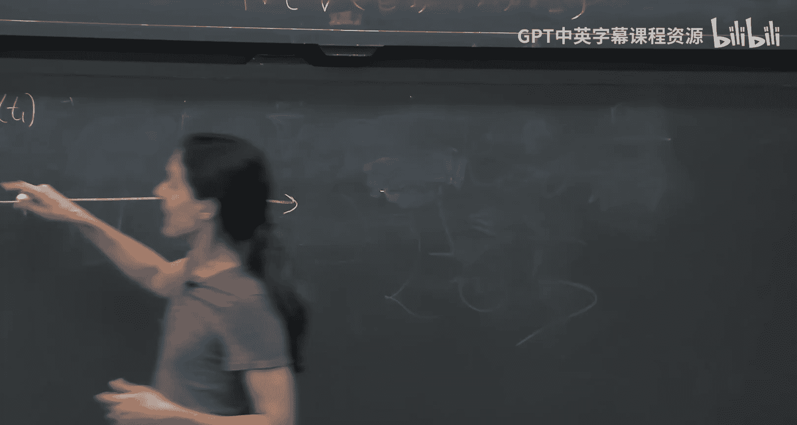

So now we send T1 and we kind of reduce the claim to claiming this。But with very high probability。

 G1 is also a cheat。Because。G G1 T1 is a cheat， so G1 T1 is not really the sum。

Because they're different。G1 is different than that。So we know that if they're different there。

 we only on D elements。I took this simpleno， we in the elements。

 what' the probability that this team1 is one of the team？Please small， do wife。Okay。

 so I should think of this as really large， Wait， so this is also false actually， you know。

 he give me a Jew， but's actually not the real life， he's going to claim it's the real life。

 but I know it's not。Now I'm going to tell him next thing， I'm going to tell， okay， give me G2。

G 2 is。G2 of x。Is some。It should be some F T1， I'm going to only sum over H3 up to HM。The x2。

 the2 is going to be open and then H3 after Hm。Okay。

 so we started by getting rid of the sound over H1。we gave him the Univari polylomial Rios random T1。

 now we're getting rid of summing over the second coordinate。

We're asking for a univari polynomial G2。 What do we check， We check。So the verifier checks。That G2。

Is of degree。Mmo地。And what else does he check？Yes。Very good。 So sum G2 and H。

Maybe Al H2 is equal to what？7。Exactly， G1 of T1。So essentially， we kind of， you know。

 we checked this phone number exactly as we did before。ok重啦。Note。In the honest case， of course。

 that's， that's the case。 G2， of course， is degree of most D because that is degree in most D。

 And when you sum with over over all of H2， you should get exactly G1 and T。 That's how we。Good。

If this does not hold you immediately abort and saying， I reject you。He's happy， he's going to send。

2 random from the field。What am I going to reply with， what is the prover of reply with？😡。

So let's see G3。Of X is what？Some over H4 H。希。Very good啊。Very good。 F of T1， T2。And H4。After H。Yeah。

 again， we take essentially what happened here， we reduced after T2。

 we reduced the problem to proving a sum check over some F1 T1 T2， H3。Up to HM。

 and we need to check whether this is equal to。A G2 of H2。I have T2， sorry。Okay， so again。

 each time we kind of layer kind of get rid of one variable in the sum check。

 we start with an n variant at sum check， and each round we get rid of one variable。Okay， last one。

 what do we check here？We've got G3， what do we check？What is the what is G3 H3。Exactly， so first。

 G3 is low degree is degree。Mmost three and some G3。Is G2 T2。

CanWe continue in this way until we continue continue， continue until we got rid of everything。

 So in the last round， what will happen in the last round？In the last round。

We will send G and minus1 Gm。Of like GmX。Which is。F。Up T1 up to Tn minus-1。X。

That's what he should check。That's what you should send。 if you're honest， that's what you send。

 you peel out off everything finally。You're left with GM， which is F， untilityM1。

And then the ver is done， I'll choose a random。Tm。And he will check whether this is indeed F of T1 of T TM。

 We assume he has or classes so we can check。If this value is t1 of to T。Okay， so finally。

 this is this in verifier。I'm out of room， but maybe I'll right here。V chooses。啊 random t。And checks。

百 g and。tM。Is equal to the oracle。 He has F on。这 want to听。That's the protocol。

I'll give you a minute to appreciate the beauty while I raise the board。You you have a different set。

You're asking， can I have a different set， I can， I can have a different set。 Yes， yeah。

 so the question was， do the Hs have to be identical and answer， they don't have to be identical。

 You can take we didn't use that anywhere。 and yeah， it somehow， yeah。

 somehow we always use it when it is， but。诶。But but that's a very good point because its like it seems more general and seems like it can be useful。

 but somehow we don't use it。But that's a very good point yeah。

 you can the Hs does not have to be the same age you can be some over H1 of HM。

So the reach could be equal that。Okay， H could be equal to F。Yes， H could be equal to F。诶。そ。

In you one H one。sorry。First line the sum or G want to H1， you will take time to question on that。

 but let's say that's okay。Inさ。Second。Yeah， so we'll talk about Thomas in a minute。actually。

If F is degree D， the sum is won't。Dey， I actually， I think actually， okay。

 let's talk about soundists。 And then we'll see actually， the soundists won't in general。

 usually when H is big。In applications， what happens often is when you take big H。

 the F turns out to be degree H or h minus1。So when we use this protocol， So， you know， as I said。

 this problem， I say， what do I care about this problem， Who cares about this problem？

 So it turns out we care a lot。 It comes up all the time。 The way we use it in practice。

 like the way it comes up is the F that we use usually is a degree H -1 in each variable。

 We use it in a way that that turns out to be the degree of F。And the soundness decays with a degree。

 So if the H is big， the sound is if the degree is big， the soundless is big， but actually。

Your promise that the degree is small， then we're good。 we'll analyze it right now。Yeah。

 he think about what's a special development。I guess see that right they only。

He coordinates and like you can do the summation thing， but if there's something like。Yes， yes。

 great question， Love the question， So what's so fascinating about polynomials that comes up here。

So why fine why is this so interesting， Why phenomenonial so， so important， you know。

 the this comes up everywhere。 So here's my taken。And this question。Everything can be， okay。

 first of all， Pials are and it's tough。 They're very。

 very useful because of their power of error correction。 So in other words， what happens。She at once。

We're going to amplify your cheek。 That's kind of kind of what we do here。 right。

 You cheating once we're gonna to。Like for random point T。If your law degree。

Then we assume that this per gets kind of low degree， low degree low degree all the time。

 If you give low degree， low degree low degree and you cheat it。

 then the cheat must be kind of correspondent a cheat in a random point。 Like at the end。

 a random point。 here of the T， you should be different。That kind of we'll analyze this。

 This is just in， but that's kind of the beauty of colonials that。You'reran， Iran almost everywhere。

Because if， if it's on the car polynomial， then it's different from the qua polynomial almost everywhere。

 That's the short dippoma and for the multivari case， for the singlevari case。

 it's just the conipulation， I guess it's called。Okay。Now， you're saying， okay。

 but that's just polynomial。 Why am I say it comes What's special about polynomial， Like， why。

 why are they so general， Okay， if you haven't have a polynomial good good for you。

 you won because it has such aircrafting guarantees， you're lucky。 It's your lucky day。

 But what if it's like， why is every a lucky day kind of thing。

 Why is the polynomial come up coming up everywhere。

And the answer is that you can actually embed many， many problems into polynomials。

 so there's a way there's a technique which we'll call low degree extension。

 we'll see that pretty soon， if not today than tomorrow， then next week。

Where you can kind of convert many。Problem into polyannomials。And then use the subject。

 So that's often what we do。 We take a problem。 We embed it into a polynom。

 We kind of extend it to look like a polynomial a low degree。Did then we you subject to it。

So that's how we will come up。Any more questions before we analyze the subject protocol？

Questions on the protocol itself。Or。Yeah。Yeah is there sub version subject check。意。こ。Oh， oh。

 you're asking what you're asking you saying。This sum check。

 do I really need this specific kind of polynomial code。

 or can I do it using arbitrary codes kind of thing？ Okay， so actually。

 this is a great great question。 There's a paper by Oma ear from。Several years ago。

 I remember exactly where he shows how to do a sum check over more general codes。

 not any kind of code， but more general than that thing like Tensor codes or Rachel。

 do you remember you looked into it。Tens of code。 Yeah， so he generalized it not to any code。

 but he gave a generalization the subject for called to work big for larger family codes。

I try to ask the question。What does it mean for this subject protocol to work for。Okay， good。

 good good。 So you can think of it is I'm proving something about。

I remember exactly how his formalization was， but it's like I'm proving something about a code word。

And I want kind of reinpret this。 you can reinterpret this as because you can think of this F as being an aircrafting code。

 So does it work only for this kind of readmeller， This is called readm code。

 Does it work only for readm。 Can you do for arbitrary codes。 and it proves it for arbitrary codes。

 So this is kind of there's kind of any polynomial is an aircrafting code。

 It's a type of aircrafting code。 for a multivariate case。

 it's called readmeller for univari case is called readtin。 And so one the sum protocol for。

 you can think of it as this protocol for readmer codes。 And then you can ask。

 is there analog for other codes。 And actually， there are analogs。Okay， any other questions yeah。上。

Making the site page like the same as the。A here with me。有。こ in there。

know a point of doing this because it it on off like size of。老。Okay， you're right。 So okay。

 you're right。 So if okay， So let me go back。 So the question， what what should this H be， You know。

 what is this H， And the answer is this H can actually be all of F。 Of course， if it's all of F。

 the verify runs in time， which is like the size of F， because he checks you know， sum over H。

 if it's all of F he runs them all of F。 But maybe F is not that big， maybe F is polynomial。

 even if F is polynomial size， still。Checking this。S is much bigger than S， right。

 It's like H to the N， like F to the N and can be big。 So the。

 the hardness does not come only from F comes from。M， it's exponential in M。

 It's the M that kind of makes it very hard。哎，你搜。Can be as large as the entire field。

 And you can run some check over that， too。 Theres it's still an interesting protocol， yeah。

But if we do that， wouldn't we need to do this on extension of that or something？Good， so okay， good。

 so the question is wait。Do we get any aircrafting guarantees here。

 Because if we're doing over all of F。 And I think the answer is yes。

 we don't need to extend it further because as we see now， we'll see now when we analyze it。

 the sound error goes down with something like D over F。 H does not come into play there。

 But we'll see that。 Let's， let's see that together。 I write。 I agree。

 when you say there's like okay。 that should right， It should things should degrade with H。

 But actually they don't。 So we'll see that now when we when we analyze it。Okay。

 any these are great great questions， so thank you， any other questions before we go to the analysis。

Okay， so actually perform do sound。 Let's just first do a sanity check and the and the kind of communication complexity and the the run time and so on。

 So first， let's see， this protocol has M round。 Each round we kind of get rid of one very one sum in the sum check。

 right， so the。😊。

So the communication complexity， so our round complexity。

Is M round and back and forth and2 imagine if you want to call one or round is one， two。

 So let me just say order M。The communication complexity。😊，Is what so each time。

One polyial ascent and one field element。So it's really a polynomial is a degree D， right。

 so it's just D field elements each time times n。So fine， we can do times， you know。

 log F if you want to。So that's the communication complexity。Okay， what about the verifier run time？

😡，So the verifier。He gets a polynomial， degree D polynomial。

 So D essentially field elements or defaults1 field elements。 and he just sums them up。

 He checks that it's a degree D and sums them up。 That's all he does。

 So it's really essentially the same。For M Ros， he has a degree D polynomial， and he some of them。

 I should put him maybe problem log then。Because to some。

 I'm assuming addition they should take polylog F again， as I said， often。

 I think maybe even in the notes， just in Taylor's notes。This is omitted。

 It's like the field thing of is one operation。 So just so， you know， if you read things。

 often you won't see this part。Question。The verfa also needs to choose the T sign sum over H Yeah exactly。

 so some over H is like H editions。Okay okay， yeah， he sorry。 yeah。 so okay， good。

 you're saying he needs to compute。 It's still， yeah， so right。

 So the the verify he gets a polynomial， he needs to evaluate the polynomial in。H so yeah。

 so for M rounds， he gets a degree D polynomial， he needs to evaluate it。Oh， sorry。

 this does not have age。Yeah， it's evaluated in H points。The degree D polynomial。 and then。诶冇。Thanks。

 good。Thanks Ly， good catch。还发什么。Okay。Great， so that's the verifier。 As I said。

 the cool we care less about。 But just， you know， if you want to just。And by the way。

 this is assumed the ver has access to F。 He knows F F is kind of he hasor access to it because of course。

 at that， he needs to check。Equality with that。 So this week， just as me as a work， collects F。

 And then the prove what he does he need to do， Well， he needs to do this computation。

 So he runs in time like。H to the M。 you need to do all the sum。 He to run。 So the polynomial。

 So it's called a T sub F is the time to run。To compute F。 So he needs to compute F。

 He needs to do the sum overall apps。 And he does that kind of D M times， something like that。诶。

And Polo age。放乐嘅 f 。Yeah。So that's the proveverse。O。Yes。😊，这是的饭店里面。F has for。Over。No， good， good。

 good， good， good， great question。 No， so you're okay。

 So even if V has random world collection for F。He can compute this entire thing。

 but it will take him time H to the end。Because是 need 지금没 son。So the goal he needs to check。

 So let's say computing F wants it takes them one time。 you can kind of ask。

 but the check with somebody needs to ask。This an H to the M question。

 now think of H to them as huge。嗯。Even if H is2， that think of n as being big， n is like n variables。

 so it's like exponential。That's。Great question。But should I think of the。かのみ。Good， so you can， okay。

 there's two options。 You can think of the description of F as being polynomial。 That's one option。

 or that you can compute F It's like described by a polynomial high circuit。

 Or you can think it can be large but ver has access to it。 Some。

 the verifier has like a trusted or called the computes app for。Okay。Great。Okay。

 so now the interest so。Yes喂7。Yeah， this is just sorry， it's just the time it takes to compute F。

Thanks。Yeah， because he needs the poor supposedly doesn't have he actually duplicate。Okay， great。Yes。

😊，Iing that I'm just actually take into account the。Proover finding G sub one of。

Don't have to combine it bunch a term。Oh yeah， but he runs in time F anyway， F is much bigger than D。

So the degree is also always much smaller than F。So I'm kind of lumping it in。Yeah啊。Thanks， great。

 yeah。So if I want really fast， where all right。Like a multiplicative subgroup or something for H。

Can I do something else。Again， you're saying if you， you want to be even， you， you're saying。

 let's say the verify wants to be even more efficient than this Then what can you do。

 Can I choose H to be for expression stuff。Okay， but you're changing the problem。

 what you're saying is so the problem is H is given to us and you want to improve。

 Now you're saying maybe if H has a special structure。

 maybe you can be even more efficient is what you're saying。诶。Good question。

 I haven't thought about it。That'sYeah， like you can probably me yeah。Yeah， probably you can。

 you can。 So you' know just saying you can probably batch things or probably， yeah。

 I think if you can choose H， if H is of a certain structure， then I think you can do better。

 But this is kind of weird。 the verify doesn't choose it。 Like， that's what's give it them。 Great。

 Okay， great。😊，Okay， any more。 any more。Questions。一。Oh， okay， it's degree D， but it's M variables。

 So in general， degree D phenomena normal with M variables can have side like M to the D。

 So which is can be very big。 Great question。 A D to the M。Great， great question。Okay。Okay。

 so let's go at completeness and soundness then。So what is the completeness of this protocol if let's say the provean is the same is correct？

With what probabilityability will the ver accept？1， exactly， because you'll just be honest。

 You always get the preponnomial。 Always be going agree will， Always something what it should be。

 And you always been accepted。 That's easy。The hard part is sound is， so let's do the sound is。

 and then after silence we'll take a look。Okay。So for some， here's the idea。Suppose。

So let's look at a fix。 supposeupp there's a cheating prover。That generates a false， so suppose。

That the claim is false。Mainly， this sum of F。It's actually nothing。Okay。

 so we start with the phocoate。The first thing we know。Is that so fix any。

So you fix a clean that's false， fix any peace star。He tries to cheat。Let's show that。He fails， like。

 he won't succeed or he succeed a very small probability。 The field is large enough。 So let's see。

The first thing I want to point out， which I mentioned before， is G1。Must be false。

So it must be the case， no matter how many cheat。And he gives me a bagge you want。Okay， it cannot。

 if he'd accept。If the poor is accepted， then Gen cannot。Some of。诶。We called G1 x。Is not sum of F。

H2 of H。Because I'm going to check that it equal to beta， but the sum of that is an another beta。

So the G he gives me cannot be the correct act。the correct。Okay， so in other words， he。

It's protocol by a cheat。 I mean the first message is not the correct polynomial。

 because the car polynoial if you sum it， you'll get the real bit， another fake bitta。Okay。

 that he quit。ok。However。And对。The day， if you're accepted。The final check。

When you then check with respect to the honest app， right。And doctor there。So at the end of the day。

 when you let with G to the like the last one， GM to the TM。That's actually honest。So什么。

protocolYou had to move。From a bad。지 저 끝지。Okay， so again， here's the claim。

So I want to argue I want to argue there must exist around such that around， let's say I， to cheat。😡。

There must exist around I。Such that。你真爱。It's false， so GI is not。三啊 t one。T I-1 x。H。

 I plus one after H M。 This is what it should be。But， it's not。And yet， ats something but。

GI plus one。It's actually equal to I forgot。Is actually equal to some F。T1 up to T I。So to cheat。

 you must go， so you start with an incorrect。Paul no， you know。

 that's for sure as soon as you you're accepted if you're accepted。J1 is false。那。

Either now G2 is true， and then I'll show that it happens with very small probability or G2 is also false。

😡，E two false I don't。P3 is true。 I'm going to show that happens with very small O or P3 is false don't。

不这。Which again， it still I'm going to argue that if GM is1 is false。

 GM is also false with very hyperpar voltage， but if GM is false。

You're not going to be if Gm is actually not F。Then for random T。

 the probability that you'll get f is very， you'll be consistent with f is very。

 very small because these are two different polynoials。And they agree only in D points。

 So what the probability editor chose one of these Ds， one of these points， V over5。Okay。

 so let me let me give a little more formal now。Okay， so I want to argue that。

Certainly argue that so first to cheat， there must exist some loud when we go from far from。

 from false to true， because the final final check must be true。Otherwise。

 I'm going to check you with the truth， so there must exist around that you go from false to true。

Let's say， what's the probability of going from false to true？So。Good。

 so what's the probability So let's denote this event。Let's end this event by BI。

Now let's see what's the probability that this eventss happen？😡。

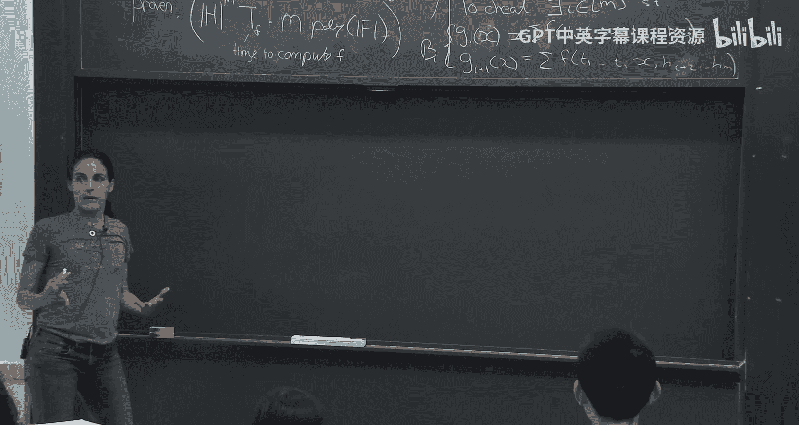

This is kind of a bad event， an event that you go from a bad incorrect a false or true。

 That's for the very parts。 It's a very bad event。 because then he accept a false statement。

What is the probability that this bad event happened， so the probability？😡，oB i。

I want to argue is at most。D over。Let's see why。收。Let's see， When is G plus1 true。

 We're sending here like the。The probability， let's fix like we fixed already to one of the TI+1 that's fixed。

Okay， so fix。 And I don't care how T1 to T I-1， this defines。Like what the prover gives。

GI in the protocol， the cheating proveer gives in the protocol。Okay， now。Now。

 the verifier chooses a random T。 A random。 So good。 So this defines G， which is。Okay， this right。

 now the prove of the ver。The probability over TI that the verifier chooses。

This TI tells you if this defined G+ one。😡，But where is if。What do we know about when if。

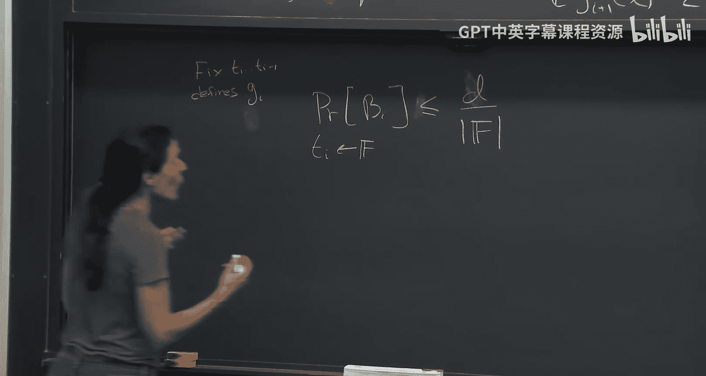

We know that。

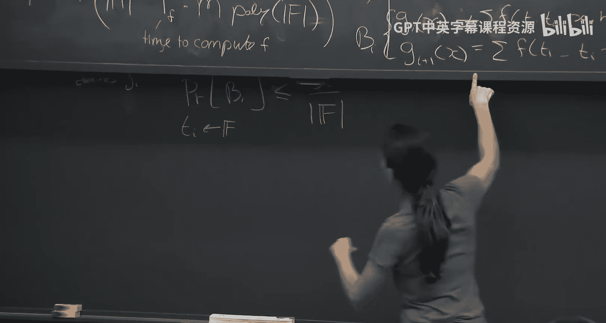

Because the verifier is accepted， we know that some。G， I plus one of H。Is equal to G。

Which is the wrong problem of me。送。啊。Sorry， N I。And this is the wrong polynomial。

So what is the probability that for so in other words， J plus1 is the right polylenoma？😡。

What is the probability that for a random T， it will be the right one？😡，Degraph。

Because twomonial that are different agree in most D points， I choose a random point。

 the probability that' on of these days is the overall。So what is the probability that you cheat？

This is the probability。

That do exist。Such that BI hope， a bad event hope， namely there exists an eye that you go from true。

 from false to true。And在那。By the union bound， this is and most。M number of rounds。

is the prop of one be of a specific VI bat event， which is the over。So just note。

 H actually doesn't come up。In the sound， this is the sound。Okay， so the sun is。Meet n times D。

To be significantly smaller than the field size。That's important for some。Yeah，就是关在。

Think think of the age you actually care about and then you have some。

Like this really really big feel。Exactly， exactlyly。

 the point is if you're not happy if F is not large enough。

 if it's not much bigger than m to the M times D， then you just make it bigger。

 take you can take extension fields， you can take so you just kind of artificially increase F so that F will be much larger than m times D and hence you'll get a small sum here。

😡，Sparly across cancer， yeah。As。Happens is you give an age， right。

The degree happens to be H S0 or H-1。 And that's why it doesn't make sense for H and to be the same。

 But you can exactly subject you can100%。 So let mean repeat because I'm recorded you not。

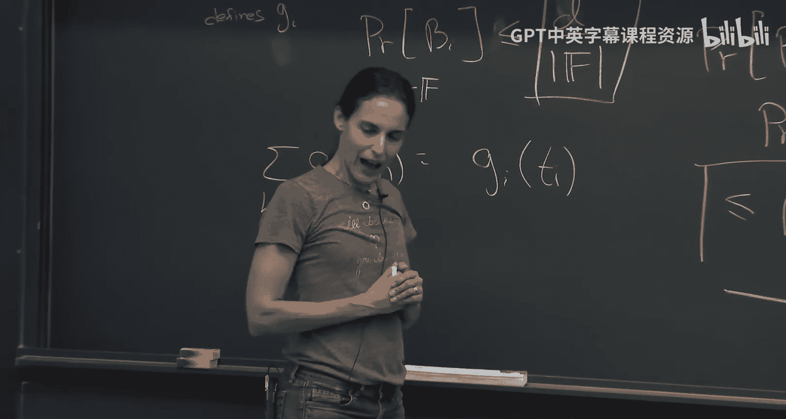

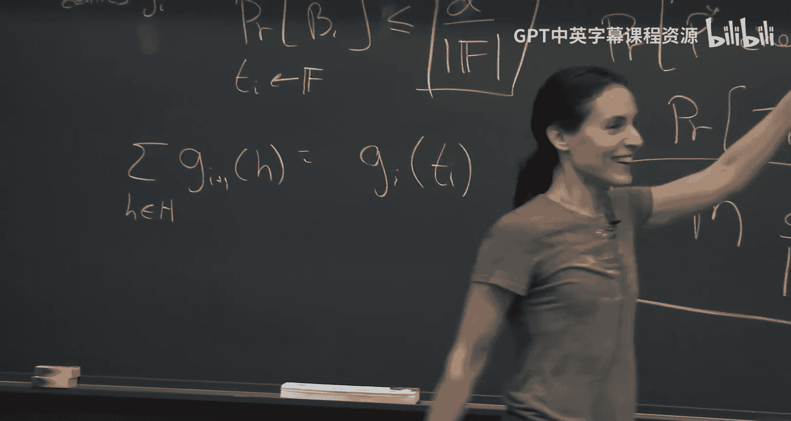

Yeah， that's a very good point。 The point is for sum chip in general， it makes sense consider N H。

 even H， which is of size F is interesting for the sum chip protocol okay。

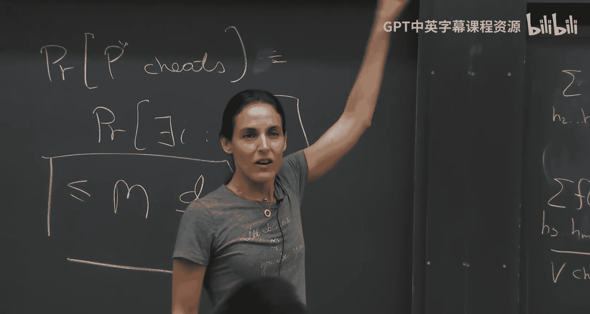

Aplication， because as long as the D is law， of course。In applications。

 often it turns out that when we use the subjecttract。

 it turns out that the D is often equal to the size of H。Okay。

 because we kind of do the slow degree extension， which makes the field as large as age。

And then if we take H， which becomes the degree to be F， this is meaningful， meaningless。😡。

So for location。Often， indeed， H is small。 But for the subject protocol it all you can make。

 you can take H to be the entire field。 Yes， is it chew that finance all like it's easy to just bring it inside another。

Yeah， okay， good， good， good Yes， exactly。 So let me yeah， so there is kind of you can take。

 So this is a factor for mathematics。TakeAny finite field and em it into a bigger finite field and how big is the bigger finite field。

 kind of as big as you want。 So you can take any loosely speaking。

 you can take any F and em it into kind of field F to the N。

So when you can take n as big as you want。 So you can kind of。

 that's what's called an extension field。So you can kind of extend it to as large size as you want。

While still keeping F as a subfield。So operations in F kind of behave exactly as they did before。

 So without ruining this sum or anything like that。Yeah， this seems tight， right。

 case that there is actually achieving strategy that succeeds Yes， this， yeah， this good。

 this analysis is really tight。 So， I mean， if， if I'm malicious， you know。

 I can always hope for the best。to be I'm malicious。 I give you the wrong polynoial。 Look。

 you may find。 So I want to go from the wrong poome to the true ponomial。

 That's where to cheat right。 That's what I want to do。 Now， my wrong poial and the true ponomial。

We actually D points， and each two polymous can agree D points。So， as long。The verifier。

 I'm lucky enough that this tea is one of the D points。 I mean， look， I got a good polynomial。

 I'll continue with a good polynomial。 till then end now I'm in kind of lala land， you know。

 I'm happy the problem is the chance each one， the chance that you'll give me a T That one of the D points is only d over F and a unit bound over everything。

 it's n times d over and the F is much， much bigger than n times D then you know the chances that the proveable6 will be in this lala land is very small。

Okay， any， any questions， further questions about the subject protocol。Okay。

 so let's take maybe kind of a five minute break stretch and so on。

 and then we'll start showing applications。

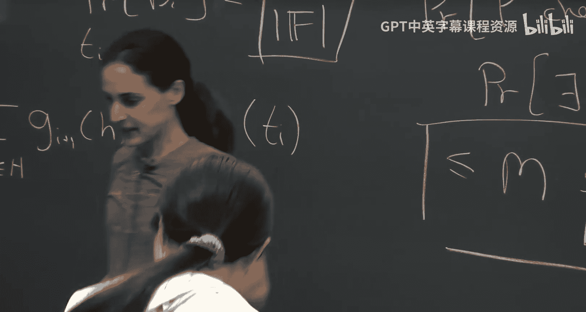