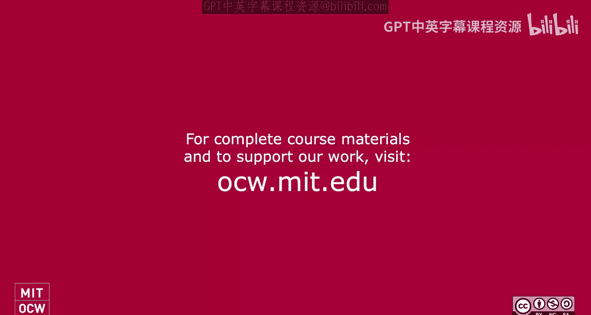
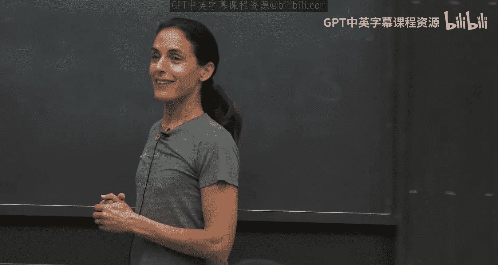
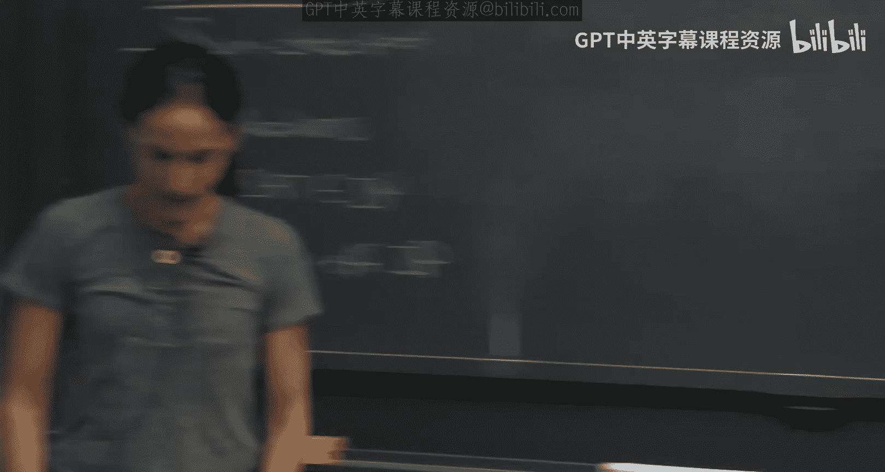
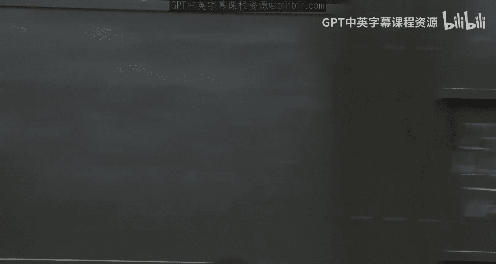
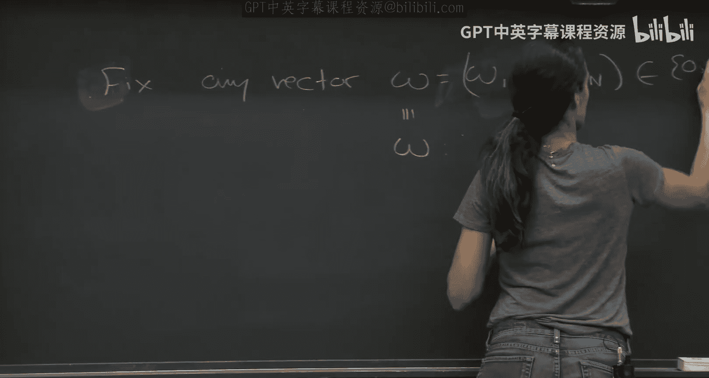
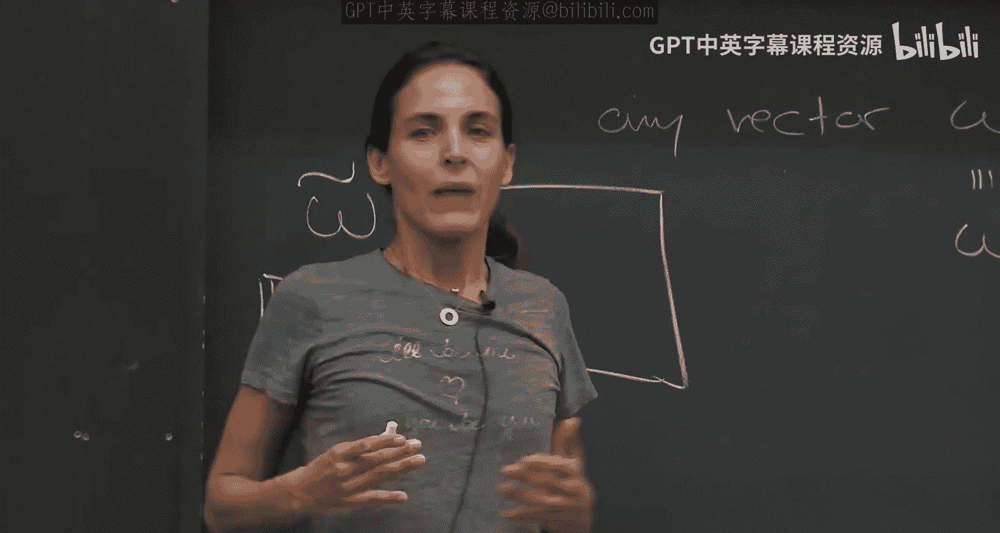
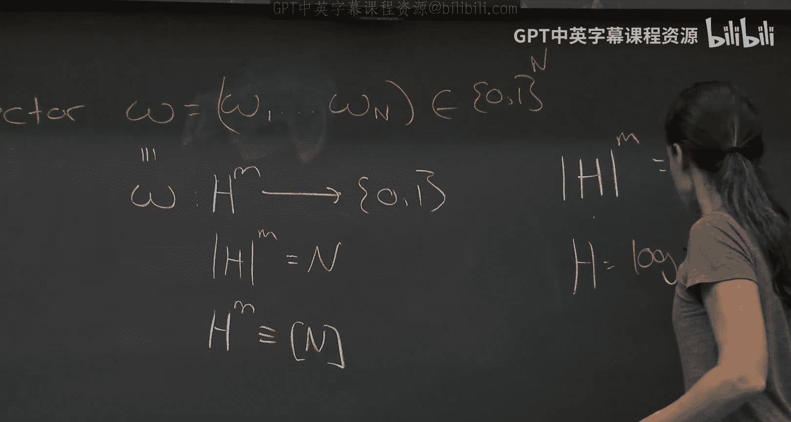

# 《密码学高级话题｜6.5630 Advanced Topics in Cryptography, Fall 2023》Claude-3.5-s p02 Lecture 1_ Interactive Proofs and the Sum-Check Protocol, Part 2.zh_en -BV1MVa5zXEmy_p2-

ok。Ready for last hour okay， before I start。Was this too slow， too fast， too slow。Too fast。Okay。

 I have an idea， everybody closes your eyes。う。Now， you have to say too slow， too fast or good。 Okay。

 no， you need to close your eyes， everybody close your eyes。Okay， too slow。

Too fast。佢。你也看看。Okay， thank you。

Oh我 what is it错。All good。 They all good past。 Okay， okay， great。😊，Okay， so I want to say first。

 one thing I forgot to mention about the sum protocol that we'll actually use later。

 it has a nice property， which is look at what so the poor sense polynomials， all degree polynomials。

 what is the ver firecent。The very Francisiss grand and killed。So really randomness。

 he chooses random like log F bit and send them over。

OkayThis is called a publicly a public coin protocol。

 public coin meaning the coins of so each round you thing the verifier chooses coins and just sends them publicly to the prover like here my log F coins。

 here we go， this defines a field element and that's my field element。

OkayThis kind of public coin protocols are very useful because we can later。

 as we'll see in this class， we can use cryptography to eliminate this interaction from this protocol so the fact that it's public coin will come back to it okay but just notice the very's message is truly random。

😊，O one more Sha yeah， sorry just there protocol。😊，ます。Good so okay so as I said。

 we mentioned the bear part has to be randomized。 if he's not randomized。

 the interactive protocol has no power。 The question here was， does the prover need to be randomized。

 I it's helpful if he's randomized？ And the answer is， he I mean。

 it doesn't help him to be randomized because you can always fix his coins。And the verifier doesn't。

 it's the。okay， when does the when is it helpful for the prover to have randomness when you want to hide when we do zero knowledge。

 where the goal is kind of the height， then the verifier has random points that the verifier doesn't know and that any。

But in this case， the verifier is not we're not trying to protect a verifier。

 So why is randomness is helpful for why is it important that the verifier uses randomness。

 Because the proveer needs tocend the tonoial， He should not know which element T the the verifier will set if be knew。

On which point tea will be asked， then he can cheat， he'll give you a falseial。

To coincideside with a proposal at that point T， there are D such points， so he can choose it。

 he can choose the fake polynomial， the kind of coincideside。

The power comes from the fact that the poor doesn't know this team。

 So we don't trust the prover and we use randomness kind of against it。The ver is trusted。

 We're not trying。 So it doesn't help the proveover to use randomness in a sense。 or in other words。

 you can just fix if you can fix this randomness once and for all for all time。

 Think of it as kind of a non-uniform prover。And， and that's it。 The。

 The ver is not going to change his behavior depending on， cause he's honest。Bafire is always honest。

Maicious twober that we're worried about。And therefore， the coverover doesn't happen。

 he doesn't need randomness。Because you can always hardwire the best str is possible to him。

 And now he's just a non uniform。Kind of machine as a circuit as opposed to kind of a randomized machine。

So in this context， randomness to the prover is not needed， but randomness to the ver pmid。

So when you say public coin， does that mean for to can't see those students？No。

 public coin means that the ver doesn't hide anything he so okay， of course， okay of course。

Proover good question， thank you。He doesn't， he never sees the coins in advance。

 so if he saw the coins before he said anything he can cheat。😡，The ver never hides coins to himself。

 so public coin means when the ver the ver uses send random coins， so I I'm the verifier。

 you guys gave me a unver polynomial， a degree polynomial。😡，I choose coins。

 a field element that's can run coins。 I send it over。 I don't keep any state。 I don't。

And all my messages are just random。You say give me another phenomenon just random this。

 That's the definition of a public coin protocol the call。Okay， so protocol just means。

So note Sun check is a public protocol。Which means that verifiers。Messages。Are truly random。

 Just random it。W， she's a uniform。I just had random with true uniform。That's what public point is。

Yes， I guess like is it known what happens if the prove does know all the event。Yeah， yeah。

 if the prover knows all the randomness in advance， he can cheat。

 Why let me tell you how I'm going to cheat， so I'm a cheating prover。Let's say before you started。

 before we started， you gave me all your tea1 of the T。😡，After even， if you just gave me T1。

 I'm golden， why？I faked， I said the sum is big， it's not a beta， it's not a beta。

 it's something else。Now， all I want is to find a uniary polynomial。That sums tobaccobe。

So it's not the true polynomial， it sounds to beta， but it agrees with the true polynomial all9 one。

Because what a business thing want from now on， I need to prove a true statement。

 because I need to prove yes， which is actually a true statement。😡，So， I'm good。So if I knew T1。

 I can always kind of come up with such a polynomial。 The thing is， I don't know what T1 is。

So actually I want to give Gma actually asked me a very good question in the break and I want to give kind of Jimma's geometric interpretation of the sound proof。

So let me give you kind of a geometric interpretation of why this protocol is sound。

 What's happening in this protocol。Here's the geometric interpretation。

 We have a little box H to the M。 You can think of it this is kind of the little box H to them。

I going to prove to you that this load polynomial， if you sum over the value at this point。

 this point， all these h1 points， it's beta。Now let's look at the big F， I have like this big F。系对。

Okay， now what happens。You were incorrect， if you cheated。Then the sum。

 you use sum over all the points， Let's fix this point here， like the one possible H1。😡。

Maybe what you gave me is false what you gave me is the sum is' either false on H1 or an H2O somewhere it must be false because it was true and everything will be true。

 So you gave me something that's false in one of them。 I don't know which one。😡，Now， so what I know。

 but now I'm going to use air crashed to say， well， if it was false on one of them。

It's wasn random point21。So now I forget about this sum， I just look at T1 and I know that the sum。

Only over the rest of the， like the dimension two。It's false T1。

And now again fossil T1 that means H2 one of them must be false。

 I go to kind of a random point in the extension and theyre with hyper it's false and kind of this is how I bo around from kind of dimensions。

 T1， T2， third dimension t3， T4， it's on up to the point that I get a random point in kind of eia。

Okay， so that's kind of the geometric interpretation of what's going。ok。Okay。AnyAny questions？

For okay， so we saw this subject。 So let's see where we are。

 We introduced this interactive interactive proof model。

 We saw subject protocol seems kind of very specific。 Let's try and see。

 why it's very interesting the subject protocol。So first， before a。As firstly。

 let me give you an example where the sum check is useful， and here's the example。

Let me get show you that。Sharp scent。Has an interactive piece。I think is that。

Set of all languages that have interactive proofs。 So let me prove to you that sharpap has an interactive proof。

 That's an example。 this will use the subject protocol。By the way。

 let me just mention all the examples that I'm giving you。Are not just examples。 Okay。

 I'm teaching something through it。 So don't just ask example。 I'll kind of forget about it。 Okay。

 they're specially crafted。 Okay， so what is Shaet， Shapet， we're getting a formula fee。

And we're asking what is the number of satisfying assignments to this formula， That's the question。

 that's the aim。So fee is if you think of it as a Boolean formula， we' giving a Boolean formula。

Let's say fee is over like it takes。Sorry， over， let's say N variables。

And blue and formula just think of like its and and or。And we have not。Okay， and the question is。

 what is how many assignments over 01 to the n make this formula accept， that's the question。Okay。So。

 by the way。When we say formula， we mean it's a binary thing but it's a binary tree。

So a formula is just a binary tree， each gate you can think of it as an and or an or。

 and then the final final leaves are kind of all kind of X or not Xi。😡，Okay。

 so fee is of the following form。So's， let's say and。 and then we can have four。算数 four。

In the end it has like。Threeen，9 x seven and so on。G。

 so you can think of the size of this formula as the number of leaves because after a factor two it's like the number of gates。

 the number of leaves， it's kind of the same。Okay， so and note， just note many。S may appear many。

 many， many times because I really open it up to a you。So each variable here can appear many。

 many times。So this is what formula is and sharp side， so now I want to say that let's say phi and K。

Isn't chopset？It's in the language， if and only if。Phi has so the number。

 if you look at all the x's in 01。To the end， it that Fex is one。We set。呢个式。Okay。

 if there's exactly case satisfy the。Questions about this language threeat were good。Okay。

 I just want to point out a formula is different than a circuit。

In the sense that the forral is a tree， it's a binary tree。

 a serpen is kind of an arbitrary directed ecycl graph。 in particular， in a circuit， in a formula。

 you need to kind of recompute everything。 So if this。Gate uses a value。

 and this gate also uses the same value。 You need to recompute it。

 inter to compute it kind twice in a circuit。can do things much more efficiently。Okay。

 so there's also circuit set， that's a sharp circuit set。

 that's a different problem here's talking about sharp set for formulas， okay for trees。Okay。

 so I'm going to give you actually so this is。Known to be a very hard problem。

 you know I'm getting you like think of three sets。

 you know it's going to be complete now look at the number like 10 people number like how you know how many set assignments it has。

 it's considered a very hard problem。but you know， if you think what's very surprising that you can give an interactive proof for it。

 which is really nice and moreover， the interactive proof is really just the subject， that's all。

 that's all it is。So I'm going to show you how I embed this kind of question into a subject。

Okay and note that this is just a boolean formula， where's the polynomial。

 Where you know I'm going to make a subject subject， I need a polynomial。

 and this is just a Boolean formula。So the way the idea is to use I'm the new subject for this IP and the one the new subject is by a technique called arithmeization。

Which will use okay， so I'm going to so the idea of using subject or the idea behind this IP。

Is to arithmematize。The formula fee。Okay， so I want to prove to you that we I'm a Ca in Sharpset。

I want to use a subject protocol that the only protocol I know， Ay， I want to use it。

But I need a polynomial。 so I need some polynomial and sum over this polynomial。

 What is this polynomial， It's going to be an arithmeization of the cell formula。

 So how do I arithmeize that is very， very simple。I'm going to convert any so this is bullets all over01。

 Yeah I have and and or everything is over 01。😡，I'm going to convert。And end hate。In to。Mot gate。

Okay， so actually， fix any finite field， you can make it very， very big。

 So you'll have good soundness。 So okay， with respect to。四有的。fininight。죽색짜이 파이이나스요。

It can be very large。I'm going to convert any any and gate into a multiplication gate。 So mo is just。

P X and Y。And just output'll x times1 in the field。😡，Okay， but in particular， what do it means？

If there's anything time  zero， zero and one times one is one， it's exactly not in handgate。Okay。

 if I have an orgate。In two。So this is a bit more problem。

 so this is going to be so after let we say， maybe I'll write it。So I'm going to write。And。😊，Of x Y。

 I'm just going to write as x times y。And I'm going to write or。Of X and y。Any idea Yeah， next。

Exactly， exactly x plus y， that' idea。 But of course， then it's2。 I mean So I subtract x times y。等下。

Okay， so of course。Zero goes to zero， if only one of them is one。Youve got one and zero。

 nothing and both of them are one， then this one is one so it takes scale。Good， and then the， the nu。

Not I going to not。Of x is simply what？1，9，6。So now。I have actually an arithmetic circuit。Okay。

 so this arithmeization allowed me to go from a circuit。Into an arithmetic circuit。

Or from a formula sorry into an arithmetics circuit。And now note。

 let's look at the first note that each。A gate。Is now。And our athletics circuit of at most three。

It's a tiny circuit like this is so each gate really is a grew only a constant。

And now really what I want to do the sum over， my protocol， what I want is to look at。

 so let's denote the arithriization。By， so if we donote。A瑞。Mized。光明啊。卖需的。Okay。

 so F that goes from F to the N。It's just additional applicationplication in defined over to the。

 Yes， I'm worried that since or now like has x twice and y twice。 he said it has to be a tree。

 Like you have to like copy and paste why in order to plug into that。 Okay， actually， I don't care。

 We'll see you're saying what you're saying wait， Why is a middle Y isn't I start all it care that I started with an with a formula。

 I don't care in the middle what I do with it。 So。Yeah， oh， sorry。Good， thank you。Good。

 thank you very much。Thank you。😊，Great。Well， you guys are good。 Thank you。 Okay。

 so let's den the arithmeized version by theilda。 Now of course it's natural。

 What would be the subject protocol that makes sense to do at this point in A。Exactly， exactly。

 let's prove that sum of P tilda over B1 up to Bn。In0 one。Is equal to king。Why that make sense。

To be careful with is what is the degree of this thing？

So now let's just argue that the degree is not too big。 but if I convince that the degree is small。

听冇到。We just做 subject。And this is exactly what you want to prove。Okay。

 so let's just make sure that the degree， so n here， like the number of R is going to be n。

There's going to be a degree D。 We just need to ensure that D times n is much。

 much much smaller than F。Which I put here which governed the sound。Okay。

 so let's just see the degree。So here's a claim。The degree。啊。Felda。Is at most。

Or let me write differently。The sun， let's select the degree for each variable。Okay。

 the sum of the degree。I， forvariable I of feet。So we have n variables， x one of to Xn。

 each one has some degree。The sum of these degrees I'm going to argue is a Moas。

As being the number of。Yes。Size。Of phi， which is defined to be， this is by definition。

 the number of leaves。运费。Okay， so let me argue that the size is。Is the most。

Its it means that degrees the sounds degrees the most as or the size？By the way。

 before actually I do that， just to make sure because I actually noticed that I gloss over too quickly。

I said them， you know， this is all we need to prove。

 but I just want to make sure is it clear that feet tellsda？And 0，1 to the n。

Is actually equals to fee。Yeah， that's very important because we want to make sure that we're actually summing over the actual feet。

 like in 01， because we want to。Sharp set of the fee formula， right， And the reason is， as we said。

 is that on01。We really behave like band deor。😡。

So of course， Al' to 01 who knows well're over a big field， who knows what's going on。

name exactly like the n in order， like the original twin。

 therefore this arithmetic formula is actually equal to the original formula and01 to the end。啊。

So good this is where we want to prove now let's just look at the degree yeah。Good good good。

 this just means。This is the degree。Of X， I。应全。So I'm just going to。So yeah， or in other words。

 I can argue that each variable has to be most S， and I can argue something stronger the sum of the degrees of other the variables of the most S。

Okay， note that S is polynomial here。 Okay we have this the input， the input is the a sat formula。

 it's polynomial。So as long as this is the degree， you know we're happy。

 the communication complexity， the verified complexity is going to be and the number of variables， D。

 which is like S polynomial and polylo in the field so the verifier is going to be polynomial。

Okay， now we care about， you know， now there's an notion of polynomial time verify。 Okay。

 but if the degrees at most S and polynomial were good。Okay。So why is this the degree？😡。

So to prove that this is the degree， the proof of this claim。Is that induction？It's actually a。

Pretty straightforward proof， and it really uses the fact。That fee is a formula， the original fee。

Is a formula。诶。So let's see。So。So the food was just by induction。你销臭。

So we're going to prove by induction and the depth of this formula and。So okay。

 if we have just one gate。Then， okay， it's clear the degree is just one， so that's fine。So。

If number of gates or the depths if you want， is one。Then， of course， the it's。

The degree is going to be less than the size degree is just one。

 That's if you just have a single gate。And now if you have more general。

 so now suppose you have a circuit of the form， let's say add or mal， it doesn't matter or and。

 you can have like phi1。 suppose phi is phi1 and or or I don't care P2。Okay。

 this can boost all us genome at the end， but of course， it could be also one more。

Then how do we arithmematize this So now what is fe tda？Fel dot is going to be either。诶。

Phi1 tilde times p2 tilde。Or in the case of this is for and， if for or， if it was or。

Then it would be。F1 tilde plus p2 tlde minus p1 t the times between2。Right all， of course。

 over exon Ton over exon T。Yeah， okay。 so let's look at。

 I want to argue that the arithmetic version is。Of the sum of the degrees of all the variables that most S。

 So let's see。 let's look at feet tilda。If tda if the original feehi was n of Phi1 and Phi2。喂。

Feeet till does just。The multiplication， by definition。

 we replace the end with multiplication of the phi1 tilde polynomial times phi2 to the polynomial。

But what do we know here， here， the degree of each。So now let's suppose， okay， suppose C1。

 let's say it's of size。S1。And suppose feehi2 is of size。As to。Okay。

 now Lord we know that the science of。S is equal to S1 plus S2。Because it's a treat。

So there's no kind of everything is open。 So the left side of the tree is S1， side of1。

 the right side of the tree is size S2。 The entire tree is the size S， which is S1 plus S2。

So now what can we say in this case， so let's focus on the end the or is exactly the same。

So what can we say about the sum of the degrees， so some of degree？

The degree of the I the of X I in phi。Is equal sum and I。

 What is the degree of the height variable in phi， It's the degree here plus the degree here。

 When you multiply things， I need to sum the degrees。😡，So it's the degree。Of X， I in。

T1 tilde plus the degree。Of variable I in Phtoil。Right you have to polynom multiply the degree add。

But this is just。S1 plus S2 by induction。By the induction hypothesis。Okay， so the degree here。

 the sum of the degrees is like the size of the formulas。 We actually don't care about the sum。

 We care about the degree itself。 but this kind of shows you at least the degree of each one is also almost the size of the formula。

 And therefore the sum。 So now when we run。So let me pick this back up。So we run the sum check。

And this polynomial， And we get。だく。The communication complexity and the verify runtime will be M or number the number of variables here。

 n times the degree， which is S， essentially the size of the input， right。

 that's S and polylo the field。Okay， so you just need to take and similarly and to verify。Yeah。

 the degree， which is S， the completeness is always one and the soundness informly the soundness of this protocol。

Is n， the number of variables， the degree， which is S divided by the size of F。

So all we need to make sure is to arithmeize with a field that's significantly larger than N S。

And this will be the science here。Okay， and of course。

 then you can repeat all this to get errorero thoses you want。ok。Any questions？呀。😊，You can。

 so when you do the sum check， like when the sum is happening。

 is that like necessarily a sum over the field or can it be like any sum over like a different？

If you're like original field is just like prime field so okay， just know in this specific problem。

 I don't have an original field， actually for this specific sharp set， I'm over 01。 There's no field。

 It's not an algebraic。 It's a boolean thing。 I don't have any polynomial， any algebra in you field。

 nothing。 I just have 01， and I have n in or gates。And to prove that， to prove that， you know。

 the number of satisfying assignment in the Boolean cube is K， I choose a field of my liking。

And I arithmeize， I think of this circuit as polynomial as adding additional multiplication gates。

And in my head， I think of this circuit as this formula as a polynomial。So I choose the field。

It's not actually the problem， I in purpose， kind of chose a field so that I can do the subject protocol。

Right， yeah， but I guess like what I'm asking is like when you。Like for the sum in the sun check。

 like。Like， let's say you like not for this problem。 Oh， I see。 I see。 you're saying in China。

're saying， look， let's say you have a subject problem。

 Someone give you some problem and you're not happy with the field。

 The field is not good enough for you or doesn't give you enough soundness。 Can you， can you amplify。

 Can you work over a different field。 Is that what you're asking or I I'm asking is like。

 if you have some check。 And like there is some field。

 like let's see you working mod like some large prime or something good。

 But then like the like will the sum that you're doing be like also over that。

Feel that like you Okay， so good， So when I do a sound check over the field。

 everything will be over that field。 Yes， everything will over the field。 However， that said。

 if I'm not happy， the P if you're saying so I got a sum check protocol with certain P over。

 you know， over G2， a G P， So everything is my P with certain P。Now， yes。

 everything should be over this field。 Now you can say， well。

 this P is not that great because it's sometimes much bigger than M times D。

 and I'm not really happy with this field。😡，Or maybe even even it's smaller than n times default I know。

 It's not a good field。 Not not big enough。 Then what do I do。 So I'm saying its so， don't worry。

 Just take an extension field。 instead of looking over P， you can you work over kind of GFP to the n。

 So you can take a field of size P to the N for any end that you want。 like。

 and you're only gonna pay kind of polynomly or linear with this n。 So。

 and then you can amplify your sound。 Okay， I was just wondering is I was wondering what like what happens is case like larger than the。

Oh， I'm going to choose the field to be much better。😡，I'm going to choose the field。

 otherwise you can't， yeah， and I'll need to choose the field to be much bigger than okay。Yeah。

 so like oh sorry， I I forgot Okay， yeah， this is kind of religious point， but。

We needed to choose a field that have a really big characteristic。

 so we needed like really big prime number。你天就。Like we can't get straight into the end。Oh。

 because they can be like， choose that。诶。除啲拆几前嚟。And she said I field that's bigger than cake。Yeah。

 no， but the question is， can you know but the question？Okay， if you。Okay， in our case。

 you can just choose the field to be as big as you want in the case where you're giving a sum check。

 of course of course the sum is in the field it's something about the field。

 you're giving you're giving something about the field okay。

 well we be in the field sharp for this specific one， I'm thinking of yeah。

 you choose a K that's bigger。 however， I'm not 100% sure that let me think。

Can you use small characteristic？Yeah， that's one thing。

 I'm not sure if you can't use some Chinese remainder trick and use over a small characteristic and to think about it。

 but anyway， in this case， just choose after the GFP for a large P and that's bigger than K。Sorry。

 did you have a question Oh I was to ask you， is this the only way we know how to do the foot shas at？

系啲。This is easy。 What do you mean that you are easy？So no I think this is the simplest way。

 so let me say， let me just say so you know we put Sharpat into IP in this way。

You can ask what about， let's say sharp circuit set， which is the same thing。

 but you're giving a circuit orre giving a circuit and you want to know how many satisfying assignment does it have over 01 to then。

 It's the same thing except for p is now it's not a tree anymore it's a directed ethical graph and it turns out it also has an IP because it's in piece space you can go over all possible xs。

 Xon of tax N and check if it's satisfying or not in it's small space。So it's in peace space。

 and so you can ask， okay， so what about this， now you can' do subject because the degree won't be small。

So actually， you can do it， but that's much， much more complicated and requires this kind of degree reduction thing that's kind of how Chamin improves I people's peace。

 there's some degree reduction there that really complicates matters。

 So youll need that for a circuit set， but for that。

 because it's so low degree immediately kind of it's kind of nice and that's all you do Yeah you should be you should what's the gratitude。

So I guess for interpretational problems， the question is suppose is， you know。

 suppose to have given another problem， its permanent。嗯，就系我咧。I guess it's a formal point。

 But I want to direct kind of without reducing to kind of。You like shots out and so forth。

 I mean they wanted direction。It's not very well defined so I have to say。

Almost all the protocols I know for IP go through some。所以 that是什呀。One but。Go through。

they were trying to prove。Shoee is in I。Okay， so I'm not familiar with that。

 but I think the main ones go through sum check。It's sort of like sunset， but they're also like。Yes。

Any other questions about Sharte， yeah？was the some check protocol is like。

 I believe it's operating over a few。 Like all the sumation goes right， Right， right， Yeah， yeah。

 yeah， So doesn't mean that we be safe to measure ensure correctness。

 We must ensure that the view has characteristic greater than the number of satisfying solutions。

Yeah， exactly to the。Yes， yes， but the verifier runs in time long in this circuit。

So in this log that in the size of the field。Yeah， log in the size of the field。

 So the field can be true to them。It's， that set of requirements you can't pick small characteristics。

Yeah， so I， yeah， okay。I so what we should do is take GFP large field like large characteristics。

 I'm not sure you can take small characteristic actually。

 I need to think about it because maybe some Chinese remainders here can help you that quite extensive。

I many small crimes make sure that the answers are all the number， exactly exactly。即系。Just。

W doesn but it， but if you don't want to sometimes actually，'t so sure， right。

 because the computational complexity is going to be sort。

Is probably going to be smaller instead of log。A big field size to the part three or something。

 right， We have some of log。Small state skills to the。嗯，对，还。Did yeah。Okay so by the way。

 just note about the proofover runtime here of course is learned because it needs to find the I mean what can you do。

 it needs to at least count the number of satisfying assignments。

 it takes two to them at least right to find them and then okay so so far we gave some examples where are we right we't talk about IP we showed the magical amazing subject protocol we showed how to use the subject protocol to give an IP for an interactive proofer Shasat。

In some sense， maybe you're not so blown away at this point because actually Shes asset like a formula。

 really， you can arithmatization is like wow， we don all know that end is like multiplication and or can be written as like smaller athmetic thing。

 So it's actually arimetic circuit。 So it actually gives you a a lot。

 So sense it calls for a subject。 it is a subject like without much change。

 It's like already it presents itself almost as a subject。

So maybe you're not convinced of the generality of this uncheck。

 and the next thing I want to do is kind of show you actually a completely different thing that doesn't seem to be at all。

low degree or anything and try to show you how you can use the subject。 And actually。

 this takes us a kind of a nice way into the idea of a doubly efficient proofs。

 So so far when we talked about attractive proofs our focus was the verifier is efficient。

 He polyial time。 The prover can be whatever and indeed the protocols lost some check and sharpet。

 of course， the prove is an exponential time。 Yeah has no choice needs to do the computation。

The idea of。 so now let's kind of shift gears and talk about the notion of a doubly efficient interactive。

So the notion of a double efficient in because the idea is actually。You能问你说。

So the main idea is we care about the run time of the approval， So the prover is not all powerful。

 It kind of brings us kind of to real life。 Okay it's very nice that the ver phenomenon。

 the prover is all powerful， but guess what all powerful doesn't exist。

Everything is limited to some extent， there's more powerful and less powerful。

 but there's not all powerful。So what we want is yes， the pover is more problem than the ver。

 otherwise we don't need it， the verify doesn't need him but。这老。

So in a doubly efficient interactive poop， we want to say the prover has a problem at hand and he should not spend too much overhead。

In convincing the verifier。That solutions that that his solution that let's say that X is in the language。

Okay。And this is kind of interesting even if the problem- so when we talk about doubly efficient attractive proofs。

Care of problems in P so often when we talk about interact with proof。

 we think even let's say the problem is polynomial time。

So I want to argue proof some polynomial time， language， but I want to verify。

 let's take the time to determine this language as I don't know enter the fourth。

I want the very to be linear。Okay， so the idea is there should always be a gap between how powerful the prover is and the verifier is weaker。

I really care about both， I care the therefore should be very。

 very efficient and the progress should should also be somewhat efficient。😡，Hey， that's idea idea。

So okay， so what is a doubly efficient objective？So double， let's say for， for example。

 L in some D time T。So it can be computed in the terrificistic time T。Again。

 you continue chief even to be and the fourth okay it can be polynomial is。Is an I P。Where。

The prover runtime， the honest prover， the honest provers。Run time。It's only。

Polonnomial overhead in the time of determining the language。

 okay it takes time T to determine here the time I most povertyity。And the verifier run time。

Should be much， much less ideally， we want the verify return in time like。

Like almost linear or quasi linear。So N Pologan， let's say， which is dennot by Otel de。Okay。

 so I ideally want to verify trying linear time or quasi linear time。

And the pooler should not have too much over， actually。

 you the pool should also have just linear over bread。Okay， but definitely， by definition。

 it should not have more than polyialogram。And and sorry， yes， yes， thank you。

 And this is T of N and is the society。 Yes， so of course， the verify needs to read the instance。

 but not do much more than that。Okay， so it's just an interactive proof and we care about both the prove and the bear。

Okay。And yeah and and so let me mention that these like things that people actually care about because they use it in these blockchain protocols and so on。

 and so they really actually a lot of work that's done in this and I think in the lecture notes Justin Taylor。

 I'm now going to refer to these sections so we're't cover them but they exist sections where he really talks about the exact kind of parameter。

 the exact number， the exact implementations and so on so forth because these are things that actually people care about because they want to run it so actually we really care about know the overheads here in practically。

Okay， so now， so so far we said the subject is really's this。

 of course it's like it seems like outside the realm even of double efficiency。

 but actually now only me show you a specific example which again will is beyond just an example because we teach use it to teach something where it's actually an P and I'll show you an interactive proof for this problem okay using the subject protocol a doubly efficient interactive proof of this problem yeah。

so take any problem， any language for which membership in this language can be decided in time T。

Okay， so did I'm thinking there's a deistic algorithm that runs in。 What T is that can be anything。

 You can think of T and to the fourth， and to the1。Qu I don't know enter the log n， quasi Pauling。

 whatever。 All I care。 So of course， the proveer needs to compute。 if he's doing something。

 he needs to know that it's true， so he needs to do this deter tourist computation。 So of course。

 he needs to run in time T， but should not run in much more than T。And by now more。

 theorists say polity， apply people， say linear T， the real applied you know。

 say not more than 128 whatever， but yeah， depending how far you are on that spectrum。嗯。Okay。

 so good。 so now let me show you how a doubly efficient in proof for counting the number of triangles in a graph。

Okay， that's the example。Next week， I'm going to show you actually in proof doublefin proof for all low depth circuits。

 so I'm going to generalize it by law。😡，But let's start with like an example。So。

Let's say we're given a graph G。And we want to count the number of triangles in the graph。Okay。

 so given G。So one interactive proof for counting。Number of triangles。In a graph ge。

Fuckative with vertices V and that just。So， okay， I want to cast it as a doubly efficient sum protocol。

 kind of central protocol。 but so notice this this is a problem in P。

 I can go over all possible three vertices， triple to vertices。And check if there is a tri， so I can。

I can check this from time enter the third。I want my de to be linear。

So I want to prove that it runs in time now much more than end to the third。😡。

Or letth polynomial time to convince a linear verifier that this graph has a has。

 let's say exactly K triangle。And I want to cast it somehow in the subject protocol。

So how do I do that？So first， I need to come up with a polynomial， right。

 that kind of I need to em polynomial here。 No， there's nothing polynomial like here。

 talking about graphs。Okay。So remember how originally I told you everything's a polynomial。

 Everything can become a polynomial。 This is an example that kind of shows you why you take anything and make it a polynomial。

So what is the idea？Let's look at the adjacency matrix corresponding to this graph。Okay。

 that chapter if there's an edge between pair vertices。Now we can write this matrix as a function F。

Then goes from， let's say， V， like number of vertices times number of vertices to 01。

 takes a pair of vertices， output'll put  zero if there's no edge1 if there's an edge。

Let's denote the number of vertices here by N。So'm sorry， I denoted there the。

Inple length by n close enough not only input length the number of vertices， buts the know the band。

Okay， so now we can think of the adjacency matrix as a function， so think of the adjacency matrix。😊。

Let me write as the function， F。Then it goes from 01 to the log n。

 I'm going to assume that n is a power of two。Goes from。 So it takes， I'm going to think of a verex。

 So V， as I said， is of size N right it here。 So won't be my way。

I'm going to think of the function as taking a pair of vertices， where I。

I represented verdicts as a vector in 01 to the login。 Okay， and any number of M。

 like binary representation of the ver。 I think of the vertices， its numbers between the1 and n。

 I'm thinking of the binary representation。And I output zero1。

 whether there's an edge or whether there's no edge between this ver。These two vertices。Okay。

 so this has one。なです。There is this an edge。Between the two vertices。Okay。

Now suppose you want to argue that the number of triangles is， let's say K。So what you need to prove。

 you need to prove that the sum。Over I J and K in N。

Or let me even make myself in zero1 to the login to make it easy for myself。

Because I'm representinging in binary。 So for any。3 vertices。Let's count the number of triangles。

 So when when is there's a triangle if。I and J are connected。 This is one， and。As JK is connected。

 this is one。And。This is one。They all need to be connected in order for it to be a triangle。Okay。

 so now note so if it's a triangle， I get one， if it's not a triangle。

 I get zero because one of them is going to be a  zero。😡，So I want to count the number of triangles。

And I want to prove check that this is Kate。Almost， almost， I lied a little bit。

I kind of overcount it because there's mutation， IJK， JKI， so I need to divide by 1 over six。

The number of ways to promotemute any IJK because any IJK is counted like authors。

So this is what I want to prove。Okay， I want to prove that the sum。Of all possible triangles， IJK。

I counted each IK here， essentially six times， so I need to divide by one over six。The sun。

 the number of triangles isk。Okay， almost so they have some。It's getting to look like a sound check。

 but there's there's no algebra。 I just wrote in numbers。 I mean， I took binary representation。

 but at least。You know， I have some sun， so if I had some nice algebra here。

 if this was all over a finite field。And let's say this F was also low's degree。

The matter can you subject。Okay， so again， suppose。

This was over a finite field and suppose this F was very low degree， the field was large。

 we have good Thomass。I want to prove some of this big F。Is K。收er。

So I just need to kind of tell you how do I get how do I add an algebra？Where to make this degree。

 a low degree and where does the financial field come from and so on？I'll do that。

 but before I'll do that， also note。That sun here。I's only over01 to the three log n。喂系冇 so。

It's actually， remember， the problem was the prover runtime is very large H to the M。看你们。😡。

The time it takes to compute one function。And time this M， this M is going to be small。

 but the H to M is the problem。 But here， H to the M is just 2 to the three log n to the log n。

 So it's probably。So if I'm able to put a sound check like algebra here。

 I will double the approval will still be no middleal time， which is what I want。Okay。

 just the question is， how do I put algebra here？Okay， so this。Is where。

So I'll say a little bit about this and then we'll break for today and continue next week。

But the way there's a generic way。在干什么。Any function。Into intoto a polynomial。

 and the way to do it is via technique called low degree extension。

So if you actually remember the way I started class with an example of the matrix multiplication。

And if you remember in the matrix multiplication， there also there's no polynomial， it's a matrix。

 you know， nothing。 But what we did， the randomized algorithm that we showed。

 we thought of a row in the matrix as a polynomial。 so we took a row which consists of n elements。

 and we thought about it as a univariate polynomial of degree n。Remember。

 we thought of like the row as like coefficients of the polynomial。

 so we thought it as a polynomial degree of degree n minus-1， I guess， the en elementsments。

 one is the pre coefficient， so degree n -1。😊，So we started already the class with an example that I have。

Of row， nothing knowledge or nothing， an arbitrary row of matrix。😡。

And we converted it to a unary polynomial。Of degree N， like the length of the mate of the room。

What we do here is a very similar idea， but in the multivariate setting。Okay， so all we can do。

 we can take。 We could have taken any n elements that wrote， for example， or in this case， like。

The elements are all the kind of。For any F。Any F you can think of it。 It's like a matrix， right。

 It's like n squared elements， if you want， for any two elements。

 whether there's an edge or not an edge。 So you're think that n squared elements。ItDoesn't matter。

 we can take any set of elements。And converted either to a uniever po。

 as we did before of that degree。Or that's not good for us because here the degree is going to be n squared。

 It's already like the ver runs in the degree and more。 it' not going to be efficient enough。

 But the idea is we can convert it to a multivariate polynomial with much， much smaller degree。

And that was called the load degree extension。 So whereas before。We just did a univariate pnoial。

 So we had the kind of。Put the N elements kind of as coefficients， each one kind of added a degree。

 if you will。If we put it in a multi area， it probably know。

So if we think of it like as a polymial over。Let's say H to the M。

Then we can stack inside H to the N。We can stack end points。

 we can make H andN each H both H andN to be much smaller than and that's kind of what we're going to do。

 so let me explain this more and more precisely。😡，诶。Okay。

Okay so here's the theorem we're going to use for this。So take。For any function。

 not polynomial can be arbitrary， like the adjacency matrix function for any function F。

There it's like from zero1 to the two log n。 but let me take it more generally from。To the M。

To zero one。Again， in this example， H is just 0，1 and m is like2 log n because we have their two log n。

 But let me give you something more generally。 So take any function。Okay。

 this is essentially any set you can think of this。This is any。Set。

Of this is or this is kindbe equivalentvalent to any element。And01 to the H to the M。

RightSo it's just a string of length of binary string of length H to them。

Dinaries string of length each to them。 it just tells you for each elementage of them what the value is 01。

So for any function。And any finite field。That contains each。Of course， in that example，0。

1 F contains any。And anyF contains zero and1， so that's not a problem。There exists。And you mean。

What's called law degree extension？I's explain what this means in a sec。It's a function， F。Tell them。

After the end。て。S so in what sentence is it low degree extension？It's an extension， namely F Tilda。

If you look at an H to the end。For the elements and the little cube， it's exactly enough。

So it extends， it extends F， F was an H to them。😡，F tduct is on a bigger cube。

 it extends on the small cube delivery。The second thing。Is that it's low degree。

 So it's a lottery extension， extension and a low degree。What is how low so。啊F two them。Is of degree。

A minus1。In each variable。Okay， so again。What is the theorem， the theorem is you can take any set。

If you want， you can take any set， so let's say n numbers， take any fix。😡。

Take any set。 Let's say， fix any。Any vector。Let's say， double。And let's say zero1 to the N。

You can always embed it， you can think of W。And I put on to ways to think of W， oh sorry。

 I didn't mean， I meant to say sorry as a， let's say W1 up to WN。In zero1 for them。

You can embed it， you can think of it as a。As a function。From H to the n to01。

 as long as H to the n is n。So you have a long sequence of zero1s。to a nice kind of， you know。Q分。

Of size H to them。 So essentially， if you think of that H representation。Of， of N， okay。

 the H representation。 So you just kind of H to the M is equivalent to the set。

 You can think of the rejection between that and the other the numbers between 01 to between one of 10。

And now the claim is actually you can take this up， so this is the， let's say H by M。

Tended to a bigger function。真的。Over。This is over。Such that it has degree h minus1。In each variable。

So just note if we think of M as being one。The Uniivariate case。It's exactly what we had before。

If you had just a string。Of like size of size if n it's 1 H， essentially is like n。I take an。I just。

Just extend it in this way to a degree end。😡，But then the degree is very large。 That's not good。

 Like the verify runs in time the degree， that's awful。So I make the degree much smaller。

How do I make the degree much smaller， I add more variables。So the idea is。

Add many more variables now in each dimension。The degrees only age。

Because now I don't think that size of H is n， but H to the N is it。😡，And now in each dimension。

 the number of elements is like H and each dimension， the degree will be h minus1。

Instead of n minus1， like it wasn't the Uniivari case。I'll pull all this。

 but this is just kind of a high level idea。 Okay so again。

 the high level idea we'll go into the proof next time of this theorem。

 but the high level idea is we all know by kind of the unvariate case。

 that you can take any string of length n encoded as a unvari function of degree n minus1 by there's two ways of doing it either by thinking of the string as the coefficients。

 that's one element， one way to do it another way to do it which is how the load extension works is by thinking of the string as the value of the polynomial in let's say polynomial element and 1。

2，3 up to n， let's say one of the n in the field So think of GFP。

Here what we do， we take your points。😡，We take a polynomial F for which your points are sitting in this small cube。

 So let's say you have a vector of size one of the n will put here W1， W2， W3， W H。

 all the W's will put here。😡，And then the theorem says there's a way to extend this entire thing into a bigger polynom。

Of degree H minus1。In in each variable。Such that， if you look at the pona on this cube。

 it's exactly what we had before。So you have your kind of vector or your function from H to n to 01 here and the rest its just extended。

And it extended in a way that the degree of each variable is H minus1。Okay， so for example， if， if。

You want H。To the end to be N， where you can take， for example， is H to be log n。

The D is only login， which is great。 and you can take n to be even smaller than login。

 which is a matter。 It's going to be login。overload。

And note that the verify runs in time that depends on M， M， H and D and these are going to be also H。

 So all of this going to be poly long。Which is great。😊，Okay。

 so next time what we're going to do is prove this low degree extension theorem and then show how to use it first for the triangle that would be pretty immediate。

 and then we'll show how to use it for kind of a general low degree， low depth。Thanks。

