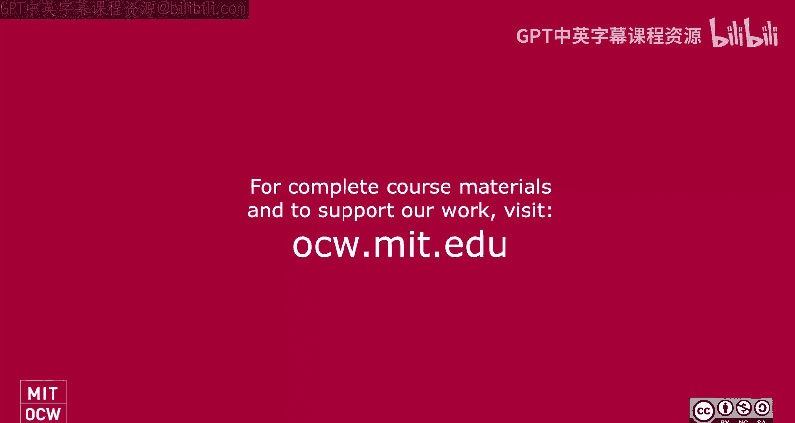
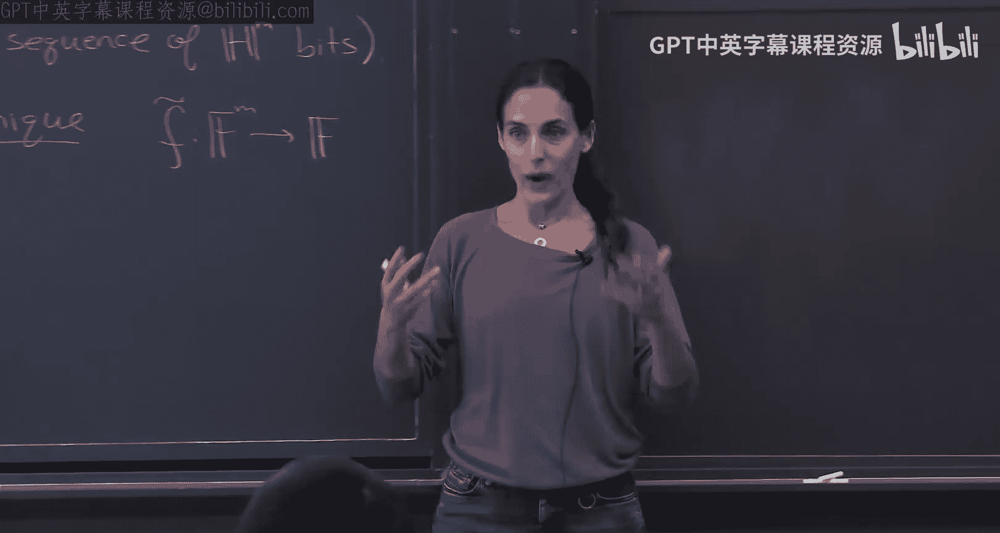
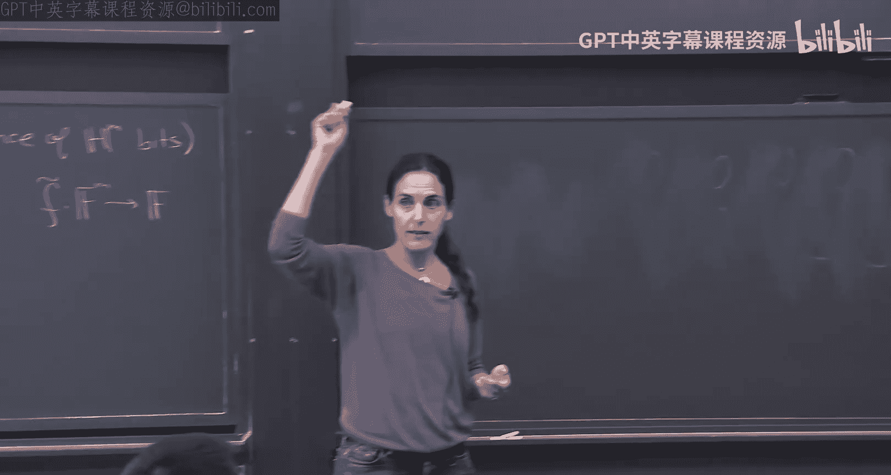
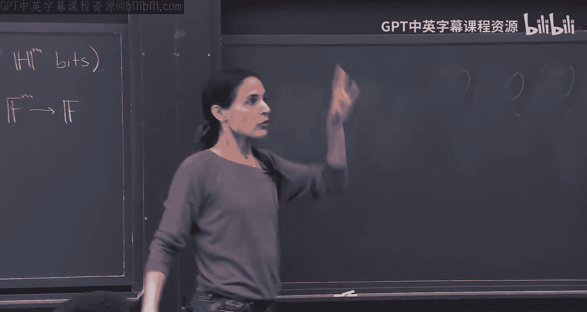
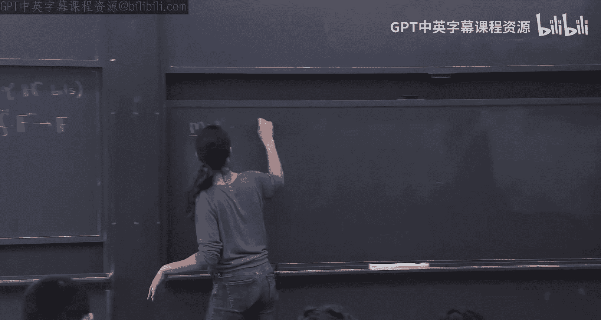

# 《密码学高级话题｜6.5630 Advanced Topics in Cryptography, Fall 2023》Claude-3.5-s p03 Lecture 2_ Doubly Efficient Interactive Proofs, Part 1.zh_en -BV1MVa5zXEmy_p3-

Okay， so let's start so first of all wow， thank you all for coming back I'm happy I didn't you know push you away so before we start with today's lectures just a few logistics。

😊，For some reasons， you guys are taking a holiday next week， unfortunately。

 so we won't have class the week after on the 29th。Unfortunately， I'm away that week at Germany。

 but we're going to have our amazing Rachel in the back give a fantastic lecture。

 so you'll enjoy that。😊，The week after， which I believe is October 6th。

I would have loved to give you a great lecture I'm here。 However。

 you're going to get something even better because there is a really。

 really amazing work new work by Ode de Reev who gave who does a new construct a new factoring algorithm quantum factoring algorithm So kind of improves Sho's algorithm in some way。

 It's a really， really exciting piece of work Ode is in Paris but that's the one day he was able to come here and present his work and it's exactly on this class so I think what we should do we should all this class will move on October 6 and will all go to Ode de Reev's talk。

 It's going to be this class。 it's going to be a colloquium。

 and it's going to be a theory reading group。 It's going to be kind of all in one。

 It's going to have a very nice format where the first hour or so is going to be kind of a very general theory audience talk and then we're going to have the next。

😊。

Two or less hours， depending on how much he'll have the energy to speak to us。

 we're going to talk about kind of more details about his algorithm and his work。

So that's October 6 and then I'm going to be back so you're going to have a bit of a break for me now。

 which I'm kind of sad about， but you may be happy okay so let's first kind of recap where we were and continue from there so last time we defined kind of this new class of proofs kind of going away from the classical proofs to the regime of interactive proofs。

😊，We showed the power of these interactive proofs by showing one protocol。

 in particular the sumche protocol， I wrote the sumchek protocol kind of very loosely in that board。

Because we're going to refer to it today again， so the sum chip protocol just to recap。

 it's a way to prove that the sum of a multivariate polynomial over， let's say a small set H。

 you can think of H as 01 is an example over like a booleying cube or just a bigger cube。

 the sum is some value over some finite field and of course to compute the sum takes a very long time。

 it's like H to the M， you need to just sum everything up。

 but it turns out that you can verify it using an interactive proof very， very efficiently。

 assuming you have oracle access to this function， you can compute it kind of efficiently on any random element in the field。

So this is what we covered last time。 The subject protocol。 As I told you。

 this subject protocol is really the。

Bread and butter of proof systems。 Almost every proof system uses this protocol。

 It's a beautiful protocol， in my opinion， and we'll see。

 we'll use it throughout kind of this course。 So if anyone has any questions about the subject protocol。

 please ask。😊，Okay， and if it doesn't sit with you yet。

 I really encourage you to review the notes and kind of， you know， in the website。

 there's also notes to Justin Taylor's survey which contains a very nice exposition。

 and also we have nowscribed for that so you have various resources to look at the protocol。

Okay and then we start to look at kind of applications for the protocol。

 the first application we got is to show interactive proof for sharp set。

 and we show this interactive， the idea was to it was via this technique of arithmeization。

 converting kind of a Boolean circuit into arithmetic circuit。

 we'll use this technique today as well。And then we departed and talked about this idea of the doubly efficient interactive proofs。

 where in doubly efficient interactive proofs， we really care about the runtime of the prover in addition to the runtime of the verifier。

 so in the classical interactive proof setting， all the focus was on efficient verification。

 nobody cared about the runtime of the prover， he was like for all practical proofs without of like an all powerful。

But definitelyubly efficient attractive proof now theres yeah， the prover， of course。

 is more powerful Otherwise the verify would do the work on his own。

 but not we don't have all powerful things in this world。 unfortunately。

 so we also care about the efficiency of the prover。 So he's just more efficient。

 but not we don't want his you know his work to be crazy expensive。Okay。

 so that was the doubly efficient tract of proofs。😊。

And we just started and we'll continue today to show how we get a doubly efficient to active proofs for counting triangles。

 and there was for counting triangles in a graph， and it was via typically called the low degree extension。

Okay， so now the plan for this class today is to look at the load degree extension。 Okay， again。

 this load degree extension， it's a theorem it's written here。 I'll explain it。 It's again。

 the bread and butter。 That's actually this load degree extension theorem in some sense。

 is what makes the sum check protocol so popular， so kind of important。😊，Okay。

 this theorem is what gives the sumk protocol its power， in a sense。 So really， together。

 the load degree extension， the load degree extension theorem together with the sum checkk。😊。

Like everything follows for it like via corollaries almost。Okay。

 so kind of that's what we'll see this lecture in the next lecture。Okay。

 so what is the low degree extension theorem， What it says is that。Function。From。😡，H to the M to 01。

 H is just any set。 It can be 01 to the M。 It can be Boolean hypercube。

 but it can be a bigger hypercube。O， if you're more comfortable。

 it's easier for you to think of H is 01， just think of it as 01。Okay， so take any function。

From H of them to 01。 So when I say any function set of poly norm， it's just a set of elements。

 So when I say any function from H of them to 01， you should think of it as just an arbitrary sequence of H to the M bits。

Okay， and I just order them like in a hypercue。Okay。

 so I have this sequence of H to the M bits defined by this function。

And the theorem says that if you take。Any finite field。That contains this set age。

So if H is booleing 01， you can take any finite field。 Every finite field contains 0，1。

 but more generally any finite field。There exists a unique polynomial。

 So now we move from an arbitrary set of bits。To a polynomial。F from F tilde。 So we call it。

 this is the extension。 So we call it from F to F tilde from F to them， not H to them， but F to them。

 So I extended it to F to them to F。Such that， if you look at the extended polynomial。

And the small hypercu H to the M。It really is exactly us。And。This f tilde has small degree。

 So its degree in each variable is H the size of H -1。Okay， so if you want to visualize it。

 here's what you should think。 I have a bunch of。Like bits sitting on some hypercube。

 It can be Boolean， or it can be like more， you know， elements here。

 But I have arbitrary sequence of bits sitting here in this hypercube。

And the theorem says you can extend。This to like a function over a big field or over F them。

In a unique way， and specifieds a unique way in a way that it extends。

 So on the values here are exactly as before。And the degree。

Of this polynomial in each variable is exactly h -1。Okay， this is the theorem。By the way。

 in the case where H is 01。Then the degree in each variable is one。Because H minus H is01。

 So the size of it is two degree1。 This is often called multiline extension because the resulting of tilda is of degree 1 in each variable that in which case is called multiline。

ok。Any questions about what this theorem says， the meaning of this theorem？Okay。

 so we're going to prove this theorem next。 and then we're going to go back to this counting triangles。

 which was just kind of a motivating example。 But what the focus is really this theorem。

And before I go to the proof， I want to say why this thing is so powerful is that it allows you to go from an arbitrary sequence of bits to kind of a polynomial。

😊，And which is a low degree。 And a polyial low degree has a lot of structure。

And that kind of really helps us。 For example， once you have polynoms of low degree with structure who have low degree。

 we can apply some tick protocols。Okay so that's kind of the way you will often use a subject protocol。

 we're first going to go to the- we have an arbitrary sequence。

 we're going to take the low degree extension， and now we can kind of argue we can then use the subject protocol。

😊，Okay。Any questions before we。Yeah。Another way to get。It we don。最低嘅。Arithme tie。Yeah， right。漏営して。

こロで。やとか。so what you're saying is good let me just repeat what you're saying what you're saying is if F has already is not arbitrary but actually is kind of a circuit。

 an arithmetic circuit with and and or with addition and multiplication and it's very low depth like log depth。

 let's say， or let me call depth to D， then just kind of，Think of it as over a big field。

 especially if it's 0，1， you can think of over a big field。

 And then the degree of this thing will be like two to the depth。You're right。But two to the depth。

 So you're right。 And some actually for sharp set， that's what we did。 How did we use the subject。

 That's exactly what we did。 But then you need to assume a lot of things。

 you need to assume that that So you're right， if you start with an F that has structure that it's very。

 very low depth or like the degree very small， then you're done， you already have it。

But what this is saying for any sequence。 So any sequence of number of bits can be arbitrary。

 You can kind of。Put it in this way。我有。いきます。嗯，インスタイル。No that。haveDifferent。买。Exactly， so。

 so what you're saying for the the functions that are that are kind of natively small degree。

 you can immediately get an extension， but the degree will not be the minimal minimal degree。

 So to get the minimal degree。That's how you do it， yeah。Good， thanks。Any other questions？Okay。

 I just want to remind you， questions are great。 I hope you just witnessed it because it's good for people。

 you know， for all of you， so please ask questions。诶。Okay。Should we dive in。Okay。

 so the first thing to notice is actually。You should be familiar with this theorem for the case where M equals 1。

So first， just notice for m equals1。This theorem is simply known as the Lagan interpolation theorem。

This is really just Laang。O what this Lau delation theorem says just to recap。

 it says that if you have arbitrary， if you have an F， exactly the same， I'll just write it from H。

To zero1。Then there is a unique way of extending it to F。To be of degree h 1。Okay。

 so there is a unique。F tilda from。I degree。H minus-1。And more， I'll tell you what it is。

 Let me just tell you what this F Tilde is， the F tilda。It simply sum over all the ages in H。Oh。

 sorry， F of H。Times some polynomial chi H of x。Were this polynomial？Is。Zero and all the H elements。

 except for on specific one。Okay， so this polynomial where。So。This is the F where。Ki H of x。Is what？

Is one where if。For every age， age prime。In H， it's1 if h prime it's equal to H and0 otherwise。Yes。😊。

Shouldn't it be the inverse？10。I want the output to be， yeah so okay。

 let's see what I want that if I'm somewhere in H， so I want to say that if I'm somewhere in H prime。

 I want to get F of H。I want F tilde so for any H star。

 I want F tilde of H star be to be F of H star。一。Which is either zero or one， yeah。Yeah， oh， sorry。

我要就需。个一。一天。What do you mean F of H should be the inverse。

 I'm not sure you're saying here I should have inverse。喂hy。😮，そ是。age will give you something that's10。

Okay， so let me try to argue。 maybe Im let's try to do this together。 So if I have， if this is Kai。

So I first define chi of H that I'm going to define it in a second。

 actually I didn't finish defining it， but what's important to me that on every H prime in H。

It's1 if h prime is equal to age0 otherwise。😡，Suppose I defined it。 Now， let's see what I get here。

 I have F tilde of H star is sum F H。Hi H of H star。But this is always zero。Except， it's one。

When H equals h star。So it's always 0， except for when H equals h star and when H O。

 you're saying when H equals h star， then I have。f。Of H。Star。So this does extend， yeah。So we're good。

 okay， great， okay， but let me just mention what is I said this is the kind。

 but let me actually be explicit， so let me erase this。The chi in the Laangian interpolation theorem。

It satisfies this， but let me actually tell you exactly what it is。It's pretty simple。

 it's just some。Oer。H。Prime in H。And then it's， I think， H prime。Minus x。Divided by H， oh， sorry。

 multiplication。H crime in H minus， except for H。And it's h prime minus H。Okay， so first note。

 this is a degree h minus1。And when you look at it for any element。😡，Oh， yeah， for any element。

 H prime。It's going to be this is going to cancel out unless you happen to be age。Oh， wait。

 did I do it wrong？Unless you're age and then you're one， good。Okay。

 so this is just a wcap for La Grand interpolation。Okay。

Let me tell you here so this theorem says the same thing， but for Mbits， for MM variables。

 and it turns out， you know how this was F Tilde here， F Tilda。😮，Of Z。Zena is in F to them。

It's very similar。 It's also some。F of H1 up to HM。 So for every point。Times。This pie。H1 HM of Z。

And what is this？This is one Ez and a small hypercube。

This is one if the H1 of to HM in the0 otherwise， and it extends。 but actually。

 let me be more specific， it's really where。Ki。H1 up to H M of let me call it an。X1。The XM。

It's just a multiplication of chi H， X。I host for one time。Okay， so let me move this board。Okay。

 don't let me erase this board。 Okay， we'll need it。 Okay， so again。

 what is the low degree extension F Tilde， It's similar to the Uniivariate case。

 you sum over the entire hyper per cube。And you multiply by a unique by the degree h minus-1 in each variable。

 it's just a multiplication， all of these chiIs that were defined here。ok。Okay， so let's see。

 if let me try to。know to prove that this works and that it's unique。ok。So first。

 what we need to argue， So we have this f Tilde。 Now I need to argue that it extends。

So the fact is they're so， okay， so proof。So let's first see that for every H1 star up to HM star。

In H to the M。Let's look at F Tilde。Of。H。HM， what is it， it's just sun。Hf。Of H1 up to HM。Times。Ki。哦。

So let's look at F Tilde on any point in the hypercu， I defined by Starka this is a specific point。

And I just substituted， you know， I defined this Ftel。

 I just substituted Z because this is my Z point。 And now what do I have， I know that this。

Is equal to one， if and only if。HI star is equal to H for every eye。

Because this is how the chi is defined。 This is just the multiplication of these kindss。Okay。

 so therefore that's it。 This is just F of H1 star up to HN star because the rest of the terms cancel。

Don。Yeah， so it extends。😊，How about the degree？What's the degree in Bassilda。

 It's just the degree of these kinds。So let's look at degree I of like variable I。

 It's the degree I of Chii of。H1 HM。And。Which is what， it's just the degree。Of a single chiHI on X I。

Because this just。AYou can it factors to。To multiplication， chii and Xi。

 So that's just the degree of this， which is。By what we saw there， simply h minus-1。Then。Okay。

 so it is indeed it extend F， it's the degree is correct。 H minus-1 in each variable。

 The only thing that I need to argue is that it's unique。Questions？Okay。

So the uniqueness will follow from the uniqueness in the Uniivariate case。 Okay。

 so we already know from Lagan interpolation theorem that in the Uniivariate case。

 Ftelelda is unique。😊，Now， we're going to rely on that to argue that in the multivariate case。

 Ftilde is unique。Okay。Questions。Okay， so let's do it。So uniqueness。

So suppose for contradiction that it's not unique。Okay， so suppose for contradiction。

That it's nine unique， so there exists two ways to extend that agree。And the hypercu。

This means that if you subtract these two。You'll get a degree h -1 polynomial in each variable that in the hypoc be0。

But it's not zero because there are two， different polynomials。 So it means。

Suppose for contradiction， let me just erase this because it's in my way。

 suppose for contradiction that there exists like a G。From F to the M to F。No zero。

But G and the hypercube。0ero， that's the contradiction and of degree。H minus-1 in each variable。Yes。

 that's a contradiction。 So suppose there is two polynomials that agree on the hypercube of this degree。

 We're going to subtract them。 We're going to get a single polynomial that's just zero on the hypercube because the two agreed。

 but it's not zero because they were not the same polynomial。Okay。What does it mean， Nze or O， exist。

 O， What does this mean of degree and minus in each variable。

The fact that it's nonze means that there exists some T1 up to TM。In F to the N。Such that G。

And t1 of the TM。It's not zero。Yeah， so we're starting to saying， suppose we have G， it's not zero。

 but it's zero on the hypercu。I'm going to argue no， it can't be。

 I'm going to find an element in the hypercu for which it's not zero。Okay how do I do that？

What I'm going to do， I'm going to kind of go into the hive per cube， coordinate by coordinate。

 kind of by induction。Okay， and here's what I'm going to do。 I'm going to say， okay， let's look at G。

Empty。T2 to T。This is9zero because on T1， it's not  zero。 So this is9zero。Of degree。H -1。

But from the。La go interpolation theorem。😊，It says that that if it's not there， there must exist。H。

In small H and H， for which it's not zero， because it was0 on all H。

 there's unique for to extent the zero polynomial。So because the uniqueness of the lagange means that so。

From a G theorem， this is just Uniivariate。It means that there must exist H one。Such that G of H1。

T2 up to Tm is nonze。Again， why？So the T's are fixed。 This is a univariate polynomial。

 if it was zero and H。Then you could extend it to all zeros。But there's another way to extend。

Because the G's not all zeros， that would be a contradiction。So therefore。

 there must exist H1 such that this is0。We're going to slowly continue in this manner。 Okay。

 now let's look。At GH1。T threat to讲。Okay， so H1 is fixed。In the small cube， these are fixed in F。

It's non zero， because I'm T2。It's not zero。 That's what we established。So this is non zero。

Of degree。H -1。And therefore， somewhere in the small hypercube， and somewhere in H。

 sorry it should be non0。😊，From Lago interpolation theorem。 So therefore。

 from Lago interpolation theorem， there exists H2。Such that G H1， H2。T3 up to TM is nonze。

And you just continue one by one until you get that there exists G H1 H2 to HM。That's nonze。

 and that's a contradiction。Because we assumed it is everywhere。 And there's no hyper， Hycu。Yeah。

 okay， so in the note， I I have like the reduction I I can there's a proof that's kind of by induction very formal。

 but I think this is good enough for， for class otherwise， it's going to be a bit boring questions。

 yes。You're also if you counting argument。你跑有咩。你没其那。Okay， good Google。

 so you're saying maybe you can also prove it using just accounting algorithm。 I mean。

 say if there is too many， then like you'll have too many polynomials and that's a contradiction because the number of polynomials。

 like the number of coefficients， probably you can do something like that as well。😊，啊。Yeah yeah。Yes。

 please。 Good， good。 the right， We can compute it on any element。😊，And yeah。at the truth。Good。

 compute。You need to look at the good， very good。 Okay， so what you're saying is you're saying， look。

 once you force me once you don't I said I'm look at me， I don't assume anything about F。

 you assume no degree， look at me， I assume nothing and look what I get Now you're saying， well。

 you assume nothing。 but you know， you don't get that much either because this F tilda is so inefficient。

 Note to compute this F Tilde， where is it。It takes time each to them。

 You need to sum over the hypercube。So computing F Tilde is really inefficient。

 whereas your F Tilda is so efficient and nice，100%。 Yes， you're right。😊，I'll give it to you。

 Bnot yeah。No， but this will be useful in settings that the arithmeized version will not be。

 but that's a good point。Thanks。I it like an easy way to bound the number？like。Some like。有什么。Okay。

 so。Okay， so the question is can we bound， essentially asking。

 well can we make this after a little more efficient， maybe kind of So in general。

 we cannot because in general， it depends what you want to assume about that。So I'm saying。

 I don't want to make any assumptions about that。 And as you will see。

 it's not just because I'm kind of， I want to just be as as general as possible for the sake of generality。

 actually， in the way we use it， it really has no structure。 the F we use is kind of very arbitrary。

So we can't assume that it comes from a low degree， whatever nothing， and in that case。

 if you want to allow any NF， then you have to have all the mononoials because there's just by accounting argument。

 the number of Fs is like all the possible H to the M bit so you have to have that many mononoials。

 otherwise where would you store that information。So in general， you can't do with less monoials。

 however， in many cases you can do， and actually even willll use it。

 the fact that in some cases you can do with less monoials。So we'll see that。

 but that's a great point。Any other questions？So let me just tell you。

 this is a very good theorem to stop and ask questions because it really will get back to this so much。

 and even if not in this class， you'll see it and it will come come at you。 It's a really。

 really important and fundamental theorem。Okay， so I guess next。

 I'm going to try to convince you why it is such an important fundamental theorem。

 And I'm going to start with a just kind of。Looking back at the example of doubly efficient interactive proofs for accounting triangles。

Just as a motivating example， we'll do it quick and then we'll go into kind of。

 I think the more kind of interesting and general way of using this low degree extension together with a sum check to get doubly efficient proofs for any low depth computation。

😊，So kind of arbitrary computations。 So we'll see that next。 But let's first kind of as a warm up。

 look at the example for accounting triangles。 Why is this low degree extension with some check。

 How can we use these together to count triangles in a graph。So now note， what's the goal。

 We have a graph。I want to know how many triangles there are in the graph。 Now， it's not that hard。

 It takes time and the third。 I go over every three per a vertices and check if there's a triangle。

 So I have an end to the N cubed algorithm。But let's say the verifier came run in time cube。

 The poor guy， he gets the graph。So size n squared， all he can do is run time n squared。

 essentially a polylo with some polylogue overhead， but only n squared， so he can't count。

So now what does he do。He needs help。now I'll show you how the Puer can help him in a way that now。

 yes， he only needs to run in time n squared or t the n squared。Okay， so let's look at that example。

So let me erase this。So here's an example where this is useful。😊，We're given a graph。And the goal。

 we want to protocol proof where the poor rule convinced of the verifier that the number。

Of triangles。In G。Is let' say sum number of beta？I want to prove for this fact。

How I so I'm going to prove to you guys are time of and squared。 You can only read the graph。

I'm gonna help you。Proved to you that the number of trying is exactly better while you just run time n squared。

How do I do that。I'm going let's look at the function F。FromSo suppose V。Is N。

 So I look at the function from 01 to log n。To zero1。And this just tells me whether so01。

 so it's like 01 to the log。 that you can think of this as being kind of N by N。

So it takes log n bits that describe one vertex， log n bit that describe another vertex。

 and it outputs one if and only if there's an edge。Okay， so you can think of each。 So F。Pix。

Two vertices， INJ。And outputs。One， if there's an edge。And zero， otherwise。

So F is just the adjacency matrix， the adjaency matrix is you know n squared bits。

 this is un squared， and I just put it in define it this way。😊， so again。

 F takes two vertices and outputs one if there is a edge between these vertices。ok。Now。We okay。

 so what do we need， So， O， now what do we know， We know that this F。Has a low degree extension。

So this is of a degree。Essentially， this is multiline because I started with01。

So this is act that is multi linear。So degree1 in each variable。Now。Why do I want。

 Why am I looking at these adjacency matrix， What do I want， What do I want to prove。

How does this relate to the number of triangles？ So the number of triangles we started discussing this last time is just the sum。

Over。Kind of triangles， I JK， sorry， all kind of three nodes， I JK and V。

And it's a triangle of what if FIj is one。And F。JK。Is one and F。IK is one。

So I want to know how many triplets。Is this thing one？If an edge is missing in one of them。

 then this is going to be 0， because I'm multiplied。So I want to know how many of them do I have one。

O， and that's almost the number of triangle， except that I need to divide by 6 because I counted each triangle three Britishtices other permutations。

 so。So that's what the proveer wants to prove to the verifier。Okay， so let me， I said V。

 but let me call it01 to the n to the log N。Which is the same。Now I'm done。

 why am I done because I'm saying， you know what， how do I prove this？😡。

I'm going to use the sum check。But you're saying， wait， but this is not a polynomial。No worries。

 here you go。Now it's a polynomial。 Now， I didn't change anything because it's only over the small cube。

So the fact that I extend it doesn't change that。Doesn't change the sum。Okay。

 because of the extension。So the prover needs to prove that the sum of this polynomial。

 So before it was multilinear， now it's degree2 because you know each variable。

 we multiply three polynomials， each one appears in two， fine。Dgre to each variable。

And we need to prove。That the sum is beta。This is exactly what subject is for， precisely。Okay， note。

 what is the prover。 So now， so what are we going to do， We're going to do subject protocol。

What is the runtime of the verifier and the subject protocol， So they interact， you know。

 we do every time you get rid of one variable 1 by one by one。 At the end。

 the verifier needs to compute。these kind of the final polynomial， which in our case。

 is this entire polynomial。And a single point in the extension。Namely。

 he needs to compute F tilde on a random point in S in， I guess， f squared。Three times。

But that he can do very， very easily or what mean in time n squared because what is F tilde， F tilde。

 I mean， as Viote said， to enumerate over all the small cubeh， bla， tat。

 but heres the small cube is n squared。So it really takes sal and squared threeel order vent to it into is three times。

 he needs to compute this， but this is polylo， so by the way throughout this I mentioned it last time but I'll mention again throughout this course。

 the polylo factors， I'm not even， you know these are all like you can put things like inilda。

 I'm kind of eating， I don't want to pay attention too much to polylog factors。Okay。

 so really what he the runtime of the verify is just n squared。

 The the communication complexity is nothing。 M number variables is order log n D， the depth。

 the degree is constant log F Well don't take off to be too long， too big。 take F， you know。

 so that log F is not small。And a note， even the prover doesn't run in too long。

 What's the runtime of the prover。 It's in the sum protocol。 It's M。

 the number of variables log n times H to the M。 Now H to the M seems big。 But again， it's n squared。

The time it takes to compute F once， which is， again， n squared。 So he is polynomial。

 And now the ver and time squared。Okay， so that's just kind of to illustrate。Yeah。答えます。Yeah， he。

 he right。 And he is。 Hes actually He's end to the fourth in this example， because he runs。

He needs to compute this。 Okay， let's see。 He's more。 actually。 He needs to compute this thing。

 So he needs to do it for every I J K in right so。And it's were。 Yeah。

 this not just a computer to do the entire sum check。 So in the sum check， it。

 he needs to kind of H to the M， which is M here is going be3 log n， so。InIn this。

 So it's like already and cubed。 and then he needs to compute T of F， like the polynomial。

 which is n squared。 So he's n the fifth。Because computing this once is n squared without the sum。

 but he also needs to run over all the sum。And then also lot factors。 Yeah， he's running more。

 but it's considered so doubly efficient because he's still polynomial overhead。Yeah。

 there's no way to get it。度味家。Yeah， even un cubed， you're saying， yeah， currently。

 it's a good So okay， N cubed， you can get it。Using recent kind of really nice works。

 with just optimizing a little bit that the work of Donsung and friends， they get a linear time。

 so they can get an N cube。 I don't know how it's。😊，But it may be that for this specific protocol。

 it's possible。 Actually， I don't know。 It's a good question。But let me actually。

 before you get too excited about it， so yeah。The number of rounds login。Great。

 great question have two message。 So when I finished W Gabe。😊，And oh。 so you came to me last time。

 right So when I started talking about this last lecture， gave Kate to me Rily So and said， well。

 we just started talking about I。 You like， well， okay， but you can do it so much easier。

 And it's true。 I this was kind of as a。😊，An example to， you know， to show。 But actually。

 going since you asked the question， also， actually。

 there is a very much simpler protocol that gave notice。 So let me， let me just write it here。

The idea is that the prover will only send two matrices over。 So it's a big communication complexity。

 here， the communication complexity is poly long。 But if we just care about ver runtime and we don't care about the communication complexity。

Then the prover can just send the verifier。So think of let A be that Jsensi matrix。

 let me now instead of f write it in the more classical notation of a matrix A that Jsensi matrix where there's an edge。

 if there's a one， if and only if there's an edge in  zero otherwise。

 the prover will send the matrix。A2 is。A squared。A， you can also send A， but the verifier knows A。

A three。Which is a cubed。Now the number of triangles is just the trace。Of acute cube。

So it's very easy to compute。 You just compute。 Now。

 how do you know that this is a squared and this is a cubed。Well we saw last time a protocol。

 a randomized protocol for checking equality between matrices via kind of this Ritloman kind of decoding idea。

😊，So you do that。 So there you go's really。Well， but then blame Dave blame gave， of course。Exactly。

You're right。ok诶。You can get- okay。I need to so you know there's a really beautiful work of RR and they get K around complexity and so using their particle probably you can get very good。

 but I need to think about the parameters。 I think you can get in K around。😊。

Like probably like really good parameters， but I need to think about the details。Okay。ESo。

 this was just a motivating example to show you that you can take something often with no structure whatsoever。

 like adjacency matrix。It's an old structure。 it's arbitrary。

 but using the technique of a logical extension， you can kind of add structure to it。

 and then you can use the sum checkck。Okay， so。More generally。

 I want to say I think what's really the power of this is。You know， in aircrafting codes。

 what tonights about aircrafting codes is if you cheat， you kind of need to cheat everywhere。

 in a sense， things kind of percolate。Inpro system， this kind of thing is very。

 very useful because we want to。Pro system is about catching cheaters。

 You want to when we construct like in proof， our goal is to catch a prover， a cheating prover。

 And so you want some encoding kind of， you want to say if you cheat somewhere。

 he has to cheat everyone kind of that。 So this idea of kind of having in some sense。

 you want kind of if you want to proof to you want to。

It's very natural that kind of some encoding comes into po systems。

 and we'll see that next when we look at the GKR protocol for low depth computation。Okay。

 so that's coming next。 now before I start this protocol。I have a question for you。

 So last time this is a long class。 It's a three hour class。 It's tiring。 So， and it's technical。

 which is even more tiring。 So now I want to ask you two options。 Actually one。

 we'll take two breaks， one after one hour， one after the second hour。😊，It will give you kind of。

 or we take one in the middle， which is maybe a little longer。Any。

 how many people are for like two kind of short breaks to decompose。

Let's take a break now for five minutes， and then we'll do you care。Okay。

 so so far when the applications we saw。😊，诶。for the sum check and even if you on the load degree extension。

 we're both kind of counting you know we said okay let's count the sharp set。

 let's count the number of triangles， so you may think okay well sum check is about counting so yeah I can see how you can do counting problems by either theyre already kind of low degree and you just apply some check automatically or they're not low degree and then you do load degree extension and now you have the sum check okay so maybe you can do kind of counting things but that's it。

So now， then what I want to show you next is that no， actually， you can do a ton with that。

 So just the load grid extension and some trick together， that's all you need。

 And what I'm going to show you now is how to do an doubly efficient interactive proof。😊。

For all low depth circuits。So let me explain， so suppose you have here some circuit。😊，死。😊。

It's really， really big。But it's shallow。Okay， so think of this circuit， size。😊，S。

 which is really big。The death。Is D， which is very small。ok。

Now what I'm going to show you is a doubly efficient interactive proof where the verifier runs in time only D or linear in D or D and polylog in S。

And the prover， of course， he needs to compute the circuit， he runs in Time S。

 he has to run the competition and only poly overhead， so polyly of S。Okay。

 so I'm going to show you a double efficient tract proof for any bounded depth。 Yes。

 and just clarify here circuit size is just number。Good， the circuit has just number of gigs， yeah。

Yeahや。Now note， this already seems like weird because， okay， so the prove- I said。

 the goal is the prover is going to convince the verifier that let's say so the goal is to convince the verifier。

That CX。Equals， let's say one。I think of C any bullolean circuit of small depth。So now。

 and the ver should be very efficient。But now I think just reading C is not efficient。

 If you have an arbitrary circuit， just reading the circuit is not efficient。You're right。

 So for this to be meaningful。 C needs to have a succinct representation。

 So it needs to be kind of a uniform circuit that you can。Specified succinctly。 And indeed。

 we will assume that C is what's called log space uniform。

Which essentially means that there's a log space machine。

 a log S space machine that uniform Turing machine that generates this circuit。I for now。

Don't think about。 Just suppose it it's， it's just kind of there's some uniform condition。 Okay。

 so the verifier has something representation of the C because it will only come much。

 much later when you'll see this kind of you'll need to deal with this issue。ok。

So the goal is for the prover to prove to the verifier that c of x equals 1。And the idea。

 the way we're going to do this essentially is the high level idea is we're going to kind of。

 so the proveover。So I'm going I want to kind of catch the poer he's cheating。

 How am you going to catch him。 I want to make sure he's correct。 So the poer comes to me and says。

 look， CF of x equal 1。 The value here is one。I want to reduce the claim on the output value to a claim about something in one layer below。

And then by the small sub protocol， and then I want to reduce the claim about something about kind of layer below layer below and layer below and layer below and layer below and so on until I get a claim about the input。

 which the verifier can compute on its own。That's kind of the idea。So for this。

 the first thing we assume。 and this is without loss of generality。That C is layered。

What do I mean by layered， there's an output gate， there's kind of that's， let's call it layer0。

And then you go to gate。 And then it there's kind of wires to one layer below。 We'll call it layer 1。

 And then there are gates to one layer below。 we'll call it layer 2。 So it's not。

 There's no kind of long gate that go from the input straight to kind of。 It's really layer by layer。

Okay so that's the first assumption， so we can talk about layers。 so what it means is that gate。

In layer I。Is connected。Only。To gates。嗯 layer园。I plus one， where we think of i equals 0 is output。

And I B。Is input layer。Okay， so this is just for the sake of simplicity。

 you can always kind of add dummy gates to make sure that each gate is only connected to one layer below。

 If before it was connected to someone closer to the input。

 you just add dummy gates to kind of go up up up。Okay。So again。

 let me just make sure everyone's on board。But by layer。

 when I say gate is in layer I essentially what I mean the depth from there to the input， the number。

 the path， the length of the path is I， so any gate that is kind of I away from the input。

 it's connected to gates that arere only I -1 away from the input。Okay。

 so we assume that's an assumption I'm going to make。 And the way I can get。

 I can realize it is by just if this original circuit was not in this way。

 I'm just going to add dummy gates in the middle。 So if a circuit。

 a layer of3 was connected immediately to the input， I'm going just copy the input in one， two。

 and then I'm going kind of connect it。 So things are going to be layered。😊。

Questions about this assumption。Okay， so now the circuit is layered and now what I want to do。

 I want to reduce。 So now I'm going to have an interactive protocol So the idea。

GKR is to have an interactive。Protocol。That consists of D subprotocol。

And each sum protocol essentially reduces a claim about some layer I to a claim about layer i plus one。

 so a claim about the layer that's one closer to the input。

Okay so these are kind of how these subprotocols will go I'm going to explain the GR protocol formally。

 but this is just intuition。And。Okay， so let me take this actually。So the first thing is。Okay， so。

He was。Here is kind of the idea。So again， this is not the protocol。

 is I'm kind of giving an intuition of kind of what。

Helping you kind of understand where I'm going to go。 So we want to prove。A cheating prover。

 suppose he's cheating。 he's trying to argue that Tx equal is wrong。Think of it。 It's not。

 We want to catch him。 How do we catch him if he's cheating， how do we catch him？

So one idea is to say， well， if he's cheating here。He must。 So let's say this is an end gate。

 Supp it's  zero， but here's 1 mean it 1。So it means that I'm going to ask him， you know what？

It can't be if I cant give me both of these， he also must be cheating。

 So at the tell you know what really in his one。So in that case。

 you cleanse that both of these are one。He's like， yeah， or if it was an or， I'm saying， oh。

 this is one you come one of them is an a， right， He's like， yeah。So but in reality。

 they're both zero。So now what I can do say， you know what， Okayk， fine。

 I'm going to choose one of them at random。 Hey， really， O， tell me that this is a one。

So I'm going to hes by cheating， one of these has to be a cheat。So I'm going to prove really。

 so show me， you know， show me this。And then go down， show me， show me， show me， show me an attend。

 he's stuck as it's an input。So this is a very easy approach， the pro this approach。

 I lose probability half in each layer。Okay， because suppose。If it's an end， let's say it's a zero。

Then he tells me， oh， one of them is zeros。But in reality。I know they're both one。

So I'm going to tell him， oh， really， both of them are zero fine。I'll choose one of them like， okay。

 show me this is zero， but maybe this really was the zero one。And then herll first cheat。

 So I'm like finger crossed， this was actually a one， but all probability have。诶呢。So okay。

 so that idea works very well， it's just the sound this is1 over 2 to the D。

So that's not good because one of the two to the D is like the size of the circuit and I that sucks。

 no good。So what do we do？So here is the basic idea， the idea is， you know what？Don't ask purgate。

 purgate， that's not a good idea。Lets us something about kind of an encoding of the entire layer。

So instead， I'm going to have give me something kind of about the low degree extension of this。Lay。

 so I'm not going to ask to reduce it， tell me this， tell me this。 No， tell me something about this。

And then I'm going to argue if he cheated here。He must also achieve here with very high probability。

And now and and again， if you keep here， I'm going to。

Irgue that he must cheat here with very high probability and so on and so forth。

But now that's kind of high level idea。 But now you can say， whoa。

 this is a bit confusing before when I said， oh， if you cheated here， I'm going ask him， open like。

Sheat on one of these， it's very easy for me to check。 if you say this is zero and it's an end。

 you're claiming that one of this is zero。But I know one of this is one， so it's very easy to argue。

How do I go so I can just say， okay， prove to me that， you know this is a zero or that's easy。

 How do I go from arguing about the low degree extension？Of an element of a layer。

 to low degree extension of another layer。 What do I ask you even。

And it turns out that what I do here is really。Low degree extension。 and sum check。

So I go from here to here， it's just a sum check。So that's what we're going to see。Okay。

That's kind of the high level idea。Any questions？Let me just make sure I didn't forget to say something。

Okay， good。Good， okay， what we're gonna to get okay goal as efficient as possible What we get is the verifier's runtime and the communication complexity will be like D the depth times polylog the circuit size。

 and the reason we we paid this depth is because in the protocol we're going to run D subprotos。

 we're going to kind of go from a claim on layer I to another claim of layer im and each kind of reduction in the layers is going to be kind of a subject protocol which will consist of log S。

Rounds or log S。 It's the， the M， the A the variables to be log S。 So eventually。

 the runtime of the proof of the verifier will be something like the depth。

Times log the circuit size and the proveover is going to run time poly in the circuit size。

But we'll go over all these parameters once we see the protocol。 but that's what you should。

 that's kind of the theorem that we'll write when we get there。Great， thanks。Any other questions。

 yes。The Verifier isn't able to see almost certain。Right， how does the ver get good， good， good。

 good， good， good。 So the ver， as I said， he doesn't even， he can't even see the entire circuit。

 All he had is like some uniform training machine that generates the circuit。

 So that's a very good question。 How does， how does he。😊，We'll see，' actually the answer is。

 it's complicated， but we' see， we'll see as we go along。

And he'll use his kind of uniform access to help him out。 It's really unclear how at this point。

Great， okay， so what do we do。 So first thing is So step one， this is just， again， for simplicity。😊。

Arithmatize the circuit。 Remember， last time we had。Arithmeization。 So arithmeize。

 all I mean here is convert an or to kind of convert an n to multiplication。

 convert an or into the sum minus multiplication。 just convert the the the or and an or gate into addition and multiplication gate。

 Okay， so step 1。😊，Arithmatize。See。😊，So that。It consists。Of only。And sorry， Ed。And most gates。Now。

 you write at this point， the verifier doesn't even know doesn't so we'll talk about how the verifier has access to these things later。

 Okay， but like the provever， what he does， at least， okay。

 the provever first arithmeizes this circuit。 So it it's add now everything all the gates are multiplication gates and end gate and and the addition gates。

Good。Now what he does， so he wants- I want to convince you that C of X， we said one。

 so I'll make it one。What do I do？I'm the prover。I think my input X。

I compute the values of all the gates in the circuit。 Okay， so what does the prover do。Compute。

The value。Of all the gates。up see。Okay， so now the prover computed all these。Bits。

 which are the values of the gates。Note， this is this is still over just it's Boolean。

 It's over kind of G2。 Yeah everything is 0，1。Okay， next thing I do is I。

The prover does he computes the low degree extension of each layer。Okay， so what are the parameters。

 How do we do it， There's many ways to do it the one。So let's think of。

 let me add actually another assumptions。 just for simplicity。

 Let's assume that the number of gates in each layer is exactly S like the side of the circuit。

 I'm just assuming that so I don't need to now have different essays。 It's just going to be annoying。

😊，Why can I assume that the number of gates in each layer is exactly S Just add deator 0。

 Nobody is gonna look at them。 Okay， Im just kind of I want， it'll just make my notations easy。 Okay。

 so now if there's less， just add 0s，0，0，0，0。 So now it's like this kind of circuit by just adding zeros everywhere。

Okay， good。Now， what does the prover do？He thinks， so now each layer。Consists。Of S values。

That's the assumption that we added demi gates， so now we have S values per layer。Okay。

 many of them can be 0 if if the layer was short， but there's S values。

So let write these let's write these values this is for layer I。

Let's write these values in a hyperce。Okay， so let's write these values。

As kind of a function from H to the M to 01。Where H？So the M is exactly S。

So we said each layer has S elements， write them in some hyper cube where the size of the hyper cubes is exactly S。

 so you can write all these elements in the hyperc in some order that makes sense to you。Okay so。

 if you want H to take H to be01， just take the binary representation of like each gate。

 the gates are numbered and VI of this number is the value of this gate in layer I。Okay。

 so each gate in layer I has kind of a number， which is a number in H to M。

 and this is the value of the gate。Okay， now， what is H and what is M， I said， you know。

 it needs to be of size H to the M B S H to M needs to be S。 So I have a place to write all the。

A the values of the layers， but which H and which m do I choose？There's freedom。

So in many times it's easier to think like we're used to binary because we're kind of computers。

 so it's comfortable to think of H as being01 and M to be logs。😊，You can think of it this way。

 That's fine。However， later， like。Probably Rachel will tell you about it。

 it'll be convenient actually Rachel was like， oh no what did I sign up for。

 like I'm not going to tell you it'll be convenient actually to take the parameters which are H。😊。

Being log S。And M。Being log S。In fact put the same did work and being log S。Over loglogs。

So it'll be convenient to think of these parameters。 So first， just note。That logos。

To the power of M， which is log S over log log S。It's just log S is's just2 to the log log S。

Times this thing。These two cancels。 and therefore you get indeed S。

 So I'm just saying these parameters， indeed， if you take H to the power of M。You get S back。

because H log S to the power of M log S over log log S， log S is like2 to the log log S。

 and then the two log log S canceled and you get 2 to the log S， which is S。😡。

So this is good Okay you get what you want so you can be like why am I taking this setting of parameters and you also maybe be kind of annoyed like why am why are we talking so much about parameters。

 this is kind of boring and I agree However， this is important because these parameters are used a lot and for a good reason so let me tell you why these parameters。

 why am I spending your time on these parameters， this specific choice。And the reason is that later。

 when we'll take extension， remember， we have， we take an extension over a field。

 We'll take a big field。 Now， the field。If you remember the subject protocol。

 the soundness you get is like M times D， the number of variables times the degree over F。

So F needs to be of size， at least。M times D。Okay， so it will need to be at least like this M。

 which is if you take like binary， like 0，1， it'll need to be a leaf log S， which is the M。 Or here。

 you know， the number of variables is not constant usually。

 and will need to be bigger than the number of variables。And now the problem is。

If you take so okay if you take a so what's very desirable in later applications in particular for PCP applications。

 which we'll talk about it's really beautiful for those who haven't heard of what PCPs are。

 we'll learn about it， it's really， really nice， but for these applications， what you want is that F。

The size of the extension you take。Is Po。In each。And now if you take H to B01。

 which is what like binary， which is what we all like。Then the field becomes constant signs。

Because it needs to be for applications like to get the PCP。You need if F is bigger。

 you'll get like a super polynomial object。 So to get kind of for later applications。

 it's important that the field is not too much bigger than H， that it's polynomally related to H。

And then if you take H to be small， like constant， like 01， then f is a constant。

 and then you don't get tos because M is not a constant， so you get timess bigger than one。

 you've got nothing。So this is if you didn't follow it doesn't matter。

 you will see it when we talk about PCP， but this is just to tell you why I'm choosing these weird parameters as opposed to01。

 the point is that later we'll need these parameters when we'll talk about PCP。😡。

And so that's why we're using them now。十。GCR itself you don't need you're writing down the exactly exactly because in GCR it's interactive。

 you're never writing down the entire thing for GCR itself。

 you can take H to be 01 and you can take F to be big And like the kind of parameters you want。

 I was actually debating if the feature with 01 and then to change all the parameters or in many。

 like if you look at Justin Taylor's notes that are in the website gave the exact chapter then he uses 01 because it's easier you know。

 But since we're I'm going change the parameters anyway， I thought I'll just start with them。

 And I think it's good to get accustomed to these type of parameters because they show up a lot。😊。

Okay， so this is just kind of if you didn't follow exact choice， don't worry about it。

 it turns out this is the choice I want。And why you'll learn about it when we talk about PCPs。

But if you don't， if you want to think about H is01 and M is log S， you can do so all the lecture。

 everything I say makes sense in that parameters， and you you'll understand everything with these parameters as well for today。

ok。So good。So now， now what does the prover， What will the prover do， The prover will。

 So he has for every。For every layer， he has the values。Of the gates。

 he computes the values of the gates of that layer。Which is， you can think about it。😮。

As for each layer。阿呀。The prover computes VI， which is the value of all the gates in layer I。

So we can think of the gates as kind of going from H to the M。To 01。

 each gate has a label in H to M because it's kind of the same theys amorphic to S。

 So each gate has a label here。 And this is just the value of the gate， and input x。Okay。

 so this is the there's no protocol yet。 I'm talking with the prove of computer before the protocol begins。

Okay。And now the prover can compute。The low degree extension。Okay， so this。

 let me actually be careful with room。头发的贴。This is nothing but the low degree extension。Of V。ok。

Now we're in business once the prover computed this。Then we're in good shape。

 So now let's go back to the protocol， what do they do？So。As we said， the goal。Is to reduce。

 So remember the first thing the prover gave the verifier。

 you can think of the protocol started with v0， which is the output layer。And one element。

 let me call it z0， because we're going to call them Z and z0 in you know H to the M in this time。

 which is kind of actually the output layer has just one gate， right， It's 0 or1。

 we added a bunch of zeros to it because we were dummy gates assume that it's kind of a size S。

 but there's one gate。 This is， let's call this gate Z0。 And he's arguing on z0。

 there's a certain value。 v0。 In our case， we said it's one。So he comes with an argument， right。

 He tells a look， if you look at the output layer， this is the output layer。

If you look at the upper layer。And the relevant gate and the actual single nad demy gate。

I claim the output is v0， namely let's say1。Now I say， why would I trust you？And he said，Okay。

 let me help you here。I can always add tillda， you know， okay， so now let's see。What is V0。

 tilde and any element Z。What is this value， Remember， this is the output yeah。So it is what？

And what I'm saying here is actually general。 Even let's think of I， like layer I。

 you can think of layer 0 if you want， But in any layer， take any layer and take any Z I。

 even in the extension and F to the n。Here， it happened to me that thero was actually kind of not in the extension even because we started with a certain gateit。

Let's kind to think of it more broadly because later we we'll be the extension。

So I have the prover claims that this is VI。We start with equal 0。😡，I don't know that's true。

 I want to reduce it to a claim about layer i plus1，1 layer down。 How do I do that。

That's V I Tilda and Z I Z I in general is in the extension。 In this case， it's not， but in general。

 it's an extension。So first thing， let me move V not to the extension。

 So let's remember what is V Tilde。 V Tilde is sum。A Z。That's kind of the original VI， and H。

 let me make sure I'm consistent with my notation， if I won't confuse myself。诶。ok。

And point P in H to them。Times this chi。P。Pa子。ZI。I just kind of right so what is the low degree extension of V。

 it's the VI and every point not in the extension in the cube in H to M times this kind of chi function。

 you know which was this oh erased， but it's the oh yeah。

 this multiplication each one of them was this degree h -1 function。But。What is a？What is VI VI？

You we can easily relate it to the layer one below。 VI is either an ad gate or a multiplication gate。

 if it's an ad gate， it's an ad of 2 elements below and if it's a multiplication of 12 elements below。

So now to connect it to the layer below。 And this goes to the question of。

 what does the verifier know， whether it doesn't know。What I'm going to use is the circuit has。

 so the circuit is associated for every eye with an add function。And a multiplication function。

And this function goes from 0，1 to them。I guess three log S。To 01。And it just says whether。

You take a gate in layer I and two gates in layer I plus one。

 and it checks whether there's an ad there。Okay， so it takes kind of I， J and K。And it says one。

 if and only if。Gate I。Oh， sorry， I is taken。What notation did I use。ok 诶。Sorry， it takes。A gate P。

 W1 and W2。In S， one of the gates， and it outputs one， if and only if。给屁。Inlay eye。Is。And。Of gates。

W1 and W2。In layer， i plus1。And zero otherwise。啊。I start with zero and I go down to D。Yeah。

And zero otherwise。Okay， so just check if there's an end there。

If there is an a there and malt is exactly the same， malt checks if there is a multiplication gate。

So mount also takes P a point p in layer I， 2。 in layer i plus1。

 and it outputs one if and only if this gate P in layer I is actually a multi gate。

 a multiplication gate， and it connects to gates W1 W2 in layer I I+1。Okay。

Okay so what is this now we can see this is。Nothing but some。Of。P。

Let's sum over all the possible W1 and W2。All the gates in the layer below and see， maybe it adds。

 So if there's add。If add I PW1， W， if that's one， then。You have V。I， then VP is just VW1。😡，Plus。

 V IW2。If again， if P is an ad gate， if it's on that gate， you'll get a zero。

So you're not adding anything。If it happens to be an ad gate。

 then what the value of this gate is just the sum of the values of the gates below。

IfP is not an adgate。All this is zero， I didn't do anything。Because Im multiplied by a。

 which is zero。O。Plus。三 plus二。Let me just open plus。Moat。I。PW1， W2。If it's a multiplication gate。

And let's say it's connected to W1 W 2。 I'm selling the sum。 Then what do I do。

 Then what's the value of VIP。I mean， V I in point P。Exactly。

 VI and point W1 times because it's a multiplication gate。V I in W2 sorry， plus one。 Thank you。

 Thank you。Yes， great， good。And all of this times this polynomial。Kai P of Z I。Good。Okay。So now。

 where are we， We want to prove something about layer I。

But we managed to write it as sum of elements in layer i+1。That's great。

 That's really what we wanted。 We went one layer down。Okay， but so okay， and。Note。

This is really similar to Schk。What do we have here， we want to prove that VI。

 so I want to tell the prover， prove to me。But instead of he claims VI is this value， I'm like。

 I don't know what this value is。Prove to me that V is equal to the sum。

So it prove to me that V is equal to something about the layer below。

How does this prove that something is equal to this sum？Some check， right， okay。

 so do the subject protocol。😊，And now I was saying， wait， but where are the polynomials？No problem。

 Everything's over each then。 Look at the extensions。This is already polynomial。

 we don't care about that's good。Look at the extensions。Okay， we have a low degree extension。U here。

Any polynomial can be extended。Look at the extension。Okay。So， now。

We want to argue that V equals the sum。This entire thing。This entire thing。

I argue it's a low degree polynomial。Why is this a low degree polynomial， Let's see， First of all。

 it's a polynomial over H to the 3M。Because I'm here in two Ws here。

 So we're talking about3M variables。But M is small。 This is good。 M is log S over log log S。

That's good。What about here， what are So let's first look at the degree， the degree of these things。

 it's the low degree extension。 It's H minus-1 of each one。

Okay because I' really taking each one is H， each ad。 everything is kind of oh。

 add is even better because we did 01。 So ad is even better。 you could you could do。Oh。Sorry。😔，啊 no。

Can I take it back？I also want to do add inate。Everything is in I made a mistake at 001。

 but I need to be consistent if I'm an H I'm an H。 So H to that everything is in H。

So everything here is degree H-1。 So good。 So so it's more than H -1 because I have your multiplication。

 W1 appears here。 W1 appears here。 So it's gonna to be degree 2， H -1， fine， but H -1 is small。

 It's like log。 So two log。 So the degree is small。 The number of variables is small， perfect。😊。

Just do some check。 So now you are asking， what is the GKR protocol。三节。That's it。Okay。

 you start with V0。You do sum check， convert it to convert this claim about the output。

 which the ver has no idea's so far away from him。 he doesn't know what he said give me。

 let's do the sum check protocol。To reduce this claim to a claim about some about。This thing。

 essentially。But now， this is very confusing because what happens when we do the subject check protocol。

 when we do the subject protocol。We reduce。 if you remember。

 let's look for a second at the sum check here。We want to prove that the sum。Of something。

 there's a huge thing add V plus multiplication of v， all this craziness。

 whatever low degree is equal to beta is equal to something in that case， v0。😊。

We run the subject protocol， at the end， the verifier needs to compute to check in the subject protocol。

 we assume that the verifier has oracle access to the polynomial。

But essentially he needs to compute this function， the polynomial at some point。Now。

 maybe as oracle collapses at that point great， but maybe okay。

 but there's no oracles in this in GKR， so what do we do now？

But here's an important observation that we'll use， note， yes， the prover。Need sorry。

 the verifier when he verifies the sum， he needs to compute the polynomial on a single point。

 But this point， T T1 of the TM。Is a random point that's chosen by the verifier。Okay。

 when you look at what is the subject protocol， The verifier chooses T a random T1。

 He gets the polynomial and then choose a random T2 and so on and so forth。

 at the ending needs a value F and T1 up to TM that he chose。Okay， we will use this。Okay。

 so now let's see。What happened here？After we did this sum check。The poor verifier needs the compute。

Let me again make sure I'm consistent with my notation。Good， the verifier now。

 So he does the sum check。 Let's denote kind of the the a randomness that used in the sum check。Bye。

诶。So we started with I， let's say that。When we reached here， let's say we needs to compute a。

Add tilde on Z I plus one， because we move to layer I plus1。0。Z I plus1。1， Z， I plus 1，2。

Times V plus1。On the another end， so that was one。 So Z， I don't like this notation。 Sorry。

 let me change it。It's more cumbersome on the board than in the okay， let me call Z0， Z1， Z2。

 So suppose they do a sound protocol。In the subject， it's on 3M variables。

So S Paul let's to note the random is used by the verifier and the assumption protocol by Z0，01 z2。

 Each of them is in F to them。😊，So now the verify needs to compute this function and the points Z0 or z1 z2。

 What is this function on this point， It's add。Times V plus1 tilde and z1。Plus， V i+1 tildon Z2。Plus。

 malt。Z0， Z1， Z2。Times V plus 1 z1 tilde times V plus 1 z2 tilde。And then all this。Times this。

This guy。I'll put it here。Kai P of Z Z of O whoops。Sorry， I missed this notation。 This is the ZI。

Sorry。😔，Okay， Z is the original point。 Yeah that we started with， we started a claim about V equals。

VI tilt upzi。 theres a fixed point that we started with。

The randomness of the verifier in the subject protocol， Iden by Z0 or z1 Z2。

 These are chosen by the verifier。 Yes， we。B。Yeah， but yeah， exactly。 But I'm in layer I。

 You're right， in layer 0， it's just Z0。You place in the。Oh， I replaced。If you want this光。Yes。Oh。

 yes。Yes， yes， yes， yes， yes， the you write， yes yes， Z， Z0， yes， yes， you' right， you right。

 youre right， and this is still low degree polynomial Z0， good point its sitting。😊，Yeah。

 maybe I era it。 but this， no， but I didn't write this。Below here。No， but I need to write。It's like。

 this is。啊。X。I mind this。I think yes。Oh， maybe I need to take extension of this。 sorry， one second。

 this is， hold on。Sorry， maybe I missed this。 Let me think because Im missing the in the notes。

 So hold on。 So here， the point is a。It is。H。I think I need to take extension of this too。

 because the point here8， this is not a polynomial in H。Okay， so let's do that carefully， sorry。

 I missed that。Ki is a p degree polynomial， but it's a lot polynom in X。

It's not allowed problem in this age。O， each year is like in the denominator。

 So it's not a allowed to people normally in age。Sadly。不。But you can extend。 So it's okay。

Don't worry， so it's downloadload of people polynomial， however。

 it is in you can all we care about is。诶。If we think of it as a function of Z 0。阿阿啊。Yeah， of P。

Then we just extend， we can。诶。I just want to make sure that I'm not missing something。

 so hold on one second。诶。Yeah。Okay， yeah。 so the way to think about this， Sorry about that。

 The way to think about it is to think of this。As chi of P and Z。It's low agree in this。

It's now low agree in this。But you can think about it。 It's in 0，1。 You can think of chi as like 0。

 It's in sorry， you can think of chi as being in H to the M times F to the M to whatever。투诶 에。0。

I'm not sure how to because maybe， but I'm not sure， but I mean。

 there is there is a the load degree polynomial is one of them。So。The answer is yes， there is。

 It's a lot the Greek。Yeah， so it's defined only on H。 you can think of it as defined only。

This kind is an extension。 This guy， its own is extension。What is this guy， This guy is a function。

 You can say， O， sorry， let me write。Let me write it differently。Okay， let me fix this。

 Sorry about that。Instead of this， think of Kai。😮，I'm just changinging the rotation。

 H1 up to HM and Z， which is z1 up to ZM。O， I don't want to put it down there。 They're both here。

And now。Actually， I don't。Okay， so what are we saying？So this is the extension。

 so you're saying what is chii， I'll tell you what chi is， chi is the extension。Okay。

 let me rewrite this。开。Kai。And H sorry， H1 up to HM， z1 up to Zm。Is just multiplication of Chi HIziI。

So it's exactly the same thing。 I just' want to put H on the bottom like I did before。

 So let me put it as a variable。 I didn't change anything。 And now this originally， what is this。

 This is the low degree extension of the function。 let me first define chi and H to the2M。

 So chi is such that and H to the2M。 So for every H or for every H and Z in H to the M。

Ki H Z is equal to1， if and only if H is equal to z。I only define an H of M， now extended。

That's how we define Kai。Okay， the unique load extension。

 What is exactly the extension yets like this multiplication。 bh， blah， bh。

 I don't want to go into it。but it's just the unique extension。Okay， so now with that。

And the reason there is a unique- actually I should say this is。诶。This is kind of K1。

And the reason there is a unique extension， this is kind of H1， H I， ZI。

And the reason there is a unique exception is from the Lagan interpolation theorem。

Okay so it's just a multiplication of the unique kind of lagganian interpolation extensions。

So all I did here。 So sorry about this。 But all I did here is I changed the notation from the H。

Kind of as a subscript to H's input。 And now I'm doing kind of， I'm treating them both symmetrically。

 which was important because otherwise。 So thank you。 Wow， you guys are great。😊。

So now so now let's fix the mistake here。This is。Ki of P and Z。P is we're summing over P。

 but ZI is an input。 That's kind of the input we started with， like that's the claim。Good， and now。

 but for me， kind is a low degree polynomial already。😮，So this is just Kai。Of Z 0 and X I。Thank you。

Yeah。I don't understand isn a kind not。喂。So definition。Does你种。Okay。

 so let's look at the definition of chi， right The definition of chi and M variables is just so the chi takes2 n variables。

 The definition N2 M variables is just the multiplication I goes from1 to M of like a chi1 and H I and Z。

 So now we need to define what is chi1。Oh， you're saying it's two variables。

 you're saying it's not one variable。Or rather more like in Taiwan。Isn't it not。HR。It's a polynomial。

 no， I want to think of it as a polynomial in HI and ZI。😡，Okay，i， sorry。

 okay maybe I didn't understand your question， Chi 1 is a two variant polyial。It has two variables。

 So you're right， it doesn't it's two variables。Not one， because I said it reduces to lag grandande。

 you' saying no lag grandande is one。 I think there is two。Right that's what you said， right。

 or maybe I guess my question is more emphasizing like when we write out the definition for。台湾。

get that it's not a polynomial in H。No， it is。 It is。 So I want to。No， no， no， no， no， no， no， no。

 no， no。 So O， you can ask。What is exactly Kai， Kai1， How Chii is well defined。

 It's just a product of Kai ones。Now you can ask， what is Taiwan1？if you understand what1 is。

 then you understand what chi is， because chi is just multiplication， What is chi 1。

 Chi 1 is a bivari polynomial is defined over F2 m to F。And。😊，And how， so now I think。

 how is it defined。 Let me tell you how it's defined an H first。 So if both of them， its。

 first of all， it's a polynomial。 It's a two very polynomial。 So it's a polynomial and two variables。

 and both it's degree， H -1。 now you can say， how is it defined on H？And H I'll tell you。It's one。

 if and only if they're equal。That's how it defined 0 otherwise， So I defined it on H。😡。

Now you can ask， how do I define it on F？So on S， I'm going to define it in the unique way that extends it on H。

 That's how it's going to be defined。that's kind of that so chi is a low degree polynomial in each and every variable before I wrote it like ON Z。

That wasn't good because I needed also to be low degree on H。So yes， we know。系你。Yeah。Exactly。Exactly。

ゲすまね。Okay， so I write it what's important to me is that K1 is a polynomial。

 it's a twovari polynomial， both of them are degree h minus-1。Okay， so with that， if we believe yeah。

Yeah， yeah， yeah， yeah， so if H and z are equals  one， if they're radical equal  zero， yes， great。

Thank you， thank you guys， you're great。A fantastic。So now we reduced this big sum。To this。

Because we sum over the P of the P becomes z0， this， okay？Wow， what's going on here。

 What is the proof was it very first supposed to do。 So before he had one。

 he need to verify one little kind of one point in V Tilda。And now he needs to verify this mess。Okay。

 so let's。But let's， let's， yeah， deconstruct， yes。It's an argument to like Ka。

or this is a good sorry， this is ZI， this is the claim we， this is the claim we started with。

 we started with the claim。And layer I， right， You can think of I is 0 in the beginning。

 But we start with the claim that V I is equal。You know。

 the lot degree extension of layer I inputpoint ZI。This is the Z I here， because why。

 why is it the Z I， Let's see， What did we say， We said that V I， we need to argue that it's this。

But this is just sum。 That's the definition of low degree extension。 Some of the points timesd this。

 let me change this too。P Z I， the Z I is fixed。 This is fixed。 This is。From the claim。Good。

 now we say， let's sum over the P。 So we sum over the P， the P is not fixed， It's summed over。😡。

And now we say let's instead of this， like some over the twoWs which are the possible kids。

 all the possible pair of kids， oh I think I didn't say， I assume that C is fan in two。

 that each gate has only two children and that's again with all of the generality。

 you just increase the depth by log factor， so I'm assuming fan in2。

 so it's only two each gate has either either an n addition of two or multiplication of two。😊。

Now okay， so this is what we get。And now， when we do the sum protocol。The P and the W。

 So we sum over P， W1 and W2。At the end of the day， we need to compute this polynoial。

 the verify need to compute this polynomial instead of over some fixed P W1 W2， it's over some。

 I called it1， Z0， Z1， Z2 chosen by the ver。 That's kind of the randomness of the verifier。

 So P becomes Z0， W1 becomes z1， and this is Z2。Okay， that's kind of the F theory。 Yeah。

 very confusing then if I is equal the one with。I know， I know。 Yeah， I know。These are stars。theカス。

It's a constant。 Yeah， I know。 sorry。 That's a bad notation on my end。啊 yeah。Yeah， this is， yeah。

This is a very， very different Z。 It's like a totally different animal。

 These are random Z's chosen by the honest verifier。 This is kind of， you know， I don't know。

 A Z star that was fixed ahead of time。😊，Okay， so now the verifier needs to verify this。呀。

These semi my stars。嗯哼。You the same kind engineer before。

But then you don't need the extension or whatever。The thing is that before I assume that the kind。

 when I fixed the H， it was an H to the M。This is an extension。 It's not going to be an H to M。

So I don't think， I think we should keep the two， yeah。But that's a good， good。Good idea。Okay。

 so what is the so it seems like we had something that looked really kind of reasonable and we ended up with something that's horrifying。

 So how do we what does the verifier do now， now now the verifier is like， oh。

 I just need to verify that this equals some some value that we got out of this subject protocol。

 So we did this subject protocol。 We got some value。 whatever。 I don't know what to denote。

 I'm now scared to denote anything。 So this equals something。

 Now what is you's supposed to verify that。What do you do？So here's the idea。

 and then we'll take a break。Okay， so he needs to verify a lot of things。First。

 he needs to compute this ad Tilda。And Malilda， this goes back to your question。 Now。

 Atele is a function of the circuit。 He doesn't have the circuit。

 How does he compute these At Til and Maltilda。ok。Turns out， actually。This is sad news。

 He actually can't compute。 We don't know how to compute。

 He doesn't know how to compute at Tilda and Mo Tilda。😔， gets this。

 even if he gets this kind of uniform description of the tu machine that generates the circuit。

He can't compute them。Okay， let's deal with that later。 Supp he has Oracle access。

 supposeupp someone， he can kind of there's a trusted oracle that lets him compute these values for now。

Okay， in the in the paper， it's called like the bare bones protocol。 So suppose somehow magically。

 he has a trusted oracle， but only to compute add Tilda and Motilda。 No。

 these are only functions of the circuit。 They have nothing to do with the claim of the prover。😊。

Okay， it's just information about the circuit。 It's weather kind of， you know。I mean。

 in not in the extension， it's whether this gate is connected by an n to these two gates， yes or no。

 or by a multiplication to these two gates， yes or no。So it's not enough for him to compute that。

 he needs to compute kind of the logical extension of that。But this has nothing to with prover。

 This is just a function of the circuit。So suppose first。 So first， we're going to assume。

This is not with our of generality， but just for simplicity， we're going to assume。

That V can compute。At to beba。The Po he can。Actually。

 what we're going to do today is we're going to show the entire GCR protocol。

 assuming you can compute this。And then only next time we're going to show how to compute this thing。

And actually there's。Okay， we're going to show that next time。

 how can we help him compute it or how can you compute it in a different。

 how do we deal with this issue？Okay， but for now， let's take and compute this。Then are we So okay。

 so the ver is like， okay， let's see this I can definitely compute。 That's easy。 Okay， so the verify。

 the ver can compute this。 He can compute this。😊，He can compute this。And what is he's left。

 He's left was。Two things he can't compute V then I plus 1 V I plus1 and point Z1 and Z 2。Okay。

 so now how do we continue what we're going to say is the following。

 suppose in this sum he was cheated， namely the VI value V star is not correct。

By the sumump protocol， it means that this entire value is also not correct with very high probability。

Okay， I mean， the public depends on that。 feels like F large enough that， you know。

 can be with very high probability。So you're left with a false claim。

Now what the verifier is going to do， the verifier is going to tell the prove， you know what？

Tell me what。These two。you gave me something。 I don't know what to do with it。 Tell me the values。

 You tell me the values of， of V plus 1 tilde and Z1 and Z2。So to verify， the prove comes like， okay。

 sure。V tilde and I plus1 and Z1 is。Vi plus1， star1。And V Tilda on Z2。Sorry， I plus1。

Is the star I plus1，2。Here are the values。Now I'm the verifier Oh sorry， I'm the ver， what do I do。

 I check I check that this that you know add times the sum of these two value you gave me plus malt times the multiplication of these two values you gave me is equal what we got。

😡，那。By the soundness of the subject protocol， we know what we got is false。 It's not true。

So the only way。If you give me if the prover。Give the correct thing。Then then he， he will fail。

 If he give the correct thing， I'll catch him because if you give him the correct thing。

 I get the true value。But I'm going to check him against the false value。Okay， again。

 what do we know， He started with a false VI star。We did some such of subject。

 we're left with a false。 We said that this is something false。

Because the soundness of the sumump protocol says if you start with a sum that's false。

 you'll get a false claim about the F。So now I get that this thing is equal to some beta。

 but this beta is not true。So now I tell okay， I don't know how to compute this thing。

 Tell me what the two values and the load extensions are。If you tell me this。

 assuming I compute this at then multiilde for now， then I compute this thing。😊，Now。

 the important thing to note that if this value was false。He must。 if he gives me the true values。

 I'm going to reject them because I'm going to compute this thing and check。

If it's what he claimed it is after the subject protocol。😡，And because he kind of falls value。

 if you're believe the true things， of him going reject him。

So the only thing it can do if it doesn't want to be rejected off the bat is to give me one of them false or both false。

😡，Right。Exactly。Okay， so where are we， What did we do？After a lot of sweat。

We started with claim and layer I。We did manage to get down to La plus1， as I promised you guys。

 Here's the price。 First， miraculously， we assume we can compute a Tilden and Motilda and its owner。

😊，Assum why， whatever second。We went from one claim。About layero I。

 to two claims about layer I plus1。That doesn't sound very reassuring。Exactly。It's where we started。

ok。This is a great time for a break。