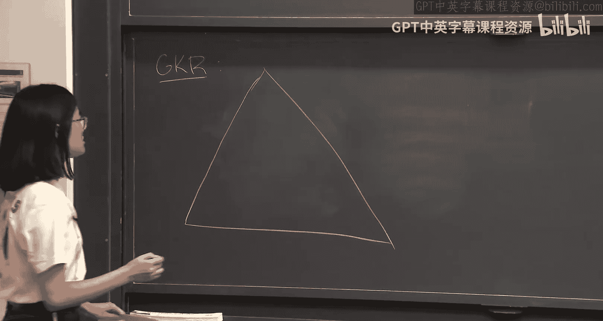
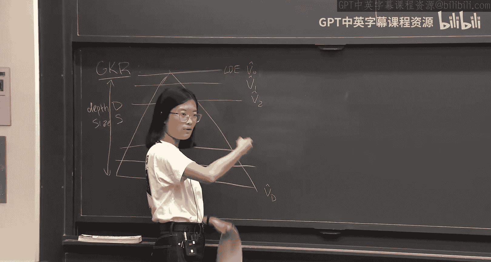
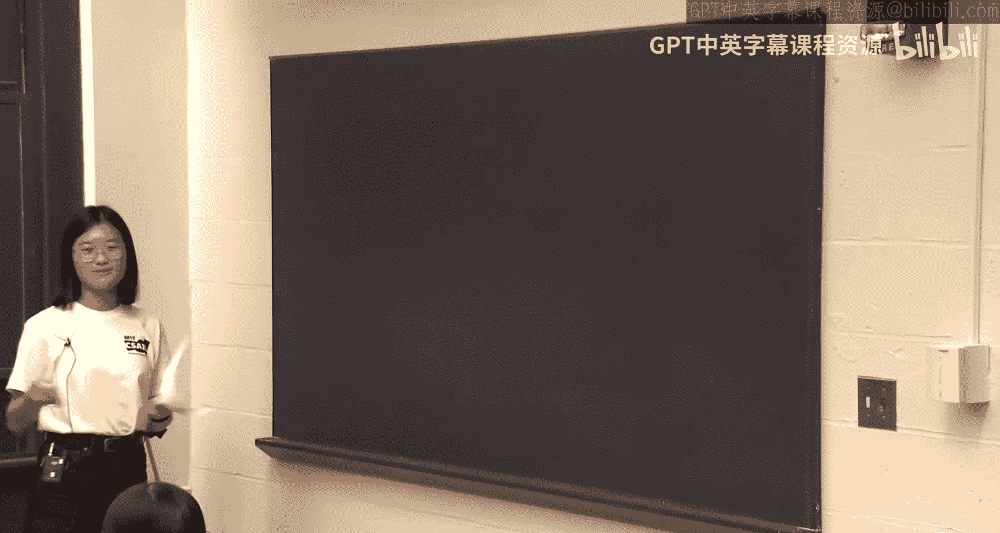
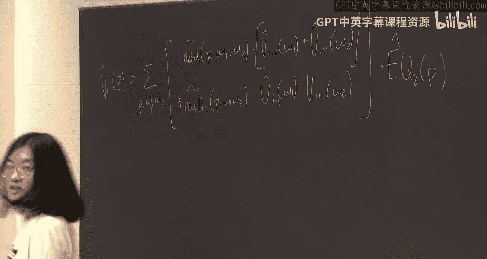
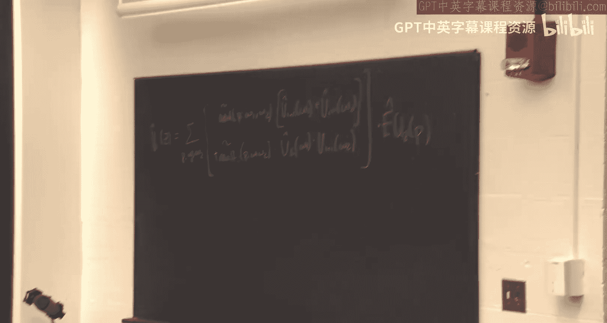
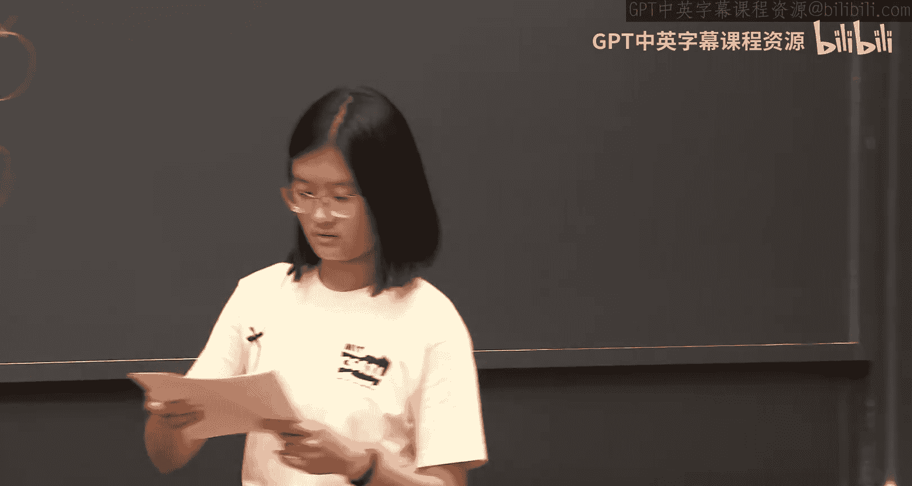
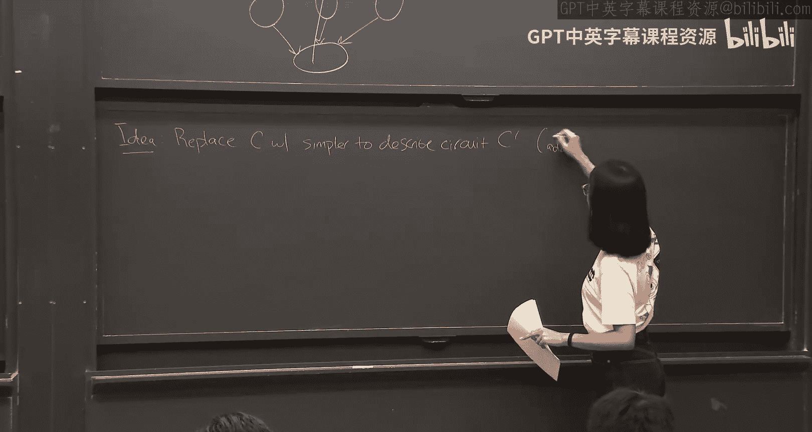
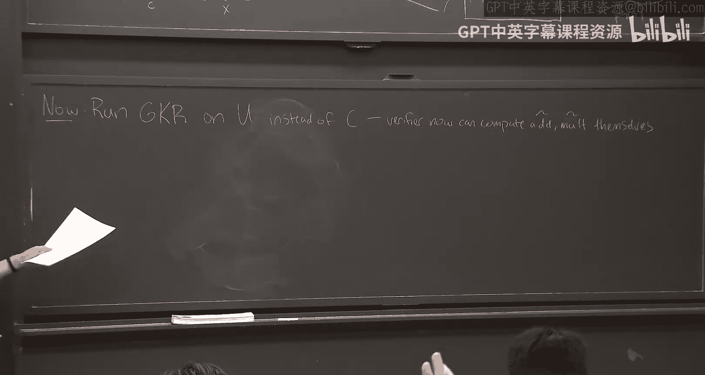
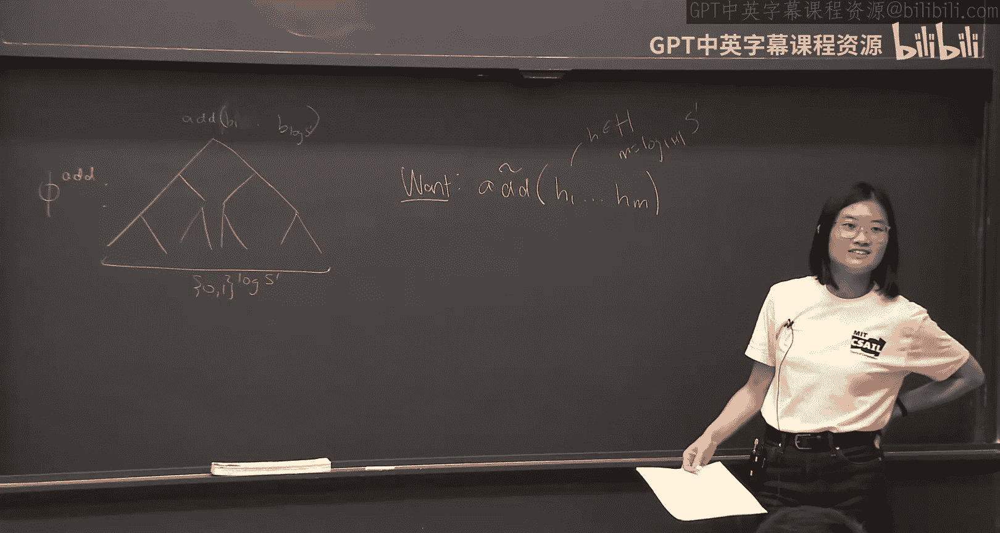

# 《密码学高级话题｜6.5630 Advanced Topics in Cryptography, Fall 2023》Claude-3.5-s p05 Lecture 3_ Continuation of the GKR Protocol and Corollaries.zh_en -BV1MVa5zXEmy_p5-

Okay， so what is GKR？Can you guys read this is too big， too small， it's fine。

So the idea is given the circuit C， we're going to instead of having you compete in entire circuit C by yourself。

 you can delegate it too。

觉得他。And the competition is correct。And the main idea of how you can do it。

 So let's say is the depth us。さ？In size。What you're going to do is you're going to take every single。

Layer of the circuit。Extended to a low degree extension。So is this going to be the？

So it's going to take all the water values on each layer。Qu a logic extension of it。

 and then you're going to have some logic extension of English。Soock layer is going to be P0。

 that is V1 the layer and so on。F later。And the way GPKR works is essentially as follows。

 you're going to reduce some claims of about the calculated up the layer to claims about layers below it and you're going to keep doing this until you reach the bottom layer at which point the verify can check themselves。

So at the beginning， you might have。The output。You want this to be portrait zero？

You're going to reduce this via thumbsha protocol to two claims。 So let's called these。1。

Equals maybe the value of。When。And also are the claims that the session。好。回。过去。

A different value you works to， and this is on US subject。And you do again。

 so last time you I show you kind of do in a two to two fashion。

 we're going to produce two claims to two claims。At the end。

 you're going to reduce this Im check to the claim about the out layer。So maybe ZD1。Okay。

 and at this point in time， this is just a low degree extension of all the input gates。is size N。

 the verifier knows what all these inputs are so they can compute the low degree dimension by themselves。

 And so altogether， its going to take prover。Time polyus。

To prove the computation incorrectly to the verifier， and the verifier will run。In time， let's see。

 it's going to be D times polylogs。Plus like end time poly logga also。Okay。

 is this the story you did last time， yeah。Can you go over how using the same randomness help you。

Do you do。唔会噶。Right， so the idea is， instead of having to run a different subject protocol with independent randomness for each of these two claims。

 what you can do is be the same randomness for both for both claims simultaneously。

 And turns out that the case you have to check at the very bottom at the end of the subject protocol would be based on the randomness that was used during from the verifier's point of view。

 So as long as the same randomness using both of these things。

 then youll have to reduce the same to like final checks is the very bottom of the subject check。嗯。嗯。

And maybe I should also just tell you。Yeah， I also wanted to write out like sort of sub checkck like equation just because we have it for later because it's going to be important。

You up the entire order already， which kind have awkward， so maybe I'll put in somewhere else。

Oh from there， maybe okay。I guess I told that a camera， man， we wouldn't do that more。

 but I'll just put it here because it shouldn't be important， I guess。

 or like it would be important for us， but like we did it last time so hopefully it won't be new okay。

So you're checking a element of like the ice layer。

 you want to introduce it to two things in the previous layer。

 and so what you can do is you can take an output gate。I in two input gigs。

And it's going to be a giant thing。So whether or not it was agate times。はい。

Time whether times a sum of it。And then you need should take the logic extension。Okay。

 and so that's the equation what's going to happen if you're going to essentially do a sub check with this entire thing here as polynomial in your sub checkck。

So we'll come watch this later and we'll just read this Yeah。

 it's a polynomial of degree to say like the size of H maybe in each variable。

 so individual degree size H minus-1， or does this take it over。

Which is an M。 And it's going to basically test the quality of Z and P。 So if Z。

 if P is in this like hyper cube， then it should be one if and only if P is equal to Z。

 And there's a section of that。

Okay， so today we're going to ask some questions。 Okay， so we show we knew to do this。

So last of time， I was also to do this as long as we had oracal access to the a and motor gates。

So the goal of the first part of space class is to remove this Oracle axis。

 we're going to show how you get these things。Okay。

 actually we already living bit more in this board。 So I guess like， so question one is。How to get。

These little extensions。Okay， maybe you guys can tell me， do you have any ideas。

 how can we get these？So I feel like odd on is bouncing， which clearly means as something to say。😀ふ。

Orize the circuits。 good。 Okay， so maybe I'm going to say in something like maybe you can compute these things yourself somehow if you can arithmatize it。

And we're going to see how to do this in a sec。Another way to do it is we already know how to do G KR。

 Like， we really know how to sort of delegate a circuit， right。

 So let's reddegate the a mortgage gate。So。Today we're going to redelicate Ed and mo。

And this is indeed what they do in the original GKR paper。But we're not going to do it today。

 So this is another right thing you could do， but today we're going to show to compute them。嗯。

Actually， this is a bit weird because we're actually going compute the low degree extensions of these atmost circuits。

 We're actually going to compute like a different somewhat low degree polynomial on these that share the same values on like the hyper keep。

So it's actually not going to be。Econal。I think last time Leo had said something about like can are different？

Like low degree polynomial and the answer is Gs yes， and we're going to see application by today。

So， okay。Okay， cool。 So the idea is like， okay， so if you want to compute them。Okay。

 so if you can't compute the actual canonical load degree extension， so what cant you do？Well。嗯。Okay。

 and the reason is basically because like to compute it at Mo case。

 like the surfacecus is kind as too complicated for you to compute yourself。嗯。

So maybe here's an idea。 What if a instead of computing doing JPR in the business circuit。

 we do it on a much simpler circuit that computes same functionality as a circuit。 you're trying to。

 you want。

嗯。So。

So idea， replace。C with a simpler。To describes circuit。And I guess by simpler to describe。

 I just mean that a Mo should be easily computable。

Okay。Okay， and so let's use the universal circuit。 So universal circuit is going to be a circuit that's going to take us inputs to the circuit that you try to compute。

Along with the input， and it's going to output， it's going to simulate a computation of your circuit C on the input X and then compute C of x。

Okay， and the claim is going to be that this universal circuit is going to have a simpler description。

 at least for the add board case， than originalal circuit。

Right because it's going to take us input like the description of the circuit。

 and then it's going to kind of simulate description with all these sort of like simulation that you described because it's very general and very easy。

Okay。So maybe let's see how this will work。Okay， so you have this universal circuit here。

 it's going to look like this。嗯。And it's going to take us input a description of the circuit C along with your input X。

And then it's going to run。 The hope is that this is going to be。Ds D times polylo。诶。

Maybe it should be okay， we's talk about the depth later。

So it should be hopefully not so much bigger than the circuit C because you're going to want todo it efficiently。

What does the subscription see that over here， This is Ya leadership today。Okay。

 so what is the circuit C， like how do you want to like like what are the input to this be like where it's going to it's basically going to be a function that would tell you。

Yeah， so I guess Ill tell you for every single， like， maybe you can add one and one。

So for both Adam I to tell you if at a single location in the original Circuit C。If there is a。

If there is a gate of that form or not。So it's going to be a pretty large description。

 it's going to be size2 to S。That makes sense。So in the circuit so is going to be use。

 we're going to give a description size to mask。What that is that， and as Ted isn't alluding to。

 so it would not be so good for us， but we'll discuss how to do in a little bit。

Just literally just two mid screens。Yeah， yeah， yeah， and it's just to me really long。

 it's going to tell you what every gate of this circuit looks like。

There't PW on and W to range over kind of。又去反租啲食。Yeah， okay。 maybe we should。

If you have Pw1 and W2 range over like all the possible grades or something。

 So you change the a little bit that's okay。sorry yeah， I guess this is a very detail on。

So what you can do， this also actually issue was originally with GKR protocol。

 right because they only have a one case， what you can do is you can have x and then also the flip of X or the knot of x。

And then now you can everything。Okay， so how do you so my claim is basically that this universal circuit is going to be much simple to describe in the original of circuit C。

 And maybe let's see why it sort of hopefully not too in detail view。

 but hopefully we can kind of get idea。 So the idea is like。

 let's say this is your circuit C over here。😊，And it's going to be a bunch of layers with a bunch of gates in each of the layers。

 and they're going to each have some functionality。Okay。

 and so what the universal circuit is basically going to do is it's going to say。Like。

 I want to compute this value of the circus Sea gate here。

Let me look at all the previous ones because you don't know which which one this is a tattoo。

 So you're going to look at all the possible like values。

 And you're going to sort of then see what the cicus C said and a compute the appropriate function of the previous layer based on what the sur C says。

 So in particular。Yeah， so the particular in the ice layer。

 So the value of the of the circuit of this thing in the ice layer is going to be。

So maybe this is a layer。This is a gate。嗯。And it's going to be a sum of possible gates in the previous layer of the following thing。

 So it's going to be whether or C。So it's going to be whether a C has an add gate corresponding to the three gates you picking。

 So this is J， and then maybe K and K prime。And then。Times sir。The sum of them。

 So it's like some the thing as in the JPR thing， we're going to have sort of like an ad and like a Mo condition。

 And so okay， so if it's a gate， you're going to compute a sum。And if it's a mod gate。

 you're gonna compute the mode。Yeah okay。What what is set inside the parenthees on the ad gate， Yeah。

 okay， so this is going to be whether the circuit is an ad gate at this particular three gate JK and K prime。

And this is going to be the values V i 1 K。 So what this is。 Yeah， sorry。

 So maybe is a little bit small。嗯。I don't really know how to be this。嗯。嗯。Yeah。

 is good the subscript on the C ad actually think of it is an equal to Yeah exactly。

 so these are both going to be given from the description of the circuitcus C。

 which is will also have to take。Your description of cicus C is also going to read into here。

And this is the same thing that's written on on the board that they Yeah。

 it's essentially's not load recession， yeah。

啊。Yeah。sorry end still hung out on this。 C add is defined over three inputs。

 all the range from one to。Sure， okay， yeah， Why is it size So size I guess good， Yes， yes。

 So we're going to have to deal with that in a bit。 So yeah。

 saying thats the circuitcus C here is like the description of circuitcus C is too big。

 We're going to have to be something for that。Why is it2 in the S though， because we haveS your HSS？

Esuteed， Oh yes。That makes sense like I actually explain the universe like it really badly。

 but you're basically trying to simulate the computation of C。 And to do that， you're going to。

Introduce sort like a new circuit or like a new small circuit for every single gate in your universal circuit。

 that will look at the previous layer and they compute appropriate functionality based on， let's see。

 as supposed to say。Okay， Rachel， yeah， what is the p being some。Yeah。O。Yeah， yeah。 So yeah。

 So these are all going to be an H to the M。 H to the M here is going to be the size of like a layer。

So it's going to be to P you can think of as being in the I' layer。

 and then omega 1 and omega 2 are in the I plus one's layer。系。Oh。

 and here like said it's just an auditory development。So that's the mission there。低家啦。

Like you're trying to estimation with a bunch of games。 Yeah， yeah， yeah。

 So this is going this is going correspond to I'm sorry this is really bad。 Yeah。

 this could correspond to like like a sort of a pretty big circuit here that's going to look at the previous layer and depth like that circuit exactly。

 Yeah， that's perfect。系 jackie。Yeah， so as I don't know your name is Gabe。 as Gabe said。

 on the depth of the circuit is going to be on the depth of the originalal circuit of C time sort of like this like depth here。

 So the question is like， what is the depth here。嗯。bots。Like roughly， I don't know the valueary cut。

Yeah， okay， sometimes log gets like polylog maybe at worse。Yeah。

 and like the reason is because you can sort of think of this big sum as like a binary tree of sums。

And then at the very bottom of this binary tree， you have like poly S many。

Sas you're kind of looking at。So this entire depth because it's like a binary tree is only going to be like depth like log gas or something。

That's what the universe circuit good。Yeah。Okay， and what about the size as this universe is circuit good。

Yeah， so it's going to be the size of original circuit times like polylyus。

 it's going to going be polylyus。And the reason for that is because the size of the universalversal circuit is basically going to be for every gate of the original circuit。

 you have this like polys size like circuits1 of replacing it so you get this like polys size here and then times the side of total circuit。

 which is polyS。Okay， so this is going to be like part of the circuit we're going to end up using to delegate instead of using the original circuit C。

 I guess the last claim that I made is that this circuit U is much simpler to describe than the circuit C。

 So particular the at mo gates are easily computable or like decribable very simply。

And maybe let's look at。This and think about it for a minute。So I guess like。

 if you're trying to figure out， you know， I have sort of like。

 I'm trying to look at a specific gate， and I want to see if it' like a adder motor gate。

But you kind of do。 You kind of figure out where in this tree you are， right， And you can be like。

 oh， look， I'm part of this binary tree。 It should be an a gate， right， And you're like， okay。

 I'm a gate or you can sort of weed maybe in the leaves。 Like you're like， oh， this is， this。

 this particular gate corresponds to， you know， like some。

Some agate in the original circuit and sometimes some values and you kind of figure out， oh。

 this is supposed to be a multi or agate or something？

The point is that this is like a pretty easy function to describe， in particular。So。

There's going to be low depth pooling formulas that compute botha a and Mogates。

So it's going to be a pooling formula。Let's see。 So it's going be。So is it a bullolean formula？

A size holylo S。嗯。That。I compute to add in multiple functionalities。

So it tells you that whether're within you， these these they're small formulas that tell you whether specifically the gate in U is a at or mode gate。

A good。嗯。Okay， and so now like these formats are much easier to compute than the previous Adam mode so a laser verifier can do it themselves now。

Okay， so。Yeah。Okay， so I guess， originally。Yeah， originally。

 so how do you compute add mode I didn't write write it yet。

 but you're going to assume that C is a logs for these uniform circuit。

 which means that you can like you do like maybe up to like time like poly S computation to compute it。

 which is too much。Here， since the formula is only a size polylo， you can kind of compute yourself。

 right？So then when you're doing GPR in the Uni circuit。

 you just have to do the small communication as opposed to the big one。Yeah。

 are these like fiatna Pults so log space uniform， I guess I you log log space uniform。Right。

 is thats how it works？😀呵呵似。😊，I mean， their size is polylogged right so basically what I mean by this is like you can feed in any like P omega 1 and omega2 and then pta formula of this size and it'll tell you what the answer is。

RightSo it it's only polylog site， so you only have is there exist a formula especially for all P1 mega1 and mega2？

いやいや。Right， but yeah， I mean， the the way I would do is like advice of like quite alongside。

 but like I'm assuming there's a way to be。It right。Yeah啊。I think I think it' was log log uniform。

 I think it's just like massive。Figure out what the whole eye is。げつです。这是。到哋出。Yeah ok， ok。Yeah。

 maybe just to summarize what we've done， we've essentially replaced this like C。

 which has a sort of complicated addom multi gauge description with a universal circuit。

 which has a much simpler aom mo gate description。 And then now what we're going to do is we're going to run JKR on the universal circuit instead of the original circuit C。

 The output is still the same because the universal circuit will simulate C and compute C of X。

 But now the verify can themselves compute atom mode。In and。Good， good， good。Okay， so。

So now we're going to run a GKR on you。Maybe you call UFC C pieces on the circuit of it's just you。

Instead of C。Okay， so issues。Okay， maybe show right。Okay， so issues。 so one is that。

Anon pointed out， which is that the input is now really large。So。So in issue one， input is large。

Okay， and if you remember from the GPR protocol， the verifier at the very end has to compute some points in the low degree extension of the input。

Right， before we said， okay， the input is only size n so they can compute it by themselves。

 It's only n times poly log time to compute it。 But now the input also has C。

 which is satelliteize S。 So now you have to actually spend like， you know， time poly S to compute。

There a final layer， which is bad， right， Like we wanted to verify to be efficient。

 Now we're we kind back to square 1。 Okay， so we're going to deal with this。Any other issues？Sorry。

 in the GKR for all the end times following guess is。

Do I only need to compute a couple of bits in the input there or do I need to。

You need to read it all because because what you're going to do is you're going to look at the input layer and the computer' going to load your extension。

And the only way you can do something with loaded extension， if。

 if you know everything sort of like an encod otherwise， yeah。So I have a question before you issues。

Is it obvious to ver can compute like add multito。自有一个可。Good， good， good。

Yeah， so Nion's question is how do you compute like a low degree extension of add mode right now only giving you a Booleing formulalogy compute them right。

 so you can compute the values on the hyper cube， but you can't necessarily compute the low degree extensions of them。

So we're going to see how to fix those things。And hopefully my mom will take these are only two issues。

 so we'll see。Is this okay so far。Okay， so issue one。

 the input is now off the circuit plus the original input， so it's very large。嗯。

So right now this is what our circuit looks like is you。Big part is C and like a small part is X。

Okay， so here's when the lock space uniformity of C is going to come in。

So if you ever read like GCR statements， the theorem only holds for when C's log space uniform。

 which means that there's some small description of it。So some small log S size。Description of C。

And maybe let's call this description。This， and this is turning machine M。That。Basically。

 if it read the description， it can then output like the entire circuit C。

And this tuuring machine should run in。m space。But it can run for as much as S time。Okay， so。Okay。

 so C is too big。 Yeah， so M is like fixed。 Yeah， M is like a， yeah。

 it's just a fixed training machine。Yeah。Just to make sure intuitives why this matters。これ see hasか。

Culpture。It might be to find on。Like on。边讲。Oh。I think one main thing is that the verifier needs to be which you like know what C is。

 because like in order to get it sort of any holded on the on the circuit C for the verifier。

 that they need to kind of have some way of like describing the circuit in some sense。

 This is like basically saying the circuit has to be like log size so that the verifier can hold it and like。

 you know， have some way of knowing what circuit does C is。

I guess I'm trying to think about like what kinds of circuits are excluded by this experience that。

Basically you have to write out all like the entire church table to this is that what we're trying to get so I think Ted is our loco complexity theorist so I'。

You can't like hard code。You can't let car go away the string。Right。Yeah any sorry。So C is large。

 and the problem was that reading this entire is too much。But we have a short description of C。

So let's also maybe have a circuit compute C。Maybe we'll call this M just because we have a tu machine called M。

 but it's not a T machine It's a circuit。 And for a circuit will take us input the description C like with things around it。

 and then it will output the entire circuit description。😊。

And now feed into the universe like we just talked about。

So this circuit here is our circuit C prime that we will actually be delegating on。

And just should be clear which ones are of inputs， inputs are this， the description of C。

 and also x like this entire C here is now kind of wrapped into the circuit， right？Y。の。こし。

practicerac C equal。 So what like E C like do another description to circuit or I saying the machine is able to run the circuit or。

So it will you run and log as space and maybe up as time。

 and then it can add for like maybe any gate of the circuit you want。Yeah， and maybe like， you know。

 maybe if you have an output take separate from like actual like spaces all you compete on。

 you can have like you can just like output the gate with my one sort of。いこしイ。Sure， yeah。

 I'll put the descriptional see。Or like description of the gates I see。 So like output the gates。

Yeah。This unrolling M made that like really deep。

Good， good， good。 Okay， Yeah。 So what's the depths of this。 So， okay， M can run in time of to S。

 So this could ostenibly be depth S， which is bad because our very times depends on the depths also。

😊，嗯。Well， it turns out you can do it in depths logs， and I'm not going to tell you to do it。

 You're going to tell me about the end of class。 So that's sort of the goal by 3 PMm。

And this will also be sizes。So we'll get there， but over year're dog chicken it me and not my job do。

嗯。ForAnying else， how you turn the string machine into， Good， Okay， you tell me。

Don't be hint don't be hint， don't worry， so I want to be like I think you'll be able to figure out。

Okay， and then the other thing is this is like， has easy added motor gates and。

Well also you also come to that by then class so basically circuit can have all the nice properties you want。

 it's going to be depth log S size S， the whole circuit now C prime is going to be size polys because it was also sized polys。

😊，It should probably be poly， not just sizeus。Yeah， and the total adapt is going to be like polylogs。

The statement is like true table of M on C equals C on bracket C。So do we need light？

Size of C different copies of M What Yeah， yeah， sure。Sure， yeah。

 or you can think maybe it's it's a thing and like you can have like an output tape。

 right where you can just like output everything to or that other thing。Yeah yeah。I光为是在。Yeah， no。

 I just very like。Okay。 you might have just said this okay。

 but look it's along the line there's this log S size the description of C。Like scene bracket。

 like scene bracket a string is not actually like block at right。Oh。No。

 be is it going to be log S size？So the circuit C is sizes。

 but there's like a short description that can to sort of tell you what the circuit C is going to look like。

I guess if you got a family at Cs like see you what're CNN， the description could be like。

That you should。Sure， then why is that tree there like。我解释佢 number。So this description is size log S。

 so it's an entire syn is log S size。For Friday。I guess it kind of goes like this more than like。

 yeah， it's out。Oh我 is definitely else。Good that everyone。Our conditions。你家出定。So we得系个远得。Okay。

 so the claim is given the circuit and giving all these properties you're going to prove to me later about。

 then you can do GKR。And okay， so according to our plusy， really good high， I should push forroom。

 the prove is going to run in time poly us， whereas to decide that this like new circuit T prime。

This is size polyus， this is size polyos， so everything is polyas and polyo poly poly， so it's polys。

For the printer。And the verifier is sort of the depth of circuit， plus like the input lens。

Deeps here， this is going to be like， I think we said it was like。Basically。

 death original circuit times log。 and this is going to be really small。 It's going to be like log S。

 So it's going to be overall like the same depth of the original circuit。

And then the input size is now log S plus n， so it's not so much bigger either。Okay。

 input maybe okay， Okay， Okay， so the second issue， And you can pointed it out。

 how do you compute these like the low degree extensions of the adding more gate。

 whereas we only currently have fully formulas that compute them on the。I guess in this case。

 it's even up bulloleing heart。 It's not even like the H hyperke。Yeah。や你自す。Okay。

 so the idea here was like you wanted to ultimately get like the bottom layer to be size that small。

 but like still like this middle layer that you get to that because like C or known end when you run the college M like that's big。

 So at some point， you have to be able to like get like low degree evaluations in the middle layer the prover would do it So you would never have to do。

系事。because the GCR， the purple we had last time was like only first circuit。It's all。

N matter what I all did is she extended every， every layer to size S anyway。

 So even if it wasn't as originally， she extended to be big。

So I think sometimes as can be viewed as like sort of a upper bound each layer size also。

So the second issue， how do we compute adding mode？So we have。

 let me just write down what I put there pushes up so we have。These two bullying formulas。

It's going to compute at a mode。 This doesn't have us grow1 hop is nonetheless the way。なんですよ。

But right here is what BF a looks like it's a bulloleing formula， so it's like big tree， not big。

 actually very small trees， like polylo size。I know output at the end。系。Yeah， what you're like。Yeah。

 I'd love you want of choose something， so here's the input are all bits。So it's going to be 01 to。

I guess this should be taking as inputs， a size as a circuit and telling you whether or not that particular game is add or mortgage。

 so it should be like size on like log n。Of the size of the the sea prime。呃，是比。嗯。Cool。

 and our goal is to compute。

And so here we have。H is going to be an H。 And so here M is like。Bg face H。Of。This is what you want。

 and it's what we have。ButI want you to just repeat again this is not the load extension。

 this is going to be a load degree extension。嗯。So what do we do for shark sets？Or Sha Pi。

You guys remember， yeah， sorry question is a low degree extension， but are low degree extension。

Okay， so it's a， so an extension that has low degree， but it's not that low。

 It's like somewhat of low。 because low total。 talking about like just extension。 Yeah。

 And it's not going to be the lowest degree， but it will have okay， like low enough degree。We。

 really call them low enough。Low enough bake extension。Okay。You' can call this like the LEI。し。Okay。

 that okay， so it's not going to be the loadic extension， but it would be like kind of be okay。

， so what did we do for sharp peas， the other like the first plus it is like going like three weeks ago。

The idea there we took like a Boolean formula or like a formula right， let me maybe draw your memory。

 so the idea was you want to count the number of satisfying equations to some sort of like no CSP。

 you first turn this into some Booleing formula。Right， and then you。Do something to it。

 and then you can apply the subject protocol。 So what do you do in the middle？Aristoize。

 I guess arisnotize this thing。 Okay， so maybe first before we aristhtotize。

 we should change the input formats。 So over here we have H wehab bullying， like01。

 But what you can do is you can just take like maybe a chunk of size。 like This is sorry。

 This is a really like minor detail。 I think whatever， Okay's fine。 let's do it anyway。

 So this is going to be size。😊，Log of size of H。 And then so this。

 this is how many bits are going be here。 And you're gonna take H。

 and you can convert it via some like。Polynomial is going to be a degree。H-1 poly。

It's going to convert any element H of your like， know your bigger。Set capital H to a 01 string。

And they can do it like bunch of times。So now we have like this like weird thing where you're feeding in H。

And then you you use a degree like H polynomial。To convert it to like，0 ones。

 and then now you can feed it up through this b formula。 And for this part。

 we're going to arithomize it。So what is arisentizing just to recall。

 so arisentizing is you can take like an end gate。And replaced it with the polynomial。

 a plus b minus a times B。And then sorry， this is to be Anne not add。An or of a B is just。

Is this right， I this not the other way， right？This is a plus b minus A B， and this is a times b。

Right， so every time there's a or gate here， you can like， yeah， replace it by this polynomial。

 at the an gate， you can replaced by this polynomial。嗯。Okay。

 so maybe there's another lemma that Yao approved during the first class。

 that maybe it's been too long to remember， but maybe you can try to rethink about it。

 So the question is like， what is the degree of the final polynomial you get here when you've arithomized it。

Good like two to the death。Yeah， yeah， yeah， exactly。 So it's a number of sort of input gates here。

 I think that's the way she said it is a birth class。

 it's just a number of input gates times I guess here you get times by the degree of each like sort of thing feeding in。

 which is going to be H minus- one。So it's going to be。Blog S prime。

 which is the number of gates in the bottom times this is say H instead of H minus-1 because it's a low shorter。

Okay， so this is going to be the polynomial that we're going to use for atuda and Motoda。

So it's not the low degree extension， but it's the thing。Yeah， this is over avenues。

Sober is that writer is sober。Yeah， so I guess what's happening is you're first converting your H。

Over larger。Yeah， sorry， okay， yeah。The way you drawn it。

 it makes it seem like you're converting H into log H bit。

 But there' want to convert it a single so H is big， right。

 H is like2 choose a log H sort information or like like they wrong information。

 But like I guesss like the H comes from this bigger said H。 So you want to convert it to like 01。

 So you can feed it into the booleing formula。 Otherwise it's not like type compatible compatibleible。

 the booleing formula only takes in。Like when you fix a boolean formula。

 it has a bunch of inputs that are big， but each bit。依靠这个MV。啊。

So like how do you plug in log H bits into and input that only on？Oh， okay， yeah。

 So you can convert this into like a number of bit。It's going to be log H， many first。もいですね。Yeah。

 so the conversion isn't from one H symbol to one bit， it's going to be one H symbol to mini minutes。

But Min is going to be lucky。I thought we just wanted to find。

Like a big argument certificate when you evaluate it when the H and R is 0 and1， it's equivalent。

 Okay， yeah， sure。 So if you want to keep business in 0，1。

 you can have big this big set here H just be 0，1， then this is just identity。

 You can just plug a straight in。I guess this conversion is sort of like a。I don't know。

 yeah I fault the thing based on whether H is like a bigger set。

 so I've just been converting it to H just too much that basically Oh okay， H is different than。Yeah。

 yeah。literallyally justm。If。It's still determin。哼就要 get将嚟 send月可。ちな啲咯啲要いや。

But it's low enough degree， which is going to be the number here。

Right because there's a really low degree it would just be H degree， but this is a log factor bigger。

 but that's going to be okay for us because。I guess a verifier， that's fine， I guess。Yeah。感じとほ供で。

Use about。So the ad is like basically computes。 like that's essentially like compute like given one day。

 it simulates the circuit。No， so this formula。 Yeah。

 so the input is going to be any particular like location in your entire circuit。

 and it's going to compute in this log depth like this poly log size formula should tell you what that gate should be like whether that with the aggregate or not。

 So the input is not like this specific gate is going to be like any of the gates in the entire circuit。

Yeah， so so it's okay， so it's one formula for the entire Yeah， one formula professor schedule。

But then why are you double whattlights？So we're exactly what but。

These ages and that means that we have typically， like I guess the same number of it。

We have like blocks of inputs now。How exactly does that change， Because that means that。后。めちゃにくい。

We're're buying。In information it just feels weird because like in some sense。

 it feels like we're mixing up in。This we saying light。Assigning one thing， one light。

One thing in a large space to a bunch of things in the bullolean。In the large field。

 H is in the larger。We're saying that just assign one age to this spread of。也需要。系 i冇系。I night I not。

Okay， yeah， so maybe the confusion is like this part is like01。 It's really just bullying。

 And then over here we have this weird h going into it， which is like not bullying。

 So like what is this polynomial kind of doing with all this like bullying stuff。

 That's part of the question。 Yeah， so maybe you think about it as in like let's first aristhmeize circuit here。

 So we're going to get something over a large year already And then now we're gonna plug in these like polynomial into already arithmatized thing。

 which is already gonna be a polynomial。 So we're kind like like polynomial composition。But you're。

The thing is you're not doing one to one， you're doing one。嗯。

If you think about the amount of information is kind conserved， because here are the H options。

 capital H options for this H1。 And then when you plug it up here。

 you now still have only H options for the resultinging like 01 string。I mean， yes， but itll it also。

And felt that。Yes， but like but like in the higher field， we only have。Now we start you know。

 what walk。あ。That's from the larger。Now we're。Having been into this like。

Or other we only have like a view like do we have。Much less啊。The interest of the larger field。

 and we're rejecting that。Like each each element is getting。Is covering a bunch of bits in those。

So it turns out that there's a unique mapping from the string of H1 up to HM and then the01 to the log as prime string。

 and so it's a bijection can go back and forth between them so there's actually the no like。

Clashing is gonna to be just one to one。Sure， okay， yeah，Sure， okay。

 So what's going to happen is you're let's even let me zoom out of that it's a little messy。

 So let's say you have is going to be just。Is this is going to be our01 layer over here？Yeah， no。

 you're fine。 No。 It's good。 She has questions。 So this is gonna be log H number of bits。

And the idea is we're going to take some H。And we're going to map it here to。

She log aged many different bits right so here like one way you can do this and you can it's binary。

RightSo maybe h here is like size8， so this of course wants you like binary story。

hy are we allowed to do that and why exactly is this helping us understand？

Okay that you can write as a binary on。And like how exactly is helping us again， because。

It feels like now each big element in this extension。

 like before we were just saying that like we're going to extend each individual like like we're going to assume that like01 values are actually now extended value。

Now。We're doing it in such a way that。Before we were receiving these values from the large circuit。啊。

こち？Or like， we're gonna to say like。If we haven't。If we have to say in hand date。

 then we're going to have like plug one big value and another big value and then multiply them together。

Okay， kind， how about do we take a break now and then we'll come back in five minutes and then we do the second half of the class。

 I think that's all for this part and then maybe can talk No you know。

 your totally class the slide one okay。Okay， so how many you guys know the theorem exists or what it says or anything？

All right。Okay， fine。 we're calling on it again。 So this is a really famous theorem。

 It's a creed theorem。 It's very good。😊，Yeah， so we should talk about what these things are， so。

Can one of the local complexity theorist people tell you what IP is？

You have a happy be are local complexy theorist， it could be any of you。😀呵呵。😊，Cls of statements。

All we talked about the verify。안。诶可以。Okay， yeah， so okay。

 so I is a class of all statement that have interactive proofs， interactive。 That's right， Okay。

 yeah， so， and the provever can be unbounded time。 and then verify showing poly times。

 So means interactive proof should also be poly size， right， Otherwise it ver can't read it。Okay。

 and then what is piece space？Sp found in TN languages。Great， okay。Holy' face。comuts  e诶 ok。Okay。

 and so the easier direction。 So like okay， so it was shown 1992。

 these two things are actually equal。 So the easier direction to show is that IP is in peace space。

 The way you kind of do that is by sort of simulating all possible transcripts and then you can do some counting stuff。

 we won't go into details。 But in 1992， it was shown the other direction also held。

 So this is by Shamre in 1992。😊，So in fact， PSp is also in IP。

 which means that these two classes are actually equal and to do this。

 he constructed like an interactive proof for of any piece's computation。

 and I would give you the inclusion。Okay， so in particular this means that。Any peace space。

Computation。How is interactive proof？Okay， so going back to like the concept of delegation。

 which is what this class is entirely about， right， Like， how do you you know。

 delegate a computation to like a bigger prover， Well you can run very quickly。 Well。

 this is delegation， right， Okay， like basically like know。

 I want you to compute some like small space computation like poly space， know。

 and I can like ask the cloud， hey can you like awesome like Shamir interactive proof for me and tell me。

 you know， like prove to me that you did it correctly， theyre good， right， Okay， so what's the issue。

 Like why aren't we done， Like why did why did youJ at all。

 The reason is because here the prover run time。😊，Is 2 to the S squared？Right， so。So in P space。

 like any computation is doable in time 2 to S， but here's an additional though like so this is like S2 that's squared。

This is like basically the time to prove is much more than the time that you simply compute。

Which is why there's all these follow ups works and why this is actually so an interesting question today。

Okay， and there was some follow up work。 I don't know the reference。 and yeah， I didn't either。

 and I don't know if her memorys wrong either。 So it could be wrong， could be true。

 So it's a possible statement。は。Okay， so it's possible that there's a follow up work that showed how to have a proven runtime of two to the S log S。

Which is like significantly better than two to S squared， but it's still not two to the S。

 which would be kind of the best you could hope for for any arbitrary piece space computation。

So today， what we're going to show is。Okay， so today， the theorem is going to be as follows。

 So seemingly me GKR， which is an unconditional statement， It's not an assumption。

 it's just this is what we're going to use in the proof。So since we have GKR， we can get IP。

People with peace space。嗯。With a time。2 to the， I should probably write Po2 to S。So。Okay。

 so what this means is like so for maybe the hardest piece computations。

Assuming that I guess the hardest things you can do is time to do this。

 then we do have actually efficient delegation protocols for these things and they're in fact also proof systems so they are like information theoretically secure。

And maybe I just mentioned like one open question is。

 what about general time T space space computation。Where teeth necessarily us， Can you do。

An interactive proof is sufficient。I think this is哪的。

So if you want to think about some proof systems， this is a question think about。嗯。

Are yous okay for vis， This is probably fine right here efficient just like poly。 Yeah poly。 Yeah。

 you definitely ask more like even like stronger questions like can you do it with like， you know。

 linear time overhead， like， you know， additive， whatever overhead。嗯。Yeah， there's many questions。

So how do we describe a piece based computation， if someone said that it's a space of all computations that are do by like a turing machine with bounder space。

So let's say that we have our tuuring machine M。And they'll say it runs in space S。嗯。

And maybe they on input。0，1 to the n。ok。And maybe that's the thing we want is。嗯。😊。

And maybe we can just say time and also time。T， and I think I said it to 2 to the S。

 this for now is okay。 So let's say that maybe we have a tu machine。

 and we want to see that within time T because it' 2 to the S that eventually it will get you the output like accepting configuration or not。

So。So by this point， it should。谢。Accepting in configuration。Okay， so。So here's sort of the trick。

 the idea here， we're going to use GKR to prove the theorem。

So we're going to have to construct some circuit to delegate some habitation with GPR with。诶。

So this training machine here， it runs in space S can run telling up toitude to S， right。

So if you naively do this。 you get high depth2 to the S circuit。 That's not so good。

 We want to really be depth S。So， okay， so think later that down。 So the goal。Is to convert。

To depths。Yes。It has a goal。 So here's the trick， the trick is as follows。

 we're going to look at the transition matrix of all the possible states of the tuing tape basically。

So so we're going to have a bunch of different possible states here。

 a bunch of different possible states here。 So how many possible states are there？Well， there is。

01 to the S， that's what the state could actually say on the tape。Right。

 but that's also where the turing machine is right now。So， maybe。

Times the index and S to say where the tu machine is right now。And then you know。

 it would do like one communication move somewhere。

 and then it would be like an adjacent place at a different state。

 And then now the new state will be like a slightly different string。

 And it would be the dream like pointer would be a different location。

So here's it also going to be the same states。And the point is we're going to put。

A one at a location， if there's a way to get from this state here to this state here in one time step。

And zero is everywhere else。 Yeah， does this state incident like the internal。嗯。Yes。

 that's a good point。 It's actually very good， yeah。So there only be like one one。Yeah。

 there should be a one one every row because the thing youre going to do after one time steps should be deterministic based on your current sort of location or your state based on your。

urings like sort your internal state of your Turing machine， as well as what you see around you。

I'm using this as just like the number of states in the training machine。

Anything else I'm forgetting was in these states， there's just like a bunch of information that I don't remember。

Anyway， so I guess like the。The key point here is that this matrix is actually very easy to compute。

Right， because given like。Like maybe a state here and like a state here， you can like。

 sort of compare。and very low depth very efficiently。

 So this is a very uniform description of this check。

 or the circuit that we generates whether or not the particular corresponding matrix value is a0 or one。

It'll be important for us because we want to like add want。If you' on a uniform circuit， I guess。

 it's a point and this would make a uniform。Yeah， okay， so。The matrix here is easy to compute。

 is my claim。 The reason is you can take any state here， any state here。You can do some checks。

It's a very a small like formula issue。 You can kind of just check it very easily by knowing what M is。

 by knowing what you kind of see。 you can tell there's a tradition from that to the next state。

So the matrix here is easy to compute is my claim。嗯。So maybe let's called this matrix A。

So what I just said is that AI J， this is going to be like the I throw in the J's column and tree of A。

This is going to be one if says say I goes to SaA in one time step。Okay， and so that's good， right。

 What we really want to know is。Whether I will go to J or like the starting configuration will go to the accepting configuration in T time stepss。

 That's what you want。嗯。Okay， so here you have a copy of A so okay。Yeah， so we okay。

 So we w to find what， yeah， okay， if we wan to let is。

 maybe let's do some computations just very fun and see what happens。😊。

So you have a copy of matrix A here。 Co of matrix A here does multiply them via matrix application。

So you have a squared。What is the value of the entry in the I row and the J column of B squared。Yeah。

 so I guesss right here， actually。So a squared， the I J entry of a squared is。

Whether I go to J in two steps。And maybe for those of you who haven't seen this before， let's do it。

 so you see why。So。If you want to look at the ice taste entry of this product of these two matrices。

 what you want to do is you want to take the ice row。Look at all the entries across it。

See the Js column， look at all the entries down it。And you want to take sort of the pair wise。

 like we want to take the product this sum， So you're going to take like this entry times this entry。

 this entry times this entry， and so on。So what's essentially happening is here you want to take like you want to look at the entry。

 corresponding you're going from I to K， and then you go from K to L K to J。

And then you'll do this for K equal with two also， you'll do for can you go from IGK and then you'll do it from K toJ。

And so the final entry will some of all of this， These projects will be one。

 if and only if there is a way to go from I to some K to J。And two times of。Okay， or I don't。No。

s okay。

Okay， so in general， then if we want to look at the transition matrix of having。

 after going for T time steps， you cant keep doing this right。

 and you get that the IJs entry of a to the teeth power。It's whether I go to J。Yeah。

give you whether I was predict exactly she step like no more no less。Yeah， okay。 that's a good point。

 So maybe we can say this should be in exactly key time steps。

 and maybe you can have your touring machine like kind of stay at accepting configuration before you reached it。

 maybe， for instance。That's one thing you could do。

 Another way you could do it is you could have you couldane this matrix as it's a one along the diagonal so then you can always waste time if you want。

 But whatever version you want is fine。 Just， yeah， maybe let's say for now。

 affect exactly T time steps I should reach the accepting configuration and this have this all is accepting place。

Yeah， okay， so the point is if we can compute what AT of the input configuration comma。

 the accepting configuration is， we' know if this P computationut is accepting or not。系紧。

What we want is。So we're going to write a circuit to compute this。嗯。Is it okay。

 I'm very like loose about this， I just feel like all these things about exactly how everything cleans up is just terrible。

 I I don't know。

Okay， so I guess like one thing you could do is you could just compute A and then a is squared and a cubed and a to the fourth。

This is not so good， right， because you can do it for t time， just circuit speed devs T。 Okay。

 so what should you do instead？Repe is query， great， okay， yay。Okay。

 so the idea is we can compute this matrix A。So this is gonna to be like very easy to compute because we。

 we talked a little bit about how every like entry of this matrix is like。

 you can compute it very easily， kind of just by looking at what the two configurations are that you're interested in。

And then you can compute a squared from this， I just。I guess you do motivation multiplication。

And then you can do H of the fourths， H of the A's， and so on。I eventually put it to a to the T。

 which I don't have room for。I's really going to be a matrix or circuit？Okay。

 let's look at the depths， what the depths of the circuit。或者。Okay， so it's like log T ish。

But each like。Yeah， okay， time something。If I give to add。知咩啊。

But we can make it a binary treat so that will help。つ。Youre maybe going to say polyas。

 it's probably like log T times like polyas anyway。Okay， so that's pretty good。

 means that it's a verifier when running this computation with prover and JKR。

 it's a scale of the depths。 depth is not only poly yes。What's the side the circuit？思り出す。

Just ready go。Yeah， so I guess the matrix stuff is going to be tied two to this， right。

 or something times two to this。Yeah， to do that so whole way to do this。' that time that to us。

 so yeah。嗯。Yeah， okay。😊，Okay， so if we apply GKR to this， would it be good， so let's run GKR。😊，Oh。

 and actually I at the very top， you need to then like look at the input state and then check the corresponding entry。

 So you want to read like。This particular entry maybe。

 but you can sort of read ad in some sort of like pretty small like computation on。

What they put in accepting compressions are？Okay， so let's run GKR。Okay， so prove run time。これ就是。

开位出 the。Like guess I talking what。But good work。I there any question about this or does this selection that make sense sorry I might have missed an important point。

 but like where is the cost of like actually doing this swear？

I guess sort of like a deficit of circuit is sort of like each square you do is going to take some more depths to your circuit。

 Yeah what you're saying。Oh， maybe I didn't understand the question Oh isnt like what is the cost of sweararing？

Like just going from A to a squared， what's it Sure， yeah， so how do you compute？

You can kind of do every row in every column。Would if client add them so isn't like you're just doing like。

So maybe you can tell me how to。这对。We' just。Oh， yeah。只的样啊。But are we supposed to know how that。

Oh yeah， it's a great question。😊，Okay，好的谢谢。谢谢。any questions about this before you go to that？that an。

嗯，でアイティ。For you just use a logic you just had。Yeah， so how do we construct this survey now？

う。I just launch space。Yeah， okay。 so this is basically a P down version of that， right。

 This is log space user form。 So you're running in log space。

 there you're running times like space S。 So this is an exponentially smaller version of that。😊。

See all the parameters that are there scale them down。So if we had the depth over here was polys。

 the log of that is like log S， right？The log of the size here is S。

 So we have all those things we wanted。How do you incorporate the input？

I need to know what this earnings state。With this one or is I the input state。 Yeah， yeah。

 so I think the way I normally think， or I like to think about it is you only check the input configuration at the very end once you compute the entire thing。

So you all had to re like the input comm accepting configurationgurations entry。

And there you can just kind of like do like formula like。

 sort read off what it says and then look at the corresponding value。That's great。

 so like almost the entire circuit it just doesn't even read the Yeah， it's only the very end。系。

I mean， this is for accepting in that one。Yeah。y yeah， okay， so maybe。Yeah。

 so I guess like each configuration corresponds to like it's a configuration， right。

 so there's some data about like what the gates output， like gates value is or something。

 and maybe you could read off the value there。Like each entry like input comma is the gate here。Sure。

でさで。Yeah。Yeah， the important point here is that check like computing the matrix A is very easy。

 That's really the key thing here。 And that's also why when we said what。We were pretty behind。

 But what we said what。A looks like it really had to be like also where the tu like pointer was。

 right， because if you didn't know where the pointer was， it could be very large ya。佢的京。あ。So。The way。

 you can factor out what you're saying into the form of like if you have a low space computation。

 you can turn into a low debt circuit。Yeah。Yeah， it's actually a kind of interesting instrument，hu。

I don't know， I didn't know that I could do this until or something either。

So I guess like the interesting thing here is instead of being like a really tall and skinny computation。

 you can turn it into a circuit that's really fat and like kind of short。You's what getting。W。

 sorry okay。It wherever were。So we just proved this zero。Is this like the same reason for why？

The lawsuit farm works set too。啊 you tell me。S sir， you tell me。I'm delegating。

It's kind of weird because you don't actually take AS input it。

 A is like kind of like hard coded into the circuit。

Like that's why the input can still be like a small thing that's just describing the start state。

Yeah， like the tuuring machine M is sort of what determineable circuit action looks like。

 So maybe as part of the input of this， you're also going to have descriptions like the Turing machine to entirety Turing machine are like。

 you know， finite size， that doesn't matter。And着你。And that's why we don't need to worry about complicated multiple kids inside and it actually just looks like this。

I'm still trying to weird it out by the fact that。All of that。Until the star at the top。

 all of this is like not even depending on。So it's like in this case， it' just going to be。Consts。

 like you other in mind。这然 like。Why are we going through the trouble of computing all these layers？

Instead of just like using the top later where we like， I mean， how do you。

 how do you hold the top later。So you're saying that if new year to encode the entire computation thing then different。

It's easy to say what you have to do to compute it than you actually compute it。是。Read take。

But I'm thinking like why don't you get hard code in the top layer of？person。你咗呢名啊。Well， it should。

 I mean， it's just a string of link。意见。会嘢佢系第。So basically went through the struggle。

It was struggle because we assume that C can be described distinctcively。once is。Yeah。

 is poly yes uniform。よ。I'm going delegate like question somebody else。

 I don't know how like log blows up。Probably not right。

 because if you take the tradition matrix A you have is's going to be two to the description side or whatever。

 like the space。So if you have larger space， it's really bad。

From space estimates are moving depth like S squared。诶。啊。啊。Yeah。

 but then the question is the prove of runtime， right？

But the reason why we're doing any of this is because the prover run time。

 you have to get advantage of the prove run time。Itss and early。So maybe we can all go get some corn。

