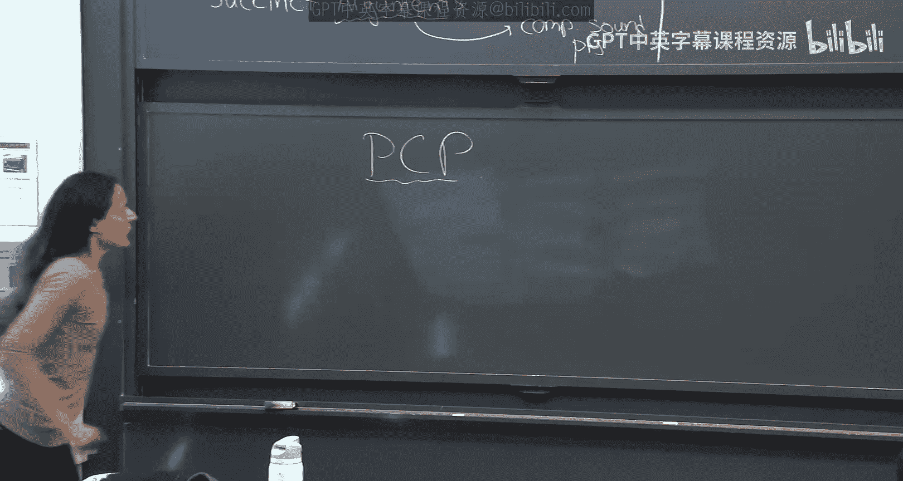
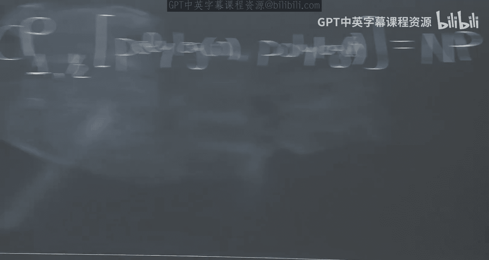
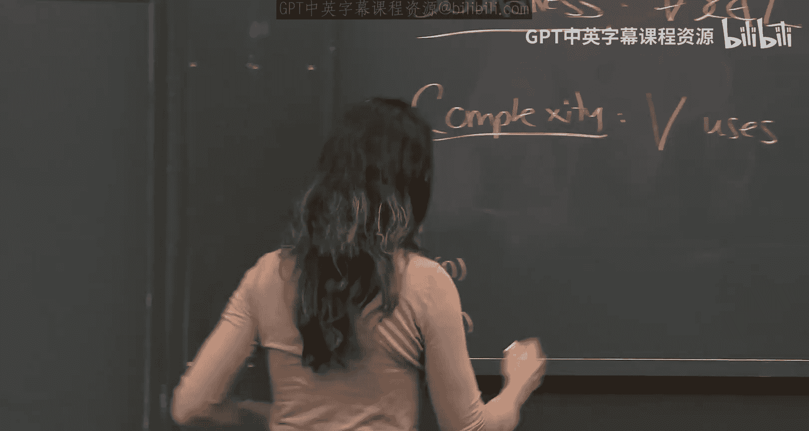
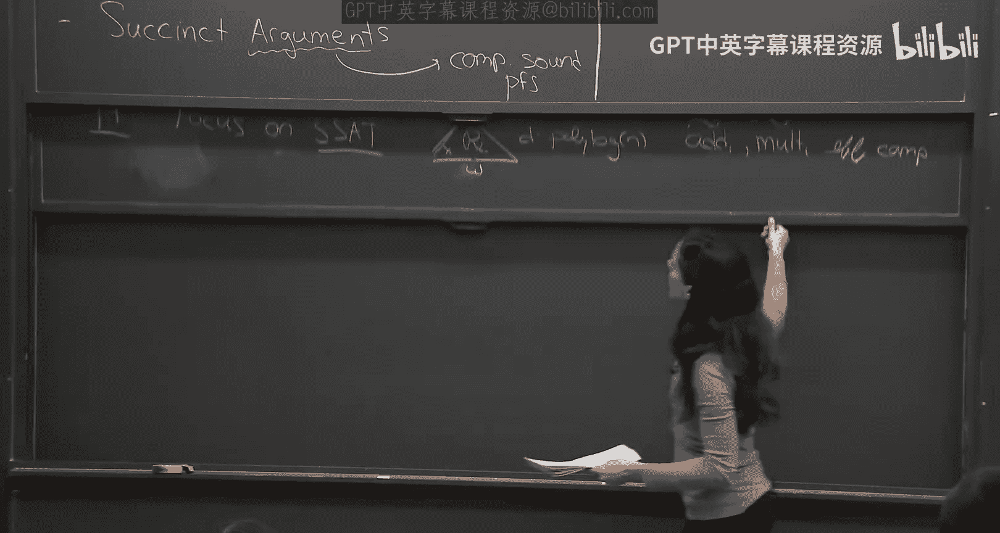

# 《密码学高级话题｜6.5630 Advanced Topics in Cryptography, Fall 2023》Claude-3.5-s p06 Lecture 4_ PCP via GKR and Interactive Arguments, Part 1.zh_en -BV1MVa5zXEmy_p6-

Today we're going to continue， we're going to talk about a new notion。

 a really really interesting notion in my opinion called probabilically checkable proofs I'll explain what it is so we're going to define this notion and we're going to construct it from the GCAR protocol so you'll kind of see not only the definition but you'll be able after this class the hope is that you'll be able to construct a PCP if you need to constructable proof you'll be able to do that so that's going to be the first part of today's lecture。

😊，And the second part of today's lecture is actually going to be the first time we have to use cryptography。

 so so far this class has not been at all about cryptography。 it was everything was information。

 it was actually complexity theory， but today is going to be the first time we're going to move into cryptography and as we'll talk we'll see that doing this information theoretical proofs where you say okay no prover can create give you a false proof that is limiting okay we can do everything we want using that this notion and therefore we're going to go into a new notion of soundness。

 which is what we call arguments or computational soundness and we're going to relax the prover and say and all and all powerful prover may be able to cheat。

😊，But the guarantee we give， Hey， Tony， is that a computationally bounded prover cannot cheat。 Okay。

 that's going to be the guarantee we get。 And we'll see once we relax the soundless requirement to a requirement。

 that's only computational sound。 Then we'll be able to get a lot more and kind of you know。

 the life will kind of open for us。 and we're gonna have a lot。

 a lot of new kind of construction and things that we were unable to do information theoretically。😊。

So this is the plan for today。Questions before we start， I haven't seen you guys in a while。

So it's good to see。 A lot of things change since lesson time I've seen you。

 and I'm probably going to be a bit distracted today。 so I'm sorry。Okay。Okay， let's start。

 so what are no questions？So let's start with PCPs。 What are publicly checkable proofs。

So these are the idea of publicic chable proofs is to take a proof like a classical proof。

 Think of N。 In N， we have an instance X and a witness。 This witness is like a proof。

For X being in the language。To verify this proof， you need to read the entire thing and do some computation like this verification circuit。

 you know， that checks that X and W is in the relation。 There's a circuit that checks this。

Okay what is the idea of a publiclyically checkable proof， the idea here。

 what we want is to take this proof and convert it into a new proof and maybe larger actually than the original proof。

 so maybe you know the original proof was of size N， let's say the incidence of size N。

 this may be of size much bigger still we wanted to be polynomial in N andM。But now。

 so we just made it bigger。 So what's， what's good about it。

 So what's nice about this proof is that idea is， you don't actually have to read all of it to check it。

And that's weird。 So the idea here， yeah， the proof may be a little longer， polynomly longer。

But you only need to read a few locations。😡，to check that it's valid。 So to verify。

 often PCP are done by pi to verify PCP proof。Give an X。All the verifier needs to do is query。

 He doesn't actually need to read these things。 He queries a few locations， a few bits。

 checks a few bits of the proof and then applies a verification circuit that depends only on these bits。

Okay， and importantly， the bits he chooses are random。 The the prover doesn't know。 Otherwise。

 he will， it's like shrinking。 if he knew， the prover knew， oh。

 the referenceers can only check in bit 1722 and 25。 Then he would just give you， It's like。

 you'll have a succinct witness。 And， of course， we cant take arbitrary witness and just make them succinct。

 We don't believe that's possible。 Yeah， as much quicker than。Okay， so the question was。

 it's a PCP used if M is much greater than N。 And the answer is no， actually， we can think about it。

 we can even use it where。😊，M， the length of W is entered epsilon。Okay。

 even less than n to that side。 even n to the little of n。 now you。

 this will still be polynomial in N。 So actually， you。

 you took the proof and make it actually more than polynomly larger because it's polynomial and n in M。

 And if the proof here is。Smaller is N to the little of one than this is polyan。

 it's actually more than polynomial bigger。 But you' saying， what did we gain。

 We took us a short proof， made it so much bigger。 What did we gain。

 And what we gained is the hope is that you can query this。 The very， I can query this in very。

 very few locations。 read only very， very few bits of this proof。Can you get about them。

 Does the verifier also have to be an extra。 Yeah， the verifier。All。 So yes， good。 So the question。

 that's a good question。 So the question was， does the verifier have to read all of X。

And because I said he only needs to read a few locations。 The proof does he need to read all of X。

And a priori， of course， he needs to read all of X。

 because even if there is one bit and X that he doesn't read， you know。

 what if that bit is it's exactly what the state， what the sentence is， What the statement is。

 You know， the prove need to know， what am I reading， What am I， What are you proving to me。

But there are extensions called PCP of proximity， which I'm not going to get into this class where actually the ver。

 the verifier also doesn't read all of X， but the guarantee is not that X is in the language。

 the guarantee is that。😊，Kind of it's the oracle that is given to the ver。

 There is something close to it that's in the language。

 So there is a notion of extension of this notion of the PCP where the ver doesn't even need to read all of X。

 That guarantees there are not very easy to state， but it's a very useful notion。 Actually。

 it use a lot。 It's called probil PCPs of proximity。Okay。So。Okay。

 so that's what we're going to do today。Okay， and let me just mention before。

 even we started the formal thing。 Let me just say， this is really an amazing line of work。 Today。

 we know how to take any witness convert to a proity checkable one。😊。

That the verifier only reads3 bits，3，3 Bs of this。Proof。And is convinced with cut probability，78 is。

The parameter but and then if you want more， of course， you repeat， but even with just three bits。

 you get some soundness。 that's really amazing。 So we're not going to see the three bit proof。

 but we're going to see a polylo N proof。 So what we're going to show what the construction we're going to see today is how to go from a witness to probability checkable one that the verifier only needs to read polylo N。

😊，Of this， of these bits and verify。 And to go to the constant。

 theres additionalal tricks of recursion and so on that one needs to do to get there。

 But we're not going to cover that part。Okay。Ready， So we're all sleeves。E， okay， let's。

Okay， so let me just define the complexity class。 People often think of it as a complexity class。

 even though for us because this is more of a proof system cryptography and class。

 we always want efficiency。 we don't care just about complexity we want to say that actually we can take any witness and officially convert it。

 It's not just about existence。 We want to actually use these things and let me just jump ahead and say that these things are used。

 it's not just a theoretical， you know even though everything we've seen so far in the class is like very just beautiful mathematically。

 it seems very you know。😊，Kind of low like very away from very far from practice。

 you know but actually it's not all these things that I've shown you so far that you've seen so far are things that actually are used and the PCP as well all this machinery are things that too。

 So we actually do care about efficiency。 But let me first kind of define it as a complexity class。😊。

So。We defined the complexity class， PCP， C for completeness parameter， S for soundness parameter。

 R for randomness parameter and Q for query parameter， so this is a class， this is the class。

Of all languages。L。A that have。A probabilistically checkable proof。

 but I'll explain exactly what I mean。 O， so actually， let me say O。

 these are all the let me write it formally。For which these are all the languages L， such that。

There exists。PPT， a Proive polynomial time verifier。诶。Actually， it's。PPT Oracle machine。

 because it takes the PCP as an Oracle Oracle machine。V， such that。Okay， so the completeness。

Here is the condition， the completeness says that for every x in the language。There exists a PCP pi。

 such that。The probability that V， the verifier， given or collapses to this PCP pi and input the instance。

So for every instance， there exists a PCP said that the verifier will accept it will output one with probability at least C。

 That's the complete parameter。 For us， the PCP will C will have complete this parameter 1。😊，Okay。

 so we'll see。 So we want to say that a class。 then language L has such a PCP。

 If there's a verifier V a efficient verifier， it takes oracle axis。 So if X is in the language。

 there exists in PCP。 so that the verifier with oracal of this PCP。

 given this input outputs one with probability T。 Yes， I'm。

 what does the orac look like what are the inputs Okay， good， good good。 So this okay， oh， good， no。

 you're not jump so good， good question。 So this pi， you should think of it as a string。😊。

It has bits， B1， maybe Ill call it pi 1， pi 2。Ucta pi， I don't know N。And the verifier can ask。

 give me like pi 1， Give me pi 2。 Give me pi 3。 So it just has oracle queries。

 He can query this string。 Okay， that's what Oracle。 It's not really。 don't think it is a function。

 He has oracle access to this string。 And he can just ask for specific bits from this string。

 Great question。 Thank you。😊，Okay， good。 And the sound is guaranteed。Says that for every X。

 that's not in the language。Any， any guesses， by the way， what would you， Okay。

 so you need to define a PCP here。 How would you define soundness。Yeah。

Wonderful。Exactly， you want to say that for every pi star there often how we donote the bad things that will do。

 too。 For every bad。 Now there's a cheating proveer。 he tries to fool the verifier。 He cannot。

 So for no matter what he tries to give him， the verifier will reject him with probability or will acceptability smaller than us。

😊，That's the soundless guarantee。 Okay， and ideally， we want to push the completeness to  one。

 the sound is to 0。Great， and then the complexity。😊，Is now we want to say in terms of complexity。

 now we'll go to the。That V uses。Are bits of random。And Q oracle calls。And moreover。

 we'll see this is important for us， this is often in the definition， though not always。

 but often this is part of the Q are non adaptive。What do I mean by nonadive。

 What I mean is the way V works， he gets input X。He gets input X。 He then chooses。Kind of， I want。

After I queue。Locationations in the PCP。O， so here's the V V。 He doesn't even look at the oracle yet。

He has an input X。He first computes。Q locations。He then goes to the oracle， asks these。C locations。

And then so V1， just just these locations。And then V 2。

 so you can think of V as being like V1 and V2。V1 doesn't look at his oracle。

 He just looks as an input。And using randomness chooses Q locations， and then V2。

Kind of just given X。I1 up to IQ and pi I1。Up to pi IQ。Deci is to like。Accept or reject。Okay。

 so this is how you should think of the the verifier。 The ver has access to the proof pi。

 But what he does， he does He because a more general verifier will have X decide and location first location 3 I 1。

 Look at pi1。 then interesting。 Okay， In that case， I want to see location I2。😊。

I get pi2 interesting。 given pi2， I want to see location， that would be an adaptive verifier。 Okay。

 but often in the PCP literature， when we define PCP， we require the verifier to be non adaptive。

And this non adaptivity is kind of is， is a property that we like for applications。

 And we'll see that today。 why， an example for why when we'll construct succt arguments。

 we'll use the fact that it's non adaptive。But let me just say most PCP and all PCP I know are nonadapive。

 Maybe there are other。 was that your question？Yeah， so I know， I there may exist。 I'm， you know。

 I'm not， I didn't do a full literature search， but the PC P that are you know。

 the most common ones that we talk about are all nonive。 Yeah， vegan know what。Yeah， yeah， yeah。

 yeah。 So V， yes。 V knows。 Yeah。 So V very good question。 Let me repeat for the video。

 So the question was， does V know what n， what capital n is。 So the answer is yes。

 and V knows V knows the language。 So he knows what small n is。 well， he got small n。

 He knows small n。 The language has like there is M。 So he V get small n。 So he knows what n n is。

 The language is associated with a witness size M of N。 So he knows that because he knows N。

 So he knows the witness size。 and the PCP itself is associated with n， which is。😊，You know。

 I can think of it this way。 So， so the answer is， yes， these are kind of fixed。

 These M and N are fixed parameter that are defined by the PCP， and the prover knows them。

They verify， the prove they。 Yeah， yes。Yes， good， good good。 So the question is。

 do we lose something。 And the answer is we do， Okay。

 so what do we lose and what do we gain is your question。 What we lose is for applications。

 So we when we'll go to in the second part of today's class。

 we're going construct succinct arguments and we're going construct them from PCP and you'll see that if our PCP is adaptive。

😊，This becomes a problem。 So we do gain。 Now you're saying， what do we lose。 And so we do lose。

 Sorry， we do lose if we make adaptive。 Now I're saying， but maybe we gain something。

 Maybe we can PC P that are much better。😊，If you make them adaptive。And I。I don't think so。

 but I'm not sure。Maybe， maybe one can actually argue that you don't gain anything。

 but I haven't thought about it。But it's not something that making it nonadapive for all we know is not a price。

 It's just。Our PCDs happen to be that way， yeah。

Good。Good， good， good。 very， very good question。 So I think I think maybe I misunderstood。

 but maybe your question was， is it clear that these have to depend on X。

 Can they even not depend on X， And the answer is yes， actually， the PCP will see。

 they don't depend on X。

Okay， the PCPs， we know， actually， these， they only depend on you know， n and the instant size。

Or or begin。 It's。 But they don't actually depend on the instance。 And the PCPR construct today。

 you'll see that。 So we'll get back to that。 That's really， really great questions， yeah。😊，还我。

Because you think that it's。Proover knows what industriesice you're going query advance。 You could。

 Of course， of course， great。 Well， guys， you're really lifting me up。 This is great。 Thank you。

 Yeah，100%。 So youre， what you're saying is， of course， if the ver。

 if the prover use the locations you're querying。😊，He will cheat。 The thing is。

 these locations are random。 The prove doesn't know what they are。 They just don't depend on X。 Okay。

 but they they come from a distribution。 It's very important if these were deterministic。

 there's no way if you can do a PCp where these are deterministic。 It's like， you took N。

 And you just made it n time much smaller。 Like we don't believe that that can happen。 So no。

 there's no way we believe you can construct PCps for which the query distribution is deterministic。

 It's like just fixed。 This has to come from a distribution。

 But the question is this distribution depend on X， or does it only depend on the parameter n。

And what we'll see it actually only depends on N。 It doesn't depend on x。

 So that's what we'll see A in a minute。Great question， guys。 Any， any more questions before we。呀。

Would be lucky you hear it in B1 and to B2。You say about the people。So， O， good。 So actually， V1。

 you can think of usually V1 is randomized and V2 is deterministic。

So you can think of it that way that V1 is randomized。 V2 is deterministic。Okay。Great。

 so now let me tell you what we know and what we're going to construct。

 So here's what we're going to prove today。Here is a theorem that we're going to prove。That PCP。

With a， let's say， completeness one， output'll put some this half， we can get smaller。

 any constant smaller， but Ill just put half because by repetition， it doesn't really matter。

 You can get a PCP where the query complexity is。 So okay。

 we can get a PCP with poly log N query complexity and poly。😊，诶 loggan。Sorry。

 poly log in randomness complexity and query complexity for all of N。

That's what we're going to see today。 So we're going to see how， for any NP。Language。

 we can construct the PCP where the verifier the amount of randomness he uses is polylogin bits of randomness and polylogin queries。

 And then we get complete this one in sound half yetina。So。years ago。点需要我。

What the randomness complex doing need to be？Los of the。Right， right， right。 Yeah， yeah， yeah。

 So you're right。 So often。Okay， you're right。 the way I wrote it here。 So okay。

 why do people care about randomness complexity， One can say who cares about the randomness complexity。

 And usually the way the way I define PCP。 And this that's what I said as a complexity theory。

 this is how it's defined。If， if the verifier has only log n bits or order log n bits of randomness。

 then it means that the PCP is only polyan size because， look。

 go over all the polyan all the log n bits of random。 There's only n of them。

 So that's as much as you can kind of query。 So so that means the PCP is upon size。

 Then that's all we care about。Okay， for me， I'm gonna care about。 So actually， for me。

 I'm gonna add requirement Actually I didn't write it here because it's usually not defined。

 but I can add a requirement that says this Ill okay， I'll add it here in tiny。

 This is a a requirement that we added in in cryptography。

 Often what I'm writing now is not added in the， in， in the definitions。

 But let me write another cryptography， Another that given for every X。

In or x。For every X in L and witness。If it has a witness。W， okay。

 so suppose this is a language in N time。 I don't know。 N P or N time T。 So it has some witness。

 I wanted to be the case that given x and W， you can efficiently。Computer pi。

So not only there exists pi of polyan size， you can actually efficiently compute it。

And because I require efficient computing， I actually don't care any more so much about the randomness。

 among the number of randomness bits。 But yeah， that's a very good point。 Thank you。 Gu。

 thank you for the question。 This is great。😊，Okay， so that's what I'm going to prove。

 Even though let me just mention what is known is you can make this order login。

And you can make this three。Okay， so it's really remarkable if you think about it。Wow。

 you can take any proof。 So you know how， I don't know。

 take from math last year and take the hardest proof that we know in mathematics。 You know。

 one can write them in aly checkable way。 They can just take3 Bs and verify。

 And if you're not happy with probability half， repeat it as many times as you want。

 You want you want to be sure that he can cheat with probability only one over two to the 500。

 repeatpe it 500 times。😊，And each one is's like a very simple check。 It depends on 3 bits。

So it's really remarkable。系。No， everyone。It's like M3 probably way too big。

 but I guess it doesn't really matter。Oh， you're saying it's too big because for theory for practice。

 Yeah， but we't still in theory land。 yeah， in practice， these PCP， you want them to be like linear。

 That's ideal。 The quasi linear。 even if they're quadratic people don't like them。

 You really want linear quasi linear PCP， for practice。 But for here， poly is fantastic。 you know。

 we're not， we're not let us stay in a cloud a little bit。 okay， so so， okay。

 so let's let's construct this。😊，Ready。😊，Okay， so， okay， so we have the three。

 but we're gonna construct for the polylo polylogue。 And what actually， here's what what's amazing。😊。

You actually already know how to construct the PCP。 You just don't know that， you know。

And how do you construct the PCP， it's really only the G careR protocol， That's it。😊。

So you can unfold GKR， and I'm going show you exactly how to make it a PCP。Okay， so to do that。

 But before I now recall that you care on a second on that board。 But to do that， let's first。

 let's first。 So I want to say any， any language as a PCP， let's let's focus。嗯。And three sad。Okay。

 so three set is an N completete language。 Let's just clean talk a PCP for three set。

And what's nice about three set is that， I mean， any NP language， you can convert a three set。

 So it's nice any NP language is that you have a circuit， a verification circuit。So。

A circuit verifying， So you can think of it given W， verifying that it's a valid witness。

A very small depth。Okay， polylog and depth。 And this is important because if you remember the G careR protocol。

 which we're going to use to con this PCP。Kind of the number。

 the communication complexity grows with the depth。 So we want the depth of the circuit to be small。

But any N language you can convert into three set in three set has actually。

 it's like the depth of three set is like actually only two。 But like you need to do， you know。

 little or's And then one began。 But if you remember Deca， we wanted fan in 2。

 So once you have fan in2， It's like order log。 Okay， so this is depth。

 you can think of it as being a like log n or I'm okay with poly log n， it doesn't matter。

The point is， it's small。And the reason why I write also polylog is because it's actually log。

 however， this circuit is also any kind of the circuit is and this I'm not going to get into。

 but it's log space uniform。😊，And now you can consider the circuit change it a little bit the way Rachel taught you two weeks ago。

 if you don't remember it's not， it's okay， you can take it as a black box。

 you can assume that the circuit by kind of looking at a universal version of it。

 you can assume that it has like the gates and I and note I。😊，Are efficiently computable。

And that's what we'll need。 So we can， so if， if you don't remember things from two weeks ago。

 it's okay， I'll remind you what add an I in multiss in a second， but you take any three set。

 you can convert it or convert it to3 cNF。 So now given a witness。 you just check that it verified。

 hi， hello， hey， wow， all my kids come。Coming in。Okay。

 so you just we're talking about how to construct PCPs from GKR right now。So what we're proving？

Is that？We're going to show how you can take any N language， in particular， we're focusing on threeS。

And we're going to show how you can convert3at into a PCP where the query complexity is polylogin。

 so convert to a PCP， the verifier needs to query only polylogin locations。

We know you can do go all the way down to 3， but we're not today we're gonna show polylog。

 This is the randomness complexity。 This is the query complexity We're focusing on completeness One sound is half。

Okay， so we're going to now construct the PCP。 And before we construct the PCP essentially uses GCR。

 So let me first on this board， remind you quickly what GCR looks like because we're going to use it to construct the PCP。

Okay， our cameraman。 It's okay to move。 Okay， Okay， good。 So let's just recall the Gcar。

 How does it work， We have a circuit。😊，There's an input W。

 We're gonna think of W here as the the satisfying assignment。 Okay， remember in the G here。

 we assume the verifier has w in his hand the input in his hand here he doesn't。

 W is gonna be the witness for the satisfying assignment。 But that's okay。 Now here's what so I'm。

 I'm gonna construct the PCP proof。 Okay， I have my witness， my satisfying assignment。😊。

Im going to construct a probabilistic I'm going to convert w into PCP into a probabilistic checkable proof。

😊，Okay， here's how I do it。I look at the circuit that checks that w， actually you can。

 if you want thing it was completely new for me you can think of having x and W。 So x and W。

 and it checks that kind of fee， sorry that or，Okay， x， which is phi。And he checks that fee of W。

Is one。Okay， this is a lock space uniform circuit。 And okay， now what do I do， So here's me。

 I know W。 every we both know the three set formula。What I do。

And we assume that this circuit kind of has addition gates and multiplication gates。😊。

What I do for every layer。 I compute the values of the layer。 Okay， so I compute for every layer。

 Remember I had V I。 the， I assume every layer， let's say has size。

 Let's say the same size with all of generality。 We said size S。 We called it S。

 So each layer has S wires。😊，And we write， we compute all these wires for every layer I。

 we think of this wires as going from H to M to 01， so H is some set。

 and we assume that H to the M is S so we just encode these s wires in a kind of cube n dimensional cube of size H and we just write all the values of the wires。

Okay， and then what we do， we look at the extension V tilde。

 which is extends to a field F to the M to F。 And this is kind of the low degree extension。

So we take any F that contains the set H， and we extend via the low degree extension。

 So these are things we covered。Okay， now is the first time you remember when we taught GKR。

 I told you， okay， why not do01 to them？You know， zero into the login。

 it's much natural to think of binary representation of S as opposed to this H to the M。

 which is what H。 And I told you， oh， often we like parameters。 We like to think of H as login。😊。

Ah sorry。我跟。And M is login over log log n。And if you'll see， H to them is just。

Becomes n because you can think of H， So H to the N。Is log n to the end。

 But login is just like to log login。To the N and the log log n cancels out。

 So you have two to the log n。So， you have。Oh， I did everything。 Everything is S， sorry。S。

The end hears us。S， S。Yes。So you have us。Now， remember， I told I told you， oh。

 we'll need these set of parameters opposed to 01。 It's natural to think of H is 01。 and n is log n。

 That's much more natural。 We are used as computer science to think in binary。 Now。

 we're thinking of like log S。 It's like really how how annoying can you be。

 And the reason is it's for this。 now we need it。😊，Why， now we take F。That is going to be。

It's going to be extension of size polylogus。Okay， we'll see the poly will need to be big enough。

 We'll talk about in a second。 But the field we don't， we don't want more than polylo S。

 And the reason is， we want F。To the M。To be polys。 so we know that H to the M is S。

 if F is only poly bigger， then we have this is polys。O， and that's important for us。 Okay。

 note if H was just 0，1。 So the size of H was 2。We couldn't keep F poly into。

 We couldn't keep F constant。 You'll see F only need to grow with M M F， So for soundness， M F。

We'll need to be bigger。Then， M times H。Actually， there's also D that will come in。

 It's significantly bigger。So if we take H to B2， we'll need to take F to be at least log n。

 and then we'll have F to them is log into to the power of log n。 that's more that super poly。

And I want F of them to be Polly。Okay， so we do this。 So now I， so what is the PCP， the PCP。

So actually， I'll write there the PCP。 But now let's， let's just finish recalling the GcaR。

 So what does the verifier do in the GkR， the prove do the Gca。

 He computes all these load degree extensions。And then the decca consists of dphas going from the output layer to the input layer。

 where in each phase we run two subject protocols in parallel where the verifier uses the same randomness and what the subject protocol does is it reduces from checking two values here to reducing checking to values in the layer below and we kind of go kind of from checking until we get the input and then input the verifier can check on his own。

 That's the idea。Okay。Okay， now let's just recall in a subject protocol here， each subject protocol。

 if you remember， maybe you don't， It's not the details are not so important right now。

 but it's kind of you go from VI。In the extension， which is， let's say， V I tilled off some Z。

And you write it as this is kind of some of。Points in H to the M。

 because that's the definition of extension。Time some kind pe。啊，Z， this is。

The function that checks equality， again，s not important， but what's important to me to show。

Is that and then you do some over PW1， W2 in H of M。

And you convert VI to either kind of a if if this is a plus gate。

 you convert it to like the plus of the of the wire below with some multiplication。

 you check the multiplication。 So in other words， what this is。What this is。

 or I should say what this is。 Let me just open this。 What is VIP， It's if it's an ad。If it's an ad。

P，W 1， W 2。 So if point P。Is this just the addition of the two wires below。

 Then you replace P with W1 with V I-1， W1。Plus， V-1 W2。And。Plus， if it was not an ad gate。

 if it's a mo gate。Then you replace it。With the multiplication of V I-1 W1 times V I-1 W2。

So just right the idea was， and all this is times。This kind。타이피？是。But again。

 how do we go from layer I to one layer below， We take that element in the extension。

 We think of it as a sum， that's the definition load of the extension。

 it's sum of the elements in the circuit itself with some function with some weight and now we look at the value。

 what is the value of this gate， well， if it's if it's an add gate， it's the sum of the two children。

 and if it's a mod gate， it should be the multiplication of the two children。And so。

I just outputs one these if W1W2 are the children of P，0， otherwise， similarly malt。

 but we do everything in the extension， we look at everything in the extension because we want to think of it as a polynomial and once we have these are all polynomials。

 then this is just a sum check。Okay， and we saw a subject how to do it efficiently。

 So now the point is Gcal consists of only these 2D subjects。So now let me go to my PCP。

嗯。So， here's。RPCP。Essentially， my PCP is just GKR， but opened up completely， completely unraveed。 So。

 okay， so here's my PCP。 I have my X in W。Here's what I do。I'm going to compute。All the。

V1 V V I tilda， the extension of the values of each of all the gates in each wire for every Z。

For every ZNF to them。It's important。 This is going to be。 all this is going to be part of the PCP。

 So if after M is more than polynomial， my PCP is super polynomial。O。

 so after them has to be polynomial。 This is already sized polynomial。Yeah。

Do we still have a statement？Again， sorry。s your text。teacher oh yeah， yeah， yeah。 Okay， good， good。

 good， yes so。For GKR， we had a restriction that the circuit。To do GCR。

 we say GCR is proving that bounded depth circuit and imp X equals y。

 and we had a restriction that the circuit has to be bounded space uniform。 or in other words。

 we needed to ensure that add I and multi this extended and and extended multi are computer efficiently。

3at has that property。 Okay again， I did go into the details， but the threeat is it's a very。

 you know， given a fee and X， it's very uniform to check。's it is a lock space uniform。

 And then we can convert it as Rachel did two weeks ago to kind of one that has by increasing the depth by polyfactors So keeping it poly log。

 you can make tillilda and multi be efficiently computable。 So yeah， great。

 that's a very good question。 So yes。😊，Good， so this is going to be part of the PCP。

 but that's not all。 By the way， we should also give this。

 We give this for every I from the input layer，0，1 up to D。 This is output。

And this is the input layer。We have to give in the input layer because the poor ver verifier doesn't have W。

 So he doesn't have actually the input before you hear。 And you can here the input here。

 He doesn't have the input。But we're going to give you the logical extension of this W。Okay， girl。

 now， but O， so I'm the verifier。 What do I do， I need to verify the subject checks。

 Who do I interact with some checks。I'll put all the possible answers in the Oracle。

 So now we do 2D subjects。Okay， so okay。Poss for， for every eye。And for every zm。In the GCR protocol。

 we may need to do a sumju because in the subjectju protocol， is in the GCR。

 is how does it look like the verifier first decides， okay， prove the output layer is correct。

 Let's say the output disease fixed fine。Then he chooses randomness。 randomness random is sum check。

 It reduces the checking V。D -1 in a random Z。The the Z is determined by the random coins of the verifier。

So which Z do I put， and I want to show something for every possible Z。So for every possible。

 for every possible Z。I'm going to put in the PCP a sum check。

 a sum check So I'm going to give a sum check。 I'm going to add kind of all the possible transcript。

😊，For some check。Corresponding to V， which VZ。Or maybe。So V I equals V tilde z。 So for every I in Z。

 I'm going to give us some check。With respect to。Randomness R from the verifier。 So for every I。

 for every Z and for。R of the verifier。 Now， what is how much randomness does the verifier use in a sum check protocol。

 So remember， the sum check is sum over H to the 3M kind of variables。 Okay， sum over P PW1 W2。

 all of them in H to the M。So the R is going to be for every R in。F。To the 3M。

 because in the sum protocol， what you do is every single H。

 you every single kind of you have3M variables， every one。

 you give a random field element to kind of reduce， get rid of one of the sums。

 So the verifier will use will choose kind of R1 up to R 3M。So，3M field elements。So for every pass。

 forever， for every hour。I'm going to actually give you the transcript。

 So now I know I'm going to give you the entire transcript。Okay， but here's the thing。 I。

 so I'm gonna to have a subject for， for all of them。 And now the verifier， O。

 but we need to be careful。 We don't just give for every hour subject。 If I you are， I would cheat。😊。

So what I， what I mean here is for every sum check， for every Z VI。For every R So， so for every R1。

I'm going to give all the outputs for R1， like all the kind of answers of the subjecttic for R1。

That for each one of them， for every R2。 and all the possible answers。 So no repetition。

 you can't have two different element。 You cant have one value。 if you had R1， R2， but later。

 different Rs or R1 R2 for every， for every possible partial transcript， you give a value。

 that's what the PCP has in it。 Okay， so for every， so。😊，Yeah， I should say， yeah， so for every I。

 for every Z， and for every， maybe I should write it as。R1 up to R3M。I have a transcript。

All the past I should have all。All partial。Transcript。Of sound check。With respect， with respect to。

V I equals V Z。And randomness。No， are one of the R G for every。Okay， between， I don't know one。

And 3M。Okay， so for every， for every， for every I， for every R1， I will say， what would be my answer。

 So now I have F。To the M answers， for every one of these answers， for every R two。

I'm going to tell you， what is the answer。For every。Sorry， I， I said， I said it wrong。 for every R 1。

 I would give you all the answer。 I have F。 each one， each one is one field。 So for every R 1。

 I'll tell you the answer that's F options because there are F options for R 1。

 And then out of these F for each of these F's for every R 2， I'm going give you。😊。

What the proveer will send that F F F squared。 And then for each of these， I'm going to give you R 3。

 So really what this PCP for every V I， for every such V I。😊，Or for every kind of VIZ。

For every possible R1， I'm going give you。 this is over R1。

 I'm going to give you the possible answers in the subject protocol。

 Like if proven if the ever in the subject protocol， the first random is was this R1， this R， this。

 I'm going to write all of these in the PCP。 And then for each R1。😊，Every possible R too。

 I'm going to write my answers。And then for each I1 or two， for every possible or three。

 I'm going to write my answers。 It seems like an exponential tree。 and it is an exponential tree。

But that the depth is so small。 So this is a huge tree。

 But this tree is only of size F to the M or to the 3 M， sorry。Which is polynomial。

's as to the third。 And you write that you know this is not good enough for practice。

 but then there is a lot of optimization in the g care that make it quasiline and today even linear。

 So you can actually optimize this to get you know， linear time。 but or quasilinear as a PCP。

 but but for now， we don't care about these polynomial is good enough for us。Okay。

 so for every I and for every Z， we give this tree。That's the PCP。That's it。Okay， so again， yeah。

That't the subject。あの对。Good， good， good， good， good。 fantastic。 You're like， wait， that's a problem。

 if I require F to be small， do we even get soundus。😊，That's a great question。

 So the answer is barely， but yes。So let's see， what's the-， what is the soundness that we get？

For it to be sound， each subject check。 So that okay， so let's talk about soundness。

Maybe I'll put it here。Let's talk about soundness here for a second because you raise a very。

 but you know what actually， before we talk about soundness I'll jump to soundness。

 you have a very good point。 I'll talk about soundness。

 but just to make sure the construction is clear。 Okay， so let me just reiterate one last time。

 I'm a PCP prover。 I want to convince you guys that I have a satisfying assignment to a threeet formula。

 I have my W what I do， I construct low degree extension of my W， my witness。😊，But also。

 I have this entire circuit that verifies this witness。

 and I'm going to construct a low degree extension of each and every layer in this circuit。 Now。

 the way I voted， actually， I will construct a load degree extension of x and W。

 That's kind of if I think of then put is x and W， I need to construct the load degree extension of both。

😊，But you， the verify knows x。 So if I construct a load extension of W。

 he himself can construct a logic extension of x and W together。So in the PCP， because I in the PCP。

 I don't want to put X in there， the verifier as x。

 and if I have the freedom to put X in there and you don't read it， then I can put the wrong X。

So I'm just going to put v0。I's just going to be。Of the witness， I'm going to think of X as fixed。

So I'm just going to construct the loading extension of W。

 and then I'm going to construct the loading extension of each and every layer of the circuit。

And I'm going to go for every layer and for every Z， I'm going to construct all the possible。

Prove our messages in the subject protocol。Now， because the randomness， the options for the。For the。

 the number of possible random bits for the from the verifier is only F to the 3M because there are 3M A。

AV and F is the field。 So it's only F to the 3M。Then this tree is only going to be of size after the 3M。

 So it's not too bad。And I put all of them， I put all the possible sum checks in there。So。Sorry。

 it's after the 3M for every part I have this size for every ion for every Z。O， so for every eye。

 I is only D。 this is small。 And Z is another after them， I pay fine。So after the forum。Okay。

 so for every Z and for every I， I have thisumpju。Now what what is so thats that's the PCV。

 But now whats what does the ver do， What does V， I need to define。

 I have told you how to construct this pi efficiently。 and its but what does V do。So what V does？

He says， I'm going to pretend that I'm interacting with a GKR approver。So he says， look。

 what is the output， He's going to read the output， VD。And he's going to expect a one if he sees a 0。

 So that's one query。 I'm going to read the output。 is it's one good。 I'm happy， okay。😊，Now。

 he's going go from verifying D to verifying D -1 D -2 D -3。 Now he， he wants to talk to a prove。

 He said， okay， here is my randomness。 My first message in the sum check。 Give me back something。

 Okay， so he， this is the prover。 The prover is fixed in the PCP。Okay。

 so he gets back and answer the da da da da da good。 Now here， these at the end， this defines。

V I minus-1 z。This should be all kind of elements in v -1 z now。

Here what you have here is at the end of the G careR protocol， you're left with two Vs， right。

 So if you verify here'll have like at the end， you'll have like V， I don't know0 and v Z0 and z1。

 You know， you'll verify you need to verify two points because we did two subject called ways。

 So fine， he sees these two He checks there's these。 He checks that they're equal。This is only one。

Okay， so we're giving him all the low degree extension of V -1。 He checks it， oh yeah。

 this is corresponds。 This corresponds。 This is just to ensure that he doesn't put different ones in different。

 You know， here he may， you know， and this branch， you may put the value of Z 0 to be something。

 And in this branch， you may put the value Z0 to be something else。 that's。

That's not not good for us。 So we just check because he put aside all the notable extensions。

So we checked that it's equal to what he gave us， and we continue with that。Okay。诶。One second。

 Actually， I'm not sure。 Maybe what I said is incorrect。 I'm not actually sure。

That this is a problem。 even if it gives us different， let me think about it for a second。え。Yeah。

 actually， I'm not even sure that we need。 We can just put the some check， even if he gives us。

 even if he gives us。诶。No， okay。 yeah， I want to say。

 even if he gives us in this branch and this branch different things， why do we care。

 It's like we run the sumch the sumch is sound， but we do care a little bit because then in the next round。

Which。Let me think。You know what， I'm not actually， what？

I was starting was I you search layout out the whole randomness。Actually， privilege like exactlyact。

 you let all the verify。 So yeah， So I don't think actually， you need to give these specific。

 You can just give， give for every V I Tilda。You give。

 but it's the same because you give for every V Tilda。 So actually I think these were are the same。

 So I okay， what I， I guess what I said is， you know。

 these can be maybe V V I -1 of these0 peers here and appears here， and they're different。😊。

Are we worried， We're not really worried， because it's like you think of it as interact track with the prove。

 The prover the cheating prover may give him different Z here and different Z here。 But later。

 the point is later you'll have an V -1。 you'll just continue。 So actually， you just need to give。

 but but really， I think the two our equivalent。 So it doesn't really matter。 Okay。

 so this is the that's how you verify。 And at the end at the end of the end of the GKR。

 the verifier needs to read the input。 He needs to check the input in some in some locations。

 He doesn't have the input。But he does， because we gave him。The low degree extension of W。

So once he have the low degree extension of W， he can compute anything。

 So the verify needs a compute。A low degree extension of x and w。

 But any point in the low degree extension of x and W is a point in the low degree is a sum of points in the load degree extension of x and point in the low degree extension of W。

 So every， every point。In the loaded degree extension of x and W。

You can write as a weighted sum of a point in the load extension of X and a point in the load extension of W。

 So， you know， once he needs to read the point in the extension of W， he has it here。

So that's how that's all the war does。 So he really， hes， it's interesting with this PCP。

 He as if he's talking to the prover， But the prover is sitting in the sky in the PCP。😊。

The prover strategy just kind of opened up。In， in the or。Okay。Okay， great。

 so now any questions before we talk about townies？Yeah， in this portable the， first to check that。

都底位看。And that。So right， So okay， good， good， good， good， good question。 The ver， good。

 great question。 The verifier needs to check also that all these things are actually low degree extension。

 Okay， so what if I I I said here， oh， put you put V I tilda Z。

 How do I know that you actually put a low degree extension。

 Maybe you put a very high degree polynomial there。

 Maybe you just put an arbitrary truth table of size after them。😊，That would be problematic。

So you're totally right that the verifier。 So let， let me write what the verifier does maybe before the sound is。

 yeah， so。Let me actually write it。Okay， so the verifier。Okay， he runs。First thing he does。

 he runs V of GKR。With。It's work。Okay， so he runs just the GKR。

 but he thinks of kind of the oracle part as kind of the prover he's talking with。

And the other thing he needs to do is he needs to check。That for every eye。V I tilda。

Is of low degree is。さた。诶。Yeah， what you're saying is that if。You're right。

 So what you're saying is a。Okay， what you're saying is if he gave V Tilda， that was high degree。

Then you're saying the Gcar would fail。 You， You would be rejected by the Gcar。

It should be rid of way that you care。I think you may be right， but actually， I'm not 100% sure now。

Yeah， that is of。Yeah， so's here's the concern。 Here's the concern。 The concern is。

 we want to make sure that the verifier is behaving。Like we wan to O。

 we want to make sure that this V I tilde。Is of low degree。喂hy。Sorry， one second。Yeah， actually， I。

 I。I don't think we need to check that V I till is a low degree because I。

 I agree that we need to check that V I T is a low degree。

 But I think G KR checks that the V I tell is a low degree。 So I actually don't want to recheck it。

 So all I want to do here， I think G KR tests tests it for you， so。😊。

We're convinced that the GcarR is sound。 Let's not recall why it sound。

 but let's remember we learned that it sounds。 So GcarAR is good。Now， what are we doing， essentially。

 what we're saying is verifier。 I'm giving you all the possible answers I what is the prover。

 The prover is a treat。 You can think what what is a cheating prover。

 a cheating prover for every possible， you know， for every possible。

A questionion he gives you an answer， probably a question he gives you an answer。

 that's what it does。So now you're saying， look。Give me the tree。 Now， in general。

 this tree is really， really big。And even in GKR， if you give the entire， if you just open。

 like GKR has D。Rounds， D rounds of subject。 If you just open the subject that， it would be terrible。

However a。GKR has this property that it's kind of memoryless。 What do I mean by memoryless。

 You can compute the first sum check。Then you don't care what happened before。

All you care is what is V 1 until you cut？And we check those。So now I'm saying， so， you know。

 actually， for， let's think about this。 First of all， we can say open G careR to a huge tree。 Okay。

 any prover， this is true in general。 If you had any interactive proof。

 You can think of a prover right all the possible answers。 Like。

 think of its kind of strategy as a huge， huge tree。 Right the tree。 Now， of course。

 you get sound this， you interact with the prover， what's the difference， Okay。

 you can do that with G。But， of course， if you do this huge tree。

 it's going to be gigantic because G care consists of D kind of a。S protocoltocols。

 each one is a subject。 So now if you think of like a D to co， then you'll be too big。

But I'm saying we don't need to because GKR has a property that actually it consists of this subprotocol。

All you need to remember， you don't need to remember which grant you're on here。

I need to remember is what are the values here？That's all you need to remember。

So there's no point in repeating。 It's like you're repeating the tree for no reason。

So all you need is there's a way to open kind of dis prover in a more efficient way。

So by not giving the entire train and giving kind of a more efficient kind of opening where all the V all the V minus1 Z and then say。

 okay， forget about it， let's just go for V minus1 z and continue。

Why do you need to repeat this kind of tree 100 times？

But its you can go from here to kind of simulating an entire GC prover。Yeah。understand correct。

 but you're to say like actually the tree of GKR is such that most of。offそ。

And so you don't need to repeat the copy， you can just look it up exactlyact exactly， exactly。

Exactly。Actually， in some sense， we're restricting the prover here more than he's restricted in GicaR。

Exactly， because in GKR， he can be， you know what， I'm going to remember。Ours， if he's cheating。

 and based on these Rs， I' going give you a different strategy。 Whatever here。

 we're not even letting him do that。 We're telling， look。

 you tell me what you are here from here now， you forget ours from V -1。 What's your strategy。

And now you forget from here， what is your strategy。So we're really just doing GcarR。Now。

 you're right that the V I -1 do tilde do need to be of low degree。 But dec care test is for you。

 So you don't need to do it on your own。But you're right。 it's confusing all because if。

 if anyone is familiar with the PCP literature， there's always a low degree test in it。

 So it's kind of interesting。 this this kind of is hidden within the Jaha protocol。So this感。

not only for GKR as long as there is。W to change the prove。Does the welfare know where to。Exact。

 exactly。 So， yeah， this， this proof hold， it's not specific to G。

 It's kind of you can take any succinct protocol and and interactive protocol and lay it open。

 However， let me just mention， we have very few actually kind of two examples of succinct protocols。

 So it sounds like you can take any of your choice。 Yeah， any， but we don't have my choice。

 So you know， coming up with these succinct interactive proofs is a super interesting question。

 I'll talk a little bit more about this after we do the analysis of the PCP。😊，Okay， so great。

Any questions before we move to sounds。Okay， so let's talk about Thomas and the question that was raised。

W whichch was a great question is， wait， F needs to be big to get sound this。

 So let's really understand what the size of F needs to be。 So to get ths。

 we do 2D subject protocols。Each subject protocol call needs to be pretty sound because it's enough that you cheat on one of them and we're dead。

 right， so。Now， each subject protocol， this is just recon。That each。S check protocol。How song is？

Which is H。Over F。Times M， the number of variables， But for us， it's 3M because we have 3M variables。

Okay， this is just each subject protocol。Now， for us， so you can cheat but with this probability。Now。

 for us， we have 2 D D is polylo n， like the depth of the circuit。So for us， our sound is。

Is I'm just doing a union bound。 So to cheat there existsor needs to be at least kind of one sum check protocol for which you cheat it on。

 So you get by union bound。 So we have 2D some checks。And then， therefore， the soundness。Is 2D？

Times 3 M H。Divided by F。So now， if we want sound is half， let's say。

 which is what we want after that， you can repeat to increase the soundness。 All we need is that F。

So if we want this to be smaller than half。Then we need F to be bigger than 12 D M H。But that's good。

 This is login。I don't know if you guys can see log S， sorry， this is smaller than log S。

This is some polylo acid， okay， so just make it bigger than all of them。It's still polylogue。

And polylo acid is good enough because then after them is polys。Okay， so this was sound is。😊。

Why did we need F？Oh， oh， good。 Why do we need your saying， why can't it be bigger。Because good。

 because we want our PCP to be of。 So the question is， just to recap， why do we need。

 Why do we insist that F is not bigger， Why does it have to be polym related to F。

 And the reason is we want the PCP to be of polys。 We want the We want the PCP A to be not We want it to be efficient。

 We to efficiently convert a witness to a PCP And the PCP grows with F to the M。Much more。

 It's like after the 3M it needs to be repeated。 And after the M。Is poly okay。

 if this is bigger than poly， if F is more than poly H。

Then F to the M will be more than poly H to them。 So that's why we want， we want it to be。

 It's for the sake of efficiency， for the。For the PCP to be small or polymial related to the circuit。

妈。Instead。Here you're saying that the randomness complexity is polyloed Now normally you'd be like。

 okay。Pize is just two。Let's see， but here you' have bit like more spot right that you've found a way to make her shorter than it。

Okay， good， good。 So now let's go to the we didn't do the complexity yet。 But yeah。

 you're a bit a bit ahead of me。 but you're you're totally right。 So now， what overall。

 we talked about soundness。 Compleness is one because the G care is complete， has completeness one。

 So the subject check has completeness one。 So we're good。 We talk about sound check。

 Any question about soundness。 Any question about the soundness。😊，Okay。

 let's talk about the complexity。 So the randomness complexity in the in the query complexity。

 So how much query and randomness do we need。 So the randomness complexity。Is， well， there's 2 D A。

 So let's put here。Randomness。So there's 2D sum checks so the verifier kind of he interacts with his oracle on 2D sum checks。

 So for each 2D sum checks， he needs to toss coins。 Now， how much coins does he toss。 Well。

 he needs to generate R random in F to the 3M that's each sum check you need。

 Sos it's like 3M log F bits of randomness。Now， this is really polylo S。 it like polylog S。

 It's not log S。 Okay， this is really。Poly polylyloggue S。Not just logs。

So one can be way we need to be careful because are we sure we're getting an efficient PCP year。

 it's a lot of randomness， Are we sure there's no b in PCP。And the reason there's no blow up。

 The reason we have large randomness yet the the PCP is small is exactly because G careR has this property of forgetting this the fact we actually don't need to open the entire tree。

Because of that， we use kind of an additional property。If the point is。

If you know nothing about the PCP。Then， of course， as I said。

 if it's order log as bits of randomness， it's always the such polys。

But the fact that there are more bits of randomness does not necessarily force our PCP to be bigger。

 We're just not going open it like trivially。 like if， if we did open it trivially。

 then we would look at all the random it would be a huge tree like the depth。

 But because we do it kind of we pack it efficiently， we're able to get a small PCP。

 even though we have a lot of randomness。😊，I it because he's saying each tree size poly？

Exactly each tree assign size poly and their poly trees。

 and we're not like there's a more kind of straightforward way to do it is for each tree like no we're kind of doing them in chunks and so we get the efficiency。

Okay， let's go， let's go for the query complexity。Okay， I'll just put it here。So， let's see。

So for again， what's the query。 He does DKR， So he does 2D。Some checks for each sum check。

 he needs to read kind of what's what the answer is。Each answer。

 So there's3 m rounds that he needs to read。 In each answer。

 he gets kind of a univariate polynomial of small degree。

 So he that each answer is not just one field element。 It's actually a few field elements。A so。

So he gets log。F。Element。Times。The degree， which will be in each sum check， like polyly H。At most。

 and this again goes back to the God eye what's exactly the degree of the a I multi polynomial。

 so I'm not it's polynomial in H it's polylogage I dont this is kind of the degree。😊。

Of each of the subject。polonomal。And the degrees affected by the a multi。

 which we assumed are the degrees is like poly H。But it's still， again， polylogue。

So this gives so okay， so before we take a break， let me。Where are we now。

 So you we started actually this class by looking at some check。

So I started discussing by telling look， sum check is a miracle。 Like given some check。

 it gives you everything， everything。 And I hope that now you see why。

 So we start with some check and we looked at some check like， who cares， Okay， the sum。

 It seemed like， why would we need to sum over so many very multivariate polynomial。

 Where does that come up， I know， it was like， okay， why am I learning this， But you know。

 so now where， what did we do with it， we start with with some check。 we saw， oh。

 just by doing some repeatedly。😊，You can verify any low depth computation。 That's pretty amazing。

 And then we saw that actually， you can recover the I equals Sp space theorem。😊。

That GKR actually gives you I peoples P theorem。 And now we see GKR actually gives you PCP。

And what is Gca do subjects。Okay， so just these some checks。You kind of unroll them， unravel them。

 and you get a PCP with polylo and queries。And now it's like efficient， you can take your input。

your witness and efficiently generate the PCP。And in a very a。Like straightforward way， in the sense。

 you do your computation， you have your witness， you do the computation。

 you do all lot of great extensions， and you convince from by round。 You just laid out。 That's it。

 And you have a PCB。😊，Okay， any， any questions about， yeah， Alili。That rely on just the fact that。

So so these kind of like independent sum checks or also the fact that sum check itself has that like each query is just。

Good， good， good。 So the question is， again， let's understand。

 why do we get this PCP that's efficient。 Okay， Why do we get only poly size PCP。

 And the reason we get it two both twofolds。 You said both reasons。

 reason number one that when we do each sum check。After that， we can forget about this randomness。

 And for each V I consider it。 So we really need to write down only kind of D times F to the M subjects。

 Okay， that's the the deduct of the circuit Time to them subjects。 That's number one。 But number two。

 why is the sum check。 Can we write out all the sum check。 I mean。

 the sum check is also an interactive protocol。😊，Can we actually open it up and write the entire thing？

And the answer is， well， yeah， but at an exponential cost。And， but at an exponential cost in M。

 the number of variables。 But here， the number of variables is long。

That's important if N was polylogue， we would have been doomed。But， M。Or， I mean， okay。

 it's not just log。s， we set the parameters so that It's okay。 That's what we needed。

 That's exactly So why can we open up this entire sum check。 It's because we set F。

To be poly H and H to the M is S。 So we set it up so that you know， opening the sum check requires。F。

To the M kind of。Answers after the M answers， each one is kind of a load to be polynomial。

 but that's， that's fine。 But after the M of them or after the3M here。

 because we have the number of variables，3M。And we just need to make sure that after the3M is polynomial and to ensure that we did do some parameter engineering。

 that's why we didn't go the natural route of taking H2B2 and m toB log S that would be natural。

 but then we would not get so we actually did need to do some kind of engineering and parameters like an annoying fiddling of parameters you know this this setting of parameters that you see over and over in any PCP construction this is you know we're not the first were actually the last。

 if anything to come to use this。 this was used in the 90s in the early PCP constructions and。

And it's when you look at it first like， really， like log n over log log n， or are you kidding me。

 like， couldn't you find something nicer， but this is why because we want these parameters to be poly。

呀。So since you're essentially asking for this。Where this not adapt。

Can you just use the same randomness for each？And I get rid of the。So sorry。

 so you sorry your question is， you're saying are you talking about the fact that this ver is nonadapive or the prover in the yes。

 like it's non adaptapive in the previous in the previous some checks， previous some checks， yes。

 or then what you use？For each drone， what would happen to me？No， okay， O， okay。

 That's a good question。 So you're asking， you're saying， look， we're doing the sum check D times。

Can't we use the same randomness。 And the answer is， we cannot Why。

 Because you should think if we use the same randomness for different rounds。

 then you should think of， I'm a poover。 I'm like， oh。

 Im you're going to use the same randomness for all your rounds。

 I know that because you're telling me already that you're gonna to use the same randomness。

 So now in the first round， I'm I'm going behave honestly， just learn your randomness。 Give you。

 So I'm sorry， I'm not going to behave。 I'm gonna to cheat in the first round。 Okay。

 so of course I'm going to jump tell the output is one， even though it's0。

I'm going to manage to convince you， the first kind of。In the first some check I do。Yeah。

 because I'm just going to lie consistently with myself。

Arrived to V I Man to the next layer in Noang， still inconsistent。But now I know the randomness。

Because you're going to reuse。You see here， the point is the following。The verifier here。Should。

Behave like an， like an honest verifier in the G careR。Give the verifier here。

You can when you use this verifier， he essentially。Behaves like a GKR verifier。

 So now you're telling you're saying， look， why doesn't he use the same randomness for the different subprotocols。

 Because if he didn't G KR， then he would fail。 Then you the cheating proveover can can take advantage of him。

 isn't there the difference here that this prove is not adapted。

 Like it doesn't remember the randomness。All it depends on is。你调也 안です。Right。

And so you can't just be like， oh， this is the random。 Oh， I see。 you're saying， I see。 I see。 Okay。

 okay， I now understand your question。 You're saying this guy， this。😊，Prover is stuck。 Okayk， Ok。

 sorry， now I'm saying you're saying。 you're saying， look， you're tying the hand of this prover。

The prover in GKR， he has power。 He sees your randomness。 and based on that， he can continue。

 Dons prover， of course， won't do that。 but the cheatning prover made here。

 you're saying I'm not going to let the prover do that to me。

 I'm going force him to forget because I force him to forget。

Can I think of using the same randomness， That's a good question， actually。A great。

 very good question。 It took me time to understand what you're asking。😊，It's great point。Well， no。

 because what， okay， So I'm so okay， so your point is the fact is that you know what。

 use the same randomness in all the subprotocols。 Now in the GKR。

 it's a big problem because the prover， he knows what you saw and he'll use that like you know therenna but。

In in the PCP， the PCP GKR approver in his hands are tied。あて。

If the government knows that you're going to do this。

 then you might be able to engineer all of his responses in a way that takes advantage of the。So。

 like by exactly using the same verifier you said， pretend you have that verifier that cheats where they you to use the same randomness now this tree calls that verifier strategy。

That that。doesn先保着。I mean， it is could be sound， but。There's this correlation between the red。

It's this。The people would know about it in advance， right， so even though you can't remember the an。

 he can engineer the strategy to take advantage of。Okay。

 let me say the following to close the discussion。 A discussion is super interesting。

 The question you raised is super interesting。You know， we have one pieceet in this class。

You gave me a great idea for a question。By the way， before we break。

 I just want to make a quick announcement。 so I wrote in the website that the piece will come later in during this class because I thought it' would be good to cover more material。

But I know that I wrote it pretty close like to the break。 And maybe that's an So， okay。

 so maybe I'll， I'll put it out earlier， give you two weeks。

 And just because I don't want to with it too long， it's just annoying。

 But if you feel like the time doesn't work and you want an extension， just let me know。

I don't really care。 I just want you to think about it and have fun with， you know。

 with the material。 Yeah， we sound。 Are we using sort of like。😊，Yeah， exactly。

 We're doing you in inbound。 Yeah， yes， exactly。 because in the soundness， we say the following。

 We say that。😊，诶。In so essentially we're talking with a prover and G care prover。

 And we're saying for the G care， even like a tie the G care prover， as， as you mentioned。

 even it's a Gcar prover with tied hands。 So for this， for this prover to cheat， He。

 So the output is false。 That's kind of he cheated。

 So somewhere he needs to cheat in one of the G cares， one of the， one of the some checks。

 he needs to go from false to true。Somewhere， because at the end， you're verifying。

 you're verifying that you know， he put here a witness。 So he put in this guy a witness。

 that witness is false because there is no satisfying assignment。

 So he put something that's actually false。Oh， one second。 There is something。 Okay， sorry。 Now。

 remember， there is something there is a low degree test to do。 We'll get back to that。 Sorry。

 we'll get back to the low degree test。 But there， so you're talking with。

You're talking with a GcarR prover。 and this prover。

 the only way he can convince you is to go from like a false statement to a true statement because at the end you you and to do that。

 you need to break one of the subjects。So to break one of the sum checks， you have 2D sum checks。

 and I'm using a union bound to say that the probability that you kind of manage to break one of them is2 to the D times the probability that you manage to break one of them。

Okay， yeah， but then in fact discussion where like you're sharing randomness。

 so it does unional help。You， you're saying， oh， you're because of that， Okay， so this isnt。

 is this related to this quite okay， okay， actually， I don't think so。

 because union bound in general。 It can be correlated。

 A union bound in general says that the probability that this or this。

 I don't care how they're correlated。 It's small or equal。 the probability this plus。

 the probability of this。So。The correlation here， the union Bo is very。Easily used in any situation。

 you know， just at the probability that you have an event， you you cheated on test  one。

 you cheated on test two， you cheated on test  three， I don't care how they're correlated。

The probability that you cheat one of them is small or equal then。Yeah， but actually before we break。

 sorry。There is。 There is a load degree Greek extension。 Well。Exactly。Good， okay， okay， okay， sorry。

Good， I love you guys。 So yeah， V。😊，Okay， check。V0 tilde is low degree。Because in GKR。

Verifier has the， the input， which is the witness。He computes a little extension by himself。Here。

 the pooper is giving it to him。What if you didn't give a law degree？

So we do need one load degree test in the input。 other than that， it's G careR。Black box。

But we do need this。 And by the way， note that we're using the G care。 The G care has actually。

Property， then now I， I want to go back to the succintness because actually， you're saying。

 can't you do with any succinct protocol。And the answer is。Maybe。

 but there's also this point which is problematic that in GKR。

 it's nice because you just check one point in the load degree extension。And。

We can verify that you do the load to be extension。

ThereThere is a low degree test that I didn't talk to you about。

 but we'll mention that after the break。 So there's a G KR。

 You can verify the verifier to verify all he needs to do is take his input and compute only one point two points in the low degree extension of that input。

This is actually used here。😡，Because now the ver， the prover， the verifier doesn't have the input。

 the witness the。Prover has it。 He's going to put it in the sky。

 And now you can't read the entire input。 That's a witness。But you can read like。

 you know what the what， what the kind of succinct protocol tells you to read， you know， and。So。

 this part is important that you care。Okay， questions before we break。Okay。

 so after we'll take a five minutes break and then we'll talk quickly about the low degree test。

 wrap up the information theory and go to cryptography。Okay。

