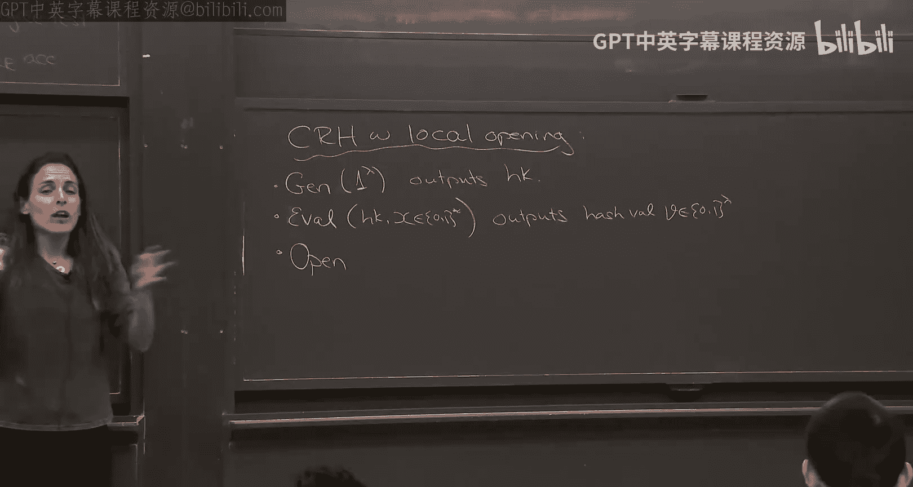

# 《密码学高级话题｜6.5630 Advanced Topics in Cryptography, Fall 2023》Claude-3.5-s p08 Lecture 5_ The Kilian-Micali Protocol, Part 1.zh_en -BV1MVa5zXEmy_p8-

So last week was a crypto day， so I didn't get to see you。

 so let's kind of do a quick kind of recap of where we were and where we're heading to。

 So last time I saw you at least in this room was two weeks ago where we talked about how to use the GCR protocol to construct what's called a PCP。

 a probabilically checkable proof and what's a publicly checkable proof。

 The idea is you take a proof， so take any NP language。

 let's say that has a proof like let's say threeat。

 you take a witness or a proof so a satisfying assignment。And you have to make it longer。 Okay。

 so you don't shrink it。 You actually extend it。 It's bigger。 but now to verify it。

 you don't need to read the entire a proof。What you need to do is just read a few locations in this proof。

 So you can even though the proof is actually became longer。

 you can verify it much more efficiently by reading just a few locations。

And we actually showed how to construct it。 How you get a PCP。 And the idea of how how to get a PCP。

 The idea was， well， let's look at the GCR protocol for three sets。 let's do a PCP for NP。

 Okay so any NP you can convert to a three set， you know three set is N complete。

 So convert whatever you want to prove into a threeet formula。 Now you have a witness Now。

 what do you do you want to generate a PCP。 What you do is you pretend you're a GKR prover。

That has this witnessed， the satisfying assignment。

And want to convince the verifier that this is a valid witness。 So what do I run the G KR protocol。

 What I mean is。Let's look at the so given fee， let's say a three sad instance。What you do。

 you look at the circuit。C sub fee that takes as input， a satisfying assignment。

 an assignment and outputs， you know zero1， whether it's satisfying or not。

 This is a very low depth circuit。 It's just as kind of a bunch of checks and add local checks and and add them all together。

😊，And now what we do is how do you generate the PCP， given this witness， given this witness for fee。

 what you do is you run in your head， the GKR protocol for the circuit。

 So remember the GKR protocol is a protocol that proves that a lowd circuit that that an input is you know that a given input。

 even though it's weird， the ver doesn't know the input。

 so it's kind of weird to think of GCR in this context， GKR。

 the context of GKR was theres an input everybody knows the input that proven the verifier。

 but the circuit is large。And。😊，Prover wants to convince the verifier that the output is something。

Here it's kind of weird。 The input is more or less as large as the circuit okay because the checking for witness at Sa F time is valid for 3 CNF。

 not the3 CNF is the circuit here is almost the same sizes as the witness。

 and so it seems like why using GCR here is very weird。 it doesn't seem like the right application。

 and in particular， the verifier doesn't even have the input。

 So how can you use GPR that seems very unintu counterintuititive。So that is， no。

that he does have the witness。 And why do you even pretend。 Oh， We'll give it to him。 So in the PCP。

 we'll write the witness。 Not only we write the witness。

 we're gonna actually write the low degree extension of the witness in the PCP。 Okay。

 so what is your big proof。 It first contained the low degree extension of the witness sitting there。

And then now for each， now think of the GCR protocol。

For each and every kind of question of the verifier， the proveer has an answer。

Write it down in the PCP。 So in the PCP right if the first message of the verifier， you know。

 the first message is a bunch of like well， the first the approver goes first。

 So you send your univari polynomial， then the verifier sends a field element。 Now I say。

 well the field element was one。 Here's my answer for the field element was two。

 Here's my answer for each and every possible field only you say the answer。

Okay， now there's only polylo number field element not so bad。Okay， then you give him the answer now。

For the prove is another field element。Now， is it foreign。Possible next message。

 Here's my answer and so on。 So essentially， you kind of open up this gigkic gigantic tree。Now。

 first， you see why， this is huge。 like it's like exponential。 But actually。

 G care has a very nice property。That the provers messages actually only depend on the last。

Very few messages of the verifier。 So if you remember the G cart。

 it's a bunch of some checks protocol。It's like just a sequence of some check。

 and the prover's message depend only on the messages in the last subject check。

So it's kind of very few and kind of where you start with。 it's very few messages。

 So to be a little more precise， each prover in JCR， each prover message。

Depends on the last kind of what it is， it was log n over log log n。Messages。From V。

 from the verifier。Well， this is like the number of variables。 If you remember when you did you care。

 it was a bunch of a bunch of sum checks and each sum check was over M or 3M variables。 this is M。😊。

And the field is polylogin。And heres the size of the circuit。

 So think of the size of the of the witness， the size of the3 CF， it's all up to polynomial factors。

 It doesn't matter。And so now， okay， you depend。 you need to depend on all these messages from the verifier。

 but there's only that many in each time。 if you look this to the power of this is only polyly that's how that's exactly how we chose H andN or O B polyly。

 That's when we chose these weird setting parameters and not just2 and end login。

 But the point is because GCR has this kind of memoryless property of the prover。

 you can expand all the GCR into a big proof of size polyn。Now， what does the verifier do。

 The verifier simply So that's what the PCP is。 The PCP， you write for every possible。Kind of。

 you know， you got write all the possible answers of the provers and the logic extension of your witness。

That's what the PCP is。How do you verify this PCP， Well， you pretend you're Gcar verifier， You say。

 okay， let me see your first question。 Thank you。 Now saying I'm going to choose the random field element。

 and I'm going to look at the answer onto to this field element。

And then I'm going to choose my next random field element。

 and you just kind of go through this kind of tree and randomly and make sure and at the end。

 you need to verify if you remember GR at the end，😊，You need to verify to verify。

 you need to check your input and a random point in the load grip extension。 This is how Gca works。

 Well， you have the load extension sitting there。As part of your PCP， so you check that。Okay。

 that's basically it， except there's one component that we're missing and that's going to appear in your PSAT。

 which by the way， is going to be out this weekend。Okay。

 so this weekend the piece is going to be out。😊，Originally， the due date was after Thanksgiving。

 I'll move it to before just to give you an incentive to not take it with you on your break。

 If anybody needs an extension， just let me know， okay。So you'll have almost a month。 No。

 not quite but close。 Okay， but if you need an extension， just let me know。 this is very arbitrary。

ok 嗯。😊，Okay， so so。What's the problem， The problem is， so if indeed that。So what about soundless。

 Okay， soundless seems like it should fall from just GkR。 Okay。

 you're interacting with like a prover， a GCR prover， and some should just fall from the GCR。

Except that there's one point here， which is what if the PCP prover doesn't give you a low degree extension of some input。

 So if he gave you a low degree extension of an input and this input。Did not evaluate to one。

 namely if he's not satisfying assignment， then this input is not validness because one does not exist。

In that case， of course， the sounds would really fall from Jak sounds。However。

 one needs to think there may be a malicious provever who doesn't give you here a low degree extension of some double。

So what he should give you， a lot of the extension of W。

 it means like some W goes from F to the M to F。And it's a degree H minus-1 in each variable。

OkayIf it's a degree H11 in each variable， then it it extend。

 It's a little extension of kind of the W sitting in kind of in。

 So then W is just W sitting on H to the M。 That's kind of the little cube or W sitting。If indeed。

 he gave you a load degree extension of some W。😮，Then you're good。

 If this w that he gives you is if degree H -1 in each variable， then you're good。

 But what if it's high degree。What if thisWhat if he gives you some W star。

 which is very high degree？😡，Then is it sound？So in the homework， you'll have exactly this。 Actually。

 it's not sound and you'll ask to find actually an attack。And then there's a way to make sure。

 So now what the verify needs to do in addition is to do what is called a low degree test。

 It's a test that verifies。That this W star has low degree。Okay。

 so this is what the homework assignment or one part of the homework assignment is about。Okay。

 but this is module making sure that this is actually the verifier can't make sure it's low degree。

 but it can make sure it's close to low degree。 So it agrees with some low degree W like on1 minus epson fraction of the points。

 So you can test that it's very close to low degree。 if it's very close to low degree。

 then most likely wherever you'll ask because you ask randomly。

 it agrees with kind of the low degree。 And therefore， that's kind of the idea。😊，Okay， but。

 but but this is the PCB， and the verification just adds a load degree test and we'll expand And then the Pet。

Okay， so that's kind of what we did most of the class。 And then we talked it， then we talked about。

 okay， so now we have gigantic PCP。 It's very large。

 but you can verify it by looking at very few locations， which is nice。 How many locations like the。

😊，Communication complexity of the GKR， which and circuits of。depth log n。

 which or order log n which is， for example， threeS， then the communication complexity is polylog n。

 so you can verify this by reading only polylog n locations as opposed to end locations。

 So it's like an exponential improvement。But again， you have this gigantic PCP。😊。

And now the question is okay， but who's going to note。

 here's something to just make sure you understand。It's very important that this PCP。

Is kind of given to the verifier。Before if the verify So okay， the PCP is very large now one can say。

 okay， you know， don't send the PCP， I'll tell you what my queries are。

 just give me the answers to my queries instead of sending me I'm anyway。

 I don't I'm not going to read them。 So why send it over。 Just send me the answers to my queries。

 That will not be sound。😡，If the verifier， if the prover gets to choose the answers based on all the queries that he sees。

 some breaks down completely。And so it's very important that he first tells you what the PCP is。

And then you query it。Okay， in particular， what the damaging， the heart。

 the way the cheating proveover can cheat is by。You know， when you tell them。

 give me the PCP and location I。😡，If you ask for it together with location J。

 it will give you one answer， but if you ask it for a location J prime。

 he will give you another answer， that's how you can cheat。

 but if you need to fix it ahead of time to know it's one answer doesn't matter the other locations。

 you ask and that's what makes this sound。Okay， you can actually go back to GCR and see if you use this basically GKR where you give the queries ahead of time。

 It's like you give the sumump queries all ahead of time。 everything breaks down completely。Okay。

 so it's very important that you first committed to this entire PCP。 And then one can ask， well。

 if you give this how does the So the entire thing says， look， the verifier is a weak device。

 That's the idea。 He's weak kicking out of the computation。How can I store this gigantic PCP？

So it seems like that's very nice。 But how do we use this thing。And the way we use this thing。

 the way it's used today， these things are used today。

 And the way they're used is using cryptography。 So what we do。

 we use cryptography to take this gigantic proof and squish it。😊。

And this is used using what's called collisiongen resistant hash functions。

So this is what we're going to kind of we're going to talk about today we started last time。

 but we're going to continue today， but before we go into how we squish it and make kind of everything succinct。

 let me first once we use cryptography， we can no longer get soundness against any allbounded kind of cheating prover because cryptography can be broken by all powerful。

Adversaries， cryptography assumes the adversary is not strong enough to break our assumptions。

 For example， the collisions and hash function that we saw and well review it in a second。

So now when we talk about proof systems， we need to relax the notion of what we mean by a proof system。

By the way， who's describingibing today。 Okay， great。

 We need to relax the notion of what we mean by a proof system to what's called a computationally soundproof system。

 namely， you cannot cheat。😊，Assuming your polynomial banded。

 if you're all powerful can break my crypto， No guarantees。

 But as long as you cannot break my crypto， you cannot cheat。 So I just wrote it here。

 This is copied from last time。 So what is in self interactive proof。

 we call it an interactive argument。 And we say that in interactive argument for some language L。

 think of it， let's say NP language， but whatever language you want to think about。

Is a protocol between a proven of air fire。 The completeness is the usual。

 namely effectses in the language。 then you'll convince the ver is probability 1。 okay。

 and if it's an NP and you know， witness， you're also efficient the soundness。

 that's where the changes。 instead of sounds， you get some computational version of soundness。

 in the computational version of sounds as the following。😊，It says。There's some parameter。

 security parameter。 when talk in cryptography， there's always security parameter。

 which kind of says。How much time do we believe real world adversaries can run in？Okay。

 so what the soundist says that any real world， real world cheating prover。

 real world runs in time polynomial in the security parameter。

 we're going to denote security parameter by lambda throughout this class。

 sometimes they call it by n， but n and sometimes K here n is going to be input size。

 So I don't want to So we're just going to use Lambda。😊。

So for any P star of size polynomial in the security parameter。

He can win almost negligible probability。 Na there exists a neglig function。 mu。 again。

 negligible means it's smaller than any inverse polynomial。Such that。

 no matter which security parameter you use and any x， so think about the P star。

 he's poly in the security parameter， he chooses an X addressarialally。😊。

The probability or an x is chosen。 it exists for any X。

 the probability that he convinces now the protocol depends on the security parameter。

 so the verifier may choose like a hash function according to the security parameter。

 so everybody knows the security parameter。 run everyone run the time polynomial in security parameter and that's why we give it as input the security parameter in unary。

 So an input x in and security parameter。 there's a protocol。

 and the probability that this cheating prover convinces the verifier to accept is this negligible function mu。

Okay， so again， we offer soundness only for poly Lada cheating provers。 Okay。

 so now you should think of the cheating provers as like a family of provers， one for every lambda。

 Okay， it's like for any security parameter you're allowed to give a cheating prover。

 but they're all， let's say run in time at most Lada to the end to the 10。Okay。

 so polynomial and lambda。Any questions about the review before we go on to the new to today？呀。

here is a proof not you like。は書いてくて。No， no， no， no， good， good， good。 So two things。 First of all。

 we're not at all talking about hiding。Okay， if the， if， if we didn't want succinctness。

 you can take the approval。 just give you the witness。 Here you go。 Check on your own。Okay， and then。

 but we well want， we want another property from these interactive arguments。

 which is succinctness or， or yeah， succctness or， you know， yeah， exactly for for NP， for example。

And yeah， three that formula。 Yeah， exactly three set is just think of it。 it's。

 it's exactly just three c NFs。 You know， it's a and of a bunch of litter of a bunch of clauses。

 Each one is like X I 1 or X I 2 or not X I 3。😊，Yeah so any3 CNF。

 any3 cF is of the form like clause1 and clause 2 and clause N， let's say。

You can get a balloonolean formula with fanin2 of size order login。😡。

Because you just do kind of the and and。You know， all the ands。

 and then you have these little literals at the bottom， and each one is constant size。

 It just depends。 Each clause is constant size。So it's really a log。M circuit。Okay。

 so you can take any three set， which is just an end of a bunch of literals and write it as a log depth circuit。

So you。Go directly to。somej can do the p标嘅 subject。

By doing the amtization instead of going through the key。Okay， to， to do to get a PCP。

 I need to go the way I constructed PCP is by going through G careR。

 I do a G KR on this kind of circuit。 I open up all the possible proof。Prover messages。

 And that what constitutes the PCP。 In addition to the low degree extension of the input。

 That's going be the PCP。And the verifier just kind of verifies。

 behaves like the GCR verifier and checks that the witness he gets the the extended witness is a low degree。

Like， it does a low degree test with the low degree test we didn't talk about but it's going to be in the homework。

So that's how the PCP works。 And now I'm kind of talking about how you use this long PCP together with cryptography to get these succinct arguments。

 That's kind of the next step。 How to use cryptography to just have like a fully succinct protocol。

 Let's say for NP， we want a protocol that has polyl communication because you have an instance of length N。

And the prover wants to prove to the verifier that X is language。

 and you want the communication to be only polyloggan， for example。Okay。Okay， one thing I do。 Oh。

 did you have a question。It ceter just just like a good。Like that。

 she feel like is a interactive protocol code necessary because in like the traditional like the complexity issue。

TheW has to be written down in advance， and not be。

And it can all be adapted so it's the whole point of the promo trying to like fix some polyous sense。

Exactly exactly， that's exactly it， that's exactly。Exactly， one thing I do want to say。

 note that I ask for the cheating coverover to be polynomial in Lambda。Okay。

 because usually that's what my assumptions usually look like。

 I want to say if I use collision system I want to say， well。

 I use some collision resistance function with the parameter Lada says that my assumption is that a poly lambda science circuit cannot find collisions my cryptographic assumption usually assumes that theyre hard to break against provers against adversaries。

 the run time poly lambda。But this is maybe may seem very weird and very weak， why， because。

 you know， our goal is to come up with succinct arguments， okay， succinct in particular。

 one example to think of to keep in mind is let's say the input input n can be really huge。

 but I want the communication complexity polylogin。 So think of a labda as being like polylogin。Okay。

 everything is going to grow with with the security parameter。

 But let's take the security member to be polyly login。Now， it seems weird you're like， wait， really。

 so the cheating proof， if the instance is the length n。

And the security parameters of the link polylyloin。

 the cheatning proveer were not even giving him the opportunity to read。They input。

So it's a very weak guarantee。 So what does this guarantee tells you。

 Let's say I want you to prove to me that a given X is in the language。

And my only guarantees if you run in time， that's only polyloariththmic in and you can't cheat。Okay。

 what if you run in time in。You know？So that seems like a problem。

Especially look if n is too big for anyone to read， then in some sense。

 why like nobody' is going to use it anyway。And if N is were able to read it， if I'm able to read it。

 then you have the time to run in that time。 So you run in time N。

 I'm not going to assume you run in time polylo N。 So this seems very weird。Okay。

 you should not be happy at this point。 You be。 Something is going on。 I don't like this definition。

 It's meaningless。Like this if you， look， if you don't want succness。

 you can make lambda beside size of N， and then you're happy。

If lambda is of size x like the instant size， then you can say， yeah， the instant size is some N。

 I allow my real my honest prover runs in time Polen。

 I allow my malicious prove to run in time Pollyen， and that makes sense to me。But now saying， no。

 honest， before he can actually run and time in， the militiaious cannot like， no。

 the militiaious usually has more power than the honest。So it's a very。

 it's really a week guarantee that kind of。You know， especially if we want to take the security。

 the idea is we're going to take the security number really small。Okay， really， really small。

 But if we take the security but we're so small， we should give the adversary more power than Pauline the security parameter because it just doesn't meet real life。

 What the idea the idea of this is to kind of capture real life setting。

 not to make a model that makes no sense。So if we take lambda to be very， very small。

Then the actually real world adversary can run in time more than poly La。

 They they can run time polyan。So it doesn't capture。Yeah， if peace are in the circuit。

 How do we even think of playing in。They can't even readx， you're right。Yeah， yeah， for example。

 it So you can say your P star can't readx。 You're right， They can't read X。 They， it's a circuit。

 and yeah， it can't readx。😊，This is a big problem。 Okay。

 so the way I define it is really doesn't make much sense。Yeah。

 just to make sure why did we need lambdas poly N。 Is it so that the resulting interaction is su exactly。

 so great question。 The question is， why do we need it to be polylylo N， You know， let's。

 so what I think where maybe you're going to。 So you know what， let's make lambmbda end the epsilon。

😊，For content Epson， enter the 0。001。Then the communication complex， then we say， look。

 the original proof grows with lambmbda， which is entered the to the power of 0。001。

 which is much smaller than N so we're still happy， but the cheating prover can run time any poly。

Any polynomial in， so it's polyen。So that's good。 You're right。 And that's。

 that's a good setting to think about。 In that case， there is no issues。

 So one thing which you're saying is you think let me fix all your problems。 Just take lambda to B。

 Think of it as n to the 0。01 and you're done or n to epsilon。 and you're done。😊。

Okay， if you think about antids on， everything kind of makes sense。

 You allow the cheating prover to run in time poly N。 The instance is N， and we're good。Okay。

 so that's one way to think about it。 So usually the way we think about it， we say for any N。

 we choose a security parameter that depends on N。Okay， that's usually how we say how we do it。 We。

 we have an N。 And now we say， okay， which security program do we use？ It's kind of a function of N。

So that's one example。 Choose that degree remember。 and then you solved all the problems。

 But what if I want more succintness than that， Maybe n to the 0。01 is none。 It's okay。

 but I want better。 I want polylogin。So what if my lambmbda， that's one option。

 but another option is polyly Logan， that's even more succinct。So that's what I want。 Now。

 I're saying， well， that's what you want。You get a definition that makes no sense。 And you write。

But then what I can do is strengthen the definition。So how do I strengthen the definition。

 I'm going to say， you know what。Poly is one option。But let me make， let me actually make my assume。

 make a stronger cryptographic assumption。 I'm going to assume sometimes I'm going to say for any adversary that runs that for any P star that。

😊，And that executes a circuit not of size poly Lada， but of size2 to the lambda to the epsilon。

I'm going to allow my adverary return and time 2 to the lambmbda to the epsilon， more than poly。Now。

 it's a stronger assumption。

Okay， so now I want to say an adverary the runs in time 2 or of size 2 to the lambda of the epsilon cannot break my。

 my， my hash function。 He cannot find collisions。 It's a stronger assumption。

But now this makes sense。So I can take Lambda very， very small。

 but I'm saying even if the adversary runs in time， that's much bigger than Lada。

 That's actually two to the lambda to the epsilon。 even he cannot break。😊，My cryrypto。

 and that's why when we talk about succinct proofs。Most often， we talk about this kind of assumption。

 like subex assumptions come up a lot。K will'll see that actually。But often when。

 if we want to implement。 So when， if we want to implement。If we want to take Lambda to be polylog N。

 it makes sense to require for the sound is to be to make sense。

 to correspond to real world applications， it makes sense to require subex assumptions of our underlying cryptography。

Okay so just to kind of close this parenthesis， one can talk about polys cheating provers。

 it will give you a more standard assumption， but the soundless guarantee you get may not be strong enough depending on how security parameter relates to the input size。

 if you want lambda to be very， very the security parameter to be very。

 very small and yet you want to offer security against advers run time poly N。

 then you will need to make your assumption stronger。Okay， but。

 but but given this is kind of end a design choice。 Okay， for now， we're just going think of。

 you know， for any given P star of size poly Lada or more。 I don't know whatever we choose here。

 that corresponds to the assumption。 Okay， so if we have a T secure assumption， then for any T size。

So in general， more generally， you can think of replace this by T of Lada。NET can be poly。

 it can be sub exponential， it can be whatever。Okay， and then we choose the T。

 and now the T kind of governs the application， but also have a T。

 Now we can just prove it using math。 We don't need to think about it anymore。Okay。

 so that's kind of a。The how lambda relates to N。 Okay。

 and how the strength of the assumption relates to N。Okay， any questions about that。Okay。

 so now let's go ahead with how we use。 So that's what we want。 I want to come up with a succinct。

 interactive argument for all of NP。Okay， I want to show how I can take any NP language。

 Let's think of three set。 Why not， It's complete。I want to prove to you that 3CF formula。😮。

Is satisfiable。 I have a witness of Linked N。I want to prove to you。😮，That it' satisfiable。

 but for the communication I wanted to grow only with Lada。Okay， Lambda can be polyloggan。

 I don't even want dont don't go out to the choice how we chose the Lambda。

 But now I have a security parameter Lambda。 I want the communication to only go with the security parameter。

Not within。Okay， so how do I do it？So the idea is， well， I'll use my PCP。😊，I have my PCP。

I'm going to use crypto to。Squeeze it。How do I use crypt to squeeze it。

 Exly what collision resistant hash functions do。 They take a big thing。And they squish。The down。

 So now I'll take， I'll take my PCP。 The proveer will take his PCP。

 He will squish it down using a col resistant hash function。Okay， so he gives the fair。 Here you go。

 Here's like a squished， like a digest。 you know， of this PCP。Okay， the verify takes this thing。

 It has no meaning。 So what does he do， Now I proof。 Okay， I thank you very much。

 But I want to see the PCP in a few locations， so。😊，Now， what can the prover do？The people can't。

 Okay， so collisions isn't hash function as as is are it's a way to kind of。

Compress in a way that you can't you're kind of committed because you can't find collisions later。

 so you can't open you can after you gave the hash value， you can't open to x and X prime。

 you can't give x and X prime that both hash to the same value。But I don't want you to give me。

 you can't give me now you're hashing an entire PCP， The PCP is big。You can't just。

 I never want you to give me me the verifier， never want to receive this PCP， I can't even hold it。😡。

I want to receive a few bits of the input。So what we need is a collis in hash that has a special property that you can open bit by bit。

 So instead of giving me the entire kind of input， the entire pre imageage of the hash value。

 I want you just to give me a few bits here or a few bits here and a few bits here and prove to me that the correspondum。

To the input you hashed。So I'm now going to define this primitive。 once I have this。

 we're gonna to see it's can be very easy to come up with the actual interactive argument。 Okay。

 so the primitive is a what's called a collision resistant hash with local opening。 Let me define it。

 So we're gonna have a collision resistant hash function with local opening。😊。

And this consists of five algorithms。 The first one is the first two are gen and Dval。

 These are exactly these two algorithms is， is what defines closures in hash function。

 So this we saw last time。 I'll just repeat， just to recall， Gen takes his input a one to the lambda。

 the security parameter and outputs。😊，Haashki。So this is some key。

Eval takes his input hash key and any input X from 01 star anything。😊，Okay， any string of any length？

Andd it outputs。A hash value。Well denoted V， and that's fixed in 01 to the lambda。

 I call sometimes Dl and sometimes lambda， right， Sorry， it's lambda。

You output a hash of a fixed size， which means you can take very。

 very long things and you digest down， you digest them down to a value of size lambda。 Okay。

 so it takes an input。Arbitatory size can be huge， can be2 lambda，4 lambda to huge。

 and it dies down to a string of size of the length lambda。Okay， now there's two more algorithms。

2 or3。 Okay， so now there's an algorithm called open。Open。

 I just want to make sure I want to tell me， don't give me the entire。 I want to， I want to。

 So V just digest me has no meaning。 I want to tell you now I want the I bit of X。

 Don't give me all of X where you hash。 I can't hold it。 I just want the e bit。

So open， so what do you do， you open， How do you open， you have the hash key， you have X。

Which you computed the value V。 And now you have some I in。Kind of 01 to the length of x。

So this is kind of which index I want you to open。And what you output。Is。A bit B。

 which is kind of correspond to X I， the I bit， a bit。And an opening value row。

 this is some kind of string and thisits of size。😊，Lambda， so small。Or it can be polyi Lada。Okay。

 an opening of size poly Lada。 Yes， who's running the open， Good， Who's running the open， Good。

 The person who generated the hash。 So let's say you're the prover。

 Do you want to prove to me that fee satisfiable。 You generate a PCP。

 I don't want your PCP It's too big。 You give me a hash。 A value V。 Thank you very much。 Now。

 I want you to open the PCP and some location I。 So I tell you， here's I。😊，I don't know your PCP。

 I't know your input。You give me some row I like an open give me X I。 If you only give me X I。

 you can jep， you can give me whatever you want。 I don't believe you。

 So I want you to give me kind of row I。 This opening is like a proof。That indeed。

 what what I hash down in the I location is sitting X I。 This is what you think of raw eye。

 It's like a proof， yeah。Should I be in。即话佢话。Oh， sorry， sorry， sorry， sorry， thank you。sorry。

It's an index，9 in 0，1。 Sorry， it's in， it's， it's an index with one until the length of x 1 to n。

 Let's see。 Yeah， thank you very much。Questions， yeah。这 just like。I guess it's just interesting that。

Retain the entire。Howash value X。Like maybe that's necessary for correctness to be able to。

Confi any bit of X but I don't know， it just seems interesting that in practice you would have to store keep storing all these hash values Right。

 so what you wait， let me make sure what your comment is note that to open。

 you need to know the entire X。And why do you need to know the entire X in a sense to open to bit eye。

 So in some sense， look。I mean， to open to bit I， all you need to remember is row I。

 That's kind of what you need to give for the opening。

 but all the row eyes together give contain all the X。

 So that's why you need to kind of store all the X。 and you'll see the construction soon。

 So it'll be kind of clear。 Okay， the last algorithm is what we call ver verify。😊。

And verify takes his input， a hash key。😊，A a hash。 So now I'm verify you gave me X I and R I。

 How do I know it's good， So I take my hash key， the hash key， the value that you gave me。I， X。

 I and row I。 And this algorithm outputs。0 or one， namely acceptor reject。Okay。

 so I can kind of verify whether the row is a valid opening。Okay。

 and now what are the guarantees so you can hash， and then you can open like a。What is the guarantee。

 the guarantee is， first of all， if you do everything honestly， I'll accept you。Okay。

 so there's two guarantees。The first guarantee is just correctness。

And the second guarantee we want this collision resistant。 So we'll see。 So for correctness。

Before actually， let me just a。So， let me just say these are all。P，PT algorithms。 Okay。

 all of them are polynomial time。 Actually， the only everything is these are。

 I should say these are polynoial time polytime algorithm。 and this is P， PT。

So this is a randomized algorithm poly time so it runs in time poly Lada generates a has key。

 these are all deterministic algorithms okay they run in poly times so Evaltics is inputpoex he runs in time x of course。

 open random in time x but verify runs in time poly lambda y because hashk is of size poly lambda。

 this is of size lambda because I required it and X is a bit and this is a size poly lambda because I required it。

😊，So the ver the verifier runs in time poly lambda。 Okay， so when you send me a hash value。

 I get a value size Lambda。 when I want you to open to a certain bit。

 I can check it in time poly lambda In of N。 I mean， lambda if may depend on n bit。

 It doesn't grow then。 Yes， be Why is Gen E values not These are polynomial time。

 Why is it not allowed。 It doesn't need to be。It just doesn't need to be probabilistic。

 I'm not I'm not inherently opposed to using randomness in algorithms。

 but it just doesn't need to be， whereas Jen has to be probabilistic。 Okay great。 Thanks。

 Good question， okay。So the correctness guarantee just says that， let's see， for every lambmbda。😊。

Every hash key generated， like in the。Image。Of Jen。And every x， okay， not every x。

 We get completeness up to x in 0，1 to the 2 to the lambda。 Okay， so it or。I should say sorryif。

 small or equal to 2 to the lambda。So let's think of the security parameter。

 It says at least a size log log n N is the size of x。 Okay。

 we never take security parameter to be smaller than log n。Okay， and， and so that's why。

 like we always assume that the size of x is at most two to the security parameter。

 The number of bits in x。Okay， so for every x， what we we want that， that probability that verify。

 Oh， I forgot to say， for every I。The probability that verify an H K。1van。HK of X。This is V。

What else do I have， I。Exi。And Roey， which is open。This is kind of the row。It outputs one。

With for one。So， if you are honest。You take some input X， any hash key， and you。

Give me a hash value and then you open it， I'll accept you。😡，Okay。

 if everyone's doing what they're supposed to do for any X and for any has key we'll get output one。

 by the way， sometimes。One can define also with high probability over randomly choosing a hash key。

But our constructions work often in the worst case。

 But work can also a weaker definition is for kind of hash key randomly generated。

And here you have one minus negligible where the probabilities over over the hashki here actually sorry here there was no。

 okay before there were no probabilities because I just chose for every。

 but one can think of a hashki randomly generated and you can have a negligible probability of error。

 we won't need that because this I mean some schemes， but many schemes are just probably one yeah。

We mean that correct always holds for any hashing， that's obviously。Right yeah， yeah。

 I didn't go to soundless yet。 Yeah， yeah， yeah， yeah， yeah。 We'll see soundless for in a minute。

 But correctness we can get for every hash key。 But there one can。

Construction that actually is even quite with high probability。 but。

 but often we think of it a correctness one， yes。For green， you have that distribution of eggs。Again。

 why for great year， you have that restriction on the net X。 Okay。

 the lens should be this and to right。 Yeah， yeah， yeah。 you're asking why。

Because our constructions often we'll see a construction， and we'll see that if the length is two is。

It okay， the reason is our constructions grow with logg。X。That's the truth。 It just grows with log X。

 And we want the output to be lambda。So the fact of the matter is the way we construct these schemes our construction。

 the hash value grows with log X。But we don't want to kind of say it。

 We want to just say lambmbda because it's nicer。 So we just make sure Lada is at least logx and then we're okay。

😊，Okay， great question。Okay， any other questions forgo to sounds？😊，Okay， so soundness。

 that's the more interesting one。Soundless says intuitively that for any bounded Pollada or T bounded。

 if are some you have some the soundness is like you can call it T soundunness。Okay， and。

 you can do polysness， you can give it two to the lambda to the epson soundness。😊。

But there's some T salmons， and it says。Any adversary that runs in time upside the most G。

The probability that it can find a value。And an index， a half value and an index。

 so that in that index he can successfully open to both zero and one is negligible。Okay。

 so what essentially means one， once the adversary gave you a hash value。For any index。

 he cannot generate a valid opening both for0 and for one。 It's impossible for him。Okay。

 so let me write it formally。 So for any。Polly tea。Again， give T like linear。 So poly Lambda。

 poly T size。Adversary。The probability。And the probil is over Hashky。 He gets a random hashki。

Choses by gen， chosen by gen。Can you get a random hashky chosen by Jen？This adversary。

 given the hash key。He tries to open some index in two different ways。 So he。

 his goal is to give you a hash value V， an index I。And the valid opening row0 that opens to zero。

And a valid opening row 1 that opens to one。That's what he outputs。 So the adversary outputs。

 He gets a hash key， He outputs a hash value an index and two opening for that index。

 That's what he's trying to do。 One corresponding to 0，1 corresponding to one。

And the probability that both of them are valid opening， the probability that for every be。😡，In 0，1。

Verifier， Verifier agrees。 So verify given hash key V I and。A0 B and Rob B。Outputs  one。

This is negligible。Okay， so again， what soundness is like collision resistance in this setting。

 So this is kind of us another way to usually people call this property。Collliion resistance。

And the collision is property says that once the diversity chose a hash value。

The probability that for any index。Okay， he chooses for any index I。The probability can open。

In a way that verifies in an accepting way to both zero and one。 so any for every B。

 row b is a value opening， row zero is value over 0 and row 1 is valid opening for one。

 that happens with next probability。😡，Okay， so for every row there exists。那个举吧。Such that。Okay。

 so this is the collision resistant property。不。Any questions about the property？Okay。

 so now I have two things I want to do。The first thing， oh sorry。

 I unordered two things I want to do。1。Is show you how you construct this thing。And two。

 show you how to use it。To construct an interactive argument。

Any preference on the order of what goes first？Who wants construction first？

Who wants interactive argument first？Okay， we'll do interactive interactive algorithm。

 and we do construction。 Thes not that if anybody wants to weigh in， say so， because。

It wasn't very significant the result， but。Okay， so in argument first。Yeah， okay。Okay， so here's the。

This is what's known as the Kian Mialli。Protocol。ok。Okay， so actually I want succinct。

Inactive arguments， Frank P。 Ca I'm going to show you how to construct a succinct interactive argument for any N P language。

Okay。So here is how I'm going to do it。The prover first。 So we have a prover and a verifier。

 And here's what they both share a witness X。The prover wants to put to the verifier that xes in the language。

 and he has some witness。Okay， you can think about it as a3CNF talked about this CF example complete Anyway。

 it can be nice to have like something concrete in mind。

 So you can think about X as being a 3CNF and W a satisfying assignment。😊，Okay。

 what does the prover do？The first thing， any guess what the poor first do， first does。Thank you。

Thank you。 Compute the PCP。 That's the first thing he does。 So he takes W。And convert it to a PCP。

Okay， if you want to have something concrete in mind， he does。 He opens up the GKR。

 adds a low degree extension of the witness。 That's a huge thing。 That's a PCP。He can't trip it over。

 That's too big。What does he want to do instead？Hash。ok。He needs a hashky。He's like， I want to hash。

Can anybody give me Ashki， right？ Oh， let me Sorry。

 because it's an argument I should say they also share security parameter。

So the first thing the verifier does is it says sure。😊，I'm going here's a hashki。

 I'm going to generate it。And here you go。Now， what does the prover do？sh， thank you very much。

 So I compute he sends over V。 we usually didn't okay， we send he sends V。😊，Which is I。Of Hashki。

And the PCP pi。Okay， so the verifier gets this V， this digest。It's a bunch of bits with no meaning。

 He wants to open this PCP， right， like he want， okay， so what does he do。

Well what is the verifier gets the V and doesn't understand anything。

What does he want from the prove？ What will he ask the prover。ます。Exactly。

 it selects randomly selects a bit and S open it。 which distribution。

 How will we choose which bits to open from this PCP。そ。like PCP asked to orac exactly what the。

 exactly what the piece as the PCP verifier。So what he does， he runs the VPCP。

And the PCP verifier tells him， oh， sure， ask， I want uptagonno some IL。So， okay。

 let me just mention。 sorry， I'm gonna construct an interactive argument front P from two ingredients。

 Yeah， one， I'm gonna use a PCP。 So we are right， we have a PCP in our head。 the G PCP。 Yeah。

 we have it。 And two， this collision resistant hash with local opening。

These are two ingredients that we're going to use in this construction。

And we're going to assume Rnda moon talked about PCP when we defined it。

 it was like before we went to kind of crypto land and we said there's two parameters CNS completes and soundness。

 we said there are PCP。😊，It comes with two parameters， completeness and soundness， CNS。

 and usually we think of this the completeness as one because all our PCP have actually completeness one。

 that's kind of it's easy to construct them with completeness one， sound is。😊，We pay for soundness。

 So the more queries you get， the better soundness you get。

 And here we're going to always assume that the sound is。Is negligible。Okay so we give enough。

 so for example， if we do one GKR， if you just run the GKR verifyF once。

 if you remember you kind of query one point in the log extension。

 but a field element in GKR is of size1 over polylog。

 so the soundless stillll get sorry the field size is polylo。

 so the soundless you'll get is one over polylo which is pretty not great。😊，I want negligible。

 So I need to repeat the G KR enough times， like log times so that it will be become negligible。

 I want my sound to become negligible。 The reason I want the service of the PCP to be negligible。

Is because when we defined attractive arguments， we wanted Thomasal to be negligible。Okay。

 these two will kind of the soundness I get from my interactive argument will kind of depend on the sound I'm gonna get from my PCP。

 So I'm gonna assume here that I have a PCP with knowledge soundness that I ask。

 So if I have the PCP with sound half。I'll just repeat it。 Polylo， like， I'll repeat it。 let's say。

 Lada times。And now my son becomes one over two the lambda。Okay。

 so I'm gonna always assume that it's negligible in， in Lambda。Okay， so I run the PCP verifier。 Yeah。

So C minus the or。What do you mean what is the previous version， previous version you。Okay。

 so when you okay， so you said， let's remember the PCP model where I had the PCP as an oracle and I queried it。

 that was very succinct。 But if I had an oracle in which world do I have an oracle where this oracle is a nice like who puts the PCP in the sky for me。

 Where's the sky， It's not sitting on a cloud。 You know it's like well cloud。

 I guess now has many meanings but you know， can be sitting actually in a cloud。

 but that's kind of the point we don't want anyone to store this PCP。

 we don't want to assume someone actually holds this thing。So in that model。

 where you assume you have an oracle， everything is successful。 Now。

 what I'm trying to do here is get rid of that assumption that I have an oracle。Great， yeah。

 What about even before the PCP， if you were to just do interactive JKR on this circuit。Okay。Good。

 good， great， great。 So the question is， look， just do an interactive gca in the circuit and and this ceA fee that's maybe here。

 oh no it vanished。 you can， but here's the problem。 You can do G careR。

 And essentially it's what we're doing the PCP in some sense。 But here's the issue。

 But you're saying GkR， you don't need to deal with with the hashing。 right。

 That's kind of your point。 Very， very good point。 However， in G careR。

 anybody see that's actually good， anybody see what's wrong。 So let me repeat your point。

 The point is fine， look。😊，G care is succinct。 Think of three set。 It's very low depth。

 It's succinct。 The communication is very succinct。Why are you now going to crypto and opening GKR。

 just to GCAR be done with it？😡，Why are we doing all of this？你的。Very good。 Why。

 Because GKR works if the verifier knows the witness。If the verify knows the input in GKR。

 when we talk to GR said， look， the verifier and prover both hold an input。

And the verifier wants to know the output of this circuit and the input that he has。And indeed。

 at the end， the verifier needs to check the final thing against his input。

 you know is in and going to get kind of a value and the load extension it he checks。 Oh， does this。

 is this consistent with the input I have in my hand。Now， he does have input。So what do you do？

So actually， let me tell you something。The way these things are actually implemented。

 it's a very interesting say because the way they're implemented is actually more along what you said。

 what they do is first， they commit to just the witness， You think。

 why are you committing with thatP， You have a witness commit to that。

Or commit to the low degree extension of the witness。And actually， in practice， that's what they do。

 They've only committed to the logic。 And then they apply this interactive GCR。

 or now they have even better protocols， I O P。 But that's for another time。😊，所先要。

Once you can commit the witness， and you do normal GPR。

 and then you can only need to open the bits and the witness that you like。Exactly。

 so what you can do， you can first the prover can tell the verifier。 Sorry。

 the verifier tells the prover。I know you plan that you have a satisfying assignment。

 Give me a load degree extension of your assignment。

 but hash it down because I don't want to hold this entire thing。 Now I have a hash。

 Now we're going to do Chicar。 Do Chicar Chicar。 then I need to check a random point in in a random point in the load degree extension。

 I'll ask the prover now open。 But now you're committed ahead of time。😊，And then you have to。

 to make sure it low degree。 You need to add a low degree test to it。 Yeah， exactly。

So many of the implementations， that's exactly how they work。And actually。

 a lot of the work currently in the last couple years is actually not so much an improving G that too。

 but a lot of the work is acting under the commitment。

 How do you construct this commitment that's kind of the most efficient and so on。😊，Oh。Okay， great。

 So yeah。Not give her。ですかそ。Exactly， exactlyly， we don't want to give the ver the witness because it's too large。

 don knowledge。 I don't care now about zero knowledge。 Usually when people implement this。

 they add zero knowledge on T kind of。 But for now， I don't care at all about hiding。

 I just want verification， like just to verify correctness。Yeah， no like all of the hidings。

 your knowledge is kind of orthogonal。Yeah， so the commitment that's given to the verify is only use for verification。

 It never actually open。 It's never open completely low。 Yeah， it's never good point。

 So where you're saying this。Cash。Will never be completely opened。 Okay。

 so the the prover computes this PCP。 He sends it over。 The PCP will never be opened in its entirety。

 It's too big or the witness of never going to be opened its entirety。 Instead。

 what happens is the ver generates PCP queries。And he sends the PCP ques I1 up to IL。

And what the prover does， he only opens the locations。Pi I1 up to pi I L。

 So it only gives him the PCP and these locations。And opening row I1 up to row I L。Yeah。

 this isn'table before they。Like everything in parallel sometimes it's not sound。

Can these be set at the same time or would they have to be set？okay， so。If you do a PCP。

Then they can be sent exactly at the same time because a PCP was committed to the PCP and we' done If you do GCR。

 you need to do everything sequentially。 Yeah， if you did。

 so if you did the version that was proposed here where you dont you don't do PCP at all。

 you have your witness and then you need to do GKR completely interactive。But if you have a PCP。

 then it's committed。 Now you don't have to do anything sequentially。 that's it。

 The guy is kind of stuck。 So you can do everything at the same time。So great。

 so you send all the queries， you get back the answers。😊，What does the verifier do。

 How does he decide if to accept or reject， What tests does the verifier do。呀。

How are those being correct。Fantastic， exactly。 What does he do。 He runs two things。

 He runs the PCP verifier with kind of I1， I L， pi I1 up to pi I L。😊。

With x also x comma and checks that it's1。And it also checks all the openings。

 so he checks that verifying。对 of。Hashke V。爱情。Hi， Ij。R I J。Equals one for every J。系系。

Pi I J is kind of oh。ShouldNo， because when you verify a PCP。Okay。

 the verifier never knows the entire pie。 He never reads the entire pie。But the ver， of course。

 he needs to know the instance。 like he needs。 You need to check it against the instance。

 So the proof is extincct， but the vers work。He has to read。What the claim is。

 so the verify will run in time linear next。That he needs to read what， what the claim is。

But the communication。Is very small。 So the communication is Haki， which is poly security parameter。

 V which is security parameter。😊，I went up to IL， which is going to be at most security parameter and the opening。

 which is security parameter。 So everything here only grows with the security parameter。Okay。

 polynomial is security parameter n with x。 So the security parameter is polylog。😊。

N and being the length of X， then you have communication poly log n。😊，To verify， well， okay。

 this verification has is a size poly log n like security parameter because the X doesn't come in。

 But， of course， the verify of the PCP， you need to read the input。

 You need to read what the claim you're verifying。So here you do run in time linear in these PCPs。

 usually the runtime of the ver is linear in the input length。And let me mention， actually。

 there's this notion which we won't go into this semester， but it's called PCP of proximity。

 where the verifier doesn't even need to read the input。 He just reads a little bit。But now。

 of course， he， if he only read a little bit， then how does he know that the input is correct。

 Maybe he didn't read one bit and that flips it from true to false。 You know。

 so the only guarantee he has that。If he's accepted。

 then this input is close to an input in the language。 That's why the proximity。

 So there is a notion where the verifier is actually sublinear x。He runs in time much less than X。

 but then the guarantee is weaker。 The sound guarantees weaker。

 The sound just says that if you accept， you cannot accept statements which are。

Far for being in the language， but you may be able， you may accept sentence。

 You may accept claims that are false but close to ones that are in the language。

 So it's a different。 It's proximity type。s is guarantee。But without。

 if you really want Thomas yes or no， you have to read input。There's nothing， you know。

 nothing you can do。Unless the input is kind of in an aircrafting code or you change something about the model。

 But otherwise， you have to read the input。Any， any questions about the construction。

 forget about soundness and so on。 just the like about the proof， just about the construction。Okay。

 so I just want to point one thing that。I said， let's send I1 up to IO。 Really。

 the way that PCP verifyifier works is he gets his input like let's say the security parameter just to know how many times to repeat the if the original PC。

😊，If the original PCP， let's say is of size has sound half。

 it needs to know how many times it needs to repeat it， so there's a security parameter。😊。

And some he also knows the input length like n in binary。 So this can be very efficient。And。😊。

He uses randomness。What my point is instead of sending I1 up to I L， instead。

He could have just had the randomness。O， could have send the randomness and tell the prove， okay。

 you see this randomness compute。😊，Run this yourself。Okay， why am I saying this？ It's like， okay。

 fine， Like， why is that interesting， The reason this is very interesting。Is because。And also here。

 by the way， here instead of the。This is a randomized algorithm。Actually， heres。

 here it's not important。 Let's just leave this as is。 I want to focus on this here。

 Why is this important。Because later， not today， but later in this class。

 we'll start actually next week。We'll see that。A we'll want to go after we'll prove this and we'll be very happy and we say。

 wow， we have a succinct argument and it's so succct you can have on security parameter， success。

 happiness， but then of course every time we have something we want some more and then we'll say。

 you know what， we don't want interaction。Why interaction。

 we want to go back to kind of actual proofs。So we want to eliminate interaction and what we'll see is a way to eliminate interaction from protocols where the verifier's messages are completely random。

Okay， and that's why I want， I want you to remember in your head that here。

 this message can be completely random。Okay， we can make all those also this random。

 but we don't need to because it's the first message。 It's kind of。

The first the first message is kind of special in that it's kind of the first one。

 So we don't need to kind of eliminate interaction form it。 It's kind of the first one。

 So that's fine。 The all the later messages the verifier will need to if they're really random。

 just random bits， then we can show how we can eliminate an interaction that we can actually get rid of the interaction。

 So I just want to point out this message can be is completely random。😊。

These iron tile are not random。 They're actually correlated， but you can just send the randomness。

 Yes， I guess this was an assignment but wise first message special you matching that body。

I don't know if there could exist in some particular。So， if you。

Like it feels like you should still be sampling the first hash。 Oh， you're definitely sampling it。

 No， no， you're going sample this hash key for sure。

 I'm just saying the hash key itself is not necessarily random bit depending on the hash。 some hash。

 some hash keys are random。 some hash keys are very have some structure depending on which hash function you use。

 you know， So some hash keys indeed， some hash keys are just random。

 And then this message is just random。Some hash keys are not random。

 I have like I don't LW structure。 what if so for those who know what LW is。

 but I have some special structure。 So now I'm saying。

 I guess all what I was saying is if the messages from the verifier to the pover were truly random。

We're gonna see we can eliminate interaction。 So I'm telling you， just notice it's completely random。

 And now you can say， wait， this is not necessarily random。I don't know how haski is distributed。

 depending then the construction。 Maybe it's not completely random。 They say， don't worry。

 this doesn't have to become。 It can be an arbitrary distribution。

 But I guess since is already random Good， good， good， good， good， good， good。 So you're saying， hey。

 send the coins here， too。 Why instead， do the same。 put here are。N32。You can， however。

 not all hash functions。 there may be hash functions that are secure if you only give the hash key。

But are not okay to give the randomness used to generate the haski。 Maybe with this randomness。

 you can break the collision resistance。So some， some hash functions are okay。 Some are not。

 like the hash function that we construct。 you'll see is fine。 Actually， it's randomness。

 but that's under specific assumption。 and some are not。 It's okay to give the randomness。😊。

I just want to point out that for later to eliminate interaction using what's called the Fmre paradigm。

 we'll talk about it next class。The first message actually doesn't need to be even random。

 It's only the later messages have to be random。 So I just want to emphasize， this is random。

There were other questions， yeah。give the theirifier like， what is the end。NN is the size of x。 Yeah。

 so sorry I said here yeah， N。Thank you。Is the length of X？Thanks。

ESo the PCP verify needs to know the length of the instance he is working with to know which queries task。

 Yeah， Tina。喺佢哋。明白。If okay， because yeah， good tool。

I just want to emphasize that to generate these queries。

 you don't need to run in time that depend that's polynomial and N。

 It's enough to run in time poly log n in order to generate the queries。 That's why I give it in。

 it doesn't matter so much because here anyway you need to run in time linear So you're like。

 why am I making this point。Yeah啊。It's not very important。

 Even though sometimes it is important when later you want to talk about proximity and stuff。

 then all of a sudden it becomes an issue。 So yeah， I just。

 this is just emphasize that the PCP verifier， at least when generating the queries doesn't run in time linear in N。

 you run in time， actually linear in security parameter and polylogin N。To generate the queries。Okay。

 questions。Okay， so let's go ahead and prove the we see。 change the order。

 So I just want to make sure I'm not skipping。Okay， yeah。 let's do it。 Okay， soundless。

 I completely let' let's analyze this。 So I want to prove that it's complete and sound。

 this protocol。Yeah， so fix an NP language， your favorite one， let's say three sec。And。

I want to argue that， you know， if the proveover is honest。

 he indeed has a satisfying assignment or a witness， the ver will accept him with probability1。

And if he's honest， he does everything like he should。 And， and， if， and the sound is。

 if he tries to cheat and gives me an X in the language， We're gonna catch him。

 He's gonna be accepted publicly negligible。Okay， so that's the goal。Any questions before we。No。

 okay， so let's do it。 So， okay， let's start with completeness because that's really easy。 The focus。

 Well， I can just say completeness is not， doesn't not worth writing because it's so trivial。

 So what do I want， What does completeness say， Louis says。

If the prove chooses X is in the language and he has a witness。

He's going to be accepted with probability1。 Why， why is it going to be accepted， Well。

 let's see what he does。 He chooses a PCP。The PCP， let they have completeness one。

 That's my assumption。 It's soundless negligible and completeness one。Okay。

 I assume that about my PCP。 Otherwise， the complete is like the completes of the PCP。

 So he chooses the PCP。He hashees it。Now he gets PCP queries from the verifier。He opens the PCP。

Now he's these are acceptable to probability1。😡，Now he generates also open。 These rows are from open。

 right， so I didn't maybe I should write。 I didn't write it。

 But row I J is by computing open and hash key pi I J。That's the。Yeah。

That's how it generates raw Ij and what do we know we know by completeness here or correctness。

You know， he's accepted probability one。So the probability that both the PCP is accepted。

 the PCP verifier accepts and the hash verifier accepts is one because both of them is one。

 I took perfect completeness for both of them。 So it's just， that's all we do。

So this is just pretty trivial。Yeah， questions。Are you guys okay moving to the soundness。

 that's kind of an interesting part， okay。So how about soundness？Okay， so what's the idea。

 The idea for soundness is the following。 I want to say。

So suppose there exists a cheating prover that chooses x not in the language。and manages to cheat。

 so let's suppose and let's try to break the collision resistance。Okay， so。Suppose。There exists。

Tea time， whatever。So， okay， we assume this is。With。T soundness。Our security。

 And I see collision resistance。That's my assumption。 Now。

 I want to argue if I assume that the collision resistant has is T secure。

 namely even someone in time poly T cannot cheat， then I want to argue， suppose there exists。A哦。

Sorry。We're gonna， okay。We're going to get back to this， okay， what exactly this is。

AndWe'll see that actually needs to be quite big， but we'll see that。 Supp there exists。A poly tea。

Cheetating prover P star。That cheats。Namely that。And there exists。Like， for every lambda。

Or there exists like a bunch of X lambda。Not in the language。And。

There exists a non negligible epsilon。Such that， the proveer succeeds with that probability。

The probability。That P starts talking to verifier and inputax。 The verifier accepts him。

Is at least epsilon So to that for every lambmbda。This is。Precise， this is exabamda。

And they get lambda。Okay， so suppose a cheating prover for any lambda， he chooses some ex sub lambda。

😮，And。Pace star， and V accepts him， even though it's not just not the language。ok。

One my only assumption is that x lambda。😮，Is smaller than two to the lambda。

 So I choose my security parameter so that the screenover is bigger than log。The the side of x。Okay。

Then。EActually， it's， it's， it's not even needed for， for sound。 This。

 this actually was needed for completeness。Because we only had completeness。For these x's。

 for some actually doesn't really matter。Okay， so let's see。 What do I want to do。

 I'm saying S give us a cheating prover。 And this cheating prover convinces。Okay， now what let's see。

 What did this cheating prover do， He committed to a P kind of send he hashed a PCP。 Now， he。

 I don't know it is a cheater， but he gave me a hash of something should be a PCP。

Then he opens the PCP。So what do I want to do， I want I'm gonna to find。

 I won't argue I can find a collision。 Why can I find a collision。 What is the idea。

 The idea is the following。I'm going to run this cheating prover。

I'm going to ask the student improveer， okay， here's a hashki， give me a V。Then。

I'm going to run him many， many， many times。 and many PCP verifiers。 I'm going to tell him， okay。

 you know what， Here's I want I out from the PCP ver。 Give me openings。Again， heres I went up to I L。

 give me opening again， give I'm going to kind of rewind him and try to give him。

Tons of kind of messages I want to eye out。 I'm going kind of rewind him。 Okay， so again。

 what do I want to do。Given a hash key， O， given a hash， I want to find collisions for this hash key。

 How do I find collisions for this hashky。I'm going to give this proveover the Hashki。

He gives me a value V。Then I'm going to tell the prover。I'm going to choose at random。 A random R。

 I'm going to tell him， open these locations。He opens。Good， now saying， okay， wait， wait。 Actually。

 let's rewind him。 Forget that he， I sent him these。 Let me give him R， R2， different R open。😊，Okay。

 and for forget R3， I'm going to run this step tons of times。Our1， R2， R3， R， a lot of them。

And I'm going to have a lot of openings from him。I'm going to run it so much that I'm just going to have candle opening Like I'm going to run in more than like poly 1 over Epsilon and more than poly like poly 1 over Epsilon and n。

 So the point is I'm going to run it much more than the number like the size of the PCP。

Times one over epsilon， But if to the some power to some to the third， whatever。

 we' give around a lot of time。 Now， what's the idea。That is the following。

If there are no collisions。 So if there， look， I'm going to run now， if at any point。

 every time that he gave me an opening that didn't work， it's 0， it like didn't work。 Okay。

 so I'm going to throw it out that。 Okay， look， there's he only succeeded in probability Epsilon。

 So all the time that he didn't succeed。 Okay， well， failure。 But one over epsilons the time。

 he succeeded。And in all these times in all these ofpson sorrypson the time he succeeded。

 and all these epsilon times， I got a lot of good openings。Now。

 let's look at all these openings that I got。Somewhere there's a collision。I could I found him。 I， I。

 I found a collision， so I'm happy。😊，If nowhere there's a collision then essentially I I。

 I found that PCP from him。 I completely constructed like maybe not the entire PCP， but a lot of it。

 And the rest， I'm going put zeros。 Im say， no， okay， these identically zeros。

But the argument is that if there were no collision， I got a PCP that's accepted with probability。

 at least。Pouline Epsilon， which is non negligible。So that's the high level idea。

 but let me say everything I said now slowly。Okay， so suppose I have a cheating prover。

That succeeds in convincing for X not in the language。I'm going to construct。

 I'm going to find a col to the hash function。 So we're going to construct。Adversary， a。That breaks。

The collision resistant。Or the closure isn in property。Okay。

 how do I break the collision recent property？ Here's the idea。So a， okay， so given。

So he's given a random hashke。And his goal is to find collisions。How does he find collisions。

 what does he do？He gives， so here's what a does first。Compute。V。Which is P star andhashki。

That's the first thing。 I got a V。Then I do the following。Many times。 So for I。

Goes from 1 to up to poly in n and1 over epsilon so many times。What I do is I run。

Like what piece star？Given H K， and he gave V would run un。Input R I， R I corresponding to。Okay。

 let me call this J。J， corresponding to。A kind of。I1 up to I L。I just didn't want to confuse this。

 eye with these eyes。Okay， so I'm gonna run many times。 I'm going to choose many Rs。 Oh。

 I didn't say sorry， choose。Sorry， for I goes to one， choose。A random RJ。 So for J。

 go from1 to La to poly in n in one over Epsilon， I choose a random RJ。How many。

 how much random bits like the PCP verifier， I'm gonna kind of， I'm going behave like the。

 I'm going to give in the randomness of the PCP verifier。Corsefin to I1 up to I L。

 and I'm going to compute his answers， which is pi I1 up to pi。 These may be malicious answers。

 I I denoted by pi。 But of course， can， I mean， it's non Sil correspond to I PCP。

 He's malicious and opening。😊，Okay， so this is how I find collisions。😊，I get a hash key。

 I give it to the cheating prover to get a value。Then。From I。分。M times for J goes from1 to M。

 M is going to be poly and n in one over Epsilon。What do I do。

 I choose randomness for the PCP verifier， and I tell the prove。

 what are your answers for this randomness with the same V， I didn't change the V。Okay。

 so he gave me a V in the second message， and then I kind of ran the third message with him many。

 many， many times。M times。And expect to see answers。ok。Now， what do I do。

Those for which the row doesn't work。 Like those for which row doesn't accept。 You know。

 it has a bad the verify doesn't。 This doesn't accept。 I throw out。 and it's meaningless。

 You could put whatever he wants。 I throw it。 I throw it out。

But that's only epsilon fraction of them because turns out the prover。

 I assume the prover was accepted was probably epsilon。So Epsilon， I throw out。 Okay， but I。

 I chose much more than one over。 okay， this only affects， you know， So except for these epsilon。

 the rest are good。Yeah， sorry。I thought as I said that， yeah， I I'm left with Epon。 Okay， I。

 I thought 11 is Epson。 I'm left with Eppsilon。But epsilon is good enough because I chose more than poly1 over Epsilon。

 That's why I have here one over Epsilon because Epson are bad， which is why， okay。

 so I still have a lot left。Okay， so now what do I do with the ones I have left。so。I want to argue。

 So here， here' is the claim。 The claim is that。You write it here。

 So the claim is that I should be able to find collision。 So the algorithm， algorithm A。

 what it does， the way it breaks。 And so find。😊，Output。A collision if one exists。I'll read it here。

 whenmy output So three。Output。Collsion。If one exists。That's it。 So I got what do my mean one exists。

 many of the eyes here。I asked many times。Right because I did poly and N， N。

 meaning kind of the witness length。 Yeah， I more than like think of the witness length to the poly third。

Divided by epsilon， like width the size of the PCP， divided by epsilon to the third。

 That's how you should think about it。 Or to the times like security parameter。 Okay， so now。

 what's the point， The point is。I saw the same eye many， many times。Because I asked many。

 many queries。Now， I want to argue that if so there's two option either every time I ask for an eye。

If he gave me a valid opening， it's for the same one。Or at one of the eyes。

 he gave me valid openings， one for zero and one for one。If that's the case I won。

 I found a collision。And then I I broke the hash function。 So if I。

 if you believe you cannot break hash function， then you cannot break， then this can be secured。

 which is kind of what we're trying to do。But now you can say。

 but maybe you didn't find a hash function。 Maybe you didn't find a collision， maybe。

The cheating prover。Whenever he answer when he answers correctly， it's always with the same。

 like for every eye， if he answers correctly， it's with the same pi I。

He never answers correctly with pi I being  zero with pi I being one。Then look， then what happened。

 I take all the things that he asked me and I piece together a PCP from him。Okay， so， okay， so why I。

Okay， so the question is， suppose I suppose I output。

 suppose that a collision happens with negative probability。 If it's not a Y1， I'm done。Okay。

 I want to argue now， if not， if a collision。揍。If a collision。Of course。诶。Thank you。

With negligible probability。Then I want to argue I can come up with a PCP。Then。There exists。A pie。

That I can construct from this adversary such that。Z。PCP。Of pie。Acept。With。Nonegent probability。

And that's a contradiction because I assume that my pie is sound with。 I mean。

 sound is hold with probability。 You know， you you break soundless only with negative probability。

So I'm going to argue that if you don't， if the probabilitybil defining collision is negligible。Then。

Actually， I can come up with a PCP that's accepted with another of probability。

 But X is down the language。 So that that breaks my， that can't happen。

Because I know the PCP has sound is negligible。 So that can't happen， and therefore。

I must have collisions with not probability， and hence broke the collision。So why is there。

 Why is it the case that I can find a PCP that's accepted。Because what am I going to do。Remember。

 let's think I never found collision。 It's negligible。 So you know， for all practical purposes。

 never。Ok， let's think of the fact that we never to a collision。So then what do we do。

 I take this PCP。 I take this adversary。 I run it。 Oh， I start piing up a PCP。 I say， oh， pi1 here。

 good pi I1。 Every time I ask it again， I know I'll give me this answer because there's no collisions。

And I start kind of slowly piecing together an entire PCP。😊，Now。

 there may be some some places of the PCP that either that he will never open correctly， never。

 he'll never give me a valid opening。So then I can't， I don't know。 I don't。 Moreover。

 there may be some places with PCP that somehow is very far Nebra grasps。That can also be。

So I'm going to write all the places that actually opened。

I'm going to write down whatever didn't open。 Look， this adversary can always。

 let's say it can always take one minus epsilon fraction of this PCP and never open it and the rest open correctly because he's only rule the epsilon right。

 So there can be always， I don't wantna not really oneps on the PCP because we ask many queries。

 but there can， of course， be some parts of the PCP that he just never never answers and it's okay because because of this epsilon。

 Okay， so in that part， I'm going put whatever I don't know。 I'm going just put zeros。Okay。

 but this is my PCP。And that's it now， this is P， I'm going to call this pie。Now， you're asking， why。

 why would the ver accept pine with nongel probability？Well， because。This P star。

Is accepted with probabilitybil Abson。And。😊，呜。This。If V V is going to ask， okay。

 so what's the concern， The concern is well， V now is going to ask like places that are0 here。

RightSo the point is whats you're going look。Par succeeded。Maybe P star succeeded。 but here。

 if P star succeeded you have here pies， then this will succeed too。

 because it's P star answers like this。 where you're saying， but maybe here there are zeros。

Maybe here there zeroes。 But why are there zeros。 Let's remember， why didt put zeroes here。

 Because P star failed on them。 That's where there' are zeroes there。 I asked this place many。

 many times。 And every time Pi star said， no， so we won't succeed on this。

 or there's also another option that VPCP never asks that that question。

 in which case someone asked that question。Okay， so again。

 the claim is that this PCP will be accepted with probability close to epsilon because the probability。

That we will hit locations。Where we fail。He and he succeeds。 It's very， very， very small。

 So whenever we fail， he will fail， too， with very high probability。Cause if he succeeded there。

 we would have succeeded。 we asked so many questions。 we would finally get the right answer。

That's the high level idea。Okay， I don't want to go into more details。

 I can there's a link in the website exactly and the proof。

But there's two reasons I don't want to go into more detail first， because it's tedious。 So you know。

 if you're interested， just look look at the paper。But also， this is not the right proof。

This is not the right proof。 And why is it not the right proof， Because note I cheated you actually。

 I actually lied。 I promised you that I broke sound is， but I didn't actually。There's a very minor。

EI don't know if to call it bug， but I lied。And。This doesn't quite do。

It doesn't quite break the collision resistant with。MyOkay。

 when I say a breaks the collision resistant， I need to say a break。그。Polly。

T lambda adversary that breaks， right， I said， I assume T lambda that you cannot break the collisions in time。

 T Lada。So I said， let' us say there's a t lambda time P star。

 and I'm going to break my my the collision I'm going to find the collision in time poly t lambda。😊。

That's what gives me a contradiction。 I right， I argue my assumption is that there exist a collisions in hash that cannot be broken。

 Cols cannot be found in time， poity。To break that， I need to say there， this a cheating prover。

Then I can break the collisions in time polyity。Now， let's look at the runtime of this adversary。

P stars of time polity， that's okay。But what might does my adversary do。My anniversary。He。

He tries to generate an entire PCP。And then he says if I succeeded， I can't succeed。

 and therefore I must be collision， but to generate entire PCP， he needs to run in time Pauline N。😊。

What if T of something is smaller than N。那我。You can say， come。

 tea lambda must be bigger than and otherwise this kind of this。

 I don't like this definition because I we should allow the cheating prove term time Polan。

 if you don't， something's wrong with the definition。I don't know。 Maybe as maybe no。

 I I have now a definition that says， you know， time T of lambda。

 maybe one T of lambda be smaller than I because the application makes sense because you use it in a way that actually the prove will never run in time N。

做爱。You know， I have now some tea of lambmbda。 How it connects to and I actually don't know。

And I want to ensure that， you know， I can break the adversary。

 I can find collision empty to the lamb。But actually， I run P star。

 which is time to teach to the land that that's fine。But I run him N times。

One of our epsilon is fine because epsilon is like epsilon in lambda or tita de Lada。Okay。

 it's one of ourpa Tita de lambda， fine， that's good Tito de lambda。T Alandda， sorry。But this end。

Can can be bigger than T of London。So。So really， this works if this definition is good。

 if only if T Lada is bigger than them。So this is a good proof if。😊。

And this is kind as kind of bother cryptographers， because even though it makes sense soon the tea of lamb die is bigger than that。

 it makes sense to let the cheating prover run in time polyan。It's song。

It's annoying that we need to do that。So I think we should take a break。

 a five minute break after the break， I'll tell you just a very high level idea。

 there's a beautiful paper that came in 2002 by Baak and Goldai that they showed how to get around it。

How to do for entity。 They get around。 They actually don't construct an entire CP P。

 They do what I think is a more， clever and more beautiful kind of what I think of is the right proof for this。

 And we'll see that after the break。 And then we'll do the construction of the collision resistant。

 But there was questions before， yeah。😊，Like if theyre winding necessary， like you get。

Lower success property the。Great question。😊，I the rewinding for okay。

 so the question was is the rewinding necessary。 and it's a great question。 The answer is。

 for all I know。 yes， the rewinding is necessary。 This question was very important also for post quantum because you know today we're worried about quantum computers。

 And if the cheating prover is a quantum device， you can't rewind them because once you measure a quantum state it collapses and so。

😊，Proving post quantum security of this protocol。 It was， actually。

 it's known to be postponum secure， but it was a lot of work because when it was work that were required to kind of rewind the cheating prover in the quantum。

 like to rewind the quantum cheating prover。 and why can't you rewind。

So they showed you can actually do it。Just to answer your question， do you need to rewind， Yes。

 kind of we don't have a straight line proof of， of soundness。For this protocol。びに見て。You know。

 so it the the the other proof I'll show you after the break doesn't quite construct a PCP。

 But in order to find collisions， we need to run them at least twice。

 I run him And then because how am I going to find collision。 I give him queries。

 He's gonna to give me answers。 How how how can I find collisions from that。

But if I run them once and I run them again with the ideas， I'm going to run them。

 I'm going to choose like a random query I。 I'm once going to run an I with some queries。

 and then I'm going to run an I with other queries。

And the only way you can cheat is if you're not always consistent。

 but at least I need to remindwin you twice。So， that's the。Any， any， any other questions， yeah。

To the right group is if we like talking。Like hash function of this abstract No。

 I don't think the right the the the actually when you look inside the hash functions。

 it just becomes messy。 I think actually abstracting out the hash functions and just thinking what property gives you makes the proof cleaner。

 put it kind of to put boxes around things， you know， and just modularize kind of what you need。😊。

Actually helps the understanding and helps simplifyimifies the proof。 It's yeah。

 I think that the problem with this proof is that it requires constructing an entire PCP。

 And sometimes you say， why do I need to construct entire PCP。

So the other proof kind of shows that you actually don't need to do that。

 And that's why you the proveer doesn't need to run time linear and N just runs in time that depends on T。

Any other questions before the break？Yeah， clarify N here is the of PCP Yeah。

 you're right n is the size of the PCP， but I'm thinking it because I'm thinking of threeat。

 I'm thinking the input， the instance N， the witness and the PCP are all poorly related。

So it's because they have your polynomial， it doesn't matter， but I do want to say in some settings。

 you can think of the witness can be much， much smaller than instance or much much bigger than the instance。

 so for example， take nondotriistic time T X is of size n。

 but the witness is of size T of n which can be super polynomial in n。

Then this becomes polynomial in the witness。 The PCP is always or okay。

 the PCP is always polynomially related to the instance and witness。

 Now sometimes the witness is bigger， sometimes the instance is bigger and the relation does not need to be polynomial related。

 if they're awful related， it doesn't matter here because I put a poly。

 but sometimes the witness can be much much smaller like a log cl， the witness size log squared。

 but the input is n， and sometimes the instance can be small， the witness can be big。

So what I mean here is。Input plus witness length。 here。

 I just put one of them because I assume three side're all They're both the same， so。Yeah。

 but that's so good。 What really I need to put here is PCP links。 That's the truth。Yeah， great。

 great point。Fantastic。Other questions before we break？Okay， let's do a five minute break。

 and then we'll return。