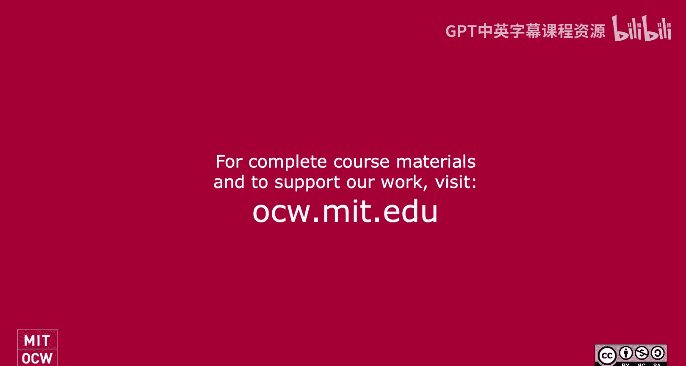
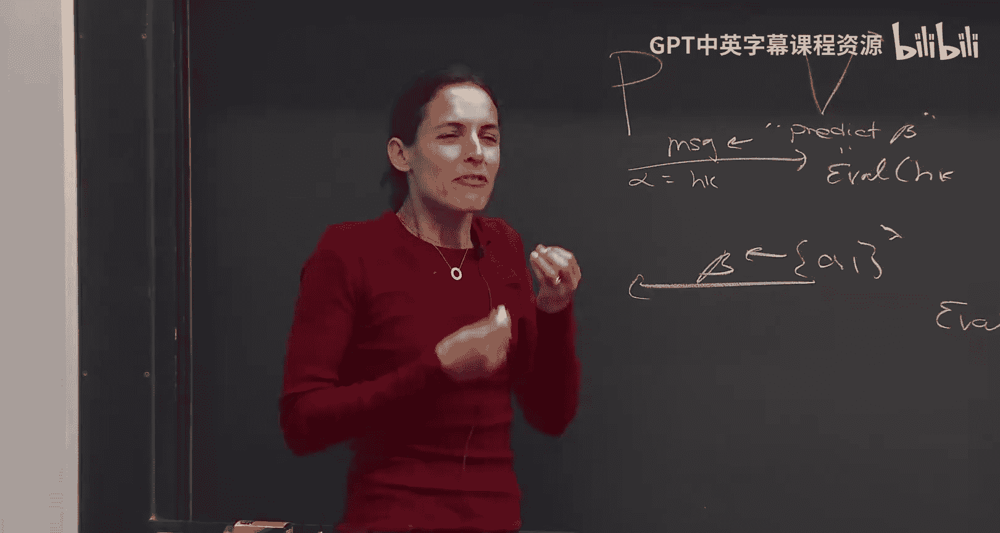

# 《密码学高级话题｜6.5630 Advanced Topics in Cryptography, Fall 2023》Claude-3.5-s p10 Lecture 6_ Fiat-Shamir Paradigm and Zero-Knowledge Proofs, Part 1.zh_en -BV1MVa5zXEmy_p10-

Let's start so first homework assignment is out， as I said。It's due right before Thanksgiving。😊。

If anybody needs an extension， just let me know。And the instructions are the on the site essentially each one should write like their own solution to make sure you understand it okay if you talk among one another as long as it's fruitfall and please type it up in latec and submit it to a great scope questions。

 yeah。😊，So not risk time。哦，诶。You why can't you don't you use grade school for other classes。 Yeah。

 I not。Oh， no， it is。 It is。 Now， When did you check， Oh Yeah， it's recently， yeah。

 if there's issues， let me know， Yeah， this class is a scientific There is a great scope psycho this。

😊，Any any other questions before we start？Okay， so。

Just a quick recap so last time we talked about the Killian Miikali protocol。

 it's an interactive argument， it's a succinct， interactive argument that which you can use to prove membership in any NP language kind if you recall the idea was we started before that was kind of our entrance to crypttography so we said the idea of the Kiian Miikali protocol is that you take any PCP which is very。

 very large but very efficiently if you just have RA access to it you can verify it very efficiently and the idea is you take this very very large PCP and you kind of shrink it to kind of you you know digested down using crypttography to this kind of succinct digest this is done using what's called using hash function when particular Merrkel hash or hash function that are succinct but can be opened locally so I'll recall what this is in a second。

And once the prover sends over kind of a squished form of the PCP。

 then the verifier now behaves like he's a PCP verifier。

 he tells the prover opened this PCP and the location that the PCP verifier would want to open and he gets back the openings so that's kind of what the kramicli protocol is but in order to to when I said you know it squishes down and then there's opening really what we need is a we want to take a hash function。

 so if you remember a hash function is kind of consists of a key generation algorithm that generates a hash key and an eval algorithm to take a hash key and an input and generates kind of a digest or a hash value。

A， last time we talked， we showed how to get a hash value， how to construct from the discrete log。

 we showed how to construct hash function from to lambda to lambda takes。2 lambda bits，1 lambda bit。

 actually was Z。P to the2 lambda to Z P to lambda。 But anyway， one can encode it to have to be 0。

1 to the2 lambda to 01 to the lambda。But this is actually not enough for the Kmicalli protocol。

 What we actually need is a collisionli resistant hash function。 First。

 it needs to be much bigger because we're taking a gigantic PCP。

 We want to squish it way more than like half。 This takes， you know make squishes the size。

 reduces the size from two lambda to lambda。 So it squishes it by factor of two。

 we actually want to squish it to a much bigger factor。

 so we want to take kind of eval what we where we use actually is an eval algorithm that takes strings of size。

😊，2 to the lambda， to lambda。 So note here， the Lada is upstairs。 It's very different than to lambda。

 It's exponential difference a。So we take a hash function that takes gigantic strings to Lambda and moreover。

 another property that we want is we can open locally。

 remember we said the way the Ki Miikali protocol works。Is that the verifier asks， okay。

 you committed that gigantic PCP， open it in location， you know，3，7 and 15。 Now， how do you open it。

 So we also want kind of opening algorithm。 So really what we needed when we talked about Merkel hash or hash hashes with local opening in addition to having a key generation and eventva algorithm We also have a open algorithm that generates kind of a succinct opening。

And which can be verified in the verification algorithm that verifies it。

So last time we kind of constructed this markel hatch。 I'll recall it today quickly。

 and we ended without kind of proving that it's collision resistance。

 So that's where we're going to start today。 We're going to just wrap up the kmicalli protocol。😊。

By explaining the thing that was left is kind of to argue that this Merrkel hash construction。

That is indeed collision resistance， so that's where we're going to start today。😊。

But then so once we do that， once we argue that we have the srkel hash。

 we put that it's colgen resistant， then we're done with a kid and Mi。

 who actually proved that it sound under this assumption。😊，So， so okay。

 so where are we heading today after we finished the Merkel hassh。

 now we actually showed a succinct argument for all of NP。This is great， however it's interactive。😊。

And interactive proofs or arguments are really， they're not very useful and the reason they're not very useful is for many reasons。

 a， there's latency you in to talk back forth， back forth。 but another reason。

Perhaps much more important is that it's per per verifier。

 So if I want to just prove to the world some statement。I can't prove it using。

 I I'm not going go to each person in the world and give him an an interactive proof。

So it's really ver specific， interactive proofs are ver specific。

 it convinces the specific verifier you talk with。😊，Okay。

 and we want to prove that convinces everyone。So that's kind of where the segue we're taking today。

 How do we construct actually non interactive one， one network to reduce interaction。Okay。

 so what we're going to show。😮，Is how to eliminate interaction？

And this is going to be done using a really beautiful paradigm called the Fremere paradigm。

 I'm going to explain what it is。 It's very， very simple。😊。

And then we're going to introduce the random oracle model。

 which is a model that was invented in order to an attempt to analyze or to understand the security of this Vi meal paradigm。

It's an ideal model okay we're going to prove the soundness of the Killian Mikali protocol that we saw last time。

 we're going to actually show that it sound， even if you apply the Fatmre paradigm to it。

 as long as you align this random oral model in this ideal model。

And then probably this we're going to only get till next time。

 but we're going to talk about the soundness of the F chiir and the standard model。Okay so again。

 we're going to talk about eliminating interaction using Fme， talk about the random workal model。

 show that actually the random oral model of this paradigm works well。

 often we'll see exactly when it works well when it doesn't and then we're going to talk about if we have time maybe start talking about about security that standard model because a random workal model is not it's an ideal model So is it secure is it sound like when used in actual reality。

😊，That's the plan Que。 Yes， you shouldn't be able to do two of the lamb， right。我の。Oh， okay， so okay。

 of course you can find the collision， so we define it。

 so the question was about this two to the lambda。 let me get let me now we'll see the definition construction。

 I'll explain。 But we get we get completeness for2 to the lambda。 Now you talking about soundness。

 soundness says that any polyaddversary or t time adversary。 Yeah。

 poly lambda adversary or or T polyan t lambda adversary cannot find the collision。

 Now if this T is2 to the lambda then you're not gonna to be secure。

 So mean the assumption rule So this is for completeness。 for soundness。

 the assumption is for collision resistant the definition is that no poly lambda time or poly t lambda。

 depending on if you want standard collision resistant or t collision resistant。

 which is slightly stronger assumption cannot find。😊，Colls。Great， thing thanks for the question， any。

 any other questions？I like questions， just reminding you guys。Okay， yeah。During this whole thing。

 I'm trying to imagine how big are the parameters。Like the time of the input it's something guys like。

People can read yeah yeah yeah， yeah yeah yeah exactly okay。

 so let me yeah let me talk a little bit about the parameters that's a great question that's a good thing to start with。

😊，So we want succinctness。 Okay， now， when we say succinct。

 really what we want is so we get the things。 we using cryptography。 once we use cryptography。

 things grow with the security of the that we want。 So things will grow with the labda。

 which is the security parameter。 What the security parameter is。

 depends kind of how paranoid we are in the world。 Okay， you can think about it is 256 B。

 sometimes it's more depending on also which cryptoyts you use， but that's a good。

 it's kind of independent of the input。 Okay， you want a succinct that you can get。 And you know。

 if you want to use cryptography， it's like security parameter。😊，Now， the input it should。

 in some sense， it should not depend on the input， but of course。

 the input is not going to be like more than2 to the lambda because you think of lambda is such that2 to the lambda is like more than the number of molecules in the universe。

 So nothing is that big in our world。 Okay， so you think of the X can be big or actually。

 the input can also be small， you know， but then it sometimes you don't need cryptography。

 It so tiny。 It's like rug v useless。 You can just。Give the witness。

So usually we think in our head of the input as can be much bigger than lambda can be poly Lambda and maybe even be like lambda to the log Lambda。

 it can be， you know， but it's not as big as two to the lambmbda that doesn't exist but it can be kind of anything that's kind of real worldor number in the sense and so that's kind of what we should think of。

Okay， does that。诶其咁有。What do you do for this We're trying to。Reduce the。We decided the proof。喂。

Still a reasonable polynoial side thing， but just like a 5 exactly exactly right。

 So you can think of it， you're trying to when when you do and。

 let me just repeat it also first themic， when you're trying， when you do this interactive argument。

 you think of you take an X。 that's still real world， you can think of it polyno in London。

 but it can be more。 But as long as the kind of real world thing and you reduce it the kind of 256 B。

😊，Okay， that's kind of the the practical idea you should think of。

 and the more theoretical idea is to say you can take any input X。

 but none more than two to the Rda because that's like， you know， but something anything less。

 and we make it as small as poly Lada。Okay。Great， any other questions？😊，Yeah。

 and to verify that row is like the opening， iss that what it is。 yes， yes， yes Yeah， yes， sorry。

 Yes。 This is。 I'll go to it now， yeah， yeah。 Yeah， let me let me Okay， So good。

 So let me just finish wrap up what we where we left last time， which is the Merkel hash。

 So we use Merkel hash in the Kiian Miikali Pro。 Actually。

 we don't need to really remember the Ki Miikali protocol for today。

 We're not gonna actually really use it。 but let me still finish the Merkel hash because it's a very important permitted。

 It's kind of use everyone in cry。 So it's very important to know。😊。

So what is the Merkle hash it takes？hash function， not local opening。

 just a regular hash function that generates a hash key and has an e algorithm evaluates。

 just generates hash value。😊，Such that it takes two lamb bits to lamb bits。Okay。

 you can actually can make it more。 It can be even one plus epsilon lambda bits。

 still you can play with it。 But let's say two lambda，2 lambmbda bits。

And we construct structure it a hash function with local opening。

 So let me tell you exactly what this hash function with local opening， what it looks like。

So that gem， the hash key is exactly the same as before， we take the same hash key as our underlying。

 so first we started with a hash， we started with this hash family。

What is it Last time we saw we can take， for example， I gave an example with this is Creek log。

 but you can even if you don't remember， it doesn't matter。 take think of it。

 Someone gave you hash family。With this domain and range， okay。

 now I'm going to do a domain extension。 I'm going to make the domain much bigger。😡。

And get local opening。How do I do it， So this is the Merkel hatch construction。The idea is。

 so the gen is， as I said， just generate the same hash key as the original gen。

 no change to the gen algorithm， the inva algorithm on the other end。

 of course changes because the domain is much bigger。😊，Okay。

 take strings of size at most two to the long debates。And what does it do。

 So what it does is the following。 It takes its input X。

 Let's suppose for a simplicity that x is exactly kind of2 to the L times Lada。Bits， okay？

A so it's you don't have Te on this。 this is just easy Teum， and you can always get it with padding。

 kind of take any input and pa it all be of this form and now hash it。Okay。

 I'll say a word if it's not of this form。 but if it is of this form， what do you do。

 You take your input X。Just partition it into blocks each of length lambda。

 So you have two to the L blocks。Can you have an input X？Of length 2 to the al timess lambmbda。

You partition it to chunks each of length lambda。 So you have  two to the L chunks。

 Let's call the chunks x 1， x 2， x 3， x4 and so on up to x 2 to the lambda。

Each of them up to x2 to the L， sorry。Each of them is length sda。And now what you do。

 you take two blocks， this is two lamb bits。And hash it using our building block hash that takes2 lambda co lambda。

You take the next two lambmbda， you hash。😊，You take these two， you hash。So in other words。

 you take that two to the L blocks。😮，To two to the L-1 blocks， you hash every， every pair you hash。

 every pair you hash， every pair you hash every pair you hash， you got two to that L-1 blocks。

 Then you take these blocks。 And again， every pair you hash every pair you hash every pair。

 two to that L-2 blocks。 And so first， until you arrive to one block at the end。What you output。

 you output the top， the final， I guess it's going to be somewhere here。Block。

 which is often called a root。You output the root and you output the depth of the tree。Okay。

 that's the output of the hash too the output is the root， the hash value here， it's lamb the bits。😡。

Indeed D， which you also think of it as being lambda bits。

 even if it's less just encoded using lambmbda bits。

So if you're mad now and me because I promise you lambda bits and you see her two lambda bits。

Apply this hash one more time， and you'll get your lambda bits。Okay， but how 200bits is also fine。

 yeah。Why are we founding？呃， input。We did the landda Texas Arch。Good， good， good， good， good， great。

 because last time， great question。 So last time when I met， I said， oh， just take star here。

 Anything。 So why am I， why am I bounding out to the Lada。😊。

So this construction bounces2 to the Lada， because。As you see， I take every lambda I can't take。

 That's all gives me。 So that's all I get。 Now you can say， wait， what if I want more。

 Maybe I more than do to the lambda， You can actually get more than two to the lambda。 For example。

 you can bootstrap this。 So now you can take to the lambda to lambda。😊。

You can kind of create a mekel hash of this Merrkel has。 You know， you can kind of， but actually。

 you never， it doesn't come up because you never need to to to down like。

Think nothing is more than2 to that。 We choose Lada2 that in our world。

 nothing is more than  size2 to the lambda。 But you can think of like。You， you can get if you。

 just as that kind of mathematical curiosity， you can apply it。 You know。

 So once you have from Tu to theandda， you can。😊，Top your things to tutu de Lada and do this kind of use this as a building block to a bigger more high。

 So you can kind of amplify it， you know， but we're not for us， Tutu de Lada the Lada is good enough。

Great， great question。Any。Any other question， Yes， like depth need to be included in the lecture。

 not just be a function of the Le X。Good， great， great question。 Why do。

 Why do I insist on including D， is it not a function of x， It is a function of x。

 It's the twinistic function of the length， not even x of the length of x。Yes， however。

 nobody knows what x is。So you know， atend does there want collision resistance and so the property we want from this hash is that it's collision resistance。

 What is collision resistance means， it means that you cannot out a hash value。

With two different openings。Now， when you output a hatch value， nobody knows what the X is。 Actually。

 you may not even know， well， if you。Okay， when you open， you know， But， you know。

 when you give someone a hash value， there's no x inherently。A part of it。

If you don't include the deck。Actually， there's an attack。 It's not collision resistance。

 It's really not。 It's not just a why it not collision resistance。 for example， just as an attack。

 let's say I published this route， even。This is my mood。 Okay， This is my input。 My input is x 1， x2。

 x，2， x 4。And the output is root。Now， let me break the collision resistance。

 I'll give you two different openings。 One is X 1， x2 x，3， x 4。 You do the hash。 You see， yeah。

 you're happy。 It's a good opening。Now let me give you another opening， just this and this。

That's also a good opening。So open it in two different ways。That's not okay。 That's a collision。

If you include D， however。😮，Then so that's exactly what will allow me to argue collision resistance。

 It's this D。Great question。 Thank you。And so this is the construction。Questions？Okay， let's see。

 how do we open。 So now this， this is just so far great。

 We managed to go from2 to the lambda to lambda。 I didn't argue collision recently had but at least we did domain extension。

😊，So we extended the domain， but I also want， especially I needed for the Kiian Mikali protocol。

 and for many， many other uses in crypttography， I want to be able to do local opening。 So remember。

 what does local opening mean。I to open I may now want to give you my entire input。😡。

I may just want to give you to convince you that this hash value in some location I of the of the。

Of the input， the value is a bit B。But I don't want to give you the entire end because the entire input is gigantic。

 you can't even hold it。So I want kind of a succinct open。

 I want to convince you in a kind of a very succinct way that what's sitting here in this bit is0。

 or one。So how do I do it？😮，So， this。Construction is actually really nice。

 It gives you a local opening in a very nice way。 So what's the local opening。

 Suppose I want to open this kind of the bit here sitting here。😊，What I'm going to do。

 I'm going to actually give you this entire block。 Its only like the bit。 So it's not that big。Okay。

 I give you this fuck， what do you do with it？So let me help you convince you that this block is indeed the block related to the root。

 namely it course it's a block that indeed sits here next to how do I convince you？

I give you the sibling， so this block has a parent， I give you the sibling and the parent。

This parent has a parent。I give you the sibling。And the parent and so on and so forth。

 until you get to the room。I give you all these blocks。 So in each layer。I open two blocks。

Which are the two siblings。So I open two siblings。 You get this。 I open the two siblings。

 You get this。 I opened the two siblings and so on， yes。

is so I don't know if it matters but you strictly ancestors sit right right you're totally right。

 You're saying， well， if you really want to be what you're saying which is completely right。

 this is wasteful because actually all I need to give you is the sibling So why waste communication if I want to open this I'll give you this and this sibling。

I don't need to give you this。 You can compute this on your own。 So computer this on your own。

 I'll give you this。I don't need to give you this。 you have these two。

 so completely on this on your own， and then Ill only give you this。And then and so on。

 you're 100% correct。 I actually just need to give you one。Okay。

 I wrote two because it's just easier to say。 but yes， exactly。1 is enough。

 and you can compute the yeah。Fantastic。So that's the so I denot it by， so what does the open do。

 it gives you for each layer， it gives you two blocks for layer J denoted by ZJ， so ZJ is two blocks。

Okay， there's and the leaves。 It's two blockss， J co zeros and the leaf layer 1 layer2 up to layer D actually just the root。

 So you know， you can actually go to D-1 if you want。Okay， but I'll just， in my mind。

 I want to include the root， it's just the reason I include both and the root is now when I analyze it。

 it's notation wise， it's just very， very easy。But really it's enough， like you said。

 to have the sibling and yet the roof， of course， you don't need to give。

Okay but let's just think this is how I open and now how do I verify？😡，I just take each two siblings。

Compute the hash and make sure it corresponds to the relevant， the relevant these。 indeed。

 the the parent。 So again， you gave me all these things。 I compute these two。

 I check that it's consistent with the what you gave you。 if you didn't give me fine。

 Ill compute on my own。 I get this。 I'll compute this。And given then I'll check that。

 oh I need to check it then it' consistent with the root。O。Back to the verification。

Question about the design， the algorithms。Okay， so this is kind of where we left off actually last time and what I want to do now is do the collision resistance。

I'm happy that actually we got a chance to do it again because it's a very important primitive。

 So it's worth kind of having it ingrained in your mind。😊，Okay， so why is it collision resistant？

So to prove collision resistance， what do we want to argue that an adversary that's given a hash key cannot produce a hash value。

 namely root and D with two different openings？Okay， so suppose。There exists。啊poli signs。Adversary。

That does find a collision。 Okay， such to that。The probability that a， he gets a hash key。

 hash key is from Jen。And somehow he manages to output a hash value， which is root in D。

That's just the hash value。He gives me some index。啊啊阿。

And he managed to open it in two different ways。 He gives me an opening that says， oh。I is  zero。

 and he gives me another opening。The says the I bit is one。And for both of them。

So that for every B for both0 and1。There will accept。V and hash key。Root And D。I and Rob B。

Outputs one。So suppose I have an algorithm。That gives me a hash value。

 an index and the valid openings goes to zero and to 1 valid。 I mean。

 that the ver will accept those of them。 Oh， sorry in B。So there takes hashkea value， an index I。

And bit B saying whether index I is 01 and approve an opening。😡，And suppose us both。

Suppose he accepts both with probability， at least I know epsilon。Okay。

 so suppose there exists and exists epsilon。So suppose they exist expsons that that for any land。

 the probability that A managed to find the collision。Like this is El epsilon。

I'm going to argue that then you can find a collision in the underlying gauge in the small age with probability epsilon。

Okay， so if you have an algorithm like this， then。There exists an algorithm， polyide。Such that， B。

Such that， the probability。That B。He gets hashki， the probability that he outputs。I know。

 x0 x and x prime。Such that。The original eval H K X equals eval。H， K， X prime and。

X is different than x prime。Is only steps on。But we assume that this is collision resistance。

 We started with an underlying hash function。 that's collision resistance。

 So the epsilon has to be negligible。Okay， that's what we're going to show。 So we're going to use if。

An anniversary。Can find a local opening that collides for the Mer hash。

 we can use them to actually break。The defined collision in the underlying kind ofda t lambda hash function in the little hash function。

So how does B work， What does B do， B takes it a Ha key。 He just run the A。

So let me so we claim that there exists a B， so let's see， B。And then put hashki。What does it do。

 Just run。A， so get root。D I row 0， row1。Which is just。A unhasky。Now。😡，He got row0 and row1。

 What a row0 row1。 Each row is this kind of two pairs of siblings。

 I'm going to assume that both exist because it's just easier for me。

 That's why I wrote both of them。So each opening。😮，So row zero。For each level， you have Z0 J。

From 0 to D， and row 1。Is let Z1。Jy。Now， what do we know in the leaves。

 so we know that z00 is different than z10。The two leaves are different because in one leaf。

 suppose verify access both of them。The case that these are both accepted。

 I'm going to argue that I found collisions。Okay， so I'm supposed。Rsie or nor1 are accepted。

 so where？Where accepts both of them？😡，Now。If there accepts both of them。

 So we know that the leaves are different because in the leaves， in one case， I have Euro1。

 in the other case， I have 0。So they have to be different。So I know the leaves are different。

I also know that。Z0 D。Ca Z1 d， these are both a root。😡，Now， of course。

 I said we don't need to include it but I'm just putting here because I want the reason I want to include it is just for clarity to say。

 look。We have kind of the layers of information on each opening。The leaves。

 they must be different because one opens to0，1 opens to one， the root。

 the left one must be the same it's the root。😡，It means that there must be some kind of two adjacent layers。

On which one of below they disagree and above， they agree。Okay， we know here they disagree。

 here they agree。😡，Okay， they disagree， Do they disagree here， I disagree。We're going to agree。

 so we say there must be。A layer J。Such to that。Z J 0 is different than Z J 1， but Z J plus 1。

Z is equal to Zj。Plus one。还。Yeah， okay， they disagree here。 How about one they above， do they agree。

 if they agree great， then that's going to be our J plus one。 They disagree， Let's go up。

Until at some point， I'll agree because I'm a hand， do they agree。 Yeah。

 just for the video should be with0 change。And0 to one。Oh， thank you very much。 Thank you。Great。

 thank you。 Yeah， not just for the video。 It's also for you guys。 So I won't。😊。

Confuse you more than it is， Thank you。A1， J，1， J plus1。 Thank you。Okay， yes， I I is it。

Because plus one is。did I miss。Yes。😊，My god。Okay。No， the zero one。Okay， did I get it right？Yes， okay。

There's a layer J set that in layer J they disagree in layer J plus one they agree。That's it。

 This is a collision， why what is layero J plus1？😡，One of them is the father， is a parent。

So we have two that they disagree。But most of these， they agree on。In particular， they agree in this。

So then so we found the collision， this must mean that。😮，The hash eva。Hash key of Z 0， J。equalコ。Tval。

しき？Of Z1 J， because this value is one of the。It's， you know， one of this and one。

 one of this and one of this， depending if the left or the right， depending on the tree。

 But and they're both equal。 So done， I found a collision。Okay。

 with the same exact probability so it's。Now， as I said， this， I wrote here。

 suppose of this poly lambmbda， I could have if we assumed that the underlying hash function is T secure。

 namely you can't find collisions if you run time poly T of lambmbda。

 then we get that the Merel has is poly T secure， because B。All it does really is just run A。

It doesn't run much more than it just one day。 and then it does something very trivial。

So the complexity of breaking the Merkel hash is really the same as the complexity of breaking the underlying hash。

So if the underlying has is tec， Mer has is tec。Questions。Okay。So where are we？

So we proved the Merkel hash， as we thought the Merkel hash was used to give an interactive a succinct。

 interactive argument for all of NP。So， now。You're willing to you're happy with interactive protocols。

Thank you very much。 I hope you enjoyed the semester and we're done。If you're not， though。

 but as I said， we actually we're not happy with injective protocols。It's really interesting。

 actually， to think of the evolution of of this， because you know， it before all this。

Intractive proofs and nows and so on。 We had just mathematical proofs， which were non interactive。

But they were very， very long。And people were not happy like it's like， oh， they're so long。

 And then interactive proofs were defined。 I think they were defined only for the sake of zero knowledge。

They were defined just to get zero knowledge proof。

 I'm going to actually mention we're talk about zero nodes later today。

And this motivated kind of then to introduce interaction。And then be like， wow， you all what a great。

 forget about your knowledge， for cryptography， this is such a great model using in。

 we can prove a lot more。we saw that youcat protocol you can do like you can prove actually any any circuits that are really。

 really huge as long as they're kind of half that， you can do piece space。😊。

Or any computation that has poly depth， you verify can be any depth B， you can verify random time D。

😊，Great， now it doesn't run in the science。 So it's much much more powerful。 wow， wow wow。

 And then people like actually with cryptography， you couldn't do much more。

 great but now like what way did there was a big price。 We actually don't want interaction。

So where are we do we back at NP？And very we're back in the mathematical proofs that are way。

 way too long。So I said no。We're actually going to circle back in a very interesting way and get succinct non interactive proofs。

So how do we circle back？Okay。So。So this idea of how to circle back。Actually， was。

Put forth by Fiatine Chamir。 This is in the mid 80s and 86。They propose a really。

 really nice paradigm。Actually， they didn't。Think about this remember this is 86。

 this is kind of before in proofs， it was just when Deonardd was introduced。

 In proofs just came about， but now you know there was no PTP， no interactive argument， none of that。

Okay， this is an 86 Fat and Chaia。😊，They proposed a method。😮。

Of actually reducing interaction of constructing signature schemes。Now。

 I stand behind what I said that this class will not require a lot ofp crypto background。

 You don't need to know what signature schemes are。 but what they did their idea is。

There was there is a primitive card identification scheme。 I want to prove to you that I'm Yale。Okay。

 how do I prove that I'm yeah， I have a public key corresponding to my name。

 and I'm going to prove to you that I know the secret key。

Me no whoever knows the secret key has my identity。Essential， That's how things work in the world。

 So I am going to prove to you that I know the secret key。 This proves that I'm me。Okay。

 this proof is interactive。 identification protocols are like three round protocols。

 I give you a message。 Al， you send me a question， beta， I give you an answer， gamma， you verify。

 that's how works。Now， they said， let's convert this identification scheme into a signature scheme instead of kind of interacting to make sure it's you every time you sign them。

 you want to send a message。Kind of use this， use this message to take this identification protocol together with a message and kind of eliminate the interaction。

 I'll explain exactly how they do it。 but they do it in a way to construct signature scheme。

 That was their goal。But now after several years after we use it all the time to actually forget about just the specific application of identification scheme to signature。

 that's one application， but actually we can show we can use it to reduce to eliminate interaction。

 not only from identification scheme， but for。Intractive protocol that is public coin。

 So let me explain so now take。Protocol， so this is a this is a。Paraigm。For eliminating。Intraction。

From。Intractive。Protocols。Then are public coin。So not all protocol， but ones that are public coin。

 so what is a public coin protocol？Take any protocol like to approve。

 so I have a prover and a verifier。And suppose for a second。

 it's so the suppose for simplicity that it's three messages。 Okay， so the ver。

 the prove send a message， Al， the verifier send beta， which is random。 that's publicly mean。

 the message of the therefore is completely random。Okayy， let's say it's kind of lambda bits。

If it's less then just pad it to B lambda。 Okay， and if it's more， just call that lambda。

 make that the security parameter。 Just increase the security parameter。Okay， now you send。干嘛。

And maybe it's more round， so maybe then he sends Delta。Let's say I'm random bits。And then you say。

A's salon， and you can continue。Okay， let me stop here for the sake of okay。

 now I'm going eliminate interaction。 How do we eliminate interaction。

It seemed like introduction is very important。 I mean， the entire kind of。

 if you remember the sum cha in Gca。I mean， it's tempting maybe to say， oh。😮，Tell the prover。

Computer alphabetta gamut。 just complete the transcript on your own。 You simulate the ver messages。

 then I'll cheat。So how do you get rid of the interaction？Things really。Really hard。Actually。

 it's so easy。 I mean， their idea is trivial。 So what is their idea， They said。

 they say the following。How does the verify， how does the we this beta？The verifier chose it。

So you know what。Let's compute， let's not have the ver。 No。

 we don't have a verifier It's not intracted。 There's no verifier。 So how to compute this beta。

Let's compute it as kind of a hash function。Apply to the transcript so far。So let me explain。So how？

Here's how you convert it to。P， F Cha， V F Chail， this is associated with some Hash family。Okay。

 there some it's associated with the hash family， so the future meal paradigm。

 you can take any hash family and use that to reduce interaction。How to use it to a disintraction。

 Now， theres some hash key。That's chosen once and for all。 Everybody knows it。

 Either the verifier send it once， or if you think about like everybody can verify， I don't know。

The US government publishes this hashky， everybody uses this hashky， okay， there's some fixed hashky。

 everybody uses it。No。Once we agree on hasky。What does the prover do？He computes alpha。

 let's say you want to prove that X is in some language。So he， let's say you he said saying， okay。

 I'm going to prove to you that X is' in the language。Let me prove it to you。Okay， I computer I fine。

Now， I'm waiting for a beta， but there is no verifier。 fine， the I'll tell you what the beta is。

 Beta is just has is going to be eval。Of hashki。And the transcript so far。X in alpha。

 That's currently what's in the transcript。 the the thing and the first message alpha。

Now the proofs like， okay， this is the be I got from the ver。

 He's interpreting this is the be I got from the ver。And now it computes Gama， by answer。

The prove's answer。Now he's waiting for a message for a query from the verifier， some deelta。😡。

But there is no verifier， so it' even compute the data。😊，As I of the Hashke。

Using the transcript so far。 So x， alpha beta gamma。Once he has Delta。

 he is going to go back to being Pror。And compute。Excellent。And then you can continue。 Next message。

 he goes computes。A hash value of all the trendss so far concludes the next prover's message。

InAnother ver we go， that's how we continue。Any questions about， So what what did we go， We got。

 We started from an interactive protocol。Can have many rounds。

And now all we need is to agree on the Hashki。And once Grand Ashkin prover just gives you this is one message。

 that's it。Yeah， is it important to include good， great question。 Is it important to include beta。

 Actually， you don't need to include beta at all because the verifier can compute beta。

So you only need to know beta。 so you can compute gamma。 You actually don't need to include it。

Great question， Great， great question。So note for example。

 if you think about Keian and Mikali protocol， you may not remember。

 but let me just write it here just to refresh your memory。

 why not you don't need to actually to understand this。

 but since it's such a nice protocol and so how does it go there is a prover and a verifier the verifier sends a hash key。

 so he wants to prove that X as an L。He does a Merkel hash。Of the PCP So he completes a PCP。

 High is the PCP。4 x and L。And he sends you the Merrkel has， so he sends you root。

And and the depth thats， that's just so it takes the PCP and it does a hashless local opening。

 For example， Merel has actually can do any hashless local opening that you want。

 This is the most common one。😊，And then he gets kind of the randomness from the PCP verifier。

 So this is R from our correspond to the PCP verifier。This determines a few locations to open。

 So now we open So he gives so this may this you know。

 this randomness corresponds to like some locations。

 I1 up IL and then you just open pi I1 with open 1 up to pi IL with open L。That's a protocol。Note。

 this is completely random。😮，It's the randomness of the PCP verifier。So we can eliminate traction。

If you think of it， this is just kind of a protocol where you send the hash key。

And then you have kind of alphabetta gamma。Okay， so let's eliminate interaction。

 So how do we eliminate interaction Well there's this hash key。

Let's we can use this hashki to do Fet Chiil， but we can also use another hash key。

 hash key and Fia chimir。And now。TheWell， this can be now you give alpha beta is going to be simply。

 You don't have to include it， but it's going to be in your inner head。

 It's going to be eval of hash hasshki， Fcheil。Of x and alpha。

And then maybe Hashke is also part of the transcript。And， and this gets written。

 And now you compute the government， which is opening。Okay， so you can。You can take any。

What does the future gives you， it gives us away， remember。😮，Kelian MiCli was very succinct。

You can take x any， let's say NP language。N can be very large。

 It can be lambda to that0 and can be what it can be even super polynomin lambda。

 It can be almost as larger as two to the lambda。ok。And look how su the protocol is。

 you just send a hash key， the route which is lambda bits and the opening in it to the PCP is all lamb the bit。

 poly lamb the bits。So very， very succinct。 And now you can even just make it。

What is this you can all send it all in one round。So what does it give you。

 what does it tell us that you can take any NP statement？

And give a proof of size poly lambda doesn't matter what size the axis is。That's amazing。

Without cryptography， we need polyen， you know these antiant the witnessesnesses， yeah。

I guess further intellectual resistant security property or probably stick over hashkes。

 you can imagine some kind of weird hash family where there exists hashkeys that are really。Okay。

 and so I guess here it's fine because the verify choose the app。

You might imagine if the US government publishes a has year。

What if it happens to be a bad one or scare to be？Okay， two things first。

 you're saying who uses in sash key of the F toir， how do we know that we trust it？But you know。

 it's much worse than that。Is it secure。 Let's let's say he's chosen randomly from the has family。

Is this sound？😮，So again， what did we do here？We started with an interactive protocol。

 we proved that sound， let's say a kill meikali sound， we proved it。

 As soon we have closure as in half， we proved that the sound。

It sound assuming the prover gets the messages of the verify randomly。

 that one so it sounds that we used it to pull soundless。Now what am I saying， what am we doing now。

 I'm saying， oh， forget about it， it's not random， actually， you computed on your own。😮。

From some hasshki。😮，That someone choose even honestly， from let's say we agree。

 we all agreed on some hash family and someone honestly chose a hash key。

 But now you know this hashky， now you compute。Who says it sound， I mean， is it a sound。

 maybe it's not a sound？Aashki always up with zero。Okay， so。First of all， okay， so first of all。

Of course， there's one can think of this hash， this hash functions need to have some property。 Okay。

 collision resistance like at the minimum。 if， if you can find collisions， for example。

 here you're screwed。 it can be， it can be It can be trivial。 Okay， so you need some property。😊，Now。

 the question is， what property do you need？😮，What property do you need from this？

Half family to argue on this， yeah。I'm not sure like seeend this or likeend this。あ对。Very， very okay。

 good。 So it seems like well what do you need， It needs to be random like about protocol like， okay。

 we， we want to say take any， what is our goal， our goal is to say， take any protocol。

That is sound public coin。And we want to convert it to non interacttracting。

 That's what we're trying to do。Now I'm saying what property do you need？ Well， look， here。

 the our guarantee was that it sounded if this is random， so we need this has to be somehow random。

Ss to reason。So this is written okay， but look hash functions are not random， it's a hash function。

 by the way， let me say this paradigm is used all over the place。 It's a very popular paradigm。

 It's used a lot in signature schemes and also in proof systems。It seemsed all over the place。

And which hash function is used， Some of the shelf hash function， Sha to 56， like these。

Engineer type， you know， hash function that are optimized。So is it secure with chat 2 56。

It's definitely not random。So we actually don't know， so let me be honest that is it secure？

I don't know。Yeah， I for a specific statistics already show now by extension。Yes。

Every out distinguish。Right， yeah， you right， right， right， right， right。 So actually， let me good。

 So let me just say a few things。Okay， maybe I'll cut it just to the chase。I do know。

 Let me tell you， it's not necessarily secure。 Actually， unfortunately， we have counter examples。

So I said this is used in practice all the time。 You know。

 it's one of the great inventions of cryptography。 Is it secure cure no。😊，Okay。

 so what do I mean by no， okay， me。Is it always secure， no？So yeah， let me say。

 let me take back my ownancy。 Is it always secure， Is it always the catta when you start with an interactive。

Protocol and convert public coin。 and you apply fair treatment， is it always secure。 No， Moreover。

 let me tell you， we have protocols。So that no。Which has family you use？For all have families。

The protocol becomes insecure。Okay， let me tell you even more than that。

 that would kind of really youll be mad。You know， the killing protocolcom？That we kind of built up。

Even that's not secure， the theater meal will be secure on it。But this。

 let me actually put asterisk there。It's what okay。

 so let me let me tell you what's known about the insecurity of the Fatmere paradigm for this protocol。

 What is known is there are some contrived。 So the F them Ki Micalli protocol says take any hash function that's collision resistance。

And take any PCP。We get tongueless。There are examples of specific hash functions。Or specific PCPs。😊。

That are sound， of course， because it's， I mean， there are example of collision resistant hash functions and PCPs。

So that this， of course， is found town for any co International B TP。But such that。

 no matter which hash function you use for the PMEA。This will be insecure。Not out。

No matter what you use。呀。What break Yeah， I'll say a little bit what breaks in a second。 Yes， Okay。

 good， good， good same question。 So the example for why why it breaks。😊。

The example for why Ba is very contrived， actually。

So that's why is the message here don't use fi chi meal。 We have a break。 No， that's not the message。

 You should use feature milk because in practice it works very well。

 I don't know a single instance that people use feature chi meal in practice and broke。

So it's a great paradigm， use it。Can we come up with a general proof of security， no？

Because we have counter examples。So what did we learn。Okay。

 so maybe I'll start by saying I'll say very， very high level， not in detail。

But about the counter examples， Okay， how can we build counter examples and as opposed to going to the Ki and Mika protocol because there。

 you need to work a little harder to fit it in。 I'll say a word of how you fit it in there， too。

But the idea is， the file， let me try to give you in proof that is or an interactive protocol that is sound。

But when you convert it。when you apply for your to meal， soundless breaks。操。

The idea is the following。 It can be a very contrived protocol。 Okay， so my。

 what I want to do is construct a contrived protocol。There is sound。But when you apply here to me。

 no matter which hashle use it will break。And internally， the contrived protocols are following。

 take any sound protocol。 For example， Fo， for example， Kiian Miikali。Whatever GKR。

 whatever sound protocol you like。😡，And I'm going to change it。

 I'm going to tweak a little bit that the sound will still remain。

 I I'm going to tweak it so that the sound will still hold。But on the tweakwied protocol。

 when you apply5 to me will fail。Okay， so start with PV， for example， GKR， for example， Kiim Miikali。

 whatever you like。And I'm going to kind of tweak it a little bit。How am I going to tweak it。

 I'm going to say， tell the verify， you know what。Except if you accepted it before。

But except also if something very weird happens， but don't worry it will never happen。

We're not going accept。 So remember the verify letter he sends kind of a random beta。I the prover。

Let's say ahead of time。Guess your beta。 He told you， I know how you're going compute your beta。

So if the people are ahead of time。Thank you， kind of fun。

Send you a message that will kind of tell say。Kind of， I can predict。

Beta and kind of will predict better ahead of time。 Then you accept him。 This is random。

 What's the property that you can pick my beta。 If beta is like random and 01 to the lambda。

 there's no way you can predict it。So if any chance for this， time， you know。

 you can run the lottery。I'll accept you no matter， I don't care if facts' in the language or not。

 it only adds like a negligible probability of， you know。

 because the probability that you could predict better is one to do the better。Now。

 what happened in the theatre chail paradigm。 Oh， I can tell you， oh， I know Bta。

 I'm I can predict it。 I'm going to tell exactly how I predicted。 Bta is going to be Eval。

Haashki on this message。That's the idea。Now， to implement this idea。It's harder。

 It requires some workout I tell why this idea is not trivially implemented。Because。

When we do featurem， we say we start。With a protocol。And now the question is。

 does there exist a future hassh family for which it's secure？Now。😡，We saw with a protocol。

 This protocol can say can say， okay， Al is hasashki， for example。And then。

You accept if you originally accepted or if even。Of。Haashki of Al， which is also hashki。

 is equal to beta。 Now， this will not happen， but in the future era， it will happen。

I'm going to just send the feature to Mihaski。 That's what I do。Okay， but then someone will say。

 okay， so you give me a protocol， what is the length of your alpha？😡，It's lambda bits。

 and I'm going to use a hash function that the hash key is longer。 and now you can send it。

Because yeah， I'm like， I'll sendnda Hashki。So then you need to use a hash to kind of squish this hash key in。

 it's more complicated。But the basic idea is。This does not work if somehow the verifier accepts you if you kind of convinced him that you can kind of predict his his beta。

 That's really in。

So we can construct kind of contrived。Protocols that achieve this。

 or we can construct a very contrived hash function that do this。Weird game inside the hash function。

 Like the hash function becomes trivial。 if you feed at something that。K of。So it requires more work。

 but it's all very contrid。Okay， so I hope I convinced you by with these examples the counterempemp are so contrid。

 So when you when you say， oh， we found that tiome is not secure。 And you show this example。

 the reaction should be come on。 Okay， nobody uses these protocols。But what it does tell us。

 you can't apply future blind， you can't， okay， what it does tell us is for all of us who are obsessed with trying to prove the paradigm。

 there's no general proof。Because we have counter examples。Alssa。Question。

 do you need to start with the protocol that's like。Great， great question。 Okay。

 that's my next soll I'll yeah。😊，I' the answer is yes， but I'll I'll I'll talk about that next。

 The question was about ne soundness， but we'll get to that next。So。😊，Any questions though before？

Okay， so， but， you know， still people use the Fatm paradigm。 And there's a question of。

Is it sound for natural protocols， Is it sound。And the answer is actually。

 it would have been nice if we can come up with nice protocols and say。

 at least a large class of protocols and say， yeah， if you use this hash function。

 this specific hash function， which we know is collision resistant under discrete log or under some other assumption。

 then yourche is sound， that would be very nice。😊，We're still not there yet。

 but we made a lot of progress in recent years。 And I want to tell you about the progress。

 But before that， the first way， the first a aim。Kind of way we try to analyze。

 So the Fatil gained the popularity very quickly。 Okay， and because it's so simple and so efficient。

 it became very， very popular。And people really wanted to understand its security， is it sounds。

 it not sound。And then in '93， Belarara and Raaway introduced kind of an ideal model called the randomandom Oracle model。

And this model said， you know what？this was before we had any counter examples。 Okay。

 this model was introduced by Belarare and Raguaway in， I believe，8093。

This was before we knew any counter examples for the paradigm。And they， I mean， except for some。

 which goes to your question， Leo， but I'm going to get to it。 And they wanted to ask。

 can we prove security of。OfThe F chair。What do we mean about the hash function。

 What properties do we need about the has function to improve security？And the first part they said。

 you know what， what if the hash function was completely random？So when you use switch Chiome。

 we use this specific， there's a circuit that computes the hash functions like a tuuring machine。

A polynomial time touring machine or polynomial side circuit takes a hashkin。 Okay， Pa say no。

 what if the hash function is completely random。Okay， so the re welcome model says， suppose。We apply。

Fear to me your paradigm。With truly。Random。functionction8。So this is completely， completely random。

 So what do I mean by completely random？So now I guess。Me， instead of choosing。function。

From a family。We don't choose a function， and we just say suppose they have a truly random。

 they have access to both of them to a truly truly random function。And they can ask。

 so when the prover computes alpha，s he has orxs of this function and he tells the function， give me。

The function applied to x and alpha， and he gets back a betterta。 and every time this hash。

 this oracle， he gets a query， he chooses a completely random。

 So think of this as like a database of all part like a Studio the lambda of all like just random random random elements。

😡，A really， really， truly random function。So now the question was， okay， if this is truly random。

 now could we get security， at least like that's the minimum。And more。

 it seemed like the answer should be yes， because in some sense， what was their intuition？

The intuition is， what does it matter if you're talking to a verifier that gives you random queries or you're talking to in terms of the prover。

 so the prover is trying to cheat。What does it matter if he's talking to verify to give him kind of random be？

Or he's talking。To a random function that gives them random betas。

 most of them of them were random betas， What's the difference。So it should at least be secure。

In the anti model， let's first establish that。So is it secure in the animalal model， no？

Maybe this goes to Leo's question。And I'm going to tell you why it's not secure in the randomnaoral model。

 and actually， let me take a little detour。And tell you。

I'll show why it's not secure in the randomal model via a little protocol。

 this protocol actually is going to be useful。Because actually， later。

 we will show that the fifth is sound for this protocol。 It's kind of weird， but let's。This protocol。

 by the way， is very important protocol。So。So let me quickly do， let me do a little detour。

 I think it's a really interesting detour。 So I hope you enjoy it。

 It takes us a little bit into the land of cryptography。😊，But not too bad。

A little further than we went so far， so far。We just talked about hash functions。Okay。So。

What I'm going to say now is going to be a little bit of a high level a。So a protocol that I want to。

ETalk about is actually a zero knowledge protocol。 So， you know， so far。

 we just talked about verification， verification， you know， succinctness and efficiency。

But as I mentioned， interactive protocols were actually invented for the sake of zero knowledge。

So what was the goal， the goal was？😮，Forget about silkickness Now。

 It was not at all about silkickness。 All we wanted。Is a prover that has， let's say。

 a witness for some。 Theres some there's some language。

 and let's say the language we're going to be interested for today just as an example。

 is the language of Hamiltonian cycle。That is an example。 So this language consists of graphs。

So this is the language that consists of all graphs。 graphphes just consists of nodes and edges。

Such that this graph has Hamiltoniltonian cycle so that G has。8。Hamotonian。Cycle。

 what this means is just。You can just， there's a kind of a cycle of all the nodes。

So it means that there's a cycle of all the nodes， and let's say you start with node i1， i2。Up I N。

 and then go。AndUp to I answered that there's an edge here， edge， edge， edge， edge， edge。

 and edge all the way back。That that means that if， if you can， if there is some such。

A setting of the nodes for which you can kind of set them in a way that there's edges that kind of complete cycle。

 Then we say the graph has a Hamiltonian cycle。K。This language is NP complete。 Okay now。

 so now going back， what is a zero knowledge proof， as zero knowledge proof is a way。

 I want to convince you that a graph G has altonian cycle。

Now I can give you the Mo cycle I can give you see， here's the nodes。 you can look。

 there's a cycle there。But I don't want to give you any information。

 I don't want you to learn anything。 I don't want you to， to find that Hamiltonian cycle。

 I don't want to reveal any information， but I want to convince you that it has a Hamiltonian cycle。

How do you do that。So this kind of so there's a celebrated result it started with Golddaso Mialli and Rakov in mid-80s。

 and they defined this notion of zero knowledge and constructed some protocols， but later。

 very shortly later by Goldderj Mialli and Vigdoz showed that actually any NP language。

How does your knowledge proof。Okay， let me give you one specific xology proof for the Hamiltonian cycle language。

 and this is due to B。Okay， so I'll show you the proof it's very， very nice。Okay。

 and it's going to be useful for us to to show why the random O model fails and then also to show the security of the featurem。

 So this is actually， we'll get back to this protocol。Okay， so what is this protocol？

There's a proven of verifier。That is the following。The prover。Well， he knows he will first。

 he has a G。The first thing he's gonna。Permute completely permute that the nodes。 Okay。

 so he's going to choose a random perutation pi。 Let's say N is the number， the node by N。

 the number of vertices in G。 He's going to choose a a random permutation。Of the nodes。

Now he has kind of the permuted graph in his head， so he has pi of G in his head。

Now it this 5G has a Hamiltonian cycle because G has， and I just renamed the nodes。

Now I'm going to I want to give you， I want to give you just this Hamiltonian cycle。

 so I' going to give you the nodes here that form Hamilton so I want to give you I would like to give you the nodes that form the Hamilton just the Hamiltonian cycle。

But I can't give you， that will reveal information。Okay， so I don't want to do that。Instead。

 I'm going to give it to you。Kind of inner a safe。 Okay， hidden。

 This is what called in Ko we call this commitment scheme。So I'm going to give you a commitment。

Of the cycle C。So think of this and for all the possible edges and with 0，0，0，0， only in the cycle。

 I'm going to put one。 That's what I mean here because so this is like， think of it's a matrix。😊。

Of N by N， sorry， Yeah， N by N。For any possible edge， for any possible nodes I and J。

 I'm going to put zero， like there's no edge only if it's in the cycle。

 I'm going to put an edge there。Yeah， the cycle is on the label of the commut likemed graph exactly on the permuted graph。

Okay， the reason I permute the graph is to ensure is zero knowledgeness。

Even though when I send the commitment。Really think of it。

 Im we're going to later to talk about how to do this commitment。 but for now， think of it。

 there's a safe。I'm putting my commitment inside the safe。

I leave the key to myself and I give you this box。 So you learn nothing。Okay。

 so here really you learn nothing。But now， but but you're not convinced either because you just got it safe。

 What are you going to do with it？So now here's how I'm going to convince you that actually this graph has a Hamiltonian cycle without leaking an information。

😊，So use the verifier， you're going to give me a random Bibe。This is going to be random。Random bit。

Now。If。B is 0。I'm just going to open this， So if B0。😡，F B0。Open。I'm going to open the safe。

And now you can see that what's sitting there is a Hamiltonian cycle。Okay， now what did you learn？

Well， because I permed。It's just a random cycle。 Actually， It has nothing to do with the graph。

I can even first， just choose a random cycle， commit to it。And then， kind of。

Pos kind of choose this permutation to align with this with this cycle。

 So really because I I chose you a random permutation， it's just a random cycle。

So you didn't want anything， it's just a random cycle。

You and yourself can put a random cycle in the safe。So， really no information。What if b equals1？

If B equals1。I want a first， I want to give you pi okay， I give you pi， but now I can't open this。😡。

Because now if you know pi and you see the cycle， you know where my Hamiltonian cycle is。

So what I'm going to do， I just want to convince you。That。This cycle only has。

Edges that were in this graph。So I'm going to open。😮，The non edges。 So instead of opening everything。

I'm gonna open。None edges。嗯。The permeated graph。So note here we have， so I have here like， okay。

 so there's a question how do I how do I open， so think of it。I， I commit to n squared bits。 Okay。

 for any possible I J， I have a bit thing， is it 0 or is it one。

 Is there an edge or is it not an edge。 Think of it as I'm giving you n squared saves。

 Okay I like now。If B is zero， I open all the saves， I open all the safes and you see， oh。

 there's only there's just a cycle， you know theres everything is zero except for you know I1 and I2 R there's one and then I23。

 that's it， Everything else is 0。If you send me a one。Then I open something else。

 I don't open everything。 The opposite， what I do。Is I give you a pine。And for every nonagent pie。

I open the non edge safe， and I show you see there's zero。So， often the。

All the sayhi open are just going to be zero。So you really didn't learn anything。

 I just opened zeros。You can simulate that in your head。What do you learn in some sense？

You know know that if you accept me， I'm going open to do zeros。

And the pine doesn't reveal anything just around the perutation。

So note you a ver didn't learn anything。If you open to zero， if you send me zero。I just opened。

Cycle has nothing to do with the graph， nothing。 Just run and cycle。 Okay。

 that doesn't that that's not helpful for you。If you open one。I gave you completely random mutation。

You know Pge on your own and I open the zeros。Of I age just open to zero， you'll learn nothing。Still。

You are somewhat convinced。😮，That this protocol that the graph is Hamiltonian。

 Why are you somewhat convinced？That there's a Hamiltonian cycle。 Why are you someone convinced。

 Because if there is no Hamiltonian cycle in G。I cannot open to Bo zero and one。Why。

 why isn't the kid that I cannot open， let's see。I'm a treatdy， let's say the graph。

Is there's no Hamiltonian cycle。Now， I sent you these n squared saves。Pse one。

 there's indeed only a Hamiltonian cycle there， like indeed， when you open all these en safefes。

 what you see is everything is zero except for Hamiltonian cycle。😡，If that's not the case。

 I cannot open to zero。Every is your age， you catch me。Now， suppose I did succeed in opening to zero。

 Mainly， there's just Hamiltonian cycle there。 That's it。Then I claim there's no I open to one。😡，Why。

😡，If there is a Hamiltonian cycle there。I know the Hamiltonian cycle is not under9 edges because the non edges are zero。

If I open and1， the nus are 0。So the Mo cycle is on the edges， but there is noian cycle。

 it can be in the edges。So either I'm a changing prove， either I can。I may be able to open to zero。

 I may be able to open to one， but I can't open to both。So with Pagoti half， you'll reject me。

Half is't that great， but it's something。Okay， so at least now we know with probability half。

 I'm going to be rejected。Okay。You like the detour？Let's go back to the ran Mor before， yeah。好。

So what I commit to is actually I have n squared commitments。

Everything is zero except for a random cycle。I don' I only commit to zeros。

 Why is it important that I only commit to zeros？😡，Because。When I open， okay。

 I want to make sure that there's a cycle here。But when I open to1， I don't want to reveal anything。

 and the way I don't reveal anything is I shows that all the non edges in pi in pi of G。

 if you open them here， you'll get a zero。😡，期生你传数。Everything like just with a cycle like power outline exactly exactly what I commit to is a matrix。

 what I commit to is like a matrix that only has like a Hamiltonian cycle and that's it。

 Everything else is zero。Yeah。In the second case。V that。Autations to figure out。What edges are not。

Right， so in the b equals one case， you're talking about， yeah， in the b equals one case。

 the verifier， what is helon， he learns pi the permutation， that's just a random permutation。

And then I'm just telling you I'm reassuring you that I didn't lie What do I mean by reass you。

 I open everybody you can compute Pi G on your own， that's not a secret Gs given pi is given。

 you compute P G， you see all the9 edges，s that's and all the9 edges I'm going to open only the9 edges and show you zeros。

😡，Okay， because the point is。If I was on， that's what I should do。

 is put one only on edges and not only on edges， only on Hamiltonians and the edges that form Hamiltonian cycle。

That's what I should do if I'm honest and what I show you。

 I don't show you that because I don't give information， but at least what I show you。

 then are all the non edges here I committed to zero。😡，And that gives you no information。But。

If indeed， the non edges are zero， and there's Hamiltontonian cycle。

 then it means Hamiltonton cycle much bigger edges。

 and then it means that5G has Hamiltontonian cycle。😡。

And that can't be if G doesn't have Hamilton cycle， P of G doesn't have a Hamiltonian cycle。

 And that's why I can't succeed in convincing you。In answering both questions。Yeah。

Is there a formal way to say what it means to be zero knowledge？Yeah good。Good， good， good， good。

 good。 So the question， yeah， actually， I plan not to go into the vision， but it's so beautiful。

 so I will。😊，Yeah， so the question was， what is the definition actually of zero knowledge？

And the definition of zero knowledge says。😊，That what does it mean you don't learn anything？

So the definition says。ThatSo this is the definition of zero knowledge。What it says is。

The verifier actually， it it says it's stronger。 it says for every verifier。

 not just the honest verifier， even malicious，s that you can talk about honest verifiers your objects。

 the honest verifier who just does what it should do and just listen， doesn't learn anything。

 but actually there's a stronger notion of malicious。 So I say even for malicious verifier。😊。

You want to say what he learned， he could have simulated on his own。So the says for every。

 for every verifier， if you look the transcript。And， and for every。X L。For every X。

 if you look at the transcript between the honest prover and the verifier。

The proveover has a witness， but the verify doesn't。

What he learned from this transcript or what the verify maybe sorry， let me write it differently。

 Let me say the view。Of。V star， while interacting with P。An input X。So whatever V star learned。

He could have simulated。soon。So it says there exists。A simulator。And this is efficient。

 an efficient simulator。Search that。😮，クピ？The simulator efficiently can generate this transcript and。

If he has Var， you need V because， of course， V star depends what he send and so on。

But he could generate on own。呀。Can you later depend on these？the same。Oh my God。 there's so many。

 Okay， there's so， so many notions of zero knowledge。 So， for example， first of all。

 I'll answer question， the question was， is the simulator only gets the star as oracle axis。

 Does he get as thin input， Is it universal， Is it。There exist single search for every V for every V。

 there is a simulator， and Moreoverover， let me continue， is V all powerful。

 is V supposed to be PPT or poly size？😊，And then， theres。Many definitions， but。Yeah， so。Originally。

 all the。Protocols we had used the vers of black box。啊。However， in 2001， I think， was it。

 Bossbarak was the first kind of construct。Non black box your knowledge where the simulator used ver as in non black box。

 And it was a really breakthrough result because。What he managed to get is a unusual your knowledge proof that we didn't know of before。

 it was kind of constant round。Now you can say， wait， this is also K Ro。

 what do you mean we didn't know before？But this is only sound as half。

Turns out if you want neglig soundness。You need to repeat this protocol sequentially if you repeat it in parallel。

It。It's not necessarily your knowledge。Actually， yeah， this one actually is Nazizi your knowledge。

If you're repeated in parallel， we'll talk about that。And so using none that box techniqueique。

 he managed to show the first kind of cancer around。Zero knowledge， public coin。

 zero knowledge proof。 So there's， there's many， many variants。 Okay， is is the a。The the point。Okay。

 but this is kind of a common variant to think about。And also， so this is kind of polyci。

 or we can have auxiliary input。 So for every accent and ags or V star is polyciide。

 so we can have like auxiliary information about the X。

Even if he has exude information about x still。 So V stars is kind of has may have ex information about x。

Still， the two are indistinguishable。Yeah。😊，What if it prove。For with commitment。为。

Create that mappiece。Let ensure that' the cycle in that the that Well， again。

 what if the prover commits to a cycle or no， he comes a cycle， but the cycle is not't necessarily。

It has nothing to do with G， just commit to any cycle。cases it。Yeah， he'll be able to exactly。

 he'll be able to answer zero， but he won't be able to answer one。

Because that cycle must touch an edge。Because。Sorry。

 that cycle must touch a non edge because if it only touched edges。There is no cycle。So that cycle。

 you give your a pie。 Now， the prover can， the cheating prover can give whatever pie he wants。

 But the point is that。The graph， the permuted graph， doesn't have a Hamiltonian cycle。

Because if G doesn't have Hamiltonilton cycle， the Premier G also doesn't have a Hamiltonmotonian cycle。

So this graph doesn't have a Hamiltonian cycle， and that means that the cycle that's here。

 I don't care how you generate whatever the cycle was， it must touch a non edge。

So so the Hamilton cycle says， you know， there's an edge between I1， I2。

 there's an edge between I2 I3。 one of them cannot be edge here。

It can't be that all of them are edges here。So because it doesn't have an monooning cycle。

One of them can not be an edge you。And now what the verifier is asking from the prover。

 he looks at all the I I1 and I all the I andJ that do not have an edge， and he asks him。

 open that edge， I want to see that at zero。 I want I want I want to see that I gave you n squared safe。

 So for every I andJ there' is a safe。And it should be one if there's an edge and zero， I mean。

 if there's an edge in the Hamiltonian cycle and zero otherwise。Now。

 with the verifiers asking the prover for every IJ here that does not have an edge。

 I want you to open the safe corresponding to that edge and I want to see a zero there。

If there's a one there， I'm not happy， I'm going to reject you。Because this。

 there should be ones only on the Hamiltonian cycle。

 and these are only places that have an edge on your graph。But the problem is。

And one of these Ij that don't have an edge。You'll see an edge because theiriltonian taco is not all on edges and then I'm going to catch you。

Yeah。😊，Right。Any more questions。Yeah。I think there's also a notion called a proof of knowledge study stronger than requires the prove to actually know the Hamiltonian cycle right so here the proof like with the second policy that only guarantees that if it she is not a doesn't have a Hamiltonian cycle there。

铺的铺个器部和东看到。I it it possible to but good good， good good great question， great question。

 So the question was or let me just answer the question is the question was， wait。

We just prove your soundless， the effect a man the language， and one of the answers you'll fail。

But actually doesn't this protocol give you something stronger was the question and the answer is yes。

 so what do you mean by something stronger？😮，Let's say G does have an Hamiltonian cycle。

Doesn't this protocol tell us not only that G has a Hamiltonian cycle， if you succeed。

 let's say you succeed probability1 or you know with hyper more than half。

This protocol tells us not only that G has Hamiltonian cycle。It means that P must know the cycle。😡。

You can actually find。 you can extract the cycle from from。From P。 And the answer is yes， you can。

 You can。 actually。 This is what's called proof of knowledge。 It means that P knows。 Like I can say。

 what does it mean that P knows。 What do we do， This is， this is a theory class mathematics。

 What does no mean， you know， So what what， what we mean by P knows what we mean is。

That we can actually efficiently extract thecycl frompy。

And how do you extract the cycle is actually very easy？😊，We ask him， he committed to something。

He knows how to open both， that's assumption。So first， we'll ask him， okay。Open only the cycle。

And then。Give me the pie。Once I know the pi and the cycle， I can undo， I know what pi G。

 and can see I can actually find them aian cycle。So it's， it's more than just a a soundist。

 It's a proof of knowledge。 He must know， I can actually use him to kind of extract the Hamiltonian cycle from him。

Any， any other questions？Okay， so let's take a five minute break。 And then after the break。

 I'm gonna show you why this protocol is not secure in the ranoral model。 but we'll fix it。

 Don't worry。 Okay， let's take a break。😊。