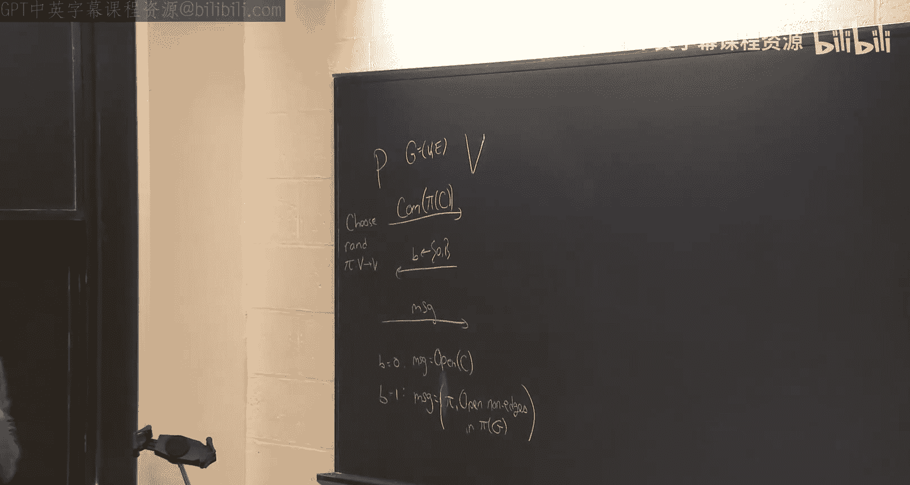
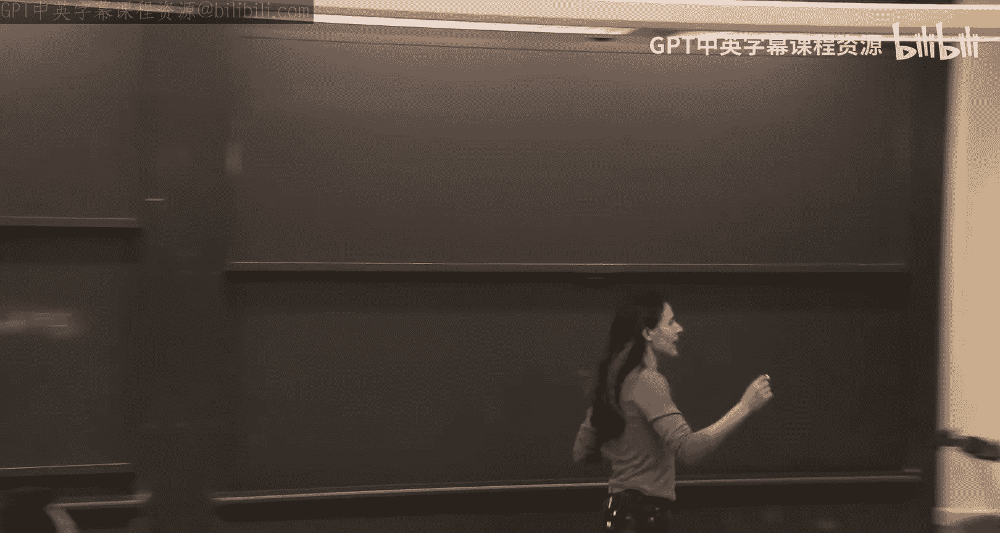
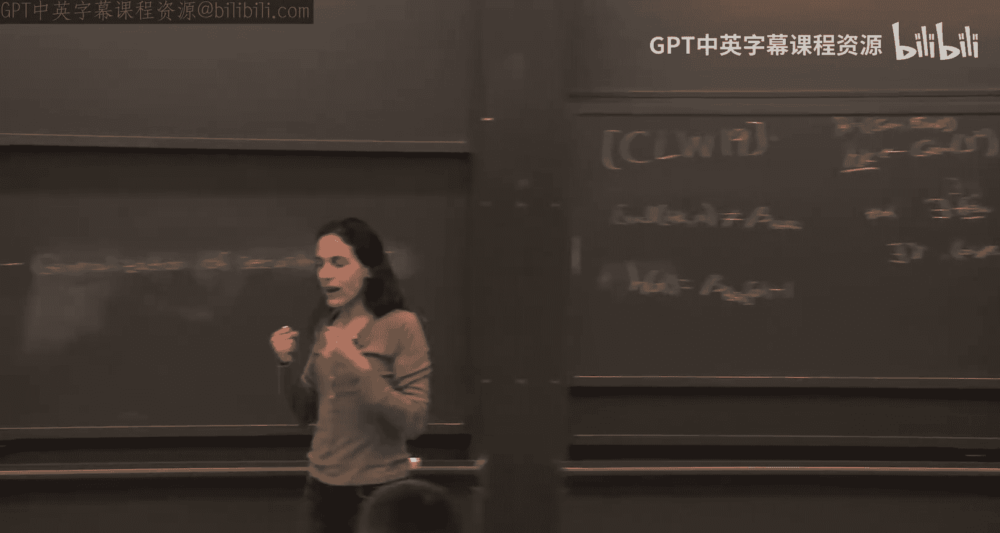

# 《密码学高级话题｜6.5630 Advanced Topics in Cryptography, Fall 2023》Claude-3.5-s p12 Lecture 7_ Soundness of the Fiat-Shamir Paradigm in the Standard Model, Part 1.z -BV1MVa5zXEmy_p12-

Let me first start with some administration。 So actually。

 some of you noticed that the PSAT problem number 2 B。There is a slight problem。

 I posted a comment about this in the website。 and I'm going to so there's an assumption I want you to make for problem to B。

 Just look at the website and the announcement。 if you have any questions come to me。Okay。

 so that's one thing。 The other thing is in Well next week is Thanksgiving。 So happy Thanksgiving。

 And the week after I'm actually away giving some keynote talk。 But we're gonna actually。

 it works out really well because the topic of。😊，That lecture is going to be about what's called bugs or batch arguments that would lead us kind of in the final class to get kind of our snags that we were kind of。

You know， building for and that lecture is covers a work by three authors， Jane Jin。Kudurti。

 Jane and Jin and Jg Zng Jin is going to come here and present the results。

 So you'll get the author kind of presenting the relevant work。

 And then the final class will kind of wrap everything up and show you how to get kind of the what we work for this entire semester。

😊，Okay， so just kind of what we're going to focus on for today。

 So any questions about administration about questions from last class。

 anything before we kind of go into the material。Yeah one thing。这个知て。Did do要 we like to add mortgage。

But if no， is anyone going to get succession work。So let's talk come to me after class。 Okay， okay。

 okay， any， any other questions。We'll talk about this after class。 Okay， so what's。

 what's the plan for today or where we kind of left off last class and where were heading for today。

 So last class， we defined kind of the Tre paradigm。 So kind of from the beginning。

 What did we do We showed kind of this kind of interactive protocols。 and then we showed like。

 for example， GKR， which is only for bound to depth computations。 Then we showed。

 you can build from that PCP。 And then use that PCP to kind of shrink it using cryptography and get actually four message that was the key and Mialli protocol4 message protocol proofs or arguments。

 computationally sound proofs for。😊，All of NP where it's very succinct。 Okay。

 so we can kind of take any witness for NP。 And instead of sending this witness， which is long。

 I don't know， poly and bits， I'm going to shrink it to kind of via an interactive protocols of four messages to get it kind of the number of bit is proportional to the security parameter。

Which can be much much smaller。 So that's we showed。 that was the Kimiccal protocol。

 But that was four messages。 So now we're kind of towards the home stretch。

 We want to kind of get around these four messages and reduce it down to just one message。

So how do we do that。 So last class we defined this paradigm called the Fchemere paradigm。

 It was introduced exactly for this purpose to kind of eliminate eliminate in from in protocols。

So by essentially replacing the verifier with a hash function。And now there was a question。

 It's a very nice， very simple， very efficient kind of paradigm， very elegant， in my opinion。

 But then there's the question， is it sound。 If you start with an interactive protocol that you can prove sound is when you apply the Fatremere paradigm is the protocol or the proof still sound。

 That's the question。 And what we proved for for this protocol can call protocol is it is sound。

 if you apply the Fatremere paradigm， but if you this hash function is kind of what like is a random oracle。

 So instead of being actually an explicit kind of circuit。😊。

If we think of it as a completely random function that both parties have oracle access to。

 then it sound。But in real world， theres， there is no kind of random articlesacs in the sky that all parties have access to actually use。

Specific circuits to replace this hash function。 And then it was kind of this question when we actually used the feature chi me paradigm with it。

With a specific circuit， with a specific hash that's computable by specific kind of circuit。

 is it sound。Okay， and that was kind of。Open for a long time was a very。

 very important open problem because future mineral is used all over the place of practice。

 So kind of understanding whether it's secure or not is very important。 And we had。

 we could only analyze it in the random oral model。 So now， not in real world settings。

 And as I pointed out last time， there are the random oral model actually worked out to be a very good proxy。

 So none of the schemes in practice actually that we proved security in the random oral model turned out to be broken。

 So turns out it's a very， very good proxy for security。😊，But still kind of， at least for me。

 as a thetician， I want to understand kind of why， you know。

 when we replace it with an actual function， an actual program， why is it secure So and frankly。

 I still don't understand why it's such a good proxy。

 I have to say it's still kind of it's surprising to me that never， ever we had like it's really。

 really kind of approximates you know， security in good very very well， even though as I mentioned。

 we do have counter examples， we do have examples contrid， not real worldor examples。

 but contrived examples where the protocol are secure in the animalal model and not secure in you know when applied fit to me。

 and actually interestingly， Ke and Mi K is one of them。

It's actually one of the protocols where actually， it was proven that。

If you use a certain hash function。Colllision resistant， but certain hash function。

 then actually you can prosecute if no matter which specific function you use for the phetmil for the phatmal function。

 it will not be secure。But this specific hash function， which is colgen resistant， is contrived。

 So we still don't have kind of real world natural application of where security was proven to rannaoral model。

 but turned out to be false in the， in the real world。Okay， so， so。

 so kind of that's where we're heading to。 Okay， trying to prove the security of or the soundness of the Fatir paradigm。

And kind of along the way what we did is I defined a certain protocol， which is zeros。

 we kind of took a Dt we talked about zero knowledge， and we looked at a specific protocol。

 zero knowledge protocol for Hamiltonity， whether a graph has a Hamiltonian cycle or not。

 that's an ncomplete problem。And so here's just a recap because we'll look at it again today。

 so here's a proof a three message proof system， the prover is trying to prove to the verifier that a graph G has a Hamiltonian cycle and we want to do it in zero knowledge so in a proof that gives no information and the way we did it we said okay the prover so the prover has a Hamiltonian cycle。

 he does not want to reveal any information about this Hamiltonian cycle to the verifier。😊。

What would the prover do， he will choose a random permutation pi？😮，He will commit。

 kind of put a safe， lock safe。 only the Hamiltonian cycle of。Pi of G。

 So if C is the kind of the Pa montonian cycle in G， he will compute pi of the cycle。 Okay。

 so the cycle inside pi of G。And then he's going to get a random bit。

 and he's going to give an answer。What is the answer。If the bit is zero。

 he's just going to open the cycle。系。He's just gonna open the cycle。 Okay， so， or maybe I should say。

 like pi of。So he's going to open only the places where where theres where there's a cycle and the guy is going check that。

 Yes， it's an indeed cycle。Okay， but we need to make sure that the cycle has something to do with the graph itself。

 So if the B is  one。Then we check that， indeed， that you give a permutation。

You do not give the permuted cycle。 Otherwise you willll give information。

 So you only give them the permutation， and you open only non edges。In P ofji。So now， you know。

Everywhere in P of G， that there's no edge in this commitment， there's no edges。Okay， so again。

 let me just emphasize to recap this commitment。 you should it's committing to n if n is the number of nodes in the graph。

 it's committing to n squared values where there's a one if there's an edge 0 if there's not an edge。

 okay for any IJ， it says0 or1， whether it's an edge or not an edge。And when we， if B equals  zero。

 we only open kind of the places where there's a Hamiltonian cycle。

 we check that everything there should be one， and you check that it kind of closes that it corresponds to a cycle。

And if b equals1， you give the entire perutation and you open the non edges。Okay。

 and now the claim was that this is indeed zero knowledge。 And the intuition was， well。

 if you open  zero， he doesn't learn anything because it just gets a random cycle。

 has nothing to do with the graph。Just any random cycle。 That's what he sees。 Okay。

 he could have generate no information about the graph。If he gets b equals  one。

 then what does he see， A random permutation and a bunch of openings of 0。 That's no information。

And as we said， the sound is here is only half。 That's a problem。 So only half you can cheat。

 because if you guessed。At cheating proveover， I can guess B。And if I guess be cry， if I guess be。

 I can at least cheat on that be。So I can always kind of。

Even if Jeep doesn't have a Hamiltonian cycle， I can always answer correctly。 one of them。

 but not both。So if I guess your P， I can answer， I can cheat you。 So this gives only soundness half。

Okay， this is just a recap。 And that was kind of I motivated this kind of show that this is not even secure in the randomoral model。

 So actually， to get security， even in the randomoral model。You need to repeat in parallel。

So today we're going con when I say now PV， like this。So when I say like the protocol PV。

 let me think of I'm， I want you to throughout this class。

 I think of it as parallel repetition of this。With like security security parameter Lada copies。

 Okay， so now。I mean， some stuff is really not good for us。 That's not what we want， so。

Think of it that we repeat this in parallel security a number of times。Okay， so in other words。

 the prover lambda number of times each time chooses a fresh permutation pie。Commits。

 so he does this Lada times each time with the new permutation pie。 This is very important。

 And people see why it's important that the permutation。It's fresh each time。

fuse the same permutation， and you open B0 B1， you learn everything。

So each time you give a fresh kind of random per mutationut， you send them lambda times。

 you get a B for each one。 and now you send a message for each one。ok。So that was the protocol。

 Now theres now， we proved that it's secure in the random work model。 Actually。

 we proved that any comes around。Protocol that has negligible soundness is secured in the animalnaoral model。

 We showed there last time。 So it's secured in the annaoral model。And now there is the question。

 okay， is its secure in the standard model when we use F meal。

And what we're going to show today is yes， it is secure。 So that's kind of the first thing。

 We're going to show that this protocol P and V。 And again。

 when I say P and V throughout today's class， it's a parallel repeated version。

 Okay so we're going to show that P and V are secure when you apply fiat meal in the standard model。

 okay。For some commitment， not every commitment， so we'll open this box a little bit then show that this is a very natural commitment scheme that with that commitment scheme。

 we can argue that this is secure when the hash function will actually construct a hash function I'll give you an exact hash function and say if you use this hash function for the phatir。

 you'll get security or soundness。

Okay， but this hash function to argue， you'll need to assume something about the hash function。

 I mean， you'll need to。 this hash function assumes some cryptography。

And the cryptography it assumes is the existence of a fully homomorphic encryption I'll define what that is。

 but not just a fully homomorphic encryption will assume also that it's circular secure。

 fully homomorphic encryption。 I'll define what that is as well。

 I just want to say actually today we don't need the circular secure version。

 we know how to get rid of it， but what I'm going to explain today does use this version。

 It's just simpler。😊，Okay， and this can be this， we believe this is true。

 There's instant based on circular secure learning with air， L W。

 But we don't need to get into these details。Okay， so that's what we're going do in the first part of the class。

 And the second part of the class。 So now you can say， okay， let's say we prove your。

 Why am I obsessed with this protocol。 And let's say your for this protocol， So what？ Like why。

 Why is that， Why should you be engaged？ So let me try to give you a motivation for you to stay awake and listen to me。

 So why is it it？ So this protocol in particular is so。😊，It's very important。 why so。

What I'm going to show is when you apply Fchere to this protocol。

 you get what's called a non interactive zero knowledge proof。Msic， for short。 So we get once we。

 we do that for this protocol， because it was zero knowledge。

 we can argue that when you apply feature treatment。

 you get non interactive zero knowledge and to get non interactive zero knowledge based on lattices was a。

Open question for a very， very long time。And this was resolved in this paper that I'm going to present in this work that I'm going to present to you by connecting Lo Badi and Wix。

 So kind of the one of the motivating examples is that we get this non interactive zero knowledge。

 That's one。But the other motivating example is that actually， this technique is much more general。

 Okay， the technique of Fir that that I'm going to show you is much more general than just for this protocol。

 Actually， it's a very general technique that can be used for many protocols。 And in particular。

 we used it later。 this exact technique。 and I'm going to try to show you how we can how it can be used。

😊，To get to show that the GKR protocol that we studied in the beginning actually is secure in the standard model in when you apply PhHM to it。

 you get security under learning with air or FHG。 Again， as I mentioned。

 this circle of security can be prevented。 I'm just showing you the result that uses it for simplicity。

😊，Okay， so， so it's not just for this protocol to get music， you can actually use it to get syns。

And more， what you'll see after Thanksgiving that Jiang Jg is going present。

 he's going to use this exact same tool to get batch arguments for MP。

 So this kind of fear to me is baked into all our， our results， almost。 Okay， so it's very。

 it's actually very generally nice。😊，Yes。😊，他们在这个。So为嗰 to。

Because last time we came back a little bit over the result of Bo Barak about。Great question。 great。

 great， great question。 Okay， let me， let me repeat your question because you have a great question。

 So last time I kind of showed you that there's actually a tension。

 If you have an interactive proof that is zero knowledge。😊。

Then I kind of gave you this high level intuition that if it is really zero knowledge。

 you cannot apply F chire to it， it will fail。And， and here I'm saying， oh。

 we're going to apply Fyamil to it。 And not only that， we're going to get zero knowledge。

 not in charge of zero knowledge。 Its like， wait， wait， wait， wait， wait， last time。You said。

 you can't get your knowledge。 I this， I'm kind of contradicting myself here。Okay， so again。

 let me repeat it just to make sure we're all on board。

 Last time I said a protocol that is zero knowledge cannot be fair secure。Now I'm saying。

 that's what this protocol is fair to me secureure。Okay， so first of all。Indeed。

 I have no reason to believe that this protocol is as when you repeat it in parallel。

 that it's zero knowledge。We know that it's your knowledge。If。

And the probability without par petition。We know that it's urology for you repeated sequentially。

If you repeated in parallel， we don't know that it's your knowledge anymore。That's first。Second。

 so now you're saying that next thing you can say is also now we know that it's not zero knowledge。

Almost， almost， actually， the result does show that peril repetition does not preserves your knowledge。

But actually， it's not going to be completely because I'm going to change the commitment in a way that you'll see in a minute。

 So not quite。 But then you can say， okay， but how do you get niic out of it。 How do you get。

It seems completely opposite because I just said Ph2 me in contradictory of zero knowledge。

 And once you apply Ph2 million， you get zero knowledge。Okay。

So what we get is not in of zeal knowledge。And not interactive zero knowledge， the simulator。

 I didn't define what it is， so I'll explain it as I go。

 but the simulator has more power than the cheating prover。

 remember if the reason I said that if you have a zero knowledge protocol。

 why can't you apply Fet chimune because we said look？

The verifier can achieving cheat verifier can use the phatrm function。

 He can behave maliciously behaving with the phm function。Now。

 you should be able to simulate the view。So if you have an efficient simulator that simulates the view for x in the language。

He can't。 He's a efficient simulator。 He doesn't know what which instances are in the language or outside the language。

 It's N T。 It's hard language is。 So he probably will succeed in simulating the view of instances outside the language。

 Otherwise， he's like a P。 you know， he's kind of a distinguisher。

 you can use him to show that the language is in imp P， not an NPp。 So he， you know， so， so。

 and that's why there cannot be a simulator because the simulator， he can act like a cheating prover。

In the non interactive setting， he cannot， because we're giving a simulator extra power to choose the common reference string。

 We'll talk about it when we get there。 But it's a model that's a little different。 So actually。

 I planned。 I'm going to talk about this more in length when I get there。 But since you ask。

 I want to give a preview。 So indeed， there's tension and we'll see how to overcome it。

 It's actually really interesting that kind of you know， that it's a belief that you can't get use。😊。

Fat meal wants0 knowledges and kind of a contradiction to theat meal。 But actually。

 we use Vi milk to get。The non interactive version of zero knowledge。

 but we'll go into detail when we get there。Great question。A， any， any other questions。

So my plan next is to prove the secure， the soundness of this protocol。

 the per repeated version under Fetcheil。 But any question before we go there。Okay。

 so let's I the the result。 So as I said， this is a result of。嗯。Connected about in weeks from 2019。

It's so beautiful and simple。 So this was an open question for a very long time。

 And we I want to give it to you as a kind of evidence or an example of something that we thought was so hard。

 so hard， so hard。😊，If you just think about it like a little differently， you twist a little bit。

 it's so easy。I want， I'm gonna have you guys try to come up with a proof。 Okay， I have this。

 So let's try to do it interactively。 And I want you to prove to me that this protocol PV。

 But think of it again， per repeated imperel is sound。

ok。So I'm going to give you a few hints and we'll get there together。 Okay。

 so one thing that's really nice about this protocol。😊，Is so okay， I want to argue， okay。

I want when let's recall what is the F a paradigm， The Fir paradigm says that， you know。

 we choose some hash function， some hash key。From。You know。

 there's some feature chiamine hash function that generates a hash key。And now we want to say。

 let me denote for simplicity this kind of these messages by alpha beta and gamma。 Okay。

 even for now， let's even not think of this specific protocol。 Okay， let's think of just a protocol。

 The proveover sends Al ver send beta provever sends gamma。😊，Okay。

 even don't let's not even go into the specific details。I want to prove。

To come up with a hash function。 So I want to come up with a hash function H， which， you know。

 generates a key for a hash and then evaluates。That's just a hash function。Such that。

 this remains sound。Okay， so I have this， there's a NP language axon prove whether it's in the language or not。

 This is my proof system。And I want to find the half function for which you sound。So what does this。

 at first， it seem like it should be very easy。 Why should it be very easy， look。Take。

 let's say X not in the language。 We， We need to focus on X non the language。 X in the language。

 it's complete。 like complete。 is that's easy。 I won't argue you cannot cheat。 Okay。

 so now what do I need to say， I don't say like， I want that for any X in the language。

 So  fix1 x not in the language。to argue that you can find an alpha。And beta。

 which is H of alpha and the gamma that's accepting。This is a proof system。

So every alpha has very few betas。For which there even exists a gamma that's accepting。Right。

 so again， because it's fixed Xandander language。 First thing we notice just by definition of a proof。

That for every alpha， any possible alpha， there exists very few betas for which there exists in accepting answer。

So there exists few， very few betas。Such that。There exists gama。For which alpha beta gamma。

Are accepted。Okay， so that's the first thing we notice because it's a proof system。

By the virtue of a proof system。For every alpha， there are very， very few。Actually。

 note in this protocol specifically， there's one。1。😮，Because。

The graph G does not have a Hamiltonian cycle。Take a cheating prover as that general sends Al。

 Alpha is a bunch of commitments。Now let's actually in each commitment， look。

 either they're sitting aian cycle or not。You can't answer both questions。 We know that。

 if you can answer both questions。Well， it won't be sound。

 so you can only answer one question and each one can only answer one。So this protocol。

 it's even for this specific protocol。 Let's assume even。 Let let me be， let's even assume。

WhatWhat any proof tells you is that for every alpha， there is this a few。 but you know。

 let's for simplicity because that's the protocol we're dealing with。Let's suppose。

There exists a unique。This is a symbol for unique bying。

 There exists a unique beta that can be extended。Now， all we need to do is not hit that beta。

So all we need， I can think about seems so easy。 All we need is to find a hash H like a hash key。

 such that。Eval of Hashkin N alphapha is non equal。

So let me call for every effort there exists a single be。 Let me call it better a bad。 Like that's。

 that's the better we want to avoid。Okay， so for every alpha， there exists a single。

Bit of bad of alpha。 It's a function of alpha for every alpha， for every commitment。

 There's a different。Either you can answer 0，1。 So for any alpha。There exists one challenge。

 beta for which the prover can cheat。 Now， the cheating prover wants to hit that bad beta because that's what he can cheat on。

Our job of protecting this is to find。To make sure that every un does not equal to this beta bad。

But how hard can it be， We just want to avoid one。You know what， let me here。

 let me give a suggestion。Eval hasshki or myth here H of alpha equals beta bad。Of Al plus 1。

It's not but the bad， I avoid the bad one。I'm going use this for my hash function。

Anybody see a problem with this？Yeah。😊，Well， it's not really unique way it。De gives an。No， actually。

 I'm I'm using the computation。 Okay， good。 So what will say said， well。

 actually it's not unique because the commitment here has a computational assumption， but actually。

 this commitment will be statistically binding。 So it's only the hiding is zero knowledge is computational。

😊，But actually， you can open it。 supposeupp there's really like you're binded。 Okay。

 you can really openly open it in one like you can open two different ways。 going be。

Many presentations for one。That's fine。 That's fine。 But you're right。 Theres many permutation。

 but suppose you can open to both。 Then you can give me both this message and this message。

If you give me both this and both this， it means that。You have to have this dream must have a cycle。

Because。I know that there's a cycle。 And guess what。 It's not in the9 edges。

 So the cycle has to be in the edges。So， so you cannot really， you cannot。 You can open only one。

Okay， so again。All I want， it seems like so easy。 I have a proof system。For every elephant， actually。

 the proveer can only cheat one single data。I want to a that beta。So， I' just avoid that。

 do better pass one。This is delicate。 Anybody see why， why this doesn't work。Yeah。

 don't you have to open the Cl to find out which is the bad beta。 Exactly。

 the problem is computing beta be is really hard。 How do you know what beta bet， For example。

 So computing this is hard， actually。If it were easy， you wouldn't need interaction at all。

It will be N。 Youll have a 62 minutes for MP。 You just give alpha you。

You compute this is the beta then you give Gama and everything's information throughout at it。

The problem is computing。😮，That power of this thing in the power of this interaction lies on the fact that computing what the bad beta is is hard。

Here， for example， how do you know which beta you can cheat on？Well， if you open the commitment。

 then you see， okay， there you know， is there a lot of ones。

 is it only to cycle but you need to open this commitment。

So computing this beta is hard without additional information。Okay， so now what do we do？

So we can't give that as a hash function because this is a hard computation。Okay。So。

 here is the first kind of。So there are a few aha moments in this paper。 The first one is。

 you know what。Maybe if this commitment。Had some trap door。 Maybe， you know。

 there's some trap door information that with the trap door， it becomes easy。So， then let's do that。

Let's use trap door in our hash function。Okay， so now two things I'm gonna do next。

 First show you how you construct a commitment with a trap door that will also be useful here。

 So it's gonna kind of be a stepping stone。 So I show your specific commitment， which is what we use。

 which has a trap door。To make better easy。And then we're going to deal with the next issue that comes up。

 which kind of the next aha moment appears in， which is， well。

 you can't use this trap door in the clear because if you just you can't give the cheating proveover you can't give the cheating people like the trap door actually the problem will not be the cheating proveover。

 the problem if you give the trap door， it's not zero knowledge anymore so this trap door needs to stay hidden。

 you can't just use it like put the reason it's a commitment that it has a purpose。

 we don't put things in the clear for a reason。so。Well。

 first see if you can make it efficient given the trap door and then we'll show how。

This nevertheless， even though we need to keep this trap door secret。

 the fact the mere fact that it exists can be useful for us to do the feature meal。Okay。Questions。

Let me remind you that I really like questions。Good， bad， all them。They're all fantastic。 Yeah。

 just curious。 It's like a common random screen coming the。😊，Like step where you want。

like somehow then So the common random stream will be used in many places。

 The first place it's gonna to be used is even to make to make sure my commitment has a trap door。So。

 and then it's going to be used again and again。 It's going to be used all over the place。

 So we'll see that next。So any， any other questions before we proceed。Okay， so step one。

 let me just tell you how to construct the commitment so that it has a trapor。

And the way I'm going to do it is just using encryption scheme。Okay。

 so let me define the notion of public encryption。 And did we define public encryption last time。No。

 right。 Okay， so， okay， so let me define the notion of encryption and we'll use that as our commitment scheme。

 Okay， so what is an encryption。So， a public key encryption。With message space。

 there's a message space associated with it。These are the messages that we're going to encrypt。

 it consists。Of three algorithms。So。1 is Jen。Not to be。 it has its own key generation。

 not to be confused with a hash function that generates has key。 this generates。

Public key and secret key。So this just generates。A pair a public key and a secret key。

Let me just mention three。PPT。Alriths， so we have probabilistic polynomial time algorithms。

 The first just generates two keys。 The public A and a secret key。

The encryption algorithm takes as input， a public key and a message from the message space。

 and it generates。A ciphert。Okay， from a ciphertex space and the third algorithm decs。

 So it takes a secret key。And the cipher text。And it generates a message in the message space or。

Or like but， name I failed。 I tried the group， but I failed。Okay， and the properties we want。

The first is correctness， or completeness。Which just says。

 if you encrypt the message and then you decry it， you get your message back。Okay。

 so just says for every M。For any message。If you， the probability。That you decrypt。

 So the probability is over a sample secret key in public。Public and secret key。From Kijn。

And then use the secret key。To decrypt an encryption of N。So it says if you encrypt end。

 you generate a pair of keys。You encrypt the message。And then you decrypt it。

You get back the message。With probability 1。Okay， that's just correctness。

 What do you expect you take a message， You encrypt it， and then。You decrypt it。

 You should get the message back。The important property then is security or what's called semantic security。

And this says that any two messages， if you encrypt one or encrypt the other。

Can distinguish between the two。 They look the same。 They're computationally and distinguishable。

So just says， for every。M0， and M1。In the message space。So typically， we think， by the way。

 the length of n is revealed。 Typically we think of the message spaces having fixed size for us throughout this entire lecture。

 and often is the case。 We can think of M as just containing two messages。

The zero message or the one message。And if you want to encrypt longer message。

 you just encrypt bit by bit by bit。 That's a common way to do encryption， not in practice。

 but in theory。 In practice， it's often not fast enough， but in theory。

 you can just encrypt each bit separately。But in general， for any two message in the message space。

 if it's just01， then for the message0 for the message1。

 the claim is that if you generate public key， according to Gen and encrypt，Im 0。

This is indistinguishable， computationally indistinguishable from generating a public key。

 according to Gen。And encrypting。Message 1。So for any messages。

 you know the messages I I'm telling you， I'm encrypting I' 0 or M1。You can't tell the difference。

 I'm giving you。 You don't know。 I'm giving you one of them。 You have no idea if it's them。

0 encrypt or them1 encrypted。Okay， note， there's no randomness over the messages for any two message。

 fixed messages。 You don't know if I encrypted。 Yeah， So even you don't if I encrypted。

 And if I give you two encryptions of 0， or I give you encryption of 0，1， can't tell the difference。

ok。So that's the definition。 And we have these public encryption schemes under a whole slew of of assumptions。

 lattice based assumptions， not lattice based like a discrete log that we saw earlier in the semester and so on。

 but I don't want to talk about instantation because this is more kind of class on proof systems。

 and I don't want to make it too hardcore crypto。So let me just use this not show how to actually construct this。

 but we have many instantiation constructions， but suppose we have this。

 Let me show you how what what the commitment would be。

So now what I want the commitment to be instead of commitment， make this an encryption。

Let me actually put another。Color。So make this be an encryption。With some public key of pie。

So what I'm telling the prover now， I'm telling， look， I want to be able in the analysis。

 at least to open up there and see kind of。where the ones are north as01。 So that later。

 I'll be able to understand where the images are。 And so， what's the bad beta。So now I。

 I want to tell the prover， So please don't。 the commitment why't you send me is the encryption。Now。

 it's hiding。 It's still hiding。 Yeah， nobody。So nobody it's still0 now。

 It still satisfies kind of its luck。 It's like the verifier can has no idea what's in there。

And supposedly， and it's still binding because， because。You know， once you encrypt your stock。

 it's like it's it's the message your the message is sitting there because then you can use the SQL key to decrypt it。

So it really has the hiding and binding property great。 It's like a real commitment scheme。Yeah。😊，呀。

Does publish encryption imply that there's no？Possibility of a second super key that dec encrypts into。

Okay， great question， great question。 So the the great。 So you're asking， wait。

 what if the public key has many secret keys associated with it。

 And one of them decrypts to M and the other one decryptps M prime。 Let's say。 So no， here I say no。

 by my definition。 No， because my correctness says。😊，That if you choose public key secret key。

 pair with probability one， you will always。Get your message back。

So there is no secret key that will give you different message。 That's my definition。So your。

 what you're proposing is not for me。 It's not doesn't satisfy my my definition。

So now use a public use a public encryption that sat my definition。So now we are kind of。

 now you're binded。Good， great question。 These are really， really great catch questions， yeah。

here the probability expression of chosen P public scriptQ all come from the same gem function what like。

Like it doesn't give you any Singapore。Okay， very， very good question。 Very good question。 So what。

 what， so the point was the following。😊，Look， we have all these guarantees。

The correctness and the security， assuming the public key is generated according to Gen。Now。

 my question here， who generates this public key？How do I know zero going to Gen。

 if we let the prover generate， generate the public key。

He may then maybe it's a ban public key that is never going to appear here。

And for that bad public key， maybe your concern is valid， maybe you can open it in different ways。

And you're completely right， that is a problem。Actually， even in our， it's not hypothetical problems。

 hypothetical problems， our schemes that we use that we want to get。

 we want to get the central lattice assumption。 That specific scheme we use。 Has that property。

 Has that problem that if the key is generated badly。Actually， there's no binding， I can cheat。

 I can open two different ways。I will never be able to do that if I generate， according to Jen。

But if I generate it maliciously， I can choose a very bad public key。

 Nobody will be able to tell the difference。 It will look like a good public key。

But it's actually generated completely differently。And it would have never appeared in Jen。

 And with that public key， theres no no correctness， and I can cheat and I can do whatever I want。

So very good。 you found the problem in this approach。So what do we do， how do we fix it？

So this comes to your question in the beginning。 Well， you know what。

 let's assume that there's a trusted party that generates this public key for us。

So let's assume for now that there's kind of a common reference string。 We all agree。

 There is like a public key sitting here。 that's in the kind of what's called a a common reference string or a common random string。

 Everybody knows it， both the prover and the verifier。 we all agree on this public key。

 and we assume that it was trusted， like generated according to Jen。 Nobody has the secret key。Okay。

 nobody has a secret key。 We'll never need to open the secret key。So in this protocol， what we do。

 What do I do， I'm a prover。 I encrypt it by bit。 So how do I encrypt I use randomness。

 So I didn't say， but this encryption is a randomized protocol。 So I。Choose randomness。

 I encrypt the bit。 I choose randomness。 I the next bit。 I choose randomness。

 I encrypt the next bit so on and so forth。 And when I'm asked to open， I reveal my randomness。 I So。

 look how I encrypted。 See， there is randomness。 I took the encryption。😊。

With public key and my bid 0，1 with this randomness。 And see， that's what's written here。 So I。

 I can just open by， by without using secret key。 Nobody knows the secret key。

 The secret key is gone。 Someone just came with the public key。

And I use the I open here now with a secret key， but oh， I show you the randomest I used to encrypt。

And that kind of， you know， is an opening for me。Yeah， does your cRS like。

A fully like uniformly random screen， because if you were to read out the public app。

 you could also like pull out the secret。So， okay， so the question was great， great question。

 The question was， does that mean that the CRRS here cannot be truly random because it's not truly random it's a public key。

A public Committee not be truly random。And the answer is， well。First of all。

 some Pamble Ki have happened to be truly random。The public key for this game scheme is not truly random。

 However， it's indistinguishable from being truly random。Now， so the scheme we actually use。

 the public has the property。 It's not random。 It's like L W E to Po for those who know what learning with areas is。

But it's not that's not truly random， however。It is indistinguishable from random。Now。

 if you have soundness with public that in distinguishinguable from random。

 soundness should hold even if it's completely random。So actually。

 you can make this completely random。And actually in the paper。

 they actually take advantage of that because if the public key is completely random。

 then you get statistical zero knowledge， computational soundness。

 whereas if you can play around with in this protocol especially when you go to the untractive version。

 there's attention， you can either get statistical soundness and computational zero knowledge or statistical zero knowledge and computational soundness。

 and you can play with this public key， whether to make it kind of the true public key in which case you get statistical soundness and computational zero knowledge。

 or if you want to take like a fake public key， which is the all zero and then you get computational soundness and statistical zero knowledge。

 so you can kind of play with these things。😊，Okay， so this is the。

 the protocol for which will show that F chimy holds。Okay， so again。

 the commitment is just replaced with a public encryption。Yeah。

Common reference I mean the public key by， for example， changed the in the way of opening。

 for example， we also also require the approval to provide the randomness for。Oh， that's a good。

 okay。 And I didn't think。 Okay， good。 So what you're saying， good good suggestion。

 What you're saying is you're saying， wait， how about he gives this public key， it can be malicious。

 But when he opens， we'll ask him okay， so I'll tell you the problem with that。If when he opens。

 he gives the randomness he used。 So you certain， why don't he give the randomness he used to generate this public key。

 Now， you know that it's a valid public key。You that will indeed ensure soundness。 However。

 that will break the zero knowledge。Because once you give the randomness。

 you also give the secret key away。Cause this randomness was used to generate both of them。

And if the secret key， then you lost the the zero knowledge。But great suggestion。 Okay， great。

 you guys。 It's clear that you are thinking， which is fantastic。 Great suggestions。😊，Any。

 any other questions before we。We move on。Okay， so， okay， so we're making progress。 Now。

 what do we know， So let me。Hide this encryption for a second。Let's go back here now， okay。

 now I want you actually to。Forget that this was an encryption because we'll use another encryption。

 Okay， and I don't want you to be confused with this encryption， the other encryption。

 What I want you to remember about the commitment that there is some trap door like a secret key。

 I'll call a trap door on purpose because we'll have another encryption。

 which will have a secret key。 So I want what I want you to remember about this commitment is that there's some trap door information that with that trap door information you can open and know which B is bad。

Okay， so a trap door has a commitment， has some trap door information。

Okay， which allows you kind of to open it。 in that case， open the encryption。

 And then you know where the ones are。 and that will help you decide。A where where the bad bee lies。

Actually， you know， I think I need to also add a commitment to pie there。Because otherwise， I'm。

How do you know which maybe you can tell anyway， if you had a commitment to pie， it's easier， but。

EIf you don't add a commitment to pie， is it clear that just by seeing onces， it's easy to test。啊。诶。

Yeah， I guess I guess if you open both， you can see both。 Yeah， I don't think you need it。 Okay。

 but anyway， so so， so good， sorry， so， so now what I wantan to， I want to do， I want to say。

 here's my hash function。 It has trap door hardwid to it。Once he knows the trap door。

 this trap door depends on the public key and the kind of the CRs。 it doesn't depend on the actual。

 Once he has the trap door， he'll know what the bad thing is and done。Okay。

 it would be nuts one can say， okay， use this。As the feature mirror has function。Suff， it's good。

 However， as we said， the problem is。Then， you know， the trap door sitting there。 you know， you know。

 the trap door once you're in the trap door， stands your knowledge。So that's the problem。And那。

There were attempts to try to do。Okay， let's obfuscate these things And a lot of kind of hammers were thrown in this direction。

 And it resulted in crazy assumptions。 And anyway， there was a long kind of line of book where。

 That's what we tried to do。ok。But then。Here is their idea。So now I can tell you the next aha moment。

 So again， one option is to throw kind of what's called obfuscation at this for those who don't know obfuscation。

 don't worry about it， It's essentially garling so that the chapter will be really hidden there。

 nobody would be able to find it。 And even it was like a messy approach that we tried。

 and we got really， really strong assumptions， which Ino of the true or not。

 It was kind of a messy approach that a bunch of us， a bunch of papers kind of follow that approach。

Very complicated。 And， you know。Okay， then came this paper。And here's the， the， here's the。

Beautiful idea。Okay，So the beautiful idea was the father。 They said， you know what。😊，Yeah。

 you can't give trappor。 That's a problem。Given an encryption of trap。

 forgetget about this encryption。 right， that's a different encryption。 So theyre now fresh。

 new encryption。Why don't you give encryption， Let me denote the encryption of trapbor here by hat。

 That's off a common way we use fully homomorphic encryption， which I'm going define next。

So they said， put in this in in the Fatum hash function， an encryption of the trapor。

That helps you open the commitment。That's like， so， okay， and then what。

 But what do we can do with this Cyphertex。We can't do anything with it。 Cyphert is like junk。

 What do we can do with that？So the idea there idea， you know what？Don't just use any encryption。

Use what's called a fully homomorphic encryption。What is a fully homomorphic encryption。

 I'll explain that next。But essentially what it does， it allows you to compute unencrypted data。Okay。

 so a fully homomorphic encryption is exactly the same。As a encryption scheme。 So fully。

 it's a public key encryption。So let me write a fully homomorphic。Public encryption scheme。

Is encryption scheme Gen encrypted decpt， but it also allows you to do computation and encrypted data。

 So what do I mean， There is an eva function。It takes a bunch of cphertex。

 and it can do computation and the bits hiding underneath the cphertex。So it takes a public key。

A description of a circuit， C， think of it with additions and multiplication module2。

It gets a ciphertex， So encryption of1 of B1， bit1， let me think of it now， as I said。

 think of it as。The message space being 0 and1。So it gets encryption of bits。Let's say encryption。

Or I'll just call it Cyphertext。 Cyphertext 1 up to Cyphertext N。Each one encrypting a single bit。

The circuit takes as input n bits and produces a bit。And it output some safer text。

And this ciphertext。If here you have encryption of B1， B2 up to B N。

This ciphertex should have encryption of C of B1 up to Bn。Okay， so what this Eval does？

It gets encryption of bits。And it can kind of compute an encryption of the addition of the bits。

 encryption of the multiplication of the bits and so on so forth。It can do arbitrary computation。

 It can compute an arbitrary circuit。 C， C goes from 0，1 to the n。To 01。

It can give arbitrary computation under the FHG。So let me I'll just write。

 maybe I'll write here the completeness property for the event。

 so I wrote the completeness property where all you do is decrypt。If you encrypt in decpt。

 you get back the message。The eventvan also has a completeness property， which essentially says。

 so let me just write it down。 So completeness of Yvan right it here。It says that， for every。

B1 up to B N。And the probability。That when you decryptvan， Oh， sorry， for every C。

For every circuit see， when you decrypt。So choose a public key secret key pair。When you dec。

 use the secret key。To decrypt the E function。 So now evaluate。

With respect to the public key and as the circuit see， evaluate on this and the。

Andcipher text corresponding to B one up to B， N。 So encryption， public key with B1。

Up to encryption of public key and B Bn。So encrypt each of these bits。

 You'll get encryption of B1 up to encryption B N。Then evaluate。

 do homomorph computations and these encrypted bits with respect to that circuit C。

Now you get a ciphert。 you should get a ciphertext that encrypts the C if you want of to be。

 and indeed， the probability that when you decrypt。You get C of B1 up to be N。Is one or close to one。

Okay， so again， what Eval does， it does a computation and this encrypted data。

 It computes an arbitrary circuit C。That that when you decrypted。

 and did you get C with probability very， very close to one。 I wrote here one minus negligible。

 as opposed to one is because our scheme have this negligent probability error。 So that's why I。Okay。

 so again， high level， what the FHE allows you to do fully homo encryption allows you to do is to do this computation and encrypted data。

So now the idea is okay， So okay， questions about the folimorphic encryption。We good。Yeah。

Matter of what。等。Like I was thinking just like。Good， good。 no， that's actually a very good question。

 It's a very good question。 So the question was， this circuit see， what is it。

 So the circuit C think of it as a circuit that has addition and multiplication gatesma2。😊，ok。😊。

So any polynomial size circuit that has addition and multiplication gates码 to。 Great。 Thank you。😊。

Other questions？Okay， so now let's go back。 So now we have an encryption scheme that we can do computation and encrypted data。

 Now let's go back。 Remember， where are we， We're saying， all we want is to avoid this bad。

We want a hash function。 It only purpose to avoid one single point。 How hard can that be。

The the hard problem is it needs to avoid the bad point for each and every alpha。

 That's kind of the hard part。 Now for every alpha， you need to avoid the bad one。

 If you just wanted to avoid a bad one for one alpha， choose random。

 probably you're not going to hit the bad one， but you need to avoid。

The bad one for each and every alpha， that's kind of harder。Okay， so now。

 but if we have the trap door， then it's easy。But we said， look。

 we can't give the truck doors that will break zero knowledge。So instead we say no。

 let's give a homomorphic encryption of the trapor。Now， this seems like not helpful。

 Why is it not helpful？ Okay， let's say you can encrypt you can compute un encryptryed data。So， okay。

 do the computation of computing bad。 So suppose you have。 So now here's my hatch function。

 It has trap door hardwi。 So think of it like H of instead of trap door， it'll have hat of trap door。

 Why not。And it will do this computation under the hood， like with Eval， you know。

 under the hood of the encryption， very nice。 So now on input Al， you won't get the bad。

Bad Al plus one， very nice， but encrypted。So why is that helpful？Yeah my encrypt two different。😊。

Again， what are you saying encrypt？The那天在と一块。You you can exactly。 That's kind of what so。

That's kind of what I'm doing。 I'm saying this is the this is， okay， this， okay。

 this is a shorthand for this is actually Ivan。Of this is kind of the hash key。

 The hashki will have kind of trap door in it。And an input alpha it it output with this。

 And what we're doing we're saying， okay， encryptto or you can think of it。

 the hashke being trap door and encrypt the entire thing。

You can do everything under the hood of the encryption。 The problem is you'll get it。

You want the output to be different than beta， don' you get aciphertext。I want。

 I want this to be different than beta。 That's what I want。

I don't want like underneath the hood to be something that's different than beta。

So this seems like a bad idea， like it gets us nowhere。Yes， again。

 where we said if we knew trap door。We would be done the hash function。

 They develop the hash function。 We'll take this trap door， compute beta and outputll put not beta。

 You know， move it by one， move one of the bits by one， whatever。

 as long as it doesn't have the beta。And now they say， no， let's do everything under the hood。 What。

 Then we'll get an encryption。 Why would that not be bake。 Like it seems like。

You're not getting anywhere to me， it seemed。 it seemed like when they first presented this idea。

 I'm like， okay， this seems completely useless or what。 Now， everything is under the hood。

And guess what we're almost done， yeah。It how like find the random that gets us。

You take the randomness。to find the relevance so that。In was one。一3す。So you know what。

 I want to say something even before that， there's even a mismatch。Beta， let's say。

 consists of lambda bits， for example， in our case， because we repeat it。 it's lambda bits。

 This is not even lambda bits。It's much more than1 bit because we encrypt that by bit。

 It's much bigger。 It， it doesn't even。ItIts like seems like completely bo This is going to be the length of beta time security parameter。

So， it's not them。It doesn't even correspond to。Like the sizes don't even match。

So it seems like an encryption is not helpful。Yeah。Beta bad given Al Oh， good。

 he the only way he can compute be bad is if he has the Oh。

 how can you compute given the trap door you're saying。 Okay， what， yeah， so what he will do。

 the trap door in this protocol allows you to kind of open the commitment。Okay。

 so now you see each and each point if it has a 0，1，0，1，01。So now why。

 why do you know what's bitta bad， Because now you look。If it has just a Hamiltonian cycle。I mean。

 the truth is it's easier to see it if you have the， the the pie。

 supposeuppose you always also committed to pie， where it's just easier to see it that way。

 Suppose I tell you， don't only commit to that。 commit also to your pie。Now， you see what's in there。

 either if you're a move pie， you see what if you so you see if。

So you look at all the edges of pi of G。And you make sure that these edges are 0， Every they're0。

 If one of them is one， you know that he won't succeed and open then。Then this is not bad。

 Then the beat equals one is not bad because here he will fail。 The bad is where he will succeed。

 A bad beast， the bee that like a bad be， the better they will allow him to succeed。

So now if you can open everything， now you can see。If there's one edge of pi of G。

If there's a nu edge that has a one。Then you know， okay， this is definitely not bad。 He can。

 And And so he won't be able to see。 So this is the bit of bad。 On the other hand。

 if all the non edges are indeed 0， you know there he can't open Hamiltonian cycle because there is no Hamiltonian cycle。

 So then this becomes the。 So then this becomes the bad。 So if you know what's in the commitment。

 you can tell which one is the bad。 So the trapor allows you to compute the bad efficiently。

 That's the point。 Yeah， I the traps the random coin used in each cold。

The random coins those like the randomness that's used inside each tank。

 like is that what the truck door is？No， Im， I want。

 I'm thinking of the chapter as being the secret key corresponding to the public key。 So you， you。

 I'll tell you the， the problem of using the randomness。Then it's chosen by the cheating prover。

 And I don't know what。 I don't know how he's going to use it。 I don't want the trap door。

 You write at the trap door。 Okay， let me， this is an important point。 So note。

I can open this commitment。By giving you the randomness that I use to generate this commitment。

 thatll be a good trapor。But when I designed the fair terminalmir has function。

 I have no idea what the cheat what randomist the cheating prover is going to use。

 Maybe it's even deter deterministic。 I don't know what he's doing。 He may just give him me a bun。

 I don't know。 So I， I don't know ahead of time。 His random coins and different cheating proves will have different random coins。

So I want to put something in the CRRS， you know， the hash function， the feature hash function。

 So this tractor is actually going to be the secret key corresponding to the public key。😊。

The secret key is not going to be used in here。 It's never going to be used in the protocol。

But it will be used in the analysis。Okay， great。 yes。Intractive you coming to the witness。

 so you need to ask what the first message is thought。です。Again， you're saying。

 is this only system where you commit to the witness or can you drive。Pro system where you。

 the first message say something。So okay， so this， this technique works。Okay。

 so this techniques works for this protocol where you commit to something in open。

And after I'll show you why， I'll show you that it's actually more general and it applies to a large actually slew of protocols where there's no commitment whatsoever。

 for example， it applies to GKR protocol where it's just a sum check。

 it applies to the subject check protocol。And so it's not specific to this。And I'll show you later。

 All you need is kind of this trapor that tells you where the bad kind of challenges are。

 And Mon a trapor that tells you where the bad challenges are。Then you you kind of can use it。

 but we'll we'll mention that at the end of class like towards the end。 But yeah。

 it we'll see that it's general。 So in some sense， you don't even need to look too too detailed to that protocol。

 It's the idea here is more high level。 we say look， in any interactive proof。

 theres the beta that are bad that like bad for security。That are good for the adversary。

 but they're bad for security。 If the adversary managed to hit a bad beta。

 an alpha for which H of alpha gives them a bad beta， then he can cheat me。

 I want to avoid these bad， bad betas。And now we're saying。

 suppose there's only one bad be for simplicity。 This one has one bad beta。 So we're good。

If it' one bad but all want to avoid Taiwan。Now， if there's some trap door。

That allows me to compute that be， bad beta。Then I can't put the trap door in the kind of the hash function and give it to the world。

 There's a reason why it's a trap door not public。 in this case， it's for zero knowledge。

But what I can do is give an encryption of the trapor。And actually， in the actual scheme。

 it won't be encryption of that trapor encryption of 0。 Nobody is going to aver to this thing。

But let's think of it as an encryption of the trap door for now。Now， again， where are we。

 Why did we make any progress here？没。So next is the most amazing point， I think。When I saw this。

 it took me a very long time to process because it's such an ingenious idea。But， here's the idea。

Okay， so they say， yeah， you know what， I'm gonna take the I' nevertheless my hash function is gonna so so they so then they say。

 okay， you， you're right this kind of hash function that has the a the trap door in it。

 and you evaluate the trap door。 That's you're right。 It's sound good。 It doesn't even type check。

 The output is not the， the length it's supposed to be， yeah， this is nonsense。 Let us fix this。

And here's how they fix it。 Let me put the valve here。 So because it' would be nice to see。😊。

So here's their fix。 They said， you know what， fine。 That may have been the wrong function。

We're going to encrypt。R CRR R hash key is going to consist of encryption of another function G。

I'm using it， by the way， I'm using the hat。To denote fully homomorphic encryption。

 as opposed to standard encryption。 Okay， that's often we use in the literature。

 the hat is kind of a shortcut to denote public key comma encryption of of G。

 And when you use this hat， we usually use it when we want to talk about fully homomorphic encryption。

Okay， okay， so now they say， okay， this is going be my。 Nevertheless， I'm going to encrypt to G。

 What's this G well see。I'm going to encrypted G and my So so my So here's their hash key。

 What the here the hash key is going to speak。I'm going to generate a public key and an encrypt cryto function G。

Okay， so it's like the public key corresponding to G and then G， which is just another shortcut。

 the same encryption。FG。And when I say encrypted G。

 just think about encryption the description of the circuit。 Okay。

 so there is some way to describe the circuit， I encrypt the description。Okay。

 so I encrypt this description of a circuitge。What this G will see。Okay， but that's my hashke。

So this is the Hashki。How do you what how do you evaluate？Hashki and alphapha。They say。

 you know what， just compute G of alpha under the hood。

How do you compute G of our founders though essentially they say to the evil of the SG。😊。

There's two events， So it's a bit confusing because we usually don' know the evaluation computing the hash function byval。

 But now we also have the e。Of the volumemorph encryption scheme。

So take the fullymorph consumption scheme。Take the ciphertex G。

 So take the public key corresponding to the ciphertex。What's the function， What does the circuit C。

 It's going to be kind of a universal circuit sub alphapha。I'll tell you what this is in second。

 and the Cytex is G。And this universal circuits alpha all it does， the definition。

It takes as input a circuit G and an outputs geoalpha。So essentially what we do。

 what this hat function does is exactly what it said before。 It takes an encryption of G。

 How does it relate to the trap door this all， I'll tell you in a second before we said G is just kind of that it has the it just has the trap door in it and before we said G is just this G computes bad and it has the trap door and we encrypt G。

Now they say， okay， you're right。 There's a problem。 We'll tell you what G's in a second。

 But same idea， same idea。 We encrypt this G。 Maybe it'll be a little different。

 but we encrypt G and half function computes G I not fonder the hood。

So it takes the original first message I find and computes the function G under the hood。I'm like。

We just went over through it。 It doesn't work。 then you get the encryption， doesn't even type check。

 what。So， here's the idea。Okay， now this is the。Most beautiful part of today's lecture。😊，Okay。So。

 they say。okay， so this think of this Another。 let me just write it short kind of hand wave。

 This is gonna be give of alpha。Encrypted， right， because this is what you does。 You does。

 It computes geoalfa。 So what you get back is encryption of geoalpha。Now， they say， okay。

And by the way， in their scheme， let me first say in their scheme。

 what is G doesn't matter because it's encrypted。 It's the all zero circuit。Of a certain size。

 So in their scheme， this G is going to be the all zero circuit。Of size like TV。

 What T is we'll see in a second。Okay， but that's all it is。 That's the hash。

 This is the featureman hash function。 The question is。

 why is it secure because it seems like there is no way this works。But let me just say again。

 their fear toir hash function。 What does it do。It generates a public key。 It encrypts。

In the actual scheme， the all zero strength。0，0，0 up to T times。 We'll see what T's in a second。

 In the analysis， we're going play with this G。 But this is all， this is what it is。

And when you give them alpha， a computes。This circuit。

 which is called the dull zero circuit under the hood， that's all it does。And that's the that's。

 that's the B。 That's going to be the beta。You should be very confused， but I will explain， yeah。

我明为识个。Just， everything is， I don't know whatever， it doesn't matter。 all pluses。All plus gates。

 or it actually doesn't matter cause nobody' is gonna never decrypt it。 So you just。

 so I guess I'm saying each circuit， you can describe it with kind of bit 0，1，0，1，0，1 in some。

 some way， you know， so put all 0。Bits。So I don't know if it even describes the circuit。Yeahな。

For that，Could you just use the original like。They battle one。

But program some circuit indicates gamma as a function of data。FHE， and get an encryption of gamma。

で道？A no， I'll tell you why it doesn't work。 Okay， good。 No， great question。

 So the question was the following。 You're saying， you know， change the protocol together。

 You then change this protocol and ask the guide， put on the put like don't you don't need to be you know。

 blinded to this feature mirrorre paradigm， change it a little bit and now you put a encryption of of the trap door。

This guy， so now he computes bit under the hood。 T to computer gum also under the hood。

 And then we don't have a problem。Promise that he can cheat。 Why， Because when he answers gamma。

 he knows the trapor。But no， he， but actually one second。

You're right under the hood knows the trap door。诶 hogan。Yeah， the problem that under the hood。

 he knows the trap door， however。I'm not sure that that's a problem， because at that point。

Let me think for a second。EI think it actually may work。 Okay， so。Look， it changes the protocol。

 for example， now it's no longer publicly verifiable。Cause you need to now his message is encrypted。

 So you need to decrypt in order to learn it。So there are issue with these。

 but also I'll tell you more than that。If indeed you put in the feature meal in the actual scheme。

 you should think of it， the people who generate feature meal。

 they actually don't know what the trap door。They don't know the trap door。 Someone。

 there's a scheme in a sound， and there is a trap door， but nobody knows it。 And the people'。

 they don't actually know the trap door。 So in the actual scheme。

 there won't be an encryption of the trap door。 It's in kind of the ideas will say， well。

 the actual scheme， you don't use the trap door。 But it's distinguishuable。

 You don't know if you encrypted zero encrypted the trap door。

 We're gonna to sound this As assuming you encrypt the trap door。 But in the scheme。

 you won't encrypt the trap door。 So then in the scheme。

 the gun is gonna be useless kind of because it won't correspond。Yeah， okay， great。So， okay， great。

 great， great questions。So where are we。 So we said， here's the Fatum hash function。

 The Fat chim hash function will take actually an arbitrary G of a certain size。 It doesn't matter。

 Nobody' is going to cry that cpherex anyway。And all it will do is a computation under the hood。

And now， it seems like。I know it seems like that cannot work。Nevertheless。

 I'm going to prove security in like two lines。It's okay。 And the proof is like ingenious， really。

 This construction is very。 It's very tempting to try。 It。 just doesn't work。

 when you look at it like， okay， and then what and then what。But， here's the idea。

The ideas following。 Look， all we need to argue。Is that for every alpha。You玩法。Is not bit to bed。

That's all we need。So then， in the analysis。I'm going say， so again。

 this is the actual hash function。 You have an encryption here at the G。 What G， this G is。

 I don't care。 It's like the fixed circuit。Whatever circuit you want to put。

 And I nobodys going to de it in the analysis， I'm going to say， you know what。

 I'm going to replace this G。With a very special G， with the G。Whose encryption is not bitta ban。

But you're like。Which Ghat， which G hatt？How do you construct a G？So that we know。

That encryption of G， and alpha is not better。Yeah， just a syn question。

 What does this notation mean like I it like an encryption of G like it head over the whole thing。

 Yeah， this， Yeah， sorry， Yeah， yeah， yeah， yeah， sorry， this， this is a encryption。

With public key of G。Yes， sorry， thanks。 Thank you。So any idea what。Okay， I'll tell you。

 you won't believe me， but I'll tell you anyway。It's， it's mess。 So， of course， you'll believe。

 that you'll， I you'll be mind bole for a while。 So here's their idea。 The idea， they say， okay。

 here's my G。I need to ensure that you're not better。 So I'm going to make my G。B， the decryption。

Secret key of beta。And I'm just gonna add like the one to it。 So I know you're not like。

 I guess we're Al rightright X so is we're over 01。 Alexa was this with one。

 That's my G in the analysis。 So in the analysis， I'm going to say。

 suppose you succeed in breaking the feature mere。 You're also going to succeed with this G because it's encrypted。

 you don't know the difference。 You don'， if you have no idea what's underneath the Cyphert underneath encryption。

 So you should also succeed in breaking with this G。 Now this G looks bizarre because I'm decrypting。

 This is notcipher X。This is just a bunch of strings， like a zero1 string。 It's a random string。

 It's inside for text。 What does it mean that dec encryptpt this thing， It's like。

 this makes no sense。However。So but， okay， but， but if this。

 the length of this is take a side protected， the length is like these lambda bits。

So you can look at this is a function。 so you can compute this function， not on a separatephertex。

 but compute this function。Okay， so I decrypt。The beta message， which is not even a hypertext。

 And I add 1。 I exhort with one， exhort with anything that's not0 just to move it from the bad。Now。

 I wantan to argue。Now we know that encryption of this cannot be beta。Why。Now， now I can argue this。

 why， because。If it was equal。If you decrypt this。Then you'll get a decryption of this。

 If you have two strings and they're equal。 If you decrypt one， you can apply decryption for example。

 They'll still be equal。 The decryion is just a the domestic function。So。

So I guess if I want to argue now with for this G， I want to argue that。This。

 which is the fair termm has function and alpha。 This is the fair termm has function and alpha。

I want to argue。This， if， I want to argue if， if it was better， I'm going get a contradiction。

I want to argue it's not beta， why。If it was。Then。I can apply decryption， on both sides。

Then it means that decryption of this will be equal to decryption of this。Of course。😊。

What is decryption of this？结案法。So I just decrypt the encryption of， of G。 I get back G。

But I know G alpha is not the decryption of bad alpha。Because geometry is a deive by。Not plus one。So。

 it can't be。So again， in the analysis， let me maybe write this a bit formally。

Let me write it up there。I'll use this part。 So here's the actual。Proof of soundness。 So suppose， oh。

 there's sorry， there's one thing I is glossed over fast。Okay， we'll go over it and analysis。

 we'll see it。 So I say suppose there exists。Polys cheating prover。And he fixes some graph G。

 that's not。It does not have a Hamiltonian cycle and cheats。And successfully and cheats。

With probability， you know， big， let's say greater than epsilon。That sounds non negligible。Then。

I'm going to say， let me then。I want to argue。 then it means that P star also succeeds。

With probability。You know。I said close to。EO maybe minus is negligible。

 but similar probability if I change the hashki。Before the hash key was public key。

And some encryption of some bogusji。Now I say we'll also succeed if I take publicly and this specific G。

 let me call this G。G star， okay so。That's the gene analysis。So again， how does the analysis go。

 Id say suppose there is this a cheating prover that takes a false statement and succeeds in proving nevertheless。

 in convincing。Then I want to say that he will also succeed if instead of giving will also succeed with Hashke。

Which is public key and encryption。Of G star。 of this G star。Why， by semantic security。Okay。

 because you don't。 You can't distinguish between encryption encryption of G star encryption of G。

Yeah， so here we're using the proof sufficient。We're using the fact that the proof is efficient。

Computational soundness， computational soundness。 Yes。

 we're using the fact that the cheap poly size is efficient， and therefore。

 we cannot break semantic security。 So we cannot distinguish between G。

 whatever the bogus G that we put in the seostrom， the all zero circuit or whatever。And this G star。

I cheated slightly here， but let me move on and we'll go to the cheat in a second。Okay。

 but let's say you believe that， even though you shouldn't。

 but it's very delicate and we'll go there。 But but okay， semantic security。

Now I'm saying with this G star。Now， information theoretically can it。 Hes stuck because guess what。

 For your saying produces alpha beta gamma accepting。RightThat's what he means he cheated。 So he got。

 it means that he got I faster that H of alpha is banned。Because you can only cheat with a bad dance。

 That's the definition of better of a bad beta。 That's the definition of a bad be。

 one that you can cheat with。So he found an alpha so that H of alpha is bad。But this G star。

Never hits bad。 That's how we made it。 It's so bad。 G Wifi is never the bad of。 Yeah。

That's what I gloss over。 Exactly。 Good， good， good。 So that's the proof。 However， there is a cheat。

And the cheat is。Look， you star。The compute G star， I said， just describe G star like G， what I。

 when I mean encrypt G star， I mean， give the description， like encrypt the description of G star。

Okay， so let's recall what does G star do G star decrypts。😊。

So you need to know the secret key corresponding to public key。

We said that like you in conscriptions， you semantic security hold for any fixed messages， M0 and M1。

You cannot distinguish between。Is it here。Yeah， for any fixed M0 and M1。

 you cannot distinguish between encryption of M0 and encryption M M1。But here I'm saying。

 you cannot distinguish an encryption of the secret key。An encryption of， let's say， other bits。

That's a different story。And， indeed。We assume what's called circular secure。F飞机。

So we assume not only that you can， we assume that you can add distinction encryption of the secret key。

And encryption of all zeros。 That's an assumption。You have a question， yeah。所费积税。비ベベ 말이 so 기분。

My computer。It has Oh， no， no， no， no， it's computed。 Sorry， sorry， sorry， Okay， good， good， good。

 No， what I meant here。 Okay， thanks， thank you very much for your question。

 Here's what G star alpha does。 G star alpha。It has， actually， let me write more more carefully。

 It has。Trrap door and secret key hard wire。The first thing it does， it computes。

 It computes bad alpha using trapdoor。This is kind of corresponding to our scheme then。

He takes what he got， the bad alpha。 he decrypted using the secret key。

 Then he exhors one to the least significant bit or something like that。So， yeah， it does compute it。

 Yeah， so this G star， you need to encrypt chapteror and you need to encrypt secret key。 Now。

 encrypting the trap door is not a problem。 It has nothing to do with the key。

But the problem is you also need to encrypt the secret key， corresponding to the public key。But yeah。

 thank you for the question。 That's a great question。 So， you know， G。

 I want to repeat G star off of what it does it do。 It takes Al。 It first computes the。😊，Bad bit。

 of course find alpha using the the trap door。 Then he takes this string。

 He decrypts this weird string using the secret key。

 and then he exhorts it with like exhorts thely fu with one or any bit with one just to make it not equal。

こ。Is it still the secret It's the secret key corresponding to this commitment。

 That's why I said this tractor， in some， is also a secret key of public encryption but。Theres two。

 there's two encryption going on。 One is the FH encryption。

And one is how we implement this commitment。So you're right that we implement this commitment also with an encryption scheme。

 but it's better to kind of forget it because otherwise it's confusing that there's two encryption scheme。

 So here I want to say， suppose you have a commitment and there's a chapteror that allows you to open it。

Forget that distract is also a secret key。So now I'm saying you need this trap door to open the commitment。

 which youre right， This trap door happens also to be some encrypt secret keto because that's how we implemented the commitment。

And it has the secret key corresponding to this。Same public key。

 you see so I guess what's the problematic part is that the hash key consists of a public key of a fully homomorphic encryption scheme。

And to describe G star， you need to describe， you need to you need the trap door。

 which is not a problem。 you could just encrypt this trap door under public key。

 It's a fresh public key， you can encrypt any this is kind of fixed compared to this public key。

 but you also need to encrypt the secret key corresponding to this public key。And for that。

 we need to rely on circular security。So let me just quickly write what I mean， by circular security。

And then we'll break。 So I'll write it here。It just means that。Public key， and encryption。

Of the secret key。Is indistinguishable。From public key。An encryption。Of let's say they're all zeros。

And let me just mention the secret key here。 you can think of it as lambmbda bits。 let's say。

 security primary number of bits。😊，Then when， you know， if we think of bit wise encryption。

 this is encryption of， it's like encryption of secret key。

 The first bit of secret key encryption is the second bit。 it's like。Lambda encryptions。

And this also， I mean， encryption of0 encryption of0 encryption of0， we do everything bit by bit。

And the assumption is that you have an FH scheme so that you cannot distinguish between whether the。

Lambda encryptions， each one。Bit encrypted a bit， whether these encryptions are all zero or whether they correspond to the bits of the secret key。

So that's an assumption。By the way。We we know。 so the question is。

 well do we have FH that that have circular security question mark Well。

 we do under an assumptions called circular secure learning with air。

 So we just move this kind of circular secure into the assumption。

 We believe thiss assumption to be true we don't know but actually we can remove all this。

 Well actually don't it turns out we don't need to put the secret key there and there's a follow-up work that kind of did more work a lot of lattice work。

 So you need to kind of here I didn't talk at all about I mean。

 as long as they have fullyomorphic encryption， that circular secure we're all said。

 I don't care how what this is like。 but then there's followup work that looks at the specific kind of fullyomorphic encryption scheme based on lattices and does a bunch of lattice tricks to remove the need for circular security。

 So there's something I didn't show you， but there's a followup work that does that。Okay， so。

I want to take a break， but if before break are there any questions？Yeah。

 here a side of the circuit T had to be large enough to contain this Good， exactly。 So good。

 good good question， Very good question。 guys， you're really having fantastic questions today。

 Thank you。 So going back， what is this T。 This T is the number of bits needed to represent this G star。

 because in the analysis， I convert。😊，The0 to the T with G star with the descriptionion of G star。

 So this is exactly what t is in the analysis。Any， any further questions？Okay， so let's take like。

 maybe， I don't know。8 minute break field was intense。 takes like 8 minute break or so。

 And when we go back， we'll do thenyic。