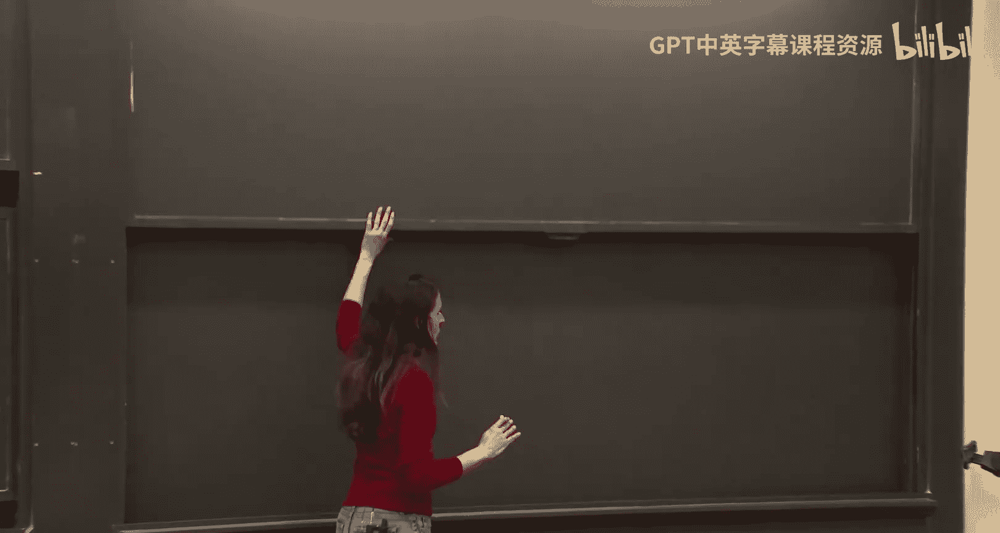

# 《密码学高级话题｜6.5630 Advanced Topics in Cryptography, Fall 2023》Claude-3.5-s p16 Lecture 9_ BARGs Implies SNARGs and Connection to Non-Signaling PCPs, Part 1.zh_ -BV1MVa5zXEmy_p16-

It's our last class， which is happy because we get to go and break。

There's so much more I want to tell you guys so but you know that's all we have time for there are cookies here for to make our last class sweet so please come and get some if you want。

 they're very small so you can take two or you know if you didn't want to commit a large cookie you don't need to So okay so today finally we're going to actually construct the snags that we've been after that was kind of the goal is to construct sns。

6igantactive arguments and like this entire course was a buildup to construct these sngs and today we're going to see how to construct them they are cookies guys。

Cookies， if you want from flour， really good ones， so feel free to take some。

Okay so what we're going to do today is show how to construct these snags and we're going to last class Zhengjiang showed you is really beautiful work and constructing bugs which are batch argument and you know on their own you can say why do we care about batch argument I'm going to recall the definition but I mean it's interesting on its own but what makes it super interesting is that we can use it in a pretty straightforward manner to construct snags so that we're going to see today we're going to see how to use these bugs that I'm going to recall the definition in a second and also how to use I think Jhengjiang called it somewhere statistically binding hash functions it's also known in the literature as somewhere extractable hash functions both are used so I'm just going to use the other just familiar with both a formulation。

😊，Both names。So what we're going to see today is how to use these barbs weave with these hash functions to get snas。

That's kind of the plan for today so let me first recall what a bar is really fast。

 so a bar you want to kind of prove that many instances belong to an NP language。

 so a bar for an NP language L consists of three algorithm Gen takes as input a security parameter。

 the number of instances you want to batch。😊，Maybe I'll thank you， can you close the door， thanks？呃。

K， which is the number of witnesses you want to batchge and N with。

 which is the length of each instance and then outputs。Some si。

Note lambda is given a newary because we want them to run in time poorly lambda。

 but canN are given in binary， so because it's polynomial time algorithm。

 it runs in time polylogin cane polylogin n， the instance size。😡，Okay， thennda。

Prover algorithm takes as input， the CRS。And then x1 up to x N， xk， sorry。

 so k elements with witnesses。😊，And outputs。A proof pie。But importantly， this proof should be small。

 so this p is of size。😮，Poly log or polyly in security parameter， but log K， that's important。Okay。

 we wanted to depend only polyithically and K， that's kind of our goal okay and then maybe ideally also log n。

 but the point is we want it to be succinct okay otherwise it's trivial just to output the witnesses。

😊，And the verifier。Tex his input CRS。The instances。And the proof。And it output01。Acept or reject。

 Okay， And this when when I say the size of the proof is this， actually。

 you can make it bigger or smaller， but we want it to be succinct。 Okay， that's oh， sorry， I sorry。

 I didn't。We wanted to depend only logarithmically and cancer on。😡，We allow it to depend。

L polynomly and one witness。Okay， so I could put it here， a single witness， one， not many。

I do want to be as succ as possible， but what we can get is as a bar that， grows with one instance。

 one witness as opposed to K instances。Okay so this is kind of the algorithms。

 then we want completeness and soundness， completeness is the usual thing that just says if P has valid witnesses and he generates bar。

 this bar is going to be accepting probability1 over kind of the CRS generation。

 so that's the standard completeness and then the soundness property that that we have ideally you would want to say that so in soundness computational soundness we have。

😊，Adaptive soundness and unadaptive soundness。 And we want to say that the cheating prover cannot convince you of a false statement。

 so he cannot generate， he cannot give you X's。That are not all in the language with a valid proof。

 that sound is， okay， there's an issue is when does the cheating pool gets to choose these x's。

 I it before he sees the CRS or after it sees the CRS？😡。

If he needs to decide them before he see the CRS， then it's notadapive。

 if you get to decide it after， then it's adaptive。Ideally。

 we want to say it's secure for all like very all as big class provers as possible。

 and thus we would like to have sound against adaptive provers to say。

 even if in cheating prover chooses this X1 of to XK adaptively after seeing the CRS。

If one of them is false， he cannot generate a proof。That's what we would like to say。

 What we can say is what's called a semi adaptapive something in between。 Okay。

 so let me just write it here。 So semi adaptive soundness。😊。

Just says the adversary needs to tell you which so he's going to give you K instances。

He can choose them adaptively， but he needs to choose the iron which he's going to cheat。

 so he's a cheater。So what of that science is not in the language？😡，Which I， which location I。

 the X is going to be not in the language that should not depend on the CRs so it says that for any poly size。

P star。And for every eye， which of course， may depend on lambmbda because。For any lambda。

 you have an eye because the eyes between1 and K and K grows with。Can go with Lada， so for any eye。

 you want to say the probability that P star given a CRS。Output x1 of the Xk and P。

Such that X I is not in the language。And Pi is accepted is negligible。

 so one of them is the Xi1 is not in the language and the I was chosen before you saw the CRS。Okay。

 so for any P star， he tells you I'm going to cheat an location I。😡，Now he's given a CRS。

The probability that he gives you an exacting proof for excellentonent Tk that he chose adaptively after seeing the CRS。

😡，The probability that it's accepting。CRS x1 of the xk and pi is1。And x is not in the language。

 X is negligible。です。Equals a negligible。 so again， for any cheating prover， he needs ahead of time。

 Im going to choose my external tax K adapt after I see the CRS。

 but I'm going to cheat on location I。😡，The probability that he succeeds in cheating in location I。

In an accepting way is negligible。That's the semiive soundness。Okay， so and last class。

 Gengju kind of showed you the high level of how you construct such a like the construction of such a bar。

Okay， any questions， Yes， pizza are required like the indices other than I are those required to be act like in the language。

 No no， we don't care。 So yeah， good question。 So the P tar can choose the rest of the X's however he wants in the language。

 outside the language， however he wants。But he wins if the Xa I is not in the language and the pi is accepting。

And he wins was no a probability， yes。要是。Tsforming this to that wified guessing。Yeah。Okay， good。

 so the question is can we transform this into a fully adaptive snug？So a。

Converting it into a fully adaptive snug。Is nontrivi， I'll tell you why。YouYou can guess I。

 you can guess I， and you'll guess it correctly with probability 1 overK。In general。

But so you can do it， but here's the issue， I'll tell you what the complication is。In the analysis。

 so I don't want to recall too much the construction。

 but the high level idea of how these bars are analyzed。

 even without kind of knowing the construction， the way they're analyzed，In the CRS， so in the proof。

 in the analysis， we say， suppose there exists in cheating prover。That cheats on some eye。In the CRS。

I'm going to change the CRS now， I'm going to tell the cheating prove here's a new CRS。

 and in this new CRS， I'm going to kind of hardwire I。

 I'm going to put some information about I in a way that's unnoticeable。😡，Okay， and when we'll see。

 I'm going to call the summer extractable hash what Zin Jhenang called SSB hash。

 some more statistically binding。And then I'll remind you a little bit how where we stick the index eye。

 but in the analysis we say， you know， let me change the CRS to a CRS， a different CRS。

 it has a very different distribution， but it's indistinguishable， it looks like the original CRS。😊。

So P star can distinguish between the two。😡，So he'll still give me a valid bug。

 Okay And now I'm going to say in this new CRS， actually， there's no way he can cheat on location I。

 There' is no way he can cheat。 Okay， What is the issue。 So now you're saying why， why do we need。

 Why can't we do fully adaptive。The issue is。It may be the case that once we switch to the CRS。😮。

It's whiches where he's cheating。 So here's an alternative way。 Let's say the prover tells you how。

 you know， I'm going to cheat an location I， but I can be adaptive， chosen based on the CRS。

So now in the analysis I'm going to say， I'm going to guess what he cheated。

 I'm going to say let's guess he cheated in location7。😊。

I'm going to hardwire kind of the CRS to depend on this location。😊，The gene prover doesn't cheat on7。

 it you something else。He can kind of evade me now you're saying oh。

 if he cheat something else I can tell I can tell the difference so like I shouldn't be able to tell。

 but the thing is you don't know what's in the language's not what's not in the language。

 so the problem is whether XI is in the language or not in the language can be very hard to tell。😡。

It may take it。And that's why kind of getting adaptive， like just guessing is not。

It's not good enough because he needs to。The issue is。

 if you could tell efficiently whether Xi is in the language or non the language， then yes。

 but because it can be very hard。That's where things become tricky。You can guess。

 but it's not good enough is the answer。ok， any yeah。you need commits to。我 that be。Well。

 can what do you mean he commits the？So you're saying。

 let's change the scheme kind of and have him add commitments。be that different。

And I guess the issue， look when he's cheating， we don't know whether like he gives you x one of the XK and a proof pie。

Now he cheats if one of them is not in the language， that's when he cheats。

 it's hard to know whether one of them is in the language or not in the language and the concern is he can say a。

 he can say whatever he wants， he's going to cheat so nothing he says we believe right and the concern is that maybe when we switch the CRS。

 the kind of depend I。E sudden Dite becomes in the language。And then what do you do。

 and now you can say you can't tell the difference because the outside the language。

 they look the same。😡，So that's why kind of guessing is。In some sense， not good enough。

 like it's not helpful。Okay， so this is any other questions？Okay。

 so this is one ingredient that we're going to use to construct our snG。

 the other ingredient is what the summer extracttractable hash or SSB hash。

So let me write it out， I'm going to write it here， so we'll keep it on the board。

 so let me just recall the definition。😊，Somewhere extracttractable， hash family。

Consists of many several PPT algorithms， let me start writing， so the first one is Jen。😊。

Gen now we're constructing a hash， so Jen takes a security parameter。The length。

 how many bits we going to hash， so let's say n bits we going to hash。And how many and okay。

 so let's say in the location I， this is going to be IN N。

 this is where we're going to be binding on or where we want to be extractable on。And it outputs。

A hash key？And a trapor。This trapod door is going to be we're going to use it to kind of extract from the hash。

 the I location of what we hashed Okay so there's a hash key and a trap door I know when Jinjing taught it then he just said hashki and he put kind of the trapdo at the end so I'm going to write it with a trap door。

Okay， so Gen outputs a hash key in a trap door， and then you have Yval algorithm。

 it just takes the hash key input x in 01 to the n。😊，And then output'll put a hash value Z。

And then you have open。😡，Where you take a hash key， the X。And some index J that you want to open to。

And it outputs an opening row or row J。😡，And this should be in。

01 to the lambda or Po lambda similar here， this should be small，01 to the a lambda or Po lambda。

And then there's ver that verifies， so ver takes a hash key a value。

And now let's say you want to say， I'm going to open location J。Here's my B that opens。

 and here's the opening。😡，And he checks， is it valid opening or not， so it outputs。Zero or one？

And finally， so consists of five。PPT algorithms？So first you generate a hash key with a trap door。

 then there's an eval algorithm that given n bit string outputs the hash value V short succinct。

 then there's open that you can open given that you can generate an opening for specific index J so you generate row J which is an opening。

 and anybody can verify the opening using only the succinct hash value， okay so given a hash key。

 the succinct hash value the index， the bit， you can verify the opening。😡，And finally。

 that's the extract algorithm。😊，And it takes the trap door。And the value， and it outputs a bit。

And this bit。Should be XI。Okay， so let me say the properties。So。The first property is completeness。

 that's kind of usually the straightforward property。Which essentially says， look。

 if everybody's honest， you got what you expect， which means one。

 the verifier would accept the opening。And B， the extract will output the ice bit。

So it says that the probability is okay so for every x， for every lambda， for every n。

 which is at most2 to the lambda， we always restrict the length of what we're hashing to be at most2 to the lambda。

And for every eye。We say that the probability。That a。Open， sorry that there。

And hash key generated from Gen Z， which is theyval。And for every day。Jy， row generated。May open。

It always outputs one， it outputs on probabilityability1 and extract。😡，I'll just denote by extract。

 let me denodeote by just x for simplicity， given trapor and V， I'll put X I。😊。

And this holds with probability1， where the probability is over what。😡，Hashkey and trap door。

Are in Jen。So essentially， I won't write it， but that hash key is generated by this。

 V is generated by this event row， or I'll call Ro J is generated。By open。

And this just says if everything was done correctly。

 the ver always accepts and the extract indeed will extract the correct bit。

So this is just if everybody follows the protocol， everything should。Be as you expect。Okay。

The soundness or binding。Or the statistical binding， I should say， or I called the SSB。

 somewhere statistical binding condition says that on location， oh， before go to SSB。

 there's another property which is index hiding。😊，Index hiding means。That。

The hash key hides the index。Okay， if you see just hashki， you have no idea what I is。Okay。

 so it just says that for every IN G。If you look at hashkey。Genenerated by。

And I'll call it I or hashki generated by J。They're indistinguishable。Okay。

 this is just a notation to say hash key generated where here I have I。

 and this is just a notation saying this is hash key generated by giving J to Gen。😊，Okay。

 so the Hashki Hes index for any ING。The hashQ generated with I， the hashq generated J。

 they look the same。Okay， so that's the index hiding and finally is the binding condition。😡。

And the binding condition says that so the SSB， the somewhere statistical binding。

 says that for the location I。That we're binding on。Even an all powerful adversary。

That is given hashke。Cannot generate V？😮，And two different openings。

 two location I an opening to zero and opening to one on location I。😡，So on location I。

 you're really information theoretically bounded。Okay， so again， even another powerful adversary。

That is given Hashki with respect to ourI。And location I cannot open both to zero。And to one。

 except with next probability。😡，Okay， so。I hoped to put everything on that， but I'll add one here。

 so I'll put here the binding condition， so the SSB binding。

The Somers sort binding says that for every， all powerful。Adversary A。😮，The probability。

That a and hash key， where hash key。Is generated。From Jen。1， lambda n and I。

 the probability that he outputs any value v。😡，And row 0 and row 1。

Such that very one except both is that for every B， both0 and1。There。On Hashki， V， I， B， Robby。

I'll puts one。This is negligible。😡，Okay， so on。And index I。

 the one that the hat came from that we're binding on。He cannot open to both zero and open to one。

In an accepting way with accept names of probability， yeah， does to fromval no no， good good good。

 good， great question，s maliciaious。There's no A can be so the adversary。

 he's not following any guidelines， hes completely malicious。

 he generates V according to his own will， generating Rosier and row1， however he wants。

 hes still and he's all powerful， he still cannot。Generate two accepting openings。F location I。

Yeahah just to。Flow up on that， that's the only reason that we don't get this free from extraction exactlyact good good good。

 very good。 So let me just repeat what Simon said， look in extraction。

 we said that we're binding completely binding because guess what from V we can actually we can actually learn the bit X so Xi is sitting there。

😊，So， yeah， if you're honest， X I is sitting there。 But if you're malicious， you know。

 you can do whatever you want。 And maybe if for malicious V， maybe there's no。

 you can't extract anything from it。Yeah， this is the same saying。There exists to be。Right， good。

 good， good， very good， yes， yes， yes， this is the same as。That there exists a V。

Row zero for any okay， for almost all hashkeys。The probability that there exists V row0 nor1 is zero。

 that they don't exist for almost all hashkeys。This triplet that satisfies this does not exist， yes。

😡，p。Very good。Any other questions？Okay， so the plan for today is to show how to use these two building blocks。

😮，To get a snug。But before I do that， I want to say a few more。

First I want to give you time to digest and ask questions。

 also I want to say a few more things about these two primitives。😊，Any questions before I？Okay。

 so one thing I want to mention is。Even though the binding condition was only an eye， I said。

Specific high。I promise you， you can't open two different ways now， what about the other I。

 what about J， Jake can and address you open two different ways。😡，And the answer is no， actually。

 you can't， and we don't need to state that explicitly。From the SSB and the index hiding。

 I want to argue already we can conclude。That a poly science adversary。Cannot open apoliticized。

 not all powerful， but apoliticized adversary。Cannot generate V any index J。And two openings。

That will be accepted， except language probability。Okay。

 so in another words I'm saying binding holds， this local binding holds for every day。

Not against all powerful。But for any PPT or polyse， we get this binding condition for every day。喂。😮。

So because of the index hiding property where we cannot distinguish the plane of index is I or something precisely。

 So the reason is this a， he doesn't know if hashke came from index I index J。

 there's statistics they're indistinguishable。 So now if he can generate it for index J。

Then he should be able to generate also for index， so let's replace this with an J he can distinguish。

 so he'll find the same J again at some point and that therell be a contradiction。😡。

so because he has no idea what's sitting here， the fact that he cannot do it for that index I。😡。

Even information theoretically means they can' do for any other index。呀嗰低个表。No。

 this is exciting it's computational， actually Oh good， good good， good， so that corollary is。

For any poly size。The core says that only any poly size a。That probability。That A on hashki。

 let's say from I， same hash key。Outputs V or V J， row 0 and row 1。

Such that the same thing here holds， namely for every B。

 he generates accepting answers for both0 and 1 is negligible。

Because if there exists some J that he does that for non negligent probability。

Then let's replace HK with hashK generating like that's binding on this that actually statistically binding on this J。

😡，A can' distinguish， so we'll still do this for that J with some nonex probability and that he cannot do in information theoretically。

So that's why we get like because index hiding， actually just getting statistically binding on one of them is good enough。

It will imply computational binding and all the rest。Okay。

 another thing I want to mention and this well use actually in our construction today。😊。

I said that the hash is binding。And one location， an Xi。😡。

We can get it binding actually on out locations， not just one。How do I get it binding on L locations？

I'm going to just generate HK1， HK2 up to HKO。Where the first cell is depending and the first I'm just going to generate。

L hass。I'm going to ask to generate the eval and all these hashes。

 so the hash value now is going to be v1 up to VL where the honest eval is going to take the x you want to hash and do eval hk1 of x eval hk2 of x so just hash the same x with all L keys so now the hash value is grows by factor of L。

😡，And then when you open a certain bit， a certain location， you'll generate old the openings。

So just do the same thing kind of al time， just repeat it al times。

And now what do we have from that by repeating our time， so let me write it。

Let me erase the corollary， I'll have room。So。No remark。By reping。Oh times。We get。

Some more extractable hash that extractable。On L locations。And moreover。

 another property that's what we're going to need。Even if I， let's say， gave you。

The trap door corresponding to some of the， not all allocations。 let's say give you trap 1。

 trapor 2 and trapor 3。Still what's in the location hidden？In HK4， you have no idea what it is。

 So even if I reveal some of the trap doors。The other indices remain hidden。Okay。

 and we're going to use this property。Okay， so again， if we repeat all times。

We're binding on allocations。But even if I kind of reveal the trap door corresponding to。

 I don't know， location to a couple locations。The rest of the so of course。

 if I give you the trap door， then all bets are off， you learn everything， you learn the ah。

 you learn everything that's the trap door， our trap doors are sighted once I give you the trap door。

 you learn the index， you learn everything。But the other inds that are not correspond to the traps that I gave。

Are still completely hidden because I did them completely independent。

And this is something we're going to use when we're going to construct our synnos。

Okay so that's one thing we're going to use I want to mention a little I want to talk a little bit about the construction because I think maybe in Zhenjiang's lecture last time this was missed a little because he said it I think a little too fast I want to say a few words about the construction。

😊，But before I talk about the construction， I want to say one more property about the bars that we're going to also use。

So what we're going to use about the bar。 So we said that these Gen， P and V。

Are polynomial time algorithm， probabilistic polym time algorithms。 In particular， V。

 I want to talk about V。 V is a polynomial time algorithm。But Vs input is really large。

 it has x1 up to xk， so polarator time means it runs at least in time poly K。😡。

It it readers its input。However， it turns out that the buggs we have。

 this is what J calledBg for index languages。If there exists a succint description。

Of these x one of the xk。The verifier only needs to run in time that depends on the description。

In other words， we can replace。if。I didn't bring my。Okay， I forgot to bring my colorful。Cha。

 so sorry， but at least you have cookies， I mean what would you prefer colorful chas or cookies So if if you can generate these x1 up to Xk if there's kind of succinct description。

😊，Then the verify runs in polynomial time in the description， okay， so if， let's say there exists。😊。

Some machine M。Such that。For every eye。Xi is just kind of the twin machine。On an input I。

 So this kind of machine， you can， you should think this algorithm。

 you should think of has kind of a succinct description of all the Xon of X K。 and you give them I。

 you get。It always gives you the Xi。If this is the case。Then。V， the runtime。Or I say time。A V。

It grows with the size of M。As opposed to key。Okay， so the grows。With M and does not grow with K。

 so of course， if you' given that one of that K it needs to read input， his runtime grows with K。

 but if you can kind of generate in succinct way， then it doesn't need to grow with K。Okay。

 so you should another way to think about it， you can think of X as like M comma I。😡。

And the instance just says， if you run M and I Xi， then X in the language。😊。

And that's why it's called index language because it's like there's an index。 Yeah。

 So this means that there's still like a dependence in Yeah， yeah， yeah， there is a lock dependence。

100%。 Sorry， yeah， yeah， it just means yeah， exactly that runs time Lo K。 actually， yeah。

 you have I here， which is log K， so。😊，There is a lot dependence。 Yeah CR。So linear okay as well。

 is that true？The length of the CRS in general， you want it to be sublinear K in the SNR construction。

 it's polylockK。But yes， but when we'll talk about S， so yeah。

 in the bar instruction we have the CRS。冇。Most of our construction， this area is the size polyloy。

The one under LWE that Jinjiang showed is。Of size polyloy。

So I know that if we have a bar that's side of these properties and a some architect check。我 kind。

Like at the property。You being able to extract。Is there a world like， do we have any parts。

the assumptions that we。And we're sure to go has。You're asking。

 is there a bug for which we we don't know how to extract is that way you're， okay， okay， so okay。

 so let me you're asking a great question， Let me kind of。Okay。

 so when we said but when the soundness condition just says that a cheating prover cannot， you know。

 cheat cannot generate exonom to Xk that one of them the I is not the language and yet convinced。

Oftentime， also in our snaug， in our snaug construction， we want something stronger。

 what we want is that I can actually extract a witness。FromFrom this cheating prover。

 So I want to say this cheating prover。I can't destruct all the witnesses。But for some eye。

I can generate a CRS that looks like just enter CRS。

 but I can kind of change the distribution of a CRS to be such that using some trap door about the CRS。

 I can actually extract from P star a witness for XI。And once I extract witness， of course。

 it has to be in the language。 I argue not only it's in the language， I can even find， you know。

 get a witness from him。So that called somewhere this is like some extractable bar。Now。

 what Lalie was saying is that the bar that Jin Jonng showed you last time was had this somewhere extractable property。

 Okay， it was extractable。 Actually， let me tell you。

 we also will need bug that are somewhere extractable。 I didn't write that here。

 Why didn't I write it here。 And this is where then exactly the answer is any bar。

 we can make it somewhere extractable by just adding a hash so we can kind of up。

 we don't need to worry about some extractability of a bar because what we can always do is add。

Put a hash of all the witnesses somewhere if you have some extractable hash。

 if you have a some extractable hash， you can tell the verifier。

 put a somewhat extractable hash of all your witnesses， so take witness one， witness two。

 witness three to witness K， hash them。😊，And in the analysis， just jumping ahead。

 we're going to be extractable on all the locations corresponding the witness eye。

And now we're going to tell him， we're going to say， give me a bar。

 the bar is not for the original language L。The barb says the barb that  exis in the language and now says there is an opening。

For the hash value that inlet， the locations confined to WI， if you opened。

 you would get a valid witness。Barg that language。 so instead of bark the original language now bar a little bit kind of upgraded language that again says there's a so the verifier will give you。

😡，A hash about the witnesses， and he will prove for every eye。

He won't prove just exerciseise in the language he's going to put for every eye。

 I have openings corresponding to witness eye。So though， A。

 the openings are valid and B WI is in the language O。That's the bark he's going to give you。

And now the factor in the language。Means that it must be that if you take the trap door and look into it。

 it must be by sallonies。It must be that what's sitting there because you're binding。

 if you're going to be binding on that part， you know that what' sitting there must be the correct witness。

So that's kind of why actually we don't need to construct bugs with extractability。

 we can always attach some extractable hash to them。

any assumptions than those needed I I see what you're saying I see Yeah， I don't think so。

 I don't think so。Yeah， I don't know how to construct a bar from an assumption for which I don't know how to construct a thermo receptable hash。

Okay， any other questions？Okay， so I want to get to the bar to the construction of this na。

 But before I do so， I， I do want to spend a little more time in the summer extracttractable hash and say a little bit about the way we construct it because I just want to make sure that。

That you didn't miss part from last lecture that I think was a bit said too succinctly so the highleve idea of how you construct a summer extractable hash is using fully homomorphic encryption so I don't want to get into I don't want to recall to the definition but I'll give you a high level so the basic idea which doesn't work okay let me first tell you the idea that doesn't work because that's very natural and I think maybe that's what you got from last lecture so the basic idea that doesn't work is to say。

The gen。Well， just the output。😮，Encryption， so I'll give you a public key。

An encryption of I with this public key。And the trap door， that's going to be the hash key。

And the tractor is going to be the secret key。Okay。

 so I'm just the hashke is going to be an encryption of the index。Now。I want x1 of the Xn。

Let me assume for simplicity that n suppose。😮，And is the power。Of two， otherwise， you know， pad。

 Okay， so let's say big n is a power of two。 So it's some two to the small end。

Now here's what I'm going to do。 Let me so when I say encryption of I。

 let's think of it as bit by bit encryption， so it's encryption。😊，Of I1。Up to encryption。Of I end。

Okay， now the idea is。What we'll do is for each like pair。So I'm going to do kind of a Merkle hash。

 and for each pair I'm going to encrypt。😊，So I'm going to do this Mer hash where for each node I'm going to associate a cipher text and the output is going to be the ciphert of the root。

 That's my hash value。 The hash is going me a cipher textex of the root。😊，And this hypertex。

 this hypertexin， it's a new encryption of Xi。😊，Okay how do I so of course I can compute encryption Xi this is a homomorphic encryption。

 given x and encryption of I， I can do computation under the hood。

 so I can compute encryption of x sub I okay so because this is a fully homomorphic encryption。😊。

Given。X and encryption of I。I can compute encryption。Of exaby。Of course， there's public keys。

 I'm omitting them for sixness of rotation。Okay， this is because I can compute under the hood。😡。

The value of the root is going to be encryption of Xi。

But what kind of encryption it's not any encrypt， so let me tell you how exactly how I would compute this encryption。

😡，So the idea would be。So and not only that， how do I open Okay。

 I want to do local opening So the way I'm going to do it is follows for each pair I'm going to encrypt only one of them。

I'm going to either put here encryption of x 1 or encryption of x2。 Which one depending on I1。

 So let's start with I1。 if I1 is 0。I'm going so I'm going to let you choose x1 if I want is one。

 I'm going to choose x2。I'm going to choose even other so that the output will be the correct one Okay so I'm going to the I1。

 depending on encryption of I1。😊，That's going to tell me which one to put here。

 zero I put on the left。Like the left children or one， I put the right children。

And then I do the exact same thing given these。😡，Whether I choose the left or right depends on encryption of I2。

 If I choose is0， I choose the left is I2 is one I choose the right。And so on and so forth。

That's the idea。It's like an oti， it's really like an oti， exactly。I didn't what Ots。

 but it's exactly like an OT。Okay。This does not work。Okay， it almost works， but it does not work。

So let me tell you why it seems like it should work。

 and then I just want to mention the subtlety here。😊，So the reason it so okay， so first。

 how do you generate local opening， well， you chat， so if you want to open XI， I'll tell you， okay。

 give me X1 and X2。😡，So I can that this is correct。And then give me the hash in the Cyphertext here。

 and I can check that this is correct。Because each， each cipherax is some。

F andG evaluation that depend on the two children and on the hashki， which is encryption。

So in layer J， it depends on the two children and encryption of IJ。Okay， each time the node。

The ciphertex corresponding to some node is a tremendous function of the ciphertex corresponding to the children。

😊，And the hash key corresponding to that level， so encryption of， let's say， IJ。Okay。

 because remember， if if I'm let's say in level 2， I have your ciphertex。

 I don't know  one in Cyphertext 2， then I do dip。The way I compute the parent ciphertext is just a homomorphic evaluation that takes if I to a 0。

Take Cyphertex2， if I2 is1， it。Sorry， I have to one otherwise take separatet2。

 so this is really just a deteristic homomorphic evaluation。😡，And so that's how I open。

 I just open all relevant cipher texts and the verify will check that morph of a ca was done correctly。

😊，So you can local opening， you can do local opening， but it's not binding。

 or I don't know how to prove that it's binding is the problem。😡。

OkayAnd probably you can find a weird FHG for which it's not binding。

 I don't know maybe for natural constructions it is binding， I don't know。

 I don't know how to prove it， but there's a problem with binding and the problem with binding is that cheating so it seems like it should be binding because look here is sitting encrypt crypion of back。

But the thing is， the reason why it's not binding is because a malicious。A malicious adversary。

He may give cipher attacks that are garbage， are completely garbage。They don't actually。

 they're not legal cpherts。And if he gives cpherts that are garbage。

I don't know why would there be dying？I mean， maybe extract doesn't work。😮，Okay， hears me。

 I'm a malicious person。I nothing no you can't extract anything。 I just want to ruin the binding。

 my whole goal is two。Kind of room binding here。 Okay。

 I'm going to give you V that doesn't encrypt anything。 It's a junk V。

 and I'm going to open in two different ways。Maybe， maybe I can。Genative V。

Like as I call it Cyphertex， but it's just a bunch of bits that have no meaning cannot be decrypted at all。

 and maybe I can somehow generate valid openings。😡。

So and we don't know how to argue that you cannot do that， so in order to actually get sound this。

 I need to make sure that the things are well formed。

 that these are actually valid hyperphertex or what I open to is a valid typephertex。

And the way we get this is by。Making this a little more cumbersome。

So the way we get this is we actually don't use one publicly key。We use small and public keys。

 so for each layer， we'll use a different public key。And what we encrypt。 So。

 so what we do is we have。Public key J。For J goes from 1 to1。😡，Okay， so we have N public keys。

And with public keyJ。We encrypt IJ， but also so the I has I1 up to IN， we encrypt IJ。

 but we also encrypt。S， K， J-1。I want to have the decryption。

 it's important to have the decryption key。Now， okay， so the important bit is。😡。

The homomorphic evaluation I'm doing here， I need to know secret key。😊。

Because I'm not just going to say before I said what's going on underneath under the hood and saying。

 look， I have I1， I have two citex， give me one of them， no， no， no， no。

 what I want to do is to say the following under the hood。😡，Derypt this。Derypt this。

And give me only the relevant one。So that even if this is not equipped。So okay， so here's the point。

 let's say I want to open to X2。Okay， so， okay， he gives me X1。 these are valid， so this is valid。

 good。But now。Cpherex2 can be completely not valid。Because when he opens。

He gives me a Cyphertex1 with these two， so I know this was valid because this is a difference computation。

And then he gave me Cyphertex2。And I do this evaluation then me。

 so the sibling Cyphertex that he gives me。They may not be valid。I want in a chart。

 even if they're not valid。Even if they're not valid， this is going to be valid。

The openings are going to be valid， kind of the on path。Things are going to be valid。

 even though the siblings that are given in order to just kind of do the verify the opening。

 even if they're not valid， the opening path will be kind of valid highphertexts。

So why are they going to be valid because the way now what is the deterministic computation that's happening here。

 or the evaluation， the evaluated Cyphertext， the way we do the evaluation is the following。

 I decrypt this and I decrypt this。And then I take the decrypted value。

And I encrypted with the next public key。😡，So the point is， even if this didn't decrypt。

Maybe this indery。I don't care。IThis is still going to be valid。Okay。

 so the point is even if the sibling ciphertexts that are given only for verifying the opening。

Even if these sibling ciphertexs are malformed。If you give me the openings and the entire path。

 I get the guarantee that' on the path， not on the siblings， on the path， things are well formed。

And I mean， well from typepherte， these are cphertes that decrypt correctly。

And that's what I needed for the soundists。So it's important to do the decryption。

 This is really crucial。Okay， okay again， what am I doing on each node good good。

 So here's what I'm doing on each node。 The evaluation function takes kind of Ij。😡。

Secret key J -1 and 2 Cyphertex Cyphertex 0 and Cyphertex 1。

And what it does is the following decrypts Cyphert 0， so it decrypts。With SKj -1。

phertex0 Cyphertex b for every B gets some bit， I don't know， a alpha B。And then it outputs。

One of them， I know Al be star Al I。Jay， so it gets to Britany。He chooses one of them。

 which one depending on the Ija you want。So what you will the point is what you will get is really an encryption。

 So the point is， let's say。I do it under the hood。

 This isnt a computation that is done under the hood。 Yes， so this is going to be encrypted in a box。

 But what I'm going to do under the box is to say so these I have。 so sorry， these were。

IJ and SKj minus-1 are in a box。😊，And the computation that I'm doing inside the box， as I'm saying。

 I have these in a box， I have these in the clear。😡，Inside the box， what I do is the following。

 I say I have the secret key J -1 and these two cipher texts。 Let me decrypt both of them。

 I'm going to get two bits Al 0 and n for one。 Now， maybe one of them is bad。 so but。

So you know maybe one of them doesn't decrypt， so the one that doesn't decrypt output back。😡。

And then the outputs will be the relevant one。That according， if if it's 0。

 I'm going to output alpha 0。 if it's one。 I'm going to output alpha 1。

And now what I can argue is on the path itself， everything has to be well formed。

 So I'm actually going to get the。The correct tiphertex。 And I can argue that by induction，And here。

 of course， this is well fun because this is just a deter computation that's done locally。 Now。

 the point is。😊，So let's say like I want to output I want to， I'm binding an X1。

 This is X1 is1 I want to open。 Okay， so this must be well formed。

 And now the point is even if this is not well formed。What will I do under the hood。

 I'm going to open this and open this， This is going to be the correct value。

 this is not going to be maybe the correct this may be but， but this is the one I choose。😡。

And then I encrypt it， so I have it here。😡，And then again， this may be bad。 I'm going to decrypt it。

 It may be bad， but this is going to be good。 and this is the one I choose。

So one can argue kind of by induction that this is going to be encrypt X1。

 this is going to be encrypt that then everything went encryption to x1 until the end。

 so there's no way you can open two different ways， you have to open text1。😊。

And the verifier is also going to do the same computation to check。Exactly。

 the verify does the exact same computation to check。Yes。Yeah。

Any you can only open the eye that you generated。So this is not opening in general。 good。

 So this exactly， this shows that the specific so this。诶诶。Okay。

 this shows that the specific eye that's encrypted here。

So there's one the hash key is binding on one eye and specific eye， the eye on which you're binding。

You can only open in one way。😡，statisticalistly。And then by the index hiding。

 it means that you for any J you can only open one way computationally because you can distinguish。

Yeah， you avoid this chain of keys if you are happy to just make？Good， very good， good， little。 yes。

 so you can avoid you can avoid using many public key。 You can just use one public key。

Enryp the secret key and rely on what's called circular security， that's another option。If you wish。

 Surya doesn't want to do it。But yes， exactly。Exactly。呀。You should get Bull resistance。Okay， so yeah。

 so you're asking， will you get a collision like collision resistant and the answer is yes because。

For the for the specific I that kind of you encrypted in the hash key。

 you get binding kind of statistically， there's no way you can open two different ways。诶。

What you have at you is just the encryption of that index， right， right。

So you're asking about a different J？Oh， sorry。 that you you have two Xs that have the same。見です。

They did that have the same issue at that index but the price are different。

Would you get a different。How the if you take those two different X。 good， good， good。 Okay。

 So if you take two different xes。For which let's say they have the same x1。

And let's say the hash key is binding on location one。The value would get if you hash them honestly。

 will be actually very different。But because you use different x's， but you'll get different values。

 but if you decrypt， these values correspond to a cphert as values。

 they're going to look very different， but if you decrypt， you' will get the same bit， which is x1。

Yeah， good。Okay。So anyway， if you， if you didn't follow the exact construction。

 it doesn't really matter。 I just wanted to make sure that， you know。

 this it was clear that you really needed to do this decryption。 Yeah。

 the reason you don't need circular security as it is for this F G is that each of these computations is simple enough that you don't need to。

Like that the reason， okay， the reason I don't need circular security is I'm。I'm never encrypting。

A secret key。Under its public key。 So sorry。 think you're asking why is the information that you're using not need to be unbounded。

Oh， okay， okay， you're saying， okay， sorry sorry you're asking okay， got it。 you're saying。

 well in general， if we want arbitrarybit FHG， we need assume circular or secure LW inside it kind of and you're asking。

 do we not need assume like you're kind of going into the you're saying do we actually need fully fully fully homomorphic encryption because if we do。

 then actually we need to rely like a circular security assumption inside too。

 The answer is because the computation is very specific and very small depth。

 you don't needs no you don't need like full full FHG。

 you need FH for very bounded depth computations。😊，Yeah。Great， thank you。Ah， any other questions？

Okay， so let's s nunug。Well， let me just make sure I covered everything I wanted to。Okay， three。

 we we snarg。 Okay， the last kind of two hours in class last， we're gonna sng okay， so。😊，Okay。

 so now the snag is really simple。 It's like as simple as one can， like you essentially can do it。

 done。 We're done。How do we？We can go home。Anybody want to cookie before we snaug？

I feel like these grandmothers that kind of you know constantly feed you。 Okay， so here's the idea。

 idea is very simple Take any so snug。😊。

Okay。So let me first kind of the high level idea。 Now I love the idea the following。

 Here's what the prover will do。TheSo the prover wants to convince that x is in the language。

 There is some verification circuit。 So you have x。 Let's start with。

 Let's take x in the language or。There are some for any x， it doesn't matter for any x。

You have a circuit。C sub x。And CA Maxx takes a witness。And output put 01。

 like it's a verification circuit。 You can also think of it， if you want， see。

As taking x and a witness and output' 0， if it's not valid witness and one if it's a valid witness。

 if it's a deterministic computation， there's no witness， just say x and output 0，1。

 That's the computation。Okay， so when I talk about Snarkia。

 you can think of s nondetermin sna or deterministic， any language L。

 I don't even want to go to specific but when I have a language L。😊。

You know what does the mean language。 Well there's some circuit。 It takes the instance。

 maybe with a witness， and the circuit kind of does some checkile decide if it's valid or not valid。

Okay， now I want to convince you I have an X， I want to give you a sng that this C an x outputs  one。

Either that theres a witness that outputs one or maybe it's a deteristic。

 so just see if example outputs one。Here's what I'm going to do。What I'm going to do。

 I'm going to compute all the wires of this circuit。Im good all the wires。

And I'm going to give you a hash of all the wires。 Now there's a lot of wire。

 so it's going to be a shrinking hash。I'm going to actually use a somewhat extractable hash。So。

Let's say we agreed on a hashky for some extractable hash， I the prover。

I'm going to compute all the wires of this verification circuit。And I'm going to give you the hash。

 the hash of the values of all the wires。Okay， hash， what are you going do with that。

 So the other thing I'm going to give you is I'm going to give you a bug。A proof。

A bar of what the bargain I'm going to give you is that every gate here is satisfied。

So I commit it to all the wires， I can commit to anything。I mean， I have all the wires。 Now。

 I'm going to prove to you that for any gate， if you look at kind of the two。

The two input wires to the gate and the output wire of the gate， please satisfy the gate。😡。

So for all every gate in the circuit。I'm going to prove to you that there exists an opening。😮。

to this wire and an opening to this wire and to this wire。

 such that these openings are valid and that the values that I open accept kind of respect the gate。

And I'm going to prove you that the output， so I said that I hashed all the wires。

 I'm going to argue I'm going to open the output wire， show you see and end the output is one。

So again， what am I going to do， I want to convince you that the output here is one。

I'm going to hash all the wires， the value of all the wires in the circuit。

I'm going to prove that every gate is kind of satisfying I have an opening that kind of respects each and every gate。

AndThe output wire is one。That's my song。Yeah， that is different from。你q。Okay。

 how is this different from GCAR？Okay， so GCR is very different in many ways， first of all。

It's an interactive protocol。 Now you can apply future meal to it。

But essentially in GCR you kind of take the circuit， you compute all the wires in the circuit。

 but actually I don't bar say look all the wires are satisfied instead I'm going to kind of we're doing an interactive process saying oh I'm going I argue the output wires one and then we do kind of a little sum check or some in process to reduce checking that value to checking a value in one layer below and then we do an inive process to say。

 okay if that was false you know then the layer below needss a Bfa until we reach the leaves and then you can apply Fchere to that to kind of make it a snug。

Here we're doing something very differently。 We're starting with a bar。

 Now it's true that the construction you saw for barrg uses Fmi also。

 but some constructions don't use Fmi actually for Barg。 there are various constructions of bugs。

 you saw one of them， but there are others。So we say take any bug。And there's no interaction here。

 like besides， maybe they're inside the bar， but maybe the bar doesn't have any feature or anything to it。

 And we're saying just。Howash all the wires of the circuit？And prove that everything is consistent。

 that's it。That's really what we're doing。So let me write this down so it will be so that my ingredients that I have for my snrg is so okay。

 so ingredients， maybe I'll write it here。不。So my ingredients？Is a bar？And some are extractable hash。

These are my ingredients。 and I'm going to show you my sng。 Okay so sng has three algorithms we have。

😊，Gen algorithm。And here's what my general algorithm is going to do。It's going to。

 let's say the gen also has an input length。AhWe don't need it， okay。Here's what it's going。 Okay。

 let's say it has an input link。So this says， you know。

 you're going to prove to me statements of length that the input X is of Li N。😡，Okay。

 so here's what we're going to do。First thing we do is we're going to generate。A hashke。

For gin of the summer extractstructible hash。So generally the hash key corresponding to the summer extracttractable hash。

 this is going to be with security parameter。N is going to be。This is going to be number of wires。

In the Circuit C。This is the circuit that takes x of length n。

 possibly a witness and output'll put 01。Okay so this is going to be the number of wires and take any I。

 I don't know， whatever i equals 1， take any I in between1 to 10， it doesn't matter。

 choose it arbitrarily your favorite number。😡，Okay， so that's first thing。

 And then you also generate a CRRS for the bar。 so you generate。CRS for Barrg。This is for the bar。

And this will be with input with the script and one to the lambda K。

 the number of statements is like the number of gates in the circuit。

 so K is going to be number of gates。😊，In C， because we're going to remember。

 we're going say we're going to prove that for every gate is satisfied。

 So usually can N are very similar。 It's like essentially the same number。

 but you know let me just be clear that this is we're going to have in the number of gates and the length end there and let me call it n prime。

 we'll see what it is。😊，We'll see what this end prime is in a minute。

 so we're going to bar statements not of length。And。But of a different length N prime。

 we're going to see what that is。But the output is just。Let me call the CRRS Bar。😊，So you output CRS。

 which is equal to hash key and CRS barrg。😊，Okay， so that's how you generate， so the key generation。

 the CRS has a CRS for the bar and the hasshki。😊，Now we're going to。诶哎。What does the Fuover do？

So the prover gets his input X。Maybe a witness if it's an NP。Maybe there is no witness。

Let me say generally with witness， but actually the bar we're going to construct today is' going to be for the tourististic languages。

 but let me write it also for because I'm going to show you kind of a general framework。So P。

It's going to get a ciRS。Our X， and maybe be a witness if it's an NP。And he needs to generate a snug。

So what does it do？Compute。All the wires in the circuit So x is fixed。

 I think of x is like that's not part of the wires because it's fixed。

 but let's compute all the like W1 up to W AN， which is the wires of the circuit。

 You can think of the first M。😊，As kind of the actual witness。

 let's say if you have a witness in its length M， W1 toWM is the witness。

 but then the rest of the wires， so I'm thinking the wires include kind of the witness and everything above。

 and if there's no witness， then it doest include a witness。So I compute， these are all the wires。电是。

Accept X。Except the input wires corresponding， the input wires correspond X because that's kind of we know what it is。

 the verifier knows it。Okay， so you compute all the wires and then you compute。Haash of the one。

 you compute V， which is a hash theval。With hash key of W1 up to WN。

So you hash all these wires together。 Okay， so the verifier computed all the wires of the circuit。

Hash to all the wires。Oh， okay， actually， let me just say， sorry。

When you generate a key I said you know use a someexable hash， yes， exactly。

 buts you don't need to just use one index okay so let's use it with few index IL。

Now can ask what is hell？We'll see， you know， you can think of it as。A few Ls。

 you can think of polyloal。 the bigger the L is the less succinct the sug is going to be。

 So the sng is going to grow with L because the hashke grows without。 It's like L hasshkes。

 essentially because we're repeating。So here I'm going to be binding on allocations。

The hash value grow without because like you're computing essentially L hash values。

So the bigger L is， in some sense， the more secure we're going to get， we'll see。

But the more nonsccinncct it's going to be。 So L now is going to be a parameter。

 And when we talk about the analysis， we'll see which L we want。 Yeah。

 is forget like sublinear dependence in L like any other construction instead of a direct product construction。

 So okay in V， there's no way to get sublinear L because you need extract。

 It's like there must have information So in V there's no way to have to have in the hash key on the other hand。

Okay， if the I， I1 up to IL can be shrunk somehow， there's a succinct description of I1 up to IL。

 for example， in the case of a witness， you know， I want to be extracttractable and witness I。

These are consecutive locations， so I don't need to write location I I plus1 I plus1。

 you can just say I and go from I 10。 there's a very6cc description in the case where there's a description。

 you can hope to get the hash key smaller。😊，And we do know how to get the hashki smaller。

 but in general， for the V value， there's no way information theoretically。Great， great question。

Okay， so。Okay， so you compute the hash value of all the wires， and then you add a bar。

 So the last thing you do is you compute。The PB， like you take the bar prover。

And here's our bark prove where you give it CRS of Barg。And you have xes and witnesses。 Now。

 what are the axes in the witnesses， I want to use。

Ione argue I'm going to generate a bunch of axes and witnesses and generate a proof。

So what is it that Im what so I'm going to give you x1 star， x k star and W1 star。

 I'll tell you what these are in a second， WK star， so this is going to be pi。😊，This is going to be。

Compute。派榜。So you bar case statements， but what are these statements？

So let me just tell you what these and these are。😡，So。X。Star J。Is。Essentially。

 it's going to be hashkey。Value and。Okay， that's。X so what I'm going to prove that for each gate J。

I have an opening to the input wires of the gate and the upper wire of the gate with I have an opening with specta V。

😡，That satisfied the gate。Okay， so the Xj is going to be， well， I have the hash。

 I have the hash value。And。Gate G。And the witness for gay J。Is going to be。Opening。

 so I'm going to have a like bit。😡，Like a left child， right child， output child。Ncha。

 output the parent。So left child， right child and parent of the gate。Opening row of left child。

 row of right child， row of the output。That's going to be a witness， and it's a valid witness if。

B0 row zero our valid opening of the left child。Of K G。B1。

 row 1 are a valid opening of the right child of KJ。

Be out and roll out our valid openings of the upper wire of G J and。These satisfy the gate。

 so if it's an end gate， this and this is this。Okay， that's a valid witness。

Is a six tuple like this that all these openings are accepted and these bits satisfy the gate。

And our valid opening with respect to which wires， the wires that are defined by the gate。

 so think of that you know we have the circuit， C， the gates are kind of numbered and for any gates。

 J we know the number of the input and output wire。Okay because this is uniform。

 everything in the circuit is uniform， so for every gate J， we correspond to you know。

 I know I y or I， y or J and y or K， yeah and so these openings should be with respect to Y I。

 Y or J and Y or K。😊，这一台是一。Same hash key for them。 Yeah， because I used one hash key。 I mean。

 it's one hash key that's binding and all locations。

 but I'm now I'm thinking with just just one hashke that's binding。 how I construct it will。

Abstract that for now， but yeah I have one hashki that's binding location。

 I hash all the values of the values of all the wires back to this specific hashki。

 and then I add a bar for any gate J that I have an opening for the input the two input children。

 the output output wire of gate J that satisfy the gate。J is the index by itself， so it's like。

 what are the index language？Yeah， yeah， yeah， good， good， so you're saying where's J here。

 where's J？You're saying no like x J star and X J the only difference is J so this is an index kind of language Yeah。

 this note， this is kind of it's the x1 and x1 star x2 star are the same hashki Vk1，2，3。

4 up to k So it's kind of an index language we're going to get back to it when because we want the deficiency of V so we'll talk about that。

 but yes。Any question about。The prover here。Okay， so now the verifier， what the verifier does。Okay。

 so now let's write the verifier somewhere。Oh， that's sad， I want to keep this。Okay。

 if you don't mind。We'll write the verifier here。Okay， so what does the verifier do。

 V takes his input， a CRRS， which is。Hashkey and CRRS Barrg。That's the CRS。

 and it takes an instance x and a proof。 What is the proof， a proof is a value。😊，And Bar。

A hash value in a bug。 so the verifier， he gets the CRRS， which is of this form。 He gets an input X。

😊，And you gets a snug。 A snug is， oh， I did I say what at output， sorry， Okay， sorry， compute output。

V in Pi Bg。So now he takes the snd， which is。I hash。And bar， and it just outputs one。An output。

The output of VBrg， he accepts if and only。The bar is accepting what do I mean the V？

Takes CRRS Barrg。And x1 star up to x k star， which are essentially an index language corresponding to HK。

V and J。So it accepts。If and only if， the bar is accepted。That's the snug。One thing I saw again。

You generate a hat， again， what is the sng？😡，In the CRS generation。

 you generate a hash key for the some extractable hash， and you generate a CRS for the bar。

The prover。Compututes the values of all the wires in the circuit。

 hash is it using the hash key to generate a value， a hash value V。And then he proves。

 he gives a bug that all the gates are satisfied， namely for every gate。

 he has an opening valid that respects the gate， and the Delppa gate is one。

 that's another thing you also prove the bug also prove that Delpa gate is one so for the Alpa gate。

 prove it respects name you prove its one。嗯。Good， so that and how do you verify you just verify the bug？

Now here's one important thing to note。😡，This VB？😮，Takes his input， the boundarygg of length K。

 K is like the number of wires in the circuit。We do not want the verifier to run in time K that will be the size of the circuit。

 no， we want the verifier to be very efficient。But that's okay because he actually doesn't need to run in time K because actually it's what's called an index language。

 namely x one of the Xk star。き？Essentially， it's like an index and hashK and V。

 so you can generate them kind of， you can express them very succinctly。😊。

You can express them by hashK， V， and all the index between 1 and K。😡，That's it。

 So because they have a succint presentation， the random of the verifier only grows with hashK and V polym with hashK and V。

 he does not need to grow with K。 That's kind of the efficiency property of index languages and that's very important without it。

 we can't use it for the sNg。😊，So in terms of efficiency， if the barb has good efficiency。

 let's say the dependence is polyloggon K。Then。The V is going to be- so what is the snaug that grows with V and with a bar proof。

The bar proof is very if it grows with polylogarithmically with K， it's like polylo。

 the circuit size is very efficient。V grows with the number of indices we're binding on。

So it grows with L。So okay， growth without， we'll try to minimize out。

 we ideally want L to B polyloque。Okay， so that's what we want， we'll see what we get。But ideally。

 this should be polylockque and the runtime of the verifier。

 because it's an index language is also going to be polylockkey， assuming a。Sorry， and he needs to。

He does run in time X because he also needs check to check this pi bar， this pi bar comma of x。

Because when you check the validity that each gate is satisfied the gates in layer1 depend on x。

 so the gates in layer1， the input wires are X， X I， Xj， so the bar needs to know x。

 the ver of course needs to know x， but that's it so it does need to run in time linear in x。

 but the bar itself is very short， so the sng is very short。

 the ver of course needs to run time x it needs to read the input。😊，But that's it。Okay。

 so any questions？Okay。So let's take a break， a cookie break， a fun break。

 and let's start again like 10 minutes and then we'll talk about the analysis and when。

 but this is all that's done， we're done with the construct this is your sarob。Okay。

 and we built have to it here it is， and then we'll analyze it after the break。

