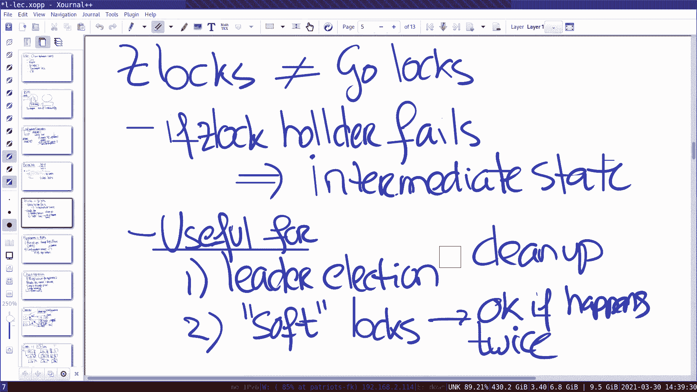

# MIT 6.824 2021 分布式系统 [中英文字幕] - P11：Lecture 11 - Chain Replication - mayf09 - BV16f4y1z7kn

傍晚好，晚上好，无论你在哪里，我们开始吧。今天，我想谈谈链式复制，今天的论文来自 2004 ，在深入研究这篇论文之前，我想提醒你几件后勤上的事，一是我们周四有个测验，测验的所有主题说明。

都在课程表页面上，我们会在 Piazza 上发布公告，包含更多细节，关于我们怎么做测验，它将在[年级范围]内，是在上课时间 80 分钟，以及后续更多细节。第二个我想提醒大家的是项目。

如果你想做一个项目而不是实验 4 ，那么你可以这么做，但你应该提交一份项目建议书，使用几个段落，通过提交网站提交，这样我们就可以给你反馈，告诉你这个项目是否适合 6。824 的期末项目。

如果你只是计划去做实验 4 ，你不需要做任何事情。对这两个[后勤点]，有什么问题吗？好的，那么，让我转移到另一点，我想提出，就是之前课程的正确性，我们演练了 Go 代码。

关于我的 raft 实现 2a 2b ，我们谈了关于 Go defer 语句的事情，我提到过，你可以将 defer 语句放在基本块中，这是正确的，我认为可能是 Felipe 提出了这个问题。

这个到底是什么时候执行的，我对这个问题的回答有误，defer 语句被执行，在从函数返回时，而不是在基础块返回的时候，所以，我对任何引起的疑惑表示抱歉。对于这个澄清，有什么问题吗？好的？好的，有两个主题。

都是技术讨论，今天我想谈的是 zookeeper 的锁，上次我没能完成，然后我将讨论链式复制。好的？对于链式复制和 zookeeper 来说，我们仍然处在和以前一样的环境中，也就是，我们在做复制状态机。

这是一张常见的图，我们有服务器，它运行一些复制库，比如 ZAB 或 Raft ，我们有客户端与服务器交互，例如在 zookeeper 的情况中，可能发送 create 调用。

zookeeper 内部有一些状态，一些 znode ，它们是以树的形式存在的，所以，当一个操作进来时，zookeeper 把这个操作转发给 ZAB 库，它会来回聊天，为了获得服务器的大多数。

为了接受那个命令，然后在某个时刻，一旦它被接受，它出来了，服务器应用了操作，并将响应发送回客户端，所以这是复制状态机的标准故事，如果你启动，所有复制状态机都会以相同的状态启动。

你以相同的顺序应用相同的操作，然后你就会以同样的状态结束，所以，如果有必要，任何一台机器都可以接管。现在，关于 zookeeper 有趣的事情之一是，读操作可有由任何服务器提供。

对于任何节点或任何一个服务器，这使得 zookeeper 拥有极高的性能，因为你可以通过扩展服务器的数量来扩展读操作的数量，作为它的另一面，zookeeper 放弃了，在特定场景下，放弃了线性一致性。

因为我们知道，比如在 Raft 中，我们不能从任何服务器进行读取，因为我还没有看到最新的更新，所以在 zookeeper 的情况下，这是[]，读操作不是。

或者 zookeeper 定义的操作不提供线性化的接口。尽管如此，我们看到是，它提供了一种与线性一致性略微不同的正确性保证，而且这种正确性保证是有用的，并且足够有用，能够编写实际的程序。

zookeeper 所关注的特定程序是，他们称为配置或协调程序。所以想一想这件事，过去我们看到了很多系统，它们通常有一些复制的故事，它们有 coordinator master 用来协调组。

zookeeper 想要的是作为一个服务，对于那种 master 或 coordinator 的角色，它提供了一系列原语来实现这一点，我们上周讨论了原子增加，和一些其他服务，想通过谈论锁来结束。第一。

因为有很多关于它的问题，第二，它是非常有趣的，这里有两种不同的锁实现。首先我想谈谈简单的那个，让我写下伪代码，然后我们可以谈谈细节，所以锁的伪代码是像这样，acquire ，在一个无限循环中。

试着创建锁文件，命名为 lf ，并将 ephmeral 设置为 true ，我们稍后会讨论为什么。如果创建成功，然后那个进程，第一个创建文件的客户端，成功地获得了锁，所以，它打破 for 循环并返回。

如果客户端没有，创建一个文件，然后它调用 exists ，调用 exists 并不是为了看它是否存在，因为它并不存在，就是设置一个 watch ，想法是， watch 会触发，如果文件消失了。

如果它消失了，客户端会收到通知，所以我们在这里要做的是，等待通知。所以这是 acquire 操作，然后 release 就很简单了。release 基本上不做任何其他事情。

只是发送 delete 操作到 zookeeper 服务，对于锁文件来说，在这种情况下是 lf 。那么这是做什么，如果 delete 发送给 zookeeper 服务。

zookeeper 服务执行 delete 操作，这将会让文件消失，会通知 watch ，所以每个在等待的客户端，对于通知，将会收到一条通知，然后它们会去重试，它们中的一个将在重试中成功。

将获取锁文件或创建锁文件，然后继续，然后其他的又回到那里，调用 exists 并等待通知。zookeeper 语义足够好，对写操作的线性一致性，加上通知发出的规则，足够强，来实现一个[]锁。

只有一个客户端，如果同时有多个客户端试图获取锁，只有一个会得到它。当 release 完成时，或者当文件被删除时，在下一轮中只有一个能拿到它。所以这有点酷，它是有趣的，你可以构建某种基础原语。

使用 zookeeper 提供的原语。你看这两个角色，watch 和第二个角色 ephemeral ，ephemeral 在这里，因为，如果客户端失败或崩溃，在它调用 release 之前。

ephemeral 文件的语义，zookeeper 服务将会，如果它确定客户端已经崩溃，它会执行操作，它将删除代表客户端的文件，所以，即使客户端出现故障或崩溃，zookeeper 服务[]，某个时刻。

客户端掉线，这将删除文件锁 f ，这将导致发送通知，到等待它的其他客户端。所以，这是一组很酷的原语，构建在应用程序中有用的强大[抽象]。这个实现的一个缺点是，它具有所谓的羊群效应，也就是说。

假设你有一千个客户端，想要获取锁文件或创建锁文件，获取锁，一个会成功，999 将调用 exists 并等待通知，然后当第一个客户端删除文件或释放文件锁时，999 将尝试获取锁，当然，只有一个会成功。

998 将会等待通知，但你知道这个，每一个随机消失，会产生巨大的流量，基本上就是轰炸 zookeeper 服务器，999 尝试重新执行，除了一个，所有都会失败。所以这是不受欢迎的性质，这种羊群效应。

这在实践中是一个真正的问题，在小规模的多核机器上移动，当然还有像这样的设置，网络消息不是免费的。所以，有趣的是， zookeeper 提供了足够的原语，你可以做得更好，你可以创建一个锁。

不会受到羊群效应的影响。所以更好的锁，它是非常有趣的，让我找出这个的伪代码，在论文中，这样我们就能看到它了，并讨论为什么这个锁更好，我们看到的是这个锁更好，因为这里没有重试。

所有未成功获取锁的客户端都将重试获取，相反，所有的客户端都排成一条线，它们可以一个接一个地获取锁。你可以 zookeeper 原语编程的方式，像这个伪代码一样。这与上一个有些不同，首先，这个。

这有一个额外的传递给 create 的标志，即 SEQUENTIAL ，这意味着，当创建这些文件时，锁文件被创建，但它将被创建为，第一个将是 lock-0 ，下一个将是 lock-1 ，依此类推。所以。

我们有一千个客户端，争先恐后地到服务上试图获取锁，基本上会创建一千个文件，所有的数字是从 0 到 999 。然后，那么。所以，我将成功创建一个文件，创建者返回你得到的数字，所以如果客户端 0 。

如果第一个客户端创建了 lock-0 ，那么它将获得 0 ，第二个将得到 1 ，依此类推。然后伪代码要求，获取这个目录中的所有子项，那些文件被创建的，所以在这种情况下，可能有一千个子节点。

一千个 znode ，然后你可以查看 n ，看看你的 n ，在这种情况下， 0 是要查看的最小 znode ，如果是这样的话，就意味着你拿到了锁。所以这完全有道理，第一行得到了 0 。

所有其他客户端都有更高的数字，因为它们是按顺序编号的，所以，第一个客户端将成功地获得它，而所有其他，它们要做的是，它们会查看，它们会找到 p ，这个数字正好在它前面，例如，如果这是客户端。

它获得 lock-10 ，它将查找 znode 9 ， lock-9 ，在那个文件上放一个 watch ，这意味着每个客户端都有一个 watch 在它的前一个节点，所以所有的客户都排成一条线，然后。

客户端等待通知发出。这意味着，例如，当客户端 0 得到 0 ，释放锁，它将删除 n ，文件 1 将收到通知发出，所以，客户端正在等待该通知，然后运行，但它是唯一可以运行的，而且它会成功。

所以我们在这里看到，这有时是一种更简单的锁，称为标签锁，在多核编程中，如果你对它们很熟悉，它们在某种程度上与标签锁是相同的想法，你将使用 zookeeper 原语构建这个。再说一次，有趣的是。

这些原语足够强大，你可以创建这种锁。对于这个，有什么问题吗？好的，关于这些锁，我想再说一句，在进入链式复制之前。我们在聊天中有一个问题。好的，聊天中的问题是什么？第 4 行的 watch 是做什么的？

好的，回去，在这个第 4 行吗？是的，我想这就是问题。好的，这个 watch ，我的注释，这个 watch 应该在第 5 行，所以在第 4 行没有 watch ，第 4 行只是查找 p 。

你的 n 之前的数字，如果这没有回答问题，你可以晚点再提问，也可以。事实上，我还有一个问题。嗯。我想回退几张幻灯片，但是 zookeeper 如何确定客户失败，从而释放 ephemeral 锁。

比如通常只是短暂出现分区。是的，所以这是可能的，所以客户端可能会，客户端有一个与 zookeeper 服务交互的 session ，客户端需要，zookeeper 和客户端互相发送心跳。

如果 zookeeper 服务一段时间没有收到客户端的心跳，然后，它决定客户端掉线并关闭会话。客户端尝试在会话上发送消息，但是会话已经关闭，已经消失，任何被创建的文件。

这个会话期间创建的 ephemeral 文件会被删除，如果网络恢复，客户端尝试通过那个 session 发送消息，zookeeper 服务会说那个 session 已经不存在了。

你必须重试或重新开始一个新的 session 。知道了，谢谢。好的，有一点很重要，我称为  zlock ， zookeeper 锁，它们并不相同或具有相似的语义，你正在使用的锁。

 Go 锁或 mutex 。这是一个需要注意的重要问题，即使它们不同，我们一会儿就会知道，它们仍然很有用，但它们不像 Go 锁那样强，尤其是有趣的是，当锁的持有者失败时，如果锁持有者失败了。

zookeeper 确认锁持有者失败了，正如我们刚才所讨论的，那是可能的，我们会看到一些中间状态。记得锁的整个规则是，它是临界区间，一些不变量是 true ，当你通过临界区间的时候。

所以这可能不是 true ，但到了最后，你会重建不变量。在这里，情况就是这样，它获取锁，客户端获取锁，执行一些步骤，然后 zookeeper 决定，如果客户端崩溃，然后撤销锁，但是你知道状态。

系统可能在某种中间状态，返回不变量不是 true ，所以不是这种情况，这些日志保证临界区间的[坚固性]。那么，它们做什么，它们有什么用处，是出于其他目的，事实上，有两种主要用例，一个。

我认为是领导者选举，所以如果我们需要一组客户端，需要从它们当中选出领导者，它们可以尝试创建锁文件，其中一个成功了，成为领导者，如果有必要，领导者可以清理任何中间状态，或者做这些原子更新。

使用 ready 的技巧，你对某个文件执行一些写入操作，但只在最后[展示]文件，通过这种方式进行一组写操作，是更具事务性的工作。所以，这是这类锁的一个使用案例，第二个用例是我所说的软锁。

你可以考虑软锁是，假设我们有一个 mapreduce 式的 worker ，而且 map ，我想安排每个 worker，只执行一次特定的 map 任务，所以，要做到这个的一种方法，我们从外面获取一个锁。

对于特定的输入文件，执行计算，然后，一旦 map 完成，然后释放锁文件，所以，通常情况下，执行特定任务只需花费一个 mapper ，而这正是我们想要的，当然，如果 mapper 失败，那么锁就会被释放。

然后我们可能会再执行一次，因为其他人会试图获取锁，所以在这种情况下，对于 mapreduce 的情况，这是非常好的，这个任务执行两次也没关系，如果发生两次。在某些方面，它到底是什么，更多的性能优化。

在通常的情况下，你想要，你想要只执行一次，但是如果失败了，情况可能是这样的，你执行了两次 map 作业，然后那个东西， mapreduce 意味着，你以这种方式设置，是可以的。所以，在这些情况下。

这种锁也很有用。关于这个，有什么问题吗，关于锁的这个观点，zookeeper 锁与 Go 锁不太一样，这是一件需要记住的重要事情。噢。好的，继续， Alexander 。是的，我有个问题，你说过。

其中一个区别是，在 zlock 中，如果持有锁的服务器宕机，那么锁就可以被撤销，但是，如果你不通过，是不是仍然会发生，因为有一个标志是 EPHEMERAL 。EPHEMERAL ，是的。

只有 ephemeral 文件才会发生这种情况。是的，所以我们能不能通过不传递 EPHEMERAL 来模拟 Go 锁。好的，接下来会发生什么，你创建了一个永久文件，客户端宕机。你是说锁？锁将继续存在。

没有人会释放它，我们会陷入死锁，因为唯一可以释放它的已经宕机，或者崩溃，这就是为什么会有 EPHEMERAL 。它真的是唯一可以释放它的吗，因为任何人都可以删除那个文件，你有[后台]，比如。这将破坏。

可能另一个客户端仍在运行，并且仍然认为它持有锁。好的。你会得到，这又是一个共识问题。你知道我们，所以，这是一种获得大部分信息的简单的方式，但不是全部，如果你愿意的话，我想如果你想让东西变的原子化。

让一组写入原子化，所以你使用这个技巧，使用这个技巧， ready 技巧，执行很多写入，但是[同时]展示它们。你能再解释一下那些软锁吗？好的，软锁意味着一个操作可以发生两次。在常见的情况下，如果没有崩溃。

它只会发生一次，因为客户端用一个锁，会进行释放操作，但是如果客户端在半路失败了，然后锁将由 zookeeper 自动释放，然后可能是第二个客户端执行相同的 map 任务。所以在领导者选举的例子中。

在这里可以暴露的中间状态是什么，这似乎是第一个。好的，纯粹的领导人选举不会有中间状态，但是通常领导者会创建配置文件，像我们在 zookeeper 中看到的那样，使用 ready 技巧。我明白了。

所以你把整个文件都写好了，然后原子地进行转换，使用重命名。是的。抱歉，你能具体解释一下 ready 技巧是什么吗？我希望不用，我想我们上次谈过了。抱歉。所以也许你可以保持这个问题。

我很高兴在课程结束后再讲一次，否则，我很少有时间来谈论链式复制。还有其他问题吗？好的，让我设置一下链式复制的状态，有时也会回到 zookeeper ，事实证明，有两种常见的方法来构建复制状态机。

我们还没有提出这两种方法，我们见过它们，但我很明确地谈到了它们，我想这次是明确的。所以。因为有一些有趣的观察，用来构建复制状态机的方法。第一个是我们在实验中看到的那个。

也就是运行所有操作通过 Raft ，Raft zookeeper 或者 Paxos ，无论使用什么共识算法，这有点像键值存储，在实验 3 中，你执行 put get 操作。

你通过 Raft 执行所有 put get 操作，服务更新键值存储状态，当操作进入 apply channel 时，我们有自己的复制状态，这就是实验 3 的工作方式。事实证明。

 Raft 使用的这种风格，运行所有操作的情况并不常见，我们将在本学期晚些时候看到一些其他设计来实现这一点，比如 Spanner 实现了，但这并不完全是标准的方法，或者更常见的方法是有一个配置服务器。

比如 zookeeper 服务，配置服务内部可能使用 Paxos Raft ZAB 或任何其他，配置服务扮演着 coordinator 或 master 的角色，就像 GFS master 。

配置服务除了，使用 Raft Paxos 算法实现，你也可以运行主备复制。所以考虑 GFS ，我们在本学期早些时候看到的，有这种结构，就像在 GFS 中有一个 master 。

这决定了哪组服务器保存特定的块，确定区块的复制组，然后复制块组组执行主备复制，其中一块是主节点，另一个是备份，它们有一个用于主备复制的协议。你可以考虑 VM-FT 使用类似的形式。

其中配置服务器是 test-and-set 服务器，它记录了谁是主节点，然后主备有一个协议，发送[通道操作]到通道，因此，主备大致同步，实现复制状态机。这种方法往往是一种更常见的方法。

虽然第一种方法也会发生。一种思考这个问题的方法，如果 Raft 状态，比如，我们在实验 3 的键值服务器将是巨大的，有大量的这种状态，数 TB 的键值服务器，对于这种应用。

 Raft 会是非常好的匹配吗，或者风险是什么，或者潜在的问题？我们经常刷新日志，所以，这可能会带来问题。可能会有问题，检查点的大小是多少，如果我们的键值服务器非常大。它与键值服务器的大小成正比。是的。

所以这也可能是巨大的，所以在任何时候，检查点必须被发送，这将是一个很大的检查点。所以 Raft 并不是设置好的，主节点需要通信，新的主节点将与快照通信，你在实验 2d 中所做的，到备节点，它们会很大。

所以你想要更聪明的方案，重新同步新服务器，所以，一个原因，这些东西通常被分成两个不同的部分，其中配置服务在状态方面很小，然后，主备方案可能复制大量数据。这就是为什么，你看到这两种方法的一个原因。

这能理解吗？我会在课程结束时再讲到这一点，但重要的是要记住这一点。那么，方案 1 比 2 有什么好处呢？你不需要有它们两个，在 1 中，你有 Raft ，你运行[]操作，然后也为你进行配置，所以。

所有的东西都在一个单一的组件中，在 2 中，我们有两个组件，我们有一个配置服务，包括 Raft ，而且我们有一个主备方案。所以，这个可能会变得更加清楚，当我们讨论链式复制时。嗯。我有一个非常简短的问题。

所以第二个，优势是什么，如果通过领导者达成共识，领导者永远不会失败，对吧。是的，所以第二个的优势是，正如我们随后会在链式复制中看到的，有一个单独的进程负责配置部分，你不必担心你的主备份复制方案。

这就像 GFS 一样决定了，比如 master ，它决定这里的几个，设置服务形成特定复制组，而主备协议不用考虑这个。谢谢。这是对链式复制的一个很好的介绍，因为链式复制正是，方法 2 的主备复制方案。

就是说，链式复制假设，有一个配置服务，我想他们在论文中成为 master 。然后链式复制本身，有几个很酷的属性。一，读操作或者他们称为查询操作只涉及一个服务器，也就是我们随后会看到的 tail 。

链式复制的另一个很好的特性是具有非常简单的恢复方案。我随后将更详细地讨论这些。很可能一些事情开始，你理解这个事实，在 Raft 上能有多复杂。而且它提供了很强的性质，即线性一致性。

如果我们进行 put 和 get 操作。最后，很多人问到，是一个合理的有影响力的设计，并被很多系统使用，所以这些都是在实践中使用的。这将讨论这些组件中的每一个，我们会得到更多细节。

然后我们将回到方法一对比方法二。所以从总体上来说，糟糕，一个概述，新的[]类型，这里有一个大的进程或一个配置服务，然后跟踪，哪台服务器属于特定的链。所以 S1 S2 S3 ，有一个关于是什么链的记录。

谁是头，谁是尾，所以这可能是配置服务，在这里，我们有我们的服务，S1 S2 S3 ，其中一个是头部，通常是数字较小的那个，一个是尾部。所以我们有一个客户端，客户端可以访问配置服务器，它是链的一部分。

然后它向头部发送写请求，所以这是一种链式复制协议，写请求总是发送到头部，头部所做的，头部推送，头部对它的状态进行操作，也许它有一个关联的磁盘，键值服务在上面，然后它发送更新。

所有的操作在链上按照先进先出的顺序可靠地进行，所以， S1 发送更新给 S2 ，S2 有自己的磁盘，将操作或状态更改应用于它的状态，一旦它应用了它，它会把它发送到链中的最后一个节点。

因为在这个链中只有三个节点，你可以有更长的链，如果你想要更多的可用性，当最后一个节点收到状态改变的消息，它应用于它的状态，然后这是向客户端发回确认的[时机]，所以是尾部发回确认信息。所以。

考虑这一问题的一种方式是，当尾部或在这种情况下 S3 应用了状态变化，这就是提交点。之所以这是提交点，是因为后续读取总是从尾部获取，所以，如果任何客户端执行读操作，它们总是到尾部。

尾部会立即对它们做出反应。所以读操作到尾部，这是客户端 1 ，这是客户端 2 ，客户端 2 进行读操作，它到达尾部，尾部做出响应，就是这样。所以有几件事我想指出，其中一个有趣的问题是。

读操作只涉及一台服务器，如果记得实验 3 ，或者如果你有任何进展，我们已经开始实验 3 ，读操作涉及，在我们的实现中，读取操作通过 Raft 日志，以及所有东西，论文讨论了一个优化。

但读取操作始终由领导者执行，而领导者首先必须联系大多数服务器，在执行操作之前。所以你在这里看到的是，读操作通过尾部，写操作从不同的服务器，所以，读写工作负载至少分布在两台服务器上。

对于更多读操作只设计一台服务器，不需要与任何其他服务器交互，它可以立即做出响应，我们稍后会看到，为什么这很重要，或者为什么，这允许什么更多的优化。所以提交点是，写入发生在尾部的点，因为在那一点。

写操作可以被读取者看见，而不是在任何其他点之前。这也提供了线性一致性，所以很容易看到，在没有崩溃的情况下，这个方案保证了线性一致性，因为写入都是按整体顺序在头部应用，当尾部收到更新时，这是提交点。

它想要响应客户端并发回请求。如果同一客户端立即执行读取操作，它会到尾部，它将观察到最后一次变化。所以，在单个客户端中，所有的操作都是完全有序的，在客户端上很容易看出。

如果在客户端 2 读操作开始在客户端 1 操作完成之后，当它完成时，当尾部做出响应时，所以，任何开始在写操作之后的读操作，将观察到最后一次或最近一次写入的结果，所以这里很容易得到一个直觉。

这将为我们提供线性一致性。好的？我现在想要开始一个快速分组会议室，我想让你们讨论一下这个问题，在课程中贴出的，会出什么问题，或者什么打破线性一致性，如果不是让尾部响应客户端，让头部立即响应客户端。

在收到写请求之后，也许这些都是很好的话题，或者可以稍微辩论一下，如果你想从任何角度，谈论链式复制，当然欢迎，也许这是一个开始。所以让我们来个五分钟的分组会议室，然后我们这样做并想想，让我看看。

Jose 你来做吗？好的。你得给做点什么，或者。我不认为这是必要的。我认为是 Zoom 变化，所以在那里也是可能的。Zoom ，是的，没错。好的，好的。

Jose ，我们回来了。好的，你什么时候。我准备好了。好的，我想我可以关闭到 Zoom 。好的，我们回来了。好的，所以简单概括一下，为什么这会打破线性一致性，协议更改传播到。

继续传播到 S1 S2 S3 ，但是一旦 S1 完成了，消息传播，返回给客户端，显然，这将会打破线性一致性，假设客户端 1 写入，从 S1 得到确认，当然写入会继续到 S2 S3 。

但也许在 S2 与 S3 相关之前，客户端向 S3 发送一个读操作，当然，现在它将返回写入完成之前的值，客户端甚至不能观察到自己的写入，所以很明显打破了线性一致性，所以这非常重要，正如我前面所说的。

是尾部发送确认给客户端，因为一旦尾部处理了写操作，那就是提交点。对于这个，有什么问题吗？好的，所以这是正常的操作，让我来谈谈崩溃，因为它是 6。824 分布式系统，所以所有都是当失败发生时。

链式复制最酷的一点是，失败场景的数量是相当有限的。所以，让我来看三种情况，头部故障，中间服务器之一故障或尾部故障。所以让我们来看看这些情况中的每一个，这是一种情况，头部是 S1 。

假设它应用了 U1 U2 U3 三个更新，与 S2 交互，也许 S2 完成了 U2 和 U1 ，这里我们有 S3 ，也就是尾部，到目前为止，它只完成了 U1 ，所以，对于正在访问 S1 的客户端。

我们现在考虑会发生什么，以及在其中一次崩溃中需要发生什么。所以让我们从头部崩溃的情况开始，所以头部崩溃时，需要做什么，这是一件容易的事还是一件难事？简单的。我希望是简单的情况，为什么？你可以删除头部。

哦，抱歉，是的，头部，现在让 S2 成为头部。是的，所以会发生的事情是，配置服务发现 S1 不见了，当确定 S1 不见了，然后可以在后续操作中提升 S2 为头部，未来的客户端访问这个节点。

为什么这是正确的，那么我们丢掉了什么操作？我们失去了 U3 。是的，这有什么问题吗？丢失操作是合法的。是的，丢失 U3 是合理的，U3 尚未提交，因为只有尾部的操作才会提交，所以，就像操作从未发生。

客户端甚至不会注意到，这个 U2 或 U3 发生了，或者 U3 应该发生。好的？所以这么做完全没问题，为什么配置服务涉及这里是重要的，S2 可以自己决定成为领导者吗，我们假设可以， U2 告诉任何节点。

决定无论如何，我要成为头部，这是合法的吗？那就像是创造分裂。是的，那会造成脑裂，因为 S2 可能与 S1 分区，所以现在两个都是头部，也许两者都在处理命令，将会是违规行为，全部[]都有整体顺序。

我们现在可以。同时， S2 知道 S1 是头部吗，因为它只是接受。你可能是从以前的配置信息中得到，比如当配置服务决定新配置时，它们可以告诉所有的服务器，和任何关心的客户端，这是新的配置。

这是否仅在 S1 到 S2 连接断开时发生，或者是什么导致了脑裂？脑裂发生在，如果 S2 自己决定 S1 失败并成为头部，所以我们不允许这样的事情发生，在实践中，实现的方法是，这里有一个配置服务器。

它决定了当前的配置是什么，如果它确定 S1 已经宕机，然后它可以通知 S2 S3 ，说你们现在是新的链了， S2 是头部，当这种变化发生时，所以在这种情况下，会丢弃 S1 ，不会有其他事情发生。

因为 S2 有，我们丢失的唯一更新，并没有进行提交，所以没有什么需要进一步修复的。所以从这个三个复制的设置开始，丢弃头部是相当简单的操作。好的？教授，我有一个问题，所以这里有一个假设，就像命令一样。

离开 S1 将按顺序到达 S2 ，这是不是一个合理的假设，比如。好的，我认为它们的方式，所以他们说，我们需要在 S1 和 S2 之间一个可靠地先入先出，以及 S2 到 S3 。

我想他们实现的方式很可能是使用 TCP 连接。好的，谢谢。好的，让我们来看第二种情况。所以我们有 S1 S2 S3 ，当然，链中可能会有更多的服务器，但是三个足够我们考虑所有的情况。

所以现在我们想要做的是，中间的一个崩溃了，这个崩溃了。所以，配置服务在某一时刻决定 S2 崩溃，通知 S1 S3 ，它们形成新的链，我们想知道，还有什么事情需要发生？我们在第一种情况中看到，丢弃头部。

就没什么好做的了，除了更新链之外，现在我们更新链，问题是，有什么事情需要发生？S1 需要发送给 S3 ，发送给 S2 的请求，但没发给 S3 。是的，我们有 U1 U2 U3 。

这个看到 U1 和 U2 ，这个看到 U1 ，U2 正在进行，我丢失了 S2 ，S1 必须使 S3 保持最新，向前推进 U2 和 U3 。好的，这需要做一些工作，让我们来考虑最后一种情况，尾部。

所以我们又来了，我们有三种情况，三个服务器 S1 S2 S3 。让我们看看，尾部崩溃了。所以，在某个时间点，配置服务通知决定新的链将是 S1 和 S2 ，告诉 S1 和 S2 它们是新链的一部分。

还有其他需要发生的事情吗？好的，让我们写下来，我们知道，这个看到 U1 U2 U3 ，这个看过 U1 U2 ，那么，在这种情况下，谁将成为新的尾部？S2 。是的， S2 成为新的尾部。

还有其他需要发生的事情吗？我想客户端需要被告知 S2 是。是的，客户端可以从配置服务获取。所以是的，但没有其他事情要发生，因为，所有提交的，没有提交的操作会丢失，由于我们仍然。

仍然需要传播到 S2 会发生。好的，所以丢弃尾部也是直截了当的。所以丢弃尾部，头部是很直截了当的，丢弃中间那个更复杂一些，但并不是很复杂。我在这里想强调的关键是。

这与 Raft 论文上的图 7 和图 8 相比如何？也许是为了。好的，继续。问题，所以，这些新的操作都是自动的。抱歉，我没有听到你说的话，你那里的连接相当嘈杂。好的，我刚才说， S2 变成了新的尾部。

不必向客户端发回确认吗，还有一些条目是自动提交的。是的，可能是这样的，客户端可能发生的事情是重试，我们必须有一个像实验 3 中的独立的重复检测方案，有几种不同的方法可以做到这一点。

论文并没有说明它使用哪一个。好的，我明白了，谢谢。是的，就像这种情况，论文不是说了，它可能会，即使它没有回应，可能成功，也可能不成功。好的，回到我原来的问题，这个对比如何，我在这个白板上画的图。

对比图 7 和图 8 ，有什么不同？更简单。是的，这就是我想要表达的重点，这里要考虑的情况并不多，只有三种情况，比 Raft 论文的情况要简单得多，要考虑的情况很多，场景很复杂，部分原因是这是一条链。

事情以一种非常直截了当的方式推下来，向复制链的下方，当然，部分原因是，配置部分外包给配置管理器。但是对于主备部分的恢复方案，这是直截了当的，只有三种配置需要考虑。我还想提出一个点，就是如何添加复制。

因为这里的任何系统都会实时运行，在某些时候，你需要添加一个新的，因为否则你会丢失，你开始有三个，然后你有两个，然后有一个，然后就没有了，然后你就[]。所以，你必须添加新的复制。

所以让我们来考虑一下这个情况，这是 S1 ，它是头部，假设我们在一种情景中，我们有 S1 S2 ， S2 是尾部，我们想要添加 S3 ，事实证明，正如论文所描述的那样，在它的尾部做这件事是最方便的。

所以创建新的服务器，新的尾部。所以，我们继续进行的方式是，比如客户端在这里，访问 S2 ，因为这是当前的尾部，S3 出现，它做的第一件事是，将 S3 中的旧状态复制到，从 S2 到 S3 。

所以这可能需要几个小时，几十分钟，甚至几个小时，你将从 S2 向 S3 复制数 GB 或数 TB 的数据，但当这一切发生的时候，S2 S3 能服务于请求，当然。

它必须记住哪些是在 S3 开始复制之后进入的，所以保持一份所有发生更新的列表，但还没有传播到 S3 ，在某个时刻， S3 完成了所有复制，告诉 S2 ，好的，伙计，我准备好了，成为尾部。

我得到了所有状态，S2 ，发送邮件，发送消息给 S2 ，说，好的，我想成为尾部，S2 回应，比如，是的，可以，但是一旦你应用了所有的更新。所以， S2 发送更新响应这个，我想继续一个尾部请求。

作为对 S3 响应，S3 回复更新，然后变成尾部，正在与 S2 交互的客户端，S2 可以告诉客户端，从现在开始，我不再是尾部了，你应该访问 S3 ，所以它们可以切换方向。所以。

这就是将复制添加到链中的方法。所以关于这个的问题，你不会遇到这样的无限循环问题吗，S2 将更新发送到 S3 ，当 S3 更新时，它也服务于更多的请求，由于更多的更新，它需要来回发送？不。

一旦 S2 发送了更新，S3 还没有见过，到 S3 ，然后从那时起，正常的链式复制，每当 S2 收到请求时，来自 S1 的更新，它将它推给 S3 。是的，但是 S3 可以成为尾部。

直到它成功处理了所有更新。哦，是的，所以，一旦它建立了 TCP 通道，S2 可以说，一旦你处理完这些，你可以成为尾部，因为你看过所有东西。我是说。后面的所有东西都可以按顺序排序。

在同一个 TCP 通道中。它可以变成尾部，甚至在处理更新之前，只要它不服务于请求。只要它不服务请求，是的，它只需要处理所有更新，S2 收到的 S3 没有，一旦我们更新了这些，然后它变成尾部。

并开始处理请求。我明白了，所以暂时阻塞请求，当它处理新的更新时。好的？好的，现在我想回到很多人问的问题上，这个比较起来怎么样，CR 属性，链式复制属性，它是如何比较的，其中一个好的属性。

大多数与 Raft 进行比较。当然，我得说，当然，链式复制只影响主备方案，而不是配置服务，所以我们会更详细地谈到这一点，但有几件事我们可以知道，我们只比较方式，Raft 协议和链式复制协议的工作方式。

首先，我们可以得到，链式复制的积极方面是，客户端的 RPC 拆分到头部和尾部，为任何客户端操作提供服务的负载，可以在它们两个之间拆分，它们不必像在 Raft 中那样通过领导者。此外，头部发送更新一次。

所以不同于 Raft ，头部或领导者发送更新，（发送）日志条目到每个节点，在这个方案中，头部总是只发送一个 RPC ，因此涉及的信息更少。读取操作只涉及尾部，与 Raft 不同，即使你实现了只读优化。

读操作通过日志，并附加到所有节点的日志中，但这仍然需要领导者与大多数节点联系，来决定它是不是可以服务的操作。另一个[]的积极方面是简单的崩溃恢复，正如我们所说的。但是与 Raft 方案相比。

它的一个主要缺点是，你有一个故障就需要重新配置，需要重新配置的原因是，因为写入必须通过整个链，所以，写操作无法确认，直到链中的每台服务器都已经执行。这略有不同，在 Raft 中，如你所知。

因为假设大多数节点，接收写操作，追加到它们的日志中，系统就可以继续运行，所以根本没有中断，如果一台服务器出现故障，如果剩余的服务器仍然构成大多数，而在链式复制中，如果一台服务器发生故障。

一些重新配置必须发生，这意味着可能会有一段很短的停机时间。这能理解吗？现在我想再提出一点，相比 Raft 复制方案是这样的，因为读取操作仅涉及一个服务器，有一个很酷的扩展，如果你愿意。

它会获得非常高的读取性能，所以基本思想是这样的，基本的想法是拆分，拆分对象或他们在论文中所说的 volume ，将对象拆分到多个链中。不是像我在以前的板上做的只有一个链，我们将有多条链。

比如我们可能有链 1 ， CH1 ，S1 是头部， S2 是中间的， S3 是尾部。链 2 ，我们旋转物体，S2 是头部 ， S3 是中间的，糟糕， S3 是中间的， S1 是尾部。链 3 。

我们会安排 S3 作为头部，S2 是，糟糕， S1 是中间的， S2 是尾部。我们要做的是，我们将把对象分成多个链，所以配置服务有一个映射，比如分片 1 ，在分片 1 中的对象到链 1 。

分片 2 中的对象到链 2 ，分片 3 中的对象到链 3 。它最酷的地方是，我们有多个尾部，S3 是某个链的尾部，S1 是某个链的尾部，S2 是某个链的尾部，到不同链的读操作，现在可以完全并行执行。

所以，如果读操作命中不同的分片，均匀的分布，我们的读吞吐量会线性增加，随着我们拥有的尾部数量，在这种情况下，我们有三个尾部，所以我们获得三倍的读性能。所以我们做了同样的事情。

所以我们得到了一些 zookeeper 拥有的相同的属性，读性能可以很好，随着服务器数量的增加而扩展，但我们得到的不仅是这些，我们得到了扩展部分，并且我们保持了线性一致性，在这个方案中。

我们不必放弃线性一致性。所以我们得到两个好的性质，良好的读取性能和随服务器数量的有效扩展，至少对于读取不同的链，并且我们保持了线性一致性。关于这个，有什么问题吗？抱歉，在这种情况下。

客户端什么时候决定从哪个链进行读取，它们能够自己决定吗，或者它们是否需要联系配置服务器来决定。是的，所以这是一个很好的问题，所以通常情况下，这篇论文并没有明确地说明这一点。

它们谈到也许可以通过代理访问服务器，你在实验 4 中要做的是，你会下载配置，配置包含分片分配，然后你从配置服务器下载。你需要注意，如何对每个链中的服务器进行排序，防止某个链过饱和。

或两个服务器之间的特定[链路]。是的，这个方案没有考虑到这一点，你可以想象配置方案或配置管理器，拥有网络布局的复杂模型，可以非常小心地注意链是如何做的，可能更多的分片在一条链上。

而更少的分片在另一条链上，所有的事情原则上都是可能的，因为配置管理可以计算任何东西，并且说这是分配。谢谢。如果它想的话，甚至可以重新平衡。回答问题，你能再解释一下线性一致性是如何在这个扩展下保持的吗？

好的，什么都没有真正改变，我们仍在使用链进行主备，所以，我们从单链延续了线性一致性，就是这样。这可能是猜测的，但这个相比，我想这可能相当于每个链接有一组服务器，而不是重复使用相同的那个。

或者不是针对每个链接，而是针对链中的每一步，所以，就像 S1 有三台服务器，S2 有三台服务器，而不是重复使用相同的那个，从不同的角度进入。是的，你想象的那个方案有什么好处？我的意思是，为了可扩展性。

同时保持线性一致性。好的，这个方案有吸引力的原因是，因为我们尾部可能有相当多的负载，但中间的那个不会，通过这样的安排，我们将负载分散到所有服务器上。我明白了，好的。好的，很好。所以也许我在这里总结一下。

然后稍微讨论一下，所以我们看到了方法 1 ，我们在实验 3 所做的，运行所有的操作通过 Raft ，或者配置和复制都是使用 Raft 构建的，而且没有牵涉其他东西，然后是方法 2 ，是这篇论文的主题。

有一个配置服务器，可能使用 Raft 或 Paxos 或其他，以及一个主备复制方案，同时主备使用链式复制。你可以看到，希望这里更清楚，方法 2 有一些吸引人的性质，从某种意义上说。

你可以获得可扩展的读取性能，在主备上，当然不在配置服务器上，因为它运行 Raft ，你在使用方法 1 ，但你至少可以，可能对复制上的操作扩展读性能，或者在主备方案中，put 和 get 操作。

这个的另一个好处是，如果数据非常大，你可以有更专业的同步，或者将状态从一台机器复制到另一台机器的方案。链式复制或任何类型的主备方案，与配置服务器分开，使你可以轻松地做到这一点。所示，这是很常见的。

人们在实践中使用方法 2 ，尽管也不是不可能，对复制状态机使用方法 1 ，包括像 put get 操作这样的服务操作，实际上，实验 3 会这样做，我们将在本学期晚些时候看到论文 Spanner 。

它也使用 Paxos 来完成操作。这里还有什么问题吗？如果没有，那么我祝大家在周四的期中考试中好运，我会在下周当面见你，虚拟的当面。如果你有任何问题，请随意留在这里，我会尽最大的努力回答他们。

我有一个关于你提到的关于 Raft 的问题，你提到，所有的读取都必须通过大多数服务器，但我不太明白为什么，因为领导者有所有提交的条目，对吧。是的，有两个方案，如果领导者，所以要么你遇到这样一种情况。

所有最近的写入都由领导者提供服务，或者从原则上讲，读操作由其他节点提供服务，然后你必须首先联系大多数服务器，以确保大多数有最近的操作。明白了，所以，这个需求是，如果我们想要将所有读取分布在每个节点上。

我们必须更老练一些，我们不能靠自己做到这一点，因为这肯定会破坏线性一致性。是的，但如果一切都通过领导者。然后当你到达那里的时候，你必须使用这个技巧，你要求一个空的[同意]。

在每个新 term 开始的时候，只是为了确保你确实是最新的。好的，谢谢。你能不能，再快速地说一下，当你在尾部添加新服务器时，所以为了确保我明白，所以，实质上，它启动了这个过程。

将所有数据从 S2 复制到 S3 ，然后，如果它接收到对任何数据的请求，在这种情况仍在发生的时候，然后， S3 将直接向 S2 索要其仍有的任何东西，它会得到，然后做出响应。是的。然后它继续这样做。

直到它获得 S2 不再有的数据，然后它就直接上线了。是的，或者你可以稍微改变一下，你可以让 S3 告诉 S2 ，S3 可以成为领导者，抱歉，尾部，不要处理来自客户端的任何操作。

直到它收到来自 S2 的剩余操作。哦，那么在这种情况下， S2 仍然是尾部。是的。直到 S3 得到一切。是的。基本上，这篇论文描述了一种特殊的方法，有几种方法可以做到这一点。但如果你这么做了。

那么你要等多久才能获得所有东西，我想我也有和其他人一样的困惑。你知道转换发生的顺序，举个例子，假设 S2 有 100 的运算，你开始复制操作，就像 Raft 中的快照，你开始复制操作，所以。

当复制操作完成时，S3 更新到 100 ，然后也许 S2 已经多了 10 个操作，所以它有 101 102 和 103 ，S3 可以联系 S2 ，说，把你剩余的操作给我，S2 说，好的。

剩余的操作是 101 到 110 ，作为连带的效果，S3 也告诉 S2 不要再做尾部了，S2 使用这些操作做出响应，S3 应用这些操作从 101 到 110 ，然后告诉客户端它是尾部。

但它还不能处理来自客户端的任何命令，或来自客户端的读操作，直到它处理了 101 到 110 。好的，好的，我明白了，理解了。我还有一个问题，哦，抱歉。不，继续，继续。好的。

我的问题和他说到的扩展有些类似，我在想，你能不能使用一个树而不是一个链，所以。我认为有，还有其他可能的数据结构，例如，很多人在电子邮件中建议，你可以有 S1 ，然后你可以有 S3 4 5 。

所有都是中间的，S1 与所有中间的并行交互，中间的与尾部交互，你说的树是这个意思吗？我的意思是更多，比如很多叶子节点，它们的高度大致相同，就像一棵平衡树，然后叶子会有一条链穿过它们。

我认为线性一致性在这里可以被打破，如果你仔细考虑一下，但它将拥有好的性质，你不需要，现在的传播延迟可以是[对数式的]，而不是这里的线性的，你可以从所有的叶子节点读取。好的，从所有的叶子节点读取是危险的。

因为它们可能有，一个客户端可能早些时候访问过另一个叶子节点，叶子节点可能不同步，所以我觉得这听起来有危险，也许你的方案比我想象的更复杂，树的深度或者链条的深度，是由失败之间的时间决定的，如果你在。

如果你通常运行 3 台服务器， 3 到 5 台服务器，因为这对你的高可用性来说已经足够好了，然后，因为你可以从 4 台服务器恢复，在整件事完成之前，然后这就覆盖了链的深度，是的，我们会引入一些延迟。

好的，有道理，谢谢。链一般都是短的。好的，有道理，谢谢。不用谢。这是唯一整个链宕机的情况吗，如果链中的所有服务器都宕机了？是的。谢谢。我也很好奇如何保持强一致性，在这个幻灯片中。

 S1 S2 S3 都可以进行读取。你可以获得每个分片或每个对象的强一致性，这是分配给链的，对吧。所以如果写入一个对象，你写入对象一，你读取对象一，所有这些操作都经过相同的链，所以，对于那个特定的对象。

你会得到强一致性。哦，知道了。但情况可能并非如此，在所有的对象上，我们都有强一致性。不，我不，让我犹豫一下。让我犹豫一下，我想这可能需要更多的机制。那么，这是什么意思，所有的对象获得强一致性。

我认为你读写对象一，你读或写对象二，然后一些客户端读取对象一，你会获得，基本上，如果你有一个客户端读取这两个对象，你能不能保证看到整体顺序和线性一致性。这类似于可串行化吗？可串行化略有不同，也许。

我们不要讨论可串行化，我们会回来，我们会在几周后讨论。嗯。我现在[]做出承诺，我需要考虑一下。好的，这完全可以。所以问题是这样的，你具有单个客户端读取和写入的一致性或线性一致性，但不是针对多个对象。

你有多个客户端访问这个，在同一个对象上执行操作，在这个方案中，具有强一致性，问题是，我们也可以有跨对象的线性一致性。但是，为什么这很重要，我没有看出，这在哪里是重要的，因为你，你不能对操作进行分组。

就像一次写入和一次写入。我的意思是你读取对象一，你写入对象一，你读取对象一，你读取对象二，你写入对象二，问题是，在线性一致性中，这些操作需要是完全有序的，它们需要保持这种属性的实时性。因为你有不同的链。

这可能不会发生，但我不想承诺，不确定关于所有链的[声明]。链保证了线性一致性，即使你有不同的对象。在论文中，我有一些事情不明白，就是更新传播不变量，就像是，在这个链的顺序中。是的。

提交是每个后续提交的前缀，这是不是保证[完整传递]通过链？不，它总是真的，比如你再看这张图片，我认为他们做了一个非常简单的观察，让我们看看，能不能找到那张图片，我可能什么都胡乱写下来了。

所以它可能不是那么干净，基本上他们说的是，如果你看这个图，S3 总是具有前缀 S2 ，并且 S2 总是具有前缀 S1 ，这是唯一一件不变量的事情。哦，那么 i 和 j ，那么后继者的前缀是前缀吗？是的。

这有点让人困惑，我后来才意识到，在别人问了这个问题之后，在定义中， i 和 j 是两种不同的方式，嗯，没有什么不同的方式，一个是定义，一个是不变量，你要小心一点，i 和 j 在链中的角色。这有点绕。

是的，就是这样。这怎么可能。没错。谢谢。不用谢。我是，糟糕。嗯。我只是想问，当你有一个网络分区而不是崩溃时会发生什么，如果看崩溃的幻灯片，链发生了什么，如果有网络分区，所以也许可以问这样的问题。

比如 S2 实际上还活着，但是在配置管理器和 S2 或其他什么之间有一个分区，所以现在 S1 和 S2 都指向 S3 。不，是的，好的，显然会有一些，当我想人们在谈论这件事时。

但我假设所有的配置都有编号，比如[]编号，S3 不会接受任何来自 S2 的命令，如果[]编号不匹配。哦，理解了，谢谢。与这个有关，我不能理解的一件事是，即使有类似的配置编号或其他东西。

你如何确保当你丢失尾部时，就像你画的第三个场景，当你丢失尾部时，可能所有发出读取命令的客户端，都知道这台旧服务器不再。客户端，我认为你做的方式是，当客户端从配置管理器下载配置时，它们还包括[]编号。

每个操作都包括[]编号，S3 会说，这是一个旧的[]编号，不要访问。我想，当客户端访问配置获得[]编号，我首先从一个客户端开始，它有一个老的。例如， S2 可以重试。

然后客户端返回到配置服务器并重新读取状态。我想我担心的是，比如 S3 与协调器网络分区，所以协调器从尾部去掉 S3 ，并增加版本号，但是有些客户端并没有发现版本号增加了，并且仍然认为 S3 是尾部。

访问 S3 不要读取，同时人们对 S1 S2 进行写入，它们还没有看到这个。是的，这可能就是为什么论文中通过代理。我明白了，好的。我有一个问题，回到那个问题上来，没有回答的问题，比如跨对象线性一致性。

我想，这是不是[]我们还没有谈论过的，如果你想做的话，我不知道什么是正确的术语，但是比如事务，跨多个部分状态，例如，如果尝试实现一项操作，你把 a 设置为 1 ， b 设置为 2 ，你应该一起看到它们。

或者根本看不到，就像[]那样，我们有没有讨论过在以前见过的任何东西。不，我们会在后面几个星期讨论，这将是一个大话题，就是怎么做事务。好的，很高兴知道，谢谢。你可以回去看第三张幻灯片吗？是的。

我可以去看第三张幻灯片，也许不是，第四张幻灯片，哦，是第五张幻灯片，抱歉，所以我有点困惑，你提到，如果锁持有者在中间状态失败，这张幻灯片上的哪些内容适用于 zlock ，哪些适用于 Go 锁。

这些几乎都是关于 zlock 的语句。所以是否第一个语句，如果锁持有者失败，那么中间状态不被清除，或者被清除。不，中间状态是可见的，但如果你有一个领导者选举，你可以清理中间状态，这就是重点所在。哦。

所以有了 Go 锁，难道不也是这样吗，例如，如果有一台机器持有 Go 锁，它正在做一些事情，然后所有突然宕机，中间状态是否仍然可见。好的，我想我说的 Go 锁，是一个关于多个线程的语句。

在同一台计算机上运行，所以如果 Go 锁消失了，因为机器崩溃了，那台机器上的所有线程也会崩溃。是的，但是，当你说中间状态对其他人是可见的，这对于 Go 锁来说，仍然是正确的。如果它们将持久状态写入磁盘。

或某个共享文件系统，不，机器已经不在了，磁盘不见了，一切都不见了。哦，知道了，好的，所以这就是说，比如中间状态持久化。zookeeper 中间状态可能是可见的，我们要删除可能创建了更多文件的。

这些都是可见的。好的，我明白了，谢谢。所以只是继续这个，如果 goroutine 在持有锁的过程中死亡，整个 Go 程序肯定也死了。你永远不会有持有锁的 goroutine 死亡，并继续其他部分的程序。

好的。

