# MIT 6.824 2021 分布式系统 [中英文字幕] - P12：Lecture 12 - Cache Consistency - Frangipani - mayf09 - BV16f4y1z7kn

好的，早上好，下午好，晚上好，不管你在哪里，今天的计划是讨论 Frangipani ，这是一篇 1997 年的论文，所以这是一篇有点老的论文，本文的研究背景是网络文件系统。

你应该考虑像 Athena AFS 这样的系统，像 Athena 的文件系统，Dropbox 一个更现代的版本，但这里的总体目标是，在一组用户之间共享文件。Frangipani 本身没有被广泛使用。

或者没有在[]之外被广泛使用。所以今天关注的观点，你应该从这篇论文中得到的三个想法，这些想法将在未来几周内反复出现。第一，缓存一致性协议，第二，分布式锁，第三，分布式崩溃恢复。这三个想法将会，如我所说。

会在接下来的几周里出现，特别是，我们将阅读，从下周要开始，两个[重型]事务系统，它们构建于，获取或使用一些技术，实际上 Frangipani 也在使用的。所以。

 Frangipani 是对这三个主题更平和的介绍，在我们谈到重型事务系统之前。Frangipani 本身的想法也是一个有趣的设计，从分布式系统角度来看，这是一个很酷的系统。让我来说明这个。

通过[]网络文件系统的传统设计，所以传统的或最常见的网络文件系统设计，如果考虑 Athena 上的 AFS ，如果你有一组客户端，这是一个很简单的图，一组客户端连接到某个网络，表示网络的是一条线。

共享多个文件服务器，然后文件服务器有数据在磁盘上。基本上所有的复杂性，好的，稍后我将详细介绍缓存一致性，设计中的所有复杂性基本上都在这里，在文件服务器上，文件服务器实现文件系统操作。

open close read write stat 等东西，它们以抗崩溃方式将数据写入磁盘，而客户端很简单，它们并没有做太多事情，也许像在 AFS 中那样进行一些缓存，但是大多数都是。

它们转发正在运行的程序的文件系统操作，比如 Vi 在客户端 1 上，它执行 open close ，而客户端所做的大部分工作都是，将这些操作转发到文件服务器。这设计受欢迎的一个原因是，因为。

从安全的角度来说，这是一个很好的设计，因为大多数文件服务器都是可信的，但客户端不一定是可信的。当然，在 MIT 的环境中，机器是公开的，谁知道是谁在上面安装了什么样的软件，那是一个不错的性质。

Frangipani 有一个非常不同的设计，一个更分散的设计。在 Frangipani 中有很多文件服务器，它没有真正的文件服务器，在字面意思上，而是客户端本身运行文件服务器代码。假设有两个客户端。

大多数文件系统代码本身，比如有索引节点管理器，inode 更新文件，创建目录，所有代码不是在文件服务器上，而是在客户端上，文件服务器共享的唯一东西是一个大的虚拟磁盘。如果你愿意。

在你的脑海里中有一个图像，或者脑海中有一个概念性图像是，虚拟磁盘就像一个大型固态硬盘驱动器，所以文件服务器，共享一个固态硬盘，彼此共享一个磁盘，当然在内部。

这个虚拟磁盘是使用一个名为 Petal 的系统实现的，是由许多机器组成的，但是机器复制磁盘块，内部有 Paxos ，用来确保，操作可以按正确的顺序应用，诸如此类的事情，但从外部来看。

接口是 read 块，或 write 块，所以它看起来就像一个普通的磁盘。这个设计有趣的是，设计协议，这个设计中的许多复杂性都在客户端。你喜欢这个的一个原因，或者为什么这样。

你可以通过增加工作站数量来扩展文件系统，所以，如果你增加客户端数量，你可以获得更多的 CPU 能力，因为你得到了更多的客户端，每个客户端可以在自己的文件系统上运行。所以，很多非常繁重的计算。

都可以在客户端机器上完成，根本不涉及任何文件服务器，这是真的，在左边，传统的网络文件系统设计通常是这种情况，性能瓶颈出现在文件服务器中，当客户端数量变得太大时，通常在这种情况下。

我们将文件系统拆分到不同的文件服务器中。好吧，这是一种，所以，从我们的角度来看，至少从分布式系统设计来看，Frangipani 很有趣，因为它更加分散，比起传统的网络文件系统设计。

他们想要探索这种设计的原因，与用例有很大关系，他们想象的或他们的目标，我想说一点关于用例的事情，因为，在电子邮件中有很多与此相关的问题。那么，它的用例是什么，用例是，一些研究人员和工程师。

编译、编辑他们的程序或编写文档。它的设计来自著名研究实验室[]的论文，[]研究人员有 50 到 100 个，他们所做的是，为他们的用例设计一个文件系统，所以每个人都是可信的，所有机器都是可信的。

所有运行的软件都是可信的，所以，安全方面的事情不是一个问题，所有这些研究人员都是重负荷计算机用户，所以他们想要，但大多数情况下，他们在自己的私人文件上工作，他们编写自己的程序，他们编写自己的文档，所以。

[]希望与高性能文件系统的文件进行交互。当然，他们可能会分享，否则，分享就不会很有趣，它们可能分享文件和目录，它以两种方式表现出来，他们可能会一起工作，一起合作写一篇论文，像我们今天读到的论文。

所以他们希望能够访问共享文件，对于保存特定论文的目录，所以用户到用户的共享。然后还有第二种形式的共享，比如同一用户可能登录到多个工作站，一个以上的工作站，所以再说一次。

其中一个研究人员去了公共图书馆或他们的图书馆，[]的公共工作站，也希望能够从那个计算机读取或写入他们的文件。这就是用例，在这个用例中，有许多设计含义，或者由用例驱动的设计选择。所以，主要的一个。

由这个用例驱动的就是缓存。所以，不是将数据全部保留在 Petal 中，并且每个读或写操作都要经过 Petal ，他们想要安排，所以大多数发生在工作站上，所以研究人员，因为他们主要工作在自己的私人文件上。

这似乎很有道理，它们在本地工作站上缓存数据，然后，当读取或写入文件时，基本上不需要网络传输，你可以以高性能进行写入。他们避免传输到 Petal 的一种方法，是使用回写式缓存而不是直写式。

所以如果操作发生留在缓存中，在后来的某个时候，他们逐渐传输到 Petal ，我们稍后将会看到。所以，将它们结合起来，即使它们主要是，工作负载是私有的，他们没有共享的地方，或者他们确实共享了。

他们想要有很强的一致性，或者有时被称为连贯性。所以它的意思是，例如，如果一个用户写入文件，然后另一个用户，许多工作站读取这个文件，那个用户会看到改动，其他工作站，其他用户所做的，所以，他们想要强一致性。

所以，这是推动这一设计的两个设计选择，以及性能。所以，稍微考虑一下可能会有所帮助，例如，对于文件系统，还有哪些其他用例，我们经常谈到的一个很好的是，考虑一下 GFS 。

GFS 会不会成为 Frangipani 的替代品，或者反过来，他们的对比起来如何？思考这一问题的一种方式是，GFS 是为 mapreduce 应用程序设计的文件系统，它是一个文件系统。

其中的文件不会被缓存，事实上，这些文件往往非常大，它们甚至不适合在我们所说的这种类型的缓存中，它也是从头到尾按顺序读取的，仅此而已，也许其他计算机会读取该文件。

因为一些其他的 mapreduce 应用程序运行。所以，你想想 GFS ，根本就没有数据缓存，需要使用一些缓存来跟踪，块服务器所在的位置，但在 GFS 中根本没有进行数据缓存，所以。

在 GFS 中也没有缓存一致性，所以，他们的目标是某种类型的应用程序，这完全说不通。同样地，在 GFS 中，GFS 并不是一个真正的文件系统，从这个意义上来说，并不打算运行 VI GCC ，所以。

没有提供直接的 POSIX 或 Unix 兼容性，在 Frangipani 中，你可以运行标准 Unix 应用程序，应该能正常运行，应用程序的行为方式与没有分布式文件系统一样，而是单一文件系统。同样。

在 GFS 中，有一些库，应用程序用来在 GFS 中读取或写入文件，但它不是 100% Unix 兼容的。所以这给你一个感觉，这些工作负载推动了这些不同系统的设计，在 GFS 的情况中。

mapreduce 驱动了设计，在 Frangipani 或共享文件系统的情况中，是在共享文件系统上工作的用户的问题，但是他们执行的大多数操作，可能只是文件本身，并在本地执行。

这在设置的对比上是有意义的，所以，你可以看到，有很多不同的文件系统，比如 zookeeper 也是一种提供文件系统接口，但它并不是真正的文件系统，它更像是一种协调服务。

你不会在 zookeeper 保存大文件。对这个设置，有什么问题吗？你能简单重复一下，为什么在客户机上运行文件服务器代码可以增强可伸缩性。

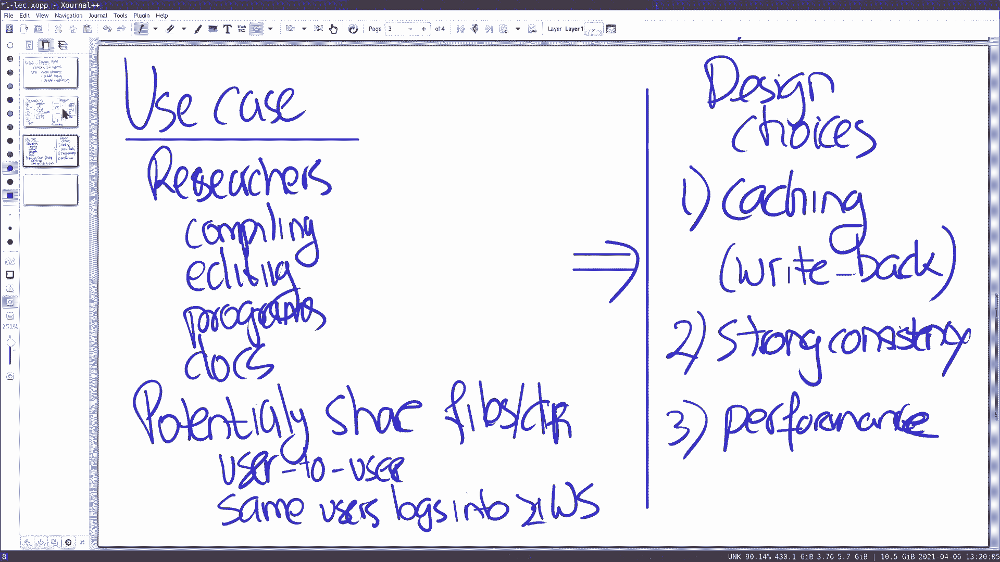

而不是让客户端和文件服务器，在不同的机器上。是的，比如，如果回到上一张幻灯片，在左边的网络文件系统，有很多客户端，我们假设只有一个，让我把这张图简化一下，忽略第二文件服务器，只有一个文件服务器。

这样每个人都可以共享这个文件服务器上的文件，然后这些客户端都将在该单一文件服务器上处理，所有的读或写操作都将被发送到文件服务器，文件服务器直接查找，它打开文件并做安全检查，诸如此类的事情。

所有的计算都是针对文件系统本身，这一切都发生在文件服务器身上，在传统的网络文件系统设计中，在 Frangipani 中，情况并非如此，在 Frangipani 中，所有文件系统操作都在工作站上执行。

我们有多个工作站，文件系统可以扩展的工作负载，或者它可以支持随着工作站数量的增加而扩展。我明白了，在传统的架构中，每个文件服务器都包含或存储，我们假设整个文件系统的一部分，所以，不是这种情况。

每个文件服务器都有整个系统的副本，它可能是拆分跨文件服务器的。是的，它可能是，例如， AFS 有不同的卷，文件服务器管理不同的卷，MIT 所有用户的数据分布在不同的卷上。

但是一个卷的所有数据都将是一个文件服务器，所以，那个文件卷命中太多，你会遇到性能瓶颈。好的，太棒了，谢谢。关于这个设置，有什么问题吗，在我们深入了解更多 Frangipani 之前？好的，很好。

所以他们所做的设计选择，带来了一些挑战，所以我想谈谈这些挑战。驱动几乎大量设计的主要因素是，假设你有一个工作站，工作站 1 ，那时候，人们有工作站，笔记本电脑还不存在，今天可能是各种各样的笔记本电脑。

但是有一个工作站，一些人读取文件，读取文件 f ，也许是成绩数据库，成绩文件，所以，这意味着那个文件缓存在工作站中。所以，运行 VI 的程序的客户端，可以更新和操作文件，然后晚些时候。

结果将写回 Petal ，或者如果你愿意，（写入）磁盘。所以，这个模型面临的挑战是三个[]，第一，其他人，工作站 2 ，可能在某一时刻，执行 cat f ，获取文件 f ，当然，情况应该是这样的。

至少在正常情况下，我们有一个传统的 Unix 文件系统，你会看到那个 f 的最后一次写入，所以，即使写入可能发生在不同的工作站上，当第二工作站读取该文件时，我们会看到数据显示出来。

这就是他们将会是什么样子，大致归结为缓存一致性，其他说法，连贯性的同义词是缓存一致性，就像我们在之前的论文中看到的更多的术语，但是在计算机体系结构的领域，连贯性这个术语来自于那个领域。

所以你可以把它们当成同义词。第二，第二个会发生的问题，我们需要处理的是，假设工作站 1 和工作站 2，都想要在共享目录中创建文件，所以工作站 1 在目录 d 中创建了一个文件 f 。

工作站 2 也在目录 d 中创建文件 g 。现在我们希望至少安排，工作站 1 进行变更，然后工作站 2 进行变更，这里的两个文件，一个文件不会覆盖其他的文件夹，或者覆盖文件夹导致其他文件消失。

所以这就是第二个主题，原子性，这些操作创建文件，必须是某种原子操作，这样它们不会交错，使我们得到错误的结果。然后是最后一个问题，我们需要处理的是，工作站 1 可能会崩溃，当执行一个复杂的文件系统操作时。

所以它必须有故事，文件系统是如何恢复的，所以，这是一个关于崩溃恢复的故事。比如，在第一个例子中，工作站在目录 d 中生成一个文件，这是一个复杂的操作，目录需要修改，inode 需要分配。

inode 需要初始化，然后 inode 编号需要写入目录，所以它涉及多种类型的文件系统操作，我们希望是这样的情况，如果文件系统在任何步骤之间崩溃，在这种复杂的文件系统操作中，最好是这样的情况。

文件系统恢复正常。我的意思是，文件系统正确恢复，至少它的内部数据结构是正确的，比如， inode 不会丢失，因为它不会显示在目录中，等等，或者，甚至整个内部结构都是一致的，所以这是崩溃恢复的主题。

所以 Petal 在 Frangipani 需要解决所有这些问题，我的计划是一个接一个地查看，讨论 Frangipani 如何解决这些问题。对于顶级挑战，有什么问题吗？好的，让我们继续。所以。

第一件事是缓存连贯性或缓存一致性。所以， Frangipani 使用的解决方案中的关键方面是，实际上是一个锁服务器，锁服务器有一个表，对于每个文件的 inode 编号，谁必须在这个时间点加锁。

谁是拥有者。所以我们可能有文件 f ，它表示工作站，锁服务器有一个记录，工作站 1 拥有那把锁，锁服务本身是一个分布式服务，你可以把它大致想象成 zookeeper ，它提供获取释放锁，它是容错的。

在 Frangipani 的情况，使用的是基于 Paxos 的实现，分布在多台机器上，高容错性等。所以，这是锁服务器，事实证明，工作站也应该为它们的锁维护一张表，这是工作站 1 ，这可能是。

假设工作站 1 缓存文件 f 和 g ，可能 h 缓存在工作站 1 ，h 可能缓存在工作站 2 ，然后工作站 1 有一张类似的表，列举了它所持有的每个锁，它是忙的还是闲的，可能 f 的锁状态是忙的。

这意味着文件服务器在操作那个文件，所以，它正在使用那个文件，第二种状态是，假设文件 g 也缓存在这里，g 可能在闲的状态，这意味着， g 在这一时刻没有被修改，在那个瞬时时间，没有被文件处理。

但这就是他们所说的粘锁。所以，如果文件服务器在某个时刻[]，它将再次使用文件 g ，它可以这样做，不必与 Petal 通信，或者重新加载缓存或任何类似的东西，因为它有一个粘锁。

它知道没有其他（工作站）获取，在这期间，没有其他工作站获取锁。所以，这是粘锁，事实证明，这是两种[]的锁，用于他们所说的，所说的缓存一致性协议。一套信息或一套规则被遵守，来获得缓存一致性，基本规则是。

指导原则是，为了缓存一个文件，你首先必须获取一把锁，你会看到这些规则是垫脚石，来获得缓存一致性或缓存连贯性。我要做一个小的简化，在论文中，他们描述的锁是排它的或读写锁。我会假设，在接下来的课程中。

[排它的]并不重要，但这是一种优化，多个工作站可以在只读模式下拥有文件缓存。好的，所以有了这个，让我简单地谈一下，我们来了解一下 Frangipani 使用的协议。同样的，缓存连贯性或缓存一致性。

即使分布式文件系统的目标，它应该像单个文件系统一样，你只有一台文件服务器，你希望有相同的结果，由分布式文件系统返回的（结果），你不能区分它是不是分布式的，所以这提醒我线性一致性，事实上。

我相信 Frangipani 的目标，它是可线性化的文件系统操作。好的，我们有锁服务器，我们工作站 1 ，以及工作站 2 。这里有四个重要的信息，也就是请求锁，授予锁，撤销锁，释放锁。

这就是往返传递的四条信息，在工作站和锁服务器，以及锁服务器和其他工作站之间。让我们来看看这个，假设锁服务器有，任何时候都没有人有锁，所以让我们画一些时间线，工作站 1 想要请求，希望读写文件 f 。

发送一个锁请求，到锁服务器，为了文件 f ，所以是工作站现在还不能做任何事情，锁服务器检查它的表，发现 f 没有人使用，将工作站 1 列为锁持有者，发回消息，授予 f 锁，所以，在这个时刻。

工作站 1 获得 f 锁，现在它可以读或写，现在它可以从 Petal 读取文件，其实也可以对它进行修改，现在这些修改保留在本地，什么都没有发生，是一个写会缓存，而不是直写缓存，所以，它只是留在客户端。

事实上，工作站甚至可以释放锁，在这里从忙变为闲，所以，它需要再次加锁，例如，写入之后再次写入，我们可以完全在本地操作，而不用与锁服务器交互。这是一个轻微的简化，稍后我们会看到，锁绑定一个租期。

所以客户端至少要定期更新租期，但它不必从 Petal 重新读取文件 f ，如果租期已到。好的，所以会发生的情况，例如，如果工作站 2 想要读取文件 f ，会发生什么情况，工作站 2 想要读取。

基本上它也会做同样的事情，它会发送获取或请求消息，向锁服务器的请求消息，表示我想要 f ，它的工作原理是，锁服务器查看这个表，看到 f 归工作站 1 所有，然后发送撤销消息到工作站 1 ，想要拿回锁。

所以这将是 revoke f ，在这一点上，Petal 实际上做得更多一点，Frangipani 做得更多一点，因为我们必须确保工作站 2 观察到写入，工作站 1 已完成的，所以这样做的方式是。

在这一时刻，工作站 1 将 f 写入 Petal ，我们很快会看到，将 f 写到 Petal 是一个稍微复杂的操作，比我所说的更复杂，但是考虑一下，在这个点上，工作站 1 刷新它的状态到 Petal 。

一旦这项工作完成，一旦 Petal 确认，它已经收到了所有的数据，并发回一条消息， release f ，一旦锁服务器得到 release f ，它可以更新它的表，并将锁分配给工作站 2 。

发送 grant f 给 2 。糟糕。在这一点上，工作站 2 获得锁，现在它可以读取 Petal 中 f 文件中的所有信息，在这一点上，可以保证我们将看到文件 f 的最新变化。

因为之前的拥有者肯定已经把状态刷新到 Petal ，在它释放锁，并将其返回给锁服务器之前，工作站 2 保证能观察到这些变化，所以这就是强一致性的来源，这些强一致性与锁管理密切相关。对于这个。

有什么问题吗？在聊天中有一个问题。好的，我们需要写，聊天中有一个问题，让我来谈谈第一个问题，我们需要写入 Petal ，当释放读和写锁时，为什么我们需要在释放读锁时写入 Petal ？让我们忽略读写。

读和写之间的区别，排它锁和读写锁，只关注排它锁，读取（锁）只是一个小的[应用]，它发生一个重要的优化，但它并没有明显地改变设计体系。还有其他问题吗？所以这种设计效率会很低，如果我们有两个不同的工作站。

它们都在修改同一个文件。是的。你是让缓存来回跳动。是的，如果你们是两个工作站或两个不同的工程师，那个服务器会[敲打]同一个文件，这个文件会来回跳动。所以并不是很合适，所以你可以看到。

比如他们设计的工作量的影响，他们真正的假设是，大多数工程师都在处理他们的私人文件，有时候，他们会共享文件，但他们可能并不是在处理同一个共享文件。我们在用 Git ，你可以想象，如果你共享你的代码库。

或者检出你自己的代码库副本，做了你自己的修改，到某个时候，你把它写回去。抱歉，只是为了确认你说的，你可以在缓存中仍有文件的情况下释放锁？你可以，好的，所以我小心一点，当我提到释放锁的时候。

不是释放锁服务器的，而是在本地将状态从忙改为闲，因为是粘锁，它还在工作站 1 ，锁服务器仍然认为工作站 1 拥有这个锁。这回答了你的问题吗？好的，好的，谢谢。那么，会发生什么，如果在它忙时。

 2 的请求到来？是的，好问题，你认为会发生什么？它只是拒绝它们吗？不，我认为它不会拒绝它，只是等待，等待直到工作站 1 完成，修改文件 f 或执行文件系统操作。

然后 Frangipani 代码将在本地释放锁，会看到有人在等它，因此将其更改为忙，开始将所有操作都刷新到 Petal ，然后释放锁。所以这很好地谈到了第二点，就是原子点，这或许会让事情变得更清楚。

让我来谈谈原子性，因为它也使用相同的锁，来实现原子文件系统操作，原子性，使用锁。所以，当你执行创建操作时，你执行创建文件系统操作或 create f ，不管是什么参数，当然，在内部。

尽管应用程序调用创建文件系统调用，在内部实际上具有多个文件系统修改，例如，目录需要被修改，让我以稍微不同的顺序来做，我们需要为 f 分配一个 inode ，我们需要初始化 inode 。

写入 inode ，然后更新目录，更新目录以添加条目 f ，为 f 分配的 inode ，这是 Unix 文件系统实现文件的典型方式，我们需要安排这些操作以原子方式进行。

因为我们不想让其他工作站看到中间结果，发生的方式是通过获取这些锁，获取这个特定 inode 的锁，比如 inode 10 ，所以，你为 f 获取一把锁，我使用 "f" 作为锁，但是。

它将是 inode 编号，然后在某个时刻，它释放[]的文件系统，它本身释放锁，同样地，这是一个本地释放操作，这并不意味着立即将其释放回锁服务器，只是将状态从忙更改为闲。所以，如果在任何特定的时间点。

就像我们刚才问的那样，有一个撤销锁的请求，revoke f，请求不会被[服务]，直到位于工作站 1 的本地 Frangipani 文件系统，调用了本地释放操作，然后当本地释放操作时。

它看到有一个 revoke 在等待，所以，在这一点上，它将刷新缓存状态到 Petal ，一旦它刷新缓存状态到 Petal ，它将授予撤销或接受撤销，并向锁服务器发回 release 。

然后锁就可以分配给工作站 2 了。这能理解吗？所以只是确认，在这里的创建操作中，我们必须修改 inode ，我们必须修改 f 的 inode ，以及包含 f 的目录的 inode 。

因为我们必须更新引用，这就意味着，从技术上讲，我们持有两把锁，我们必须释放这两把锁，在回复撤销请求之前。是的，当然，所以稍等一下查看论文，然后讨论他们怎么做，但从根本上说，他们有一些。

不是非常粗粒度的锁，而且还有非常细粒度的锁，[]锁，他们每个 inode 都有一个锁，目录的 inode ，文件的 inode ，事实上，目录与文件没有什么不同，只不过是具有特定格式，所以创建 f 。

我们必须分配，首先分配或获取目录 d 的锁，然后分配或获取 inode f 的锁，所以持有两把锁。你可能已经注意到的，当然，当你获取多个锁时，存在陷入死锁的风险，如果一个工作站以不同的顺序分配锁。

你可能会陷入死锁，所以， Frangipani 遵循规则，所有的锁都以特定的方式排序，以固定的顺序获取锁。我明白了，谢谢。我想锁是按 inode 编号排序的。这个能理解吗？是的。

所以那里有很多更复杂的东西。好的，所以，所以讨论了原子性文件系统操作，至少在崩溃时，如果没有崩溃，至少可以保证这些操作是原子发生的，因为锁确保了原子性，当然有可能是这样的，比如我们运气不好。

工作站 1 崩溃，正好在这些操作的中间，例如在分配 inode 时，它还没有更新目录。我们假设崩溃发生在这里，如果我们不做些特别的事，我们可能会有什么顾虑。好的，我们可能有的顾虑。

某些文件系统操作只是部分应用于 Petal ，这个变得更清楚了，如果我们考虑这个场景，在这个特殊的状态下发生了什么，当缓存状态已经刷新到 Petal 时。所以，这就是崩溃恢复的主题。事实证明。

更新 Petal 中的状态，也遵循非常仔细的协议，这个协议通常被称为预写式日志，这可能是我们已经看到的术语，你们可能已经在 6。033 中看到过，Petal 也使用它，它是一种非常常见的技术。

它也会发挥重要作用，在之后我们看到的论文里，所以 Petal 很好的引入，这种预写式日志的想法，一种思考的方式，Petal 是为预写式日志设计的，使用预写式日志与任何其他预写式日志方案非常相似。

所以思考它的方式如下，我们有虚拟磁盘，我们可以把磁盘想象成一个很长的块阵列，他们所做的是，将磁盘的一部分保留为日志，事实上，在 Petal 的情况中，每台服务器都有一个日志，但现在。

我们假设有一个单一的日志，然后是文件系统，所以有一部分磁盘是为日志保留的，一部分磁盘是文件系统，文件系统包含 inode ，还有一些数据块，等等。规则是，当你更新 Petal 中的状态时。

你要做的第一件事是第一次日志更新，所以，如果我们回到上一张图片。

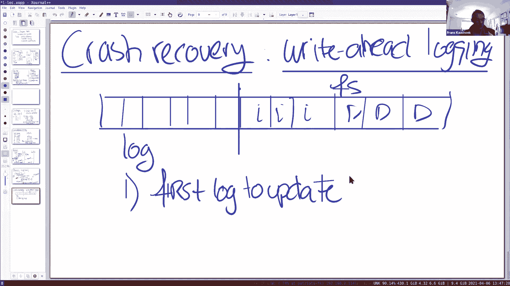

在那个点之后，在工作站 1 上的 Frangipani ，想把锁还给锁服务器，它首先要把它的状态写入 Petal ，这分为两步。

第一步记录更新，发送更新到日志，例如，在这里，我们获得一个记录，这表示创建操作，所以有分配 inode 编号，不管结果是什么，如果你分配 inode 编号并且目录发生变化，稍后我们会更具体一点。

但是更新包括修改，需要发生在文件系统块上的（修改），为了反映这一变化。所以首先记录更新，然后，一旦你更新了日志，然后，客户端的第二个执行的操作，工作站执行的是安装更新，做这两个步骤的原因是。

一旦你记录了所有的变化，那么更新数据块就完全安全了，因为它们总是会更新文件系统，它总是以一致的状态结束，而理解这一点的方法是，让我们假设客户端工作站，正在刷新它的数据到 Petal ，在这里崩溃。

这可以吗？是的，因为所有东西都已经存入日志，他们所说的 demon 恢复服务。是的， demon 会回到，这里会有一个 demon ，当发生崩溃时，这里有一个 demon 查看日志中是否有什么东西。

如果日志里有任何东西，就应用到文件系统。为什么要这样做，为什么不立即写入或更新文件系统？因为我们可能会在更新过程中崩溃，我们不知道我们完成了[]。是的，完全正确，在我们之前的例子中。

分配 inode 是在某个地方进行一些更改，比如在 inode 块上，添加目录到，或将文件 f 添加到特定目录，更新某处的目录块，数据块，所以这是两个独立的磁盘写入，它们不是原子的。

所以我们会在两者中的一个崩溃，我们可能已经分配了 inode ，但是不在目录中，那么，如果我们崩溃并恢复，会发生什么，基本上会失去 inode ，除非我们能扫描整个磁盘，但那是非常昂贵的。

所以他们说我们做的是，我们首先记录这两个更改，我们首先记录描述这两个更改的记录，然后应用更改。那么我们如何确保操作是原子的，所以第一个要更新的日志。第一次日志更新，是的，这很有趣。

论文[] 100% 对应这个，但有几种方法可以做到这一点，他们提到每个日志记录都有一个校验和，所以，他们使用校验和来查看是否，在读日志记录之前，我们计算一个校验和，为了确保整个记录是完整的。我明白了。

谢谢。另一种方法是，一种其他方式是，在你写入多个块时，比如 1 2 ，你知道几个街区就像一二，然后你写入一个提交记录，我们的假设是，写入单个块，单个 512 扇区是原子操作，所以要么发生，要么不发生。

所以你需要提交记录，完成写入或未完成写入，所以，你只需查看提交记录，如果提交记录不在那里，那么你就知道操作还没有完全记录下来，你不应该执行其中任何一项。我明白了，再仔细检查一下上一张幻灯片。

如果崩溃发生在我们把东西刷新到 Petal 之前。

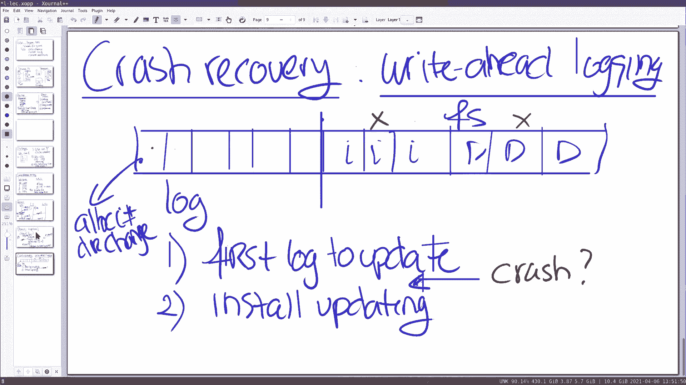

那么这不是问题，对吧，因为如果工作站崩溃，崩溃跟工作站一起，但其他任何工作站都没有不一致的状态。这是正确的，只是数据会丢失，如果没有写到 Petal 中，就不会有任何可见性问题。所以崩溃发生在这里。

在某些方面，这个并不重要，真正重要的是这个刷新操作中的崩溃。嗯，谢谢。

好的，所以，在 Frangipani 有一个技巧，我们稍后会更详细地讨论这一点，也就是，在 Frangipani 中，每个服务器都有一个锁，这有点不寻常，我们稍后会看到，这回造成什么问题。

所以我们将会看到，协议有一个小的扩展，让这个正常工作。好的，让我简单地说一下，日志记录中有什么，事实证明，这对崩溃恢复非常重要，特别是我们每台服务器都有多个 Frangipani 日志。

所以每个日志都有，所以有记录在日志中，它们有一个序列号，不论编号 2 ， 1 2 ，日志的结尾是，下一个序列号比你的高一。所以他们有另一种标记的方法，在这些记录中是更新数组，描述文件系统操作。

所以它包含需要更新的块号，例如，在我们的示例中，这是 inode 编号，包含信息节点的块，它会分配一个版本号，因为在这一记录中，我们随后会看到，为什么这很重要，基本上是该块编号的新字节。例如。

在创建文件的情况下， create f ，这个数组中会有两个条目，两个条目，一个描述对 inode 块的更新，一个描述对目录数据块的更新。所以，复制过程中会发生什么，只是想把这一点说得非常清楚。

当 revoke 的请求传入时，发生的第一件事是将日志放入 Petal ，一旦完成，发送更新块到 Petal ，然后释放锁。这可以确保，我们需要考虑几件事情，如果中间没有崩溃，那么这如前所述。

是有趣的例子，当崩溃发生在，正好在发送日志到 P ，但是在更新 Petal 之前。所以，让我们稍微谈谈这一点。抱歉，你说的新字节是什么意思？好的，让我回去，使用另一种方式，更改信息节点块。

以 inode 块为例，也许更新 inode 的某些部分，然后你可以写下字节发生了变化，比如字节 0 到 5 和 12 有下列值，或字节 10 到 20 具有以下新值。但这些变化会不会像。

因为这些块中的每一个最多为 512 字节，但你所做的修改可能比 512 字节大得多，每一个块都会有记录。所以，事实上，好的，所以有几点，首先，数据写入不会通过日志，所以有一点很重要。

所以谢谢你问这个问题，所以当你写一个文件时，应用调用 write f 和一些数据，所有这些数据都不会通过日志，它们会直接传递给 Petal ，比如一旦你刷新状态，通过日志的唯一更改是元更新更改。

所以元数据更改，元数据的含义是关于文件的信息，所以 inode 目录，这类东西，它们会通过日志。所以你在这里看到的描述是，文件系统元数据块的更新，inode 和目录数据。应用级别数据。

实际构成文件的文件块，这些数据块直接写入到 Petal ，不通过日志。所以，思考这一点的含义是很有趣的，那个设计选择，不把每件事都通过日志有什么坏处？Assel 。对数据的更新可能会丢失。

它们可能会丢失，是的，还有哪些其他场景是可能的，假设文件由 10 个数据块组成，我们开始写 10 个块，文件的最终状态是什么样的？变得不一致。是的，不一致，一些写入，没有写入，全部写入，谁知道是什么。

但它不能保证所有 10 个都会同时应用。所以这是很重要的，当你需要原子写入时。好的，如果你不需要原子性，我们能不能去掉那些日志？我想是的，先保留这个问题。

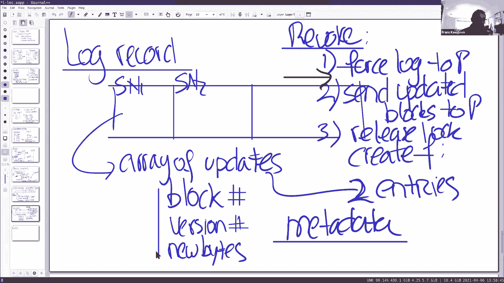

让我们首先来谈谈应用程序，然后我们再回到那个问题上。所以，好的，那个。

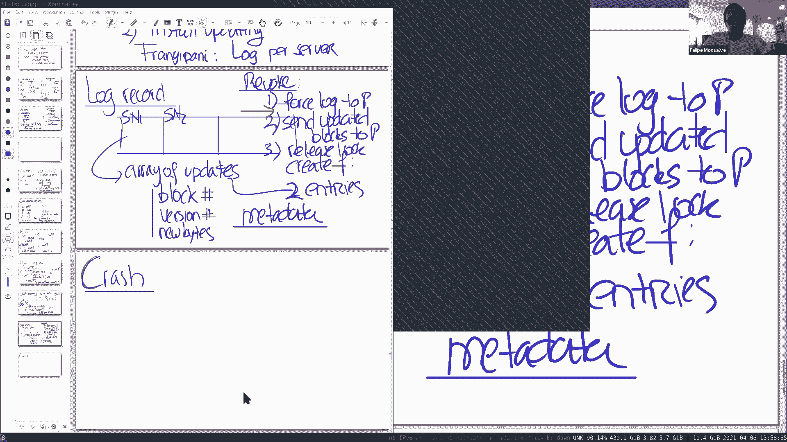

所以，应用程序不能真正将它们的数据原子地写入日志，因为数据没有写入日志，所以没有写入日志，然后应用，所以，这意味着，例如，如果应用程序希望原子性地写入某个文件，那你就得自己安排，事实证明。

大多数 Unix 文件都是这种情况，所以从 Frangipani 的角度来看，这并不能真正改变游戏规则，你在 Unix 文件系统中写了一个文件，你写入一个 VM 镜像，这不能保证整个镜像一致性地写入。

在一次访问文件系统中，甚至在崩溃时。所以人们在应用程序中解决这个问题的典型方式是，它首先写入一个临时文件，将所有内容写入临时文件，然后做一个原子重命名，变成最终文件名称。所以。

 Frangipani 完全依赖于相同的设置，一种通常的 Unix 所做的，Frangipani 不会修改规则，这就是为什么文件写入不会通过日志记录。不通过日志有什么好处，所以很明显这是不利的一面。

因为你不能使用日志原子地写入，你必须有自己的原子性方案，但它的优势是什么？好的，性能，因为元数据比实际数据要小得多。是的。同样还有内存。是的，就是这样，所以，如果你写一个巨大的文件，比如千兆字节文件。

这意味着你必须写入 2 千兆字节，首先，将千兆字节写入日志，然后将千兆字节写入磁盘，这会极大地降低性能，这就是为什么通常不会将用户数据写入日志。是的，这是回到前面这个问题的非常重要的部分。

内部文件系统结构保持一致是非常重要的，不是不一致的，所以，元数据更新都会通过日志，所以，当你创建文件时，你需要更新 inode 块，并且你需要更新目录块，保证会一起发生。所以。

数据块是否会介于步骤 2 和步骤 3 之间？是的，我想他们只是发送出去，可能在 1 之后，它们可能并行发送数据块，作为第 2 步的一部分，并直接发送到 Petal ，到文件系统[区域]。好的？

所以我有个问题，我不记得日志有多大了，但我相信它可以跨越两个块。日志可以是多条记录，是的。是的，没错，最高可达 TB ，那么，如果我们发送，比如发送部分日志，然后它崩溃，当你发送日志时，我们得到问题。

这正是我想说的，谢谢。所以可能会发生多种崩溃，如果我们崩溃了，考虑多种情况，比如崩溃发生在写入日志之前。那么，在这种情况下，结果会是什么？嗯，丢失了。是的，丢失了。然后我们来看这个场景。

比如崩溃发生在写入日志之后，然后会发生什么？这是一个稍微复杂的场景。这是在写入日志到 Petal 之后吗？然后 demon 会出来。是的，然后是 demon 步骤，这是一个有点复杂的故事。

因为这些是如何恢复的，发生了什么。所以，假设其他人希望获得这个文件上的锁，崩溃的工作站所持有的，在这里租期很重要，所以每把锁都有租期，锁服务器将执行的操作，它不会授权，锁服务器访问工作站 1 。

请把锁 f 还给我，工作站 1 没有反应，因为它崩溃了，锁服务器所做的，它会等到锁的租期过期。为什么要等到锁租约到期？我想在这种情况下，服务器，是的，崩溃的服务器也知道，它不能续签租约。

这样它就可以自己清理。是的，清理自己的东西，这里的根本问题是什么，我们试着挑战的，就像之前的场景，我们在之前的课程中反复看到的，这里挑战总是存在的。分区。分区，没错，可能是这种情况。

实际上工作站 1 并没有崩溃，但锁服务器无法与工作站通信，由于网络分区，但是工作站可以与 Petal 通信，所以它可能仍然在做出改变，但正如你刚才所说，无论我们保证什么，一旦租约到期。

工作站 1 肯定不会做任何更改。好的，这是不允许的，根据协议，不允许再做任何更改。所以，这就是为什么锁服务器要等到租约到期，然后在这一点上，知道没有人再持有锁，或者不持有锁。

如果没有人写入 Petal ，所以，在这一点上，它将要求剩余的工作站，他们所说的恢复 demon ，恢复 demon 将应用，将读取工作站 1 的日志，并应用那个日志中的操作。好的？

考虑 demon 的方式，这是术语，它通常只是一项服务或服务器或服务器进程，做的是打扫房子或打扫房子的任务，不是真正持续使用的服务，它们通常被称为 demon ，所以一旦 demon 完成了。

然后锁可以，锁服务器可以重新分配锁，或将锁授权给另一个工作站。为了再确认一下，如果你在写入日志后崩溃，你会得到一个一致的状态，当涉及元数据时，但不能保证用户已经完成了用户数据的写入。是的。

不能保证用户数据。所以唯一保证的是，真正的日志系统帮助实现的是，内部文件系统数据结构一致。好的，听起来不错。这是重要的，因为这将是相当糟糕的，如果内部文件系统数据结构混乱，每个人都可能会丢失他们的数据。

好的，还有另一个[]案例，会发生什么，好的，把日志写到 P ，如果我们在写入日志的过程中崩溃，会发生什么？这是不是你之前提到的它们的校验和，我们可以检查它是不是完整的。是的，说得好。

所以在这种情况下会发生什么，前缀可能会，前缀可能会在日志中，但是每个前缀可能包含多个日志记录。

包含多个操作，无论是序号 1 ，序号 2 ，多个记录，如果我们在其中一个记录更新期间崩溃，然后校验和就不会通过，所以恢复 demon 会停止在那个记录。那么日志中会有什么，将是操作的正确前缀，例如。

创建文件 f 在这里，也许创建文件 g 在那里，但是创建文件 h 不在那里，但是每个单独记录描述一个原子文件系统操作，就在那里，而且是完整的。所以接下来会发生的是，我们应用在工作站上执行的操作前缀。

我们丢掉前缀的结尾，或更新的结尾。

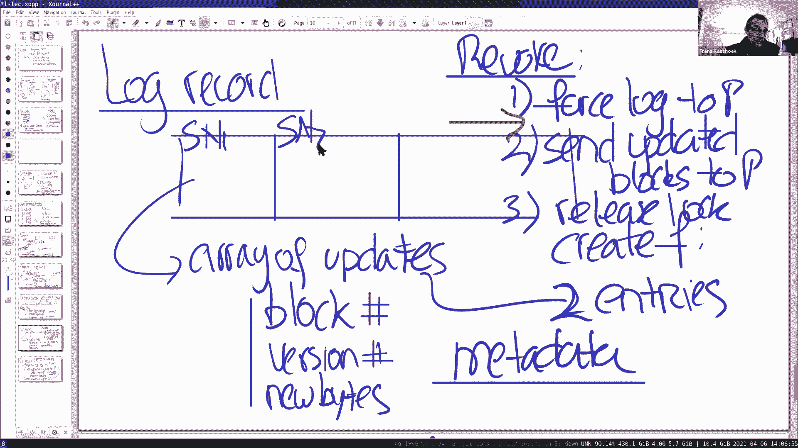

不是我们期望的，但完全没问题，因为，在另一个案例中，我们可能失去所有的更新，但在第一种情况下，我们在日志之前崩溃，我们将一无所有。这能理解吗？好的，一个棘手的情况，我们需要考虑，这与一个事实有关。

Petal 在每个服务器上都有一个锁，或者在每个服务器上有一个日志。所以我稍微讨论一下，这些与你在阅读中看到的问题有关。这是关于许多日志，假设我们有工作站，每个都有自己的日志，这是工作站 1 。

工作站 2 ，工作站 3 。工作站 1 在某一时刻删除文件 f ，它是之前存在的，然后工作站 2 创建 d/f ，但是这个 create 写入自己的日志，所以这个 delete 写入工作站 1 的日志。

这个 create 写入工作站 2 的日志。现在，假设工作站 1 崩溃了，然后工作站 3 恢复 demon 运行，对于工作站 1 ，可能出现坏的结果，这将重放 delete ，这将覆盖更改。

工作站 2 对 Petal 所做的。所以这就是背景，问题是这是如何解决的，我认为我想解决的问题的方法是，让你们在分组会议室待上几分钟，互相讨论这个或任何 Petal 的方面，如果你想的话。所以。

 Lily 或任何其他助教，所以把大家送到分组会议室。我来做吧，还是。好的，很好。好的，酷。我会关闭大约五分钟。是的，五分钟。好的。

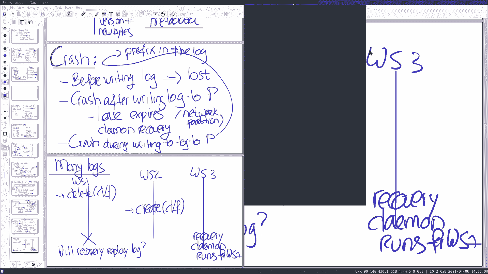

大家都回来了吗？好的，所以，简单地总结一下，我们有 3 台工作站，工作站 1 在某个时刻删除了日志中的文件，工作站 2 在稍后创建文件 f ，在他的日志里，然后 1 崩溃。

工作站 3 运行 demon 对工作站 1 的日志，当然，这将是一场灾难，如果 delete 被重放，因为后来的创建是在另一个工作站上进行的，它在另一个日志中，所以 demon 不知道这个。

这个问题怎么解决，或者这场潜在的灾难怎么避免？我们讨论的是版本号。是的。是的，如果你想的话，可以多说一点。当然，这保证了，因为我们有锁，服务器 1 的操作已完成，日志的版本号写在 Petal 中。

比如最后的操作，所以，恢复 demon 不会对当前版本号之前的执行任何操作。是的，这是绝对正确的，所以总结一下，所以我们有两个日志，这很重要，我们有一些文件系统状态，它们在 Petal 中。

所以这些是日志，然后这是实际的文件系统，然后这是目录 d ，目录 d 被修改，文件 f 被删除，有一个日志编号 i ，比如 10 ，这是工作站 2 ，这是 d 。

这些删除 d 中的 f 或创建 d 中的 f ，在这个条目中日志编号是什么，抱歉，版本号，11 ？11 是的，基本上是完全有序的，锁协议确保了他们完全有序。在包含元数据块的文件系统中，例如。

如果 f 的 inode 块，inode f 的版本号将在磁盘中或 Petal ？11 ？是的，在这种情况下，应用到文件系统的操作是 11 。所以 demon 什么时候，demon 遵守的规则是什么？

永远不要替换已经应用的东西。是的，什么决定它是不是应用了？版本号。是的，版本号，所以如果版本号，只重放条目，如果日志记录中的版本号，日志版本号高于 inode 或元数据版本号，然后进行重放，好的？

所以在这种情况下，恢复 demon 在日志记录中看到版本号为 10 ，小于 11 或等于 11 ，都无关紧要，所以它不会重放，所以，这个问题不会出现。所以 10 是不是必须的。

是否 10 不在工作站 2 的日志中也是可以的？是的，它不在那里。所以，就像在，因为工作站 2 在工作站 1 之后写入 inode ，所以它的版本号为 11 ，你要做的就是准备和更新。

更新记录中的版本号，始终是一加上 inode 中的当前版本号。好的？这是一个小问题，d 代表什么？它是目录，在目录 d 中创建一个文件，从目录 d 中删除一个文件，更新必须包括一些有关目录的信息。好的。

抱歉，我有个小问题，所以版本号总是绑定到正在编辑的 inode 上吗？是的。好的。当然，每次更新的版本号，比如，目录有一个版本号，文件有一个版本号，这里显示的有点问题。

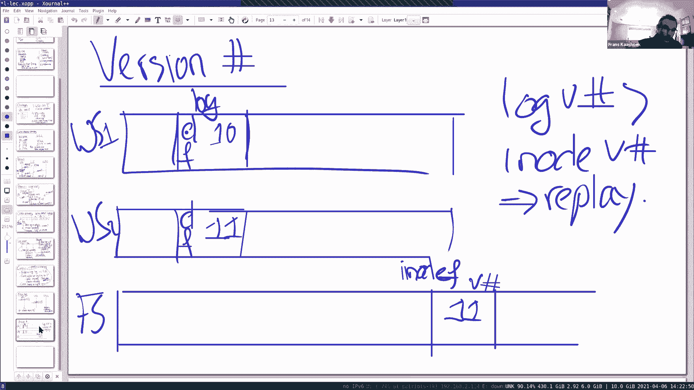

如果你回到日志记录中，在这里，有一个更新的列表，列表中的每个更新，在新字节中完成版本号。谢谢。

好的，退一步，结束这篇论文的讨论。这可能是我们读到的第一篇论文，系统本身并不是，它不是主要的用途，因此谈论这件事[]很有趣，但这个系统的有趣之处在于它里面的想法，所以缓存连贯性协议或缓存一致性协议。

分布式锁，锁服务器，租期，授予，请求，撤销，以及分布式恢复，当一个工作站崩溃时，另一个工作站上的 demon 进行恢复，特别有趣的是，有趣的是这三个部分之间的交互，它们交互。

我们将在接下来的几篇论文中看到，下周，不是，在周四，但在那之后的论文，我们将谈论，一些繁重的、相当复杂的事务系统，我们也会看到这三个主题，所以，希望这能帮助你阅读这些论文，了解什么是缓存一致性。

什么是崩溃恢复，以及分布式锁。另一点可能很有趣的是，Petal 很好，对他们设计它的特定背景很有用，论文的性能部分，但很难理解，因为这是从 1999 年开始的，但我看了一下图表，你将看到文件系统。

工作负载可以随着工作站数量的增加而增加，这正是我们努力的目标，他们实现了这一目标，无论如何，我希望你对这个设计感兴趣，不像你通常的设计，所以我希望会发人深省。说到这里，我会停下来，当然。

如果你想问更多的问题，就留下来，否则我们周四再见。我能问你两个问题吗，所以，我的第一个问题是，一般而言，这里的缓存一致性协议，它不是在两个地方有一个文件缓存，对吧？是的。好的，我的另一个问题是关于。

有一页有日志，在那里你有日志记录。

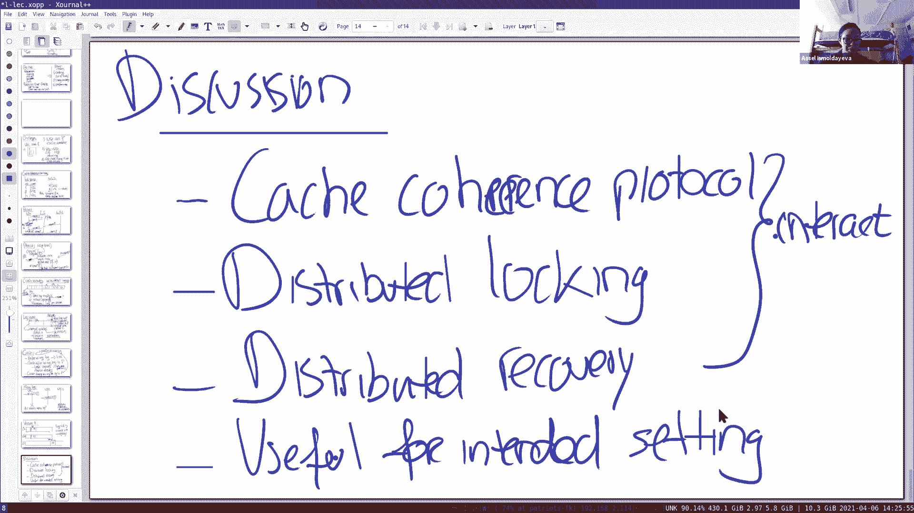

是的，让我回到这里。是的，我很好奇，你说每一个记录都是原子的，但每条记录也有一些更新，对吧？是的，再一次，我认为论文有点含糊，它到底是做什么的，它要么始终适合 512 个字节。

然后单个扇区 512 字节是原子的，或者他们使用这种校验和技巧，所以，你读到[]扇区，重新计算校验并将其与存储的校验和进行比较，如果没错，那它一定是一个完整的记录。好的，如果它少于，如果不是。

那你就玩这个技巧，好的，我明白了。是的，我不确定他们到底是做什么的。好的，非常感谢。不用谢。还有什么问题吗？如果你向后或向前看三张幻灯片？好的，这个？

它是。哦，也许倒退一张幻灯片，有一节你谈到了。

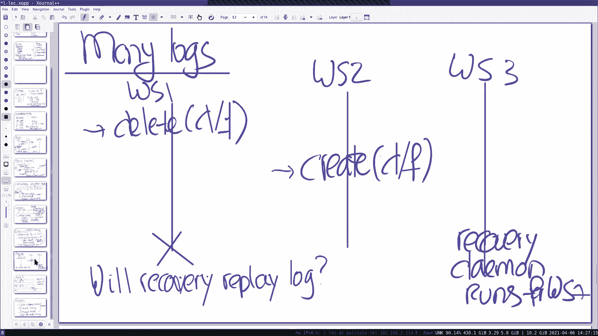

如果在写入过程中发生崩溃，我们得到日志中的前缀，就像好的或什么东西，你能重复一遍你的意思吗？

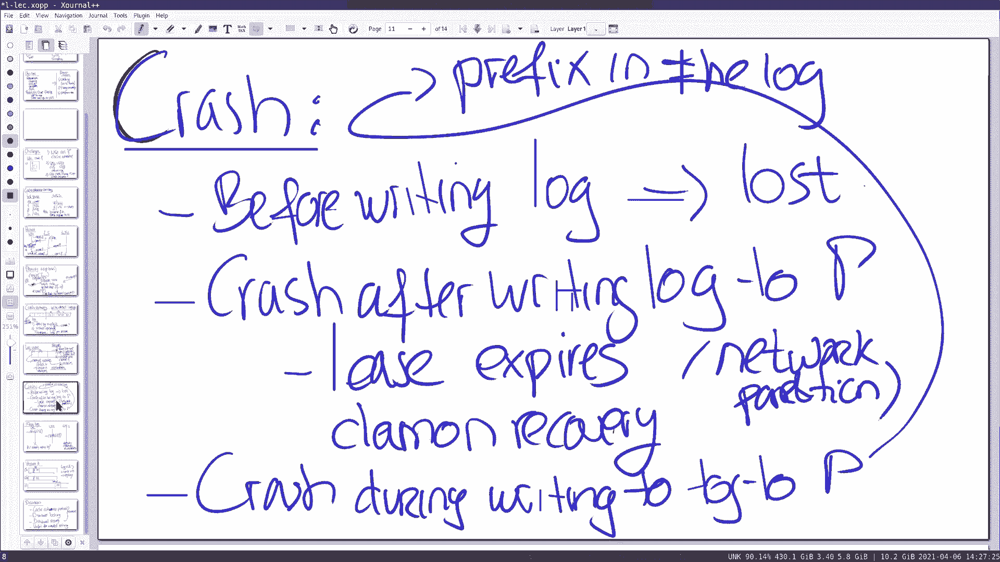

是的，好的，让我们回到最后一张图片。

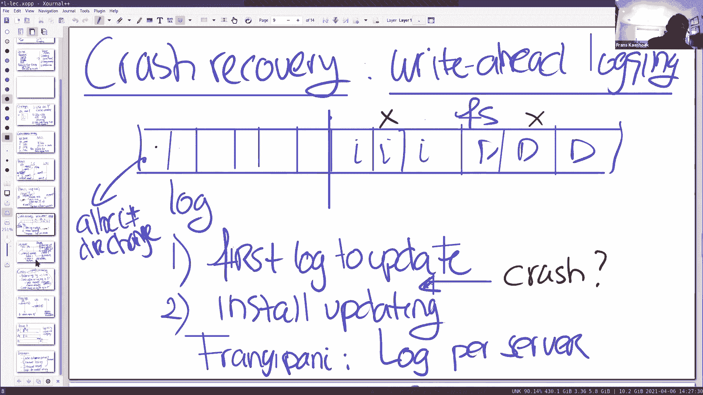

我刚才在这里展示了，所以这里有我们的，所以工作站 1 可以执行很多很多文件系统操作，它们中的每一个由这些日志中的一个描述，由日志中的一个条目，所以，第一个条目可能是创建文件 f 。

日志中的第二个条目可以是创建文件 g ，第三个可能是创建，删除文件 f 。所以有一个完整的操作序列，因为记住工作站只是继续执行文件系统操作，在它持有锁的时候，而且没有其他人想要这把锁，所以。

锁可以是包含很多文件系统操作，现在，对于每个文件系统操作，对于每个单独的操作，有一个日志记录，而日志记录是原子文件系统操作，描述更改，需要执行到真正的文件系统块，以反映那个文件系统操作。那么会发生什么。

撤销消息进入，工作站 1 开始写入它的日志到 Petal ，但这并不能一直持续到最后，它只是碰巧崩溃了，在中间的某个地方，任何地方，在这种情况下，工作站日志的前缀在磁盘上或在 Petal 中，这意味着。

最后的几个文件系统操作只是日志，并且只有前缀将被重放。我明白了，并且我们只是说好的。是的，我们接受这个结果。知道了，谢谢。因为我们早些时候已经接受了这一结果，因为在这种情况下是可以的。

我们得到文件系统崩溃，在收到撤销消息之前或之后，但它没有向 Petal 写入任何日志条目。还有什么问题吗？我有一个与 6。824 完全无关的问题，但我想知道你是否知道下学期的 6。858 。

我看到 Zeldovich 教授要教 6。S060 。是的，我想我们，目前的计划不会在秋季提供 6。858 ，但我们希望能在春季推出。好的，太棒了，你知道 6。S060 是什么吗，我找不到太多信息。

是的，这是个好问题，这是一门本科生课程。好的。好的，很好。所以，像 6。858 ，但是本科生的。是的，也许是 6。857 和 6。858 的入门。好的，编号是什么？这是一个试验性的编号。

这是一个试验性的，因为这个课还不存在，并将提供，目标是在秋季首次提供它。好的，那么，是不是主要是因为，6。858 是不是会保持它原来的样子，或者。你在问我问题，我没有。抱歉。是的。

我认为参与设计这门课的人，或者参与 6。857 的人，以及参与 6。858 的人。是的。我并没有参与其中。好的。还有一个原因，他们正在努力制定课程，当然，会对 6。858 6。857 进行一些[]。

好的，听起来不错。但是 6。858 6。857 不会离开，这就是。好的，谢谢。不用谢。我有个问题，我不知道它是否简单，但在论文中的页末，在第七节之前，他们谈到了一个失败案例，就是租约到期了。

而且服务器并没有真的崩溃。是的。然后谈论，基本上没有真正的解决方案。嗯，有一个解决方案，有一个真正的解决方案。比如，人类的干预。是的，好的，所以我认为这里的问题，在论文主题中。

Petal 和 Frangipani 是独立设计的，它有很多很好的特性，这将有一个地方，这将是非常有帮助的，Petal 有一些支持来帮助 Frangipani 。

这个支持会在写入 Petal 上有一个时间戳，Petal 可以看出写入是否太旧。好的。所以除非你这么做，你需要[摆弄]边际。好的。如果会发生什么，那个错误发生，比如在边界之外。它会很酷。

你得到的是较旧的写入，出现在，其他人可能在那个时刻获得那个文件上的锁，开始写入它，然后又出现了旧的写入，基本上改写其中的某一部分。好的。所以，这将打破一致性。了解了，谢谢。不用谢。

