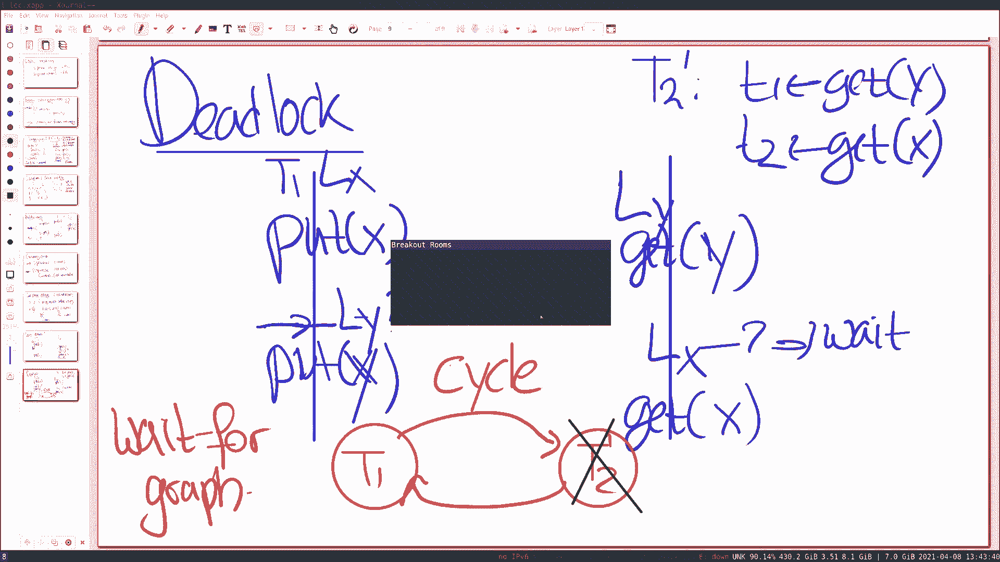
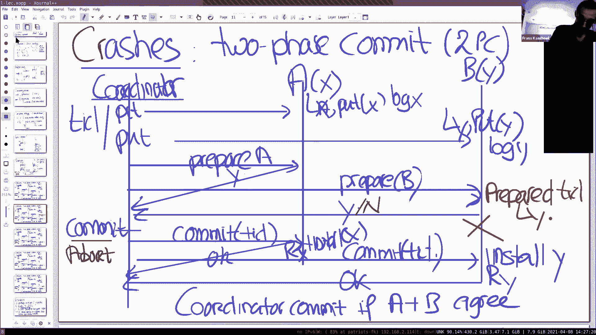

# MIT 6.824 2021 分布式系统 [中英文字幕] - P13：Lecture 13 - Distributed Transactions - mayf09 - BV16f4y1z7kn

好的，谢谢。好的，下午好，傍晚好，早上好，晚上好，无论你在哪里，今天我们要谈的是事务。你们可能注意到了，今天的阅读材料本质上更多是教程，我们不是在研究一个特定的系统。

看看一系列的想法是如何在这个系统中实现的，相反，我们要做的只是谈论事务的概念，因为它会出现在接下来的两个论文中，我们将研究这两篇论文，其中有相当多的材料，假设对事务很熟悉。

特别是你们熟悉我们今天课程中的两个核心思想，也就是两阶段锁和两阶段提交，有时，它们被缩写， 2PC 表示两阶段提交，2PL 表示两阶段锁，有一点令人困惑，这两个术语不需要做太多事情，不需要。

没有什么关系，他们碰巧有两个词 2-phase ，但是，它们表现完全不同的问题，它们还出现在事务的背景下，但是即使在事务之外，它们也是好想法或有价值的想法。

所以不要让你自己被他们都有 2-phase 所迷惑，它们没什么关系。好的，所以我要稍微深入一点，开始谈论一般的事务，我们非常关注事务的原因是，我们希望能够进行跨机器操作。所以我们尝试解决的问题。

在这个课程以及即将看到的两篇论文中，是跨机器的原子操作。举个例子，让它变得更具体，假设我们有一个客户端，我们有两个，我们有一个分片的键值服务器，所以一些键在键值服务器 1 上，一些在键值服务器 2 上。

所以键分布在它们上面，例如， kv1 有 x ， kv2 有 y ，我们想要跨这两个键进行原子操作，在事务的背景下，简单的方法或经典的例子，总是进行转账。假设客户端想要进行从 x 到 y 的转账。

这是我们的客户端，它会对 x 做一次 put ，从帐户中增加或减少，所以我们做 x，-1 ，然后客户端要做 put(y，+1) ，从账户 x 向账户 y 转账一美元。我们的目标是。

我们希望在故障和并发方面保持原子性。所以，即使第一个 kv ，第一个键值服务器在 put 之后失败，那么我们想要安排，转账根本不会发生，所以，我们要寻找的语义是，这两种操作都会发生或者都不会发生。所以。

从并发性的角度来看，如果另一个客户端正在运行，并且尝试检查这些帐户，现在我们想要的是，这两个 put 原子地显示，所以其他事务不能观察到中间结果，中间结果，比如，钱从 x 中减去，没有加到 y 上。

所以，这些就是我们想要做的事情，这在分布式系统中非常常见，比如你希望跨分片执行操作。所以，这就是我们想要做的事情的背景，这样做的总体方案来自数据库社区，这个总体方案就是事务。

我们想要做的是对这些操作进行分组，例如，在转账的情况中，两个 put 操作作为一个事务。然后，这个事务原子地执行，这通常需要一些编程注解，所以 begin_x 表示客户端想要启动事务。

然后可能是 add 操作， add(x，-1) ，然后 add(y，+1) ，然后，你必须指明事务何时完成，通常我们使用 commit 。所以，我们寻找的语义是，这些操作原子地执行，对于并发和故障。

为了让它更激动人心，让我们来看看第二个事务，我们可以看一些案例研究，关于事务如何[互动]，我们可能有第二个事务 begin_x ，它读取这些账户，所以 t1 得到 x ，然后 t2 得到 y 。

并打印 t1 和 t2 ，然后结束或 commit 。所以，我们有第二个事务，它读取帐户 x 和 y ，并打印值。我们有两个事务的一个原因是，我们可以从并发性的角度来看，这些事务是如何排序的。

什么是合法结果，什么是非法结果。事务就像是一个魔法，程序员可以注解这些 begin 和 end 操作，它使一组操作一起，使它们原子化，使用这个系统会处理好一切，它会负责锁，会负责恢复。

程序员不必担心这个问题，事务是一个非常强大的结构，它们在非分布式系统中很有用，你有一台单数据库机器或多核数据库机器，客户端向它提交事务，然后事务系统执行这些事务，尽可能并发地（执行）。

但即使机器出现故障，它也会恢复正常，你可以期待结果就在那里。当然，我们的重点是分布式事务，在我之前的幻灯片里，也就是一个跨分片的例子，这在数据中心很常见。事务通常的 API 还有一个操作。

我没有列在这里，也就是 abort ，这里显示的两个事务都是 commit ，但是你可以直接终止事务，比如你可能会发现，例如，事务 T1 可以检查，x 帐户中是否有足够的钱，如果账户中没有足够的钱。

不是调用 commit ，而是调用 abort ，这个时候，事务将被取消，即使事务在一半时中止，也许已经做了一些 put 操作，语义仍然应该是，这些 put 操作都没有发生。所以。

在所有 abort 或 commit 的情况下，要么全部发生，要么一个都不发生，永远不会有部分结果，事务系统本身也可以调用 abort ，例如，我们稍后将看到，如果两个事务之间存在死锁。

则事务系统可以中止其中一个事务，在，让其他事务继续，并且稍后重试已经中止的事务。好的，这是原语，begin_x commit 和 abort ，三个关键接口操作。然后事务的语义，通常由单个词语来概括。

即 ACID ，这代表了事务的四个关键属性。第一，它是原子的，这里的原子表示的情况，我们有两个事务运行，一个事务执行多个 put 操作或多个 add 操作，所有这些结果都是。

全部对另一事务可见或者全部不可见，所以这是一个方面，抱歉，我说的这个不对，原子性意思是崩溃恢复的情况，如果一个事务有多个 put 操作，事务在中途崩溃，规则是所有的写入都是可见的。

所有写入都进入存储或都没有，原子性与崩溃恢复有关。C 代表一致性，这是我们不太会谈论的事情，它更多地与数据库相关，通常情况下，数据库具有内部变量，比如参照完整性就是其中之一，而事务应该保持这种一致性。

所以没有内部一致性，对于我们今天来说，这不是一个话题。第三个是隔离性， I 代表隔离性，隔离性是，我之前说错的，隔离性指的是这种情况，我们运行两个事务，它们不会看到，它们不应该观察到彼此的中间结果。

所以应用所有写入，其他事务看到全部或没有。最后， D 代表耐久性，意味着如果事务提交，结果写入稳定存储，如果系统崩溃，稍后又恢复，最新写入或最新事务，最新提交的事务会记录在稳定存储上。关于事务的简介。

有什么问题吗？好的，我主要会讲两个话题，也就是事务的 A 部分和 I 部分，我们将从 I 部分开始，稍微讨论一下隔离性是什么。所以我们要找的是一个定义，正确执行多个事务或并发事务。

在数据库文献中的典型定义或标准中，称为可串行化，这意味着，如果你有两个或多个事务，它们同时执行，那么结果肯定是某种串行的顺序，所以 t1 在 t2 之前执行，或者 t2 在 t1 之前执行。

有某种串行的顺序，串行顺序必须产生与并发执行相同的结果，所以你同时运行两个事务，它们产生一些结果，这个结果是有效的、合法的或正确的，这可能是串行执行的结果。所以，为了更具体一些。

假设在帐户中 x 从 10 开始，y 从 10 开始，我们运行这两个事务，我们之前在白板上看到的，这两个事务的内容，一个是在两个帐户之间移动一，另一个是打印两个的结果。所以你稍微想一下。

如果 t1 先执行，那么结果将是 9，10 ，而打印语句将是，是的，打印语句，实际上这里是 9，10 ，抱歉， 9，11 ，这就是我困惑的原因，打印语句也会说，x 是减去的那个，所以是 9，11 。

所以我们得到字符串 9，11 ，两个账户中的值是 9，11 ，如果 t2 先执行，那么结果是 10，10 ，因为钱还没有动过，然后 t1 开始，所以这是一种可能的结果。所以这是两个事务的两种合法的输出。

我们，如果我们同时执行这两个事务，系统保证可串行化。现在你注意到，可串行化有很多特点，就像我们之前使用的术语线性一致性，可串行化和可线性化之间的关键区别在于，在线性一致性中，有一个实时的组件。

如果 t2 在 t1 结束后开始，那么 t2 必须在整体顺序中出现在后面，在串行化顺序中，在可串行化中，那是不需要的，所以，如果事务开始，在时间上晚于另一个事务停止或结束，系统仍然允许对它重新排序。

所以可串行化在某些方面比可线性化要弱一些。尽管如此，可序列化是一个非常方便的编程[思想]，因为从编程的角度来看，你总是可以考虑事务以某种顺序执行，你不必考虑所有的交错。好的。

所以即使可串行化略弱于可线性化，它实际上禁止了很多有问题的情况。所以让我简单地谈一谈，弄清楚可串行化的含义，什么类型的执行，事务系统必须禁止？然后，所以，有两种情况，这里我们有第一个事务。

我们有第二个事务，所以 t1 运行， t2 ，我们可能会有一个结果，一个可能发生的执行是，如果我们不做一些特别的事情，t1 get(x) ，这里转账发生，所以更新 x，y 发生。

然后 t2 执行 get(y) ，这是不是非法的，是不是可串行化的执行？这是我们要问的问题，这个问题的答案是什么？这不是可串行化的。是的，因为你知道结果，如果我们写下结果是什么，那么结果是，这里是 9。

11 ，这里是 10，11 。我想是的。如果我们回到之前的幻灯片，这不是两个合法结果之一，所以这不是好的。所以，当我们考虑事务系统的含义时，它必须是这样的，它禁止这种执行安排，这是一个简单的版本。

这两个例子的事务并不复杂，所以不会有太多交错，你认为可能会出问题。但至少还有另外一个，可能会导致不正确的结果，那就是我们先执行 put(x) ，所以我们开始，然后我们打印两个，执行两个 get 。

 get(x) get(y) ，然后我们执行 put(y) ，这是可串行化的执行吗，这是我们应该被可串行化事务系统禁止的执行吗，还是可行的执行？这应该被禁止。它应该被禁止，因为作为结果。

不会发生这种情况，如果我们先执行 t1 ，然后执行 t2 ，或者先执行 t2 ，然后执行 t1 。好的，我们清楚地看到，可串行化排除了（某些）执行，为了让程序员更容易地，考虑数据库所做的。

有两种大的方法来禁止执行，而且在这些方法中，禁止的方法称为并发控制。在第一种方法中，第一类解决方案是，所谓的悲观解决方案，悲观的解决方案是引入锁，所以这个想法是，当事务运行或开始时。

它需要必要的锁来维护可串行化，只有确保以下情况才释放锁，当执行会导致串行化执行时，这是一种方法，我们稍后会更详细地讨论。第二种方法是是乐观的，在乐观的方法中，没有锁，乐观的方法。

你只是假设一切都会好起来，当你到达提交点时，[]系统问你自己这个问题，我之前做过的所有操作，这是可线性化执行的结果吗，或者这是可串行化执行的结果吗，如果是这样的话，一切都很好，没有问题，然后我们是好的。

如果结果不对应于单次执行，它们会被终止，它可能会重试。我们将看到，我现在不会太多地谈论乐观的并发控制，但下周或两周后，在读完 FaRM 论文后，你将看到一个乐观的分布式事务系统，我们正在考虑的类型。

它使用乐观并发控制方法，但是今天的重点是悲观的（方式）。一种[翻转方式]，这两种方法在文献中经常被描述为，悲观的（方法）是，你先获得许可，然后执行操作，而乐观的方式则相反，你只管去执行你的操作。

如果结果是错的，你随后道歉就可以了。所以，如果你愿意的话，这是一种类比，在这两种不同的方法之间。在每种方法中，无论是悲观的还是乐观的，有许多不同的并发控制方案，要么增加它们的并发性。

或者提供更弱的一致性和更多的并发性，所以这是一个[很大的资料]。我想谈谈一种特殊的方法，它非常受欢迎，尤其是如果你想实现可串行化，事实证明不是，尽管我说过可串行化是数据库的黄金标准。

数据库提供了多种程度的隔离，所以作为一个程序员，你可以选择你喜欢的隔离度，你可能想要选择一个较弱的隔离度，这样你可以获得更多的并发性。现在我们将坚持并发的黄金标准，也就是可串行化，如果你要实现可串行化。

一种常见的方法是两阶段锁，在两阶段锁中，每个记录都有锁，这是数据库记录的起点，在我们的例子中，这是对变量的锁，x 的锁和 y 的锁。有两条规则，第一，事务在使用之前需要一个锁，所以这个想法是。

在你可以读写 x y 之前，你必须先拿到锁，事务系统会帮你做到这个，第二， T 持有一把锁，一旦你获取，你不允许释放它，直到提交或中止，无论事务的结果是什么。好的，在我们这个案例中。

如果我们有 T1 运行， T2 运行，T1 首先对 x 加锁，然后对 y 加锁，它必须维持这些锁，直到它达到提交点，T2 在同一时间或大致相同时间运行，如果 T2 开始得晚一点，它试图获得 x 的锁。

T1 拥有它，如果 T2 开始的时间稍晚一些，在这一点上， T2 必须等待，一种标准的锁定协议。两阶段锁的基本思想是，它是对这个简单锁方案的改进，在文档中描述，有时被称为简单锁或严格锁，在事务开始时。

你获取整个事务所需的所有锁，你持有它们直到最后，然后释放它们，而两阶段锁要更细粒度一点，其中，即使事务[]，它们不需要直接获取锁，在开始的时候同时获取所有（锁），相反，它们在事务运行时以增量方式获取锁。

允许某些严格锁不允许的并发模式。现在，第一条规则似乎很清楚，为什么你需要它，第二条规则也许不那么明显，这可能是一个好主意，看看哪里会出问题，如果你没有坚持第二条规则。所以。

让我们来讨论一下 until 提交，所以这里我们有两个事务，T1 和 T2 ，分别是转账和打印语句，所以我们假设，在这里，我们执行 put(x) ，这意味着在 put(x) 之前，事务系统锁定 x 。

假设我们没有遵循两阶段锁规定，我们在 put 之后释放 x 的锁，因为我们已经完成了，不会再出现在事务 T1 中，稍后还有一个 put ， put(y) ，让我们假设，在获取 y 的锁之前。

 T2 运行，T2 整个是，两个 get ， get(x) get(y) ，你摆脱了x，让y跑了，如果 T1 释放 x 的锁，它可以得到 x 的锁，因为 T1 还没有完成 put 。

它也能获得 y 的锁，所以打印 x 和 y ，然后重新设置，然后释放锁。那么，这是一个可串行化的执行吗？不，它跟以前一样。是的，跟以前一样，因为这里的打印语句，它们处于两个 put x 和 y 之间。

在两个 put x 和 y 之间，我们之前已经总结了，这不是可串行化的执行，所以这是错误的，所以这是一个很好的演示例子，如果你过早地解锁，在这种情况下， T1 过早地释放 x 。

你不会得到一个可串行化的执行。一种考虑它的方式是，在两个锁集中间有交集，所以 T1 有 x y 的锁集，T2 也有 x y 的锁集，重要的是，这两个事务可以以特定方式排序，这意味着如果锁相交。

我们必须确保一些整体顺序，这意味着我们必须，持有锁直到提交点，没有事务的中间结果对其他事务可见，我们在提交点之前释放锁，我们可能会让结果变得可见，即使晚点它可能中止，然后，整个变化就会消失。

这就是为什么锁必须持有到底的原因。现在，你们中的许多人问到的一个明显的问题，在两阶段锁中，是不是会有死锁，如果你在事务执行时获取锁。所以我们，这绝对是一种情况，例如，我们稍微修改一下 T2 。

所以 T2 原来是，t1 get(x) ，相反，我们要用相反的顺序， get(y) ，而 t2 get(x) ，我们保持 T1 不变，所以 T1 仍然是首先 put(x) ，然后 put(y) 。

所以现在我们很容易陷入麻烦，所以这是 T2' ，这是我们已经有的普通的 T1 ，它执行 put(x) ，在做 put(x) 之前，需要获取 x 的锁，所以锁 Lx 。现在我们假设排序如下所示。

T2' 同时运行，它执行 get(y) ，这意味着你获得 y 的锁，现在你可以很容易地看到这里出了什么问题，现在 T1 执行 put(y) 或要执行 put(y) ，所以我们需要获得 y 的锁。

但你不能得到它，因为 T2' 已经持有那个锁，所以它必须在这里等待，并阻塞，同样的事情当然也会发生在另一边，在执行 get(x) 之前，T2 需要获得 x 的锁，它不能获得 x 的锁。

因为 T1 持有它，所以这个也需要等待，现在我们有 T1 等待 T2' ，我们有 T2' 等待 T1 ，我们有一个死锁。现在，事务系统最酷的部分是，我们有 abort 操作，所以。

如果事务系统可以检测到死锁，可以使用 abort 两个事务中的一个，让另一个继续，希望它能走到最后并提交，并中止另一个，然后客户端或应用程序可以决定，如何处理事务中止，它可以重试，可能会稍等片刻。

然后重试，希望在这一点上，你不会陷入死锁。所以，考虑一下两阶段锁的一种方式是，它有一点乐观的味道，从某种意义上说，它没有保证，它不会遇到问题，但即使它遇到了问题，你总是可以中止，然后从问题中恢复。

对于这个，有什么问题吗？所以你怎么找到死锁？这正是我希望有人问这个问题。所以，人们使用两种方法，一个是，也不是可靠的，一个是基于超时的，比如如果事务运行了很长时间，它们似乎没有取得任何进展。

你只是中止其中一个，所以这个是基于超时的，一种更系统的思考方式是，构造一个等待图，随着事务系统的移动，例如，如果 T1 运行，所以在等待图中，事务是节点，所以我们有一个节点 T1 。

我们创建一个节点 T2 ，当它们开始时，如果你愿意的话，使用 T2' ，当 T1 运行 get(x) ，然后获取 y 的锁，它不能这样做，所以我们画一个 T1 到 T2' 的箭头。

表示 T1 正在等待 T2' ，然后在某个时候， T2 运行，T2 到达这个点， T2' 到达这个点，它想要获得 x 的锁，它做不到。所以我们来看看，有什么在等着，谁持有锁，嗯，是 T1 。

所以我们在等待图中放一条边，从 T2' 到 T1 ，现在我们看到这是一个环，当这里出现环时，意味着出现了死锁，因为一个在等待另一个，而另一个则在等待第一个。所以，事务系统可以动态构建这些图。

检测图中何时出现环，然后，例如中止 T1 或 T2' 。它称为等待图。中止后会发生什么？好吧，假设我们已经中止了 T2 ，只是作为一个实验，所以我们要杀死这个，所以 T2 ，事务系统将安排。

我们一会儿就会看到，它将安排 T2 没有结果，或者 T2 的结果是可见的，在这一点上，锁被释放，abort 将强制释放 y 的锁，因为 T2' 退出，这意味着 T1 可以获得 y 的锁并继续完成。

调用 T2' 的客户端将会知道，事务中止了它，一般情况，你可以选择重新运行它。这能理解吗？好的，这是第一部分，我想说的关于两阶段锁，另外我想再说一遍家庭作业，在什么情况下。

两阶段锁比严格锁允许更多的并发性，严格锁是一种协议，事务事先获得全部锁，这就要求程序员，或者事务的开始声明，事务需要哪些锁，稍微有点不可取，对程序员不太友好，但它有一个优势，那就是你不需要，你可以执行。

你不必在结束时中止事务，以防你陷入死锁。所以，两阶段锁原则上允许更多的并发性，或者应该允许更多的并发性，比严格锁或简单锁方案。我想做的是一个快的分组会议室，过几分钟，比如五分钟，说服自己或构思案例。

其中简单锁不允许某些并发性，而两阶段锁可以使用。太棒了，好的，我们来进入分组会议室。好的，五分钟后见。

我们听不到你说话。我想你静音了。我有一个问题，关于你之前提到的一张幻灯片。稍等，我再检查一下现在大家是否都能听到我说话。是的。好的，很好，继续。关于你之前的或者我想这是一个一般性的问题。

但是（释放）锁的点是否总是与提交点相同，或者，是否可以在提交点之前开始放弃锁。好的，这是一个非常好的问题，视情况而定，所以如果你只执行独占锁，像我们到目前为止所做的，至少在我的例子中，提交点一样。

（释放）锁的点与提交点和中止点一样，如果你使用读写锁，锁允许读锁和写锁，然后，可以在有一些限制的情况下更早地释放读锁。好的。好的，有人能给我举个例子吗，两阶段锁允许比简单锁有更多的并发。

只是为了确保我们想法一致。比如审计功能，一旦你读到这个人的金额就可以释放锁，你不必读到每个人的。这是利用读锁的一个例子，如果你有读锁。还有其他例子吗？如果你有一个事务，其中有一个条件很少是 true 。

当它是 true 时，你读取一块数据，所以，在开始时，你不需要获取锁，只有当你真的需要读取它时。是的，这是一个很好的例子，我个人非常喜欢这个例子，这是一个很好的例子。好的，好的。

让我们继续这节课的第二个主题，也就是两阶段提交，这是关于处理崩溃，换回蓝色，在白板上。我们还看不到幻灯片。哦，让我来解决这个问题，稍等，共享屏幕，开始共享。

现在怎么样？好了。好的，谢谢。好的，所以两阶段提交或通常称为 2PC ，同样，这是一个非常著名的流行的协议，我将讨论它，协议的简单明了或最常见的版本，它们是它的各种变体，但它们也有相同的基本想法。

同样地，通常在两阶段协议中，我将在转账事务的背景下这样做，所以，如果客户端想进行转账，将转账业务提交给事务系统，而接收事务的机器称为协调器，那个机器负责通过事务系统运行事务，在我们的情况下。

协调器将与两台不同的机器交互，A 和 B ，其中 A 持有 x ， B 持有 y 。而且通常的一种方式是，协调者执行整个事务，但以试探性的方式，所以， put x 导致一个给 A 的消息，锁定 A 。

 修改 A ，put x ，put 在数据库中还是不可见的，它所做的是放入一个日志，很像在 Frangipani 中的方式，我们必须预先写入日志，所有操作，在某个时刻，数据库自己[具体化]。

我们首先放入日志，在这种情况下，直到我们遇到提交，然后我们将安装数据库中的所有东西。所以我们执行第二个 put 到 y ，同样的事情也发生在那里，我们获得 y 的锁，好的，这是对 x 的锁。

我们对 y 执行 put ，再次，我们不会真的把值放入数据库，我们将是使用日志，所以我们 log y ，这里是 log x 。好的？现在协调者完成了两个事务，现在两个操作准备好提交，这就是两阶段的用处。

协调器将发送一个 prepare 消息，首先描述这个协议，表明没有失败，一切都解决了，是一些简单的案例，发送一个 prepare 消息，发送 prepare 消息到，prepare A 。

 prepare B ，并且 prepare 消息当然包括事务 ID ，用于这个事务，所以，每个事务都有一个事务 ID ，所有的消息都标记有事务 ID ，所以，我们始终知道我们谈论的是哪个事务。

当 A 和 B 接收到 prepare 消息，它们查看自己的状态，看看它们是否真的可以执行事务，在这种情况下，它们持有 x 的锁，x 在日志中，所以它们发回，说是的，我准备好提交了，所以，是的，是的。

在这一点上，关键的一步是，协调者知道 A 和 B 都准备好提交，我承诺要提交，响应 y ，在这一点上，协调者提交，然后发送消息给 A ，说 commit(TID) ，同样的消息给 B 。

 commit(TID) ，在这一点上，A 和 B 执行操作，所以它们安装，在这一点上，它们安装 y 的日志，同样，这个安装 x ，然后释放锁，所以释放 y ，这里释放 x ，然后它们回复协调者。

表示所有都完成了，在这一点上，事务完全完成，事实上，协调器不需要，记住有关这个事务的任何内容。而且，也可以在后面看到，A 和 B 需要记住这个状态长一点时间，直到它们听到下一个事务。好的。

这是一个核心的基本案例，当绝对没有失败的时候，我们看到我们得到了预期结果，什么时候协调者提交，只有在 A 和 B 同意的情况下，协调者才能提交。好吧，有可能是这样的，例如，当协调器向 B 发送消息时。

B 决定，我不能提交，可能有多种原因造成这种情况，也许 B 处于一种情况，y 有一个死锁，或者日志已经没有空间，或者账户里没有足够的钱，所以 B 可以回复不，假设在这里，另一个可能的结果是。

prepare 消息可以发回一个 no ，在这种情况下，协调员得到A的肯定，B的否定，协调者得到一个来自 A 的 yes ，一个来自 B 的 no ，所以双方都不同意，在这种情况下，协调者不能提交事务。

然后它可以中止事务，然后向 A 和 B 发送 abort 消息，停止事务，所以这是两种可能的结果，一个是提交的情况，一个是中止的情况，它总是这种情况，事务仅提交，顶层事务仅提交。

当参与事务的双方都同意这样做。现在，这就是协议的概述，现在我想看几种情况，理解什么会出错，我们如何处理，两阶段提交如何安排仍然是正确的。我有个问题。所以我们说， B 可能会决定它需要中止。

发回 no 消息，如果它在回复 yes 之后，决定需要中止，这有可能吗？不，我们一会儿再谈，但这绝对是不可能的，如果你承诺提交，你必须提交。或者你必须做好提交的准备。你必须准备好提交，你不立即提交。

必须等到提交消息，但你不能[反悔]，所以，直到 prepare ，B 可以单方面中止事务，一旦承诺 yes ，它不能再单方面中止事务。所以，有没有可能你陷入死锁，但你无法摆脱死锁。

因为环中的每个都同意准备好提交。如果每个人都同意准备，它们肯定会提交，它们就会提交，你仍然持有锁。是的，但如果你陷入死锁，因为我们前面提到了，你可能想要中止的原因之一。你会在准备好之前发现它。

如果你得到了 y 的锁，如果你没有成功获得事务所需的锁，那么你在那个点上就知道了。好的，谢谢。好的，这就是将要进行的讨论，我将使用同样的白板，并复制它，考虑一系列不同的情况，所以这是相同的白板。

目前为止什么都没有改变，它是一样的，所以我们首先，跟进我们刚才提出的这个问题，让我们首先考虑 B 处于准备状态的情况，然后崩溃了，所以它是准备好的，它发回给协调者，同意一起去做。

然后在它发送 prepare 消息 ok 消息后，它崩溃了，这是什么意思，我们需要做什么，我们如何解决这一问题，或者风险是什么，如果 B 崩溃。如果 B 崩溃，我们需要中止所有东西。现在。

我们不能中止了，因为 B 已经承诺了，它将会提交。我们要使用日志吗？是的，好的，所以 B 要崩溃了，在某个时刻，会重新出现，对吧，希望它会恢复。哪些状态需要记住，在崩溃过程中？A 需要记住是准备好的。

是的，还需要记住，它准备好的事务 ID ，无论 TID 是什么，以及持有 y 的锁。所以，当它恢复时，它首先要做的是查看，我是否在分布式事务的一个参与者中间，如果查看状态，你将看到。

它为事务 ID TID 准备好了，它也必须持有锁 Ly ，获得 y 的锁在做任何其他事情之前，在于其他交互之前，一旦它处于这种状态，就像它没有崩溃，所有东西都回归正常了。

并且希望在某一时刻协调者将重试 commit 消息，B 将获得该事务 ID 的 commit 消息，看到我确实准备好了，我希望 y 的锁，所以，它继续并安装 y ，等等，完成这个事务。这能理解吗？

所以这里有一些改进的地方，我们必须将一些数据写入到稳定存储中，作为事务的一部分，这是两阶段提交的一部分，这是两阶段提交有些昂贵的原因之一，因为我们不仅要发送多个回合的信息。

而且参与者必须将东西写到稳定存储中，正如我们之前讨论过的，写入稳定存储是昂贵的，可能很容易就是几毫秒，让我们乐观地说一毫秒，这意味着，直接被限制在每秒 1000 个事务，不会更多。好的。

让我们来考虑另一个情况，所以让我再复制一次这张幻灯片，考虑另一种情况。比如，协调者崩溃，所以，这里使用红色铅笔，我们有一个，我们有准备好的消息，协调者可能已经发送了一条 commit 消息。

然后在这里崩溃，我们需要安排什么，确保整个方案顺利实施。所以协调器需要将命令持久化存储，已经承诺提交，但还没有提交的。是的，所以协调者几乎和对 B 的分析相同，如果我们提交一个事务。

我们需要写入稳定存储，我们正在提交事务，因此我们需要写入稳定存储， commit tid ，这样当协调者回来的时候，然后它才能完成事务，在 A 和 B 事务提交之前，因为 A 和 B 都在等着。

A 和 B 说，是的，我们很乐意继续，它们一直在等待，直到它们听到协调者决定完成，因为一旦它们决定，一旦它们继续，一旦它们同意继续，它们就不能单方面[]，因为，假设它们都说完全同意，那就意味着协调者。

它们不知道，协调者发送 commit 信息给 A ，表示提交事务，B 还没有收到，可能消息延迟了，然后协调者崩溃了，在这一点上，B 中止事务将是完全错误的，它必须要等到协调者回来，判断事务的结果是什么。

好的？所以，只有，抱歉，协调者不会重新发送的唯一消息是 prepare ，如果它没有得到 yes ，它就会中止？是的，这是下一个例子，所以我们继续。让我再复制一下这个白板，然后谈谈这种情况。所以。

为了[]，我们把它移到下面，所以[]，假设下面的事情发生，这个 prepare 消息永远不会出现，然后协调者可以单方面决定中止，事实上，你可以告诉 B 中止，A 不需要知道任何关于它的事情。

有些会晚点回来问协调者，协调者不知道关于这个事务的任何更多信息，你可以告诉 A ，那个事务已经中止，因为我没有提交记录，我没有等待通知任何人。所以在这种情况下，我们可以中止，这意味着 B 可以释放锁。

B 可以继续，尝试其他可能涉及 y 的事务。好的？抱歉，如果给 A 的信息丢失会发生什么，协调器中止，然后 B 崩溃了，但是当它回来时，它将等待来自协调者的提交消息，但这个事务已经中止。是的。

这两种情况，大多数协议 B 会 ping 协调者，因为它知道谁是协调者，并询问这个事务的结果是什么。好的，我想再谈一种情况，有一种最有趣的情况，是最棘手的情况之一。所以我有一个简单的问题。好的，等一下。

抱歉。好的。好的，所以第一个问题是，假设 B 持有 y 的锁，直到把 y 放入日志，把 y 安装到[]。是的。好的。然后是第二个问题，这里的锁是分布式的，因为我们在处理跨服务器的问题，我的意思是。

如果 y 只存在于服务器 B 上，或许我们不需要对它加锁，我只是好奇是怎么回事。是的，这里的设置，A 维护它的所有分片的锁，它的所有的变量，所有的记录，B 维护它所有的记录。好的，但如果我们，例如。

 y 在多个服务器上，那么我们需要某种分布式锁？是的，我们在谈论分片的情况，帐户分片在多个服务器之上，只有一台服务器有特定的帐户。太棒了，谢谢。我稍后再回到这个问题上，再说一次。

所以我想指出的第一件事是，回来看看这种情况，B 或 A 回复 yes ，然后崩溃了，或者，让我看看是不是这样，不，我想下面这种情况，修复这条线，所以 A 和 B 承诺了，但我想回到这个情况。

我们已经讨论过了，也就是在提交点之后，协调者崩溃。好的。而且，我们知道这段时间，从这里到那里，B 不能再单方面中止了，因为它承诺会继续，也有可能是这样的，A 已经提交了，所以，它不能再单方面中止了。

所以在这种情况下只有一个选择，是哪种选择？我们只能等待。是的，这很不幸，但却是真的，我们唯一能做的就是等待，它仍然持有 y 的锁，所以这意味着，任何其他涉及 y 的事务都不能继续进行。

必须等待协调者回来，宣布或重新宣布决定，那个事务的结果是什么。这是两个方面中的一个，这是两阶段提交的其中一个方面，这些都是可取的，在那里协议可能会被阻塞，直到机器回来。这能理解吗？那么。

人们在实践中是如何处理这一问题的，好吧，这有点不幸，但这里是我们过去的一些技巧可以来拯救，我们能对协调者做些什么，让这种情况变得不太可能。我们可以让它容错。是的，做容错，我们怎么做呢？好的，有多种方法。

但是，你可以通过 raft 来做这件事。是的，运行 raft，使协调者不是在一台机器上运行，我们有一个复制状态机来实现协调者，我们使用 raft，来保持复制的状态机，实现协调者同步，然后。

如果组成协调器的机器中的一台发生故障，希望另外两个还在那里，所以我们仍然可以继续，所以有可能，复制协调者，或者任何参与者使用 raft 。所以让我，所以让我来讨论一下，有几个讨论点。

我们可以使用 Raft ，使协调器容错或可用，这是我们关心的性质。这能理解吗？事实上，你会发现，如果你做的是实验 4 而不是一个项目，这正是实验 4 要做的事情，实验 4 实际上也有类似的方案。

有一种形式的两阶段提交，你实现，移动 master 分片或 master 协调者，然后在分片服务器之间重新平衡，使用 Raft 复制，分片服务器也使用 Raft 复制，所以，许多 Raft 组并行运行。

也是实验 4 的实质所在，所以这就是通常的方式，如果你担心，系统长时间阻塞，一种方法是，使协调者容错。所以[]让我想到了另一件事，很多人问到，Raft 和两阶段提交是不是类似的东西。

或者你可以使用 Raft 做两阶段提交，或者你需要有一些并行，比如，一个东西叫做协调者， Raft 叫做领导者，我们有参与者，也许我们可以把这些当作跟随者，所以似乎有一些相似之处，我们怎么考虑它。

Raft 和 2PC 之间有什么关系？不同之处在于，在 Raft 中，协调者可以改变，否则，它就是单点故障。是的，很好的观点，还有其他的吗？另一个不同之处是，Raft 是基于多数的概念。

而在两阶段提交协调者中，它需要从每个其他服务器获得响应，所有涉及到的。是的，很好的观点，所以这些几乎就是关键的区别，我们在想，如果我们到了一个点，比如，如果概念上的差异，它们是否解决了相同的问题？哦。

 Raft 是用来复制相同的东西，两阶段提交是相反的，不是让一个东西传播到不同服务器上，那你就得处理这个问题。没错，在 Raft 中，所有服务器都做同样的事情，实现复制状态机，而在 2PC 中。

所有服务器操作不同的数据，第一个参与者在 x 上操作，第二个参与者在 y 上操作，所以在 2PC 中，解决了一个与 Raft 完全不同的问题，Raft 是关于高可用性，2PC 是关于跨服务器的原子操作。

跨位于不同服务器上的数据。这能理解吗？所以，即使它们可能有一些内部技术看起来非常相似，这两个协议是为完全不同的问题而设计的，没有直接的关系，现在看起来很有趣，但我们可以做 Raft 。

我们可以使用 Raft 使协调者具有更强的容错性，或者参与者更高的可用性，但它们本质上解决了不同的问题。说到这里，我想结束这节课，我很乐意回答更多的问题，希望这对接下来的两篇论文有帮助。

所以接下来的两篇论文都是两个事务系统，一个来自 Google ，一个来自微软的研究，第二个使用乐观事务，当你读到这些论文的时候，你会发现，有很多机制，都是相当复杂的系统，但有希望的是。

至少有一部分将被描述，你现在就会明白，因为你知道什么是两阶段提交，而且你知道什么是两阶段锁。好的，说到这里，我就结束了，每个需要离开的认就可以离开，如果有人想问问题，请自由提问。抱歉。

这个问题可能有点奇怪，但对于两阶段锁来说，它也是关于原子操作的，它是关于，不是跨服务器，而是在一台服务器，两阶段是跨服务器的。是的，如果你只有一台机器，两阶段锁也是有关的，比如一台多核机器。

你在一台多核机器上实现事务系统，你必须对事务中涉及的记录加锁，对于这个，两阶段锁也是一个非常好的协议，而两阶段提交真正是关于分布式系统的。我想我的问题是，两阶段锁，它可能是两阶段提交的一部分吗？

我不确定那是什么意思，我的想法是，你解决两个不同的问题。好的。事实是，也许这就是你的意思，在这种情况下，有一个协调者，或者作为初始设置的一部分，当初始 put 通过事务完成时，这个事务遵循两阶段锁。

这里需要获取 x 的锁，需要获取 B 的锁，需要获取 y 的锁，事务做这个是使用两阶段锁的方式，它也可以使用严格锁，但是从两阶段提交的角度来看，这不重要，在某一点上，事务将要执行。

两阶段提交是为了达成协议，所有各方都同意继续。好的，理解了，谢谢。不用谢。两阶段提交是专门用于分片数据吗？不，事实上它来自，好吧，是或不是，最初的两阶段提交来自这种情况，比如你有不同的机构。

它们需要同意做一些事情，比如你在旅游网站上预定，你预定一趟旅行，还有一件事，你订了酒店，你想提交整个旅行，如果酒店网站和旅游网站都同意，那么提交这个事务，这决定，来自不同的机构。

它们需要提交一个特定的操作，出于这样的原因，人们并不想使用两阶段提交，因为这就意味着，旅行社网站依赖于酒店预订网站，它们来自不同的机构，机构并不彼此信任，如果其中一个停机了，然后就不能继续了。

这看起来很糟糕，所以，两阶段提交有点负面名声，因为你知道，两阶段提交的最初目标之一是解决这个问题，这里的问题，人们不希望使用两阶段提交来解决，然而，在拥有数据中心的环境中，是一个单一的机构。

数据库是分片的，两阶段提交是广泛流行和典型使用。太棒了，谢谢。不用谢。你能回到第一个失败的情况吗，我们谈到的两阶段提交，B 在回复 prepare ok 之后崩溃，好的，是这个吗？是的，我想是的。

关于这个情况我谈了两次，但是。是的，我想我想知道，为什么 B 需要持久化，或者为什么需要记住它收到了 prepare ，我想我的想法是，当它恢复时，如果它从协调者接收到 commit 消息。

它就不能假设它已经准备好了吗，我想它在哪里使用那个信息。是的，它可能在崩溃前中止，B 需要记住它做了什么。好的。这个方案还有另一个细微的变化，当你假设你总是提交，假设提交，其中一条消息略有不同。

你可以考虑一个优化方案，在某些情况下也是有意义的，我并没有真的谈到那个特定的协议，但只是略有不同，一种变体，两阶段提交有相当多的变体，它们会有一些微小的变化。理解了吗？是的，谢谢。今天就这些吗？抱歉。

你说它可以，它可以中止事务，但如果它这样做，它将永远不会收到提交。你的意思是回应最后一个问题？是的。这个问题是，为什么 B 必须记录到稳定存储，决定要做什么。问题是，当 B 出现时。

它需要知道是否同意提交，或者同意中止，它没有写任何东西，它不知道同意什么。因为它可能中止，之后。是的。好的。我需要知道，在恢复阶段做什么。是的，没错。它还需要记录它所做的事情，因为如果它中止。

但消息永远不会到达协调者，需要重新发送相同的消息。是的，它需要记录中止那个事务 ID ，所以当协调者问起你做了什么，它回复一个 no 。明白了，谢谢。谢谢。不用谢。谢谢。

