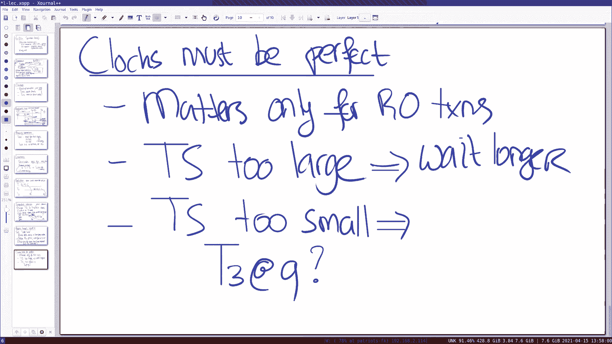

# MIT 6.824 2021 分布式系统 [中英文字幕] - P14：Lecture 14 - Spanner - mayf09 - BV16f4y1z7kn

下午好，傍晚好，晚上好，早上好，无论你在哪里或者无论你什么时候看。所以今天我想谈谈 Spanner ，是一篇 2012 年的论文，但 Spanner 系统仍在使用中，而且还在不断地开发中。

所以这是一个真正的系统。主要主题和为什么 Spanner 很有趣，是支持[广域]事务，这是一个非常强大的编程模型，所以即使数据，数据可能分片在多个服务器上，服务器位于不同的数据中心，在地球上的不同地方。

你可以运行事务，它们有 ACID 语义，以及失败的原子性，所有的写入都发生，或者一个也没有，并且它们提供了可串行化。所以这是一个非常强大的编程抽象，当然，挑战在于如何有效地实施它，其中一个很大的挑战是。

物理定律光速，从一端发送一个包，在美国的一个地方到美国的另一个地方，或者去另一个大陆，这需要很长时间，我们谈论的是几十毫秒。所以，我们在这篇论文中看到的是，读写事务确实是相当昂贵的。

但他们非常努力地让只读事务变得非常便宜。读写事务由两阶段提交实现，正如我们上周所谈到的，以及两阶段锁，其中有趣的一件事是，这个协议的参与者都是 Paxos 组。只读事务可以在任何数据中心执行。

它们会运行得很快，事实上，你可以看看论文后面的表六，你将看到只读事务，大约比读写事务快十倍。这里有两个关键的想法，我们将在这节课上讨论，一个是快照隔离，这是一个标准的数据库概念。

但在这里使用它为了让读取更快，特别是，让它运行良好，在分布式广域环境中，它们依赖同步时钟，那些时钟是完全同步的，所以，他们的事务方案必须处理，一点[]或漂移或错误容限，知道 TrueTime 是什么。

正如我所说的被广泛使用，无论是在 Google 内部，但作为 Google 的客户，你也可以使用它，Spanner 是一项云服务，你可以作为 Google 客户使用，如果你使用 Gmail 。

很可能你的电子邮件或部分电子邮件系统是通过 Spanner 的。也许在深入讨论更多细节之前，我想做一个逻辑上的解释，与 Spanner 无关，正如你可能已经看到的，我们对即将到来的长周末做了一些调整。

首先，实验 4a 的工作量不像其他实验那么重，希望能少花点时间，我们还取消了下周的课程，这样你就可以把它当做 4a 的工作时间，我们把 4a 的最后期限改得更灵活了，所以下个星期五对你来说很方便。

你可以选择晚些时候，晚点提交它，希望这能让你享受这个长周末，也许可以睡一觉，或者做些别的事情，而不是调试你的实验。我想说的第二点是与 Spanner 直接相关的，你们中的一些人注意到了这一点。

并通过提问，这篇论文很复杂，它之所以复杂，原因有很多，但其中一个原因是，有很多事情正在发生，这是一个强大的系统，有很多不同的组件，不同组件之间的相互作用很重要，这篇论文中有很多材料。

尽管我会在这节课中努力做到，试图说的更清楚，通过关注这篇论文的几个方面，我不打算对这篇论文做一个全面的处理，但是当然我认为最重要的想法，以及为什么我们会在 6。824 阅读它，这花了我一些时间。

或者几年的时间来弄清楚如何展示这篇论文，或者用一种我认为更容易理解的方式来解释，如果对于 6。824 的概念。好的，但还是像往常一样问问题。好的，让我们深入讨论一下高层组织架构。从更多的角度来看。

从我想在这节课中谈论 Spanner 的方式来看。所以，有多个数据中心，为了方便起见，只考虑三个数据中心， A B 和 C ，它可以在世界的任何地方，目标是，数据会是，我们数据在分片中。

包含一些数据库行或一些键值对，在分片中，也许它有键 a 到 m ，基本的想法是在数据中心之间复制这个分片，目标是即使整个数据中心出现故障，我们可以继续，我们安排的方式，我们将能够继续进行的是。

这些分片将形成，这些复制位于不同数据中心将组成一个 Paxos 组，所以如果你考虑这个，我们试着从实验 3 的角度来考虑，然后你可以考虑，我们有一个键值存储，键值服务器分布在不同的数据中心，键被更新。

[]Raft写入，通过 Raft 日志，然后我们到不同的 kv ，更新它们的状态，所以你可以想象实验 3 在这里，不是在你的机器上运行 3 台 kv 服务器，你将在不同的数据中心运行 kv 服务器。

好的？所以，然后每个分片有一个 Paxos 组，所以，可能是其他分片，持有其他部分的键值空间或数据库行，假设我们只有两个分片，对于这个数据库，分片包含 a 到 m ，然后其他分片包含 n 到 z 。

然后它们组成自己的 Paxos 组。我们想要获得多个分片的原因是为了获得并行性，这样如果事务涉及不同的分片，一组不相连的分片，它们可以不相交，可以完全并行地进行。所以，正如前面提到的。

我们每个分片有 Paxos 组，用于复制，但是， Paxos 实际上给我们提供了额外的好处，这个通信成本，从 a 到 b 或从 b 到 c 的可能非常昂贵，看起来 Paxos 允许继续。

或者 Raft 允许我们在只有多数的情况下继续，速度较慢的机器可能不会对性能产生太大影响，所以我们可以很容易地容忍速度慢的机器，或者一个数据中心停机，所以，多数原则在两个方面帮助了我们。

我们有了数据中心容错能力，并且绕过慢的（机器）。我们将更详细地看到的最终目标是，一个 Spanner 的客户端，假设这里有一些使用 Spanner 的服务器，希望是这样的。

这台服务器可以使用近距离的 replica ，所以， replica 通常放的很近，靠近使用它们的客户端。事实上，我们将看到，只读事务可以由本地 replica 执行，不用与其他数据中心进行任何通信。

当我谈到客户端时，这里，这通常是一些 Google 服务的后端服务器，例如，这可能是 Gmail 服务器，它也位于某个数据中心，也许是同一个数据中心，并与那个数据中心中的 replica 进行通信。

当然，再外面是真正的客户端，比如读取邮件的用户。好的，关于这个高层组织架构，有什么问题吗？好的，让我来列出一些挑战，我在这节课中想要关注的。

所以，有三个主要挑战。一是，就像我说的那样，我们希望只读事务，不需要与任何其他服务器通信，但我们要确保读取看到最新的写入，这种我们以前见过的典型的挑战，比如 zookeeper 。

zookeeper 并没有真正直接面对挑战，只是弱一致性，但在这个设计中，我们希望以一种方式安排，它仍然保持线性一致性，事实上， Spanner 追求的是比线性一致性更强的性质。第二件事是。

我们希望支持，Spanner 想要支持跨分片的事务，所以即使我们执行一个银行转账，一个账户在一个分片中，另一个账户，目标帐户，在另一个分片中，我们想安排它，它仍然可以像事务一样执行。

并且具有 ACID 语义。最后，只读和读写的事务都必须是串行化的，事实上，比可串行化的要强一点。我们会看到，对于读写事务，我们将使用两阶段锁，两阶段提交，我们在上一节课中谈到的两个协议。

所以我首先想做的是谈谈读写事务，然后更详细地讨论只读事务如何执行，它们可以非常高效地运行。好的，所以读写事务是，两阶段锁和两阶段提交。所以希望这很容易理解，这将涉及到这些复杂的时序图，我们在上周看到的。

所以它的设置方式，我要简化一下，看看在 Spanner 中的设置方式，我们有客户端，客户端在某种程度上负责运行事务，使用事务 manager ，事务库，运行在客户端机器上，负责安排这个事务，再次。

这里的客户端不是用户 Web 浏览器或 Gmail ，而是数据中心的 Gmail 服务器，这是 Spanner 的客户端。所以让我们把这图简单一点，所以我们有两个分片而不是三、五个。

所以我们有分片 A 和分片 B 。假设我们执行转账事务，和前面一样，我们要从一个账户中减去一些钱，然后把它加到另一个账户上。首先，我在没有时间戳的情况下讨论这个问题，在某些方面，这么做的一个原因是。

对于读写事务，时间戳并不是很重要，时间戳主要用于只读事务，它们需要对读写事务进行一些调整，去支持只读事务，所以，时间戳在某种程度上也能漂移到读写事务，但在本质上，读写事务是，直接的两阶段锁和两阶段提交。

所以，客户端将读取这些帐户，假设读取 x ，所以我们只需要做转账事务，转移钱，把 1 加到 x ，x 中减去 1 美元，y 中加入 1 美元，它将是 x ，我们假设 x 位于一个分片中，所以。

这将是一个跨分片事务，你必须读取 y ，将会有，当客户端执行这些读取操作时，它们去分片，而分片保持着锁表，所以它们记录了这个事务，我们假设这个事务 TID ，它们会记录下来， x 被拥有。

锁表实际上由客户端拥有，y 由客户端拥有，这是一种我们之前见过的标准。这里略有不同，在这里没有完全画出来的是，当我们说分片 A 时。

分片 A 是这些 Paxos 组的一个，所以，它有三个，在这种情况下，一个三节点的组。

所以， SA 是一个复制服务器，包含多个节点，在执行只读事务时，我们要访问那些节点的领导者，所以，如果你从 Raft 的角度考虑，你可以想一想，读请求到达 Paxos 组的领导者。还有另一个。

所以每次我在这里为 SA 或 SB 画一个箭头，这是一个复杂得多的故事，尤其是当涉及到写入时，因为写入要经过 Paxos 或 Raft 组。只读或锁表不是复制的，它存储在 Paxos 组的领导者处。

如果领导者在事务过程中停机，那么事务必须重新开始，事务将被中止，因为锁信息丢失了。这些锁表不是复制的原因，这使读操作很快。好的，一旦客户端得到了 x 和 y 的值，它去掉锁，使用两阶段锁的风格。

它将从 x 减去 1 ， y 加上 1 ，然后提交这个事务。所以，所有写入都在客户端本地完成，同样，这是 Gmail 服务器，一件[]事是，当客户端完成事务时，它将事务提交给 Spanner 。

它提交给事务协调者，所以，一些服务器或一些机器，你选择作为事务协调者，同样，事务协调者也是 Paxos 组，如我所说，它是在不同数据中心的多个节点。我们希望这是一个 Paxos 组的一个原因是。

正如我们之前看到的，在两阶段协议或两阶段提交中，如果协调者失败了，它可能会阻止参与者，如果参与者已经准备好并同意进行事务，但如果协调者失败了，这些参与者必须持有它们的锁，必须等到协调者回来。

通过使用 Paxos 复制协调者，我们使协调者高可用，从而避免那种灾难情景。好的？所以，事务协调者，负责运行两阶段提交协议，它将发送 x 和 y 的更新到分片 A 的领导者。

（发送） x y 到分片 B 的领导者，它们获取锁，在这种情况下，它们已经持有锁，或升级为读写锁，准备事务，所以它们还没有执行它，只是，通常使用预写式日志，准备修改，如果一切都好的话，然后。

它们提交事务，通过进入这种准备状态，这是一个重要的时刻，因为在这一点上，事务出现，当参与者提交给这个事务时，我们从上节课中知道，参与者必须记录状态，如果它们失败了，它们又回来。

它们可以恢复从它们停止的地方重新开始，所以，在准备状态下，这会导致 Paxos 写入，记录事务状态和 2PC 状态，以及参与者持有的日志，等等，所以这个 Paxos 写入，所以这个分片的领导者。

有一个推 Paxos 写入到组中的不同节点，以确保状态复制，具有容错能力，所以一旦参与者准备好，同意准备好，然后它们发回 ok ，ok 跟我们之前讨论的两阶段协议很像，在这一点上，协调者可以提交，当然。

要提交的点，具有一些记录的协调者做出提交的决定，因为参与者可能晚些时候回来，知道并发现这一点，我们可能会失败，所以， Paxos 状态或两阶段提交状态，写入使用 Paxos ，复制使用 Paxos 。

从整个介绍来看，你可以把 Paxos 看作是，Raft 的完全替代品或等价物，Spanner 在 Raft 之前，但是从感觉上，[]，对于这篇论文来说，基本上是一样的。所以这一点提交，这个是提交。

一旦事务协调器写下事务已提交，这就是提交点，然后通知它们的参与者，这发生了，它们将回复 ok ，事务已经提交，事务协调器可以清理它的状态，在之后的某个时刻，分片也可以清理它们的状态，在提交时。

参与者释放它们的锁。好的，这是读写事务的基本情况，对此有什么问题吗？我认为简单的思考方式是，这是两阶段提交，两阶段锁，与我们上周谈到的主要区别，这周的是，事务协调者，参与者都是 Paxos 组。

参与者都是帕克索斯团体，它们复制高可用，上次我们谈到的两阶段提交的一些问题，在这里不太相关，因为参与者的可用性要高得多。所以，每个分片是否都复制了锁表？是的，好的，它不是在复制锁表。

它复制准备好后持有的锁。所以只有当它持有锁时。是的，它需要执行两阶段提交时。所以，如果当前一些事务的锁，没有达到准备阶段，它们会丢失吗？它们会丢失，然后事务中止，参与者不参与，告诉协调者，我的锁丢失了。

不能这么做。谢谢。好的，这节课剩下的部分是关于只读事务的。

这些事务只进行读而不进行写，它们是很常见的，所以，其中一个目标是让它们变得非常快。他们实现高性能的方式是，它们安排读取，Spanner 的性能很高，因为读取只对本地分片，而且它们没有锁，没有锁是好的。

因为这意味着读写事务可以阻塞读写事务，或者另一种说法是，只读事务不会阻塞读写事务，并且没有两阶段提交，所以，这也意味着不需要广域通信，所以，读取操作可以从本地 replica 执行。当然，也会看到。

这是从本地分片读取的数据，这里真正的挑战是，如何仍然获得一致性或者串行化，但重要的是要指出，但有一段时间假设，我们知道怎么做，你知道我们可以，仅从本地分片读取，不持有锁，不执行两阶段提交。

意味着所有通信都是本地的，在一个数据中心内，而且它可以非常快，如果你看一下论文中表 3 和表 6 ，你可以看到，基本上只读事务，比读写事务快十倍，读写事务在数百毫秒的量级，这在某种程度上说得通。

因为它们要远距离通信，但是只读事务在 5 到 10 毫秒的数量级。好的，所以关键的挑战当然是，我们执行本地副本，如何获得正确性。所以让我稍微谈谈，因为它与我们以前看到的略有不同，所以。

正确性在这里意味着两件事，一个是，事务是可串行化的，所以它们必须按某种顺序执行，所以如果你仔细想想，我们有一个读写事务，我们有另一个读写事务，然后我们有一个只读事务，只读事务必须，介于两个读写事务之间。

只读事务不应该观察到，读写事务的某些部分，所以读写事务进行多次写入，像第一次那样，然后，只读事务看到所有这些写入或没有一个，与[]的那个类似。好的？第二，这是我们上周谈到的标准问题，可串行化。

然后他们会选择更强的东西吗，他们所说的外部一致性，外部一致性意味着，如果事务 2 在事务 1 提交之后开始，那么 T2 必须看到 T1 的写入。所以，我们回到之前的这张图片，如果只读事务。

这个在第一个事务提交之后开始，那么这个只读事务必须看到事务 T1 的写入，所以想法是，如果你想想这个，这种外部一致性意味着，可串行化加上这种实时需求，事实上，它与线性一致性非常相似，除了一种方式。

用于对比事务的外部一致性和线性一致性的是，外部一致性是事务级别的属性，到目前为止，我们谈论线性一致性的方式，总是单独的读写，但对于第一[层次]来说，我认为你应该以完全相同的方式思考。和线性一致性一样。

外部一致性对于程序员来说也是令人愉快的，是非常强的一致性。好的，有什么问题吗，关于这里的正确性定义，或者 Spanner 拥有的正确性目标？好的。好的，那么我们来谈谈，如何实现只读事务的这种正确性。

让我首先解释一个实际上不工作的坏的方案，然后我们将讨论一个更好的方案。所以坏的方案是，我们将读取，我们安排总是读取最新提交的值，这是关于写入的，因为我们必须安排，如果 T2 在 T1 提交之后开始。

你必须看到它的写入，所以为什么不读取最新的提交值，我们可能是好的。所以这是，问题当然是，它实际上并不起作用，所以 T1 ，可能 T1 写入 x ，写入 y ，并提交转账，那么我们有另一个事务。

我们有事务 T3 ，或者 T3 是只读操作，它读取 x ，所以这是一种实时的，然后在 T2 之后，然后在 T1 T3 开始之后，T2 运行，写入 x ，写入 y ，提交，然后 T3 有一点延迟。

然后第二次读取 y ，时间像往常一样，是这个方向。如果你遵守读取最新的提交值（的规则），那么这会返回什么，它会返回事务 T1 的值，这个读取将返回来自这个事务的 y 的值，因为这是最新提交值。

这是不对的，对吧，因为现在我们处于一种情况，T3 观察到来自不同事务的写入，而不是得到一致的[]。所以这个规则还不够好，为了避免这个问题，不使用这个糟糕的方案，Spanner 使用了不同的方案。

这一方案称为快照隔离，这是一个标准的数据库概念，主要是一些本地数据库，并不是在广域内，我们稍后讨论广域方面，但首先让我解释一下什么是快照隔离。所以，快照隔离所做的是，我们为事务分配一个时间戳。

我们分配时间戳，有两个不同的点，对于读写事务，是提交开始提交的时候，对于只读事务，是事务开始的时候，然后我们将按时间戳顺序执行所有事务，我一会儿再解释，但是这个意思，能够按时间戳顺序执行所有操作。

每个 replica ，每个键保存一个值，replica 保存多个键的值以及它们的时间戳，例如，在一个 replica 中，我们可以说，请给我在时间 10 的 x 的值。

或者给我时间戳 20 的 x 的值，有时这被称为多版本数据库或多版本存储，保存，对于每次更新，保存数据项的一个版本，这样你可以回到过去。所以，这解决了我在第一种情况中展示的问题，因为将要发生的事情。

让我们再看看这三个事务，我们有 T1 ，我们有 T2 ，我们有 T3 ，T1 写入 x ，写入 y ，以及提交，我们假设提交发生在 10 ，所以这个事务在时间戳 10 运行，然后在某个时刻。

我们读取 x ，我们稍后会谈到这一点，在这里我们有另一个事务，我们有写入 y ，写入 x ，写入 y ，并提交，假设这个事务在时间戳 20 提交，在这个时间戳运行，然后我们有读取 x 。

我们有读取 y ，现在当读取 x 发生时，它将被分配一个时间戳，事务开始的时间，所以开始的时间，假设这个事务的开始时间是 15 ，所以 T2 的运行在 15 ，所以当执行读取 x 时。

它需要读取 15 之前的 x 的最新值，对于时间戳 15 的最新提交值，在时间戳 15 之前是来自这个时间这个事务的值。所以读取 x 读取事务 1 的值，当然，读取 y 也将在事务开始的时间戳执行。

所以它也会读取时间 15 的 y ，在时间戳 15 ， y 只有一个值，也就是由事务 T1 产生的，所以读取 y 也会从 T1 开始，所以，我们避免了之前遇到的这个问题，那个我们从不同的事务中读取。

所以，这提供了我们寻找的线性一致性或串行化，所有事务都以全局时间戳顺序执行。这能理解吗？所以你可以考虑的是，每个 replica 有一个表，写入值和时间戳，所以我们有 x 值为 9@10 。

以及 x 值为 8@20 。所以当读取到达一个 replica 时，读取 15 进来，我可以挑选它的时间戳之前的最新的写入。所以我有一个问题，当我们读取 x 的时候，假设我们只关注读取 x 。

x 本身存在于一些分片上，被复制在 Paxos 组上，假设有三台服务器复制 x ，当你读取 x 时，因为我们希望只读事务非常快，我们只从本地 replica 中读取，它不一定是领导者，那么。

我们如何保证我们不会读到旧的，我们如何不获取旧的？好问题，这正是我接下来想要谈论的话题。

正如你所指出的问题，这里有一个挑战，replica 可能没有看到，没有看到写入 x 在时间戳 10 ，在 Spanner 中解决这个问题的方法，解决方案他们称为 "safe time" ，所以。

这个结果是这样的，Paxos 或 Raft 也按时间戳顺序发送所有写入，所以没有，你可以考虑总顺序是一个计数，类似比如在实验 3 中，但它实际上是一个时间戳，由于时间戳形成了全局顺序。

时间戳的全局顺序足够对所有写入进行排序。然后有一条规则，对于读取，还有一个额外的规则，在你读取之前，所以在读取时间戳 15 的 x 之前，replica 必须等待时间戳大于 15 的写入。

看到时间戳大于 15 的写入，它就知道在 15 之前不会再有写入，所以安全地在时间戳 15 执行读取，并且知道需要返回什么值。所以，对于服务而言，所以，这意味着，读取可能必须稍微延迟一点。

直到下一次写入，当然，对于忙的服务器，这些写入一直到来，所以，等待可能不存在或几乎不存在。好的？但这是需要遵循的规则，为了确保（避免）这个问题，没有看到写入的 write 返回错误的值。

真正的情况要稍微复杂一些，你也必须等待，还要等待已准备好但未提交的事务，例如，这个事务已经准备好了，在时间戳 14 ，但它可能还没有提交写入到键值存储，所以，我们要确保。

任何在我们读取时间戳前准备好的事务，必须在我们返回读取值之前提交。好的？这能理解吗？不同的分片是否也是这样，我们是否单独考虑不同的分片？读取只命中本地的分片，本地的 replica 。

所以我不是百分之百确定你问我的问题。我想我的问题是，正确性保证适用于跨分片吗？是的，它们适用于事务级别，如果只读读取本地 replica ，我们仍然需要确保事务的一致性，通过遵循这些规则。

我们实现了这个目标。好的，理解了，谢谢。

好的，现在，我们要看 Spanner 论文的核心部分。

这将是，我们想要理解时间，比如时间戳。

在这种情况下，时钟，不同服务器的时钟必须准确，它必须是完美的，不同的参与者必须就时间戳顺序达成一致，如果事务使用特定的时间戳，在系统的中任何地方，时间戳都必须是相同的，所以。

就像我在之前的幻灯片中描述的那样。

参与者选择读取事务，分配一个像 15 这样的时间戳。

可能往回一点，这里，我们为这些事务分配时间戳，最好是这种情况，T1 T2 T3 就这些时间戳达成一致，而且它们具有可比性，我们稍后会看到，这只对只读事务非常重要，我们可以考虑这两种情况，会发生什么。

我们想问的问题是，如果一个 replica 或服务器时间错误会发生什么，所以它与其他服务器的时间不一致，会带来什么样的问题，那么我们先来考虑一下这种情况，如果时间戳太大了，会怎么样？例如。

我们回到这里的版本。

在这种情况下，假设只读事务开始读取，它读取不是 15 ，也许实际上返回的值是 25 ，会发生什么，或者让它简单一点 18 。

为了减少混乱。

时间戳偏差的结果是什么，但是偏差往大的方向。它仍然小于 25 ，如果它仍然读取[]于 20 ，它仍然读取第一个，但是如果晚一点，它将读取第二个。

是的，两个都没问题，这里真正的关键问题是，在读取之前，你必须等到看到写入，如果你是，那么如果你的时间戳太大，会发生什么，我们偏差往太大的方向。你得等待。是的，你必须等待。

也许再多等一会儿，不会出什么问题。所以现在另一个问题是，如果时间戳太小，会怎么样，比如，读取，当执行 T3 的机器询问时间时，不是时间 10 ，而是 9 ，这是课程问题的一个变体。

T3 在时间 9 运行。也许这是一个很好的时机开始一个分组讨论室，你们可以思考和争论，结果是什么，潜在的结果是什么，或者会出什么问题，如果 T3 分配的时间戳是 9 而不是 10 。

所以也许我们可以进行一个分组会议室，Lily ，可以吗，好的，我想 Lily 很快就会回来，稍等片刻。好了，还有其他人听到那个噪音吗？

好了，大家回来，大家能听到我说话吗？是的。我们都是好的吗？假设我们都是好的。是的，是的，我们是好的。我们都是好的。好的，所以回到这个问题，我们调查，我们依靠的方案，不同机器上的时钟是完全同步的。

正如我所提到的，这只影响只读事务，因为读写事务会抓取日志，并使用两阶段锁来获得整体顺序，所以它们执行一些可串行化的，外部一致顺序，我们看到，对于只读事务，时间戳至关重要，至少，我们认为是至关重要的。

如果它们太大，可能不是，只是负面影响性能，但问题是，如果时间戳太小，会发生什么，所以我们要问的具体问题是，会发生什么。

如果我们稍后会看到的场景，我们有事务 T1 ，这里写错了，是 T2 和 T3 ，T3 正在进行读取，这个读取不是发生在 15 ，它实际上发生在，因为 3 的时钟是错的，它实际发生在 9 ，那会有多糟糕？

破坏我们的串行化。有人知道吗？好的，看起来，好的，抱歉，我没听到你说的，因为我这边今晚出了点问题，我想我能听到你的声音，你能重复一下答案吗？抱歉，我说它会破坏可串行化。是的，为什么？因为这里读取会发生。

会假设发生在最新的写入之后，然后会发生在你没有写入之前。是的，所以把故事说完整，T3 实际上在 15 执行，在 T2 T1 提交之后，所以， T3 必须看到 T1 的写入，但是如果时钟错误。

时间戳 9 分配给 T3 ，T3 将在执行事务 T1 之前读取 x 的值，这将是错误的，这将打破外部一致性。好的？大家都清楚了吗？

好的，所以很明显我们想避免这种情况，还有一些核心问题，问题是我们如何获得时钟，我们如何保持时钟同步。哦，稍等，我还有一个问题。所以这种情况是可以发生的，因为总是由协调者为读写事务分配时间戳。

所以，即使读取发生在本地，所以，机器可能落后，有一个对于本地时钟的未来的版本。是的，或者是在过去，是在未来，是的。好的，这是可能发生的，因为不是在决定时间戳的机器上。不，好的，忘了是哪台机器。

T3 会决定事务的时间戳，我们回到这张图片上。

所以这里我们有 T3 ，T3 开始，原则上， T3 开始绝对时间是在 10 之后的，因为 T3 开始在 T1 之后，正如我们在这张图片中看到的，所以这个读取 x ，所以，我们将时间戳分配给只读事务。

我们将时间戳分配给只读事务，在事务开始的时刻，所以读取 x 是 T3 的事务的开始，T3 需要得到时间戳，所以它会说，请给我时钟当前的值，如果时钟是可靠和准确的，它当然会给出一个 10 之后的时间。

因为 T3 是在 10 之后开始的，但是我们假设 T3 的时钟不是，[]准确同步的，时钟实际上返回了 9 ，现在事务 3 将执行时间戳 9 ，这将导致你读取 T1 之前的值，这将打破外部一致性。好的。

但是如果，如果我们执行 T3 的 replica 有，它可能有版本 10 的变量 x ，对吧？它可能会，但它在时间 9 执行事务，所以我们会得到 10 之前的值，这个版本的[内存]。是的，是的。是吗？

是的。这是一个很好的问题，我认为这一点非常重要，让我们清楚地知道这里发生了什么。

好的，所以我希望我们现在达成一致，这是非常重要的，这些在不同机器上的时钟是完全同步的，当然，你知道不可能实现完美的时钟同步，有一些困难，很难实现时钟同步，因为时钟会自然漂移，所以当你认为。

它是晚上 10 点加上 1 毫秒，我的机器可能会认为，它是晚上 10 点加上 2 微秒，这是因为在你的机器或服务器中，振荡器跟踪时间，它们以特定的频率运行，但是它的频率并不完美，更好的时钟。

原子钟有更好的振荡器，更精确，作为 Spanner 依赖的那种时钟，相当高的精确度，但是他们仍然需要，偶尔与通用全球时间同步，为了避免漂移的问题，非常精确的时钟，他们使用原子钟。

比你的计算机里的时钟更精确，然后它们与全球时间同步，为了确保所有时钟在全球时间上一致，它们保持滴答滴答滴答，然后周期性地重新同步，同步时钟，使用全球时间，他们使用 GPS 全球定位系统广播时间。

作为同步不同原子钟的一种方式，然后保持它们同步运行。所以看起来，这篇论文并没有太多地谈到真实时间系统是如何工作的，但看起来是，他们的每个数据中心可能有少量的或一个原子钟，服务器同步，使用这个。

时间服务器常规地，与时间 master 同步它们的本地时间，在不同数据中心的不同时间 master ，通过 GPS 系统进行同步。但结果就是，位于不同的服务器上的时钟非常接近，他们谈论的 ε 。

也就是错误率是，似乎他们时钟的 ε ，你可以在论文结尾看到一个表，只有几微秒到几毫秒的量级。所以，当机器到达，问操作系统，请告诉我现在的时间，返回的当前时间可能与实际时间相差几微秒。

或者甚至比真实时间差几毫秒。好的？所以，这有一点。[]，是的，请继续。是的，所以，比如在论文中，就像你提到的，我们并没有深入这一点，但就像同步时钟，甚至测量它们有多不同。是的。我的意思是。

我们不应该也考虑到信息传递的时间吗。是的，我想这就是他们的意思，抱歉，我没说太多，但这就是他们的意思，所以他们对自己的想法保持着持续的估计，例如，与时间 master 同步，本地计算机上的时间库。

可能会跟踪开始时间以进行估计，平均延迟或正常延迟是多少，向时间 master 发送或接收消息，用它来纠正任何小错误，他们协议也支持离散值，所以[]离群值，我是说网络中发生的不好的事情。

因此你的时间戳延迟了很多，所以你不应该包括那些，我想还有第三个问题，有时这些振荡器会失灵，不再是正确的了，它们可能返回不正确的值，所以再次，他们没有谈论大量的细节，但它们似乎使用了 ntp 类似的技术。

来处理这类问题。我明白了，谢谢。所以如果你对这类东西感兴趣，有一种称为 ntp 的协议，当你的计算机和[]用来，将它的时钟与全球时间同步，ntp 有所有这些内置的机制，但 ntp 不是。

它没有相同的位置，也没有同样的小差值，就是真正的时间，所以我认为 ntp 可能是，你应该认为，这些错误率是从几毫秒到十毫秒的数量级，它主要与往返时间有关。对于这个，还有其他问题吗？好吧。

所以时钟并不是完全同步的，有一个误差范围，true time 所做的是，true time 给出一个答案，它会给你最佳估计值，当前的绝对时间或真实时间是什么，加上机器的误差范围。

所以解决这个时钟漂移的办法，不使用真实时间的时间戳，或者仅仅是纯粹的时间戳，而是时间戳是时间间隔。所以每个从当前时间返回的值，包含最早的和最晚的，例如，我们询问当前时间。

它的真实时间是上午 10 点或下午 2 点，它可能返回间隔，最早的可能是下午 1：59 ，59 秒以及 20 微秒，最晚的可能是下午 2 点加上 2 微秒，有些机器可能不止几微秒。

有些机器甚至可能有几毫秒，我猜论文中的一些东西，误差有时是 10 毫秒或多毫秒的量级，但它给出了一个间隔，而且可以保证真实时间在这个时间间隔内。时间间隔是 ε 还是 2ε ？论文并没有谈到这一点。

从这个意义上说，这只是对误差范围的估计，我认为如果你看一下协议的细节，通常，这个误差范围[] 2ε 。好的？现在，为了解决，所以现在我们需要调整我们的协议，因为我们的协议有一些规则。

来设置时间戳的开始时间，或者使用时间戳设置事务的开始时间，读取下一个写入的规则，我们会看到，有几条规则需要改变，处理时间间隔而不是真正的时间。首先，开始规则是不同的，所以开始规则是，当前时间。

我们问计算机，请告诉当前时间，获得时间间隔，然后我们选择的开始时间是 latest ，所以这意味着，无论时间戳是什么，开始规则是[]，肯定在真实时间之后，我们知道真实时间在过去，对于只读事务。

这被分配到事务的开始处，对于读写交易，像之前一样，它是在提交开始时，所以这一部分不会改变，唯一改变的是，你得到时间间隔的终点，我们可以得到时间间隔的终点，所以，至少真正的时间已经过去了。好的。

还有第二条我们以前没有的规则，那就是提交等待规则，我们会在事务中推迟，所以，如果事务在提交时获得某个时间戳，使用提交的开始，然后我们到达提交的末尾，然后我们将推迟这一提交。

延迟提交直到在提交开始时分配的时间戳，是过去的，哦，我的笔记错了，稍等一下，我们要推迟到时间戳早于 now。earliest ，我们知道这肯定在真实时间之前。好的，这就是对协议的修改。

让我们看看这是如何工作的，举个简单的例子，对此有更多的感受。例如，我将使用比前一个简单的，我将只关注写入 x 的事务，我们还是有 3 个事务，所以这是 T1 ，T1 执行写入 x ，然后提交。

我们并不太关心这些事务，所以我们假设提交在 1 ，真实时间 1 ，所以现在我们将运行事务 T2 ，它会写入，是的，事务 T2 当然在 T1 之后运行，它写入比如 x2 ，所以这里写入 x1 。

将 2 写入 x ，它开始准备，这是提交的开始，所以在提交开始时，请求一个时间，它将得到一个时间间隔，我们知道真实时间会回来，作为[]在时间间隔中，但在时间间隔的某个时候，所以。

时间间隔可能开始在真实时间之前，比如时间间隔开始于 1 ，与事务 T1 重叠，也许时间间隔的最新值是 10 ，这就是它得到的，我们要选择作为时间戳的是，选择这个值 10 ，我们想要选择最新的值。

因为我们想绝对确定，如果有一个事务在真实时间之前开始，我们选的时间肯定是在真实时间之后，所以我们选择 10 ，绝对超过 1 ，我们永远不会对之前的事务感到困惑，然后，在某个时刻。

这个事务选择了时间戳 10 ，10 可能比真实时间更远一点，所以，事务不会准备，或者两阶段提交所需的工作，（直到）到达真正的提交点，那里，可能需要等待，因为这是提交规则，我们得等一会儿。

直到我们确定 10 已经过去，所以，这就是提交时间，事务协调者所要做的是，查看提交时间，继续读取它的本地时钟，我们会继续读取它的本地时钟，直到获得时间间隔。

那里的 earliest 时间已经过了 10 ，所以也许在某一时刻，读取，读取获得时间间隔，然后时间间隔从 9 或 7 开始，它一直读取，直到得到一个大于 10 的值，然后我们确定真正的时间已经过去了。

它是安全的来提交事务，所以现在 T3 之后运行的任何事务，都必须在真实时间 10 之后运行。假设事务 3 在某个时间点开始，并且事务 3 在 T2 之后开始，所以我们现在绝对确定。

我们读到 x 是 2 ，所以它将是读取 x ，我们将询问当前时间，可能会得到一个时间间隔，时间间隔可能稍微重叠 T2 ，但是这个时钟的真实时间可能是相当精确的，时间间隔是从 10 到 12 ，所以。

真实时间是在 10 到 12 之间，我们知道必须超过 10 ，因为我们定义 T3 读取在 T2 之后，这会正常的，因为 T3 将选择它的时间戳，时间间隔的结束，根据最新的规则，所以。

 T3 会运行时间戳真实时间 12 ，这将保证，这个时间间隔我们知道一定会超过真实时间 10 ，所以当 T3 读取时，读到 x 是 2 ，因为它会观察到事务 2 的值，因为它的读取超过了真实时间。

这肯定要付出一点延迟的代价，但如果时钟相当精确，正如我们之前所说的，这个延迟是很小的。这能理解吗？抱歉，我有个问题，如果 T2 表示它将在时间 10 开始一个事务，然后当我们读到某个东西。

在同一个事务中，我们还需要确保 10 在外面吗，在 now 时间间隔之前。这个问题是，假设 T2 所做的不仅是写入，进行读或写，T2 应该观察到它自己的写入，这是你要问的问题吗？T2，当我们读取的时候。

比如，读取 y 。是的，所以我们把这个加进去。是的，或者在那之后。是的，你的方式，在准备好之前是读取 y 。好的，让我来，好的。然后，哦，好的，这可能是。原因是读写事务并不那么关心，如果你回到刚开始。

在这张图片上，如果读写事务进行读取，读取将发送给分片 master 或分片领导者，如果你取消读取锁，读取会，客户端在本地执行所有操作，它会获得读取值，我们会读到最新的读取值，在我们获得锁之后，所以。

在读写事务中，锁完成了所有的全局排序，两阶段锁确保全局排序。

所以真正有趣的互动是，只读事务之间的交互，即 T3 和读取事务之间。一个是 T2 实际提交，我们在它提交之前读取。

是的，所以读写事务中的协议是，我们首先完成所有工作，然后我们进入提交阶段，所以这里是提交点，或者这里是客户端提交事务的地方，并将其发送给事务协调者，然后事务协调者运行两阶段提交协议。但是所有的分片。

需要锁，事务实际使用的值（的锁）。

好的？好的。好的，让我们试着总结一下。所以，读写事务是全局有序的，或可串行化加上外部一致性，因为它们执行两阶段提交加上两阶段锁，只读事务比较特殊，因为它们只联系本地 replica 。

而它们能看到正确的值的原因是，因为快照隔离，每个数据项都是版本化的，并加了修改过的时间戳，所以，你可以使用快照隔离读取过去的内容，然后为了确保，所以，快照隔离为我们提供了可串行化，但是。

 Spanner 是为了更强的东西，也就是，它是为了外部一致性属性，就像是线性一致性，所以它有一个实时的组件，为了确保我们得到外部一致性，我们按时间戳顺序执行只读操作，因为时间戳顺序。

它需要完全同步的时钟，Spanner 有点[依赖]规则，通过使用时间间隔，而整个目标，通过使用这些技术，结果是，只读事务非常快，读写事务不是特别快，如果你看一下表 6 ，读写事务的时间是 100 毫秒。

也就是说每秒只能做 10 个事务，这真的不算多，但只读事务速度很快。现在，情况就是这样，尽管读写事务可能没有那么快，它们非常强大，你是在跨多个分片执行事务性操作，位于世界不同地区的不同数据中心。

对于程序员来说，这是一个非常方便和强大的工具，你可以在世界各地复制跨分片的 ACID 语义。所以，这是我想说的关于 Spanner 的所有事情，我希望这是有帮助的，你也许更少困惑或更多困惑。

因为这次课程，但是，如果你有问题，请随意留在这里，我很乐意讨论这一点或 Spanner 的任何其他方面。祝你好运完成 3b ，我希望你有时间享受这个长周末。谢谢。所以我有一个问题，也许在前面的幻灯片。

当你有两阶段提交的图表时。

对于读写事务，所以在我们与 TC 通信之前，TC 表示协调者吗？是的，表示协调者，是的。好的，所以在我们和事务协调者通信之前，当我们最初读取 x 和 y 时，我们不和 TC 做任何通信，所以我的问题是。

这些读取的本质是什么，我们是否将它们视为只读的，所以我们从离我们最近的 replica 中读取，或者我们执行大多数类型的通信。我们是去找参与者的领导者，去找 Paxos 领导者。我明白了，所以是这样的。

好的，就像实验 3 一样。抱歉？所以，这里的读取 x 和实验 3 中的一样，所以它通过领导者，它会复制到整个。不，它是，没有，我相信没有读取通过 Paxos ，通过事务领导者，抱歉。

 Paxos 领导者，Paxos 领导者当然知道上一次写的是什么。但是，如果，比如，我们有一些失败，领导者认为它是领导者，但是在某些分区中，它更新了信息。我不太清楚，他们是怎么处理这种情况的。

我认为租约让这变得不可能。是的，所以他们有，所以每个领导者在一段时间内是领导者，在那段时间里，没有其他领导者可以成为领导者。好的，我明白了，太棒了，谢谢。谢谢你提醒。我对上一张时间间隔的图有个问题。

我在想如果读取 T3 ，或者假设 T2 中的写入，时间间隔也从 1 到 12 ，这样， T2 的写入发生在 12 ，而 T3 读取也发生在 12 ，在这种情况下会发生什么？好的，如果你[说更多]。好的。

所以对于 T2 ，现在的写入，是从 1 到 10 ，然后在 12 会发生什么，它与事务 3 一样。12 不是 2 。我想的是 12 ，抱歉，我的意思是。所以如果这个，所以。

事务 2 会使用 12 作为开始时间，在读写事务的情况下，它将等待，直到在时间间隔中出现 12 ，然后提交，所以，真实时间在 1 到 12 之间，至少要等到 13 ，真实时间现在肯定已经过了 12 。

是的。现在我们知道 T3 在 T2 之后开始，它永远不会返回这个时间间隔，因为真正的时间已经过了 13 ，或者已经过了 12 ，所以当这个现在读取它的时钟时，我们知道会有一个时间间隔。

也许还包括 10 ，但是将包括 14 或 13 ，我们会选择 latest 值，所以我们假设选择 14 ，所以它会在 14 做时间戳。所以，这种情况就不会发生，因为时间间隔可以保证最早的和最晚的。是的。

这是 T3 肯定是在 T2 之后开始的情况，根据定义，这就是我们建立示例的方式。然后如果，读取发生在提交的同一时间，不一定是在严格的之后，在这种情况下，有什么保证，比如它有没有。好问题。

所以记得线性一致性的定义，如果 T2 和 T3 几乎同时运行，真的同时运行，也没有关系，T3 可以在 T2 之前或之后。好的。那么可串行化方面呢，如果它们再次执行，可能不一定是相同的顺序。

以一个整体顺序执行，T3 或者在 T2 之前或者在 T2 之后，但这两种顺序都没问题，两者都是可串行化或线性一致性所允许的，因为执行是真正同时进行的，T3 在 T2 提交之前开始。明白了。

然后对于 T3 来说，如果提交和读取同时发生，T3 会读到什么，将取决于 replica 是否读取到那个提交。是的。非常感谢。不用谢，好问题。我有一个问题，如果我在这张图片上看到。

而当它试图提交 12 的时候，并不在那里，它会重试并再次等待。好的。它继续读取时钟直到获得时间间隔，earliest 已经超过了它的时间戳。好的，我还要确认一下，它提供的保证是，如果在时间戳 x 。

当 x 在 now 时间间隔之前，这个机器或 Paxos 组将看到一切正常，我想机器已经看到了发生的一切，在 x 之前，对吗？是的，我想或多或少是这样的，我没听说过，在你提问之前，但我们获得时间间隔。

我们所知道的是，真正的时间是在这个时间间隔的某个地方，所以这是真正的时间，所以当我们开始准备的时候，真正的时间没有超过 12 ，但它在 1 到 12 之间，所以当我们提交的时候，我们必须确保。

提交确实发生在真实时间之后，所以我们要再等一段时间，所以我们知道我们大于 12 ，我们等到时钟给出一个时间间隔，真实时间肯定过了 12 。我想我想问的是，如果你选择 12 。

然后你的时间间隔返回了 13 到 20 ，你知道任何，例如小于或等于 12 的时间戳，对这些事务的更改，你就能看到它们了。是的。好的。好的，理解了，谢谢。所以我不完全理解提交等待的是什么，因为看起来是。

提交等待发生在你选择了时间戳之后，对于你感兴趣的事务，你只需推迟真实时间，这让你提交只是为了确保。不，但是提交时间，你已经开始更新数据库。嗯。所以在提交的时候，你必须提交。

比如 T3 不会运行直到 C 之后。是的。因为这是我们的定义，T3 在 T2 提交之后开始。是的，如果不这样，会发生什么，你会失去什么，如果你没有。那么， T3 将与 T2 同时运行。好的，稍等。

我明白了。我不确定你想探索哪种场景，但是，如果我们允许 T3 在 C 之前开始，那么我们的故事完全不同了，因为没什么好讨论的，因为 T3 与 T2 同时运行，它可以观察到 T 或不会，然后结束。好的。

我明白了。所以 C 的时间戳，我们在等待那些，我们传递真实时间，我们得到准备好的编号的开始，所以我们知道真实时间已经过去了。这是。T3 永远不会选择一个真实时间，在 T2 提交之前。我明白了，好的。

我想像是一切都已经是版本了，如果你修改数据，你修改了之前的数据，这是可以的，因为每样东西都有时间戳，所以没有，从很远的地方看，这似乎是不做错事，比如查看他们定义的外部一致性。

我不明白它和线性一致性有什么相似之处，因为它只是说，如果一个事务在另一个事务开始之前提交，然后第一个会有比后一个较小的时间戳，这在某种程度上也隐含了，事务按其时间戳顺序执行。是的。

也许我的短暂[]没那么好，但是，是的，当然，真正的要求是，如果事务在之后开始，如果 T2 在 T1 提交之后开始，T2 必须观察到 T1 的所有写入。嗯，是的。我明白了，我想时间。

知道 T2 的时间戳大于 T1 会告诉你，你将会观察到 T1 的所有东西。好的，我明白了，理解了。好的。好的，谢谢。不用谢。还有没有其他问题，如果还有人的话。我对 4。2。3 部分有一个问题。

事务模式更改一节。是的，我没有讲这个。我只是好奇，因为，他们谈论的预测提交的时间。好的，可能是，让我想想，我会告诉你我怎么想的，然后你可以告诉我困惑在哪里，所以模式更改意味着。

向表中添加列或删除表中的列，或这些行的其他内容，所以它改变了数据库的布局，模式更改通常代价高昂，他们确保原子的，在遥远的未来运行，所以他们使用时间戳，超越了当前的时间，所以我想事务做自己的事。

因为其他所有事务都使用版本内存，他们创建版本内存直到遥远的未来，所以，它不会影响当前运行的任何事务，现在通信要花很长时间，在他们想要提交模式迁移部分时，那里的事务，他们开始[]迁移事务开始的时间。

所以那些事务是按时间前进的，我们执行事务，然后规则是任何读写事务，或者任何只读或任何事务都必须停止，直到迁移事务完成，因为迁移事务时间戳是新值，有它的时间戳。所以，当有迁移请求时。

它选择一个遥远的未来的提交时间，并且。你希望那个事务也提交了。是的，到那时。所以，在此之前的任何读取都是从当前提供的。所有的本地的 replica ，因为它们已经看到写入了。好的，这是个很酷的技巧。

如果你有版本内存，你可以把事情安排在未来。是的，这是个很酷的技巧，我只是在想，他们到底是怎么想出未来的这一点的。是的，可能是[]或什么东西，好的。所以，但从本质上说，如果你不选择一个足够远的时间。

那你就得冒着风险。没错。好的，那么会有错误的结果。为避免错误结果的风险，这会阻塞。是的，我明白了，好的。太棒了，非常感谢。不用谢。

