# MIT 6.824 2021 分布式系统 [中英文字幕] - P15：Lecture 15 - Optimistic Concurrency Control (FaRM) - mayf09 - BV16f4y1z7kn

下午好，傍晚好，晚上好，无论你在哪里。所以今天我想谈谈 FaRM ，这是一篇 2015 年的论文，是比较近的一篇论文，这是一篇研究论文，这个研究论文的主题是，试图探索一些想法和技术，来获得高性能的事务。

高性能，为了确保我们，是我们想要的，高性能意味着，他们获得 1。4 亿个事务每秒，在 TATP 基准上，使用 90 台机器，所以这个数字是否令人印象深刻，当然取决于你知道的数字，有人还记得。

Spanner 每秒能处理多少事务吗？有人知道吗？所以如果我们记得那篇论文，那里发生多少事务，取决于你所做的，10 到 100 毫秒，所以每秒 10 到 100 个事务。所以。

 FaRM 可以处理的事务数量是，在一个完全不同的数量级。部分是因为它们是完全不同的系统，Spanner 试图在全球范围内进行同步复制，而 FaRM 的一切都在一个数据中心运行。所以。

 FaRM 和 Spanner 针对的应用程序完全不同，Spanner 针对不能容忍数据中心崩溃的应用程序，比如 F1 广告服务数据库，Spanner 非常好，FaRM 更针对。

比如你是所有 MySQL，或某种其他类型的应用数据库系统，你想要更高性能的事务，那么 FaRM 是一种可能的设计或可能的选择。它们提供了严格的可串行化，类似于 Spanner 提供的外部一致性。所以。

整个目标是获得高性能，有很多想法会实现高性能。一个是，他们分片，这可能是他们使用的主要标准技术，这将给我们带来性能，例如，如果不同的记录在不同的分片上，事务触及不同的分片，然后这些事务可以并行运行。

所以，如果你有 90 台机器，获得一台机器的性能的 90 倍。所以分片是一个起点，但他们走得更远，他们使用非易失性 DRAM ，这是为了避免不得不写入稳定存储设备的瓶颈，所以在他们的设计中。

你不必写入关键路径到固态硬盘或磁盘，所以，他们避免了这样做的全部花费，这可能相当昂贵，例如，你可以考虑你的 Raft 实现，他们存储或者使数据持久化，通常情况下，在稳定的存储设备上进行持久化。

几百毫秒的量级，几毫秒到十毫秒，如果你使用磁盘，一个 SSD 有几毫秒，所以，考虑到它们运作的时间，这种方式花费太高了。所以他们使用一些人称为非易失性 DRAM ，我们稍后会谈到这一点。

这样就消除了存储访问成本。他们要解决的下两个瓶颈是，CPU 瓶颈和网络瓶颈，要实现这一点，需要使用一种称为内核旁路的技术，这避免了操作系统与网卡交互，然后他们使用具有 RDMA 特殊功能的网卡。

这允许网卡从远程服务器读取内存，而不必中断远程服务器，所以，这为我们提供了，对远程服务器或远程内存的低延迟网络访问，这就是 FaRM 名称的来源，R 代表远程， M 代表内存， Fa 代表快速。所以。

这些就是他们使用的技术，然后，为了能够真正利用这些技术，驱动他们设计，使用乐观并发控制，或 OCC ，这个的缩写，乐观的，与我们到目前为止看到的许多设计相比，它们使用通常被称为悲观并发控制方案。

悲观控制方案获得锁，在事务接触到对象时，所以当它们到达提交时间时，它们拥有所有相关对象的所有锁，继续并提交，而使用乐观并发控制，你不需要获取锁，特别是在 FaRM 中，你不需要在读事务中获取锁。

当你执行提交的时候，你必须验证，你读取最近的对象，如果是这样，你可以提交，如果不是，你必须中止，也许还会再试一次。他们使用乐观并发控制的原因，我们稍后将会看到。

是由他们想要使用 RDMA 这一事实驱动的。好的，那么最后一个部分是概述，这是一个研究原型，与 Spanner 不同，是已部署的系统，它一直在活跃地使用，FARM 是微软研究的产品。

微软研究试图探索新想法，看看什么能获得更高的，或很高的性能的事务系统，这是一项非常活跃的研究，人们喜欢拥有事务的力量，但是也想要性能。好的，这是一个简短的介绍，到目前为止，有什么问题吗？好的。

让我们来谈谈 FaRM 的设置。

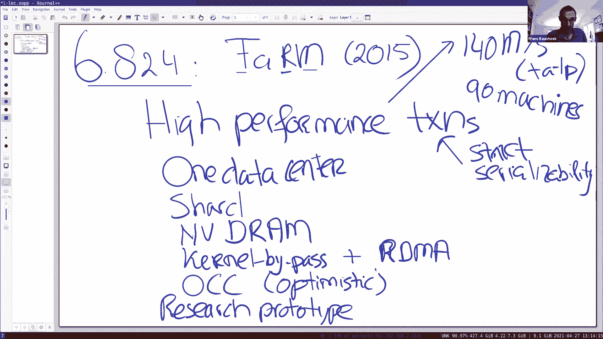

所以这里有 90 台机器，它们通过高速数据中心网络连接，看其中一个，我把它画成一条线，当然，内部是一个交换网络，然后分片，数据分片在这些不同的机器上，根据分片的级别，一些也称为区域。

所以区域是 2G 字节，这些区域分片在，不同的网络，不同的机器上，区域在内存中，所以这是 DRAM ，而不是在磁盘上，所以，你的数据库的全部数据集，必须与你使用的机器的联合 DRAM 相适应。

如果你的数据集大于你当前的计算机集，你必须购买更多机器，拥有更多 DRAM ，这样它们才能适合。他们想使用 DRAM 的原因是，他们想要[]存储设备性能方面的瓶颈，当然，机器可能出现故障。

如果机器出现故障，它会丢失 DRAM ，所以，他们使用复制，他们在多台机器上复制区域，一台机器是一个区域的 primary ，使区域可能被复制到另一台机器上，在备机上，所以使用主备进行复制。

所以这是区域 1 ，区域 2 ，（2的）备份可能在（1的）主机的同一台机器上，作为区域 2 的备份，这里我们有区域 2 的主机。所以这决定了，一台机器出现内核 panic ，或者某个设备死机。

或者只是因为其他原因而崩溃，然后还有第二台机器，它有数据的复制，并从那里继续进行。当然，我们需要某种方法来跟踪，区域到主机和备机的映射，所以，他们使用配置管理器，一个 CM 在这里。

CM 本身与我们之前看过的 zookeeper 相结合，zookeeper 和配置管理器跟踪，从区域编号到主机和备机的映射，对于每个区域。好的？当然，现在这里有一个严重的问题，我讨论过，使用主备方案。

我们会有故障，一台机器可能会出故障，现在机器可以接手，除了一种棘手的情况，到目前为止这个方案不能处理，当出现相关的故障时，例如，数据中心停电，所有的机器都会停机，为了处理这种情况。

DRAM 位于 UPS 上，每台机器都有一个不间断的电源，所以我要画一个大电池放在边上，电池或者 UPS 提供足够的能量，如果发生全局停电，机器会继续运转一小段时间，这一小段时间，机器可以存储。

FaRM 将数据存储在 SSD 上，或者只是刷新它的内存中的内容，所有区域，所有事务状态，所有事务日志，将它们刷新到 SSD 上，所以，如果整个数据中心完全停电，数据中心将在某个时间恢复运行。

它们可以从 SSD 中加载机器的内存内容，重新开始运行，这是唯一使用 SSD 的地方，为了处理数据中心内的多台机器的相关故障。到目前为止，有什么问题吗？好的，让我简单介绍一下软件，所以在区域里。

我们在这里有一个区域，在区域中有一些对象，所以你可以把区域想象成一个字节数组，2G 字节，在字节对象数组中，有一些对象，对象有唯一的标识符 oid ，对象 oid 不是别的。

它是[]区域编号和区域内的地址，与每个对象绑定，这里有一些对象的元数据，对象头部包含一个 64 位数字，该数字包含底部 63 位版本号，然后是一个锁位，我们会在顶部看到。

所以每个对象都有这个 64 位数字，称为版本号，然后我们将看到它在乐观并发控制中起重要作用。应用程序使用这个系统的方式。

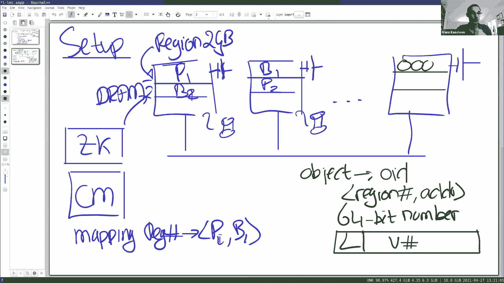

让我稍微说一下，应用程序编程接口是什么。所以 API 是，你启动事务，读取一些对象，这是 read 调用，read 调用将 oid 作为参数，然后，应用程序可以操作，修改对象中的字段，不管什么。

比如加 1 ，然后在某个时刻写入对象，使用 write 调用更新对象自己，然后使用 txcommit 提交它。也可能是这种情况，事务需要中止，因为是乐观并发控制，在这种情况下，应用程序将重试事务，所以。

在这里显示的事务中，只有一个对象操作，但它实际操作很多对象，这些对象可能位于不同的区域，所以它们必须有一些方案，我们将会看到，我们使用类似两阶段提交的协议来执行原子操作，跨不同地区的对象。

关于 API 和设置，有什么问题吗？抱歉，地址 oid ，是在机器本身的地址吗？

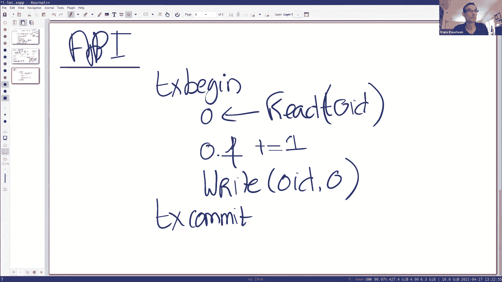

是的，是那个区域内的偏移量。好的？区域可以移动，复制或配置管理器[]映射，对象可能更改的地址，所以这是一个区域编号加上一个偏移量，在这里，我应该设置偏移量。抱歉，我也有一个问题。

创建全局地址空间背后的设计选择或设计思想是什么？把所有东西都放在内存中，我不确定这是否回答了你的问题，但是，它们的全部目标是在内存数据库上运行事务，这是数据库的整体趋势，所有数据始终在内存中。

称为内存数据库，因为 DRAM 很便宜，这将允许你运行事务，不需要访问持久化存储，他们跳上了内存数据库。我明白了，这需要它们共享一个全局地址空间。地址空间是按机器的，每台机器都有自己的地址空间。

从 0 到任何东西，这些对象是全球编号或全局名称。谢谢。

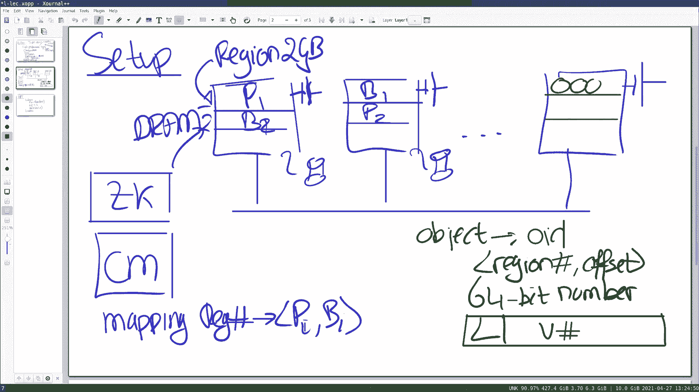

好的，很好。那么我们谈到目前为止，我认为我们已经建立了，他们已经排除了稳定的存储设备，所以，读写存储设备不存在瓶颈，因为他们没有使用它们，一个例外的情况是电源故障。他们关注的下一组事情是是。

试图降低 CPU 使用率，或者试图高效地使用 CPU，并且在网络方面非常高效。这里有两个关键的想法，是众所周知的。第一个是内核旁路，这个故事很简单，我们 FaRM 作为用户进程运行。

在 Windows 操作系统上面，这是操作系统，让我们往边上移一点，所以这是操作系统，操作系统当然，有所有的功能，进程调度，虚拟内存，标准的操作系统，它也有硬件设备的驱动程序。

并且其中一个硬件设备是网卡，通常操作系统驱动程序在里面，对那个网卡编程，所以读写网卡上的寄存器发送包，或者重新配置网卡，等等。应用程序与网卡交互的通常方式是，它们对内核进行系统调用，要求内核发送一个包。

这涉及操作系统，涉及到 TCP 栈，网络栈，它往往相当昂贵，所以他们想要避免这个开销，进入内核，运行 TCP 等，他们这样做的方式是一种被称为内核旁路的技术，网卡是网卡和操作系统之间的协作，它所做的是。

它对网卡的队列排序，这是一些队列，比如发送队列和接收队列，这些队列直接映射或进入应用程序的地址空间，所以，应用程序可以请求操作系统，请取出网卡所有的一些队列，并将它们映射到应用程序的地址空间中，所以。

你可以考虑这些队列，可以从用户级应用程序直接访问，所以用户应用程序现在可以，读写命令或包到网卡，而不需要涉及到操作系统。所以这把整个操作系统都排除在外了，大大提高了性能。在 FaRM 的情况下。

他们也不想使用中断，一种传递包的方式是，当包进入的时候，网卡向操作系统发送中断，然后操作系统告诉应用包已经到达，试图避免这一成本，避免这一成本的方法是，他们轮询接收队列。所以有一个用户级别的线程。

它位于 FaRM 应用程序中，除了读取接收队列之外，什么也不做，查看包是否可用。所以这需要一个[]，这就避免了中断的使用，有一个轮询线程的代价，在那里，除了轮询什么也不做，FaRM 这个线程来回切换。

在运行应用程序代码和轮询网卡之间。所以这是内核旁路，这是一个[合理的标准]，你们中的一些人可能熟悉 DPDK ，它是数据平面开发工具包，是一个可以利用内核旁路的开发工具包。这是一个合理的标准。

在许多操作系统上都可以使用。下一个他们使用的技术，有一点，但也是众所周知，广泛和标准化的，许多网卡支持，或者更高端的网卡支持，这就是所谓的 RDMA ，它表示远程直接内存访问。基本的想法是。

这需要网卡理解 RDMA ，这里有电缆，另一边有网卡，操作系统可能在它的上面，这里我们有 FaRM ，应用程序在旁边，可以把特定的包放入发送队列，发送 RDMA 包，在数据包的头部有一位，表示。

我是个 RDMA 包，然后网卡会将其发送到目标网卡，目标网卡看出这是一个特殊的包，一个 RDMA 包，并查看与 RDMA 包一起的指令，这个指令可能是，读取特定内存位置或写入特定内存位置，举个例子。

假设这是一个读操作，读取操作将安全地获取地址，并且它允许网卡，直接从内存中读取地址，假设这里有我们的区域，里面有对象，发送 FaRM 应用程序可以说，好的，我想读取这个特定地址。

对应于这个对象 o 的地址，将向另一端的网卡发送 RDMA 数据包，网卡是有一个 RDMA 数据包，从内存中读取，存储在特定位置的值，然后直接把它们送回源头。这项技术的酷的地方在于，网卡可以做这个。

根本不需要中断或干扰服务器，它不需要产生中断，不需要在处理器上运行任何代码，运行操作系统，应用程序，相反，网卡具有固件执行这些命令，加载存储在这些内存中的值，请求内存地址直接进入响应包，并发回数据包。

当然，在接收端，这将显示在接收队列中，到目前为止，在某个点上，持有接收队列，并看到 RDMA 的结果。我在这里描述的这个版本，论文将其称为单边 RDMA ，这通常指的是读取操作。教授。好的，继续。抱歉。

教授，你能重复一下，客户端的网卡队列是如何工作的，或者，是的。这几乎没有什么，客户端只有一个读取特定内存位置的线程，表示数据包是否已经到达，当网卡接收到包，放入接收队列中，作为接收队列中设置的一侧。

标志位变为 1 ，应用程序知道那里有一个包。是不是一个特殊的线程轮询？是的，他们的系统里，有特定的线程，专门用于轮询队列。好的，谢谢。抱歉，这里我也比较疑惑，那么，网卡是否与系统合作，正常工作。

就像普通的网卡一样。好的，这不是普通网卡，这个网卡同时支持内核旁路和远程直接内存访问 RDMA ，通常，网卡为了支持内核旁路，这意味着它必须有多个接收和发送队列，它只向应用程序提供一对发送或接收队列。

它不能，当然，你不能让计算机上运行的每个进程都有一个发送接收队列，所以它们通常是 16 个或者 32 个，把其中的一些放到特定的操作系统上，允许一些应用程序拥有发送接收队列。非常感谢。

这也意味着有对 RDMA 的支持，并使它正常工作，所以它需要一个相当复杂的网卡，尽管如今这是一个合理的标准。好的，这是 RDMA 的一个方面，它们还使用 RDMA 进行写入，真正实现 RPC 。

他们在论文中把这个称为 写 RDMA ，基本上是相同的事情，除了发送方可以放入 RDMA 包，说这是一个写操作，将以下字节写入特定地址，这篇论文使用了两个地方或两个东西，这些地方用到了写入。

直接用 RDMA 写入，但还有另外两个数据结构使用 写RDMA 写入，一个是日志，稍后你会看到日志的规则，这是一个事务，所以它有提交记录，日志记录，等等，所以，如果源头将日志记录附加到这个日志。

我可以执行 写RDMA ，然后，接收网卡会，将日志中的新条目添加到指定位置。好的？所以这意味着就像发送者，每个发送方和接收方对都有一个队列和一个日志，所以发送者可以管理和知道，日志开头和结尾是什么。

然后，除此之外，有一些消息队列也是每对一个，这些用于实现 RPC ，所以，如果你想要进行远程过程调用，客户端，发送方制作 写RDMA 包，将数据，消息写入远程消息队列，在目标一侧也有一个线程。

轮询消息队列或轮询所有消息队列，如果它看到一条消息，它会处理消息，然后可以使用 写RDMA 发回响应，使用 RDMA 实现远程过程调用更[便宜]，它比使用某种标准 RPC 包更[便宜]。

数据包使用普通网卡，但没有 RDMA ，在另一边有一个线程响应。好的？这里是否有任何验证步骤，为了确保你只写入内存区域，这是明确允许 RDMA 的，不要写到应用程序内存或其他什么地方。是的。

有各种各样的，这是一种高层次的想法，在这里讨论详细信息，所以，当你设置这些 RDMA 时，为了做这种单边 RDMA 或写入 RDMA ，你首先必须进行连接设置，在发送者和接收者之间有一个协商步骤来设置。

它就像一个 TCP 通道，除了 RDMA 不使用 TCP ，但是它建立了面向连接的可靠、有序的通道，所以，安全检查和访问控制检查，是在设置时进行的。那么，你需要在每一对机器之间执行这个操作吗？是的。

所以这将变得非常昂贵的添加，比如一台机器对一个大集群，是吗？你有 n 的平方个连接，否则我们将有 n 的平方个 TCP 连接，不清楚是不是有很大的区别。为了确认一下，日志中的信息，它们也在内存中。

它们只是在与对象不同的地方。是的，没错，所以如果你这样做，那么这就是右边的这个，是 FaRM 进程的内存布局图片，有一个区域表或一个对象表，在服务器的内存中有区域，这些区域中有对象，除了这些区域之外。

还有消息队列和日志。我明白了，而且为了让网卡支持从内存直接访问，由于我们在这里没有涉及任何软件，网卡可以直接访问内存，甚至不需要通知应用或操作系统，不应该在硬件层面上进行一些协调。

或者至少从处理器支持这个特性。是的，所以，网卡可以原子地读写缓存行，为了支持这一点，有一个接口在内存系统和网卡之间，必须在操作系统仔细设置，当连接设置完成时。我明白了，谢谢。抱歉。

右侧的 写入RDMA 是红色的，那里发生了什么？所以，发送者，左边的机器可以执行 写入RDMA ，发送 写入RDMA 包到右侧，到右边的目标，网卡会看到这是一个 写入RDMA 包，并将写入网络来的内容。

写入 RDMA 命令中指定的地址。但这将是。所以有一台远程机器，可以写入内存地址在目标机器上，在没有服务器参与的情况下，当然，除了设置之外。谢谢。所以，我有个小问题，所以队列和网卡只用于读 RDMA 。

（因为）写入直接到接收者的内存。是的，在，好的，在写入 RDMA 中，你可能在报纸上注意到的，可能会有确认，所以，如果发送方发送写入 RDMA ，它可以等待来自接收网卡的确认。

表示执行了写入 RDMA 。好的，谢谢。这将发挥重要作用。关于这一部分，还有什么问题吗？这是一种很酷的技术，在过去的十年里，这种情况相当普遍地出现，他们想要利用这一点，因为这让他们获得延迟。

进行单边 RDMA 约为 5 微秒，所以非常低的延迟，非常快，例如，读取或写入磁盘，比写入你自己的内存慢不了多少，非常快，因为它允许你做一微秒，每秒一百万个包，令人印象深刻。好的？到目前为止。

这是标准技术，前沿的，但是标准的。

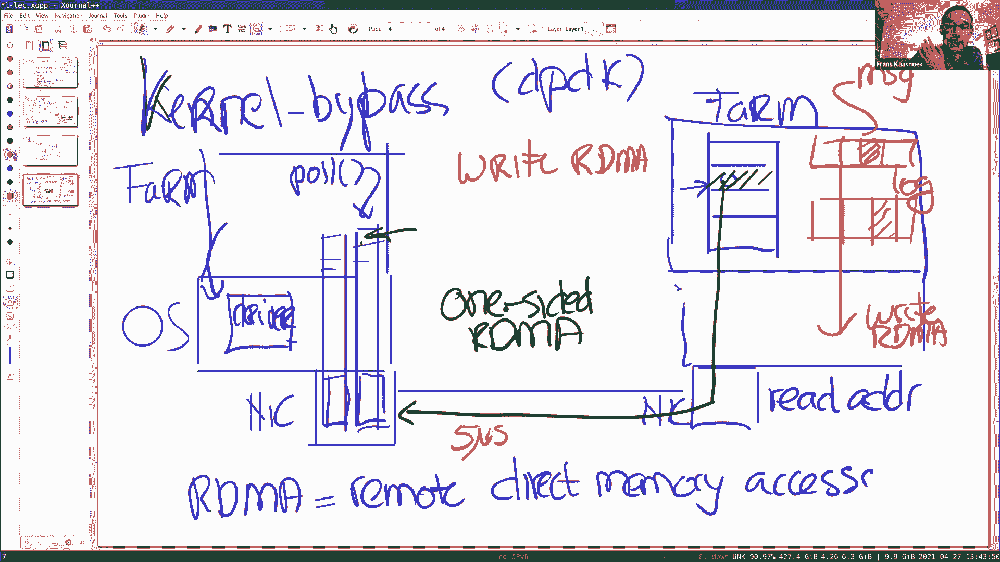

所以，这篇论文解决的真正挑战是，是如何使用 RDMA ，写入 RDMA 和单边 RDMA 进行事务，所以，论文所解决的挑战是事务使用 RDMA 。你可以看到这是一个挑战，我们必须考虑一下。

到目前为止我们看到的所有协议，事务的协议，两阶段提交等，所有这些协议都需要服务器端参与，例如，我的意思是，客户端发送请求到事务协调者，发送请求到其中一个参与者，比如获取某个对象的锁，等待服务器或接收者。

直到锁变得可用，或者服务器运行一些验证步骤，查看事务是否能被提交，所以在所有这些情况中，如果你有一些服务器端参与，意味着你必须在服务器上运行代码，这与 RDMA 给你带来的是相反的。

RDMA 没有为你提供在服务器上运行代码的能力，所以，这篇论文的设计者或作者，必须想出一种协议，允许你实现两阶段提交和事务，不使用或试着减少服务器端参与，他们可以重用 RDMA 进行某些操作。

有些使用远程过程调用，像传统做法一样，在过去的几周里我们看到的传统设计。这就是这篇论文的核心挑战，这促使他们朝着这个方向去解决这个问题，他们使用的高级策略是，使用的高级策略是乐观并发控制。

他们真正的闪光点是在读取操作上，因为基本计划是读取对象，这些是不需要锁的事务部分，例如，需要锁，这意味着可能会中断服务器，服务器必须做一些工作，可能会阻止客户端，直到锁可用，然后返回对象。

这与 RDMA 并不是很合适，所以，他们将采取乐观的方案，其中读取对象不需要任何锁，你获取一个对象并开始使用它，正如我们将看到的，当然你需要一些机制，来发现读取的是旧版本还是新版本。

这就是版本号将发挥重要作用的地方。所以当你读取 FaRM 中的一个对象，你把对象拿回来，你也把那个对象的版本号拿回来，然后基本的想法是，在提交的时候，我们要做一个验证步骤，检查事务开始时写入的对象。

已经被修改了。所以，在验证检查步骤期间，我们要检查冲突，冲突是，如果版本号已递增，从协调者读取了对象，所以如果版本号是不同的，是不同的，则事务中止，如果仍然是一样的，这意味着没有其他事务修改了对象。

然后我们可以继续并提交。当然，在中止的情况下，通常会发生的情况是，客户端可能会再次运行整个事务，也许在开始之前等一段时间，一段随机的时间。所以这就是基本的计划，这是一个乐观的方案。

这样读取可以完全利用 RDMA ，正如我们将看到的，读取不需要服务器上的任何状态变化。所以这是图 4 背后的基本思想，除了，我们很快就会看到，这件事要复杂得多。所以这也是，我想我用过了这个短语。

几节课前，乐观方案与悲观方案相反的是，你假设你被允许执行操作，如果你不被允许，只需要道歉和中止，在悲观的情况下，你首先通过获取锁来请求批准进行操作，然后你被保证，在提交时，你可以提交。好的？

对于高级别的乐观并发控制，有什么问题吗？只是一个关于版本号的问题，他们如何确保两个不同的[]，两个不同的对象之间具有一致性，你先读取一个对象，然后再读取另一个对象，但是一个事务修改了其中的一些。是的。

这是个很好的问题，所以，我想我们要离开了，只需要深入到图 4 ，我认为这是论文的核心。让我们看一下图 4 。

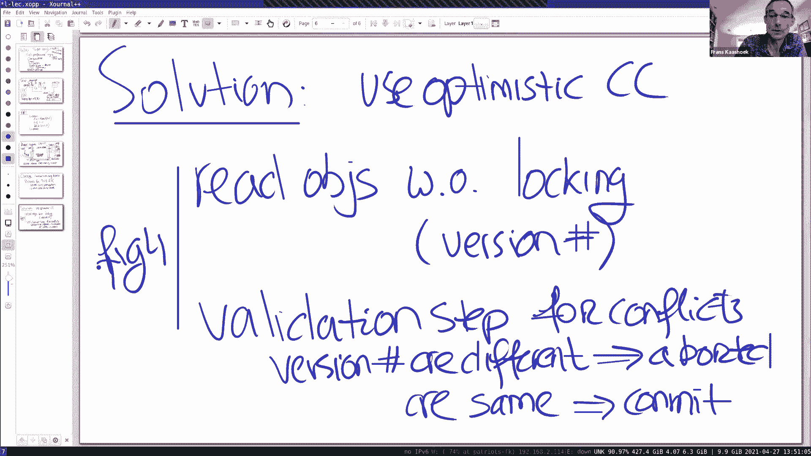

糟糕，不是那个。

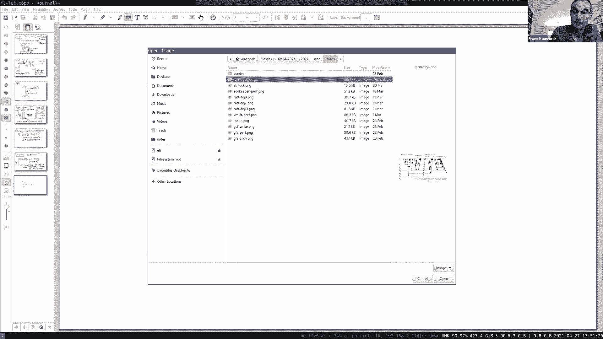

好的，这是图 4 。

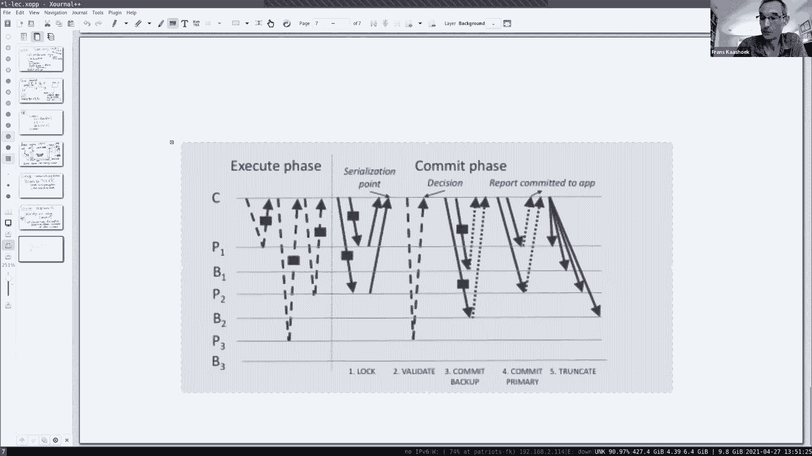

我们将花相当多的时间来讨论图 4 。所以图 4 中的第一个东西。

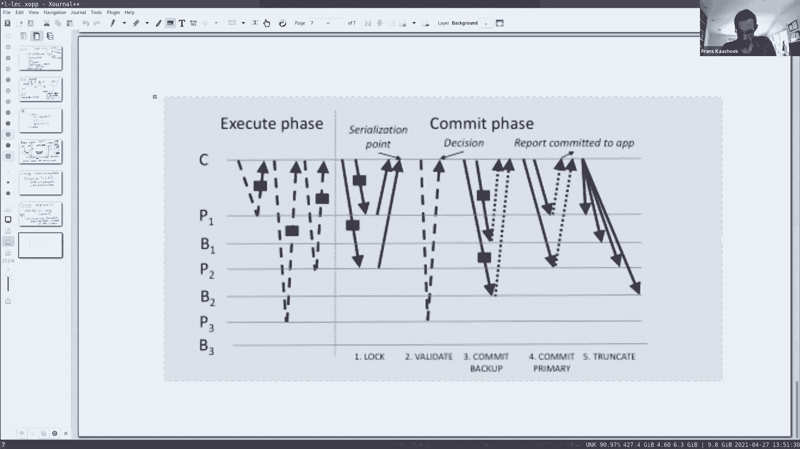

我们看到。

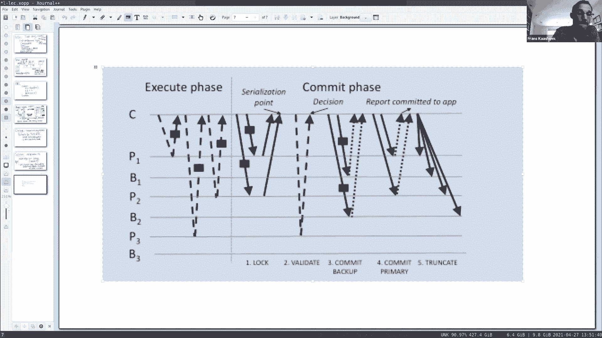

所以我们有一个事务协调者，这里的 C ，事务协调者是一个应用程序，应用程序运行在相同的机器上，是 90 台机器中的一台，但我会这样考虑，对于剩余的课程，它在一台单独的机器上运行，我不太关心它，好吗？

然后，有不同的分片，在这种情况下，有 3 个分片， 1 2 和 3 ，每个分片被复制两次，一个在主服务器，一个在备服务器。然后我们会看到，这是事务的执行阶段，所以事务有两个阶段，一个是执行阶段。

然后是提交阶段，在执行阶段期间，这是事务运行的地方，那么它执行开始，执行读取，例如，在这种情况中， 3 个对象被读取，一个位于，它的主服务器，一个对象在分片 1 ，一个对象在分片 3 。

一个对象在分片 2 ，区域 2 。我们可以看到，我们向前看一点，我们将会看到，两个对象正在被写入，一个正在被读取，所以，来自分片 3 的对象，这是一个读操作，这些是写操作，或者这些是读操作。

但这些对象将被修改。所以，随着事务的运行，它从不同的机器获取对象，在本地修改它们，然后在提交阶段，应用更改，当然，这里的整个挑战是，最终，我们希望实现严格的可串行化。在某些方面，协议。

至少写入的协议总是遵循非常类似的两阶段提交协议，这是我们过去看到的，在细节上有所不同，但基本策略是相同的，我们可以，我们假设我们已经完成了执行阶段，所以我们在事务的末尾，事务将尝试提交。

事务可能会有两种结果，成功提交或中止，中止是因为其他事务同时运行，并且修改了其中一个对象，我们写入或想要写入。所以，第一件事，协议的提交阶段有 5 个步骤，加锁步骤，验证步骤，提交备份步骤。

提交 primary 步骤，然后是截断，截断运行得[很慢]，所以这并不是很重要，从我们的角度来看，有趣的事情停止的地方就是这里，这就是事务的结束。好的，这些对象之前都说过，当你读到它们，有一个版本号。

这是一个版本号，在本地修改它们，然后在这一点上，这是提交点，当应用调用结束事务时，整个提交阶段协议才起作用。所以它做的第一件事是，所谓的锁步骤，步骤 1 ，这一步的目标是，获取正在写入的所有对象的锁。

所以我们可以看到，根据这张图，显然有两个对象正在被写入，即这个对象，因为上下文是分片 1 ，区域 1 ，然后这个对象被读取，它位于区域 2 ，显然，我们读取第三个对象是 primary 3 的。

它没有被写入，因为它不参与锁阶段。所以在锁阶段，箭头有各种不同的含义。所以这些虚线箭头是单面 RDMA ，这些对象是使用 RDMA 读取的，它们从远程内存位置获取，[]本地到应用程序或协调者的内存。

实线的是写入 RDMA ，在这个案例中，它们依赖于主服务器的锁条目，所以主服务器有一个日志，每个主服务器都有一个日志，所以我画成这样，使用不同的颜色，所以这里我们有 Pi 日志，协调者。

这是一个提交记录，不是，抱歉，锁记录到日志中，我让它是一个大的记录，我可以写下里面的东西，它是版本号，读写时间，当对象被读取时，版本号从这里出来，回到日志记录中的，读取的对象 id 和对象的新值，所以。

这条记录追加到，primary 1 和 primary 2 的日志，使用写入 RDMA ，所以这些机器上有一些线程，查看这些日志，然后执行一些操作，所以在这个案例中，有线程在 P1 P2 上。

监控、旋转或轮询这个日志，看到有一个新的日志记录，然后在这种情况下，它会做什么，它将尝试获取对象的锁，在事务中列出的，在某个地方，有一个对象，对象中包含一些数据，它里面有这些锁位和版本号。

所以 P1 有一个对象，这是由协调者修改的，P2 有另一个对象，由协调者修改，primary 尝试获取对象的锁，使用 test-and-set 指令，所以，它将尝试设置锁位。

使用 test-and-set 指令，如果锁位为 0 ，锁位是 0 ，并成功地将位设置为 1 ，然后 primary 知道获取了锁，在这种情况下，我们将发回一条 RDMA 消息。

将消息附加到协调者的消息队列，说好的，你成功地获得了这些对象的锁。如果锁已经被另一个事务获取，然后在那个时间点，事务被中止，所以当 primary i 试图获取锁的时候，发现锁已经设置好了。

使用 test-and-set 指令，然后试着获取锁会失败，primary 将添加一条消息，到协调者的队列中，说，我不能获取锁，在这种情况下，协调者将中止事务。到目前为止，还有什么问题吗？

这些锁是如何获取的，通过 zookeeper 吗？不，是另一套锁使用 zookeeper ，是为了进行配置管理，比如区域编号到 primary 和 backup 的映射，这些只是内存锁。

由 primary 维护，所以在地址空间中。

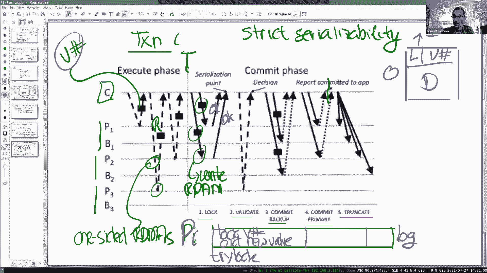

稍微向后一点，回到这张图片上，有一个区域有对象，每个对象都有一些数据和头部，在那个头部中，有一个 64 位编号，最高位是锁位，其他 63 位是版本编号。

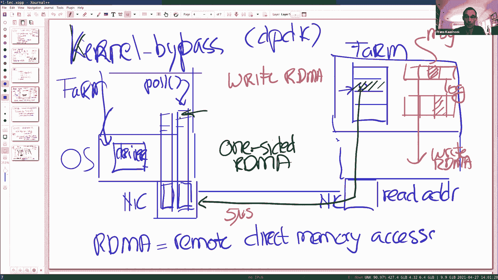

哦，如果 primary 停机怎么办，backup 是否有与 primary 相同的锁？如果 primary 停机，接下来会发生的是，有一个完整的重新配置协议，在一个新的恢复协议中，其最终结果是。

在这种情况下，我们希望事务会中止，因为它不会到达最后。我们稍后会讨论容错，所以让我们来，我会再讨论几个白板，我会谈到容错。谢谢。所以版本号是每个对象的，对吧？当然，每个对象的，是的。[]。好的，那么。

好的。我能问个问题吗，为什么他们选择中止事务，而不是阻塞并等待锁被释放？因为它们读到了旧的[材料]，它们没有读到最新的值，所以，事务必须中止。哦，我明白了，因为锁意味着下一次它会改变。好的。

它们在写完对象后才要求加锁，协调者基于某个版本号修改对象，提交了一些写入，假设写入最新的版本号，这个时刻，提交开始，然后你试图获取锁，你发现另一个已经获取了锁，这意味着其他人已经修改它了。

所以这会违反串行化。是的，谢谢。所以，你在这里得到锁的时候，这在某种程度上是写事务的串行化点，在这个点，事务已经获取了所有锁，对于所有被修改的对象，在这个时间点上，其他人都不能修改。

这在某种程度上是事务的写入部分的串行化点。能理解吗？是的，谢谢。好的，现在你可能会觉得，为什么不对读取做同样的事情，获取读取对象的锁，从读取的对象中获取锁，检查版本号[]。原因是这是一个独立的阶段。

即验证阶段，是为了避免这些昂贵的写入 RDMA ，如果你看这个竖直的步骤，你将看到有一个写入 RDMA ，服务器必须运行一些东西，基本上是获取锁，然后用另一个写入 RDMA 进行响应。

所以这是一个完整的 RPC ，需要服务器的参与，正如我们稍后将看到的，为了处理对象已被读取，FaRM 使用这个校验步骤，在验证步骤中，仅使用了单边 RDMA ，所以，不需要真正的服务器参与。好的？所以。

发生了什么，所以我们在这一点上，事务协调者具有写锁，现在它唯一做的就是，它验证读锁或读版本号，所以，对于每个已读取但未修改的对象，在我们的示例中，只有一个对象，这是那个被读取的，区域 3 的那个。

所以它是单边 RDMA 读取版本编号，那个正在读取的对象的 64 位编号。当它回来这里的时候，它检查两件事，如果锁被获取，锁位被设置，这意味着一些并发事务正在试图修改，所以在这一点上，就中止。

所有事务再次中止，如果第一个数字是[相同的]且未锁定，这意味着在此特定时间点没有使用其他事务，事务可以继续进行，所有读取和修改的对象，在事务开始时具有版本号，一切都还没有改变，所以，事务提交是可以的。

它是真正的串行化点。而且由于事务编号，在开始时需要版本号，在事务开始时，事务将按照版本号的顺序提交，它们将获得严格的可串行化，因为在你的事务提交后启动的任何事务，都将具有更高的版本号，所以。

它也会晚点提交。好的，这就是那个点，事务协调者说，在这一点上，我们知道我们必须获得锁，我们已验证读取对象的版本号，所以，这是提交点或提交点的开始，所以这一点是在说，好的，我要提交了。提交点需要多条消息。

我们一会儿就会看到，这些主要是出于容错的原因。所以在这一点上，只有 primary 已经，只有 primary 已经联系正被修改的对象，但不包括 backup 。当然，我们想要确保这一点，并写下。

一旦你提交，就能容忍 f 个故障，系统设计为处理 f+1 个故障，在我们的设计中，有一个备份，所以它只能容忍一个故障。所以发生在最后一个阶段，提交备份阶段，是我们要写入备份的日志，所以备份有日志。

所以这是 Bi ，类似的，里面有一个日志条目，我们要做的是，写下所谓的提交备份记录，提交备份记录与锁记录相同的信息，我们之前看到的，所以，它将包含版本号 oid 和新值。好的？像之前一样。

这是使用写入 RDMA ，现在，备份在这一点上并不需要执行任何操作，备份服务器端不需要运行任何东西，所以这是这个技巧，发送者等待网卡的确认，所以这不是单方面的，也不是写入 RDMA 。

这只是确认它已获得写入 RDMA ，并且已经执行了写入 RDMA 。所以，这是在确认，当我们在协议中这一点时，事务协调者知道，对象在所有 primary 的日志中，以及对象在所有备份日志中。

所以现在我们在容错性方面处于有利地位，因为如果两者中的任何一个失败了，另一个可以应用写操作。然后还有一个步骤需要执行，那就是提交 primary ，稍后我会更详细地谈到，但这是最后一步。

更多日志记录写入，在 primary 中，也就是提交记录，提交记录是正在提交的事务 id 。所以像每个，我没有把它写在其他记录里，但是每个记录都有一个事务 id ，我们知道我们谈论的是哪一个事务。同样。

这也使用了相同的策略，有一个写入 RDMA 要附加到日志，有一个网卡确认写入 RDMA ，但它不需要任何中断，或者没有服务器，本身不受干扰，只有网卡参与了这两个操作。一旦其中一个网卡确认提交记录。

在一个 primary 上，在那个时间点，它是真正提交的，所以这是真正的提交点，提交从这里开始，这是实际的提交点，在这个特定时间点上，事务协调者通知应用程序，是的，你的事务已经提交，并且已经完成。当然。

稍后某个时刻，日志需要清理、缩短和截断，诸如此类的事情，这就是截断阶段，这是[]后面的锁阶段和验证阶段，所以我不会讨论它，但是，它们必须截断日志，这样它们不会无限生长。抱歉，硬件会起作用。

它们只是直接进入协调者的网卡？是的，让我们回到 RDMA 的图片上。

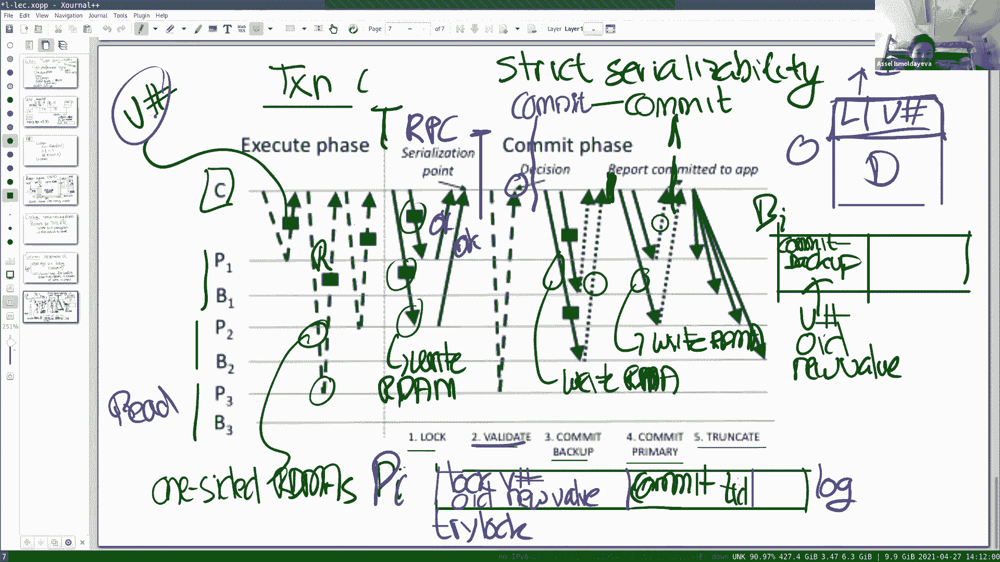

如果发生写入 RDMA ，所以这是写入 RDMA ，发送者协调者在这里运行，这可能是 primary 和 backup 之一，所以写入 RDMA 进入，可能写入一个条目到日志中，网卡发回一个确认。

协调者将在接收队列中看到确认，一旦协调者看到它的写入 RDMA 的 ack ，它可以继续。

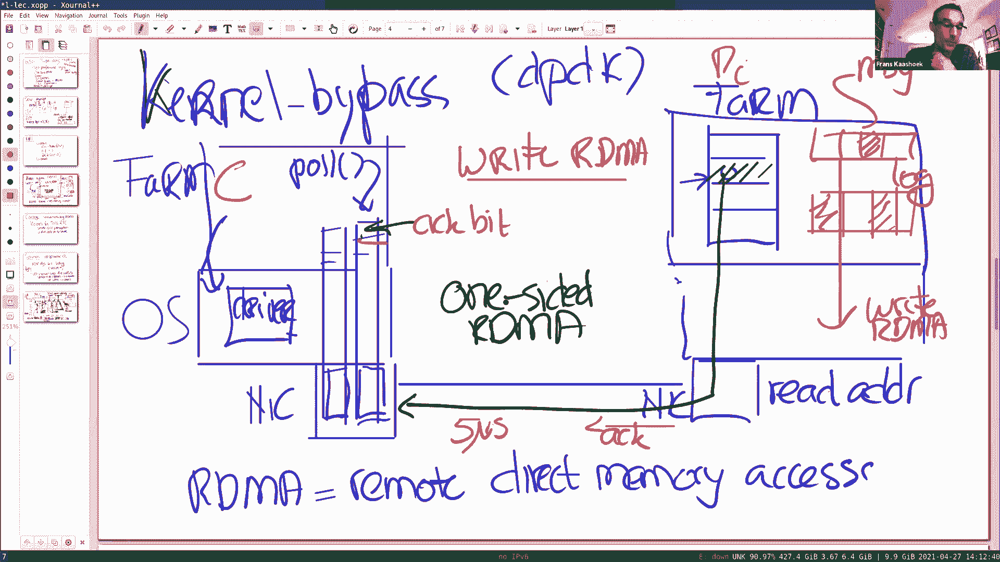

并且知道写入 RDMA 成功了。所以写入 RDMA 只是写入日志，它们。它们用在两种情况下，它们用于这些消息队列和日志追加。所以，当我们说已经执行了写入 RDMA 时。

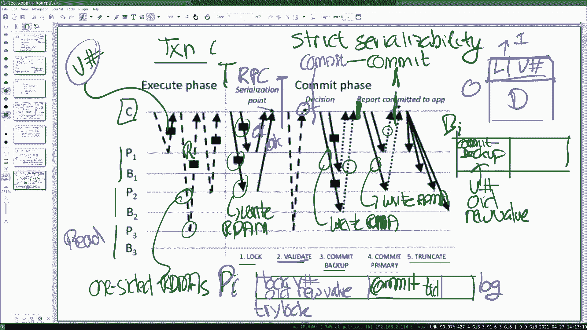

我们的意思是它已被附加到日志中，并不一定由应用程序实际执行。

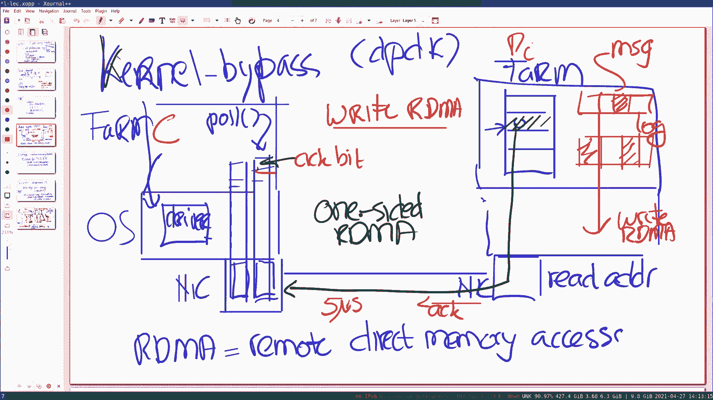

对，对，例如，例如，备份执行对象的更新，你需要读取日志条目，然后应用更新。我明白了，还有每个对象的锁位，由于一切都驻留在内存中，我们有 64 位的版本号加上锁位，所以我想它可以放入一个单一的内存地址。

但我们仍然会有这样的问题，假设处理器将该内存地址提取到寄存器中，然后，如果我们有一台多核计算机，然后另一个内核获取相同的地址，然后它们都从 0 翻到 1 ，所以我假设有一些来自硬件的支持？是的。

就像我之前提到的，当 primary 获取，primary 涉及到，所以协调者发送，所以在锁阶段，这个阶段一，primary 或 coordinator 发送写入 RDMA 到 primary 。

要求 primary 将对象加锁，primary 用一条信息明确地回答，然后回复，所以发生的这一关键步骤是，当 primary 试着获取锁，锁已经设置了，这是一个单一的 64 位数字的原因。

是因为你可以使用 test-and-set 指令，它是原子地设置锁。所以，永远不会有这种情况，当两个 test-and-set 指令完全同时运行，一个会赢，另一个会输。我明白了，谢谢。这是一个关键点。

我有一个关于蓝色提交点的问题。嗯。它不会，所以。我应该，让我，也许再打开一张带有图片的新幻灯片更好。

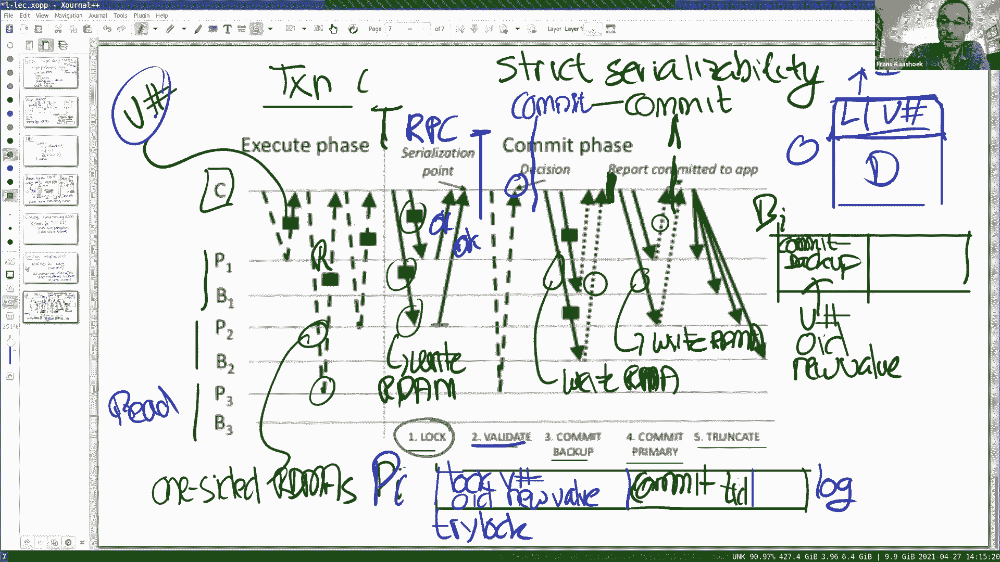

不是在这个上面继续涂鸦，我是说，我们再来一张图，这样我们就可以讨论其他场景了。

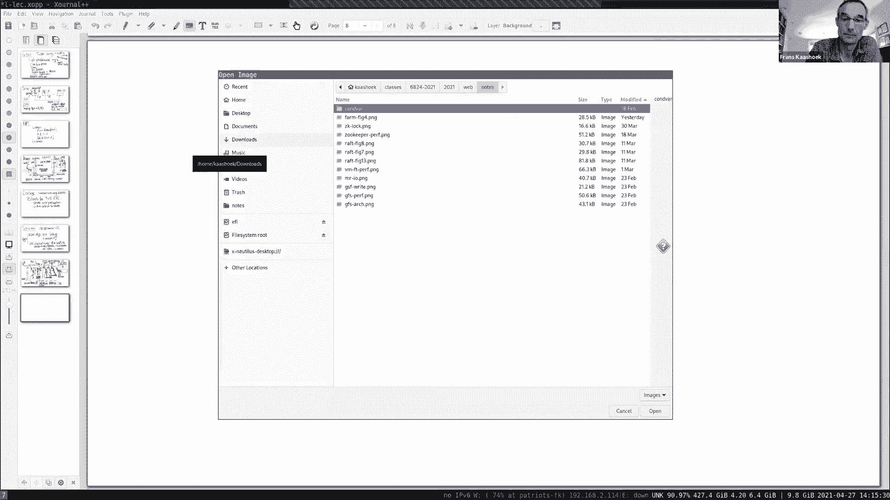

我想再大一点。

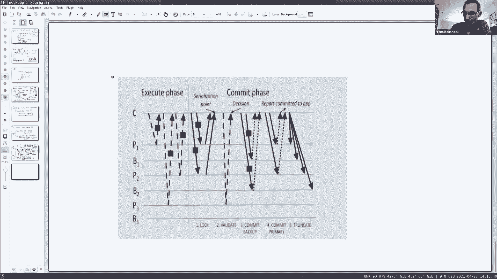

我认为应该这么做。好的，所以你担心的是。

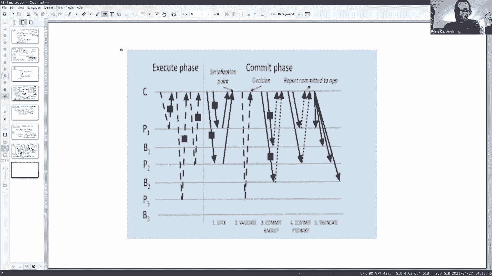

让我看一下。是的，那个提交点在步骤 2 和步骤 3 之间。是的，这是[决定点]。是的。开始提交，然后是实际提交点。好的，我想我是在想这个场景，对于一个完全独立的并发事务是否可能，只写入 P3 进行交错。

在那个空间里开始和完成，然后这样不是？不，[]，是的，我们有问题，但不能，因为当它写入时，它在某个点上获得锁，当我们获得锁时，我们检查版本号和锁位。但是，读取 P3 会影响版本号和锁位吗？不。

它只获取版本号。但如果你，让我保留这个问题，你会回到这个问题上。好的，我们看看会发生什么？好的，谢谢。还有其他问题吗？这可能像是一个单独的场景，但如果你在执行阶段之后，会发生什么，它试图获取一个锁。

然后就在那之后崩溃了，锁已经被获取，但在那之后，其他任何人都无法获得它。是的，好的，首先，机器从地球上消失了，内存内容也消息了，在整个恢复协议中，在论文的下一节描述的，协议最终中止了事务，所以。

它将得到清理。再问一个问题，所以这里协调者是客户端，就像应用程序一样。是的。所以客户端做所有的步骤，比如 lock 。是的，所以你可以考虑，应用程序在 90 台机器上运行，运行这个事务，很显然。

写入两个对象，读取一个，并且运行这个协议。所以，我想令人困惑的是，所以 primary 并不直接与 backup 通信吗，它是。不，是这样的，primary 不直接与 backup 通信。我明白了。

除了在恢复协议期间，有各种各样的通信发生，但并没有在这里展示。所以，协调者使用来 zookeeper 的配置？

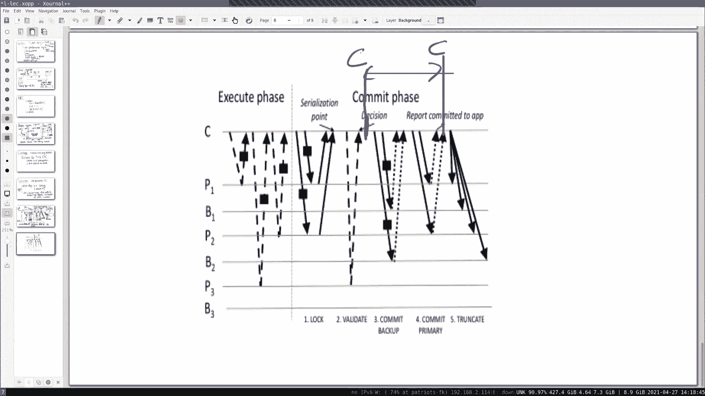

是的，回到第一张图片，有各种各样的事情和这个有关，我不是在谈论，这种精确的关系之类的事情，但是由 zookeepr 和连接管理者决定，这是我们运行的当前配置，这些是区域。

它们如何映射主备份和所有这些内容，在任何失败发生时，有一个完整的重新配置进程并恢复。我明白了，谢谢。

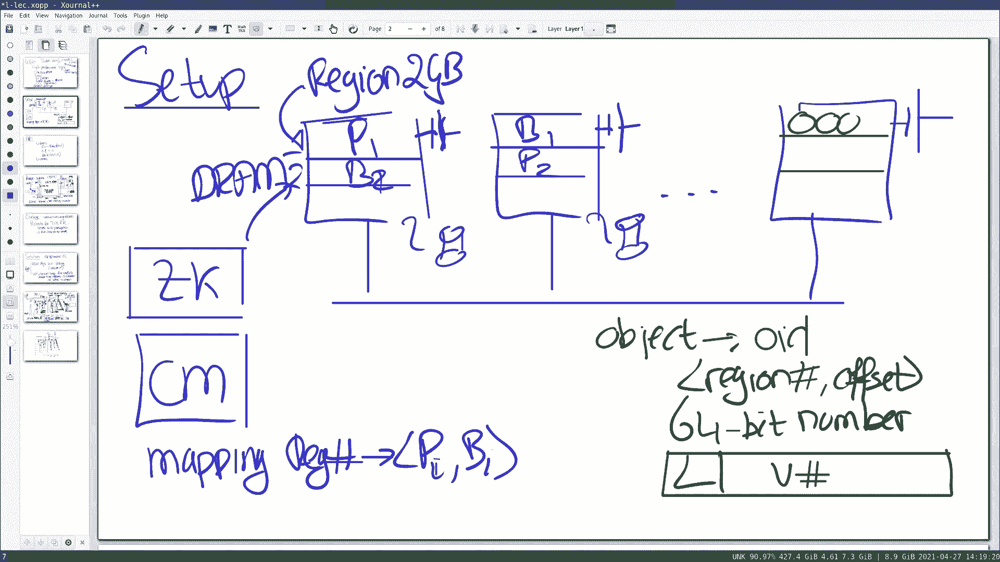

好的，也许我会跳过分组会议室，所以我可以走得更远，我想要回答的问题，在课程中贴出的，课程问题，我将通过谈论一个事务的例子来回答，这也涉及到之前的问题，会发生什么，两个事务运行并读取一个版本。

然后它提交了，等等，这些东西。所以这是我们要讨论的话题，我们是否得到了严格的可串行化？我要做的是，我不会给你严格串行化的证据，相反，我要做的是，我来举一两个例子，建立一些直觉，希望直觉能让你确信。

事情可能是好的。那么让我们来看下面的事务，我们有 TxnBegin ，这个事务是，在一开始，它读取一个对象，加 1 ，然后写入对象，提交或以失败提交结束，所以这是一个事务。我们想问你自己。

合法的结果是什么，正确的结果是什么。那么，这个事务可能的结果是什么，会是什么状态，假设 x 从 0 开始，我们运行两个事务， T1 和 T2 ，有哪些可能的结果是好的。它们中的一个可以提交。

或者它们两个都可以提交？是的，所以我们可以得到 x=2 ，两个都提交，x=1 ，可能一个提交，另一个中止。一般是两个同时运行，还有其他可能的结果吗？0 。是的， 0 ，如果两个都中止了，也许崩溃了。

好的，这就是三种合法的结果，你必须确保是这样的。假设 T1 运行，执行一个读取操作，将 x 从版本 0 取回，T2 也是一样，它读取 x0 ，所以它是真正地同时运行，这是我们问的问题，那个锁的问题。

我们执行对 x 加锁，我们执行对 x 加锁，这是关键的一步，因为在这个时刻，我们试图获取对象 0 的锁，两个都能成功吗？在读取中吗？在获取 x 锁的过程中。哦，在获取锁的时候，不是在同一时间。

所以一个会成功。我们假设第一个成功，并获得了锁，这意味着它可以提交，所以这个会提交，那个第二个会发生什么？第二个，如果它同时试图获取锁，第一个持有锁，它将中止并停止，如果第一个事务通过并且锁被释放。

然后它将获得锁，然后检查 x 的版本是否仍然正确，它会发现版本已经被更改，然后它会中止。是的，是这两种情况。所以让我稍后来谈谈验证案例，使用一个稍有不同的例子，也许更有趣，但这就是结果。很好。

所以即使这张图中的事务，同时运行，它们也是排序的，一个赢了，另一个输了，这意味着另一个输了的可以再次运行，然后它将读取 Rx1 ，然后希望在重试中成功。好的？好的，所以。好的，让我举个例子。

然后我会停下来，在周四继续，现在时间是 24 分。让我停在这里。

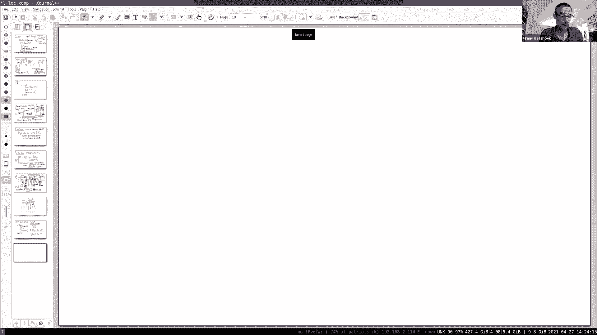

然后我会做第二个例子，回答前面的问题，在周四，也会讨论一下容错。我不想超过太多时间，任何人必须离开，请随意离开，我们周四见，如果有人想问更多的问题，可以继续停留，我会尽最大努力回答它们，如你所见。

这是一篇复杂的论文，我很高兴我们，我们能够深入，并试图理解，至少是正常操作的协议。说到这里，我想结束这节课，周四再见，或者如果你有任何问题，请留下来。我有两个高级别问题，一个是。

他们使用的这个整个硬件结构，它是否有用，如果你将它与悲观并发控制一起使用？是的，我相信你也可以让悲观协议变得更好，因为 RPC 更便宜，但真正的东西，我还没能指出这一点。

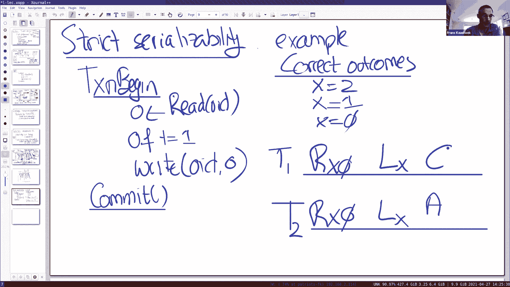

但我试过了，我现在可以做，如果你看一下这里的只读事务，只读事务，如果这里的事务只读取一个对象或多个对象，性能会怎么样，会有多好，它的表现会有多好？可能很好，因为你只做单边的（RDMA）。是的。

如果你看一下保存在区域 3 的对象，它是被读取的对象，唯一发生的事情是单边读取或单边 RDMA ，没有写入，什么都没有，所以，因为这个，因为读取操作不需要锁，没有什么可写，唯一需要做的就是这个验证步骤。

也是单边 RDMA ，所以只读事务，你可以只使用两个单边 RDMA 运行，这就是好处的来源，而这一点的原因是，因为是乐观并发控制。所以我认为利用 RDMA []，我试着让只读交易变得非常快。

它们必须是乐观并发控制。好的，我明白了，有道理。另一个问题是关于安全的，这东西安全吗，如果它是，我想已经有人已经问过这件事，但是网卡读取内存的那部分，这看起来有点吓人，所以。是的，真的很吓人，所以。

有一系列的交互，当设置 RDMA 时，在操作系统和应用程序之间，所以，操作系统不允许网卡写入任何任意位置，会告诉它，这里的地址，这是你可以写入的虚拟内存地址。好的，所以你可以让它[]。好的。没错。

关于性能的问题，所以读取是很快的，因为单边的 RDMA ，但如果你有大量的写入，比如大量的数据和争执。是的。所以这种情况，还是。不，如果有争执会发生什么。

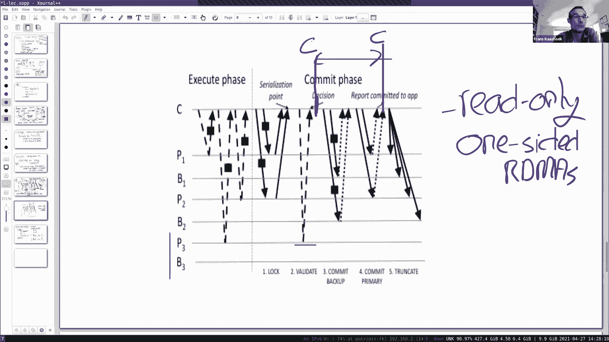

我们在这个案例中看到了，如果我们有很多争执，其中一个事务将中止，所以这是对事务有好处的，不[]或不写入相同记录或相同对象。甚至是读取，是吗？是的，即使是读取，因为版本号可能会改变。那么。

我想主要的用例是什么？有很多研究独立于这个论文，关于悲观与乐观并发控制，从这两个基准中，他们在论文中使用的，比如 TPC-C 和 TATP ，没有太多的冲突，所以可能是由不同的用户或不同的客户端提交的。

它们接触的是不同的[表]。我有一个问题，如果有多个客户端在同一对象上执行事务，它们想要执行写入 RDMA ，写入到日志，有没有可能会发生冲突，比如其中一个会重写另一个日志，或者。不，不，每对都有一把锁。

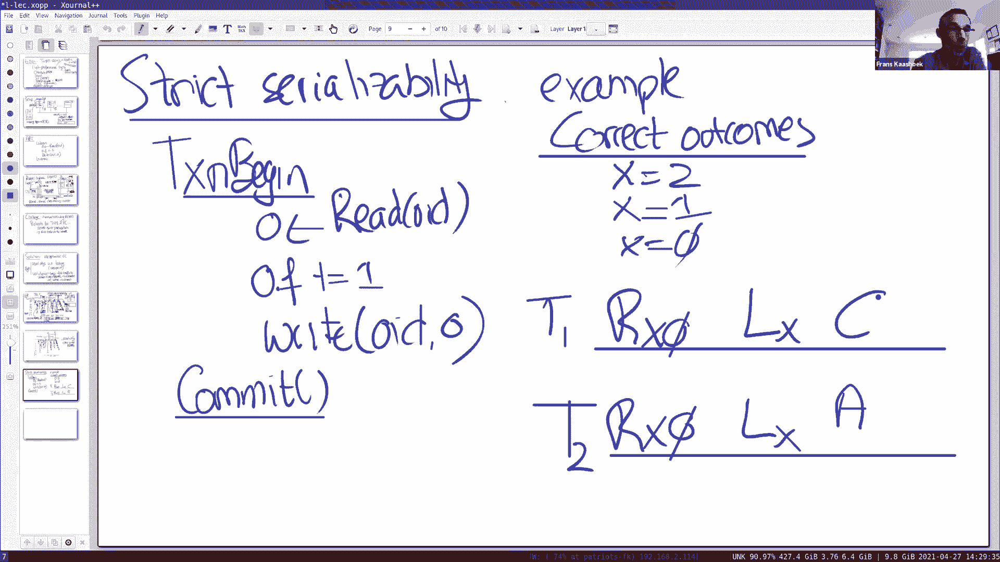

每对都有一把锁，好的。所以，这正是原因所在。

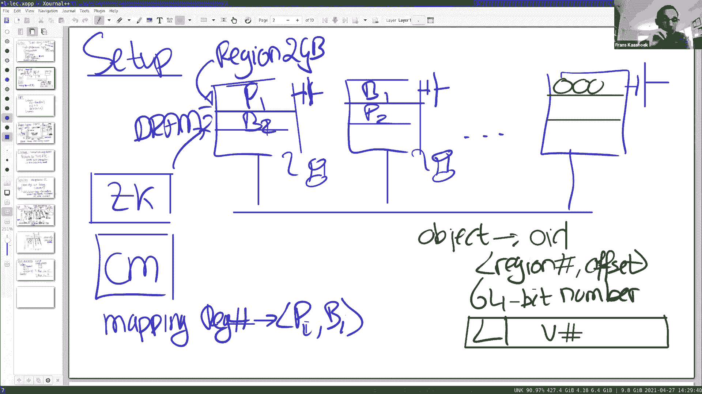

然后，但是在事务中，比如时间，它是否提供可串行化。

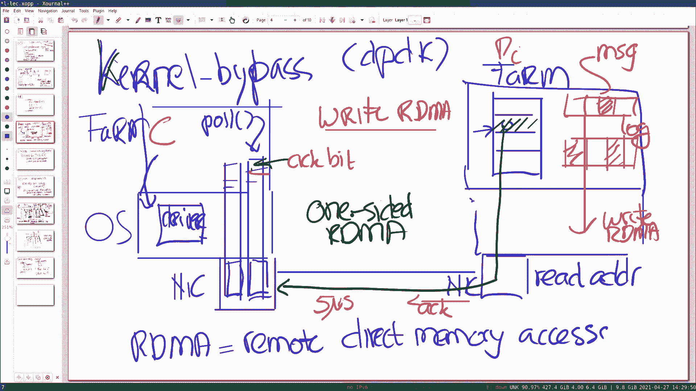

时间基于什么？基于版本号。这里没有 TrueTime 或类似的东西，这些逻辑编号，就像实验 3 中一样，你有逻辑编号，用于实现键值存储，这些编号起到了同样的作用。如果两个事务得到了相同的编号。

那么只有先到达提交点的那个才会。

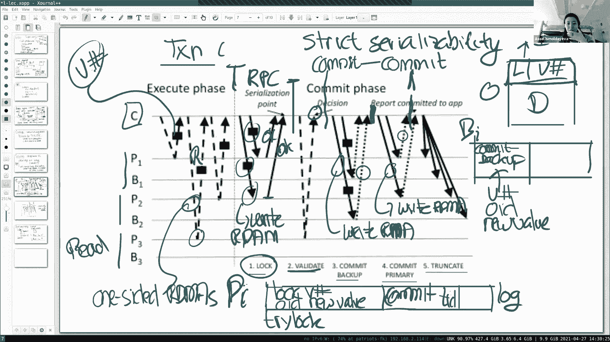

好的。是的，就是这个案例，一个中止，另一个成功。好的。如果在每一对之间建立了消息队列，那你怎么知道，你将拥有多个消息队列，给 primary ，你怎么知道读取这些东西的顺序，而且不会乱读它们的顺序。

你以相同的顺序读取同一来源的所有消息，因为它们都会在一个队列里，所以一个来源写入一个队列，多台机器同时写入不同的队列，你不知道顺序是什么，所以，它不能影响协议的正确性。我明白了。

所以我们不依赖于传入并发消息的顺序。没错，你是按一定的顺序轮询的，然后你按一定的顺序轮询队列，这就是要处理的方式。明白了，还有一个更具体的问题，论文中的一部分提供了无锁读取，也就是我们刚才谈到的。

但它也表示，它还提供了本地线索，使程序员能够将同一组机器上的相关对象相互关联。是的。我不理解那个，句子的后半部分。好的，我得查一下细节是什么，但我想你指的是，如果你的对象在各种不同的区域。

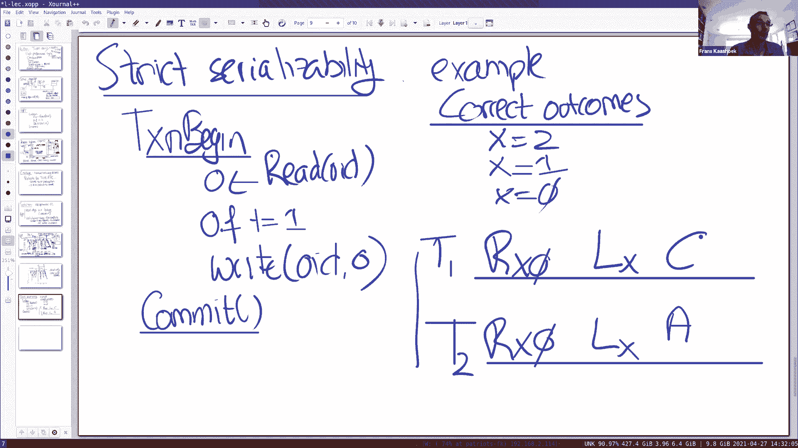

比如，让我们看看这张图片，然后你必须和很多不同的 primary 进行交互，如果对象 1 在这个 primary ，对象 2 在这个 primary ，如果你接触到很多，如果你总是接触一个集群的对象。

这是好的，如果所有对象集群都在同一个 primary 上，所以你只需联系一个 primary ，而不是多个。我明白了，谢谢。还有什么问题吗？所以 FaRM 不是很适合长的事务，因为大多数。是的。

你担心长的事务会导致冲突。我的意思是，我猜只读交易，因为我们为它们做了优化。是的，当然，很多事务人们都在研究，你在 Spanner 论文上也看到了，其中很大一部分事务是只读事务，但这显然是工作量所致。

我想回到我之前的问题，我想我意识到，我误解了严格串行化的基础，是不是，严格，好的，这是一个情况，假设有一个事务先开始。

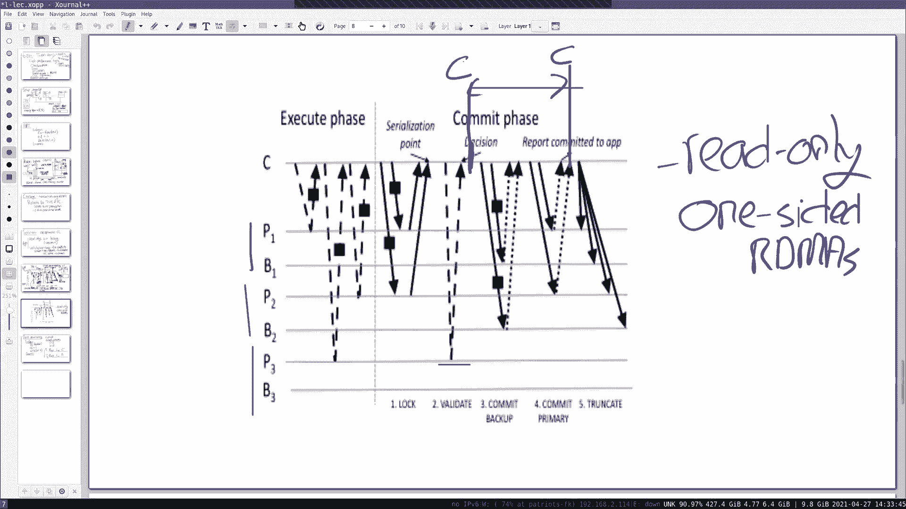

它写入分片 1 ， 分片 2 以及读取分片 3 ，所以像第一次那样开始。写入对象。写入 0 。写入 x0 ，写入 y0 。然后读取 z 。好的，读取 z0 。然后。

假设有第二个事务在事务 1 开始后开始。比如在这里？是的，它写入 z 。所以在写入 z 之前，必须读取 z 。是的。所以读取 z ，它读取的版本号是什么？一样的。然后尝试写入 z 。

然后加入 T2 在 T1 提交之前提交。好的，所以这个提交。然后 T1 在 T2 提交之后提交。我们试着提交，现在，我们将持有锁，为了验证，等等，所以什么会发生，我要给你举这个例子。

这是我在下一节课上讲的一个例子，但是发生的是， z 会获得，z 会获得 1 ，在这一点上， z 是版本 1 ，所以，验证阶段将在提交之后运行，这就是你说的。是的。所以这里是对 z 的验证，它有 0 。

现在是 1 ，事务将被中止。好的，这就是我想知道的，因为在验证阶段过去之后，有一段时间，在验证阶段过去之后，经过一段时间，它提交，如果验证发生在 T2 提交之前，所以它仍然是旧的版本号。

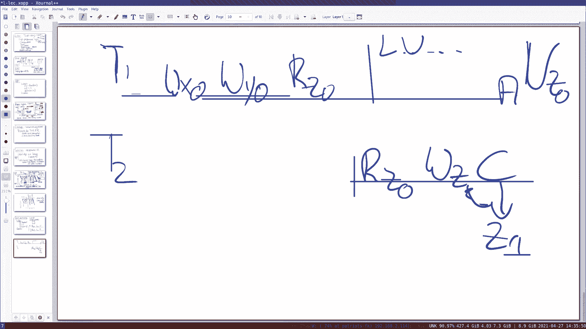

这不可能发生，因为在验证之后，在提交完成之后，提交备份已经记录，primary 必须做出改变，在应用程序返回之前，在应用程序返回之前，z 已经更新。会不会，我想我要说的是。

T1 的验证阶段是否有可能发生在，或者我想说的是，是否可能 T2 的提交发生在，发生在 T1 验证之后提交之前？T1之后发生的情况在t1提交之前进行验证。显然，这是有风险的，必须排除，所以，你是在担心。

让我来解释这个案例，也许我们下周回来，我们讨论一下，但我觉得你担心的，可以回到这张图片，这里，我们做了。

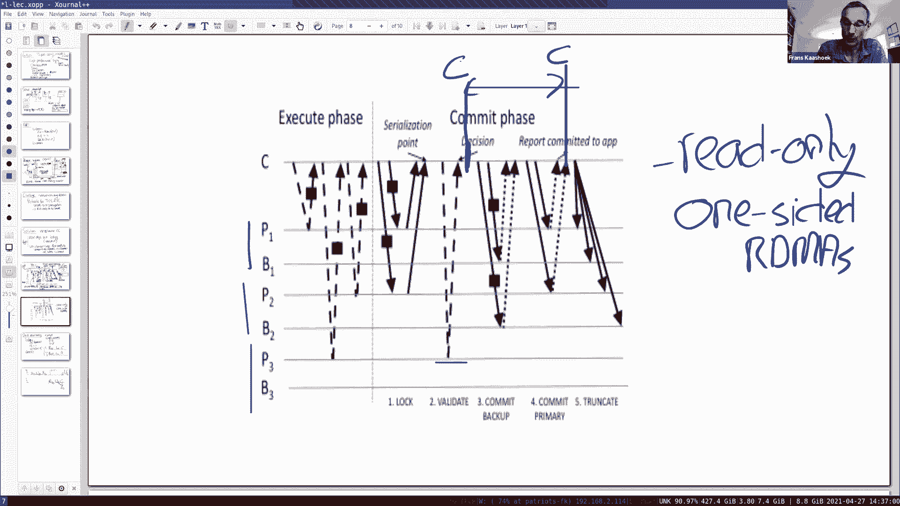

这个提交了。

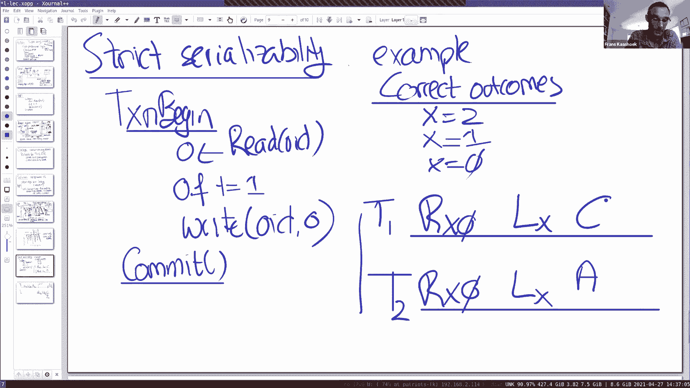

所以你是在做提交阶段，这是 T1 ，应该是 T2 。

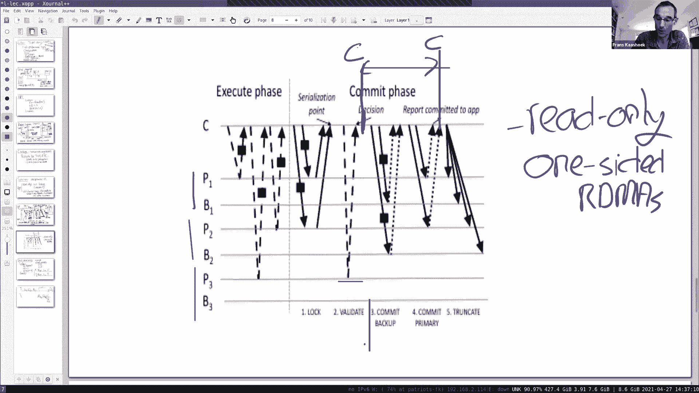

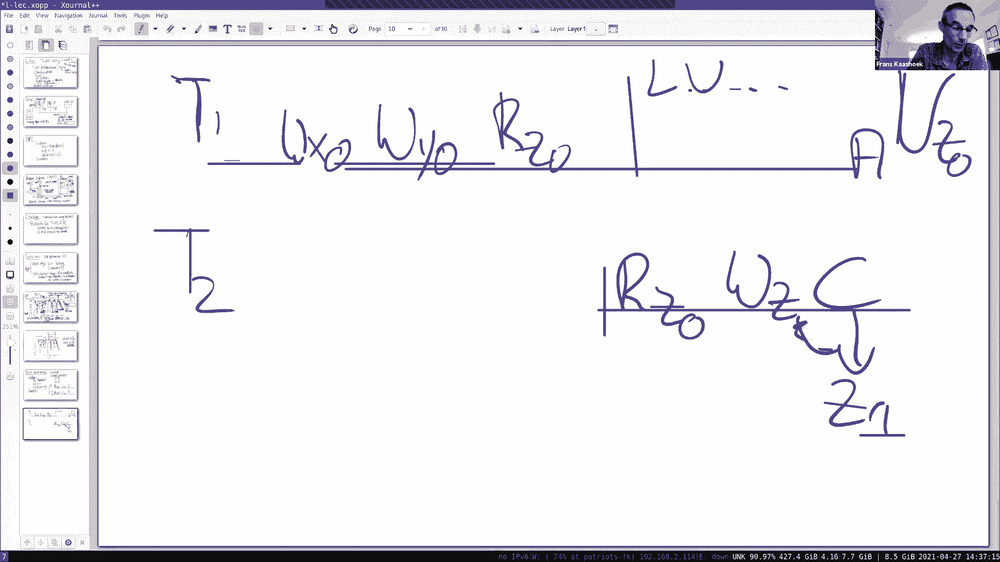

所以 T2 在这里，然后 T1 在一切发生之前进来，在 T2 完成之前。是的。所以， T1 也从这里进来，所以也许，好的，让我重写一遍，我会回复你。好的。这正是我想要谈的。好的，谢谢。所以想确认一下。

你问的是 T2 在 T1 的第二阶段和第三阶段之间？是的。但在这种情况下，我们可以串行化，让 T2 在 T1 之前。是的。所以，让我们在周四回到这个话题上，我有一个例子可以说明这一点。

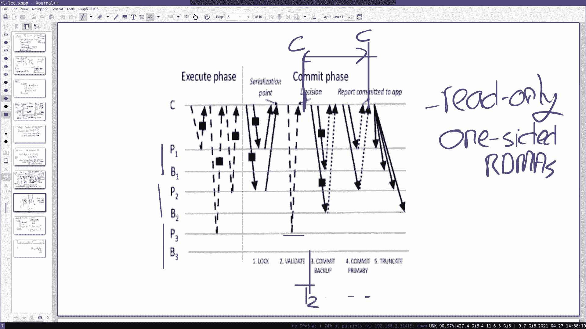

抱歉，在验证阶段，你只读取版本号？

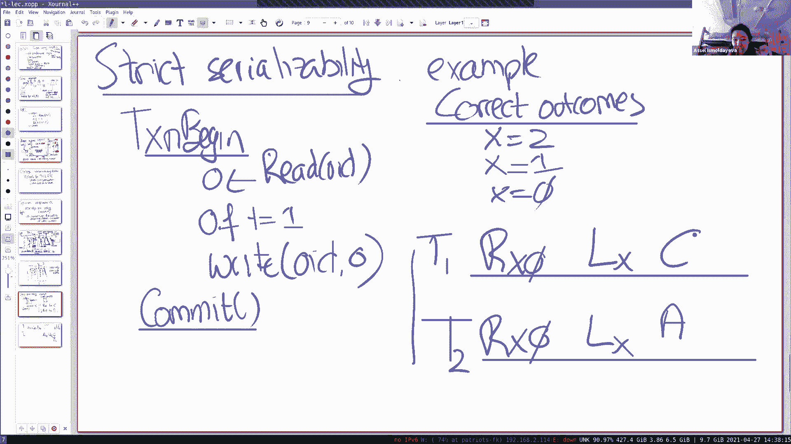

是的。好的。可串行化使我们能够对事务重新排序。是的，但严格的可串行化不会，严格串行化要求，如果事务在某个提交之后开始，事务也要在那个事务之后提交。是的。这是协议保证的，因为版本号。知道了，谢谢。

但严格的可串行化不是，如果我得到 T2 结束，它不是 T1 在 T2 结束之后结束，T1 必须已经开始，或许我需要考虑一下这个问题，但我觉得这把我弄糊涂了，这里也有一个关于事务开始的规则。是的，好的。

在真实生活中会发生什么，准确地从某个特定的时间点开始，如果 T2 在 T1 提交后开始。是的。所以，肯定是这样的，T2 观察到 T1 的改变，这就是严格可串行化。是的。但如果 T2 发生的[]。

会怎么样？那么并发事务，任何一个结果都是好的。好的。这回答了你的问题吗？是的，我想这就是我困惑的，所以。确切地说，当 T2 在 T1 提交之前开始时，它被认为是并发事务。

所以 T1 或 T2 可以观察到彼此，可以排序在前或在后，没有关系。好的，好的。好的，谢谢。我认为这也是你的例子的答案。是的，好的，谢谢。好的，我们已经得到了结果。你是说。

如果 T2 开始于 T1 开始和提交之间。是的，可以在前面或后面，没有关系。我能问个后勤问题吗，我记得在 6。S081 ，你也贴了这些幻灯片。是的，我没有在这里做，你想它在网站上吗？我想幻灯片是有用的。

如果你只需要看幻灯片，你需要滚动浏览视频。好的，你是第一个问的，为什么我没有这么做，是的，我很乐意这么做，我把它们保存下来。非常感谢，谢谢你的有趣的课程。

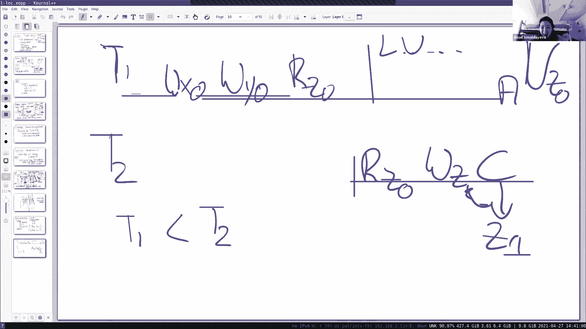