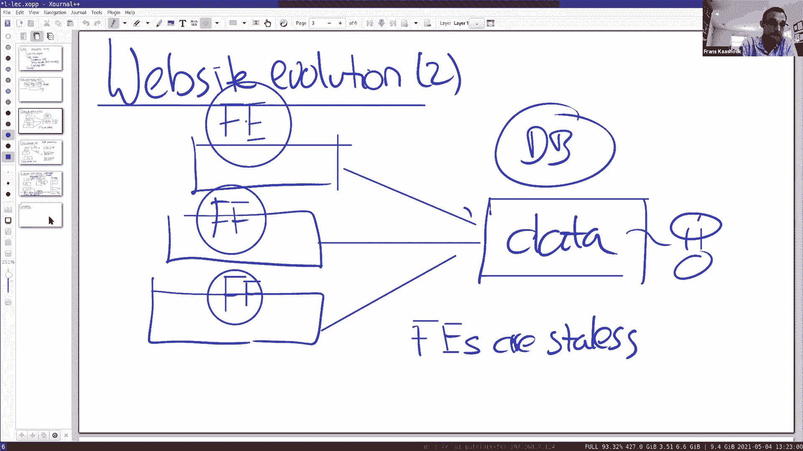
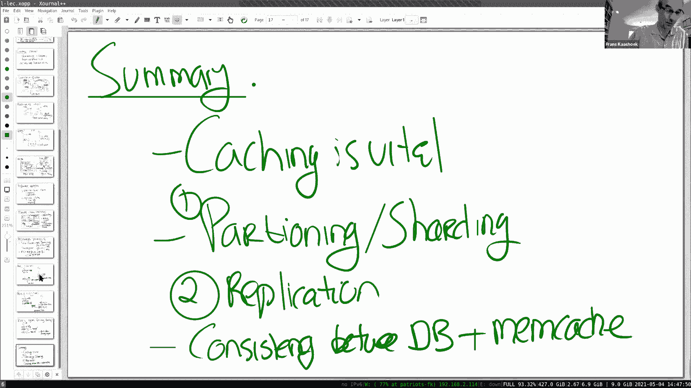

# MIT 6.824 2021 分布式系统 [中英文字幕] - P18：Lecture 17 - Cache Consistency - Memcached at Facebook - mayf09 - BV16f4y1z7kn

所以今天我想讨论一下 memcache ，这是一篇来自 Facebook 的 2013 年的论文，memcache 在很多网站中使用，或者大型网站使用的，与它的想法或架构很相似。这篇论文是一篇经验论文。

所以，这篇论文的目的并不是，介绍构建系统的新思想，新概念或新的创新方式，这更多是构建系统的实践经验的总结，在这种情况下，可以支持每秒 10 亿个请求或每秒数十亿个请求。这里有三个经验。

你可以从论文中学到的。一是他们获得了令人印象深刻的性能，使用现成组件构建的系统，系统由标准的开放软件组成，比如 MySQL memcached ，他们把它们结合在一起，构建了一个系统。

或者向外扩展了一个系统，支持每秒 10 亿个请求。正如你所看到的，正如我们在这节课中所看到的，在性能和一致性之间有一种持续的紧张关系，正如你将在这篇论文中看到的，这个设计主要受性能驱动。

他们想要找到某种程度的一致性，某种程度上增加，使系统至少对 Facebook 使用的应用可用，事实上，这里的一致性模型，与我们以前看到的一致性模型有很大不同，我们到目前为止讨论的大多数系统。

要么提供外部一致性，要么提供线性一致性，它们在一致性方面非常强大，在 Facebook 的案例中，它们的应用程序并不真正需要线性一致性，如果用户阅读新闻文章，而新闻消息落后了几秒钟，这真的不重要，所以。

它们的目标不是，提供某种线性一致性或严格的一致性，所以，这是一件需要记住的重要事情。尽管他们不是在追求强一致性，在论文中仍然有一些警示故事，添加一致性度量并不容易，你不需要，为它的开始做好准备。

但无论如何，你不能对这个系统的成功提出异议，它真的非常成功，允许 Facebook 网站的跟随者，有很多使用相同策略，能够扩大大量的用户。所以我这次课程的计划是先谈谈性能。

因为性能才是这个设计背后的驱动力，然后在最后更多地谈论一致性。在开始之前，有什么问题吗？

好的，让我从[]性能介绍开始，谈谈网站的演变。我相信你们中的许多人建立过网站，如果你一开始，你没有任何用户，这很简单，在 Amazon 或其他任何地方购买或运行一台机器，你基本上只需要三个组件。

你需要网络服务器，比如 Apache ，你需要一个应用程序框架来构建你的网站，可能是 PHP ，可能是 Python ，在 Facebook 的情况下，我想他们使用的是 PHP 。

你需要一个数据库来存储你网站的数据，比如使用 MySQL ，这是 FaceBook 所使用的。客户端连接到你的网站，运行应用程序代码，或者网站提供的任何应用程序服务，并使用数据库存储和查找数据。

数据库提供事务，它有 SQL ，所以，它可以很容易地以不同的方式查询数据，所有持久化状态都存储在数据库中，为了备份数据库，你会有一个很好的容错方案。这在某种程度上，对于任何网站来说。

对于少量的用户是完全足够的，许多网站的构建方式，但是当用户数量增加的时候，你可能需要进行更复杂的设计。所以这是演化的第一步。在第二步中，为了解决我们面临的第一个瓶颈问题，当你的用户数量较多时。

通常你遇到的瓶颈，是应用程序使用的计算周期，如果你有数千名用户同时在网站上运行，或 10，000 或任何数量的用户，运行应用程序代码，在单个 CPU 或单个计算机上。

导致 CPU 负载到 200% ，你就不能支持更多了。幸运的是，这很容易解决，因为数据库具有所有持久状态，所以通常你解决这个问题的方法是，你保持一台机器运行数据库，保持数据库机器，然后为前端买一些机器。

我说的到前端，是一种东西，网站、 Apache 加上一些应用程序代码，如果你有更多的用户，你买更多的机器，它们都连接到数据库来获取数据，实际上，这个设计效果非常好，因为前端是无状态的。

所有这些数据都在数据库里，添加一台新服务器是微不足道的，所有前端都会看到最新的写入，因为所有数据都存储在数据库中，所以不存在一致性问题，在容错方面很容易，如果其中一台机器出现故障，完全没有问题。

可能机器必须接管负载，或者你必须起一台机器给前端，但是你不需要做任何事情，在复杂的数据恢复方面，因为所有数据都在数据库中。所以这是，好的，发生的第一件事，随着网站规模发展。当然。

随着你的网站规模进一步扩大，你需要支持超过，比如，一个简单的 MySQL 设置，可能支持每秒十万的简单读事务或简单读查询，可能支持上千的写事务，如果来自你的用户的请求总数超过十万，然后。

你需要一个不同的方案。所以，下一个方案是分片。到目前为止，这一切都是相当标准的，所以你要做的是，把存储机器分为多台机器，前端保持不变，我们仍然有很多前端机器，这里我们有分片数据库，一些键位于。

可能 1 到 40 位于分片 1 ，可能 40 到 70 位于分片 2 ，进一步， 70 到 100 位于分片 3 ，你获取数据库中的表或数据库中的行，并按键进行分片。所以，前端需要知道，哪个数据库。

它需要获取键 32 ，会去分片 1 ，它需要获取键 50 ，会去分片 2 。所以，这为我们提供了数据库并行性，所以大多数请求都在两个不同分片上，而不是被一台机器所限制，我们得到的吞吐量。

一台机器比如是十万，乘以我们有的机器数量。所以这是下一步，当然这是，这一步比第一步更困难，因为现在你可能有跨分片事务，如果你需要它们，或者如果你想避免它们，你可以对键分组放在同一台机器上，否则。

你需要一些两阶段提交协议，如果使用事跨分片事务，所以，这一步从设计二到设计三，是非常重要的一步。现在，如果你扩展更大，你可能会说，你可以把数据库分片更多，每台服务器的键更少，但这增加了风险。

你必须进行跨分片事务。还有一条路可以走，观察到，比如，也许这并不重要，数据库支持读取，我们可以从数据库中卸载读取，数据库只进行写操作，那么也许我们可以获得很大的性能提升。所以。

这是网站采取的下一个常见步骤。

如果它们扩展，添加缓存，它可以是 memcached 或 redis 的形式，一种流行的用于缓存的开源软件。然后基本的计划是，大致是这样的，跟前面一样，你有很多前端，我们在边上有一些缓存。

稍后我们会更详细地讨论这一点，在这种情况下，我们有缓存层，缓存 1 ，缓存 2 ，缓存 3 ，在 Facebook 的案例中，这些被称为，每个单独的服务器被称为 memcached 守护进程。

整个缓存集群称为 memcache 。我们的数据库仍然存在，分片在多台机器上，这是一个存储层。所以想法很简单，如果前端需要读取特定的键，首先从缓存读取，希望会命中缓存，从缓存中得到一个快速的回复。

如果它不在缓存中，它可以从存储系统中获取数据，然后把数据安装到缓存中，写数据会直接发送到存储服务器。这个设计，稍后我们将更详细地讨论它，但是这种带有缓存层的设计，非常适合重读的工作负载。

如果你想一想 Facebook ，将是很多用户，他们所做的就是阅读人们的帖子，查看时间线，也许查看照片，阅读新闻、文章等，所以它是面向读取的繁重的工作负载，在这种情况下，读取几乎都是来自缓存的。

这些缓存可能非常简单。想像一下缓存，你在实验 3 中构建的键值服务器，键值服务器本身只是一个哈希表，也许你想要聪明一点，对[]加上锁，所以，你在缓存服务器中有并发性，或者键值服务器，但它是相当简单的。

随之而来的是两个挑战，其中的主要挑战是，如何保持数据库和缓存的一致性。这是第一个挑战，很多论文都致力于谈论这一点。第二个挑战，也是这个论文的主题，如何确保数据库不会超载。这里的问题是，一旦你扩展到。

通过使用缓存扩展到例如每秒 10 亿次，如果任何缓存出现故障，负载将从前台转移到数据库，当然，数据库完全不是设计，来支持这种工作负载，基本上会倒下。所以整个课程中的一个关键挑战，你从这篇论文中学到的。

是避免访问数据库的技术，所以，没有使数据库过载的风险。好的，到目前为止，还有其他问题吗？让我简单地说一下一致性。

因为那会是，虽然我将主要讨论性能，记住这一点很重要，甚至在关于性能的部分。哦，我有个小问题，抱歉。

回到比如客户端是无状态的。

那么，是的，在网站解决方案的第二部分，为什么客户端必须是无状态的？这使得复制变得很容易，客户端不用，你不用复制数据，所以，你不必保持数据的一致性，所有的数据都在一个地方，也许这里有一个数据库服务器。

好的，所以这个想法是，任何客户都可以失败，这并不重要。是的，这不重要，继续进行计算，你不必担心保持数据的一致性，因为数据只在一个地方，我们这学期谈到的很多事情，在这个设计中没有体现出来。好的？

好了，让我们回到，一旦你缓存了数据，你就有了一致性问题，所以当前的问题是，Facebook 的目标是什么。一些东西被称为，它被称为最终一致性，这是一个相当模糊的术语，但是也许是为了对比一下，可以说。

它并不追求线性一致性，事实上，他们所追求的是，他们想要按顺序写入，写入是以某种一致的整体顺序来应用的，你不会在时间问题上感到奇怪，这些都是由数据库完成的，对于 memcache 层来说。

这并不是一个大问题。在读取方面，如果读取落后也没关系，这就是应用程序的属性，Facebook 想要支持的应用程序，再次，这些缓存中的数据，用户使用的数据，网页、帖子时间表、朋友列表和所有类似的东西。

或状态，对于用户来说，这些都不是那么重要，更新你的照片，它稍微晚了一两秒，一点问题都没有，当然会落后几百毫秒的时间，用户甚至不会注意到，不会察觉到，所以落后也没关系，当然你不想落后几个小时。

用户可能会注意到，但在一小段时间内落后，这并不是什么特别大的事情。所以他们的不是为了线性一致性，读取观察到最新的写入，如果[]写入，这是可以的。但有一个例外，那就是他们想要安排，客户端读取自己的写入。

这意味着如果一个客户端更新键 k，然后立即读取键 k ，非常希望客户端观察自身的写入，因为这让事情变得更加复杂，否则，[]可能会更加复杂。所以，这就是他们要争取的目标，只是稍微弱了一点。

比我们以前见过的一些模型，让我想起 Zookeeper ，可以提供的合约风格。好的，还有一件事我想说。

往回一点，我们需要将数据库保存在缓存中，以某种方式保持缓存一致性。好的， Facebook 的基本方案是。

是缓存失效方案。我们会在后面的课程中看到，为什么是这样，发生的是，如果前端执行写入，它进入数据库，这是 MySQL ，但他们在数据库旁边运行另一个程序，称为 squeal ，它会查看事务日志。

MySQL 维护事务日志以实现事务，squeal 查看这个事务日志，看看什么东西被修改了，如果有一个键被修改，它看到键 k 被修改了，它向缓存发送失效消息，删除，它只是发送一个删除键 k 。

到合适的缓存，这样数据将被删除，然后在之后的某个时候，当客户端出现，执行读取，它不会在缓存命中，读取从这里查找数据，所以这里是 get ，让我把这称为 get ，这里有一个 read 。

从 read 获取数据，然后安装到缓存中。所以，你可能会想，为什么应用程序自己将数据安装到缓存中，所以它执行 put ，这与这些缓存有关，他们所说的旁路缓存，它们是旁路的原因是，因为通常应用程序所做的。

数据从数据库中读取，实际从数据库中读取的数据，这有一点[]，它上面有一些计算，它将获取页面的文本，将其转换为 HTML 页面或 HTML5 ，然后将页面的 HTML 版本的结果存储到缓存中。

或者可能读取很多记录，聚合一些数据，并将聚合结果放入缓存中。所以，应用程序控制，在这个设计中，将什么放入缓存中，这给前端或应用程序增加了负担，或者在这种情况下，在客户端中，但它有一个优势。

你可以做一些预处理，在把东西放入缓存之前。在这个对比中，缓存是透明的，缓存位于前端和存储服务器之间，如果你错过了缓存，然后缓存将选择数据，当然，数据库中的缓存，不知道应用程序到底在缓存中存储什么，所以。

在旁路设计中，是应用程序在控制缓存。

所以更详细一点。

我们可以看看这个图片，看看读或写是如何实现的。

所以这是读取，糟糕，抱歉。

这是论文中的图 2 ，这是我们的网络服务器或客户端，客户端从 memcache 获取 k ，我们稍后会看到，它们通常会请求很多键，这并不少见，网络服务器要求 20 到 100 个键，开始计算一些网页。

网页包含来自许多不同地方的聚合数据，对于每一条数据，需要放到那个网页上，客户发出，我们发出的 get 请求可能有很多很多键，它们会到 memcache ，它获取结果。

当发送那个 get 到 memcache ，可能会联系许多 memcached 服务器，结果返回到网络服务器，如果有什么东西没有命中，可以处理那些，返回[]结果，我们会得到 nil 。

然后客户端向数据库 SELECT ，运行 SQL 查询，它返回一些数据和结果，客户端可能会进行一些计算，然后安装进程，从 SELECT 获得的值到 memcache ，这就是读取的方面。再一次。

你可以在这里看到，这个设计的旁路属性或方面，memcache 并不是直接位于网络服务器和数据库之间，而是在旁边，由客户端管理。所以这是写入端，例如，如果网络服务器或应用程序需要添加帖子。

或者在帖子中放一张图片，服务器进行更新，将更新发送到数据库，就像正常的事务一样执行，当然，在数据库旁边，像我们之前看到的，将会导致失效，使用 squeal 守护程序，有了那个 squeal 守护程序。

你可以异步操作，糟糕，抱歉，客户端，写入者等待失效发生，一旦事务中的更新，一旦数据库中的更新完成，事务完成，并返回给客户端，然后同时 squeal 会看到失效。

因为 squeal 以异步方式执行无效操作，网络服务器执行[]，立即删除缓存中的键，这个删除的原因是，因为我们想要读取自己的写入。所以，当网络服务器查找键 k 时，就在它更新之后。

然后它将在 memcached 中丢失，它将获取新的值，然后安装它，但是只是这种情况，网络服务器立即读取它自己的，读取刚刚更新的 key k 。好的？原则上不需要执行这个删除，失效在某个时刻会发生。

将 key k 从缓存中删除，对于其他客户端来说，这是可以的，但是对于这个客户端，我们希望确保它能读取自己的写入。我有个问题，为什么不在删除后进行设置呢？是的，这是个好问题，为什么不立即更新。

我认为这就是所谓的更新方案，原则上这在这里也是可能的，但我认为这对他们来说有点困难，因为我认为这需要一些合作，在数据库、缓存和客户端之间。

我认为问题是这样的，假设我们有一个客户端 C1 ，我们有一个客户端 C2 ，我们会看到类似的类型出现，假设客户端 x 1 ，将 x 设置为 1 并将其发送到数据库，然后，比如，这是一个假设的更新方案。

这张幻灯片的重点是，或者这个白板讨论，执行更新不是无关紧要的，假设同时客户端 2 ，我们运行它，将 x 设为 2 ，将其发送到数据库，假设客户端 1 有一点延迟，所以我们实施你的方案。

然后我们立即执行设置 k 为 2 ，假设 k 在开始时是 0 ，所以，这将更新 memcached ，缓存现在将有一个值 k 为 2 ，然后客户端 1 执行它的设置，所以。

它会放在这里 set 或 put ，set put ，糟糕，设置 k 为 1 ，这将覆盖 2 ，现在我们在缓存中有一个旧的值，更糟糕的是，这个值是一直过时的，任何之后的 get 将看到旧的值。所以。

这不是所希望的，所以你想避免这种情况，当然，你可以让更新方案起作用，比如，对时间戳排序，或者为更新分配序列号，然后通过数据库，然后键值服务器或 memcached，可以不执行顺序之外的更新。

但这样的方案需要数据库的一些参与，我的意思是对 MySQL 进行必要的修改，他们的目标之一是从现成的组件构建所有东西，所以他们更喜欢这个失效方案，我认为这实施起来更简单。

因为你的数据库唯一要做的，是这个额外的进程在旁边，并使用标准的删除操作，memcached 已经支持的。

谢谢。这能理解吗？我们稍后会看到类似的问题再次出现，因为，你还记得从论文上看到，有一些关于 token 或租约的讨论，为了处理陈旧的值，但这将是，我们将看到，旧值在读方面。

或者读取者和写入者之间交互的旧值，但是完全可以在 memcached 的上下文中解决，无需对数据库做任何修改。为什么我们要有一个单独的程序来发布失效，我想它被称为 squeal 。

所以为什么我们有这个程序，如果前端本身发出删除 k ？我们稍后会看到，为什么这是非常有用的，尤其是我们要做的是，我们将看到，缓存被复制，我们需要发送失效给每个复制。好的，我明白了，谢谢。好的。

 squeal 不会发送删除到每个复制吧？squeal ，是的，我们一会儿会看到，稍等，我们马上就会看到。事实上，我现在就要谈谈这件事。到目前为止，大部分故事都是相当标准的，这里的变化很小。

我们到目前为止谈过的，没有什么特别的，在这之后事情就变得更有趣了。

所以，我们更深入地了解，Facebook 特定的优化或性能技巧。我们要看到的第一件事是，让我把这个整理好，[]放回去，第一件事是，通常情况下，Facebook 复制一个完整的数据中心。

在编写这个论文的时候，有两个数据中心，一个在西海岸，我们换回蓝色，数据中心 1 ，他们称为区域，这是数据中心 2 ，它们都有都有客户端层，所以有很多前端，也许这是西海岸的那个。

然后这是 memcached 或 memcache 层，它们都有自己的 memcache 层，所以这里也是前端，很多前端，这里是很多 memcached ，很多 memcached 。

这里有很多 memcached ，然后这是存储层，它是一种分片的数据库，这里也有很多机器，数据中心 2 在东海岸，是西海岸那个的直接复制品，它们用来写入的方案，因为现在我们有两个数据副本。

数据库的数据存储在两个地方，所以我们需要以某种方式保持这两个副本同步，基本的方案至少在右边是，所有写入都通过 primary ，其中一个区域是 primary ，另一个是 backup 区域。

这是区域 2 ，事实上，我想论文说西海岸是 primary ，东海岸是 backup ，所以，所有写入都要通过 primary 的存储层，所以即使是东海岸的前端发布的写入，会去这里的数据库。

primary 上的数据库运行事务，传播这些失效消息，首先，在这边获取日志，然后复制或传输到另一边，这就是 squeal 进程，它执行，这个进程将日志应用于，另一边数据库中的存储，使两个数据库保持同步。

并且作为连带作用，它可能发送失效消息或删除消息给 k ，所以你可能会想，为什么要这样做，为什么不把所有东西放在西海岸，而是两倍的 memcache 和所有东西。这样做的一个主要原因是，对于用户来说。

这种良好的读取性能，对于在东海岸的用户来说，读取性能很好，他们会连接这些中的一个，他们在缓存中查找数据，他们的 memcache 在东海岸，直接从 memcache 中返回数据，所以我们会得到好的。

一个是，我们得到好的读取性能，我们还可以获得低延迟，因为我们从附近的一个复制中读取数据，当然，这些缓存可能会有一点不同步，比起在一个数据中心，因为像整个更新和失效，都是异步发生的，但是，这是可以的。

因为我们已经说过，我们不是在寻找严格的一致性或串行化。我有个问题，如果某人在东海岸，东海岸的客户端写入，它会直接写到西海岸的存储，对吗？是的。但这并不会失效。好的，这个会对每个缓存执行失效操作。哦。

但我们说过，但我们说过，客户端读取自己的写入。是的，那么这个会去哪里，当然会去这里。是的，理解了，好的。好的。好的？我也有个问题，客户端是不是总是访问，比如。

给定的客户端是否总是访问相同的 memcache 服务器？不，我往回一点。

我们稍后会讨论这个问题，因为正如我们将看到的，这是一个问题，所以，前端访问，键分片在 memcache 服务器上，比如键 k1 ，k1 在 C1 上，k2 在 C2 上，等等，当它需要组成一个网页时。

它需要很多键，同时发送这些请求到不同的 memcached ，然后获得所有的回复，所以事实上，前端很可能会访问系统中每个 memcached 。

我明白了，如果对于一个给定的键，是否总是访问相同的服务器。是的，他们使用了一致性哈希，我们稍后会多谈一点，如果一个 memcached 服务器出现故障，它就不能访问那个了，所以，随着时间的推移。

从分片到服务器的分配可能会发生一些变化。抱歉，我想跟进一下，所以客户端需要读取自己的写入内容，像是一种弱的保证，因为如果它从中删除的服务器停机，然后它必须从不同的复制中读取。

它可能最终不能读取自己的写入内容，如果在出现故障时。稍等一下，好吗，我们会看到有一些[]或竞争，他们有不同的技术来解决这些竞争问题。哦，抱歉，最后一个问题。是的，最后一个，继续。哦，所以我们在做。

我们为了读取自己的写入，我们确保直接访问存储服务器，正好在后面，对吗？

是的。不在缓存中，但你也说过。不，稍等，当你执行写入时，你在数据库中进行更新。是的。然后你从你的系统中删除键，例如，在这个案例中。

你会写入到 primary ，从你的本地缓存中删除键 k ，所以当你下一次执行 get 时，你将再次从存储服务器读取。是的，没错，但我很好奇，所以你也说过，对存储的写入是异步进行的，对吗？

这个复制是异步进行的，失效是异步进行的，而不是写入。好的，写入是同步的。所以，你在完成写入后执行删除。好的，很好，谢谢。有一个问题，所以如果你执行写入，而你来自，你不是来自 primary 区域。

你向主存储执行写入操作，然后你失效你的 memcache ，然后进行读取，但是从你的存储中读取，也许你的存储还不是最新的。是的，所以有风险，所以，我们将看他们如何解决这个问题的。好的。没错。

但首先让我们更多地谈谈性能，因为这对他们来说还不够好，他们想要更高的性能。所以如果从广义上说，有两种策略可以获得性能。

我往后退一点，我们已经在高级别上看到了它们。所以有两个方案，一个是分区或分片。

这很酷，因为我们看到这使用在，存储层和 memcache 层上，如果你需要更多容量，你应该再买一台服务器，修改散列函数，这样你的 memcached 中有了更多的容量。

你可以保存更多的数据，并且数据可以被并行访问，所以我们得到很大的容量，很大的容量，很大的并行性，但是，如果你有非常热的键，很多客户端都需要获取那个键，无论是 Facebook 的特殊的人。

有一个每个人都关注的时间线，然后那个键会命中很多次。

它被提供服务，在这种情况下，可能由两个不同的服务器提供服务，一个在西海岸，一个在东海岸，但是东海岸和西海岸的很多客户端，将会命中相同的，或者两个，西海岸的 memcached 服务器。

和东海岸的 memcached 服务器，持有那个键，那就不太好了，因为单个服务器可能会超载，事实证明，键分发的差异很大，所以这并不是很好。所以，要解决这样的问题，第二种方法是复制，复制数据。

这里是分区数据，然后是复制数据，这对热的键来说很好，如果你可以使相同的键扩展到不同的 memcached 服务器，然后，所有命中这个键的客户端，都可以分布在这些 memcached 服务器上。

并且并行地获得键，所以，这对热键很有效。它并不能增加容量，所以你需要更多的。

在某些方面，我们可以在上一张图片中看到，我们在这里进行了复制，我们复制了一个数据中心，从西海岸到东海岸，这并没有增加 memcached 的总容量，由于两个 memcache 层都存储了相同数量的数据。

没有增加 memcache 层的容量，但是你允许读取两个不同的 memcache 层，并行的从东海岸和西海岸（读取）。好的？所以我们看到了一种复制的小型形式，你可能会想，还有什么事情要做吗？

这就涉及到了之前提出的一个问题，比如，你需要更多的容量，所以，一个更多容量的解决方案，即使在单个数据中心，所以忘了有两个数据中心，只从单个数据中心的角度来看，我们想要更大的容量，一个选择是。

你购买更多的 memcached 服务器，并继续购买更多的服务器，这里有一个小问题，这里有问题的一个原因是，因为这些前端与每个 memcache 服务器交互，所以它们，至少在写入方面。

我们知道 TCP 连接打开，所以这里有大量的 TCP 连接，此外，正如我之前所说的，如果一个键命中很多，这没有被分片解决，你可以买更多的机器，但是一个热键在一台机器里，这不会提高你的性能。

所以，他们在性能改进方面的下一步。

是在单个数据中心内进行复制。更高的性能，这就是集群的概念，这是一个关于复制的故事。所以他们做的是，如果我们查看单个数据中心，我们有自己的存储层，然后在存储层内，我们要复制一组前端，这是前端层。

这是我们的 memcache 层，我要把它复制多次，他们称为集群。这个好的原因是，很好地解决了，对热门键有好处，热门的键，它可能被复制到多个集群，所以这很好，第二，它减少了连接的数量。

有多个原因为什么这很重要，它避免了，他们所说的，避免 incast 拥塞问题，就像我之前说的，其中一个前端必须获取 500 ，几十到上百的键，它会并行地发送它们，到所有重要的 memcache 。

它们都会做出响应，当然，我们有很多的 memcache ，我们将会有更多的并行性，很多包同时返回，它们可以很容易地进入队列，队列超载或队列已满，因此包被丢弃，所以，通过减少连接数量，不是每个前端都访问。

减少回来的响应，我们避免了这个 incast 拥堵问题，总的来说，这减轻了网络压力，很难建立具有双向带宽的网络，可以承受巨大的负载，这里通过使用复制，一个集群的网络很好地支持了这个集群。现在。

这一切都很好，当然，这个设计的缺点，也就是，如果你有不受欢迎的键，不受欢迎的键将被存储在多个区域，基本上什么都不做，或者[]对性能的提高做出贡献，所以，他们所做的是，他们还有一个额外的池。

他们称为区域池，应用程序可以决定，保存不是很受欢迎的键到区域池，把它放在里面，所以这些，所以它们不会在时间上跨所有集群复制，你可以考虑区域池在多个集群之间共享，用于不太受欢迎的键或不太频繁使用的键。

好的？那么，这会对流行的键有帮助吗，因为每个集群都会有自己的 memcache 。是的，每个集群都有自己的 memcache ，有自己的前端，有自己的 memcache ，基本上用户。

用户是负载均衡到所有这些集群的。但这仍然不能增加容量，对吗？这没有增加容量，如果您想要增加容量，你，好的，它稍微增加了一些容量，因为所有不受欢迎的内容都不在额外的缓存，并被困在区域池中，所以。

这些空间现在可以存储其他键。所以为了避免 incast 拥塞，它们还会减少每个集群的分片数量，对吗？是的，不增加，他们不会增加它，替代方案不是引入集群，但会继续增加 memcache 分片。

在单个 memcache 中的分片数量，它有自己的限制。理解了，谢谢。好的，这是基本的设计，除了他们必须解决的各种各样的性能挑战，大多数这些性能挑战必须解决，我认为考虑的方式是保护数据库。

所以，回到这张图片，我们现在的设计显然能支持每秒数十亿次请求，但是存储层本身是分片的，因为肯定不能承受每秒支持数十亿次请求，这会是一个灾难，假设所有的 memcache 都以这样或那样的方式失败了。

或整个集群出现故障，所有前端都会命中存储服务器，那么存储服务器会崩溃，不能处理这种负载，所以他们必须非常非常小心做任何事情。

需要在存储服务器上加载更多负载（的事情）。所以，比如一个挑战，我要谈的是，建立一个新的集群，建立一个新集群的简单方法，就是建立一个集群，打开机器，安装软件，然后就完成了，基于这样一个事实。

如果数据不在缓存中，你会不命中，未命中会进入数据库，收集必要的数据，这种设计有什么问题吗？它会有很多缓存未命中，因为缓存里什么都没有。是的，假设你有一个集群，你有第二个集群。

你把一半的用户移动到第二个集群，那么 50% 的请求将在缓存中丢失，它们会命中数据库，数据库就会崩溃。那么，他们是如何处理这一问题的呢？Gutter ？不，不是 Gutter ，这是。

我认为他们让新集群，从旧集群的缓存中读取一些条目。是的，从新的集群获取，如果它们在新集群中未命中，它们会转向旧的集群，从已经存在的那个，然后它们在新集群中设置，所以考虑的一种方式是。

它们填充新的集群或预热新的集群，通过从现有集群中读取，所以，这可能会稍微增加现有集群上的负载，但至少不会给数据库带来太大压力，我们稍后会看到，这再次带来了一些一致性问题，我们稍后会看到这个。好的？

所以这是一个解决性能挑战的例子，另一个性能是在受欢迎的术语，在很多上下文中，称为惊群问题，什么是惊群问题？我想，当有大量的读写操作，大致同时发生，因为有大量的写操作，数据将多次失效。

数据库将受到请求的攻击。是的，你可以让它变得简单，单次写入导致一个键无效，任何在它之后读取键的客户端，所以，可能会出现以下情况，你有一个非常受欢迎的键，你使键失效，所以你从缓存中删除键。

所有在前端遇到流行键的机器，会执行一次获取那个键，所有都得到 nil ，然后它们都想从数据库中读取 SELECT ，这可能给数据库带来很大的压力，所以，他们想要避免这个问题，那么他们如何做的。

他们如何避免这个问题？他们用了租约。是的，没错，继续，多说一点。是的，我想他们给了一段时间，为用户指定的键，然后在某个时刻，据我所知，就像一把锁，如果另一个用户试图使用它，它们会等待。

然后希望它能足够快地更新，在下一次重试时，他们就会得到它。如果你执行获取，你会获得 nil ，你有两种情况，要么你获取一个租约，第一行没有得到和未命中，从 memcached 中获取释放。

而 memcached 至少给你更新的权限，或者告诉客户端，比如你要负责更新，如果你不这么做，你知道第一个，你会收到一条重试消息或结果，这告诉客户端，你应该尽快重试，不会立即出现，可能会扩散一点。

他们可能会做一些二进制备份类型的事情，我们试着获取，在大多数情况下，客户端，未命中的第一行，很快地更新键 k ，在毫秒量级上，然后这些重试成功，这里没有爆炸式增长，对数据库的请求数量，在这种方案下。

当然，它引入了，正如我们稍后将看到的，更多的竞态条件，但是，首先让我们继续关注性能。租约还有另一件事，它们适合，比如地址仍然固定。是的，所以租约形成了两个角色，我们稍后将看到，一个是一致性，一个是性能。

这个是用来性能的，我们将在稍后讨论一致性，我会看到第二次讨论，作为解决这些竞争情况的一种方法。好的，论文上还有更多，还有一件有趣的事，至少我觉得有趣。

如果 memcached 或 memcache 服务器出现故障，会发生什么情况？那得看情况，如果是整个数据中心，整个 memcache 服务器集合都发生了故障。只要考虑一个，我想要做的。之前有人提到过。

故障的 memcache ，但他们不会删除它们。是的，所以看看这个场景，有问题的情况是 memcached 服务器出现故障，这将导致一系列未命中，这些未命中将进入数据库，他们想避免命中数据库。

任何在这些服务器中具有键的客户端，试图获取键将会失败，然后必须做点什么。所以当它失败的时候，简单的解决办法就是去数据库，但我们想要保护数据库，所以这看起来不是个好主意，所以，他们所做的是。

拥有一个小型的其他集群或另一个池，比如区域池或者他们叫 Gutter 池，Gutter 池就是一些 memcached 机器，这只是可用的，它们的使用时间很短，系统在重新配置和修复自身。

添加新的 memcached 服务器，替换失败的那个。但在那段时间里，有一个新的[顺序]，或者可能更多一点，它们不想收到请求，或 SELECT 转到数据库，不是它们在失败时所做的事情。

你先去试试 Gutter 池，Gutter 池将会，第一个命中 Gutter 池的会失败或未命中，执行 SELECT 数据库，将结果放入 Gutter 池，然后。

后面的请求或获取将从 Gutter 池中得到答复，在某个时刻， memcached 机器扩展，它或者被另一台机器替换或者恢复，然后，负载将转移回 memcached 服务器和 Gutter 池。

它又一次在边上，在这些过渡期之间进行。好的？这就是我们今天的阅读问题，就像你刚才提到的，你不在 Gutter 池执行删除，并且失效也不会被发送到 Gutter 池，问题是为什么，或者我们可以推测为什么。

所以也许这是一个快速分组会议室的时间，用几分钟时间，要么讨论一下 memcached 设计的其他方面，或者你想要讨论这个问题的答案是什么。所以或许我们中断一下，是的，谢谢， Lily 。好的。

大家都回来了吗？是的，看起来是的。是的，好的。好的，有人知道，这篇论文没有非常准确地回答这个问题，但是有人想大胆猜测，删除的答案是什么，没有删除，没有失效到 Gutter 集群。哦，那个。继续。哦。

我们说的是，如果你这样做了，那么你会对 Gutter 池施加很大的压力，因为只有很少的机器，对于每个缓存未命中，有两个对缓存的请求，所以，如果你这样做，在每次写入之后，你都会有一个额外的请求。

在 Gutter 池上，它太小了，所以你不会想这么做的，此外，你还应该保护数据库，因为你会在写入请求后不断地查询它。是的，删除消息需要去两个池，原始的 memcached 池。

所有 memcached 池，并将其在 Gutter 失效，所以，删除流量也翻了一番，所以我认为这是一个完美的，我想这就是原因，这是一组很小的机器，只是在那里。

完成从已删除的 memcached 服务器的转换，从出现故障的 memcached 服务器到新的 memcached 服务器。好的。好了，关于性能，我想说的就是这些，尽管论文中有更多关于性能的内容。

相反，我想谈谈这些竞争，它们来自。

因为这个试图获得高性能，我们已经讨论过的。我想谈论的有三个竞争，我认为你已经确认的三个，大多数讨论都是关于，他们是如何躲避它们的。所以竞争 1 是他们所说的旧配置，场景如下，我们有客户端 1 。

使用一个区域，一个集群，没什么特别的设置，所以客户端 1 执行获取 k ，在这种情况下，结果是 nil ，它将从数据库中读取值，也许这是获得 token 的客户端，它是被允许设置的那个，但在它设置之前。

另一个客户端进来了，并将 k 为 2 写入数据库，然后有一个 put(k，2) ，然后其他客户端，终于等到执行 put ，它执行 put(k， v1) ，好的， ，v1 ，现在。

我们在缓存中有一个旧的值，而且在那里旧的值是持久性的，在其他人更新之前，好的，这是不希望的，这破坏了与应用程序的契约，它们不想回到过去，用户观察到它们，将是[]，所以试图避免这种情况。那么他们做了什么。

他们如何解决这个问题？使用租约吗？是的，有人说是租约的帮助，它们已经有了租约，因为这个已经有了租约，已经获得租约，否则它就不会从数据库中读取数据，所以，在客户端 1 在 put 上面加上租约。

或者可以在 put 上加上租约，事实上，它会，还有额外的步骤是什么？检查这个没有过期或者什么，因为如果另一个客户能够。抱歉，我刚意识到我犯了个错误，这就是为什么这个问题不是很好，让我看看。

客户端 2 不会执行 put ，这是无效一致性，我在这里把自己搞糊涂了，那么客户端 2 做了什么，在它设置数据库之后。回去。删除？是的，它执行删除，基于我们之前谈到的原因，所以它执行删除 k 。

那么连带作用是什么，删除 k ，租约会发生什么？它不会验证，或者它不会。是的，删除的连带作用是，租约失效，所以，它使租约失效，所以当 put 出现时，我的时间线有点，这个发生在之前，所以。

 put 在 delete 之后发生，put 将带上 get 的租约，但是租约已经因为删除而失效，所以这个 put 被拒绝了。所以考虑这个问题的一种方式是，他们利用租约机制来避免惊群问题。

也避免了这个旧设置的问题。这能理解吗？所以，即使我们没有这个租约失效机制，我们仍然会服从弱一致性，你会获得在过去的某个时间发生的顺序写入，但我相信，这件事可以确保你观察到自己的写入，对吗？你是对的。

它们还能确保你不会回到过去，比如，如果你读到一些东西，任何比客户端 2 更晚的客户端，将会看到旧的 v1 ，客户端可能会远远落后于，很长一段时间都看不到新的写入，事实上，可能一直看不到。是的，但是。

我是说，这会回到过去吗，因为客户端没有读取之后的东西。或许回到过去是个错误的词，但它在很长一段时间内不会观察到 v2 。我明白了，好的。这不是我们想要发生的事情，有一点是可以的。

但在很长一段时间是不可以的。好的，第二个竞争已经有人提过了。

已经被确认了，因为很多实验调试的优势，都是关于竞争的，竞争 2 ，这是冷集群竞争，风格也差不多，我们有两个客户端，客户端 1 ，客户端 2 。假设 k 最初是 v1 ，两个客户端都在冷集群中。

客户端 1 在数据库中将 k 设置为新值，删除冷集群中的 k ，当前集群所在的，然后这个客户端在冷集群中执行获取，看到它不在那里，接下来要做的是，从暖集群中获取，获取值，我的意思是，从那里获取。

在冷集群或暖集群更新之前。现在，它将执行设置 k v1 ，或者 put ，抱歉，让我修改一下，在冷集群中将 k 设置为 v1 ，现在我们有和以前一样的情况，我们在冷集群中有一个永久的旧的值。

他们如何解决这个问题？有人记得吗？他们有一个小的扩展来避免这个问题，猜猜是什么。C1 是暖集群还是冷集群？两个都是冷集群。它们在不同的冷集群中，对吗？我不确定这有什么关系。是的，没什么关系。有人知道吗？

我想他们提到过要推迟两秒钟，尽管完全分享了所有的细节。是的，这导致了推迟，他们称之为推迟两秒，任何对这个键的设置，在你从冷群集中删除之后，你在两秒钟内不能对那个键做任何设置，所以。

这个 put 会被拒绝，这只是在预热阶段，当集群出现时，它是冷的，在几个小时的运行之后，开始预热，并将其内容就位，一旦热身完成，他们就不再使用这个技巧了，但是，针对这个问题，他们认为两秒钟足够了。

这也足以让写入传播到冷数据库。好的？但还有一个写入问题是。

让我快速说一下，因为你们已经提到了，所以他们在论文中讨论的竞争 3 ，我相信还有更多，但是他们说的那个，在论文中说的那个，这是在不同区域之间，它必须处理主备问题，主备。这是一个类似的问题。

客户端 1 写入到数据库，数据库，这是在 backup 的一个客户端，这是在备区的客户端，它写入主区域的数据库，继续，然后删除这个键，当然在备区域中，从它的缓存中，然后它会立即起作用。

你们中的一个提到了，你可以获取那个 k ，然后，不会看到，将从取回，是的，它不会看到那个写入的结果，所以我们不会看到它自己的写入，因为写入还在到主或备的路上，primary 通过 squeal 发送。

将更新传播到备区域中的数据库，只有到那时，备区域，在备区域中将看到 k 的变化，所以我们这里有个问题，如果这个 k 在没有任何修改的情况下继续，那么，我们就看不到自己的写入了。有人记得。

他们是怎么解决这个问题的吗？是远程标记吗？是的，它是，所以当他们删除键 k 时，他们可能把它保存在 backup 的 memcached 中，并将其标记为远程，所以，当客户端 1 执行 get 。

它们会知道，嘿，我要获取，从它的本地内存缓存远程取回，然后从主区域获取它。好的？但之后远程标记将被移除，当可以安全地从 backup 中读取时。是的，我认为其中一个数据库，备数据库从主数据库获取数据。

它可以移除标记，因为这样就可以安全地从备数据库读取。

这能理解吗？好的，让我做个简短的总结，因为我已经有点超时了，快速总结一下，缓存是至关重要的，我们所讨论的这篇论文的能力，每秒数十亿次操作，有两种策略可以获得这种很高的能力，一个是分区。

给你带来了并行性或分片，另一种策略是复制，对热键来说很好，被很多客户端请求的键，键被复制到多个机器上。我们还看到，有很多特别的技术，为了绕过一些出现的严重的一致性问题，即使系统被设计成提供弱一致性。

所以，整个一致性，在数据库和缓存 memcache 之间的是困难的，可能比你想象的要复杂得多，因为缓存可能成为问题，正如你所看到的，这是相当困难的，事实上，有更多的研究正在进行。

试图解决怎样才能做得更好。好了，这是我想总结的，那些需要走的人，可以走，去参加他们的下一个 Zoom 会议，我们会再见，或者回答任何问题，如果你有任何问题，否则，我们周四见，谢谢。抱歉，我有个问题。

对于我们讨论的最后一件事，远程标记。

他们怎么知道这是一个相关的数据竞争，或者他们是如何决定，做这些额外的远程标记会更有用，而不是只获取旧数据。好的，我想这是因为他们事先有这个要求。

尽管论文并没有明确规定，他们真的很想要这个，比如，用户在他们的时间线上添加一些东西，再读一遍，它不在那里了，所以，这是用户可以直接观察到的东西，奇怪的，不一致，他们想要避免这种情况。好的，理解了。

理解了。我的另一个问题是，在最初的一张 memcache 失效的幻灯片上。

让我找找，我把它放在哪里了。哦，这里。

是的，这是那个幻灯片，有一点乱。

哦，不是，是后面那一张。

有一些无效，或者它没有。

也许是下一张。好的。是的，所以客户端仅为本区域设置无效，squeal 会取执行，转移到非本地。是的。好的，理解了，非常感谢。不用谢。教授，我有两个。你问了你的最后一个问题，抱歉，抱歉，请继续提问。

这些都是课后的。它们不算数。所以，对于区域中分配的服务器，当我们有集群时，每个都分配到集群中，是吗？

是的，每个集群都复制了。好的，很好，是的。我的意思是，服务器被分配给一个复制。好的，然后第二个是论文中很明确，但它说的，好的，这里，我想，在第二页的通用缓存页中。

它说使用 memcache 作为更通用的键值存储，特别说到，新服务利用现有的基础设施只需付出很小的努力，而没有调整、优化、配置、维护大型服务器集群的负担，我不确定，我看了看。

我找不到现有的基础设施是什么。我其实不知道他们指的是什么，所以。好的，好的，谢谢。[]。再见。我想问一个问题，我想你说了某种失败模式，如果 memcached 服务器出现故障，我觉得。

我在想哪张幻灯片会对我有所帮助，早一点，也许是刚才那个，任何显示 memcached 的，我想是整个系统图。

好的，有多个[]，但如果你愿意的话，你可以认为这是一个集群。好的，好的。好的。查找另一个，但我认为这可能已经足够了。是的，我觉得这很好，是的，我想这个问题是，所以，试着，但这就像是，如果客户端前端写入。

是的，如果客户端向它的 memcached 服务器写入，然后那个 memcached 服务器崩溃，然后客户端立即尝试，然后可能会切换到另一台 memcached 服务器，然后再次读取。

什么机制确保它不会看到它之前写入的结果。我认为发生的事情是，我们很可能会去 Gutter ，当 memcached 失败时，客户端将不会收到响应，当没有回应的时候，它会去 Gutter 。

里面什么都没有，可能在第一次尝试时，将从数据库中读取它。哦，好的，理解了。是的，这有一点不清楚，当添加一台新机器时到底会发生什么，他们并没有在论文中谈论太多，我认为这是一致性部分。

其中键自动从一台机器转移到另一台机器。我想，如果有多个集群，难道不是，或许我只需要从 Gutter 中读取，但它会不会潜在地转移到另一个 memcached ，哦，是的。我想每次 get 失败时。

客户端去 Gutter 。好的。好的，是的，这些集群是自己管理的，每个都有 memcached 。好的，好的，理解了，谢谢。不用谢。跟进这个问题，当它到 Gutter 时，如果两个不同的集群。

它们的 memcache 服务器同时出现故障，所以它们都去了 Gutter ，现在对 Gutter 进行并发写入，我们如何确保这些写入不会打乱顺序？它们执行设置，写操作总是到数据库到 primary 。

primary 对它们进行排序，我想写入总是有顺序的，客户端可能会做的唯一一件事是，set 或 put 一个值到 kv 服务器，但它们必须之后从数据库读取。好的，如果有人执行一个读取。

然后他们将其设置到数据库中，假设两个不同的集群失败，我不确定这是否可能，但是假如集群 1 首先读取键，获取到值，然后在中间有一个写入，然后，第二个集群读取。

然后它们都试着放入它们的 memcache 服务器，但是，假设这些服务器出了故障。是的，也许，也许，是的，这是个好问题，我认为有各种各样的边界情况，没有描述这个情况，我觉得租约也许能帮上忙。

因为你要设置的服务器有租约，我们第一次拿回了设置的租约，在此期间，服务器被替换，替换的服务器不知道租约已被授予，因此会拒绝设置，我只是在猜测。好的，是的，所以对于 Gutter 来说。

它是如何控制租约的？我不知道。好的，我明白了。抱歉，我可以推测，但是，其实我不知道。如果让你去推测，你会怎么说？好的，我得先去坐下来，好好想一想。好的，有道理，是的，谢谢。我有一个离题的问题。

我认为这很酷，他们对 get 请求使用 UDP ，对其他请求使用 TCP ，我想知道这有多普遍，这是一件非常标准的事情吗？是的，是的，也不是，它是，我认为人们通常更喜欢使用 TCP。

提供可靠性排序和所有好的东西，但它有开销，需要维护连接的状态，对于连接，所以总会有一些挣扎，当机器有大量传入的 TCP 连接时，有很多出站连接，这总会带来问题，在默认情况下，如果你遇到这个问题。

基本上是做 UDP 类型的东西。有时候。这篇论文中的是正常的吗？不，不是从这篇论文。有些人喜欢在 UDP 上使用他们自己的类似可靠传输协议的技术。比如 QUIC ？是的，是个例子。

因为他们提到他们也做了 UDP 连接的序列号。但毫无疑问地[]拥塞窗口和所有其他扩展，以及 TCP 拥有的所有其他 TCP 功能。谢谢。不用谢。所以，另一个，糟糕，抱歉，请继续。好的，我想。

我是想快速问一下，不同集群之间的复制，但是，它们不会进行任何正式的复制。是的，没错，好的，不，好的，是或不是，因为数据库需要更新。

等等，等等，让我回去一下，确保知道你在说什么。

让我们来看看集群，是的，我们有多个集群，是的，集群之间没有真正的复制，因为只有一个存储。好的，所以有一些类似于根据这些租约，来保持缓存最新或者。每个集群都是完全独立的，它们之间没有任何关系。

用户根据这些[]拆分，所以，一个用户访问一个集群，然后在集群内部，他们使用租约或，这个数据库使租约和键无效。好的，明白了，好的，是的，所以就像 squeal 和存储。是的，所有的写入都会通过这个存储。

所有的写入都要经过这里，它们被排序了，它们会发出失效消息。明白了，谢谢。好的，继续。是的，所以这个离题的问题，我想我不确定，因为我们在课堂上展示论文的方式，但这看起来有点像，这些系统的开发方式是，比如。

好的，我们有这样的系统，我们的需求在继续扩大，所以我们，也许这也不是一个准确的表达，但这听起来像是，让我们再增加一层来处理这个负载，或者缓存的东西，或者在它上面增加另一层复杂性，这样说是否公平。

系统开发通常是这样的，让我们再加一层来处理。是或不是，我认为设计者采取了非常务实的方式，弄清楚遇到了真正的问题，解决真正的问题，从根本上来说，并不是很多额外的机制，才能让这一切正常工作。

所以从这个角度来说，我的意思是，这种性能是非常令人印象深刻的，使用现成的组件，当然，人们也会偶尔回去，我该如何设计一个系统来获得更好的性能，不会有数据库和缓存之间的这种不一致，这实际上是一个研究问题。

因为人们知道如何做到这一点，你会看到描述替代解决方案的最新研究论文，或解决方案的新组件，因为我所知道的[]，不能支持每秒 10 亿次操作。是的，好的。好的，这很有趣，谢谢。是的，这是很吸引人的东西。

这是一个真实世界的系统设计。如果你不介意的话，我还有一个问题。是的，继续。所以在这里的设计中，它们在不同的地区复制，抱歉，我要确认第一个问题是，当它们在不同的区域表现良好时，每个区域都有一堆内部集群。

对吧。

然后，我的后续问题是，看起来一切都是，是的，所有东西都在访问主存储，假设我们想要扩大规模，这样我们不会让所有写操作都命中主存储，你将如何着手设计。是的，我的想法是，它们是一种设计描述，好的。

这里有很多要点，关于这个主题还有一整篇论文，是关于如何进行复制的，这并不是 Facebook 上唯一一篇关于扩大规模的论文，有一个系统是在 2015 年或[]发布的。

他们有一个可扩展的设计来传播这些写入，我的想法也是，他们会根据用户分片到不同的区域，并使一些区域作为那些用户的 primary 。我明白了，所以他们为不同的分片分配了不同的区域 primary 。是的。

我想是的，这是我会做的，尝试做的，我在这里推测。像跨存储层的共识协议是不是明智的决定，或者会不会太高了。你可以这样做，比如 Spanner 这样做了。是的。Spanner 有多快？挺快的。你回取看看。

看看表格，每秒可以处理多少事务？我记不清确切的数字了。我想大概有一百个。哦，哦。事实上，我想写入是 10 。是的，这是写入事务。是的，写入事务很慢。抱歉，我想我意识到，我不理解竞争 1 。好的。

让我看看能不能复制它。

让我们看看竞争 1 在哪里。

我想我只是搞不懂什么是 v2 。v2 是右边这个，稍等，我来做个记号。好的。问题是，它是夹在第一个中间。好的。好的，我们想把它删除，以便下一个人可以读取，从数据库中刷新它，但现在它仍然保持着旧的值。

是的，所以我们有一个永久稳定的值，真正的问题是这个永久的[业务]，或者带引号的 permanent ，因为这是个缓存，但是这个 put ，之后 k 被更新为 v2 ，所以我们这里有 k 2 。

这是正确的值，这里实际上是 v1 ，所以我们假设只有 1 ，我们在这里所做的是，我们 put(k，1) 之后，这不是一件正确的事情，每个这个之后的，执行 get k ，会获得 1 而不是 2 。好的。

理解了，好的。包括客户端 2 ，这将是奇怪的。好的，好的，理解了，非常感谢。不用谢。我想开始关于进化的部分，我认为也很有帮助。

好的，很好。非常感谢。