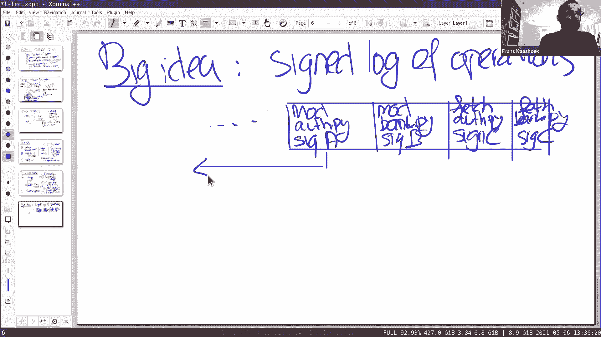
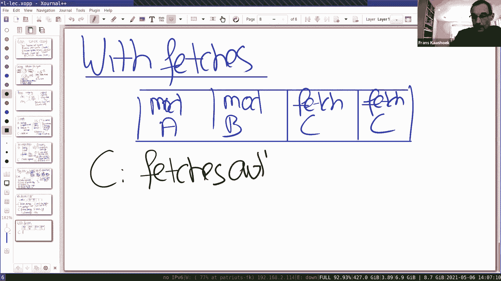
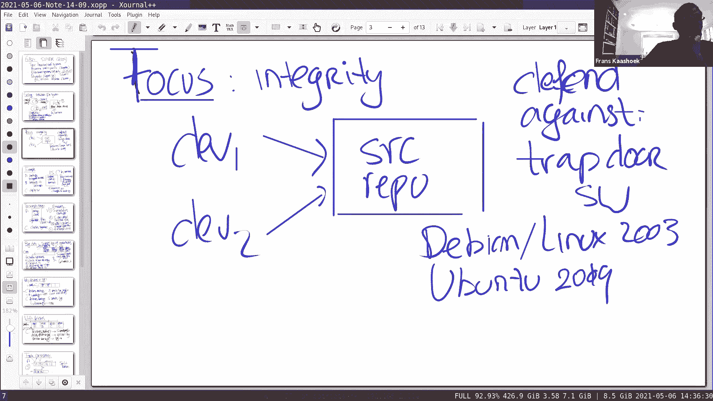

# MIT 6.824 2021 分布式系统 [中英文字幕] - P19：Lecture 18 - Fork Consistency, SUNDR - mayf09 - BV16f4y1z7kn

好的，下午好，大家能听到我说话吗？是的。好的，谢谢，是的，我会在课程结束后贴上讲稿，作为对聊天的回应。好的，今天我想在 6。824 开始一个新的话题，这是最后一个要讨论的话题，主题是去中心化的系统。

去中心化指的是，没有单一的权威机构来控制这个系统，到目前为止，我们看到了很多系统，所有的机器和服务器都在某种程度上合作，在单一机构或任何单一当局的控制下。因为有很多人提问，关于它是如何工作的。

如果没有中心信任点的话。所以，从现在开始，三个系统或三个论文要讨论，都是以这种去中心化系统的形式存在的，去中心化的系统更难建立，比单一信任系统，因为你可能不得不解释拜占庭失败，或拜占庭参与者。

这些参与者有时会遵守协议，有时他们不遵守协议，所以再一次考虑这个，他们基本上是对手，他们可能会试图伤害或欺骗系统中的其他参与者，为了自己的财产，但可能不是为了其他人。所以，这使系统设计。

分布式系统设计更具挑战性，更难理解，在过去的 18 节课中，大多数时候，当我们谈到，当我们设计协议或我们考虑 Raft ，我们只是假设，协议中的每个参与者都遵守规则，在拜占庭和拜占庭参与者之间。

情况不再是这样了，参与者可以编造新的消息，发送无序的消息，欺骗其他参与者，所以，我们考虑这类协议要困难得多，因为我们必须考虑对手能做什么，来创建[]，打破我们所追求的协议的属性，所以。

这会使问题变得更加困难。这类话题在哪里，它位于分布式系统和安全性的交汇点上。正如我们将在接下来的三篇论文中看到的，密码学或安全理念，比如签名和哈希，在取得进展方面发挥了关键作用。事实上。

我们今天读的这篇论文也是，是我们在 6。858 中使用的一篇论文，去年春天，参加了 6。858 ，我们也谈到了这篇论文，尽管主要是从安全的角度，今天，我将主要集中在，分布式系统的角度。

很多人都会问 SUNDR 本身，你们中的许多人问 SUNDR 在使用吗，据我所知，没有任何系统直接实现 SUNDR ，或者直接基于 SUNDR ，除了 6。858 中的实验 4 ，在实验 4 中。

如果你做实验 4 ，默认项目，实验 4 在 6。858 ，然后，你实现了 SUNDR 。现在，所以你可能会想我们为什么要研究这篇论文，我们之所以要研究它，因为它提出了一些，非常强大的技术或强大的想法。

特别是 signed log ，尽管这是一个很强的设计，概念设计，令人难以置信的强大，你可以看到，同样的想法也出现在许多其他去中心化的系统中，从 Git 这样的系统到比特币这样的系统。

或任何其他类型的加密账本，我们会在周一或下周二讨论，我知道有一个系统直接受到 SUNDR 的影响，是一个被称为 Keybase 的系统，Keybase 使用了 SUNDR 的技术，还有更多的。

如果你不熟悉 Keybase ，[最初]被 Zoom 收购，是大家都很熟悉的。好了，这是这篇论文的简短介绍，在我深入到更多背景之前，有任何的问题，在深入到论文之前。好的。所以。

让我们来谈谈这篇论文的背景，或者这篇论文的动机。所以设置，[]的设置是网络文件系统，你可以虑这个，以我们之前读过的 Frangipani 论文的风格，其中的主题也是实现一致的网络文件系统。

所以我们有一台文件服务器，我们有与文件服务器交互的客户端，有些人可能创建了一个文件 f ，可能在另一个客户端上读取 f 。我们所处的环境，文件服务器对比 Frangipani 。

文件服务器可以是拜占庭式的。拜占庭增加了非常强大的威胁模型，或者给了攻击者难以置信的力量。所以在拜占庭中，服务器可能会发回不同的 RPC ，编造自己的 RPC ，接管机器，[贿赂]管理员。

所有事情考虑的方式，对手获得文件服务器的完全控制权。所以，这涵盖了一系列，更常见的攻击，或者你可能在真实系统中看到的典型攻击，所以攻击了软件中的一个漏洞，如果软件中有漏洞，那么对手可以利用。

可能获得特权，而拜占庭模式完全通过，或者系统管理员可能有一个弱密码，如果攻击者[]，然后他们控制了系统，这也在拜占庭式的物理突破之中，也许的攻击者可以进入物理机器，因此可以控制机器的物理部分。

这些都涵盖在拜占庭威胁模型中，或者甚至攻击者贿赂操作者，或者与恶意客户端勾结，这也涵盖在这个模型中，这是一个威胁模型，给了对手很大的权力，它涵盖了许多标准攻击。首先观察到的是，再一次。

 SUNDR 是这样的，实际上不是，在文件服务器上维护整个文件系统，文件服务器尽可能简单，文件服务器非常类似于 Pedal ，它几乎就像一个块设备。所以有一个中央位置，所有块都存储在那里。

但是客户端真正实现了文件系统，所以它不是客户端发送、创建文件，从数据块服务器发送数据块和读取数据块，通过读或写来构建数据块，它自己对文件系统的看法，并服务于文件系统操作，直接对于客户端，所以在这里。

我们创建 f ，读取 f 等。所以非常类似于 Frangipani ，除了 Frangipani 最大的不同之处在于，Pedal 和所有客户端是完全信任的，在这种情况下，客户端不受信任，而文件服务器。

它也可以是不可信的。好的？好的，所以这篇论文集中在一些安全属性上，重点是，重点是所谓的完整性属性，与保密性相反，保密性关于保护数据，让别人看不到它，完整性只是确保系统结构是正确的。

对数据非法修改被检测到，无论数据是否公开，这有点超出了这里的重点。说得更具体一点，在我们的脑海中发生的事情是，我们有开发人员，我们有 dev1 ， dev2 ，他们可能会共用一些机器。

包含某个项目的源代码库，开发人员为这个项目进行合作，所以把这个当作一个例子，论文提到的是，在论文中，这个是开发机器，是一个 Debian Linux 服务器，他们想要防御的是后门，后门，软件中的后门。

所以攻击者接管了控制权，侵入包含源代码库的机器，修改软件，然后软件部署出来，例如， Debian Linux 被部署到很多机器上，现在攻击者控制了这些机器，因为它会利用这个后门。论文谈到了这个攻击。

2003 年 Debian Linux 的这个特定实例，攻击能够危害，开发服务器或集群，从这种攻击中恢复非常痛苦，事实上，在 2003 年，他们报告说，Debian Linux 开发冻结了几天。

当他们试图找出，源代码库中的哪些部分仍然是正确的，以及哪些部分被攻击者修改了，这些攻击会周期性地发生，我想在去年，Ubuntu 在 2018 年或 2019 年也有类似的问题，我记不清了。

这是一个类似的案例，其中一台核心开发服务器被入侵，他们必须解决，查找哪些软件哪些文件被感染，受到入侵的影响。好的，这就是论文的背景，我要说得更具体一点，一个小例子，为了帮助我们通过技术。

这篇论文所使用的。所以我要用的例子，部分灵感来自 6。858 ，假设我们有一个文件系统，你在做，文件系统包含，使用 6。858 zoobar 应用程序的源代码。

而 zoobar 是一个虚拟银行类型的应用程序，系统的用户，系统的注册用户可以相互转移 zoobar ，它有一个名为 auth。py 的文件，进行身份验证，有一个影响银行的文件， bank。py 。

所以，让我们考虑这样的情况，有一组新的开发人员， A B C ，他们决定增加 zoobar 的可用性，真正地部署，使其成为现实，他们决定按如下方式划分工作，A 将修改 auth。py。

以支持 MIT 证书，kerberos ticket 或证书，有了这个想法，我们要做的是，我们将修改 auth。py ，只有合法的 MIT 社区成员，才能登录到文件服务器。

文件服务器或到 zoobar 中，我们知道它到底是谁，与特定的 MIT 证书相关联。然后为了让它变得更有用一点，B 可以修改 bank。py ，将它链接到 TechCash 的 cash 标记。所以。

这个想法，我们可以使用 zoobar 系统来做到这个，比如我们可以使用 zoobar 系统来转账，真正的钱，而不是 zoobar ，在该服务器注册的用户之间，当然，这听起来像是一个疯狂的想法。

你并不会真的这么做，但这并不是完全荒谬的，因为 auth。py 会检查是谁，基于 MIT 证书，也许这不是不合理，我们可以将 bank。py 连接到 TechCash 。在我们的场景中， C 是那个人。

将会部署软件，寻找机器，安装软件，运行软件，它向 MIT 社区开放。现在，在这种情况下，现在让我们考虑一下，可能发生什么，什么可能会出错，如果文件服务器受到了威胁，所以是拜占庭式的。好的。

很明显的一些问题，有几个明显的问题，可能会有糟糕的结果，让我们来考虑一下，结果 1 ，这是我们应该谈论的一件事，同样在前面的例子中，对手把任意代码给 C ，对手提供自己的代码给 C ，这有点。

也许对手有点微妙或聪明，让它变得有点难以辨认，修改了 auth。py ，例如删除 MIT 证书，但是对于 C 来说没有办法检查，得到 A 和 B 生产的软件，没有对手的任何修改。

这是我们将要讨论的一个显而易见的问题，然后有第二种结果，可能会更微妙一些，对手修改了 bank。py ，而不修改 auth。py 。所以，在这一点上，这是相当有问题的，因为现在 bank。

py 链接在 TechCash 上，但我们不再对用户进行适当的身份验证，事实上，任何创建 zoobar 账户的人，现在都可以与 TechCash 互动，所以非常不受欢迎，也更难被发现。

因为对手并没有修改任何软件，只是有选择地你拿走它的部分，并展示给 C ，然后继续并部署。所以这些攻击，论文当然考虑了攻击 1 和 2 ，但有很多微妙的问题，是由第二个案例带来的，这将是谈论的话题。

到目前为止，有什么问题吗，关于背景，关于动机，在我们尝试讨论解决方案之前。所以第二种情况的问题是，身份验证不进行身份验证？是的，它不再使用 MIT 证书了，所以，我们并不知道是谁登录的。谢谢。

A 和 B 看不见，就像 fork ，会怎么样？让我们假设，A 和 B 已经彼此交谈过，并划分了工作，所以他们知道他们应该一起做这件事。好的。可能组成一个团队，他们密切合作，保持联系。

他们已经把工作分了，所以他们知道， B 告诉 A ，当 B 完成后，告诉 A ，当他们做完了，然后他们告诉 C ，继续，我们都做完了。好的？好的，让我们从一个简单的设计开始，它太简单了，它不能工作。

但它为我们提供了一些更复杂的设计的起点，希望能工作，所以简单的点是，A 和 B 或任何，所有文件都将被修改人签名，所以，当 A 修改 auth。py 时，A 产生一个签名，并用公钥签名。

签名签署到 A 的公钥，这个签名涵盖了文件的数据，所以当 C 下载 auth。py 时，检查签名，如果签名通过了，然后 C 知道这个文件生成，这个文件是由 A 产生的，可能相信事情都是好的。

这是基本的计划，我们会稍微谈谈密钥来自哪里，虽然公钥分发的问题是一个 6。858 个主题，所以我不会说太多，但现在先假设一下，每个用户都有密钥，公钥和私钥对，私钥是秘密的，而公钥是公开的。

每个用户都知道谁的公钥属于谁。现在让我们考虑一下攻击，看看哪种攻击会失败，哪种攻击会成功。当然，最明显的攻击 1 ，我们在上一张幻灯片中谈到的，是 S 修改文件，这不是。

这不是直接由 S 修改 auth。py ，这不可能了，因为当 C 下载文件和签名时，并检查它，它将看到签名拒绝检查，因为实际签名的数据，与服务器生成的数据不同，所以，服务器不可能修改 auth。py 。

没有被攻击。所以我们在这次攻击中是好的，这是核心攻击。但是 S 还有很多其他的事情可以做，所以让我们来考虑一些其他的事情，假设 S 发送另一个文件，并假装是 auth。py ，因为签名并没有说。

数据属于哪个文件，所以 S 可以产生一些其他的文件，比如看到这个是 auth。py ，你可以相信我，签名当然是由 S 制作的签名，这当然是可以修复的，也许签名不应该只包括数据，但也可能应该包括文件名。

所以在一些事情上也许不是太糟糕，你可以处理。第三，另一种可能性是，S 发送旧文件的内容，也许有些新的，现在确实更难了，我们用简单的方案来处理这件事，因为没有方法，这些文件是单独认证的，而不是一起认证的。

而且 C 不能得到文件系统的一致性图片，它只得到了签名文件，签名文件在它们的历史方面是如何相互关联的，没有覆盖在这个很简单的设计中。当然还有更多微妙的攻击，现在不能完全解决，因为 S 可以发送。

可以发送旧版本的 auth。py ，它会完全通过检查，然后发送新版本的 bank。py ，它与 TechCash 有关，现在又回到了一个更糟糕的案例中，有一个旧版本的 auth。py 。

或者不更改 auth。py ，不是修改 auth。py 的证书，以及链接到 TechCash 的新版本。所以这不是很好，所以我们这里的简单点，不涉及这个问题。还有类似的另一种版本。

当然 S 也可以声明文件不存在，而 C 没有任何方法来检查这是否是真的，因为它们同样应该有一个全局图片，其中是文件系统的一致视图，没有人知道每个文件的签名。所以你可以看到。

简单的设计可能是一个很好的起点，但我们需要更完整的东西，我认为我们需要一个将所有文件系统捆绑，所有文件一起，将目录捆绑在一起，将目录的内容捆绑在一起，我们必须能够以某种方式做出决定。

文件系统的最新版本是什么，所以在这种有问题的情况下， C 不会被骗，其中安装了一个文件，而没有安装另一个文件。所以这就是 SUNDR 论文试图解决的问题，论文中的大的想法，这只是一个普遍的大的想法。

这是一个概念性的想法，尽管论文并没有直接实现这个大的想法，以一种更间接的方式实现它，这是一个令人难以置信的强大的想法。所以大想法是对操作的日志签名。当然，你对操作日志很熟悉，你可以。

这是它的一种[增强]版本，在日志条目上有签名的情况下，涵盖了条目以及之前的条目。这就是，我们在之前的所有分布式系统和故障恢复协议中看到的，我们说过日志是一个非常强大的想法，来考虑系统的正确性，同样地。

这个想法也是在这个拜占庭式的背景下进行的。所以，让我画一个简单的日志，从论文中拿出这个，所以日志有一些条目，比如，我们已经讨论过的，所以它是修改，由 A 修改 auth。py ，由 A 签名。

这里有个 mod ，如果一切顺利，这里有一个 bank。py ，由 B 签名。正如我们稍后要谈到的，不仅日志中的修改，还包括读取操作的获取，所以，获取 C 签名的日志， auth。py 。

然后获取由 C 签名的 bank。py 。我们将讨论这些操作，取回操作，我首先想讨论，如何操作前面的操作进行修改。所以，首先，重要的是要认识到，记录中的签名不仅覆盖当前记录，它也涵盖了以前的所有记录。

让我在这里停一下，因为我不能百分之百确定是否每个人都能听到我。是的。是的。好了，我拿了我的 iPad ，走出了 Zoom ，我登录了两次，然后我的 iPad 退出了，所以我只想确定，我还在和你说话。

你能听到我说话，情况就是这样。好的，那我们开始。

所以，实际上。我想我们丢了 Frans 。现在大家能听到我说话吗，有人能听到我说话吗？是的。好的。好的，我不知道你那边有没有发生什么奇怪的事，但在我这一边，我退出了 Zoom ，然后重新登录。

也许有个拜占庭式的服务器在工作。好的，让我，稍等片刻，然后我自己。让我看看，视频开始播放了。摄像机，好的，如果我好了就告诉我。好的，很好。还不能分享屏幕，但是。好的，我希望这能更好地工作。好的。

在这个非常重要的时刻，签名不只覆盖日志条目本身，而且还覆盖了所有之前的日志条目。所以，当 A 对 auth。py 的日志修改时，它对日志记录本身以及之前的日志记录进行签名，所以你可以想一想。

之前的日志可以表示为，之前日志的内容是加密哈希，在记录中，修改 auth。py ，日志的前面部分的加密散列是，包括并覆盖在签名中。确认一下，我们还是看不到屏幕。你看不到屏幕，屏幕没有改变，但是。

让我看看我能不能做点什么。我想，Zoom 仍然认为这是在分享屏幕，但它看起来并不是。

这个怎么样？是的，我现在能看到了。好的，谢谢。好的，所以我什么都没改，除了我画了一个箭头，这些签名，它也涵盖了前面的所有条目。这很好，因为当客户端 C 接收到，获得 B 的日志条目时。

服务器不可能丢弃 A 的日志条目，因为这会被检测到，当 C 检测 B 的日志条目的签名时。所以，我们向前迈出了一大步，从这个意义上说，服务器现在更难有选择地删除日志条目。所以这非常好。

服务器不能丢弃 A ，并保留这些修改。所以这是向前迈出的一大步，所以让我们更详细地看一下，这件事到底会如何发展。我们是客户端 C ，我们获取日志，为了[]软件的分发版本，在特定机器上安装。

客户端做的第一件事，它检查所有的签名，问题总是这样的，当你要检查签名日志条目，使用哪个公钥，因为你想要确保，你没有被骗，接受 A 的修改，但是 A 并不是对它签名的人，为了找出使用哪个密钥来验证签名。

密钥使用文件的所有者，所以，公钥需要与文件的所有者相对应，暂时忽略组，只有文件的所有者才能修改文件。因此，稍微简化一下，我们可以认为 auth。py 是 A 所有的，文件的 id 是 A 的公钥，所以。

我们知道要使用哪个公钥，并可以用它验证签名，所以，如果其他人做了一个伪装成 A 的修改，这是不会通过检验的。所以，只有 A 可以连接并修改，B 也是一样。这是 SUNDR 聪明之处的一部分。

我不是要讨论，因为文件系统是文件系统的两倍，作为公钥公钥基础设施或分发基础设施，所以，使用 SUNDR 是可能的，我们确定哪个用户拥有哪个公钥。但我不想讨论这个，我想专注于一致性方面。

以及更多的分布式系统方面。客户端做的第二件事是，检查它自己的最后一个条目。这是为了保护客户端不会被服务器回滚，所以服务器总是检查最后一个条目，如果它在日志中的最后条目被窃取，然后，对于攻击者的唯一方法。

回滚文件系统，因为 A 可以回滚，所以， C 将检查它之前的任何操作是否在其中，并确认它们还在里面，它的最后一个条目还在里面。这里的问题是，我觉得这个攻击是从服务器回滚。

只有在没有其他客户端写入日志的情况下才能工作，在这个客户端最后一个条目之后，因为否则检查签名就会知道了。是的，我们待会再谈，我的意思是你总是可以使用 fork 攻击。

你可以拆分文件系统在多个用户中的使用，但你至少可以不回滚客户端，一旦客户端看到特定的文件系统，你不能在时间上倒退，客户端可以呈现未来的不同文件系统的服务器，但你不能倒退。第三部分。

第三部分[]是一个[建设性的]文件系统，它知道它没有滚动到文件系统的之前版本，它应用所有的修改，基本上在客户机上构建文件系统树，然后在做任何操作之前，它想要[]，我们假设在 C 的情况下，它将会做的是。

它将读取 auth。py ，并在日志中附加一个条目，并对其进行签名，所以，在读取 auth。py 的情况下，它将产生这个日志条目签名。然后这个协议的最后一步是，它将日志上传到文件服务器。

这个协议在现实中是未完成的，它实际上是，这是一种更具概念性的协议，帮助我们理解，为什么我们最终可能成功地实现安全，在拜占庭服务器的上下文中。因为如果我们激进地下载每个操作的日志。

并且日志包含发生在文件系统上的所有操作的历史，在第三步中，客户端构建了文件系统，所有操作从一开始就执行，最后在第五步，将整个日志上传回服务器，看起来非常荒谬，这很荒谬，在性能方面，但这将帮助我们理解。

当我们观察这个方案的实现时，当它具有相同的属性时，他们的概念设计所有的，我们将看到，在比特币的情况下，从字面上看，它确实有一个日志，从一开始，所有的操作都在其中，所以，也许这是一个疯狂的想法。

也许在 2004 年的背景下，但是人们确实做了，对日志进行签名，并维护它。所以，从这个意义上说，这不仅是一个大的概念，一些人在实践中这样做了。到目前为止，有什么问题吗？好的。你可能在想的一件事。

这是作为今天阅读的议题提出的，就是这些获取有什么问题，为什么也要获取日志，因为你可能会想，我唯一真正关心的是，如果我们想一想，关心的是，只有在日志中的修改，因为有一些东西修改了文件系统。

读取并不会修改文件系统，所以，到底是什么问题。所以我想在这里做一个快速分组会议室，我相信如果你们能互相讨论一下，你认为这个问题的答案是什么，希望像 SUNDR 这样的[初始报道]，可能会提高你的理解。

你可以弄清楚答案是什么，或者谈论一些其他的事情，所以我想，也许做一个五分钟的分组会议室。好的，检查一下所有人回来了吗？看起来是的。很好，谢谢。好的，那么，我想，让我们从家庭作业的问题开始。

为什么获取要在日志中？有人知道吗？如果你有只读服务器，如果没有获取，这个文件系统可以为它提供任何东西。可以吗？可以，因为它，因为在日志中没有提取，这意味着，只读服务器不会进行大量的检查，我们之前谈过的。

所以它们回到过去，可能不起作用，因为它没有在日志中放任何东西，因为它只获取。是的，好的，很好，好的，所以我想你完全是对的，试图让它变得更精确一点或更具体，我想这是正确的。我们假设这是如下所示的日志。

而且 C 的获取不在里面。让我们，这是 C 下载之前的日志，假设 C 获取 auth。py ，A 修改的文件，服务器所做的，服务器不是提供 A 和 B 的修改，因为它拥有它，A 和 B 对其进行了修改。

它发送给 C 前缀，因为前缀排除了 A 和 B 的修改，所以我们有 mod A 和 B ，所以 C 获取文件，它获取日志，这是日志前缀的这一部分，C 检查签名，检查进行的操作是否在其中，它们都在那里。

因为 C 还没有做任何其他的操作，所以它会接受日志，原样的日志或原样的前缀，并且返回 auth。py 给应用程序，将这个软件复制到机器中，运行安装的软件。然后 C 获取 bank。py ，这一次。

服务器发送整个日志，C 查看这些条目，这是一份有效的日志，操作的前缀，因为我们不关心获取，这些都在日志中，所以一切看起来都很好，这些都是有效的修改，什么都没有改变，所以 C 没有从日志中获取。

C 会接受这个日志，建立一个文件系统，包括对 A 和 B 修改，并且返回 bank。py 应用程序的结果。这样它可以安装机器，运行服务器，如你所见，我们的处境很糟糕，因为我们使用了旧版本的 auth。

py ，以及新版本的 bank。py ，你能想到的一种方式是，从 C 的角度来看，真正发生的事情是，虽然它读取 auth。py ，对 A 和 B 的修改是同时进行的，基本上是同时发生的。

或者至少服务器认为它是同时发生的，所以，它被搞糊涂了，或者无法察觉这样一个事实，这些应用程序在之前就已经发生了。所以这就是问题所在，把获取放在日志中，让我们把它变得更加具体，看看为什么在这种情况下。

这个问题得到了解决。教授，我有个问题。是的，所以我有点理解不了，比如理解接口，对于获取和修改，我想你获取了大概整个树，不得不重建整个文件系统，基本的例子，但在幻灯片中，获取特定文件之前。

服务器是返回日志的服务器，所以服务器就可以决定要包括哪些条目。是的。我们已经看到，它不能删除日志中间的任何内容，这是不可能的，它总是发送日志的前缀，因为前缀总是与其本身一致。所以在第一种情况下。

它发送前缀，在第二种情况下，发送整个日志。是的。所以服务器可以决定这样做，但客户没有任何可以，或至少到目前为止，讨论客户端没有，客户如何检测到，它获得了整个日志。是的，我的问题更多的是针对。

比如客户端使用的接口，比如获取和修改，因为我想，一开始我想，好的，获取整个文件系统。不，获取是一个单独的文件。好的。所以，获取所做的是，它获取日志，比如修改，修改是修改文件的所有操作。

如果你回到稍微早一点的幻灯片上，在修改记录中，它明确说明修改的是哪个文件，它所说的是，类似在获取中，它说哪个文件客户端会看到。好的。然后，所以对于获取，客户端通过日志，但只看了。是的。

获取所做的是读取它要查看的文件。好的，但它会检查日志中的每一项签名吗？是的，好的，第一步总是检查整个日志，确保你的最后一次操作在其中，无论是获取还是修改，尽管在这个失败的方案中，我们放弃了获取。

它应用所有的检查，所有的签名，然后它构建文件系统，通过从头开始重放日志，获取文件系统，然后它开始执行操作，所以在本例中，操作当然是读取 auth。py ，是读取它。好的。

我们讨论 fetch 和 modify 的原因是，因为所有操作都是在一个或两个[]，要么是获取，要么是修改操作，比如写入文件，创建文件，都是修改操作，获取操作是读取文件，[]目录状态文件。

这种之类的东西。好的，然后 modify 也是，modify 不会获取，好的，也会获取日志，然后构建文件系统。是的，所以我在这里使用的 fetch ，我想有两种方式，一个是只读操作。

并且从服务器获取或接收日志。好的，然后 modify 修改一个单独的文件。是的，对于文件系统的每一次修改，你会有一个日志条目。好的，谢谢。抱歉，我也有一个问题，我真的不明白为什么这个场景是个问题。

因为就像你说的，这是可能的，从客户端的角度来看，很可能是，A 和 B 创建或修改了最后一次 fetch 。是的，原则上，这是有可能发生的，这是[恢复的]修改，我们知道，因为我们是从上面看的，我们知道。

在 A 和 B 修改后， C 读取了文件，但服务器可以认为它同时发生，稍后我们将看到，如果我们把 fetch 放在日志中，服务器不能认为是这样的。好的，但是即使服务器认为是这样，这是个问题吗。

它有没有打破什么东西，因为。是的，这是一个展示如何打破东西的例子，比如第一步， C 获取的是 auth。py ，服务器给了它一个，关于获取，它给了前缀，所以客户端构建了文件系统，执行该操作。

将 auth。py 返回给应用程序，并在机器上安装软件，为了让它非常[]，所以现在第一个，读取 auth。py 已经完成，完成已执行，在计算机上安装了旧版本的 auth。py 。

然后客户端可以获取 bank。py ，现在服务器，客户端应用程序想要读取 bank。py ，所以客户端从服务器获取日志，或者要求服务器，请把日志给我，这一次，服务器给出了整个日志，而不仅是前缀。是的。

但是。[]构建整个文件系统，并将 bank。py 返回给应用程序。但是，这不会在不正确的客户端实现中发生吗，因为如果客户端发现收到日志，它看到了对 A 的额外修改。

如果客户端知道逻辑依赖于 A 和 B 同步，它还会再次获取 A 。好的，有个问题，C 不知道，C 是，好的，在这个特殊的场景中，我们试图确定是否，C 可以确定，修改是同时发生的还是在过去发生的。

在读取之前，我们想是这种情况，这在过去发生过，因为确实发生在过去，但是这个服务器所做的，它只是认为修改是同时进行的，看到了操作，C 没有任何方法可以检测到这一点，除了一个新的也许 A 。

A 和 B 应该一起修改，但这只有可能知道，如果 C 和 A B 之间有某种通信，我们待会再谈这个问题，但是如果 C 没有和 A B 通信，它可能会，可能会是这种情况，它安装了旧版本的 auth。

py ，新版本的 bank。py 。我们稍后会看到，如果我们把 fetch 放进去，那么这种情况不会发生。有人问，如果给每个东西都加了时间戳，然后我们检测东西，这个想法先稍等一下。好的。

让我们看看包含 fetch 的场景，所以看看在这种情况下会发生什么，所以，客户端获取 auth。py 。

糟糕，现在发生了什么。稍等一下，出了点问题。我想现在没人能看到我的屏幕。它是黑的。是的，稍等一下，回来。我今天绝对觉得， 6。824 有一个拜占庭的成分。好的，我需要暂停一下分享屏幕。

好的，希望我们回来了。好的。好的，回到这个例子，现在 fetch 在日志中，C 获取 auth。py 。所以让我继续，把这个保存下来。C 获取 auth。py ，服务器发送前缀，所以发送这些修改。

服务器可以返回它想返回的任何内容，然后，在这个新的方案中，fetch 是日志，然后， C 使用 A 和 B 构建文件系统，然后将 auth。py 返回给客户端，客户端或应用程序。

然后它向日志中添加一个 fetch ，并将那个日志上传到服务器，然后是一个获取 bank。py ，服务器，在前面的例子中，首先，它只发送一个前缀，所以这里是前缀，现在客户端发送整个东西，发送整个日志。

但是如果修改在，我们必须发送整个日志，我们发送整个日志，并且必须包括 fetch C ，如果它没有发送 fetch C ，那么 C 的读取操作不在那里，客户端将会拒绝该日志。

因为它自己的 fetch 操作不在其中，所以服务器不可能认为，为了稍后发送日志，因为新日志应该包括那个 fetch 操作，它在里面，并更新 C ，或者服务器不能将该 fetch 操作加倍到这里。

为了让它与之前发生的保持一致，因为这会被检测到，因为 A 和 B 记录上的修改不是，不会检查出来。好的，所以这是在退后一步，你可以考虑这次攻击，服务器会认为 A 和 B 的修改同时发生。

当 C 读取它时，即使我们事实并非如此，通过说 fetch 在它里面，这种攻击不能发生。我有两个问题，首先，如果你可以定义 fork 一致性和 fetch modify 一致性。然后第二个是。

在这个例子中，是什么阻止服务器将 fetch 放在日志的正确位置？因为记得每个日志条目都包含其之前的所有条目。好的，那么如果。服务器不能切片，fetch 在修改 A 和 B 之前的前缀之后。所以。

假设它只想发送 A 的修改，它知道 A 的修改和它之前的所有内容的哈希，然后它可以把 fetch C 插入到那里，因为它知道，这是一个哈希。然后他们就不能发送。是的，然后他们就不能发送 B 的修改。

因为 B 的修改直接在 A 之后，所以 A 必须，所以它也不能切分 A 和 B 。我明白了，好的。抱歉，图片上有什么问题吗？好的，现在的图片是完美的，它是好的，事实上，这表明。

fetch C 已经包括 A 和 B 的修改，蓝色的是真正的日志，我们在其中有 fetch C ，一切都是完美的。所以我想确认一下 fork 一致性的定义。好的，等一下，因为我还没讲过这张幻灯片。

我还没有谈到 fork 一致性的定义，我现在就要这么做。好的？所以我们将谈论 fork 一致性。所以，到目前为止我们所看到的是，服务器不能真正操作日志，它只能发送前缀或隐藏部分。

它可以将前缀发送回客户端，但它并不能修改日志，所以有机会，向不同客户端显示不同的日志，这就是 fork 一致性的含义。所以它不能提供那种，服务器不能提供那种一致性，我们在过去看到的那种。

也就是线性一致性和外部一致性等东西，这是不可能的，但它可以提供这个，这就是本文所说的或介绍的是 fork 一致性。让我稍微抽象一下，来解释一下这是什么。假设我们有客户端 A ，我们有服务器 S 。

它有一个日志，比如，我要把所有东西列出来，它有条目 A B C D 和 E ，A 追加条目到日志中，这基本上就是[]。也许我们还有另一个客户端 B ，服务器所能做的。

让另一个客户端看到一个完全不同的世界，通过日志的另一个副本，或者它自己的副本，或者给出一个不同的日志副本，例如，日志可能包含记录 A ，但 B 做的每一次操作，进入这个日志， B1 B2 。

可能来自其他客户端的一些操作，也会获得这个，最后出现在这个日志中，但是它们并没有展示给 A ，A 也可能添加更多的条目到日志中，比如它可能有 B C 和 E ，而这些并没有显示给 B 。

所以这两个日志到 A 的视图，是完全一致的，因为它没有意识到任何这些变化，对于 B ，这个日志看起来完全一致，因为它们没有意识到任何 A 的变化，在这个世界模型中，唯一的共享通信的地方是服务器。

这是一种，展示的东西，什么是系统的状态。你可以考虑的一种方式是，就像我们之前讨论过的那样，这有点像脑裂，A 可以看到一个世界，这与 A 的视角是一致的，对于 B ，是另一个世界视角。

服务器小心地把它们分开，因此可以认为，A 看到脑裂的左侧，B 看到是脑裂的右侧。好的？这能理解吗？这就是他们所说的，我们不能做得比 fork 一致性更好，因为服务器总是有可能复制一份日志，然后从那时起。

为这些客户端提供不同的视角。现在， S 无法再次合并这两个日志，对于 A 和 B ，这些日志必须分开，因为这可能，S 不可能使用日志，让它们更长一点，然后再把这两个日志拼接在一起。

因为这些条目应该保护所有前面的条目，使用这些条目保护前面的所有条目，所以你不能把它们放在一起，因为签名不能通过，因为签名总是覆盖当前条目和所有之前条目。所以，他们要做的唯一一件事，服务器可以。

将世界分成两个不同的日志，它们可能在开始时有一个共同的日志，然后 fork 它们，现在， A 和 B 在不同的世界运行。所以，这就是 fork 一致性的定义，这基本上是最好的，这个文件系所能做的。

唯一的通信发生在 S 之间。顺便说一句，这种 fork 一致性足够，对于我们的特定应用程序 zookeeper ，因为，要么服务器显示旧版本，没有 A B ，或者服务器显示 S 的 A 和 B 的修改。

好的，那你要怎么做，这看起来是个问题，你如何检测 fork ，如何检测 fork 。这篇论文提到了两个方案，一种是带外通信，这很简单，如果 A 和 B 互相通信，比如询问对方。

你在日志里的最后一条记录是什么，它们得到不同的答案，它们知道他们被分叉了，因为它们可能会有不同的答案，但至少其中一个应该是另一个的前缀，如果不是这样的话，然后它们就会知道它们分叉了。所以。

这是他们在论文中讨论的一种可能的情况，客户端定期交换的最新的日志条目，它们日志中的最后一条记录。聊天中已经提到的另一个解决方案是，引入了他们所说的某种受信任的机器，也就是时间戳机器，基本上每隔几秒钟。

它将时间戳添加到日志中，每个客户端知道它是一个文件，在文件系统中，包含当前时间，每次时间戳机器，每隔几秒时间戳机器就会更新一次文件，客户端读取该文件，它们知道每隔几秒钟就会有一次新的修改。

基本上这个 fork ，包含时间戳盒的是那个 fork ，客户端，服务器呈现给客户端的。好的？这就是这篇论文讨论的两件事，我们将在周二看到有趣的，这个 fork 检测方法，是比特币的一个关键问题。

我们将在周二讨论，但是比特币，我们会看到一种解决 fork 的方法，所以，即使文件系统或服务器，拜占庭服务器已经创建了一个 fork ，比特币有一种方式来决定，好的，我们将读取共识。

哪个 fork 将会继续。所以我们把这件事留到周二，但这是 SUNDR 和比特币之间的某种联系。对于这个，有什么问题吗？好的。好的，我想说得很快，因为我只剩三分钟了，关于另一个。

所以我认为这篇论文的关键是，这个关于世界的日志概念观，当然，我前面提到的不切实际的，所以，一些人提出了如何做得更好的建议，即使其他系统维护整个日志，那么，其他人怎么把事情做好呢，不是维护日志。

而是维护快照，类似于某种快照，我们之前在 Raft 中看到的，我们以日志为基础构建世界的一部分，我们创建一个快照，这形成了当前的状态，事实上， SUNDR 所做的，它不是从字面上创建快照。

它维护着文件系统的快照视图，并针对每个用户。所以考虑这个问题的一种方式是，文件系统按用户进行分片，每个用户都有自己的世界视图快照，这里有一些协议，确保不同的快照和不同的用户是一致的。让我来谈一谈。

SUNDR 是如何创建快照的。基本上在 SUNDR 中，SUNDR 有一种叫做用户 i-handle 的东西，并且用户 i-handle 唯一地标识文件系统中的快照，并且是 i-table 的加密哈希。

它完成了系统中的所有 inode ，对于每个 inode ，有一个哈希 inode ，它涵盖了这个 inode 所有数据，所有数据块，例如，假设 A 在我的写入块中修改 auth。py 。

客户端重新计算该块的哈希值，更新这里的条目，更新这里的条目，更新这里的条目，这是一个新的 handle ，这描述了，是对完整文件系统的快照，我们将暂时忽略目录块中的组，所以这给了你一个完整的检查点。

用户的快照来查看文件系统。为了处理这个问题，如何在用户之间获得某种一致性，他们有这个版本向量的概念。版本向量非常简单，每个版本向量都有一个 i-handle ，比如 A 有一个 i-handle 。

在它修改 auth。py 之后，然后对于系统中的每个用户，版本向量具有修改次数的计数器，由该用户进行的修改，所以，如果 A 更新了 auth。py ，则该计数器被设置为 1 ，B 没有做任何修改。

C 没有做任何修改，就是 0 0 ，这整个东西都是签名的。所以，当 B 进行修改时，所以我们使用 B 的版本向量，A 版本向量， B 版本向量，它会创建一个新的 handle ，当然，这包括所有的修改。

并且在它的版本 handle 中，它打开了它的版本向量，它包括用户读取了多少操作，所以它会记录这个事实，比如它看到了 A 的修改，它更新 B 为 1 ， C 为 0 ，并且对整个事情签名。

当 C 执行操作时，想要读取 auth。py ，并且获取 bank。py ，它下载每个用户的所有版本向量，在这种情况下，它将获得 A 和 B 的版本向量，取最新的一个，在本例中是 B 。

因为它包含了 A 的所有操作，这代表了文件系统的版本，从那个版本，它读取 auth。py 和 bank。py ，注意，服务器不可能，只显示 bank。py ，而不是 auth。py ，因为你知道它不能。

因为它只能返回的版本向量是，这个版本向量或这个版本向量，版本向量 A 不包括 bank。py 的修改，如果 C 得到了这个版本的 bank。py ，它必须有版本，修改是 A 所做的。

因为版本向量是以这种方式构造的。所以这就是使用版本向量的方法，为了检测 S 不会丢弃更改，跟日志系统所使用的方式一样。好的，这就是版本向量方案的本质。所以，总结。好的，拜占庭式的参与者是一个问题。

你必须在去中心化系统中处理的，因为没有单一的机构，它可以成为信任的来源，我们已经看到了这种签名日志的概念，它是对付恶意服务器的一个非常强大的工具。就像我说的，在周二，我们将继续讨论这个问题。

你会看到这个设计日志是如何在比特币中使用的，特别是比如 fork 一致性，fork 是如何被创建的，在比特币的案例中是如何解决的。好的，这就是对去中心化系统的介绍，我希望这篇论文能更容易理解。

比你本周早些时候或今天开始阅读它之前要好。好的，周二见。当然，如果有问题，请随意停留，如果你需要去别的地方，可以去别的地方。我有一个关于数据结构的问题，他们使用B+树或其他什么，像这样有什么不同。

比如 Merkle ，使用 Merkle 数据结构，我认为那个人的名字叫 Merkle ，这就是为什么它叫 Merkle 树？所以这是一回事？好的。SUNDR 使用了 Merkle 树。抱歉。

当你验证签名时，是不是意味着你必须，比如，在你执行的时候，如果在日志中有 100 个条目，你必须计算所有 100 个条目的哈希，连接然后计算。是的，你需要一个运行的哈希，好的，我们回去核实一下，好的。

这里可能是一个谈论它的好地方。所以，在这里，让我们来看最后一个条目，最后的条目将会有之前条目的哈希，所以从记录中的任何东西，假设这是 0 1 和 2 ，其中有前一个条目 2 的哈希，这是需要检查的。

而被检查的方式是，原则上，如果你从世界之初开始，你必须计算记录为 0 的哈希，你会发现哈希是什么，并仔细检查与条目对应的条目，它在这里，以及签名是否有效，等等。当然，在真实的系统中。

你可以记住大部分的日志，再仔细检查一下，然后从那里开始。哦，这效率太低了，好吧。是的，你必须从头开始回放，你必须从一开始验证整个日志。谢谢，理解了。你会在比特币论文上看到这一点。所以哈希是。

就像一条 Merkle 链。是的。好的。同样的想法。那么，它们是不是，比如树或链上的叶子，是整个文件或文件块。这是一个块，所以这是 4096 个字节，所有其他哈希都不会改变，所以它并不是那么低效。

因为如果你只更改文件的一部分，只对这一部分的重新哈希。是的，你只需要重新哈希那个，然后你必须重新计算树的哈希，一直到用户的 i-handle 。这篇论文谈到，有一种优化可以使这一过程更有效率。

但哈希通常并不那么昂贵，签名是一项成本更高的操作。我有一个关于版本向量的问题，所以，我们使用版本向量，来确保系统不会返回旧状态，为什么系统不能直接返回旧状态和旧版本向量，如果它保留第二份复制的话。是的。

 fork ，是吗？所以，我们只有 fork 一致性。是的，版本向量只有 fork 一致性，SUNDR fork 一致性，没有更多。所以 fork 一致性，你需要时间戳吗？fork 一致性，我的意思是。

服务器可以在任何时间点 fork 日志，为它们可以将日志合并回一起提供一致的视图。所以，这张图片，服务器可以构建不同的世界观，分裂为多个世界，但可以在不被察觉的情况下重新合并在一起。所以。

我们能做的最好的就是保持 fork 一致性，它允许 fork ，但我们可以检测到 fork 。所以如果我们检测到 fork ，那么我们能得到比 fork 一致性更强的东西吗？好的，是的。

我们可以选一个 fork ，我们会有 fork ，我们可以选择一个 fork 并继续。好的，但是 SUNDR 没有办法做到这一点。我是说， SUNDR 现在提出了一些方法吗？检测的方法。

提出使用时间戳机器来使用该方法。谢谢。不用谢。时间戳机器只是一个附加条目的服务器？是的，并且是可信的，它不在对手的控制之下。谢谢。我还可以问最后一个问题，关于你在开始说的 Debian 的例子。

你能再说一遍那里发生了什么吗？是的，当然，所以基本上，这是 2003 年 Debian Linux 的源代码仓库或开发机器，一名攻击者侵入了这台机器并修改了文件，这是个发行版。

如果你使用的是 Debian Linux ，你是，任何人在受到攻击后得到 Debian Linux ，你可能得到了一个[妥协]的 Debian Linux 。当他们很快发现这一点时。

他们没有做任何进一步的开发，延迟了发行版，他们去到备份，开始将备份中的文件与他们拥有的文件进行比较，仔细检所有更改，在仓库中的是合法的。好的。回滚任何不合法的修改。那真是太糟糕了。是的，那真的很糟糕。

它偶尔会发生，这是一个真正的问题，这在实践中是一个真正的问题。太感谢了，这节课很有趣，谢谢。不用谢。

