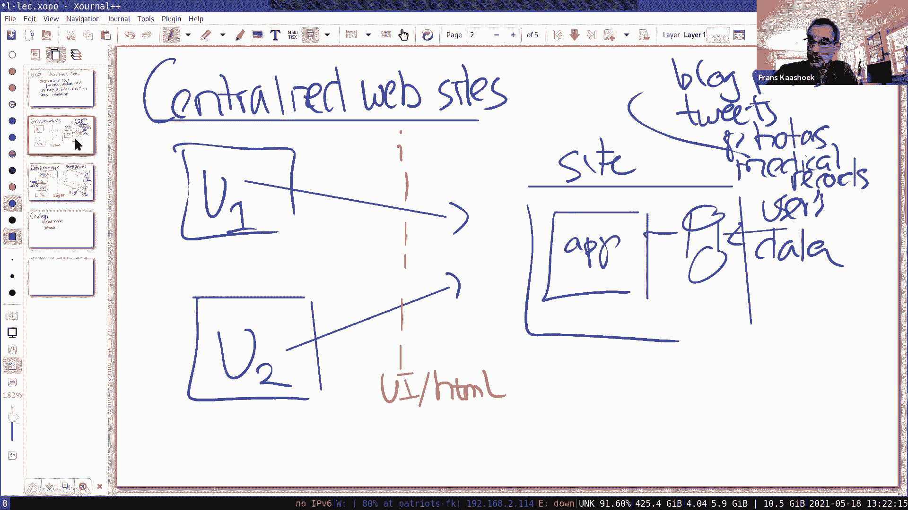
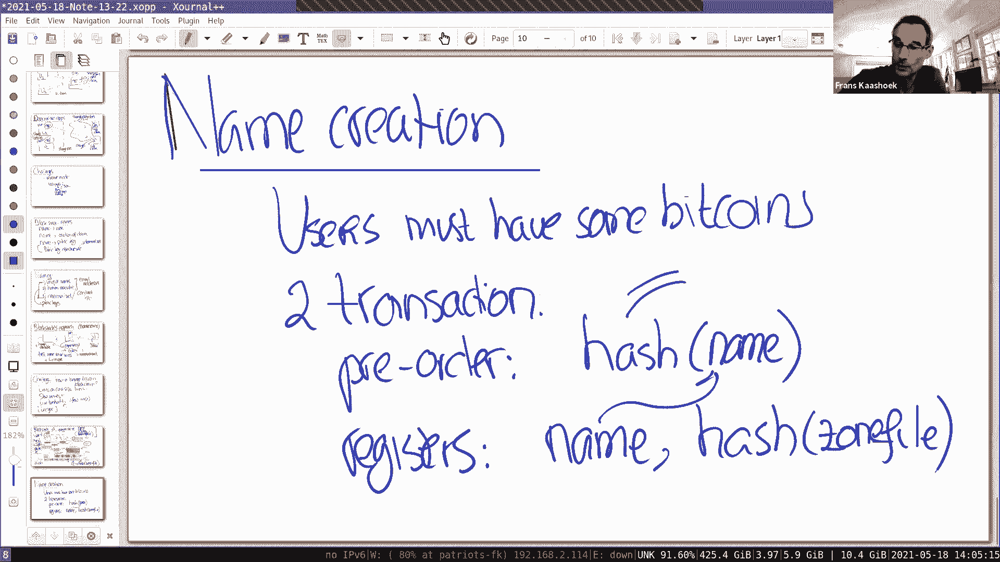

# MIT 6.824 2021 分布式系统 [中英文字幕] - P21：Lecture 20 - Blockstack - mayf09 - BV16f4y1z7kn

好的，谢谢。好的，就是，下午好，早上好，傍晚好，晚上安，无论你在哪里，我想欢迎来到本学期的最后一周，所以还有两节课，今天我们将要讨论的是 Blockstack ，周四，我们收到一份来自不同项目的报告。

来自多个 6。824 项目组。所以，今天是最后一次论文讨论。所以主题是，分配给我们的主题，分配给我们阅读的，是 Blockstack ，Blockstack 表示的是，一种构建去中心化应用程序的方式。

对于去中心化，我们这里的意思是，与中心化的网站不同，这个网站拥有数据，而去中心化的应用，系统以一种方式设置，用户控制数据而不是网站。这是最后一个[趋势]，是关于去中心化化分布式系统的三节课的最后一课。

我们谈到日志和日志签名，是构建这种去中心化的日志存储系统的一种方式，我们看到比特币，作为一个例子，如何在去中心化系统中达成一致，与不信任的参与者或拜占庭参与者。所以今天我们向前更进一步。

解如何实际构建完整的应用程序，而不仅仅是加密货币应用。去中心化应用有很长的历史，在 2000 年早期， 90 年代末，有很多点对点应用程序，它有一个分散的架构， Napster ，最近。

你可能对 Keybase 比较熟悉，它有一个去中心化的设计，或者 Solid(https：//solidproject。org/) ，当然还有 Blockstack ，有相当多的活动。

在这个去中心化应用程序的领域中。Blockstack 很有趣，从去中心化应用程序的角度来看，但也是一种非货币使用的例子，非货币使用比特币区块链。我们会看到，Blockstack 有很多有趣的方面。

但这篇论文关注的关键是命名，如何在构建一个分布式去中心化命名系统。当然，命名系统也被广泛使用，想想 DNS ，想想 Kerberos ，有很多不同的命名系统，它们被广泛使用，这是一种不同的设计。

其中最有趣的部分是，它是去中心化的。这节课有一点不同，与许多之前的课，前面的很多课都是，这是一个困难的技术问题，这是解决这个问题的解决方案，这里我们的情况略有不同，有一个困难的技术问题。

我们必须构建去中心化的应用程序，但是不是，百分百清楚的是，正确构建去中心化应用，是非常[]，还不清楚 Blockstack 是否是正确的解决方案，它更具实验性，Blockstack 有一个用户社区。

但这还不是压倒性的成功，并证明这是一条正确的道路。所以，从某种意义上说，这是一篇更发人深省的论文，而不是对一个特定的技术问题给出明确的答案。所以，这个更重要的主题是。

让我们参与一场关于这种设计的不同观点的讨论。所以在讲课的时候，如果我们有，有相当多的讨论不同的方面，我认为不会有一个正确的答案。所以，任何时候你有问题，或者对这些去中心化应用设计的方面有什么看法。

你可以说出来。好的，也许在讨论去中心化的应用程序之前，快速回顾一下，什么是常见范式，来构建网站或构建网络应用。这就是使用中心化网站，网站可能分布在世界各地的多个数据中心，但网站的设计架构是集中式的。

我们有，这是典型的网站，它的代码中有一些应用，无论是 Gmail Twitter Facebook ，它在数据库上运行，其中包含用户数据。然后我们可能有不同的用户，使用网络浏览器进行交互。

 U1 U2 ，他们通过应用程序与网站进行交互，他们创建数据，他们存储在数据库中，其他用户可以查看数据，应用程序将这些数据显示在网络浏览器中。数据可能是博客帖子，推文， Piazza 帖子，照片。

也许甚至更敏感的，医疗记录，等等。我们在网站上运行的应用程序，转换来自所有不同用户的数据，变成一些有趣的东西，比如其中集成了许多用户的时间线，进入一个时间线并展示给用户，我们要发表推文，上传和下载。

等等。这个设计的一个显著特点是，数据的应用被捆绑在一起，它们只是由应用程序网站所控制，无论是 Facebook Twitter Google 还是任何网站，用户之间的界面，或者用户和网站之间的分界线。

是 HTML 或 UI ，应用程序计算出用户将要看到的内容，它将通过浏览器显示，当然，应用程序可能在浏览器内部运行，比如 Javascript ，但与这个讨论并不相关，仍然是应用程序在网站的控制之下。

网站的程序员编写应用程序，应用程序操作 DOM ，填充到浏览器中。所以从用户的角度来看，交互，界面，网站和浏览器之间的界面仍然是 HTML 。所以这种设计显然是压倒性的成功，可能大多数网站。

可能你使用的所有网站，都遵循这种设计。这个非常成功的设计的一个原因是，我们稍后会讨论，因为应用和数据紧密结合，来自用户的数据，应用程序可以轻松访问来自不同用户的所有用户数据，把它融合在一起。

创造出创造性和趣味性的方式。但这种设计并不是完美的，你可能会希望能做得更好。在某种意义上，去中心化应用是对这些事情的一种回应，它可能不是百分百想要的。所以，首先，有一个非常简单的观察。

你不能创建另一个应用程序，网站决定了应用程序的外观，就是你会得到的用户界面，这很不同，比如，你自己笔记本的自己的应用，你想修改，编辑一个文本文件，你可以选择要使用的浏览器或编辑器。

你可以使用 Emacs Vim ，各种各样的文化战争，关于哪一个比另一个更好，但你有权选择你想要使用哪个。在这种情况下，情况并非如此，你使用 Gmail ，Gmail 不是最好的例子。

但是 Twitter ，Twitter 会决定应用程序的外观，Gmail 可能不是最好的例子的原因是，因为你可以通过 IMAP 下载你的电子邮件，然后运行自己的电子邮件程序，但对于许多网站来说。

用户应用程序数据非常受控制，你无法控制它。网站可能会修改谁可以查看哪些数据的规则，它可能并没有告诉你，所以你没有完全控制谁能看到你的数据，另外，网站可能会使用你的数据产生收入，无论是显示哪些广告。

并且窥探你的数据，或者在更糟糕的情况下，可能一个糟糕的员工，它窥探你的数据。这在某种程度上是你无法控制的，你真的无能为力，你把数据给了网站，现在是他们的了。所以这是一个痛点，这会让人想知道。

是否有一种设计系统的方式，它不遵循这种模式，而是遵循去中心化应用程序的模式。所以在这个世界中，我们仍然在互联网中，但我们有存储提供商，存储提供商不是什么真正复杂的词，它们并不运行应用程序代码。

它们只是纯粹地提供存储，比如 Google Drive 或 Amazon S3 等，但它们都是大的持有者，可能用户想要加密数据，但这才是我们的真正目标，用户决定数据所在的存储位置。

并且使它们处于用户的控制之下，所以不管什么存储提供商，S3 可能会有用户 1 的数据，另一个供应商可能有 U2 的数据，或者保存 U2 的数据，U2 可能对它进行加密，使存储提供商不能读取它。

并控制着谁可以对数据进行解密。然后应用程序是在用户自己的控制之下，所以这里的用户，U1 工作站或笔记本，它运行一个应用程序，这是 U2 ，也有另一个应用程序可能查看相同的数据。

但是一个稍有不同版本的应用程序，比如一个照片查看器和另一个照片查看器，为了构建显示给用户的是什么，应用程序将从不同的用户那里获取数据，例如， U2 与 U1 共享照片。

然后应用程序整合 U1 U2 的照片，通过从不同存储提供商获取照片。在这里，分界线在用户之间，分界线是这样的，在应用程序和存储之间有一条分界线，所以有一个存储 API ，你有统一的。

因为许多不同的应用程序使用相同的存储[]，也许这个应用程序创建 todo 列表，可能是一个照片列表，也许这是 Twitter 的克隆，检索来自不同用户的推文，并将它们整合在一起呈现给用户。

它是一种单一存储 API ，这提供了分界线，在应用程序和数据之间，当然，存储 API 必须是非常通用的，可以支持多个应用程序，而且还必须允许共享，在不同用户和不同应用之间，模块或权限。

假设你想要建立一个 todo 列表，在 U1 和 U2 之间，我们从 U1 的角度来看，可能会有一些操作，或在 U2 U1 一些共享操作，比如我的 todo list 的名字。

U1 可以下载 U2 的 todo 列表，也许会检查文件上的签名，来验证数据数据是 U2 写的，然后整合它，我们有自己的 todo 列表，展示 U1 或共享 todo 列表。

包含 U1 和 U2 的 todo 列表。这是一般的角度，用来构建去中心化架构的应用程序。到目前为止，有什么问题吗？好的，到目前为止，我们希望已经收到了，这个集中化方法的主要痛点之一。

用户仍然控制着数据，它不再属于某个特定的站点，用户决定谁，哪些应用程序和谁获得数据访问权限。我想这是想要的属性。但是，整个设计也面临着一系列独特的挑战，所以让我把它们中的一些列出来。

我们将在 Blockstack 的上下文中重点介绍其中的几个。所以有两大类的挑战，一个是商业方面的，盈利模式是什么，有人会让这些应用程序被采用，付钱让人们开发应用程序，所以它们变得非常好。

人们很乐意去使用它们。我不想谈这个，相反，我最关注的是技术挑战。这里有几个（技术挑战），我们先回来看看这张图片，存储 API 是关键接口，而且接口是最小的，而且它必须是足够通用的，但在通常情况下，它是。

它与这里的 API 不是一回事。

在应用程序和数据库之间。所以让我们这样做，稍等一下。

好的，希望每个人都能再次看到白板的屏幕？好的。所以，有几个挑战，我要指出的是，存储 API 通常不那么强大，文件系统 API 不如 SQL 强大，此外，并不是所有的数据，都放在一个地方。

你可以运行任意查询，以任何应用程序的方式集成它。所以这是一种挑战，应用程序依赖于这种能力，能够对所有用户数据任意查询，这在去中心化应用中更难实现，因为数据可能分散在很多不同的存储服务器上。

还有一些功能可能更难实现，例如，如果你想实现 eBay ，然后要提交某种出价，我们想马上下载那些出价，所以必须要有某些可信的方面，来整合了这些出价，然后决定谁是赢家，而不会事先透露这些信息。同样。

管理方面也存在挑战，通常，这些去中心化应用涉及加密密钥，所以，这通常是一种[]情景，一些用户丢失了他们的私钥，然后你不能再得到你的数据了，或者有人偷了你的私钥，然后他们就可以获取你的数据。

所以有一系列的技术挑战，要让这件事真正工作，其中一个，剩下的一个，也是这节课的主题，就是命名。所以，更广泛的挑战是，我想是对任何类型的去中心化应用基础架构的挑战。

当然在 Blockstack 的上下文中也是如此，但是在 Blockstack 情况下，我们会看到名字的重要性，以及为什么命名是一个挑战。好的，在继续之前，我只想在这里停一下。

只是给那些想问任何问题的人，对比这两种不同的构建应用程序的方式，无论是像传统模式那样的集中化，我们可能都很熟悉，或者这种去中心化的模式。所以，出价有什么挑战？挑战是什么呢？通过出价。哦，你需要一个。

应用程序需要能够访问用户出价，但不应该将它们透露给其他应用程序，这就意味着，应用程序看起来是，我是 U1 ，我提交了出价，我得到了 U2 的出价，但我的应用将 U2 的出价直接给我，因为这不公平。

那么你将如何做到这一点，所以你需要受信任的一方或任何协议，让这一切发生。谢谢。如果应用程序模型在你的工作站上运行，你可以修改应用程序，对吧。抱歉，在上一张幻灯片中，我想你也提到了，应用 1 不同于。

两个应用是不同的，你是什么意思？好的，举个例子，为了让比喻非常简单，这可能是 Vim ，这可能是 Emacs ，U1 和 U2 可以决定，使用哪个应用来修改它们的数据，今天在一个集中化的模式中。

这是不可能的，你不可能有两个 Twitter 应用程序，U1 与 Twitter 应用程序交互的一种方式，其他人用不同的方式来做，这就是 Twitter 应用程序。我明白了，谢谢。我有一个问题。

关于去中心化模型的设计，这个应用程序是否需要一个客户端，或者能不能，能不能有集中式应用在互联网上的标志。原则上，你可以在互联网上，关键的问题，它不一定要在用户的工作站上运行，可以在任何地方运行。

但是在用户的控制中，当然，如果编写它，但用户可以决定运行哪个应用来处理哪些数据。好的，所以这里最重要的是，应用选择你，你应该选择应用，重要的是，应用程序可以访问任何存储提供商。谢谢。好的。

还有其他问题吗？好的，那么名字，这会更深入了解 Blockstack 。让我来列出命名扮演的角色，首先，你有 todo 列表，你想和别人分享它，你必须能够命名要与其共享的用户。

所以有一个从名字到用户的映射，这是一个重要的角色，存在从名字到数据位置的映射。所以如果我的 todo 列表应用，用户 1 和用户 2 分享 todo 列表，然后，用户 1 想要用户 2 的数据。

需要有一种命名用户 2 的 todo 列表，并且获取它。然后有一种方法，有一个名字到公钥的映射，当我成功获取用户 2 的数据，可能想要验证它，是由用户 2 编写的。

因此可能使用用户 2 的公钥来验证获取的数据的完整性，因为存储提供商可能不是可信任的，这就要求，我能够以可靠的方式确定用户 2 的公钥。所以，你应该考虑到，在这些去中心化的应用程序的每一步中。

名字起着至关重要的作用。通用的名称给出，从名称到密钥的映射，至关重要的密钥，称为公钥基础设施。构建任何公钥基础设施都是相当具有挑战性的，你可能对 DNSSec 很熟悉，在万维网上有一种特殊的方式。

证书具有完整的公钥基础设施，Kerberos 是公钥基础设施的一个示例，在某些方面，这个论文，这篇论文所做的是，你将获得另一个公共基础设施，这是完全去中心化的。这是一个关键的方面。

Blockstack 中命名方案有趣的地方，这提供了去中心化的公钥基础设施。让我试着解释一下，为什么这是具有挑战性的，论文在几个地方提到了这一点，有三个方面是你想要的。

如果你想要一个一般目的的命名基础设施，你想要有唯一的名字，每个用户都有一个唯一的名字，这样你就可以识别，你所说的那个 John 或那个 Joe 。人类可读的名字，所以可以很容易记住。在这种情况下。

Blockstack 也想要的是去中心化。这篇论文的观点是，很容易能得到三个中的两个，但是很难得到全部三个，也许，让我们来看看几个命名系统，看看他们得到了哪两个。让我们来考虑一下电子邮件地址。好的。

电子邮件地址，它们是唯一的名字吗？是的。它们是人类可读的吗？是的。它们是去中心化的吗？不是。不，所以这个得到这两个，但没有第三个。随机公钥怎么样，或者论文使用文件内容的哈希值，来获取[]的名字，所以。

随机的公钥，意味着公钥是随机的，那么公钥，它们是唯一的吗？是的。是的。是的，它们是人类可读的吗？不是。不，它们是去中心化的吗？是的。是的，你可以生成它们，以一种独特的、完全去中心化的方式。事实上。

你在实验 3 中用这个生成 clerk id ，所以我们得到了三个中的两个，但没有人类可读的那个。让我们来看看，我们能获得人类可读和去中心化吗？你能想出一个例子吗？这是不是比如点对点文件共享？嗯。

这些文件不是唯一的，但它们是人类可读的，而且是去中心化的。是的，想得简单一点，想想你的手机，对我来说，这个例子是很好的，看看你的联系人列表，你的联系人的名字是人类可读的，你可以有 John 。

John 的条目有一个手机号，我可以在我的 John 条目有另一个手机号码，他们可能是不同的人，但我可以以去中心化的的方式选择名字，而且它们当然是可读的，它们是唯一的吗？不是，你有你的名字列表。

我有我的名字列表，它们可能会重叠，仍然谈论不同的人。所以这是论文试图得到的东西，实际上是三个中的两个，这很常见，或者很容易，但是获取所有三个，很难做到。在论文中，它就像，我们实现了这三个目标。

我们得到唯一的名称，用户可读的和去中心化的。他们得到这个的方法是，利用区块链。所以 Blockstack 方法，而且[]他们是公平的，这实际上不叫 Blockstack 方式。

他们采用的是 namecoins 方法。基本的想法很简单，我们将利用这个优势，比特币区块区块链的存在，当然，你也可以使用任何其他的区块链，但只是为了具体，我们考虑比特币的。所以这里有我们的链。

在比特币中的交易，随着时间的推移，矿工增加了新的交易，我们要创建命名系统的方法是，我们将发布不同类型的交易，他们都自称一个名字。例如，我们可能有特殊的交易，因为比特币中的每一笔交易都有一个元数据字段。

你可以将任何内容放入到元数据字段中，所以我们要放入的是一个名字记录。所以我们要做一些交易，然后我们在那里记下名字记录，你稍后会看到，但是这个名字记录的细节是，但在 Blockstack 的情况下。

它基本上是一个像 6。824 这样的名字，然后，也许正如我们稍后看到的，一个区域文件的哈希值。在这个方案中的基本规则是，第一个用户，第一个名字记录会赢，所以稍后可能，有其他人创造了名字 6。824 。

但因为 6。824 出现较晚，在比特币区块链中，我们会忽略这一点，只考虑有效的 6。824 名字记录，这完全是基于这样一个事实，区块链是所有发生过的操作的日志，它们是有序的，它们是有共识的。

以它们发生的顺序，从这个开始，我们已经构建了一个类似数据库，一个按顺序列出所有名字的数据库，从一开始就通过区块链，查找有效的交易，名字交易，并使用它来构建所有有效名称的数据库。在某些方面。

一些人指出了这一点，这不正是我们实验 3 所做的吗，我们有日志， Raft 提供了日志，我们把操作记录在日志里，我们执行操作，这构建了状态，状态在这种情况下将是命名数据库，我认为这是那种风格。

相同的想法，除了这里的微小区别，我们不是使用 Raft 获得共识，我们再次使用比特币或中本聪共识，实现一个区块链。但在本质上，是的，这非常相似。好的，让我们想一想，我们的三个属性，首先。

我们有唯一的名字吗？是的。是的，我们有唯一的名字，因为第一个会赢。它是去中心化的吗？是的。是的，按比特币的方式去中心化，共识和日志确保了，我们可以确定第一个名字是什么，我们就可以选择一个唯一的名字。

它是人类可读的吗？可以的。是的，没错，是的，当然，我的[流] 6。824 是用户可读的。好的，所以它看起来第一次带来了三个，看起来我们得到了三个属性，我们有用户可读，我们有唯一性，我们有去中心化。

我想 Namecoin 是第一个命名系统，证明了可以通过这种方式实现。现在，它并不是完美的，例如，即使我们有一些唯一的名称和用户可读的，我们不知道 6。824 到底是什么意思，6。824 ， 6。

824 指的是什么，是一个章节编号，或者是班级编号或其他什么，我们不知道如何解释名字，但它们仍然是人类可读的，它不是完美的，它不是唯一地识别世界上的某个用户，甚至就像你执行[]。

这并不能唯一地识别一个人，所以当你看到一个名字的时候，仍然有一个问题，比如它到底是谁。另外，还有一个类似的相关问题，为什么它不是完美的，这就像是，你怎么找到某人的名字，你如何找到[]名字，你如何找到它。

你如何知道哪条记录与哪个用户匹配，所以虽然这个系统很酷，因为它有这些去中心化的，唯一的和人类可读的方面，这并不是完美的，这些是通用命名系统的问题，但在这里也是如此，所以不是这种情况。

我们应该解决所有的命名问题，一气呵成，我们有很好的立足点可以合作，但这并不是百分之百成功。所以，问题，所以， Namecoin ，他们所做的是将这条记录添加到交易中？嗯，我想我们做得更多。

他们运行自己的区块链，独立于比特币，使用区块链，有很多，他们还有一系列的规则，比如，你要付多少 Namecoin ，来得到特定的名字，还有各种各样的其他扩展，我还没有提到，但他们遵循了这种方法。

是第一个这样做的，在论文涉及的许多务实问题中，我还没有提到。还有其他问题吗？好的，让我们稍微深入到一些实际问题上，尽管性质略有不同，我们想要讨论，它是通过，如何实现去中心化的应用程序和命名系统。

通过利用比特币。这里有一些很简单的务实问题，数据量是有限制的，你可以在交易中放的数据大小。所以，尽管也许有个名字是很好的，值绑定进入比特币交易，我们不能把我们的 todo 列表放在那笔交易中。

所以我们得有个方案，这部分是如何工作的。它的写入速度很慢，我们从上一节课上知道，它需要一段时间写入交易传播，在它们决定稳定之前，它不能再分叉，我们谈论的可能是链后面的四五六个区块，每个区块 10 分钟。

所以是一小时之后，所以这不是很酷，如果我们也将 todo 列表放在区块链内部，因为我修改我的区块链，修改我的 todo 列表，大概一个小时后，也许观察到了它，所以这看起来不太好，你想要更积极的应用程序。

有更多的数据需要操作，当然是一个问题，类似的，除了慢，还有慢吞吐量，慢带宽，在[]中，每秒只有几笔交易，我们有很多写入到文件中，很多时候，我们也，我们将通过区块链运行文件操作，所以，很明显。

我们必须要有一点，如果我们想为去中心化的应用程序构建通用的基础设施，将是一个更完整的故事，这允许我们得到快速的写入，高带宽写入，不在区块链中运行所有东西。这篇论文还讨论了另一个最后的问题，账本。

[增长]账本，我不会花太多时间来谈论这一点，但它也会发出，如果你，[]在论文中，你将启动一个 Blockstack 节点，如果你采用传统的比特币风格，你要逐一检查所有的交易，这将需要一段时间。

才能建立起完整的命名记录，特别是，在 Blockstack 的情况下有点烦人，因为区块链中的很多交易，与 Blockstack 完全无关，在那里，交易是一个完全不同的目的。

与 Blockstack 方法无关，Blockstack ，如果你使用比特币区块链作为你的基础，你必须通过一个解释器，看看哪些会应用。好的，我们将更多地关注前几个挑战，我们想做的是。

最大限度地减少区块链的使用，所以我们可以获得高性能写入或[]。这能理解吗？好的，这就是这个论文的核心，也就是，让我们调出图，这样我们就能看到它了，就是这张图。这是对一般方法的描述，这篇论文应对这个挑战。

我刚刚在上一块白板上展示的。好的，这是一张复杂的图，所以让我们一层一层地看，试着了解事情是如何工作的。所以在底部，这是比特币链，在比特币链中，有很多交易。

而这些交易中的许多与 Blockstack 完全没有任何关系。在这里写下 Blockstack 。Blockstack 位于，区块链中的特定区块，然后这是第二层，也就是 Blockstack 节点。

它们读取了所有这些交易，找出那些与 Blockstack 相关的，解释这些操作，构建一个带有名称的 Blockstack 数据库，转换为区域文件哈希值。所以我们看看这些操作，这里面的。

所以在每一个比特币交易中，正如我之前所说的，你可以有一些元数据，在所谓的 OP_RETRUN 字段，在 OP_RETURN 字段中，有一个名字，比如 x 加上区域文件的哈希值，这是某种绑定。

位于比特币中，Blockstack 使用比特币，使从名称到区域文件的绑定是唯一的，并以一种去中心化的方式。所以，像在实验 3 或任何其他类型的记录系统中一样。

Blockstack 节点解释这些特定的名称交易，查看 OP 字段，看到这个 OP 字段，例如创建了一个特定的名称，并存储在数据库中，从名称 x 到区域文件哈希的绑定，一旦，我们稍后会看到。

通常想要更新区域文件，你可能会看到 zone 的多个交易，用户更新那个 zonefile 的哈希值。当然，我们希望最大限度地减少这些变化，因为每一次更改都需要，需要修改或发布比特币交易。

在上一张幻灯片中，由于许多原因，这是很慢的，应该尽量避免它，而且，这会花费一些钱，我的意思是，这些交易需要一个过程。所以基本的方案，所以这个节点层，虚拟链层。

建立了从名称到 zonefile 哈希的映射数据库，当然，还可以过滤掉所有无效的交易，或者，新的 x 在第一个之后被创造出来。然后，使用 zonefile 的哈希，我们得到的。

应用程序可以定位 zonefile ，并且 zonefile 可以来自任何地方，因为我们必须对 zonefile 进行哈希，当我们收到一个声称是 zonefile 的文件时，我们可以重新计算哈希。

如果哈希与我们通过比特币交互获得的哈希相同，那么我们可以确定，这就是与 x 对应的 zonefile 。所以， zonefile 里是什么，在 zonefile 中是另一张表，是名字到 URI 的映射。

例如，你可能有一个 zonefile ，它可能是一个 todo 应用程序，这是一个 todo 条目，它指向一个 URI ，todo 列表数据位于这里。这里有两种类型的 zonefile ，一个是可变的。

一个是不变的，可变的具有 URI 和公钥，所以，这是公钥，是用来验证的密钥，文件是否由用户 x 写入，所以用户 x 通过这个 zonefile 发布，他或她自己的公钥，稍后。

当用户 2 想要查找用户 x 时，从 zonefile 中得到哈希值，哈希查找 zonefile ，检查 zonefile ，哈希值是正确的，查看 zonefile 内部，查找的 x 的公钥。

以及 todo 文件的 URI ，通常 URI 来获取真正的 todo 文件，使用公钥检查获取文件的签名，所有都检查了，然后用户 2 知道，我得到了用户 x 的 zonefile 。

然后可能像 zonefile 中的其他名字，无论用户访问推文，还是时间线，等等，对于每个应用程序可能都是一个条目，应用程序可能会达成一致，比如一个名称用于特定的应用程序。我们不会失去数据的不变性保证。

这些数据可能会被删除，然后你就不会有数据的哈希值，可能会丢失。你是什么意思， zonefile 丢失吗？是的，在链中，你不能丢失数据，因为它会被复制到足够多的地方，但在这里，这不是被保证的。所以。

 zonefile 也被广泛复制，在 Blockstack 的核心，复制了 zonefile 给每个人，zonefile 是很小的，例如千字节或什么，所以它们可以被复制到任何地方，好的？

然后对于 todo 列表， todo 文件 URI ，基本的想法是，你可以将相同的数据存储在多个提供商中，例如，你可能希望将其复制到 S3 ，也许你也会把它放在 Google Drive 上。

Blockstack 拥有存储服务器的一个原因是，不是因为它们存储数据，而是为所有这些不同的存储提供商提供统一的 API 。好的，就是这样。这能理解吗？好的，我提到 zonefile 有两种方式。

还有一种称为不可变存储，它包含了 URI 、名称 ，URI 、公钥和文件数据的哈希值。所以你可以检查，这是否是文件的最新版本，因为在这个方案中，你可以更新，x 可以更新文件，但对用户 2 来说。

很难区分，这是不是最新版本，这篇论文提到，可能版本号在其中，但如果你想保证是某个名字的最新版本，如果使用的是不可变存储，不变的存储包含文件的哈希，它唯一地标识特定文件的特定版本。这意味着。

如果你更新这个记录，然后，这意味着你更新 zonefile ，这意味着，你必须在比特币链中重新发布或重新创建一个日志条目，将 x 映射到一个新的哈希 zonefile 。好的，这就是这个系统的总体情况。

正如你所看到的，使用 todo 列表网站，用户 x 可以更新它的 todo 列表，不必在比特币链中发布新的记录，事实上，比特币链条中唯一需要创造的东西是，只有 x 的名字，当然。

 x 可能还有很多其他的名字，它们位于 zonefile 中，但是你知道，这个系统并不依赖于区块链上的每个操作，它绕过了许多这样的问题，如低速率、低带宽，以及限制，以及对交易记录中出现的数据的限制。

因为只有数据必须出现在交易记录中，就是这个名字加上 zonefile 的哈希值。抱歉，我们如何找到 zonefile ，如果只有哈希值？这是一个非常好的问题，我们并不关心，它来自哪里。

所以他们把这叫做路由层，基本上，你告诉路由层，嘿，我在找一个具有以下哈希值的文件，然后路由层会产生那个文件，你可以检查是否获得了正确的文件，通过重新计算哈希，看看是不是你要的那个。对于这个。

还有其他问题吗？抱歉，只是为了确认一下，文件存储或 zonefile 中的操作，仍然受到底层区块链的限制，对吗？是或不是，你是怎么想的？或者因为对文件的修改或更改需要新的哈希。

因此在区块链内形成新的日志条目，所以你仍然需要等待“被接受”，大概是一个小时，对吧。是的，没错，当你对 zonefile 进行更改时，它必须通过 txn ，例如更新 todo 列表，不需要比特币交易。

你根本没有更新 zonefile ，你只是更新 todo 列表文件，zonefile 只包含 todo 的名字、 URI 和公钥，但你没有更新其中的任何一个。我明白了，但是我们不是也存储文件的哈希值吗。

如果我们改变内容。这只是，有两种情况，有可变的存储和不变的存储，他们提出的是，对于不变存储，你不更新，你可以把文件的哈希值放在那里，但对于可变存储，将会看到大量写入，你不应该那样做，你应该用这个密钥。

我明白了，那么如何确认，使用可变存储，你获得了正确的数据。是的，这是一个非常好的问题，好的，你可以验证，你是否得到了，是否是由 x 产生的，因为你有 x 的公钥，你可以验证 todo 文件上的签名。

用 x 的公钥进行验证，所以你至少知道是 x 写的，你可能不知道这个最新版本，所以论文没有详细地讨论这些，在基本系统中，我们可能必须在其中插入版本号，至少你可以检测到回滚，这有点困难。

我也不知道该怎么做，你不能确定你得到了最新的版本。但是对可变存储的修改来自哪里？你的 todo 文件在这里，比如这里， todo 文件，如果一个应用程序。

可能是 todo 列表应用程序想要更新 todo 文件，只管去做就行了，然后使用公钥对其进行签名，并将其给指定的 URI 。这是否也通过路由层来完成，因为你想找出存储在什么地方。是的。

所以用户 2 将获取 x 的 zonefile ，一旦它有了 x 的 zonefile ，它知道 todo 文件的位置，因为这里有 URI 在 zonefile 中。再次，他们可以取回它并检查签名。

关于这里的 URI ，在 zonefile 中，每个名字只有一个 URI 吗？我不知道，不清楚它到底是怎么工作的，抱歉，我需要检查一下源代码，并查看特定格式的 zonefile 。由于我们发布公钥。

与 zonefile 中的所有其他数据一起，是不是意味着我可以编造一个私钥，匹配公钥，在其中插入一些东西，然后说我是用户，因为它们提供了公钥，所以我能不能撒谎？嗯，你不能篡改 zonefile 。

因为 zonefile 的哈希值，必须与区块链中的哈希值匹配，所以，只有进入区块链记录的版本，将 x 映射到哈希 zonefile ，只有那个人才能产生那个 zonefile 。我明白了，谢谢。好的？

好的，所以这是一幅大的图景，如果你得到了这个部分，然后其他一些细节，重要或不那么重要的，这是要理解的关键事情。好的，有几件事我想说一下，我特别想更多地讨论一下名字创造，因为有几个小细节，很有趣。

命名有两个部分，首先，用户当然需要一些比特币，因为你需要支付，你必须拥有一些比特币的原因是，因为你必须说服其中一个矿工，将你的交易纳入比特币账本。所以你创建的每个名字都有两笔交易，一种是预购交易。

在预购交易中，你不会把名字列出来，而是名字的哈希值，所以，任何收到预购交易的人，不知道名字是什么，但是知道这个名字的哈希值是什么。然后是第二个交易真正注册名字，它包含了实际的名字。

我们首先发布 zonefile 的哈希值。那么为什么要这样做，这实际上是 Namecoin 所做的，他们在这里采用 Namecoin ，为什么要这样做？因为如果你直接宣布名字，然后其他人可以[]你。

并尝试在你之前注册这个名字。是的，这是一个常见的问题，从前面开始的问题。

糟糕，又来了，抱歉。

所以领跑者问题准确地描述了，假设你尝试注册 google。com ，如果有人看到你这么做，你当然会提交一笔交易，还没有进入区块链，例如，一个矿工看到，或者其他在比特币网络中的人，并决定领先。

并试图获得我的交易，在你之前，声称 google。com 进入比特币，现在我拥有 google。com ，所以，为了避免这个问题，你首先必须将哈希值输入比特币链中，然后你等待一段时间以确保。

这一记录位于比特币区块链中，你有六个或十个区块，然后，在你确定之后，你将名字刻在区块链中，在这一点上，你进行真正的注册。关于这一点，我有一个问题。所以，什么，为什么攻击者不可能，预先计算 google。

com 的哈希值，然后查看区块链，看看有没有人发布了 google 的哈希值。是的，绝对是，是的，所以绝对比这个稍微复杂一点，只是纯粹的哈希，还有很多参数进入，它包括 nonce 或其他东西，否则。

你可以创建一个字典。在某些方面，这不是他们的发明，就像我之前说的，它来自于 Namecoin 。好的，让我们回到协作应用程序，对于协作性去中心化的应用程序。以我们的 todo 列表为例。

看看它到底是怎么工作的，所以再次勾勒出来，它是如何工作的，所以有两个用户，运行 todo 列表应用程序，这里是 U1 ，这里是 U2 ，它们互相交换了一些信息，使用某种方法。

U1 已经知道了 U2 的名字，U2 也知道了 U1 的名字。当然，这一步必须要发生，它必须安全地发生，U1 需要知道 U2 的名字，然后它们可以，U1 可以查询 U2 的名字。

获取它的 zonefile ，在 zonefile 中找到 todo 列表条目，zonefile 也包含公钥，这可能不是，U2 可能有许多公钥、私钥，因为你可能不想拥有一个主私钥，用在所有地方。

因为如果你使用那个主私钥，或者一些人是不好的，所以，通常我认为在区块链中，每个应用程序都应该有一个私钥。所以， U1 在 zonefile 中查找 U2 的名字，以及 todo 列表公钥和 URI 。

通过 Blockstack 文件系统，它跟踪不同的存储提供商，并获取实际名称、实际文件，检查文件上的签名，也许是版本号，然后用它来构建 U2 中的 todo 列表，并与 U1 的一起起作用，同样地。

 U2 也是一样的方式，U1 的名字，然后继续，是 U1 的 todo 列表，通过这种方式，他们可以拥有一个协作应用程序，所以，当 U2 更新它的文件时，然后， U1 的应用程序定期。

获取新的 todo 列表，看看有没有什么更新。这能理解吗？你看这里，我认为这是去中心化应用程序的中心点之一，这种应用程序构建使用一种很不同的方式，而不是我们之前谈到的，如果我们回到这张集中式站点的图片。

我们构建了一个 todo 列表应用程序，在数据库中，有 U1 的 todo 列表和 U2 的 todo 列表，以及 todo 列表应用程序，获取这些 todo 列表的内容，使用一个简单的 SQL 查询。

然后把它们放在一起，呈现给用户，当我们看到在这个去中心化的方案中，这涉及到更多的机制，才能实现这一点，在程序中，它没有与集中式案例相同的简单的 SQL 接口。所以我认为这可能是症结之一。

这些去中心化应用程序，如何才能简单编写去中心化版本。好的，我想留点时间，进行分组会议室，留下一些时间提问或讨论，但因为这是一种更发人深省的练习，比起一个练习，这是一个棘手的技术问题，这是正确的解决方案。

这是了解正确解决方案，然后使用它。所以，想听听人们的意见或问题，关于这些去中心化应用程序与中心化应用程序的任何方面，然后是 Blockstack 的设计或任何其他问题，我们可以一起讨论。等等。

最大的困难是什么，使用文件系统 API 而不是使用关系数据库？好的，你怎么写，你怎么呈现全球关系数据库，所有这些用户文件，所有这些文件将是不同的用户，在各种不同的存储提供商中，你不能做任何事。

你不能在所有存储提供商之间进行 select ，这太疯狂了，你也不能把所有的用户数据下载到你的计算机上，因为那太昂贵了。关联数据库，会怎么样？我想这是[]研究人员要去追求的。

但你可以构建一种可伸缩的数据库基础设施，其中用户仍然控制位于不同位置的自己的数据，并提供一种关系型数据类型接口，显然， Blockstack 不能提供给你。是的，另一个问题是。

这种去中心化的 PKI 与信任网络 PKI 相比有什么好处，我想它也是去中心化的。是的，所以其他，也许是这里的一些要点，还有其他信任网络 PKI ，信任网络 PKI ，我最熟悉的是 Keybase 。

我想我们在之前提到过几次，Keybase ，我们没有详细讨论过这个，但是，同样挑战这类系统的一件事是，你如何表示用户组，比如我们在 SUNDR 的论文中看到的，有组名，组名的公钥，如何创建和管理它们。

如何将它们插入其中，如何将这些合并到名称记录链中，Keybase 是一个为此而战的故事，非常令人印象深刻的真相，可能是最好的去中心化的 PKI ，最深思熟虑的是，它们可能是使用最广泛的。

那么像 Blockstack 这样做有什么好处吗，或者它只是更具可扩展性？好的， Blockstack 得到的一件事情是，是这个唯一的特性，因为信任网络，没有一个全球命名系统。

比如我的 todo 列表或者我的联系人列表，不管怎么命名，如果我对某个公钥有一个名字 John ，那就是我的 John ，如果发送 John 给你，比如字符串 John 。

它在你的联系人列表中的解析可能与我的不同。所以，事实上， Keybase 更多是去中心化的，但它并不适用于全球唯一的名称，这种情况下， Keybase 偶尔发布，所有名称的哈希。

以及区块链中所有名称的完整的 Merkle 树，这样你可以确认 Keybase 不是玩那个游戏，但是，还有更多，它没有全球唯一的名称。抱歉，我只想确认一个问题，在课程的前面部分，你提到了用户如何拥有。

他们可以选择向谁显示他们的数据，或者他们允许谁访问他们的数据，但我不太确定我看到了，这是如何在那个系统中实现的。好的，这里有方法，有一种做的方法，我不确定 Blockstack 是怎么做的。

你为不同的用户加密相同的数据，如果你只想与用户 1 或用户 2 共享数据，然后，你使用用户 1 和用户 2 的公钥进行加密，然后只有这两个可以解密它，这就为你提供了访问控制表。我明白了。

所以对于每个你想要提供数据的人，你必须用他们的公钥对其加密。你可以在这方面变得更复杂，你可以拥有组密钥，给一组用户一个秘钥，其中包含组密钥，使用不同用户的公钥增加密钥盒，然后他们访问那个密钥盒。

他们从里面拿到了密钥，然后他们可以对密钥解密，所以，你只需对数据加密一次，而不是多次，你必须对密钥盒加密多次。谢谢。这将降低 zonefile 的内容级别，对吗？是的，可能是。

或者 zonefile 的密钥是密钥盒的，同样，我不是百分之百确定，Blockstack 文件系统如何控制，它所做的一切，但其他人做过这样的设计。你认为这样的系统能够与集中式模式竞争吗。

在性能或可伸缩性方面，那要付出什么代价。我不知道，好问题，我不知道答案，它是这种情况，即使最简单的规模也不是那么容易扩展的，我们已经读了相当多的论文，了解如何让它们在数百万用户之间进行扩展。

所以你知道两个，要让大量的用户获得任何东西并不容易，当然，在去中心化应用程序的情况下，这也不容易，但另一方面，如果不是通过共享，比如用户 1 只需要分享给其他 10 个用户，这可能不是什么大问题。

在某些方面，你可以认为去中心化的体系结构，是按用户划分的，每个应用程序都在用户的一台计算机上运行，所以，你不需要数据中心的缓存，所以我不知道这个问题的答案是什么，我不能给你一个确定的答案。很明显。

人们已经证明了，这些集中式设计具有更大的可扩展性，至少到目前为止，我们看到去中心化的一次，但其中一个原因当然是，集中式设计被广泛使用，最受欢迎，部署最多的案例。我想，对我来说，去中心化设计是有趣的设计。

而且可以让它发挥作用，这会很酷。大家还有什么想法，或想讨论的？我仍然觉得在存储方面是，就像 William 指出的那样，比如你可能有一个不变的文件，它是用户信息，但是你在其他地方拥有的可变文件。

这是个大问题吗，在这种情况下，我真的不明白，如何确保冗余，对于你可能拥有的大量可变存储。是的，我认为冗余的答案可能不是那么困难，我认为用户对冗余负责，所以，如果你拥有 todo 列表文件。

你的工作是多次复制它，所以 Blockstack 服务器可以为你做到这一点，但你必须安排空间，和不同的存储提供商来做到这一点。所以我认为在论文中，他们谈论的是。

你可能复制到 Google Drive 和 S3 ，可能 S3 内部也有自己的复制，所以希望，也许只考虑 S3 ，它应该是相当可靠的，可能比将数据存储在固态硬盘上更可靠，在你的笔记本电脑上。

zonefile 很小，所以它们被广泛复制，你不必信任存储提供商。还有其他想法吗？我在想，这有点浪费，为了注册一个名字，要使用这个名字系统，你必须付费，是的，所以我是在考虑基于区块链的系统。

你必须激励矿工，但也许还有一种不同的更便宜的方式。是的，我不确定，在某种程度上，它是一种货币，这在某种程度上是非常[]的，因为你提到的原因，因为你有矿工，你必须激励他们，我认为总的来说。

这些交易都很便宜，你只需要付足够的钱，矿工们愿意把你的交易包括在内，你知道，在今天，如果你想在 DNS 中注册一个名字，你也需要付费，是相当多的钱，不是免费的，我不知道经济学到底会如何运作，但很明显。

这是一种成本更高的方式，除了也许你用电力燃烧地球之外，至少在比特币的例子中。也许你应该使用一个权益工作账本，而不是，好的，权益证明而不是工作量证明账本。把它替换掉是可能的，替换。我想这是论文所讨论的。

他们的设计不是很依赖于底层的区块链，他们可以很容易地切换到另一个区块链，事实上，这是第二个工作的区块链，他们首先使用 Namecoin ，然后改用比特币，我认为论文中的论点是。

我们可以切换到另一个我们想使用的区块链。名字历史中具体存储了什么？在，抱歉，问题到底是什么？哦，抱歉， Blockstack 数据库中的名字历史记录。是的，这个，是的，我不是说这三个。是的。

zonefile 的不同版本。哦，所以就像版本号一样。是的，我想是的，我不是百分之百确定，但是，但这些对应于 zonefile 的三个更新，这是第一个，这是第二个。

也许他们继续使用 zonefile 的版本。大家还想提出其他什么话题吗？好的，我们要结束这段时间，好的，让我们在这里停止，所以人们需要离开就离开，我希望周四能见到大家，我要去看八个，我们有八个设计。

八个项目，八个团队将在周四展示他们所做的，而不是实验 4 ，项目非常酷和有趣，所以希望你能从中得到乐趣，这就是这节课的总结，希望一点，目标就是一点[]，讨论了去中心化设计，可能是用户在他们的数据上。

我们看了 Blockstack ，至少一个特定的设计，他们是如何以某种方式命名的，给出了全球名称，唯一名称和人类可读，好的？这节课到此结束，希望周四能见到你，将是我们最后一次课程。如果你有任何问题。

请随时留下来，你可以谈论。教授，对于演示，我们是不是做一些更多的演示，或者我们应该准备幻灯片，或者两者都有。是的，我们贴了一些说明，你可以自由地去做你想做的，你想做的是说服全班同学，做了什么。

为什么很酷，演示 demo 是个好主意，你的时间不多，所以我认为最典型的做法是，人们有几张幻灯片来解释他们所做的，然后可能还会制作 demo ，看看它是如何实现的。好的，好的，谢谢。是的，我们不指望你。

在几个小时内为这个做准备，试着分享你所做的。好的，谢谢。我只想问一下，所以这是什么原因，使用比特币相同的区块链，把命名的交易记录放在那里，再加上其他所有的东西。我想这些论文。

他们开始在 Namecoin 上构建，这是一种用于命名的特殊用途的账本，他们发现了，Namecoin 的安全问题，其中一个是矿工并不多，它观察到有一些矿工池，有 50% 以上的工作容量。

因此可以做他们想做的任何事情，到账本上，所以他们在被广泛使用的区块链上，不容易被对手超越。好的，我记得那 51% 。好的，理解了。我还想问一下，zonefile 存储系统的 URI 。

不是 S3 之类的东西。可能会是，问题可能更普遍，因为它是由 Blockstack 文件系统解释的，Blockstack 文件系统有用于不同存储提供商的后端。

不管是 S3 还是 Google Drive 还是什么，所以有一些命名方案，Blockstack 文件系统可以解释，然后找出如何从正确的后端检索正确的文件。这只是为了让它们变得一样。是的，没错。

通常应用程序编写者并不在乎，无论是存储的 S3 还是 Google Drive ，或者[]必须处理这个。非常感谢。不用谢。我有一个问题，为什么 Zooko 三角是，我认为人们想的很多。

似乎你可以有一个客户端来解释人类没有意义的数据，你可以让所有的数据对人类有意义，在客户端侧到用户，所以我不能完全确定，这里的创新之处是什么，或者为什么这是一种权衡。是的，我想这是。

我能给你的最好的幻灯片，我能给你举一大堆命名的例子，三个中的两个，但不是所有的三个，例如，我们讨论过 Keybase ，去中心化的，不是唯一的，现在你会争论，什么时候拥有全球唯一的名称很重要。

一个全球唯一的名字，比如 6。824 是什么意思，以及与之相关的人，所以如果你是从那个角度来看，我认为这是一个非常合理的问题。谢谢。有一件事一直困扰着我，当我们读这些区块链类型的论文时。

比如一百年后会发生什么，当账本得到数万亿，数万亿字节或什么东西。嗯。我们是不是没有避免方案，接下来会发生什么？我不知道，很难推测未来的一百年，我想，你可以做的，所以你设置一个检查点，是的。

我能想象出多种摆脱困境的方案，一个你可以在状态设置一个检查点，建立在账本上，并将检查点的哈希值包括到帐本中，然后，只要你可以广泛复制检查点，然后你可以从检查点开始运行，截去开头的部分。

这与你在实验中做的一样，Raft 所做的。这样做的一方是必须得到信任还是？我们所做的，想必客户 1 必须跟着走，意识到他们到达那个检查点，你将能够构建世界的当前状态，我假设这需要一些关键的改变。

可能需要一些分叉。这不是什么大问题，通常比特币的汇率，因为交易数量，每秒钟你可以做的很少，如果你还记得比特币论文上的内容，有一些计算，比如总的大小是多少，如果你这样做，另外，你还记得在比特币论文上。

有很多优化，你不必记住每一枚币的每一笔交易，你必须记住每一枚币的最后一笔交易，你可以这样做，只记住区块头而不是完整的区块，所以，比特币对这个问题有某种内置的解决方案。我明白了。

所以主要的瓶颈是当新机器出现时，它们需要验证[]，但在那之后，事情就相对更优化了。谢谢。好的，这就是今天的。

