# MIT 6.824 2021 分布式系统 [中英文字幕] - P22：Lecture 21 - Project Presentations - mayf09 - BV16f4y1z7kn

只要你想做好准备，就可以开始了。好的，那我们开始吧。请。好了，大家好，我是 Felipe ，我和 Caralina 一起工作，今天，我们将介绍，我们的分布式私有电子投票项目。

所以这个项目的动机其实很简单，给出当前的事件和选举，必须在[秘密的]限制下发生，所以，我们提出了这个问题，[]投票将如何运作？我们特别关注维护选民隐私，或者让投票保密。以下是投票系统的工作原理。

你有一些选民，在这种情况下，有五个，然后是一个计票器，选民把他们的选票送到机票器，而计票器是，也许他们会加密发送，或者某种安全措施，机票器解密它们，确保每个选民最多投票一次，并计算出获胜者。

所以这里要注意的关键是，为了使计票器确定每个选民最多投一次票，每一张选票都必须以某种方式与选民联系在一起，这很危险。我们将在这里解释我们的威胁模型，也就是我们给了攻击者两种能力，或者两种力量。

第一种是制造崩溃停止失败，但不是拜占庭式的失败，这样攻击者就可以使服务器崩溃，但它不能让它行为不端。这是否有一个合理的假设是另一个问题，但我们认为还有其他协议可以处理这个问题。

我们不是在处理拜占庭式的失败。我们给他们的第二种力量是，监视计票器上的人，所以这是有问题的，因为正如我们所说，选票与他们的选民是联系在一起的，所以，一个被动的攻击者，对服务器的间谍活动。

可以在某种程度上取消这些投票的匿名性。这就是我们的用武之地，并展示我们的分布式投票设计，我们要处理第一个问题，也就是对手使服务器崩溃，我们将有几个投票器，我们的想法是。

每个投票者都会把其他选票送到所有的投票器，而计票器将使用与之前相同的协议，来计算获胜者，[]获胜者，抱歉，这很好，因为再加上一个崩溃，比如 n-1 个计票器，只要其中一个还在运行。

我们就能够计算出获胜者。然而，这是非常不安全的，对于第二种类型的攻击来说，这是被动的[很好]，因为作为一个对手，攻击者甚至可以危害一台服务器，它可以取消匿名投票。

这就是我们要介绍 Shamir 秘密共享，对于 Shamir 秘密共享，我们有一个投票器，这将是，选择一个投票 0 或 1 ，我们会，我不会解释 Shamir 是如何工作的，它是一种加密协议。

但我们要展示它允许我们做什么，你通过 Shamir 传递投票，给它两个参数， n 和 k ，它将产生 n 个部分，允许你重新计算选票，这 n 个部分可以完全随机，事实上，最强大的是。

但是 Shamir 即使是 k-1 个部分，也不会给你提供任何关于原始投票的信息，但如果有 k 或更多的部分，你可以使用 Shamir 重新计算那个选票。所以，我们将展示 Shamir 投票方案。所以。

现在，对于 Shamir 投票方案，首先，所有的选民要选择他们的选票，并共享部分计票器，以及对不同部分的完整投票，两个计票器都将接收部分，当它们得到所有选民的部分时，它们将这些部分相加。

并将 SUM 分享给机票器，所以这里需要注意的是，这个 SUM 看起来完全是随机的，所以，通过与两个计数器共享它，其他两个计票器，它们无法了解任何关于 a 收到的部分的信息，所以。

这保证了选民的隐私得到维护，所以他们交换了他们的选票，当机票器收到 SUM 时，来自其他选民的包括他们的一部分，他们最终可以计算出获胜者，所以再次使用 Shamir 秘密共享，黑色盒子。

它会像重新计算 sum ，如果我们得到的选票超过选民总数的一半，那么获胜者就是 1 ，如果小于，则获胜者是 0 ，是的，我们最终有了获胜者。现在，我们方案的一些假设是，首先，选民和计票器都表现良好。

并遵循协议，或他们的部分听起来是善意的，我们使用这个方案只处理故障停止失败。所以，现在来处理一些情况，首先，如果我们有一个不可靠的网络方案，我们在服务器中发送的所有 RPC 都将定期发送。

直到我们收到它已被接收的确认，然后为了处理选民失败，所以我们需要持久化所有选民，比如持久化他们计算的部分和他们的投票，因为如果我们重新计算部分，然后计票器有不同的部分，那么方案的正确性就会消失。

他们将不能修正 sum ，所以，重要的是始终共享来自同一计算的部分，而不修改部分，最后，为了处理计票器失败，这里我们依赖于 Shamir 秘密共享方案，正如我们之前提到的。

我们只需要 k 个服务器来计算获胜者，所以，系统[] n-k 个计票器崩溃。

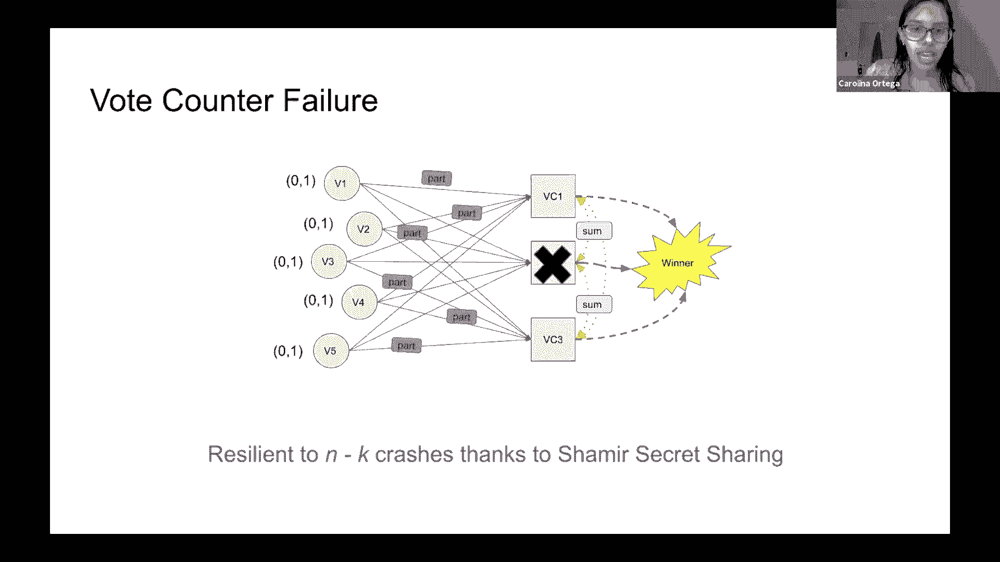

现在是演示时间，所以，我停止共享屏幕，并共享另一个屏幕。这是我们的 demo ，我们这里有 5 名选民，我们有 3 个投票器，5个投票者，而且 k 等于 2 ，这意味着网络是不可靠的。

现在如果我们运行它，在这里，我们有 3 个，我们得到的获胜者是 1 ，我们也可以让其中一台服务器崩溃，因为 k 等于 2 ，我们仍然可以通过只有两台服务器运行来计算获胜者，所以现在如果我们运行它。

我们得到的选举获胜者还是 1 ，我们的展示到此结束。

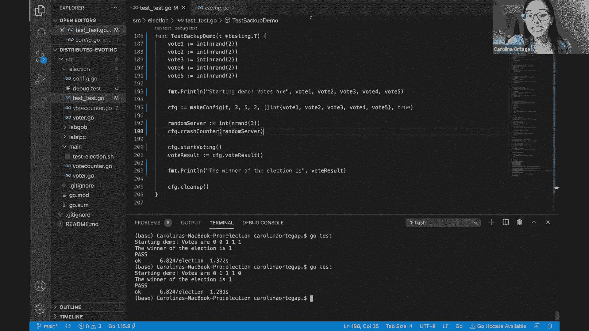

非常感谢你的收听，我们将回答一些问题。请随意提问。好奇的是，你测试这个系统的范围有多广，比如，你有没有尝试过不同的其他配置，你们有性能数字吗？当然，我们确实有不同大小的，我们创建了一整套测试套件。

确保测试投票者故障，服务器故障有不同的大小，我们没有性能数据，我们没有测试过，但就失败而言，以及不同数量的投票者，投票器，是的，我们有一套完整的测试套件，我们应该把链接放到 github 上。

但是我们可以把它发给你，如果你想要的话，你可以在测试中检查查看实现。好的，还有问题吗？你能说点比如 6。824 的想法吗，你在这个系统里应用的，而不是使用测试框架。当然， Caro 你想要说这个。

还是我来？当然，所以在这里，我想，这个游戏来自，密码学课上的披萨，所以，从不同的角度来看它是很有趣的，现在我们关注安全问题，我需要，如果个别的服务器会发生什么，如果它们失败了。

无论是处理投票者故障、处理投票器故障，还是网络问题，我想我们没有解决分区问题，因为它的工作原理类似于投票器，但是，从不同的角度来看待这个问题是很有趣的。好的，谢谢。除非你有话要说，我们有点超时了，所以。

好的，酷，干得好，谢谢分享。好的，我们有一个关于私有分析的演讲。如果 Kevin 准备好分享，太棒了。

请开始，我会准备好的。好的，你们能听到我的声音吗，你们能看到我的鼠标吗？是的。好的，酷，各位好，我是 Kevin ，今天，我将介绍这个非常有创意的命名为 Sys 的系统。

这是一种以保护隐私的方式收集汇总统计数据的系统，所以上一个演示很好地引导了我的项目，在 6。824 的大部分时间里，我们已经讨论了，如何在拜占庭或[]故障的情况下建立可靠的系统，所以服务器可能会崩溃。

客户端通常都表现得很好，但从这次演讲来看，我希望你能学到一些新概念，关于我们如何在出现拜占庭式故障的情况下建立具有强大保障的系统，代表系统内的客户端和服务器。我们要使用的主要工具。

用来实现这些保证的是加密原语，例如多方计算和零知识证明，以及广播之类的分布式计算原语，比如广播。好的，为了简单起见，假设我们想建立一个计算和的系统，所以，我们将拥有一个聚合服务器，存储键值存储。

键将成为某些统计数据的索引，值将是和的元组，我们会有一堆客户端，所以每个客户端都会有一些身份，比如它的客户端 IP 地址，它会有他们想要增加的统计数据的索引，而且它也将有它的私有输入。

所以最直接的做法就是，我们可以让所有客户端按原样将其输入发送到服务器，它们可以计算和，但显然这很糟糕，因为现在这引领了一切，服务器将获知客户端的身份，它将获得发出的索引，它将获得它们的私有输入。

所以我们可以做得更好一点，我们可以私下计算这些和，如果我们部署到非合谋服务器，然后，我们将让每个客户端，秘密地将它们的输入共享到每个服务器，正如我们在上一次演示中所说的。

每个服务器、每个签名本身都不会泄露有关客户端私有输入的信息，但服务器仍然可以将这些份额相加，并计算出一个键值存储的本地版本，然后稍后当服务器想要恢复实际和时，它们可以合并它们本地的键值存储。

重建全局键值存储，这个好了一点，至少如果这些服务器中有一个是诚实的，那么服务器仍然会获知客户的身份，它们仍将获取客户的索引，但现在不是获得每个客户端的输入，它们将获得所有客户端的和和输入，好的。

这样好多了，但这仍然是个问题，也就是，这个身份索引关系仍然可以泄露大量信息。那么我们如何才能解决这个问题，我们可以让事情匿名，所以，我们仍将调整[]的设置，现在我们给每台服务器提供一个公钥用于加密。

并且每个客户端都将对其每个份额进行加密，并且不是让客户端将它们的份额直接发送到服务器，现在，我们将在两者之间设置一层转发代理，所以接下来会发生的是，客户端将通过广播将其加密的共享发送到这些代理。

并且代理将每个共享发送到它们各自的服务器，然后聚合可以像解释的那样进行，那么，这里的隐私保障是什么，如果这些[财产]中至少有一个是诚实的，代理仍将获知客户端的身份，它会获得一些计时信息。

基于客户端何时设置共享，但没别的了，因为共享被加密到服务器，所以它们没有从中获得任何东西，如果这些服务器中至少有一个是诚实的，服务器也会获得一些计时信息，基于代理转发它的时间，它还会获得统计的指标。

并获得和，但最重要的是，只要代理和服务器不是同时受到危害，然后，这个设计将身份与被导出的索引解除链接，这正是我们想要的，所以这很棒，但这也导致了另一个问题，也就是说，现在客户端可以躲在隐私后面。

以及匿名保证系统发送错误的输入。假设系统预期客户端输入为 0 和 1 ，在这种隐私的后面，现在客户端可以通过系统发送 10 亿的签名，现在它可以在无法察觉的情况下扭曲这个和，所以，很明显，这很糟糕。

我们来解决这件事，我们想让这个系统更强大，所以我们要做的是，我们将让每个客户生成，所谓的对它们分享的零知识证明，并将这些发送到服务器，许多服务器收集这些零知识证明，它们可以交互地检查客户端的输入。

实际上，客户端共享重建为一些格式良好的输入，因为这个证明是零知识的，它没有留下任何关于输入的内容，除了它是格式良好的，所以我们的隐私属性又一次保持不变，代理仍会获得客户端的身份，仍能获得一些定时信息。

服务器获知定时信息，它获得索引和获得和，但现在我们已经保护系统不受恶意客户端的攻击，因为它只接受格式良好的输入，所以这很棒，还有另一个问题，就是服务器可能会崩溃，我们可能会丢失数据，所以。

我们显然需要两台服务器都在线，以便重建全局键值存储。所以，如果我们想让系统更可靠，我们可以做我们最了解的事情，即复制服务器，所以我们可以使用 Raft 风格的复制，或者，我们也可以使用主备份式复制。

现在的问题是，好的，所有这些复制，所有这些加密机制，在这条消息路由上，我们还能实现很好的吞吐量吗，事实证明，我们可以在这里并行服务器步骤，提供证明验证[]，这很可能是系统的瓶颈，接下来会发生的是。

代理要对分区进行哈希，它们对每台服务器的输入，然后这些服务器中的每一个都处于 reduce 步骤中，将合并它们的中间键值存储，以重建包含所有和的全局键值存储。好的？所以现在最后一个问题是。

我是不是在到期日之前实现了这个，很遗憾，没有，但我确实走了很远的路，所以，我将展示一个简单的 domo ，它的非复制、非并行版本。所以我要快速切换到我的另一台笔记本电脑。

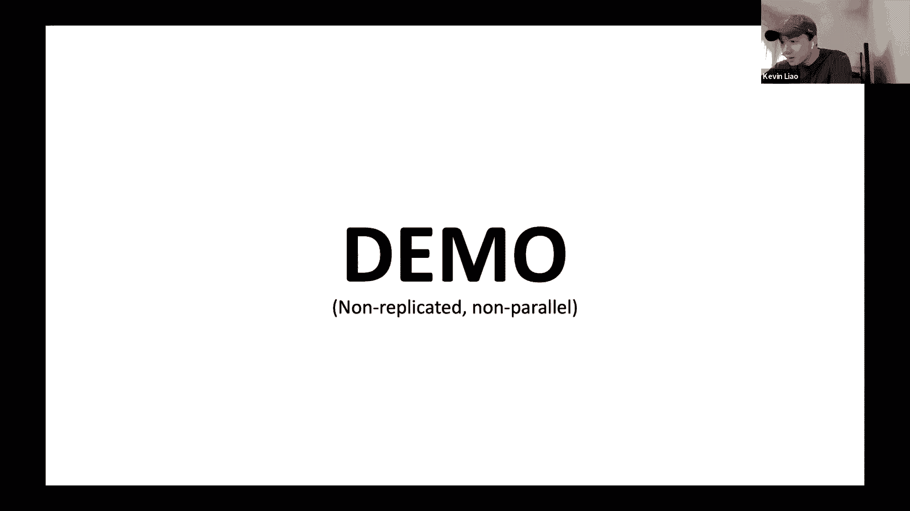

我得先停止分享这个。是的，酷。

好的，太棒了，所以，在这两个右侧的终端上将安装服务器，所以我要运行它们，它是用 Rust 实现的，现在我要把中间的这两个代理连接起来，然后在左边的终端，我只想模拟一千个诚实的客户端。现在的情况是。

所有的客户端都在生成它们的输入共享，以及生成零知识证明，并通过代理发送它们，而代理只是将它们转发到服务器，最后，在服务器端，它们会检查所有的证明，如果这些输入是格式良好的，它将把它添加到本地键值存储中。

然后在一段时间之后，当服务器想要重建最终统计数据时，它们只需结合它们的键值存储来恢复和。

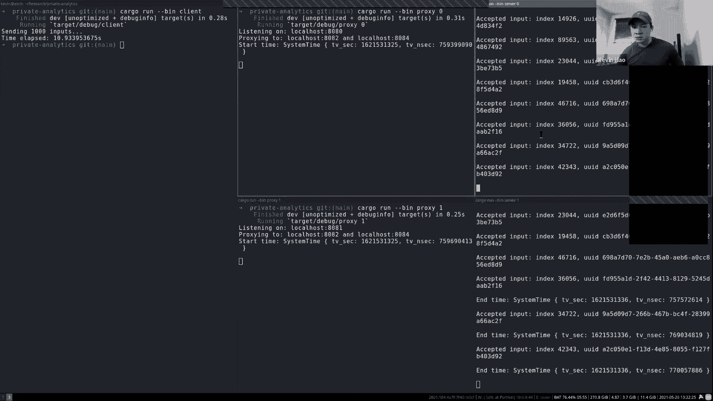

我的演讲到此结束，我很乐意回答任何问题。观众有什么问题吗？我想我有个问题，所以你到目前为止实现的那样，比如什么你会接受，什么容错，类似的东西，我可以谈谈你当前实现的可靠性。是的。

所以现在实现的可靠性不是很高，主要是因为服务器没有被复制，所以对于代理来说，因为，客户广播代理，你所需要的就是其中一个代理启动，如果我们有两个代理，我们可以容忍一个代理失败。

我们仍然会获得到服务器的消息，但如果任何一台服务器出现故障，那么你就不能根据这些数据进行重建了。这只是对于和吗，或者，你是否实现了对所有这些输入进行操作的任何通用函数？是的，目前，我只实现了和。

但使用这种相加的秘密共享方案，你可以计算任何你想要的线性函数，也许更复杂的问题是可能的，但我还没有探索过这些，事实证明，至少在实践中，和可能会达到 90% 的水平。那么，你的性能数据是什么样子的？

性能数字，是的，所以我们想要衡量的主要事情是，对于客户端，计算和客户端带宽，我有一些数字，至少对于客户端计算而言，这些共享，而这些证明只需不到几毫秒，所以它非常轻，带宽只有几千字节。

然后对于服务器端的吞吐量，我是在使用 EC2 ，但我只给每台服务器分配了四个核心，因为我只有 64 个核心，我希望它们中的大多数都在客户端上，这样我就能消除这个瓶颈，所以，在四个核心上，我想，那是什么。

可能每秒有一千个查询，然后估计，我猜如果每台机器并行 20 台服务器，它们可能每秒可以实现近 22000 次查询，但这些都是在同一个数据中心运行的，所以，它不会影响延迟，实际数字可能会比这个数字低一点。

我对你的实现有一个问题，你如何，你如何实现的知识证明代码，不是理论上的。是的，这是个很好的问题，我可以把我实现的论文发送给你，但这并不太复杂，基本上，它只是一堆有限域运算，如果你找到你的文件库。

只要按照论文，遵循步骤，从这一点上来说，这是非常简单的，只要你能解密那个论文。好的，有没有可能测试它，你怎么知道它起作用了还是没有起作用。是的，所以我想，是的，我只展示了诚实的客户端模拟，但是。

你也可以生成与提交错误证据的客户的模拟，然后你可以看到它们被拒绝了。好的，是的，有道理，谢谢。好的。好的，谢谢，很[]，下一组准备好了吗？大家好，我是 Shannen 和 Nik Johan 。

所以 Johan 请开始。谢谢， Shannen ，所以我们将谈论 BukaDocs ，BukaDocs 是一个分布式协同编辑器，它类似于 Google Docs ，只是稍微好一点，所以。

进入下一张幻灯片，你能看到下一个吗？好的，就像你们在这节课上看到的，在分布式系统中实现一致性是非常困难的，一致性可能会在很多方面出错，所以一个非常简单的例子是。

如果你在每个节点中收到 RPC 的顺序不同，你可能会得到一个不一致的状态，还有一种叫做 CRDT 的数据结构，我们在我们的系统中使用它来缓解这个问题，CRDT 实现最终一致性，通过对文档进行每一次操作。

全局唯一的，不仅对每个节点唯一，而是全局唯一的，所以如果我在编辑器输入字母 a ，不同于 Shannen 或 Nik 在他们的编辑器输入字母 a ，所以，举个例子，在底部这里，例如。

这里将一个新的海龟添加到文档中，即使它们接收到来自其他两个节点的移除请求，它们永远不会移走金海龟，因为这个操作本身不同于删除，所以移除绿海龟和移除金海龟是不同的。这就是我们实现最终一致性的方式。

所以从这里开始，我相信 Nik 会更多地谈一谈这里的情况，我们如何实现第三种方式。是的，所以对于 BukaDocs ，我们选择了一种名为 LSEQ 的 CRDT ，表示具有可变长度密钥的元素序列。

所以我们的目标是，假设我们想要一个表示字母表的序列，到目前为止，我们有字母 a 和 c ，一位编辑者可能会选择尝试在它们之间添加字母 b ，而另一编辑者可以选择尝试在 c 之后添加字母 d 。

目标是最终的一致性，最终会到达状态 a b c d ，所以， LSEQ 实现这一点的方式是，通过使用开始和结束 token ，然后它给文档中的每个字符一个单独的 token 。

在 START 和 END 之间，所以我们可以在 START 和 END 之间插入 h ，如果我们想要 i 在 h 之后，我们可以把它插入到 7 ，在 4 和 8 之间，现在。

如果我们想在 i 和文档末尾之间插入一个感叹号，我们可以把它插入到键 7，2 ，因此我们增加键[]到 2 ，在相邻两个其他键之间创建键，通过这种方式，我们始终可以在任何两个其他键之间创建一个键。

所以我们可以随时插入，现在 LSEQ 很好地形成了，它以很少的协调努力达到了最终的一致性，它还进行了一些优化，导致键的长度增长很慢。然而，一些缺点是，为了支持删除这些元素。

它依赖于因果交付和恰好一次交付，我们并不想实现这个，因为它是给予其他一些工作的，所以我们使用一种稍微简单一些的方法，也就是删除集，这是一个仅增长的集合，我们在其中添加元素，所以。

例如删除字母 h 和 i ，我们会把 4 7 添加到这个删除集中，然后，整个状态相当于只需要 START 和 END token ，感叹号在键 7，2 。所以我们建立了 Buka Docs 服务。

类似于我们实现 kv Raft 的方式，我们有多个服务器，多个客户端，多个客户端，它们一次只与一台服务器通信，它们不断尝试操作，直到从服务器获得成功回复，客户端和服务器都维护文档中的字符的 AVL 树。

以及我们自己删除的删除键集合，我们选择将字符存储在 AVL 树中，我猜是出于性能原因，事件的链条大概是这样的，客户端将向服务器发送插入和删除，服务器将更新其自己的 AVL 树和删除集，并持久化保存。

对于所有其他服务器和客户端的更新，然后服务器会向客户端响应成功。所以我们要演示一下，我们在这里为它构建了一个非常简单的用户界面，所以让我来，Johan 和 Nik 现在也在从不同的客户访问这个。

所以你可以看到他们的输入，你可以输入其他内容，我在这里输入，我想 Johan 是在输入 hi ，Nik 在输入一些东西，我们还可以编辑彼此的文本。那么，是的，这就是 Buka Docs 。

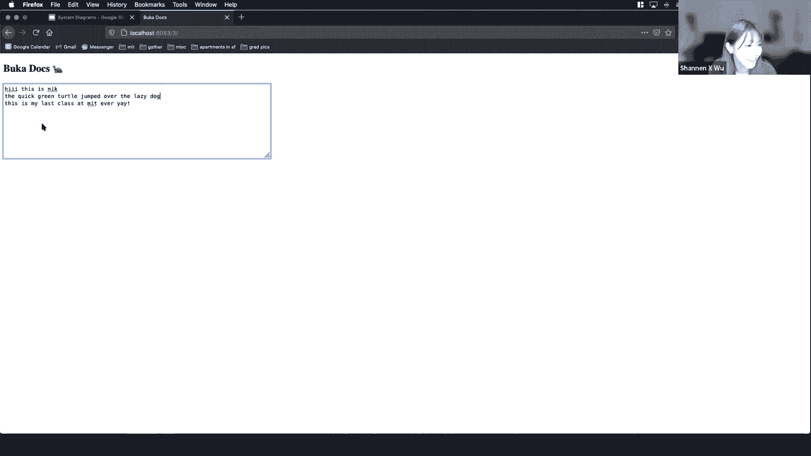

我们很乐意回答任何问题。我有一个问题，我很喜欢海龟的主题，你们想出了这个，我只是想知道海龟的主题是从哪里来的？哦，是的，海龟是 Nik Johan 和我通过网络讨论课程，海龟是我们课程的吉祥物。

我们受到启发，构建 Buka Docs ，因为我们使用的 Google Docs 是一个问题文档，针对学生提问，它无法同时处理超过 75 个用户的输入，Buka Docs 就是这样诞生的。谢谢你的提问。

那很酷。我有一个简短的问题，所以首先，我调用了这个演示，抱歉，如果你提到这一点，你可能已经，但首先，第一个问题是，为了确保我理解正确，这些数据结构非常有趣，它们存储在客户端或服务器上，如果它们被存储了。

我想现在服务器没有复制，但这是你可以很容易做到的事情，但如果它们存储在客户端上，如果其中一个客户端出现故障会发生什么情况？所以，数据结构存储在所有客户端和所有服务器上，现在。

我们假设客户端是完全值得信任的，所以，如果客户端出现故障，它们没有发送到服务器的任何编辑，会一直在它们那边，在它们重新上线之前，在这种情况下，它们可以发送，它将实现最终的一致性。很有趣，谢谢。哦。

我有个问题，为什么 LSEQ 胜过其他 CRDT ？是的，我们选择 LSEQ 主要是因为，这是我们最先发现的，我们想要开始，因为在实现可变长度键的逻辑之后，没有太多我们需要做的，以确保。

客户端和服务器保持一致。哦，好的，谢谢。除此之外，它就像是消息传递，并确保每个人都收到了所有的信息。好的，谢谢。那么，在这个示例中，你运行了多少台服务器，是只有一个还是多个？有三台服务器和三台客户端。

每个客户端都连接到自己已知的服务器。所以，你使用服务器用于扩展或容错，还是两者都有？两者都有，当我们运行性能指标时，通过将客户端请求的负载分布在多个服务器上，你可以处理稍微多一点的带宽请求，然而。

这是一种权衡，因为最终一致性将需要更多的时间，因为服务器将必须发送 RPC 到每一台其他服务器，所以在我们的论文上，我们有一个完整的图表，但是。好的，它的规模有多大，随着你添加更多的服务器。是的。

我的另一个屏幕上有指标，所以它能够处理，如果我们将其分配给五个客户端和五个服务器上的 3000 个请求，它在三秒内实现了最终一致性，但这主要是因为它在计算机上，在本地主机上， RPC 速度非常快。然而。

这也意味着所有的计算机都在一台机器上运行，所以，当我们把它放在真正的硬件上时，是两种方式。是的，还有一件事是，如果你一次提出太多请求，最终一致性很难实现，例如，我们试图一次进行 19000 次编辑。

通过 100 个客户端和 5 台服务器，它花了大约 32 秒才达到最终一致性，然而，如果我们只在 100 个客户端和 5 个服务器上进行 3000 次编辑，这只花了大约三秒钟。

当你说你做了 19000 或其他的事，就是一次发送所有这些信息，或者它是随着时间的推移而扩散的。每一个单独发送，每个编辑并行发送，至少在测试时。有意思。我有一个简短的问题，所以其中一个激励因素。

像 Google Docs 这样的协作文本编辑器，不能支持大规模更新和并发更新，所以你认为他们为什么不采用你们所提议的方法？我认为 Google Docs 使用了一种类似的方法，称为操作转换。

我不确定，它是否也可以并行，他们可能不想这么做，因为他们不想提供那么多的服务器能力，这可能只是为了成本效益，我猜。是的，我只是，怎么说，我不认为上百个人编辑一个文档的情况，出现得很频繁。

至少在 Google Docs 的使用中，所以，可能不想在这方面花费额外的工程时间。好的，谢谢，很酷的 demo 。所以接下来，我们有 eggscrambler ，如果你们准备好了。好的，大家好。

我叫 Arvid ，和 Arman 和 Wendy 一起，我们研究的是 eggscrambler ，这是使用交换加密的匿名广播。所以让我们从一个动机问题开始。

我们都喜欢 MIT Confessions ，假设班上有一个人想要提交一个 confession ，告诉人们他们有多喜欢这门课，那么他们会做些什么。

他们把这个 confession 提交给 Google Forms ，然后交给 MIT Confessions 管理员，然后这些信息可能进入 Facebook 页面。但现在让我们来考虑一个场景。

confessions 管理员是 MIT 的教授，特别是对于另一门经典课程来说，所以很明显他们不希望这个 confession 被贴出来，所以他们会审查它，因为他们可以，但更糟糕的是，因为他们可以。

作为 MIT 的教授，这样他们可以去 Google 查看他们的网络流量，他们可以查看 MIT WiFi 网络流量，这样他们就能找出是谁发的这个，很明显，他们想在班上给那个人打个 F- ，这太可怕了。

那么我们想要做什么，我们想要匿名广播，这看起来是今天的一个共同主题，那么什么是匿名广播，我们把它定义为向每个人广播消息的协议，在没有透露消息来自谁的情况下，所以，我们进一步的工作。

我会让 Wendy 说说我们是怎么做的。所以，我们设计的两个主要特点是，它是去中心化的，并使用密码学，尤其是，交换加密是必要，因为否则描述顺序，将揭示消息发送者的原始身份。是的。

所以这就是我们要实现的协议，确保参与者加入网络，加密和提交他们的消息，它在加密阶段中由所有参与者恰好加密一次，加扰阶段提供匿名性，因为正如突出显示的那样，因为每个参与者都对消息进行加密。

随机化是有秩序的，最后，解密会得到所需的消息列表，这些消息来自与身份无关的所有参与者。所以，如果所有参与者都是诚实的，这个协议成功地导致了匿名性，虽然恶意用户可能确定消息的发送者。

我们相信这样的行为是可以检测到的，如果人们感兴趣，对于这个问题还有其他解决方案，例如混合网络和DC网络，接下来， Arman 将描述实现的结构。所以，首先，看看这个假设，我们看到的是高级别接口。

有人试图提交消息，与我们服务器的交互，假设你是那个想要提交 confession 的人，你是这个应用程序客户端，所以你要做的第一件事就是发送一条 Start 消息，这表明你想要开始新的广播。

Service 将询问所有人，谁是这轮的参与者，通过一个信息，然后它将运行这个协议，然后它会将结果发送给所有参与的人，或者如果是 confession 发布它，在这一点上，它将是匿名的。

但这是一个非常简单的观点，事实上，我们是在实验的 Raft 实现的基础上构建这个。所以我们使用实验 Raft 的原因是两个，第一，我们将协议实现为状态机，所以， Raft 是运行这个协议的众多实例之一。

Raft 用来复制这种状态，然后第二，当我们做打乱阶段时，我们需要确保每个参与者都以特定的顺序进行打乱，所以我们使用 Raft 作为一种协调机制，做这个 test-and-set ，在那里。

它们以单一的顺序进行，所以类似于 kv 存储，我们有状态机服务器，它读取 Raft 的更新，并更新状态机，使用他们们商定的任何状态，我们还添加了状态机客户端，它读取状态机是如何改变的。

然后这个客户真正采取行动，以某种方式推进协议，然后，就像在 kv 存储中，为了推进协议，这个客户端将联系 Leader 服务器，使用对状态机更新的请求，然后我们还实现了 raft 配置变更 RPC 。

服务器可以在配置中添加或删除自身，这意味着，新人可以加入随后的几轮广播，然后，如果出现故障，我们可以把某人从配置中删除，这样下一轮广播才能继续进行，因为我们的协议要求每个人都是活跃的。

为了完成这轮（广播）。然后我们终于有了应用程序，客户端就像是在你手机上运行的 confession ，会将这些广播消息发送给客户端，然后它会收到更新，一旦协议完成。

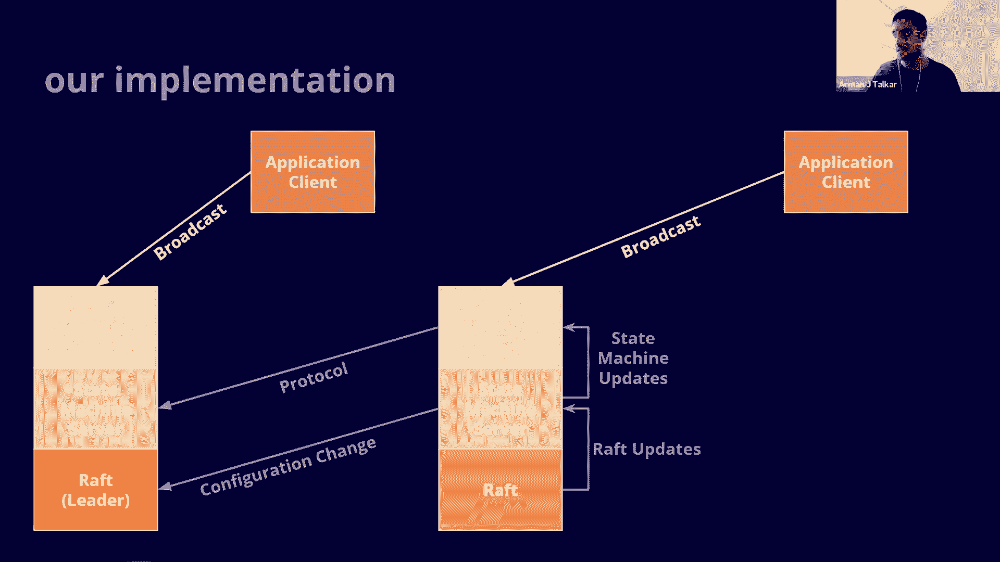

所以，我们将播放一段录制的快速演示，如果你听不到的话，就告诉我。

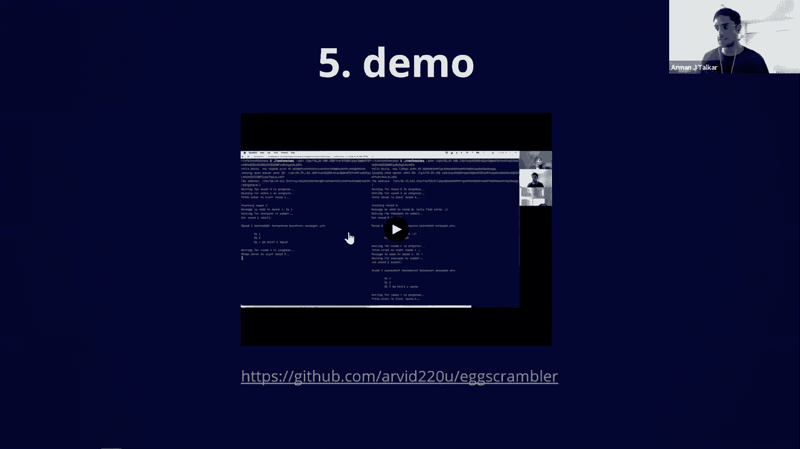

现在我们来看演示，我们现在开始在 Wendy 的计算机上工作，她将启动应用程序，所以她在计算机上启动一个实例，并尝试，她正在将她的配置链接发送到 Zoom 聊天中，正如我们在这里看到的。

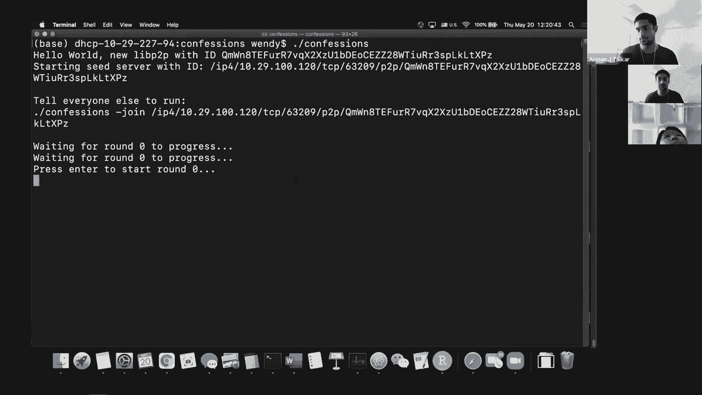

所以现在我们要进入 Arvid 的计算机，他会利用这个链接，并像 Wendy 一样，加入同样的配置，所以他这么做了，现在他要开始这一轮，好的，可以发送他们的信息，我们的这一轮已经成功了。

现在我们要展示可以无缝添加新客户端，所以这两个都会发出一条信息，一个全新的 Raft 实例，所以我们在这里看到，这个新实例很快就赶上了左边的那个，现在他们三人都将为下一轮传递一个信息。

我们收到了所有三条信息，所以我们演示了我们可以通过网络进行广播，还可以随意添加客户。

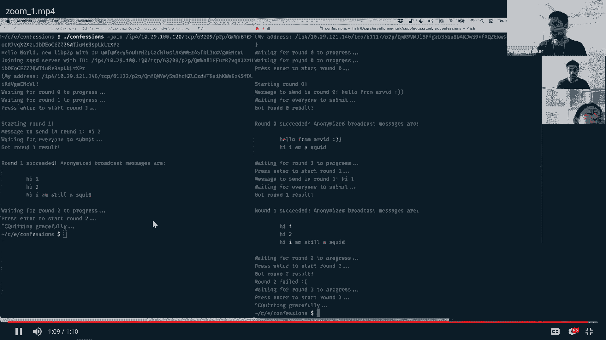

是的，这是 eggscrambler 的演示，有没有人有什么问题？这是一张非常快的一个，首先，这是一个非常酷的系统，那么，应用程序与客户端 Raft 状态机是分开的，对吗？是的。这就像是两个不同的设备。

所以我想我的问题是，你如何部署这个东西的整体图景，为什么会这样呢，我的意思是，我想象你可以，运行一个 Raft 状态机，使用一堆手机，它可能可用性较差，但你已经实现了配置更改，所以原则上可以这样做。

真的，我只是想弄清楚客户端的角色是什么，在这整个过程中，服务器是一个服务器集群，应用程序也有意义，但是。所以客户端，这是编写实现的一种不错的方式，所以服务器和客户端，你可以把它想象成一台服务器。

在我们的实现中，创造这个抽象概念是有意义的，是的。好的，谢谢。为了让这轮取得进展，所有节点必须从所有其他节点接收消息，也就是 n-1 个节点，所以如果你有一些非常奇怪的分区。

某些子集不能与其余部分子集交互，这个问题将如何在这里解决？是的，所以如果分区在，小于，比如，如果每个都是少数，然后它就会永远卡住，直到你找到多数，一旦你获得了多数，它们会自动提交。

比如删除服务器 RPC ，当它们得不到某人的回应时，然后，集群会缩小，直到没有响应的节点消失。我注意到在你给出的演示示例中，你有一个写了两条信息，另一个写了第三条信息，这意味着你可以，写两条信息的人。

总是能确定第三个人分享了什么，这是不是有点违背了你的协议的目的？是的，所以为什么它是两条信息，因为我们运行，我们在同一台计算机上运行这两个实例，这是一个攻击，在那里，你拥有它。

你从一个人被所有人控制的地方开始，比如五台服务器，其中五个提交信息的人被每个人控制，你知道最后一个人是谁，但是，我认为我们目前认为，这是非拜占庭式的失败，所以客户端的行为是诚实的。

它们并没有试图在系统中获得不公平的优势，以及攻击者或监听所有网络流量的人。好的，所以你并不担心系统中涉及的人破坏它。

你只会担心那些人，窥视系统并驾驶它的人。是的。或者就像是，所以我认为我们很有信心，如果他们是拜占庭式的参与者，然后，协议将失败，它会失败，明确地，比如，我们，但有一些不同的，不确定是不是这样。

但我们认为是这样，但这就像是。所以对于当时讨论的袭击，其中有人控制了集群，但它接管了所有，基本上是所有的客户端，除了它们中的一个，如果你是领导者，你可以控制，大概控制谁从组中添加或删除。

你可以做到这一点，你们目前的系统能检测到吗？不，不，当它是 n-1 的时候不会，所以我们至少需要两个，如果我们有两个诚实的人，那就足够了，因为它们会，如果它们彼此断开，他们可能知道这个。是的。好的。

很好，谢谢。超出时间，谢谢，很酷，也许 MIT confession 会出现。让我们来听听容错项目，也许这是一种糟糕的总结方式。别担心。好的，大家好，我是 Ariel 。

我做这个项目[]已经有一段时间了，让我们看看我能不能分享屏幕。

所以，是的，正如你在这里看到的，项目涉及在 9P 接口上免费提供容错，并详细分析这意味着什么和额外的幻灯片。我们先来看看无服务计算，如果你听说过 AWS Lambda。

或 Google Cloud Functions ，从本质上讲，它所做的是，不是必须设置一堆虚拟机，并扩展，根据客户的请求，加载所有内容，你可以只编写一个小的无状态函数。

通过一堆小的无状态函数来开发你的应用程序，通过 HTTP 请求触发，然后， AWS 或 Google 云或你的服务提供商，将负责扩展，并为你提供所有基础设施管理，这很好。

因为理论上运营商可以更有效地平衡资源，它们可以获得很高的利用率，从理论上，这对开发人员来说也更容易，你所要做的就是，你不必担心所有这些基础设施管理，并且有足够的[净空]数量虚拟机或任何东西。

处理客户负载激增等问题的一切措施。然而，现实并不像理论那么美好，也就是说，到最后，在当前的实现中，构建这些复杂的应用程序是相当困难的，将它们分解成这些无状态函数相当困难，因为这些 Lambdas 。

这些无状态函数缺乏丰富的通信原语，这是构建复杂应用程序的重要支持，所以它们不能直接通信，因此，试图利用无服务器函数的系统，不得不构建自己的定制通信解决方案，比如把两端放在边上，他们围着那个通信。

或者通过存储系统进行通信，比如 S3 ，这使得它们变得低效，开发人员很难以合理的方式将它们组合在一起，所有这些复杂性导致数据中心管理资源相当糟糕，问题是，我们仍然将所有这些数据中心资源。

划分为一组本地名称空间，它们是[]，你不能在它们之间共享资源。所以，我们正在研究的是，[]过去几十年的一些工作，称为 Plan9 ，Plan9 提供了统一数据中心资源的方案，并提供单个系统映像。

这意味着，当你编写你的应用程序时，你不必担心什么东西在什么机器上运行，关于调配虚拟机或类似的内容，或确保某些 VM 上的应用程序的某些部分，对于你的应用程序，它看起来就像一个巨大的命名空间，所以。

你的应用程序完全不知道它运行在什么硬件上，或者在数据中心的其他服务，实现的方式是，应用服务通过全局分层命名空间进行通信，服务和资源暴露统一的文件系统类接口，你不必担心实现和调用定制 RPC 。例如。

在这棵树上，你可以在这里看到，我们有顶级的根级名称空间，然后我们有三个注册的服务，我们有 S3 服务，你可以用来把你的 Lambdas 连接到 S3 ，你可以通过它访问 S3 键和值。

我们还有内存中的文件系统（memfs）和 sched ，所以，很快地。是的，这就是典型的 9P 名称空间是什么样子。我们已经做了一些工作来实现，比如，这个 9P 架构。

我们有一个类似 Zookeeper 的配置服务，它有顶级名称空间，我们有一个调度器和一堆 9P 服务器，它们所做的是，它们暴露资源和函数，比如，如果我们回到这里，这个命名空间的 S3 部分。

你可以编写连接 S3 存储的服务，并将其暴露给 9P ，这将是一个 9P 服务器。那些 RPC 或操作，用来于与这些不同服务交互，都是 9P 操作，所以这是一个非常小的，定义很好的一组操作。

你可以在这里看到它们中的一些，例如 Read Write Remove Stat ，较少规范文件系统操作。我快速展示一下它是什么样子。

例如，在这里，我可以启动基础设施。

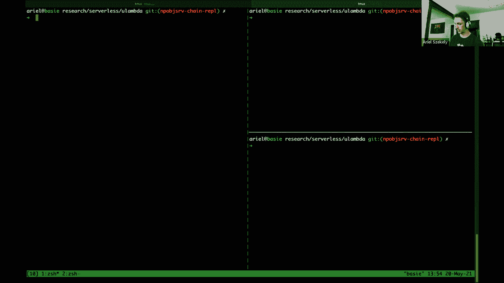

这样我可以查看，你可以将这个名称空间映射到 Linux 中，这样我就能看到一些服务，以及我们在这里挂载的不同的名称空间，例如，如果我看一下 S3 ，这连接到我们拥有的 S3 存储桶。

你看到 S3 桶里的键了吗，就像文件系统中的文件一样。

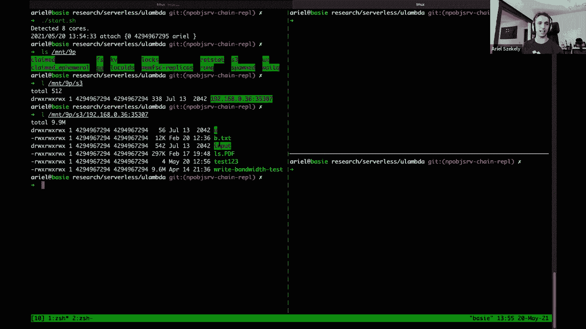

这是 S3 桶在这里，所以如果我想创建，写入一个新的键。

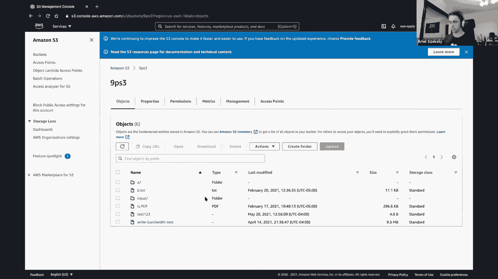

我所要做的就是 cat ， echo 到，所以，不必使用 AWS 定制库，为了写入 S3 ，我可以只写入一个文件系统。

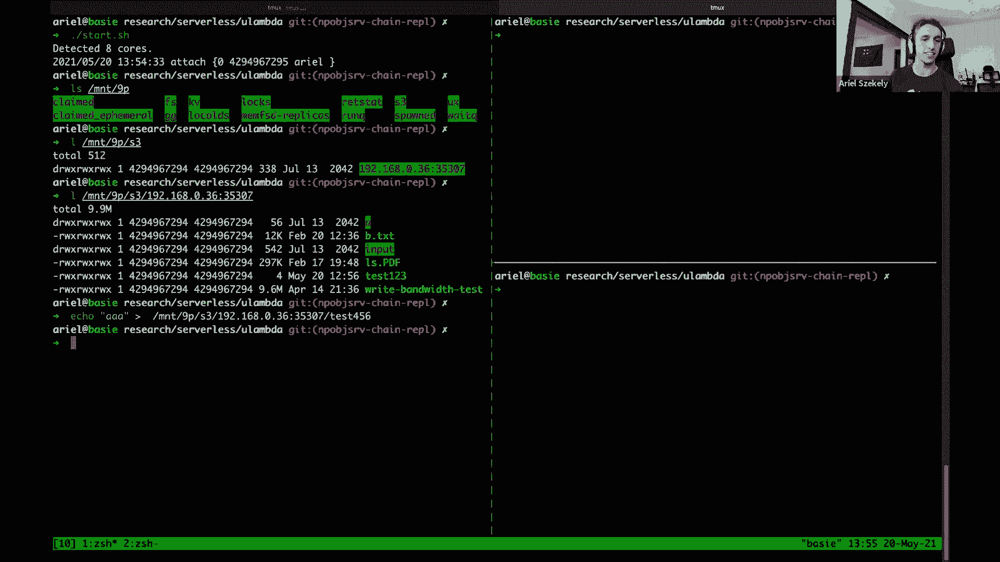

执行一个文件系统操作来创建文件并写入它，然后在 S3 ，现在应该显示一个新的键，所以我们有了 test456 ，我们刚刚写的。

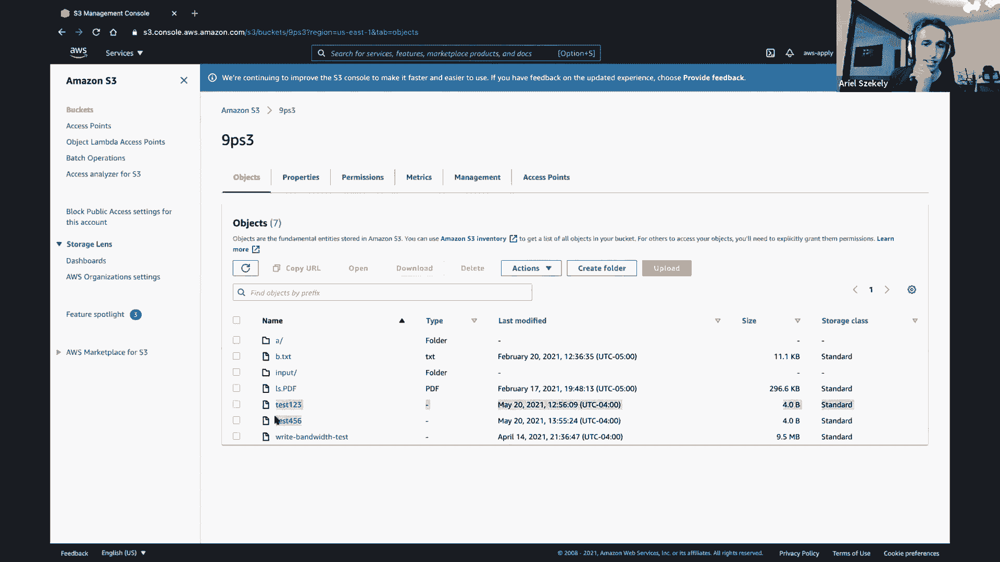

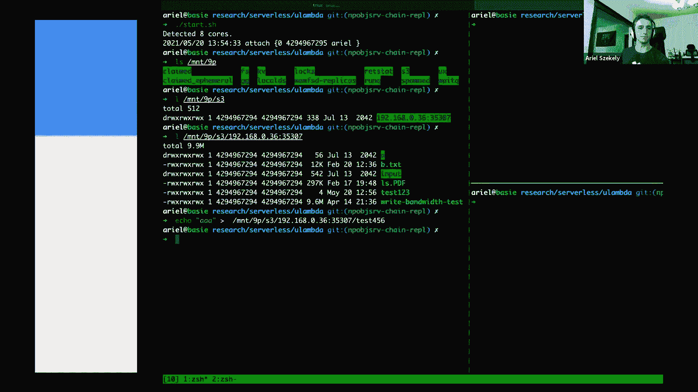

那么，这里容错部分是什么意思，就像我之前提到的，所有这些 9P 服务都具有定义良好的统一接口，没有定制的 RPC ，这给了我们一个非常独特的机会，我们可以在这个 9P 接口上切片，用来复制未修改的服务。

所以，如果我能够将所有这些操作复制到不同服务器实例，然后服务器可以自由复制，根本不需要修改它，这就是我们所做的，当我工作的时候，我实现了基于链式复制的容错方案，我使用 named ，是一种配置服务。

你可以认为它类似 Zookeeper ，我复制了 2 个不同的服务，没有任何修改，内存中文件系统（memfsd），和从本地机器暴露持久存储的服务（npuxd），所以我会很快地向展示它们。

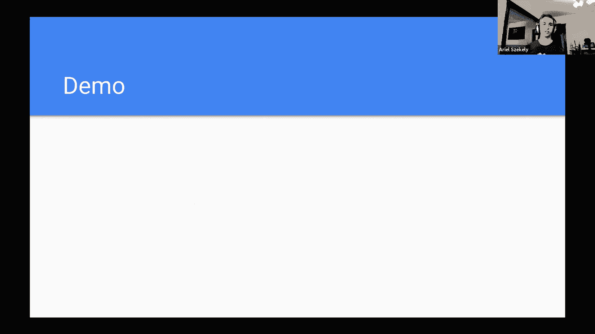

所以让我停止这个，让我们看看。所以，比如，我可以，所以我可以开始一系列的复制，所以，如果我看一下 Linux 中的 9P 名称空间模块，你可以看到这个 memfs-replica 。

这是这些复制注册它们自己的地方，所以我们可以看到，我们有五个这样的复制，我可以写入它们中的一个。糟糕。好的，我可以写入复制中的一个，然后我可以从另一组中读取，因为我们应该得到相同的结果。

写入小的字符串到第一个副本的文件，你可以从最后一个副本中读取，应该能获得相同的东西，甚至可以使副本崩溃，因为，所以，让我们杀死其中一个。

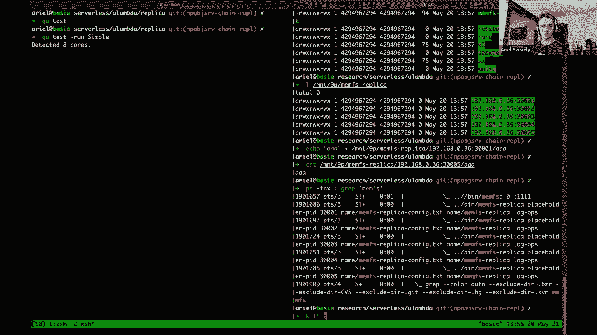

我们可以看到。

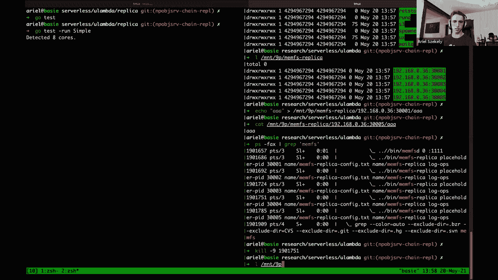

现在名字空间里只剩下四个副本了。

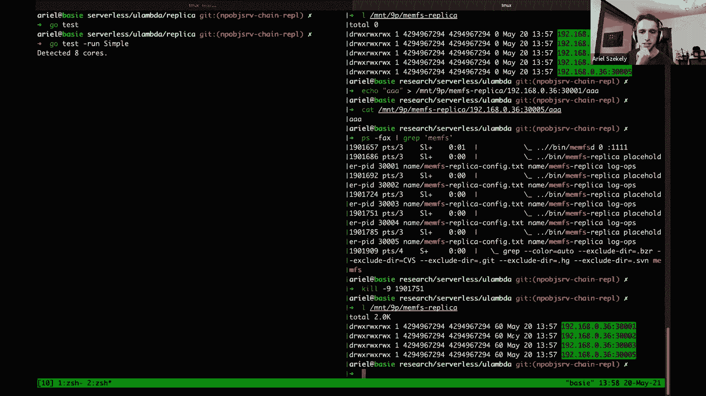

然后向这个文件写入不同的字符串，而且，我应该，是的，所以，所以现在，尽管一个失败了，服务自动重新配置，以及基于的内存中文件系统服务。

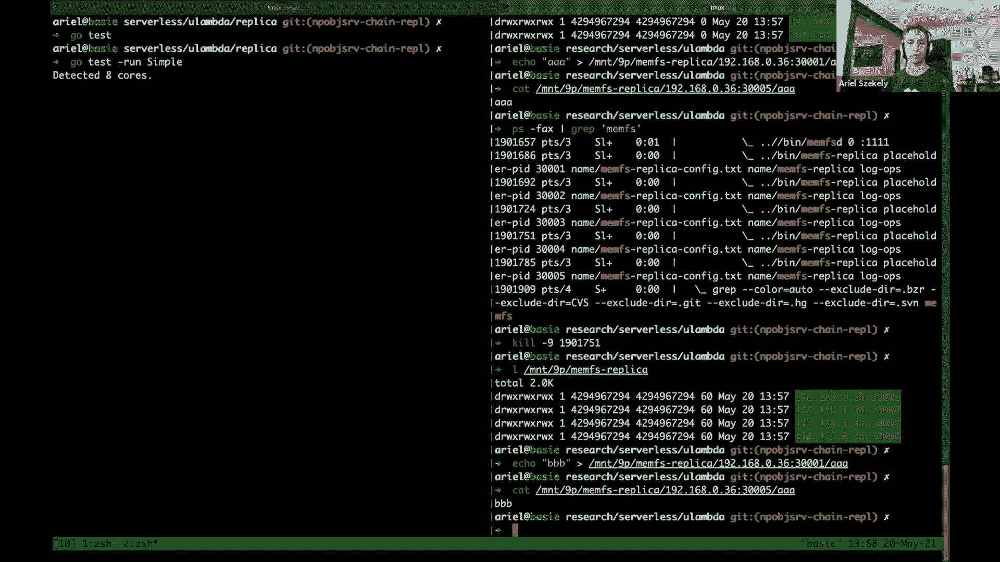

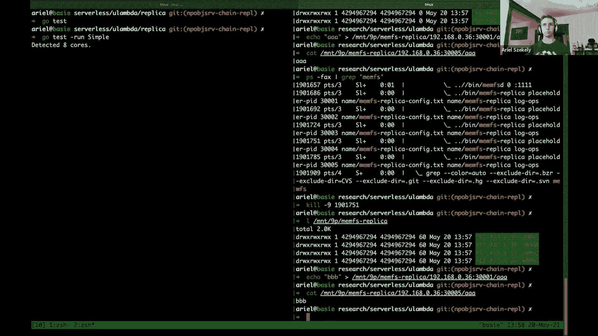

根本不需要修改，你只需插入任何你想要的新服务，实现 9P 接口的，而且它应该开箱即用。

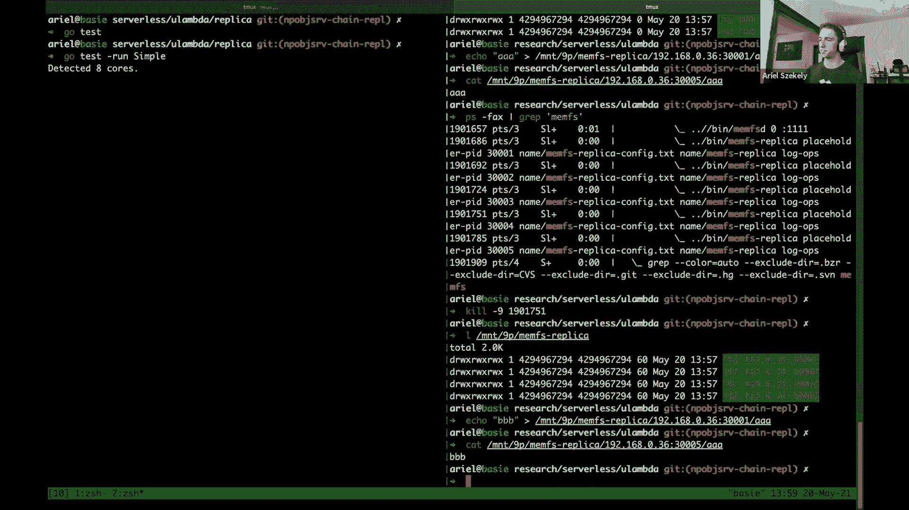

所以，我认为这是，我想我的演示到此结束了，我很乐意回答更多的问题，你们可能有的。我后悔这次没有穿我的 Plan9 衣服，我应该这么做的，不过我很好奇，这学期早些时候我在做一些类似的东西，只是没有复制。

它只是 Linux 机器下的 9P 服务，为什么，这是一个即兴的问题，为什么链式复制，我想还有其他的复制方案，在这类事情上是可用的，从理论上讲，因为这是 9P 。

你可能会把所有这些副本都绑定在同一个命名空间，它们看起来像是一台机器，但为什么是链式复制？是的，是的，好问题，理论上，你可以做任何你想做的复制方案，在底层，我做了链式复制，因为它看起来像一个简单的起点。

我想，我也可以把这个放在 Raft 实现上，比如条目或类似的东西，这是关于选择的一些基本问题。你的系统是否支持在启动后添加其他副本？是的，好问题，所以你已经知道，这是一项正在进行的工作，但是，是的。

目前我们不支持添加额外的副本。这是一个开放的问题，比如你可能不知道这个，这不是目的的明确意图，但 Plan9 和 9P 真正酷的一点是，你也将网络连接视为它们的文件，所以你有 memfs ，从我看到的。

你已经实现了一个调度器队列，只是一些文件，你是否，这是一个开放的问题，因为文件接口上的网络是否存在问题，可伸缩性很难回答，但你是否也以这种方式实现这一点，或者你是否使用更传统的[]接口。

当客户端使用这个东西时，它们认为它们使用传统的套接字和东西进行通信。是的，是的，好问题，所以，是的，所有的东西，所以目前所有的客户端和服务都是通过 TCP 通信的，是的，这是一个很好的问题。

9P 命名空间是否性能足够好，我们要用它来做什么，就我们现在所能看到的，没有，所以我们做了一些性能基准测试，来了解我们在 9P 上编写的调度器有多好，我们已经做了一些性能基准测试，看看它的表现如何。

目前它似乎并没有增加太多的开销，但是，我们可以想象不同类型的服务的权衡会发生变化，并且调度器或多或少变得超额订阅。我想澄清一下，很抱歉我占用了你很多时间，但只是简单地说，整个 9P ，如果你如果你能够。

这也是非常开放的，但如果你能够把网络连接当成文件，你就有了副本，你可以为每一个网卡准备一些东西，然后在这些网卡上分片网络流量，我想这是无服务器的，所以这可能不会有太大不同，是的，算了。

因为你已经有自己的处理了。谢谢。谢谢。好的，让我们来听一些关于验证的东西，如果你准备好了。你们能听到我说话吗？是的。好的，太好了，所以，我要和你们谈谈我的项目，它专注于分布式系统的模块化验证。

所以让我们从回答这个显而易见的问题开始，为什么关心这个东西，我认为任何完成 6。824 实验的人，一定是在某个时候发现，让这种[]变得正确是困难的，并发和网络故障导致了大量的不确定性。

这使得测试变得非常困难，为了确保没有边界 bug ，验证是获得正确性的另一种方法测试，理论上，它可以完全排除 bug ，通过验证，你已经对系统进行了数学建模，并改进了关于该模型的一些定理。

验证的一个缺点是，需要做相当多的工作，在这些正式证明过程中，绝非易事，即使这很容易，验证仍然不是完美的银弹，对于一个验证，你必须确保你的规格是正确的，如果你用你的系统证明的数学定理。

并没有说出你真正想说的，那么你所证明的一切都是无用的，与之相关的是，你必须确保你必须[]模型也是完整的，如果你不能对现实中可能发生的一些执行进行建模，但你不考虑，那么你的定理不会适用于现实世界。

你们中的一些人熟悉一些分布式验证工作，可能会说，我们不是已经知道怎么做了吗，事实上，分布式系统一直很难实现，人们最近致力于一个项目，试图验证分布式系统的实现。

其中一些项目包括 IronFleet 和 Verdi ，然而，这些项目并没有太多地关注模块化，或者试图证明系统组件的可重用规范，试图用它们来建造更复杂的系统，我认为这就是分布式系统的实际构建方式。

构建分布式系统的方法是通过，通常使用构建块，比如键值服务、锁服务或 Zookeeper ，将它们放在一起，与一些添加的代码和新的功能，为了建立更有趣、更有用的系统，这是一种论题。

验证可以而且应该利用这种构成性，作为一种有针对性的目标，我们的目标是证明客户端系统的规格，之前的工作，比如 IronFleet Verdi 简单地推理，实际服务器端的行为是什么，没有显式地建模。

或证明任何关于客户端程序所做的事情，而且通常情况下，客户端上有一些逻辑，这对于获得正确的结果至关重要，我们使用的方法是，使用并行分离逻辑中的先进技术，它是关于并发程序的推理的组合手段。

它最近变得流行起来，证明成功地提出了关于推理真正的代码。所以我们研究的第一个例子，是验证一个分片的键值系统，其中的键是静态分成不同的分片，并且分片本身可以在分片服务器之间移动，它与 6。

824 的实验 4 非常相似，只是它不是复制的，所以这里面没有 Raft ，而且，它纯粹是在内存中。除此之外，我们的系统还具有分片服务器和协调服务器，协调器是通知其他分片服务器，在分片之间移动。

在想加入或需要重新平衡时，我们提供的高级别的库，我们想要证明的规范是，我们称之为 KVClerk ，它是一个用户可以使用的客户端对象，我们调用这三个函数，来与服务器交互，有一个 Put 。

你要把什么值放入键中，有一个 Get ，它将返回键中的当前值，然后有一个 ConditionalPut ，它只会放入新值，如果旧值是期望值，我们的目标是实现一个可线性化的键值服务，并批准规范。

显示可线性化，你执行这个，使用分离逻辑方式，是通过编写一个看起来很像这样的规范，这基本上是说，如果对象 ck 是一个 KVClerk ，然后你就有了 Put 和 Get 函数的规范，例如。

如果你开始运行 Put 函数，在键 k 具有值 w 的前提下，然后在它结束时，键 k 是值 v ，同样，如果你执行一个 Get ，键 k 在开始时的值是 v ，那么这就是要返回的东西。

你仍然会知道这就是键的值，尽管这些规范看起来很简单，您可能会想，键值服务当然会，这就是关键，这些高级别客户端规范尽可能简单，并且隐藏了事实的所有细节，有多个分片服务器。

这个 Clerk 库可能需要与服务器多次交互，它可能需要刷新它的信息，关于哪个服务器拥有那个键，我们基本上证明了，让你忘记这一切，使用键值服务，只需要调用 Put 和 Get ，有了这个理想化的概念。

关于键值映射是什么样的。所以我不会太详细地谈论，实际的证据是什么，相反，要把重点放在，我们感兴趣的下一件事上，做一些容错性的事情。所以如我所说，键值本身不是复制的，并且不能容错，所以，我们开始尝试找出。

如何验证最简单的容错协议，我们从单决议 Paxos 开始，单决议 Paxos 是用于在单个值获取共识的经典协议，与 Raft 相比，你可以复制整个日志，你不停地在日志中添加新的条目。

单决议 Paxos 是多 Paxos 的[]，基本上一次写入寄存器的功能，如果要将值设置为某个值，你可以尝试对其进行写入，如果有人打败了你，那对你来说太糟糕了，现在值已经确定了，它再也不会改变了。所以。

我们实现并部分验证了单决议 Paxos 实现，证明了它是一次写入寄存器的规范，规范和证明中的关键思想是，当你在单决议 Paxos 中提交一个值，你得到了不可撤销的知识关于提交的值是什么，你知道。

从现在开始，如果其他人看到任何提交的值，这将是你现在看到的完全相同的东西。在我们研究了它的证明之后，考虑这个问题，我们想到，我们注意到，你可以对单决议 Paxos 做一个轻微的概括。

我们称为单调的 Paxos ，因为没有更好的名字，这个想法是，不是在提交时获得关于确切值的知识，我们可以修改协议，这样你就只能获得关于值的下界的知识，所以，当你提交一个值时，例如。

你提交数字 15 到这个写入一次寄存器，不是知道 15 是唯一的值，任何人在未来会看到的，人们在未来看到的任何值，提交的至少是 15 ，当然，要做到这一点，需要一些概念，对于值类型，大于的含义。

关键思想是，副本总是可以找到最新提交的值是多少，并选择增加它，而其他副本可以不断地找出，到目前为止越来越大的下界的值，一旦我们想出了单调 Paxos 的想法，我们立刻意识到，我们可以用它来进行日志复制。

所以这组值 V ，我们可以简单地选择为所有的日志，你可能希望复制你的操作日志，我们可以定义一个日志大于另一个，如果较小的是，如果 l1 是 l2 的前缀，这让我们知道，这就产生了一种你必须信任的协议。

我现在给你们看的代码，你可以在其中获取有关日志前缀的信息，随着时间的推移，你可以向日志中添加新的内容，通过让它变得越来越大，这几乎就是我们的意思，当我们说到日志复制时。这个协议的问题是。

我们实现了单调 Paxos 最幼稚的版本，你需要在每个 RPC 上发送完整的日志，在单决议 Paxos 中，你在所有 RPC 上发送完整的值，在 Paxos 中的微不足道的概括。

将不得不被发送到整个日志，这并不是真正有用的，日志变得越来越大，并且日志开始时，与时间无关，每个人都同意提交，所有这些，所以你可以尝试通过传递日志的后缀来优化它，事实上，有一个完整的优化序列。

你可以对这种基于单调 Paxos 的日志进行复制，当你开始做越来越多这样的事情时，你会意识到这看起来和 Raft 很像。事实上，我们的目标是利用我们的 Monotone Paxos 。

不是实现新的复制协议，而是验证一个类似 Raft 的系统，所以我们有这个单决议 Paxos 的证明，我们对这种单调 Paxos 有一个明确的概括，我们的希望是，我们可以利用单调 Paxos 想法。

直接验证 Raft ，不同于依赖 Raft 的更为复杂的正确性争论，已经在某种其他状态机类型的样式中进行了描述。所以这是我们未来的工作，我想告诉你们的关键一点是，关于分布式系统的正式和非正式推理。

应该像编写代码一样进行组合，编写代码的扩展方式是模块化的，这就是推理也应该进行扩展的方式。我的演讲到此结束，我很乐意回答大家的提问。

如果答案太长，你可以在聊天中看到我，但我很好奇，我知道有个[]，你有没有什么资源，提供给有兴趣从软件的角度进入的人，任何简短的建议。你是，所以，是的，我想我不是很确定，那么，你有没有兴趣。

我应该在之后发消息，但如果你感兴趣的话，我想，在某种最轻量级的验证版本中，我认为 Dafny 是一个很好的学习工具，因为这是一个非常简单的起点，你可以编写真正的代码，并对事物有感觉。

我认为很多的验证都是相当学术的，在像这样的验证中并不是非常有用，所以我不确定它到底有多大用处，真正的软件目前还没有，所以，人们希望有一天它会成为现实。谢谢。你有没有实现你所说的这个版本的 Paxos ？

这个单调 Paxos 东西。所以，是的，我实现了，不是实现了通用的单调 Paxos ，这没有意义，我直接实现了单调 Paxos 上的日志复制，所以，在单调日志应用程序中，所有 RPC 发送整个日志。

如果你运行了很长时间变得太慢，因为 RPC 发送了太多的东西，是的，我确实实现了，我认为我们正在努力试图对它进行推理。你有没有[]弄清楚它的性能，或者它在实践中是如何运作的？

所以我认为我们现在所拥有的代码并不是你想要运行的代码，而我的，在某种意义上，它应该有 Raft 一样的性能，我们并没有真正优化的实现，我根本没有去获取它的性能数据，它可能相当慢，不是很确定。好的，谢谢。

是的，即使我们验证了我的程序，我肯定日志在某个地方，但现在让我们来听听 PP2 。好的，大家都能看到吗？好的。我们是[]协议团队，我， Jay 和 Timmy ，我们展示一个简单的分布式文件系统。

我们选择分布式文件系统的原因是，用户经常希望对数据进行私有排序，以一种真正可访问的方式，在使用云公司的影响，你不拥有你自己的数据。所以我们想要创造一个解决方案，你托管自己的数据。

在商用硬件上以容错分布式方式，我们的文件系统非常类似于 Frangipani ，除了它使用 Raft 而不是 Petal ，并且文件系统在服务器上，而不是客户端上。在文件系统参数方面。

我们还有一个 4096 字节的数据块大小，和 2M 字节的最大文件大小，理论上我们有 32G 的最大磁盘容量，然而，这受到你的 RAM 的限制，如果你只有 8G 的 RAM ，你会有。

无论你的系统占用了多少所剩下的。我们在合理范围内支持尽可能多的服务器和客户端，显然，你向锁争用中添加的服务器和客户端越多，性能将会降低，当你开始一遍又一遍地访问同一文件时。就性能而言。

我们非常关注可用性和崩溃恢复，我们没有测量性能，我们认为情况可能相当糟糕，因为我们的系统是建立在 Raft 上的，这并不是已知的系统中性能最好的。所以，轮到 Jay 了。所以，再说一次。

性能不是我们最重要的东西，但我们确实有非常强大的一致性保证，特别是，我们强制执行 POSIX 一致性，这是一种强一致性的形式，我们通常在本地文件系统上看到，所以我们强制了不变量。

在你成功完成文件写入之后，从任何地方读取你之前写入的字节，将返回之前写入的数据，类似地，对该数据的任何新写入，都将导致数据的可视重写，从其他读取者的角度来看。所以，为了实现这个，我们有一个数据模式日志。

它构建在数据块层，它是 Raft 分布式的并复制，实际上是预写日志，保证了在存在崩溃的情况下强语义的写入原子性，和 Raft 差不多，以及我们上面提供的一致性模型。所以，服务器也为了帮助实现这一点。

我们发布分布式锁，这样我们可以拥有这个非常原始的块缓存，正如你在本地文件系统中看到的，我们也有租约，以确保有相互排斥的访问所有这些区块。所以为了允许我们的客户端使用我们的文件系统。

我们创建了一个类 POSIX 的接口，用户可以与文件交互，我们主要四个函数， Open Close Read Write ，Open 和 Close 很容易解释。

它们只是打开和关闭我们文件系统上的文件描述符，Read ，它只需要一个文件描述符，并在当前文件位置读取固定数量的字节，Write 也获取文件描述符，并且读刷新是，Read 刷新是，抱歉。

 Write 操作需要文件描述符，并将数据写入文件，但它的方式与正常的 POSIX 写入方式不同，因为不是刷新文件的缓冲复制，然后在上面追加新的数据，所以，与正常的 POSIX 写入不同。

我们只需使用缓冲区写入文件描述符，而要写入的字节数，正如我刚才所说的那样。

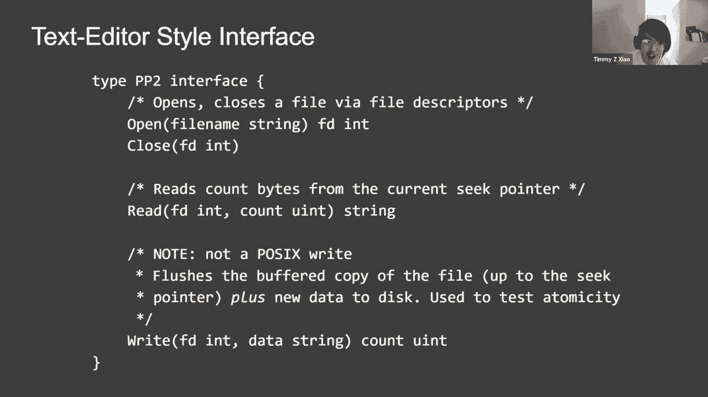

我们有一个演示来演示客户端与系统的交互。所以，这是我们的文件系统的快速演示，在串行和并行运行的情况下，在控制台一中发生的是，或者我应该说左控制台，将打开一个名为 tt 的文件，只是测试一下。

它会在文件中写入一些内容，然后右边的控制台随后将读取它，根据一致性模型，它们应该看到与左侧控制台所写的相同的内容，事实上，一分钟后，我们就看到了这个。好的，接下来会发生的事情是。

控制台一和控制台而都将尝试，同时刷新文件的本地复制，这不是传统的 POSIX 写入，它们都有它们拥有的文件的复制，并试图同时将它们放到磁盘上，所以从偏移量零开始的两次写入，其中一个会赢。

我们可以查看左侧控制台上的日志，因为它提交，过一会儿，你会看到，两个事务同时运行，它们都占据了日志的不同部分，但归根结底，左侧控制台事务将获胜，所以，它完全是原子的，一切都是有效的。

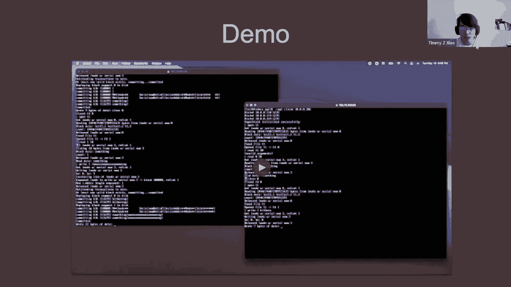

所以，这是。我想你被静音了。抱歉，我静音了，由于时间的原因，还有更多的，我们可以向我们的文件系统添加一些限制和功能，首先，我们只有一个根目录，所以增加更多肯定会是一个加分，接下来，我们只是。

我们将数据块持久存储到磁盘而不是 RAM ，因为这就是我们目前正在做的事情，但我们也应该考虑到我们正在做的事情，有很多写入，所以情况可能会很糟糕，如果我们继续写下去，一次操作就有大量写入。

我们也只有直接 inode 块，而不是间接 inode ，所以这将是一个加号，其次，应该有更好的方式让客户端与这个文件系统交互，所以可能有一个 FUSE 层，或者，它们可能是更好的 POSIX 兼容。

我们的演讲结束了。

你想谈谈你是如何测试这个的吗？当然，所以我们有一个，在你的推荐下，我们有一套相当广泛的测试，开始每个组件，所以每个块层，单独的 Raft 键值，我们有日志，我们有所有这些东西。

我们 mock 了下面的每一层，我们测试的每一层，做了一些单元测试，你不能把它叫做单元测试，一旦你达到了足够高的程度，因为你太依赖较低层次的正确性，但我们尽了最大努力，从那里我们进行了集成测试。

写出了一组分区，其中一个分区就是你刚才看到的，其中最有趣的是，这里有五个，你可以在我们的 Git 仓库中看到它们，然后我们也，在多大程度上，我们可以，所以这并不一定完全奏效，因为我们有一些时间限制。

但我们也试图做一些压力测试，显然，性能数据并不是很好，因为这不应该是很棒的，但是，尽我们所能，因此，我们非常确定这至少是在这里得到证实的。一件有趣的事情是，你们在追求稍微更强的一致性属性。

比 POSIX 所需要的，两个进程写入到一个文件中，实际上并没有太多，写入，我们必须要做的。是的，那是一种意外，但我们是，所以它更强了。是的。这是意外，但它确实发生了，所以我们认为酷，它起作用了。

服务器，我的意思是，我认为发生的一部分是，我们保证，我肯定我说过的话，但我们也保证块写入都是原子的，我认为这就是为什么我们会得到这种更强的一致性，因为日志这件事，是的，你可以让你的写入被覆盖。

如果你同时这么做，但它总是[干净的]。如果你有主动缓存，你可能会遇到，不立即写入日志，那么你可能会得到不同的行为。这就是为什么我们不积极地缓存，我们有一个大小为 1 的数据块缓存。太棒了，谢谢，很酷。

好的，我们的最后一组展示一个游戏框架，只要你准备好了，就可以开始。好的，我们相信，你们中的很多人在隔离时都玩过多人游戏，当你无聊的时候。所以让我们想象一下，你是一家小型独立游戏开发公司。

你试图开发一款多玩家的游戏，可能有几个不同的房间，比如聊天企鹅，你可能会和同一个房间里的其他玩家互动，或者可能是匹配的情况，你和其他几个玩家在大厅里。所以传统上，这些是如何工作的。

每件事都访问一台中央服务器上的进程，但中央服务器是一个瓶颈，如果每个玩家都必须连接到那个服务器来处理游戏逻辑，那个服务器因通过的请求数量而开始出现瓶颈，而且，如果服务器出现故障，这就是[]。所以。

我们的计划是创建一个分布式游戏框架，这也是容错的，所以，不是将所有处理都放在中央服务器上，我们将游戏逻辑处理分布到几个不同的工作服务器上，但最重要的是，为了实现容错，当这些工作服务器中的一个出现故障时。

我们需要能够处理这种游戏逻辑，并将玩家转移到其他一些工作服务器上，所以，作为其中的一部分，我们需要平衡延迟和容错，因为如果我们让一切保持容错，我们可能会遇到，每个移动需要很长时间才能处理。

这就是为什么我们要介绍 Pinguino ，这是我们的容错游戏框架，这解决了之前分布式网络的所有问题。为了深入了解我们框架的系统，让我们想象一下游戏俱乐部企鹅，在企鹅俱乐部。

用户分配到一个房间或一个区域，它只关心与其他用户交谈和互动，以及那个房间里的物品，他们不需要关心，在另一个房间里发生的任何其他事情，所以，没有理由让，每个用户的请求都由一个集中的服务器处理，所以。

我们决定，在多个工作进程中处理所有这些请求，为了做到这一点，我们有分配到不同地区的 worker ，所以，如果玩家在一个地区，他们可能正在与分配到那个区域的 worker 交谈，例如，在这里。

企鹅在 worker 中，它被分配给区域的 worker 2 ，我们只和 worker 2 交互，然后在 worker n 的会与 worker n 交互。此外，我们还提到。

我们认为这不会影响 worker 和地区之间的关系，不一定是一对一的映射，对于一些可能不太受欢迎和流量较少的房间，一个 worker 可能处理多个，所以有这样一种关系，我们需要追踪的。所以。

为了跟踪这一点，我们确实需要一台中央服务器，这就是 coordinator ，所以， coordinator 将跟踪所有这些映射，一些映射包括区域到 worker 的关系，以及区域。

 worker 和它们的副本的关系，以及玩家本身，所处，在容错方面，我们有，每个 worker 有两个复制，[]将更多地谈论一下，哪种信息发送给 worker ，到[]。另外。

 coordinator ，因为它是一台集中式服务器，它也是一个可能的故障点，所以我们有一个 coordinator 备份，这里 coordinator 的主要角色是。

只是为了跟踪所有这些游戏状态的关系，所以有关为这些关系更改的 coordinator 的信息，将被发送到 coordinator 备份，在处理完成之前。所以现在有了这个，虽然我们只有一台服务器。

游戏的大部分流量通常是，玩家进行移动并发送请求处理这些移动，这些被分配给多个 worker ，而 coordinator 负责映射，并发送心跳，以确保 worker 存活，可以处理任何故障情况。是的。

所以在 worker 倒下的情况下，我们让协调员来处理重新分配，那个在 worker 的玩家，并且因为 coordinator 仅管理区域映射，对于我们来说，在不同地区之间移动也很容易。

当比如一个 worker 超载时，这允许我们执行一定的负载平衡，正如我们之前提到的。酷，所以我将继续开发者 API 是什么样子的，因为我们想要的另一个关键功能是，为了使框架易于使用。

对于试图在其中编写新游戏代码的开发人员来说，所以，我们将游戏视为一个状态机，所以玩家的任何移动，属于两种不同类型的动作之一，所以我之前提到过，我们试图在延迟和容错之间取得平衡。

所以为了给开发者提供一种选择，我们向开发人员开放了两个单独的命令，第一个是 sendFastMove ，所以，这个快速移动确保，移动尽快到达副本，以便在 worker 上尽可能快地处理移动，另一方面。

我们有 sendStableMove ，这是一个容错能力更强的移动，我们向开发人员公开的，这确保了，这主要用于游戏关键逻辑改变，例如交易，所以如果你要买什么东西，你不想，比如，如果你已经花了那笔钱。

你想确保，你在游戏上花的钱都能得到，所以我们保证，如果移动得到完全处理，并在游戏中，它存储在两个副本上，这确保了如果与你交谈的 worker 倒下，然后玩家被转移到新的 worker 那里。

新的 worker 将能够重建游戏，包括那笔交易，这一保证不是为快速移动而做的，对延迟方面进行了优先排序，但你也可以在这里看到，开发人员定义的 Move 结构非常通用，所以，在游戏中。

我们开发了一个我们框架的玩具演示，这是一种聊天企鹅式的界面。所以每个玩家在几个不同的房间里，所以在每个房间里，有一个聊天窗口，你可以通过它与其他玩家交互，所以两种主要的移动。

你可以在这个游戏中使用的是[]移动，开发人员只需定义，移动玩家的 X Y 和 Username ，所以 ChatMessage 是一种，像你发送到窗口的聊天消息一样。所以，在我们的游戏中。

我们让聊天消息成为一个稳定的移动，像快速移动一样移动，所以即使一个移动被放弃了，也是可以的，如果你是一种新的[]，但是，我们不希望聊天消息随机消失，因为它们可能是重要的信息。到此为止，我将继续演示。

这只是一个小的 demo ，但应该展示一下它的功能。所以我们有极简的前端，所以当我们绕着企鹅走的时候，我们可以看到，它首先发送快速移动，发送给另一个副本的相同的移动，分配给主要的 worker 。

所以现在，我们在 worker 0 ，它被复制成 worker 1 和 worker 2 ，所以我们有两份复制，然后游戏服务器接收那个改变，这样它们就可以在本地处理这些信息，如果我们发送一条聊天消息。

我们还有玩家用户名，用所发送的聊天消息标识，但这是一个稳定的移动，所以它在日志中是不可见的，但稳定的移动要等到，这些移动真正复制到 worker 上，在这里看起来并不容易。

因为通常情况下可能会有一些滞后，但当我们在网络中引入一定数量的滞后时，那个移动要花更长的时间，现在移动到我们想要实现的一些未来工作中。

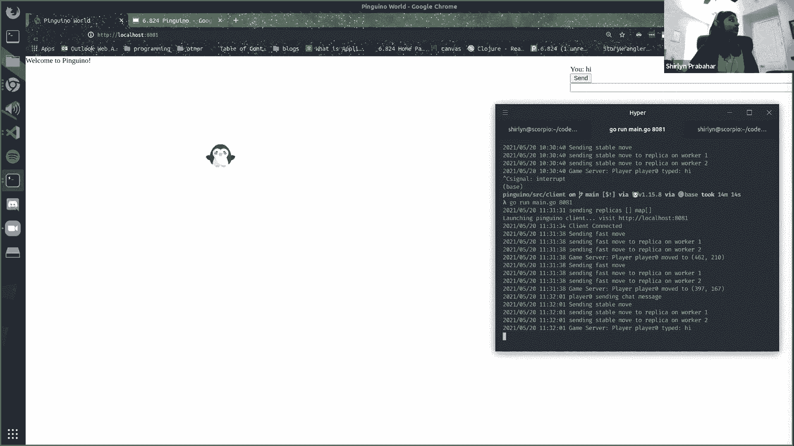

在后台方面，我们还想做一件事是，允许用户在不同的房间之间移动，所以现在，当用户加入游戏时，它会被初始化，他们被分配到一个房间，但理想情况下，如果他们想要移动到那里去，如果他们想换个房间。

然后他们应该能够与 coordinator 交互，嘿，我现在要去这个地区了，你可以从那个区域加载游戏状态信息，然后，现在我要开始和一个新的 worker 交互。另外，我们早些时候也暗示过。

我们希望处理基于区域的 worker 负载平衡，所以我们拥有它的原因是，为什么我们不采用 worker 到地区的一对一映射，是为了让这项未来的工作，我们希望能够做到这一点。

控制每个 worker 将承担多少负载。抱歉，我有个问题，所以，你的，同样，你有两个动作来发送消息和移动，所以，这些动作都是原子的，它们是不是。是的。它们会被按顺序处理，因为它们是单独的移动。

大多数情况下，他们只修改一些变量，它们在移动之前对这些变量加锁。所以你之前说过，你有一个 coordinator 和一个 coordinator 备份，副本可以与它们中的任何一个交互。

如果你有一个网络分区，分开 coordinator 和一些副本，coordinator 备份和其他一些副本，所以 coordinator 备份，在网络分区的情况下。

worker 会丢失 coordinator ，worker 与 coordinator 或 coordinator 备份交互，它们只能与 coordinator 交互。

如果 coordinator 倒下了，然后备份被启动开始处理，所以，在网络分区情况下，我不认为我们会。与 coordinator 分开的 worker，将无法处理，与协调者本身，结果发现在用户端。

它仍然可以被处理，因为玩家只需要继续与那个 worker 交互，如果这个区域有任何变化，比如整个游戏的状态，它还会被处理。是的，另外我还想确认一下，如果我们有一个分区。

coordinator 备份作为一个 coordinator ，对于它可以交互的所有 worker ，这很好，因为我们希望游戏仍然在所有地区运行。

在 coordinator 备份正在交互的 worker 中，这主要成了一个问题，当它们重聚的时候，在这种情况下， coordinator 备份获取其所有数据。

并且它可以将其发送给 coordinator ，coordinator 可以本地解决该问题，因为有一种原始 coordinator 和 coordinator 备份。

它们知道 coordinator 备份，因为它是本地储存的。但是如果 coordinator 备份称为 coordinator ，那不是，例如说，哦，我需要确保，我们有活跃的复制对所有的房间。

它们位于分区的另一边，你不会在两边分区都有相同的房间，并且会发散。不，因为每个房间只属于一个 worker ，所以，比如，所以我想，每个房间，比如不能，比如房间的副本会被放弃，所以从本质上讲，发生的是。

如果一个 worker ，在分区的情况下，coordinator 无法访问另一个分区中的 worker ，所以发生的事情是，我觉得它们把副本移动，但因为玩家也不能联系 worker 。

所有移动都不会被处理，因此在分区修复之后，较新的副本将被优先处理，在修复那个网络的时候。你为什么决定使用带有 Move 的 API，以及发出一条信息？所以针对这个 API ，我们想要两种不同类型的移动。

两种截然不同的移动，一个是快速移动，一个是稳定移动，理想情况下，稳定移动使用很少，并更多地用于交易，在那里花更长的时间是可以的，我们不想被丢弃，在一个简单的前端复制它的最简单的方法是通过聊天消息。

所以这有点武断，移动当然应该是快的，因为我们不想，因为玩家经常移动。谢谢。太棒了，非常感谢。

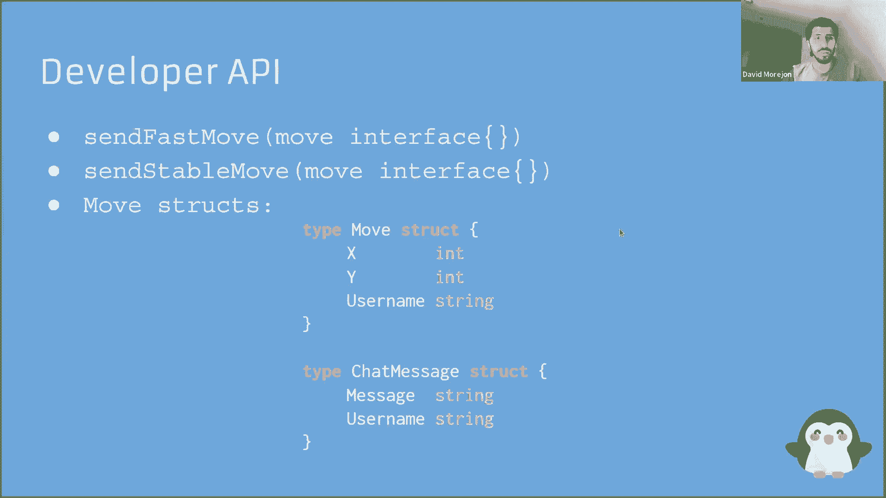

演讲到此结束，大家都干得很好，这真是激动人心。我还有一个关于[]演示的问题，如果可能的话。好的，继续。所以对于领导者来说，抱歉，对于分布式选举系统，我对密码学不是很熟悉，但我想系统对所有选举结果相加。

在一个投票器服务器上，这个不是那个[]团队袭击，例如，如果我有两台服务器，然后我在两台服务器上投票给不同的人，但之后我会和其他人协调，以另一种方式投票，最终将获得相同的投票因素，但我会恶意地认为它反对。

我想这种情况下，不会改变投票结果，或者选举结果，但我想我的行为是错误的，所以，是否有检查以确保每个服务器上的每个人都正确投票。是的。抱歉，我们实际上不处理恶意投票，这是一件很大的事情。

对于现实世界的投票系统来说，非常重要，但是，我想我们的项目的范围，我们出发了，它有点太复杂了，所以我们，是的。我认为我们更关注分布式系统部分，但如果我们想提供更多的安全保障，比如为了安全。

使用一个我们认为的想法，但后来决定不这样做，我有一个公共账本，你可以在那里给我们知识证明，你发的帖子加起来，这就是你所说的，想到这些事情来处理恶意参与者。好的。所以我们有点晚了，原则上，在课程中。

如果有人想提问，可以随意留下来，我想说一两件事，在最后一节课结束之前，首先，我想感谢你们的参与，即使又是一个 covid 学期，我觉得我已经和你们中的许多人互动过了，通过电子邮件，我们间接地。

并交换大量的信息，我也很想在某个时候见到你本人，真正知道你是谁，但是，我很感谢大家的参与。第二件事，是我想感谢助教，这是很棒的助教，你可能意识到，可能对很多人来说，他们找出了一些 bug 。

帮你通过实验，所以我为助教们鼓掌，非常幸运，有这样的品质。我想我要说的最后一句话，我想祝你在期末考试中好运，希望不会太糟，我希望你在 6。824 学到了一些东西，并同时享受它。任何想留下来的人。

请留下来，你想问不同团队更多的问题，如果这团队还在，就很好，否则，这就结束了，至少 6。824 的课程。谢谢大家。谢谢。非常感谢。谢谢。谢谢。非常感谢。抱歉，我有个小问题。好的。现在是最后一个问题了。

哦，我在想考试的后勤，我给你发了电子邮件。是的，我们还没到那个时间点，我们正在处理考试的后勤。好的。一对，两、三个。我们有计划，我们还没有执行，不会分享任何细节。好的。但这是会发生的。听起来不错。

你不需要我，确保在聊天中。好的，太好了，非常感谢你所做的一切，对于班级和助教。非常感谢你的所有课程，非常有趣，我学到了很多。谢谢你们，感谢你们的参与，提出了所有这些问题，我很感激。好的，谢谢。

这是一门很棒的课，我真的很感激。上课时一切都很活跃。