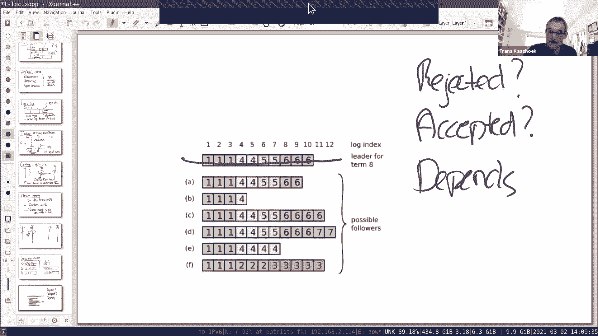

# MIT 6.824 2021 分布式系统 [中英文字幕] - P5：Lecture 5 - Fault Tolerance - Raft (1) - mayf09 - BV16f4y1z7kn

所以今天的主题是 raft 复制协议，我们将详细讨论这个问题，实际上，我们将使用多节课来讲解它，一个是，因为它是分布式复制协议示例的核心组件之一。所以，今天我们主要关注。

实验 2A 和 2B 所需的材料，leader 的选举以及推送日志，然后下一周，我们将更多地关注 2C 和 2D ，也就是快照和日志压缩，让我们有机会了解 raft 的任何其他方面。事实上。

我们会在接下来的一周再谈一次 raft ，我们会有一节关于 2A 和 2B 的问答课，讨论实验 2A 和 2B 的实际解决方案。好的？这就是我们的计划。我将从今天的起点开始深入讨论，可能开始的地方是。

观察之前复制系统的一些案例研究，我们已经看到了一些模式，看了 GFS mapreduce VM-FT ，它们都有一个单点故障，所以，即使它们是复制系统，它们复制以实现容错，它们实际上都有一个单点故障。

在 mapreduce 案例中是 coordinator ，在 GFS 的案例中是 master ，比如它发放租约，在 VM-FT 案例中，存储服务器是 test-and-set 服务器。

就像我们在上一节课中讨论的原因，是单个计算机而不是复制机器的原因是，是为了避免脑裂。对于许多系统来说，一种[]这种局面的方法是，我们构建一个高性能，构建一个强容错的系统，所有这些设计。

我们实际上仍然有一个单点故障，即使复制用于系统设计的许多其他方面，对于到目前为止我们所讨论的许多系统，为了避免脑裂，使用单点故障或维护单点故障，在许多情况下，这些都是完全可以接受的，因为在许多情况下。

比如存储服务器或 master 宕机，它只是一台机器，它宕机的机会比任何块服务器都小，可能已经有服务器准备启动，意味着如果 master 宕机，重新启动，我们将确保只有一个 master 在线。所以。

在很多情况下都是很好的，可能会导致很短的停机时间。但是有些系统，如果这样，就太好了，我们不需要单点故障，也许我们可以进一步减少停机时间，增加待机时间。所以，这是那种协议，raft 协议适合的地方。

在深入讨论协议中的关键概念之前，让我们提醒自己为什么这种单点故障会导致，为什么复制，严重的单点故障，比如 test-and-set ，会导致这种脑裂的问题。所以你可能会想，为什么不复制单点故障呢？

所以让我们试着这样做，然后我们很快会看到问题所在，所以，让我们复制 test-and-set 服务器。所以，让我们来做一个简单明了的情况，我们只有一个复制 test-and-set 服务器 S1 。

这里我们有 S2 ，是另一个复制 test-and-set 服务器，记得 test-and-set ，它接受参数 new ，并返回 old 值。目标是如果两个客户端同时调用 test-and-set 。

其中一个赢了，得到 false 作为旧值，而另一个会输，因为它会得到 true 作为旧值。所以让我们看看这如何发挥作用，所以，我们有一个客户端调用 test-and-set ，与第一个服务器通信。

与第二个服务器通信，我们不知道，是否能收到第二台服务器的响应。所以现在有两种情况，如果 S2 没有反应，有两个可能的原因会出现这种情况。所以有一种情况可能是，S2 没有反应，因为 S2 失败了。

在某些情况下，这种情况是我们想要做的，在这一点， C1 宣布胜利，因为没有其他人能够观察到 S2 ，我们就完成了，我们可以继续。但问题是，还有第二个情况，在第二种情况下，出现网络分区。

在 C1 和 S2 之间出现网络分区，所以在这种情况下， C1 不能继续进行，因为可能还有另一个客户端 C2 ，与 S2 进行通信，这将是非常严重的，在这种情况下， C1 继续进行。

因为它可能会更新 S1 ，得到 false 值，认为它成功了，同时，与 S2 进行通信，并且在 test-and-set 也会成功，所以，现在我们违反了 test-and-set 协议。

所以这就是脑裂的问题，当存在网络分区时，我们可能会遇到一种情况，两台服务器都在运行，并且为不同的客户端提供服务，因此违反协议，（违反）我们正在构建的系统的规范。真正具有挑战性的部分是。

C1 无法区分这两种情况，它不知道，到底是什么情况，S2 不可达，是因为它失败了或是因为网络分区，所以这是一个难题，在之前这些系统背后的，为什么它们使用单点，为什么它们不复制这些重要的服务，需要避免。

避免脑裂问题。那么，我们能做些什么，这里的关键问题是，我们应该如何处理网络分区，我们怎么处理它们。所以有一个关键的想法，作为 raft 或其他协议的基础，解决方案或为什么这些协议可以成功。它是什么。

简而言之，就是多数原则。作为一个例子，在 test-and-set 服务器的情况中，不是运行两个复制的服务器，我刚才所做的，我会用三个服务器来运行它，所以我会有 S1 S2 S3 ，规则将会是。

客户端可以认为操作是成功的，如果至少更新了大多数服务器。所以在这种情况下，我们可以向 S1 发送消息，做 test-and-set ，我们向 S2 发送消息，做 test-and-set 。

现在我们得到它们两个的积极回应，在这两种情况下，都是 false ，然后我们向应用程序返回 false ，然后应用程序认为 test-and-set 是成功的。当然，我们对第三个也是这样做的。

但第三个可能，消息可能不会到达，或者服务器可能停机，我们不知道，实际上我们并不在乎，因为考虑以下情况，我们有第二个客户端也在尝试进行 test-and-set ，为了能够成功，它必须与大多数服务器通信。

所以，无论与哪个大多数通信，它将包括 S1 或 S2 ，并且对于 S1 和 S2 ，这两个操作都已经在 C1 成功了，所以 C2 总会观察到 C1 的操作结果，因为这里有重叠。你会看到 raft 。

和现在发生的事情完全一样，当一个 leader 接受，或者操作在大多数 follower 接受，这意味着下一任期会有一位继任的 leader ，也会获得多数席位，选为 leader ，作为投票的一部分。

将会有一个服务器或一个 follower ，会看到了最后一次操作，由上一任 leader 执行的（操作）。所以，这将我们奠定基础，我们可以构建容错服务，可以处理网络分区，在服务器故障中。

仍然实现很强的一致性。另一种考虑这个大多数的方式是，如果发生网络分区，只会有一个拥有多数的分区，不会有其他分区具有多数，所以，只有拥有多数的分区才能继续进行。换一种说法是，另一种含义是。

也有可能是这样的，有多个分区，任何地方都没有多数，在那个特殊的案例中，系统不能继续运行，访问它的客户端必须等待，直到网络完全修复，至少有一个，至少有一个分区包含大多数服务。另一种简单的观察是，当然。

你可能想要使用这个方案，我刚才描述了三台服务器，只能容忍一台服务器停机，如果两台服务器停机，没有人能真正获得多数，所以没有人可以，或没有客户端可以真正完成操作，显然，这个想法很容易推广。

通过通常被称为 2f+1 复制的方式。所以如果你想容忍 f 个错误而不是 1 个，你需要 2f+1 台服务器，如果 f 失败，至少你还有多数。所以，这里 f 是 1 ，所以我们运行的是 3 台服务器。

你h希望 f 是 2 ，你有 5 台服务器，等等，你希望 f 为 3 ，那么有 7 台服务器。好的？还有一件事可能需要指出，我在问题中提到了很多，大多数是什么，多数是所有服务中的大多数。

包括开机和停机的。所以，当你获得多数时，你不是获得 2 个中的大多数，如果这里只有两个存活，你获得系统中所有服务器的大多数。对于这个关键想法，有什么问题吗？会有偶数台服务器吗，比如，你有 4 台服务器。

且占多数，而不是 3 台。如果你会在几个案例中看到这一点，在图表中，如果服务器的数量，从 7 台减少到 6 台，其中一台停机了，而你仍然想继续，你需要多数，你仍然需要 4 台服务器才能继续。

但如果你可以拥有 4 台服务器，然后你就可以继续前进了。好的。我也有一个关于大多数的问题，大多数是否包括服务器本身，假设是 raft ，服务器考虑到本身吗？是的，它是其中的一个。

通常我们看到的 raft ，领导者直接投票给自己，或者候选人投票给自己，在领导者中，当它追加自己的日志时，它算一个，所以它是其中的一部分。好的，所以，有相当多的协议使用这个想法。

有时这些想法被称为法定人数协议，很明显的原因，大概有两个，[]的状态维持了很长一段段时间，直到 90 年代初或 80 年代末，基本上没有协议，所以，我们总是处于这种单点故障的情况下。

然后在 90 年代初，出现了两个协议，几乎在同一时间被发明，一种叫 Paxos ，这个在论文中提到了很多，另一种称为 View-Stamped 复制，有时称为 VR 。

它们都是在 1990 年左右发明的。在那个时间点上，它们并没有得到太多关注，因为人们并没有迫切需要，[]一种完全自动化和容错的系统。但在过去的 15 年里，情况发生了变化，在过去的 15 年里。

大量使用这些协议。事实上，观察起来很有趣，在过去的 15 年里。这是在这些协议发明 15 年后，它们在桌子上或在架子上放了 15 年，直到人们有了真正的用例。我们将在实验中实施的协议。

我们将在讲座中讨论，论文的主题，就是这个称为 raft 的协议。我认为它是 2014 年产生或写下的，2014 年的论文，这是更完整的描述之一，它涉及到很多不同的方面，你能够构建完全复制状态机。

并清楚地解释了这些，这是为什么我们要把它用于实验的原因之一，对于这个课程。关于协议历史，有什么问题吗，在我讨论 raft 之前。好的，在真正讨论 raft 之前，首先，让我简单介绍一下。

如何使用 raft 构建复制状态机，因为这是我们最终的目标，这有助于我们思考 raft 能为我们做什么。所以你使用 raft 的基本方法是，我们会在实验 3 中做这件事。假设你有一台服务器。

而 raft 就是一个库，在我们的设置中是一个 Go 包，你可以编写一个状态复制机，通过导入这个包，所以我们得到，在底部有一个 raft ，你使用 raft 构建一台服务器，例如，在实验 3 中。

我们将使用 raft 构建一个键值服务器，客户端与键值服务器交互，这有点像 put 和 get 操作，而键值服务器，当它收到这些 put 和 get 操作时，它把它交给 raft 。

所以它放到 raft 中，放入一个，我们会看到更多细节，它会把它放入日志，稍微重新画一下，将它附加到日志中，它附加到日志的末尾，然后 raft 内部与其他服务器交互，复制这个日志。

这里有一些其他的服务器，它们的结构基本上是完全一样的，它们都有一个 raft 库组件，以及键值服务器，就像我们见过的许多其他复制状态机一样，它们是相同的键值服务器，我们要玩同样的游戏。

像其他以前的复制的状态机，向键值服务器提供操作，以相同的顺序，因此，以完全相同的顺序复制所有 [applied] 操作，我们会看到同样的键值存储，我们在这里有一个键值存储，键 20 有一些值。

我们更新这个表，以完全相同的顺序，对所有副本，事情应该是好的，我们会有一样的复制。raft 构建的方式是，其中一个复制是领导者，所以为了方便起见，这是这一边的第一个，客户端访问领导者，然后。

接下来发生的是，客户端访问其中一个领导者，kv 服务器的领导者，将日志条目附加到领导者的 raft 日志中，然后可以与其他的 raft 库进行交互，还有一些 raft 库也做同样的事情。

它们将操作附加到日志中，添加到它们的日志中，发送响应给领导者。当然，所有这些状态都是存储的，日志以及一些其他状态存储在磁盘上，所以如果其中任何一个失败了，它们至少有最后一部分的日志可用。

并可以从那里进行构建。我们会更详细地讨论一下，但是一旦日志条目在 3 个服务器上复制，然后，它们可以按顺序传送到键值服务器。所以，每个提交的操作，每个日志都有一个索引。

操作索引为 0 或为 1 2 3 4 ，任何有顺序的，它们将会按顺序传送到键值服务器，一旦操作被提交，它将被传送到键值服务器，键值服务器执行该操作，可能更新键值表，然后，领导者单独向客户发回响应。

所以这是一系列事件大概发生的顺序，客户端向领导者发送请求，领导者把[]给 raft ，raft 和其他服务器交互，一旦它复制了足够多的机器，那么它被任务已经提交了，我们随后会讨论更准确的提交的含义。

然后提交的操作传递给键值服务器，然后它们执行操作并响应客户端，领导者回应客户端。那么，失败后会发生什么，如果失败，新领导者就会当选，它将接替旧领导者的角色，例如，在这张图片中，情况可能是这样的。

这个领导者崩溃了，然后这个成为下一届的新领导者，我们会明白这到底是什么意思，然后客户端会发生故障转移，它们会看到的，它们得不到回应，所以它们会超时，它们转移到第二个领导者，新的领导者，重试它们的操作。

所以新领导者将接管它们的操作，把它放回 raft ，和以前一样的事情发生了，也许这一次我们很幸运，我们完成了操作，没有失败。如果你仔细想想这件事，这意味着，客户端操作可能会在日志中出现两次。

因为可能是在它第一次成功了，但是没有得到回应，所以它不知道自己成功了，它将重试，这个新的领导者会把日志，把新的重试操作也放在日志中，它将在键值服务器的某个时刻出现，实际上是重复的。

正如你们将在实验 3 看到的，实际上，你需要检测重复。但这主要是实验 3 的问题，不是目前的主要问题，但重要的是，这是一种普遍的风格，人们使用 raft 来构建一个复制状态机。

关于如何将 raft 用于复制状态机，有什么问题吗？我们在聊天中有一个问题。好的。访问领导者的客户端数量通常是多少？可能会有很多，它没有真正的限制，你会看到，可能是一台机器可以，也许这是不明显的。

但问题是，一个领导者无法容忍，没有能力处理这么多客户端，所以，接下来会发生的是，服务器会分片，将键值服务器分片到多个 raft 组中，例如，分片 1 是一个 raft 实例。

分片 2 是一个 raft 实例，分片 3 是一个 raft 实例，客户端访问对应的分片以应用其操作，通过这种方式，我们可以将服务器扩展到许多客户端，事实上，这就是实验 4 所做的。客户端如何知道。

在旧领导者失败后，如何与新领导者通信？客户端有系统中所有服务器的列表，在这种情况下，我们运行三台服务器，每个人都同意只有三台服务器，客户端知道这三台服务器，它们随机尝试，如果这不是客户端，它将重定向。

这不是领导者，它会将客户端重定向到适当的，实际的领导者。是的，答案很清楚。但我们是否认为这些服务器在地理位置上是相近的，彼此很亲近，或者它们可以。原则上，它们可能相距甚远，这边没有真正的限制，当然。

唯一的问题是，如果它服务于很远的世界各地，获取日志记录追加的延迟，将需要一段时间，所以，延迟会变长。kv存储中执行的日志条目是什么？一旦它被 raft 提交，一旦 raft 确定，有足够的复制收到了它。

现在，不能能回退那个操作，然后，它被送往键值服务器。所以领导者会首先执行这个命令，领导者会告诉跟随者这个命令已经提交，然后是跟随者。一旦领导者知道操作被提交，从键值服务器获得的。让我们现在谈一谈。

我将在进行的过程中更详细地介绍，所以，更多地了解协议的概况。上一个页面是一个概述，关于如何使用 raft 构建复制状态机，现在让我们更详细地看看 raft 。所以我们这里有时间线，有一个领导者。

有两个跟随者，我们运行了三个。客户端访问领导者，领导者有日志，所有的 put 和 get 操作，当它得到一个新的（日志），把它附加到日志的末尾，然后它会发送它，发送日志条目给。

（发送）新日志条目给跟随者。比如跟随者 2 ，这是跟随者 1 ，这是跟随者 2 ，跟随者 1 接收到日志条目，一切都很好，附加在日志的末尾，它发回一个确认，表示是的，我附加了它。

在 raft 的这一点上，两个服务器有日志条目，领导者可以提交日志条目，在这一点上，领导者可以移交刚刚收到的请求，可以将其移交给 kv 服务器。实验执行这个操作的方式，或者实验[]所做的是。

我们有一个 Go channel ，一个 Go channel 是一个 raft Goroutine ，而 raft Goroutine 决定，一个操作已经提交。

它只是把操作发送给 apply channel ，让键值服务器可以应用它。以后的某一点，所以注意这一点，领导者已经提交了操作，对于领导者提交这次操作是绝对安全的，因为大多数服务器。

实际上大多数节点都已经收到了操作，所以即使有一次失败，我们选举一个新的领导者，在这种情况下，领导者是其中一个服务器，它包含最后的操作，是由上一个领导者附加到日志中的。所以一切都很好，当然。

最后一个服务器，第一个追随者也会在某个时候做出回应，表示同意。所以这一点，从领导者的角度来看，操作已经提交了，只是追随者还不知道，因为追随者只知道他们得到了它，领导者可能拥有它，但它们并不真正知道。

所以实际发生的是，随后的操作，当另一个客户端请求进入时，领导者将追加另一个日志条目，向跟随者发送一个新的操作或新的附加条目，这个附加条目做两件事，它为新操作提供新的日志条目，但它也确认所有之前的操作。

告诉我们到目前为止提交了哪些操作。所以当 F1 和 F2 收到这个操作，这个 RPC ，它们知道操作已经被领导者提交了，所以，在这一点上，它们也可以传递给它们的键值实例，并且知道这个操作已经提交。

我有一个简短的问题，所以，当领导者发送操作，并得到服务器响应，这是不是意味着，这意味着它在日志中，对吧，但是（以下情况）会发生什么，如果你有一个[轻微的]多数，然后其中一个服务器崩溃。

我们的日志必须存储在存储中，比如磁盘。是的，这是一个非常好的问题，日志的每一次更改，所以你仔细看看 raft 论文，有些状态是必须稳定的，日志是那些必须稳定的信息之一。

以及 term 编号和很多其他东西。所以，如果服务器崩溃，不是什么大事，因为大多数服务器的磁盘上都有该条目，当它们回来的时候，它们会找到的。我有个问题？好的。那么会发生什么。

如果跟随者 1 回答是的并提交，在它向其余跟随者发送下一个命令提交之前，它崩溃了，现在很多追随者不知道它们需要提交，因为领导者已经崩溃了，那么，这不会带来问题吗？它们会提交，因为它在一个跟随者的日志里。

正如我们将在领导者选举规则中看到的，它会成为新领导者，它会将追加条目传播到其他服务器，然后它们也会应用。好的，我明白了，好的，谢谢。好的，这带来了，转到下一个主题，为什么日志。

最后三个问题都是关于这个的。好的。我有一个最后一个问题的后续问题，所以，服务器在发生共识后崩溃，比如正好在提交之前，它可以推迟提交，对吗？你说的提交是什么意思？比如它达成共识之后，在它有大多数之后。

它可以像论文上说的那样，你可以告诉其他服务器，你告诉它们，一切都准备好了，或者抱歉它被提交了，已经准备好，在状态机中执行，所以，如果它崩溃，在告诉所有服务器，它准备好执行之前，它可以延迟执行，对吧。

它可以延迟执行，好的，首先，如果领导者在这一点上失败了，什么都不会发生，至少客户端不能继续进行任何其他更多操作，所以，如果你考虑的话，在这一点上， raft 重新配置自己，选举新的领导者。

也就是 F1 或 F2 ，这两个中的一人将成为新的领导者，另一个成为跟随者，两个中的一个已经收到了，领导者可能已经提交的追加条目，实际上，它可能已经被 kv （服务器）执行了，这是没有问题的。

因为它们中的一个包含它，这个将成为领导者，我们将在后面的领导者选举规则中看到，那个将提交到它的 kv 服务器，并将它复制给其他跟随者，然后它将应用于每个 kv 服务器，最后。

所有（服务器）以相同的顺序应用所有操作。我同意，最终它会发生，但它可能会推迟，对吗？是啊，完全有可能推迟，[]，对所有追随者来说，一个完整的日志，它会，它的工作方式是，它尝试发送它的日志的结尾。

如果一个跟随者没有识别出日志的结尾，就回退，发送更多更早的条目，我们以后再讨论这件事。但是，最终情况可能是这样的，领导者将向其中一个跟随者重播它的完整日志，如果一个跟随者错过了所有日志条目。

我要回到日志了。所以你可能想知道为什么会有日志，因为 kv 服务器，它也有一个数据库，有一个表，里面有所有的信息，那么为什么我们需要这样的信息两次，一次在日志中，一次在 kv 表中。有几个原因，一个是。

几个已经在问题中出现了，一个是用于重传，当领导者向其中一个跟随者发送这些附加条目时，消息可能会丢失，所以，领导者必须能够重传，所以，我们需要保留所有日志条目的记录，那些正在[传输中]的。

第二个原因可能是主要的原因，首先，我们需要顺序，每个追加操作或每个命令必须传输，以相同的顺序在所有的复制上，对于我们来说，日志是一种非常方便的方式，来维护这种顺序，所以第二个原因是重播。

第三个原因是我们需要持久化，其中一个追随者可能会崩溃，或者它们都可能会崩溃，然后它们又出现了，我们需要一个[位置]，我们可以重传日志条目，使每个（跟随者）都同步到最新，所以，日志也必须是持久化的。最后。

我们需要一些空间，来进行试探性的操作或试探性地提交，试探性的命令，就像我们之前提到的，它出现在前面的问题中，当领导者向追随者发送操作时，在这一点上，追随者并不知道，哪些操作将被提交，所以在这待一会儿。

直到它了解到操作已经提交，所以我们需要一些空间来进行试探性操作，日志是做到这一点的方便的地方。最后，会发生的是，日志在所有服务器上都是相同的，可能在一段时间内会有不同步的情况。

一个日志可能比其他日志有更多的条目，但是如果你继续运行这个系统，然后阻止客户端，然后在某个时间点，所有日志将是完全相同的，这意味着那些，因为它们都有相同的顺序，所有操作将会。

以相同的顺序对 kv 服务器，然后 kv 服务器最终会是相同的状态。好的？好的，让我来简单介绍一下单个日志条目。所以，不管怎么说，我们会画很多这样的画，这里有很多日志条目，从 0 1 2 开始。

如果我们查看其中一个日志条目，会有一个命令，我们会忽略这个，我们要好好考虑一下，这是要交付给应用程序的东西，比如这是一个带参数的 put 或 get 操作。然后第二个东西是 term 。

这是领导者的任期，所以 term 是这个指令附加到日志中，你可以考虑的一种方式是，term 唯一地标识领导者将操作附加到日志，在每一个任期内，只有一个领导者，所以， term id 隐含地表示。

领导者附加日志条目，这里出现的数字，如果这是 n 或者我使用 i ，这是日志索引，所以，日志索引和 term 编号的组合，唯一地标识特定条目的内容，不会有两个日志条目，具有相同的索引。

相同的 term 和不同的命令，因为只有一个领导者，在特定的任期内主管，那个领导者提交追加操作。没有提交的日志条目会被覆盖吗？是的，它们可能会被覆盖，我们以后再谈，但这当然是有可能的。好的。

我们看这张图，在这一部分中有两个东西，我想我对这个问题的回答，有两件事需要发生，我们需要选出特定任期的领导者，我们需要确保，确保日志是相同的，我们更换领导者，所以我们要讨论这两个话题。

我们从领导者选举开始，然后稍后再讨论如何使日志完全相同。好的，选举，选举是实验 2a 的主题，这个故事很简单，我们有，假设我们是具有三个条目的系统，我们有一个领导者，在 term 10 。

我们有跟随者在 term 10 ，所以我们的情况是稳定的，另一个跟随者在 term 10 ，假设领导者崩溃，或者发生网络分区，不能继续访问了，接下来会发生的是，跟随者将开始选举。它们开始选举的原因是。

它们错过了领导者的心跳，领导者的工作就是定期地，它使用固定间隔向跟随者发送附加条目，通常，可能会发生，因为很多客户端都处于活动状态，所以，跟随者不断地获得追加条目。

但是如果领导者没有从客户端收到任何命令，那么它周期性地发送心跳，告诉跟随者，它仍然是领导者，心跳基本上是正常追加条目的形式，除了没有新的日志条目，所以领导者在心跳中告诉（跟随者），比如我的日志有这么长。

这是我的最后一个条目，如果这些是匹配的，那么一切都很好。所以，如果领导者失败了，在几次心跳之后，我们会更详细地谈到这一点，这里有一个选举超时。所以跟随者运行一个计时器，它们重新设置计时器。

每当收到心跳或附加条目时，但是如果它们没有收到任何心跳或附加条目，然后在某个时间点，在这个选举超时之后，计时器开始计时，在这一点上，跟随者开始选举，让我们假设，第一个跟随者首先到达那个点，它会做什么。

它会发送，它会增加它的 term 编号，所以，我们将 term 编号设置为 11 ，它会告诉自己，作为（选举）的一部分，并为自己投票，然后会联系其他跟随者，也试着联系领导者，假设领导者宕机了。

所以领导者不会回应，但第二个跟随者会回应，所以，在这一点上，它获得了两票，一个来自自己，一个来自跟随者，在这一点上，它成为了新的领导者，它成为 term 11 的领导者。

然后客户端会故障转移到那个领导者上，事情会像以前一样进行。好的？现在可能有点小问题，你可能会担心，其中之一可能是以下情况，在领导者 10 之间有一个网络分区，其中领导者和跟随者都是 term 10 。

在某一时刻，网络分区会修复，所以，可能客户端的请求仍然到达领导者，term 10 的领导者，当然，现在看起来，我们可能有两个领导者，我们又回到了脑裂问题上，事实证明并非如此，因为当领导者试图。

向跟随者发送追加条目时，向位于 term 11 的跟随者，它们会拒绝那些追加的条目，它们会告诉老的领导者，不好了，他不再是领者了，事实上，它们会发回一条消息，说，我不能做附加。

这是我目前的 term 编号 11 ，领导者收到，看到 term 编号 11 大于 term 编号 10 ，从领导者退下来，变成一个跟随者。它们参加另一次选举，或者成为这三个的一部分。

但不会出现脑裂的问题，因为你不能做任何操作，所以没有脑裂问题。我们避免脑裂问题的原因是，因为这个多数规则以及这些 term 编号。好的，这当然不是唯一的问题，我们可能面临的另一个挑战是。

我们可能会遇到分裂选举。所以就像这张图，我们有一个领导者，也许这个领导者在 10 ，是网络分区，这是两个跟随者在 10 ，如果我们一不小心，也许它们会，开始选举非常接近，所以 F10 投票给自己。

第一个跟随者投票给自己，第二个跟随者也投票给自己，然后它们互相发出了投票请求，规则是你可以每个 term 投一票。所以当第一个跟随者投票给自己，它已经为自己投票了，当它收到第二个投票请求时。

它不能投票给该请求，因为它已经投票给了自己，所以，在这一点上，我们会有分裂投票，这个有一票，而这个也有一票，它什么也做不了，但在随后的某个时刻，这里会有超时，然后这个过程又开始了，当然。

作为这个过程的一部分，这是选举 11 ， 11 导致 12 ，如果你想到选举编号 12 ，然后再次尝试这样做，现在如果你不在意，这可能会一次又一次地发生，基本上每次，这两个跟随者大致同时开始这次选举。

我们不会取得任何进展。所以，我们需要避免这个问题，就是选举超时是随机的，所以跟随者设置选举计时器时，在论文中，他们谈到，选择 150 毫秒到 300 毫秒之间的值，这个区间内的随机数。

每次这些追随者重置它们的选举超时，它们选择了一个新的数字，间隔中的一个随机数，只有当计时器结束时，它们才会进行选举，而且，如果，如果这个间隔足够宽，这不太可能是，第一个跟随者得到。

第一个跟随者的定时器超时，间隔足够宽，有机会成功完成选举，在第二个定时器走完之前，在另一个跟随者之前，所以这避免了无休止的分裂投票，我们可能不走运，我们可能会得到一两次分裂投票，但随着时间的推移。

情况是这样的，我们最终会成功。有几种，这对实验 2 来说可能很重要，这些选举超时有几种[压力]，你不想让选举超时时间太短，因为如果它太短，例如，比心跳还短，你可能会丢失一条消息，直接开始选举。

没有什么不好的事情发生，因为我们会选出一位新领导者，你会到一个新的 term 以及一些东西，但是，在这次选举中，这个系统是不可用的，客户端被阻塞了。所以你不想导致不必要地选举，所以你想做的一件事。

选取一个值，至少大于一些超时，一些心跳，也许在一个，也许一个数据中心需要几毫秒的时间来进行 RPC ，我们可能想要等待，至少可能三四次 RPC 左右时间，以便我们有机会重试 RPC 。

在选举定时器没有到达之前，这样我们可以从临时网络故障中恢复过来。那么我们大概想要增加一些随机的值，随机值，以避免分裂投票，所以一方面我们想让随机值尽可能大，因为我们把它做大，那么。

我们遇到分裂投票问题的可能性很小。但另一方面，如果我们这么做了，那么系统可能会停机更长一段时间，我们可能会把选举超时时间定得很大，从客户的角度来看，这意味着停机时间，所以我们想要保持足够短的时间。

停机时间很短，在[]选举的论文中，做了相当多的工作，来验证得到合理的值，对于他们的设置，这就是为什么他们得到 250 到 300 毫秒的时间，在实验里，我们使用更广泛的（时间），基本上。

如果你在一秒钟内恢复，你都会做得很好，对于我们的测试用例。好的，我想再提一点关于选举的问题，所以，另一个需要考虑的重要场景是，我们有一个跟随者，我们有领导者，并且领导者停机，所以这是 10 。

这是 10 ，这是跟随者 10 。我们已经谈过了，比如这个（跟随者）先开始，为自己投票，协议记录在稳定的存储上，我们投票给了谁，所以记录在跟随者 1 ， 跟随者 2 ，对于跟随者 1 。

记录选举在 term 11 ，为什么它记录在稳定的存储器上，为什么跟随者需要记住这一点，这是在 term 11 投票给自己的。如果失败，这种方式不会投票两次。是的，它可能会崩溃，在这里，然后回来。

它应该记住这一点，有些事情可能，我们假设这里有第三个，跟随者 3 ，并且已经投票给了跟随者 3 ，那么它其实是不会变的，因为在 term 的最后，我们需要一个[位置]，每个 term 只有一个领导者。

永远不会有两个，所以，为了确保每个跟随者都必须记住，投票给了哪位候选人，并且永远不会改变主意。好吧，我想聊天中所有关于超时时间的讨论，都和实验有关，所以人们看到，对此感到困惑。

否则我们可以更多地谈论选举，因为这是我说的最后的关于选举的事情。对于选举，有什么问题吗？有一个更一般的问题，所以，在实验的图 2 中，它说，对于每个服务器，保存当前的 term 和投票给谁。

但不是服务器现在的状态，比如它是候选者或跟随者或领导者。所以我想知道，这是隐含的，还是有其他方法来解决这个问题？我想当你回来的时候，你以跟随者的身份回来，你要开始一场选举，然后，在选举结束时。

你知道你是什么，你要么是跟随者，要么是领导者。我明白了，好的，谢谢你。这能理解吗？关于图 2 的一个警告，大多是积极的，可能会有负面的[说法]。在图 2 中的任何地方，当它说你应该这样做时。

你真的应该这么做，所以你不能[]图 2 中的任何细节，如果你这么做了，那么毫无疑问，一些测试用例会失败，不幸的是，图 2 并不完整，所以你还是得做点什么，尤其是图 2 并没有很好地说明，如何处理回复。

投票 RPC 和追加 RPC ，所以，你必须做一些事情来填补缺失的细节，所以，在图 2 中有两点，你最好处理好它里面的任何东西，但仍有可能会遗漏一些东西，你必须自己解决，你会经常看图 2 。

从选举过程的描述来看，看起来是这样，即使对于实验 2a ，仅处理选举，好像也有一些状态需要我们持久化存储，例如，你投票给谁和 term 编号。是的。但是，当你查看实验 2 的代码。

所有与持久化保存状态有关的代码，上面写着实验 2c ，那么它是不是并不那么关键，也许关心持久存储，或者我们应该开始[]。是的，我想在前几次测试中，我们并没有使机器崩溃，所以，这并不重要。

在实验 2c 中，有机器崩溃。好的，太棒了，谢谢。好的，怎么样，大家都跟的上吗？好的，我们开始下一步。好的，有一件重要的事要注意，在在前面的问题中也提到了，当我说到到那个困难的主题，就是日志可能分叉。

它们可能非常[戏剧性]，但是我们先初步了解，然后更详细地讨论。让我们举几个简单的例子，所以我写一些东西，并使用下面的符号，我们像以前一样有三台服务器，但我要删掉所有时间线的东西，只是画出日志。

我们有索引，我们假设这些索引，这里有前面的部分，当我们谈论 10 11 12 的时候，在每一个中有一个 term 条目，我们假设所有三个服务器，在 term 3 中提交或追加操作到索引 10 。

同样的事情也发生在索引 11 中。所以，一种考虑方式，一种可以得到这个的方式，服务器 1 是领导者，服务器 1 附加到自己的日志，然后复制到 S2 和 S3 ，同样的事情也发生在索引 11 上。

然后接下来的 12 可能也成功的，追加一个操作到它的 term 的那个索引，这是 term 3 ，然后它崩溃了。好的，现在我们遇到这样情况，其中一台服务器的日志中有一个额外的日志条目，而其他的没有。

或者可能其中一个有两个，但肯定不是完全相同的。但这是一个简单的情况，不仅是我们正在进行的步骤，还有更多有趣的情况。所以，另一种情况可能是，一台服务器，同样是 S1 ，相同的场景 S2 和 S3 。

假设我们有以下日志，这是我们在索引 10 中的情况，我们有 term 3 的条目和所有服务器，索引 11 ，第一个服务器没有条目，另外两个有一个 term 3 的条目，然后最后一个编号 12 。

我们有条目索引 4 在 2 3 服务器上，并且使用 term 编号 4 和 5 。所以，我们需要问自己的第一个问题是，这可能吗，raft 会以这种方式生产日志吗，在相同的日志条目中。

我们有两个不同的 term 编号和相同的日志索引。是的，这是可能的。所以，它看起来像。它像什么场景产生的？是的，这看起来像，服务器 2 或服务器 3 是 term 3 的领导者。

然后把一些日志放到服务器 1 上，然后与两个服务器中的一个共享另一个日志，在这一点之后，它停机了，然后 S2 当选为 term 2 的领导者，这仍然是可能的，因为它的日志是最新的，和其他人一样最新。

然后。再次确认一下，S2 当选在 term 4 。是的。好的，不是 term 2 。好的，那么 S2 在 term 4 当选，并使用 S1 作为备份，以追随者的身份？是的，我想。

然后 S3 在 term 5 当选，在 S2 可以将任何东西放入日志之前。是的，换一种说法就是，S2 可能崩溃，正好在 term 4 当选之后，然后有一个超时，然后假设 S3 分区，但现在又回来了。

在这一点上，它将成为，它会进入 term 5 ，是吗。是的。好的，所以这是可能的，所以可能会有相当多的[]变种，所以我们来看一下，所以这是家庭作业中的表 6 或表 7 ，糟糕。

家庭作业问一些关于表格的基本问题，比如图 6  或图 7 中的这个会发生什么，我认为是图 7 ，正在讨论的场景，比如最上面的这个成为新的领导者，在作业中，我们问这个问题，如果这个领导者停机了会怎样。

可能的结果是什么，可能的结果，对每个日志索引，问题是，哪个会拒绝，哪个肯定会被接受，哪个要看情况而定。我认为有一件重要的事情要做，因为我们必须了解什么，所有可能的日志条目，可能的输出是什么。

它会更加稳固我们的理解，关于 raft 是如何运作的，我想做一个快速分组会议室，我想让你们找出两种可能的结果，这并不能保证，在相应的场景中，所以，让我们做一个快速分组会议室。

让我们试着在 5 分钟内找出家庭作业问题的答案。Lily ，你能做。你想让我这么做。是的。是的，让我让你来主持，现在你是主持人。

嘿，各位。好了，大家能听到我说话吗？我能得到一个确定的信号？是的。好的，好的，希望大家都能好好讨论这个，这是一个关于日志发散的讨论，我们在这里看到这个表格，有一些很[]的变量，对于可能发生的事情。

这些都是可能的，如图中的标题所解释的，它们都是可能的情景，所以作业中的问题，快速回顾一下，我相信你们大多数人已经。我想我们看不到你的屏幕。哦，那太糟糕了，那是因为我忘了点击分享，好的，让我来修复它。

对此我很感激。

好的，你在屏幕上看到了吗？是的。好的，谢谢，抱歉，好的，回到图 7 的标题，图 7 解释了所有可能的情况，我们想弄清楚的是，在讨论日志如何修复的细节之前，什么是可能的。

这个最高的这个（节点）没有当选为领导者，这幅图的标题，有什么结果是可能的，它们将会是，我的意思是，比如，我们查看 f ，它有一个条目来自 term 2 在索引 4 ，我们想要问和理解的问题是。

显然这是可能的，因为这是可能发生的，接下来会发生什么，这个条目有没有可能保留下来，所以我们重新配置领导者，日志[同步地]放在一起，领导者强制日志是相同的，有没有一种情况。

来自 term 2 的条目继续存在。没有。没有，正确，这个肯定会被拒绝，为什么会这样呢？来自 term 6 的条目已经被提交，所以 f 永远不会当选。是的， f 永远不会当选，所以其他人将会当选。

没有人有来自 term 2 在索引 4 （的条目），所以，它会被覆盖，什么值会被覆盖？一个 4 会被覆盖。这会变成 4 ，所以，当我们稍后谈到日志时，同步迫使跟随者记下日志，必须是这样的，在 f 上。

这里的 2 变成 4 。好的，所以，这也回答了第二个问题，来自 term 4 的条目肯定会被接受。好的，也许更有趣的是关于依赖的讨论，我们知道至少有一个 term 肯定会拒绝它。

我们知道有一个 term 肯定会接受它，这里有没有任何可能被接受的 term 和索引？哦， 7 是可能的。是的， 7 。那么，这个 7 什么时候不会被接受呢？好的，那么简单的场景，7 将被接受。

因为 d 当选为领导者，然后它会强制它的日志到其他所有人，所以这是 7 被接受的情况，什么时候 7 会被拒绝？如果 c 当选领导者，然后 d 停机，它会被覆盖。是的，所以 d 停机， c 成为领导者。

然后 c 的日志条目被推送到其他所有的条目上，然后，无论 d ，所以我们会是 term 7 ，在某一时刻，它将变得更长，当 d 恢复时，它的条目将被覆盖。是一种可能。所以， 7 是绝对有可能的。

但不能保证，还有其他情况吗？我有一个问题， a 也可以成为领导者，对吧？a 吗？是的。是的，如果 c 和 d 都停机， a 可能成为领导者。d 甚至不需要停机，让 a 选为领导者，它只会[]。第一个。

最长日志，如果两个 term 最终相等，那么选择最长的日志。但是，我认为，如果 a 是第一个发起选举的，可能成为。是的，如果 c 和 d 停机， a 可能赢得选举。但如果它们还活着，它还能赢得选举吗？

啊，那么比如 c ，好的，假设 d 停机，我们一定会这么做，因为我们知道 d 会赢得选举，d 完成。它必须这样吗，比如我们知道，它肯定不会得到 d 的投票，但是，它必须赢得什么。怎么了，你觉得呢？

如果 a 先得到 b e 和 f 的投票，然后收到来自（d 的投票）。是的，你可以在没有 d 参与的情况下获得多数选票。即使 d 参加了选举，a 也可以获得多数选票，对吧。是的。

我想我们已经回答了这个问题。难道不是有一种机制吗，如果候选者看到一条消息，来自更高 term 编号的已经停机的其他服务器。从一个更高的 term 编号， a 有，如果 d 已经停机。它不一定要停机。

对吧，我们只要先拿到它们。是的，没错。但是它将在投票给 d 时下台。等等，你确定吗，因为我不这么认为。好的，如果 d 在某个时候，这要看情况了，它们要开始竞争了，好的，让我问一个非常重要的话题。

所以我不想在十秒钟内完成，让我回到这个问题上来，在下一节课开始时，好的，这是一个很好的停止点。我认为图 4 中的状态机澄清了它，比如候选者回到了跟随者，如果发现了更高的 term ，所以。

如果 d 没有停机，它将立即返回到跟随者，试图开始选举。等等，但我以为它只会回到跟随者的状态，如果它接收到来自当前领导者的追加条目，比如一个请求投票，是不一样的。所以它是值得的。

服务器所在的 term 编号和日志中最近条目的 term 是不同的，哦，是的。比如服务器 a ，它具有最近的日志条目为 term 6 ，但是它当前的 term 编号是 7 。

目前的 term 可以任意得高。是的。正确，所以 a 可以从 term 8 开始，然后在 term 8 中当选，不管告诉我们什么，都无关紧要，因为如果最新的 term 是 7 ，它不会成为跟随者。

因为它是一个比 7 更高的 term 。我明白了，所以它可以是一个任意更高的 term 。等等， a 能不能进入 term 7 ，它自己的 term 7 ，如果 d 出现分区，比如这里有一个网络分区。

而它不知道 d 。我认为很困惑，比如即使它知道 d ，这有什么关系，不应该有什么关系。如果 a 将自己提升为候选者，然后发出一个投票请求，然后， d 可以回来说，哦。

我最新的日志条目是 term 7 的这个索引，但是我不认为 a ，等等，它甚至看不到这个，对吧，在它们对 RPC 请求的响应中，说它现在的 term 是 7 ，与 a 的匹配，因为那这就是我们的假设。

是的， a 在 term 7 开始选举，d 不会投票给 a 。是的，这是对的，但我不知道，我觉得这完全没问题，如果 d 是存活的，并且给 a 的投票请求响应，我不认为这会阻止 a 成为候选人。

有人在聊天中说了，我认为答案是，所以我同意这么说，一旦 d 拒绝投票，a 会变为跟随者，因为它会意识到它有一个较低的 term 编号。但是，好的。不一定，因为记住它们日志上的最近的 term。

与服务器记录的最近 term 不是同一件事，你可以拥有比日志中最近的 term 更高的当前 term ，所以，如果 a 试图在 term 7 中选举自己，是的，当它试图联系 d 时，它会放弃。

但是如果 a 试图在 term 8 选举自己，如果它看到 d 已经到达 term 7 ，那么 a 可以当选。等等，但是如果 d ，如果我们假设 d 在 term 7 ，例如。

如果 a 试图在 term 7 选举自己，那么我们没有这种情况，因为如果 RPC 请求响应包含一个 term ，大于你给它的当前的 term ，如果它们是一样的，那就不重要了，一切照常进行。对的。是的。

d 的条目会被 a 告诉它的所取代。所以，在这一节的末尾，比如选举限制条款 5。4。1 ，如果 raft 决定哪个日志是最新的，通过对比日志中最后条目的索引，这不是意味着 d 必须成为领导者。

如果我们比较。不，因为 d 会投反对票，但其他人可能会投赞成票。好的。所以。如果 e 在 term 5 选举，然后 d 投了反对票，它会更新 term 并停止运行。等一下。

你在考虑 e 在 term 5 开始选举。是的，如果它得到了几乎所有人的回应，它会发现它落后一个 term ，对吧，所以，在这种情况下，它更新了它的 term ，对吧，追加。这个问题的另一种提问方式是。

谁能成为领导者，从这几个，从这 6 个， a b c 到 f ，谁能成为领导者？f 能成为领导者吗？不能。e 能成为领导者吗？也不能，可以成为领导者的是 a c 和 d 。没错，（这些）可能成为领导者。

但是如果 d 还活着， a 能不能成为领导者，因为安全部分说，RPC 请求实施了限制，它会比较最后的日志条目，而日志条目最高的应该成为领导者。我只是觉得，它不会投票给某个人。没错。

比如它们永远不会投票给 a 。完全正确。我的意思是，这也不是真的，如果你有一个条目比另一个节点的 term 更高，比如你更好[]，我的意思是，你可以像成为领导者，试图将追加条目到日志中，它们不会通过。

所以。d ，当你通过的时候，好的， d 是，d 再次投票， a 成为领导者，d 试着，a 不会联系 d ，如果不投票给它。所以，它们会继续进行下去。那么为什么它们会有 term 7 的日志。

如果它在 term 7 不是领导者？d 一定是 term 7 的领导者。是的，我同意。否则，你将没有日志条目。什么时候通过日志的，我想我忘了。所以，在这种情况下， d 是 term 7 的领导者吗。

丢失了连接，然后最上面的当选为新的领导者。是的，我想是的。让我收回这句话，我记不清具体的顺序了，我没怎么注意过最上面这个，但我认为情况就是这样。它说过，它不是 term 8 ，也不是[]日志。

我认为我们正在看的情况，其中 a 的 term 比 d 的大，他们在安全论证中的提到的[矛盾]情况，我认为他们证明了这是不可能的。哪一个是不可能的？比如 a 可以当选，b 丢失一个条目。

并且有比 d 高的 term ，这里就是这种情况，我认为有证据表明这是一种矛盾。我不这么认为，我认为[]当选领导人是完全可以的。是的，我认为安全证明说，未来的领导者不能有，需要提交所有的日志。提交。

是的。并且 7 没有被提交。没错。我可以在这里做很多操作，它们没有被提交，它们只是试探性的，所以任何事情都可能发生在它们身上，然后就不会出什么错了。而所有提交的事情工作的原因是。

因为如果它提交比大多数都要多，那些条目，没有提交的条目永远不会当选，对吧。是的。完全正确。是的，他们讨论，只有包含更老的提交条目的才能当选，我认为事情变得更复杂了，包含所有提交条目的人可以当选，那是。

是的，在某种程度上这无关紧要。好的。所以，所有的。term 4 之后的所有提交都不会在这里提交，对吧。所以这两个 4 吗，这些不是。前两个 4 。这些吗，你的问题所在，它们会被提交。是的，这些会被提交。

但是之后的所有东西也会吗？两个 5 会被提交。两个 6 。两个 6 也会被提交。好的，你只需要，好的，就是这样的，好的。不，另一个。超过 4 。是的，所以 5 和 6 不会被提交，哦。

但你又有另一个领导者。是的。好的，别忘了这些，我知道了。好的，我会回到这个话题，在下一节课开始的时候，因为你们中的一些人可能要到其他课上，但是，我会回到这个问题上来，如果你有更多的问题，请不要客气。

我们会重新开始的。哦，你能再说一下日志复制吗，什么时候会有日志复制。我的意思是，在某个时课，领导者会把自己的日志给跟随者。我想你在前面的一些幻灯片中提到了。好的，也许，我不记得我说过。更多一点。

也许更多一点。哦，这是不是删除重复？检测重复。是的，这很难。是的，这不是一个 raft 问题，这是一个键值服务问题，在客户端请求时，可能，客户端可能得不到响应，即使那个请求通过了 raft 。

因为发生的情况是，领导者可能会把操作应用于其状态，在回应客户端之前，它崩溃了，因此客户端会重试，我们会将这一请求发送给新的领导者，新的领导者通过 raft 运行它，然后它又会从 raft 出来。所以。

情况是这样的，kv 服务器进行重复检测。哦，这就像是只有在客户没有得到回复的情况下。是的，没错。好的，我明白了，谢谢。你将在实验 3 中完成这个。我想我在课程中也问了一些问题。

但我不认为我完全理解了答案，所以我再重复一遍问题，问题是，你说提交工作的一种方式是，一旦领导者提交，它就会等待新的客户端消息，然后它只是将消息附加到日志条目，并将附加条目发送给剩余的跟随者。

另外还有一条消息说，它们也应该提交之前的所有条目，是吗。是的，这是[]的协议。是的，所以我的问题是，如果领导者提交了所有条目，在它将消息发送给其他跟随者之前，领导者崩溃了。它不能提交。

直到得到大多数跟随者的多数响应。我明白了，所以它即使。它在日志中，但它还没有交付给 kv 服务器。我明白了，所以它在等待所有其他跟随者的提交回复，然后它提交自己的。好的。所以基本上。

有一个变量最后应用提交的索引，这是在维护，它只会增加提交的索引，一旦收到大多数跟随者的回应。所有的跟随者说它们已经提交了自己的，比如它们在自己的服务器上提交了日志条目。它们会提交日志条目。

一旦它们知道领导者提交了日志条目。是的，这就是我的问题，它们如何知道，如果领导者不能发送消息给其他的。是的，所以我们，我们会结束在图 7 中看到的情况下，它们的日志中会有试探性的日志条目。

取决于谁将成为新的领导者，以及日志情况是什么，该操作中可能被提交，也可能不被提交。我明白了，好的，我明白了。嗨，我有一个关于这个的后续问题，如果领导者推入了一个日志条目，被大多数人接受了，但它崩溃了。

然后这个日志条目可以提交，对吗，通过其他领导者。它可以，也可能不会。是的，但如果已经提交的话，那么，新的领导者怎么知道，谁是客户端，谁请求这个日志条目，或客户端是合格的。好的，好的，这里确实有一个问题。

关于 kv 服务器是如何使用 raft 存储信息的，所以情况是这样的，客户端访问领导者，领导者提交有没有执行过这个操作，它们不知道，他们不知道的是，然后有一个跟随者得到这个操作，或许应用它。

不会发送响应，因为它不知道客户端，但是客户端会重试，因为它还没有得到回应，它将访问新的领导者，然后输入相同的操作给 raft ，并且再次出来，然后服务器将发送，正如我们将在实验 3 中看到的。

会发送最后一条回复，事实上，服务器会记住它们发回的最后一个值。好的。如果是 get 请求，第一个 get 请求被执行，没有要发回的响应，get 请求会将响应存储在 kv 服务器中，并会记住响应。

所以当它看到重复时，就会发送一个响应，所以会有重复检测表，包含那些响应。好的，理解了，谢谢。不用谢。我有点好奇，我想我问到了，这是我的问题，课程前的问题，比如 raft 与其他类似的共识算法相比。

在比如可以做的优化方面，举个例子，我唯一能想到的就是批处理。是的。看起来 raft 对于批处理是很完美的，因为领导者可以在日志中放入不止一个条目，在发送下一个条目之前等待。

然后发送带有批处理的操作的条目，或者它想复制的东西，只是想弄清楚 raft 有什么不足之处，从性能的角度来看。好的， raft 没有这么做，也许它可以，但这会使协议变得更加复杂，所以他们决定什么都不做。

我想，好的，我想我写 raft 实验代码的方式，我隐含地做了批处理，有时会等待一小段时间，在发送附加条目之前，所以我想我觉得，你不需要做任何事情，只是像之前那样。是的，你可以。所以，是的。是的。

我想它归结为性能，有很多优化 raft 没有做，其他一些系统是做了的，例如，你也许能够沟通你的操作，因为你按什么顺序做并不重要，所以有一系列的优化，在 raft 上，基本上什么都没做。好的，谢谢。

对于用例，它可能非常好。是的。你几分钟前提到了一件事，日志条目可能丢失，那么有没有可能永远不会执行客户端请求，但 raft 保证，所有服务器将以相同的顺序执行相同的日志条目。因此。

这意味着 raft 并不是适用于所有应用，只能用于负担得起一些丢失的请求。好的，我们必须假设，来自 raft 服务器的响应作为一个整体，kv 服务器加上 raft ，可能会丢失，因为网络会丢失。

网络可能丢失响应，所以客户端必须能够重复，客户端必须重试。我明白了，所以当它提交日志条目时，执行它，并响应给客户端，它确实做到了。是的，这就像我们之前讨论过的，重复检测表，重复检测表具有已发送的响应。

或者响应执行操作的构造。好的。还有什么问题吗？

