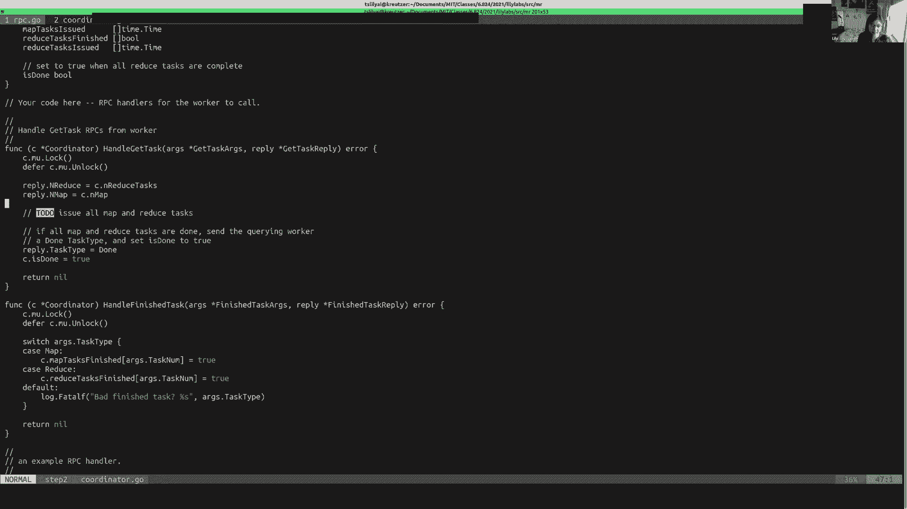

# MIT 6.824 2021 分布式系统 [中英文字幕] - P6：Lecture 6 - Lab 1 Q&A - mayf09 - BV16f4y1z7kn

好的，已经五点了，所以我就开始了。所以今天的课程是第一个实验的问答，MapReduce 实验，还有一些关于 Go 编程的通用编码问答，可能会对未来的实验有所帮助。所以你可以随时停下来。

或者在聊天中提出问题，我会偶尔检查一下，我相信其他[]也能提供帮助，如果你未静音并且正在打字，如果你静音，会很有帮助，不过，是的。好的，那么今天的议程，我要做的第一件事是，演示实验 1 的解决方案。

这是我个人的解决方案，它可能并不完美，但这是你可以做的一个例子，第二，我们将讨论一些替代的解决方案设计，还有人在打字。[]，停止打字。好的，很有帮助，第三，我们将讨论一些常见的设计错误和一些 bug 。

在你们的解决方案中，第四，一些一般性的提示，最后，如果有时间，我们会进行一些问答，你现在可能会有的问题，还有你在讲课前提交的问题。所以，首先是实验解决方案演示。

如果字体太小，请告诉我，我还是放在这里。好的，所以我基本上一步一步地，我将展示我是如何开发我的解决方案的。所以我做的第一件事是。

这是 rpc。go ，我做的第一件事就是弄清楚 API ，我想让 worker 和 coordinator 进行交流，所以我做的第一件事就是定义有哪些类型的任务。

所以这里有 Map 和 Reduce 任务，并且为了表示，coordinator 任务已完成，是 Done 任务，所以，这些都是任务的类型。你能放大一点吗，这个文件？好的，这样可以吗？好的，谢谢。酷。

是的，我很难确定它看起来是什么样子，好的，我希望这是好的。所以，我决定实现这两个 RPC ，第一个是 worker 请求 coordinator 给它一个任务。

Map Reduce 中的一个或 Done 用来退出，基本上就是这些参数，并没有参数，只是请求一个任务，coordinator 回答这是什么任务，你应该做哪种类型的任务。

还有一些 Map 或 Reduce 任务需要的额外数据，例如系统中 Map 任务的数量，或者 Reduce 任务的数量。第二个 RPC 是完成任务的 RPC 。

worker 用它来通知 coordinator ，它已经完成了任务，它将哪项任务已完成作为参数传递，它们并不需要得到回复。所以这是实现的第一步。

所以。

好的，作为第二步，我所做的是为所有这些 RPC 实现处理程序，所以这在 coordinator 中，因此，首先我必须用 coordinator 状态填充 coordinator 。

这里有一个 Mutex 保护状态的并发访问，因为 coordinator 将有多个并发运行的线程，第二部分是跟踪我们在 Map 任务所需要的文件，以及 Map 和 Reduce 任务的数量。

这些元数据被用来跟踪我们发出了哪些任务，以及哪些任务已经完成，一旦我们发布，我们会跟踪时间戳，我们知道如果这些任务没有在一定的时间内完成，就重新发布它们，最后，我们有，有所有的。

有一个 coordinator 完成的布尔值。所以，为了处理 GetTask RPC ，我们有一个处理程序，从本质上讲，它所做的是，它会设置 reply 字段，现在，我还没有实现发布任务的部分。

如果所有的 Map 和 Reduce 任务都完成了，它将发送一个 Done 任务给 worker 并退出。然后我们有 FinishedTask RPC 的处理程序，这个所做的是，它取决于是什么任务。

将那个标志设置为 true ，那个任务已经完成。这就是第二步，实现 RPC 的处理程序。

所以，我的第三步是发送 RPC 。

就是这里的工作。所以，这个最上面，我们提供的是，它启动这个循环，在每个循环中，它调用在 coordinator 中 GetTask 的处理程序，根据它获得的任务的不同。

它将使用相关数据执行 Map 任务，或需要执行 Reduce 任务的元数据，或者在 Done 的情况下，它将退出。所以这很简单，一旦它完成了这项任务。

它将发送一个 FinishedTask RPC 给 coordinator 。所以，这只是 worker 发送 RPC 的框架代码。好的，我们有 RPC ，我们有处理程序，我们有发送者。

所以现在，让我们来实现一些东西。所以在第四步中，我只是添加了大量的处理程序来管理这个中间文件。

你们中的许多人也这样做了，基本上它使用了比如 os。Rename ，它会得到一个临时文件，所以这并不太有趣。

然后，下一步，让我们实现一些 worker 的功能。

所以，我们又回到了 worker ，现在让我们实现 PerformMap 函数，这样做的目的是，你们中许多已经做的是，读取文件，将它们映射到键上，然后创建临时文件，将它们写入中间文件。

然后我们使用原子重命名，以确保映射不会冲突，在处理键和写入键时。所以这在很大程度上是从顺序实现中提取出来的，以及如何应用 Map 函数。然后，类似地，我们实现 Reduce 函数。

这里有一个 performMap 。

然后我们有一个 performReduce ，所以它所做的就是，它会获取所有中间文件，从所有 Map 任务，到这个 Reduce 任务，并对它们进行排序，排序发生在 worker 上。

因为 worker 需要，reducer 需要访问这个类型的所有键，然后对它们进行排序。对于 mapper 是没有意义的，在之前对它们进行排序，因为 mapper 只访问一些键。

然后我们对同一个键的所有值应用 reduce 函数，然后，我们将临时 reduce 文件原子重命名为最终的 reduce 文件。所以，现在我们实现的这个循环，执行任务。

我们基本上完成了 worker 的实现。

所以还剩下最后一步，这是实现，coordinator 如何告诉 worker 要做哪些任务，这可能是，你在 coordinator 中遇到的最复杂的同步问题。

所以，回到 coordinator ，所以这个状态什么都没有改变，但现在我们所做的是，我们在 coordinate 中添加了一个循环，它负责将任务发送给 worker 。当我们发布 Map 任务时。

所以首先我们想要发布所有的 Map 任务，基本上这个循环在这里所做的是，在有任务要发布之前，coordinator 只是迭代这个循环，如果我们完成了所有的 Map 任务，这将打破这个循环，然后。

如果所有 Map 任务都完成了，然后我们发布 Reduce 任务，就是这里的东西。所以，是的，我想我还有最后一步，就是我们所做的，当 maps 或 reduces ，当没有任务要发布时。

所以我们想做的是，coordinator 应该等待任务发布，一旦发生，就会出现任务发布，或者到另一个发布循环的迭代，然后发布任务。我将继续，直到所有的 Map 或 Reduce 任务完成，完成后。

我会再回来，所以让我去。

所以为了支持那个等待。

我的解决方案是使用条件变量，从本质上讲，它所做的是，如果没有 Map 任务发布，但是 mappers ，但是这里，因为我们已经分配了它们所有，我们在们它们，它们还没有超时，那么我们要做的就是等待。

因为我们不能发布 Reduce 任务，如果所有的 mappers 都没有完成，所以我们就在这里等着，一旦我们收到某种信号，我们回到这个循环的顶端，检查我们是否可以再次发布任务。同样。

如果所有 reducers 都没有完成，我们不能给 worker 发布任务，我们要等待出现某种信号，那么信号到底是什么时候出现？好的，我们想要在任何时候发出信号，无论任务完成或时间太长。

我们没有收到回复，所以可能会有失败，或者如果一个 worker 完成了一项任务，因为这可能意味着所有 Map 任务都已经完成，我们可以继续执行一项 Reduce 任务。所以，为了做到这一点，我们有的是。

我们这里有一个 goroutine ，这是当 coordinator 开始时发出的，它所做的是每隔一段时间，在一些或许每秒，当一项任务可能已经完成时，或许这是十秒，我记不清了，事实上，这并不重要。

它只是时不时地唤醒 coordinator ，所以 coordinator 会再做一次检查，查看是否有要发布的任务，所以它就这样循环着，每一秒它都会广播唤醒 coordinator 。

另一个我们想要在任务完成时发出信号，所以，这将在这个 HandleFinishedTask 中发生，当一个 worker FinishedTask 任务 RPC 完成时，所以。

在这里有一个 Broadcast ，在我们将[]设置为 Done 之后，当 coordinator 回去检查其中一个循环时，看看有没有任务要完成，它将看到更新后 Done 状态。所以这就是我的解决方案。

它使用条件变量和 Mutex 来保护 coordinator 的共享状态。所以这只是一种可能的解决方案，然后我会回到这里，这就是我采取的步骤的布局。在我继续之前，对这个解决方案，有什么问题吗？

你能更详细地说明一下条件变量吗？当然，所以，我想条件变量是，非常有用，当你想要等待特定断言或特定条件变为真时，所以在这种情况下，条件变量是自然的，让我到我用到的地方，是实现等待可用任务的自然方式。

因为这是一种特殊的条件，而且它是异步发生的，例如，有一项任务可用时，当 worker 完成一项任务时，或任务可能可用，在发生故障时，我们需要重新发布这项任务，所以你可以想到，在任何情况下。

你需要等待特定的条件，这就是条件变量非常有用的地方。这会有一点帮助吗？是的，谢谢。你也可以，比如所有这些更高级的，比如通道、条件变量，所有这些更高级的同步原语，它们都是构建在锁上的。

所以它们都是使用锁实现的，是一种，一种更高层次的思考同步的方式，这让你可以推断条件。这会有同样的效果吗，比如在那个循环里，你在 GetTask 函数中，不是使用条件变量，它使循环每秒运行一次，我想。

是的，所以，它本质上和睡眠一样，这里的超时循环，不同的是，例如，条件变量，你可能被一项已经完成的任务唤醒，在循环中，例如睡眠每秒循环一次，你必须等待一秒，而对于条件变量。

你可会在大约 10 毫秒后被唤醒，因为 worker 已经完成了一项任务，所以，它可能具有更好的灵活性。在这种情况下，我们使用，如果每项任务总是占用 5 秒左右的时间，那么，是的。

这本质上非常类似于每个循环睡眠一秒。我有个问题，我想我错过了你运行的部分，当任务请求到来时，你如何处理，但你目前没有任务要分配，你怎么告诉 worker 要么回来，还是让它们等待，一带而过地，我很好奇。

你为什么选择这种睡眠的方式，而不是收到任务请求时查看时间，比如当你收到请求时，已经超时，并重新发布它，而不是不间断的检查。是的，好的，所以，是的，所以我先问你的第一个问题。

所以我是如何处理已经完成的任务的，是一旦所有的 Map 任务完成，一旦所有 Reduce 任务都已完成，然后我们返回给 worker 的任务，因为 worker 调用的任务。

是这个额外的我称为 Done 的任务类型，然后我设置 coordinator 的 isDone 为 true ，所以在 worker 中，我现在去 worker 中，worker 中我们有这个循环。

当 worker 要求任务时，如果返回的任务是 Done 任务，它就退出。所以这就是我向 worker 传达信息的方式，它应该退出。我想我是在问，抱歉，比如你还在完成 Map 任务，你收到任务的请求。

你仍然不能给出你的 Reduce 任务，你怎么告诉 worker 呢？哦，所以，你们中的很多人都是，另一种设计是，如果没有任务给 worker 。

然后 coordinator 立即向 worker 返回回复，而 worker 在它的循环中睡眠，但你可以在这里看到，worker 循环，没有睡眠，其中的原因是。

因为这个调用会阻塞直到 coordinator 回复，在我的解决方案中，回到 coordinator ，例如，如果你查看 mapDone ，在这个解决方案中。

 coordinator 处理程序不会向那个调用返回回复，除非它有任务要返回，所以，我们是在 coordinator 那里等待，而不是在 worker 那里。所以 coordinator 就是那个。

不断地检查是否有任务和睡眠，而 worker 只是简单地阻塞在这个调用上，直到 coordinator 返回给它。在 coordinator 中这样做，有什么好处吗？所以我认为一个优势是。

并不是所有的 worker 都不断地发送 RPC ，你发送一个 RPC ，这是每个任务一个 RPC ，而如果 worker 不断地循环和睡眠，并且不断地回答，你会有更多的网络流量。好的。是的。

我认为这是，但这两种解决方案都是可行的，它们都是可工作的。太棒了。我还有一个问题，我看到你经常对锁使用 defer ，当我在做我的实现时，我意识到，我的意思是，在一个简单的函数中，它很明显。

什么时候放弃对锁的控制，但是如果你有一个从函数内部创建的 goroutine ，就不是很清楚，何时放弃控制。所以，一个 goroutine 在单独的线程上运行。

goroutine 永远不会从获取的锁开始，即使当你持有锁时，开始那个 goroutine 。好的。嗯。如果我们创建一个 goroutine ，它只会在一个线程中旋转，而且从一开始，它就不会有锁，对吗？

是的，实际上就像，你认为另一个线程，开始运行 Go 函数。嗯。好的，继续。然后 defer 在任何 return 语句解锁？是的，它推到一个，比如函数运行，有一个函数的堆栈。

比如 HandleGetTask 运行返回，所以，我在幻灯片中也有这个，所以你稍后可以看的这个，但 defer 只是确保当这个函数退出时，你使用解锁，我还可以做一些事情，比如 unlocking 。

我也可以做一些事情，比如 before the last println ，所以这些都被压到一个堆栈上，然后它们按先进先出的顺序弹出，不，是后进先出的顺序。什么 FIFO ？先入先出，不。

它们是后进先出，是的，所以这是一个堆栈，所以这将在解锁之前运行，在锁之前运行，如果你准备使用多个 defer ，注意顺序，然后使用它们，但 defer unlock 是一个非常有用的策略。

这会派上用场的。好的，那么最后一件事是，如果我们在函数内调用函数，在那里我们获得了锁，它不会返回锁，对吧，当它转到另一个函数时，另一函数返回到这个函数，然后，比如线程保持者锁，通过跳来跳去。是的。

一个函数，就像一个线程中的普通函数调用，将在锁的情况下被调用，是的。好的，谢谢。好的。好的，你们已经讨论了，一些备用的同步设计，比如在 worker 而不是在 coordinator 等待。

我们讨论了这样做的一些利弊，使用 time ，事实上，我认为已经涵盖了所有这些，可能除了通道，所以有一件事我想知道，因为对此有几个问题，所以等待 map 完成，或者我们展示的任何同步，都在一台服务器上。

所以 worker 和 coordinator 之间的跨服务器通信，它们只是通过 RPC ，例如，在 coordinator 的锁，与 worker 的锁无关，或者在不同服务器上的交互实现锁上。

不会互相干扰，我只想澄清这一点。所以我觉得有一件事会很有趣的是，为了让你看到一种使用通道的例子，因为这里也有一些问题关于使用通道。所以这是一种，不是一种完全使用通道的实现，但这是一种潜在的方式。

你可以考虑在 MapReduce 中使用通道。所以在这个例子中，到 coordinator 的输入包含一个通道，其中 coordinator 被告知哪些 worker 存在。

这是为了应对 worker 失败的可能性，然后某个客户端告诉 coordinator ，嘿，另一个 worker 加入了我们的集群，这是一个新 worker ，你可以给它分配任务，所以。

这与我们在实验中的略有不同。所以 coordinator 有两个通道，其中一个，它会发送任务给 worker ，或者它不向 worker 发送任务，将任务发送到线程，线程将向 worker 发送任务。

然后它有一个 done 通道。所以再一次，我知道我说了一些奇怪的话，你可以通过通道向 worker 发送任务，但实际上不能，通道只在你的服务器上的 coordinator 。

稍后我们再来看它是如何工作的。所以，我们创建的 coordinator 的第一个线程是 goroutine ，对于每一个 worker ，开始 issueWorkerTaskThread 。所以。

这样做的目的是，作为 worker 来来去去，因为它们失败了，然后又重启，这个通道表示，好的，我们想要，对于任何一个 worker ，启动一个将会发布这个 worker 任务的线程。

所以这里一个 goroutine ，然后 coordinator 所做的是，对于所有给出的任务，它只是将这些任务推到这个 tasks 通道，而这个 tasks 通道，我们让它是一个缓冲通道。

这样我们知道它能准确地容纳 numTask 个任务，这就是任务数量，将存在于系统中的，所以这也意味着，我们可以在不阻塞的情况下将 numTask 个任务推到通道，所以。

 coordinator 不会阻塞将任务推送到 tasks 通道。然后 coordinator 将从这个 done 通道读取，直到它完成 numTask 次，在这种情况下，它知道它已经完成了。

在这个例子中，我没有区分 map 或 reduce 任务，想象一下它们在那里，coordinator 的一些任务需要运行。一旦它知道所有的任务都完成了，它关闭 tasks 通道，然后将退出。所以。

其中一些有趣的部分是，这些 worker 任务线程，我把它们拿出来，放在这里。所以，这些都是在子 goroutine 上运行，它所做的是为了，只要 task 队列中有任务，它将拉出一项任务，然后，哦。

我不是故意的，然后调用一个 RPC ，它会将任务发送给 worker ，所以注意到，这个通道正在与 coordinator 的另一个线程交互，而那个线程是负责调用 worker 的那个线程。

然后一旦它完成了任务，它就会说已经完成了，如果它不能，如果调用失败，因为某些原因，比如它超时了，然后，这个循环所做的是，它会将该任务推回到 tasks 频道，所以。

另一个 worker 或这个线程可能会再次执行这个任务。因此，为了说明通道通信是如何工作的，所以 worker 发送任务到 tasks 通道，通过这些循环读取。

这个循环将在 coordinator 关闭信道时退出，done ，它被发送到这些发送的 worker 线程，它被原始的 coordinator 线程读取，这个 exit 等于 true 。

将会告诉 coordinator ，哦，我不需要听更多的 worker 到来或 worker 开始，所以它会导致另一个 goroutine 退出。我知道这是一个相当复杂的例子。

这也完全不是我们在实验里指定的，但是作为如何使用通道的一个例子，来实现 MapReduce 或类似 MapReduce 的东西。聊天中有一个问题，关于 exit 在代码中的哪里定义？这是个好问题。

它没有，它会跟 done 一样，它将是另一个布尔值的通道，是的，这是一个很好的发现。哦，我可以？我看到。如何将东西添加到 workers 通道，或者当你向 workers 通道添加东西时，在这种情况下。

你是怎么处理它们的？是的，所以在这种情况下，workers 通道提供给 coordinator ，想象一下，举个例子，你的 Coordinator。

是被 main 中的 MR coordinator 调用或创建的，在那个[]中，所以，我们可以想象，在 MR coordinator 中，我们会创建一个 workers 通道。

MR coordinator 将负责跟踪，什么时候 workers 崩溃，什么时候 workers 加入，所以这是一个例子，可能稍后会有新服务器添加到我们的集群中，或者某个 worker 崩溃。

然后又回来了，而 MR coordinator 会不断地发送，这些 worker id 给我们的 Coordinator ，为了告诉它，嘿，这里有一个新的 worker ，你应该给它发布任务。

这部分没有显示出来。明白了，是的，我只是在想，所以这真的很酷，我只是想在实验 1 中，我想调用 worker ，你发送 RPC 给 worker ，我们在实验 1 中可以这么做吗？这是可能的。

但这绝对不是我们让你们去做的，因为需要，不是将 coordinator 设置为 RPC 服务器，你必须在 worker 是设置 RPC 服务器，你可以认为，在这个实现中。

 call_worker 可以为每个 worker 设置处理程序，每个 worker 可以发送 task RPC 给 coordinator ，但这有点[]，所以在这个例子中，可以更自然的想象。

那个 call_worker ， coordinator 是一个客户端，而 worker 就是处理那个 RPC 的人。好的，谢谢，很酷。我有两个问题，首先，这只是一个一般性的 Go 问题，所以。

在左侧底部第二个 for 循环中，如果你不使用 i ， Go 会在 for 循环中抱怨吗？所以我运行了所有的 Go linter 以及类似的东西，我觉得这是可以的，在这种情况下，你需要 i 。

因为你是递增的，在整个过程中保持 i 的状态。你能做同样的事情，比如一个 while 循环，比如空的 for 循环加上一个 select ，在那里弹出 done 。所以，你不能，好的。

你还是需要记录一下你读了多少次 done ，因为你不能只读一次，你必须读取 numTask 次。我明白了，好的。是的，所以你需要某种类型的状态来追踪这个。然后对于右边的那个。

你从 tasks 中读取并重新添加它，这有什么不好的地方吗，如果你不断地读取和添加到同一个通道？我想不出来，所以在这种情况下，至少你不会阻塞，因为每次你读到它，你会在通道上弹出一些东西，每次你添加它。

你推送一些东西，因为我们有 tasks 是一个缓冲通道，但你永远不会阻塞这个。所以，对于性能方面，我的意思是，通道是用锁建造的，所以锁通常更轻，但我不认为，你会看到一个大的性能，做这样的事。好的，我想。

比如，抱歉，比如一个一般的问题，你是如何计算并选择，在 Mutex 和通道或混合之间，在最开始的时候。是的，所以 Mutex 对于保护一个状态来说是非常自然的。

比如你的 Coordinator 或你的 Raft 服务器有日志，我想在每次添加日志时保护，这看起来很难或很不自然，在这里尝试使用通道，因为从本质上讲，你使用通道锁，你想要确保没有其他人在修改状态。

当你修改它的时候，然后在你修改它之前，试着从通道读取，确认也没有人，好的，比如某些人必须发送东西给通道，只是表示它们已经完成，它们已经完成了这样或那样的修改。所以，在这种情况下，很难想象你如何使用通道。

Mutex 会让这个变得非常简单，通道非常方便的地方是，我认为我们的实现已经有了 apply 通道，是你必须等待的地方，在某些方面，它就像条件变量的特定实例，在这种情况下，你想要等待什么东西准备好。

或者像是一种要完成的非常具体的命令，所以，对于像发布任务这样的事情来说，是一个不错的例子，或者诸如阻塞在一个队列上，你可以把它想象成一个队列系统，或者至少我是这么想的，但是，对于共享状态的几乎所有修改。

比如竞争条件，遇到锁要简单得多，在某些方面，推理要容易得多，但是，是的。谢谢。抱歉，我有一个关于这张幻灯片的后续问题，如果，会发生什么，所以，你调用 Go issueWorkerTaskThread 。

它会启动另一个 goroutine ，我的意思是，它遍历通道中的所有任务，如果它失败了，如果 goroutine 失败了，当它位于 if call_worker 时。所以，如果它失败了。

那么我想你拿出了一个任务，没有把它放回去，其实我也不确定，这看起来像是，比如你不是，你说的是整个线程崩溃，而不是 call_worker ，不是返回失败或什么东西。是的，比如 goroutine 崩溃。

或者单个 goroutine 可能失败吗，或者整个事情都没了？嘿， Frans ，你知道吗？我认为你应该拥有的模型是，如果 goroutine 崩溃，那么进程也会崩溃。是的，这样就能解决了。抱歉。

如果只有 worker 崩溃了，然后你选择一个不同的任务，但是，如果你，我想你仍然会有相同的 worker ，比如 worker 编号，所以，你仍然连接相同的 worker ，即使它们崩溃了。是的。

所以在这种情况下，call_worker 只会继续返回 false ，这个 worker 专门的 goroutine ，我们只是继续循环，最终，当 map 。

当 coordinator 确定所有任务都已完成时，它将关闭通道，然后这个 goroutine 将退出。所以有这种可能性，如果你所有的 worker 持续崩溃，你有数以百计的 worker 加入。

你可以会在这里有很多 goroutine ，我不能联系我的 worker ，我不能联系我的 worker ，但是一旦任务完成，这一切都将正常退出。酷，好的，这是一个通道的例子，现在让我们转到一些。

你们的问题和错误之类的事情上。所以，我们看到的一些常见但通过的设计错误，是把太多的工作交给了 coordinator ，这会使 coordinator 成为瓶颈，这包括 coordinator [] 。

对结果排序或 coordinator 读取文件内容，然而， MapReduce 的许多优点在于，所有的状态，所有的计算都发生在 worker 上。还有另一个缺点，这并不是一个真正的错误。

但潜在的需要考虑的是，你要发送多少 RPC ，你是否真的需要发送那么多 RPC 。例如，发送 RPC 检查是否有可用的 Map 任务，然后发送另一个 RPC 要求给我一个任务，是有点多余的。

你想试着减少，减少 coordinator 和 worker 之间的 API ，但这些，它们通过了测试，这只是我们想指出的一些事情。所以，现在，好的，酷，我接下来的课程。所以，接下来。

比如 5 6 分钟。

我们要做的是分组会议室，让我来停止分享，好的，开始分组会议室，哦，糟糕，让我看看，我想我的 Zoom 刚刚崩溃了。我们仍然可以听到和看到你。好了，我回来了，是的，我在这节课之前升级了 Zoom 。

这不是个好主意，但是，好的，在接下来的五六分钟里，你应该讨论，你在实验中任何有趣的 bug 或观察，或者你可以抱怨你花了太长时间才找到某个漏洞，或者互相提问，然后我们会回来，讨论你们的一些问题。好的。

好的。好的，待会见。哦， [] 和 Frans 一起，你想让我重新分到别的组吗？也许是最好的，但让我看看我自己能不能做到。好的，我马上回来。

好的，我想我们差不多都回来了。好的，酷。好的，我希望这很有趣，或者至少你可以谈谈你在实验中的一些挫败感。是的，对于剩下的课程，我们要去，首先，在提问之前，给出一些一般的提示，你要在未来的实验中注意。

所以，首先，你会发现调试非常方便的一件事是，经典的 printf ，你可以使用有条件的 printf ，只有当你想 debug 时打印，所以，你不必遍历代码，把它们都注释掉，在你提交或做类似的东西之前。

所以在 Raft 实验里，我们提供了 DPrintf 在 util。go 文件中，你可以对其修改，打印出比如 server ID ，每次你调用 DPrintf 或类似的地方，所以，是的，我定制了它。

用不同的颜色来打印不同 RPC ，就像这样，还可以重定向你的输出文件，如果你需要搜索就会很方便。另一个你可能要记住的技巧是，你可以查看所有 goroutine ，看看它们在哪里运行。

只需要输入 Ctrl-\ 来做到这个。最后一个是我们已经谈到过的 defer ，这些幻灯片也将被上传，所以你可以回来参考它们，但是你可以推入多个函数，在函数返回之前运行，只是要注意它们的顺序。好的。

现在来回答你们的一些问题，你们中的许多人也提交了关于 Raft 的问题，这些会放到 Raft 的问答，或者办公时间，或者你可以把它放在 Piazza 上。我将主要集中在 MapReduce 中的那些。

或者，也许有时间，我们也可以看一些 Raft 问题。好的，第一类问题，是专门关于 MapReduce 的问题，所以，你可能需要使用 MapReduce 来执行一些更复杂的任务。

它在机器学习、数据挖掘、统计应用中被大量使用，我在这里链接到 Hadoop ，它实现了 MapReduce ，很多人使用它来运行这些类型的任务。例如，这是一个简单的，也可能不是那么简单的。

但是矩阵乘法的例子，你如何使用 MapReduce 来[]它。第二，对于 coordinator 的容错，论文提出了一种非常简单的检查点机制，你只需要启动一个新的 coordinator 。

使用最新的检查点状态，在某些方面，这是 MapReduce 非常自然的设计，因为一切都是确定性的，这里没有，coordinator 没有那么多的状态要保持，我所需要知道的是，哪些已经结束，哪些已经发生。

当然，你可以使用 Raft 来实现容错，并拥有一组 coordinator ，这些 coordinator 都同意之前的命令和当前状态，但在某些方面，这对 coordinator 来说有点过了。

对于更有状态的东西，比如键值存储或其他什么东西，使用 Raft 要自然得多。所以关于 MapReduce 的其他一些问题，shuffle 或组合器步骤，它在什么时候发生，它是做什么的。

组合就发生在 Map 函数应用之后，例如，组合特定单词的单词计数，因为有很多条目，你可以把它们组合在一起，然后将其写入中间文件，排序在 reduce 时进行。

在 reducer 读取了 map 的所有输出之后。让我们看看，是否有 MapReduce 的后继者，是的，我不是很熟悉，但你可以看看比如 Google Cloud Dataflow 。

以及其他的有向图计算，在输入流入节点的情况下，所以你可以把它想象成一张图，然后它们可能会流向其他节点，中间的节点执行 map 计算，并产生中间数据，然后发送到其他图中的 reducer 。

所以这是一种有趣的方式，是一种数据流的方式来思考 MapReduce 。我相信还会有其他的，我不知道在哪里。我知道，可能其中一个是 Spark ，我们将在后面读到。是的。

但是我喜欢用图的方式来思考 MapReduce ，因为现在我们考虑的只是两步操作，在那里，它可能是很多很多步。哦，是的，那么在实践中输入是如何划分的，通常情况下，因为输入空间是特定于应用程序的。

并且输出空间也是特定于应用的，这是要由程序员来指定，有时会有自然划分，比如做一个本地的矩阵计算，然后你想把它们组合起来，等等，或者，如果它只是一个巨大的文档或巨大的文本文件。

你可以把它分成合理大小的工作，所以应用 map 函数会[]，还取决于你的集群的大小，你有多少 worker 。还有一些关于 MapReduce 的问题，为什么 mapper 在本地保存文件。

所以在这篇论文中，这是因为在当时，网络带宽是他们的瓶颈，这就是为什么他们不使用 GFS ，他们只使用 GFS 写入，是的，写入输出文件。领导者是分布式系统所必需的吗，不一定，考虑比特币。

其他去中心化系统，其中所有节点都进行了竞争，网络中的某个随机节点或某个节点，负责提交它们，所以肯定有更平等主义的设计。哦，是的，我们的挑战是，在不同的服务器上运行 MapReduce 。

而不是我们让你在实验里所做的，所以，为了做到这一点，你需要，不是使用 sockets 来为 RPC 通信，你应该使用 TCP/IP ，正常地通过网络进行通信，你可以使用像 GFS 这样的共享文件系统。

我认为你们所有人都可以访问 Athena ，至少在麻省理工学院，ssh 到多台 Athena 机器，并使用 AFS 文件共享系统，我想 Athena 也用了，基本上。

你可以从任何机器访问你在 Athena 上的文件，同样，你也可以通过租用 AWS 实例并使用 S3 来做同样的事情。但我们没想到你会花钱来运行我们的实验。好的，有一些问题，比如通用代码设计。

所以我们也讨论了其中的一些，所以实验 1 很小，实验 2 将变得更大，尤其是当你进入后期阶段时，实验 3 和实验 4 也是一样。我个人觉得很方便的一件事是，按其用途分隔不同的代码块。

在我如何实现代码的每一步时，所以把它们分开，比如 RPC ，以及发送者和操作者，可以自由地将它们物理地分开放在不同的文件中，那不会，这对测试来说也是可以的，它可能会对你有所帮助。

不会在一个巨大的文件中有数千行代码。我个人喜欢把所有状态的定义放在一起，然后，函数是分开的，但这是我的个人喜好，将常见的代码片段分解为函数也将非常有用，例如你在 Raft 中的每个单独的 RPC 。

你需要检查过期的 term ，所以将所有的逻辑，把重置所有状态和所有东西，放到你要调用的一个函数中，将会有所帮助，因为你不想不小心忘记，重置选举定时器或重置 votedFor 或某些东西。

虽然你不应该重置选举定时器，所以不要那么做，这只是我脑海中浮现的一个例子。最后有一个好的环境，比如 autocomplete 或者能够在代码中搜索某些关键字，这样的事情会有很大帮助。

所以如果你需要任何帮助来设置这个，可以在工作时间来，或者网上有大量的教程，你可以找一个好的编辑器，但这不是必要的，绝对不是必要的，但这可能会有所帮助。然后，是的，使用 Go 减少了学生花在调试上的时间。

所以我从来没有用 C++ 实现过这些实验，但根据 Frans 的说法，Go 的一个巨大优势是它的内存管理，使用垃圾收集，你不需要处理，这里有指针，但你不必像 C++ 那样处理它们。

我不知道你们中有多少人遇到了分段错误，但我猜你们中很少人，或者它们很容易修复，这无疑使调试变得更容易，或者它们是你不需要担心的特定类型的 bug 。抱歉，我有个问题。好的。这是一个 Go 的问题。

但当你有一个可以接受的函数时，假设你有一个 appendEntries 参数，而且你也有一个 requestVote 参数，它们里面都有一个 term 变量，但当你将其传递给函数时，你怎么告诉这个函数。

比如，我想要一个结构，它有一个 term 字段，这有可能吗？所以，你定义了类型，它就像任何其他类型，当你传递到函数中时，函数需要特定类型的参数，这是类型。嗯。是的，假设我想在这两种类型之间共享一个函数。

我相信你可以使用 interface ，但我不确定。所以我试过了，但当我做 。term 时，它说我不知道这个字段，或者它不存在。我想你需要转换它，或者你需要转换，我想不起来了，但有一种方法可以强制。

你必须对它进行类型转换，到你想要访问的 struct 。比如你需要高数 Go ，这个时间，我使用这个变量，它是一种特定的类型。知道了，谢谢。所以，如果你想对多个不同类型重复使用该函数。

你可以传入一个接口，但你可能还需要传递，例如，比如某些东西来告诉它，嘿，这将是这种类型的，在使用它之前，需要将该接口转换为正确的类型。好的。我认为人们通常处理这件事的方式是。

通过在接口中放置 setter 和 getter ，你不知道它是哪种类型的，你只需使用接口访问变量。嗯。是的，我不这么认为，你不应该在 Raft 中使用很多 interface ，我不认为我使用了它。

除了已经提供的命令。是的，我想分解出常见的代码片段是很好的，除非它增加了额外的复杂性，我不会试着强迫你的类型，为了所有都能够在相同的函数上运行，它可能是相似的类型，两个略有不同的函数。或者。

如果你使用的唯一分享是 term ，你可以有相同的函数只接受 term ，在这两种情况下，都传入 struct 的 。term 。好的，还有其他代码设计问题吗？当将代码分成多个文件时。

有没有按要求命名的惯例，因为当我们做实验的时候，它是复制源文件，那么有没有什么命名约定呢？我的意思是，我会把它们放在 raft 文件夹中，但没有命名约定，你可以随意地命名你的文件。好的。

我们的评分脚本将替换任何东西，属于测试框架的任何东西，所以，配置文件或测试文件，你在里面修改的任何东西都会被抹去。嗯。在使用外部依赖时也要稍加小心，一些评分脚本，我遇到一些问题，我有外部依赖时。

比如使用一些 gitHub Go 包，但这些都是我能修好的，如果你这么做了，要小心一点。但是，是的，创建你所需要的 。go 文件。是的，所以指针和值比较，传递引用会更便宜。

因为 Go 不会复制那个 struct ，这个问题被问到，特别是为什么调用使用参数，而回复使用指针，是的，这些可能是非常大的，所以 Go 不需要复制它们，当你调用函数时，这是主要原因。

可以同时使用锁和通道吗？是的，你可以在 Raft 中同时是因为它们，所以你肯定会看到这是如何可能的。哦，是的，然后我们收到了很多关于超时的问题，所以在 MapReduce 实验里，超时时间是。

我们给 worker 任务 10 秒钟时间，但对于睡眠时间来说，可以选择其他的任何时间。对于 Raft ，你必须更仔细地选择超时，我们的测试有点敏感，但不是非常敏感，例如，你可能[]。

可能在 100 到 200 毫秒的范围内，都是可以的。是的，对选择它们来说，可能会有帮助，先想想你为什么需要等待，例如，对于 Raft ，你的领导者发送心跳，你的超时用来检测领导者停机，所以。

你想给领导者几次机会，告诉你它还活着，否则你会一直认为它已经死了，所以，根据你设置的心跳超时，或者你的心跳间隔，我认为这会给你一些指导，它每秒不可能超过十次，或者类似的东西，取决于你设定的心跳。

你会希望你的超时时间是合理的，也许可以有机会得到两到三次心跳，然后你必须随机化一些范围，因为你不想让你所有的服务器同时开始选举，要做到这一点，你可以有一个范围，可能有两到五次心跳。

在这两者之间的某个超时时间是合理的，但是对于测试，你将看到是否发送了太多的 RPC ，或者网络上传输的比特太多，随着测试在后面的实验中，你可以很容易地调整你的超时时间，它稍微依赖于实现，所以。

我不能告诉你最适合你的数字是多少，但考虑，为什么我要超时，在超时之前，我希望其他服务器获得多少 RPC ，是一个值得牢记的好的指标，希望这对超时有很大帮助。好的，是的，所以一些实现的问题。

关于 MapReduce 实验，还有一般的实验。所以，有些人实现了备份任务，这是相当酷的，我们在这个实验中绝对不需要这样做，我认为需要记住的重要一点是，论文对开始任务和重启任务做了区分。

因为一个 worker 失败了，并再次发布任务，加快滞后任务的速度，worker 并没有失败，但是你希望更快地完成任务，所以，备份任务用于落后者，当任务还没有失败时，但是速度很慢并超时，我们开始任务。

当 worker 检测到失败时。所以，在论文中，coordinator 从 worker 那里得到心跳，而在我们为你的实验提出的设计中，我们使用超时来检测 worker 可能出现失败。

同时还检测缓慢的任务，所以，在某些方面，我们没有这种区别，我们只是假设，如果在这段时间内没有完成这项任务，可能是 worker 失败了，或许它只是慢得让人抓狂，让我们重新发布它。

这就是为什么我们的实验没有提到备份任务。所以，然后，是的，所以，这又回到了困惑，下一个问题，关于同步，如果服务器位于不同的机器上，所以，服务器位于不同的计算机上，而且它们只使用 RPC 进行通信。

所有同步只是同步一台服务器上的线程，我只想再强调一次。通常的代码竞态条件，比如日志，在某些方面我认为，有人在说，什么时候使用锁，以及什么时候使用同步，所以，每当你修改文件的状态时。

比如 Raft 服务器或 coordinator ，任何时候你修改状态时，你需要加锁，你会注意到，例如，对于你的 Raft 实现中的几乎每个函数，你会有一个锁，然后在那之后。

一个 defer unlock 。你唯一需要确保你没有被锁的时候是，当你在可能阻塞的地方调用时，所以，发送 RPC ，通过通道发送一些东西，那些类型的操作，你不应该锁在那里，因为然后那个线程会被阻塞。

然后持有锁并停止服务器，服务器上的任何线程都不会取得进展。是的，然后有一些问题，有些数据竞争是良性的，例如，你可以设置 isDone 为 true ，你并不需要把对它加锁，但是竞争检测器会抱怨。

你可以使用原子[]，它具有相同的行为，先锁定后解锁，但是，即使你认为这个数据竞争是良性的，这是一种未定义的行为，所以碰巧的是，最终下一次读取，你的读取会忽略 isDone 的事实。

但下次你调用 isDone 时，它会说是 true ，然后你就好了，但从技术上讲，未定义的行为可以实现为任何东西，比如碰巧你的编译器，你的处理器会做一些合理的事情，当出现数据竞争时，所以你应该处理它们。

特别是当它们很简单的时候，而且它们对性能的影响并不是很大。另一件事是，嗯，在理论上，这种[]数据竞争，可能意味着你的进程永远不会退出，因为写入到 isDone ，将它设置为 true 。

可能会传播到正在读取的线程，无论它是否为 true ，因为它可以存储在某种缓冲区中，并且永远不会被刷新，锁确保的是，你的写入，下一个读取的 isDone ，将看到最新的写入 isDone ，并且刷新它。

从写入可以保存的可能的缓存区中。所以，是的，这只是强调，你不想要数据竞争，即使你认为它们很友好。干净的退出方法？所以，发送一个 exit RPC 从 coordinator 到 worker 。

也像引号中的 Exit ，worker 尝试发送 RPC ，socket 已经关闭，这也是可以的，大多数解决方案也是可以接受的。然后是意外的 EOF 错误，所以，你可以看到，我在这里有一个链接。

当它被客户端调用时它会显示，但这让人有点困惑，在什么时候发生，所以我不会太担心，如果有人能观察到，如果他们在一个非常奇怪的时刻得到这个错误，然后我们可以调查一下，但我认为这对你的实现是非常具体的。

所以我必须专门看一下，我们有一堆问题是关于它的。是的，我想这就是出现的大多数问题，我想现在如果你有任何关于 Go MapReduce 的问题，或者如果你想向工作人员询问实验的情况。

我有一个关于干净退出方式的问题。所以你说 Exit RPC ，我只是想知道有没有，是否有这种情况，worker 出于某种原因需要很长时间才能到达服务器，服务器如何知道，比如什么时候关闭。

因为 coordinator 在某个时候关闭，当它说 done ， done 返回 true 时，它关闭，停止回复 worker ，它如何决定什么时候这样做，如果它在等待 worker 自己关闭。哦。

所以在这种情况下， coordinator 不会，哦，我想，所以发送可能是个错误的词，coordinator 不是在等待 worker 回复，coordinator 没有回复 worker 的请求。

比如任务已经完成，请退出，worker 不是，coordinator 根本不是在等待 worker ，所以，在这种情况下，coordinator 仍然可以在 worker 之前退出。

并让 worker ，出现套接字断开错误并退出。是的，我想我的问题是，如果我可以的话，coordinator 回复 worker ，可能在请求任务，但如果 worker 关机会发生什么，或者抱歉。

 coordinator 关闭，在它从 worker 获得 RPC 之前。哦，那么下一次 worker 试图联系 coordinator 时，worker 将看到连接已关闭，然后退出。嗯。

这是我们能得到的最干净的关闭了。基本上，我的意思是你可以想象，您可以将 worker 设置为 RPC 服务器，然后 coordinator 会发送这些，比如请退出。

coordinator 必须等待 worker 退出，但它不是，看起来你不会从中得到任何效用。谢谢。嗯。Kat ，我看到你举手了。是的，我想知道的是，对于未来的实验室，我们允许有更多的文件。

我认为在 MapReduce 实验中，我们只有三个，它并没有读到像这样的东西，嘿，你应该把你所有的东西都放在一个里面。哦，是的，你肯定可以添加更多的文件，我会鼓励你那样做，我们有没有说过这个。

关于 MapReduce ，我不记得有没有。你说你不能编辑其他任何主文件，它就像是。是的，你不能编辑[]，是的。好的，我理解错了，谢谢，这让我感觉好多了。是的，但是带上你的代码肯定是有用的。

我有一个关于良性数据竞争的问题，我想是这样的，因为有时候比如 Raft ，你只需要读取 Raft 服务器的当前状态，为什么多个线程写入和一个读取，那么为什么对同一变量的读取和写入，最终导致未定义的行为。

因为它在写入之前或之后读取。所以，有一件事可能会发生，大多数处理器不会这样做，但是，每次你有一个，比如，任何线程都可以在单独的核心上运行，每个核心都有一个缓冲区，对于它读取或写入的数据，或者写入。

我想是一个存储缓冲区，所以，例如线程 1 可以向状态写入一个值，线程 2 可以尝试读取它，或者多个线程可以写入，线程 1 没有使用锁，锁会刷新缓冲区，而没有锁，这个写入会永远停留在线程 1 的存储。

而读取将永远不会返回更新值，这种行为在实践中并不经常发生，但这是一种允许的行为，因为你拥有的并不多。抱歉，如果写操作有锁会发生什么，但是读取没有，比如，读取总是需要锁吗？是的，因为，我想是的。

我用谷歌搜索了一下，人们会想，是的，不要尝试无锁共享数据，但我真的不明白为什么这会是个问题。所以，它是。你可能会。继续。你可能做一些假设事情是 true 的事情，然后当你读取时，它还不是 true 。

这里可能有多个事情，这就是你为什么不对读取加锁。所以你能避免这个的机会是，如果你只读取一个字，这就是线程所做的一切，它不进行多次读取，但我认为你还是有一些问题。另一件事是，如果你读取多个数据。

比如在一个线程上，你获取锁，分配 a ，分配 b ，另一个线程，它没有获取锁，可能会看到 b 的新值，在它看到 a 的新值之前，你弄乱了顺序，所以，如果你从一个变量中读取 term 。

而领导者从另一个变量中读取，你可能会读到一对根本不存在的值，因为没有保证，当你[]具体的系统时，你需要基于平台提供的保证来构建所有内容，如果你不这么做，有各种各样奇怪的边缘情况会让你不知所措，而且。

是的。是的，所以我认为唯一能让你，比如对此进行推理，就是系统中只有一个字，你试图读写的，只要你尝试写入或读取多个数据片段，如果没有锁，你就不能对任何事情进行推理。基本上，如果你想玩这个游戏。

你必须真正理解编译器，整个[]语言和内存模型，你正在使用的处理器，比如内存一致性系统，它变得极其复杂。是的，这也是，我是说，这都是不确定的行为，所以即使它现在起作用了，比如，我可以。

有人可以编写一个新的编译器，然后整件事，就像恶魔可以从你的鼻子飞出（http：//catb。org/jargon/html/N/nasal-demons。html），比如它可以做任何事情。

如果你有数据的话，因为其他程序没有任何语义，所以我们可能导致疯狂，所以我不会冒险。好的，理解了，谢谢。所以，即使当我们读取任何东西时，比如只是读取 Raft 服务器的状态，我们还是应该对它加锁。是的。

有时候会很烦人，因为你必须，把单个读取放在 lock 和 unlock 之间，但我不确定[]。这种情况不应该经常发生，我的意思是，也许如果你想确认你仍然是领导者，如果你不退出或诸如此类的，但是，是的。

我不是，你是不是用原子布尔型表示杀死状态，你可以使用[]，在访问它之前和之后，加锁和解锁，但是，是的，我想在某些方面有非常粗粒度的锁，知道你是唯一访问状态的那个，将在你对实现进行推理时变得非常方便。

谢谢。我有一个关于通道的问题，所以当你制作一个通道时，它只是在两个线程之间，或者它可以在多个线程之间，但是如果你没有缓冲，它可能会永远阻塞，所以，比如，如果你想在 Raft 中做一件事。

然后你有一个选举，你有一个通道，做一些关于选举超时的事情，你需要一个缓冲通道，就是服务器数量的大小，因为你可以发送一些东西，然后它会阻塞，因为，你可以，你可以有多个像选举这样的东西。

在通道之间发送的选举信息，所以如果你想要一个没有缓冲的通道，它应该只在两个线程之间，是吗？我的意思是不需要，例如，如果两个线程是消费者，一个线程是生产者，那是。好的，但是多个生产者，我想你需要，是吗？

嗯，不需要，我的意思是，如果消费者只是，在做一个循环，并不断读取，然后所有的生产者都会，我想这取决于它们是怎么调度的，如果，最终会有人从通道上读出，所以你可以有多个生产者和一个消费者。有没有人知道。

比如 Frans ，你知道通道的顺序保证吗，是否有[]保证给你，我觉得有一个[]保证，所以我想如果你有，有点像锁，比如，你总是试图获取锁，另一个线程也试图获取锁，不能保证你会获取它。

这就是为什么在这种情况下随机化可能是必要的，我意识到，我认为这节课从技术上讲已经结束了，我现在继续在办公时间，所以如果你有问题要问，或者想继续提问，我会在那里，我想也许 Frans 。

如果你想留下来或其他人。但我现在要去办公时间了。

所以，非常感谢你们的到来。谢谢。谢谢。

哦，我能问个简单的问题吗？

是的，好的， Frans ，你现在是主持人了，我要去我的办公时间了。你的 Vim 的主题是什么？哦，方案是什么，我的配色方案。嗯。这是个好问题，我不太确定，让我检查一下。[]。抱歉？

我会输入到聊天内容中。